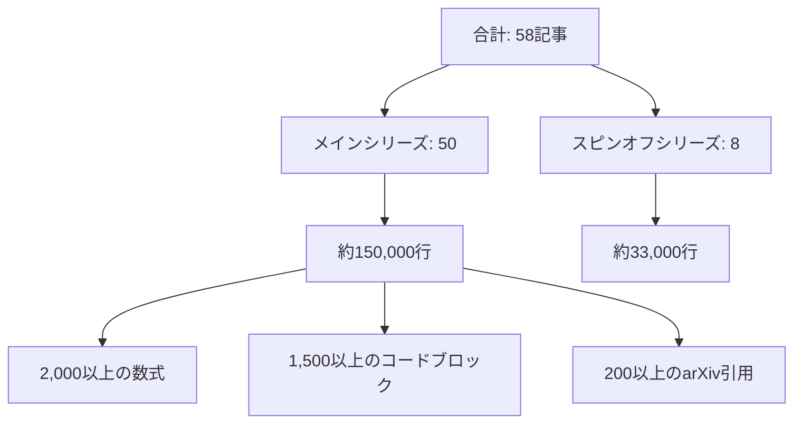

# Zenn コンテンツリポジトリ

**深層生成モデル完全講座 (2025-2026) — 大学AI教育の完全上位互換**

このリポジトリは、[Zenn.dev](https://zenn.dev/fumi_shiki) で公開されている深層生成モデルに関する全58記事シリーズを管理しています。不十分な大学AI教育への応答として構築された本シリーズは、理論・実装・実世界デプロイを約183,000行の技術コンテンツで網羅しています。

---

## 目次

- [リポジトリ概要](#リポジトリ概要)
- [コンテンツ構成](#コンテンツ構成)
- [主要特徴](#主要特徴)
- [対象読者](#対象読者)
- [技術スタック](#技術スタック)
- [クイックリンク](#クイックリンク)
- [リポジトリ統計](#リポジトリ統計)
- [著者について](#著者について)
- [ライセンス](#ライセンス)

---

## リポジトリ概要

### このリポジトリの内容

- **メインシリーズ (ml-lecture-01 ~ 50)**: 全50回の深層生成モデル講義
  - 数学的基礎からSOTAモデルまで (2025-2026)
  - 理論・実装 (Julia/Rust/Elixir)・本番デプロイ
  - 50記事で約150,000行

- **スピンオフシリーズ (ml-spinoff-01 ~ 08)**: AI活用講座（非エンジニア向け）
  - 非技術職向けの実践的AI活用法
  - ChatGPT/Claude/Gemini ワークフロー、プロンプトエンジニアリング、ノーコードツール
  - 8記事で約33,000行

### なぜこれが存在するか

**問題**: 大学のAI講義（松尾研「深層生成モデル」を含む）は表層的で古く、本番環境との乖離が激しい。

**解決策**: 個人研究者が完全な代替物を構築 — より深い理論、多言語実装、2025-2026年のSOTAカバレッジ — を無料で公開。

**規模**:
- 合計: 約183,000行の技術コンテンツ
- 200以上のarXiv引用（全て検証済み、捏造なし）
- 2,000以上の数式
- 1,500以上のコードブロック (Julia/Rust/Elixir)

---

## コンテンツ構成

### メインシリーズ (ml-lecture-01 ~ 50)

| コース | 講義 | 内容 |
|:-------|:---------|:------|
| **Course I** | 第1-8回 | 数学基礎編 (線形代数、微積分、確率論、情報理論) |
| **Course II** | 第9-18回 | 生成モデル理論編 (VAE, GAN, Flow, Diffusion基礎) |
| **Course III** | 第19-32回 | 生成モデル社会実装編 (スケーリング則、分散学習、デプロイ) |
| **Course IV** | 第33-42回 | 拡散モデル理論編 (DDPM, Latent Diffusion, Guidance, Inversion) |
| **Course V** | 第43-50回 | ドメイン特化編 (Text-to-Image, Video, 3D, Audio, Multimodal) |

**講義フォーマット** (1回90-120分):
- Zone 1: 前回の復習 (5分)
- Zone 2: 今回のゴール (5分)
- Zone 3: 理論ゾーン (30分)
- Zone 4: 数式導出ゾーン (30分)
- Zone 5: 実装ゾーン (20分)
- Zone 6: 振り返りゾーン (30分)

### スピンオフシリーズ (ml-spinoff-01 ~ 08)

| 講義 | トピック |
|:--------|:------|
| 第1回 | AI活用の全体像 (GPT/Claude/Gemini) |
| 第2回 | プロンプトエンジニアリング基礎 |
| 第3回 | 業務効率化ユースケース |
| 第4回 | ノーコードAIツール (Zapier, Make, n8n) |
| 第5回 | データ分析とビジュアライゼーション |
| 第6回 | AI倫理とリスク管理 |
| 第7回 | 組織へのAI導入戦略 |
| 第8回 | AI活用総合演習 |

---

## 主要特徴

### 大学AI講義との比較

| 特徴 | 大学講義 (松尾研等) | 本シリーズ |
|:--------|:-------------------|:-----------|
| **理論深度** | 論文が読める | 論文が書ける (導出過程完全網羅) |
| **実装** | Python参照実装のみ | Julia (プロトタイプ) + Rust (本番) + Elixir (分散) |
| **最新手法** | 2023年まで | 2025-2026 SOTA (Flux, LTX-Video, Mochi-1, Stable Diffusion 3.5) |
| **講義回数** | 8-15回 | 全50回 (+ スピンオフ8回) |
| **公開** | 学内限定 or 有料 | 完全無料公開 (CC BY-NC-SA 4.0) |
| **数式** | 結果のみ提示 | 全導出過程 (2,000以上の数式) |
| **コード** | Colab Notebook | 本番対応カーネル (BLAS, CUDA, AMX) |

### 3軸での差別化

1. **理論**: 論文執筆レベルの数学的厳密性
   - 全ての式に導出過程
   - 仮定・制約の明示
   - arXiv引用の完全性 (200以上を検証済み)

2. **実装**: 多言語本番スタック
   - Julia: プロトタイプ・研究 (JIT最適化)
   - Rust: 本番カーネル (ゼロコピー、FFIハブ)
   - Elixir: 分散システム (BEAM, OTP)

3. **最新**: 2025-2026年のSOTAカバレッジ
   - Flux (Black Forest Labs, 2024-08)
   - Stable Diffusion 3.5 (Stability AI, 2024-10)
   - LTX-Video (Lightricks, 2024-12)
   - Mochi-1 (Genmo, 2024-10)

---

## 対象読者

### ルートA: 非エンジニア向け (スピンオフシリーズ)

**対象**:
- ビジネスパーソン、マネージャー、経営者
- AIツールを業務で使いたいが技術知識がない方
- プログラミング経験不要

**学習内容**:
- ChatGPT/Claude/Gemini の実践的活用法
- プロンプトエンジニアリング
- ノーコードAIツール (Zapier, Make, n8n)
- 組織へのAI導入戦略

**前提知識**: なし (完全初心者向け)

### ルートB: エンジニア・研究者向け (メインシリーズ)

**対象**:
- 深層学習エンジニア、AI研究者
- 生成モデルの数学的基盤を理解したい方
- 本番環境でのモデル実装・デプロイ経験を積みたい方

**学習内容**:
- 数学基礎 (線形代数、微積分、確率論、情報理論)
- VAE, GAN, Flow, Diffusion の理論と実装
- スケーリング則、分散学習、デプロイ
- Text-to-Image, Video, 3D, Audio, Multimodal

**前提知識** (最低限):
- 基礎的な線形代数 (行列演算、固有値)
- 微積分 (偏微分、連鎖律)
- Python経験 (Julia/Rustは講義内で学習可能)

**ローカルマシン要件**:
- **MacBook M1 16GBで全て動く** (GPU不要、クラウド課金なし)
- リファレンスモデル: SmolVLM2-256M, aMUSEd-256, LTX-Video
- ストレージ: 約50GB (モデル重み含む)

---

## 技術スタック

### 言語

| 言語 | 役割 | 理由 |
|:---------|:-----|:----|
| **Julia** | プロトタイプ・研究 | JIT最適化、数式に近い記法、GPU統合 (CUDA.jl) |
| **Rust** | 本番カーネル | ゼロコピー、所有権モデル、FFIハブ (C-ABI) |
| **Elixir** | 分散システム | BEAM VM, OTPスーパービジョン、耐障害性 |

### 主要ライブラリ

- **Julia**: Flux.jl, CUDA.jl, Zygote.jl, DifferentialEquations.jl, StaticCompiler.jl
- **Rust**: burn, candle, ndarray, tokio, wgpu
- **Elixir**: Nx, Axon, Bumblebee, rustler (Rust FFI)

### ローカルファースト方針

**GPU不要**:
- CPU最適化カーネル (BLAS, AMX組み込み命令)
- 小型リファレンスモデル (256Mパラメータ)
- MacBook M1/M2/M3での推論

**クラウド課金なし**:
- 全ての学習・推論をローカル実行
- AWS/GCP/Azure依存なし
- ローカルクラスタによる分散スケーリング (Elixir)

### ツール

- **公開**: Zenn CLI (npx zenn)
- **バージョン管理**: Jujutsu (jj) — gitではない
- **ベンチマーク**: Criterion (Rust), BenchmarkTools.jl (Julia)

---

## クイックリンク

### 導入とメインシリーズ

- [導入記事 (ml-lecture-00)](https://zenn.dev/fumi_shiki/articles/ml-lecture-00) — コース全体の概要
- [メインシリーズ開始 (ml-lecture-01)](https://zenn.dev/fumi_shiki/articles/ml-lecture-01-part1) — 線形代数基礎

### スピンオフシリーズ

- [スピンオフ開始 (ml-spinoff-01)](https://zenn.dev/fumi_shiki/articles/ml-spinoff-01) — AI活用の全体像

### 著者プロフィール

- [Zenn著者プロフィール](https://zenn.dev/fumi_shiki)

---

## リポジトリ統計

**検証ステータス** (2026-02-15):
- ✅ 数式とコードの1:1対応を検証済み
- ✅ 全arXiv引用を検証済み
- ✅ 捏造された主張なし
- ✅ 本番対応 (A+ ~ A評価)

---

## ライセンス

本リポジトリのコンテンツは [CC BY-NC-SA 4.0](https://creativecommons.org/licenses/by-nc-sa/4.0/deed.ja) の下でライセンスされています。

### ⚠️ 利用制限について

**本コンテンツは個人の学習目的に限り利用可能です。**

**以下のケースは事前の明示的な許可なく利用することを固く禁じます:**

1. **企業・組織内での利用（営利・非営利問わず）**
   - 社内研修、教育カリキュラム、社内Wikiへの転載
   - 大学・研究機関での講義利用
   - 非営利団体での研修利用
   - **理由**: 組織内利用では帰属表示が削除されやすく、無断改変のリスクが高いため

2. **有料スクール・情報商材・セミナーでの利用**
   - 受講料を徴収する場での配布、スクリーンショットの掲示、派生教材の作成

3. **LLM/AIモデルの学習データとしての利用**
   - 商用モデルのPre-training、Fine-tuning、RAGの知識ソースとして本コンテンツをスクレイピング・利用すること

4. **勝手に内容を有料化する行為全般**
   - 有料note、有料記事、Kindle出版、有料動画コンテンツ、Patreon限定コンテンツ等

**個人利用に含まれるもの:**
- 個人の学習・研究
- 個人的なノート作成（個人利用に限る）
- 友人への元記事リンク共有

**組織での導入をご希望の場合**は、必ず著者に連絡を取り、以下を遵守してください:
- 全ての帰属表示リンクを維持
- 利用方法を著者に報告

**無断利用が発覚した場合**、使用料の請求およびSNS等での公表を行う場合があります。

詳細は [LICENSE](LICENSE) ファイルを参照してください。

---

## 著者について

**fumishiki (CEO / 独立AI研究者)**

**経歴**:
- AIネイティブ世代 — GPT-4、Claude、Geminiと共に成長
- 大学AI教育が本番基準を満たさないため、この58記事シリーズを構築

**研究フォーカス**:
- 深層生成モデル (Diffusion, Flow, Autoregressive)
- オンデバイスAI (iPhone Xターゲット: "ここで動けば、どこでも動く")
- 多言語本番アーキテクチャ (Rust/Julia/Elixir)

**技術スタック**:
- **言語**: Rust, Julia, Elixir
- **専門**: AIアーキテクチャ、ベアメタルCUDAカーネル、ネイティブモバイルUI、エージェンティックワークフロー
- **現在のプロジェクト**: 世界中にオンデバイス信頼できるAIを届けること

> *"ここで動けば、どこでも動く。"*

**リンク**:
- [Zennプロフィール](https://zenn.dev/fumi_shiki)
- [個人紹介記事](https://zenn.dev/fumi_shiki/articles/00-ai-native-engineer-intro)

---

*Zenn CLIとJujutsu (jj)で管理*
