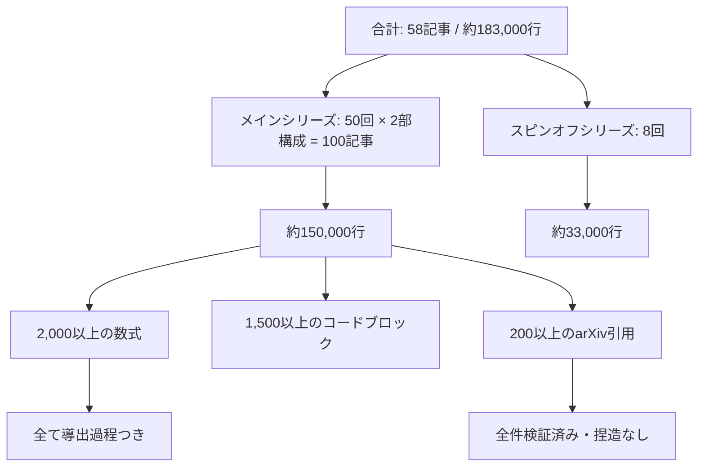

# deep-generative-models-ja

**深層生成モデル完全講座 — 大学AI教育の完全上位互換 / 全58記事・無料公開 (2025–2026)**

```
松尾研「深層生成モデル」の到達点: DDPM（2020年）
本シリーズの到達点:              Flow Matching / DiT / Consistency Models / World Models（2025–2026 SOTA）
```

数式を一行一行導出し、Julia + Rust で実装する。全て無料。MacBook M1 16GB で完結する。

→ **[導入記事: なぜこれを作ったか](https://zenn.dev/fumi_shigi/articles/ml-lecture-00)**
→ **[第1回から読み始める](https://zenn.dev/fumi_shigi/articles/ml-lecture-01-part1)**
→ **[著者自己紹介](https://zenn.dev/fumi_shigi/articles/airesearcher)**

---

## 目次

- [リポジトリ概要](#リポジトリ概要)
- [コンテンツ構成](#コンテンツ構成)
- [主要特徴](#主要特徴)
- [対象読者](#対象読者)
- [技術スタック](#技術スタック)
- [クイックリンク](#クイックリンク)
- [リポジトリ統計](#リポジトリ統計)
- [著者について](#著者について)
- [ライセンス](#ライセンス)

---

## リポジトリ概要

### シリーズ構成

- **メインシリーズ (ml-lecture-01 ~ 50)**: 全50回の深層生成モデル講義
  - 数学的基礎（線形代数・確率論・測度論・情報理論）から、生成モデルの理論（VAE・GAN・Diffusion・Flow Matching）、社会実装（MLOps・RAG・エージェント）、最前線（DiT・Consistency Models・World Models）まで一本で貫く
  - 各回は前編（理論・数式導出）と後編（実装）の2記事構成。合計100記事・約150,000行
  - 数式はすべて仮定から結論まで一行一行導出する。「直感的に理解しましょう」で飛ばさない
  - 実装はJulia（プロトタイプ）とRust（本番）で書く。Colabに貼り付けて実行するだけのコードではない

- **スピンオフシリーズ (ml-spinoff-01 ~ 08)**: AI活用講座（非エンジニア向け・全8回）
  - プログラミング不要。ChatGPT/Claude/Gemini を業務で使いこなすための実践講座
  - プロンプトエンジニアリング、ノーコードツール（Zapier, Make, n8n）、データ分析、AI倫理、組織導入戦略まで
  - 約33,000行

### なぜこれが存在するか

**問題の構造**: 大学のAI講義が遅れる理由は「査読至上主義」にある。GPT-4もLLaMAもAlphaFoldも、arXiv投稿の瞬間から世界が議論し実装した。だが大学は「査読が通っていないから扱わない」という姿勢を崩さない。結果として構造的に3〜6年遅れる。

松尾研「深層生成モデル」2026年Springのシラバスはその典型だ。到達点はDDPM/Score-based（2020〜2021年）。Flow Matching（2022年）、Consistency Models（2023年）、DiT（2023年）はゼロ。Stability AIがFlow MatchingでSD3を出荷し、SoraがDiTで動く2026年に、6年前の論文が日本最高峰の到達点だ。さらに数式の導出はなく、実装もない。概念の説明だけだ。

**この問題を無視できない理由**: のべ55,000人がこの講座を受けた。55,000人が、産業の現場で使われていない手法を「最新」として学んだ。受講料¥33,000、抽選制。MITはOpenCourseWareで全講義を無料公開し、StanfordはCS231nをYouTubeで世界に流している。国立大学の研究室が税金で開発した教材を有料かつ限定で配っている。

**解決策**: 個人研究者が完全な代替を構築して無料公開する。より深い理論（全導出過程）、多言語実装（Julia/Rust/Elixir）、2025-2026年のSOTAカバレッジ。GPUクラスタも¥33,000も抽選も要らない。

**規模**:
- 合計: 約183,000行の技術コンテンツ
- 200以上のarXiv引用（全件検証済み、捏造なし）
- 2,000以上の数式（全て導出過程つき）
- 1,500以上のコードブロック (Julia/Rust/Elixir)

---

## コンテンツ構成

### メインシリーズ (ml-lecture-01 ~ 50)

| コース | 講義回 | テーマ | 主要トピック |
|:-------|:-------|:------|:------------|
| Course I | 第1-8回 | 数学基礎 | 線形代数 I/II（SVD・行列微分）、確率論・統計学、測度論・確率過程（Itô積分・SDE）、情報理論・最適化（KL・Fisher情報）、最尤推定、潜在変数モデル・EM算法 |
| Course II | 第9-18回 | 生成モデル理論 | NN基礎・変分推論・ELBO、VAE、最適輸送理論、GAN（基礎〜StyleGAN）、自己回帰モデル、Attention機構、Sparse Attention・線形注意、SSM/Mamba、Mamba発展・ハイブリッドアーキテクチャ |
| Course III | 第19-32回 | 社会実装 | 環境構築・FFI・分散基盤、フルスタック実装、データサイエンス・HuggingFace、マルチモーダル、Fine-tuning・PEFT（LoRA）、統計学・因果推論、推論最適化、評価パイプライン、プロンプトエンジニアリング、RAG、エージェント、MLOps、Production統合 |
| Course IV | 第33-42回 | 拡散モデル理論 | Normalizing Flows、DDPM・サンプリング、SDE/ODE・確率過程論、Flow Matching・生成モデル統一理論、Latent Diffusion Models、Consistency Models・高速生成、World Models・環境シミュレータ、Course IV総括 |
| Course V | 第43-50回 | ドメイン特化 | DiT・高速生成、音声生成、Video生成、3D生成・Neural Rendering、モーション・4D生成・Diffusion Policy、科学・分子生成（AI for Science）、マルチモーダル統合・推論時スケーリング、フロンティア総括・卒業制作 |

**各回フォーマット** (前編・後編の2部構成、合計90〜120分相当):

- **前編（理論編）**
  - Zone 1: 前回の復習と今回のゴール提示（「何ができるようになるか」を最初に示す）
  - Zone 2: 理論ゾーン（直感・背景・動機）
  - Zone 3: 数式導出ゾーン（仮定→展開→結論を一行ずつ追う）

- **後編（実装編）**
  - Zone 4: 実装ゾーン（Julia でプロトタイプ → Rust で本番品質へ）
  - Zone 5: 本番コードへの接続（実際のパイプラインとの繋ぎ方）
  - Zone 6: 振り返りと次回への接続

### スピンオフシリーズ (ml-spinoff-01 ~ 08)

エンジニアリング知識ゼロから始める全8回。AI活用の全体像（GPT/Claude/Gemini の使い分け）、プロンプトエンジニアリング、業務効率化ユースケース、ノーコードAIツール（Zapier/Make/n8n）、データ分析・ビジュアライゼーション、AI倫理・リスク管理、組織へのAI導入戦略、総合演習。

---

## 主要特徴

### 大学AI講義との比較

| 特徴 | 大学講義（松尾研等） | 本シリーズ |
|:--------|:-------------------|:-----------|
| 理論深度 | 概念説明・結果のみ提示 | 全導出過程（2,000以上の数式） |
| 数式 | ほぼなし。「直感的に理解」で飛ばす | 仮定・制約・近似・証明を完全網羅 |
| 実装 | Python参照実装のみ（またはなし） | Julia（プロトタイプ）+ Rust（本番）+ Elixir（分散） |
| 最新手法 | DDPM/2020年が到達点 | 2025-2026 SOTA（Flow Matching, DiT, Consistency Models, Flux, LTX-Video） |
| 講義規模 | 全8回 | 全50回（+ スピンオフ8回） |
| 公開形態 | 学内限定 or 有料（¥33,000・抽選制） | 完全無料（CC BY-NC-SA 4.0） |
| 実行環境 | Google Colab依存 | MacBook M1 16GB で完結（GPU・クラウド不要） |
| 到達点 | 「論文が読める」 | 「論文を読んで1週間で実装・デプロイできる」 |

### 3軸での差別化

**① 理論: 論文執筆レベルの数学的厳密性**

全ての式に導出過程がある。結果だけ貼り付けない。ELBOがなぜ成立するか、拡散過程のSDEがスコア関数とどう繋がるか、Flow Matchingの確率経路がなぜ最適輸送と等価なのか——すべて仮定から一行ずつ追える。

- 仮定・制約・近似の明示（「だいたいこうなります」は書かない）
- 定義から始めて証明で終わる構成
- 200以上のarXiv引用（全件検証済み、捏造なし）

**② 実装: 多言語本番スタック**

「理論を学んだ」と「動くコードが書ける」は別の能力だ。VAEのELBOをNumPyでゼロから再現できるか。逆微分の計算グラフで何が起きているか説明できるか。本シリーズは理論の直後に実装が来る。

- Julia: プロトタイプ・研究（JIT最適化、数式に近い記法、CUDA.jl）
- Rust: 本番カーネル（ゼロコピー、所有権モデル、C-ABI FFIハブ）
- Elixir: 分散システム（BEAM VM、OTPスーパービジョン、耐障害性）

**③ 最新: 2025-2026年のSOTAカバレッジ**

産業の現場で動いているモデルまで到達する。

- Flow Matching（Lipman et al., 2022） — SD3・Fluxの基盤
- Stable Diffusion 3 / Flux（Black Forest Labs, 2024）
- DiT（Peebles & Xie, 2022） — Soraの基盤アーキテクチャ
- Consistency Models（Song et al., 2023） — 1〜4ステップ生成
- LTX-Video（Lightricks, 2024）、Mochi-1（Genmo, 2024）
- World Models、AI for Science（分子生成・タンパク質設計）

---

## 対象読者

### ルートA: 非エンジニア向け（スピンオフシリーズ）

**対象**: ビジネスパーソン、マネージャー、経営者。AIツールを業務で使いたいがプログラミング経験がない方。

**前提知識**: なし（完全初心者向け）

**到達点**:
- ChatGPT/Claude/Gemini の使い分けと実践的なプロンプト設計
- Zapier/Make/n8n を使ったノーコードAIワークフローの自動化
- データ分析・ダッシュボード構築（コードなし）
- 自社・自チームへのAI導入戦略の立案と実行

### ルートB: エンジニア・研究者向け（メインシリーズ）

**対象**: 深層学習エンジニア、AI研究者、生成モデルの数学的基盤を理解したい方、本番環境でのモデル実装・デプロイ経験を積みたい方。大学の講義で「なんとなくわかった気になった」が、実装できない・論文が書けないと感じている方。

**前提知識**（最低限）:
- 基礎的な線形代数（行列演算、固有値）
- 微積分（偏微分、連鎖律）
- Pythonの基本的な読み書き（Julia/Rustは Course I・III 内で習得可能）

**到達点**:
- arXiv論文を読んで1週間以内に実装・デプロイできる力
- 数式から本番コードまでの一気通貫した理解
- Flow Matching・DiT・Consistency Models・World Modelsの完全な理論と実装
- MacBook M1 16GBで推論・ファインチューニングが完結するローカル実行環境の構築

**ローカルマシン要件**:
- MacBook M1/M2/M3 16GB で全て動く（GPUクラスタ不要、AWS/GCP/Azure不要）
- リファレンスモデル: SmolVLM2-256M, aMUSEd-256, LTX-Video（軽量版）
- ストレージ: 約50GB（モデル重み含む）

---

## 技術スタック

### 言語選定の理由

| 言語 | 役割 | 採用理由 |
|:---------|:-----|:----|
| Julia | プロトタイプ・研究 | JIT最適化、数式に近い記法（Σ・∇を直接書ける）、CUDA.jl による GPU統合、Zygote.jl による自動微分 |
| Rust | 本番カーネル | ゼロコピー、所有権モデルによるメモリ安全性、C-ABI FFIハブとして Julia/Elixir と接続、wgpu による GPU抽象化 |
| Elixir | 分散システム | BEAM VM の軽量プロセスモデル（100万プロセス）、OTPスーパービジョンによる耐障害性、Rustler による Rust FFI、Nx/Bumblebee による ML推論 |

Pythonは Course I の補助ツールとして使う。Course II 以降は Julia + Rust に移行する。「Pythonでしか書けない」は本番エンジニアとして限界がある。

### 主要ライブラリ

- **Julia**: Flux.jl, CUDA.jl, Zygote.jl, DifferentialEquations.jl, StaticCompiler.jl, Plots.jl
- **Rust**: burn, candle, ndarray, tokio, wgpu, rayon, serde
- **Elixir**: Nx, Axon, Bumblebee, Rustler, Phoenix（サービング用）

### ローカルファースト方針

GPU不要・クラウド課金なしを徹底する。ELBOの導出は30万パラメータでも10億パラメータでも同じ数式だ。「GPUがないから学べない」は規模と構造の混同だ。理論を理解するために必要なのはGPUではなく、正確な数式と動くコードだ。

- CPU最適化カーネル（BLAS, AMX組み込み命令）で M1/M2/M3 を最大活用
- 小型リファレンスモデル（256M〜1Bパラメータ）で理論を動かして検証
- MacBook M1/M2/M3 での推論・LoRAファインチューニング
- 分散スケーリングが必要な場合はローカルクラスタ（Elixir/OTP）

### ツール

- **公開**: Zenn CLI (`npx zenn`) — プレビュー・デプロイ
- **バージョン管理**: Jujutsu (`jj`) — Git ではない。コミットグラフが直感的で、コンフリクト解消が優れている
- **ベンチマーク**: Criterion.rs (Rust), BenchmarkTools.jl (Julia)
- **数式**: KaTeX（Zennネイティブ）+ ローカルでの LaTeX 確認

---

## クイックリンク

### メインシリーズ

- [導入記事 (ml-lecture-00)](https://zenn.dev/fumi_shigi/articles/ml-lecture-00) — コース全体の概要・松尾研との比較・なぜこれを作ったか
- [第1回 前編 (ml-lecture-01-part1)](https://zenn.dev/fumi_shigi/articles/ml-lecture-01-part1) — 概論・数式と論文の読み方（理論編）
- [第1回 後編 (ml-lecture-01-part2)](https://zenn.dev/fumi_shigi/articles/ml-lecture-01-part2) — 概論・数式と論文の読み方（実装編）

### スピンオフシリーズ

- [第1回 (ml-spinoff-01)](https://zenn.dev/fumi_shigi/articles/ml-spinoff-01) — AI活用の全体像（GPT/Claude/Gemini）

### 著者

- [Zenn著者プロフィール](https://zenn.dev/fumi_shigi)
- [自己紹介記事](https://zenn.dev/fumi_shigi/articles/airesearcher)
- [GitHub](https://github.com/fumishiki) — 先行公開・実装コード

---

## リポジトリ統計



**検証ステータス** (2026-02-19):
- ✅ 数式とコードの1:1対応を検証済み
- ✅ 全arXiv引用を検証済み（捏造なし）
- ✅ MacBook M1 16GB での動作確認済み
- ✅ 全コードブロックは実行可能（コピペ不動作なし）

---

## ライセンス

本リポジトリのコンテンツは [CC BY-NC-SA 4.0](https://creativecommons.org/licenses/by-nc-sa/4.0/deed.ja) の下でライセンスされています。

### ⚠️ 利用制限

**個人の学習目的に限り利用可能。以下は事前の明示的な許可なく禁止:**

1. **企業・組織内での利用（営利・非営利問わず）**
   - 社内研修、教育カリキュラム、社内Wikiへの転載
   - 大学・研究機関での講義利用、非営利団体での研修利用
   - 理由: 組織内利用では帰属表示が削除されやすく、無断改変のリスクが高い

2. **有料コンテンツへの転用**
   - 有料スクール・情報商材・セミナーでの配布
   - 有料note・Kindle出版・有料動画コンテンツ等

3. **LLM/AIモデルの学習データとしての利用**
   - 商用モデルのPre-training、Fine-tuning、RAGの知識ソースとしてのスクレイピング・利用

**個人利用に含まれるもの**: 個人の学習・研究、個人的なノート作成（個人利用に限る）、元記事URLの共有

**組織での導入をご希望の場合**は著者に連絡し、全ての帰属表示リンクの維持と利用方法の報告を遵守してください。無断利用が発覚した場合、使用料の請求およびSNS等での公表を行う場合があります。

詳細は [LICENSE](LICENSE) ファイルを参照してください。

---

## 著者について

**fumishiki — 独立AI研究者 / CEO**

大学AI教育が本番基準を満たさないことへの応答として、この58記事シリーズを個人で構築した。arXivとGitHubがある今、個人が大学を超えることは可能だ。本シリーズはその実証でもある。

**研究フォーカス**:
- 深層生成モデル（Diffusion, Flow Matching, Autoregressive, World Models）
- オンデバイスAI（"ここで動けば、どこでも動く" — iPhone Xをターゲットに設計）
- 多言語本番アーキテクチャ（Rust / Julia / Elixir）の実用化

**技術スタック**:
- 言語: Rust, Julia, Elixir
- 専門: AIアーキテクチャ設計、ベアメタルCUDAカーネル、ネイティブモバイルUI、エージェンティックワークフロー
- 現在のプロジェクト: 世界中にオンデバイス・信頼できるAIを届けること

> *"ここで動けば、どこでも動く。"*

**リンク**:
- [Zennプロフィール](https://zenn.dev/fumi_shigi)
- [自己紹介記事](https://zenn.dev/fumi_shigi/articles/airesearcher)
- [GitHub](https://github.com/fumishiki)
- [X (Twitter)](https://x.com/fumishiki)

---

*Zenn CLI + Jujutsu (jj) で管理*
