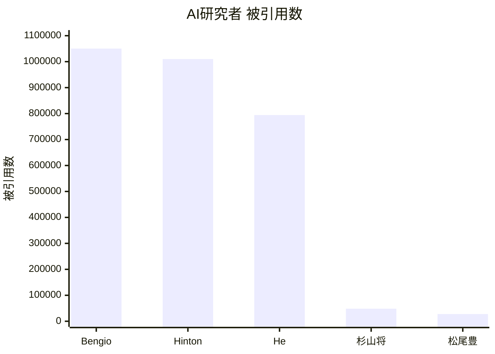

## なぜ大学のAI教育はオワコンなのか

日本の大学の機械学習の講義は、GAN（2014年）やTransformer（2017年）が到達点だ。

**あなたに関係ある話だ。**

- あなたの税金¥3,873億で、日本が出したAIはGPT-4の足元にも及ばない。中国は$560万（約8億円）でGPT-4級を作った。
- 国立大学の学費は年53万円、4年で212万円。その対価がGAN（2014年）を到達点とする講義。
- あなたの子供が「情報I」で解いているのはどのPCでも動かない疑似言語のマークシート。エストニアの7歳はコードを書いている。
- 政府は「AI人材25万人育成」と言う。その方法はマークシート。

東京大学 松尾・岩澤研究室の「深層生成モデル2026Spring」——日本最高峰の講座だ。それでも**世界の最先端から3年遅れている**。

AIの最先端は大学にはない。arXiv とGitHub にある。査読を通過して学術誌に載る頃には、世界は次の世代に進んでいる。

数字で示す。

| 国 | NeurIPS 2025 | AI特許（2024） | 生成AI特許 |
|:---|:------------|:-------------|:----------|
| 米国 | ~2,450本 | 67,773件 | 6,276件 |
| 中国 | ~2,370本 | 300,510件（60%） | 38,210件 |
| 英国 | ~500本 | — | — |
| 日本 | ~100-150本 | 26,400件（5%） | 3,409件 |

6大カンファレンス合計19,187本中、RIKEN AIP が121本（0.63%）。論文も特許も、日本は中国の1/11。

---

### 日本の大学AI教育の三つの失敗

日本の大学のAI教育は、三つの点で失敗している。

#### 1. 最新理論・学術的議論に参加できていない

大学教授の閉じたコミュニティ内で新理論が広まるのに3年かかる。その3年で、世界は次の世代に移る。

松尾研「深層生成モデル」2026年Springの全8回シラバスを見てほしい。

1. 生成モデル概要 → 2. 潜在変数モデル → 3. VAE → 4. GAN → 5. 自己回帰モデルとフローベースモデル → 6. エネルギーベースモデル → 7. スコアベースモデルと拡散モデル → 8. 拡散モデルの発展的内容

到達点は**DDPM/Score-based（2020〜2021年）**。Flow Matching（2023年）、Consistency Models（2023年）、DiT（2023年）——**全てゼロ**。

**これは日本最高峰の松尾研の、2026年の講座だ。** 一般の大学はもっとひどい。

- 筑波大学「機械学習」——到達点がGAN（2014年）。Transformer以降、存在しない。
- 慶應義塾大学「機械学習基礎」（理工学部）——最新がTransformer（2017年）。教科書の出版年が2017年。参考文献にBishop（2006年）。
- 東大「先端機械学習」——全10回で**生成モデルの講義がゼロ**。「先端」を名乗ってGNNと量子MLを教えている。

冒頭で「松尾研は3年遅れている」と書いた。**控えめすぎた。** 松尾研「深層生成モデル」の最終回はDDPM（2020年）。Stability AIがFlow MatchingでStable Diffusion 3を出荷し、OpenAIがConsistency ModelsでDALL·E 3を高速化し、SoraがDiTで動画を生成している2026年に、**6年前の論文が到達点だ。**

のべ55,000人がこの講座を受けた。**55,000人が、産業の現場で使われていない手法を「最新」として学んだ。**

「査読が通っていないから扱わない」——学術的誠実さではなく知的怠慢だ。この傲慢さが、学生を3年以上遅れた世界に閉じ込めている。

#### 2. 理論を実装で実証できていない

理論は語るが、コードは動かない。

松尾研の講義資料には数式が並ぶ。だが、その数式がどう動くのか——本番環境で、エッジデバイスで、リアルタイムで——を実装して見せるコードはない。

実装なき理論は空理空論だ。Production-readyなコードで理論を語れない教授は、理論を理解していない。個人開発者が論文を読んで翌週に実装をリリースしている時代に、大学は「理論の講義」で満足している。

例えば、本シリーズの著者は[4言語でMoE Transformerを実装し](https://github.com/fumishiki/rosetta-moe)、手動勾配導出で理論を検証し、22のベンチマークシナリオで性能を比較している。Rust（0.60ms推論）とJulia（0.99msトレーニング）で収束を確認済みだ。

実装スピードで、大学は個人開発者に負けている。

もう一つ不都合な真実。 `model.train()` を呪文のように唱えるだけで「実装できる」と言い張る研究者が、企業で「使えない」と言われる。`model.train()` の裏で何が起きているか説明できない。Hugging Face Transformersのスター数は156,000。あなたの最もcitedされた論文のcitation数はその1/1000以下だ。

数式とコードから逃げるな。 数式が読めなければ理論は理解できない。コードが書けなければ理論は検証できない。

#### 3. グローバルで後退している

##### 論文

| カンファレンス | 分野 | 採択総数 | RIKEN AIP |
|:------------|:-----|:--------|:----------|
| NeurIPS | 機械学習 | 5,290 | 46 |
| ICLR | 深層学習 | 3,704 | 29 |
| ICML | 機械学習 | 3,260 | 29 |
| CVPR | CV | 2,878 | 9 |
| AAAI | AI全般 | 3,032 | 5 |
| IJCAI | AI全般 | 1,023 | 3 |
| 合計 | — | 19,187 | 121（0.63%） |

全分野で負けている。Google 1社で175本以上——旧帝7校+早慶+東工大の10大学合計でも届かない。

##### 質: 論文数より深刻な問題



| 指標 | 世界 | 日本 |
|:-----|:-----|:-----|
| Best Paper（2020-2025、6カンファ） | MIT, Stanford, Google が常連 | 6年で1件（ICLR 2021） |
| 被引用数1位 | Bengio 1,050,275 | 杉山将 48,327（1/22） |
| 被引用数2位 | Hinton ~1,010,000 | 松尾豊 ~27,700（1/36） |
| トップ10%被引用論文 | 米中英独が上位 | 13位（イランに抜かれた） |

量が少ないのではない。**質で負けて、イランにも抜かれた**。「AI立国」を名乗る国の現在地がこれだ。

トップ10%被引用論文数は20年前の4位から2023年に13位——過去最低。論文数も2位から4位に転落。東大前総長の五神真はこう警告している。「手を打たないと10年後には世界から日本が見えなくなる」。

##### 国際競争力の崩壊

IMD世界競争力ランキングで、日本は1989-1992年に1位だった。2023年は35位（過去最低）。アジアでもシンガポール（4位）、台湾（6位）、香港（7位）、中国（21位）、韓国（28位）——すべてに負けている。

IMDアンケートで日本は64カ国中:

- 「企業の意思決定の迅速性」最下位
- 「管理職の国際経験」最下位
- 「起業家精神」63位
- 「デジタル人材の利用可能度」62位

2024年3月、JSTは緊急シンポジウムを開いた。タイトルは「激論 なぜ、我が国の論文の注目度は下がりつつあるのか、我々は何をすべきか？」。科学技術基本法に基づき5年ごとに施策を講じてきたが、「顕著な効果が表れたとは言い難い」。政府が自分で認めている。

##### 頭脳流出

日本出身で世界レベルの被引用数を持つ金出武雄（147,000+）はCMU所属。日本にはいない。優秀な研究者は日本から出ていく。日本の大学は育てた人材を輸出して自分は衰退する——**人材の貿易赤字**だ。

「日本のAI研究は世界と戦えている」——この数字の前では通用しない。

---

### 病理の根源——大学側の怠慢

日本の病理はGPUでも資本でもない。構造的な3年遅れ、試験偏重の教育、無責任構造の三つだ。

#### 構造的問題：3年遅れのサイクル

```
Year 0: arXiv に新理論が投稿される（世界の研究者が議論開始）
Year 1: 査読プロセス（大学は「未確定だから扱わない」と無視）
Year 2: 学術誌に掲載される（大学が「確定した理論」として採用開始）
Year 3: 教科書に掲載される（大学の講義資料に反映される）
Year 4: 講義で学生に教えられる（4年遅れ）
```

査読至上主義と権威への服従が思考を停止させている。GPT-4、LLaMA、AlphaFold——すべてarXiv投稿の瞬間から世界が議論し、実装し、検証した。査読を待っているから、3年遅れている。

#### 試験とプロダクトは別物

試験の点数を取る力と、コードを書いてプロダクトを作る力は全く違う。日本の教育は入試から大学院まで、一貫して前者しか測っていない。マークシートが測っているのは記憶力だ。**AIが最初に奪うのは記憶力の仕事だ。**

共通テスト「情報I」は全問マークシート。実在しない疑似言語「DNCL」で穴埋めをさせ、コードは1行も動かさない。教員の約8割が他教科と兼任。大学に入っても、スライドを見て期末試験で数式を書いてコピペレポートを出す——動くものを作る経験がない。清華大学は情報オリンピックでコードを書いて証明した人間を取る。

カリキュラムも壊れている。VAE、GAN、Diffusion、Transformerをバラバラに教え、理論的つながりを示さない。だが最新手法を無闇に追加することが答えでもない。VAEの潜在空間→VQ-VAE→Diffusionの潜在表現、Score Matching→Flow Matchingの統一——各理論がなぜ生まれ、何を解決し、次にどう繋がるか。この文脈を与えることが教育だ。

#### 学者としての信頼は地に落ちた

大学教授は「知的探究の守り手」を名乗る。だが、その実態は**知的怠慢**だ。

**arXivのTrending論文を毎朝チェックしているか？** していない。「査読が通っていないから扱わない」と言う。世界中の修士1年生が、その教授より先に論文を読んでいる。

**GitHubにコードを公開しているか？** していない。最後のコミットは半年前。論文で出したコードを、研究室の外で再現した人はいない。

**カリキュラムを更新しているか？** していない。松尾研の到達点は6年前のDDPM（2020年）。一般の大学は12年前のGAN（2014年）。

知的探究を怠り、権威に縋る。学位と所属で威張り、学生を無給労働力として使い、産業界から断絶し、世界から無視される。

**学者としての信頼は地に落ちた。**

#### 責任を取るのは学生

大学は「専門性」を語る。その実態は何か。

**松尾研の到達点はGAN（2014年）とDDPM（2020年）。** 2026年に、8〜6年前の手法を「最先端」として教えている。これが日本最高峰だ。一般の大学はもっとひどい。

**あなたが博士課程5年で学ぶのは、世界が6〜11年前に捨てた知識だ。**

博士を取っても正規雇用は**54.8%**。半数は非正規かポスドク。ポスドクの4人に1人は月給**15万円未満**。

**学費は年54万円。5年で270万円。** 自腹を切って、就職困難な学位を取り、手に入るのは社会で使い物にならない古い知識。

欧米の博士課程は月**40万円**の給与が出る。最先端の研究に給料をもらいながらアクセスできる。日本は？ **金を払って、時代遅れを学ぶ。**

同期でスタートアップに行った友人はどうか。就職して実践経験をつみ遅いカリキュラムの大学では学べなかった最先端の知識を会社の同期と磨く。2年目には年収**¥800〜1,200万円**に到達する。

**あなたは5年かけて270万円を払い、古い知識を学び、就職困難。正規雇用されても初任給は年360万。彼は2年で年800〜1,200万を稼ぎ、最新技術を扱い、市場価値を上げる。**

大学の「専門性」は終わった。それは専門性ではなく、**時代遅れの在庫処分**だ。

### 言い訳は通用しない

#### 「最先端は大学の役割じゃない」？被引用数13位で？

「大学の役割は基礎研究だ。最先端を追うのは企業の仕事だ」——そう反論する教授がいるだろう。

では聞こう。**被引用数は？**

日本の**トップ10%論文は世界13位**——過去最低。**イランに抜かれた。** 2000年代半ばは世界トップ5だった。2025年はフランスにも韓国にも抜かれた。

**基礎研究で世界から無視されている。**

**産学連携は？**

大学のライセンス収入は**米国の1/22**。企業から大学への投資は研究費の**2.5%**のみ——ドイツ13%、中国15.5%、日本は**G7最下位**。

**産業貢献もできていない。**

**大学発スタートアップは？**

5,074社が存在する。存続率は**106.8%**——米国17.7%と比べて異常に高い。なぜか。**廃業しづらいゾンビ企業だからだ。** 半数は赤字。ユニコーンは諸外国と比べて圧倒的に少ない。

**では企業の研究は？**

引用特許数トップ3は産総研（国立研究機関）、JST、東大。**大学は3位だ。** 研究者の60%は企業に所属している。大学は40%。

**企業の方が優秀だ。**

#### 「予算が足りない」？使い方の問題だ。

| 指標 | 米国 | 中国 | 日本 |
|:-----|:-----|:-----|:-----|
| AI企業数 | 5,509社 | 1,446社 | 41社 |
| 政府AI R&D（2025） | $33億 | 非公開（科技全体$550億） | ¥3,873億 |
| 民間AI投資（2024） | $1,091億 | $93億 | 計測困難 |
| ビッグテック CapEx（2025） | ~$3,200億 | ByteDance+Alibaba $730億 | ¥2兆弱 |
| 生成AI利用率 | 46.3% | 56.3% | 9.1% |

Microsoft 1社の年間AI投資（**$800億 = ¥12兆**）が、日本の政府予算＋全企業合計を超えている。

DeepSeek V3の訓練費は**$560万**。日本の年間AI予算¥3,873億で**461個**作れる。

**日本は0個**。ベンチマークを公開したGPT-4級モデルは存在しない。

リコーは「GPT-4o同等」、NTTは「GPT-5同等」と主張する。**MMLU・HumanEvalのスコアは？** Rakuten AI 3.0、tsuzumi、PLaMo、OpenCALM、ELYZA、Japanese Stable LM——**全て非公開だ。**

ChatGPT、Claude、Geminiは何を出すか。**MMLU-Pro、SWE-bench、GPQA、AIME、HLE**——2026年の必須ベンチマークを全て公開している。日本は？**1つも出していない。** 主張だけで、数字は出さない。

中国は制裁下でGPT-4級モデルを量産している。**日本は無制裁で何も出せていない。**

#### 「公開する義務はない」？恥ずかしいからだろ。

MITはOpenCourseWareで全講義を無料公開している。Stanfordはcs231n、cs224nをYouTubeで世界に配信している。**誰でも、どこからでも、最先端の講義にアクセスできる。**

日本の大学はどうか。講義スライドは学内限定。シラバスはPDFで検索にかからない。録画は非公開。

公開しない理由を考えてみてほしい。**海外から中身を見られたら困るからだ。** GAN（2014年）が到達点の講義をMITの隣に並べられたら、恥ずかしいからだ。

松尾研は「公開講座」を名乗る。だが社会人は**¥33,000**。しかも抽選制で、受講できるかは運次第。国立大学の研究室が、税金で開発した教材を有料・限定で配っている。

MITは無料で全世界に公開。**東大は33,000円で抽選。** これが「日本最高峰」の姿勢だ。

#### 「教授は忙しい」？GitHubは墓地だ。

**arXivのTrending論文を毎朝チェックしているか？** していない。「査読が通っていないから扱わない」と言う。世界中の修士1年生が、その教授より先に論文を読んでいる。

arXivのcs.LGには毎日100本以上投稿される。**あなたは今週1本も読んでいない。**

**GitHubにコードを公開しているか？** していない。最後のコミットは半年以上前。論文で出したコードを、研究室の外で再現した人はいない。

国際学会の出張費は科研費から出る。ポスター1本貼って「国際連携」と報告書に書く。学生はそれを見ている。

### じゃあ何のために存在するんだ？

大学は基礎研究で世界から埋もれ、産業貢献もできず、スタートアップも作れない。

**学生に古い知識を売り、予算を無駄遣いし、言い訳だけは一人前だ。**

Flow Matching（2022年〜）の統一理論をJuliaで実装できない。DiT（2022年）のProduction実装をRustで書けない。Sora（2024）の理論的背景を数学的に厳密に説明できない。

**教える資格はない。**

日本の大学は終わった。

---

## 本シリーズの三つの差別化軸

本シリーズ（全50回）は、松尾研の**完全上位互換**として設計されている。

### 差別化の3軸

| 軸 | 松尾研（教科書レベル） | 本シリーズ（上位互換） |
|:---|:---------------------|:---------------------|
| 理論 | 論文が読める | 論文が書ける（数学的厳密性 + 統一理論） |
| 実装 | Pythonで実装 | Julia（プロトタイプ）+ Rust（本番）+ Elixir（分散）— 理論を実装で実証 |
| 最新 | 2023年までの手法 | 2025-2026 SOTA（arXiv直結、Flow Matching、FLUX、Sora理論） |

---

### 軸1: 理論 — 論文が読める vs 論文が書ける

「読める」と「書ける」の差は、数学的厳密性の深さにある。

#### 松尾研: 読むだけ

松尾研はELBOを「こういうものです」と導入する。なぜ下界になるのか、Jensen不等式の測度論的意味は、KLがなぜ非対称か——踏み込まない。「この式を使えば動きます」が松尾研の理論教育だ。

#### 本シリーズの理論教育: 導出する

本シリーズでは、ELBOの導出をJensen不等式から厳密に行う。

第6回で情報理論、第7回で最尤推定、第9回でELBO導出——数式の一行一行を自分の手で書く。

なぜこの変形ができるのか、なぜこの不等式が成り立つのか——その「なぜ」を徹底的に追求する。

#### 「読める」vs「書ける」

| | 読める | 書ける |
|:--|:------|:------|
| 論文 | 主張を理解 | 新しい主張を構築 |
| 数式 | 意味を解釈 | 一行一行導出 |
| 実装 | 再現 | 設計 |

本シリーズは読者を査読者ではなく著者にする。

---

### 軸2: 実装 — Python vs Julia + Rust + Elixir

Pythonは査読者用言語だ。参照実装を読むには必要だが、プロトタイプにも本番にも向かない。本シリーズでは「読む」用途に限定する。

#### Julia — 数式が1対1でコードになる

多重ディスパッチ: 新しい型を定義すれば、既存アルゴリズムが自動対応。`if`文なしで拡張。
型安定性: コンパイル前にバグを検出。「動かしてエラー」のデバッグ時間がゼロ。
速度: 数式そのままでC/Fortran並み。高速化のために数式を崩す必要なし。

#### Rust — ゼロコピーで製品にする

所有権: メモリコピーゼロ。ヒープ確保は構築時のみ。
Production品質: `unsafe`なしでメモリ安全。セグフォで落ちない。
クロスプラットフォーム: WASM / iOS / Android、一つのコードで全てに対応。

松尾研には「本番環境」の視点がない。本シリーズでは研究の成果をデプロイする方法まで教える。

#### Elixir — 死なないインフラ

OTP Supervisor: プロセスが死んでも自動復旧。深夜3時に落ちても朝には復旧。
耐障害性: 障害の伝播を構造的に防ぐ。99.9999999%可用性。
分散: ローカルとリモートのプロセスを同じように扱える。スケールアウトが構造的に簡単。

#### 多言語の真の理由 — 研究と製品の溝を埋める

| フェーズ | 要求 | 最適言語 |
|:--------|:-----|:---------|
| 研究 | 数式そのまま / 高速イテレーション | Julia |
| 検証 | メモリ効率 / Production品質 | Rust |
| 本番 | 耐障害性 / スケーラビリティ | Rust + Elixir |

---

### 軸3: 最新 — 2023年 vs 2025-2026 SOTA

#### 拡散モデル

松尾研: DDPM（2020年）を「拡散モデルの到達点」として扱う。

本シリーズ: DDPMは統一理論への通過点として第36回で消化。第37-38回でSDE/ODE理論とFlow Matchingの等価性証明、第39-40回でLatent Diffusion ModelsとConsistency Modelsの1ステップ生成まで一気に到達する。計8回で、拡散モデルの全体系を統一理論として理解させる。

#### Transformer

松尾研: 「発展的内容」として限定的。
本シリーズ: 第14回で化石として位置づけ → 第15-18回でSparse Attention、SSM/Mamba、ハイブリッドまで進化史として消化。

#### 実装

松尾研: 実装回なし。
本シリーズ: 第19-32回を丸ごと実装編。3言語フルスタック + MLOps + 分散サービング + RAG + エージェント + 因果推論。計14回。

松尾研の講義内容は、本シリーズのCourse II（第9-18回）のサブセットだ。

---

### 比較表: 松尾研 vs 本シリーズ

| 項目 | 松尾研 | 本シリーズ |
|:-----|:-------|:----------|
| 講義回数 | 全8回 | 全50回（5コース） |
| 理論深度 | 論文が読める | 論文が書ける（数学的厳密性） |
| 実装 | Python参照実装 | Julia + Rust + Elixir フルスタック |
| 数学基礎 | 「前提知識」で済ませる | 第1-8回で徹底育成 |
| VAE | 第3-4回で「最新」として扱う | 第10回で基礎から離散表現まで一気通貫 |
| GAN | 第5-6回でWGAN-GPを「最先端」として扱う | 第12回で基礎からStyleGANまで統一 |
| Diffusion | 第7-8回でDDPMを「到達点」として扱う | 第33-40回で統一理論として体系化 |
| Transformer | 最終回で言及程度 | 第14-18回で進化史として消化 |
| 実装編 | なし | 第19-32回（14回分）丸ごと実装 |
| 最新手法 | 2023年まで | 2025-2026 SOTA（arXiv直結） |

松尾研の「最先端」は、本シリーズでは「基礎」として早い段階で消化される。

---

## ローカル完結ポリシー — Colab不要、MacBook M1 16GBで全て動く

松尾研の講義では、実装にGoogle Colabを使う前提になっている。

本シリーズでは、全50講義の実装演習がローカルマシンのみで完結する。

### リファレンスマシン

| 項目 | 最低スペック | 推奨スペック |
|:-----|:-----------|:-----------|
| CPU | Intel i5 / Apple M1 | Apple M2+ / AMD Ryzen 7 |
| RAM | 8GB | 16GB |
| GPU | 不要（CPU完結） | 内蔵GPU (Metal/Vulkan) |
| ストレージ | 10GB空き | 20GB空き |

すべての実装がMacBook M1 16GBで動く。

---

### 超軽量モデル設計

| コース | 回 | データセット | モデルサイズ | 訓練時間目安 |
|:------|:---|:-----------|:-----------|:-----------|
| I (数学基礎) | 1-8 | 合成データ / 2D toy | — | <1分 |
| II (生成モデル理論) | 9-18 | MNIST / Tiny Shakespeare | <2M params | <5分 |
| III (生成モデル社会実装) | 19-32 | MNIST→FashionMNIST / Tiny Shakespeare | <2M params | <5分 |
| IV (拡散モデル) | 33-42 | MNIST / Fashion-MNIST 28×28 | <1M params | <5分 |
| V (応用) | 43-50 | Moving MNIST / CartPole / Synthetic 3D | <3M params | <10分 |

すべての訓練がCPUで5分以内に終わる。

---

### 公式採用モデル

| モデル | 用途 | パラメータ | RAM | ライセンス |
|:------|:-----|:----------|:----|:----------|
| SmolVLM2-256M | 理解（テキスト+画像+動画） | 256M | ~1.4GB | Apache 2.0 |
| aMUSEd-256 | 画像生成（12ステップ、非Diffusion） | ~600M | ~5.5GB | openrail++ |
| LTX-Video | 動画生成（DiT） | 2B | ~4-6GB | Apache 2.0 |

3モデルすべてがMacBook M1 16GBでローカル実行可能。

---

理論を学ぶのにGPUは要らない。ELBOの導出は30万パラメータでも10億パラメータでも同じだ。「GPUがないから学べない」は「規模」と「構造」の混同だ。

---

## 二つのルート — 「使う側」か「作る側」か

### Route A: 使いこなす（非エンジニア向け）

→ [スピンオフ: AIツール活用講座（全8回）](https://zenn.dev/fumi_shiki/articles/ml-spinoff-01)

| 回 | タイトル | 目標 |
|:---|:--------|:-----|
| S1 | AI概論 | ChatGPT / Claude / Gemini を全部触る |
| S2 | プロンプト設計 | 構造化プロンプトを自分で書けるようになる |
| S3 | 開発環境・CLIツール | Gemini CLI をターミナルから使う |
| S4 | AI × ビジネスツール | 業務に1つ以上のAIツールを導入 |
| S5 | AI × ナレッジ管理・執筆 | AIを使った執筆ワークフローを確立 |
| S6 | AI × 画像・動画・音声 | 3種類以上の生成AIで作品を作る |
| S7 | AIエージェント × データ分析 | AIに調査・分析タスクを任せる |
| S8 | 架け橋 — 中身を知りたくなったら | 本編に進むか判断できる状態にする |

---

### Route B: 理解して作る（エンジニア・研究者向け）

→ [本編: 深層生成モデル（全50回）](https://zenn.dev/fumi_shiki/articles/ml-lecture-01)

| コース | 回 | テーマ | 松尾研との対比 |
|:------|:---|:------|:-------------|
| Course I | 第1-8回 | 数学基礎編 | 松尾研が「前提知識」で片付ける部分 |
| Course II | 第9-18回 | 生成モデル理論編 | 松尾研では概要レベル |
| Course III | 第19-32回 | 生成モデル社会実装編 | 松尾研に存在しない【実装特化】 |
| Course IV | 第33-42回 | 拡散モデル理論編 | 松尾研では限定的な扱い |
| Course V | 第43-50回 | ドメイン特化編 | 松尾研に存在しない全ドメイン |

最終到達地点: arXiv の論文を読んで1週間で実装し、Production環境にデプロイできる状態。

---

迷ったらRoute Aから。S8で本編に進むか判断できる。

---

## 筆者について — MacBook M1 一台で戦う理由

MacBook Air M1 16GB一台。GPUクラスタなし、クラウド課金なし。この制約が設計哲学になった。貧弱な環境への最適化が、どこでも軽快に動くソフトウェアを生む。

### 筆者の開発スタイル

コードは書かない。Claude Code + Codex で設計・委譲・レビューに集中するTech Leadスタイル。要件を自然言語で書き、AIエージェントに実装を委譲し、出力をレビューする。「コードを書く」のではなく「コードを設計する」。

arXiv の論文を週20本以上読み、必ず実装する。論文の主張が本当かどうかは、実装してみないとわからない。

既存の教育に絶望して本シリーズを書いている。大学の3年遅れに付き合う必要はない。

詳細: [社会不適合なポンコツがAIと友達になるために起業した話](https://zenn.dev/fumi_shiki/articles/00-ai-native-engineer-intro)

---

## さあ、始めよう

arXiv とGitHub がある今、個人が大学を超えることは可能だ。本シリーズは、あなたをその個人にするための挑戦状だ。

→ [非エンジニア向けスピンオフ（全8回）](https://zenn.dev/fumi_shiki/articles/ml-spinoff-01)
→ [AIエンジニア向け本編（全50回）](https://zenn.dev/fumi_shiki/articles/ml-lecture-01)

---

## 数字は嘘をつかない

| 指標 | 世界 | 日本 | 差 |
|:-----|:-----|:-----|:---|
| NeurIPS 2025 | 米国 ~2,450 / 中国 ~2,370 | ~100-150 | 1/20 |
| 6大カンファ合計 | 19,187本 | RIKEN AIP 121本 | 0.63% |
| AI特許 | 中国 300,510件 | 26,400件 | 1/11 |
| Best Paper（6年間） | MIT / Stanford / Google | 1件 | — |
| 被引用数 | Bengio ~1,050,000 | 杉山将 ~48,300 | 1/22 |
| AI企業数 | 米国 5,509社 | 41社 | 1/134 |
| 企業AI投資 | ビッグテック4社 $3,200億 | ¥2兆弱 | 1/24 |
| 国産LLM | DeepSeek V3（$560万） | Fugaku-LLM（GPT-4未満） | — |
| 国策AI | DARPA→自動運転 | 第五世代(¥570億)→ゼロ | 43年間失敗 |
| 生成AI利用率 | 中国 56.3% / 米国 46.3% | 9.1% | 1/5 |
| トップ10%論文 | 世界5位 | 13位（イランに抜かれた） | — |
| 博士正規雇用 | 欧米: 給与月40万+学費免除 | 54.8%（半数非正規） | — |

この記事に書かれていることが間違っていると思うなら、数字で反論してほしい。

数字が出せないなら、それが答えだ。

---

## ライセンス

本記事は [CC BY-NC-SA 4.0](https://creativecommons.org/licenses/by-nc-sa/4.0/deed.ja)（クリエイティブ・コモンズ 表示 - 非営利 - 継承 4.0 国際）の下でライセンスされています。

### ⚠️ 利用制限について

**本コンテンツは個人の学習目的に限り利用可能です。**

**以下のケースは事前の明示的な許可なく利用することを固く禁じます:**

1. **企業・組織内での利用（営利・非営利問わず）**
   - 社内研修、教育カリキュラム、社内Wikiへの転載
   - 大学・研究機関での講義利用
   - 非営利団体での研修利用
   - **理由**: 組織内利用では帰属表示が削除されやすく、無断改変のリスクが高いため

2. **有料スクール・情報商材・セミナーでの利用**
   - 受講料を徴収する場での配布、スクリーンショットの掲示、派生教材の作成

3. **LLM/AIモデルの学習データとしての利用**
   - 商用モデルのPre-training、Fine-tuning、RAGの知識ソースとして本コンテンツをスクレイピング・利用すること

4. **勝手に内容を有料化する行為全般**
   - 有料note、有料記事、Kindle出版、有料動画コンテンツ、Patreon限定コンテンツ等

**個人利用に含まれるもの:**
- 個人の学習・研究
- 個人的なノート作成（個人利用に限る）
- 友人への元記事リンク共有

**組織での導入をご希望の場合**は、必ず著者に連絡を取り、以下を遵守してください:
- 全ての帰属表示リンクを維持
- 利用方法を著者に報告

**無断利用が発覚した場合**、使用料の請求およびSNS等での公表を行う場合があります。
