> **📖 この記事は後編（実装編）です**
> 理論編は [【前編】第2回: 線形代数 I — ベクトル・行列・基底](/articles/ml-lecture-02-part1) をご覧ください。

---

## 💻 Z5. 実装ゾーン（45分）— PyTorchで線形代数を操る

### 4.1 PyTorch の線形代数ツールキット

`torch.linalg` モジュールは NumPy の `np.linalg` と同じ API 体系を持ちながら、自動微分・GPU対応・BF16混合精度が使える。

| 関数 | 数式 | 用途 |
|:-----|:-----|:-----|
| `A @ B` | $AB$ | 行列積 |
| `torch.linalg.inv(A)` | $A^{-1}$ | 逆行列（非推奨、solveを使え） |
| `torch.linalg.solve(A, b)` | $A^{-1}\mathbf{b}$ | 連立方程式 |
| `torch.linalg.eigh(A)` | $A = Q\Lambda Q^\top$ | 対称行列の固有値分解 |
| `torch.linalg.svd(A, full_matrices=False)` | $A = U\Sigma V^\top$ | 特異値分解（第3回） |
| `torch.linalg.qr(A)` | $A = QR$ | QR分解 |
| `torch.linalg.cholesky(A)` | $A = LL^\top$ | Cholesky分解 |
| `torch.linalg.norm(A, ord='fro')` | $\|A\|_F$ | Frobeniusノルム |
| `torch.linalg.norm(A, ord=2)` | $\|A\|_2$ | スペクトルノルム |
| `torch.linalg.det(A)` | $\det(A)$ | 行列式 |
| `A.trace()` | $\text{tr}(A)$ | トレース |
| `torch.linalg.matrix_rank(A)` | $\text{rank}(A)$ | ランク |
| `torch.linalg.lstsq(A, b)` | $\hat{\mathbf{x}} = \arg\min\|A\mathbf{x} - \mathbf{b}\|^2$ | 最小二乗 |

> **⚠️ Warning:** 逆行列の直接計算は避けましょう。`torch.linalg.solve(A, b)` が LU 分解を使って安定かつ高速に解を返します。

正定値対称行列 $A$ では $A = LL^\top = Q\Lambda Q^\top$ の両方が成立する。

$$
\begin{aligned}
A &= LL^\top \quad (L\text{ 下三角},\ L_{jj} > 0) \\
A &= Q\Lambda Q^\top \quad (Q^\top Q = I,\ \Lambda = \text{diag}(\lambda_1, \ldots, \lambda_n),\ \lambda_i > 0)
\end{aligned}
$$

記号とコード変数の対応:
- $A$ → `A`（正定値対称行列）
- $\mathbf{b}$ → `b`（右辺ベクトル）
- $Q, \Lambda$ → `Q, eigvals`（固有ベクトル列行列と固有値）
- $L$ → `L`（Cholesky 下三角因子）
- $\kappa(A) = \lambda_{\max}/\lambda_{\min}$ → `cond`（条件数）

shape の流れ: $A \in \mathbb{R}^{4 \times 4}$, $\mathbf{b} \in \mathbb{R}^4$, $\mathbf{x} \in \mathbb{R}^4$, $Q \in \mathbb{R}^{4 \times 4}$, $L \in \mathbb{R}^{4 \times 4}$

数値安定化の要点: `eigh` は対称性を利用するため固有値が実数かつ昇順ソートで返り、直交性が数値的に保証される（`eig` より高精度）。

```python
import torch

torch.set_float32_matmul_precision("high")

# Build positive-definite A = B^T B + εI (εI prevents degeneracy)
torch.manual_seed(7)
B = torch.randn(4, 4)
A = B.T @ B + torch.eye(4) * 0.1   # shape (4, 4), positive-definite

# ── solve: Ax = b  (LU decomposition internally) ────────────────
b = torch.tensor([1.0, -1.0, 2.0, 0.5])
x = torch.linalg.solve(A, b)                      # shape (4,)
residual = torch.linalg.norm(A @ x - b)
print(f"‖Ax − b‖ = {residual:.2e}")               # ≈ 1e-7 (well-conditioned)

# ── eigh: A = QΛQ^T (symmetric eigendecomposition) ──────────────
eigvals, Q = torch.linalg.eigh(A)                 # eigvals ascending, Q: (4,4)
ortho_err = torch.linalg.norm(Q.T @ Q - torch.eye(4))
recon_err = torch.linalg.norm(Q @ torch.diag(eigvals) @ Q.T - A)
print(f"‖Q^T Q − I‖_F = {ortho_err:.2e}")         # < 1e-6: Q is orthogonal
print(f"‖QΛQ^T − A‖_F = {recon_err:.2e}")         # < 1e-6: reconstruction exact
cond = eigvals[-1] / eigvals[0]                    # κ(A) = λ_max / λ_min
print(f"κ(A) = {cond:.2f}")

# ── cholesky: A = LL^T (lower triangular L) ─────────────────────
L = torch.linalg.cholesky(A)                      # shape (4, 4), lower-tri
chol_err = torch.linalg.norm(L @ L.T - A)
print(f"‖LL^T − A‖_F = {chol_err:.2e}")           # < 1e-6

# ── norms ────────────────────────────────────────────────────────
frob = torch.linalg.norm(A, ord='fro')             # Frobenius: sqrt(sum A_ij^2)
spec = torch.linalg.norm(A, ord=2)                 # spectral: σ_max
print(f"‖A‖_F = {frob:.4f},  ‖A‖_2 = {spec:.4f}")
```

> **理解度チェック** (Z5-1): `torch.linalg.eigh(A)` が返す `eigvals, Q` について、なぜ `eigvals[-1] / eigvals[0]` が条件数 $\kappa(A)$ に等しいか説明せよ。また、`torch.linalg.norm(A, ord=2)` と `eigvals[-1]` の関係は何か？

> **理解度チェック** (Z5-2): `torch.linalg.solve(A, b)` と `torch.linalg.inv(A) @ b` の計算量・数値安定性の違いを条件数 $\kappa(A)$ の観点から説明せよ。**同じ添字が2回現れたら、その添字で総和を取る** — この1ルールだけで内積・外積・行列積・バッチ処理を統一的に書ける。

| 演算 | 数式 | einsum |
|:-----|:-----|:-------|
| 内積 | $\mathbf{a}^\top\mathbf{b} = \sum_i a_i b_i$ | `torch.einsum('i,i->', a, b)` |
| 外積 | $\mathbf{a}\mathbf{b}^\top$ | `torch.einsum('i,j->ij', a, b)` |
| 行列積 | $C_{ij} = \sum_k A_{ik}B_{kj}$ | `torch.einsum('ik,kj->ij', A, B)` |
| 行列のトレース | $\text{tr}(A) = \sum_i A_{ii}$ | `torch.einsum('ii->', A)` |
| 行列転置 | $B_{ij} = A_{ji}$ | `torch.einsum('ij->ji', A)` |
| バッチ行列積 | $C_{bij} = \sum_k A_{bik}B_{bkj}$ | `torch.einsum('bik,bkj->bij', A, B)` |
| 二次形式 | $\mathbf{x}^\top A \mathbf{x}$ | `torch.einsum('i,ij,j->', x, A, x)` |

$$
\begin{aligned}
\mathbf{a}^\top\mathbf{b} &= \sum_i a_i b_i \\
C_{ij} &= \sum_k A_{ik}B_{kj} \\
\mathbf{x}^\top M\mathbf{x} &= \sum_{i,j}x_i M_{ij}x_j
\end{aligned}
$$

Attention のコア計算 $QK^\top$ はバッチ行列積: $\text{Scores}_{bht\tau} = \sum_d Q_{bhtd} K_{bh\tau d}$ であり、`torch.einsum('bhtd,bh\tau d->bht\tau', Q, K)` と書ける。PyTorch ではこれが `Q @ K.transpose(-2, -1)` と等価だ。einsum の添字記法は、コードと数式の距離を最小化するための道具だ。

**einsum の読み方**: 添字の規則は単純だ。
1. 入力と出力に同じ添字が現れる → その次元は「保持」される
2. 入力にあって出力にない添字 → 「縮約」（sumの対象）される
3. 出力にある添字の順序が出力テンソルの形を決める

例: `'bik,bkj->bij'` では `k` が縮約（行列積の内側）、`b,i,j` が保持（バッチ次元と出力次元）。

| einsum 記法 | 等価な PyTorch コード | 用途 |
|:-----------|:--------------------|:-----|
| `'i,i->'` | `x @ y` (1D) | 内積 |
| `'ij,jk->ik'` | `A @ B` | 行列積 |
| `'bik,bkj->bij'` | `A @ B` (3D) | バッチ行列積 |
| `'ii->'` | `A.diagonal().sum()` | トレース |
| `'ij->ji'` | `A.T` | 転置 |
| `'i,j->ij'` | `x.unsqueeze(1) * y.unsqueeze(0)` | 外積 |
| `'ij,ij->'` | `(A * B).sum()` | Frobenius 内積 |

<details><summary>einsum vs @ 演算子のパフォーマンス</summary>
小さな行列では einsum の方がわずかに遅い（Python 側のパース処理があるため）。大きな行列やバッチ演算では差はほぼ消える。可読性を重視する場合は einsum、パフォーマンス最優先なら `@` 演算子を使う。`torch.einsum` は自動微分に乗るため、損失関数までの勾配が `backward()` で正しく伝播する。
</details>

### 4.3 メモリレイアウト — Row-major と Stride

行列のメモリ上での格納順序が計算速度に直結する。

| 方式 | 行列 $A_{ij}$ の格納順 | 言語/ライブラリ |
|:-----|:---------------------|:-------------|
| **Row-major (C order)** | $A_{00}, A_{01}, A_{02}, A_{10}, \ldots$ | C, Python/NumPy, PyTorch |
| **Column-major (Fortran order)** | $A_{00}, A_{10}, A_{20}, A_{01}, \ldots$ | Fortran, MATLAB, R |

**stride の概念**: PyTorch テンソルの `A.stride()` は各軸を1つ進んだときに必要なメモリジャンプ量だ。$m \times n$ の行優先行列では `stride = (n, 1)` — 行方向に1ステップ進むと `n` アドレス、列方向に1ステップ進むと `1` アドレス動く。

$$
\text{address}(A_{ij}) = \text{base} + i \cdot \text{stride}_0 + j \cdot \text{stride}_1 = \text{base} + i \cdot n + j
$$

**転置はコピーなし**: `A.T` は stride を入れ替えるだけで `stride = (1, n)` になり、メモリコピーは発生しない（ビュー）。一方 `A.contiguous()` は連続メモリに再配置する（コピーあり）。

```
A (2×3, row-major):          A.T (3×2, same memory):
address: [0,1,2,3,4,5]        stride=(1,2)で読む
A[0,0]=0, A[0,1]=1, A[0,2]=2
A[1,0]=3, A[1,1]=4, A[1,2]=5
```

**キャッシュ効率**: メモリは連続アクセスが速い。Row-majorでは**行方向**のアクセスが高速（L1/L2キャッシュのキャッシュライン単位でロードされる）。列方向アクセスはキャッシュミスが多発し、大行列では10倍以上遅くなることがある。

**Attention とメモリ**: Attention のアテンション行列 $S \in \mathbb{R}^{T \times T}$ を HBM に書き出してから softmax するのが素朴実装。FlashAttention はこれを回避し、SRAM（L2キャッシュ相当）内で完結させることで HBM アクセスを削減する。Triton カーネルで実装したのはまさにこの戦略だ。

> **Note:** PyTorch では `.contiguous()` が必要なケースは `view()` 操作前のみ。`reshape()` は必要に応じて自動的に連続化する。Triton カーネルでは入力テンソルが連続メモリ（`A.is_contiguous()`）でないとポインタ演算が正しく動かない — `assert Q.is_contiguous()` を launcher に入れておくと安全だ。

### 4.4 線形代数の計算量

各演算の計算量を知っておくと、アルゴリズムのスケーラビリティを判断できる。

| 演算 | 計算量 | 備考 |
|:-----|:------|:-----|
| ベクトル内積 | $O(n)$ | |
| 行列-ベクトル積 | $O(mn)$ | $A \in \mathbb{R}^{m \times n}$ |
| 行列-行列積 | $O(mnp)$ | $A \in \mathbb{R}^{m \times n}, B \in \mathbb{R}^{n \times p}$ |
| LU分解 | $O(\frac{2}{3}n^3)$ | 連立方程式 |
| Cholesky分解 | $O(\frac{1}{3}n^3)$ | 正定値行列 |
| QR分解 | $O(\frac{4}{3}n^3)$ | Householder法 |
| 固有値分解 | $O(n^3)$ | QRアルゴリズム |
| SVD | $O(mn\min(m,n))$ | 第3回で詳説 |
| Attention $QK^\top$ | $O(n^2 d)$ | シーケンス長$n$の二乗! |

<details><summary>Strassenアルゴリズムと理論限界</summary>
行列積の計算量は長らく $O(n^3)$ が最善と考えられていたが、1969年にStrassenが $O(n^{2.807})$ のアルゴリズムを発見した。現在の理論的最善は $O(n^{2.3728\ldots})$ [Alman & Vassilevska Williams, 2021] だが、定数が大きく実用されていない。

GPU上の行列積は、NVIDIA の cuBLAS が最適化しており、Tensor Core を使えばFP16で理論限界に近い性能が出る。Transformerの訓練速度は、本質的にこの行列積の速度で決まる。
</details>

### 4.5 数式→コード翻訳パターン

線形代数の数式をコードに翻訳する7つの基本パターン:

| # | 数式パターン | コード | 例 |
|:--|:-----------|:------|:---|
| 1 | $\mathbf{a}^\top\mathbf{b}$ | `torch.dot(a, b)` or `a @ b` | 内積 |
| 2 | $AB$ | `A @ B` | 行列積 |
| 3 | $A^\top$ | `A.T` | 転置 |
| 4 | $A^{-1}\mathbf{b}$ | `torch.linalg.solve(A, b)` | 連立方程式 |
| 5 | $\|x\|_2$ | `torch.linalg.norm(x)` | L2ノルム |
| 6 | $\text{diag}(\lambda_1, \ldots)$ | `torch.diag(lambdas)` | 対角行列 |
| 7 | $\sum_{ij} A_{ij} B_{ij}$ | `torch.einsum('ij,ij->', A, B)` | Frobenius内積 |
> **Note:** これらの翻訳パターンは、後の講義（第6回のKL/CE、VAEのELBO、Diffusionのスコア等）で「そのまま」出てくる。ここで手に馴染ませると、以降の数式が急に読みやすくなる。

### 4.6 行列の指数関数 $\exp(A)$

行列の指数関数は、SSM（State Space Models、第26回）の中核:

$$
\exp(A) = \sum_{k=0}^{\infty} \frac{A^k}{k!} = I + A + \frac{A^2}{2!} + \frac{A^3}{3!} + \cdots
$$

$A$ が対角化可能なら: $\exp(A) = V \exp(\Lambda) V^{-1} = V \text{diag}(e^{\lambda_1}, \ldots, e^{\lambda_n}) V^{-1}$

具体例として、$A = \bigl(\begin{smallmatrix}0 & -1 \\ 1 & 0\end{smallmatrix}\bigr)$（90度回転の生成子、固有値 $\pm i$）を考えると:

$$
\begin{aligned}
\exp(A) &= \begin{pmatrix}\cos 1 & -\sin 1 \\ \sin 1 & \cos 1\end{pmatrix}
\end{aligned}
$$

これは角度 $\theta=1$ ラジアンの回転行列だ。連続変形 $\exp(A\theta)$ が $\theta$ を動かすと回転角が変わる — これが Lie 群の指数写像の直感だ。

$$
\begin{aligned}
\frac{d}{dt}\exp(At)\mathbf{x} &= A\exp(At)\mathbf{x}
\end{aligned}
$$

つまり $\mathbf{x}(t) = \exp(At)\mathbf{x}(0)$ が微分方程式 $\dot{\mathbf{x}} = A\mathbf{x}$ の解になる。

> **SSMへの予告**: 第26回（State Space Models / Mamba）では、$\exp(A\Delta t)$ の効率的な計算がモデルの性能を左右する。連続時間の状態方程式 $\dot{\mathbf{x}} = A\mathbf{x} + B\mathbf{u}$ を離散化する際にこの行列指数関数が登場する。覚えておいてほしい。

**Padé 近似**: `scipy.linalg.expm` や `torch.matrix_exp` は多項式近似 $\exp(A) \approx N(A)/D(A)$（$N, D$ は多項式）を使う。べき級数は収束が遅いが Padé 近似は少ない項数で高精度を達成する。スケーリング&スクエアリング法（$\exp(A) = [\exp(A/2^s)]^{2^s}$）と組み合わせて数値安定性を確保する。

**Lie 群との関係**: 行列の指数写像 $\exp: \mathfrak{g} \to G$（リー代数→リー群）は微分幾何の中核だ。連続対称性（回転・スケール・せん断）を微小変換のリー代数で表現し、$\exp$ で有限変換へ昇格させる。第32回（Equivariant Networks）でこの視点が再登場する。

具体的には SO(3)（3次元回転群）のリー代数 $\mathfrak{so}(3)$ は反対称行列全体で、指数写像が歪対称行列を回転行列に変換する:

$$
\begin{aligned}
R(\theta) &= \exp(\theta \hat{\omega}) = I + \sin\theta\, \hat{\omega} + (1 - \cos\theta)\, \hat{\omega}^2
\end{aligned}
$$

$\hat{\omega}$ は角速度ベクトル $\boldsymbol{\omega}$ に対応する反対称行列（Rodrigues の回転公式）。VAE の表現空間で回転対称性を扱う際に登場する。

> **⚠️ Warning:** PyTorch には `torch.matrix_exp` が存在する（`torch.linalg` ではなく `torch` 直下）。GPU 対応・自動微分対応だが、入力が正方行列であることを確認してから使うこと。

### 4.7 数値計算のピットフォール

線形代数の計算は、理論的には正しくても数値的に破綻することがある。実装者は以下の落とし穴を知っておく必要がある。

| ピットフォール | 原因 | 対策 |
|:-------------|:-----|:-----|
| 浮動小数点の等号比較 | 丸め誤差 | `torch.allclose(a, b, atol=1e-6)` を使う |
| 逆行列の明示計算 | 条件数が大きいと不安定 | `torch.linalg.solve` を使う |
| 大行列の行列式 | オーバーフロー/アンダーフロー | `torch.linalg.slogdet` で対数を取る |
| Gram-Schmidt の直交性劣化 | 浮動小数点誤差の蓄積 | Modified Gram-Schmidt or QR分解を使う |
| 固有値の順序仮定 | `eig` は固有値をソートしない | `eigh` を使う、または明示的にソート |
| 対称性の仮定崩れ | 丸め誤差で $A \neq A^\top$ | `A = (A + A.T) / 2` で強制対称化 |
| `NaN` / `Inf` の伝播 | 特異行列・ゼロ除算 | `torch.linalg.cond(A)` で条件数チェック先行 |
| dtype の不一致 | FP32/FP64/BF16 混在 | `A = A.to(b.dtype)` で統一 |

これらの落とし穴を知っておくと、デバッグ時間が激減する。特に条件数チェックは、「数値が変に見える」と気づいたときの最初の一手だ。`torch.linalg.cond(A) > 1e7` ならFP32では信頼できない結果になる。

**Pitfall 1 — 逆行列の明示計算**: `inv(A) @ b` は LU 分解を2回（逆行列計算1回+積1回）走らせる。`solve(A, b)` は LU 分解を1回しか走らせず、後退代入で解くので数値安定性が高い。条件数 $\kappa(A) \gg 1$ の行列では `inv` が増幅した誤差を返す。PyTorch では `torch.linalg.solve(A, b)` が該当する。

**Pitfall 2 — ill-conditioned 行列**: $\kappa(A) = \|A\|_2 \|A^{-1}\|_2 = \sigma_{\max}/\sigma_{\min}$ が大きいと、$\mathbf{b}$ の小さな摂動 $\delta\mathbf{b}$ が解 $\mathbf{x}$ に $\kappa(A)$ 倍拡大されて伝わる:

$$
\frac{\|\delta\mathbf{x}\|}{\|\mathbf{x}\|} \leq \kappa(A) \frac{\|\delta\mathbf{b}\|}{\|\mathbf{b}\|}
$$

FP32 の丸め誤差は $\approx 10^{-7}$ なので $\kappa(A) \geq 10^7$ で解が信用できなくなる。

**Pitfall 3 — 大行列の行列式**: $|\det(A)|$ は $n \times n$ 行列で $\sigma_1 \cdots \sigma_n$ の積。各特異値が2以上なら $2^n$ と指数的に増大し FP64 でもオーバーフローする。対数行列式 $\log|\det(A)| = \sum_i \log \sigma_i$ を使う。VAE の対数尤度計算で `torch.linalg.slogdet` が必要な理由はここにある。

**Pitfall 4 — 対称性の崩れ**: $A = B B^\top$ は理論的には対称だが、丸め誤差で $A_{ij} - A_{ji} \sim \epsilon_\text{machine}$ 程度の差が生じる。`eigh` は対称行列を前提とするため、強制対称化 $(A + A^\top)/2$ が安全。

### 4.8 行列分解の使い分け — QR・Cholesky・固有値分解

「正方行列を分解する手法」の3巨頭を整理する。**同じ問題に対して3手法全て数値的に同じ解を返す**が、計算量・前提条件・目的が異なる。

$$
\begin{aligned}
A &= QR \quad (Q^\top Q = I,\ R \text{ 上三角}) \quad \Leftarrow \text{最小二乗法・直交基底}\\
A &= LL^\top \quad (L \text{ 下三角},\ L_{jj}>0) \quad \Leftarrow \text{正定値行列・サンプリング}\\
A &= Q\Lambda Q^\top \quad (Q^\top Q = I,\ \Lambda \text{ 対角}) \quad \Leftarrow \text{スペクトル解析・PCA}
\end{aligned}
$$

**使い分けの直感**:
- 正定値行列の連立方程式 → **Cholesky** — 計算量は LU の約半分 $O(n^3/3)$。`torch.linalg.cholesky` + `torch.linalg.solve_triangular` の組合せか、単に `torch.linalg.solve` が内部で自動選択する
- 最小二乗問題（$A$ が非正方 or ランク欠損）→ **QR** — `torch.linalg.lstsq` が内部で使う。過完全系 $A \in \mathbb{R}^{m \times n}$ $(m > n)$ に対して $\hat{x} = R^{-1}Q^\top b$ で解く
- スペクトル解析・PCA → **固有値分解** — `torch.linalg.eigh` で対称行列専用。固有値の大小が「方向の重要度」を直接与える

連立方程式 $A\mathbf{x} = \mathbf{b}$ を3手法で解いたとき、解は全て一致する:

$$
\begin{aligned}
\text{QR}: \quad & \mathbf{x} = R^{-1} Q^\top \mathbf{b} \\
\text{Cholesky}: \quad & L\mathbf{y} = \mathbf{b},\quad L^\top\mathbf{x} = \mathbf{y} \\
\text{Eig}: \quad & \mathbf{x} = Q \Lambda^{-1} Q^\top \mathbf{b}
\end{aligned}
$$

Cholesky は forward/backward substitution で $O(n^2)$ の後処理が走るが、LU 因子化の係数が半分なので実際には QR より約1.5倍速い。


### 4.9 Attention $QK^\top$ の完全実装

**何を計算しているか**: Scaled Dot-Product Attention は、クエリ $Q$ と各キー $K_j$ の内積（類似度）を計算し、スケーリング後に softmax で正規化した重み $\alpha_{tj}$ でバリュー $V$ を加重平均する。

$$
\text{Attention}(Q, K, V) = \text{softmax}\!\left(\frac{QK^\top}{\sqrt{d_k}}\right) V
$$

**shape と次元の追跡**（バッチサイズ $B$、シーケンス長 $T$、次元 $d_k$）:

$$
\begin{aligned}
Q, K, V &\in \mathbb{R}^{B \times T \times d_k} \\
QK^\top &\in \mathbb{R}^{B \times T \times T} \quad \text{(スコア行列)} \\
\text{softmax}(\cdot/\sqrt{d_k}) &\in \mathbb{R}^{B \times T \times T} \quad \text{(行和=1)} \\
\text{出力} &\in \mathbb{R}^{B \times T \times d_k}
\end{aligned}
$$

**記号↔変数名の対応**:
- $Q$ → `Q`, $K$ → `K`, $V$ → `V`
- $d_k$ → `d_k`, スケール $1/\sqrt{d_k}$ → `scale`
- スコア行列 → `S`, アテンション重み → `A_weights`

**数値安定化の要点**: softmax 内部で $QK^\top/\sqrt{d_k}$ の最大値を引く（online softmax）。`F.scaled_dot_product_attention` はこれを自動で行い、かつ FlashAttention[^12] バックエンドを自動選択してメモリ $O(N)$ で計算する（素朴実装は $O(N^2)$）。

**検算**: softmax の行和は必ず 1 になる。$\sum_j \alpha_{tj} = 1$ — これを print して確認する。

```python
import torch
import torch.nn.functional as F

torch.set_float32_matmul_precision("high")

# Single-head attention: B=1, T=6, d_k=64
B_size, T, d_k = 1, 6, 64
scale = d_k ** -0.5                          # 1 / sqrt(d_k)

torch.manual_seed(0)
Q = torch.randn(B_size, T, d_k)             # shape (1, 6, 64)
K = torch.randn(B_size, T, d_k)             # shape (1, 6, 64)
V = torch.randn(B_size, T, d_k)             # shape (1, 6, 64)

# Step 1: raw scores  S = QK^T / sqrt(d_k),  shape (B, T, T)
S = (Q @ K.transpose(-2, -1)) * scale       # (1, 6, 6)

# Step 2: softmax → attention weights,  shape (B, T, T)
A_weights = F.softmax(S, dim=-1)            # row-sum = 1 along last axis

# Step 3: weighted sum → output,  shape (B, T, d_k)
out_manual = A_weights @ V                  # (1, 6, 6) @ (1, 6, 64) = (1, 6, 64)

# PyTorch 2.7: FlashAttention backend auto-selected
out_flash = F.scaled_dot_product_attention(Q, K, V)
assert torch.allclose(out_manual, out_flash, atol=1e-5)

print(f"out.shape     = {out_flash.shape}")              # (1, 6, 64)
print(f"A_weights row sum = {A_weights[0, 0].sum():.6f}")  # 1.000000 ✓
```

**アテンションの幾何的解釈**: スコア $s_{tj} = \mathbf{q}_t^\top \mathbf{k}_j / \sqrt{d_k}$ はコサイン類似度のスケール版だ。$\sqrt{d_k}$ で割る理由は、$\mathbf{q}$ と $\mathbf{k}$ が標準正規分布の場合 $\mathbf{q}^\top\mathbf{k} \sim \mathcal{N}(0, d_k)$（分散が $d_k$）であり、$\sqrt{d_k}$ で割ることで分散を1に正規化するためだ。スケーリングなしでは softmax の入力が大きくなりすぎて勾配が消える。

> **理解度チェック** (Z5-A): `d_k=64` のとき、スケーリングなしの場合と `1/√64` でスケールした場合で softmax の出力分布がどう変わるか説明せよ。温度パラメータ（temperature scaling）との関係は？

同じ計算を Triton で実装し、FlashAttention の「行ごとに online softmax を実行してアテンション行列を具現化しない」原理を体感する。

**何を計算しているか**: 1プログラム = 1クエリ行。クエリ $\mathbf{q}_t \in \mathbb{R}^{d_k}$ に対し、全キー $K \in \mathbb{R}^{T \times d_k}$ とのスコアを $\text{BLOCK\_N}$ 個ずつブロック処理し、online softmax で分母を蓄積しながらバリューの加重和を計算する。

**shape**:
- `Q_ptr` → 先頭アドレス、`row` = クエリ位置（プログラムID）、`q` shape `(d_k,)`
- `k` shape `(BLOCK_N, d_k)`（ブロックごとにロード）
- `acc` shape `(d_k,)`（累積バリュー）

**記号↔変数の対応**:
- $\mathbf{q}_t$ → `q`, $d_k$ → `d_k: tl.constexpr`
- スコア $s_j = \mathbf{q}_t^\top \mathbf{k}_j / \sqrt{d_k}$ → `scores`
- online softmax の running max $m$ → `m`, running sum $s = \sum_j e^{s_j - m}$ → `s`

**数値安定化**: online safe-softmax — ブロックごとに $m_\text{new} = \max(m_\text{old}, \max_j s_j)$ を更新し、

$$
\text{acc} \leftarrow \text{acc} \cdot e^{m_\text{old} - m_\text{new}} + \sum_j e^{s_j - m_\text{new}} \mathbf{v}_j
$$

と再スケールする。最終的に $\text{acc} / s$ が正規化済み出力になる。

**落とし穴**: `tl.load` には必ず `mask=` と `other=` を指定する。マスクなしでシーケンス長をはみ出したアドレスをロードするとメモリ破壊が起きる。

**検算**: `triton_attention(Q, K, V)` の出力が `F.scaled_dot_product_attention` と最大絶対誤差 `< 1e-4` で一致することを assert する。

```python
import torch
import torch.nn.functional as F
import triton
import triton.language as tl

@triton.jit
def _attn_fwd_kernel(
    Q_ptr, K_ptr, V_ptr, Out_ptr,
    seq_len, d_k: tl.constexpr, BLOCK_N: tl.constexpr,
):
    """One program per query row: computes attention(q[row], K, V)."""
    row = tl.program_id(0)           # query position index
    scale = 1.0 / tl.sqrt(float(d_k))
    d_offs = tl.arange(0, d_k)

    # Load Q[row],  shape (d_k,)
    q = tl.load(Q_ptr + row * d_k + d_offs)

    # Online softmax state
    m = float('-inf')                          # running max of scores
    s = 0.0                                    # running sum: sum_j exp(score_j - m)
    acc = tl.zeros([d_k], dtype=tl.float32)   # accumulator for weighted V

    for start in range(0, seq_len, BLOCK_N):
        n_offs = start + tl.arange(0, BLOCK_N)
        mask = n_offs < seq_len

        # Load K[n_offs],  shape (BLOCK_N, d_k)
        k = tl.load(
            K_ptr + n_offs[:, None] * d_k + d_offs[None, :],
            mask=mask[:, None], other=0.0,
        )
        # scores = q · k_n / sqrt(d_k),  shape (BLOCK_N,)
        scores = tl.sum(q[None, :] * k, axis=1) * scale
        scores = tl.where(mask, scores, float('-inf'))

        # Online safe-softmax update
        m_new = tl.maximum(m, tl.max(scores, axis=0))
        s = s * tl.exp(m - m_new) + tl.sum(tl.exp(scores - m_new), axis=0)
        m = m_new

        # Weighted V accumulation
        alpha = tl.exp(scores - m)             # shape (BLOCK_N,)
        v = tl.load(
            V_ptr + n_offs[:, None] * d_k + d_offs[None, :],
            mask=mask[:, None], other=0.0,
        )
        acc = acc + tl.sum(alpha[:, None] * v, axis=0)

    # Normalize and write output
    out = acc / s
    tl.store(Out_ptr + row * d_k + d_offs, out)


def triton_attention(Q: torch.Tensor, K: torch.Tensor, V: torch.Tensor) -> torch.Tensor:
    """Single-head attention: (T, d_k) × 3 → (T, d_k)."""
    T, d_k = Q.shape
    out = torch.empty_like(Q)
    _attn_fwd_kernel[(T,)](Q, K, V, out, seq_len=T, d_k=d_k, BLOCK_N=16)
    return out


torch.manual_seed(0)
T, d_k = 8, 32
Q = torch.randn(T, d_k)
K = torch.randn(T, d_k)
V = torch.randn(T, d_k)

out_tri = triton_attention(Q, K, V)
out_ref = F.scaled_dot_product_attention(
    Q.unsqueeze(0), K.unsqueeze(0), V.unsqueeze(0)
).squeeze(0)
print(f"max |Δ| = {(out_tri - out_ref).abs().max():.2e}")  # < 1e-4 ✓
```

**Triton と素朴実装の比較**:

| 項目 | 素朴実装（PyTorch） | Triton カーネル |
|:----|:-----------------|:--------------|
| アテンション行列 $T \times T$ の具現化 | 必要（$O(T^2)$ メモリ） | 不要（online softmax） |
| メモリ複雑度 | $O(T^2 d)$ | $O(T d)$ |
| HBM アクセス | $O(T^2)$ reads | $O(T)$ reads（$\text{BLOCK\_N}$ ずつ） |
| $T=4096, d=64$ のピーク VRAM | ~4GB | ~64MB |
| 数値安定性 | 通常の softmax（max減算込み） | online safe-softmax（動的max） |
| causal mask 対応 | 簡単（事前にマスク行列作成） | `cols < row` の条件分岐で実装 |

FlashAttention[^12] が「速い」理由は FLOP 数ではなくメモリアクセスパターンにある。GPU の演算ユニット（CUDA Core / Tensor Core）は HBM バンド幅より遥かに速いため、HBM アクセスを減らすことが性能向上の本質だ。

> **理解度チェック** (Z5-3): Triton カーネルの `m = float('-inf')` の初期化が、なぜ安全か説明せよ。また `seq_len` が `BLOCK_N` の倍数でない場合、`mask` がないと何が起きるか？

> **理解度チェック** (Z5-4): このカーネルは `d_k: tl.constexpr` と定義している。`constexpr` にすることで何が変わるか？ `BLOCK_N: tl.constexpr` についても同様に説明せよ。

### 4.11 Multi-Head Attention — ブロック行列としての理解

実際の Transformer は単一ヘッドではなく $H$ 個のアテンションヘッドを並列に走らせる。これをブロック行列の言葉で整理しよう。

入力 $X \in \mathbb{R}^{T \times d_\text{model}}$ に対し、各ヘッド $h = 1, \ldots, H$ は異なる射影行列で $Q, K, V$ を生成する:

$$
\begin{aligned}
Q_h &= X W_h^Q, \quad W_h^Q \in \mathbb{R}^{d_\text{model} \times d_k} \\
K_h &= X W_h^K, \quad W_h^K \in \mathbb{R}^{d_\text{model} \times d_k} \\
V_h &= X W_h^V, \quad W_h^V \in \mathbb{R}^{d_\text{model} \times d_v}
\end{aligned}
$$

各ヘッドの出力を連結して最終射影:

$$
\text{MHA}(X) = \text{Concat}(\text{head}_1, \ldots, \text{head}_H) W^O, \quad W^O \in \mathbb{R}^{H d_v \times d_\text{model}}
$$

**shape の全追跡** ($d_\text{model} = 512$, $H = 8$, $d_k = d_v = 64$, $T = 128$):

$$
\begin{aligned}
X &\in \mathbb{R}^{128 \times 512} \\
Q_h &\in \mathbb{R}^{128 \times 64} \quad \text{(各ヘッド)} \\
\text{head}_h &\in \mathbb{R}^{128 \times 64} \\
\text{Concat} &\in \mathbb{R}^{128 \times 512} \quad (H \times d_v = 8 \times 64) \\
\text{MHA}(X) &\in \mathbb{R}^{128 \times 512}
\end{aligned}
$$

**実装上の形の変換**: $H$ 個のヘッドを並列に計算するため、`einops.rearrange` で `(B, T, H, d_k)` ↔ `(B, H, T, d_k)` を交換する。これはテンソルの stride を変えるだけ（コピーなし）であり、`F.scaled_dot_product_attention` はバッチ次元を自動で扱う:

```
Q: (B, T, d_model) @ W_Q: (d_model, H*d_k) → (B, T, H*d_k)
  → reshape → (B, T, H, d_k)
  → transpose → (B, H, T, d_k)   ← SDPA の入力 shape
```

**なぜマルチヘッドか**: 単一ヘッドでは softmax が「最も似たトークンへの集中」を強く促す（ほぼ one-hot に近い分布になる）。複数ヘッドを使うと、各ヘッドが異なる「関係性パターン」を学習できる — あるヘッドは近傍依存性、別のヘッドは長距離依存性、さらに別のヘッドは構文的関係を捉えるといった役割分化が自然に起きる[^1]。

**パラメータ数の内訳** ($d_\text{model} = 512$, $H = 8$, $d_k = d_v = 64$):

| 行列 | shape | パラメータ数 |
|:----|:------|:-----------|
| $W_h^Q$ (各ヘッド) | $(512, 64)$ | $32768$ |
| $W_h^K$ (各ヘッド) | $(512, 64)$ | $32768$ |
| $W_h^V$ (各ヘッド) | $(512, 64)$ | $32768$ |
| $W^O$ | $(512, 512)$ | $262144$ |
| **合計** | — | $H \times 3 \times 32768 + 262144 = 1048576$ ≈ **1M params** |

> **理解度チェック** (Z5-5): MHA の計算量は $O(H \cdot T^2 \cdot d_k + T \cdot d_\text{model}^2)$ だ。$H = 8$, $d_k = 64$, $T = 1024$, $d_\text{model} = 512$ のとき、アテンション部分と射影部分の FLOP 数を計算せよ。どちらがボトルネックになるか？

> Progress: 85%

---

## 🔬 Z6. 実験ゾーン（30分）— 自己診断テスト

### 5.1 記号読解テスト

数式を「声に出して読む」練習は、新しい記法に慣れる最速の方法だ。記号の「発音」を知っていると論文を読む速度が上がる。

以下の数式を声に出して読み、意味を説明せよ。

<details><summary>Q1: $A \in \mathbb{R}^{m \times n}$</summary>
**読み**: 「$A$ は $m$ 行 $n$ 列の実数行列」

**意味**: $A$ は $m \times n$ 個の実数値を持つ行列。線形写像 $A: \mathbb{R}^n \to \mathbb{R}^m$ を表現する。
</details>

<details><summary>Q2: $\mathbf{v} \in \ker(A) \iff A\mathbf{v} = \mathbf{0}$</summary>
**読み**: 「$\mathbf{v}$ が $A$ の核に属することと、$A\mathbf{v}$ がゼロベクトルになることは同値」

**意味**: 核（null space）は、$A$ で潰されてゼロになるベクトル全体の集合。Rank-Nullity定理で $\dim(\ker(A)) = n - \text{rank}(A)$。
</details>

<details><summary>Q3: $\text{tr}(ABC) = \text{tr}(BCA) = \text{tr}(CAB)$</summary>
**読み**: 「$ABC$ のトレースは $BCA$ のトレースに等しく、$CAB$ のトレースにも等しい」

**意味**: トレースの巡回性（cyclic property）。行列積の順序を巡回的に入れ替えてもトレースは変わらない。行列微分で頻出。**注意**: $\text{tr}(ABC) \neq \text{tr}(ACB)$ — 巡回的でない並べ替えではトレースは変わる。
</details>

<details><summary>Q4: $A \succ 0$</summary>
**読み**: 「$A$ は正定値」

**意味**: $\mathbf{x}^\top A \mathbf{x} > 0$ for all $\mathbf{x} \neq \mathbf{0}$。全ての固有値が正。Cholesky分解が可能。共分散行列が正則なとき成立。
</details>

<details><summary>Q5: $\hat{\mathbf{x}} = (A^\top A)^{-1} A^\top \mathbf{b}$</summary>
**読み**: 「$\hat{\mathbf{x}}$ は $A^\top A$ の逆行列と $A^\top \mathbf{b}$ の積」

**意味**: 最小二乗解。$\|A\mathbf{x} - \mathbf{b}\|^2$ を最小にする $\mathbf{x}$。正規方程式 $A^\top A\hat{\mathbf{x}} = A^\top\mathbf{b}$ の解。$A^\top A$ が正則（$A$ がフルランク列）のとき一意。
</details>

<details><summary>Q6: $A = Q\Lambda Q^\top$, $Q^\top Q = I$</summary>
**読み**: 「$A$ は直交行列 $Q$ と対角行列 $\Lambda$ でスペクトル分解される」

**意味**: 対称行列のスペクトル定理。$Q$ の列が固有ベクトル、$\Lambda$ の対角成分が固有値。PCA、共分散行列の分析で必須。
</details>

<details><summary>Q7: $P = A(A^\top A)^{-1}A^\top$, $P^2 = P$</summary>
**読み**: 「$P$ は射影行列で、2回適用しても結果が変わらない（冪等）」

**意味**: $P$ は $A$ の列空間への直交射影。$P\mathbf{b}$ は $\mathbf{b}$ に最も近い $\text{Col}(A)$ 上の点。
</details>

<details><summary>Q8: $\|\mathbf{u}\| \|\mathbf{v}\| \cos\theta = \langle \mathbf{u}, \mathbf{v} \rangle$</summary>
**読み**: 「$\mathbf{u}$ と $\mathbf{v}$ のノルムの積にコサインをかけたものが内積」

**意味**: 内積の幾何学的解釈。$\cos\theta = 1$（平行）→内積最大、$\cos\theta = 0$（直交）→内積ゼロ。Attention[^1]の類似度計算の数学的基盤。
</details>

<details><summary>Q9: $(AB)^{-1} = B^{-1}A^{-1}$</summary>
**読み**: 「$AB$ の逆行列は $B$ の逆行列と $A$ の逆行列の積（順序反転）」

**意味**: 「靴下を履いてから靴を履く」→「脱ぐときは靴を先に脱ぎ、次に靴下」。逆操作は順序が逆になる。$(AB)^\top = B^\top A^\top$ と同じ原理。
</details>

<details><summary>Q10: $R(\mathbf{x}) = \frac{\mathbf{x}^\top A \mathbf{x}}{\mathbf{x}^\top \mathbf{x}}$, $\lambda_{\min} \leq R(\mathbf{x}) \leq \lambda_{\max}$</summary>
**読み**: 「Rayleigh商は最小固有値と最大固有値の間に収まる」

**意味**: 対称行列 $A$ のRayleigh商の最大化が最大固有値と第1固有ベクトルを与える。PCA[^6][^7]の数学的基盤。
</details>

### 5.2 コード翻訳テスト

以下の数式をPyTorchコードに翻訳せよ。翻訳のポイントは (a) shape の追跡、(b) 記号↔変数名の対応、(c) 落とし穴 を自分で言えること。

> **理解度チェック** (Z6-2): 以下の翻訳例の全てで `torch.linalg.*` の関数を使う場合と使わない場合の差を述べよ。また、各計算の計算量 $O(\cdot)$ を答えよ。

<details><summary>Q1: $C = A^\top B$ ($A \in \mathbb{R}^{3 \times 2}, B \in \mathbb{R}^{3 \times 4}$)</summary>

$$
C = A^\top B, \quad C \in \mathbb{R}^{2 \times 4}
$$

- $A$ の転置: shape `(2, 3)` → $B$: shape `(3, 4)` → 積: shape `(2, 4)`
- 記号対応: `A` → `A`、`B` → `B`、結果 `C` → `C`
- 確認: `C[i, j] = sum_k A[k, i] * B[k, j]` — 転置により $A$ の行と $B$ の行が内積を取る

落とし穴: `A @ B` はshape不一致でエラー。転置の向きを間違えやすい。
</details>

<details><summary>Q2: Frobenius ノルム $\|A\|_F = \sqrt{\text{tr}(A^\top A)}$</summary>

$$
\|A\|_F = \sqrt{\text{tr}(A^\top A)} = \sqrt{\sum_{i,j} A_{ij}^2}
$$

- shape: $A \in \mathbb{R}^{m \times n}$ → スカラー
- 記号: `A` → `A`、`tr` → `torch.trace`、全要素二乗和の平方根
- 等価性の証明: $\|A\|_F^2 = \text{tr}(A^\top A) = \sum_{i,j} A_{ij}^2$（$\text{tr}(A^\top A) = \sum_i (A^\top A)_{ii} = \sum_i \sum_j A_{ji}^2$）

落とし穴: `torch.linalg.norm(A)` のデフォルトは Frobenius ノルム（行列の場合）。ベクトルの場合は L2。`ord='fro'` を明示するのが安全。
</details>

<details><summary>Q3: 二次形式 $f(\mathbf{x}) = \frac{1}{2}\mathbf{x}^\top H \mathbf{x} - \mathbf{b}^\top\mathbf{x}$</summary>

$$
f(\mathbf{x}) = \frac{1}{2}\mathbf{x}^\top H \mathbf{x} - \mathbf{b}^\top\mathbf{x}, \quad H \in \mathbb{R}^{n \times n},\ \mathbf{x},\mathbf{b} \in \mathbb{R}^n
$$

- $\frac{1}{2}\mathbf{x}^\top H \mathbf{x}$: スカラー（二次項）
- $\mathbf{b}^\top\mathbf{x}$: スカラー（線形項）
- 記号: `x` → `x`、`H` → `H`、`b` → `b`
- 勾配: $\nabla_{\mathbf{x}} f = H\mathbf{x} - \mathbf{b}$（ヘシアンが $H$、最小値は $H\mathbf{x}^* = \mathbf{b}$ で達成）
- 検算: 最小値 $f(\mathbf{x}^*) = -\frac{1}{2}\mathbf{b}^\top H^{-1}\mathbf{b}$ が常に $\leq 0$（$H \succ 0$ の場合）

この形は最小二乗法・ニュートン法・ガウス過程回帰で頻出する。
</details>

<details><summary>Q4: PCA次元削減 $Z = \tilde{X} Q_k$</summary>

$$
Z = \tilde{X} Q_k, \quad \tilde{X} \in \mathbb{R}^{N \times d},\ Q_k \in \mathbb{R}^{d \times k},\ Z \in \mathbb{R}^{N \times k}
$$

- $\tilde{X}$: 中心化データ（各列の平均ゼロ）
- $Q_k$: 共分散行列の上位 $k$ 固有ベクトルを列に持つ行列
- shape: `(N, d) @ (d, k)` → `(N, k)`
- `torch.linalg.eigh` は固有値を昇順に返す。PCAでは分散大 = 固有値大 の成分から使うので、`torch.flip` で降順にする。

落とし穴: `eigh` が返す固有ベクトルの**符号**は不定（$\mathbf{q}$ と $-\mathbf{q}$ はどちらも固有ベクトル）。照合するときは絶対値か、符号を揃えてから比較する。
</details>

<details><summary>Q5: Cholesky サンプリング $\mathbf{x} = \boldsymbol{\mu} + L\mathbf{z}$, $\mathbf{z} \sim \mathcal{N}(\mathbf{0}, I)$</summary>

$$
\mathbf{x} = \boldsymbol{\mu} + L\mathbf{z}, \quad \mathbf{z} \sim \mathcal{N}(\mathbf{0}, I_d), \quad \Sigma = LL^\top
$$

- $\mathbb{E}[\mathbf{x}] = \boldsymbol{\mu}$、$\text{Cov}[\mathbf{x}] = L \cdot I \cdot L^\top = LL^\top = \Sigma$
- 記号: `mu` → $\boldsymbol{\mu}$、`L` → $L$（下三角）、`z` → $\mathbf{z}$
- shape: `mu`: $(d,)$, `L`: $(d, d)$, `z`: $(d,)$ → `x`: $(d,)$
- これは VAE の再パラメータ化トリック（第10回）と同じ構造。$L\mathbf{z}$ が確率変数の「ルーツ」を分離し、微分可能なサンプリングを実現する
- 検算: $n$ 個サンプルした $\{\mathbf{x}_i\}$ の標本共分散が $\Sigma$ に収束する（大数の法則）。$n = 10000$ で $\|\hat{\Sigma} - \Sigma\|_F / \|\Sigma\|_F \approx 0.02$ 程度が期待値
</details>

### 5.3 ミニプロジェクト: PCA で MNIST を可視化する

sklearn の `load_digits`（8×8ピクセルの手書き数字、64次元）をPCAで2次元に圧縮し、クラスが線形分離できるかを確かめる。固有値分解を自分で実装して `sklearn.decomposition.PCA` と結果が一致することを確認しよう。

**数学的背景:**

$$
\tilde{X} = X - \bar{\mathbf{x}}^\top \mathbf{1}_N^\top, \quad \Sigma = \frac{1}{N-1}\tilde{X}^\top\tilde{X} \in \mathbb{R}^{d \times d}
$$

$$
\Sigma = Q\Lambda Q^\top, \quad Q^\top Q = I, \quad \Lambda = \text{diag}(\lambda_1 \geq \lambda_2 \geq \cdots \geq \lambda_d)
$$

$$
Z = \tilde{X} Q_k \in \mathbb{R}^{N \times k}, \quad \text{explained ratio} = \frac{\sum_{i=1}^{k} \lambda_i}{\sum_{i=1}^{d} \lambda_i}
$$

- shape: $\tilde{X}$:`(N, d)=(1797, 64)` → $\Sigma$:`(64, 64)` → $Q_k$:`(64, 2)` → $Z$:`(1797, 2)`
- 記号対応: `X_c` → $\tilde{X}$、`eigvecs` → $Q$、`Q_k` → $Q_k$、`Z` → $Z$
- 数値安定性: `eigh` は対称行列専用で `eig` より高精度（固有値が実数保証）

**PCA の収束保証**: 第一主成分 $\mathbf{q}_1$ は $\max_{\|\mathbf{u}\|=1} \mathbf{u}^\top \Sigma \mathbf{u} = \lambda_1$ を達成するベクトルだ。2次元への射影 $Z = \tilde{X}Q_k$ は $k$ 次元での最小再構成誤差を保証する:

$$
\min_{\text{rank-}k\ P} \|\tilde{X} - \tilde{X}P\|_F^2 = \sum_{i=k+1}^{d} \lambda_i
$$

つまり、落とした固有値の和が再構成誤差そのものだ。上位2主成分の累積寄与率 $(\lambda_1 + \lambda_2)/\sum_i \lambda_i$ が低ければ、2次元図は情報の多くを捨てている。digits データセットでは約28%程度しか説明できない — だから図上でのクラス分離が不完全なのは当然だ。

**PCA vs Autoencoder**: PCA は線形写像 $Z = \tilde{X}Q_k$ の最小再構成誤差解。Autoencoder（第12回）はエンコーダに非線形性を持たせた一般化だ。PCA の解は常に一意（符号を除く）だが、Autoencoder の解は局所最小値に依存する。どちらが良いかはタスク次第で、PCA は高速・解釈可能・理論保証あり、Autoencoder は表現力が高い。

> **Note:** PCA は**線形**次元削減。クラス間の境界が非線形な場合は、Kernel PCA・Autoencoder（第12回）・UMAP が有効。PCA の固有ベクトル $Q_k$ は「データが最も変化する方向」を見つけるが、クラスを分離する方向（LDA）ではない。

> **理解度チェック** (Z6-1): PCA の第1主成分は $\mathbf{q}_1 = \arg\max_{\|\mathbf{u}\|=1} \mathbf{u}^\top \Sigma \mathbf{u}$ の解だ。これが Rayleigh 商の最大化問題と等価であることを示せ。また、第2主成分は第1主成分に直交する制約のもとで同じ最大化をする — この制約が `eigh` の直交性 $Q^\top Q = I$ と対応していることを説明せよ。


以下の数式をLaTeXで書いてみよう。答えは折り畳みの中。

<details><summary>Q1: 固有値方程式</summary>

$$
A\mathbf{v} = \lambda\mathbf{v}
$$
</details>

<details><summary>Q2: スペクトル分解</summary>

$$
A = Q\Lambda Q^\top = \sum_{i=1}^{n} \lambda_i \mathbf{q}_i \mathbf{q}_i^\top
$$
</details>

<details><summary>Q3: Cauchy-Schwarz 不等式</summary>

$$
|\langle \mathbf{u}, \mathbf{v} \rangle| \leq \|\mathbf{u}\| \cdot \|\mathbf{v}\|
$$
</details>

<details><summary>Q4: 正規方程式</summary>

$$
\hat{\mathbf{x}} = (A^\top A)^{-1} A^\top \mathbf{b}
$$
</details>

<details><summary>Q5: 多変量ガウス分布</summary>

$$
\mathcal{N}(\mathbf{x} \mid \boldsymbol{\mu}, \Sigma) = \frac{1}{(2\pi)^{d/2} |\Sigma|^{1/2}} \exp\left(-\frac{1}{2}(\mathbf{x}-\boldsymbol{\mu})^\top \Sigma^{-1} (\mathbf{x}-\boldsymbol{\mu})\right)
$$
</details>

### 5.5 実装チャレンジ: 勾配降下法で線形回帰

最小二乗法は閉形式解を持つが、勾配降下法でも解ける。ここでは勾配降下法で線形回帰を解き、閉形式解と一致するか確認する。

$$
\begin{aligned}
L(\mathbf{w}) &= \frac{1}{n}\|X\mathbf{w}-\mathbf{y}\|_2^2 \\
\nabla_{\mathbf{w}}L(\mathbf{w}) &= \frac{2}{n}X^\top(X\mathbf{w}-\mathbf{y}) \\
\mathbf{w} &\leftarrow \mathbf{w} - \alpha\nabla_{\mathbf{w}}L(\mathbf{w})
\end{aligned}
$$

勾配降下法の収束率を解析しよう。学習率 $\alpha$ を固定した場合、残差 $\|\mathbf{w}_t - \mathbf{w}^*\|$ は幾何収束する:

$$
\|\mathbf{w}_{t+1} - \mathbf{w}^*\|_2 \leq \left(1 - \frac{2\alpha\lambda_{\min}(A)}{1 + \alpha\lambda_{\max}(A)}\right)\|\mathbf{w}_t - \mathbf{w}^*\|_2
$$

ここで $A = \frac{2}{n}X^\top X$（ヘシアン）、$\lambda_{\min}$・$\lambda_{\max}$ はその最小・最大固有値。最適学習率は $\alpha^* = 2/(\lambda_{\min} + \lambda_{\max})$ で、そのとき収束率は $(\kappa - 1)/(\kappa + 1)$（$\kappa = \kappa(A)$ は条件数）になる。**条件数が大きいほど収束が遅い** — これが第1講の条件数の話と繋がる。

閉形式解 $\hat{\mathbf{w}} = (X^\top X)^{-1}X^\top \mathbf{y}$ は `torch.linalg.lstsq(X, y).solution` で一発だが、大規模設定では反復法が現実的だ。PyTorch の確率的勾配降下 `torch.optim.SGD` は基本的にこのアルゴリズムをミニバッチで実行する。

<details><summary>最適学習率の導出</summary>

ヘシアン $H = \frac{2}{n}X^\top X$ の固有値分解 $H = Q\Lambda Q^\top$ で座標変換 $\tilde{\mathbf{w}} = Q^\top (\mathbf{w} - \mathbf{w}^*)$ とおくと、各成分が独立に収束する:

$$
\tilde{w}_{t+1,i} = (1 - \alpha \lambda_i)\tilde{w}_{t,i}
$$

全成分が収縮するには $|1 - \alpha \lambda_i| < 1$ すなわち $0 < \alpha < 2/\lambda_{\max}$。最速収縮率は各 $|1 - \alpha\lambda_i|$ の最大値を最小化する $\alpha^*$ で達成される。
</details>

**Polyak-Łojasiewicz 条件と収束の一般化**: 線形回帰では凸性が保証されているが、一般のニューラルネットワークは非凸だ。それでも PL 条件（$\|\nabla f\|^2 \geq 2\mu (f - f^*)$）が成り立てば、線形収束が保証される。Adam や AdamW はこの条件が成り立たない領域でも実用的な収束を示す — なぜかは未解決問題のひとつだ。

**Momentum と HB 法**: 勾配降下に前ステップの速度を加える Heavy Ball 法:

$$
\mathbf{w}_{t+1} = \mathbf{w}_t - \alpha \nabla L(\mathbf{w}_t) + \beta(\mathbf{w}_t - \mathbf{w}_{t-1})
$$

最適パラメータ $\alpha = 4/(\sqrt{\lambda_{\max}} + \sqrt{\lambda_{\min}})^2$、$\beta = (\sqrt{\kappa}-1)^2/(\sqrt{\kappa}+1)^2$ のとき、収束率が $(\sqrt{\kappa}-1)/(\sqrt{\kappa}+1)$ まで改善される（$\kappa$ が大きいほどモメンタムの効果が顕著）。Adam の第一モメント $\hat{m}_t = \beta_1 \hat{m}_{t-1} + (1-\beta_1)g_t$ はこれの変形と見なせる。

### 5.6 実装チャレンジ: Power Iteration で最大固有値を求める

固有値分解を `torch.linalg.eigh` なしで実装する。Power Iteration（べき乗法）は、行列を繰り返しかけることで最大固有値と対応する固有ベクトルを求めるアルゴリズムだ。

$$
\begin{aligned}
\mathbf{v}_{t+1} &= \frac{A\mathbf{v}_t}{\|A\mathbf{v}_t\|_2} \\
\lambda_t &= \mathbf{v}_t^\top A\mathbf{v}_t
\end{aligned}
$$

**収束の証明**: 初期ベクトル $\mathbf{v}_0 = \sum_i c_i \mathbf{q}_i$ と固有ベクトル展開する。$t$ ステップ後:

$$
A^t \mathbf{v}_0 = \sum_i c_i \lambda_i^t \mathbf{q}_i = \lambda_1^t \left(c_1 \mathbf{q}_1 + \sum_{i>1} c_i \left(\frac{\lambda_i}{\lambda_1}\right)^t \mathbf{q}_i\right)
$$

$|\lambda_i/\lambda_1| < 1$ なので、$t \to \infty$ で $\mathbf{q}_1$ 以外の成分が消える。収束率は $|\lambda_2/\lambda_1|$（固有値ギャップ）で決まる。$\lambda_1 \approx \lambda_2$ の場合は収束が遅い。

**実用上の制限**: Power Iteration は**最大固有値のみ**を返す。全固有値を求めるには Deflation（$A \leftarrow A - \lambda_1 \mathbf{q}_1 \mathbf{q}_1^\top$ を繰り返す）か、Lanczos 法（Krylov 部分空間法）を使う。`torch.linalg.eigh` は内部で高度なアルゴリズムを使っており、Power Iteration より遥かに高速かつ安定だ。

大規模行列（$n > 10^4$）で上位 $k$ 個の固有値だけ必要な場合は `scipy.sparse.linalg.eigsh` か PyTorch の `torch.lobpcg` が適切だ。これらは Lanczos / LOBPCG アルゴリズムを実装しており $O(kn)$ の反復で収束する。

<details><summary>Deflation で全固有値を求める</summary>
Power Iteration は最大固有値のみを返す。全固有値を求めるには **Deflation**（減衰法）を使う:

1. 最大固有値 $\lambda_1$ と固有ベクトル $\mathbf{v}_1$ を求める
2. $A \leftarrow A - \lambda_1 \mathbf{v}_1 \mathbf{v}_1^\top$（ランク1の引き算）
3. 新しい $A$ に対してPower Iterationを繰り返す

ただし Deflation は誤差が蓄積するため、実用では QR アルゴリズムや `eigh` を使う。
</details>

### 5.7 自己チェックリスト

本講義を修了した時点で、以下ができるか確認してほしい:

- [ ] ベクトル空間の公理を3つ以上言える
- [ ] 線形独立の定義をコードで確認できる
- [ ] 内積→ノルム→距離の定義の連鎖を説明できる
- [ ] Cauchy-Schwarz不等式を述べ、コサイン類似度との関係を説明できる
- [ ] 行列積の3つの見方（要素・列・行）を使い分けられる
- [ ] 転置の性質 $(AB)^\top = B^\top A^\top$ を証明できる
- [ ] `torch.linalg.solve` と `torch.linalg.inv` の使い分けを説明できる
- [ ] 固有値分解を手計算で2×2行列に適用できる
- [ ] スペクトル定理の3つの主張を述べられる
- [ ] 正定値行列の3つの判定条件を列挙できる
- [ ] Cholesky分解を使ってガウス分布からサンプリングできる
- [ ] 最小二乗法の正規方程式を導出できる
- [ ] PCAを固有値分解として実装できる
- [ ] `torch.einsum` で内積・行列積・トレースを書ける
- [ ] Attention[^1]の $QK^\top$ を線形代数の言葉で説明できる
- [ ] `F.scaled_dot_product_attention` が何を計算しているか説明できる
- [ ] Triton の `tl.program_id(0)` が何を意味するか説明できる
- [ ] `torch.linalg.solve`・`torch.linalg.qr`・`torch.linalg.eigh` を正しく使い分けられる
- [ ] 条件数 $\kappa(A) = \sigma_{\max}/\sigma_{\min}$ が大きい行列の連立方程式で何が起きるかを説明できる
- [ ] online softmax のアルゴリズムを紙の上で追える

### 5.8 実装チャレンジ: Cholesky分解を手書きで理解する

Part1 Section 3.8 で学んだ Cholesky 分解の構成アルゴリズムを逐次公式で追い、`torch.linalg.cholesky` と対照する。

$$
L_{jj} = \sqrt{A_{jj} - \sum_{k=1}^{j-1} L_{jk}^2}, \qquad L_{ij} = \frac{1}{L_{jj}}\left(A_{ij} - \sum_{k=1}^{j-1} L_{ik} L_{jk}\right),\ i > j
$$

- shape: 入力 $A \in \mathbb{R}^{n \times n}$（正定値対称）→ 出力 $L \in \mathbb{R}^{n \times n}$（下三角）
- 記号対応: `A[i, j]` → $A_{ij}$、`L[j, j]` → $L_{jj}$
- 数値安定性: 平方根の中が負になれば `A` が正定値でない証拠 → エラーを出す

**アルゴリズムの導出**: $A = LL^\top$ を列ごとに展開する。列 $j$ の等式は $A_{jj} = \sum_{k=1}^{j} L_{jk}^2$ と $A_{ij} = \sum_{k=1}^{j} L_{ik}L_{jk}$ ($i > j$)。前者から $L_{jj}$ を、後者から $L_{ij}$ を逐次的に求められる。この $O(n^3/3)$ アルゴリズムは LU 分解の約半分の計算量で済む（正定値を利用して対称性を活用するため）。

**計算量の比較**:

| 手法 | flops（近似） | 前提条件 | 安定性 |
|:-----|:-------------|:--------|:------|
| LU 分解 | $\frac{2}{3}n^3$ | 一般正則行列 | 部分ピボットあり |
| Cholesky | $\frac{1}{3}n^3$ | 正定値対称 | ピボット不要（常に安定） |
| QR 分解 | $\frac{4}{3}n^3$ | 一般行列 | 最も安定 |

**実装の注意点**: 対角成分 $L_{jj}$ の計算で $A_{jj} - \sum_k L_{jk}^2 < 0$ になれば $A$ が正定値でない。これを `ValueError` で知らせることが堅牢な実装の条件だ（`torch.linalg.cholesky` は `LinAlgError` を送出する）。

`torch.linalg.cholesky` は GPU 上での cuSOLVER バックエンドを使い、手書きの $O(n^3)$ ループより数百倍速い。手書き実装は「アルゴリズムを理解するため」であり、プロダクションでは使わない。

**Cholesky 分解の一意性**: 正定値対称行列 $A$ に対して、対角成分が正の下三角行列 $L$ は一意に存在する。証明の鍵は、$j = 1, 2, \ldots, n$ の順に $L_{jj}, L_{j+1,j}, \ldots, L_{n,j}$ を帰納的に求められることにある。

**LDL$^\top$ 分解との関係**: Cholesky 分解 $A = LL^\top$ は、中間的な分解 $A = LDL^\top$（$D$ は正対角行列）を経由しても良い。$L_{\text{Chol}} = L_\text{LDL} D^{1/2}$（各列を $\sqrt{d_{jj}}$ でスケール）。LDLT 分解は正半定値行列（$A \succeq 0$、つまり $\lambda_{\min} = 0$ を許す）に使え、`torch.linalg.ldl_factor` で利用できる。

**VAE への接続**: VAE（第10回）の対角ガウス変分分布では $\Sigma = \text{diag}(\sigma_1^2, \ldots, \sigma_d^2)$ が対角行列なので Cholesky 因子 $L = \text{diag}(\sigma_1, \ldots, \sigma_d)$ が自明だ。フルコバリアンス VAE では $\Sigma$ が密行列になるため、Cholesky 因子 $L$ を直接パラメータとして持つ（$\Sigma = LL^\top$ により正定値を保証）。

> Progress: 85%

> **理解度チェック**
> 1. 行列 $A \in \mathbb{R}^{m \times n}$、$B \in \mathbb{R}^{n \times p}$ の積 $AB$ の shape を答えよ。積が定義できる条件は何か。
> 2. 固有値分解 $A = Q\Lambda Q^{-1}$ において $\Lambda$ は何を表し、$Q$ の列はどう解釈されるか。

---

## 🎓 Z7. 振り返りゾーン（30分）— まとめと次回予告

### 6.1 NumPy / SciPy の線形代数関数チートシート

実装時に頻繁に参照する関数をまとめておく。

| 目的 | NumPy | SciPy | 注意点 |
|:-----|:------|:------|:------|
| 行列積 | `A @ B` or `torch.linalg.matmul(A, B)` | — | CUBLAS dgemm を呼ぶ |
| 内積 | `torch.dot(a, b)` | — | 1Dベクトル同士のみ。2D以上は `@` を使う |
| 転置 | `A.T` or `A.transpose(-2, -1)` | — | ビューを返す（コピーなし） |
| 逆行列 | `torch.linalg.inv(A)` | — | 可能な限り `solve` を使う |
| 連立方程式 | `torch.linalg.solve(A, b)` | — | $A\mathbf{x}=\mathbf{b}$ を解く |
| 固有値分解（対称） | `torch.linalg.eigh(A)` | — | **対称行列には必ず eigh** |
| 固有値分解（一般） | `torch.linalg.eig(A)` | — | 非対称行列用。複素固有値あり |
| SVD | `torch.linalg.svd(A, full_matrices=False)` | — | 第3回で詳しく |
| QR分解 | `torch.linalg.qr(A)` | — | `mode='reduced'` でeconomy QR |
| Cholesky分解 | `torch.linalg.cholesky(A)` | — | 下三角 $L$ を返す |
| 行列式 | `torch.linalg.det(A)` | — | 大行列では `torch.linalg.slogdet` を使う |
| ランク | `torch.linalg.matrix_rank(A)` | — | 数値ランク（閾値付き） |
| ノルム | `torch.linalg.norm(A, ord)` | — | `ord=2`: スペクトルノルム、`ord='fro'`: Frobenius |
| einsum | `torch.einsum('ij,jk->ik', A, B)` | — | Einstein記法。バッチ処理に便利 |
| Attention | `F.scaled_dot_product_attention(Q, K, V)` | — | FlashAttn自動選択・online softmax内蔵 |


### 6.2 用語集

<details><summary>用語集</summary>
| 英語 | 日本語 | 記号 |
|:-----|:------|:-----|
| Vector space | ベクトル空間 | $V$ |
| Linear independence | 線形独立 | |
| Basis | 基底 | $\{\mathbf{e}_i\}$ |
| Dimension | 次元 | $\dim V$ |
| Inner product | 内積 | $\langle \cdot, \cdot \rangle$ |
| Norm | ノルム | $\|\cdot\|$ |
| Orthogonal | 直交 | $\perp$ |
| Eigenvalue | 固有値 | $\lambda$ |
| Eigenvector | 固有ベクトル | $\mathbf{v}$ |
| Positive definite | 正定値 | $A \succ 0$ |
| Trace | トレース | $\text{tr}(\cdot)$ |
| Determinant | 行列式 | $\det(\cdot)$ |
| Rank | ランク | $\text{rank}(\cdot)$ |
| Projection | 射影 | $P$ |
| Least squares | 最小二乗法 | |
| QR decomposition | QR分解 | $A = QR$ |
| Cholesky decomposition | Cholesky分解 | $A = LL^\top$ |
| LDL decomposition | LDL分解 | $A = LDL^\top$ |
| Spectral theorem | スペクトル定理 | |
| Cauchy-Schwarz inequality | Cauchy-Schwarz不等式 | |
| Rayleigh quotient | Rayleigh商 | $R(\mathbf{x})$ |
| Condition number | 条件数 | $\kappa(A)$ |
| Singular value | 特異値 | $\sigma$ |
| Online softmax | オンラインソフトマックス | — |
| Flash Attention | フラッシュアテンション | — |
</details>

### 6.25 補遺 — 高速化技術とランダム化アルゴリズム

> **Note:** **計算効率の限界と突破**: 密行列の SVD は $O(n^3)$ の計算量だが[^13]、ランダム化とGPU活用で実用的な高速化が可能に。本節では最新研究に基づく実践的手法を解説。

#### ランダム化 SVD — 大規模行列の低ランク近似

通常の SVD は $O(\min(mn^2, m^2n))$ の計算量を要するが、ランダム化 SVD[^14] は $O(mnk)$（$k$ はターゲットランク）に削減できる。

##### アルゴリズム


**理論的保証**:

$$
\mathbb{E}\left[\|A - QQ^\top A\|_F\right] \leq \left(1 + \frac{k}{p-k-1}\right)^{1/2} \sigma_{k+1}
$$

ここで $\sigma_{k+1}$ は $(k+1)$ 番目の特異値。オーバーサンプリング $p = k + 10$ で高精度な近似が得られる。

##### 性能比較

| 手法 | 計算量 | 1000×1000 (k=50) | 精度 |
|:---|:---|:---:|:---|
| 通常 SVD | $O(n^3)$ | 2.3秒 | Exact |
| ランダム化 SVD | $O(mnk)$ | 0.08秒 | 相対誤差 < 1% |

#### GPU 加速による行列分解の高速化

2024-2025年の研究[^15][^16]により、GPU実装で従来手法の 10-1000倍の高速化が実現されている。

##### QR分解のGPU実装（CuPy）


##### 最新の GPU-SVD アルゴリズム

Ringoot et al. (2025)[^15] による portable SVD 実装の特徴:

- **2段階 QR 簡約**: band形式 → 2対角形式の段階的変換
- **GPU最適化**: Apple Metal、CUDA、ROCm に対応
- **半精度対応**: FP16 で 2倍のメモリ効率化（精度要件が緩い場合）

数式的には、以下の変換を GPU 上で実行:

$$
A \xrightarrow{\text{Householder}} B \xrightarrow{\text{Givens}} \text{Bidiag} \xrightarrow{\text{D\&C}} U\Sigma V^\top
$$

各ステージで GPU メモリ階層（グローバル/共有/レジスタ）を最適活用することで 100-300倍の高速化を達成[^16]。

#### ランク顕在化 QLP 分解

Randomized Rank-Revealing QLP (RU-QLP) 分解[^17] は、ランダムサンプリングと unpivoted QR を組み合わせ:

$$
A P = Q \begin{bmatrix} L_{11} & 0 \\ L_{21} & L_{22} \end{bmatrix} P^\top
$$

ここで $L_{11}$ は $k \times k$ の下三角行列、$P$ は置換行列。

##### 性能:
- **CPU**: ランダム化 SVD の 7.1-8.5倍高速
- **GPU**: ランダム化 SVD の 2.3-5.8倍高速
- **誤差保証**: $\|A - A_k\|_2 \leq (1+\epsilon)\sigma_{k+1}$


#### 実践的ガイドライン

| 行列サイズ | ランク | 推奨手法 | 理由 |
|:---|:---|:---|:---|
| $n < 1000$ | Full | `torch.linalg.svd` | 正確・簡潔 |
| $n \geq 1000$ | $k \ll n$ | ランダム化 SVD | $O(mnk)$ 計算量 |
| $n \geq 5000$ | Any | GPU (CuPy/JAX) | 10-100倍高速化 |
| スパース | 小 $k$ | `scipy.sparse.linalg.svds` | メモリ効率 |

> **⚠️ Warning:** **注意**: GPU は初期化コスト（数百ms）があるため、小規模行列では CPU の方が速い場合もある。$n \geq 5000$ が目安。

#### メモリ効率的な実装パターン

大行列を扱う際は「メモリに全部乗せない」設計が重要。

| パターン | 手法 | 用途 |
|:---|:---|:---|
| **Chunked computation** | 行を分割して処理 | 巨大な Gram 行列 $X X^\top$ |
| **In-place ops** | `A += B`（`A = A + B` より効率的） | 勾配累積 |
| **Sparse format** | `scipy.sparse.csr_matrix` | 疎行列（ゼロが90%超） |
| **Low-rank factor** | `U @ V.T` を分解のまま保持 | LoRA[^10]の重み更新 |

LoRAは「ランク $r$ の積 $BA$（$r \ll d$）で大行列の更新を近似」する技法。$W + \Delta W = W + BA$ の形で学習パラメータを削減する。メモリと計算量が $O(d \cdot r)$ に落ちる（vs $O(d^2)$）。
#### まとめ: 線形代数の高速化技術マップ


**References**:
- Halko, N., Martinsson, P. G., & Tropp, J. A. (2011). Finding structure with randomness: Probabilistic algorithms for constructing approximate matrix decompositions. *SIAM Review*, 53(2), 217-288.
- Martinsson, P. G., & Tropp, J. A. (2020). Randomized numerical linear algebra: Foundations and algorithms. *Acta Numerica*, 29, 403-572.

### 6.3 知識マップ

```mermaid
mindmap
  root((線形代数 I))
    ベクトル空間
      公理
      線形独立
      基底と次元
      線形写像
    内積と直交性
      内積の公理
      Cauchy-Schwarz
      ノルム
      直交性
    行列演算
      積の3つの見方
      転置
      逆行列
      トレース
    固有値分解
      特性方程式
      対角化
      スペクトル定理
      Rayleigh商
    正定値行列
      判定条件
      Cholesky分解
      二次形式
    射影と最小二乗
      正規方程式
      PCA
      Attention QK^T
```



### 6.35 数値安定性と条件数 — 実装で陥りやすい罠

> **Note:** **数値計算の現実**: 数学的に正しい式でも、浮動小数点演算では不安定になり得る[^18]。条件数 (condition number) は、この安定性を定量化する鍵となる概念。

#### 条件数の定義と意味

行列 $A \in \mathbb{R}^{n \times n}$ の **条件数** は以下で定義される:

$$
\kappa(A) = \|A\| \cdot \|A^{-1}\| = \frac{\sigma_{\max}(A)}{\sigma_{\min}(A)}
$$

ここで $\sigma_{\max}, \sigma_{\min}$ は最大・最小特異値。

**直感的解釈**:
- $\kappa(A) = 1$: 理想的（直交行列）
- $\kappa(A) \sim 10^2$: 良好
- $\kappa(A) \sim 10^{6}$: 警戒（単精度FP32で桁落ち発生）
- $\kappa(A) \sim 10^{14}$: 危険（倍精度FP64でも精度喪失）
- $\kappa(A) = \infty$: 特異行列（逆行列なし）


#### 条件数が大きくなる実例

##### 1. 高相関な特徴量行列（機械学習での典型例）


##### 2. Hilbert 行列（教科書的な病的行列）

$$
H_{ij} = \frac{1}{i+j-1}, \quad i, j = 1, \ldots, n
$$


##### 3. 深層学習の重み行列

ニューラルネットワークの訓練中、重み行列の条件数が増大すると勾配消失・爆発が発生[^18]。


**実際の対策**:
- **Batch Normalization**: 層ごとに正規化し、条件数を抑制
- **Residual Connections (ResNet)**: 直接パスで条件数の累積を回避
- **Weight Normalization**: 重みを単位ノルムに正規化

#### 数値安定な実装パターン

##### パターン1: 連立方程式は逆行列ではなく直接法で


**理論的根拠**: $\kappa(A)$ が大きいとき、$A^{-1}$ の計算誤差が解 $x$ に増幅される。直接法は安定性が高い。

##### パターン2: 正定値行列には Cholesky 分解


##### パターン3: SVD による安定な疑似逆行列

条件数が大きく、ランクが不明瞭な場合:


#### 条件数制約付き共分散行列近似

Zhao et al. (2020)[^19] は、高次元データの共分散行列推定において、条件数制約を課すことで数値安定性と正定値性を同時に保証する手法を提案:

$$
\min_{S \succ 0} \|S - \hat{\Sigma}\|_F^2 \quad \text{s.t.} \quad \kappa(S) \leq \kappa_{\max}
$$

ここで $\hat{\Sigma}$ はサンプル共分散行列、$\kappa_{\max}$ は許容条件数。


この手法は、Ridge回帰・正則化共分散推定・カーネル法などの理論的基盤となっている。

#### 実践的ガイドライン: 条件数診断チェックリスト

| 状況 | 条件数範囲 | 推奨対策 |
|:---|:---|:---|
| 線形回帰（高相関特徴） | $\kappa \geq 10^6$ | Ridge / Lasso / PCA で次元削減 |
| 共分散行列（$n < p$） | $\kappa = \infty$ | 正則化 or Ledoit-Wolf 推定 |
| ニューラルネット訓練 | 層数に応じて増大 | Batch Norm / Layer Norm / ResNet |
| 数値最適化（Hessian） | $\kappa \geq 10^4$ | Preconditioner / Adam / 2次手法 |
| GPU での FP16 計算 | $\kappa \geq 10^3$ | Mixed precision training（FP32 accumulation） |


#### まとめ: 数値安定性の原則

1. **逆行列は避ける** — `solve()` を使う
2. **正定値行列には Cholesky** — 高速 + 安定
3. **条件数を監視** — `torch.linalg.cond()` で定期チェック
4. **正則化は万能薬** — $\lambda \sim \sigma_{\min}$ が目安
5. **SVD は最後の砦** — 疑似逆行列で頑健に解く


### 6.4 本講義の3つのポイント

**1. 内積 = 類似度の数学的基盤**

$$
\langle \mathbf{q}_i, \mathbf{k}_j \rangle = \mathbf{q}_i^\top \mathbf{k}_j
$$

Attention[^1]の核心は内積による類似度計算。Cauchy-Schwarz不等式がコサイン類似度の値域 $[-1, 1]$ を保証する。

**2. 固有値分解 = 行列の「X線写真」**

$$
A = Q\Lambda Q^\top
$$

対称行列は固有ベクトルで対角化でき、固有値が行列の本質的な情報（分散の大きさ、安定性、凸性）を明らかにする。PCA[^6][^7]はこの直接的な応用。

**3. 正定値性 = 安全装置**

$$
\mathbf{x}^\top A \mathbf{x} > 0 \quad \forall \mathbf{x} \neq \mathbf{0}
$$

共分散行列の正定値性、ヘシアンの正定値性による凸性保証、Cholesky分解による効率的な計算。

**4. オンラインソフトマックス = IO最適化の核心**

$$
\begin{aligned}
m &\leftarrow \max(m, \max_j s_j) \\
\text{acc} &\leftarrow \text{acc} \cdot e^{m_\text{old} - m} + \sum_j e^{s_j - m} \mathbf{v}_j
\end{aligned}
$$

アテンション行列 $T \times T$ を具現化せず、ブロックごとに running max と running sum を更新する。FlashAttention の数学的核心であり、Triton カーネルで実装した内容そのものだ。

### 6.5 FAQ

<details><summary>Q: 線形代数はどこまで深くやるべき？</summary>
この講義と次の第3回で扱う範囲をしっかり理解すれば、Course II（第9-16回）の生成モデルの数式は全て読める。証明を暗記する必要はない。「なぜこうなるか」の直感を持っていれば十分。

ただし、研究で使う場合は Golub & Van Loan[^8] の関連章を読むことを勧める。数値安定性やアルゴリズムの選択肢に関する知識は、実装の品質に直結する。
</details>

<details><summary>Q: eigh と eig の使い分けは？</summary>
対称行列（共分散行列、ヘシアン等）には必ず `eigh` を使う。一般行列には `eig`。`eigh` は対称性を利用するので約2倍速く、固有ベクトルの直交性が数値的にも保証される。
</details>

<details><summary>Q: 逆行列の計算はどのくらい避けるべき？</summary>
明示的に $A^{-1}$ が必要な場面はほぼない。$A^{-1}\mathbf{b}$ → `solve(A, b)`、$A^{-1}B$ → `solve(A, B)`、$\det(A^{-1})$ → `1/det(A)`。$A^{-1}$ 自体が必要なのは、射影行列 $P = A(A^\top A)^{-1}A^\top$ の可視化くらい。
</details>

<details><summary>Q: PCA で次元をいくつに落とすべき？</summary>
累積寄与率（cumulative explained variance ratio）が 90-95% になる次元数が一般的な目安。ただし、可視化目的なら2-3次元。ダウンストリームタスクの性能で決めるのが最善。
</details>

<details><summary>Q: einsum は覚える必要がある？</summary>
必須ではないが、論文のコードでよく見かける。特にTransformer系の実装では `einsum` が多用される。最低限、内積 `'i,i->'`、行列積 `'ik,kj->ij'`、バッチ行列積 `'bik,bkj->bij'` の3パターンを覚えておけば困らない。
</details>

<details><summary>Q: 線形代数と微積分、どちらが先に必要？</summary>
線形代数が先。理由: (1) 機械学習の多くのアルゴリズムは行列演算で記述される、(2) 勾配は「ベクトル値関数の微分」なので線形代数の言葉で定義される、(3) 逆伝播法はヤコビアンの連鎖律であり、行列微分は線形代数の上に構築される。

本シリーズでは第2-3回で線形代数、第4回で確率論・統計学、第5回で測度論的確率論・確率過程、第6回で情報理論・最適化理論の順番を取っている。
</details>

<details><summary>Q: 大きな行列の固有値分解は遅いのでは？</summary>
その通り。$n \times n$ 行列の完全な固有値分解は $O(n^3)$ で、$n > 10000$ では実用的でない。実務では:

1. **Power Iteration / Lanczos法**: 上位 $k$ 個の固有値・固有ベクトルだけを $O(kn^2)$ で計算
2. **Randomized SVD**: ランダム射影で次元を落としてからSVD。scikit-learn の PCA はこれを使う
3. **Sparse solver**: 疎行列なら `scipy.sparse.linalg.eigsh` で大規模問題に対応
4. **GPU計算**: cuSOLVER で GPU上の大規模固有値分解

第3回でSVDの効率的な計算法を詳しく扱う。
</details>

<details><summary>Q: PyTorch でも線形代数関数を使えるか？</summary>
使える。`torch.linalg` モジュールが NumPy の `np.linalg` とほぼ同じAPIを提供する。自動微分対応なので、固有値分解やSVDの結果を通じて勾配を逆伝播できる。


ただし、固有値が重複（degenerate）している場合の勾配は不安定なので注意。
</details>

### 6.6 よくある間違い・勘違い

線形代数の学習で頻出する間違いを先に知っておくことで、無駄な躓きを避けられる。

#### 間違い1: 行列積は交換可能

$$
AB \neq BA \quad \text{（一般には成り立たない）}
$$


**正しい理解**: 行列積は一般に非可換。$AB = BA$ が成り立つのは特殊な場合（$B = \alpha I$、$A$ と $B$ が同時対角化可能な場合など）のみ。ただし、トレースについては $\text{tr}(AB) = \text{tr}(BA)$（巡回性）が**常に**成り立つ。

#### 間違い2: 逆行列で連立方程式を解く


**正しい理解**: `solve` は内部でLU分解を使い、逆行列を明示的に計算しない。計算量のオーダーは同じだが、数値安定性が大きく異なる。条件数が大きい行列では、`inv` の結果は信用できない。

#### 間違い3: 固有値分解はどの行列でもできる

**正しい理解**: 全ての $n \times n$ 行列が対角化可能なわけではない。対角化可能性の条件は「$n$ 個の線形独立な固有ベクトルが存在すること」。対称行列は常に対角化可能（スペクトル定理）だが、一般の行列では保証されない。

$$
A = \begin{pmatrix} 0 & 1 \\ 0 & 0 \end{pmatrix}
$$

この行列は固有値 $\lambda = 0$（重複度2）を持つが、固有ベクトルは1つしかない。対角化不可能。

#### 間違い4: eig と eigh の混同

`torch.linalg.eig`（一般行列用）と `torch.linalg.eigh`（対称/エルミート行列専用）は**別物**。

| | `eig` | `eigh` |
|:---|:---|:---|
| 対象 | 一般正方行列 | 対称/エルミート行列 |
| 固有値 | 複素数になりうる | 実数保証 |
| 固有ベクトル | 直交性なし | 直交性保証 |
| 速度 | 遅い（$O(n^3)$） | 速い（係数が小さい） |

共分散行列 $\Sigma$（対称正定値）に `eig` を使うと、数値誤差で固有値に虚部が乗ることがある。`eigh` を使えば実数かつ昇順ソートで返ってくる。**対称行列には必ず `eigh`**。

#### 間違い5: 行列のランクと逆行列の関係の誤解

| 条件 | $\text{rank}(A) = n$ | $\text{rank}(A) < n$ |
|:-----|:---------------------|:--------------------|
| 逆行列 | 存在する（$A$ は正則） | 存在しない（$A$ は特異） |
| 連立方程式 $A\mathbf{x} = \mathbf{b}$ | 唯一解 | 解なし or 無限に解がある |
| 固有値 | $0$ は固有値でない | $0$ が固有値に含まれる |
| 行列式 | $\det(A) \neq 0$ | $\det(A) = 0$ |

<details><summary>間違い6: ベクトルの線形独立性の誤判定</summary>
「どのベクトルも平行でなければ線形独立」は**2次元でのみ正しい**。3次元以上では、どの2本も平行でなくても線形従属になり得る。

$$
\mathbf{v}_1 = \begin{pmatrix} 1 \\ 0 \\ 1 \end{pmatrix}, \quad
\mathbf{v}_2 = \begin{pmatrix} 0 \\ 1 \\ 1 \end{pmatrix}, \quad
\mathbf{v}_3 = \begin{pmatrix} 1 \\ 1 \\ 2 \end{pmatrix}
$$

どの2本も平行でないが、$\mathbf{v}_3 = \mathbf{v}_1 + \mathbf{v}_2$ なので線形従属。

正しい判定方法はランクを見ること:

</details>

### 6.7 学習スケジュール（1週間プラン）

| 日 | 内容 | 所要時間 |
|:---|:-----|:--------|
| Day 1 | Zone 0-2 通読 | 30分 |
| Day 2 | Zone 3 前半（3.1-3.5） | 45分 |
| Day 3 | Zone 3 後半（3.6-3.9） | 45分 |
| Day 4 | Zone 4（実装） | 45分 |
| Day 5 | Zone 5（テスト） | 30分 |
| Day 6 | 復習: 2×2行列の固有値分解を手計算 | 30分 |
| Day 7 | 第3回を先読み + 本講義の振り返り | 30分 |

### 6.8 進捗トラッカー

本講義の理解度を自己採点する（各チェックが「スラスラ言える」レベルで ✓）:

- [ ] 内積 $\mathbf{a}^\top\mathbf{b} = \|\mathbf{a}\|\|\mathbf{b}\|\cos\theta$ の意味を図で説明できる
- [ ] $A \in \mathbb{R}^{m \times n}$, $B \in \mathbb{R}^{n \times p}$ → $AB \in \mathbb{R}^{m \times p}$ を即答できる
- [ ] $QK^\top$ が「全トークン対の類似度行列」だと言える
- [ ] 固有値分解 $A = Q\Lambda Q^\top$（対称行列）の意味を一文で言える
- [ ] 正定値行列の条件（全固有値 > 0）と「なぜ重要か」を言える
- [ ] `torch.linalg.solve(A, b)` vs `torch.linalg.inv(A) @ b` の違いを説明できる
- [ ] `eig` と `eigh` を使い分けられる
- [ ] `F.scaled_dot_product_attention` が FlashAttention バックエンドを自動選択する理由を言える
- [ ] Triton の online softmax が素朴実装より省メモリな理由を説明できる

7項目中5項目以上で第3回に進んでよい。3項目以下なら Z4 をもう一周。

**理解の深さの判断基準**:
- ✅ **理解している**: 他人に1分で説明できる
- ⚠️ **うっすら分かる**: 「なんとなく分かる」は、テストで詰まる前兆
- ❌ **要復習**: 式の意味を日本語で言えない

### 6.9 次回予告: 第3回「線形代数 II: SVD・行列微分・テンソル」

第3回では、本講義で築いた基盤の上に3つの強力な道具を積み上げる:

1. **SVD**（特異値分解）— 行列の「万能ナイフ」。PCAも低ランク近似も推薦システムもLoRA[^10]も、全てSVDの応用
2. **行列微分** — ニューラルネットワーク学習の数学的基盤。ヤコビアン・ヘシアン・連鎖律の行列版
3. **自動微分** — PyTorchの `loss.backward()` の中で何が起きているか。Forward mode vs Reverse mode の完全理解

**SVDのプレビュー**: 任意の行列 $A \in \mathbb{R}^{m \times n}$ は次のように分解できる:

$$
A = U\Sigma V^\top, \quad U \in \mathbb{R}^{m \times m},\ \Sigma \in \mathbb{R}^{m \times n},\ V \in \mathbb{R}^{n \times n}
$$

$U$、$V$ は直交行列、$\Sigma$ は非負の対角成分（特異値 $\sigma_1 \geq \sigma_2 \geq \cdots \geq 0$）を持つ対角行列。

本講義で学んだ固有値分解は「対称行列専用」。SVDは**任意の行列**に適用できる「固有値分解の一般化」だ。両者の接続:

$$
A^\top A = V \Sigma^\top \Sigma V^\top \quad \text{（右特異ベクトルが } A^\top A \text{ の固有ベクトル）}
$$

$$
A A^\top = U \Sigma \Sigma^\top U^\top \quad \text{（左特異ベクトルが } AA^\top \text{ の固有ベクトル）}
$$

**行列微分のプレビュー**: スカラー損失 $L$ を行列 $W$ で微分すると、同じ形の行列が返ってくる:

$$
\frac{\partial L}{\partial W} \in \mathbb{R}^{m \times n} \quad \text{if } W \in \mathbb{R}^{m \times n}
$$

基本公式（**Numerator layout**、Matrix Cookbook[^9]記法）:

$$
\frac{\partial}{\partial W} \text{tr}(W^\top A) = A, \qquad \frac{\partial}{\partial W} \text{tr}(W^\top A W B) = AWB + A^\top W B^\top
$$

$$
\frac{\partial}{\partial \mathbf{w}} \|\mathbf{w}\|_2^2 = 2\mathbf{w}, \qquad \frac{\partial}{\partial \mathbf{w}} \|A\mathbf{w} - \mathbf{b}\|_2^2 = 2A^\top(A\mathbf{w} - \mathbf{b})
$$

今の自分が $\partial L / \partial W$ をどう計算するか想像しながら次回を待とう。

**キーとなるLLM/Transformer接点**:
- ヤコビアン → Flow Model（第25回）
- 勾配 → Backpropagation[^2]（第3回で完全導出）
- 連鎖律 → Transformer の各層を通じた勾配伝播

> **第2回の限界**: 行列を「扱える」ようになった。だが「分解して構造を見抜く」にはSVDが必要。「行列の関数を微分する」には行列微分が必要。その2つを第3回で完全武装する。

> Progress: 100%

> **理解度チェック**
> 1. 正規直交行列 $Q$ が $Q^\top Q = I$ を満たすとき、$Q$ で変換しても長さが保たれる理由を幾何学的に説明せよ。
> 2. 特異値分解 $A = U\Sigma V^\top$ の $\Sigma$ の対角成分が非負になる理由は何か。


---

### 6.9.5 数式実装対応表 — 第2回完全版

本講義で扱った数学的操作と PyTorch コードの対応を一覧で確認する。

| 数式 | 意味 | PyTorch コード | shape の変化 |
|:----|:----|:-------------|:-----------|
| $A\mathbf{x}$ | 行列-ベクトル積 | `A @ x` | $(m,n),(n,) \to (m,)$ |
| $AB$ | 行列積 | `A @ B` | $(m,n),(n,p) \to (m,p)$ |
| $A^\top$ | 転置 | `A.T` or `A.transpose(-2,-1)` | $(m,n) \to (n,m)$ |
| $\mathbf{x}^\top\mathbf{y}$ | 内積 | `(x * y).sum()` or `x @ y` | $(n,),(n,) \to ()$ |
| $\|A\|_F$ | Frobeniusノルム | `torch.linalg.norm(A, ord='fro')` | $(m,n) \to ()$ |
| $A^{-1}\mathbf{b}$ | 連立方程式 | `torch.linalg.solve(A, b)` | $(n,n),(n,) \to (n,)$ |
| $A = Q\Lambda Q^\top$ | 固有値分解 | `torch.linalg.eigh(A)` | $(n,n) \to (n,),(n,n)$ |
| $A = U\Sigma V^\top$ | SVD | `torch.linalg.svd(A, full_matrices=False)` | $(m,n) \to (m,k),(k,),(k,n)$ |
| $A = LL^\top$ | Cholesky | `torch.linalg.cholesky(A)` | $(n,n) \to (n,n)$ |
| $\log|\det A|$ | 対数行列式 | `torch.linalg.slogdet(A)[1]` | $(n,n) \to ()$ |
| $\text{tr}(A)$ | トレース | `torch.diagonal(A).sum()` | $(n,n) \to ()$ |
| $\sum_{ijk} A_{ij}B_{jk}$ | Einstein記法 | `torch.einsum('ij,jk->ik', A, B)` | 添字で決まる |
| $\text{softmax}(QK^\top/\sqrt{d_k})V$ | Attention | `F.scaled_dot_product_attention(Q,K,V)` | $(B,T,d),(B,T,d),(B,T,d) \to (B,T,d)$ |
| $\kappa(A) = \sigma_{\max}/\sigma_{\min}$ | 条件数 | `torch.linalg.cond(A)` | $(n,n) \to ()$ |
| $\exp(A)$ | 行列指数関数 | `torch.matrix_exp(A)` | $(n,n) \to (n,n)$ |

> **理解度チェック** (Z7-1): 上の表の各行について、「この演算が必要になる具体的な機械学習の文脈」を1つずつ言えるか？ 例えば `solve` はガウス過程、`eigh` は PCA、`slogdet` は VAE の対数尤度。

---

### 6.10 パラダイム転換の問い

> **GPUは行列演算マシン。線形代数を"制する者"がAIを制するのでは？**

この問いの意味を考えてみてほしい。

現代のAIの進歩は、一見するとデータ量やモデルサイズの増大によるものに見える。だが、その裏側で起きていることは「いかに効率よく行列積を計算するか」の最適化だ。

Flash Attention[^12]は、Attention の計算を行列ブロック単位で再構成してメモリアクセスを最適化した。これは線形代数の知識なしには発想できない。LoRA[^10]は重み行列の更新を低ランク行列の積で近似した。これもSVD的な発想の直接的な応用だ。

考えてみてほしい。GPT-4の推論は、結局のところ何をしているのか。トークンを埋め込みベクトルに変換し（行列の行選択）、Queryと Keyの内積を計算し（行列積 $QK^\top$）、Softmaxで正規化し（ベクトル演算）、Valueの加重和を取り（行列積 $AV$）、線形射影する（行列積 $W_O$）。**全てが行列演算だ。**

この事実は、AIの理解を根本から変える。AIは「知能の模倣」ではなく「高次元線形代数の大規模並列実行」だ。線形代数の理論的限界がAIの限界を規定し、線形代数の計算効率がAIの実用性を決定する。

<details><summary>議論ポイント</summary>

1. **もしGPUが行列積以外の計算も得意だったら、AIのアーキテクチャは変わっていたか？** — Transformerが支配的になった理由の一つは、そのコア計算が行列積であり、GPUと相性が良いことにある。RNNは逐次的な計算が必要でGPUの並列性を活かしきれなかった。
2. **線形代数の限界はどこにあるか？** — 非線形性（活性化関数）なしには任意の関数を近似できない。線形代数は「土台」であって「全て」ではない。ただし、ReLU は区分線形関数であり、ニューラルネットは「区分的に線形な」写像だ。
3. **量子コンピュータは線形代数を加速するか？** — 量子コンピュータは特定の線形代数演算（HHL algorithm）で指数関数的な高速化を達成できる可能性がある。量子機械学習の理論的基盤も線形代数だ。
4. **低ランク近似はどこまで有効か？** — LoRA[^10]は重み更新を rank-$r$ 近似することで、パラメータ数を $O(d^2) \to O(dr)$ に削減した。これは「重み更新が本質的に低ランクである」という経験的発見に基づく。だが、この仮定は常に正しいのか？ どのタスクで低ランク近似が失敗するかは、まだ完全には理解されていない。
</details>

---

> **📖 前編もあわせてご覧ください**
> [【前編】第2回: 線形代数 I — ベクトル・行列・基底](/articles/ml-lecture-02-part1) では、ベクトル空間・内積・固有値分解・射影の理論を学びました。

---
## 参考文献

### 主要論文

[^1]: Vaswani, A., Shazeer, N., Parmar, N., Uszkoreit, J., Jones, L., Gomez, A. N., Kaiser, Ł., & Polosukhin, I. (2017). Attention Is All You Need. *NeurIPS 2017*.
<https://arxiv.org/abs/1706.03762>
[^2]: Baydin, A. G., Pearlmutter, B. A., Radul, A. A., & Siskind, J. M. (2018). Automatic differentiation in machine learning: a survey.
<https://arxiv.org/abs/1502.05767>
[^6]: Shlens, J. (2014). A Tutorial on Principal Component Analysis.
<https://arxiv.org/abs/1404.1100>
[^7]: Halko, N., Martinsson, P. G., & Tropp, J. A. (2011). Finding structure with randomness: Probabilistic algorithms for constructing approximate matrix decompositions.
<https://arxiv.org/abs/0909.4061>
[^10]: Hu, E. J., Shen, Y., Wallis, P., Allen-Zhu, Z., Li, Y., Wang, S., Wang, L., & Chen, W. (2022). LoRA: Low-Rank Adaptation of Large Language Models. *ICLR 2022*.
<https://arxiv.org/abs/2106.09685>
[^12]: Dao, T., Fu, D. Y., Ermon, S., Rudra, A., & Ré, C. (2022). FlashAttention: Fast and Memory-Efficient Exact Attention with IO-Awareness. *NeurIPS 2022*.
<https://arxiv.org/abs/2205.14135>
[^13]: Martinsson, P. G., & Tropp, J. A. (2020). Randomized numerical linear algebra: Foundations and algorithms. *Acta Numerica*, 29, 403-572.
<https://arxiv.org/abs/2002.01387>
[^14]: Halko, N., Martinsson, P. G., & Tropp, J. A. (2011). Finding structure with randomness: Probabilistic algorithms for constructing approximate matrix decompositions. *SIAM Review*, 53(2), 217-288. arXiv:0909.4061.

[^15]: Ringoot, E., Alomairy, R., Churavy, V., & Edelman, A. (2025). Performant Unified GPU Kernels for Portable Singular Value Computation Across Hardware and Precision.
<https://arxiv.org/abs/2508.06339>
[^16]: Liu, S., Li, H., et al. (2025). Efficient GPU-Centered Singular Value Decomposition Using the Divide-and-Conquer Method.
<https://arxiv.org/abs/2508.11467>
[^17]: Feng, Y., Xiang, H., & Saad, Y. (2022). Randomized Rank-Revealing QLP for Low-Rank Matrix Approximation.
<https://arxiv.org/abs/2209.12464>
[^18]: Nenov, R., Haider, D., & Balazs, P. (2024). (Almost) Smooth Sailing: Towards Numerical Stability of Neural Networks.
<https://arxiv.org/abs/2410.00169>
[^19]: Zhao, Y., Anandkumar, A., & Yu, Y. (2020). An efficient numerical method for condition number constrained covariance matrix approximation.
<https://arxiv.org/abs/2008.06851>

---

## 著者リンク

- Blog: https://fumishiki.dev
- X: https://x.com/fumishiki
- LinkedIn: https://www.linkedin.com/in/fumitakamurakami
- GitHub: https://github.com/fumishiki
- Hugging Face: https://huggingface.co/fumishiki

---

## ライセンス

本記事は [CC BY-NC-SA 4.0](https://creativecommons.org/licenses/by-nc-sa/4.0/deed.ja)（クリエイティブ・コモンズ 表示 - 非営利 - 継承 4.0 国際）の下でライセンスされています。

### ⚠️ 利用制限について

**本コンテンツは個人の学習目的に限り利用可能です。**

**以下のケースは事前の明示的な許可なく利用することを固く禁じます:**

1. **企業・組織内での利用（営利・非営利問わず）**
   - 社内研修、教育カリキュラム、社内Wikiへの転載
   - 大学・研究機関での講義利用
   - 非営利団体での研修利用
   - **理由**: 組織内利用では帰属表示が削除されやすく、無断改変のリスクが高いため

2. **有料スクール・情報商材・セミナーでの利用**
   - 受講料を徴収する場での配布、スクリーンショットの掲示、派生教材の作成

3. **LLM/AIモデルの学習データとしての利用**
   - 商用モデルのPre-training、Fine-tuning、RAGの知識ソースとして本コンテンツをスクレイピング・利用すること

4. **勝手に内容を有料化する行為全般**
   - 有料note、有料記事、Kindle出版、有料動画コンテンツ、Patreon限定コンテンツ等

**個人利用に含まれるもの:**
- 個人の学習・研究
- 個人的なノート作成（個人利用に限る）
- 友人への元記事リンク共有

**組織での導入をご希望の場合**は、必ず著者に連絡を取り、以下を遵守してください:
- 全ての帰属表示リンクを維持
- 利用方法を著者に報告

**無断利用が発覚した場合**、使用料の請求およびSNS等での公表を行う場合があります。
