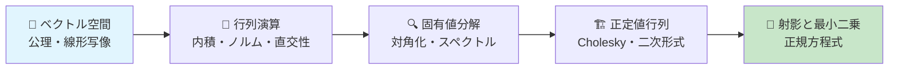
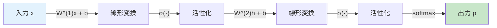
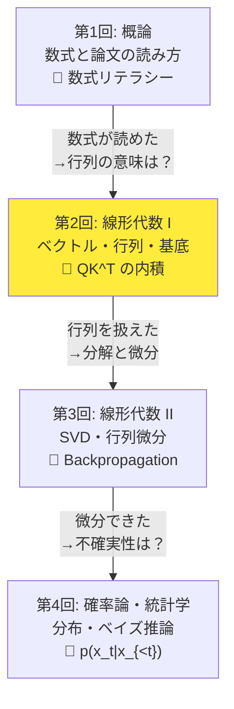
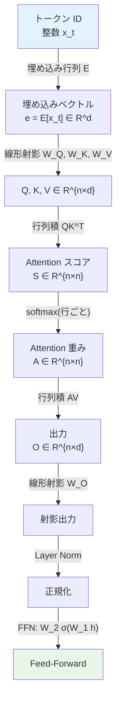
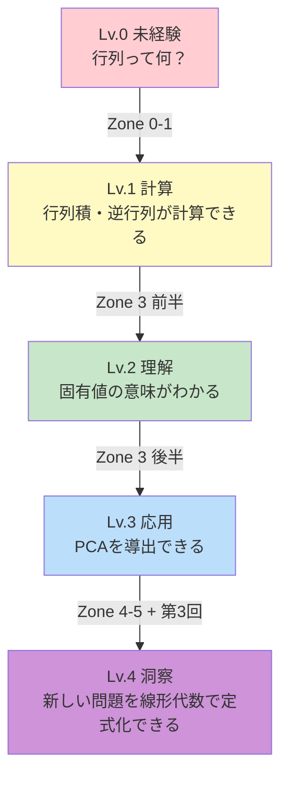
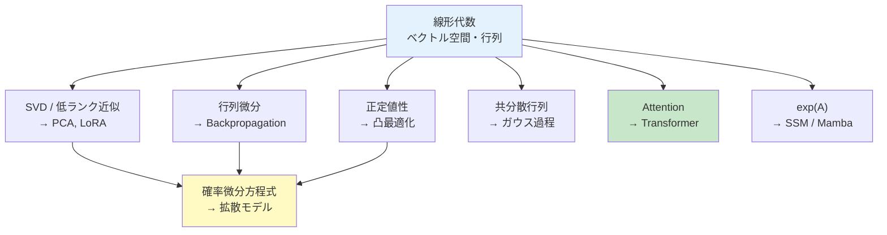
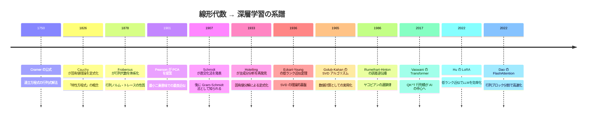
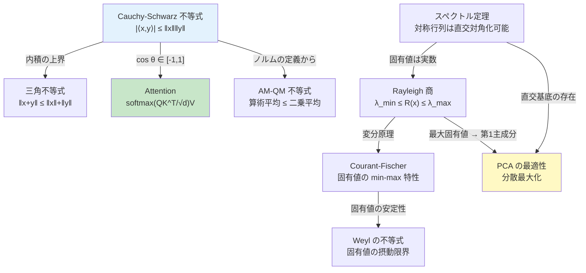
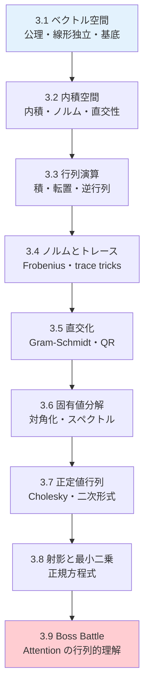
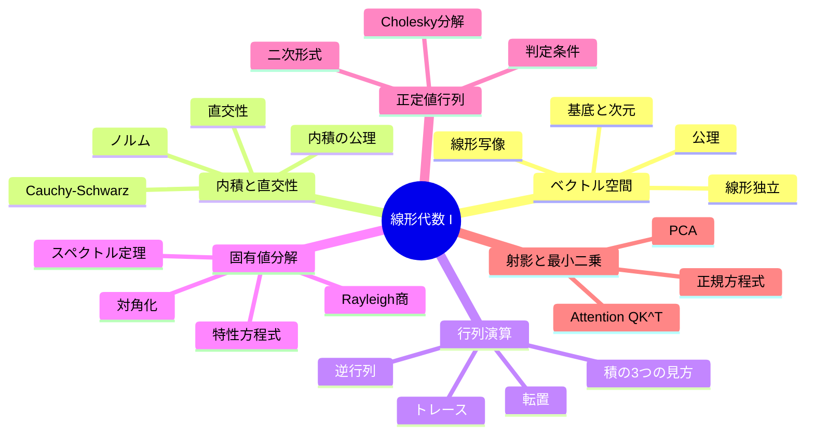

# 第2回: 線形代数 I — ベクトル・行列・基底

> **GPUは行列演算マシンだ。線形代数を"制する者"がAIを制する。**

この言い方は大げさに聞こえるかもしれない。だが、事実だ。

LLMが次のトークンを予測するとき、Attention機構[^1]の中では $QK^\top$ という行列積が走る。画像認識モデルが特徴を抽出するとき、畳み込みは行列積に帰着する。推薦システムがユーザーの好みを予測するとき、SVD（特異値分解）が使われる。勾配降下法でパラメータを更新するとき、勾配ベクトルはヤコビ行列から計算される。

**機械学習のほぼ全ての計算は、線形代数の言葉で書かれている。**

第1回で「数式は言語だ」と言った。ならば線形代数は、その言語の**文法書**にあたる。文法を知らずに小説は書けない。同様に、線形代数を知らずに機械学習の論文は書けない。

本講義では、ベクトル空間の公理から始めて、行列演算、固有値分解、正定値行列、射影まで — AI理論の基盤となる線形代数を一気に駆け抜ける。第3回（線形代数 II）でSVD・行列微分・テンソルに進むための準備を、ここで完了させる。

:::message
**このシリーズについて**: 東京大学 松尾・岩澤研究室動画講義の**完全上位互換**の全50回シリーズ。理論（論文が書ける）、実装（Production-ready）、最新（2025-2026 SOTA）の3軸で差別化する。
:::



**所要時間の目安**:

| ゾーン | 内容 | 時間 | 難易度 |
|:-------|:-----|:-----|:-------|
| Zone 0 | クイックスタート | 30秒 | ★☆☆☆☆ |
| Zone 1 | 体験ゾーン | 10分 | ★★☆☆☆ |
| Zone 2 | 直感ゾーン | 15分 | ★★☆☆☆ |
| Zone 3 | 数式修行ゾーン | 60分 | ★★★★☆ |
| Zone 4 | 実装ゾーン | 45分 | ★★★☆☆ |
| Zone 5 | 実験ゾーン | 30分 | ★★★☆☆ |
| Zone 6 | 振り返りゾーン | 30分 | ★★☆☆☆ |

---

## 🚀 0. クイックスタート（30秒）— 行列積が動かすAI

**ゴール**: 行列積がAIの心臓部であることを30秒で体感する。

3行で、Transformerの中核であるAttention[^1]の行列積を「動かす」。

```python
import numpy as np

# Attention: scores = QK^T / sqrt(d_k)
Q = np.array([[1.0, 0.5], [0.3, 0.8]])  # Query: 2 tokens × 2 dims
K = np.array([[0.9, 0.1], [0.2, 0.7]])  # Key:   2 tokens × 2 dims
scores = Q @ K.T / np.sqrt(2)            # QK^T / √d_k
print(f"Attention scores:\n{np.round(scores, 4)}")
```

出力:
```
Attention scores:
[[0.6718 0.3889]
 [0.2475 0.4384]]
```

**この3行の裏にある数式**:

$$
S_{ij} = \frac{\sum_{k=1}^{d} Q_{ik} K_{jk}}{\sqrt{d}}
$$

`Q @ K.T` が $QK^\top$。各要素は**内積**（ベクトルの類似度）だ。行列積とは、内積を一括計算する操作に他ならない。

$$
(AB)_{ij} = \sum_{k=1}^{n} A_{ik} B_{kj} = \mathbf{a}_i^\top \mathbf{b}_j
$$

**行列積 = 内積のバッチ処理。** これがGPUで高速に実行できる理由であり、Transformerが大規模データを処理できる理由だ。

:::message
**進捗: 3% 完了** 行列積 = AIの心臓部を体感した。残り7ゾーンの冒険が待っている。
:::

---

## 🎮 1. 体験ゾーン（10分）— 行列を「触って」理解する

### 1.1 ベクトルの内積 — 類似度の数学

Attention[^1]の核心は「2つのベクトルがどれだけ似ているか」を測ることだ。その道具が**内積**（inner product / dot product）。

$$
\langle \mathbf{a}, \mathbf{b} \rangle = \mathbf{a}^\top \mathbf{b} = \sum_{i=1}^{n} a_i b_i = \|\mathbf{a}\| \|\mathbf{b}\| \cos\theta
$$

右辺の $\cos\theta$ に注目してほしい。内積は「2つのベクトルの角度」を測っている。

```python
import numpy as np

def cosine_similarity(a: np.ndarray, b: np.ndarray) -> float:
    """cos(θ) = a·b / (||a|| ||b||)"""
    return np.dot(a, b) / (np.linalg.norm(a) * np.linalg.norm(b))

# 3つのベクトル: "king", "queen", "apple" の埋め込み（簡略化）
king  = np.array([0.9, 0.8, 0.1, 0.2])
queen = np.array([0.85, 0.75, 0.15, 0.3])
apple = np.array([0.1, 0.05, 0.9, 0.8])

print("=== コサイン類似度 ===")
print(f"king · queen = {cosine_similarity(king, queen):.4f}")   # 高い（意味が近い）
print(f"king · apple = {cosine_similarity(king, apple):.4f}")   # 低い（意味が遠い）
print(f"queen · apple = {cosine_similarity(queen, apple):.4f}") # 低い

# 内積の値を直接確認
print(f"\n=== 内積（生の値）===")
print(f"king^T queen = {np.dot(king, queen):.4f}")
print(f"king^T apple = {np.dot(king, apple):.4f}")
```

出力:
```
=== コサイン類似度 ===
king · queen = 0.9899
king · apple = 0.3071
queen · apple = 0.3815

=== 内積（生の値）===
king^T queen = 1.4250
king^T apple = 0.3500
```

**一言で言えば**: 内積が大きい = 方向が近い = 意味が似ている。Attention[^1]はこの内積を使って「どのトークンに注目すべきか」を決めている。

:::message
ここで多くの人が混乱するのが、**内積**と**コサイン類似度**の違いだ。内積 $\mathbf{a}^\top\mathbf{b}$ はベクトルの長さ（ノルム）に依存する。コサイン類似度 $\cos\theta$ はノルムで正規化するため $[-1, 1]$ に収まる。Attentionでは内積を使い、$\sqrt{d_k}$ でスケーリングする[^1]。検索システムではコサイン類似度を使うことが多い。
:::

### 1.2 行列積の3つの見方

行列積 $C = AB$ には3つの見方がある。これを使い分けられると、論文の数式が格段に読みやすくなる。

$A \in \mathbb{R}^{m \times n}$, $B \in \mathbb{R}^{n \times p}$ のとき $C = AB \in \mathbb{R}^{m \times p}$。

| 見方 | 定義 | 直感 |
|:-----|:-----|:-----|
| **要素ごと** | $C_{ij} = \sum_k A_{ik} B_{kj}$ | $C$ の各要素は内積 |
| **列ごと** | $C_{\cdot j} = A \mathbf{b}_j$ | $C$ の各列は $A$ による $\mathbf{b}_j$ の線形変換 |
| **行ごと** | $C_{i \cdot} = \mathbf{a}_i^\top B$ | $C$ の各行は $\mathbf{a}_i$ と $B$ の行の内積 |

```python
import numpy as np

A = np.array([[1, 2], [3, 4], [5, 6]])  # 3×2
B = np.array([[7, 8, 9], [10, 11, 12]]) # 2×3
C = A @ B                                # 3×3

print("C = AB:")
print(C)

# 見方1: 要素ごと — C[0,0] = A[0,:] · B[:,0]
print(f"\n要素ごと: C[0,0] = {A[0,:]} · {B[:,0]} = {np.dot(A[0,:], B[:,0])}")

# 見方2: 列ごと — C[:,0] = A @ B[:,0]
print(f"列ごと:   C[:,0] = A @ b_0 = {A @ B[:,0]}")

# 見方3: 行ごと — C[0,:] = A[0,:] @ B
print(f"行ごと:   C[0,:] = a_0^T @ B = {A[0,:] @ B}")
```

:::details 外積としての行列積（4つ目の見方）
行列積にはもう一つ重要な見方がある。**ランク1行列の和**としての分解:

$$
AB = \sum_{k=1}^{n} \mathbf{a}_k \mathbf{b}_k^\top
$$

ここで $\mathbf{a}_k$ は $A$ の第 $k$ 列、$\mathbf{b}_k^\top$ は $B$ の第 $k$ 行。各 $\mathbf{a}_k \mathbf{b}_k^\top$ はランク1の行列（外積）で、その和が $AB$ になる。

これは**SVD**（第3回）の理解に直結する。SVDは行列をランク1行列の「重みつき」の和に分解する:

$$
A = \sum_{i=1}^{r} \sigma_i \mathbf{u}_i \mathbf{v}_i^\top
$$

```python
import numpy as np

A = np.array([[1, 2], [3, 4], [5, 6]])  # 3×2
B = np.array([[7, 8, 9], [10, 11, 12]]) # 2×3

# 外積の和として行列積を計算
C_outer = np.zeros((3, 3))
for k in range(2):
    C_outer += np.outer(A[:, k], B[k, :])  # a_k @ b_k^T

print("外積の和:")
print(C_outer)
print(f"一致: {np.allclose(A @ B, C_outer)}")
```
:::

### 1.3 行列による線形変換 — 回転・スケーリング・射影

行列は「空間を変形する操作」だ。$\mathbf{y} = A\mathbf{x}$ は、ベクトル $\mathbf{x}$ を行列 $A$ で変換して $\mathbf{y}$ を得る。

```python
import numpy as np

# 回転行列: θ = 45° (π/4)
theta = np.pi / 4
R = np.array([
    [np.cos(theta), -np.sin(theta)],
    [np.sin(theta),  np.cos(theta)]
])

# スケーリング行列: x方向に2倍、y方向に0.5倍
S = np.array([[2.0, 0.0],
              [0.0, 0.5]])

# 射影行列: x軸への射影
P = np.array([[1.0, 0.0],
              [0.0, 0.0]])

x = np.array([1.0, 1.0])

print(f"元のベクトル:   x = {x}")
print(f"回転 (45°):    Rx = {np.round(R @ x, 4)}")
print(f"スケーリング:   Sx = {S @ x}")
print(f"射影 (x軸):     Px = {P @ x}")

# 合成変換: 先にスケーリング、次に回転
y = R @ S @ x  # 右から読む: x → S → R
print(f"合成 (R·S·x):   {np.round(y, 4)}")
```

ニューラルネットワークの各層がやっているのは、まさにこの線形変換に非線形活性化を挟む操作だ:

$$
\mathbf{h}^{(l)} = \sigma\left(W^{(l)} \mathbf{h}^{(l-1)} + \mathbf{b}^{(l)}\right)
$$

$W^{(l)}$ による線形変換（回転+スケーリング）に $\mathbf{b}^{(l)}$ で平行移動し、$\sigma$ で「曲げる」。



### 1.4 固有値を「見る」— 行列の本質を1行で暴く

行列 $A$ には「固有の方向」がある。その方向のベクトルは、$A$ をかけても方向が変わらず、スケールだけ変わる:

$$
A\mathbf{v} = \lambda\mathbf{v}
$$

$\mathbf{v}$ が**固有ベクトル**、$\lambda$ が**固有値**。

```python
import numpy as np

# 共分散行列（楕円の形を決める）
Sigma = np.array([[3.0, 1.5],
                  [1.5, 1.0]])

eigenvalues, eigenvectors = np.linalg.eigh(Sigma)

print("=== 固有値分解 ===")
for i in range(len(eigenvalues)):
    lam = eigenvalues[i]
    v = eigenvectors[:, i]
    Av = Sigma @ v
    print(f"λ_{i+1} = {lam:.4f}, v_{i+1} = {np.round(v, 4)}")
    print(f"  Av = {np.round(Av, 4)}")
    print(f"  λv = {np.round(lam * v, 4)}")
    print(f"  Av == λv: {np.allclose(Av, lam * v)}")

print(f"\n固有値の和 = {eigenvalues.sum():.4f} (= trace(Σ) = {np.trace(Sigma):.4f})")
print(f"固有値の積 = {eigenvalues.prod():.4f} (= det(Σ)  = {np.linalg.det(Sigma):.4f})")
```

**trace = 固有値の和、det = 固有値の積。** この2つの恒等式は第3回以降で繰り返し登場する。覚えておいてほしい。

固有値分解の機械学習での直結的な応用が**PCA**（主成分分析）だ。データの共分散行列の固有ベクトルが、分散が最大の方向（= 情報が最も豊富な方向）を指す。Pearsonが1901年に原型を提示し[^6]、Hotellingが1933年に「主成分」という用語で体系化した[^7]。

### 1.5 埋め込みベクトル — 行列が作る「意味の空間」

LLMは最初に、各トークン（単語の断片）を高次元ベクトルに変換する。これが**埋め込み**（embedding）だ。

$$
\mathbf{e}_{x_t} = E[x_t, :] \in \mathbb{R}^d
$$

$E \in \mathbb{R}^{V \times d}$ が埋め込み行列。$V$ は語彙サイズ（GPT-2なら50,257）、$d$ は埋め込み次元（GPT-2なら768）。

```python
import numpy as np

# 埋め込み行列の模擬
V = 1000   # 語彙サイズ
d = 64     # 埋め込み次元

np.random.seed(42)
E = np.random.randn(V, d) * 0.02  # 小さな値で初期化

# トークンIDから埋め込みベクトルを取得
token_ids = [42, 100, 42]  # "hello", "world", "hello"
embeddings = E[token_ids]   # 行列の行選択 = 行列演算

print(f"埋め込み行列 E: {E.shape} ({V}語彙 × {d}次元)")
print(f"3トークンの埋め込み: {embeddings.shape}")

# 同じトークンは同じ埋め込みを持つ
print(f"\ntoken 42 と token 42 は同じ: {np.allclose(embeddings[0], embeddings[2])}")

# トークン間の類似度（コサイン類似度）
cos_sim_same = np.dot(embeddings[0], embeddings[2]) / (
    np.linalg.norm(embeddings[0]) * np.linalg.norm(embeddings[2]))
cos_sim_diff = np.dot(embeddings[0], embeddings[1]) / (
    np.linalg.norm(embeddings[0]) * np.linalg.norm(embeddings[1]))
print(f"同じトークン間の類似度: {cos_sim_same:.4f}")
print(f"異なるトークン間の類似度: {cos_sim_diff:.4f}")
```

**埋め込みの学習**は、この行列 $E$ の各行を勾配降下法で更新して、「意味的に近い単語が近いベクトルになる」ように最適化する。有名な word2vec の「king - man + woman ≈ queen」は、埋め込み空間でのベクトル演算が意味的な類推に対応するという発見だ。

この埋め込みベクトルが第2回の線形代数の全てに直結する:
- ベクトルの加法と内積 → 意味の合成と類似度
- 行列積 $QK^\top$ → 全トークン対の類似度の一括計算
- 固有値分解/PCA → 埋め込み空間の構造の分析と可視化

> **一言で言えば**: 固有値分解 = 行列の「X線写真」。内部構造を一目で暴く。

:::message
**進捗: 10% 完了** 内積（類似度）、行列積（3つの見方）、線形変換（NN の各層）、固有値（行列の本質）を触って理解した。Zone 0-1 クリア。
:::

---

## 🧩 2. 直感ゾーン（15分）— なぜ線形代数が全ての土台なのか

### 2.1 線形代数の「地図」

第1回で「数式は言語だ」と言った。ならば線形代数は**言語の文法**であり、その文法なしに機械学習の論文は1ページも読めない。

なぜか。機械学習の3つの基本操作 — **表現・変換・最適化** — は全て線形代数で記述されるからだ。

| 操作 | 線形代数の道具 | 具体例 |
|:-----|:-------------|:------|
| **表現** | ベクトル空間、基底 | 単語埋め込み $\mathbf{x} \in \mathbb{R}^{768}$ |
| **変換** | 行列積、線形写像 | Attention: $QK^\top$[^1] |
| **最適化** | 勾配、固有値、正定値性 | ヘシアンの正定値性 → 凸性 |

> **この章を読めば**: 線形代数が機械学習のどこで使われるかの全体像が手に入る。

### 2.2 Course I の中での位置づけ

本講義はCourse I（数学基礎編）の第2回。前回で数式を「読む力」を身につけた。今回と次回で、数式を「操る力」を身につける。



| 回 | テーマ | LLM/Transformerとの接点 |
|:---|:------|:----------------------|
| 第1回 | 概論: 数式と論文の読み方 | Softmax, Attention, Cross-Entropy |
| **第2回** | **線形代数 I** | **$QK^\top$ の内積、固有値→PCA→埋め込み** |
| 第3回 | 線形代数 II | ヤコビアン→Flow Model、勾配→Backpropagation |
| 第4回 | 確率論・統計学 | $p(x_t \mid x_{<t})$ 自己回帰、Softmax分布 |

**限界→動機の連鎖**: 本講義で線形空間と行列を扱えるようになると、「行列を分解して構造を見抜くには？」「行列の関数を微分するには？」という問いが自然に湧く。それが第3回（SVD・行列微分・テンソル）の動機だ。

### 2.3 松尾研との差別化

松尾・岩澤研の講義は線形代数を「前提知識」として飛ばす。結果として受講者は以下の壁にぶつかる:

| 松尾研の前提 | 実際の壁 | 本講義の対策 |
|:------------|:--------|:-----------|
| 「内積は知ってるよね」 | Attention[^1]の$QK^\top$が読めない | Zone 1 で体験 → Zone 3 で定義と証明 |
| 「固有値分解は既知」 | 共分散行列の意味がわからない | 固有値→PCA→埋め込みの導出を全て行う |
| 「正定値行列くらいは」 | ヘシアンの正定値性と凸性の関係が？ | 二次形式の幾何学まで踏み込む |

**このシリーズでは「前提知識」を「到達知識」として扱う。** 松尾研が飛ばす部分にこそ、論文を書く力の土台がある。

### 2.4 LLMの中の線形代数

LLMの推論パイプラインを線形代数の視点で見ると、全てがベクトル・行列操作に帰着する。



| LLM の操作 | 線形代数 | 本講義の対応セクション |
|:-----------|:--------|:-------------------|
| 埋め込み検索 | 行列の行選択 | 3.1 ベクトル空間 |
| $QK^\top$ 計算 | 行列積 | 1.2 行列積の3つの見方 |
| Softmax | ベクトル→確率単体 | 第1回で導入済み |
| LayerNorm | 平均・分散の計算 | 3.4 ノルムと内積 |
| FFN | 2層の線形変換 | 1.3 線形変換 |
| Weight tying | 行列の転置 | 3.3 転置の性質 |

**全てが線形代数だ。** Softmax以外の全操作は行列積かベクトル演算。Softmaxも指数関数を挟んだ後にベクトルの正規化（L1ノルム割り）をしているだけだ。

### 2.5 3つの比喩で捉える「線形代数の本質」

**比喩1: 線形代数は「座標系の学問」**

地図を北を上にして読むか、進行方向を上にして読むかで見え方が変わる。線形代数は「座標系を自在に切り替えて、一番見やすい角度からデータを見る技術」だ。PCA[^6][^7]は「データの分散が最大になる座標軸を見つける」操作。

**比喩2: 行列は「変形マシン」**

粘土を伸ばしたり回したり潰したりする道具。ニューラルネットの各層は、データという粘土を変形して、最終的に分類しやすい形にする。固有値は「どの方向にどれだけ伸ばすか」を決める。

**比喩3: 固有値分解は「周波数分析」**

音を周波数成分に分解するフーリエ変換と本質的に同じ発想。行列を固有値と固有ベクトルに分解することで、行列の「基本振動モード」が見える。低い固有値の成分を捨てれば情報を圧縮できる — これがPCAであり、第3回で学ぶSVDの低ランク近似だ。

### 2.6 線形代数の「レベルアップ」マップ

線形代数の習得には明確な段階がある。自分が今どのレベルにいるかを把握することが、効率的な学習の鍵だ。



| レベル | 到達条件 | 機械学習での実力 |
|:------|:--------|:--------------|
| Lv.0 | — | 論文が読めない |
| Lv.1 | 行列積・内積を正しく計算できる | コードは動かせるが数式が読めない |
| Lv.2 | 固有値分解・スペクトル定理を説明できる | 論文のAppendixが部分的に読める |
| Lv.3 | PCA・最小二乗法を白紙から導出できる | 論文のMethodセクションが読める |
| Lv.4 | 未知の問題を線形代数で定式化できる | 論文が書ける |

**本講義の目標はLv.3への到達**。Lv.4は第3回以降の内容（SVD・行列微分）を加えることで到達する。

### 2.7 学習戦略

この講義は量が多い。効率的に進めるためのアドバイス:

1. **Zone 3（数式修行）が最重要**。ここに60分かける価値がある
2. **手を動かす**: コードを写経するだけでなく、パラメータを変えて実行する
3. **紙に書く**: 固有値分解は手計算で1回やると理解が段違いに深まる
4. **わからなくても進む**: 第3回を読んだ後に戻ると繋がることが多い
5. **定義→定理→例→コード**の4点セットを意識する: 数学の学習は定義から始まる。定理がその帰結。例が具体化。コードが検証

:::details 挫折パターンと対策
| よくある挫折パターン | 原因 | 対策 |
|:------------------|:-----|:-----|
| Zone 3 で諦める | 一度に全部理解しようとする | セクション単位で区切る。3.1→3.2→...と1つずつ |
| 証明が追えない | 前提知識が足りない | その証明で使っている定義に戻る。定義を曖昧にしたまま先に進まない |
| コードは動くが数式が読めない | 数式をコードに「翻訳」する練習が不足 | Zone 5 のコード翻訳テストを先にやる |
| 固有値分解の意味がわからない | 幾何学的直感が足りない | 2×2行列で手計算する。Zone 1.4 の可視化を再実行 |
| PCA の導出ができない | Rayleigh商→制約付き最適化の流れが見えない | Zone 3.8 を2回読む。1回目は流れだけ、2回目は式を追う |
:::

:::message
**進捗: 20% 完了** 線形代数が機械学習の全ての土台であること、LLMの中で線形代数がどう使われているかを理解した。ここからZone 3「数式修行ゾーン」— 本講義最大の山場だ。
:::

### 2.8 線形代数の機械学習における位置づけ



| 線形代数の道具 | 機械学習での応用 | 講義 |
|:-------------|:--------------|:-----|
| SVD / 低ランク近似 | PCA, LoRA[^10], 推薦システム | 第3回 |
| 行列微分 | Backpropagation[^2], 自動微分 | 第3回 |
| 正定値行列 | 凸最適化, Fisher情報量行列 | 第6回 |
| 固有値分解 | グラフラプラシアン, スペクトルクラスタリング | 第6回 |
| 行列指数 | SSM (Mamba), Neural ODE | 第25-26回 |
| テンソル分解 | Tensor Train, Tucker分解 | 第3回 |
| ランダム行列 | 初期化理論, 表現理論 | 第7回 |

### 2.9 線形代数の歴史と深層学習の系譜

線形代数は「古い数学」ではない。その発展史を知ることで、なぜ今のAIがこの数学を必要としているかが見える。



この年表が示すのは、**250年以上の数学的蓄積がTransformerの1行に凝縮されている**という事実だ。

#### 知っておくべき不等式・定理の相関図

線形代数には多くの不等式・定理が存在するが、それらは孤立しているのではなく、相互に関連している。



| 不等式・定理 | 数式 | 機械学習での意味 |
|:-----------|:-----|:--------------|
| Cauchy-Schwarz | $\|\langle \mathbf{x}, \mathbf{y} \rangle\| \leq \|\mathbf{x}\| \|\mathbf{y}\|$ | コサイン類似度が $[-1, 1]$ に収まる保証 |
| 三角不等式 | $\|\mathbf{x} + \mathbf{y}\| \leq \|\mathbf{x}\| + \|\mathbf{y}\|$ | ノルムが距離の公理を満たす保証 |
| Rayleigh商の上下界 | $\lambda_{\min} \leq R(\mathbf{x}) \leq \lambda_{\max}$ | PCA第1主成分 = 最大固有値方向 |
| Weylの不等式 | $\|\lambda_i(A+E) - \lambda_i(A)\| \leq \|E\|_2$ | 行列の摂動が固有値に与える影響の限界 |
| Eckart-Young | $\min_{\text{rank}(B)=k} \|A-B\|_F = \sqrt{\sum_{i>k} \sigma_i^2}$ | SVD低ランク近似の最適性（第3回） |
| Courant-Fischer | $\lambda_k = \min_{\dim S=k} \max_{\mathbf{x} \in S} R(\mathbf{x})$ | 固有値の変分特性 → PCAの理論的裏付け |

:::details 補足: Weylの不等式が重要な理由
学習中のニューラルネットワークでは、パラメータが微小に変化する（= 行列に摂動が加わる）。Weylの不等式は、**摂動に対して固有値がどの程度安定か**を保証する。

具体的には、共分散行列 $\Sigma$ に小さなノイズ $E$ が加わったとき:

$$
|\lambda_i(\Sigma + E) - \lambda_i(\Sigma)| \leq \|E\|_2
$$

これは「ノイズのスペクトルノルム以上に固有値は動かない」ことを意味する。PCAやスペクトルクラスタリングの数値的安定性の理論的根拠だ。
:::

#### 線形代数のソフトウェアスタック

実用的な視点も重要だ。現代の線形代数ソフトウェアは階層的に構成されている。

| 層 | ソフトウェア | 役割 |
|:---|:-----------|:-----|
| ユーザー層 | NumPy, PyTorch, JAX | 高レベルAPI |
| 中間層 | LAPACK | 固有値分解、SVD、連立方程式 |
| カーネル層 | BLAS (Level 1/2/3) | ベクトル・行列演算の最適化カーネル |
| ハードウェア層 | CPU (AVX-512), GPU (Tensor Core), Apple AMX | 行列積のハードウェア支援 |

```python
# NumPy が内部で呼んでいるものを確認
import numpy as np
np.show_config()

# 例: macOS では Apple Accelerate (AMX ユニット活用)
# Linux では OpenBLAS or MKL
# → 行列積 @ は BLAS Level 3 の dgemm を呼ぶ
```

知っておくべきは、`A @ B` という1行のPythonコードが、最終的にはCPUの特殊命令（AVX-512, AMX）やGPUのTensor Coreを叩いているということだ。**線形代数は理論とハードウェアの接点**でもある。

---

## 📐 3. 数式修行ゾーン（60分）— ベクトル空間から固有値分解まで

> **目標**: ベクトル空間の公理を出発点として、行列演算・固有値分解・正定値行列・射影を導出し、Attention[^1]の$QK^\top$を数学的に完全理解する。

本シリーズで最も重要なゾーンだ。ここで扱う概念は、第40回まで繰り返し登場する。急がず、1つずつ導出していこう。



### 3.1 ベクトル空間の公理 — 全ての出発点

ベクトル空間とは「足し算とスカラー倍ができる集合」だ。厳密には以下の8つの公理を満たす集合 $V$ と体 $\mathbb{F}$（通常は $\mathbb{R}$ か $\mathbb{C}$）の組 $(V, \mathbb{F})$。

| # | 公理 | 数式 | 直感 |
|:--|:-----|:-----|:-----|
| 1 | 加法の閉包 | $\mathbf{u} + \mathbf{v} \in V$ | 足しても空間から出ない |
| 2 | 加法の結合法則 | $(\mathbf{u}+\mathbf{v})+\mathbf{w} = \mathbf{u}+(\mathbf{v}+\mathbf{w})$ | 括弧の位置は無関係 |
| 3 | 加法の交換法則 | $\mathbf{u}+\mathbf{v} = \mathbf{v}+\mathbf{u}$ | 足す順序は無関係 |
| 4 | 零元の存在 | $\exists\,\mathbf{0}: \mathbf{v}+\mathbf{0} = \mathbf{v}$ | ゼロベクトルがある |
| 5 | 逆元の存在 | $\exists\,{-\mathbf{v}}: \mathbf{v}+(-\mathbf{v}) = \mathbf{0}$ | 引き算ができる |
| 6 | スカラー倍の閉包 | $c\mathbf{v} \in V$ | 拡大縮小しても出ない |
| 7 | スカラー倍の分配法則 | $c(\mathbf{u}+\mathbf{v}) = c\mathbf{u}+c\mathbf{v}$ | |
| 8 | スカラー倍の結合法則 | $(cd)\mathbf{v} = c(d\mathbf{v})$ | |

**なぜ公理を知る必要があるのか。** 「$\mathbb{R}^n$ でベクトルを足してスカラー倍する — 当たり前じゃないか」と思うかもしれない。だが、公理を知ると**ベクトル空間は $\mathbb{R}^n$ だけではない**ことがわかる。

| ベクトル空間 | 要素 | 機械学習での用途 |
|:------------|:-----|:---------------|
| $\mathbb{R}^n$ | $n$次元実数ベクトル | 入力データ、埋め込み |
| $\mathbb{R}^{m \times n}$ | 行列 | 重み行列、共分散行列 |
| $\mathcal{P}_n$ | $n$次以下の多項式 | カーネル法の特徴写像 |
| $L^2(\Omega)$ | 二乗可積分関数 | 関数空間（第5回 測度論） |
| 確率分布の空間 | 確率密度関数 | 生成モデル（第7回以降） |

行列も多項式も関数も、公理を満たすのでベクトル空間だ。この抽象性が、線形代数を「あらゆる場所で使える」道具にしている。

#### 線形独立・基底・次元

ベクトル $\mathbf{v}_1, \ldots, \mathbf{v}_k$ が**線形独立**であるとは:

$$
c_1 \mathbf{v}_1 + c_2 \mathbf{v}_2 + \cdots + c_k \mathbf{v}_k = \mathbf{0} \implies c_1 = c_2 = \cdots = c_k = 0
$$

つまり、どのベクトルも他のベクトルの線形結合では表せないということ。

$V$ の**基底** $\{\mathbf{e}_1, \ldots, \mathbf{e}_n\}$ は、線形独立で $V$ を張る（span）ベクトルの組。$V$ の任意のベクトルは基底の線形結合で一意に表せる:

$$
\mathbf{v} = \sum_{i=1}^{n} v_i \mathbf{e}_i
$$

基底に含まれるベクトルの数 $n$ が**次元** $\dim V$。

```python
import numpy as np

# 線形独立の確認: 行列のランクで判定
v1 = np.array([1, 0, 0])
v2 = np.array([0, 1, 0])
v3 = np.array([1, 1, 0])  # v3 = v1 + v2 → 線形従属

A_independent = np.column_stack([v1, v2])
A_dependent = np.column_stack([v1, v2, v3])

print(f"{{v1, v2}} のランク: {np.linalg.matrix_rank(A_independent)} (= 2 → 線形独立)")
print(f"{{v1, v2, v3}} のランク: {np.linalg.matrix_rank(A_dependent)} (= 2 < 3 → 線形従属)")

# v3 が v1, v2 の線形結合であることを確認
print(f"v3 = v1 + v2: {np.allclose(v3, v1 + v2)}")
```

:::message
ここで多くの人が混乱するのが**ランク**（rank）と**次元**（dimension）の違いだ。次元はベクトル空間の固有の性質（$\mathbb{R}^3$ の次元は3）。ランクは行列の性質で、列ベクトルが張る空間の次元。$m \times n$ 行列のランクは $\min(m, n)$ 以下。ランクが $\min(m, n)$ に等しいとき**フルランク**と呼ぶ。
:::

#### 線形写像

ベクトル空間 $V$ から $W$ への**線形写像** $T: V \to W$ は、以下を満たす写像:

$$
T(\alpha \mathbf{u} + \beta \mathbf{v}) = \alpha T(\mathbf{u}) + \beta T(\mathbf{v})
$$

**行列 $A \in \mathbb{R}^{m \times n}$ は線形写像 $T: \mathbb{R}^n \to \mathbb{R}^m$ の表現**だ。基底を選ぶと線形写像は行列で表せる。基底を変えると行列も変わるが、線形写像自体は同じ。

ニューラルネットワークの各層 $\mathbf{h} \mapsto W\mathbf{h} + \mathbf{b}$ は**アフィン写像**（線形写像 + 平行移動）。活性化関数 $\sigma$ を挟むことで非線形になり、任意の連続関数を近似できるようになる（万能近似定理）。

#### Rank-Nullity定理

線形写像 $T: V \to W$ に対して:

$$
\dim V = \text{rank}(T) + \text{nullity}(T)
$$

$\text{rank}(T)$ は像空間 $\text{Im}(T)$ の次元、$\text{nullity}(T)$ は核 $\ker(T) = \{\mathbf{v} : T(\mathbf{v}) = \mathbf{0}\}$ の次元。

行列 $A \in \mathbb{R}^{m \times n}$ で言えば: $n = \text{rank}(A) + \dim(\text{null}(A))$

```python
import numpy as np
from scipy.linalg import null_space

# rank + nullity = n を確認
A = np.array([[1, 2, 3],
              [4, 5, 6],
              [7, 8, 9]])  # rank 2 の行列

r = np.linalg.matrix_rank(A)
ns = null_space(A)
nullity = ns.shape[1]

print(f"A の shape: {A.shape} → n = {A.shape[1]}")
print(f"rank(A) = {r}")
print(f"nullity(A) = {nullity}")
print(f"rank + nullity = {r + nullity} = n ✓")

# 核のベクトルが確かに Av = 0 を満たすか確認
if nullity > 0:
    v_null = ns[:, 0]
    print(f"Av_null = {np.round(A @ v_null, 10)}")
```

### 3.2 内積空間 — 長さと角度の定義

ベクトル空間に**内積**を入れると、長さ（ノルム）と角度が定義できる。

**内積の公理**: $\langle \cdot, \cdot \rangle: V \times V \to \mathbb{R}$ が内積であるとは:

| 公理 | 数式 | 意味 |
|:-----|:-----|:-----|
| 対称性 | $\langle \mathbf{u}, \mathbf{v} \rangle = \langle \mathbf{v}, \mathbf{u} \rangle$ | 順序を入れ替えても同じ |
| 線形性 | $\langle \alpha\mathbf{u}+\beta\mathbf{v}, \mathbf{w} \rangle = \alpha\langle \mathbf{u}, \mathbf{w} \rangle + \beta\langle \mathbf{v}, \mathbf{w} \rangle$ | 第1引数で線形 |
| 正定値性 | $\langle \mathbf{v}, \mathbf{v} \rangle \geq 0$, 等号 $\iff \mathbf{v} = \mathbf{0}$ | 自分との内積は非負 |

$\mathbb{R}^n$ の標準内積は $\langle \mathbf{u}, \mathbf{v} \rangle = \mathbf{u}^\top \mathbf{v} = \sum_i u_i v_i$。

内積から**ノルム**（長さ）が定義される:

$$
\|\mathbf{v}\| = \sqrt{\langle \mathbf{v}, \mathbf{v} \rangle}
$$

そしてノルムから**距離**が定義される:

$$
d(\mathbf{u}, \mathbf{v}) = \|\mathbf{u} - \mathbf{v}\|
$$

#### Cauchy-Schwarz不等式

内積空間で最も基本的で最も重要な不等式:

$$
|\langle \mathbf{u}, \mathbf{v} \rangle| \leq \|\mathbf{u}\| \cdot \|\mathbf{v}\|
$$

等号は $\mathbf{u} = c\mathbf{v}$（平行）のとき成立。

:::details Cauchy-Schwarz不等式の証明
$\mathbf{v} = \mathbf{0}$ のとき自明。$\mathbf{v} \neq \mathbf{0}$ として、任意の $t \in \mathbb{R}$ に対し:

$$
0 \leq \|\mathbf{u} - t\mathbf{v}\|^2 = \langle \mathbf{u} - t\mathbf{v}, \mathbf{u} - t\mathbf{v} \rangle = \|\mathbf{u}\|^2 - 2t\langle \mathbf{u}, \mathbf{v} \rangle + t^2\|\mathbf{v}\|^2
$$

これは $t$ の2次関数で、常に $\geq 0$。判別式が $\leq 0$ であることから:

$$
4\langle \mathbf{u}, \mathbf{v} \rangle^2 - 4\|\mathbf{u}\|^2\|\mathbf{v}\|^2 \leq 0 \implies \langle \mathbf{u}, \mathbf{v} \rangle^2 \leq \|\mathbf{u}\|^2\|\mathbf{v}\|^2
$$

両辺の平方根を取れば完了。 ∎
:::

**機械学習との接続**: コサイン類似度 $\cos\theta = \frac{\langle \mathbf{u}, \mathbf{v} \rangle}{\|\mathbf{u}\|\|\mathbf{v}\|}$ が $[-1, 1]$ に収まることは、Cauchy-Schwarz不等式から直ちに従う。

```python
import numpy as np

# Cauchy-Schwarz不等式の数値確認
np.random.seed(42)
u = np.random.randn(100)
v = np.random.randn(100)

lhs = abs(np.dot(u, v))
rhs = np.linalg.norm(u) * np.linalg.norm(v)

print(f"|<u,v>| = {lhs:.4f}")
print(f"||u|| · ||v|| = {rhs:.4f}")
print(f"|<u,v>| ≤ ||u||·||v||: {lhs <= rhs + 1e-10}")

# 等号条件: u = cv のとき
u_parallel = 3.5 * v
lhs_eq = abs(np.dot(u_parallel, v))
rhs_eq = np.linalg.norm(u_parallel) * np.linalg.norm(v)
print(f"\nu = 3.5v のとき:")
print(f"|<u,v>| = {lhs_eq:.4f}")
print(f"||u||·||v|| = {rhs_eq:.4f}")
print(f"等号成立: {np.isclose(lhs_eq, rhs_eq)}")
```

#### 直交性

2つのベクトルが**直交**するとは $\langle \mathbf{u}, \mathbf{v} \rangle = 0$。直交ベクトルの集合 $\{\mathbf{e}_1, \ldots, \mathbf{e}_n\}$ で各ベクトルのノルムが1のとき**正規直交基底**（orthonormal basis）と呼ぶ:

$$
\langle \mathbf{e}_i, \mathbf{e}_j \rangle = \delta_{ij} = \begin{cases} 1 & (i = j) \\ 0 & (i \neq j) \end{cases}
$$

$\delta_{ij}$ は**クロネッカーのデルタ**。

正規直交基底の利点は、座標の計算が内積だけでできること:

$$
\mathbf{v} = \sum_{i=1}^{n} \langle \mathbf{v}, \mathbf{e}_i \rangle \mathbf{e}_i
$$

### 3.3 行列演算の体系

ここでは行列の基本演算を体系的に整理する。第1回で「添字の文法」を学んだ。ここではその文法を使って行列の演算規則を導出する。

#### 転置

$$
(A^\top)_{ij} = A_{ji}
$$

主要な性質:

| 性質 | 数式 |
|:-----|:-----|
| 二重転置 | $(A^\top)^\top = A$ |
| 和の転置 | $(A + B)^\top = A^\top + B^\top$ |
| 積の転置 | $(AB)^\top = B^\top A^\top$ |
| スカラー | $(cA)^\top = c A^\top$ |

**積の転置で順序が逆になる**ことは非常に重要だ。Attention[^1]の $QK^\top$ は、$Q$ の各行と $K$ の各行の内積を計算していることが、転置の性質から読み取れる:

$$
(QK^\top)_{ij} = \sum_k Q_{ik} (K^\top)_{kj} = \sum_k Q_{ik} K_{jk} = \mathbf{q}_i^\top \mathbf{k}_j
$$

#### 逆行列

$n \times n$ の正方行列 $A$ に対して、$AB = BA = I$ を満たす $B$ が存在するとき $B = A^{-1}$ と書く。

**存在条件**: $\det(A) \neq 0 \iff \text{rank}(A) = n \iff A$ の全ての固有値が非零。

主要な性質:

| 性質 | 数式 |
|:-----|:-----|
| 積の逆 | $(AB)^{-1} = B^{-1}A^{-1}$ |
| 転置の逆 | $(A^\top)^{-1} = (A^{-1})^\top$ |
| 逆の逆 | $(A^{-1})^{-1} = A$ |

```python
import numpy as np

A = np.array([[2.0, 1.0],
              [1.0, 3.0]])

A_inv = np.linalg.inv(A)
print("A =")
print(A)
print("A^(-1) =")
print(np.round(A_inv, 4))
print("A · A^(-1) =")
print(np.round(A @ A_inv, 10))  # = I

# (AB)^{-1} = B^{-1} A^{-1} の確認
B = np.array([[1.0, 2.0],
              [0.0, 1.0]])
AB_inv = np.linalg.inv(A @ B)
B_inv_A_inv = np.linalg.inv(B) @ np.linalg.inv(A)
print(f"\n(AB)^(-1) == B^(-1)A^(-1): {np.allclose(AB_inv, B_inv_A_inv)}")
```

:::message alert
**逆行列を直接計算するのは避ける。** $A^{-1}\mathbf{b}$ が必要なとき、`np.linalg.solve(A, b)` を使う。逆行列の計算は $O(n^3)$ で、数値的にも不安定。`solve` はLU分解を使い、より高速かつ安定だ。Golub & Van Loanの "Matrix Computations"[^8]がこの点を詳しく論じている。
:::

#### 対称行列と直交行列

**対称行列**: $A = A^\top$。共分散行列は対称行列の代表例:

$$
\Sigma = \frac{1}{N-1}\sum_{i=1}^{N}(\mathbf{x}^{(i)} - \bar{\mathbf{x}})(\mathbf{x}^{(i)} - \bar{\mathbf{x}})^\top
$$

**直交行列**: $Q^\top Q = QQ^\top = I$、つまり $Q^{-1} = Q^\top$。列ベクトルが正規直交基底を構成する行列。回転行列は直交行列の代表例。

直交行列による変換はノルムを保存する: $\|Q\mathbf{x}\| = \|\mathbf{x}\|$。

**証明**: $\|Q\mathbf{x}\|^2 = (Q\mathbf{x})^\top(Q\mathbf{x}) = \mathbf{x}^\top Q^\top Q \mathbf{x} = \mathbf{x}^\top I \mathbf{x} = \|\mathbf{x}\|^2$。∎

#### 行列式

行列式 $\det(A)$ は行列が空間を「何倍に拡大/縮小するか」を表す。符号は「向き」（右手系/左手系）の反転を示す。

$$
\det(A) = \prod_{i=1}^{n} \lambda_i \quad \text{（固有値の積）}
$$

| 性質 | 数式 | 意味 |
|:-----|:-----|:-----|
| 積の行列式 | $\det(AB) = \det(A)\det(B)$ | 面積の拡大率は掛け算 |
| 逆行列 | $\det(A^{-1}) = 1/\det(A)$ | |
| 転置 | $\det(A^\top) = \det(A)$ | |
| スカラー倍 | $\det(cA) = c^n \det(A)$ | $n \times n$ 行列 |
| 直交行列 | $\det(Q) = \pm 1$ | ノルム保存 |

**機械学習での行列式の重要性**:

- **ガウス分布の正規化定数**: $\mathcal{N}(\mathbf{x} \mid \boldsymbol{\mu}, \Sigma) = \frac{1}{(2\pi)^{d/2} |\Sigma|^{1/2}} \exp\left(-\frac{1}{2}(\mathbf{x}-\boldsymbol{\mu})^\top \Sigma^{-1} (\mathbf{x}-\boldsymbol{\mu})\right)$
- **Normalizing Flows（第25回）**: 変数変換の公式 $p_Y(\mathbf{y}) = p_X(f^{-1}(\mathbf{y})) \left|\det\left(\frac{\partial f^{-1}}{\partial \mathbf{y}}\right)\right|$
- **体積要素の変換**: 座標変換によって確率密度が変わる量を行列式が決定する

```python
import numpy as np

# 行列式の性質確認
A = np.array([[2.0, 1.0], [1.0, 3.0]])
B = np.array([[1.0, 2.0], [0.0, 1.0]])

print(f"det(A) = {np.linalg.det(A):.4f}")
print(f"det(B) = {np.linalg.det(B):.4f}")
print(f"det(AB) = {np.linalg.det(A @ B):.4f}")
print(f"det(A)*det(B) = {np.linalg.det(A)*np.linalg.det(B):.4f}")

# det = 固有値の積
eigenvalues = np.linalg.eigvalsh(A)
print(f"\n固有値: {eigenvalues}")
print(f"固有値の積: {eigenvalues.prod():.4f}")
print(f"det(A): {np.linalg.det(A):.4f}")

# 数値安定な対数行列式
sign, logdet = np.linalg.slogdet(A)
print(f"\nlog|det(A)| = {logdet:.4f} (符号: {sign})")
```

:::message alert
**`np.linalg.det` は大きな行列で数値的に不安定。** 固有値が非常に小さい/大きいとオーバーフロー/アンダーフローする。代わりに `np.linalg.slogdet` を使って対数行列式を計算する。ガウス分布の対数尤度計算では常に対数行列式を使う。
:::

#### ブロック行列

大きな行列をブロック（部分行列）に分割して計算する技法。Transformerの Multi-Head Attention[^1] は、QKVをヘッド数 $h$ 個のブロックに分割する:

$$
\text{MultiHead}(Q, K, V) = \text{Concat}(\text{head}_1, \ldots, \text{head}_h) W^O
$$

$$
\text{head}_i = \text{Attention}(QW_i^Q, KW_i^K, VW_i^V)
$$

ブロック行列の逆行列には**Schur complement（シューア補行列）**が使われる:

$$
\begin{pmatrix} A & B \\ C & D \end{pmatrix}^{-1} = \begin{pmatrix} (A - BD^{-1}C)^{-1} & \cdots \\ \cdots & \cdots \end{pmatrix}
$$

$A - BD^{-1}C$ がSchur complement。多変量正規分布の条件付き分布の導出（第4回）で登場する。

```python
import numpy as np

# Multi-Head Attention のブロック分割
np.random.seed(42)
n, d_model, n_heads = 4, 8, 2
d_head = d_model // n_heads

Q = np.random.randn(n, d_model)
K = np.random.randn(n, d_model)
V = np.random.randn(n, d_model)

# ヘッドごとに分割
Q_heads = Q.reshape(n, n_heads, d_head).transpose(1, 0, 2)  # (h, n, d_head)
K_heads = K.reshape(n, n_heads, d_head).transpose(1, 0, 2)
V_heads = V.reshape(n, n_heads, d_head).transpose(1, 0, 2)

print(f"Q 全体: {Q.shape}")
print(f"Q ヘッド分割: {Q_heads.shape} = ({n_heads}ヘッド, {n}トークン, {d_head}次元)")

# 各ヘッドでAttention計算
outputs = []
for h in range(n_heads):
    scores = Q_heads[h] @ K_heads[h].T / np.sqrt(d_head)
    exp_scores = np.exp(scores - scores.max(axis=-1, keepdims=True))
    weights = exp_scores / exp_scores.sum(axis=-1, keepdims=True)
    out = weights @ V_heads[h]
    outputs.append(out)

# Concat
multi_head_output = np.concatenate(outputs, axis=-1)
print(f"Multi-Head 出力: {multi_head_output.shape}")
```

```python
import numpy as np

# 共分散行列が対称であることの確認
np.random.seed(42)
X = np.random.randn(100, 3)  # 100個の3次元データ
Sigma = np.cov(X, rowvar=False)

print("共分散行列 Σ:")
print(np.round(Sigma, 4))
print(f"Σ == Σ^T: {np.allclose(Sigma, Sigma.T)}")

# 回転行列が直交行列であることの確認
theta = np.pi / 6  # 30度回転
Q = np.array([[np.cos(theta), -np.sin(theta)],
              [np.sin(theta),  np.cos(theta)]])

print(f"\nQ^T Q = I: {np.allclose(Q.T @ Q, np.eye(2))}")
print(f"det(Q) = {np.linalg.det(Q):.4f}")  # = 1（回転）or -1（鏡映）

# ノルム保存の確認
x = np.array([3.0, 4.0])
print(f"||x|| = {np.linalg.norm(x):.4f}")
print(f"||Qx|| = {np.linalg.norm(Q @ x):.4f}")
```

### 3.4 行列ノルムとトレース

#### 行列ノルムの定義

ベクトルにノルムがあるように、行列にもノルムがある。

| ノルム | 定義 | NumPy |
|:-------|:-----|:------|
| **Frobenius** | $\|A\|_F = \sqrt{\sum_{i,j} A_{ij}^2} = \sqrt{\text{tr}(A^\top A)}$ | `np.linalg.norm(A, 'fro')` |
| **Spectral** (L2) | $\|A\|_2 = \sigma_{\max}(A)$ | `np.linalg.norm(A, 2)` |
| **Nuclear** | $\|A\|_* = \sum_i \sigma_i(A)$ | `np.linalg.norm(A, 'nuc')` |

Frobenius ノルムは行列を「縦に並べたベクトル」と見なしたときのL2ノルム。最も計算が簡単で、多くの場面で使われる。

#### トレースとその性質

$\text{tr}(A) = \sum_{i=1}^{n} A_{ii}$（対角成分の和）。

**主要な恒等式**（何度も使う）:

| 恒等式 | 数式 | 用途 |
|:-------|:-----|:-----|
| 巡回性 | $\text{tr}(ABC) = \text{tr}(CAB) = \text{tr}(BCA)$ | 行列微分で頻出 |
| 内積表現 | $\text{tr}(A^\top B) = \sum_{ij} A_{ij} B_{ij}$ | Frobenius内積 |
| 固有値の和 | $\text{tr}(A) = \sum_i \lambda_i$ | スペクトル解析 |
| 転置 | $\text{tr}(A^\top) = \text{tr}(A)$ | |
| スカラー | $\text{tr}(cA) = c\,\text{tr}(A)$ | |
| ベクトルの内積 | $\mathbf{a}^\top\mathbf{b} = \text{tr}(\mathbf{a}\mathbf{b}^\top) = \text{tr}(\mathbf{b}^\top\mathbf{a})$ | |

巡回性の証明は簡単だ:

$$
\text{tr}(AB) = \sum_i (AB)_{ii} = \sum_i \sum_k A_{ik} B_{ki} = \sum_k \sum_i B_{ki} A_{ik} = \sum_k (BA)_{kk} = \text{tr}(BA)
$$

```python
import numpy as np

A = np.random.randn(3, 4)
B = np.random.randn(4, 5)
C = np.random.randn(5, 3)

# 巡回性: tr(ABC) = tr(CAB) = tr(BCA)
tr_abc = np.trace(A @ B @ C)
tr_cab = np.trace(C @ A @ B)
tr_bca = np.trace(B @ C @ A)

print(f"tr(ABC) = {tr_abc:.6f}")
print(f"tr(CAB) = {tr_cab:.6f}")
print(f"tr(BCA) = {tr_bca:.6f}")
print(f"全て一致: {np.allclose(tr_abc, tr_cab) and np.allclose(tr_abc, tr_bca)}")

# Frobenius ノルムとトレースの関係
D = np.random.randn(3, 3)
fro_direct = np.linalg.norm(D, 'fro')
fro_trace = np.sqrt(np.trace(D.T @ D))
print(f"\n||D||_F (直接) = {fro_direct:.6f}")
print(f"sqrt(tr(D^T D)) = {fro_trace:.6f}")
print(f"一致: {np.isclose(fro_direct, fro_trace)}")
```

:::details trace tricks が活躍する場面
第3回（行列微分）で以下のような式の微分が登場する:

$$
\frac{\partial}{\partial W} \text{tr}(W^\top A W B) = AWB + A^\top W B^\top
$$

:::message alert
この公式は $A, B$ が対称行列の場合の簡略形です。一般の場合は Matrix Cookbook [^9] を参照してください。
:::

Matrix Cookbook[^9]にこの種の公式が網羅されている。今は「trace tricks」という道具があることを覚えておけば十分。
:::

### 3.5 行列方程式と連立方程式

線形方程式系 $A\mathbf{x} = \mathbf{b}$ の解法を整理する。ニューラルネットワークのパラメータ更新は最終的にこの形に帰着することが多い。

#### Gauss消去法とLU分解

**結論**: $A\mathbf{x} = \mathbf{b}$ は `np.linalg.solve(A, b)` で解く。内部ではピボット付きLU分解（$PA = LU$）が使われ、$O(\frac{2}{3}n^3)$ で安定に解ける。一度分解すれば異なる $\mathbf{b}$ に対して $O(n^2)$。

```python
import numpy as np

A = np.array([[2.0, 1.0, 1.0],
              [4.0, 3.0, 3.0],
              [8.0, 7.0, 9.0]])
b = np.array([1.0, 2.0, 3.0])

# np.linalg.solve = ピボット付きLU分解（安定・高速）
x = np.linalg.solve(A, b)
print(f"Ax = b の解: x = {np.round(x, 4)}")
print(f"検証: Ax = {np.round(A @ x, 4)}")
```

:::details 📖 Gauss消去法・LU分解の詳細な導出（発展）

$A\mathbf{x} = \mathbf{b}$ を解く最も基本的な方法がGauss消去法。これを行列形式で書くと**LU分解**になる:

$$
A = LU
$$

$L$: 下三角行列、$U$: 上三角行列。$A\mathbf{x} = \mathbf{b}$ は $LU\mathbf{x} = \mathbf{b}$ になるので:
1. $L\mathbf{y} = \mathbf{b}$ を前進代入で解く（$O(n^2)$）
2. $U\mathbf{x} = \mathbf{y}$ を後退代入で解く（$O(n^2)$）

```python
from scipy.linalg import lu

A = np.array([[2.0, 1.0, 1.0],
              [4.0, 3.0, 3.0],
              [8.0, 7.0, 9.0]])

# LU分解（ピボット付き: PA = LU）
P, L, U = lu(A)
print("P (順列行列):")
print(P)
print("\nL (下三角):")
print(np.round(L, 4))
print("\nU (上三角):")
print(np.round(U, 4))
print(f"\nPA = LU: {np.allclose(P @ A, L @ U)}")
```

**ピボット選択の重要性**: ナイーブなGauss消去法は、ピボット（対角要素）が0に近いと数値的に不安定になる。**部分ピボット選択**（partial pivoting）では、各ステップで絶対値が最大の要素を選んでピボットにする。これにより $PA = LU$ の形になる。

```python
# 悪条件の行列: ピボットなしでは不安定
A_bad = np.array([[1e-18, 1.0],
                  [1.0,   1.0]])
b = np.array([1.0, 2.0])

# numpy.linalg.solve はピボット付きLU分解を使うので安定
x = np.linalg.solve(A_bad, b)
print(f"解: {x}")
print(f"検証: Ax = {A_bad @ x}")
print(f"条件数: {np.linalg.cond(A_bad):.2e}")
```

条件数 $\kappa(A) = \|A\| \cdot \|A^{-1}\|$ が大きいと（悪条件）、入力の微小な変化が解に大きな影響を与える。条件数が $10^k$ のとき、結果の有効桁数が約 $k$ 桁失われる。Golub & Van Loan[^8]は条件数を「行列の健康状態」と呼んでいる。
:::

#### 条件数と数値安定性

$$
\kappa(A) = \|A\| \cdot \|A^{-1}\| = \frac{\sigma_{\max}(A)}{\sigma_{\min}(A)}
$$

$\kappa(A) \approx 1$: 良条件（安定）
$\kappa(A) \gg 1$: 悪条件（不安定）

```python
import numpy as np

# 条件数の比較
A_good = np.array([[1, 0], [0, 1]])  # 単位行列
A_moderate = np.array([[10, 1], [1, 10]])
A_bad = np.array([[1, 1], [1, 1.0001]])  # ほぼ特異

for name, A in [("良条件", A_good), ("中程度", A_moderate), ("悪条件", A_bad)]:
    kappa = np.linalg.cond(A)
    print(f"{name}: κ(A) = {kappa:.2e}")
```

### 3.6 Gram-Schmidt 直交化と QR分解

任意の線形独立なベクトルの組から正規直交基底を作る手続きが**Gram-Schmidt直交化**で、これを行列形式で書くと **QR分解** $A = QR$ になる。$Q$ は直交列、$R$ は上三角行列。SVD（後述）の前提となる重要な分解だ。

**結論**: 実用では `np.linalg.qr` を使う。内部でHouseholder変換を用いるため、古典的Gram-Schmidtより数値安定[^8]。

```python
import numpy as np

A = np.array([[1.0, 1.0, 0.0],
              [1.0, 0.0, 1.0],
              [0.0, 1.0, 1.0]])

Q, R = np.linalg.qr(A)
print("Q =")
print(np.round(Q, 4))
print("\nR =")
print(np.round(R, 4))
print(f"\nA == QR: {np.allclose(A, Q @ R)}")
print(f"Q^T Q == I: {np.allclose(Q.T @ Q, np.eye(3))}")
```

QR分解の応用: **最小二乗法**（$R\mathbf{x} = Q^\top\mathbf{b}$ で安定計算）、**固有値計算**（QRアルゴリズム）、**直交基底**の構成。

:::details 📖 Gram-Schmidtアルゴリズムと安定化の詳細（発展）

#### Gram-Schmidt アルゴリズム

入力: 線形独立な $\{\mathbf{a}_1, \ldots, \mathbf{a}_n\}$
出力: 正規直交系 $\{\mathbf{q}_1, \ldots, \mathbf{q}_n\}$

$$
\tilde{\mathbf{q}}_k = \mathbf{a}_k - \sum_{j=1}^{k-1} \langle \mathbf{a}_k, \mathbf{q}_j \rangle \mathbf{q}_j, \qquad \mathbf{q}_k = \frac{\tilde{\mathbf{q}}_k}{\|\tilde{\mathbf{q}}_k\|}
$$

直感: 各ステップで、既に作った正規直交基底への射影を引き算して「直交成分」だけを残し、正規化する。

```python
import numpy as np

def gram_schmidt(A: np.ndarray) -> np.ndarray:
    """Gram-Schmidt直交化。A の列ベクトルを直交化する。"""
    m, n = A.shape
    Q = np.zeros((m, n))
    for k in range(n):
        q_tilde = A[:, k].copy()
        for j in range(k):
            # q_tilde から q_j 方向の成分を除去
            q_tilde -= np.dot(A[:, k], Q[:, j]) * Q[:, j]
        Q[:, k] = q_tilde / np.linalg.norm(q_tilde)
    return Q

# テスト
A = np.array([[1.0, 1.0, 0.0],
              [1.0, 0.0, 1.0],
              [0.0, 1.0, 1.0]])

Q = gram_schmidt(A)
print("Q (直交化後):")
print(np.round(Q, 4))
print(f"\nQ^T Q (= I のはず):")
print(np.round(Q.T @ Q, 10))
```

**数値安定性の注意**: 上記の古典的Gram-Schmidtは丸め誤差で直交性が失われやすい。実用では**修正Gram-Schmidt**やHouseholder変換を使う。`np.linalg.qr` は内部でHouseholder変換を使っている。Golub & Van Loan[^8]の第5章がこの問題を詳しく扱っている。
:::

### 3.7 固有値分解 — 行列の「DNA」を読む

固有値問題は線形代数の中心テーマの一つだ。行列の「本質的な振る舞い」を明らかにする。

#### 定義と特性方程式

$A \in \mathbb{R}^{n \times n}$ に対して:

$$
A\mathbf{v} = \lambda\mathbf{v}, \quad \mathbf{v} \neq \mathbf{0}
$$

を満たす $\lambda$ が**固有値**、$\mathbf{v}$ が**固有ベクトル**。

$(A - \lambda I)\mathbf{v} = \mathbf{0}$ が非自明解を持つ条件は:

$$
\det(A - \lambda I) = 0 \quad \text{（特性方程式）}
$$

これは $\lambda$ の $n$ 次方程式で、重複を含めて $n$ 個の根（固有値）を持つ（代数学の基本定理）。

```python
import numpy as np

A = np.array([[4, 2],
              [1, 3]])

eigenvalues, eigenvectors = np.linalg.eig(A)

print("=== 固有値分解 ===")
for i in range(len(eigenvalues)):
    lam = eigenvalues[i]
    v = eigenvectors[:, i]
    print(f"λ_{i+1} = {lam:.4f}")
    print(f"  v_{i+1} = {np.round(v, 4)}")
    print(f"  Av = {np.round(A @ v, 4)}")
    print(f"  λv = {np.round(lam * v, 4)}")
    print(f"  Av == λv: {np.allclose(A @ v, lam * v)}")

# 特性方程式の確認: det(A - λI) = 0
print(f"\ndet(A - λ_1 I) = {np.linalg.det(A - eigenvalues[0]*np.eye(2)):.10f}")
print(f"det(A - λ_2 I) = {np.linalg.det(A - eigenvalues[1]*np.eye(2)):.10f}")

# tr(A) = Σλ, det(A) = Πλ
print(f"\ntr(A) = {np.trace(A):.4f}, Σλ = {eigenvalues.sum():.4f}")
print(f"det(A) = {np.linalg.det(A):.4f}, Πλ = {eigenvalues.prod():.4f}")
```

#### 対角化

$A$ が $n$ 個の線形独立な固有ベクトル $\mathbf{v}_1, \ldots, \mathbf{v}_n$ を持つとき:

$$
A = V \Lambda V^{-1}
$$

ここで $V = [\mathbf{v}_1 \mid \cdots \mid \mathbf{v}_n]$（固有ベクトルを列に並べた行列）、$\Lambda = \text{diag}(\lambda_1, \ldots, \lambda_n)$（固有値を対角に並べた行列）。

**対角化の威力**: $A^k = V \Lambda^k V^{-1}$。べき乗が対角行列のべき乗（各成分の $k$ 乗）に帰着する。

#### スペクトル定理（対称行列の場合）

**実対称行列** $A = A^\top$ に対して:

1. 全ての固有値は**実数**
2. 異なる固有値に属する固有ベクトルは**直交**
3. $A = Q\Lambda Q^\top$ と分解できる（$Q$ は直交行列: $Q^{-1} = Q^\top$）

スペクトル定理は機械学習で繰り返し使われる。共分散行列は対称行列なので、固有ベクトルが直交し、固有値が実数 — だからPCA[^6][^7]が安定して動作する。

```python
import numpy as np

# 対称行列のスペクトル分解
Sigma = np.array([[3.0, 1.0, 0.5],
                  [1.0, 2.0, 0.3],
                  [0.5, 0.3, 1.0]])

# eigh: 対称行列専用（eigよりも高速・安定）
eigenvalues, Q = np.linalg.eigh(Sigma)

print("固有値:", eigenvalues)
print(f"全て実数: {np.all(np.isreal(eigenvalues))}")
print(f"Q^T Q = I: {np.allclose(Q.T @ Q, np.eye(3))}")
print(f"Σ = QΛQ^T: {np.allclose(Sigma, Q @ np.diag(eigenvalues) @ Q.T)}")
```

:::message
**`np.linalg.eig` vs `np.linalg.eigh`**: 対称行列には必ず `eigh` を使う。`eig` は一般行列用で遅く、固有ベクトルの直交性も保証しない。`eigh` は対称性を活用して $O(n^3)$ で全固有値・固有ベクトルを安定に計算する。
:::

#### Rayleigh商 — 固有値の変分特性

対称行列 $A$ に対して:

$$
R(\mathbf{x}) = \frac{\mathbf{x}^\top A \mathbf{x}}{\mathbf{x}^\top \mathbf{x}}
$$

Rayleigh商の最大値は最大固有値 $\lambda_{\max}$、最小値は最小固有値 $\lambda_{\min}$:

$$
\lambda_{\min} \leq R(\mathbf{x}) \leq \lambda_{\max}
$$

PCA[^6][^7]は共分散行列のRayleigh商を最大化する方向を見つけている:

$$
\mathbf{v}_1 = \arg\max_{\|\mathbf{x}\|=1} \mathbf{x}^\top \Sigma \mathbf{x}
$$

```python
import numpy as np

Sigma = np.array([[3.0, 1.5],
                  [1.5, 1.0]])

eigenvalues, eigenvectors = np.linalg.eigh(Sigma)

# ランダムなベクトルでのRayleigh商
np.random.seed(42)
for _ in range(5):
    x = np.random.randn(2)
    x = x / np.linalg.norm(x)  # 単位ベクトル
    R = x @ Sigma @ x
    print(f"x = {np.round(x, 3)}, R(x) = {R:.4f}")

print(f"\nλ_min = {eigenvalues[0]:.4f}, λ_max = {eigenvalues[-1]:.4f}")
print(f"第1主成分での R = {eigenvectors[:, -1] @ Sigma @ eigenvectors[:, -1]:.4f} (= λ_max)")
```

### 3.8 正定値行列 — 機械学習の「安全装置」

#### 定義と判定

対称行列 $A$ が**正定値**（positive definite）であるとは:

$$
\mathbf{x}^\top A \mathbf{x} > 0 \quad \forall \mathbf{x} \neq \mathbf{0}
$$

**半正定値**（positive semi-definite, PSD）は $\geq 0$。

| 判定条件 | 正定値 | 半正定値 |
|:---------|:------|:---------|
| 固有値 | 全て $> 0$ | 全て $\geq 0$ |
| Cholesky分解 | 存在する | 存在する |
| 部分行列式 | 全ての主座小行列式 $> 0$ | |

**機械学習での役割**:
- **共分散行列**は常に半正定値。データが十分にある（正則な場合）は正定値
- **ヘシアン** $H$ が正定値 → 関数は局所的に**凸** → 勾配降下法が安定に収束
- **カーネル行列** $K_{ij} = k(\mathbf{x}_i, \mathbf{x}_j)$ は正定値カーネルなら半正定値

```python
import numpy as np

# 正定値行列の判定
A = np.array([[4, 2],
              [2, 3]])

eigenvalues = np.linalg.eigvalsh(A)
print(f"固有値: {eigenvalues}")
print(f"正定値: {np.all(eigenvalues > 0)}")

# Cholesky 分解（正定値のときのみ成功）
try:
    L = np.linalg.cholesky(A)
    print(f"\nCholesky 成功:")
    print(f"L = \n{np.round(L, 4)}")
    print(f"LL^T = A: {np.allclose(L @ L.T, A)}")
except np.linalg.LinAlgError:
    print("Cholesky 失敗: 正定値ではない")
```

#### Cholesky分解

正定値対称行列 $A$ は:

$$
A = LL^\top
$$

と分解できる。$L$ は下三角行列。これが**Cholesky分解**。

Cholesky分解は逆行列やLU分解の約半分の計算量で済む。正定値行列の連立方程式を解く最も効率的な方法だ。

| 手法 | 計算量 | 用途 |
|:-----|:------|:-----|
| LU分解 | $\frac{2}{3}n^3$ | 一般行列 |
| **Cholesky** | $\frac{1}{3}n^3$ | **正定値行列** |
| QR分解 | $\frac{4}{3}n^3$ | 最小二乗問題 |

**応用**: ガウス分布 $\mathcal{N}(\boldsymbol{\mu}, \Sigma)$ からのサンプリング。$\Sigma = LL^\top$ とCholesky分解すれば:

$$
\mathbf{x} = \boldsymbol{\mu} + L\mathbf{z}, \quad \mathbf{z} \sim \mathcal{N}(\mathbf{0}, I)
$$

これは第10回（VAE）で登場する**再パラメータ化トリック**の基盤だ。

```python
import numpy as np

# ガウス分布からのサンプリング（Cholesky法）
mu = np.array([1.0, 2.0])
Sigma = np.array([[2.0, 0.8],
                  [0.8, 1.0]])

L = np.linalg.cholesky(Sigma)

# x = μ + Lz, z ~ N(0, I)
np.random.seed(42)
n_samples = 10000
z = np.random.randn(n_samples, 2)
x = mu + (L @ z.T).T

print(f"理論平均: {mu}")
print(f"サンプル平均: {np.round(x.mean(axis=0), 3)}")
print(f"理論共分散:\n{Sigma}")
print(f"サンプル共分散:\n{np.round(np.cov(x, rowvar=False), 3)}")
```

#### 二次形式の幾何学

二次形式 $f(\mathbf{x}) = \mathbf{x}^\top A \mathbf{x}$ の等高線は:

- $A$ が正定値 → **楕円**
- $A$ が不定 → **双曲線**
- $A$ が半正定値 → **退化した楕円**（ある方向に無限に伸びる）

楕円の軸の方向が固有ベクトル、軸の長さが固有値の平方根。

```python
import numpy as np

# 二次形式の等高線
A = np.array([[3.0, 1.0],
              [1.0, 1.0]])

eigenvalues, eigenvectors = np.linalg.eigh(A)
print(f"固有値: {eigenvalues} (楕円の軸長 ∝ 1/√λ)")
print(f"固有ベクトル (楕円の軸方向):")
for i in range(2):
    angle = np.degrees(np.arctan2(eigenvectors[1, i], eigenvectors[0, i]))
    print(f"  v_{i+1} = {np.round(eigenvectors[:, i], 4)}, 角度 = {angle:.1f}°")
```

### 3.9 射影と最小二乗法

#### 直交射影

ベクトル $\mathbf{b}$ を部分空間（$A$ の列空間 $\text{Col}(A)$）に射影した点 $\hat{\mathbf{b}}$ は、$\mathbf{b}$ に最も近い $\text{Col}(A)$ 上の点。残差 $\mathbf{b} - \hat{\mathbf{b}}$ は $\text{Col}(A)$ と直交する。

$$
A^\top(\mathbf{b} - A\hat{\mathbf{x}}) = \mathbf{0}
$$

これを展開すると**正規方程式**が得られる:

$$
A^\top A \hat{\mathbf{x}} = A^\top \mathbf{b}
$$

$A^\top A$ が正則（$A$ がフルランク列）なら:

$$
\hat{\mathbf{x}} = (A^\top A)^{-1} A^\top \mathbf{b}
$$

射影行列は:

$$
P = A(A^\top A)^{-1} A^\top
$$

$P$ は冪等（$P^2 = P$）かつ対称（$P^\top = P$）。

```python
import numpy as np

# 最小二乗法: y = a + bx のフィッティング
np.random.seed(42)
n = 50
x_data = np.linspace(0, 10, n)
y_true = 2.5 * x_data + 1.0
y_data = y_true + np.random.randn(n) * 2  # ノイズ追加

# 設計行列 A = [1, x]
A = np.column_stack([np.ones(n), x_data])

# 正規方程式: x_hat = (A^T A)^{-1} A^T y
x_hat = np.linalg.solve(A.T @ A, A.T @ y_data)
print(f"最小二乗解: a = {x_hat[0]:.4f}, b = {x_hat[1]:.4f}")
print(f"真の値:     a = 1.0000, b = 2.5000")

# numpy.linalg.lstsq を使うのが実用的
x_hat_lstsq, residuals, rank, sv = np.linalg.lstsq(A, y_data, rcond=None)
print(f"lstsq:      a = {x_hat_lstsq[0]:.4f}, b = {x_hat_lstsq[1]:.4f}")

# 射影行列の性質確認
P = A @ np.linalg.solve(A.T @ A, A.T)
print(f"\nP^2 = P (冪等): {np.allclose(P @ P, P)}")
print(f"P^T = P (対称): {np.allclose(P, P.T)}")
```

#### PCA — 固有値分解の最も重要な応用

PCA（Principal Component Analysis）[^6][^7]は、データの分散が最大となる方向を見つける手法。

1. データの中心化: $\tilde{X} = X - \bar{\mathbf{x}}$
2. 共分散行列: $\Sigma = \frac{1}{N-1}\tilde{X}^\top\tilde{X}$
3. 固有値分解: $\Sigma = Q\Lambda Q^\top$
4. 上位 $k$ 個の固有ベクトルで次元削減: $Z = \tilde{X}Q_k$

```python
import numpy as np

# PCA の実装
np.random.seed(42)
n_samples = 500
# 相関のある2次元データ
mean = [3, 5]
cov = [[2.0, 1.5],
       [1.5, 1.0]]
X = np.random.multivariate_normal(mean, cov, n_samples)

# Step 1: 中心化
X_centered = X - X.mean(axis=0)

# Step 2: 共分散行列
Sigma = np.cov(X_centered, rowvar=False)

# Step 3: 固有値分解
eigenvalues, eigenvectors = np.linalg.eigh(Sigma)
# 降順にソート
idx = np.argsort(eigenvalues)[::-1]
eigenvalues = eigenvalues[idx]
eigenvectors = eigenvectors[:, idx]

print("=== PCA ===")
print(f"固有値: {eigenvalues}")
print(f"寄与率: {eigenvalues / eigenvalues.sum()}")
print(f"第1主成分の方向: {np.round(eigenvectors[:, 0], 4)}")

# Step 4: 次元削減 (2D → 1D)
Z = X_centered @ eigenvectors[:, :1]
print(f"\n元データ shape: {X.shape}")
print(f"次元削減後 shape: {Z.shape}")

# 再構成誤差
X_reconstructed = Z @ eigenvectors[:, :1].T + X.mean(axis=0)
reconstruction_error = np.mean(np.sum((X - X_reconstructed)**2, axis=1))
print(f"再構成誤差 (MSE): {reconstruction_error:.4f}")
print(f"第2固有値 (= 理論的再構成誤差): {eigenvalues[1]:.4f}")
```

:::message
**PCA → 埋め込みへの接続**: Word2Vec や BERT の埋め込みベクトルにPCAを適用すると、意味的に類似した単語が近くに配置されていることが可視化できる。$\mathbb{R}^{768}$ の埋め込みを $\mathbb{R}^2$ に射影して可視化する — これがt-SNEやUMAPが内部でやっていることの出発点だ。第11回（VAE発展）で潜在空間の可視化として再登場する。
:::

### 3.10 Boss Battle: Attention の $QK^\top$ を行列的に完全理解する

Zone 3 の総まとめとして、Transformer[^1]のScaled Dot-Product Attentionを線形代数の視点から完全に分解する。

$$
\text{Attention}(Q, K, V) = \text{softmax}\left(\frac{QK^\top}{\sqrt{d_k}}\right)V
$$

#### Step 1: $QK^\top$ の構造

$Q, K \in \mathbb{R}^{n \times d}$（$n$: シーケンス長、$d$: 次元数）のとき:

$$
QK^\top \in \mathbb{R}^{n \times n}
$$

$(QK^\top)_{ij} = \mathbf{q}_i^\top \mathbf{k}_j$: 第 $i$ トークンのクエリと第 $j$ トークンのキーの**内積**。

Section 3.2 で学んだCauchy-Schwarz不等式から:

$$
|\mathbf{q}_i^\top \mathbf{k}_j| \leq \|\mathbf{q}_i\| \cdot \|\mathbf{k}_j\|
$$

$\mathbf{q}_i$ と $\mathbf{k}_j$ の成分が $\mathcal{N}(0, 1)$ から独立に生成されると仮定すると:

$$
\mathbb{E}[\mathbf{q}_i^\top \mathbf{k}_j] = 0, \quad \text{Var}(\mathbf{q}_i^\top \mathbf{k}_j) = d
$$

分散が $d$ に比例するので、$\sqrt{d}$ で割ってスケールを $O(1)$ に揃える — Vaswaniら[^1]が原論文で述べた $\sqrt{d_k}$ スケーリングの理由がこれだ。

```python
import numpy as np

# QK^T の分散が d に比例することの確認
np.random.seed(42)
for d in [16, 64, 256, 1024]:
    n = 100  # シーケンス長
    Q = np.random.randn(n, d)
    K = np.random.randn(n, d)

    scores_unscaled = Q @ K.T
    scores_scaled = scores_unscaled / np.sqrt(d)

    print(f"d={d:4d}: "
          f"Var(QK^T) = {scores_unscaled.var():.1f} (≈ {d}), "
          f"Var(QK^T/√d) = {scores_scaled.var():.3f} (≈ 1)")
```

#### Step 2: Softmax の行列的解釈

Softmax は各**行**に独立に適用される:

$$
A_{ij} = \frac{\exp(S_{ij})}{\sum_{j'=1}^{n} \exp(S_{ij'})}
$$

各行が確率分布（非負で和が1）になる。$A \in \mathbb{R}^{n \times n}$ は**確率遷移行列**（各行の和が1の非負行列）と似た構造を持つ。

#### Step 3: $AV$ の意味

$A \in \mathbb{R}^{n \times n}$, $V \in \mathbb{R}^{n \times d}$ のとき:

$$
(AV)_{i\cdot} = \sum_{j=1}^{n} A_{ij} \mathbf{v}_j^\top
$$

第 $i$ トークンの出力は、**全トークンの Value の加重平均**。重みは Attention 行列 $A$ の第 $i$ 行。

これは Section 3.8 の**射影**の一般化だ。Value ベクトルの凸結合（重みが非負で和が1）を取っている。

```python
import numpy as np

def scaled_dot_product_attention(Q, K, V):
    """Scaled Dot-Product Attention の完全実装。

    数式: Attention(Q, K, V) = softmax(QK^T / √d_k) V

    各ステップの行列の次元を追跡:
    Q: (n, d), K: (n, d), V: (n, d)
    QK^T: (n, n) — 全トークン対の類似度
    softmax: (n, n) — 行ごとに確率分布化
    AV: (n, d) — Value の加重平均
    """
    d_k = Q.shape[-1]

    # Step 1: QK^T / √d_k  ∈ R^{n×n}
    scores = Q @ K.T / np.sqrt(d_k)

    # Step 2: softmax (行ごと)  ∈ R^{n×n}
    scores_exp = np.exp(scores - scores.max(axis=-1, keepdims=True))
    attention_weights = scores_exp / scores_exp.sum(axis=-1, keepdims=True)

    # Step 3: AV  ∈ R^{n×d}
    output = attention_weights @ V

    return output, attention_weights

# テスト: 4トークン、次元8
np.random.seed(42)
n, d = 4, 8
Q = np.random.randn(n, d)
K = np.random.randn(n, d)
V = np.random.randn(n, d)

output, A = scaled_dot_product_attention(Q, K, V)

print("=== Attention の行列的分析 ===")
print(f"Q shape: {Q.shape}")
print(f"K shape: {K.shape}")
print(f"V shape: {V.shape}")
print(f"QK^T shape: {(Q @ K.T).shape} — 全トークン対の類似度")
print(f"Attention weights shape: {A.shape}")
print(f"各行の和 (= 1): {np.round(A.sum(axis=1), 6)}")
print(f"Output shape: {output.shape}")
print(f"\nAttention matrix (softmax(QK^T/√d)):")
print(np.round(A, 3))
```

> **Boss Battle クリア!** Attention = 内積（Section 3.2）→ スケーリング（Cauchy-Schwarz）→ 確率分布化（Softmax）→ 加重平均（射影の一般化）。全てが線形代数の道具で説明できる。

:::message
**進捗: 50% 完了** ベクトル空間の公理から始まり、内積・行列演算・固有値分解・正定値行列・射影を経て、AttentionのQK^Tを完全に分解した。Zone 3 クリア — 本講義最大の山場を突破！
:::

---

## 💻 4. 実装ゾーン（45分）— NumPyで線形代数を操る

### 4.1 NumPy の線形代数ツールキット

NumPyの `np.linalg` モジュールは、線形代数の主要な演算を全てカバーしている。ここでは実用上最も重要な関数を整理する。

| 関数 | 数式 | 用途 |
|:-----|:-----|:-----|
| `A @ B` | $AB$ | 行列積 |
| `np.linalg.inv(A)` | $A^{-1}$ | 逆行列（非推奨、solveを使え） |
| `np.linalg.solve(A, b)` | $A^{-1}\mathbf{b}$ | 連立方程式 |
| `np.linalg.eigh(A)` | $A = Q\Lambda Q^\top$ | 対称行列の固有値分解 |
| `np.linalg.svd(A)` | $A = U\Sigma V^\top$ | 特異値分解（第3回） |
| `np.linalg.qr(A)` | $A = QR$ | QR分解 |
| `np.linalg.cholesky(A)` | $A = LL^\top$ | Cholesky分解 |
| `np.linalg.norm(x)` | $\|\mathbf{x}\|$ | ノルム |
| `np.linalg.det(A)` | $\det(A)$ | 行列式 |
| `np.trace(A)` | $\text{tr}(A)$ | トレース |
| `np.linalg.matrix_rank(A)` | $\text{rank}(A)$ | ランク |
| `np.linalg.lstsq(A, b)` | $\hat{\mathbf{x}} = \arg\min\|A\mathbf{x} - \mathbf{b}\|^2$ | 最小二乗 |

:::message alert
Section 3.3 で述べたとおり、逆行列の直接計算は避けましょう [^8]。
:::

### 4.2 einsum — Einstein記法で行列演算をスマートに書く

`np.einsum` は Einstein 記法（添字の縮約規則）に基づく汎用的な配列演算関数だ。これを使いこなすと、複雑な行列演算をワンライナーで書ける。

基本ルール: **同じ添字が2回現れたら、その添字で総和を取る**。

| 演算 | 数式 | einsum |
|:-----|:-----|:-------|
| 内積 | $\mathbf{a}^\top\mathbf{b} = \sum_i a_i b_i$ | `np.einsum('i,i->', a, b)` |
| 外積 | $\mathbf{a}\mathbf{b}^\top$ | `np.einsum('i,j->ij', a, b)` |
| 行列積 | $C_{ij} = \sum_k A_{ik}B_{kj}$ | `np.einsum('ik,kj->ij', A, B)` |
| 行列のトレース | $\text{tr}(A) = \sum_i A_{ii}$ | `np.einsum('ii->', A)` |
| 行列転置 | $B_{ij} = A_{ji}$ | `np.einsum('ij->ji', A)` |
| バッチ行列積 | $C_{bij} = \sum_k A_{bik}B_{bkj}$ | `np.einsum('bik,bkj->bij', A, B)` |
| 二次形式 | $\mathbf{x}^\top A \mathbf{x}$ | `np.einsum('i,ij,j->', x, A, x)` |

```python
import numpy as np

np.random.seed(42)
A = np.random.randn(3, 4)
B = np.random.randn(4, 5)
x = np.random.randn(3)
y = np.random.randn(3)

# 内積: a^T b
dot_std = np.dot(x, y)
dot_ein = np.einsum('i,i->', x, y)
print(f"内積 — dot: {dot_std:.4f}, einsum: {dot_ein:.4f}")

# 行列積: AB
matmul_std = A @ B
matmul_ein = np.einsum('ik,kj->ij', A, B)
print(f"行列積 — 一致: {np.allclose(matmul_std, matmul_ein)}")

# トレース
S = np.random.randn(3, 3)
tr_std = np.trace(S)
tr_ein = np.einsum('ii->', S)
print(f"トレース — trace: {tr_std:.4f}, einsum: {tr_ein:.4f}")

# バッチ行列積（Transformerでヘッド並列に使う）
batch = 8
A_batch = np.random.randn(batch, 3, 4)
B_batch = np.random.randn(batch, 4, 5)
C_batch = np.einsum('bik,bkj->bij', A_batch, B_batch)
print(f"バッチ行列積 shape: {C_batch.shape}")

# 二次形式: x^T A x
M = np.array([[2, 1], [1, 3]])
v = np.array([1.0, 2.0])
qf_std = v @ M @ v
qf_ein = np.einsum('i,ij,j->', v, M, v)
print(f"二次形式 — @: {qf_std:.4f}, einsum: {qf_ein:.4f}")
```

:::details einsum vs @ 演算子のパフォーマンス
小さな行列ではeinsumの方がわずかに遅い（Python側のパース処理があるため）。大きな行列やバッチ演算では差はほぼ消える。可読性を重視する場合はeinsum、パフォーマンス最優先なら`@`演算子を使う。

PyTorch でも `torch.einsum` が使え、同じ記法で自動微分も可能:
```python
import torch

# PyTorch版 — 自動微分付き
A = torch.randn(3, 4, requires_grad=True)
B = torch.randn(4, 5)
C = torch.einsum('ik,kj->ij', A, B)
loss = C.sum()
loss.backward()
print(f"∂loss/∂A shape: {A.grad.shape}")
```
:::

### 4.3 メモリレイアウト — Row-major vs Column-major

行列のメモリ上での格納順序が計算速度に直結する。

| 方式 | 行列 $A_{ij}$ の格納順 | 言語/ライブラリ |
|:-----|:---------------------|:-------------|
| **Row-major (C order)** | $A_{00}, A_{01}, A_{02}, A_{10}, \ldots$ | C, Python/NumPy, PyTorch |
| **Column-major (Fortran order)** | $A_{00}, A_{10}, A_{20}, A_{01}, \ldots$ | Fortran, Julia, MATLAB, R |

**キャッシュ効率**: メモリは連続アクセスが速い。Row-majorでは**行方向**のアクセスが高速、Column-majorでは**列方向**が高速。

```python
import numpy as np
import time

n = 2000
A = np.random.randn(n, n)

# 行方向のアクセス（Row-majorでは高速）
start = time.perf_counter()
row_sums = np.sum(A, axis=1)  # 各行の和
t_row = time.perf_counter() - start

# 列方向のアクセス
start = time.perf_counter()
col_sums = np.sum(A, axis=0)  # 各列の和
t_col = time.perf_counter() - start

print(f"行方向の和: {t_row*1000:.2f} ms")
print(f"列方向の和: {t_col*1000:.2f} ms")
print(f"NumPy のメモリオーダー: {'C (Row-major)' if A.flags['C_CONTIGUOUS'] else 'F (Column-major)'}")
```

:::message
**なぜこれが重要か**: 行列積 $C = AB$ を実装するとき、ナイーブな3重ループの順序 (i, j, k) vs (i, k, j) でキャッシュヒット率が大きく変わり、性能が数倍変わることがある。NumPy は内部で最適化された BLAS（Basic Linear Algebra Subprograms）を呼んでいるので、ユーザーが意識する必要は少ないが、JuliaやRust等で自前実装する場合は必須の知識だ。第9回（Julia登場）と第11回（Rust登場）で改めて扱う。
:::

### 4.4 線形代数の計算量

各演算の計算量を知っておくと、アルゴリズムのスケーラビリティを判断できる。

| 演算 | 計算量 | 備考 |
|:-----|:------|:-----|
| ベクトル内積 | $O(n)$ | |
| 行列-ベクトル積 | $O(mn)$ | $A \in \mathbb{R}^{m \times n}$ |
| 行列-行列積 | $O(mnp)$ | $A \in \mathbb{R}^{m \times n}, B \in \mathbb{R}^{n \times p}$ |
| LU分解 | $O(\frac{2}{3}n^3)$ | 連立方程式 |
| Cholesky分解 | $O(\frac{1}{3}n^3)$ | 正定値行列 |
| QR分解 | $O(\frac{4}{3}n^3)$ | Householder法 |
| 固有値分解 | $O(n^3)$ | QRアルゴリズム |
| SVD | $O(mn\min(m,n))$ | 第3回で詳説 |
| Attention $QK^\top$ | $O(n^2 d)$ | シーケンス長$n$の二乗! |

```python
import numpy as np
import time

print("=== 行列積の計算時間スケーリング ===")
for n in [100, 500, 1000, 2000]:
    A = np.random.randn(n, n)
    B = np.random.randn(n, n)

    start = time.perf_counter()
    C = A @ B
    elapsed = time.perf_counter() - start

    gflops = 2 * n**3 / elapsed / 1e9
    print(f"n={n:4d}: {elapsed*1000:8.2f} ms  ({gflops:.1f} GFLOPS)")
```

:::details Strassenアルゴリズムと理論限界
行列積の計算量は長らく $O(n^3)$ が最善と考えられていたが、1969年にStrassenが $O(n^{2.807})$ のアルゴリズムを発見した。現在の理論的最善は $O(n^{2.3728\ldots})$ [Alman & Vassilevska Williams, 2021] だが、定数が大きく実用されていない。

GPU上の行列積は、NVIDIA の cuBLAS が最適化しており、Tensor Core を使えばFP16で理論限界に近い性能が出る。Transformerの訓練速度は、本質的にこの行列積の速度で決まる。
:::

### 4.5 数式→コード翻訳パターン

線形代数の数式をコードに翻訳する7つの基本パターン:

| # | 数式パターン | コード | 例 |
|:--|:-----------|:------|:---|
| 1 | $\mathbf{a}^\top\mathbf{b}$ | `np.dot(a, b)` or `a @ b` | 内積 |
| 2 | $AB$ | `A @ B` | 行列積 |
| 3 | $A^\top$ | `A.T` | 転置 |
| 4 | $A^{-1}\mathbf{b}$ | `np.linalg.solve(A, b)` | 連立方程式 |
| 5 | $\|x\|_2$ | `np.linalg.norm(x)` | L2ノルム |
| 6 | $\text{diag}(\lambda_1, \ldots)$ | `np.diag(lambdas)` | 対角行列 |
| 7 | $\sum_{ij} A_{ij} B_{ij}$ | `np.einsum('ij,ij->', A, B)` | Frobenius内積 |

```python
import numpy as np

# パターン実演: ガウス分布のKL divergence
# D_KL(N(μ₁,Σ₁) || N(μ₂,Σ₂))
# = 1/2 [tr(Σ₂⁻¹Σ₁) + (μ₂-μ₁)^T Σ₂⁻¹(μ₂-μ₁) - d + ln(det(Σ₂)/det(Σ₁))]

d = 3
mu1 = np.array([1.0, 2.0, 3.0])
mu2 = np.array([0.0, 0.0, 0.0])
Sigma1 = np.array([[2, 0.5, 0], [0.5, 1, 0.3], [0, 0.3, 1.5]])
Sigma2 = np.eye(d)

# 各項を数式→コード翻訳
# パターン4: Σ₂⁻¹Σ₁ → solve(Σ₂, Σ₁)
Sigma2_inv_Sigma1 = np.linalg.solve(Sigma2, Sigma1)

# パターン1: tr(·)
term1 = np.trace(Sigma2_inv_Sigma1)

# パターン4+1: (μ₂-μ₁)^T Σ₂⁻¹ (μ₂-μ₁)
diff = mu2 - mu1
term2 = diff @ np.linalg.solve(Sigma2, diff)

# スカラー
term3 = -d

# det → slogdet for numerical stability
sign1, logdet1 = np.linalg.slogdet(Sigma1)
sign2, logdet2 = np.linalg.slogdet(Sigma2)
term4 = logdet2 - logdet1

kl = 0.5 * (term1 + term2 + term3 + term4)
print(f"D_KL(N(μ₁,Σ₁) || N(μ₂,Σ₂)) = {kl:.4f}")
print(f"  tr(Σ₂⁻¹Σ₁) = {term1:.4f}")
print(f"  (μ₂-μ₁)^T Σ₂⁻¹(μ₂-μ₁) = {term2:.4f}")
print(f"  -d = {term3}")
print(f"  ln(det(Σ₂)/det(Σ₁)) = {term4:.4f}")
```

### 4.6 行列の指数関数 $\exp(A)$

行列の指数関数は、SSM（State Space Models、第26回）の中核:

$$
\exp(A) = \sum_{k=0}^{\infty} \frac{A^k}{k!} = I + A + \frac{A^2}{2!} + \frac{A^3}{3!} + \cdots
$$

$A$ が対角化可能なら: $\exp(A) = V \exp(\Lambda) V^{-1} = V \text{diag}(e^{\lambda_1}, \ldots, e^{\lambda_n}) V^{-1}$

```python
import numpy as np
from scipy.linalg import expm

# 行列指数関数
A = np.array([[-1, 0.5],
              [0.5, -2]])

# scipy の expm（Padé近似）
exp_A = expm(A)
print("exp(A) =")
print(np.round(exp_A, 4))

# 固有値分解による計算
eigenvalues, V = np.linalg.eig(A)
exp_A_eig = V @ np.diag(np.exp(eigenvalues)) @ np.linalg.inv(V)
print("\nexp(A) via eigendecomposition =")
print(np.round(exp_A_eig.real, 4))
print(f"一致: {np.allclose(exp_A, exp_A_eig.real)}")

# SSMの離散化: x[k+1] = exp(AΔt) x[k] + B u[k]
dt = 0.1
A_discrete = expm(A * dt)
print(f"\nexp(AΔt) (Δt={dt}):")
print(np.round(A_discrete, 4))
```

:::message
**SSMへの予告**: 第26回（State Space Models / Mamba）では、$\exp(A\Delta t)$ の効率的な計算がモデルの性能を左右する。連続時間の状態方程式 $\dot{\mathbf{x}} = A\mathbf{x} + B\mathbf{u}$ を離散化する際にこの行列指数関数が登場する。覚えておいてほしい。
:::

### 4.7 数値計算のピットフォール

線形代数の計算は、理論的には正しくても数値的に破綻することがある。実装者は以下の落とし穴を知っておく必要がある。

| ピットフォール | 原因 | 対策 |
|:-------------|:-----|:-----|
| 浮動小数点の等号比較 | 丸め誤差 | `np.allclose(a, b, atol=1e-10)` を使う |
| 逆行列の明示計算 | 条件数が大きいと不安定 | `np.linalg.solve` を使う |
| 大行列の行列式 | オーバーフロー/アンダーフロー | `np.linalg.slogdet` で対数を取る |
| Gram-Schmidt の直交性劣化 | 浮動小数点誤差の蓄積 | Modified Gram-Schmidt or QR分解を使う |
| 固有値の順序仮定 | `eig` は固有値をソートしない | `eigh` を使う、または明示的にソート |
| 対称性の仮定崩れ | 丸め誤差で $A \neq A^\top$ | `A = (A + A.T) / 2` で強制対称化 |

```python
import numpy as np

# ピットフォール1: 浮動小数点の等号比較
a = 0.1 + 0.2
print(f"0.1 + 0.2 == 0.3? {a == 0.3}")           # False!
print(f"np.isclose? {np.isclose(a, 0.3)}")          # True

# ピットフォール2: 大行列の行列式
A_large = np.random.randn(500, 500) * 0.01
det_direct = np.linalg.det(A_large)
print(f"det(A) = {det_direct}")  # Often 0.0 or inf (overflow/underflow)

sign, logdet = np.linalg.slogdet(A_large)
print(f"sign={sign}, log|det| = {logdet:.4f}")  # Numerically stable

# ピットフォール3: 対称性の強制
B = np.random.randn(3, 3)
S = B.T @ B  # theoretically symmetric
print(f"S == S.T? {np.allclose(S, S.T)}")  # usually True, but not guaranteed
S = (S + S.T) / 2  # force symmetry — safe practice
```

:::message
**進捗: 70% 完了** NumPyの線形代数ツールキット、einsum記法、メモリレイアウト、計算量、数式→コード翻訳パターン、数値計算のピットフォールを習得した。
:::

---

## 🔬 5. 実験ゾーン（30分）— 自己診断テスト

### 5.1 記号読解テスト

以下の数式を声に出して読み、意味を説明せよ。

:::details Q1: $A \in \mathbb{R}^{m \times n}$
**読み**: 「$A$ は $m$ 行 $n$ 列の実数行列」

**意味**: $A$ は $m \times n$ 個の実数値を持つ行列。線形写像 $A: \mathbb{R}^n \to \mathbb{R}^m$ を表現する。
:::

:::details Q2: $\mathbf{v} \in \ker(A) \iff A\mathbf{v} = \mathbf{0}$
**読み**: 「$\mathbf{v}$ が $A$ の核に属することと、$A\mathbf{v}$ がゼロベクトルになることは同値」

**意味**: 核（null space）は、$A$ で潰されてゼロになるベクトル全体の集合。Rank-Nullity定理で $\dim(\ker(A)) = n - \text{rank}(A)$。
:::

:::details Q3: $\text{tr}(ABC) = \text{tr}(BCA) = \text{tr}(CAB)$
**読み**: 「$ABC$ のトレースは $BCA$ のトレースに等しく、$CAB$ のトレースにも等しい」

**意味**: トレースの巡回性（cyclic property）。行列積の順序を巡回的に入れ替えてもトレースは変わらない。行列微分で頻出。**注意**: $\text{tr}(ABC) \neq \text{tr}(ACB)$ — 巡回的でない並べ替えではトレースは変わる。
:::

:::details Q4: $A \succ 0$
**読み**: 「$A$ は正定値」

**意味**: $\mathbf{x}^\top A \mathbf{x} > 0$ for all $\mathbf{x} \neq \mathbf{0}$。全ての固有値が正。Cholesky分解が可能。共分散行列が正則なとき成立。
:::

:::details Q5: $\hat{\mathbf{x}} = (A^\top A)^{-1} A^\top \mathbf{b}$
**読み**: 「$\hat{\mathbf{x}}$ は $A^\top A$ の逆行列と $A^\top \mathbf{b}$ の積」

**意味**: 最小二乗解。$\|A\mathbf{x} - \mathbf{b}\|^2$ を最小にする $\mathbf{x}$。正規方程式 $A^\top A\hat{\mathbf{x}} = A^\top\mathbf{b}$ の解。$A^\top A$ が正則（$A$ がフルランク列）のとき一意。
:::

:::details Q6: $A = Q\Lambda Q^\top$, $Q^\top Q = I$
**読み**: 「$A$ は直交行列 $Q$ と対角行列 $\Lambda$ でスペクトル分解される」

**意味**: 対称行列のスペクトル定理。$Q$ の列が固有ベクトル、$\Lambda$ の対角成分が固有値。PCA、共分散行列の分析で必須。
:::

:::details Q7: $P = A(A^\top A)^{-1}A^\top$, $P^2 = P$
**読み**: 「$P$ は射影行列で、2回適用しても結果が変わらない（冪等）」

**意味**: $P$ は $A$ の列空間への直交射影。$P\mathbf{b}$ は $\mathbf{b}$ に最も近い $\text{Col}(A)$ 上の点。
:::

:::details Q8: $\|\mathbf{u}\| \|\mathbf{v}\| \cos\theta = \langle \mathbf{u}, \mathbf{v} \rangle$
**読み**: 「$\mathbf{u}$ と $\mathbf{v}$ のノルムの積にコサインをかけたものが内積」

**意味**: 内積の幾何学的解釈。$\cos\theta = 1$（平行）→内積最大、$\cos\theta = 0$（直交）→内積ゼロ。Attention[^1]の類似度計算の数学的基盤。
:::

:::details Q9: $(AB)^{-1} = B^{-1}A^{-1}$
**読み**: 「$AB$ の逆行列は $B$ の逆行列と $A$ の逆行列の積（順序反転）」

**意味**: 「靴下を履いてから靴を履く」→「脱ぐときは靴を先に脱ぎ、次に靴下」。逆操作は順序が逆になる。$(AB)^\top = B^\top A^\top$ と同じ原理。
:::

:::details Q10: $R(\mathbf{x}) = \frac{\mathbf{x}^\top A \mathbf{x}}{\mathbf{x}^\top \mathbf{x}}$, $\lambda_{\min} \leq R(\mathbf{x}) \leq \lambda_{\max}$
**読み**: 「Rayleigh商は最小固有値と最大固有値の間に収まる」

**意味**: 対称行列 $A$ のRayleigh商の最大化が最大固有値と第1固有ベクトルを与える。PCA[^6][^7]の数学的基盤。
:::

### 5.2 コード翻訳テスト

以下の数式をNumPyコードに翻訳せよ。

:::details Q1: $C = A^\top B$ ($A \in \mathbb{R}^{3 \times 2}, B \in \mathbb{R}^{3 \times 4}$)
```python
C = A.T @ B  # shape: (2, 4)
```
:::

:::details Q2: Frobenius ノルム $\|A\|_F = \sqrt{\text{tr}(A^\top A)}$
```python
# 方法1: 直接
fro = np.linalg.norm(A, 'fro')

# 方法2: トレースから
fro = np.sqrt(np.trace(A.T @ A))

# 方法3: einsum
fro = np.sqrt(np.einsum('ij,ij->', A, A))
```
:::

:::details Q3: 二次形式 $f(\mathbf{x}) = \frac{1}{2}\mathbf{x}^\top H \mathbf{x} - \mathbf{b}^\top\mathbf{x}$
```python
f = 0.5 * x @ H @ x - b @ x

# einsum版
f = 0.5 * np.einsum('i,ij,j->', x, H, x) - np.einsum('i,i->', b, x)
```
:::

:::details Q4: PCA次元削減 $Z = \tilde{X} Q_k$
```python
# X: (n_samples, d), k: 目標次元
X_centered = X - X.mean(axis=0)
Sigma = np.cov(X_centered, rowvar=False)
eigenvalues, Q = np.linalg.eigh(Sigma)
# 降順にソート
idx = np.argsort(eigenvalues)[::-1]
Q_k = Q[:, idx[:k]]
Z = X_centered @ Q_k  # shape: (n_samples, k)
```
:::

:::details Q5: Cholesky サンプリング $\mathbf{x} = \boldsymbol{\mu} + L\mathbf{z}$, $\mathbf{z} \sim \mathcal{N}(\mathbf{0}, I)$
```python
L = np.linalg.cholesky(Sigma)
z = np.random.randn(d)
x = mu + L @ z
```
:::

### 5.3 ミニプロジェクト: PCA で MNIST を可視化する

```python
import numpy as np

# MNIST風の合成データ（実際のMNISTの代わり）
np.random.seed(42)
n_samples = 1000
n_features = 784  # 28x28

# 3クラスのデータを生成（各クラスは異なる方向に広がる）
n_per_class = n_samples // 3
centers = np.random.randn(3, n_features) * 5
X = np.vstack([
    centers[i] + np.random.randn(n_per_class, n_features) * 0.5
    for i in range(3)
])
y = np.repeat([0, 1, 2], n_per_class)

# PCA 実装
X_centered = X - X.mean(axis=0)
# 計算量削減: Σ = X^T X / (N-1) の代わりに SVD を使う（第3回で詳説）
# ここでは共分散行列の直接計算
Sigma = X_centered.T @ X_centered / (n_samples - 1)

# 上位2主成分
# eigh は大きな行列では遅いので、実用では SVD を使う（第3回）
# ここでは教育目的で eigh
eigenvalues, eigenvectors = np.linalg.eigh(Sigma)
idx = np.argsort(eigenvalues)[::-1]
eigenvalues = eigenvalues[idx]
eigenvectors = eigenvectors[:, idx]

# 次元削減
Z = X_centered @ eigenvectors[:, :2]

print("=== PCA on synthetic MNIST ===")
print(f"元の次元: {n_features}")
print(f"削減後の次元: 2")
print(f"寄与率 (PC1): {eigenvalues[0] / eigenvalues.sum():.4f}")
print(f"寄与率 (PC1+PC2): {eigenvalues[:2].sum() / eigenvalues.sum():.4f}")
print(f"Z shape: {Z.shape}")
for c in range(3):
    mask = y == c
    print(f"  クラス {c}: 中心 = ({Z[mask, 0].mean():.2f}, {Z[mask, 1].mean():.2f})")
```

### 5.4 LaTeX 記述テスト

以下の数式をLaTeXで書いてみよう。答えは折り畳みの中。

:::details Q1: 固有値方程式
```latex
A\mathbf{v} = \lambda\mathbf{v}
```
$$A\mathbf{v} = \lambda\mathbf{v}$$
:::

:::details Q2: スペクトル分解
```latex
A = Q\Lambda Q^\top = \sum_{i=1}^{n} \lambda_i \mathbf{q}_i \mathbf{q}_i^\top
```
$$A = Q\Lambda Q^\top = \sum_{i=1}^{n} \lambda_i \mathbf{q}_i \mathbf{q}_i^\top$$
:::

:::details Q3: Cauchy-Schwarz 不等式
```latex
|\langle \mathbf{u}, \mathbf{v} \rangle| \leq \|\mathbf{u}\| \cdot \|\mathbf{v}\|
```
$$|\langle \mathbf{u}, \mathbf{v} \rangle| \leq \|\mathbf{u}\| \cdot \|\mathbf{v}\|$$
:::

:::details Q4: 正規方程式
```latex
\hat{\mathbf{x}} = (A^\top A)^{-1} A^\top \mathbf{b}
```
$$\hat{\mathbf{x}} = (A^\top A)^{-1} A^\top \mathbf{b}$$
:::

:::details Q5: 多変量ガウス分布
```latex
\mathcal{N}(\mathbf{x} \mid \boldsymbol{\mu}, \Sigma) = \frac{1}{(2\pi)^{d/2} |\Sigma|^{1/2}} \exp\left(-\frac{1}{2}(\mathbf{x}-\boldsymbol{\mu})^\top \Sigma^{-1} (\mathbf{x}-\boldsymbol{\mu})\right)
```
$$\mathcal{N}(\mathbf{x} \mid \boldsymbol{\mu}, \Sigma) = \frac{1}{(2\pi)^{d/2} |\Sigma|^{1/2}} \exp\left(-\frac{1}{2}(\mathbf{x}-\boldsymbol{\mu})^\top \Sigma^{-1} (\mathbf{x}-\boldsymbol{\mu})\right)$$
:::

### 5.5 実装チャレンジ: 勾配降下法で線形回帰

最小二乗法は閉形式解を持つが、勾配降下法でも解ける。ここでは勾配降下法で線形回帰を解き、閉形式解と一致するか確認する。

```python
import numpy as np

# データ生成
np.random.seed(42)
n, d = 100, 3
X = np.random.randn(n, d)
w_true = np.array([2.0, -1.5, 0.5])
y = X @ w_true + np.random.randn(n) * 0.3

# 閉形式解
w_closed = np.linalg.solve(X.T @ X, X.T @ y)

# 勾配降下法
w_gd = np.zeros(d)
lr = 0.01
n_iters = 500

losses = []
for t in range(n_iters):
    # 勾配: ∇L = (2/n) X^T (Xw - y)
    residual = X @ w_gd - y
    grad = (2 / n) * X.T @ residual
    w_gd -= lr * grad
    loss = np.mean(residual**2)
    losses.append(loss)

print("=== 勾配降下法 vs 閉形式解 ===")
print(f"真の重み:   {w_true}")
print(f"閉形式解:   {np.round(w_closed, 4)}")
print(f"GD ({n_iters}回): {np.round(w_gd, 4)}")
print(f"差のノルム: {np.linalg.norm(w_gd - w_closed):.6f}")
print(f"最終損失:   {losses[-1]:.6f}")
```

:::details チャレンジ: ミニバッチSGDに改造する
上のコードを修正して、全データではなく毎回ランダムに32個のサンプルを選んで勾配を計算するミニバッチSGDに改造してみよう。

```python
import numpy as np

np.random.seed(42)
n, d = 100, 3
X = np.random.randn(n, d)
w_true = np.array([2.0, -1.5, 0.5])
y = X @ w_true + np.random.randn(n) * 0.3

w_sgd = np.zeros(d)
lr = 0.01
batch_size = 32
n_iters = 500

for t in range(n_iters):
    # ミニバッチサンプリング
    idx = np.random.choice(n, batch_size, replace=False)
    X_batch = X[idx]
    y_batch = y[idx]

    # ミニバッチ勾配
    residual = X_batch @ w_sgd - y_batch
    grad = (2 / batch_size) * X_batch.T @ residual
    w_sgd -= lr * grad

print(f"SGD結果: {np.round(w_sgd, 4)}")
```
:::

### 5.6 実装チャレンジ: Power Iteration で最大固有値を求める

固有値分解を `np.linalg.eigh` なしで実装する。Power Iteration（べき乗法）は、行列を繰り返しかけることで最大固有値と対応する固有ベクトルを求めるアルゴリズムだ。

```python
import numpy as np

def power_iteration(A: np.ndarray, n_iters: int = 100) -> tuple:
    """Power Iteration で最大固有値と固有ベクトルを求める。

    Algorithm:
    1. ランダムなベクトル v を初期化
    2. v ← Av / ||Av|| を繰り返す
    3. λ = v^T A v (Rayleigh商) が最大固有値に収束
    """
    n = A.shape[0]
    v = np.random.randn(n)
    v = v / np.linalg.norm(v)

    for i in range(n_iters):
        Av = A @ v
        v_new = Av / np.linalg.norm(Av)
        # 収束判定
        if np.allclose(abs(np.dot(v_new, v)), 1.0, atol=1e-10):
            v = v_new
            break
        v = v_new

    eigenvalue = v @ A @ v  # Rayleigh商
    return eigenvalue, v

# テスト
np.random.seed(42)
A = np.array([[4.0, 1.0, 0.5],
              [1.0, 3.0, 0.2],
              [0.5, 0.2, 2.0]])

lam_pi, v_pi = power_iteration(A)
lam_np, V_np = np.linalg.eigh(A)

print("=== Power Iteration vs np.linalg.eigh ===")
print(f"Power Iteration: λ_max = {lam_pi:.6f}")
print(f"np.linalg.eigh:  λ_max = {lam_np[-1]:.6f}")
print(f"差: {abs(lam_pi - lam_np[-1]):.10f}")
print(f"\n固有ベクトル (PI):  {np.round(v_pi, 4)}")
print(f"固有ベクトル (eigh): {np.round(V_np[:, -1], 4)}")
```

:::details Deflation で全固有値を求める
Power Iteration は最大固有値のみを返す。全固有値を求めるには **Deflation**（減衰法）を使う:

1. 最大固有値 $\lambda_1$ と固有ベクトル $\mathbf{v}_1$ を求める
2. $A \leftarrow A - \lambda_1 \mathbf{v}_1 \mathbf{v}_1^\top$（ランク1の引き算）
3. 新しい $A$ に対してPower Iterationを繰り返す

```python
import numpy as np

def all_eigenvalues_by_deflation(A, n_eig=None):
    """Deflation で全固有値を求める。"""
    if n_eig is None:
        n_eig = A.shape[0]

    A_deflated = A.copy()
    eigenvalues = []
    eigenvectors = []

    for _ in range(n_eig):
        lam, v = power_iteration(A_deflated)
        eigenvalues.append(lam)
        eigenvectors.append(v)
        # Deflation: ランク1を引く
        A_deflated = A_deflated - lam * np.outer(v, v)

    return np.array(eigenvalues), np.column_stack(eigenvectors)

A = np.array([[4.0, 1.0, 0.5],
              [1.0, 3.0, 0.2],
              [0.5, 0.2, 2.0]])

lams_def, _ = all_eigenvalues_by_deflation(A)
lams_np = np.sort(np.linalg.eigvalsh(A))[::-1]

print("Deflation:", np.round(lams_def, 4))
print("eigh:     ", np.round(lams_np, 4))
```
:::

### 5.7 自己チェックリスト

本講義を修了した時点で、以下ができるか確認してほしい:

- [ ] ベクトル空間の公理を3つ以上言える
- [ ] 線形独立の定義をコードで確認できる
- [ ] 内積→ノルム→距離の定義の連鎖を説明できる
- [ ] Cauchy-Schwarz不等式を述べ、コサイン類似度との関係を説明できる
- [ ] 行列積の3つの見方（要素・列・行）を使い分けられる
- [ ] 転置の性質 $(AB)^\top = B^\top A^\top$ を証明できる
- [ ] `np.linalg.solve` と `np.linalg.inv` の違いを説明できる
- [ ] 固有値分解を手計算で2×2行列に適用できる
- [ ] スペクトル定理の3つの主張を述べられる
- [ ] 正定値行列の3つの判定条件を列挙できる
- [ ] Cholesky分解を使ってガウス分布からサンプリングできる
- [ ] 最小二乗法の正規方程式を導出できる
- [ ] PCAを固有値分解として実装できる
- [ ] `np.einsum` で内積・行列積・トレースを書ける
- [ ] Attention[^1]の $QK^\top$ を線形代数の言葉で説明できる

:::message
**進捗: 85% 完了** 自己診断テスト、コード翻訳テスト、ミニプロジェクトを通じて理解度を確認した。
:::

---

## 🎓 6. 振り返りゾーン（30分）— まとめと次回予告

### 6.1 NumPy / SciPy の線形代数関数チートシート

実装時に頻繁に参照する関数をまとめておく。

| 目的 | NumPy | SciPy | 注意点 |
|:-----|:------|:------|:------|
| 行列積 | `A @ B` | — | BLAS Level 3 の dgemm を呼ぶ |
| 内積 | `np.dot(a, b)` | — | 1Dベクトル同士のみ。2D以上は `@` を使う |
| 転置 | `A.T` | — | ビューを返す（コピーなし） |
| 逆行列 | `np.linalg.inv(A)` | `scipy.linalg.inv(A)` | 可能な限り `solve` を使う |
| 連立方程式 | `np.linalg.solve(A, b)` | `scipy.linalg.solve(A, b)` | $A\mathbf{x}=\mathbf{b}$ を解く |
| 固有値分解（対称） | `np.linalg.eigh(A)` | `scipy.linalg.eigh(A)` | **対称行列には必ず eigh** |
| 固有値分解（一般） | `np.linalg.eig(A)` | `scipy.linalg.eig(A)` | 非対称行列用。複素固有値あり |
| SVD | `np.linalg.svd(A)` | `scipy.linalg.svd(A)` | 第3回で詳しく |
| QR分解 | `np.linalg.qr(A)` | `scipy.linalg.qr(A)` | `mode='reduced'` でeconomy QR |
| Cholesky分解 | `np.linalg.cholesky(A)` | `scipy.linalg.cholesky(A)` | NumPy: 下三角 $L$、SciPy: デフォルト上三角 |
| 行列式 | `np.linalg.det(A)` | — | 大行列では対数行列式 `slogdet` を使う |
| ランク | `np.linalg.matrix_rank(A)` | — | 数値ランク（閾値付き） |
| ノルム | `np.linalg.norm(A, ord)` | — | `ord=2`: スペクトルノルム、`ord='fro'`: Frobenius |
| einsum | `np.einsum('ij,jk->ik', A, B)` | — | Einstein記法。バッチ処理に便利 |

```python
# 実務でよく使うパターン集
import numpy as np
from scipy import linalg

A = np.random.randn(100, 100)
A = A.T @ A + np.eye(100)  # positive definite matrix

# Pattern 1: Cholesky で solve（正定値行列の場合最速）
b = np.random.randn(100)
L = linalg.cholesky(A, lower=True)
x = linalg.cho_solve((L, True), b)

# Pattern 2: 対数行列式（大行列でオーバーフロー回避）
sign, logdet = np.linalg.slogdet(A)
print(f"log|det(A)| = {logdet:.4f}")

# Pattern 3: 低ランク近似のメモリ効率的な SVD
U, s, Vt = np.linalg.svd(A, full_matrices=False)  # economy SVD
k = 10
A_approx = U[:, :k] @ np.diag(s[:k]) @ Vt[:k, :]
print(f"Rank-{k} approximation error: {np.linalg.norm(A - A_approx, 'fro'):.4f}")
```

### 6.2 用語集

:::details 用語集
| 英語 | 日本語 | 記号 |
|:-----|:------|:-----|
| Vector space | ベクトル空間 | $V$ |
| Linear independence | 線形独立 | |
| Basis | 基底 | $\{\mathbf{e}_i\}$ |
| Dimension | 次元 | $\dim V$ |
| Inner product | 内積 | $\langle \cdot, \cdot \rangle$ |
| Norm | ノルム | $\|\cdot\|$ |
| Orthogonal | 直交 | $\perp$ |
| Eigenvalue | 固有値 | $\lambda$ |
| Eigenvector | 固有ベクトル | $\mathbf{v}$ |
| Positive definite | 正定値 | $A \succ 0$ |
| Trace | トレース | $\text{tr}(\cdot)$ |
| Determinant | 行列式 | $\det(\cdot)$ |
| Rank | ランク | $\text{rank}(\cdot)$ |
| Projection | 射影 | $P$ |
| Least squares | 最小二乗法 | |
| QR decomposition | QR分解 | $A = QR$ |
| Cholesky decomposition | Cholesky分解 | $A = LL^\top$ |
| Spectral theorem | スペクトル定理 | |
| Cauchy-Schwarz inequality | Cauchy-Schwarz不等式 | |
| Rayleigh quotient | Rayleigh商 | $R(\mathbf{x})$ |
:::

### 6.3 知識マップ



### 6.4 本講義の3つのポイント

**1. 内積 = 類似度の数学的基盤**

$$
\langle \mathbf{q}_i, \mathbf{k}_j \rangle = \mathbf{q}_i^\top \mathbf{k}_j
$$

Attention[^1]の核心は内積による類似度計算。Cauchy-Schwarz不等式がコサイン類似度の値域 $[-1, 1]$ を保証する。

**2. 固有値分解 = 行列の「X線写真」**

$$
A = Q\Lambda Q^\top
$$

対称行列は固有ベクトルで対角化でき、固有値が行列の本質的な情報（分散の大きさ、安定性、凸性）を明らかにする。PCA[^6][^7]はこの直接的な応用。

**3. 正定値性 = 安全装置**

$$
\mathbf{x}^\top A \mathbf{x} > 0 \quad \forall \mathbf{x} \neq \mathbf{0}
$$

共分散行列の正定値性、ヘシアンの正定値性による凸性保証、Cholesky分解による効率的な計算。

### 6.5 FAQ

:::details Q: 線形代数はどこまで深くやるべき？
この講義と次の第3回で扱う範囲をしっかり理解すれば、Course II（第9-16回）の生成モデルの数式は全て読める。証明を暗記する必要はない。「なぜこうなるか」の直感を持っていれば十分。

ただし、研究で使う場合は Golub & Van Loan[^8] の関連章を読むことを勧める。数値安定性やアルゴリズムの選択肢に関する知識は、実装の品質に直結する。
:::

:::details Q: eigh と eig の使い分けは？
対称行列（共分散行列、ヘシアン等）には必ず `eigh` を使う。一般行列には `eig`。`eigh` は対称性を利用するので約2倍速く、固有ベクトルの直交性が数値的にも保証される。
:::

:::details Q: 逆行列の計算はどのくらい避けるべき？
明示的に $A^{-1}$ が必要な場面はほぼない。$A^{-1}\mathbf{b}$ → `solve(A, b)`、$A^{-1}B$ → `solve(A, B)`、$\det(A^{-1})$ → `1/det(A)`。$A^{-1}$ 自体が必要なのは、射影行列 $P = A(A^\top A)^{-1}A^\top$ の可視化くらい。
:::

:::details Q: PCA で次元をいくつに落とすべき？
累積寄与率（cumulative explained variance ratio）が 90-95% になる次元数が一般的な目安。ただし、可視化目的なら2-3次元。ダウンストリームタスクの性能で決めるのが最善。
:::

:::details Q: einsum は覚える必要がある？
必須ではないが、論文のコードでよく見かける。特にTransformer系の実装では `einsum` が多用される。最低限、内積 `'i,i->'`、行列積 `'ik,kj->ij'`、バッチ行列積 `'bik,bkj->bij'` の3パターンを覚えておけば困らない。
:::

:::details Q: 線形代数と微積分、どちらが先に必要？
線形代数が先。理由: (1) 機械学習の多くのアルゴリズムは行列演算で記述される、(2) 勾配は「ベクトル値関数の微分」なので線形代数の言葉で定義される、(3) 逆伝播法はヤコビアンの連鎖律であり、行列微分は線形代数の上に構築される。

本シリーズでは第2-3回で線形代数、第4回で確率論・統計学、第5回で測度論的確率論・確率過程、第6回で情報理論・最適化理論の順番を取っている。
:::

:::details Q: 大きな行列の固有値分解は遅いのでは？
その通り。$n \times n$ 行列の完全な固有値分解は $O(n^3)$ で、$n > 10000$ では実用的でない。実務では:

1. **Power Iteration / Lanczos法**: 上位 $k$ 個の固有値・固有ベクトルだけを $O(kn^2)$ で計算
2. **Randomized SVD**: ランダム射影で次元を落としてからSVD。scikit-learn の PCA はこれを使う
3. **Sparse solver**: 疎行列なら `scipy.sparse.linalg.eigsh` で大規模問題に対応
4. **GPU計算**: cuSOLVER で GPU上の大規模固有値分解

第3回でSVDの効率的な計算法を詳しく扱う。
:::

:::details Q: PyTorch でも線形代数関数を使えるか？
使える。`torch.linalg` モジュールが NumPy の `np.linalg` とほぼ同じAPIを提供する。自動微分対応なので、固有値分解やSVDの結果を通じて勾配を逆伝播できる。

```python
import torch

A = torch.randn(3, 3)
A = A.T @ A  # positive definite
A.requires_grad_(True)

vals, vecs = torch.linalg.eigh(A)
loss = vals.sum()
loss.backward()  # A.grad に固有値の A に対する勾配が入る
```

ただし、固有値が重複（degenerate）している場合の勾配は不安定なので注意。
:::

### 6.6 よくある間違い・勘違い

線形代数の学習で頻出する間違いを先に知っておくことで、無駄な躓きを避けられる。

#### 間違い1: 行列積は交換可能

$$
AB \neq BA \quad \text{（一般には成り立たない）}
$$

```python
import numpy as np

A = np.array([[1, 2], [3, 4]])
B = np.array([[5, 6], [7, 8]])
print("AB =\n", A @ B)
print("BA =\n", B @ A)
print("AB == BA?", np.allclose(A @ B, B @ A))  # False
```

**正しい理解**: 行列積は一般に非可換。$AB = BA$ が成り立つのは特殊な場合（$B = \alpha I$、$A$ と $B$ が同時対角化可能な場合など）のみ。ただし、トレースについては $\text{tr}(AB) = \text{tr}(BA)$（巡回性）が**常に**成り立つ。

#### 間違い2: 逆行列で連立方程式を解く

```python
# BAD: 逆行列を明示的に計算
x_bad = np.linalg.inv(A) @ b  # O(n^3) + 数値不安定

# GOOD: solve を使う
x_good = np.linalg.solve(A, b)  # O(n^3) だが数値安定
```

**正しい理解**: `solve` は内部でLU分解を使い、逆行列を明示的に計算しない。計算量のオーダーは同じだが、数値安定性が大きく異なる。条件数が大きい行列では、`inv` の結果は信用できない。

#### 間違い3: 固有値分解はどの行列でもできる

**正しい理解**: 全ての $n \times n$ 行列が対角化可能なわけではない。対角化可能性の条件は「$n$ 個の線形独立な固有ベクトルが存在すること」。対称行列は常に対角化可能（スペクトル定理）だが、一般の行列では保証されない。

$$
A = \begin{pmatrix} 0 & 1 \\ 0 & 0 \end{pmatrix}
$$

この行列は固有値 $\lambda = 0$（重複度2）を持つが、固有ベクトルは1つしかない。対角化不可能。

#### 間違い4: eig と eigh の混同

```python
# 対称行列には eigh を使う
S = np.array([[2.0, 1.0], [1.0, 3.0]])
vals_eig, vecs_eig = np.linalg.eig(S)    # 一般固有値分解
vals_eigh, vecs_eigh = np.linalg.eigh(S)  # 対称行列専用

# eigh の利点:
# 1. 固有値がソートされて返る（eig はソートされない）
# 2. 固有ベクトルの直交性が数値的に保証される
# 3. 約2倍速い
# 4. 固有値は常に実数（eig は複素数を返す可能性）
```

#### 間違い5: 行列のランクと逆行列の関係の誤解

| 条件 | $\text{rank}(A) = n$ | $\text{rank}(A) < n$ |
|:-----|:---------------------|:--------------------|
| 逆行列 | 存在する（$A$ は正則） | 存在しない（$A$ は特異） |
| 連立方程式 $A\mathbf{x} = \mathbf{b}$ | 唯一解 | 解なし or 無限に解がある |
| 固有値 | $0$ は固有値でない | $0$ が固有値に含まれる |
| 行列式 | $\det(A) \neq 0$ | $\det(A) = 0$ |

:::details 間違い6: ベクトルの線形独立性の誤判定
「どのベクトルも平行でなければ線形独立」は**2次元でのみ正しい**。3次元以上では、どの2本も平行でなくても線形従属になり得る。

$$
\mathbf{v}_1 = \begin{pmatrix} 1 \\ 0 \\ 1 \end{pmatrix}, \quad
\mathbf{v}_2 = \begin{pmatrix} 0 \\ 1 \\ 1 \end{pmatrix}, \quad
\mathbf{v}_3 = \begin{pmatrix} 1 \\ 1 \\ 2 \end{pmatrix}
$$

どの2本も平行でないが、$\mathbf{v}_3 = \mathbf{v}_1 + \mathbf{v}_2$ なので線形従属。

正しい判定方法はランクを見ること:

```python
V = np.array([[1, 0, 1], [0, 1, 1], [1, 1, 2]]).T
print("rank =", np.linalg.matrix_rank(V))  # 2 (< 3 → 線形従属)
```
:::

### 6.7 学習スケジュール（1週間プラン）

| 日 | 内容 | 所要時間 |
|:---|:-----|:--------|
| Day 1 | Zone 0-2 通読 | 30分 |
| Day 2 | Zone 3 前半（3.1-3.5） | 45分 |
| Day 3 | Zone 3 後半（3.6-3.9） | 45分 |
| Day 4 | Zone 4（実装） | 45分 |
| Day 5 | Zone 5（テスト） | 30分 |
| Day 6 | 復習: 2×2行列の固有値分解を手計算 | 30分 |
| Day 7 | 第3回を先読み + 本講義の振り返り | 30分 |

### 6.8 進捗トラッカー

```python
"""第2回 線形代数 I の学習進捗チェッカー"""

topics = {
    "ベクトル空間の公理": False,
    "線形独立・基底・次元": False,
    "内積とCauchy-Schwarz": False,
    "行列積の3つの見方": False,
    "転置と逆行列の性質": False,
    "トレースの巡回性": False,
    "Gram-Schmidt / QR": False,
    "固有値分解": False,
    "スペクトル定理": False,
    "正定値行列 / Cholesky": False,
    "最小二乗法 / 正規方程式": False,
    "PCA": False,
    "einsum": False,
    "Attention QK^T": False,
}

# True に変更して実行してください
completed = sum(topics.values())
total = len(topics)
print(f"=== 第2回 進捗: {completed}/{total} ({100*completed/total:.0f}%) ===")
for topic, done in topics.items():
    mark = "✓" if done else " "
    print(f"  [{mark}] {topic}")

if completed == total:
    print("\n第2回 完全クリア！ 第3回（SVD・行列微分・テンソル）へ進もう。")
elif completed >= total * 0.7:
    print("\nよくできた。残りは第3回を読んだ後に戻って確認しよう。")
else:
    print("\nZone 3 を中心にもう一度復習することをお勧めする。")
```

### 6.9 次回予告: 第3回「線形代数 II: SVD・行列微分・テンソル」

第3回では、本講義で築いた基盤の上に3つの強力な道具を積み上げる:

1. **SVD**（特異値分解）— 行列の「万能ナイフ」。PCAも低ランク近似も推薦システムもLoRA[^10]も、全てSVDの応用
2. **行列微分** — ニューラルネットワーク学習の数学的基盤。ヤコビアン・ヘシアン・連鎖律の行列版
3. **自動微分** — PyTorchの `loss.backward()` の中で何が起きているか。Forward mode vs Reverse mode の完全理解

**キーとなるLLM/Transformer接点**:
- ヤコビアン → Flow Model（第25回）
- 勾配 → Backpropagation[^2]（第3回で完全導出）
- 連鎖律 → Transformer の各層を通じた勾配伝播

> **第2回の限界**: 行列を「扱える」ようになった。だが「分解して構造を見抜く」にはSVDが必要。「行列の関数を微分する」には行列微分が必要。その2つを第3回で完全武装する。

:::message
**進捗: 100% 完了!** 第2回「線形代数 I: ベクトル・行列・基底」を完走した。ベクトル空間の公理から始まり、内積・固有値分解・正定値行列・射影を経て、AttentionのQK^Tを行列的に完全理解した。お疲れさまでした。
:::

---

### 6.10 パラダイム転換の問い

> **GPUは行列演算マシン。線形代数を"制する者"がAIを制するのでは？**

この問いの意味を考えてみてほしい。

現代のAIの進歩は、一見するとデータ量やモデルサイズの増大によるものに見える。だが、その裏側で起きていることは「いかに効率よく行列積を計算するか」の最適化だ。

Flash Attention[^12]は、Attention の計算を行列ブロック単位で再構成してメモリアクセスを最適化した。これは線形代数の知識なしには発想できない。LoRA[^10]は重み行列の更新を低ランク行列の積で近似した。これもSVD的な発想の直接的な応用だ。

考えてみてほしい。GPT-4の推論は、結局のところ何をしているのか。トークンを埋め込みベクトルに変換し（行列の行選択）、Queryと Keyの内積を計算し（行列積 $QK^\top$）、Softmaxで正規化し（ベクトル演算）、Valueの加重和を取り（行列積 $AV$）、線形射影する（行列積 $W_O$）。**全てが行列演算だ。**

この事実は、AIの理解を根本から変える。AIは「知能の模倣」ではなく「高次元線形代数の大規模並列実行」だ。線形代数の理論的限界がAIの限界を規定し、線形代数の計算効率がAIの実用性を決定する。

:::details 議論ポイント
1. **もしGPUが行列積以外の計算も得意だったら、AIのアーキテクチャは変わっていたか？** — Transformerが支配的になった理由の一つは、そのコア計算が行列積であり、GPUと相性が良いことにある。RNNは逐次的な計算が必要でGPUの並列性を活かしきれなかった。
2. **線形代数の限界はどこにあるか？** — 非線形性（活性化関数）なしには任意の関数を近似できない。線形代数は「土台」であって「全て」ではない。ただし、ReLU は区分線形関数であり、ニューラルネットは「区分的に線形な」写像だ。
3. **量子コンピュータは線形代数を加速するか？** — 量子コンピュータは特定の線形代数演算（HHL algorithm）で指数関数的な高速化を達成できる可能性がある。量子機械学習の理論的基盤も線形代数だ。
4. **低ランク近似はどこまで有効か？** — LoRA[^10]は重み更新を rank-$r$ 近似することで、パラメータ数を $O(d^2) \to O(dr)$ に削減した。これは「重み更新が本質的に低ランクである」という経験的発見に基づく。だが、この仮定は常に正しいのか？ どのタスクで低ランク近似が失敗するかは、まだ完全には理解されていない。
:::

---

## 参考文献

### 主要論文

[^1]: Vaswani, A., Shazeer, N., Parmar, N., Uszkoreit, J., Jones, L., Gomez, A. N., Kaiser, Ł., & Polosukhin, I. (2017). Attention Is All You Need. *NeurIPS 2017*.
@[card](https://arxiv.org/abs/1706.03762)

[^2]: Rumelhart, D. E., Hinton, G. E., & Williams, R. J. (1986). Learning representations by back-propagating errors. *Nature*, 323, 533-536.
@[card](https://doi.org/10.1038/323533a0)

[^6]: Pearson, K. (1901). On Lines and Planes of Closest Fit to Systems of Points in Space. *Philosophical Magazine*, 2(11), 559-572.
@[card](https://doi.org/10.1080/14786440109462720)

[^7]: Hotelling, H. (1933). Analysis of a complex of statistical variables into principal components. *Journal of Educational Psychology*, 24(6), 417-441.
@[card](https://doi.org/10.1037/h0071325)

[^10]: Hu, E. J., Shen, Y., Wallis, P., Allen-Zhu, Z., Li, Y., Wang, S., Wang, L., & Chen, W. (2022). LoRA: Low-Rank Adaptation of Large Language Models. *ICLR 2022*.
@[card](https://arxiv.org/abs/2106.09685)

[^12]: Dao, T., Fu, D. Y., Ermon, S., Rudra, A., & Ré, C. (2022). FlashAttention: Fast and Memory-Efficient Exact Attention with IO-Awareness. *NeurIPS 2022*.
@[card](https://arxiv.org/abs/2205.14135)

### 教科書

[^8]: Golub, G. H. & Van Loan, C. F. (2013). *Matrix Computations* (4th ed.). Johns Hopkins University Press.

[^9]: Petersen, K. B. & Pedersen, M. S. (2012). *The Matrix Cookbook*. Technical Report, DTU. [matrixcookbook.com](https://matrixcookbook.com)

---

## 記法規約

| 記号 | 意味 | 初出 |
|:-----|:-----|:-----|
| $\mathbf{x}, \mathbf{v}$ | ベクトル（太字小文字） | 3.1 |
| $A, B, W$ | 行列（大文字） | 3.3 |
| $\mathbb{R}^n$ | $n$次元実数ベクトル空間 | 3.1 |
| $\mathbb{R}^{m \times n}$ | $m \times n$ 実数行列の空間 | 3.1 |
| $\langle \cdot, \cdot \rangle$ | 内積 | 3.2 |
| $\|\cdot\|$ | ノルム | 3.2 |
| $A^\top$ | 転置 | 3.3 |
| $A^{-1}$ | 逆行列 | 3.3 |
| $\text{tr}(A)$ | トレース | 3.4 |
| $\det(A)$ | 行列式 | 3.3 |
| $\text{rank}(A)$ | ランク | 3.1 |
| $\lambda_i$ | 固有値 | 3.6 |
| $\mathbf{v}_i$ | 固有ベクトル | 3.6 |
| $\Lambda$ | 固有値の対角行列 | 3.6 |
| $Q$ | 直交行列 | 3.5, 3.6 |
| $R$ | 上三角行列（QR分解） | 3.5 |
| $L$ | 下三角行列（Cholesky） | 3.7 |
| $P$ | 射影行列 | 3.8 |
| $\delta_{ij}$ | クロネッカーのデルタ | 3.2 |
| $\Sigma$ | 共分散行列 | 3.3 |
| $A \succ 0$ | $A$ は正定値 | 3.7 |
| $A \succeq 0$ | $A$ は半正定値 | 3.7 |

---

## ライセンス

本記事は [CC BY-NC-SA 4.0](https://creativecommons.org/licenses/by-nc-sa/4.0/deed.ja)（クリエイティブ・コモンズ 表示 - 非営利 - 継承 4.0 国際）の下でライセンスされています。

### ⚠️ 利用制限について

**本コンテンツは個人の学習目的に限り利用可能です。**

**以下のケースは事前の明示的な許可なく利用することを固く禁じます:**

1. **企業・組織内での利用（営利・非営利問わず）**
   - 社内研修、教育カリキュラム、社内Wikiへの転載
   - 大学・研究機関での講義利用
   - 非営利団体での研修利用
   - **理由**: 組織内利用では帰属表示が削除されやすく、無断改変のリスクが高いため

2. **有料スクール・情報商材・セミナーでの利用**
   - 受講料を徴収する場での配布、スクリーンショットの掲示、派生教材の作成

3. **LLM/AIモデルの学習データとしての利用**
   - 商用モデルのPre-training、Fine-tuning、RAGの知識ソースとして本コンテンツをスクレイピング・利用すること

4. **勝手に内容を有料化する行為全般**
   - 有料note、有料記事、Kindle出版、有料動画コンテンツ、Patreon限定コンテンツ等

**個人利用に含まれるもの:**
- 個人の学習・研究
- 個人的なノート作成（個人利用に限る）
- 友人への元記事リンク共有

**組織での導入をご希望の場合**は、必ず著者に連絡を取り、以下を遵守してください:
- 全ての帰属表示リンクを維持
- 利用方法を著者に報告

**無断利用が発覚した場合**、使用料の請求およびSNS等での公表を行う場合があります。
