```mermaid
mindmap
  root((線形代数 II))
    SVD
      存在定理
      Eckart-Young
      低ランク近似
      擬似逆行列
      PCA via SVD
    テンソル演算
      Kronecker積
      Einstein記法
      einsum
    行列微分
      勾配
      ヤコビアン
      ヘシアン
      Matrix Cookbook
    連鎖律
      スカラー版
      ベクトル版
      Backpropagation
    自動微分
      Forward Mode
      Reverse Mode
      Dual Numbers
      Wengert List
```

## 💻 4. 実装ゾーン（45分）— SVDと自動微分をコードで操る

### 4.1 SVD画像圧縮の完全実装

```python
import numpy as np

def svd_compress(A, k):
    """Compress matrix A to rank-k using SVD"""
    U, s, Vt = np.linalg.svd(A, full_matrices=False)
    return U[:, :k] @ np.diag(s[:k]) @ Vt[:k, :], s

def compression_stats(m, n, k):
    """Calculate compression statistics"""
    original = m * n
    compressed = k * (m + n + 1)
    return compressed / original

# Demo with synthetic image
np.random.seed(42)
m, n = 256, 192
# Create structured image: smooth gradients + edges
x = np.linspace(0, 8*np.pi, m)
y = np.linspace(0, 6*np.pi, n)
X, Y = np.meshgrid(y, x)
image = (np.sin(X) * np.cos(Y) + 0.3 * np.sin(3*X + 2*Y) +
         0.5 * np.sign(np.sin(X/2)))
image += 0.05 * np.random.randn(m, n)  # small noise

_, s = np.linalg.svd(image, full_matrices=False)

print("SVD Image Compression Results:")
print(f"Image size: {m}x{n} = {m*n:,} values")
print(f"{'rank':>6} {'ratio':>10} {'error':>10} {'PSNR(dB)':>10}")
print("-" * 42)

for k in [1, 5, 10, 20, 50, 100]:
    A_k, _ = svd_compress(image, k)
    ratio = compression_stats(m, n, k)
    mse = np.mean((image - A_k)**2)
    max_val = np.max(np.abs(image))
    psnr = 10 * np.log10(max_val**2 / mse) if mse > 0 else float('inf')
    rel_error = np.linalg.norm(image - A_k, 'fro') / np.linalg.norm(image, 'fro')
    print(f"{k:6d} {ratio:9.1%} {rel_error:10.6f} {psnr:10.2f}")
```

### 4.2 Randomized SVD — 大規模行列の効率的なSVD

通常のSVDは $O(\min(mn^2, m^2n))$。数万×数万の行列には遅すぎる。**Randomized SVD** はランダム射影で次元を落としてからSVDを計算する。

```python
import numpy as np

def randomized_svd(A, k, n_oversamples=10, n_iter=2):
    """
    Randomized SVD (Halko, Martinsson, Tropp 2011)

    Parameters:
        A: (m, n) matrix
        k: target rank
        n_oversamples: oversampling parameter (default 10)
        n_iter: power iterations for accuracy (default 2)

    Returns:
        U, s, Vt: truncated SVD components
    """
    m, n = A.shape
    p = k + n_oversamples

    # Step 1: Random projection
    Omega = np.random.randn(n, p)
    Y = A @ Omega  # (m, p)

    # Step 2: Power iteration (improves accuracy for slow singular value decay)
    for _ in range(n_iter):
        Y = A @ (A.T @ Y)

    # Step 3: QR factorization of Y
    Q, _ = np.linalg.qr(Y)  # (m, p) orthonormal

    # Step 4: Form small matrix and compute its SVD
    B = Q.T @ A  # (p, n) — much smaller!
    U_hat, s, Vt = np.linalg.svd(B, full_matrices=False)

    # Step 5: Recover left singular vectors
    U = Q @ U_hat

    return U[:, :k], s[:k], Vt[:k, :]

# Benchmark
np.random.seed(42)
m, n, true_rank = 5000, 3000, 20
U_true = np.linalg.qr(np.random.randn(m, true_rank))[0]
V_true = np.linalg.qr(np.random.randn(n, true_rank))[0]
s_true = np.logspace(1, -1, true_rank)
A = U_true @ np.diag(s_true) @ V_true.T + 0.01 * np.random.randn(m, n)

import time

# Full SVD
t0 = time.time()
U_f, s_f, Vt_f = np.linalg.svd(A, full_matrices=False)
t_full = time.time() - t0

# Randomized SVD
k = 20
t0 = time.time()
U_r, s_r, Vt_r = randomized_svd(A, k)
t_rand = time.time() - t0

A_full = U_f[:, :k] @ np.diag(s_f[:k]) @ Vt_f[:k, :]
A_rand = U_r @ np.diag(s_r) @ Vt_r

print(f"Matrix size: {m}x{n}")
print(f"Full SVD:       {t_full:.3f}s, error = {np.linalg.norm(A - A_full, 'fro'):.6f}")
print(f"Randomized SVD: {t_rand:.3f}s, error = {np.linalg.norm(A - A_rand, 'fro'):.6f}")
print(f"Speedup: {t_full/t_rand:.1f}x")
```

### 4.3 Reverse Mode 自動微分の完全実装

Zone 1.5 で簡易版を示した。ここではより本格的な実装を示す。

```python
import numpy as np

class Value:
    """Scalar autograd engine (Reverse Mode AD)"""
    def __init__(self, data, _children=(), _op='', label=''):
        self.data = float(data)
        self.grad = 0.0
        self._backward = lambda: None
        self._prev = set(_children)
        self._op = _op
        self.label = label

    def __repr__(self):
        return f"Value({self.data:.4f}, grad={self.grad:.4f})"

    def __add__(self, other):
        other = other if isinstance(other, Value) else Value(other)
        out = Value(self.data + other.data, (self, other), '+')
        def _backward():
            self.grad += out.grad
            other.grad += out.grad
        out._backward = _backward
        return out

    def __mul__(self, other):
        other = other if isinstance(other, Value) else Value(other)
        out = Value(self.data * other.data, (self, other), '*')
        def _backward():
            self.grad += other.data * out.grad
            other.grad += self.data * out.grad
        out._backward = _backward
        return out

    def __pow__(self, other):
        assert isinstance(other, (int, float))
        out = Value(self.data ** other, (self,), f'**{other}')
        def _backward():
            self.grad += other * (self.data ** (other - 1)) * out.grad
        out._backward = _backward
        return out

    def __neg__(self):
        return self * -1

    def __sub__(self, other):
        return self + (-other)

    def __truediv__(self, other):
        return self * other**-1

    def __radd__(self, other):
        return self + other

    def __rmul__(self, other):
        return self * other

    def exp(self):
        out = Value(np.exp(self.data), (self,), 'exp')
        def _backward():
            self.grad += out.data * out.grad
        out._backward = _backward
        return out

    def log(self):
        out = Value(np.log(self.data), (self,), 'log')
        def _backward():
            self.grad += (1.0 / self.data) * out.grad
        out._backward = _backward
        return out

    def tanh(self):
        t = np.tanh(self.data)
        out = Value(t, (self,), 'tanh')
        def _backward():
            self.grad += (1 - t**2) * out.grad
        out._backward = _backward
        return out

    def backward(self):
        topo = []
        visited = set()
        def build_topo(v):
            if v not in visited:
                visited.add(v)
                for child in v._prev:
                    build_topo(child)
                topo.append(v)
        build_topo(self)
        self.grad = 1.0
        for node in reversed(topo):
            node._backward()

# Demo: simple neural network loss
x1 = Value(2.0, label='x1')
x2 = Value(0.0, label='x2')
w1 = Value(-3.0, label='w1')
w2 = Value(1.0, label='w2')
b = Value(6.8813735870195432, label='b')

# Forward: neuron
n = x1*w1 + x2*w2 + b
o = n.tanh()

# Backward
o.backward()

print("Forward:  o =", o)
print("Gradients:")
print(f"  do/dx1 = {x1.grad:.4f}")
print(f"  do/dx2 = {x2.grad:.4f}")
print(f"  do/dw1 = {w1.grad:.4f}")
print(f"  do/dw2 = {w2.grad:.4f}")
print(f"  do/db  = {b.grad:.4f}")
```

### 4.4 条件数と数値安定性

#### IEEE 754 浮動小数点

| 型 | ビット数 | 仮数部 | 指数部 | 有効桁 | 範囲 |
|:---|:--------|:------|:------|:------|:-----|
| float16 (half) | 16 | 10 | 5 | ~3.3桁 | $\pm 6.5 \times 10^4$ |
| bfloat16 | 16 | 7 | 8 | ~2.4桁 | $\pm 3.4 \times 10^{38}$ |
| float32 (single) | 32 | 23 | 8 | ~7.2桁 | $\pm 3.4 \times 10^{38}$ |
| float64 (double) | 64 | 52 | 11 | ~15.9桁 | $\pm 1.8 \times 10^{308}$ |

**機械学習での使い分け**: 推論=float16/bfloat16、学習=float32(マスターウェイト)+bfloat16(forward/backward)、精密計算=float64。

#### Log-Sum-Exp trick

Softmaxの計算で必須の数値安定化技法:

$$
\log \sum_i e^{x_i} = c + \log \sum_i e^{x_i - c}, \quad c = \max_i x_i
$$

```python
import numpy as np

# Naive vs numerically stable log-sum-exp
x = np.array([1000.0, 1001.0, 1002.0])

# Naive: overflow!
try:
    naive = np.log(np.sum(np.exp(x)))
    print(f"Naive: {naive}")
except:
    print("Naive: OVERFLOW")

# Stable: subtract max
c = np.max(x)
stable = c + np.log(np.sum(np.exp(x - c)))
print(f"Stable: {stable:.4f}")
print(f"Expected: {1002 + np.log(np.exp(-2) + np.exp(-1) + 1):.4f}")
```

### 4.5 スパース行列とGPU上の行列演算

#### スパース行列

大規模な行列の多くはスパース（ほとんどの要素が0）。SciPyの疎行列表現を使うとメモリと計算量を大幅に削減できる。

```python
import numpy as np
from scipy import sparse
from scipy.sparse.linalg import svds

# Dense vs Sparse comparison
n = 10000
density = 0.001  # 0.1% non-zero

# Create sparse matrix
A_sparse = sparse.random(n, n, density=density, format='csr')
print(f"Matrix size: {n}x{n} = {n**2:,} elements")
print(f"Non-zero: {A_sparse.nnz:,} ({density:.1%})")
print(f"Dense memory: {n**2 * 8 / 1e6:.1f} MB")
print(f"Sparse memory: {(A_sparse.data.nbytes + A_sparse.indices.nbytes + A_sparse.indptr.nbytes) / 1e6:.1f} MB")

# Sparse SVD (top-k singular values only)
import time
k = 10
t0 = time.time()
U, s, Vt = svds(A_sparse, k=k)
t_sparse = time.time() - t0
print(f"\nSparse SVD (top-{k}): {t_sparse:.3f}s")
print(f"Top singular values: {np.round(s[::-1][:5], 4)}")
```

| 形式 | 説明 | 長所 | 用途 |
|:-----|:-----|:-----|:-----|
| CSR (Compressed Sparse Row) | 行ごとに非ゼロ要素を格納 | 行スライスが高速 | 行列×ベクトル |
| CSC (Compressed Sparse Column) | 列ごとに非ゼロ要素を格納 | 列スライスが高速 | 転置操作 |
| COO (Coordinate) | (行, 列, 値) のトリプレット | 構築が簡単 | 初期構築 |

#### GPU上の行列演算

| ライブラリ | 用途 | 特徴 |
|:----------|:-----|:-----|
| cuBLAS | 密行列演算 | NVIDIA GPU上のBLAS |
| cuSPARSE | 疎行列演算 | GPU上のスパース行列積 |
| cuSOLVER | 固有値分解・SVD | GPU上のLAPACK |
| Tensor Core | 混合精度行列積 | FP16/BF16で高速化 |

```python
# PyTorch GPU example (conceptual)
# import torch
#
# A = torch.randn(4096, 4096, device='cuda', dtype=torch.float16)
# B = torch.randn(4096, 4096, device='cuda', dtype=torch.float16)
#
# # Tensor Core accelerated matrix multiply
# C = torch.mm(A, B)  # uses Tensor Core if available
#
# # GPU SVD
# U, s, Vt = torch.linalg.svd(A.float())
```

### 4.6 テンソル演算の高度なパターン

Einsteinの縮約記法とNumPyの`einsum`は、複雑なテンソル演算を簡潔に表現する強力なツールだ。ここではTransformer実装で頻出するパターンを網羅する。

```python
import numpy as np

# Setup: Batch=2, Heads=4, SeqLen=8, HeadDim=16
B, H, T, d = 2, 4, 8, 16

Q = np.random.randn(B, H, T, d)  # Query
K = np.random.randn(B, H, T, d)  # Key
V = np.random.randn(B, H, T, d)  # Value

# Pattern 1: Attention scores (Q @ K^T)
# Naive: for b, h, i, j: scores[b,h,i,j] = Σₖ Q[b,h,i,k] * K[b,h,j,k]
scores_loop = np.zeros((B, H, T, T))
for b in range(B):
    for h in range(H):
        scores_loop[b, h] = Q[b, h] @ K[b, h].T

# einsum: 'bhik,bhjk->bhij'
scores_einsum = np.einsum('bhik,bhjk->bhij', Q, K)

# Verify
assert np.allclose(scores_loop, scores_einsum)
print("✓ Pattern 1: Q @ K^T")

# Pattern 2: Scaled dot-product attention
scores = scores_einsum / np.sqrt(d)
attn = np.exp(scores - scores.max(axis=-1, keepdims=True))  # numerical stability
attn = attn / attn.sum(axis=-1, keepdims=True)  # softmax

# Apply attention to values: O[b,h,i,k] = Σⱼ attn[b,h,i,j] * V[b,h,j,k]
output_loop = np.zeros((B, H, T, d))
for b in range(B):
    for h in range(H):
        output_loop[b, h] = attn[b, h] @ V[b, h]

output_einsum = np.einsum('bhij,bhjk->bhik', attn, V)
assert np.allclose(output_loop, output_einsum)
print("✓ Pattern 2: Attn @ V")

# Pattern 3: Multi-head concatenation and projection
# Flatten heads: (B, H, T, d) -> (B, T, H*d)
output_concat = output_einsum.transpose(0, 2, 1, 3).reshape(B, T, H * d)

# Alternative using einsum reshape
# Not directly supported, but can use reshape + einsum for projection

W_out = np.random.randn(H * d, H * d)  # output projection
final_output = output_concat @ W_out
print(f"✓ Pattern 3: Multi-head concat -> shape {final_output.shape}")

# Pattern 4: Layer normalization gradient
# Given: x (B, T, d), γ (d,), β (d,)
# LN(x) = γ * (x - μ) / σ + β
x = np.random.randn(B, T, d)
gamma = np.random.randn(d)
beta = np.random.randn(d)

mu = x.mean(axis=-1, keepdims=True)
sigma = x.std(axis=-1, keepdims=True)
x_norm = (x - mu) / (sigma + 1e-5)
y = gamma * x_norm + beta

# Gradient w.r.t. input (simplified, assuming dy/dx chain rule)
# This is complex; showing structure only
dy = np.random.randn(B, T, d)  # upstream gradient
dx_norm = dy * gamma  # element-wise

# Full gradient includes sigma and mu terms
# d(sigma)/dx = (x - mu) / (d * sigma)
# d(mu)/dx = 1/d
# Chain rule: complex but mechanical
print("✓ Pattern 4: LayerNorm gradient structure")

# Pattern 5: Batch matrix multiplication with different shapes
A = np.random.randn(B, 10, 20)
B_mat = np.random.randn(B, 20, 30)
C = np.einsum('bij,bjk->bik', A, B_mat)
assert C.shape == (B, 10, 30)
print("✓ Pattern 5: Batched matmul")

# Pattern 6: Outer product in batch
v1 = np.random.randn(B, T, d)
v2 = np.random.randn(B, T, d)
outer = np.einsum('bti,btj->btij', v1, v2)
assert outer.shape == (B, T, d, d)
print("✓ Pattern 6: Batched outer product")

# Pattern 7: Trace over specific dimensions
# Compute trace of outer[b, t, :, :] for all b, t
traces = np.einsum('btii->bt', outer)
assert traces.shape == (B, T)
print("✓ Pattern 7: Batched trace")

print("\n=== einsum Performance Tips ===")
print("1. Use optimize='optimal' for complex contractions")
print("2. Explicit is better than implicit: write all indices")
print("3. Profile: sometimes @ is faster for simple matmul")
print("4. Memory: einsum can create large intermediate tensors")
```

:::message
**einsum のコスト**: `einsum` は可読性が高いが、常に最速とは限らない。2つの行列の積では `@` 演算子の方が BLAS ルーチンに直接マップされ高速な場合がある。`optimize='optimal'` オプションは縮約順序を最適化するが、最悪ケースでは指数時間かかる（小規模テンソルなら問題ない）。
:::

### 4.7 行列分解の応用: QR分解とCholesky分解

SVD以外の行列分解も、数値計算で重要な役割を果たす。

#### QR分解: 直交化と最小二乗法

$$
A = QR, \quad Q^\top Q = I, \quad R \text{ は上三角}
$$

QR分解は、列ベクトルを直交化する**Gram-Schmidt法**の安定化版だ。最小二乗問題 $\min_\mathbf{x} \|A\mathbf{x} - \mathbf{b}\|^2$ を解くとき、$A = QR$ とすると:

$$
A^\top A \mathbf{x} = A^\top \mathbf{b} \quad \Rightarrow \quad R^\top Q^\top Q R \mathbf{x} = R^\top Q^\top \mathbf{b} \quad \Rightarrow \quad R \mathbf{x} = Q^\top \mathbf{b}
$$

$R$ は上三角なので、後退代入で $O(n^2)$ で解ける。

```python
import numpy as np

# QR decomposition for least squares
A = np.random.randn(100, 50)  # overdetermined system
b = np.random.randn(100)

# Method 1: Normal equations (numerically unstable for ill-conditioned A)
x_normal = np.linalg.solve(A.T @ A, A.T @ b)

# Method 2: QR decomposition (stable)
Q, R = np.linalg.qr(A)
x_qr = np.linalg.solve(R, Q.T @ b)

# Method 3: SVD (most stable, but slowest)
U, s, Vt = np.linalg.svd(A, full_matrices=False)
x_svd = Vt.T @ (np.diag(1/s) @ (U.T @ b))

print(f"Normal equations: {np.linalg.norm(A @ x_normal - b):.6f}")
print(f"QR decomposition: {np.linalg.norm(A @ x_qr - b):.6f}")
print(f"SVD (pseudoinverse): {np.linalg.norm(A @ x_svd - b):.6f}")
print(f"\nSolution agreement (QR vs SVD): {np.allclose(x_qr, x_svd)}")

# Condition number matters
print(f"Condition number: {np.linalg.cond(A):.2e}")
```

#### Cholesky分解: 正定値行列の高速分解

$$
A = LL^\top, \quad L \text{ は下三角}
$$

正定値対称行列 $A$ （例: 共分散行列）に対して、Cholesky分解は $O(n^3/3)$ で計算でき、LU分解の2倍高速だ。

**応用: 多変量正規分布のサンプリング**

$$
\mathbf{z} \sim \mathcal{N}(\boldsymbol{\mu}, \boldsymbol{\Sigma}) \quad \Leftrightarrow \quad \mathbf{z} = \boldsymbol{\mu} + L \boldsymbol{\epsilon}, \quad \boldsymbol{\epsilon} \sim \mathcal{N}(\mathbf{0}, \mathbf{I})
$$

$\boldsymbol{\Sigma} = LL^\top$ とCholesky分解すれば、標準正規分布のサンプル $\boldsymbol{\epsilon}$ を線形変換するだけで、任意の共分散を持つガウス分布からサンプリングできる。

```python
import numpy as np

# Cholesky decomposition for sampling
mu = np.array([1.0, 2.0, 3.0])
Sigma = np.array([[2.0, 0.5, 0.3],
                   [0.5, 1.5, 0.2],
                   [0.3, 0.2, 1.0]])

# Verify positive definite
eigenvalues = np.linalg.eigvalsh(Sigma)
print(f"Eigenvalues: {eigenvalues}")
assert np.all(eigenvalues > 0), "Matrix must be positive definite"

# Cholesky decomposition
L = np.linalg.cholesky(Sigma)
print(f"L @ L.T matches Sigma: {np.allclose(L @ L.T, Sigma)}")

# Sampling
n_samples = 10000
epsilon = np.random.randn(n_samples, 3)
samples = mu + epsilon @ L.T  # broadcasting

# Verify sample statistics
sample_mean = samples.mean(axis=0)
sample_cov = np.cov(samples.T)

print(f"\nTrue mean: {mu}")
print(f"Sample mean: {sample_mean}")
print(f"\nTrue covariance:\n{Sigma}")
print(f"Sample covariance:\n{sample_cov}")
print(f"Covariance error: {np.linalg.norm(sample_cov - Sigma):.4f}")
```

### 4.8 行列微分の数値検証パターン

行列微分を手で導出したら、必ず数値微分で検証する。これは研究でも実務でも不可欠なデバッグ手法。

```python
import numpy as np

def numerical_gradient_matrix(f, X, eps=1e-7):
    """Compute numerical gradient df/dX for scalar-valued f"""
    grad = np.zeros_like(X)
    m, n = X.shape
    for i in range(m):
        for j in range(n):
            X_plus = X.copy(); X_plus[i, j] += eps
            X_minus = X.copy(); X_minus[i, j] -= eps
            grad[i, j] = (f(X_plus) - f(X_minus)) / (2 * eps)
    return grad

# Example: verify d/dX tr(AXB) = A^T B^T
A = np.random.randn(3, 4)
B = np.random.randn(5, 3)
X = np.random.randn(4, 5)

def f_trace(X_):
    return np.trace(A @ X_ @ B)

grad_analytical = A.T @ B.T
grad_numerical = numerical_gradient_matrix(f_trace, X)

print(f"d/dX tr(AXB) = A^T B^T")
print(f"Match: {np.allclose(grad_analytical, grad_numerical)}")
print(f"Max error: {np.max(np.abs(grad_analytical - grad_numerical)):.2e}")

# Example: verify d/dX ||X||_F^2 = 2X
def f_frob(X_):
    return np.sum(X_**2)

grad_analytical_2 = 2 * X
grad_numerical_2 = numerical_gradient_matrix(f_frob, X)
print(f"\nd/dX ||X||_F^2 = 2X")
print(f"Match: {np.allclose(grad_analytical_2, grad_numerical_2)}")

# Example: verify d/dX ln det(X) = X^{-T}
X_sq = np.random.randn(4, 4)
X_sq = X_sq @ X_sq.T + 2 * np.eye(4)  # positive definite

def f_logdet(X_):
    return np.log(np.linalg.det(X_))

grad_analytical_3 = np.linalg.inv(X_sq).T
grad_numerical_3 = numerical_gradient_matrix(f_logdet, X_sq)
print(f"\nd/dX ln det(X) = X^{{-T}}")
print(f"Match: {np.allclose(grad_analytical_3, grad_numerical_3)}")
```

:::message
**実践のルール**: 行列微分を導出したら、**必ず** `numerical_gradient_matrix` で検証する。一致しなければ導出に間違いがある。この習慣が、Backpropの実装バグを防ぐ。
:::

### 4.9 行列微分のデバッグ技法

実装した勾配が正しいか確認するための体系的アプローチ。

```python
import numpy as np

def gradient_check(f, grad_f, X, eps=1e-7, rtol=1e-5, atol=1e-7, sample_size=10):
    """
    Comprehensive gradient checker for matrix-valued functions.

    Parameters:
        f: scalar-valued function f(X)
        grad_f: analytical gradient function, returns dL/dX
        X: input matrix
        eps: finite difference step size
        rtol: relative tolerance
        atol: absolute tolerance
        sample_size: number of random entries to check (for large matrices)

    Returns:
        dict with check results
    """
    grad_analytical = grad_f(X)
    grad_numerical = np.zeros_like(X)

    m, n = X.shape
    total_entries = m * n

    # For large matrices, sample random entries
    if total_entries > sample_size**2:
        indices = np.random.choice(total_entries, size=min(sample_size, total_entries), replace=False)
        check_indices = [(i // n, i % n) for i in indices]
    else:
        check_indices = [(i, j) for i in range(m) for j in range(n)]

    errors = []
    for i, j in check_indices:
        X_plus = X.copy(); X_plus[i, j] += eps
        X_minus = X.copy(); X_minus[i, j] -= eps
        grad_numerical[i, j] = (f(X_plus) - f(X_minus)) / (2 * eps)

        anal = grad_analytical[i, j]
        numer = grad_numerical[i, j]
        err = abs(anal - numer)
        rel_err = err / (abs(anal) + abs(numer) + 1e-10)
        errors.append((i, j, anal, numer, err, rel_err))

    # Summary statistics
    errors_arr = np.array([e[4] for e in errors])
    rel_errors_arr = np.array([e[5] for e in errors])

    max_error = errors_arr.max()
    max_rel_error = rel_errors_arr.max()
    mean_error = errors_arr.mean()

    # Check pass/fail
    passed = np.allclose(
        [e[2] for e in errors],  # analytical
        [e[3] for e in errors],  # numerical
        rtol=rtol, atol=atol
    )

    result = {
        'passed': passed,
        'max_absolute_error': max_error,
        'max_relative_error': max_rel_error,
        'mean_absolute_error': mean_error,
        'num_checked': len(check_indices),
        'worst_entries': sorted(errors, key=lambda x: x[5], reverse=True)[:5]
    }

    return result

# Example 1: Simple quadratic form dL/dW = 2X^T(XW - y)
def test_linear_regression_gradient():
    X = np.random.randn(50, 10)
    W = np.random.randn(10, 3)
    y = np.random.randn(50, 3)

    def loss(W_):
        return np.linalg.norm(X @ W_ - y)**2

    def grad_loss(W_):
        return 2 * X.T @ (X @ W_ - y)

    result = gradient_check(loss, grad_loss, W)

    print("=== Linear Regression Gradient Check ===")
    print(f"Passed: {result['passed']}")
    print(f"Max absolute error: {result['max_absolute_error']:.2e}")
    print(f"Max relative error: {result['max_relative_error']:.2e}")
    print(f"Entries checked: {result['num_checked']}")

    if not result['passed']:
        print("\nWorst 3 entries:")
        for i, j, anal, numer, err, rel_err in result['worst_entries'][:3]:
            print(f"  [{i},{j}]: analytical={anal:.6f}, numerical={numer:.6f}, rel_err={rel_err:.2e}")

# Example 2: Softmax gradient
def test_softmax_gradient():
    z = np.random.randn(5, 10)  # logits
    y = np.random.randint(0, 10, size=5)  # true labels

    def softmax(z_):
        e = np.exp(z_ - z_.max(axis=1, keepdims=True))
        return e / e.sum(axis=1, keepdims=True)

    def cross_entropy_loss(z_):
        s = softmax(z_)
        # Clip for numerical stability
        return -np.sum(np.log(s[range(len(y)), y] + 1e-10))

    def cross_entropy_grad(z_):
        s = softmax(z_)
        grad = s.copy()
        grad[range(len(y)), y] -= 1
        return grad

    result = gradient_check(cross_entropy_loss, cross_entropy_grad, z)

    print("\n=== Softmax + Cross-Entropy Gradient Check ===")
    print(f"Passed: {result['passed']}")
    print(f"Max absolute error: {result['max_absolute_error']:.2e}")
    print(f"Max relative error: {result['max_relative_error']:.2e}")

# Example 3: Matrix trace dL/dW = A^T
def test_trace_gradient():
    A = np.random.randn(8, 10)
    W = np.random.randn(10, 8)

    def loss(W_):
        return np.trace(A @ W_)

    def grad_loss(W_):
        return A.T

    result = gradient_check(loss, grad_loss, W)

    print("\n=== Trace Gradient Check ===")
    print(f"Passed: {result['passed']}")
    print(f"Max absolute error: {result['max_absolute_error']:.2e}")

# Run all tests
test_linear_regression_gradient()
test_softmax_gradient()
test_trace_gradient()

print("\n=== Debugging Tips ===")
print("1. Start with small matrices (3x3) where you can inspect all entries")
print("2. Use atol=1e-6 for typical float32, atol=1e-10 for float64")
print("3. If check fails: print worst entries and manually verify the formula")
print("4. Common bugs: forgot transpose, wrong sign, off-by-one in broadcasting")
print("5. Numerical gradient is O(ε) error; analytical should be O(ε²) better")
```

### 4.10 実践的な行列演算の落とし穴

実装で頻出するバグパターンと回避法。

```python
import numpy as np

print("=== Common Matrix Operation Pitfalls ===\n")

# Pitfall 1: In-place operations breaking autograd
A = np.array([[1.0, 2.0], [3.0, 4.0]])
B = A  # B is a view, not a copy!
B[0, 0] = 999
print(f"Pitfall 1: In-place modification")
print(f"  A[0,0] = {A[0,0]} (expected 1.0, got {A[0,0]})")
print(f"  Solution: Use A.copy() when you need independence\n")

# Pitfall 2: Broadcasting ambiguity
v = np.array([1, 2, 3])  # shape (3,) — is this row or column?
M = np.random.randn(3, 5)

result1 = M + v[:, None]  # explicit column: (3,1) broadcasts to (3,5)
result2 = M + v  # implicit: (3,) broadcasts to (3,5) — same as row broadcast!
# result3 = v + M  # same as result2

print(f"Pitfall 2: 1D array broadcasting ambiguity")
print(f"  v.shape = {v.shape} — neither row nor column!")
print(f"  M + v[:, None] shape: {result1.shape} (column broadcast)")
print(f"  M + v shape: {result2.shape} (row broadcast)")
print(f"  Solution: Always use explicit reshape for clarity\n")

# Pitfall 3: @ vs * operator
A = np.array([[1, 2], [3, 4]])
B = np.array([[5, 6], [7, 8]])

mat_product = A @ B  # matrix multiplication
elem_product = A * B  # element-wise (Hadamard)

print(f"Pitfall 3: @ vs * operator")
print(f"  A @ B (matrix):\n{mat_product}")
print(f"  A * B (element-wise):\n{elem_product}")
print(f"  These are VERY different!\n")

# Pitfall 4: inv() vs solve()
A = np.random.randn(100, 100)
b = np.random.randn(100)

import time

# Bad: compute inverse explicitly
t0 = time.time()
x_inv = np.linalg.inv(A) @ b
t_inv = time.time() - t0

# Good: use solve()
t0 = time.time()
x_solve = np.linalg.solve(A, b)
t_solve = time.time() - t0

print(f"Pitfall 4: inv() vs solve()")
print(f"  inv(A) @ b: {t_inv*1000:.2f} ms")
print(f"  solve(A, b): {t_solve*1000:.2f} ms")
print(f"  Speedup: {t_inv/t_solve:.1f}x")
print(f"  Error: {np.linalg.norm(x_inv - x_solve):.2e}")
print(f"  Solution: NEVER compute inverse for solving Ax=b\n")

# Pitfall 5: Numerical instability in softmax
logits = np.array([1000.0, 1001.0, 1002.0])

# Naive softmax: overflow!
try:
    naive_softmax = np.exp(logits) / np.sum(np.exp(logits))
    print(f"Naive softmax: {naive_softmax}")
except:
    print(f"Pitfall 5: Naive softmax overflows!")

# Stable softmax
stable_softmax = np.exp(logits - logits.max()) / np.sum(np.exp(logits - logits.max()))
print(f"  Stable softmax: {stable_softmax}")
print(f"  Solution: Subtract max before exp\n")

# Pitfall 6: Precision loss in variance calculation
data = np.array([1e8, 1e8 + 1, 1e8 + 2, 1e8 + 3])

# Naive: Var(X) = E[X²] - E[X]²
mean = data.mean()
var_naive = (data**2).mean() - mean**2
var_correct = ((data - mean)**2).mean()

print(f"Pitfall 6: Numerical precision in variance")
print(f"  Naive (E[X²] - E[X]²): {var_naive:.10f}")
print(f"  Correct ((X-μ)²): {var_correct:.10f}")
print(f"  Relative error: {abs(var_naive - var_correct)/var_correct:.2e}")
print(f"  Solution: Use two-pass algorithm or Welford's method\n")
```

:::message
**進捗: 90% 完了** SVD画像圧縮、Randomized SVD、Reverse Mode AD の完全実装、条件数と数値安定性、スパース行列、QR/Cholesky分解、行列微分の数値検証、実践的デバッグ技法を習得した。
:::

---

## 🔬 5. 実験ゾーン（30分）— 自己診断テスト

### 5.1 記号読解テスト

以下の数式を声に出して読み、意味を説明せよ。

:::details Q1: $A = U \Sigma V^\top$
**読み**: 「$A$ イコール $U$ シグマ $V$ トランスポーズ」

**意味**: 行列 $A$ の特異値分解。$U$ と $V$ は直交行列、$\Sigma$ は特異値を対角に持つ行列。任意の長方形行列に適用可能。
:::

:::details Q2: $A_k = \sum_{i=1}^{k} \sigma_i \mathbf{u}_i \mathbf{v}_i^\top$
**読み**: 「$A$ サブ $k$ は、$i$ イコール 1 から $k$ まで、シグマ $i$ ユー $i$ ブイ $i$ トランスポーズの和」

**意味**: rank-$k$ の截断SVD。上位 $k$ 個の特異値成分の和。Eckart-Young定理により、これはFrobeniusノルムで最適な rank-$k$ 近似。
:::

:::details Q3: $J = \frac{\partial \mathbf{f}}{\partial \mathbf{x}} \in \mathbb{R}^{m \times n}$
**読み**: 「$J$ イコール パーシャル $\mathbf{f}$ パーシャル $\mathbf{x}$、$m$ かける $n$ の実数行列」

**意味**: ベクトル関数 $\mathbf{f}: \mathbb{R}^n \to \mathbb{R}^m$ のヤコビアン。$J_{ij} = \partial f_i / \partial x_j$。入力の微小変化が出力にどう影響するかを線形近似する行列。
:::

:::details Q4: $\boldsymbol{\delta}_l = (W_{l+1}^\top \boldsymbol{\delta}_{l+1}) \odot \sigma'(\mathbf{z}_l)$
**読み**: 「デルタ $l$ イコール、$W$ $l$プラス1 トランスポーズ デルタ $l$プラス1、ハダマード積 シグマプライム $\mathbf{z}_l$」

**意味**: Backpropagationの再帰式。第 $l$ 層の誤差信号は、第 $l+1$ 層の誤差を重み行列で逆伝播し、活性化関数の微分と要素ごとに掛ける。
:::

:::details Q5: $A^+ = V \Sigma^+ U^\top$
**読み**: 「$A$ プラス イコール $V$ シグマプラス $U$ トランスポーズ」

**意味**: Moore-Penrose擬似逆行列のSVDによる構成。$\Sigma^+$ は非ゼロ特異値の逆数を対角に持つ。正則でない行列や長方形行列に対する「逆行列」の一般化。
:::

### 5.2 コード翻訳テスト

以下の数式をNumPyコードに翻訳せよ。

:::details Q1: $\hat{\mathbf{x}} = V \Sigma^+ U^\top \mathbf{b}$（擬似逆行列による最小二乗解）
```python
U, s, Vt = np.linalg.svd(A, full_matrices=False)
S_pinv = np.diag(1.0 / s)  # assumes all singular values > 0
x_hat = Vt.T @ S_pinv @ U.T @ b
# or simply: x_hat = np.linalg.pinv(A) @ b
```
:::

:::details Q2: $\text{tr}(A^\top B) = \sum_{ij} A_{ij} B_{ij}$（Frobenius内積）
```python
# Method 1: trace
result1 = np.trace(A.T @ B)
# Method 2: element-wise (faster, no matrix multiply)
result2 = np.sum(A * B)
# Method 3: einsum
result3 = np.einsum('ij,ij->', A, B)
```
:::

:::details Q3: $S_{bhij} = \frac{1}{\sqrt{d_k}} \sum_k Q_{bhik} K_{bhjk}$（Multi-Head Attention スコア）
```python
scores = np.einsum('bhik,bhjk->bhij', Q, K) / np.sqrt(dk)
# or: scores = Q @ K.transpose(0, 1, 3, 2) / np.sqrt(dk)
```
:::

### 5.3 ミニプロジェクト: SVDで画像のノイズ除去

```python
import numpy as np

# Create image with noise
np.random.seed(42)
m, n = 128, 128
x = np.linspace(0, 4*np.pi, m)
y = np.linspace(0, 4*np.pi, n)
X, Y = np.meshgrid(y, x)
clean = np.sin(X) * np.cos(Y) + 0.5 * np.sin(2*X + Y)

# Add noise
noise_level = 0.5
noisy = clean + noise_level * np.random.randn(m, n)

# SVD denoising: try different ranks
U, s, Vt = np.linalg.svd(noisy, full_matrices=False)

print(f"Original signal energy: {np.linalg.norm(clean, 'fro'):.4f}")
print(f"Noise energy: {noise_level * np.sqrt(m * n):.4f}")
print(f"{'rank':>6} {'error_vs_clean':>15} {'error_vs_noisy':>15} {'SNR(dB)':>10}")

best_k, best_error = 0, float('inf')
for k in [1, 3, 5, 10, 20, 50, 100]:
    denoised = U[:, :k] @ np.diag(s[:k]) @ Vt[:k, :]
    err_clean = np.linalg.norm(denoised - clean, 'fro') / np.linalg.norm(clean, 'fro')
    err_noisy = np.linalg.norm(denoised - noisy, 'fro') / np.linalg.norm(noisy, 'fro')
    signal_power = np.mean(denoised**2)
    noise_power = np.mean((denoised - clean)**2)
    snr = 10 * np.log10(signal_power / noise_power) if noise_power > 0 else float('inf')
    print(f"{k:6d} {err_clean:15.6f} {err_noisy:15.6f} {snr:10.2f}")
    if err_clean < best_error:
        best_error = err_clean
        best_k = k

print(f"\nBest rank for denoising: {best_k} (error = {best_error:.6f})")
```

### 5.4 実装チャレンジ: Forward Mode AD with Dual Numbers

```python
import numpy as np

class Dual:
    """Dual number for Forward Mode AD"""
    def __init__(self, val, deriv=0.0):
        self.val = float(val)
        self.deriv = float(deriv)

    def __repr__(self):
        return f"Dual({self.val:.6f}, d={self.deriv:.6f})"

    def __add__(self, other):
        o = other if isinstance(other, Dual) else Dual(other)
        return Dual(self.val + o.val, self.deriv + o.deriv)

    def __radd__(self, other):
        return self + other

    def __sub__(self, other):
        o = other if isinstance(other, Dual) else Dual(other)
        return Dual(self.val - o.val, self.deriv - o.deriv)

    def __rsub__(self, other):
        return Dual(other) - self

    def __mul__(self, other):
        o = other if isinstance(other, Dual) else Dual(other)
        return Dual(self.val * o.val, self.val * o.deriv + self.deriv * o.val)

    def __rmul__(self, other):
        return self * other

    def __truediv__(self, other):
        o = other if isinstance(other, Dual) else Dual(other)
        return Dual(self.val / o.val,
                    (self.deriv * o.val - self.val * o.deriv) / o.val**2)

    def __pow__(self, n):
        return Dual(self.val**n, n * self.val**(n-1) * self.deriv)

def sin_d(x):
    return Dual(np.sin(x.val), np.cos(x.val) * x.deriv)

def cos_d(x):
    return Dual(np.cos(x.val), -np.sin(x.val) * x.deriv)

def exp_d(x):
    e = np.exp(x.val)
    return Dual(e, e * x.deriv)

def log_d(x):
    return Dual(np.log(x.val), x.deriv / x.val)

# Test: f(x) = sin(x^2) * exp(-x) + log(x)
def f(x):
    return sin_d(x**2) * exp_d(-1 * x) + log_d(x)

# Compute derivative at x = 1.5
x = Dual(1.5, 1.0)  # seed: dx/dx = 1
result = f(x)
print(f"f(1.5)  = {result.val:.8f}")
print(f"f'(1.5) = {result.deriv:.8f}")

# Numerical verification
h = 1e-8
def f_float(x):
    return np.sin(x**2) * np.exp(-x) + np.log(x)
numerical = (f_float(1.5 + h) - f_float(1.5 - h)) / (2 * h)
print(f"Numerical: {numerical:.8f}")
print(f"Match: {abs(result.deriv - numerical) < 1e-6}")
```

### 5.5 実装チャレンジ: 2層ニューラルネットの学習

Backpropagation を使って、2層ニューラルネットワークをゼロから学習させる。

```python
import numpy as np

def sigmoid(x):
    return 1 / (1 + np.exp(-np.clip(x, -500, 500)))

def sigmoid_deriv(x):
    s = sigmoid(x)
    return s * (1 - s)

# XOR problem
X = np.array([[0, 0], [0, 1], [1, 0], [1, 1]], dtype=float)
y = np.array([[0], [1], [1], [0]], dtype=float)

# Initialize weights
np.random.seed(42)
W1 = np.random.randn(2, 8) * 0.5  # 2 inputs -> 8 hidden
b1 = np.zeros((1, 8))
W2 = np.random.randn(8, 1) * 0.5  # 8 hidden -> 1 output
b2 = np.zeros((1, 1))

lr = 1.0
losses = []

for epoch in range(5000):
    # Forward pass
    z1 = X @ W1 + b1
    h1 = sigmoid(z1)
    z2 = h1 @ W2 + b2
    h2 = sigmoid(z2)

    # Loss (MSE)
    loss = np.mean((h2 - y)**2)
    losses.append(loss)

    # Backward pass
    dL_dh2 = 2 * (h2 - y) / len(X)
    delta2 = dL_dh2 * sigmoid_deriv(z2)

    dL_dW2 = h1.T @ delta2
    dL_db2 = np.sum(delta2, axis=0, keepdims=True)

    delta1 = (delta2 @ W2.T) * sigmoid_deriv(z1)
    dL_dW1 = X.T @ delta1
    dL_db1 = np.sum(delta1, axis=0, keepdims=True)

    # Update
    W2 -= lr * dL_dW2
    b2 -= lr * dL_db2
    W1 -= lr * dL_dW1
    b1 -= lr * dL_db1

    if epoch % 1000 == 0:
        print(f"Epoch {epoch:5d}: loss = {loss:.6f}")

# Final predictions
z1 = X @ W1 + b1
h1 = sigmoid(z1)
z2 = h1 @ W2 + b2
predictions = sigmoid(z2)

print(f"\nFinal predictions:")
for i in range(len(X)):
    print(f"  {X[i]} -> {predictions[i, 0]:.4f} (target: {y[i, 0]:.0f})")
print(f"\nLoss: {losses[0]:.6f} -> {losses[-1]:.6f}")
```

### 5.6 実装チャレンジ: 行列微分の導出と検証

以下の行列微分を手で導出し、数値検証せよ。

:::details Challenge 1: $\frac{\partial}{\partial W} \|XW - Y\|_F^2$
**導出**:

$$
L = \text{tr}((XW-Y)^\top(XW-Y)) = \text{tr}(W^\top X^\top XW - 2Y^\top XW + Y^\top Y)
$$

$$
\frac{\partial L}{\partial W} = 2X^\top XW - 2X^\top Y = 2X^\top(XW - Y)
$$

**検証**:
```python
import numpy as np

X = np.random.randn(10, 5)
W = np.random.randn(5, 3)
Y = np.random.randn(10, 3)

# Analytical
grad_analytical = 2 * X.T @ (X @ W - Y)

# Numerical
eps = 1e-7
grad_numerical = np.zeros_like(W)
for i in range(W.shape[0]):
    for j in range(W.shape[1]):
        W_plus = W.copy(); W_plus[i, j] += eps
        W_minus = W.copy(); W_minus[i, j] -= eps
        f_plus = np.sum((X @ W_plus - Y)**2)
        f_minus = np.sum((X @ W_minus - Y)**2)
        grad_numerical[i, j] = (f_plus - f_minus) / (2 * eps)

print(f"Match: {np.allclose(grad_analytical, grad_numerical)}")
```
:::

:::details Challenge 2: $\frac{\partial}{\partial \mathbf{x}} \text{softmax}(\mathbf{x})^\top \mathbf{a}$
**導出**:

$L = \mathbf{s}^\top \mathbf{a} = \sum_i s_i a_i$ とする。

$$
\frac{\partial L}{\partial x_j} = \sum_i a_i \frac{\partial s_i}{\partial x_j} = \sum_i a_i s_i(\delta_{ij} - s_j) = a_j s_j - s_j \sum_i a_i s_i
$$

$$
\frac{\partial L}{\partial \mathbf{x}} = \mathbf{s} \odot \mathbf{a} - (\mathbf{s}^\top \mathbf{a}) \mathbf{s} = \mathbf{s} \odot (\mathbf{a} - (\mathbf{s}^\top \mathbf{a}) \mathbf{1})
$$

**検証**:
```python
import numpy as np

def softmax(z):
    e = np.exp(z - np.max(z))
    return e / np.sum(e)

x = np.array([1.0, 2.0, 0.5])
a = np.array([3.0, 1.0, 2.0])
s = softmax(x)

# Analytical
grad_analytical = s * (a - np.dot(s, a))

# Numerical
eps = 1e-7
grad_numerical = np.zeros(len(x))
for j in range(len(x)):
    x_plus = x.copy(); x_plus[j] += eps
    x_minus = x.copy(); x_minus[j] -= eps
    grad_numerical[j] = (softmax(x_plus) @ a - softmax(x_minus) @ a) / (2 * eps)

print(f"Analytical: {np.round(grad_analytical, 6)}")
print(f"Numerical:  {np.round(grad_numerical, 6)}")
print(f"Match: {np.allclose(grad_analytical, grad_numerical)}")
```
:::

### 5.7 LaTeX 記述テスト

以下の数式をLaTeX で記述せよ。

:::details Q1: SVDの定義
```latex
A = U \Sigma V^\top = \sum_{i=1}^{r} \sigma_i \mathbf{u}_i \mathbf{v}_i^\top
```
:::

:::details Q2: Backpropagation の再帰式
```latex
\boldsymbol{\delta}_l = (W_{l+1}^\top \boldsymbol{\delta}_{l+1}) \odot \sigma'(\mathbf{z}_l)
```
:::

:::details Q3: Eckart-Young 定理
```latex
\min_{\text{rank}(B) \leq k} \|A - B\|_F = \sqrt{\sum_{i=k+1}^{r} \sigma_i^2}
```
:::

:::details Q4: Normalizing Flow の変数変換公式
```latex
p_Y(\mathbf{y}) = p_X(\mathbf{f}^{-1}(\mathbf{y})) \cdot |\det(J_{\mathbf{f}^{-1}}(\mathbf{y}))|
```
:::

:::details Q5: Cross-Entropy + Softmax の勾配
```latex
\frac{\partial}{\partial \mathbf{z}} \left[ -\sum_i y_i \log \text{softmax}(\mathbf{z})_i \right] = \text{softmax}(\mathbf{z}) - \mathbf{y}
```
:::

### 5.8 自己チェックリスト

| # | チェック項目 | 達成 |
|:--|:-----------|:-----|
| 1 | SVDの定義（$A = U\Sigma V^\top$）を白紙に書ける | [ ] |
| 2 | 固有値分解との関係を説明できる | [ ] |
| 3 | Eckart-Young定理の意味を説明できる | [ ] |
| 4 | 擬似逆行列のSVDによる構成を書ける | [ ] |
| 5 | PCA をSVDで導出できる | [ ] |
| 6 | Kronecker積の性質を3つ挙げられる | [ ] |
| 7 | einsum で行列積・バッチ行列積を書ける | [ ] |
| 8 | ヤコビアンの定義と幾何学的意味を説明できる | [ ] |
| 9 | ヘシアンの正定値性と最適化の関係を説明できる | [ ] |
| 10 | Matrix Cookbook の主要公式を5つ書ける | [ ] |
| 11 | 連鎖律のベクトル版を書ける | [ ] |
| 12 | Backpropの再帰式 $\boldsymbol{\delta}_l$ を導出できる | [ ] |
| 13 | Forward vs Reverse Mode AD の計算量の違いを説明できる | [ ] |
| 14 | Log-Sum-Exp trick の必要性を説明できる | [ ] |

:::message
**進捗: 90% 完了** 記号読解テスト、コード翻訳テスト、SVDノイズ除去、Forward Mode AD実装、自己チェックを完了した。
:::

---

## 🚀 6. 振り返りゾーン（30分）— まとめと次回予告

### 6.1 NumPy / SciPy の SVD・微分関連チートシート

| 目的 | 関数 | 注意点 |
|:-----|:-----|:------|
| SVD (full) | `np.linalg.svd(A, full_matrices=True)` | $U: m \times m$ |
| SVD (economy) | `np.linalg.svd(A, full_matrices=False)` | $U: m \times \min(m,n)$ |
| 擬似逆行列 | `np.linalg.pinv(A)` | 内部でSVD使用 |
| Truncated SVD | `scipy.sparse.linalg.svds(A, k)` | 疎行列向け。上位$k$個 |
| 数値勾配 | `scipy.optimize.approx_fprime(x, f, eps)` | デバッグ用。本番では使わない |
| Kronecker積 | `np.kron(A, B)` | 結果は大行列 |
| einsum | `np.einsum(subscripts, *operands)` | `optimize=True` 推奨 |

:::details 用語集
| 英語 | 日本語 | 記号 |
|:-----|:------|:-----|
| Singular Value Decomposition | 特異値分解 | $A = U\Sigma V^\top$ |
| Singular value | 特異値 | $\sigma_i$ |
| Left/Right singular vector | 左/右特異ベクトル | $\mathbf{u}_i, \mathbf{v}_i$ |
| Low-rank approximation | 低ランク近似 | $A_k$ |
| Pseudoinverse | 擬似逆行列 | $A^+$ |
| Jacobian | ヤコビアン | $J$ |
| Hessian | ヘシアン | $H$ |
| Gradient | 勾配 | $\nabla f$ |
| Chain rule | 連鎖律 | |
| Automatic differentiation | 自動微分 | AD |
| Forward mode | 前進モード | tangent propagation |
| Reverse mode | 逆伝播モード | adjoint propagation |
| Backpropagation | 誤差逆伝播法 | BP |
| Dual number | 双対数 | $a + b\epsilon$ |
| Wengert list | Wengert リスト | 計算トレース |
| Kronecker product | クロネッカー積 | $A \otimes B$ |
| Einstein notation | アインシュタイン記法 | 添字の暗黙的縮約 |
| Tikhonov regularization | チホノフ正則化 | Ridge回帰 |
| Condition number | 条件数 | $\kappa(A)$ |
:::



:::message
**進捗: 95% 完了** SVD・行列微分・自動微分の研究最前線、フレームワークの進化、推薦リソースを確認した。
:::

### 6.2 本講義の3つのポイント

**1. SVDは行列の万能ナイフ**

$$
A = U \Sigma V^\top = \sum_{i=1}^{r} \sigma_i \mathbf{u}_i \mathbf{v}_i^\top
$$

任意の行列を分解でき、低ランク近似の最適性（Eckart-Young定理[^3]）が保証される。PCA、推薦システム、LoRA[^10]、画像圧縮 — 全てSVDの応用。

**2. 行列微分 + 連鎖律 = Backpropagation**

$$
\frac{\partial L}{\partial W_l} = \boldsymbol{\delta}_l \mathbf{h}_{l-1}^\top, \quad \boldsymbol{\delta}_l = (W_{l+1}^\top \boldsymbol{\delta}_{l+1}) \odot \sigma'(\mathbf{z}_l)
$$

ヤコビアンの積として連鎖律を書き、逆順に伝播することで全パラメータの勾配を1回のbackward passで計算[^2]。

**3. 自動微分はReverse Modeが機械学習の標準**

$$
\text{Forward: } O(n) \text{ passes for } n \text{ inputs} \quad \text{vs} \quad \text{Reverse: } O(1) \text{ pass for scalar output}
$$

損失関数はスカラー（$m = 1$）、パラメータは膨大（$n \sim 10^9$）。Reverse mode[^7][^8]が唯一の現実的な選択肢。

### 6.3 FAQ

:::details Q: SVDと固有値分解はどう使い分ける？
- **正方対称行列** → 固有値分解（`eigh`）が効率的
- **長方形行列** → SVD一択（固有値分解は使えない）
- **正方非対称行列** → SVD推奨（固有値が複素数になり得る）
- **PCA** → どちらでもよいが、SVDの方が数値安定

実務ではSVDを使っておけば間違いない。固有値分解はSVDの特殊ケース。
:::

:::details Q: Backpropagation の勾配は常に正確か？
自動微分の勾配は**機械精度**（$\sim 10^{-16}$ for float64）まで正確。数値微分（$\sim 10^{-8}$）よりはるかに精度が高い。

ただし、以下の場合に数値的問題が生じる:
1. **勾配消失**: sigmoid/tanhの飽和領域で勾配がほぼ0 → ReLU系活性化関数で解決
2. **勾配爆発**: 深いネットワークでヤコビアンの積がオーバーフロー → 勾配クリッピングで解決
3. **非微分点**: ReLUの $x = 0$ → sub-gradient で代用（実用上は問題にならない）
:::

:::details Q: einsum と @ はどちらを使うべき？
- **2Dの単純な行列積** → `@`（読みやすい）
- **バッチ処理、複雑な縮約** → `einsum`（表現力が高い）
- **パフォーマンス**: ほぼ同等。`einsum` は `optimize=True` で最適な縮約順序を選択

Transformer実装では `einsum` がよく使われる（特にMulti-Head Attentionの $B \times H \times T \times d$ テンソル操作）。
:::

:::details Q: LoRAはなぜ低ランク近似で動くのか？
経験的に、ファインチューニング時の重み更新 $\Delta W$ が低ランク構造を持つことが知られている。つまり、$\Delta W$ のSVDを取ると、上位数個の特異値が支配的で、残りはほぼ0。

理論的な説明は完全ではないが、一つの仮説は: ファインチューニングは「事前学習で獲得した表現空間の中の、タスク固有の低次元部分空間を調整する操作」であり、その部分空間の次元が $r \ll d$ であるということ。
:::

:::details Q: JAXのgradとPyTorchのbackwardの違いは？
**PyTorch**: テープベース。計算を実行するたびにグラフを記録し、`.backward()` で逆伝播。

**JAX**: トレースベース。関数を一度トレースして計算グラフを構築し、`jax.grad(f)` で勾配関数を返す。

主な違い:
1. JAXの `grad` は**関数**を返す（高階関数）。PyTorchの `.backward()` は**副作用**で勾配を蓄積
2. JAXは `jit` で XLA コンパイル可能。PyTorchは `torch.compile` で同等のことが可能
3. JAXの `vmap` でバッチ処理を自動化。PyTorchは `torch.vmap` で同等
:::

:::details Q: Truncated SVD の k はどう選ぶべきか？
目的によって異なる:

1. **データ圧縮・ノイズ除去**: 累積エネルギー（$\sum_{i=1}^k \sigma_i^2 / \sum_{i=1}^r \sigma_i^2$）が 90-99% になる $k$
2. **PCA / 可視化**: $k = 2$ or $3$（人間が見られる次元）
3. **LoRA**: 経験的に $r = 4, 8, 16, 64$ 程度。タスクと元のモデルサイズに依存
4. **推薦システム**: Cross-validation で最適な $k$ を選択

特異値のscree plot（特異値を降順にプロットしたグラフ）で「肘」（急激に減衰が緩やかになる点）を見つけるのが一般的な経験則。
:::

:::details Q: ヘシアンを計算するのは実用的か？
$n$ パラメータのヘシアンは $n \times n$ 行列。LLMでは $n \sim 10^9$ なので、$10^{18}$ 要素のヘシアンは格納不可能。

実用的なアプローチ:
1. **ヘシアン-ベクトル積**: $H\mathbf{v}$ だけなら $O(n)$ で計算可能（Forward-over-Reverse AD）
2. **対角近似**: $H$ の対角要素だけ計算。AdaGrad, Adam が使う
3. **低ランク近似**: L-BFGS が $H^{-1}$ を低ランク近似
4. **Fisher情報行列**: 期待値ヘシアンの近似。Natural Gradient で使用

ヘシアン自体を陽に計算するのは、パラメータ数が数千以下の場合のみ。
:::

### 6.4 よくある間違い

| 間違い | 正しい理解 |
|:------|:---------|
| SVDは正方行列にしか使えない | **任意の** $m \times n$ 行列に使える |
| 特異値は固有値と同じ | 特異値は $A^\top A$ の固有値の**平方根** |
| Backpropは近似的な勾配計算 | Reverse Mode AD であり、**機械精度で厳密** |
| Forward Mode が常に遅い | $n \ll m$ なら Forward Mode の方が効率的 |
| `pinv` は `inv` の代わりに使える | `pinv` は最小二乗解を返す。正則行列なら `solve` を使う |
| 勾配は常に勾配降下の方向を示す | 勾配は最急**上昇**方向。$-\nabla f$ が降下方向 |
| Softmaxの勾配は複雑 | Cross-Entropyと組み合わせると $\mathbf{s} - \mathbf{y}$ とシンプルに |

### 6.5 学習スケジュール（1週間プラン）

| 日 | 内容 | 所要時間 |
|:---|:-----|:--------|
| Day 1 | Zone 0-2 通読 | 30分 |
| Day 2 | Zone 3 前半（3.1-3.5: SVD） | 45分 |
| Day 3 | Zone 3 中盤（3.6-3.8: テンソル・行列微分） | 45分 |
| Day 4 | Zone 3 後半（3.9-3.12: 連鎖律・自動微分・Boss Battle） | 60分 |
| Day 5 | Zone 4（実装） | 45分 |
| Day 6 | Zone 5（テスト） | 30分 |
| Day 7 | 復習: 2×2行列のSVDを手計算 + 自己チェック | 30分 |

### 6.6 進捗トラッカー

```python
"""第3回 線形代数 II の学習進捗チェッカー"""

topics = {
    "SVDの定義と存在定理": False,
    "Eckart-Young定理": False,
    "低ランク近似の応用": False,
    "擬似逆行列 (Moore-Penrose)": False,
    "PCA の SVD による導出": False,
    "Kronecker積": False,
    "Einstein記法 / einsum": False,
    "勾配・ヤコビアン・ヘシアン": False,
    "Matrix Cookbook 主要公式": False,
    "連鎖律 (ベクトル版)": False,
    "Backpropagation 完全導出": False,
    "Forward Mode AD (Dual Numbers)": False,
    "Reverse Mode AD": False,
    "Transformer 1層の完全微分": False,
    "数値安定性 / Log-Sum-Exp": False,
}

completed = sum(topics.values())
total = len(topics)
print(f"=== 第3回 進捗: {completed}/{total} ({100*completed/total:.0f}%) ===")
for topic, done in topics.items():
    mark = "✓" if done else " "
    print(f"  [{mark}] {topic}")

if completed == total:
    print("\n第3回 完全クリア！ 第4回（確率論・統計学）へ進もう。")
elif completed >= total * 0.7:
    print("\nよくできた。残りは第4回を読んだ後に戻って確認しよう。")
else:
    print("\nZone 3 を中心にもう一度復習することをお勧めする。")
```

### 6.7 次回予告: 第4回「確率論・統計学」

第4回では、確率分布の記述・操作・推定を完全に習得する:

1. **確率空間の定義** — Kolmogorovの公理から確率分布まで
2. **ベイズの定理** — 事前分布 × 尤度 → 事後分布
3. **指数型分布族** — 正規分布もポアソンもBernoulliも統一的に理解
4. **最尤推定（MLE）** — 次トークン予測 = カテゴリカル分布のMLE

**キーとなるLLM/Transformer接点**:
- 条件付き確率 → 自己回帰 $p(x_t \mid x_{<t})$
- Softmax → カテゴリカル分布
- Cross-Entropy → 対数尤度の負

> **第3回の限界**: 行列を「分解」し「微分」できるようになった。だが、データの「不確実性」を扱うには確率論が必要。「この予測はどのくらい確からしいのか」を数学的に記述する道具が、第4回で手に入る。

:::message
**進捗: 100% 完了!** 第3回「線形代数 II: SVD・行列微分・テンソル」を完走した。SVDの存在定理・Eckart-Young定理から始まり、テンソル演算・Einstein記法、行列微分、連鎖律、Backpropagation、自動微分を経て、Transformer 1層の完全微分を導出した。お疲れさまでした。
:::

### 6.8 💀 パラダイム転換の問い

> **SVDは万能ナイフ。画像圧縮もPCAも推薦もLoRAも、全て「同じ計算」に帰着するのでは？**

この問いの意味を考えてみてほしい。

一見すると全く異なる問題 — 画像を圧縮する、データの次元を削減する、ユーザーの好みを予測する、LLMを効率的にファインチューニングする — が、全て「行列を低ランク近似する」という同一の数学的操作に帰着する。

これは偶然ではない。**実世界のデータの多くは本質的に低次元**だからだ。100万画素の画像も、数百の特異値で十分に表現できる。10億パラメータのLLMの重み更新も、rank-16程度で十分な場合が多い。

Eckart-Young定理は、この低次元構造を「最適に」抽出する方法を保証する。SVDは、データの本質的な次元を見抜く**普遍的な道具**だ。

:::details 議論ポイント
1. **SVDの限界はどこにあるか？** — SVDは線形部分空間を見つける。データが非線形多様体上にある場合（例: 手書き数字の画像）、カーネルPCAやオートエンコーダーなど非線形手法が必要。
2. **自動微分は"知能"の一部か？** — 学習とは勾配に従ってパラメータを更新すること。自動微分がなければ深層学習は存在しない。計算の「巻き戻し」が学習を可能にするという事実は、知能の本質に何を示唆するか。
3. **行列微分の計算量はAIのスケーリングの限界を決めるか？** — Transformerの学習はAttentionの微分が支配的。FlashAttention[^12]はこの計算を再構成して高速化した。行列微分の効率化が、次世代AIのスケーリングを決定する。
:::

---

### 6.9 最新研究 (2020-2026)

#### 6.9.1 SVDとニューラルネットワーク

SVDは深層学習において、重み行列の初期化、圧縮、解析に広く使われている。最近の研究は、SVDを「微分可能な層」としてニューラルネットワークに組み込むことで、新たな表現力を獲得している[^14]。

**微分可能SVD層**: 特異値分解を勾配降下法で学習可能にするため、重複特異値の場合でも安定した勾配伝播を保証する技術が開発された。ニューラルネットワークの重みを $W = U\Sigma V^\top$ とパラメータ化し、$U, V$ は直交/ユニタリ、$\Sigma$ は学習され、スパースネスや低ランク性を正則化項で促進する[^15]。

**重み行列の低ランク近似**: 深層ニューラルネットワークの圧縮において、SVDによる低ランク近似が計算量削減に貢献する。特に、畳み込み層やTransformerのAttention重み行列に適用することで、パラメータ数を大幅に削減しつつ精度を維持できる[^16]。

**SVDとLoRAの理論的接続**: LoRA (Low-Rank Adaptation)[^10]は、ファインチューニング時の重み更新 $\Delta W$ が本質的に低ランク構造を持つという経験則に基づく。これは、$\Delta W$ のSVDを取ると上位数個の特異値が支配的であることを意味し、Eckart-Young定理[^3]がその理論的裏付けを与える。

#### 6.9.2 Randomized SVDの進化

大規模行列に対するSVDの計算コストは $O(\min(mn^2, m^2n))$ であり、数百万×数百万の行列には実用的でない。Randomized SVD[^17]は、ランダム射影で次元を落としてからSVDを計算することで、計算量を劇的に削減する。

**GPU実装の最適化**: 2021年のarXiv論文[^18]は、Randomized SVDをGPU上で効率的に実装する手法を提案した。BLAS-3演算（行列積）をビルディングブロックとして再構成することで、CPUの数十倍の高速化を達成した。

$$
\text{Complexity: } O(k(m+n)\log k + k^2 \min(m,n)) \quad (\text{Full SVD: } O(\min(mn^2, m^2n)))
$$

**適応的ランク選択**: 従来のRandomized SVDはランクkを事前に固定する必要があったが、最近の手法は特異値の減衰率に基づいて動的にkを調整する。これにより、精度と計算コストのトレードオフを自動的に最適化できる。

**行列補完への応用**: Randomized SVDは、レコメンデーションシステムにおける欠損値補完問題（Netflix Prize）で重要な役割を果たす。$10^6 \times 10^6$ のユーザー-アイテム行列の99%が欠損しているケースでも、低ランク近似により効率的に補完できる[^19]。

#### 6.9.3 自動微分の最新動向

Automatic Differentiationは深層学習の基盤技術であり、常に進化し続けている。

**テンソルネットワークへの応用**: 物理学で発展したテンソルネットワーク理論と自動微分の融合が進んでいる[^20]。テンソル繰り込み群（TRG）アルゴリズムを微分可能にすることで、量子多体系のシミュレーションと機械学習を統合できる。

**Forward-mode ADの復権**: Reverse-mode ADが支配的だが、パラメータ数よりも出力数が多い場合（例: シミュレーションの感度解析）では、Forward-mode ADの方が効率的だ[^21]。特にテンソル繰り込みでは、局所テンソルの勾配を順方向に伝播させることで、深い計算グラフを回避できる。

**変分微分の自動化**: 関数空間上の微分（変分微分）を自動化する技術が発展している[^22]。これは物理学や応用数学で広く使われるが、機械学習でもNeural ODEやPDE制約最適化で重要性が増している。

$$
\frac{\delta F[\phi]}{\delta \phi(x)} \quad \text{(functional derivative)}
$$

**高階微分の効率化**: ヘシアン計算は $O(n^2)$ のコストがかかるが、ヘシアン-ベクトル積 $H\mathbf{v}$ は Forward-over-Reverse AD で $O(n)$ で計算可能。これは2次最適化法（Newton法、Natural Gradient）で重要だ。

#### 6.9.4 行列微分の計算複雑性理論

行列微分の計算には、演算回数だけでなくメモリアクセスパターンも重要だ。

**FlashAttentionの革新**: Transformer のAttentionメカニズムは、Softmaxの行列微分が支配的コストだった。FlashAttention[^12]は、メモリ階層（HBM ↔ SRAM）を意識した計算順序の再構成により、IO回数を $O(N^2)$ から $O(N^2/M)$ に削減した（$M$: SRAMサイズ）。これは「同じFLOPSでも速い」という、計算量理論の限界を超えた最適化だ。

**因果律と計算グラフ**: Backpropagationは計算グラフの因果構造に依存する。グラフの「幅」（同時に生きているノード数）がメモリ使用量を決定し、「深さ」が逆伝播のステップ数を決定する。Checkpointing技術は、深さと幅のトレードオフを制御する。

**数値安定性とスケーリング**: 行列微分の数値誤差は、条件数 $\kappa(A) = \sigma_{\max}/\sigma_{\min}$ に依存する。LayerNormやBatchNormは、活性化の条件数を抑制することで、深いネットワークでの勾配伝播を安定化する。

```python
# Condition number and gradient stability
import numpy as np

A = np.random.randn(100, 100)
U, s, Vt = np.linalg.svd(A, full_matrices=False)

# Create ill-conditioned matrix
s_ill = np.logspace(0, -10, 100)  # condition number = 1e10
A_ill = U @ np.diag(s_ill) @ Vt

# Create well-conditioned matrix
s_well = np.ones(100)  # condition number = 1
A_well = U @ np.diag(s_well) @ Vt

print(f"Ill-conditioned:  κ = {np.linalg.cond(A_ill):.2e}")
print(f"Well-conditioned: κ = {np.linalg.cond(A_well):.2e}")

# Gradient computation stability
def loss_fn(W, x, y):
    return np.linalg.norm(W @ x - y)**2

x = np.random.randn(100)
y = np.random.randn(100)

# Numerical gradient (finite difference)
eps = 1e-7
grad_num_ill = np.zeros_like(A_ill)
for i in range(min(5, 100)):  # sample for speed
    for j in range(min(5, 100)):
        A_plus = A_ill.copy(); A_plus[i,j] += eps
        A_minus = A_ill.copy(); A_minus[i,j] -= eps
        grad_num_ill[i,j] = (loss_fn(A_plus, x, y) - loss_fn(A_minus, x, y)) / (2*eps)

# Analytical gradient
pred_ill = A_ill @ x
grad_analytical_ill = 2 * np.outer(pred_ill - y, x)

# Check first 5x5 block
error = np.max(np.abs(grad_num_ill[:5,:5] - grad_analytical_ill[:5,:5]))
print(f"Gradient error (ill-conditioned): {error:.2e}")

# → Ill-conditioned matrices amplify numerical errors in gradient computation
```

#### 6.9.5 量子コンピューティングとSVD

量子アルゴリズムにおけるSVDの役割が注目されている。

**量子SVDアルゴリズム**: 量子コンピュータ上でのSVD計算は、古典コンピュータの $O(mn^2)$ を指数的に改善する可能性がある。ただし、量子状態の読み出しコストを含めた全体の複雑性は依然として研究中だ。

**テンソルネットワークと行列積状態**: 量子多体系のシミュレーションでは、波動関数を行列積状態（MPS）で表現する。MPSの最適化はSVDの反復適用であり、量子エンタングルメントのランクが計算複雑性を決定する。

```python
# Singular value decay and entanglement entropy
import numpy as np

# Random matrix representing quantum state
psi = np.random.randn(2**10, 2**10) + 1j * np.random.randn(2**10, 2**10)
psi = psi / np.linalg.norm(psi)

# SVD
U, s, Vt = np.linalg.svd(psi, full_matrices=False)

# Entanglement entropy: S = -Σ λᵢ log λᵢ, where λᵢ = sᵢ²
lambda_sq = s**2
lambda_sq = lambda_sq / lambda_sq.sum()  # normalize
entropy = -np.sum(lambda_sq * np.log(lambda_sq + 1e-16))

print(f"Entanglement entropy: {entropy:.4f}")
print(f"Max entropy (uniform): {np.log(len(s)):.4f}")
print(f"Entropy/Max: {entropy/np.log(len(s)):.2%}")

# Truncation rank for 99% fidelity
cumsum = np.cumsum(lambda_sq)
rank_99 = np.searchsorted(cumsum, 0.99) + 1
print(f"Rank for 99% fidelity: {rank_99} (out of {len(s)})")
```

### 6.10 SVDとデータサイエンスの未来

SVDは、データ圧縮・ノイズ除去・潜在構造発見の普遍的ツールであり続ける。しかし、その適用範囲は進化している。

**非負値行列分解（NMF）との比較**: SVDは負の値を許すが、NMF（Non-negative Matrix Factorization）は $A \approx WH$, $W, H \geq 0$ と分解する。NMFは画像の「部品」や文書のトピック構造を解釈しやすい形で抽出できる。SVDとNMFは補完的な関係にある。

**テンソル分解**: 3次元以上のデータはテンソルとして扱う。Tucker分解やCP分解は、SVDのテンソル版だ。動画データ（時間×高さ×幅）やfMRI脳画像（時間×x×y×z）の解析で威力を発揮する。

**深層学習との融合**: SVDは「線形」の世界の道具だが、深層学習は「非線形」だ。しかし、各層のヤコビアンをSVDで解析することで、勾配伝播の安定性や表現力を定量化できる。これは「なぜこのネットワークは学習できるのか」という理論解析の鍵となる。

---

## 参考文献

### 主要論文

[^1]: Vaswani, A., Shazeer, N., Parmar, N., Uszkoreit, J., Jones, L., Gomez, A. N., Kaiser, Ł., & Polosukhin, I. (2017). Attention Is All You Need. *NeurIPS 2017*.
@[card](https://arxiv.org/abs/1706.03762)

[^2]: Rumelhart, D. E., Hinton, G. E., & Williams, R. J. (1986). Learning representations by back-propagating errors. *Nature*, 323, 533-536.
@[card](https://doi.org/10.1038/323533a0)

[^3]: Eckart, C. & Young, G. (1936). The Approximation of One Matrix by Another of Lower Rank. *Psychometrika*, 1, 211-218.
@[card](https://doi.org/10.1007/BF02288367)

[^5]: Pearson, K. (1901). On Lines and Planes of Closest Fit to Systems of Points in Space. *Philosophical Magazine*, 2(11), 559-572.
@[card](https://doi.org/10.1080/14786440109462720)

[^6]: Hotelling, H. (1933). Analysis of a complex of statistical variables into principal components. *Journal of Educational Psychology*, 24(6), 417-441.
@[card](https://doi.org/10.1037/h0071325)

[^7]: Baydin, A. G., Pearlmutter, B. A., Radul, A. A., & Siskind, J. M. (2018). Automatic Differentiation in Machine Learning: a Survey. *JMLR*, 18(153), 1-43.
@[card](https://arxiv.org/abs/1502.05767)

[^10]: Hu, E. J., Shen, Y., Wallis, P., Allen-Zhu, Z., Li, Y., Wang, S., Wang, L., & Chen, W. (2022). LoRA: Low-Rank Adaptation of Large Language Models. *ICLR 2022*.
@[card](https://arxiv.org/abs/2106.09685)

[^12]: Dao, T., Fu, D. Y., Ermon, S., Rudra, A., & Ré, C. (2022). FlashAttention: Fast and Memory-Efficient Exact Attention with IO-Awareness. *NeurIPS 2022*.
@[card](https://arxiv.org/abs/2205.14135)

[^13]: Rezende, D. J. & Mohamed, S. (2015). Variational Inference with Normalizing Flows. *ICML 2015*.
@[card](https://arxiv.org/abs/1505.05770)

[^14]: Mathiasen, A. & Hvilshøj, F. (2020). What if Neural Networks had SVDs? *NeurIPS 2020*.
@[card](https://proceedings.neurips.cc/paper/2020/file/d61e4bbd6393c9111e6526ea173a7c8b-Paper.pdf)

[^15]: Differentiable SVD Layer. (2024). Emergent Mind Topics.
@[card](https://www.emergentmind.com/topics/differentiable-singular-value-decomposition-svd-layer)

[^16]: Low-Rank Matrix Approximation for Neural Network Compression. (2025). *arXiv preprint*.
@[card](https://arxiv.org/pdf/2504.20078)

[^17]: Halko, N., Martinsson, P. G., & Tropp, J. A. (2011). Finding structure with randomness: Probabilistic algorithms for constructing approximate matrix decompositions. *SIAM Review*, 53(2), 217-288.

[^18]: Feng, X., Xie, Y., Song, M., Yu, W., & Tang, J. (2021). Efficient GPU Implementation of Randomized SVD and Its Applications. *arXiv preprint*.
@[card](https://arxiv.org/abs/2110.03423)

[^19]: Feng, X., et al. (2018). Faster Matrix Completion Using Randomized SVD. *arXiv preprint*.
@[card](https://arxiv.org/abs/1810.06860)

[^20]: Liu, J. G., et al. (2019). Differentiable Programming Tensor Networks. *arXiv preprint*.
@[card](https://arxiv.org/abs/1903.09650)

[^21]: Forward-mode automatic differentiation for the tensor renormalization group. (2026). *arXiv preprint*.
@[card](https://arxiv.org/html/2602.08987)

[^22]: Automating Variational Differentiation. (2024). *arXiv preprint*.
@[card](https://arxiv.org/html/2406.16154)

### 教科書

[^8]: Griewank, A. & Walther, A. (2008). *Evaluating Derivatives: Principles and Techniques of Algorithmic Differentiation* (2nd ed.). SIAM.

[^9]: Petersen, K. B. & Pedersen, M. S. (2012). *The Matrix Cookbook*. Technical Report, DTU.

---

## 記法規約

| 記号 | 意味 | 初出 |
|:-----|:-----|:-----|
| $A, B, W$ | 行列（大文字） | 3.1 |
| $\mathbf{x}, \mathbf{v}$ | ベクトル（太字小文字） | 3.7 |
| $\sigma_i$ | 特異値 | 3.1 |
| $\mathbf{u}_i, \mathbf{v}_i$ | 左/右特異ベクトル | 3.1 |
| $U, \Sigma, V$ | SVDの構成行列 | 3.1 |
| $A^+$ | Moore-Penrose擬似逆行列 | 3.4 |
| $A_k$ | rank-$k$ 截断SVD | 3.2 |
| $\nabla f$ | 勾配 | 3.7 |
| $J$ | ヤコビアン | 3.7 |
| $H$ | ヘシアン | 3.7 |
| $\boldsymbol{\delta}_l$ | 第$l$層の誤差信号 | 3.9 |
| $\otimes$ | Kronecker積 | 3.6 |
| $\odot$ | Hadamard積（要素ごとの積） | 3.9 |
| $\text{vec}(A)$ | 行列のベクトル化 | 3.6 |
| $\kappa(A)$ | 条件数 | 4.4 |

---

## ライセンス

本記事は [CC BY-NC-SA 4.0](https://creativecommons.org/licenses/by-nc-sa/4.0/deed.ja)（クリエイティブ・コモンズ 表示 - 非営利 - 継承 4.0 国際）の下でライセンスされています。

### ⚠️ 利用制限について

**本コンテンツは個人の学習目的に限り利用可能です。**

**以下のケースは事前の明示的な許可なく利用することを固く禁じます:**

1. **企業・組織内での利用（営利・非営利問わず）**
   - 社内研修、教育カリキュラム、社内Wikiへの転載
   - 大学・研究機関での講義利用
   - 非営利団体での研修利用
   - **理由**: 組織内利用では帰属表示が削除されやすく、無断改変のリスクが高いため

2. **有料スクール・情報商材・セミナーでの利用**
   - 受講料を徴収する場での配布、スクリーンショットの掲示、派生教材の作成

3. **LLM/AIモデルの学習データとしての利用**
   - 商用モデルのPre-training、Fine-tuning、RAGの知識ソースとして本コンテンツをスクレイピング・利用すること

4. **勝手に内容を有料化する行為全般**
   - 有料note、有料記事、Kindle出版、有料動画コンテンツ、Patreon限定コンテンツ等

**個人利用に含まれるもの:**
- 個人の学習・研究
- 個人的なノート作成（個人利用に限る）
- 友人への元記事リンク共有

**組織での導入をご希望の場合**は、必ず著者に連絡を取り、以下を遵守してください:
- 全ての帰属表示リンクを維持
- 利用方法を著者に報告

**無断利用が発覚した場合**、使用料の請求およびSNS等での公表を行う場合があります。
