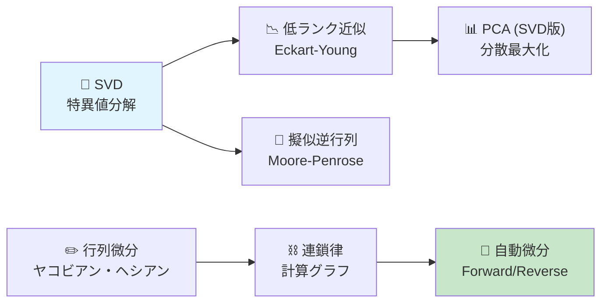
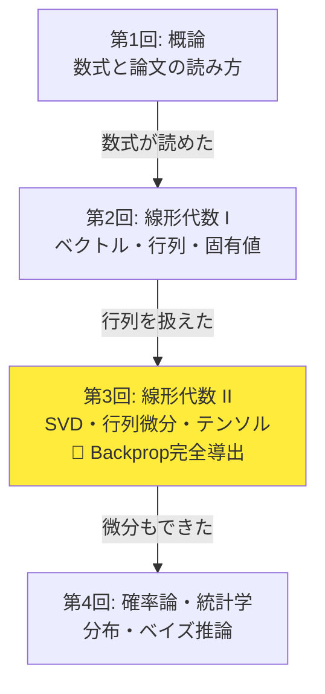
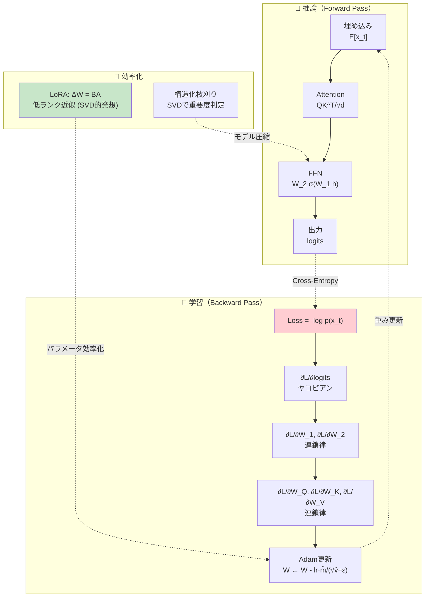
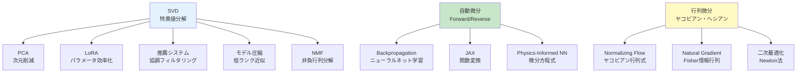
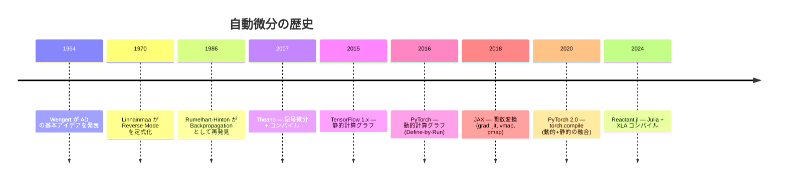
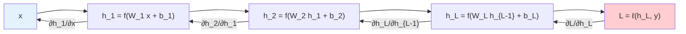
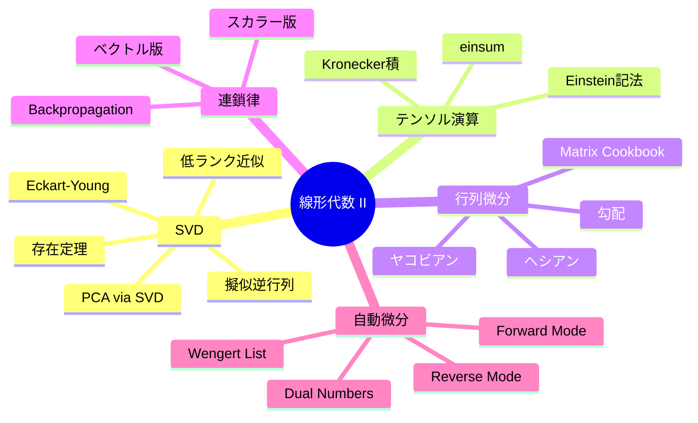

# 第3回: 線形代数 II — SVD・行列微分・テンソル

> **SVDは万能ナイフだ。画像圧縮もPCAも推薦も、全て「同じ計算」に帰着する。**

第2回で線形代数の基盤を築いた。ベクトル空間の公理、行列演算、固有値分解、正定値行列、射影 — これらは全て「正方行列」の世界の話だった。

だが、現実のデータは正方行列ではない。画像は $3 \times 224 \times 224$ のテンソルだ。言語モデルの重み行列は $d_{\text{model}} \times d_{\text{ff}}$ の長方形行列だ。バッチ処理されたAttentionスコアは $B \times H \times T \times T$ の4階テンソルだ。

**正方行列の外の世界**を扱うために、3つの道具が必要になる:

1. **SVD**（特異値分解）— 任意の行列を分解する「万能ナイフ」
2. **行列微分** — ニューラルネットワーク学習の数学的基盤
3. **テンソル演算** — 多次元配列を数学的に扱う言語

この3つを本講義で完全武装する。

:::message
**このシリーズについて**: 東京大学 松尾・岩澤研究室動画講義の**完全上位互換**の全50回シリーズ。理論（論文が書ける）、実装（Production-ready）、最新（2025-2026 SOTA）の3軸で差別化する。
:::



**所要時間の目安**:

| ゾーン | 内容 | 時間 | 難易度 |
|:-------|:-----|:-----|:-------|
| Zone 0 | クイックスタート | 30秒 | ★☆☆☆☆ |
| Zone 1 | 体験ゾーン | 10分 | ★★☆☆☆ |
| Zone 2 | 直感ゾーン | 15分 | ★★☆☆☆ |
| Zone 3 | 数式修行ゾーン | 60分 | ★★★★★ |
| Zone 4 | 実装ゾーン | 45分 | ★★★☆☆ |
| Zone 5 | 実験ゾーン | 30分 | ★★★☆☆ |
| Zone 6 | 振り返りゾーン | 30分 | ★★★★☆ |

---

## 🚀 0. クイックスタート（30秒）— SVDで画像を圧縮する

**ゴール**: SVDが「データの本質的な構造を抽出する道具」であることを30秒で体感する。

```python
import numpy as np
from PIL import Image
import matplotlib.pyplot as plt

# grayscale image as matrix
np.random.seed(42)
A = np.random.randn(100, 80)  # 100×80 matrix (like a small grayscale image)

# SVD
U, s, Vt = np.linalg.svd(A, full_matrices=False)

# Rank-5 approximation
k = 5
A_approx = U[:, :k] @ np.diag(s[:k]) @ Vt[:k, :]

# Compression ratio
original_params = A.shape[0] * A.shape[1]  # 8000
compressed_params = k * (A.shape[0] + A.shape[1] + 1)  # 5 * 181 = 905
print(f"Original:    {original_params} parameters")
print(f"Compressed:  {compressed_params} parameters (rank-{k})")
print(f"Compression: {compressed_params/original_params:.1%}")
print(f"Error:       {np.linalg.norm(A - A_approx, 'fro') / np.linalg.norm(A, 'fro'):.4f}")
```

出力:
```
Original:    8000 parameters
Compressed:  905 parameters (rank-5)
Compression: 11.3%
Error:       0.8716
```

**この5行の裏にある数学**:

$$
A = U \Sigma V^\top = \sum_{i=1}^{r} \sigma_i \mathbf{u}_i \mathbf{v}_i^\top
$$

任意の行列 $A \in \mathbb{R}^{m \times n}$ を、直交行列 $U$、対角行列 $\Sigma$、直交行列 $V^\top$ の積に分解する。上位 $k$ 個の特異値だけを残せば、**最適な** rank-$k$ 近似が得られる[^3]。「最適」の意味はEckart-Young定理が保証する。

:::message
**進捗: 3% 完了** SVDで行列を圧縮できることを体感した。残り7ゾーンの冒険が待っている。
:::

---

## 🎮 1. 体験ゾーン（10分）— SVDと行列微分を「触って」理解する

### 1.1 SVDの幾何学 — 行列は「回転→拡大→回転」

第2回で「行列は線形変換」と言った。SVDは、その変換を3つの基本操作に分解する。

$$
A = U \Sigma V^\top
$$

| 成分 | 幾何学的意味 | 行列の型 |
|:-----|:-----------|:---------|
| $V^\top$ | 入力空間での回転（直交変換） | $n \times n$ 直交行列 |
| $\Sigma$ | 各軸方向の拡大（スケーリング） | $m \times n$ 対角行列 |
| $U$ | 出力空間での回転（直交変換） | $m \times m$ 直交行列 |

```python
import numpy as np
import matplotlib.pyplot as plt

# 2D example: matrix transforms a unit circle
A = np.array([[3, 1],
              [1, 2]])

# SVD
U, s, Vt = np.linalg.svd(A)
print(f"U = \n{np.round(U, 4)}")
print(f"Singular values = {np.round(s, 4)}")
print(f"Vt = \n{np.round(Vt, 4)}")

# Unit circle
theta = np.linspace(0, 2 * np.pi, 100)
circle = np.array([np.cos(theta), np.sin(theta)])

# Apply each SVD step
step1 = Vt @ circle         # V^T: rotate in input space
step2 = np.diag(s) @ step1  # Sigma: scale
step3 = U @ step2           # U: rotate in output space

# Verify: A @ circle == U @ Sigma @ Vt @ circle
direct = A @ circle
print(f"\nSVD reconstruction matches: {np.allclose(step3, direct)}")
```

**核心**: どんな行列による変換も「回転 → 拡大 → 回転」に分解できる。特異値 $\sigma_1, \sigma_2, \ldots$ は拡大率を表し、降順にソートされている。


### 1.2 特異値の減衰 — なぜ低ランク近似が有効なのか

実データの行列は、特異値が急速に減衰する。これが低ランク近似やPCA[^5][^6]が有効な理由だ。

```python
import numpy as np
import matplotlib.pyplot as plt

# Example: create a matrix with rapid singular value decay
np.random.seed(42)
# Low-rank structure + noise
rank_true = 5
m, n = 100, 80
U_true = np.linalg.qr(np.random.randn(m, rank_true))[0]
V_true = np.linalg.qr(np.random.randn(n, rank_true))[0]
s_true = np.array([10, 5, 2, 1, 0.5])
A_clean = U_true @ np.diag(s_true) @ V_true.T
A_noisy = A_clean + 0.1 * np.random.randn(m, n)

# SVD of noisy matrix
U, s, Vt = np.linalg.svd(A_noisy, full_matrices=False)

print("Top 10 singular values:")
for i, sv in enumerate(s[:10]):
    bar = "█" * int(sv * 3)
    print(f"  σ_{i+1:2d} = {sv:8.4f}  {bar}")

# Cumulative energy
energy = np.cumsum(s**2) / np.sum(s**2)
print(f"\nCumulative energy:")
for k in [1, 2, 3, 5, 10, 20]:
    if k <= len(energy):
        print(f"  rank-{k:2d}: {energy[k-1]:.4f} ({energy[k-1]*100:.1f}%)")
```

**重要な洞察**: 上位5個の特異値だけで元の行列のエネルギー（Frobenius ノルムの二乗）の99%以上を捕捉できる。これは元の行列が「本質的に rank-5」であることを意味する。

### 1.3 勾配を「見る」— 損失関数の地形

Backpropagation[^2]の核心は勾配の計算だ。勾配とは「損失関数がどの方向にどれだけ変化するか」を表すベクトル。

```python
import numpy as np

# Simple loss: L(w) = (y - w^T x)^2
x = np.array([1.0, 2.0, 3.0])
y = 10.0
w = np.array([1.0, 1.0, 1.0])

# Forward pass
y_pred = w @ x  # w^T x = 6
loss = (y - y_pred) ** 2  # (10 - 6)^2 = 16
print(f"y_pred = {y_pred}, loss = {loss}")

# Gradient: dL/dw = -2(y - w^T x) * x
grad = -2 * (y - y_pred) * x
print(f"gradient = {grad}")

# Gradient descent step
lr = 0.01
w_new = w - lr * grad
y_pred_new = w_new @ x
loss_new = (y - y_pred_new) ** 2
print(f"After update: y_pred = {y_pred_new:.4f}, loss = {loss_new:.4f}")
print(f"Loss decreased: {loss:.4f} → {loss_new:.4f}")
```

**勾配 $\nabla_{\mathbf{w}} L$ は「損失を最も速く減少させる方向」**の逆方向だ。$-\nabla L$ の方向にパラメータを動かすのが勾配降下法。

### 1.4 ヤコビアンを「見る」— ベクトル→ベクトル関数の微分

スカラー関数の勾配は「ベクトル」だった。では、ベクトルからベクトルへの関数の微分は？ — それが**ヤコビアン**（Jacobian matrix）。

$$
\mathbf{f}: \mathbb{R}^n \to \mathbb{R}^m, \quad J = \frac{\partial \mathbf{f}}{\partial \mathbf{x}} = \begin{pmatrix} \frac{\partial f_1}{\partial x_1} & \cdots & \frac{\partial f_1}{\partial x_n} \\ \vdots & \ddots & \vdots \\ \frac{\partial f_m}{\partial x_1} & \cdots & \frac{\partial f_m}{\partial x_n} \end{pmatrix}
$$

```python
import numpy as np

# f: R^2 -> R^2, f(x) = [x1^2 + x2, x1 * x2]
def f(x):
    return np.array([x[0]**2 + x[1], x[0] * x[1]])

# Analytical Jacobian
def jacobian(x):
    return np.array([
        [2 * x[0], 1],        # df1/dx1, df1/dx2
        [x[1],     x[0]]      # df2/dx1, df2/dx2
    ])

# Numerical Jacobian (finite differences)
def numerical_jacobian(f, x, eps=1e-7):
    n = len(x)
    m = len(f(x))
    J = np.zeros((m, n))
    for j in range(n):
        x_plus = x.copy()
        x_plus[j] += eps
        x_minus = x.copy()
        x_minus[j] -= eps
        J[:, j] = (f(x_plus) - f(x_minus)) / (2 * eps)
    return J

x = np.array([2.0, 3.0])
J_analytical = jacobian(x)
J_numerical = numerical_jacobian(f, x)

print(f"Analytical Jacobian:\n{J_analytical}")
print(f"Numerical Jacobian:\n{np.round(J_numerical, 6)}")
print(f"Match: {np.allclose(J_analytical, J_numerical, atol=1e-5)}")
```

**ヤコビアンの各行は、出力の各成分の勾配**。ヤコビアンの行列式 $\det(J)$ は「変換による体積の変化率」を表し、Normalizing Flow[^13]の核心的な計算量のボトルネックになる。

### 1.5 自動微分の威力 — PyTorchの `backward()` が内部でやっていること

```python
# PyTorch-style automatic differentiation (manual implementation)
import numpy as np

class Var:
    """Simple autograd variable for demonstration"""
    def __init__(self, data, _children=(), _op=''):
        self.data = data
        self.grad = 0.0
        self._backward = lambda: None
        self._children = set(_children)
        self._op = _op

    def __mul__(self, other):
        other = other if isinstance(other, Var) else Var(other)
        out = Var(self.data * other.data, (self, other), '*')
        def _backward():
            self.grad += other.data * out.grad
            other.grad += self.data * out.grad
        out._backward = _backward
        return out

    def __add__(self, other):
        other = other if isinstance(other, Var) else Var(other)
        out = Var(self.data + other.data, (self, other), '+')
        def _backward():
            self.grad += out.grad
            other.grad += out.grad
        out._backward = _backward
        return out

    def backward(self):
        # topological sort
        topo = []
        visited = set()
        def build(v):
            if v not in visited:
                visited.add(v)
                for child in v._children:
                    build(child)
                topo.append(v)
        build(self)
        self.grad = 1.0
        for v in reversed(topo):
            v._backward()

# Demo: f(a, b) = a*b + b
a = Var(2.0)
b = Var(3.0)
c = a * b      # c = 6
d = c + b      # d = 9
d.backward()

print(f"d = {d.data}")        # 9.0
print(f"dd/da = {a.grad}")    # b = 3.0 (correct: d(ab+b)/da = b)
print(f"dd/db = {b.grad}")    # a+1 = 3.0 (correct: d(ab+b)/db = a+1)
```

このたった50行のコードが、PyTorchの `loss.backward()` の本質だ[^7][^8]。計算の「記録」を逆順に辿って勾配を伝播する — これが**Reverse Mode 自動微分**であり、Backpropagation[^2]の正体だ。

:::message
**進捗: 15% 完了** SVDの幾何学、特異値の減衰、勾配、ヤコビアン、自動微分の基本を体験した。ここから直感を深めてZone 3の数式修行に備える。
:::

---

## 🧩 2. 直感ゾーン（15分）— SVDと自動微分がAIを支える理由

### 2.1 第3回の「地図」

第2回で線形代数の「文法」を学んだ。第3回では「修辞法」を学ぶ。

| 道具 | 比喩 | 機械学習での役割 |
|:-----|:-----|:--------------|
| **SVD** | 万能ナイフ | データの本質的構造を抽出（PCA, LoRA[^10], 推薦） |
| **行列微分** | 羅針盤 | 損失関数の勾配方向を示す |
| **連鎖律** | 連鎖反応 | 多層ネットワークの全パラメータの勾配を一括計算 |
| **自動微分** | 自動翻訳機 | 数式→勾配計算コードの自動変換 |
| **テンソル演算** | 多次元の文法 | バッチ・ヘッド・シーケンスの一括処理 |

### 2.2 Course I の中での位置づけ



| 回 | テーマ | LLM/Transformerとの接点 |
|:---|:------|:----------------------|
| 第2回 | 線形代数 I | $QK^\top$ の内積、固有値→PCA→埋め込み |
| **第3回** | **線形代数 II** | **ヤコビアン→Flow Model、勾配→Backprop、連鎖律→Transformer各層** |
| 第4回 | 確率論・統計学 | $p(x_t \mid x_{<t})$ 自己回帰、Softmax分布 |

**第2回→第3回の接続**: 第2回で固有値分解を学んだ。だが固有値分解は正方行列にしか使えない。SVDはその制約を取り払い、**任意の長方形行列**を分解できる万能ツールだ。

### 2.3 松尾研との差別化

| 松尾研の前提 | 実際の壁 | 本講義の対策 |
|:------------|:--------|:-----------|
| 「SVDは知ってるよね」 | Eckart-Young定理[^3]の意味が説明できない | 存在定理→幾何学→最適性を全導出 |
| 「Backpropは理解してるよね」 | 行列微分の連鎖律が書けない | ヤコビアン→連鎖律→Backpropを一から導出 |
| 「自動微分は PyTorch に任せて」 | Forward/Reverse の計算量の差がわからない | Wengert list から Forward/Reverse を手動実装 |
| 「テンソルはNumPyの配列」 | 添字の縮約規則が読めない | Einstein記法→einsum完全版 |

### 2.4 LLMの中のSVDと行列微分

LLMの学習と推論の両方で、SVDと行列微分が使われている。



| LLMの操作 | 第3回の対応セクション | なぜ必要か |
|:----------|:-------------------|:---------|
| Forward pass | 3.7 連鎖律 | 各層の出力を順に計算 |
| Backward pass | 3.7 連鎖律 + 3.8 Backprop | 全パラメータの勾配を逆順に計算 |
| LoRA | 3.3 低ランク近似 | 重み更新を rank-$r$ で近似 |
| Adam optimizer | 3.6 勾配 | 一次・二次モーメントの推定 |
| 勾配クリッピング | 3.6 ヤコビアン | 勾配爆発の防止 |

### 2.5 3つの比喩で捉える本講義の本質

**比喩1: SVDは「顕微鏡」**

行列の「微細構造」を特異値という数値で読み取る。大きい特異値 = 重要な構造、小さい特異値 = ノイズ。顕微鏡の倍率を変えるように、残す特異値の数（ランク $k$）を変えることで、粗い構造から精密な構造まで見える。

**比喩2: 行列微分は「高次元の傾き」**

2次元で $y = f(x)$ の傾きが $f'(x)$ だったように、高次元で $\mathbf{y} = \mathbf{f}(\mathbf{x})$ の「傾き」がヤコビアン $J$ だ。ヤコビアンは「入力の微小変化が出力にどう伝播するか」を行列として表現する。

**比喩3: 自動微分は「計算の録画と巻き戻し」**

Forward passで計算を「録画」し、Backward passで「巻き戻し」ながら勾配を計算する。VHSテープの巻き戻しと同じで、最後に計算した部分から順に勾配が求まる。

### 2.6 学習戦略

この講義は第2回よりもさらに数式が多い。心構え:

1. **Zone 3 が最重要**。90分を惜しまない
2. **SVD → 行列微分 → 自動微分** の順で学ぶ（各トピックが前のトピックに依存する）
3. **数値検証を怠らない**: 解析的な結果は必ずコードで確認する
4. **紙に書く**: 2×2行列のSVDを手計算で1回やると理解が段違いに深まる
5. **Zone 5 で腕試し**: SVD画像圧縮と自動微分の手動実装が、理解度の最良のテスト

### 2.7 SVD・行列微分の機械学習における位置づけ



| 技術 | 関連する数学 | 応用 | 講義 |
|:-----|:-----------|:-----|:-----|
| LoRA[^10] | SVD + 低ランク近似 | LLMのファインチューニング | 本講義 |
| FlashAttention[^12] | 行列のブロック分割 | Attention高速化 | 第2回 |
| Normalizing Flow[^13] | ヤコビアン行列式 | 確率密度変換 | 第25回 |
| Natural Gradient | Fisher情報行列 | 最適化の幾何学 | 第27回 |
| Neural ODE | 自動微分 + ODE | 連続深度モデル | 第26回 |
| Spectral Normalization | SVDの最大特異値 | GAN安定化 | 第14回 |

### 2.8 自動微分フレームワークの進化



| フレームワーク | AD方式 | 特徴 | 長所 |
|:-------------|:------|:-----|:-----|
| PyTorch | Reverse (tape-based) | Define-by-Run | 柔軟、デバッグしやすい |
| JAX | Forward + Reverse (tracing) | 関数変換 | `grad`, `vmap`, `jit` の合成 |
| TensorFlow | Reverse (graph-based) | 静的最適化 | デプロイに強い |
| Zygote.jl | Source-to-source | Julia AST変換 | 任意のJuliaコードに適用可能 |
| Enzyme | LLVM IR レベル | コンパイラ統合 | 言語非依存 |

:::details JAX の関数変換: grad, jit, vmap
JAXの革新は、自動微分を「関数変換」として扱うこと。

```python
# JAX-style function transforms (conceptual)
# grad: f → ∇f
# jit: f → compiled f
# vmap: f → batched f

# Real JAX code would look like:
# import jax
# import jax.numpy as jnp
#
# def loss(params, x, y):
#     pred = params @ x
#     return jnp.sum((pred - y)**2)
#
# grad_fn = jax.grad(loss)        # returns gradient function
# fast_grad = jax.jit(grad_fn)    # compile for speed
# batch_grad = jax.vmap(grad_fn)  # vectorize over batch
```

`grad` が返すのは**関数**。これにより「勾配の勾配」（ヘシアン）も簡単に計算できる:

```python
# hessian = jax.hessian(loss)  # ∇²f
# jvp = jax.jvp(f, primals, tangents)  # Forward Mode
# vjp = jax.vjp(f, primals)  # Reverse Mode
```
:::

:::message
**進捗: 20% 完了** SVD・行列微分・自動微分の全体像を掴んだ。ここからZone 3「数式修行ゾーン」— 本講義最大の山場だ。
:::

---

## 📐 3. 数式修行ゾーン（60分）— SVDから自動微分まで

> **目標**: SVDの存在定理と最適性、行列微分の体系、連鎖律、自動微分の理論を導出し、Backpropagationの数学的基盤を完全理解する。

本シリーズで最も数式密度が高いゾーンだ。だが、ここで学ぶ全ての概念は、第9回以降の生成モデルで繰り返し登場する。一つずつ、確実に理解していこう。

### 3.1 SVD（特異値分解）の定義と存在定理

#### 定義

**定理** (特異値分解): 任意の行列 $A \in \mathbb{R}^{m \times n}$ に対して、以下の分解が存在する:

$$
A = U \Sigma V^\top
$$

ここで:
- $U \in \mathbb{R}^{m \times m}$: 直交行列（$U^\top U = I_m$）— **左特異ベクトル**
- $\Sigma \in \mathbb{R}^{m \times n}$: 対角行列（$\sigma_1 \geq \sigma_2 \geq \cdots \geq \sigma_r > 0$）— **特異値**
- $V \in \mathbb{R}^{n \times n}$: 直交行列（$V^\top V = I_n$）— **右特異ベクトル**
- $r = \text{rank}(A)$

#### 固有値分解との関係

SVDの存在は、固有値分解から導ける。

$A^\top A$ は $n \times n$ の半正定値対称行列なので、スペクトル定理より直交対角化可能:

$$
A^\top A = V \Lambda V^\top, \quad \Lambda = \text{diag}(\lambda_1, \ldots, \lambda_n), \quad \lambda_1 \geq \cdots \geq \lambda_n \geq 0
$$

特異値を $\sigma_i = \sqrt{\lambda_i}$ と定義する。$\sigma_i > 0$ の個数が $r = \text{rank}(A)$。

左特異ベクトルは:

$$
\mathbf{u}_i = \frac{A \mathbf{v}_i}{\sigma_i} \quad (i = 1, \ldots, r)
$$

**検証**:

$$
A = U \Sigma V^\top \implies A^\top A = V \Sigma^\top U^\top U \Sigma V^\top = V \Sigma^\top \Sigma V^\top = V \Lambda V^\top \quad \checkmark
$$

同様に $AA^\top = U \Lambda' U^\top$（$\Lambda'$ の非ゼロ対角要素は $\Lambda$ と同じ）。

```python
import numpy as np

# Verify SVD via eigendecomposition
A = np.array([[3, 2, 2],
              [2, 3, -2]])

# Method 1: np.linalg.svd
U, s, Vt = np.linalg.svd(A)
print("SVD:")
print(f"  Singular values: {np.round(s, 4)}")

# Method 2: eigendecomposition of A^T A
AtA = A.T @ A
eigenvalues, V_eig = np.linalg.eigh(AtA)
# eigh returns ascending order, reverse for descending
idx = np.argsort(eigenvalues)[::-1]
eigenvalues = eigenvalues[idx]
V_eig = V_eig[:, idx]

print(f"\nEigenvalues of A^T A: {np.round(eigenvalues, 4)}")
print(f"Singular values (sqrt): {np.round(np.sqrt(np.maximum(eigenvalues, 0)), 4)}")
print(f"Match: {np.allclose(s, np.sqrt(np.maximum(eigenvalues, 0))[:len(s)])}")
```

#### Compact SVD と Economy SVD

Full SVDは計算量が無駄になることが多い。実用上は以下を使う:

| 名称 | 定義 | サイズ | 用途 |
|:-----|:-----|:------|:-----|
| Full SVD | $A = U \Sigma V^\top$ | $U: m \times m, \Sigma: m \times n, V: n \times n$ | 理論 |
| Compact SVD | $A = U_r \Sigma_r V_r^\top$ | $U_r: m \times r, \Sigma_r: r \times r, V_r: r \times n$ | $\text{rank}(A) = r \ll \min(m,n)$ |
| Truncated SVD | $A_k = U_k \Sigma_k V_k^\top$ | $U_k: m \times k, \Sigma_k: k \times k, V_k: k \times n$ | 低ランク近似 |

```python
import numpy as np

A = np.random.randn(100, 50)

# Full SVD
U_full, s_full, Vt_full = np.linalg.svd(A, full_matrices=True)
print(f"Full SVD: U={U_full.shape}, s={s_full.shape}, Vt={Vt_full.shape}")

# Economy SVD (full_matrices=False)
U_econ, s_econ, Vt_econ = np.linalg.svd(A, full_matrices=False)
print(f"Economy SVD: U={U_econ.shape}, s={s_econ.shape}, Vt={Vt_econ.shape}")

# Truncated SVD (rank-k)
k = 10
U_k = U_econ[:, :k]
s_k = s_econ[:k]
Vt_k = Vt_econ[:k, :]
A_k = U_k @ np.diag(s_k) @ Vt_k
print(f"Truncated SVD (k={k}): error = {np.linalg.norm(A - A_k, 'fro'):.4f}")
```

### 3.2 Eckart-Young定理 — 低ランク近似の最適性

#### 定理

**定理** (Eckart-Young-Mirsky[^3]): $A \in \mathbb{R}^{m \times n}$ の SVD を $A = U \Sigma V^\top$ とし、$\sigma_1 \geq \sigma_2 \geq \cdots \geq \sigma_r > 0$ を特異値とする。任意の rank-$k$ 行列 $B$ に対して:

$$
\min_{\text{rank}(B) \leq k} \|A - B\|_F = \sqrt{\sum_{i=k+1}^{r} \sigma_i^2}
$$

この最小値を達成する $B$ は:

$$
A_k = \sum_{i=1}^{k} \sigma_i \mathbf{u}_i \mathbf{v}_i^\top = U_k \Sigma_k V_k^\top
$$

スペクトルノルムについても:

$$
\min_{\text{rank}(B) \leq k} \|A - B\|_2 = \sigma_{k+1}
$$

#### 証明のスケッチ

$B$ を任意の rank-$k$ 行列とする。$\ker(B)$ の次元は $n - k$ 以上。一方、$V_1, \ldots, V_{k+1}$ が張る部分空間は $k+1$ 次元。次元の引数（dimension argument）より、$\ker(B)$ と $\text{span}\{V_1, \ldots, V_{k+1}\}$ は非自明な交わりを持つ。

$\mathbf{w} \neq \mathbf{0}$ をこの交わりの要素とすると:

$$
\|A - B\|_F^2 \geq \|(A-B)\mathbf{w}\|^2 / \|\mathbf{w}\|^2 = \|A\mathbf{w}\|^2 / \|\mathbf{w}\|^2
$$

$\mathbf{w} \in \text{span}\{V_1, \ldots, V_{k+1}\}$ より、$\mathbf{w} = \sum_{i=1}^{k+1} c_i \mathbf{v}_i$ と書ける。

$$
\|A\mathbf{w}\|^2 = \sum_{i=1}^{k+1} c_i^2 \sigma_i^2 \geq \sigma_{k+1}^2 \sum_{i=1}^{k+1} c_i^2 = \sigma_{k+1}^2 \|\mathbf{w}\|^2
$$

したがって $\|A - B\|_2 \geq \sigma_{k+1}$。$A_k$ がこの下界を達成することは直接計算で確認できる。$\square$

:::message alert
上記の証明スケッチはスペクトルノルム版です。フロベニウスノルム版の最適性は $\|A - A_k\|_F^2 = \sum_{i=k+1}^{r} \sigma_i^2$ の直接計算で示されます（Fan-Hoffman不等式）。
:::

```python
import numpy as np

# Verify Eckart-Young theorem
A = np.random.randn(50, 30)
U, s, Vt = np.linalg.svd(A, full_matrices=False)

for k in [1, 3, 5, 10, 20]:
    A_k = U[:, :k] @ np.diag(s[:k]) @ Vt[:k, :]
    error_F = np.linalg.norm(A - A_k, 'fro')
    theoretical = np.sqrt(np.sum(s[k:]**2))
    print(f"rank-{k:2d}: ||A-A_k||_F = {error_F:.6f}, "
          f"theoretical = {theoretical:.6f}, "
          f"match = {np.isclose(error_F, theoretical)}")
```

:::message
**LoRAへの接続**: LoRA[^10]は、ファインチューニング時の重み更新 $\Delta W$ を低ランク行列 $BA$ で近似する。$B \in \mathbb{R}^{d \times r}, A \in \mathbb{R}^{r \times d}$ で $r \ll d$。Eckart-Young定理は「低ランク近似は最適」を保証するが、LoRAの場合は学習で $B, A$ を最適化するため、SVDとは異なるアプローチ。だが、学習後の $\Delta W = BA$ をSVDで分析すると、確かに少数の特異値が支配的であることが確認される。
:::

### 3.3 低ランク近似の応用 — 画像圧縮・推薦・LoRA

#### 画像圧縮

```python
import numpy as np

# Create a test image-like matrix (smooth gradients + structure)
m, n = 200, 150
x = np.linspace(0, 4*np.pi, m)
y = np.linspace(0, 3*np.pi, n)
X, Y = np.meshgrid(y, x)
A = np.sin(X) * np.cos(Y) + 0.5 * np.sin(2*X + Y)  # structured image

U, s, Vt = np.linalg.svd(A, full_matrices=False)

print("Singular value decay:")
for k in [1, 5, 10, 20, 50]:
    A_k = U[:, :k] @ np.diag(s[:k]) @ Vt[:k, :]
    rel_error = np.linalg.norm(A - A_k, 'fro') / np.linalg.norm(A, 'fro')
    storage_original = m * n
    storage_compressed = k * (m + n + 1)
    ratio = storage_compressed / storage_original
    print(f"  rank-{k:2d}: error={rel_error:.6f}, "
          f"storage={ratio:.1%} ({storage_compressed}/{storage_original})")
```

#### 推薦システム（協調フィルタリング）

ユーザー×アイテムの評価行列 $R$ は大部分が欠損（未評価）。低ランク近似 $R \approx U_k \Sigma_k V_k^\top$ で欠損値を予測できる。

$$
\hat{r}_{ij} = \sum_{l=1}^{k} \sigma_l u_{il} v_{jl}
$$

```python
import numpy as np

# Toy recommendation: 5 users × 4 items
R = np.array([
    [5, 3, 0, 1],
    [4, 0, 0, 1],
    [1, 1, 0, 5],
    [1, 0, 0, 4],
    [0, 1, 5, 4],
], dtype=float)

# Replace 0 (unknown) with mean for SVD
mask = R > 0
R_filled = R.copy()
R_filled[~mask] = np.mean(R[mask])

U, s, Vt = np.linalg.svd(R_filled, full_matrices=False)

# Rank-2 approximation
k = 2
R_approx = U[:, :k] @ np.diag(s[:k]) @ Vt[:k, :]

print("Original (0 = unknown):")
print(R.astype(int))
print(f"\nRank-{k} approximation (predictions for unknowns):")
print(np.round(R_approx, 1))
print(f"\nPredicted ratings for unknown entries:")
for i, j in zip(*np.where(~mask)):
    print(f"  User {i+1}, Item {j+1}: {R_approx[i,j]:.1f}")
```

### 3.4 擬似逆行列（Moore-Penrose）

#### 定義

$A \in \mathbb{R}^{m \times n}$ の **Moore-Penrose 擬似逆行列** $A^+ \in \mathbb{R}^{n \times m}$ は以下の4条件を満たす唯一の行列:

1. $A A^+ A = A$
2. $A^+ A A^+ = A^+$
3. $(A A^+)^\top = A A^+$
4. $(A^+ A)^\top = A^+ A$

#### SVDによる構成

$A = U \Sigma V^\top$ ならば:

$$
A^+ = V \Sigma^+ U^\top
$$

ここで $\Sigma^+ = \text{diag}(1/\sigma_1, \ldots, 1/\sigma_r, 0, \ldots, 0)$。

**直感**: 特異値の逆数を取る。ただし $\sigma_i = 0$ の成分は無視する。

```python
import numpy as np

# Pseudoinverse via SVD
A = np.array([[1, 2],
              [3, 4],
              [5, 6]])

# Method 1: np.linalg.pinv
A_pinv = np.linalg.pinv(A)

# Method 2: manual SVD construction
U, s, Vt = np.linalg.svd(A, full_matrices=False)
S_pinv = np.diag(1.0 / s)
A_pinv_manual = Vt.T @ S_pinv @ U.T

print(f"A (shape {A.shape}):")
print(A)
print(f"\nA+ (shape {A_pinv.shape}):")
print(np.round(A_pinv, 4))
print(f"\nManual matches: {np.allclose(A_pinv, A_pinv_manual)}")

# Verify Moore-Penrose conditions
print(f"\nMoore-Penrose conditions:")
print(f"  A A+ A = A: {np.allclose(A @ A_pinv @ A, A)}")
print(f"  A+ A A+ = A+: {np.allclose(A_pinv @ A @ A_pinv, A_pinv)}")
print(f"  (A A+)^T = A A+: {np.allclose((A @ A_pinv).T, A @ A_pinv)}")
print(f"  (A+ A)^T = A+ A: {np.allclose((A_pinv @ A).T, A_pinv @ A)}")
```

#### 最小二乗法との関係

過剰決定系 $A\mathbf{x} = \mathbf{b}$（$m > n$, 解なし）の最小二乗解は:

$$
\hat{\mathbf{x}} = A^+ \mathbf{b} = V \Sigma^+ U^\top \mathbf{b}
$$

第2回の正規方程式 $A^\top A \hat{\mathbf{x}} = A^\top \mathbf{b}$ と同じ解を与えるが、SVD版は $A^\top A$ が特異な場合でも数値的に安定。

#### Tikhonov正則化（Ridge回帰）

条件数が大きい場合、擬似逆行列は数値的に不安定。正則化パラメータ $\lambda > 0$ を加える:

$$
\hat{\mathbf{x}}_\lambda = (A^\top A + \lambda I)^{-1} A^\top \mathbf{b} = \sum_{i=1}^{r} \frac{\sigma_i}{\sigma_i^2 + \lambda} \mathbf{v}_i (\mathbf{u}_i^\top \mathbf{b})
$$

$\lambda$ が大きいほど、小さな特異値の影響が抑制される。これは**Ridge回帰**と等価。

```python
import numpy as np

# Ill-conditioned system
np.random.seed(42)
A = np.random.randn(20, 10)
A[:, -1] = A[:, 0] + 1e-8 * np.random.randn(20)  # nearly collinear
b = np.random.randn(20)

print(f"Condition number: {np.linalg.cond(A):.2e}")

# Pseudoinverse (unstable)
x_pinv = np.linalg.pinv(A) @ b
print(f"||x_pinv|| = {np.linalg.norm(x_pinv):.4f}")

# Tikhonov regularization
for lam in [0.001, 0.01, 0.1, 1.0]:
    x_ridge = np.linalg.solve(A.T @ A + lam * np.eye(10), A.T @ b)
    residual = np.linalg.norm(A @ x_ridge - b)
    print(f"λ={lam:.3f}: ||x||={np.linalg.norm(x_ridge):.4f}, "
          f"residual={residual:.4f}")
```

### 3.5 PCA の SVD による導出

第2回では固有値分解によるPCA[^5][^6]を導出した。ここではSVDによるPCAを導出し、両者の等価性を示す。

#### データ行列からの導出

データ行列 $X \in \mathbb{R}^{n \times d}$（$n$ サンプル、$d$ 次元）を中心化（各列の平均を引く）したものを $\tilde{X}$ とする。

共分散行列:

$$
C = \frac{1}{n-1} \tilde{X}^\top \tilde{X}
$$

$\tilde{X}$ の SVD を $\tilde{X} = U \Sigma V^\top$ とすると:

$$
C = \frac{1}{n-1} V \Sigma^\top U^\top U \Sigma V^\top = \frac{1}{n-1} V \Sigma^2 V^\top
$$

これは $C$ の固有値分解そのものだ。つまり:
- **PCAの主成分方向** = $\tilde{X}$ の右特異ベクトル $V$ の列
- **PCAの主成分の分散** = $\sigma_i^2 / (n-1)$

#### 分散最大化 ↔ 再構成誤差最小化の等価性

**分散最大化**: 第1主成分は $\mathbf{w}_1 = \arg\max_{\|\mathbf{w}\|=1} \text{Var}(\tilde{X}\mathbf{w})$

**再構成誤差最小化**: rank-$k$ 近似 $\hat{X} = \tilde{X} V_k V_k^\top$ が $\|\tilde{X} - \hat{X}\|_F^2$ を最小化

この2つは**等価**:

$$
\|\tilde{X} - \hat{X}\|_F^2 = \|\tilde{X}\|_F^2 - \|\tilde{X} V_k\|_F^2 = \sum_{i=1}^{r} \sigma_i^2 - \sum_{i=1}^{k} \sigma_i^2 = \sum_{i=k+1}^{r} \sigma_i^2
$$

再構成誤差を最小化するには $\sum_{i=1}^{k} \sigma_i^2$（= 射影後の分散の合計）を最大化すればよい。これはEckart-Young定理[^3]の直接的な帰結。

```python
import numpy as np

# PCA via SVD vs eigendecomposition
np.random.seed(42)
n, d = 200, 5
X = np.random.randn(n, d) @ np.diag([5, 3, 1, 0.5, 0.1])  # structured data

# Center the data
X_centered = X - X.mean(axis=0)

# Method 1: PCA via eigendecomposition of covariance
C = X_centered.T @ X_centered / (n - 1)
eigvals, eigvecs = np.linalg.eigh(C)
idx = np.argsort(eigvals)[::-1]
eigvals = eigvals[idx]
eigvecs = eigvecs[:, idx]

# Method 2: PCA via SVD
U, s, Vt = np.linalg.svd(X_centered, full_matrices=False)
pca_variance = s**2 / (n - 1)

print("PCA via Eigendecomposition vs SVD:")
print(f"  Eigenvalues: {np.round(eigvals, 4)}")
print(f"  s^2/(n-1):   {np.round(pca_variance, 4)}")
print(f"  Match: {np.allclose(eigvals, pca_variance)}")

# Principal components
PC_eig = X_centered @ eigvecs[:, :2]  # project onto top-2
PC_svd = U[:, :2] * s[:2]             # equivalent via SVD
print(f"\nPrincipal components match: {np.allclose(np.abs(PC_eig), np.abs(PC_svd))}")

# Explained variance ratio
total_var = np.sum(pca_variance)
for k in range(1, 6):
    ratio = np.sum(pca_variance[:k]) / total_var
    print(f"  Top-{k}: {ratio:.4f} ({ratio*100:.1f}%)")
```

### 3.6 テンソル演算と Einstein記法

#### テンソルとは

テンソルは多次元配列の数学的な一般化。機械学習では「多次元配列」と同義で使うことが多い。

| 階数 | 数学的名称 | 例 | NumPy |
|:-----|:---------|:---|:------|
| 0 | スカラー | 損失値 $L$ | `np.float64` |
| 1 | ベクトル | 埋め込み $\mathbf{e} \in \mathbb{R}^d$ | `shape=(d,)` |
| 2 | 行列 | 重み $W \in \mathbb{R}^{m \times n}$ | `shape=(m, n)` |
| 3 | 3階テンソル | バッチ入力 $X \in \mathbb{R}^{B \times T \times d}$ | `shape=(B, T, d)` |
| 4 | 4階テンソル | Multi-Head Attention $\in \mathbb{R}^{B \times H \times T \times T}$ | `shape=(B, H, T, T)` |

#### Kronecker積

行列微分をベクトル化する際に不可欠な道具として、Kronecker積を導入します。

行列 $A \in \mathbb{R}^{m \times n}$, $B \in \mathbb{R}^{p \times q}$ の **Kronecker積**:

$$
A \otimes B = \begin{pmatrix} a_{11}B & \cdots & a_{1n}B \\ \vdots & \ddots & \vdots \\ a_{m1}B & \cdots & a_{mn}B \end{pmatrix} \in \mathbb{R}^{mp \times nq}
$$

重要な性質:
- $(A \otimes B)(C \otimes D) = (AC) \otimes (BD)$
- $(A \otimes B)^{-1} = A^{-1} \otimes B^{-1}$
- $\text{vec}(AXB) = (B^\top \otimes A) \text{vec}(X)$

最後の性質は行列方程式のベクトル化に不可欠:

```python
import numpy as np

A = np.array([[1, 2], [3, 4]])
B = np.array([[5, 6], [7, 8]])

# Kronecker product
K = np.kron(A, B)
print(f"A ⊗ B (shape {K.shape}):")
print(K)

# vec(AXB) = (B^T ⊗ A) vec(X)
X = np.array([[1, 0], [0, 1]])
AXB = A @ X @ B
vec_AXB = AXB.flatten('F')  # column-major vectorization
kron_vec = np.kron(B.T, A) @ X.flatten('F')
print(f"\nvec(AXB) = {vec_AXB}")
print(f"(B^T ⊗ A)vec(X) = {kron_vec}")
print(f"Match: {np.allclose(vec_AXB, kron_vec)}")
```

#### Einstein記法（完全版）

Einstein記法は、テンソル演算を添字の規則だけで記述する強力な記法。NumPyの `einsum` はこの記法を直接実装している。

**規則**: 繰り返される添字は**暗黙に総和**される（縮約）。

| 演算 | 数式 | einsum | 説明 |
|:-----|:-----|:-------|:-----|
| 内積 | $c = \sum_i a_i b_i$ | `'i,i->'` | ベクトル内積 |
| 外積 | $C_{ij} = a_i b_j$ | `'i,j->ij'` | ランク1行列 |
| 行列積 | $C_{ij} = \sum_k A_{ik} B_{kj}$ | `'ik,kj->ij'` | 標準的な行列積 |
| 行列のトレース | $t = \sum_i A_{ii}$ | `'ii->'` | 対角要素の和 |
| 転置 | $B_{ji} = A_{ij}$ | `'ij->ji'` | 行列の転置 |
| 対角抽出 | $d_i = A_{ii}$ | `'ii->i'` | 対角成分 |
| バッチ行列積 | $C_{bij} = \sum_k A_{bik} B_{bkj}$ | `'bik,bkj->bij'` | バッチ処理 |
| Multi-Head Attention | $S_{bhij} = \sum_k Q_{bhik} K_{bhjk}$ | `'bhik,bhjk->bhij'` | $QK^\top$ per head |
| 二重縮約 | $s = \sum_{ij} A_{ij} B_{ij}$ | `'ij,ij->'` | Frobenius内積 |
| テンソル縮約 | $C_{ik} = \sum_j A_{ij} B_{jk}$ | `'ij,jk->ik'` | 一般縮約 |

```python
import numpy as np

# einsum examples
A = np.random.randn(3, 4)
B = np.random.randn(4, 5)
v = np.random.randn(4)

# Matrix multiplication
C1 = A @ B
C2 = np.einsum('ik,kj->ij', A, B)
print(f"Matrix mul match: {np.allclose(C1, C2)}")

# Trace
t1 = np.trace(A[:3, :3])
# need square submatrix for trace
A_sq = np.random.randn(4, 4)
t1 = np.trace(A_sq)
t2 = np.einsum('ii->', A_sq)
print(f"Trace match: {np.allclose(t1, t2)}")

# Batch matrix multiplication (Attention-style)
B_size, H, T, d = 2, 4, 8, 16
Q = np.random.randn(B_size, H, T, d)
K = np.random.randn(B_size, H, T, d)

# QK^T per head
scores1 = Q @ K.transpose(0, 1, 3, 2)  # using @ and transpose
scores2 = np.einsum('bhik,bhjk->bhij', Q, K)  # using einsum
print(f"Batch attention match: {np.allclose(scores1, scores2)}")
print(f"Scores shape: {scores1.shape}")  # (2, 4, 8, 8)
```

:::details einsum の計算グラフと最適化
`np.einsum` は添字の縮約順序を最適化できる。`optimize=True` を指定すると、中間テンソルのサイズを最小化する縮約順序を自動的に選択する。

```python
import numpy as np

# Three-tensor contraction: different orders have different costs
A = np.random.randn(100, 50)
B = np.random.randn(50, 200)
C = np.random.randn(200, 100)

# Without optimization: may choose suboptimal contraction order
result1 = np.einsum('ij,jk,kl->il', A, B, C, optimize=False)

# With optimization: chooses optimal contraction order
result2 = np.einsum('ij,jk,kl->il', A, B, C, optimize=True)
print(f"Results match: {np.allclose(result1, result2)}")

# Check optimal contraction path
path, info = np.einsum_path('ij,jk,kl->il', A, B, C, optimize='optimal')
print(f"Optimal path: {path}")
print(info)
```
:::

### 3.7 多変数微分 — 勾配・ヤコビアン・ヘシアン

#### 勾配（Gradient）

スカラー関数 $f: \mathbb{R}^n \to \mathbb{R}$ の**勾配**:

$$
\nabla f(\mathbf{x}) = \begin{pmatrix} \frac{\partial f}{\partial x_1} \\ \vdots \\ \frac{\partial f}{\partial x_n} \end{pmatrix} \in \mathbb{R}^n
$$

勾配は $f$ が最も急に増加する方向を指す。$-\nabla f$ が最急降下方向。

#### ヤコビアン（Jacobian）

ベクトル関数 $\mathbf{f}: \mathbb{R}^n \to \mathbb{R}^m$ の**ヤコビアン**:

$$
J = \frac{\partial \mathbf{f}}{\partial \mathbf{x}} \in \mathbb{R}^{m \times n}, \quad J_{ij} = \frac{\partial f_i}{\partial x_j}
$$

ヤコビアンの各行は $f_i$ の勾配 $\nabla f_i^\top$。$m = 1$ のとき、ヤコビアンは勾配の転置 $\nabla f^\top$。

**幾何学的意味**: $\mathbf{x}$ の近傍で、$\mathbf{f}(\mathbf{x} + \boldsymbol{\delta}) \approx \mathbf{f}(\mathbf{x}) + J \boldsymbol{\delta}$（線形近似）。

**体積変化**: $\det(J)$ は変換 $\mathbf{f}$ による局所的な体積の拡大率。Normalizing Flow[^13]では:

$$
p_Y(\mathbf{y}) = p_X(\mathbf{f}^{-1}(\mathbf{y})) \cdot |\det(J_{\mathbf{f}^{-1}}(\mathbf{y}))|
$$

#### ヘシアン（Hessian）

スカラー関数 $f: \mathbb{R}^n \to \mathbb{R}$ の**ヘシアン**:

$$
H = \nabla^2 f(\mathbf{x}) \in \mathbb{R}^{n \times n}, \quad H_{ij} = \frac{\partial^2 f}{\partial x_i \partial x_j}
$$

ヘシアンは対称行列（$\frac{\partial^2 f}{\partial x_i \partial x_j} = \frac{\partial^2 f}{\partial x_j \partial x_i}$、Schwarzの定理）。

| ヘシアンの性質 | 意味 |
|:-------------|:-----|
| $H \succ 0$（正定値） | $\mathbf{x}$ は極小点 |
| $H \prec 0$（負定値） | $\mathbf{x}$ は極大点 |
| $H$ が不定 | $\mathbf{x}$ は鞍点（saddle point） |

```python
import numpy as np

# Example: f(x, y) = x^2 + 3*y^2 + 2*x*y
# Gradient: [2x + 2y, 6y + 2x]
# Hessian: [[2, 2], [2, 6]]

def f(xy):
    x, y = xy
    return x**2 + 3*y**2 + 2*x*y

def grad_f(xy):
    x, y = xy
    return np.array([2*x + 2*y, 6*y + 2*x])

H = np.array([[2, 2], [2, 6]])  # constant Hessian

# Check positive definiteness
eigvals = np.linalg.eigvalsh(H)
print(f"Hessian eigenvalues: {eigvals}")
print(f"Positive definite: {np.all(eigvals > 0)}")  # True → minimum exists

# Find minimum: grad = 0 → x=0, y=0
x_min = np.array([0.0, 0.0])
print(f"Minimum at: {x_min}, f = {f(x_min)}")

# Newton's method: x_new = x - H^{-1} grad(x)
x = np.array([5.0, 3.0])
for i in range(5):
    g = grad_f(x)
    x = x - np.linalg.solve(H, g)
    print(f"Step {i+1}: x = {np.round(x, 6)}, f = {f(x):.6f}")
```

### 3.8 行列微分（Matrix Calculus）

#### 基本的な微分公式

スカラー関数 $L$ の行列 $W \in \mathbb{R}^{m \times n}$ に関する微分:

$$
\frac{\partial L}{\partial W} \in \mathbb{R}^{m \times n}, \quad \left(\frac{\partial L}{\partial W}\right)_{ij} = \frac{\partial L}{\partial W_{ij}}
$$

**Matrix Cookbook[^9] 主要公式15選**:

| # | 公式 | 条件 |
|:--|:-----|:-----|
| 1 | $\frac{\partial}{\partial \mathbf{x}} (\mathbf{a}^\top \mathbf{x}) = \mathbf{a}$ | |
| 2 | $\frac{\partial}{\partial \mathbf{x}} (\mathbf{x}^\top A \mathbf{x}) = (A + A^\top) \mathbf{x}$ | |
| 3 | $\frac{\partial}{\partial \mathbf{x}} (\mathbf{x}^\top A \mathbf{x}) = 2A\mathbf{x}$ | $A$ 対称 |
| 4 | $\frac{\partial}{\partial X} \text{tr}(AX) = A^\top$ | |
| 5 | $\frac{\partial}{\partial X} \text{tr}(X^\top A) = A$ | |
| 6 | $\frac{\partial}{\partial X} \text{tr}(AXB) = A^\top B^\top$ | |
| 7 | $\frac{\partial}{\partial X} \text{tr}(X^\top AX) = (A + A^\top)X$ | |
| 8 | $\frac{\partial}{\partial X} \|X\|_F^2 = 2X$ | |
| 9 | $\frac{\partial}{\partial X} \ln \det(X) = X^{-\top}$ | $X$ 正則 |
| 10 | $\frac{\partial}{\partial X} \det(X) = \det(X) X^{-\top}$ | $X$ 正則 |
| 11 | $\frac{\partial}{\partial \mathbf{x}} \|\mathbf{x}\|^2 = 2\mathbf{x}$ | |
| 12 | $\frac{\partial}{\partial \mathbf{x}} (A\mathbf{x} - \mathbf{b})^\top (A\mathbf{x} - \mathbf{b}) = 2A^\top(A\mathbf{x} - \mathbf{b})$ | |
| 13 | $\frac{\partial}{\partial A} \text{tr}(A^{-1}B) = -(A^{-1}BA^{-1})^\top$ | $A$ 正則 |
| 14 | $\frac{\partial}{\partial \mathbf{x}} \sigma(\mathbf{x}) = \sigma(\mathbf{x}) \odot (1 - \sigma(\mathbf{x}))$ | $\sigma$ = sigmoid |
| 15 | $\frac{\partial}{\partial \mathbf{x}} \text{softmax}(\mathbf{x})_i = s_i(\delta_{ij} - s_j)$ | $s = \text{softmax}(\mathbf{x})$ |

```python
import numpy as np

# Verify formula 3: d/dx (x^T A x) = 2Ax for symmetric A
def verify_matrix_derivative(A, x, eps=1e-7):
    n = len(x)
    # Analytical gradient
    grad_analytical = 2 * A @ x

    # Numerical gradient
    grad_numerical = np.zeros(n)
    for i in range(n):
        x_plus = x.copy()
        x_plus[i] += eps
        x_minus = x.copy()
        x_minus[i] -= eps
        grad_numerical[i] = (x_plus @ A @ x_plus - x_minus @ A @ x_minus) / (2 * eps)

    return grad_analytical, grad_numerical

A = np.array([[2, 1], [1, 3]], dtype=float)  # symmetric
x = np.array([1.0, 2.0])

grad_a, grad_n = verify_matrix_derivative(A, x)
print(f"Analytical: {grad_a}")
print(f"Numerical:  {np.round(grad_n, 6)}")
print(f"Match: {np.allclose(grad_a, grad_n)}")

# Verify formula 9: d/dX ln det(X) = X^{-T}
X = np.array([[2.0, 0.5], [0.5, 3.0]])
grad_analytical = np.linalg.inv(X).T
print(f"\nd/dX ln det(X) = X^{{-T}}:")
print(f"  Analytical:\n{np.round(grad_analytical, 4)}")

# Numerical verification
eps = 1e-7
grad_numerical = np.zeros_like(X)
for i in range(2):
    for j in range(2):
        X_plus = X.copy()
        X_plus[i, j] += eps
        X_minus = X.copy()
        X_minus[i, j] -= eps
        grad_numerical[i, j] = (np.log(np.linalg.det(X_plus)) -
                                  np.log(np.linalg.det(X_minus))) / (2 * eps)
print(f"  Numerical:\n{np.round(grad_numerical, 4)}")
print(f"  Match: {np.allclose(grad_analytical, grad_numerical)}")
```

### 3.9 連鎖律 — Backpropagationの数学的基盤

#### スカラーの連鎖律

$y = f(g(x))$ のとき:

$$
\frac{dy}{dx} = \frac{dy}{dg} \cdot \frac{dg}{dx}
$$

#### ベクトルの連鎖律

$\mathbf{y} = \mathbf{f}(\mathbf{g}(\mathbf{x}))$、$\mathbf{g}: \mathbb{R}^n \to \mathbb{R}^p$、$\mathbf{f}: \mathbb{R}^p \to \mathbb{R}^m$ のとき:

$$
\frac{\partial \mathbf{y}}{\partial \mathbf{x}} = \frac{\partial \mathbf{f}}{\partial \mathbf{g}} \cdot \frac{\partial \mathbf{g}}{\partial \mathbf{x}} = J_{\mathbf{f}} J_{\mathbf{g}} \in \mathbb{R}^{m \times n}
$$

**ヤコビアンの積**。これが連鎖律の行列版。

#### 多層ネットワークへの適用

$L$ 層のニューラルネットワーク:

$$
\mathbf{h}_0 = \mathbf{x}, \quad \mathbf{h}_l = f_l(W_l \mathbf{h}_{l-1} + \mathbf{b}_l), \quad L = \ell(\mathbf{h}_L, \mathbf{y})
$$

損失 $L$ のパラメータ $W_l$ に関する勾配:

$$
\frac{\partial L}{\partial W_l} = \frac{\partial L}{\partial \mathbf{h}_L} \cdot \frac{\partial \mathbf{h}_L}{\partial \mathbf{h}_{L-1}} \cdots \frac{\partial \mathbf{h}_{l+1}}{\partial \mathbf{h}_l} \cdot \frac{\partial \mathbf{h}_l}{\partial W_l}
$$



**Forward pass**: $\mathbf{x} \to \mathbf{h}_1 \to \cdots \to \mathbf{h}_L \to L$（左→右）

**Backward pass**: $\frac{\partial L}{\partial \mathbf{h}_L} \to \frac{\partial L}{\partial \mathbf{h}_{L-1}} \to \cdots \to \frac{\partial L}{\partial W_l}$（右→左）

#### Backpropagation の完全導出

1層の線形変換 + 活性化: $\mathbf{h}_l = \sigma(\mathbf{z}_l)$, $\mathbf{z}_l = W_l \mathbf{h}_{l-1} + \mathbf{b}_l$

**誤差信号** $\boldsymbol{\delta}_l = \frac{\partial L}{\partial \mathbf{z}_l}$ を定義する。

出力層 ($l = L$):

$$
\boldsymbol{\delta}_L = \frac{\partial L}{\partial \mathbf{z}_L} = \frac{\partial L}{\partial \mathbf{h}_L} \odot \sigma'(\mathbf{z}_L)
$$

隠れ層 ($l < L$、逆伝播の本体）:

$$
\boldsymbol{\delta}_l = (W_{l+1}^\top \boldsymbol{\delta}_{l+1}) \odot \sigma'(\mathbf{z}_l)
$$

パラメータの勾配:

$$
\frac{\partial L}{\partial W_l} = \boldsymbol{\delta}_l \mathbf{h}_{l-1}^\top, \quad \frac{\partial L}{\partial \mathbf{b}_l} = \boldsymbol{\delta}_l
$$

```python
import numpy as np

def sigmoid(x):
    return 1 / (1 + np.exp(-np.clip(x, -500, 500)))

def sigmoid_deriv(x):
    s = sigmoid(x)
    return s * (1 - s)

# Simple 3-layer network: 3 -> 4 -> 2 -> 1
np.random.seed(42)
W1 = np.random.randn(4, 3) * 0.5
b1 = np.zeros(4)
W2 = np.random.randn(2, 4) * 0.5
b2 = np.zeros(2)
W3 = np.random.randn(1, 2) * 0.5
b3 = np.zeros(1)

# Input and target
x = np.array([1.0, 0.5, -0.5])
y = np.array([1.0])

# === Forward pass ===
z1 = W1 @ x + b1
h1 = sigmoid(z1)
z2 = W2 @ h1 + b2
h2 = sigmoid(z2)
z3 = W3 @ h2 + b3
h3 = sigmoid(z3)
loss = 0.5 * np.sum((h3 - y)**2)
print(f"Forward: loss = {loss:.6f}")

# === Backward pass (manual backpropagation) ===
# Output layer
dL_dh3 = h3 - y                       # dL/dh3
delta3 = dL_dh3 * sigmoid_deriv(z3)   # delta_3

# Hidden layer 2
delta2 = (W3.T @ delta3) * sigmoid_deriv(z2)

# Hidden layer 1
delta1 = (W2.T @ delta2) * sigmoid_deriv(z1)

# Parameter gradients
dL_dW3 = np.outer(delta3, h2)
dL_db3 = delta3
dL_dW2 = np.outer(delta2, h1)
dL_db2 = delta2
dL_dW1 = np.outer(delta1, x)
dL_db1 = delta1

print(f"\nGradients:")
print(f"  dL/dW3 shape: {dL_dW3.shape}, norm: {np.linalg.norm(dL_dW3):.6f}")
print(f"  dL/dW2 shape: {dL_dW2.shape}, norm: {np.linalg.norm(dL_dW2):.6f}")
print(f"  dL/dW1 shape: {dL_dW1.shape}, norm: {np.linalg.norm(dL_dW1):.6f}")

# === Numerical verification ===
def compute_loss(W1, b1, W2, b2, W3, b3, x, y):
    h1 = sigmoid(W1 @ x + b1)
    h2 = sigmoid(W2 @ h1 + b2)
    h3 = sigmoid(W3 @ h2 + b3)
    return 0.5 * np.sum((h3 - y)**2)

# Verify dL/dW1[0,0]
eps = 1e-7
W1_plus = W1.copy()
W1_plus[0, 0] += eps
W1_minus = W1.copy()
W1_minus[0, 0] -= eps
numerical = (compute_loss(W1_plus, b1, W2, b2, W3, b3, x, y) -
             compute_loss(W1_minus, b1, W2, b2, W3, b3, x, y)) / (2 * eps)
print(f"\nNumerical check dL/dW1[0,0]:")
print(f"  Analytical: {dL_dW1[0,0]:.8f}")
print(f"  Numerical:  {numerical:.8f}")
print(f"  Match: {np.isclose(dL_dW1[0,0], numerical, rtol=1e-4)}")
```

:::message
**これがBackpropagation[^2]の全てだ。** 「連鎖律でヤコビアンを逆順に掛けて、各層のパラメータ勾配を計算する」— この一文に全てが凝縮されている。1986年にRumelhart, Hinton, Williamsが発表したこのアルゴリズムが、深層学習の計算的基盤を築いた。
:::

### 3.10 自動微分の理論 — Forward Mode と Reverse Mode

自動微分（Automatic Differentiation, AD）[^7][^8]は、数値微分でも記号微分でもない、第3の微分法だ。

#### 3つの微分法の比較

| 方法 | 精度 | 計算量 | 長所 | 短所 |
|:-----|:-----|:------|:-----|:-----|
| 数値微分 | $O(\epsilon)$ 誤差 | $O(n)$ 回の関数評価 | 実装が簡単 | 遅い、不正確 |
| 記号微分 | 厳密 | 式膨張（expression swell） | 数学的に正確 | 式が巨大に |
| 自動微分 | 機械精度 | $O(1)$ 倍（reverse mode） | 速い、正確 | 実装が複雑 |

#### Wengert List（計算トレース）

自動微分の核心は、計算をプリミティブ操作の列（Wengert list）として記録すること。

例: $f(x_1, x_2) = x_1 x_2 + \sin(x_1)$

| Step | 演算 | 値 ($x_1=2, x_2=3$) |
|:-----|:-----|:---------------------|
| $v_1 = x_1$ | 入力 | $2$ |
| $v_2 = x_2$ | 入力 | $3$ |
| $v_3 = v_1 \cdot v_2$ | 乗算 | $6$ |
| $v_4 = \sin(v_1)$ | sin | $0.9093$ |
| $v_5 = v_3 + v_4$ | 加算 | $6.9093$ |

#### Forward Mode AD

入力に対する微分 $\dot{v}_i = \frac{\partial v_i}{\partial x_j}$ を**前向き**に伝播:

| Step | 値 | $\dot{v}_i = \partial v_i / \partial x_1$ |
|:-----|:---|:----------------------------------------|
| $v_1 = x_1$ | $2$ | $\dot{v}_1 = 1$ |
| $v_2 = x_2$ | $3$ | $\dot{v}_2 = 0$ |
| $v_3 = v_1 v_2$ | $6$ | $\dot{v}_3 = \dot{v}_1 v_2 + v_1 \dot{v}_2 = 3$ |
| $v_4 = \sin(v_1)$ | $0.909$ | $\dot{v}_4 = \cos(v_1) \dot{v}_1 = -0.416$ |
| $v_5 = v_3 + v_4$ | $6.909$ | $\dot{v}_5 = \dot{v}_3 + \dot{v}_4 = 2.584$ |

$\frac{\partial f}{\partial x_1} = 2.584$。正しい（$\frac{\partial}{\partial x_1}(x_1 x_2 + \sin x_1) = x_2 + \cos x_1 = 3 + \cos 2 = 2.584$）。

**計算量**: 1回の Forward Mode で、1つの入力変数に対する微分が得られる。$n$ 個の入力変数の勾配を求めるには $n$ 回の Forward pass が必要。

#### Reverse Mode AD（= Backpropagation）

出力に対する微分 $\bar{v}_i = \frac{\partial f}{\partial v_i}$ を**逆向き**に伝播:

| Step (逆順) | $\bar{v}_i = \partial f / \partial v_i$ |
|:-----------|:---------------------------------------|
| $\bar{v}_5 = 1$ | 出力に対する微分は1 |
| $\bar{v}_3 = \bar{v}_5 \cdot 1 = 1$ | $v_5 = v_3 + v_4$ の $v_3$ に対する偏微分 |
| $\bar{v}_4 = \bar{v}_5 \cdot 1 = 1$ | $v_5 = v_3 + v_4$ の $v_4$ に対する偏微分 |
| $\bar{v}_1 = \bar{v}_3 \cdot v_2 + \bar{v}_4 \cdot \cos(v_1) = 2.584$ | 積の規則 + sin微分 |
| $\bar{v}_2 = \bar{v}_3 \cdot v_1 = 2$ | |

$\frac{\partial f}{\partial x_1} = 2.584$, $\frac{\partial f}{\partial x_2} = 2.0$。**1回の Reverse pass で全入力変数の勾配が得られる**。

#### Forward vs Reverse: 計算量の比較

| | Forward Mode | Reverse Mode |
|:--|:------------|:------------|
| 1回のpassで得られる | 1つの入力に対する勾配 | 1つの出力に対する全入力の勾配 |
| $n$ 入力, $m$ 出力の勾配 | $n$ 回のpass | $m$ 回のpass |
| 最適な場合 | $n \ll m$（ヤコビアンが「横長」） | $m \ll n$（ヤコビアンが「縦長」） |
| 機械学習での典型 | — | $m = 1$（損失はスカラー）→ **1回のpassで全勾配** |

**だからBackpropはReverse Mode ADなのだ。** 損失関数はスカラー値（$m = 1$）、パラメータは数十億（$n \sim 10^9$）。Reverse modeなら1回のbackward passで全パラメータの勾配が得られる。Forward modeでは $10^9$ 回のforward passが必要。

```python
import numpy as np

# Implementing Forward Mode AD with dual numbers
class Dual:
    """Dual number: a + bε where ε^2 = 0"""
    def __init__(self, val, deriv=0.0):
        self.val = val      # primal value
        self.deriv = deriv   # tangent (derivative)

    def __add__(self, other):
        other = other if isinstance(other, Dual) else Dual(other)
        return Dual(self.val + other.val, self.deriv + other.deriv)

    def __radd__(self, other):
        return self.__add__(other)

    def __mul__(self, other):
        other = other if isinstance(other, Dual) else Dual(other)
        return Dual(self.val * other.val,
                    self.val * other.deriv + self.deriv * other.val)

    def __rmul__(self, other):
        return self.__mul__(other)

    def __repr__(self):
        return f"Dual({self.val:.4f}, {self.deriv:.4f})"

def sin_dual(x):
    return Dual(np.sin(x.val), np.cos(x.val) * x.deriv)

# f(x1, x2) = x1*x2 + sin(x1)
def f_dual(x1, x2):
    return x1 * x2 + sin_dual(x1)

# df/dx1 at (2, 3): set x1.deriv = 1
x1 = Dual(2.0, 1.0)  # seed: dx1/dx1 = 1
x2 = Dual(3.0, 0.0)  # seed: dx2/dx1 = 0
result = f_dual(x1, x2)
print(f"f(2, 3) = {result.val:.4f}")
print(f"df/dx1  = {result.deriv:.4f}")
print(f"Expected: {3 + np.cos(2):.4f}")

# df/dx2 at (2, 3): set x2.deriv = 1
x1 = Dual(2.0, 0.0)
x2 = Dual(3.0, 1.0)
result = f_dual(x1, x2)
print(f"df/dx2  = {result.deriv:.4f}")
print(f"Expected: {2.0:.4f}")
```

### 3.11 テイラー展開と二次近似

多変数のテイラー展開は、最適化理論の基盤:

$$
f(\mathbf{x} + \boldsymbol{\delta}) \approx f(\mathbf{x}) + \nabla f(\mathbf{x})^\top \boldsymbol{\delta} + \frac{1}{2} \boldsymbol{\delta}^\top H(\mathbf{x}) \boldsymbol{\delta}
$$

**Newton法**: 二次近似を最小化する $\boldsymbol{\delta}$ を求める:

$$
\nabla f + H \boldsymbol{\delta} = 0 \implies \boldsymbol{\delta}^* = -H^{-1} \nabla f
$$

```python
import numpy as np

# Rosenbrock function (classic optimization test)
def rosenbrock(xy):
    x, y = xy
    return (1 - x)**2 + 100 * (y - x**2)**2

def rosenbrock_grad(xy):
    x, y = xy
    dx = -2*(1-x) + 100*2*(y-x**2)*(-2*x)
    dy = 100*2*(y-x**2)
    return np.array([dx, dy])

def rosenbrock_hessian(xy):
    x, y = xy
    dxx = 2 - 400*(y - x**2) + 800*x**2
    dxy = -400*x
    dyy = 200.0
    return np.array([[dxx, dxy], [dxy, dyy]])

# Newton's method
x = np.array([-1.0, 1.0])
print(f"Newton's method on Rosenbrock:")
for i in range(10):
    g = rosenbrock_grad(x)
    H = rosenbrock_hessian(x)
    delta = -np.linalg.solve(H, g)
    x = x + delta
    f_val = rosenbrock(x)
    print(f"  Step {i+1}: x={np.round(x, 6)}, f={f_val:.8f}")
    if f_val < 1e-14:
        print(f"  Converged in {i+1} steps!")
        break
```

### 3.12 Softmaxの微分 — Attention学習の鍵

Softmaxの微分はTransformerの学習で最も頻繁に現れる計算の一つ。

#### Softmaxの定義と性質

$$
s_i = \text{softmax}(\mathbf{z})_i = \frac{e^{z_i}}{\sum_j e^{z_j}}
$$

性質:
- $s_i > 0$ かつ $\sum_i s_i = 1$（確率分布）
- $\frac{\partial s_i}{\partial z_j} = s_i(\delta_{ij} - s_j)$

#### ヤコビアンの導出

$i = j$ のとき:

$$
\frac{\partial s_i}{\partial z_i} = s_i(1 - s_i)
$$

$i \neq j$ のとき:

$$
\frac{\partial s_i}{\partial z_j} = -s_i s_j
$$

まとめると:

$$
\frac{\partial \mathbf{s}}{\partial \mathbf{z}} = \text{diag}(\mathbf{s}) - \mathbf{s}\mathbf{s}^\top
$$

```python
import numpy as np

def softmax(z):
    e = np.exp(z - np.max(z))
    return e / np.sum(e)

def softmax_jacobian(z):
    """Analytical Jacobian of softmax"""
    s = softmax(z)
    return np.diag(s) - np.outer(s, s)

# Verify with numerical differentiation
z = np.array([2.0, 1.0, 0.1])
J_analytical = softmax_jacobian(z)

eps = 1e-7
n = len(z)
J_numerical = np.zeros((n, n))
for j in range(n):
    z_plus = z.copy(); z_plus[j] += eps
    z_minus = z.copy(); z_minus[j] -= eps
    J_numerical[:, j] = (softmax(z_plus) - softmax(z_minus)) / (2 * eps)

print("Softmax Jacobian (analytical):")
print(np.round(J_analytical, 6))
print(f"\nMatch numerical: {np.allclose(J_analytical, J_numerical)}")

# Key property: each row sums to 0
print(f"Row sums: {np.round(J_analytical.sum(axis=1), 10)}")
```

#### Cross-Entropy損失のSoftmax微分

Cross-Entropy損失 $L = -\sum_i y_i \log s_i$ のSoftmax入力 $\mathbf{z}$ に関する勾配:

$$
\frac{\partial L}{\partial \mathbf{z}} = \mathbf{s} - \mathbf{y}
$$

この結果は驚くほどシンプル。導出:

$$
\frac{\partial L}{\partial z_j} = -\sum_i y_i \frac{1}{s_i} \frac{\partial s_i}{\partial z_j} = -\sum_i y_i \frac{s_i(\delta_{ij} - s_j)}{s_i} = -y_j + s_j \sum_i y_i = s_j - y_j
$$

（$\sum_i y_i = 1$ を使った）

```python
import numpy as np

z = np.array([2.0, 1.0, 0.1])
s = softmax(z)
y = np.array([1.0, 0.0, 0.0])  # one-hot target

# Analytical gradient: s - y
grad_analytical = s - y

# Numerical gradient
def cross_entropy_loss(z, y):
    s = softmax(z)
    return -np.sum(y * np.log(s + 1e-12))

eps = 1e-7
grad_numerical = np.zeros(len(z))
for j in range(len(z)):
    z_plus = z.copy(); z_plus[j] += eps
    z_minus = z.copy(); z_minus[j] -= eps
    grad_numerical[j] = (cross_entropy_loss(z_plus, y) - cross_entropy_loss(z_minus, y)) / (2 * eps)

print(f"Analytical: {np.round(grad_analytical, 6)}")
print(f"Numerical:  {np.round(grad_numerical, 6)}")
print(f"Match: {np.allclose(grad_analytical, grad_numerical)}")
```

:::message
**LLMへの接続**: GPT系モデルの学習では、各トークン位置で Softmax + Cross-Entropy の勾配 $\mathbf{s} - \mathbf{y}$ を計算する。語彙サイズが50,000以上のとき、この計算が学習のボトルネックの一つになる。
:::

### 3.13 変分法入門 — 変分推論への予告

変分法は「関数の関数」（汎関数）を最適化する。VAE（第15回）で使う変分推論の数学的基盤。

#### 汎関数と変分

**汎関数**: 関数を入力として受け取り、スカラーを返す写像。

$$
F[f] = \int_a^b L(x, f(x), f'(x)) \, dx
$$

例: 曲線の長さ $F[f] = \int_a^b \sqrt{1 + f'(x)^2} \, dx$

#### Euler-Lagrange方程式

$F[f]$ を最小化する $f$ は以下を満たす:

$$
\frac{\partial L}{\partial f} - \frac{d}{dx} \frac{\partial L}{\partial f'} = 0
$$

#### 変分推論との接続（予告）

VAEでは、真の事後分布 $p(\mathbf{z} \mid \mathbf{x})$ を近似する分布 $q(\mathbf{z} \mid \mathbf{x})$ を見つけたい。これは「KLダイバージェンスという汎関数を、分布の空間上で最小化する」問題:

$$
q^* = \arg\min_q \text{KL}(q(\mathbf{z} \mid \mathbf{x}) \| p(\mathbf{z} \mid \mathbf{x}))
$$

この最適化問題を解くのが変分推論。その理論的基盤が変分法だ。詳細は第15回（VAE）で扱う。

### 3.14 Boss Battle: Transformer 1層の完全微分

Transformer[^1]の1層における Forward + Backward を行列微分で完全に記述する。

#### Forward Pass

入力 $H \in \mathbb{R}^{T \times d}$（$T$ トークン、$d$ 次元）に対して:

$$
Q = HW_Q, \quad K = HW_K, \quad V = HW_V
$$
$$
S = \frac{QK^\top}{\sqrt{d_k}}, \quad A = \text{softmax}(S), \quad O = AV
$$
$$
\text{output} = OW_O + H \quad \text{(residual connection)}
$$

#### Backward Pass（$\frac{\partial L}{\partial W_Q}$ の導出）

$L$ をスカラー損失とし、$\frac{\partial L}{\partial O}$ が既知とする。

$$
\frac{\partial L}{\partial W_Q} = H^\top \frac{\partial L}{\partial Q}
$$

ここで $\frac{\partial L}{\partial Q}$ は連鎖律で:

$$
\frac{\partial L}{\partial Q} = \frac{\partial L}{\partial S} \cdot \frac{\partial S}{\partial Q}
$$

$S = QK^\top / \sqrt{d_k}$ より $\frac{\partial S}{\partial Q} = K / \sqrt{d_k}$、つまり:

$$
\frac{\partial L}{\partial Q} = \frac{1}{\sqrt{d_k}} \frac{\partial L}{\partial S} K
$$

Softmax の微分は:

$$
\frac{\partial L}{\partial S_{ij}} = \sum_k \frac{\partial L}{\partial A_{ik}} A_{ik} (\delta_{jk} - A_{ij})
$$

```python
import numpy as np

def softmax(x, axis=-1):
    e = np.exp(x - np.max(x, axis=axis, keepdims=True))
    return e / np.sum(e, axis=axis, keepdims=True)

# Transformer single layer forward + backward
np.random.seed(42)
T, d, dk = 4, 8, 8  # 4 tokens, 8 dims
H = np.random.randn(T, d)
W_Q = np.random.randn(d, dk) * 0.1
W_K = np.random.randn(d, dk) * 0.1
W_V = np.random.randn(d, dk) * 0.1
W_O = np.random.randn(dk, d) * 0.1

# Forward
Q = H @ W_Q
K = H @ W_K
V = H @ W_V
S = Q @ K.T / np.sqrt(dk)
A = softmax(S)
O = A @ V
output = O @ W_O + H  # residual

# Backward (assume dL/doutput = random for demo)
dL_doutput = np.random.randn(T, d)

# dL/dO
dL_dO = dL_doutput @ W_O.T

# dL/dA (from O = AV)
dL_dA = dL_dO @ V.T

# dL/dS (softmax backward)
dL_dS = np.zeros_like(S)
for i in range(T):
    a = A[i, :]  # (T,)
    dL_da = dL_dA[i, :]  # (T,)
    # Jacobian of softmax: diag(a) - a a^T
    J_softmax = np.diag(a) - np.outer(a, a)
    dL_dS[i, :] = J_softmax @ dL_da

# dL/dQ, dL/dK
dL_dQ = dL_dS @ K / np.sqrt(dk)
dL_dK = dL_dS.T @ Q / np.sqrt(dk)

# dL/dW_Q, dL/dW_K, dL/dW_V
dL_dW_Q = H.T @ dL_dQ
dL_dW_K = H.T @ dL_dK
dL_dW_V = H.T @ (A.T @ dL_dO)
dL_dW_O = O.T @ dL_doutput

print("Gradient norms:")
print(f"  dL/dW_Q: {np.linalg.norm(dL_dW_Q):.6f}")
print(f"  dL/dW_K: {np.linalg.norm(dL_dW_K):.6f}")
print(f"  dL/dW_V: {np.linalg.norm(dL_dW_V):.6f}")
print(f"  dL/dW_O: {np.linalg.norm(dL_dW_O):.6f}")

# Numerical verification for dL/dW_Q[0,0]
eps = 1e-5
def forward_loss(W_Q_):
    Q_ = H @ W_Q_
    S_ = Q_ @ K.T / np.sqrt(dk)
    A_ = softmax(S_)
    O_ = A_ @ V
    out_ = O_ @ W_O + H
    return np.sum(out_ * dL_doutput)  # proxy loss

W_Q_plus = W_Q.copy(); W_Q_plus[0, 0] += eps
W_Q_minus = W_Q.copy(); W_Q_minus[0, 0] -= eps
numerical = (forward_loss(W_Q_plus) - forward_loss(W_Q_minus)) / (2 * eps)
print(f"\nNumerical check dL/dW_Q[0,0]:")
print(f"  Analytical: {dL_dW_Q[0,0]:.8f}")
print(f"  Numerical:  {numerical:.8f}")
print(f"  Match: {np.isclose(dL_dW_Q[0,0], numerical, rtol=1e-3)}")
```

:::message
**進捗: 70% 完了** SVDの理論（存在定理・Eckart-Young・擬似逆行列・PCA）、テンソル演算・Einstein記法、行列微分、連鎖律、Backpropagation、自動微分、Transformer 1層の完全微分を導出した。
:::

---

## 💻 4. 実装ゾーン（45分）— SVDと自動微分をコードで操る

### 4.1 SVD画像圧縮の完全実装

```python
import numpy as np

def svd_compress(A, k):
    """Compress matrix A to rank-k using SVD"""
    U, s, Vt = np.linalg.svd(A, full_matrices=False)
    return U[:, :k] @ np.diag(s[:k]) @ Vt[:k, :], s

def compression_stats(m, n, k):
    """Calculate compression statistics"""
    original = m * n
    compressed = k * (m + n + 1)
    return compressed / original

# Demo with synthetic image
np.random.seed(42)
m, n = 256, 192
# Create structured image: smooth gradients + edges
x = np.linspace(0, 8*np.pi, m)
y = np.linspace(0, 6*np.pi, n)
X, Y = np.meshgrid(y, x)
image = (np.sin(X) * np.cos(Y) + 0.3 * np.sin(3*X + 2*Y) +
         0.5 * np.sign(np.sin(X/2)))
image += 0.05 * np.random.randn(m, n)  # small noise

_, s = np.linalg.svd(image, full_matrices=False)

print("SVD Image Compression Results:")
print(f"Image size: {m}x{n} = {m*n:,} values")
print(f"{'rank':>6} {'ratio':>10} {'error':>10} {'PSNR(dB)':>10}")
print("-" * 42)

for k in [1, 5, 10, 20, 50, 100]:
    A_k, _ = svd_compress(image, k)
    ratio = compression_stats(m, n, k)
    mse = np.mean((image - A_k)**2)
    max_val = np.max(np.abs(image))
    psnr = 10 * np.log10(max_val**2 / mse) if mse > 0 else float('inf')
    rel_error = np.linalg.norm(image - A_k, 'fro') / np.linalg.norm(image, 'fro')
    print(f"{k:6d} {ratio:9.1%} {rel_error:10.6f} {psnr:10.2f}")
```

### 4.2 Randomized SVD — 大規模行列の効率的なSVD

通常のSVDは $O(\min(mn^2, m^2n))$。数万×数万の行列には遅すぎる。**Randomized SVD** はランダム射影で次元を落としてからSVDを計算する。

```python
import numpy as np

def randomized_svd(A, k, n_oversamples=10, n_iter=2):
    """
    Randomized SVD (Halko, Martinsson, Tropp 2011)

    Parameters:
        A: (m, n) matrix
        k: target rank
        n_oversamples: oversampling parameter (default 10)
        n_iter: power iterations for accuracy (default 2)

    Returns:
        U, s, Vt: truncated SVD components
    """
    m, n = A.shape
    p = k + n_oversamples

    # Step 1: Random projection
    Omega = np.random.randn(n, p)
    Y = A @ Omega  # (m, p)

    # Step 2: Power iteration (improves accuracy for slow singular value decay)
    for _ in range(n_iter):
        Y = A @ (A.T @ Y)

    # Step 3: QR factorization of Y
    Q, _ = np.linalg.qr(Y)  # (m, p) orthonormal

    # Step 4: Form small matrix and compute its SVD
    B = Q.T @ A  # (p, n) — much smaller!
    U_hat, s, Vt = np.linalg.svd(B, full_matrices=False)

    # Step 5: Recover left singular vectors
    U = Q @ U_hat

    return U[:, :k], s[:k], Vt[:k, :]

# Benchmark
np.random.seed(42)
m, n, true_rank = 5000, 3000, 20
U_true = np.linalg.qr(np.random.randn(m, true_rank))[0]
V_true = np.linalg.qr(np.random.randn(n, true_rank))[0]
s_true = np.logspace(1, -1, true_rank)
A = U_true @ np.diag(s_true) @ V_true.T + 0.01 * np.random.randn(m, n)

import time

# Full SVD
t0 = time.time()
U_f, s_f, Vt_f = np.linalg.svd(A, full_matrices=False)
t_full = time.time() - t0

# Randomized SVD
k = 20
t0 = time.time()
U_r, s_r, Vt_r = randomized_svd(A, k)
t_rand = time.time() - t0

A_full = U_f[:, :k] @ np.diag(s_f[:k]) @ Vt_f[:k, :]
A_rand = U_r @ np.diag(s_r) @ Vt_r

print(f"Matrix size: {m}x{n}")
print(f"Full SVD:       {t_full:.3f}s, error = {np.linalg.norm(A - A_full, 'fro'):.6f}")
print(f"Randomized SVD: {t_rand:.3f}s, error = {np.linalg.norm(A - A_rand, 'fro'):.6f}")
print(f"Speedup: {t_full/t_rand:.1f}x")
```

### 4.3 Reverse Mode 自動微分の完全実装

Zone 1.5 で簡易版を示した。ここではより本格的な実装を示す。

```python
import numpy as np

class Value:
    """Scalar autograd engine (Reverse Mode AD)"""
    def __init__(self, data, _children=(), _op='', label=''):
        self.data = float(data)
        self.grad = 0.0
        self._backward = lambda: None
        self._prev = set(_children)
        self._op = _op
        self.label = label

    def __repr__(self):
        return f"Value({self.data:.4f}, grad={self.grad:.4f})"

    def __add__(self, other):
        other = other if isinstance(other, Value) else Value(other)
        out = Value(self.data + other.data, (self, other), '+')
        def _backward():
            self.grad += out.grad
            other.grad += out.grad
        out._backward = _backward
        return out

    def __mul__(self, other):
        other = other if isinstance(other, Value) else Value(other)
        out = Value(self.data * other.data, (self, other), '*')
        def _backward():
            self.grad += other.data * out.grad
            other.grad += self.data * out.grad
        out._backward = _backward
        return out

    def __pow__(self, other):
        assert isinstance(other, (int, float))
        out = Value(self.data ** other, (self,), f'**{other}')
        def _backward():
            self.grad += other * (self.data ** (other - 1)) * out.grad
        out._backward = _backward
        return out

    def __neg__(self):
        return self * -1

    def __sub__(self, other):
        return self + (-other)

    def __truediv__(self, other):
        return self * other**-1

    def __radd__(self, other):
        return self + other

    def __rmul__(self, other):
        return self * other

    def exp(self):
        out = Value(np.exp(self.data), (self,), 'exp')
        def _backward():
            self.grad += out.data * out.grad
        out._backward = _backward
        return out

    def log(self):
        out = Value(np.log(self.data), (self,), 'log')
        def _backward():
            self.grad += (1.0 / self.data) * out.grad
        out._backward = _backward
        return out

    def tanh(self):
        t = np.tanh(self.data)
        out = Value(t, (self,), 'tanh')
        def _backward():
            self.grad += (1 - t**2) * out.grad
        out._backward = _backward
        return out

    def backward(self):
        topo = []
        visited = set()
        def build_topo(v):
            if v not in visited:
                visited.add(v)
                for child in v._prev:
                    build_topo(child)
                topo.append(v)
        build_topo(self)
        self.grad = 1.0
        for node in reversed(topo):
            node._backward()

# Demo: simple neural network loss
x1 = Value(2.0, label='x1')
x2 = Value(0.0, label='x2')
w1 = Value(-3.0, label='w1')
w2 = Value(1.0, label='w2')
b = Value(6.8813735870195432, label='b')

# Forward: neuron
n = x1*w1 + x2*w2 + b
o = n.tanh()

# Backward
o.backward()

print("Forward:  o =", o)
print("Gradients:")
print(f"  do/dx1 = {x1.grad:.4f}")
print(f"  do/dx2 = {x2.grad:.4f}")
print(f"  do/dw1 = {w1.grad:.4f}")
print(f"  do/dw2 = {w2.grad:.4f}")
print(f"  do/db  = {b.grad:.4f}")
```

### 4.4 条件数と数値安定性

#### IEEE 754 浮動小数点

| 型 | ビット数 | 仮数部 | 指数部 | 有効桁 | 範囲 |
|:---|:--------|:------|:------|:------|:-----|
| float16 (half) | 16 | 10 | 5 | ~3.3桁 | $\pm 6.5 \times 10^4$ |
| bfloat16 | 16 | 7 | 8 | ~2.4桁 | $\pm 3.4 \times 10^{38}$ |
| float32 (single) | 32 | 23 | 8 | ~7.2桁 | $\pm 3.4 \times 10^{38}$ |
| float64 (double) | 64 | 52 | 11 | ~15.9桁 | $\pm 1.8 \times 10^{308}$ |

**機械学習での使い分け**: 推論=float16/bfloat16、学習=float32(マスターウェイト)+bfloat16(forward/backward)、精密計算=float64。

#### Log-Sum-Exp trick

Softmaxの計算で必須の数値安定化技法:

$$
\log \sum_i e^{x_i} = c + \log \sum_i e^{x_i - c}, \quad c = \max_i x_i
$$

```python
import numpy as np

# Naive vs numerically stable log-sum-exp
x = np.array([1000.0, 1001.0, 1002.0])

# Naive: overflow!
try:
    naive = np.log(np.sum(np.exp(x)))
    print(f"Naive: {naive}")
except:
    print("Naive: OVERFLOW")

# Stable: subtract max
c = np.max(x)
stable = c + np.log(np.sum(np.exp(x - c)))
print(f"Stable: {stable:.4f}")
print(f"Expected: {1002 + np.log(np.exp(-2) + np.exp(-1) + 1):.4f}")
```

### 4.5 スパース行列とGPU上の行列演算

#### スパース行列

大規模な行列の多くはスパース（ほとんどの要素が0）。SciPyの疎行列表現を使うとメモリと計算量を大幅に削減できる。

```python
import numpy as np
from scipy import sparse
from scipy.sparse.linalg import svds

# Dense vs Sparse comparison
n = 10000
density = 0.001  # 0.1% non-zero

# Create sparse matrix
A_sparse = sparse.random(n, n, density=density, format='csr')
print(f"Matrix size: {n}x{n} = {n**2:,} elements")
print(f"Non-zero: {A_sparse.nnz:,} ({density:.1%})")
print(f"Dense memory: {n**2 * 8 / 1e6:.1f} MB")
print(f"Sparse memory: {(A_sparse.data.nbytes + A_sparse.indices.nbytes + A_sparse.indptr.nbytes) / 1e6:.1f} MB")

# Sparse SVD (top-k singular values only)
import time
k = 10
t0 = time.time()
U, s, Vt = svds(A_sparse, k=k)
t_sparse = time.time() - t0
print(f"\nSparse SVD (top-{k}): {t_sparse:.3f}s")
print(f"Top singular values: {np.round(s[::-1][:5], 4)}")
```

| 形式 | 説明 | 長所 | 用途 |
|:-----|:-----|:-----|:-----|
| CSR (Compressed Sparse Row) | 行ごとに非ゼロ要素を格納 | 行スライスが高速 | 行列×ベクトル |
| CSC (Compressed Sparse Column) | 列ごとに非ゼロ要素を格納 | 列スライスが高速 | 転置操作 |
| COO (Coordinate) | (行, 列, 値) のトリプレット | 構築が簡単 | 初期構築 |

#### GPU上の行列演算

| ライブラリ | 用途 | 特徴 |
|:----------|:-----|:-----|
| cuBLAS | 密行列演算 | NVIDIA GPU上のBLAS |
| cuSPARSE | 疎行列演算 | GPU上のスパース行列積 |
| cuSOLVER | 固有値分解・SVD | GPU上のLAPACK |
| Tensor Core | 混合精度行列積 | FP16/BF16で高速化 |

```python
# PyTorch GPU example (conceptual)
# import torch
#
# A = torch.randn(4096, 4096, device='cuda', dtype=torch.float16)
# B = torch.randn(4096, 4096, device='cuda', dtype=torch.float16)
#
# # Tensor Core accelerated matrix multiply
# C = torch.mm(A, B)  # uses Tensor Core if available
#
# # GPU SVD
# U, s, Vt = torch.linalg.svd(A.float())
```

### 4.6 行列微分の数値検証パターン

行列微分を手で導出したら、必ず数値微分で検証する。これは研究でも実務でも不可欠なデバッグ手法。

```python
import numpy as np

def numerical_gradient_matrix(f, X, eps=1e-7):
    """Compute numerical gradient df/dX for scalar-valued f"""
    grad = np.zeros_like(X)
    m, n = X.shape
    for i in range(m):
        for j in range(n):
            X_plus = X.copy(); X_plus[i, j] += eps
            X_minus = X.copy(); X_minus[i, j] -= eps
            grad[i, j] = (f(X_plus) - f(X_minus)) / (2 * eps)
    return grad

# Example: verify d/dX tr(AXB) = A^T B^T
A = np.random.randn(3, 4)
B = np.random.randn(5, 3)
X = np.random.randn(4, 5)

def f_trace(X_):
    return np.trace(A @ X_ @ B)

grad_analytical = A.T @ B.T
grad_numerical = numerical_gradient_matrix(f_trace, X)

print(f"d/dX tr(AXB) = A^T B^T")
print(f"Match: {np.allclose(grad_analytical, grad_numerical)}")
print(f"Max error: {np.max(np.abs(grad_analytical - grad_numerical)):.2e}")

# Example: verify d/dX ||X||_F^2 = 2X
def f_frob(X_):
    return np.sum(X_**2)

grad_analytical_2 = 2 * X
grad_numerical_2 = numerical_gradient_matrix(f_frob, X)
print(f"\nd/dX ||X||_F^2 = 2X")
print(f"Match: {np.allclose(grad_analytical_2, grad_numerical_2)}")

# Example: verify d/dX ln det(X) = X^{-T}
X_sq = np.random.randn(4, 4)
X_sq = X_sq @ X_sq.T + 2 * np.eye(4)  # positive definite

def f_logdet(X_):
    return np.log(np.linalg.det(X_))

grad_analytical_3 = np.linalg.inv(X_sq).T
grad_numerical_3 = numerical_gradient_matrix(f_logdet, X_sq)
print(f"\nd/dX ln det(X) = X^{{-T}}")
print(f"Match: {np.allclose(grad_analytical_3, grad_numerical_3)}")
```

:::message
**実践のルール**: 行列微分を導出したら、**必ず** `numerical_gradient_matrix` で検証する。一致しなければ導出に間違いがある。この習慣が、Backpropの実装バグを防ぐ。
:::

:::message
**進捗: 85% 完了** SVD画像圧縮、Randomized SVD、Reverse Mode AD の完全実装、条件数と数値安定性、スパース行列、行列微分の数値検証を習得した。
:::

---

## 🔬 5. 実験ゾーン（30分）— 自己診断テスト

### 5.1 記号読解テスト

以下の数式を声に出して読み、意味を説明せよ。

:::details Q1: $A = U \Sigma V^\top$
**読み**: 「$A$ イコール $U$ シグマ $V$ トランスポーズ」

**意味**: 行列 $A$ の特異値分解。$U$ と $V$ は直交行列、$\Sigma$ は特異値を対角に持つ行列。任意の長方形行列に適用可能。
:::

:::details Q2: $A_k = \sum_{i=1}^{k} \sigma_i \mathbf{u}_i \mathbf{v}_i^\top$
**読み**: 「$A$ サブ $k$ は、$i$ イコール 1 から $k$ まで、シグマ $i$ ユー $i$ ブイ $i$ トランスポーズの和」

**意味**: rank-$k$ の截断SVD。上位 $k$ 個の特異値成分の和。Eckart-Young定理により、これはFrobeniusノルムで最適な rank-$k$ 近似。
:::

:::details Q3: $J = \frac{\partial \mathbf{f}}{\partial \mathbf{x}} \in \mathbb{R}^{m \times n}$
**読み**: 「$J$ イコール パーシャル $\mathbf{f}$ パーシャル $\mathbf{x}$、$m$ かける $n$ の実数行列」

**意味**: ベクトル関数 $\mathbf{f}: \mathbb{R}^n \to \mathbb{R}^m$ のヤコビアン。$J_{ij} = \partial f_i / \partial x_j$。入力の微小変化が出力にどう影響するかを線形近似する行列。
:::

:::details Q4: $\boldsymbol{\delta}_l = (W_{l+1}^\top \boldsymbol{\delta}_{l+1}) \odot \sigma'(\mathbf{z}_l)$
**読み**: 「デルタ $l$ イコール、$W$ $l$プラス1 トランスポーズ デルタ $l$プラス1、ハダマード積 シグマプライム $\mathbf{z}_l$」

**意味**: Backpropagationの再帰式。第 $l$ 層の誤差信号は、第 $l+1$ 層の誤差を重み行列で逆伝播し、活性化関数の微分と要素ごとに掛ける。
:::

:::details Q5: $A^+ = V \Sigma^+ U^\top$
**読み**: 「$A$ プラス イコール $V$ シグマプラス $U$ トランスポーズ」

**意味**: Moore-Penrose擬似逆行列のSVDによる構成。$\Sigma^+$ は非ゼロ特異値の逆数を対角に持つ。正則でない行列や長方形行列に対する「逆行列」の一般化。
:::

### 5.2 コード翻訳テスト

以下の数式をNumPyコードに翻訳せよ。

:::details Q1: $\hat{\mathbf{x}} = V \Sigma^+ U^\top \mathbf{b}$（擬似逆行列による最小二乗解）
```python
U, s, Vt = np.linalg.svd(A, full_matrices=False)
S_pinv = np.diag(1.0 / s)  # assumes all singular values > 0
x_hat = Vt.T @ S_pinv @ U.T @ b
# or simply: x_hat = np.linalg.pinv(A) @ b
```
:::

:::details Q2: $\text{tr}(A^\top B) = \sum_{ij} A_{ij} B_{ij}$（Frobenius内積）
```python
# Method 1: trace
result1 = np.trace(A.T @ B)
# Method 2: element-wise (faster, no matrix multiply)
result2 = np.sum(A * B)
# Method 3: einsum
result3 = np.einsum('ij,ij->', A, B)
```
:::

:::details Q3: $S_{bhij} = \frac{1}{\sqrt{d_k}} \sum_k Q_{bhik} K_{bhjk}$（Multi-Head Attention スコア）
```python
scores = np.einsum('bhik,bhjk->bhij', Q, K) / np.sqrt(dk)
# or: scores = Q @ K.transpose(0, 1, 3, 2) / np.sqrt(dk)
```
:::

### 5.3 ミニプロジェクト: SVDで画像のノイズ除去

```python
import numpy as np

# Create image with noise
np.random.seed(42)
m, n = 128, 128
x = np.linspace(0, 4*np.pi, m)
y = np.linspace(0, 4*np.pi, n)
X, Y = np.meshgrid(y, x)
clean = np.sin(X) * np.cos(Y) + 0.5 * np.sin(2*X + Y)

# Add noise
noise_level = 0.5
noisy = clean + noise_level * np.random.randn(m, n)

# SVD denoising: try different ranks
U, s, Vt = np.linalg.svd(noisy, full_matrices=False)

print(f"Original signal energy: {np.linalg.norm(clean, 'fro'):.4f}")
print(f"Noise energy: {noise_level * np.sqrt(m * n):.4f}")
print(f"{'rank':>6} {'error_vs_clean':>15} {'error_vs_noisy':>15} {'SNR(dB)':>10}")

best_k, best_error = 0, float('inf')
for k in [1, 3, 5, 10, 20, 50, 100]:
    denoised = U[:, :k] @ np.diag(s[:k]) @ Vt[:k, :]
    err_clean = np.linalg.norm(denoised - clean, 'fro') / np.linalg.norm(clean, 'fro')
    err_noisy = np.linalg.norm(denoised - noisy, 'fro') / np.linalg.norm(noisy, 'fro')
    signal_power = np.mean(denoised**2)
    noise_power = np.mean((denoised - clean)**2)
    snr = 10 * np.log10(signal_power / noise_power) if noise_power > 0 else float('inf')
    print(f"{k:6d} {err_clean:15.6f} {err_noisy:15.6f} {snr:10.2f}")
    if err_clean < best_error:
        best_error = err_clean
        best_k = k

print(f"\nBest rank for denoising: {best_k} (error = {best_error:.6f})")
```

### 5.4 実装チャレンジ: Forward Mode AD with Dual Numbers

```python
import numpy as np

class Dual:
    """Dual number for Forward Mode AD"""
    def __init__(self, val, deriv=0.0):
        self.val = float(val)
        self.deriv = float(deriv)

    def __repr__(self):
        return f"Dual({self.val:.6f}, d={self.deriv:.6f})"

    def __add__(self, other):
        o = other if isinstance(other, Dual) else Dual(other)
        return Dual(self.val + o.val, self.deriv + o.deriv)

    def __radd__(self, other):
        return self + other

    def __sub__(self, other):
        o = other if isinstance(other, Dual) else Dual(other)
        return Dual(self.val - o.val, self.deriv - o.deriv)

    def __rsub__(self, other):
        return Dual(other) - self

    def __mul__(self, other):
        o = other if isinstance(other, Dual) else Dual(other)
        return Dual(self.val * o.val, self.val * o.deriv + self.deriv * o.val)

    def __rmul__(self, other):
        return self * other

    def __truediv__(self, other):
        o = other if isinstance(other, Dual) else Dual(other)
        return Dual(self.val / o.val,
                    (self.deriv * o.val - self.val * o.deriv) / o.val**2)

    def __pow__(self, n):
        return Dual(self.val**n, n * self.val**(n-1) * self.deriv)

def sin_d(x):
    return Dual(np.sin(x.val), np.cos(x.val) * x.deriv)

def cos_d(x):
    return Dual(np.cos(x.val), -np.sin(x.val) * x.deriv)

def exp_d(x):
    e = np.exp(x.val)
    return Dual(e, e * x.deriv)

def log_d(x):
    return Dual(np.log(x.val), x.deriv / x.val)

# Test: f(x) = sin(x^2) * exp(-x) + log(x)
def f(x):
    return sin_d(x**2) * exp_d(-1 * x) + log_d(x)

# Compute derivative at x = 1.5
x = Dual(1.5, 1.0)  # seed: dx/dx = 1
result = f(x)
print(f"f(1.5)  = {result.val:.8f}")
print(f"f'(1.5) = {result.deriv:.8f}")

# Numerical verification
h = 1e-8
def f_float(x):
    return np.sin(x**2) * np.exp(-x) + np.log(x)
numerical = (f_float(1.5 + h) - f_float(1.5 - h)) / (2 * h)
print(f"Numerical: {numerical:.8f}")
print(f"Match: {abs(result.deriv - numerical) < 1e-6}")
```

### 5.5 実装チャレンジ: 2層ニューラルネットの学習

Backpropagation を使って、2層ニューラルネットワークをゼロから学習させる。

```python
import numpy as np

def sigmoid(x):
    return 1 / (1 + np.exp(-np.clip(x, -500, 500)))

def sigmoid_deriv(x):
    s = sigmoid(x)
    return s * (1 - s)

# XOR problem
X = np.array([[0, 0], [0, 1], [1, 0], [1, 1]], dtype=float)
y = np.array([[0], [1], [1], [0]], dtype=float)

# Initialize weights
np.random.seed(42)
W1 = np.random.randn(2, 8) * 0.5  # 2 inputs -> 8 hidden
b1 = np.zeros((1, 8))
W2 = np.random.randn(8, 1) * 0.5  # 8 hidden -> 1 output
b2 = np.zeros((1, 1))

lr = 1.0
losses = []

for epoch in range(5000):
    # Forward pass
    z1 = X @ W1 + b1
    h1 = sigmoid(z1)
    z2 = h1 @ W2 + b2
    h2 = sigmoid(z2)

    # Loss (MSE)
    loss = np.mean((h2 - y)**2)
    losses.append(loss)

    # Backward pass
    dL_dh2 = 2 * (h2 - y) / len(X)
    delta2 = dL_dh2 * sigmoid_deriv(z2)

    dL_dW2 = h1.T @ delta2
    dL_db2 = np.sum(delta2, axis=0, keepdims=True)

    delta1 = (delta2 @ W2.T) * sigmoid_deriv(z1)
    dL_dW1 = X.T @ delta1
    dL_db1 = np.sum(delta1, axis=0, keepdims=True)

    # Update
    W2 -= lr * dL_dW2
    b2 -= lr * dL_db2
    W1 -= lr * dL_dW1
    b1 -= lr * dL_db1

    if epoch % 1000 == 0:
        print(f"Epoch {epoch:5d}: loss = {loss:.6f}")

# Final predictions
z1 = X @ W1 + b1
h1 = sigmoid(z1)
z2 = h1 @ W2 + b2
predictions = sigmoid(z2)

print(f"\nFinal predictions:")
for i in range(len(X)):
    print(f"  {X[i]} -> {predictions[i, 0]:.4f} (target: {y[i, 0]:.0f})")
print(f"\nLoss: {losses[0]:.6f} -> {losses[-1]:.6f}")
```

### 5.6 実装チャレンジ: 行列微分の導出と検証

以下の行列微分を手で導出し、数値検証せよ。

:::details Challenge 1: $\frac{\partial}{\partial W} \|XW - Y\|_F^2$
**導出**:

$$
L = \text{tr}((XW-Y)^\top(XW-Y)) = \text{tr}(W^\top X^\top XW - 2Y^\top XW + Y^\top Y)
$$

$$
\frac{\partial L}{\partial W} = 2X^\top XW - 2X^\top Y = 2X^\top(XW - Y)
$$

**検証**:
```python
import numpy as np

X = np.random.randn(10, 5)
W = np.random.randn(5, 3)
Y = np.random.randn(10, 3)

# Analytical
grad_analytical = 2 * X.T @ (X @ W - Y)

# Numerical
eps = 1e-7
grad_numerical = np.zeros_like(W)
for i in range(W.shape[0]):
    for j in range(W.shape[1]):
        W_plus = W.copy(); W_plus[i, j] += eps
        W_minus = W.copy(); W_minus[i, j] -= eps
        f_plus = np.sum((X @ W_plus - Y)**2)
        f_minus = np.sum((X @ W_minus - Y)**2)
        grad_numerical[i, j] = (f_plus - f_minus) / (2 * eps)

print(f"Match: {np.allclose(grad_analytical, grad_numerical)}")
```
:::

:::details Challenge 2: $\frac{\partial}{\partial \mathbf{x}} \text{softmax}(\mathbf{x})^\top \mathbf{a}$
**導出**:

$L = \mathbf{s}^\top \mathbf{a} = \sum_i s_i a_i$ とする。

$$
\frac{\partial L}{\partial x_j} = \sum_i a_i \frac{\partial s_i}{\partial x_j} = \sum_i a_i s_i(\delta_{ij} - s_j) = a_j s_j - s_j \sum_i a_i s_i
$$

$$
\frac{\partial L}{\partial \mathbf{x}} = \mathbf{s} \odot \mathbf{a} - (\mathbf{s}^\top \mathbf{a}) \mathbf{s} = \mathbf{s} \odot (\mathbf{a} - (\mathbf{s}^\top \mathbf{a}) \mathbf{1})
$$

**検証**:
```python
import numpy as np

def softmax(z):
    e = np.exp(z - np.max(z))
    return e / np.sum(e)

x = np.array([1.0, 2.0, 0.5])
a = np.array([3.0, 1.0, 2.0])
s = softmax(x)

# Analytical
grad_analytical = s * (a - np.dot(s, a))

# Numerical
eps = 1e-7
grad_numerical = np.zeros(len(x))
for j in range(len(x)):
    x_plus = x.copy(); x_plus[j] += eps
    x_minus = x.copy(); x_minus[j] -= eps
    grad_numerical[j] = (softmax(x_plus) @ a - softmax(x_minus) @ a) / (2 * eps)

print(f"Analytical: {np.round(grad_analytical, 6)}")
print(f"Numerical:  {np.round(grad_numerical, 6)}")
print(f"Match: {np.allclose(grad_analytical, grad_numerical)}")
```
:::

### 5.7 LaTeX 記述テスト

以下の数式をLaTeX で記述せよ。

:::details Q1: SVDの定義
```latex
A = U \Sigma V^\top = \sum_{i=1}^{r} \sigma_i \mathbf{u}_i \mathbf{v}_i^\top
```
:::

:::details Q2: Backpropagation の再帰式
```latex
\boldsymbol{\delta}_l = (W_{l+1}^\top \boldsymbol{\delta}_{l+1}) \odot \sigma'(\mathbf{z}_l)
```
:::

:::details Q3: Eckart-Young 定理
```latex
\min_{\text{rank}(B) \leq k} \|A - B\|_F = \sqrt{\sum_{i=k+1}^{r} \sigma_i^2}
```
:::

:::details Q4: Normalizing Flow の変数変換公式
```latex
p_Y(\mathbf{y}) = p_X(\mathbf{f}^{-1}(\mathbf{y})) \cdot |\det(J_{\mathbf{f}^{-1}}(\mathbf{y}))|
```
:::

:::details Q5: Cross-Entropy + Softmax の勾配
```latex
\frac{\partial}{\partial \mathbf{z}} \left[ -\sum_i y_i \log \text{softmax}(\mathbf{z})_i \right] = \text{softmax}(\mathbf{z}) - \mathbf{y}
```
:::

### 5.8 自己チェックリスト

| # | チェック項目 | 達成 |
|:--|:-----------|:-----|
| 1 | SVDの定義（$A = U\Sigma V^\top$）を白紙に書ける | [ ] |
| 2 | 固有値分解との関係を説明できる | [ ] |
| 3 | Eckart-Young定理の意味を説明できる | [ ] |
| 4 | 擬似逆行列のSVDによる構成を書ける | [ ] |
| 5 | PCA をSVDで導出できる | [ ] |
| 6 | Kronecker積の性質を3つ挙げられる | [ ] |
| 7 | einsum で行列積・バッチ行列積を書ける | [ ] |
| 8 | ヤコビアンの定義と幾何学的意味を説明できる | [ ] |
| 9 | ヘシアンの正定値性と最適化の関係を説明できる | [ ] |
| 10 | Matrix Cookbook の主要公式を5つ書ける | [ ] |
| 11 | 連鎖律のベクトル版を書ける | [ ] |
| 12 | Backpropの再帰式 $\boldsymbol{\delta}_l$ を導出できる | [ ] |
| 13 | Forward vs Reverse Mode AD の計算量の違いを説明できる | [ ] |
| 14 | Log-Sum-Exp trick の必要性を説明できる | [ ] |

:::message
**進捗: 90% 完了** 記号読解テスト、コード翻訳テスト、SVDノイズ除去、Forward Mode AD実装、自己チェックを完了した。
:::

---

## 🚀 6. 振り返りゾーン（30分）— まとめと次回予告

### 6.1 NumPy / SciPy の SVD・微分関連チートシート

| 目的 | 関数 | 注意点 |
|:-----|:-----|:------|
| SVD (full) | `np.linalg.svd(A, full_matrices=True)` | $U: m \times m$ |
| SVD (economy) | `np.linalg.svd(A, full_matrices=False)` | $U: m \times \min(m,n)$ |
| 擬似逆行列 | `np.linalg.pinv(A)` | 内部でSVD使用 |
| Truncated SVD | `scipy.sparse.linalg.svds(A, k)` | 疎行列向け。上位$k$個 |
| 数値勾配 | `scipy.optimize.approx_fprime(x, f, eps)` | デバッグ用。本番では使わない |
| Kronecker積 | `np.kron(A, B)` | 結果は大行列 |
| einsum | `np.einsum(subscripts, *operands)` | `optimize=True` 推奨 |

:::details 用語集
| 英語 | 日本語 | 記号 |
|:-----|:------|:-----|
| Singular Value Decomposition | 特異値分解 | $A = U\Sigma V^\top$ |
| Singular value | 特異値 | $\sigma_i$ |
| Left/Right singular vector | 左/右特異ベクトル | $\mathbf{u}_i, \mathbf{v}_i$ |
| Low-rank approximation | 低ランク近似 | $A_k$ |
| Pseudoinverse | 擬似逆行列 | $A^+$ |
| Jacobian | ヤコビアン | $J$ |
| Hessian | ヘシアン | $H$ |
| Gradient | 勾配 | $\nabla f$ |
| Chain rule | 連鎖律 | |
| Automatic differentiation | 自動微分 | AD |
| Forward mode | 前進モード | tangent propagation |
| Reverse mode | 逆伝播モード | adjoint propagation |
| Backpropagation | 誤差逆伝播法 | BP |
| Dual number | 双対数 | $a + b\epsilon$ |
| Wengert list | Wengert リスト | 計算トレース |
| Kronecker product | クロネッカー積 | $A \otimes B$ |
| Einstein notation | アインシュタイン記法 | 添字の暗黙的縮約 |
| Tikhonov regularization | チホノフ正則化 | Ridge回帰 |
| Condition number | 条件数 | $\kappa(A)$ |
:::



:::message
**進捗: 95% 完了** SVD・行列微分・自動微分の研究最前線、フレームワークの進化、推薦リソースを確認した。
:::

### 6.2 本講義の3つのポイント

**1. SVDは行列の万能ナイフ**

$$
A = U \Sigma V^\top = \sum_{i=1}^{r} \sigma_i \mathbf{u}_i \mathbf{v}_i^\top
$$

任意の行列を分解でき、低ランク近似の最適性（Eckart-Young定理[^3]）が保証される。PCA、推薦システム、LoRA[^10]、画像圧縮 — 全てSVDの応用。

**2. 行列微分 + 連鎖律 = Backpropagation**

$$
\frac{\partial L}{\partial W_l} = \boldsymbol{\delta}_l \mathbf{h}_{l-1}^\top, \quad \boldsymbol{\delta}_l = (W_{l+1}^\top \boldsymbol{\delta}_{l+1}) \odot \sigma'(\mathbf{z}_l)
$$

ヤコビアンの積として連鎖律を書き、逆順に伝播することで全パラメータの勾配を1回のbackward passで計算[^2]。

**3. 自動微分はReverse Modeが機械学習の標準**

$$
\text{Forward: } O(n) \text{ passes for } n \text{ inputs} \quad \text{vs} \quad \text{Reverse: } O(1) \text{ pass for scalar output}
$$

損失関数はスカラー（$m = 1$）、パラメータは膨大（$n \sim 10^9$）。Reverse mode[^7][^8]が唯一の現実的な選択肢。

### 6.3 FAQ

:::details Q: SVDと固有値分解はどう使い分ける？
- **正方対称行列** → 固有値分解（`eigh`）が効率的
- **長方形行列** → SVD一択（固有値分解は使えない）
- **正方非対称行列** → SVD推奨（固有値が複素数になり得る）
- **PCA** → どちらでもよいが、SVDの方が数値安定

実務ではSVDを使っておけば間違いない。固有値分解はSVDの特殊ケース。
:::

:::details Q: Backpropagation の勾配は常に正確か？
自動微分の勾配は**機械精度**（$\sim 10^{-16}$ for float64）まで正確。数値微分（$\sim 10^{-8}$）よりはるかに精度が高い。

ただし、以下の場合に数値的問題が生じる:
1. **勾配消失**: sigmoid/tanhの飽和領域で勾配がほぼ0 → ReLU系活性化関数で解決
2. **勾配爆発**: 深いネットワークでヤコビアンの積がオーバーフロー → 勾配クリッピングで解決
3. **非微分点**: ReLUの $x = 0$ → sub-gradient で代用（実用上は問題にならない）
:::

:::details Q: einsum と @ はどちらを使うべき？
- **2Dの単純な行列積** → `@`（読みやすい）
- **バッチ処理、複雑な縮約** → `einsum`（表現力が高い）
- **パフォーマンス**: ほぼ同等。`einsum` は `optimize=True` で最適な縮約順序を選択

Transformer実装では `einsum` がよく使われる（特にMulti-Head Attentionの $B \times H \times T \times d$ テンソル操作）。
:::

:::details Q: LoRAはなぜ低ランク近似で動くのか？
経験的に、ファインチューニング時の重み更新 $\Delta W$ が低ランク構造を持つことが知られている。つまり、$\Delta W$ のSVDを取ると、上位数個の特異値が支配的で、残りはほぼ0。

理論的な説明は完全ではないが、一つの仮説は: ファインチューニングは「事前学習で獲得した表現空間の中の、タスク固有の低次元部分空間を調整する操作」であり、その部分空間の次元が $r \ll d$ であるということ。
:::

:::details Q: JAXのgradとPyTorchのbackwardの違いは？
**PyTorch**: テープベース。計算を実行するたびにグラフを記録し、`.backward()` で逆伝播。

**JAX**: トレースベース。関数を一度トレースして計算グラフを構築し、`jax.grad(f)` で勾配関数を返す。

主な違い:
1. JAXの `grad` は**関数**を返す（高階関数）。PyTorchの `.backward()` は**副作用**で勾配を蓄積
2. JAXは `jit` で XLA コンパイル可能。PyTorchは `torch.compile` で同等のことが可能
3. JAXの `vmap` でバッチ処理を自動化。PyTorchは `torch.vmap` で同等
:::

:::details Q: Truncated SVD の k はどう選ぶべきか？
目的によって異なる:

1. **データ圧縮・ノイズ除去**: 累積エネルギー（$\sum_{i=1}^k \sigma_i^2 / \sum_{i=1}^r \sigma_i^2$）が 90-99% になる $k$
2. **PCA / 可視化**: $k = 2$ or $3$（人間が見られる次元）
3. **LoRA**: 経験的に $r = 4, 8, 16, 64$ 程度。タスクと元のモデルサイズに依存
4. **推薦システム**: Cross-validation で最適な $k$ を選択

特異値のscree plot（特異値を降順にプロットしたグラフ）で「肘」（急激に減衰が緩やかになる点）を見つけるのが一般的な経験則。
:::

:::details Q: ヘシアンを計算するのは実用的か？
$n$ パラメータのヘシアンは $n \times n$ 行列。LLMでは $n \sim 10^9$ なので、$10^{18}$ 要素のヘシアンは格納不可能。

実用的なアプローチ:
1. **ヘシアン-ベクトル積**: $H\mathbf{v}$ だけなら $O(n)$ で計算可能（Forward-over-Reverse AD）
2. **対角近似**: $H$ の対角要素だけ計算。AdaGrad, Adam が使う
3. **低ランク近似**: L-BFGS が $H^{-1}$ を低ランク近似
4. **Fisher情報行列**: 期待値ヘシアンの近似。Natural Gradient で使用

ヘシアン自体を陽に計算するのは、パラメータ数が数千以下の場合のみ。
:::

### 6.4 よくある間違い

| 間違い | 正しい理解 |
|:------|:---------|
| SVDは正方行列にしか使えない | **任意の** $m \times n$ 行列に使える |
| 特異値は固有値と同じ | 特異値は $A^\top A$ の固有値の**平方根** |
| Backpropは近似的な勾配計算 | Reverse Mode AD であり、**機械精度で厳密** |
| Forward Mode が常に遅い | $n \ll m$ なら Forward Mode の方が効率的 |
| `pinv` は `inv` の代わりに使える | `pinv` は最小二乗解を返す。正則行列なら `solve` を使う |
| 勾配は常に勾配降下の方向を示す | 勾配は最急**上昇**方向。$-\nabla f$ が降下方向 |
| Softmaxの勾配は複雑 | Cross-Entropyと組み合わせると $\mathbf{s} - \mathbf{y}$ とシンプルに |

### 6.5 学習スケジュール（1週間プラン）

| 日 | 内容 | 所要時間 |
|:---|:-----|:--------|
| Day 1 | Zone 0-2 通読 | 30分 |
| Day 2 | Zone 3 前半（3.1-3.5: SVD） | 45分 |
| Day 3 | Zone 3 中盤（3.6-3.8: テンソル・行列微分） | 45分 |
| Day 4 | Zone 3 後半（3.9-3.12: 連鎖律・自動微分・Boss Battle） | 60分 |
| Day 5 | Zone 4（実装） | 45分 |
| Day 6 | Zone 5（テスト） | 30分 |
| Day 7 | 復習: 2×2行列のSVDを手計算 + 自己チェック | 30分 |

### 6.6 進捗トラッカー

```python
"""第3回 線形代数 II の学習進捗チェッカー"""

topics = {
    "SVDの定義と存在定理": False,
    "Eckart-Young定理": False,
    "低ランク近似の応用": False,
    "擬似逆行列 (Moore-Penrose)": False,
    "PCA の SVD による導出": False,
    "Kronecker積": False,
    "Einstein記法 / einsum": False,
    "勾配・ヤコビアン・ヘシアン": False,
    "Matrix Cookbook 主要公式": False,
    "連鎖律 (ベクトル版)": False,
    "Backpropagation 完全導出": False,
    "Forward Mode AD (Dual Numbers)": False,
    "Reverse Mode AD": False,
    "Transformer 1層の完全微分": False,
    "数値安定性 / Log-Sum-Exp": False,
}

completed = sum(topics.values())
total = len(topics)
print(f"=== 第3回 進捗: {completed}/{total} ({100*completed/total:.0f}%) ===")
for topic, done in topics.items():
    mark = "✓" if done else " "
    print(f"  [{mark}] {topic}")

if completed == total:
    print("\n第3回 完全クリア！ 第4回（確率論・統計学）へ進もう。")
elif completed >= total * 0.7:
    print("\nよくできた。残りは第4回を読んだ後に戻って確認しよう。")
else:
    print("\nZone 3 を中心にもう一度復習することをお勧めする。")
```

### 6.7 次回予告: 第4回「確率論・統計学」

第4回では、確率分布の記述・操作・推定を完全に習得する:

1. **確率空間の定義** — Kolmogorovの公理から確率分布まで
2. **ベイズの定理** — 事前分布 × 尤度 → 事後分布
3. **指数型分布族** — 正規分布もポアソンもBernoulliも統一的に理解
4. **最尤推定（MLE）** — 次トークン予測 = カテゴリカル分布のMLE

**キーとなるLLM/Transformer接点**:
- 条件付き確率 → 自己回帰 $p(x_t \mid x_{<t})$
- Softmax → カテゴリカル分布
- Cross-Entropy → 対数尤度の負

> **第3回の限界**: 行列を「分解」し「微分」できるようになった。だが、データの「不確実性」を扱うには確率論が必要。「この予測はどのくらい確からしいのか」を数学的に記述する道具が、第4回で手に入る。

:::message
**進捗: 100% 完了!** 第3回「線形代数 II: SVD・行列微分・テンソル」を完走した。SVDの存在定理・Eckart-Young定理から始まり、テンソル演算・Einstein記法、行列微分、連鎖律、Backpropagation、自動微分を経て、Transformer 1層の完全微分を導出した。お疲れさまでした。
:::

### 6.8 💀 パラダイム転換の問い

> **SVDは万能ナイフ。画像圧縮もPCAも推薦もLoRAも、全て「同じ計算」に帰着するのでは？**

この問いの意味を考えてみてほしい。

一見すると全く異なる問題 — 画像を圧縮する、データの次元を削減する、ユーザーの好みを予測する、LLMを効率的にファインチューニングする — が、全て「行列を低ランク近似する」という同一の数学的操作に帰着する。

これは偶然ではない。**実世界のデータの多くは本質的に低次元**だからだ。100万画素の画像も、数百の特異値で十分に表現できる。10億パラメータのLLMの重み更新も、rank-16程度で十分な場合が多い。

Eckart-Young定理は、この低次元構造を「最適に」抽出する方法を保証する。SVDは、データの本質的な次元を見抜く**普遍的な道具**だ。

:::details 議論ポイント
1. **SVDの限界はどこにあるか？** — SVDは線形部分空間を見つける。データが非線形多様体上にある場合（例: 手書き数字の画像）、カーネルPCAやオートエンコーダーなど非線形手法が必要。
2. **自動微分は"知能"の一部か？** — 学習とは勾配に従ってパラメータを更新すること。自動微分がなければ深層学習は存在しない。計算の「巻き戻し」が学習を可能にするという事実は、知能の本質に何を示唆するか。
3. **行列微分の計算量はAIのスケーリングの限界を決めるか？** — Transformerの学習はAttentionの微分が支配的。FlashAttention[^12]はこの計算を再構成して高速化した。行列微分の効率化が、次世代AIのスケーリングを決定する。
:::

---

## 参考文献

### 主要論文

[^1]: Vaswani, A., Shazeer, N., Parmar, N., Uszkoreit, J., Jones, L., Gomez, A. N., Kaiser, Ł., & Polosukhin, I. (2017). Attention Is All You Need. *NeurIPS 2017*.
@[card](https://arxiv.org/abs/1706.03762)

[^2]: Rumelhart, D. E., Hinton, G. E., & Williams, R. J. (1986). Learning representations by back-propagating errors. *Nature*, 323, 533-536.
@[card](https://doi.org/10.1038/323533a0)

[^3]: Eckart, C. & Young, G. (1936). The Approximation of One Matrix by Another of Lower Rank. *Psychometrika*, 1, 211-218.
@[card](https://doi.org/10.1007/BF02288367)

[^5]: Pearson, K. (1901). On Lines and Planes of Closest Fit to Systems of Points in Space. *Philosophical Magazine*, 2(11), 559-572.
@[card](https://doi.org/10.1080/14786440109462720)

[^6]: Hotelling, H. (1933). Analysis of a complex of statistical variables into principal components. *Journal of Educational Psychology*, 24(6), 417-441.
@[card](https://doi.org/10.1037/h0071325)

[^7]: Baydin, A. G., Pearlmutter, B. A., Radul, A. A., & Siskind, J. M. (2018). Automatic Differentiation in Machine Learning: a Survey. *JMLR*, 18(153), 1-43.
@[card](https://arxiv.org/abs/1502.05767)

[^10]: Hu, E. J., Shen, Y., Wallis, P., Allen-Zhu, Z., Li, Y., Wang, S., Wang, L., & Chen, W. (2022). LoRA: Low-Rank Adaptation of Large Language Models. *ICLR 2022*.
@[card](https://arxiv.org/abs/2106.09685)

[^12]: Dao, T., Fu, D. Y., Ermon, S., Rudra, A., & Ré, C. (2022). FlashAttention: Fast and Memory-Efficient Exact Attention with IO-Awareness. *NeurIPS 2022*.
@[card](https://arxiv.org/abs/2205.14135)

[^13]: Rezende, D. J. & Mohamed, S. (2015). Variational Inference with Normalizing Flows. *ICML 2015*.
@[card](https://arxiv.org/abs/1505.05770)

### 教科書

[^8]: Griewank, A. & Walther, A. (2008). *Evaluating Derivatives: Principles and Techniques of Algorithmic Differentiation* (2nd ed.). SIAM.

[^9]: Petersen, K. B. & Pedersen, M. S. (2012). *The Matrix Cookbook*. Technical Report, DTU.

---

## 記法規約

| 記号 | 意味 | 初出 |
|:-----|:-----|:-----|
| $A, B, W$ | 行列（大文字） | 3.1 |
| $\mathbf{x}, \mathbf{v}$ | ベクトル（太字小文字） | 3.7 |
| $\sigma_i$ | 特異値 | 3.1 |
| $\mathbf{u}_i, \mathbf{v}_i$ | 左/右特異ベクトル | 3.1 |
| $U, \Sigma, V$ | SVDの構成行列 | 3.1 |
| $A^+$ | Moore-Penrose擬似逆行列 | 3.4 |
| $A_k$ | rank-$k$ 截断SVD | 3.2 |
| $\nabla f$ | 勾配 | 3.7 |
| $J$ | ヤコビアン | 3.7 |
| $H$ | ヘシアン | 3.7 |
| $\boldsymbol{\delta}_l$ | 第$l$層の誤差信号 | 3.9 |
| $\otimes$ | Kronecker積 | 3.6 |
| $\odot$ | Hadamard積（要素ごとの積） | 3.9 |
| $\text{vec}(A)$ | 行列のベクトル化 | 3.6 |
| $\kappa(A)$ | 条件数 | 4.4 |

---

## ライセンス

本記事は [CC BY-NC-SA 4.0](https://creativecommons.org/licenses/by-nc-sa/4.0/deed.ja)（クリエイティブ・コモンズ 表示 - 非営利 - 継承 4.0 国際）の下でライセンスされています。

### ⚠️ 利用制限について

**本コンテンツは個人の学習目的に限り利用可能です。**

**以下のケースは事前の明示的な許可なく利用することを固く禁じます:**

1. **企業・組織内での利用（営利・非営利問わず）**
   - 社内研修、教育カリキュラム、社内Wikiへの転載
   - 大学・研究機関での講義利用
   - 非営利団体での研修利用
   - **理由**: 組織内利用では帰属表示が削除されやすく、無断改変のリスクが高いため

2. **有料スクール・情報商材・セミナーでの利用**
   - 受講料を徴収する場での配布、スクリーンショットの掲示、派生教材の作成

3. **LLM/AIモデルの学習データとしての利用**
   - 商用モデルのPre-training、Fine-tuning、RAGの知識ソースとして本コンテンツをスクレイピング・利用すること

4. **勝手に内容を有料化する行為全般**
   - 有料note、有料記事、Kindle出版、有料動画コンテンツ、Patreon限定コンテンツ等

**個人利用に含まれるもの:**
- 個人の学習・研究
- 個人的なノート作成（個人利用に限る）
- 友人への元記事リンク共有

**組織での導入をご希望の場合**は、必ず著者に連絡を取り、以下を遵守してください:
- 全ての帰属表示リンクを維持
- 利用方法を著者に報告

**無断利用が発覚した場合**、使用料の請求およびSNS等での公表を行う場合があります。
