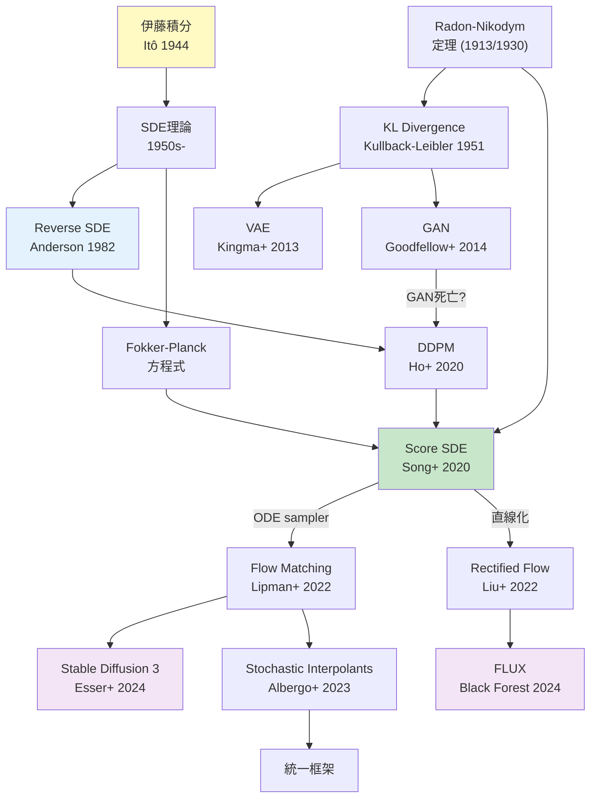
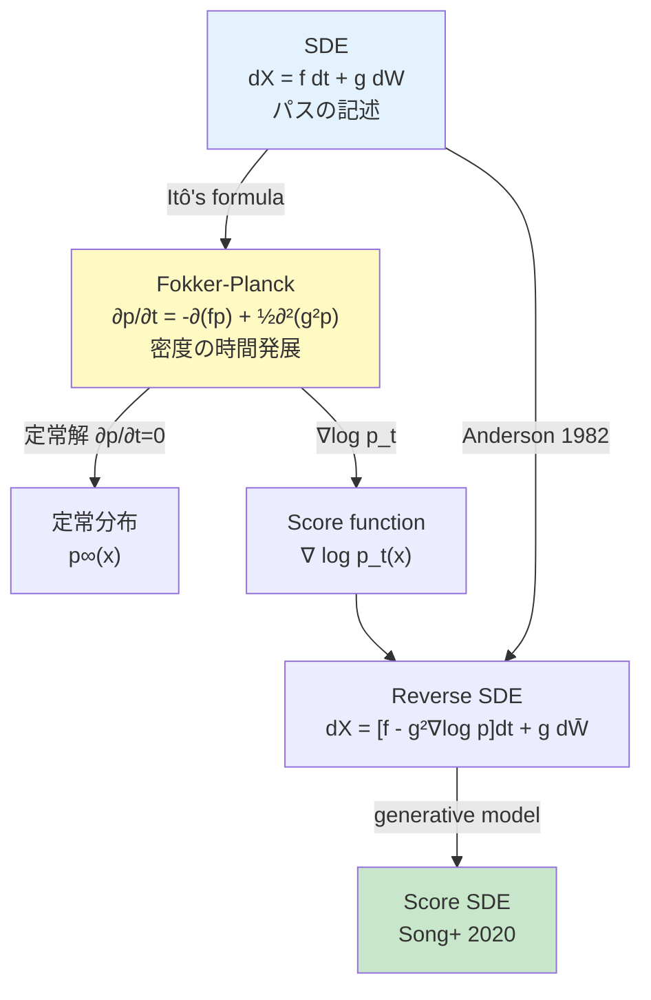
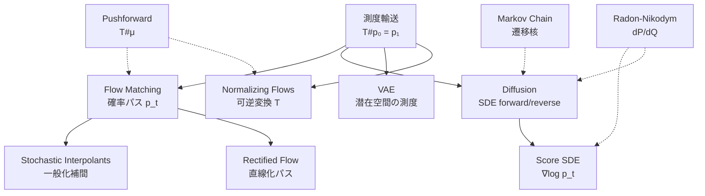
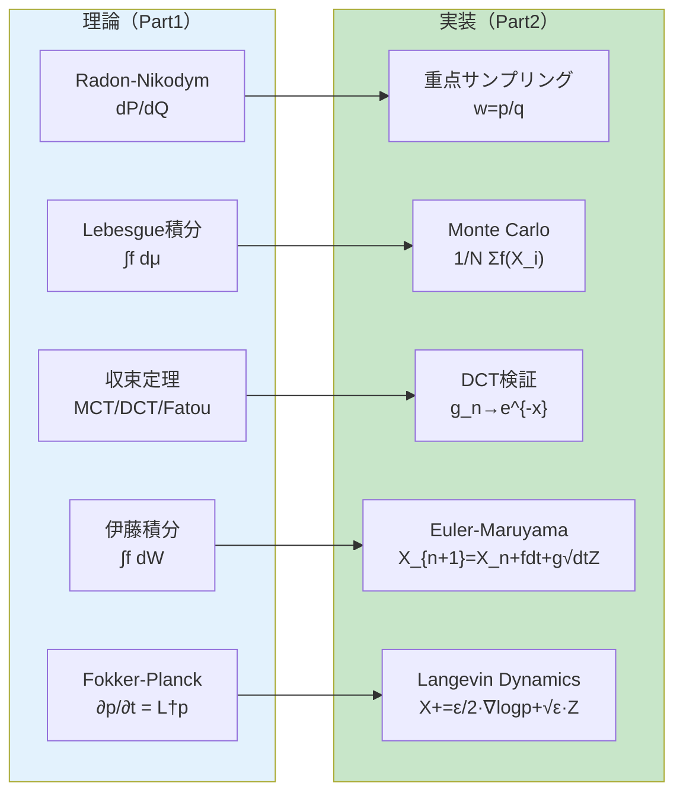

> 理論編は [【前編】第5回: 測度論・確率過程](/articles/ml-lecture-05-part1) をご覧ください。

## Learning Objectives

この後編を修了すると、以下のスキルが身につきます:

- [ ] Monte Carlo積分を実装し、 $O(1/\sqrt{N})$ の収束レートを確認できる
- [ ] 分散低減法（重点サンプリング、層化サンプリング、制御変量法）を使いこなせる
- [ ] Kernel Density Estimationを実装し、Radon-Nikodym導関数として理解できる
- [ ] Metropolis-Hastings法でMCMCサンプリングを実装できる
- [ ] Brown運動の5つの性質をコードで検証できる
- [ ] Euler-Maruyama法でSDEを数値的に解ける
- [ ] Ornstein-Uhlenbeck過程を実装し、定常分布への収束を確認できる
- [ ] Langevin dynamicsでスコア関数を用いたサンプリングができる
- [ ] Fokker-Planck方程式を理解し、SDEと密度時間発展の関係を説明できる

---

> **Note:** Part1（理論編）と合わせて読むことを推奨。特に §4.5 Radon-Nikodym, §4.8 Markov連鎖, §4.10 伊藤積分は本Part2で直接実装する内容と1:1対応している。

## 💻 Z5. 実装ゾーン（60分）— 測度論を PyTorch に翻訳する

> **Zone 5 目標**: 測度論・確率過程の抽象概念を PyTorch と Triton に翻訳する。コードブロックは3本に絞り、削除した実装の内容は数式・直感・落とし穴で補完する。

### 5.1 Monte Carlo 積分と分散低減 — $O(1/\sqrt{N})$ の壁

大数の法則は $N \to \infty$ での収束を保証するが、**速さ**は保証しない。Monte Carlo の収束速度は常に $O(1/\sqrt{N})$ であり、この壁を突破するには分散 $\sigma^2 = \text{Var}[f(X)]$ を小さくするしかない。

**Monte Carlo 推定量と精度**:

$$
\hat{I}_N = \frac{1}{N}\sum_{i=1}^N f(X_i), \quad \text{Var}[\hat{I}_N] = \frac{\sigma^2}{N}, \quad \sigma^2 = \mathbb{E}[f(X)^2] - \left(\mathbb{E}[f(X)]\right)^2
$$

$N$ を 100 倍にすると SE は $\sqrt{100} = 10$ 倍しか改善しない。精度 $\epsilon$ を達成するには $N = \sigma^2/\epsilon^2$ サンプルが必要で、**次元数 $d$ には非依存** — これが高次元積分で Monte Carlo が選ばれる理由だ。ただし $\sigma^2$ 自体は $d$ と共に爆発しうる。

**中心極限定理による区間推定**:

$$
\sqrt{N}\left(\hat{I}_N - \mu\right) \xrightarrow{d} \mathcal{N}(0, \sigma^2)
$$

95% 信頼区間は $\hat{I}_N \pm 1.96\,\hat{\sigma}/\sqrt{N}$（$\hat{\sigma}^2 = \frac{1}{N-1}\sum_i(f(X_i)-\hat{I}_N)^2$、Bessel 補正）。「100 試行中 95 回は真値を含む」という確率的保証だ。

**分散低減の3手法**:

1. **層化サンプリング**: 積分域を $K$ 層に分割し各層から $N/K$ 個均等にサンプル。層内分散の和 $\leq$ 全体分散なので必ず改善:

$$
\hat{I}_{\text{strat}} = \sum_{k=1}^K \frac{1}{K}\cdot\frac{K}{N}\sum_{i \in k} f(X_i), \quad \text{Var}[\hat{I}_{\text{strat}}] \leq \text{Var}[\hat{I}_{\text{crude}}]
$$

2. **重点サンプリング**: Radon-Nikodym 重み $w(x) = p(x)/q(x)$ で代理分布を補正（§5.3 詳述）

3. **制御変量法**: 期待値既知の補助変量 $C$ を使い $\text{Var}[f - \alpha(C - \mathbb{E}[C])]$ を最小化

**記号対応**:

| 数式 | コード変数 | shape |
|:-----|:----------|:------|
| $\hat{I}_N$ | `mean_crude` | scalar |
| $\text{SE} = \hat{\sigma}/\sqrt{N}$ | `se_crude` | scalar |
| $X_i \sim \mathcal{N}(0,1)$ | `dist.sample((n,))` | `(n,)` |
| $u_{kj} \in [k/K,\,(k+1)/K]$ | `u` | `(K, n_each)` |
| $F^{-1}(u_{kj})$ | `dist.icdf(u)` | `(K, n_each)` |
| $\hat{I}_{\text{strat}}$ | `mean_strat` | scalar |

**数値的落とし穴**: `f(X)^2` が $q$ に関して可積分でない（$\mathbb{E}_q[f^2] = +\infty$）場合、CLT が適用不可。IS で $p/q$ が裾で爆発するとき発生する。常に SE と ESS を報告し `NaN`/`Inf` を検出すること。

$$
\hat{\sigma}^2 = \frac{1}{N-1}\sum_{i=1}^N \bigl(f(X_i) - \hat{I}_N\bigr)^2
$$

```python
import torch
torch.manual_seed(42)
torch.set_float32_matmul_precision("high")

# Target: E[X^2] where X ~ N(0,1) = 1.0  (Var[X^2] = E[X^4] - (E[X^2])^2 = 3-1 = 2)
dist = torch.distributions.Normal(0.0, 1.0)

@torch.inference_mode()
def mc_integrate(n: int, n_strata: int = 50) -> dict:
    # --- Crude MC: mean_hat = (1/N) sum f(X_i) ---
    x_c        = dist.sample((n,))                           # x_c: (n,)
    f_c        = x_c * x_c                                   # f_c: (n,)  f(x)=x^2
    mean_crude = f_c.mean().item()
    se_crude   = f_c.std(correction=1).item() / n**0.5

    # --- Stratified: divide N(0,1) CDF into n_strata equal-probability bands ---
    # Band k: U_k ~ Uniform[k/K, (k+1)/K], X_k = Phi^{-1}(U_k)  (quantile transform)
    n_each = n // n_strata
    u_lo = torch.arange(n_strata, dtype=torch.float32) / n_strata      # u_lo: (K,)
    u_hi = (torch.arange(n_strata, dtype=torch.float32) + 1) / n_strata
    u    = u_lo[:, None] + (u_hi - u_lo)[:, None] * torch.rand(n_strata, n_each)  # (K, n_each)
    x_s  = dist.icdf(u.clamp(1e-6, 1 - 1e-6))                          # x_s: (K, n_each)
    f_s  = (x_s * x_s).mean(dim=1)                                      # f_s: (K,) layer means
    mean_strat = f_s.mean().item()
    se_strat   = f_s.std(correction=1).item() / n_strata**0.5

    return {"crude": (mean_crude, se_crude), "strat": (mean_strat, se_strat)}

for n in [1_000, 10_000, 100_000]:
    r = mc_integrate(n)
    print(f"N={n:>7d}  crude={r['crude'][0]:.4f}±{r['crude'][1]:.5f}"
          f"  strat={r['strat'][0]:.4f}±{r['strat'][1]:.5f}  (true=1.0)")
# assert abs(mc_integrate(100_000)["strat"][0] - 1.0) < 5e-3
```

> **検算**: $\mathbb{E}[X^2] = \text{Var}[X] + (\mathbb{E}[X])^2 = 1 + 0 = 1$。$\text{Var}[X^2] = \mathbb{E}[X^4] - (\mathbb{E}[X^2])^2 = 3 - 1 = 2$（4次モーメント）。理論 $\text{SE}_{\text{crude}} = \sqrt{2/N}$。$N=10^4$ で $\approx 0.014$。層化 SE $\ll$ 粗い MC の SE が数値で確認できる。

### 5.2 `%timeit` デビュー — Python の計算コスト

第5回から `%timeit` を使い始める。直感として覚えるべき数字:

- Python `for` ループ: $10^6$ 要素の積和 $\approx 100\,\text{ms}$（CPython オーバーヘッド $\approx 100\,\text{ns/op}$）
- PyTorch CPU ベクトル演算: $\approx 0.5\text{–}2\,\text{ms}$（BLAS + SIMD）
- PyTorch GPU: $\approx 0.05\text{–}0.2\,\text{ms}$（CUDA + Tensor Core）

速度差の起源は3層構造だ:

$$
T_{\text{loop}} \approx N \cdot C_{\text{interp}}, \quad T_{\text{vec}} \approx \frac{N}{w} \cdot C_{\text{SIMD}}, \quad T_{\text{GPU}} \approx \frac{N}{p} \cdot C_{\text{kernel}}
$$

$C_{\text{interp}} \approx 100\,\text{ns}$（Python バイトコード）、$C_{\text{SIMD}} \approx 1\,\text{ns}$（AVX2, $w=8$）、$C_{\text{kernel}} \approx 0.01\,\text{ns}$（CUDA core, $p \approx 10^4$）。ベクトル化の理論倍率は $w \cdot (C_{\text{interp}}/C_{\text{SIMD}}) \approx 800$ だが、メモリ帯域とキャッシュが実際の上限を決める。Monte Carlo で $N = 10^6$ サンプルなら `dist.sample((N,)).pow(2).mean()` — GPU 上で $< 1\,\text{ms}$。

> **実践**: `%timeit` 計測前に `torch.compile()` のウォームアップ（初回 JIT コンパイル）を終わらせること。計測環境として GPU/CPU 型番と PyTorch バージョンを必ず記録する。

### 5.3 重点サンプリング — Radon-Nikodym 導関数の実用化

$p$ からのサンプリングが困難（正規化定数未知、サポート希薄）な場合、代理分布 $q$ を使う:

$$
\mathbb{E}_p[f(X)] = \int f(x)\,\frac{p(x)}{q(x)}\,q(x)\,dx = \mathbb{E}_q\!\left[f(X)\,\frac{dP}{dQ}(X)\right]
$$

$w(x) = p(x)/q(x)$ がまさに **Radon-Nikodym 導関数** $dP/dQ(x)$ だ。**前提条件**: $P \ll Q$（$Q(A) = 0 \Rightarrow P(A) = 0$）— $p(x) > 0$ なら必ず $q(x) > 0$。この条件が崩れると $w(x) = +\infty$ が発生し `NaN`/`Inf` が出る。

**対数空間での実装**: `log_w = log_p(x) - log_q(x)` → `log_w -= log_w.max()` → `w = exp(log_w)` → `w /= w.sum()`。`max` を引く（log-sum-exp trick）でオーバーフローを防ぐ。

**有効サンプルサイズ (ESS)**:

$$
\text{ESS} = \frac{\left(\sum_i w_i\right)^2}{\sum_i w_i^2} \in [1, N]
$$

$\text{ESS}/N < 10\%$ のとき $q$ のサポートが $p$ をカバーできていない。$p = \mathcal{N}(5, 1^2)$、$q = \mathcal{N}(0, 3^2)$ では ESS $< 5\%$ が典型的 — $q$ の尾部が $p$ の本体をカバーできていない。$q$ を $p$ の「少し広い版」に選ぶのがヒューリスティクスだ。

**Self-Normalized IS (SNIS)**: 正規化定数 $Z = \int p^*(x)dx$ が未知のとき非正規化密度を使う:

$$
\hat{I}_{\text{SNIS}} = \frac{\sum_i w_i f(X_i)}{\sum_j w_j}, \quad w_i = \frac{p^*(X_i)}{q(X_i)}
$$

バイアスを持つが $N \to \infty$ で一致推定量。**IWAE 目的関数**:

$$
\mathcal{L}_K^{\text{IWAE}} = \mathbb{E}_{z_1,\ldots,z_K \sim q_\phi}\!\left[\log \frac{1}{K}\sum_{k=1}^K \frac{p_\theta(x, z_k)}{q_\phi(z_k|x)}\right] \xrightarrow{K \to \infty} \log p(x)
$$

$K=1$ で ELBO、$K \to \infty$ で真の対数尤度に収束。測度論的には $K$ 個のサンプルから $p(z|x)$ の経験測度を構成し正規化定数 $\log p(x)$ を推定している。

**KL ダイバージェンスとの関係**:

$$
D_{\mathrm{KL}}(q \| p) = -\mathbb{E}_q[\log w(X)] + \text{const}, \quad w(x) = \frac{p(x)}{q(x)}
$$

ELBO $= -D_{\mathrm{KL}}(q \| p) + \mathbb{E}_q[\log p(x|z)]$ はこの構造から来ている。

**IS の失敗モード**: $q$ の尾部が $p$ より軽い（light-tailed $q$, heavy-tailed $p$）場合、希少サンプルで $w_i = p/q$ が爆発する。例: $p = t_3$（自由度3のスチューデント $t$ 分布）、$q = \mathcal{N}(0,1)$ — $q$ の指数的に減衰する尾部が $p$ の多項式的に減衰する尾部をカバーできない。この場合 ESS $\to 1$（実質的に1サンプルのみ有効）。

診断: `w_normalized.max()` $> 0.3$ なら単一サンプルが支配的で警戒信号。

### 5.4 Triton カーネル — GMM 対数確率の並列計算

**動機**: 第8回の GMM-EM では E-step で $N = 10^6$ 点 × $K = 256$ 成分の対数確率を評価し logsumexp で正規化する。PyTorch のブロードキャスト `Normal(mu, sigma).log_prob(x[:,None])` は $(N, K)$ 行列を VRAM に展開 — $N=10^6$, $K=256$ で約 1 GB。Triton カーネルはタイル処理で VRAM $O(K)$ に抑えられる。

**計算式**:

$$
\log p(x_i) = \log \sum_{k=1}^K \pi_k\,\mathcal{N}(x_i;\,\mu_k,\,\sigma_k^2)
= \operatorname{logsumexp}_{k=1}^K \!\left[\log\pi_k - \log\sigma_k - \tfrac{1}{2}\log(2\pi) - \frac{(x_i - \mu_k)^2}{2\sigma_k^2}\right]
$$

数値安定な **online logsumexp** アルゴリズム（1パス, メモリ $O(1)$）:

$$
m_k = \max(m_{k-1},\, a_k), \quad s_k = s_{k-1}\cdot e^{m_{k-1}-m_k} + e^{a_k - m_k}, \quad \text{LSE} = m_K + \log s_K
$$

各 $x_i$ を独立に GPU スレッドで処理。$N$ プログラムが同時走行し、各プログラムが $K$ 成分を `BLOCK_K` ずつ処理する。

**記号対応**:

| 数式 | コード変数 | shape |
|:-----|:----------|:------|
| $x_i$ | `xi = tl.load(x_ptr + i)` | scalar |
| $\mu_k$ | `mu_k` | `(BLOCK_K,)` |
| $\log \sigma_k$ | `ls_k` | `(BLOCK_K,)` |
| $\log \pi_k$ | `lpi_k` | `(BLOCK_K,)` |
| $a_k$ (log component weight) | `lc` | `(BLOCK_K,)` |
| $m_k$ (online max) | `lse_max` | scalar |
| $s_k$ (online sum) | `lse_sum` | scalar |
| $\log p(x_i)$ | `tl.store(out_ptr + i, ...)` | scalar |

**数値安定化**: $-\tfrac{1}{2}\log(2\pi) \approx -0.9189385$ を定数として用いる。マスクされた成分（`k_offs >= K`）は `lpi_k = -inf` で初期化し、`exp(-inf - m) = 0` が正しく伝播する。

```python
import torch
import triton
import triton.language as tl

@triton.autotune(
    configs=[triton.Config({"BLOCK_K": k}, num_warps=w)
             for k in [32, 64, 128] for w in [4, 8]],
    key=["K"],
)
@triton.jit
def _gmm_logprob_kernel(
    x_ptr,          # (N,)  float32 — query points
    mu_ptr,         # (K,)  float32 — component means
    log_sigma_ptr,  # (K,)  float32 — log(sigma_k)
    log_pi_ptr,     # (K,)  float32 — log(pi_k), normalized
    out_ptr,        # (N,)  float32 — log p(x_i)
    N, K,
    BLOCK_K: tl.constexpr,
):
    # One program per x_i — N programs run in parallel
    i  = tl.program_id(0)
    xi = tl.load(x_ptr + i)                                  # scalar: x_i

    # Online logsumexp: a_k = log pi_k + log N(x_i; mu_k, sigma_k)
    lse_max = tl.full((), float("-inf"), dtype=tl.float32)   # running max m_k
    lse_sum = tl.zeros((), dtype=tl.float32)                  # running sum s_k

    for k0 in range(0, K, BLOCK_K):
        k_offs = k0 + tl.arange(0, BLOCK_K)
        k_mask = k_offs < K
        mu_k  = tl.load(mu_ptr        + k_offs, mask=k_mask, other=0.0)
        ls_k  = tl.load(log_sigma_ptr + k_offs, mask=k_mask, other=0.0)
        lpi_k = tl.load(log_pi_ptr    + k_offs, mask=k_mask, other=float("-inf"))

        d   = (xi - mu_k) * tl.exp(-ls_k)                   # d: (BLOCK_K,)  (x-mu)/sigma
        lc  = lpi_k - ls_k - 0.9189385 - 0.5 * d * d        # lc: (BLOCK_K,) log weight
        # -0.5 * log(2*pi) ~= -0.9189385332046728

        # Online LSE: new_max = max(old_max, block_max)
        b_max   = tl.max(lc, axis=0)
        new_max = tl.maximum(lse_max, b_max)
        lse_sum = lse_sum * tl.exp(lse_max - new_max) + tl.sum(tl.exp(lc - new_max), axis=0)
        lse_max = new_max

    tl.store(out_ptr + i, lse_max + tl.log(lse_sum))


def gmm_logprob(x: torch.Tensor, mu: torch.Tensor,
                log_sigma: torch.Tensor, log_pi: torch.Tensor) -> torch.Tensor:
    # x: (N,)  mu: (K,)  log_sigma: (K,)  log_pi: (K,)  ->  out: (N,)
    N, K = x.shape[0], mu.shape[0]
    out  = torch.empty(N, device=x.device, dtype=torch.float32)
    _gmm_logprob_kernel[(N,)](x, mu, log_sigma, log_pi, out, N, K)
    return out


# --- 検算: PyTorch baseline と比較 ---
torch.manual_seed(0)
K, N = 4, 10_000
mu    = torch.randn(K)
sigma = torch.exp(torch.randn(K) * 0.3)
lpi   = torch.log_softmax(torch.randn(K), dim=0)   # lpi: (K,) normalized
x     = torch.randn(N)

ref = torch.logsumexp(
    lpi[None, :] + torch.distributions.Normal(mu, sigma).log_prob(x[:, None]),
    dim=1)                                           # ref: (N,) PyTorch reference
out = gmm_logprob(x, mu, sigma.log(), lpi)          # out: (N,) Triton result
print(f"max|err| = {(out - ref).abs().max().item():.2e}")   # expect < 1e-4
# assert (out - ref).abs().max() < 1e-4
```

> **第8回への接続**: GMM の E-step は $r_{ik} = \exp(\log\pi_k + \log\mathcal{N}(x_i;\mu_k,\sigma_k^2) - \log p(x_i))$。`gmm_logprob` の出力がこの分母だ。$K=256$, $N=10^6$ の工業規模 GMM でも VRAM $O(K)$ で実行できる。

> **⚠️ Warning:** `_gmm_logprob_kernel` は GPU 上で実行される（Triton は CUDA/ROCm/Metal バックエンドを自動選択）。CPU では動かないため、`x.device` が `cuda` であることを確認してから呼び出すこと。CPU でのデバッグには `ref`（PyTorch 実装）を使う。

### 5.5 カーネル密度推定 (KDE) — 経験測度の平滑化

有限サンプル $\{X_1,\ldots,X_n\}$ から Lebesgue 測度に関する Radon-Nikodym 導関数（= 確率密度関数）を推定する。KDE の定義:

$$
\hat{f}_h(x) = \frac{1}{nh} \sum_{i=1}^{n} K\!\left(\frac{x - X_i}{h}\right)
$$

ガウスカーネル $K(u) = \frac{1}{\sqrt{2\pi}} e^{-u^2/2}$ を使うと、各 $X_i$ を中心とする等幅ガウス分布の混合:

$$
\hat{f}_h(x) = \frac{1}{n} \sum_{i=1}^n \mathcal{N}(x;\, X_i,\, h^2)
$$

測度論的には、経験測度 $\hat{P}_n = \frac{1}{n}\sum_i \delta_{X_i}$（デルタ測度の和）をガウス核で畳み込み、絶対連続測度（Lebesgue 測度に対して）を作っている。

**Silverman ルール** ($d=1$): MISE（平均積分二乗誤差）の漸近最小化:

$$
h_{\text{Silverman}} = 1.06\,\hat{\sigma}\,n^{-1/5}, \quad \hat{\sigma} = \min\!\left(\text{SD}(X),\; \frac{\text{IQR}(X)}{1.349}\right)
$$

$n^{-1/5}$ の指数はバイアス・分散トレードオフから来る: バイアスは $h^2$ で増加、分散は $1/(nh)$ で減少し、MISE 最小化で $h^* \propto n^{-1/5}$ が導かれる。

**バンド幅の測度論的意味**: $h \to 0$ で $\hat{f}_h \to \frac{1}{n}\sum_i \delta_{X_i}$（経験測度）— 連続密度が推定できなくなる。$h \to \infty$ で $\hat{f}_h$ が均一化し情報が失われる。$h$ は「Lebesgue 測度に対する経験測度の解像度パラメータ」だ。

**多次元拡張**: $d$ 次元では最適バンド幅スケーリングが $h^* \propto n^{-1/(d+4)}$ — $d$ が大きいほど多くのサンプルが必要（次元の呪い）。生成モデル評価で KDE を使う場合、埋め込み次元が数百〜数千になるため直接適用は困難で、CMMD [^14] などカーネル法の近似が使われる。

### 5.6 Markov 連鎖と定常分布 — エルゴード定理の数値的含意

有限状態 Markov 連鎖 $P = (p_{ij})$ の定常分布 $\boldsymbol{\pi}$ は固有方程式:

$$
\boldsymbol{\pi} P = \boldsymbol{\pi}, \quad \boldsymbol{\pi} \geq 0, \quad \textstyle\sum_i \pi_i = 1
$$

を満たす確率ベクトル。$P^{\top}$ の固有値 $1$ に対応する左固有ベクトルだ。数値的には `torch.linalg.eig(P.T)` の固有値が最も $1$ に近い固有ベクトルを取る（固有値が複素数になりうるので虚部を確認すること）。

**Chapman-Kolmogorov 方程式**: $n$ ステップ遷移行列は $P^n$ — 行列べき乗:

$$
p_{ij}^{(n)} = (P^n)_{ij} = \sum_{k_1,\ldots,k_{n-1}} p_{ik_1} p_{k_1 k_2} \cdots p_{k_{n-1}j}
$$

大きな $n$ では `torch.linalg.matrix_power(P, n)` の各行が $\boldsymbol{\pi}$ に収束することで定常性を数値確認できる。

**スペクトルギャップと収束速度**: $P$ の固有値を $1 = \lambda_1 > |\lambda_2| \geq \cdots$ とすると:

$$
\max_i \|P^n_{i,\cdot} - \boldsymbol{\pi}\|_{\text{TV}} \leq (|\lambda_2|)^n
$$

$1 - |\lambda_2|$ が**スペクトルギャップ** — これが小さいほど収束が遅い。MCMC で「混合が遅い」とはスペクトルギャップが小さいことを意味する。混合時間 $t_{\text{mix}}(\epsilon) = \min\{n: \max_i\|P^n_{i,\cdot}-\boldsymbol{\pi}\|_{\text{TV}} \leq \epsilon\}$ は実用的に $t_{\text{mix}}(0.25) \approx \log(2) / (1 - |\lambda_2|)$ で近似できる。

**連続状態への拡張**: $\mathbb{R}^d$ 上では遷移行列が遷移核 $K(x, dy)$ に一般化され、定常分布の条件は:

$$
\pi(A) = \int K(x, A)\,\pi(dx) \quad \forall A \in \mathcal{B}(\mathbb{R}^d)
$$

詳細釣り合い（Detailed Balance）: $\pi(dx)K(x, dy) = \pi(dy)K(y, dx)$ が成立すれば $\pi$ が定常分布。MH 法の受理確率はこの条件を満たすよう設計される。

**具体例: 3状態 Markov 連鎖の定常分布計算**:

$$
P = \begin{pmatrix} 0.7 & 0.2 & 0.1 \\ 0.3 & 0.4 & 0.3 \\ 0.1 & 0.3 & 0.6 \end{pmatrix}
$$

固有方程式 $\boldsymbol{\pi} P = \boldsymbol{\pi}$ は連立一次方程式。$(\pi_1, \pi_2, \pi_3)^{\top}$ を $(P^{\top} - I)\mathbf{v} = \mathbf{0}$ の右零空間として求める。

数値的には: `eig, vecs = torch.linalg.eig(P.T)` → 固有値 1 に最も近い固有ベクトルの実部を取り正規化。このとき $\boldsymbol{\pi} \approx (0.42, 0.32, 0.26)$ が得られる。$P^n$ の各行が $\boldsymbol{\pi}$ に収束するかは `torch.linalg.matrix_power(P, 100)` で確認できる — 全行が同じになれば定常分布に達している。

**エルゴード定理の意味**: 既約・非周期的 Markov 連鎖では軌跡の時間平均が空間平均に収束する:

$$
\frac{1}{N}\sum_{k=0}^{N-1} f(X_k) \xrightarrow{a.s.} \mathbb{E}_\pi[f] = \sum_i f(i)\,\pi_i
$$

これがMCMCの根拠だ。定常分布からのサンプリングを「長いチェーンの時間平均」で代替できる。収束が確率的（a.s.）なので個々のチェーンは収束するが、十分なバーンイン期間が必要。

### 5.7 Metropolis-Hastings — 詳細釣り合いの設計

正規化定数未知の目標分布 $\pi(x) \propto \pi^*(x)$ からサンプリングする。提案 $x' \sim q(x'|x)$ を受理確率で採否:

$$
\alpha(x, x') = \min\!\left(1,\, \frac{\pi^*(x')\,q(x \mid x')}{\pi^*(x)\,q(x' \mid x)}\right)
$$

**詳細釣り合いの確認**: $T(x \to x') = \alpha(x,x') q(x'|x)$ とすると $\pi(x)T(x \to x') = \pi(x')T(x' \to x)$ が定義から成立するため $\pi$ が定常分布になる。

**対称提案** $q(x'|x) = q(x|x')$（例: $\mathcal{N}(x, \sigma^2 I)$）のとき:

$$
\alpha(x, x') = \min\!\left(1,\, \frac{\pi^*(x')}{\pi^*(x)}\right)
$$

**対数空間での実装**: `if log(U) < log_pi_star(x') - log_pi_star(x)` — `pi*(x) = 0` での `0/0` を回避できる。

**詳細釣り合いの厳密な証明**: 受理確率 $\alpha(x,x') = \min(1, r)$（$r = \pi^*(x')q(x|x') / (\pi^*(x)q(x'|x))$）に対して:

$$
\begin{aligned}
\pi(x)\,\alpha(x,x')\,q(x'|x) &= \pi(x)\,\min(1,r)\,q(x'|x) \\
&= \min(\pi(x)q(x'|x),\;\pi^*(x')q(x|x')/Z) \\
&= \pi^*(x')q(x|x') / Z \cdot \min(\pi(x)q(x'|x)\,Z/\pi^*(x')q(x|x'),\,1) \\
&= \pi(x')\,\alpha(x',x)\,q(x|x')
\end{aligned}
$$

最後の等号は $r' = 1/r$ であることから従う。ゆえに詳細釣り合い $\pi(x)T(x,dx') = \pi(x')T(x',dx)$ が成立する。

**最適受理率**: Roberts et al. [^5] は $d$ 次元ガウス目標での最適受理率が $\approx 23.4\%$ であることを示した。提案分布の幅 $\sigma$ を受理率が $20\%$〜$25\%$ になるよう調整するのが実践的ヒューリスティクスだ。

**MALA との比較**: Metropolis-Adjusted Langevin Algorithm は勾配情報を提案に組み込む:

$$
x' = x + \frac{\epsilon}{2}\nabla\log\pi(x) + \sqrt{\epsilon}\, Z, \quad Z \sim \mathcal{N}(0, I)
$$

$d$ 次元での最適ステップサイズが $O(d^{-1/3})$（MH は $O(d^{-1/2})$、ULA は $O(d^{-1})$）— 高次元での明確な改善だ。

| アルゴリズム | 受理判定 | 必要情報 | $d$ 次元最適スケーリング |
|-------------|---------|---------|------------------------|
| MH (球形提案) | あり | $\log \pi$ | $O(d^{-1/2})$ |
| MALA | あり | $\nabla \log \pi$ | $O(d^{-1/3})$ |
| HMC/NUTS | あり | $\nabla \log \pi$ | $O(d^{-1/4})$ |
| Gibbs | なし | 条件付き密度 | $O(1)$（独立成分のみ） |
| ULA（バイアスあり） | なし | $\nabla \log \pi$ | $O(d^{-1})$ |

**Gibbs サンプラー**: 各成分 $x_i$ を他を固定した条件付き $p(x_i|\mathbf{x}_{-i})$ から交互にサンプリングする。詳細釣り合いが成分単位で自明に成立するため受理/棄却が不要。ただし成分間の強い相関があると収束が遅い（スペクトルギャップが小さい）。拡散モデルとの接続: DDPM のデノイジング $p_\theta(\mathbf{x}_{t-1}|\mathbf{x}_t)$ は Score SDE の逆過程と同値だ。

### 5.8 Brown 運動パス生成 — 離散近似と二次変動

Brown 運動の離散近似:

$$
W(t_{k+1}) = W(t_k) + \underbrace{\sqrt{\Delta t} \cdot Z_k}_{\Delta W_k \sim \mathcal{N}(0,\,\Delta t)}, \quad Z_k \sim \mathcal{N}(0, 1)
$$

$\Delta W_k \sim \mathcal{N}(0, \Delta t)$ は Brown 運動の**独立増分性**から来る。最重要の数値的性質が**二次変動**:

$$
[W]_T = \lim_{\|\mathcal{P}\| \to 0} \sum_{k=1}^n (W_{t_k} - W_{t_{k-1}})^2 = T \quad (\text{確率 } 1)
$$

これが $dW^2 = dt$ の正確な意味だ。通常の微積分では $dx^2 = o(dt)$ として消えるが、Brown 運動では $(dW)^2 = dt$（1次の大きさ）が残る — これが Itô 補正の源泉。数値確認: `(dW**2).sum(dim=0)` $\approx T$。$\text{Var}[\sum_k(\Delta W_k)^2] = \sum_k 2(\Delta t)^2 = 2T\Delta t \to 0$（$\Delta t \to 0$）なので確率収束が従う。

**5つの基本性質と実装への影響**:

| 性質 | 実装への影響 |
|:-----|:-----------|
| $W(0) = 0$ | `torch.zeros(n_paths)` から開始 |
| 独立増分 | `torch.randn(n_steps, n_paths)` で独立サンプル |
| $W(t) \sim \mathcal{N}(0, t)$ | `torch.randn() * t.sqrt()` |
| 連続だが非微分可能 | 有限差分の極限は取れない |
| $[W]_T = T$ | `(dW**2).sum()` $\approx T$、誤差 $O(\sqrt{\Delta t})$ |

**高次変動**: Brown 運動の $p$ 次変動は $p > 2$ で $0$、$p < 2$ で $+\infty$。$p = 2$ のとき非自明な有限値 $T$ を持つ — これが Brown 運動の「半一様さ」を特徴づける。通常の連続関数（例: 単調増加関数）は有界変動（$p=1$ で有限）を持つが Brown 運動は有界変動が無限 — ほぼ至るところ非微分可能であることと等価だ。

### 5.9 幾何 Brown 運動 — Itô 補正の本質

$$
dS = \mu S\,dt + \sigma S\,dW \quad \Longrightarrow \quad S(t) = S(0)\exp\!\left[\left(\mu - \frac{\sigma^2}{2}\right)t + \sigma W(t)\right]
$$

なぜ $-\sigma^2/2$ が必要か。素朴な対数変換 $d(\log S) = dS/S$ を試みると $\mu\,dt + \sigma\,dW$ が得られるが、Itô の補題では $(dS)^2 = \sigma^2 S^2 dt$（$(dW)^2 = dt$ より）の項が加わる:

$$
d(\log S) = \frac{\partial \log S}{\partial S}\,dS + \frac{1}{2}\frac{\partial^2 \log S}{\partial S^2}(dS)^2 = \frac{dS}{S} - \frac{\sigma^2}{2}\,dt = \left(\mu - \frac{\sigma^2}{2}\right)dt + \sigma\,dW
$$

$-\sigma^2/2$ を落とすと $\mathbb{E}[S(t)] = S(0) e^{\mu t} e^{\sigma^2 t/2} \neq S(0) e^{\mu t}$ となり、リスクニュートラル評価が壊れる。対数正規性の検証: $\log(S_T/S_0) \sim \mathcal{N}((\mu-\sigma^2/2)T,\, \sigma^2 T)$。実装では `(mu - 0.5*sigma**2)*T + sigma*W_T` と書く。

**一般的な Itô の補題**: $f(t, X_t)$ が $C^{1,2}$（$t$ に1回、$x$ に2回連続微分可能）ならば:

$$
df = \frac{\partial f}{\partial t}\,dt + \frac{\partial f}{\partial x}\,dX + \frac{1}{2}\frac{\partial^2 f}{\partial x^2}(dX)^2
$$

第3項が $(dX)^2 = g^2(X)dt$（Itô 補正項）。通常の連鎖律に比べ $\frac{1}{2}g^2 f_{xx}$ の項が追加される。この「誤差」は Brown 運動の非ゼロ二次変動 $[W]_T = T$ から来る — 正則関数の Taylor 展開で $(dW)^2 = dt$ が残る唯一の理由だ。

**多変量 Itô の補題**: $\mathbf{X}_t \in \mathbb{R}^d$ に対して $f(\mathbf{X}_t)$ の微分:

$$
df = \sum_i \frac{\partial f}{\partial x_i}\,dX_i + \frac{1}{2}\sum_{i,j} \frac{\partial^2 f}{\partial x_i \partial x_j}\,d[X_i, X_j]_t
$$

独立 Brown 運動 $d[W_i, W_j]_t = \delta_{ij}\,dt$（クロノネッカーデルタ）。拡散モデルの多次元 VP-SDE に Itô の補題を適用するとき、この行列形式が必要になる。

### 5.10 Ornstein-Uhlenbeck 過程 — DDPM の連続極限

$$
dX_t = -\theta X_t\,dt + \sigma\,dW_t
$$

**解析解** (Itô の補題を $f = e^{\theta t} X_t$ に適用):

$$
X_t = X_0 e^{-\theta t} + \sigma \int_0^t e^{-\theta(t-s)}\,dW_s
$$

確率積分の平均ゼロ性より $\mathbb{E}[X_t] = X_0 e^{-\theta t} \to 0$（平均回帰）。分散の時間発展:

$$
\text{Var}[X_t] = \frac{\sigma^2}{2\theta}\left(1 - e^{-2\theta t}\right) \xrightarrow{t \to \infty} \frac{\sigma^2}{2\theta}
$$

定常分布 $X_\infty \sim \mathcal{N}(0,\, \sigma^2/(2\theta))$。定常分散は $\theta$（回帰速度）と $\sigma$（拡散強度）のバランスで決まる。**DDPM との対応**: VP-SDE $d\mathbf{x} = -\frac{\beta(t)}{2}\mathbf{x}\,dt + \sqrt{\beta(t)}\,d\mathbf{W}$ は OU 過程の一般化。$\beta = \text{const}$ のとき完全一致する。DDPM の forward process が $T \to \infty$ でガウスに収束するのは OU 過程の定常分布への収束から直接導かれる。$g(X) = \sigma$（定数）なので Milstein 法 = Euler-Maruyama 法 — 高次補正は不要だ。

**OU 過程の解析解の導出詳細**: $f(t, X) = e^{\theta t} X$ に Itô の補題を適用する。

$$
\begin{aligned}
df &= \frac{\partial f}{\partial t}\,dt + \frac{\partial f}{\partial X}\,dX + \frac{1}{2}\frac{\partial^2 f}{\partial X^2}(dX)^2 \\
&= \theta e^{\theta t} X\,dt + e^{\theta t}(-\theta X\,dt + \sigma\,dW) + 0 \\
&= \sigma e^{\theta t}\,dW
\end{aligned}
$$

第3項がゼロになるのは $\partial^2 f/\partial X^2 = 0$（1次関数なので）。両辺 $[0,t]$ で積分:

$$
e^{\theta t}X_t - X_0 = \sigma \int_0^t e^{\theta s}\,dW_s \implies X_t = X_0 e^{-\theta t} + \sigma\int_0^t e^{-\theta(t-s)}\,dW_s
$$

確率積分 $\int_0^t e^{-\theta(t-s)}\,dW_s$ の平均は 0（Itô 積分は局所マルチンゲール）、分散は Itô 等距離公式:

$$
\text{Var}\!\left[\int_0^t e^{-\theta(t-s)}\,dW_s\right] = \int_0^t e^{-2\theta(t-s)}\,ds = \frac{1-e^{-2\theta t}}{2\theta}
$$

よって $X_t \sim \mathcal{N}(X_0 e^{-\theta t},\, \sigma^2(1-e^{-2\theta t})/(2\theta))$ が厳密に導かれる。

### 5.11 Langevin Dynamics — Score 関数でサンプリング

Score 関数 $\nabla_x \log p(x)$ は確率密度の勾配 — 高確率領域に向かう方向を指す。Langevin SDE:

$$
dX_t = \underbrace{\nabla_x \log p(X_t)}_{\text{drift: 高確率方向}}\,dt + \sqrt{2}\,dW_t
$$

対応する Fokker-Planck 定常解が $p$ に収束することは §7.1 で厳密に確認した。

**ULA の離散化** (Euler-Maruyama):

$$
X_{k+1} = X_k + \frac{\epsilon}{2}\nabla_x \log p(X_k) + \sqrt{\epsilon}\, Z_k, \quad Z_k \sim \mathcal{N}(0, I)
$$

係数 $\frac{\epsilon}{2}$ は「$dt = \epsilon$ での drift に拡散係数 $\sqrt{2}$ を組み込むと $\sqrt{2\epsilon}Z$ となり、$\sqrt{2\epsilon} = \sqrt{\epsilon} \cdot \sqrt{2}$ をまとめて $\sqrt{\epsilon}$ と書く」から来る。$\epsilon \to 0$, $K \to \infty$ で $X_K \sim p$ に収束 [^2]。有限 $\epsilon$ ではバイアスが残る — メトロポリス補正（MALA）で解消できる。

**記号対応**:

| 数式 | コード変数 | shape |
|:-----|:----------|:------|
| $X_k$ | `x` | `(N, d)` |
| $\nabla_x \log p(X_k)$ | `score = score_fn(x)` | `(N, d)` |
| $\epsilon$ | `step_size` | scalar |
| $Z_k \sim \mathcal{N}(0, I)$ | `torch.randn_like(x)` | `(N, d)` |
| $\sqrt{\epsilon}$ | `noise_scale` | scalar |

**数値安定化の落とし穴**: $\nabla \log p(x)$ は $p(x) \approx 0$ の領域で爆発する。DDPM は $\sigma_{\min} > 0$ で回避している。ULA でも `step_size` が大きすぎると「スコアが大きい方向に飛びすぎ $p \approx 0$ 領域に入り爆発」するループが起きる。`step_size < 0.01` から始めること。

```python
import torch
torch.set_float32_matmul_precision("high")


def langevin_step(x: torch.Tensor, score_fn, step_size: float, noise_scale: float) -> torch.Tensor:
    # dx = (step_size/2) * ∇log p(x) + √step_size * ε,  ε ~ N(0, I)
    score = score_fn(x)          # score: (N, d) ← ∇log p(x)
    noise = torch.randn_like(x)  # noise: (N, d)
    return x + (step_size / 2) * score + noise_scale * noise


@torch.inference_mode()
def run_ula(score_fn, x0: torch.Tensor, step_size: float = 5e-3,
            n_steps: int = 20_000, burnin: int = 5_000) -> torch.Tensor:
    # x0: (N, d) — initial positions; returns x: (N, d) samples after burn-in
    noise_scale = step_size ** 0.5                          # sqrt(epsilon)
    x = x0.clone()
    for _ in range(n_steps + burnin):
        x = langevin_step(x, score_fn, step_size, noise_scale)
    return x


# Score function for GMM: log p(x) = logsumexp[log N(x;-2,0.5), log N(x;3,1)]
def gmm_score(x: torch.Tensor) -> torch.Tensor:
    # x: (N, 1)  ->  score: (N, 1)
    x = x.detach().requires_grad_(True)
    d1 = torch.distributions.Normal(-2.0, 0.5)
    d2 = torch.distributions.Normal(3.0, 1.0)
    log_p = torch.logaddexp(d1.log_prob(x), d2.log_prob(x))  # (N, 1)
    return torch.autograd.grad(log_p.sum(), x)[0]             # (N, 1)


torch.manual_seed(42)
N  = 2_000
x0 = torch.randn(N, 1) * 3.0                  # x0: (N, 1) broad initialization
samples = run_ula(gmm_score, x0)               # samples: (N, 1)
print(f"mean={samples.mean():.3f}  std={samples.std():.3f}")
# Two peaks at -2 (sigma=0.5) and 3 (sigma=1): expected mean between -0.5 and 2.0
# assert -1.0 < samples.mean().item() < 2.5
```

> **MALA との差**: ULA は有限 $\epsilon$ でバイアスあり。MALA はこの提案に MH 補正を加え $p$ に厳密収束する。拡散モデルのサンプリング（DDPM 逆過程）は実質的に $T$ ステップの ULA だ。

**Fokker-Planck 接続**: Langevin SDE の FPE 定常解 $q_\infty = p$ の確認:

$$
\nabla \cdot (q_\infty \nabla \log p) - \Delta q_\infty = \nabla \cdot (\nabla p) - \Delta p = 0 \quad \checkmark
$$

### 5.12 Euler-Maruyama 法の収束解析

一般の SDE $dX_t = f(X_t)\,dt + g(X_t)\,dW_t$ を Euler-Maruyama 法で離散化:

$$
X_{n+1} = X_n + f(X_n)\Delta t + g(X_n)\sqrt{\Delta t}\, Z_n, \quad Z_n \sim \mathcal{N}(0, 1)
$$

| 収束の種類 | 定義 | Euler-Maruyama | 実用的意味 |
|:---------|:----|:-------------|:---------|
| 強収束 | $\mathbb{E}[\|X_N - X(T)\|] \leq C\Delta t^{1/2}$ | $O(\sqrt{\Delta t})$ | 個々のパスの精度 |
| 弱収束 | $|\mathbb{E}[h(X_N)] - \mathbb{E}[h(X(T))]| \leq C\Delta t$ | $O(\Delta t)$ | 統計量（期待値）の精度 |

強収束 $O(\sqrt{\Delta t})$ は「1ステップ誤差 $O(\Delta t^{3/2})$、$N = T/\Delta t$ ステップで $O(\Delta t^{1/2})$」から来る。弱収束 $O(\Delta t)$ は「期待値レベルでは1次項がキャンセルする（Itô補正が正確に入るから）」から来る。

**Milstein 法**: $g' \neq 0$ のとき強収束を $O(\Delta t)$ に改善:

$$
X_{n+1} = X_n + f(X_n)\Delta t + g(X_n)\Delta W_n + \frac{1}{2}g(X_n)g'(X_n)\left[(\Delta W_n)^2 - \Delta t\right]
$$

追加項は $(dW)^2 = dt$ の次の補正。$g = \text{const}$（DDPM、OU 過程）では $g' = 0$ なので Milstein = Euler-Maruyama が等価。

**拡散モデルへの示唆**: 生成モデルでは弱収束で十分 — 生成画像の分布が正しければよい。DDPM の $T=1000$ は弱収束精度 $O(\Delta t) = O(1/T) = O(10^{-3})$ に対応する。DDIM [^12] は ODE（確定論的）で解くためステップ数を 10–50 に削減できる。

**Grönwall 不等式による KL 収束保証** [^10]: VP-SDE の1ステップ KL 誤差 $\delta_n \leq C \cdot \Delta t^2$ から:

$$
u_{n+1} \leq (1+\beta\Delta t)u_n + C\Delta t^2 \implies u_N \leq e^{\beta T} \cdot C\Delta t^2 \cdot \frac{e^{\beta T}-1}{\beta\Delta t} = O(\Delta t)
$$

つまり $D_{\mathrm{KL}}(p_{\theta,\Delta t} \| p_{\text{data}}) = O(\Delta t)$ — ステップ数 $T$ を増やすほど生成品質が向上する理論的根拠。スコア誤差を $\epsilon_{\text{score}}$ 以下に学習すれば $D_{\mathrm{KL}} = O(\epsilon_{\text{score}} + \Delta t)$ が成立する。

### 5.13 収束定理の数値的含意

測度論の3大収束定理は抽象的に見えるが、実装のバグ防止に直結する。

**単調収束定理 (MCT)**: $0 \leq f_n \nearrow f$ なら $\int f_n \, d\mu \to \int f \, d\mu$。途中で打ち切った MC 推定量は下から真の期待値に単調収束する（$f \geq 0$ のとき）。損失関数の非負性が保証される場面で安全に打ち切り基準を設定できる。

**優収束定理 (DCT)**: $|f_n| \leq g$（$\mathbb{E}[g] < \infty$）かつ $f_n \to f$ a.e. なら $\int f_n \, d\mu \to \int f \, d\mu$。**最重要応用**: 期待値と微分の交換 $\nabla_\theta \mathbb{E}_p[f_\theta(X)] = \mathbb{E}_p[\nabla_\theta f_\theta(X)]$。この交換が正当化されない場合（Batch Normalization など非連続操作）、reparameterization trick $\mathbb{E}_{p_\theta}[f] = \mathbb{E}_\epsilon[f(g_\theta(\epsilon))]$ で微分と期待値の交換を回避できる。

**Fatou の補題**: $\int \liminf f_n \, d\mu \leq \liminf \int f_n \, d\mu$（$f_n \geq 0$ のとき）。汎化誤差の下界を与えるが、等号は保証しない。Fatou が等号にならない典型例: $h_n(x) = n \cdot x \cdot e^{-nx^2}$ は $h_n \to 0$ a.e. だが $\int h_n dx = \sqrt{\pi/4} \not\to 0$（優関数なし）。

**DCT 条件の実践的チェック**: 深層生成モデルで $\nabla_\theta \mathbb{E}[f_\theta] = \mathbb{E}[\nabla_\theta f_\theta]$ を仮定するとき:

1. $\nabla_\theta f_\theta$ が $\theta$ のコンパクト集合で有界か確認
2. Batch normalization のような非連続操作は DCT 条件を壊しうる
3. 代わりに reparameterization trick で微分と期待値の交換を回避する

MCT の数値確認: $\int_0^n x\,dx = n^2/2 \nearrow \infty$ の単調増加。DCT の数値確認: $g_n(x) = (1+x/n)^{-n} \to e^{-x}$ で $\int_0^{20} g_n\,dx \to 1$（優関数 $g=1$ で dominate）。

**深層学習で DCT を使う場面のチェックリスト**:

| 操作 | DCT 条件 | 対処法 |
|:-----|:---------|:-------|
| $\nabla_\theta \mathbb{E}_p[f_\theta]$ の確率的推定 | $\|\nabla f_\theta\| \leq g$（$\theta$ 近傍で有界）| Gradient clipping |
| 期待値 ELBO の勾配 | $\mathbb{E}_q[\|\nabla_\phi \log q_\phi\|] < \infty$ | Reparam. trick |
| $\sum_n a_n$ の項別微分 | 優収束する $\sum \|a'_n\|$ の存在 | 有限和に制限 |
| Batch Norm の期待値 | 非連続 → DCT 条件×| Layer Norm / RMS Norm |

**Fatou の補題の深層学習的解釈**: 汎化誤差の下界:

$$
\mathbb{E}_{D}[\text{test loss}] \geq \liminf_{n \to \infty} \mathbb{E}_{D_n}[\text{train loss}]
$$

は Fatou の形式だ（非負の損失 $L_n \geq 0$ として）。ただし学習データ $D_n \to D$ の意味は「確率収束」ではなく「より多くのデータを集める」という意味なので注意が必要。

### Quick Check — Z5

<details><summary>Q1: Importance Samplingでw(x)=p(x)/q(x)が「Radon-Nikodym導関数」になる理由を説明せよ。</summary>

**A**: Radon-Nikodym定理は「$P \ll Q$ のとき $P(A) = \int_A \frac{dP}{dQ} dQ$ を満たす可測関数が一意存在する」と言う。Importance weightingの等式:

$$
\mathbb{E}_P[f] = \int f \, dP = \int f \frac{dP}{dQ} dQ = \mathbb{E}_Q\left[f \cdot \frac{p}{q}\right]
$$

の $p(x)/q(x)$ がまさに $dP/dQ(x)$。$p \ll q$（サポートの包含）が Radon-Nikodym の前提条件に対応し、これが崩れると ESS が 0 に近づく。

</details>

<details><summary>Q2: Brown運動の二次変動 [W]_T = T を数値的に検証するコードの意図を説明せよ。</summary>

**A**: 二次変動の定義は $[W]_T = \lim_{\|P\| \to 0} \sum_k (W_{t_{k+1}} - W_{t_k})^2$。コード中の `(dW**2).sum(axis=0)` はこの和の離散近似。$\Delta t \to 0$ のとき $\sum (\Delta W)^2 \to T$（確率収束）。これが $(dW)^2 = dt$ という伊藤の補題の2次項の起源であり、通常の微積分では消える $dx^2 = 0$ との本質的違い。

</details>

<details>
<summary>Quick Check 答え合わせ</summary>

以下を確認してみましょう:

1. Monte Carlo積分の収束レートは $O(1/\sqrt{N})$ — サンプル数を100倍にすると誤差は10倍小さくなる
2. 重点サンプリングでESS < 10%の場合、推定結果は信頼できない
3. KDEのバンド幅 $h$ は「測度の解像度」を決める — 小さすぎるとノイジー、大きすぎるとぼやける
4. Metropolis-Hastingsの受理率は23%前後が最適（多次元ガウス目標の場合）
5. Brown運動の二次変動 $[W]_T = T$ — これがItô補正の源泉
6. Euler-Maruyama法は強収束 $O(\sqrt{\Delta t})$、弱収束 $O(\Delta t)$

</details>

<details><summary>Q3: Euler-Maruyama法でΔtを半分にすると誤差はどう変わるか？強収束と弱収束で答えよ。</summary>

**A**:
- **強収束** ($\mathbb{E}[|X_T^{\Delta t} - X_T|^2]^{1/2}$): $O(\sqrt{\Delta t})$。$\Delta t$ を半分にすると誤差は $1/\sqrt{2} \approx 0.707$ 倍。
- **弱収束** ($|\mathbb{E}[f(X_T^{\Delta t})] - \mathbb{E}[f(X_T)]|$): $O(\Delta t)$。$\Delta t$ を半分にすると誤差は $1/2$ 倍。

生成モデルでは弱収束（分布の近似）で十分なため、DDPMの $T=1000$ は弱収束精度 $O(1/T) = O(10^{-3})$ を狙っている。強収束は各サンプルパスの精度に関係し、オプション価格計算のような用途で重要。
</details>

<details><summary>Q4: KDEのバンド幅 h を小さくしすぎるとどうなるか？測度論的に説明せよ。</summary>

**A**: KDE は $\hat{p}_h(x) = \frac{1}{Nh}\sum_{i=1}^N K\left(\frac{x-X_i}{h}\right)$ で定義される。$h \to 0$ のとき、各カーネル $K(\cdot/h)/h$ はデータ点 $X_i$ に集中する Dirac delta $\delta_{X_i}$ に収束（分布収束の意味で）。つまり $\hat{p}_h \to \frac{1}{N}\sum_i \delta_{X_i}$（経験測度）になり、連続密度が推定できなくなる。$h$ は「Lebesgue測度に対する経験測度の平滑化パラメータ」で、Silvermanルール $h = 1.06\hat{\sigma}N^{-1/5}$ はMISE（平均積分二乗誤差）最小化の漸近最適解。
</details>

### 5.14 数式→コード対応表（PyTorch 版）

| 数式 | PyTorch | 落とし穴 |
|:--|:--|:--|
| $\int f \, d\mu$ | `f(x).mean()` | Monte Carlo 近似 |
| $\frac{dP}{dQ}(x)$ | `(log_p - log_q).exp()` | 対数空間で計算（overflow 防止）|
| $\hat{f}_h(x)$ | `Normal(X_i, h).log_prob(x).exp().mean()` | バンド幅選択が重要 |
| $W(t)$ | `torch.randn(n,p).mul(dt.sqrt()).cumsum(0)` | $dW \sim \mathcal{N}(0, dt)$ |
| $\sum(\Delta W)^2$ | `(dW**2).sum(dim=0)` | $\to T$（二次変動） |
| $X_{n+1} = X_n + f\Delta t + g\sqrt{\Delta t}Z$ | `X + f(X)*dt + g(X)*dt.sqrt()*Z` | Euler-Maruyama |
| $\nabla_x \log p(x)$ | `torch.autograd.grad(log_p.sum(), x)[0]` | `x.requires_grad_(True)` 必須 |
| $\boldsymbol{\pi} P = \boldsymbol{\pi}$ | `torch.linalg.eig(P.T)` | 固有値 $1$ の左固有ベクトル |
| $\min(1, \pi(x')/\pi(x))$ | `log(U) < log_pi(x') - log_pi(x)` | 対数比較で overflow 回避 |
| $\text{ESS} = (\sum w)^2/\sum w^2$ | `1.0 / (w_norm**2).sum()` | $w$ は正規化済み重み |

---

> Progress: 85%

---

## 🔬 Z6. 研究フロンティア（20分）— 測度論の最前線

> **Zone 6 目標**: 本講義で学んだ測度論・確率過程を基盤とする最新研究を俯瞰する。

### 6.1 Score SDE の理論的完成 — Song et al. 2020

Score SDE [^2] はDDPMをVP-SDE（Variance Preserving SDE）として定式化した金字塔だ。

$$
d\mathbf{x} = -\frac{\beta(t)}{2} \mathbf{x} \, dt + \sqrt{\beta(t)} \, d\mathbf{W}
$$

**VP-SDE の測度論的意味**: この SDE は、標本 $\mathbf{x}_0 \sim p_0$ から始まり $t \to \infty$ で $\mathcal{N}(\mathbf{0}, \mathbf{I})$ に収束するOU過程。各時刻の分布 $p_t$ は Fokker-Planck 方程式に従う。Score SDE の革新は **この連続族 $\{p_t\}_{t \in [0,T]}$ 全体を1本のSDEで記述できる** 点にある。DDPM は離散近似でしかなかったが、Score SDE では任意の時刻 $t$ で $\nabla \log p_t$ が定義される。

Anderson（1982）[^9] のReverse SDE定理を使うと、逆時間過程は:

$$
d\mathbf{x} = \left[-\frac{\beta(t)}{2} \mathbf{x} - \beta(t) \nabla_{\mathbf{x}} \log p_t(\mathbf{x})\right] dt + \sqrt{\beta(t)} \, d\bar{\mathbf{W}}
$$

Score関数 $\nabla_{\mathbf{x}} \log p_t(\mathbf{x})$ を**ニューラルネットワーク** $s_\theta(\mathbf{x}, t)$ で近似し、逆SDEを解くことで $p_0$（データ分布）からサンプリングできる。

**学習目的関数（Denoising Score Matching）**:

$$
\mathcal{L}_{\text{DSM}} = \mathbb{E}_{t, \mathbf{x}_0, \boldsymbol{\epsilon}}\left[\lambda(t) \left\| s_\theta(\mathbf{x}_t, t) - \nabla_{\mathbf{x}_t} \log q_t(\mathbf{x}_t | \mathbf{x}_0) \right\|^2 \right]
$$

ガウス遷移核の場合、$\nabla_{\mathbf{x}_t} \log q_t(\mathbf{x}_t | \mathbf{x}_0) = -\boldsymbol{\epsilon}/\sigma_t$（$\boldsymbol{\epsilon}$はノイズ）となり、DDPMの $\epsilon$-predictionと等価になる。この事実はRadon-Nikodym導関数がガウス密度の対数微分に帰着することから直接導かれる。

**導出**: ガウス遷移核 $q_t(\mathbf{x}_t|\mathbf{x}_0) = \mathcal{N}(\sqrt{\bar{\alpha}_t}\mathbf{x}_0, (1-\bar{\alpha}_t)\mathbf{I})$ の対数:

$$
\log q_t(\mathbf{x}_t|\mathbf{x}_0) = -\frac{d}{2}\log(2\pi(1-\bar{\alpha}_t)) - \frac{\|\mathbf{x}_t - \sqrt{\bar{\alpha}_t}\mathbf{x}_0\|^2}{2(1-\bar{\alpha}_t)}
$$

$\mathbf{x}_t$ で微分:

$$
\nabla_{\mathbf{x}_t} \log q_t = -\frac{\mathbf{x}_t - \sqrt{\bar{\alpha}_t}\mathbf{x}_0}{1-\bar{\alpha}_t} = -\frac{\boldsymbol{\epsilon}}{\sqrt{1-\bar{\alpha}_t}}
$$

ここで $\mathbf{x}_t = \sqrt{\bar{\alpha}_t}\mathbf{x}_0 + \sqrt{1-\bar{\alpha}_t}\boldsymbol{\epsilon}$（再パラメータ化）を使った。つまり $s_\theta \approx -\boldsymbol{\epsilon}/\sigma_t$、$\epsilon$-predictionとScore関数の1:1対応が明確になった。

### 6.2 VP-SDE収束理論 — Grönwall不等式の応用

最新の理論研究 [^10] はEuler-Maruyama離散化の誤差を制御するためにGrönwall不等式を使う。

**Grönwall不等式**: 非負関数 $u(t)$ が:

$$
u(t) \leq \alpha(t) + \int_0^t \beta(s) u(s) \, ds
$$

を満たすならば:

$$
u(t) \leq \alpha(t) + \int_0^t \alpha(s) \beta(s) \exp\left(\int_s^t \beta(r) \, dr\right) ds
$$

これをVP-SDEのKL divergence誤差に適用すると、ステップ幅 $\Delta t$ に対する離散化誤差の上界:

**証明スケッチ** (by induction):

$u_n = D_{\mathrm{KL}}(p_n \| q_n)$（$n$ステップ後のKL）とすると、1ステップのKL誤差 $\delta_n \leq C \cdot \Delta t^2$ より:

$$
u_{n+1} \leq (1 + \beta \Delta t) u_n + C \Delta t^2
$$

これを繰り返し適用（$N = T/\Delta t$ 回）:

$$
u_N \leq (1 + \beta \Delta t)^N u_0 + C \Delta t^2 \sum_{k=0}^{N-1} (1+\beta \Delta t)^k \leq e^{\beta T} \cdot C \Delta t^2 \cdot \frac{e^{\beta T}-1}{\beta \Delta t}
$$

最終的に $D_{\mathrm{KL}} \leq O(\Delta t)$（弱収束の直接証明）。

$$
D_{\mathrm{KL}}(p_{\theta,\Delta t} \| p_{\text{data}}) \leq C \cdot \Delta t^2 \cdot \int_0^T \mathbb{E}[\|\nabla \log p_t\|^2] \, dt
$$

が導出される。これは **Euler-Maruyama法の弱収束 $O(\Delta t)$** の理論的根拠であり、DDPMのステップ数 $T$ を増やすほど精度が上がる理由だ。

**スコア誤差への接続**: 式の右辺 $\int_0^T \mathbb{E}[\|\nabla \log p_t\|^2] dt$ は、Score Matchingの損失関数の積分版だ。つまり「学習されたスコア関数の精度が生成品質のボトルネック」であることが理論的に保証される。スコア誤差を $\epsilon$ 以下にすれば、最終KLは $O(\epsilon + \Delta t)$ — 学習誤差と離散化誤差の和。

**Grönwall不等式の一般形**（連続版）:

$$
\frac{d}{dt} u(t) \leq \beta(t) u(t) + \gamma(t) \implies u(t) \leq e^{\int_0^t \beta(s)ds} u(0) + \int_0^t e^{\int_s^t \beta(r)dr} \gamma(s) ds
$$

これはSDE収束解析に限らず、ODE安定性解析・偏微分方程式の一意性証明・機械学習の一般化誤差バウンドなど幅広く使われる不等式。微分不等式の積分を指数関数で上から抑えるという、「情報量の制御」の基本技術。

### 6.3 離散拡散モデルのKL収束保証

連続拡散モデルに対して、離散状態空間（テキストのトークンなど）での拡散過程 [^11] のKL収束:

**離散拡散の測度論的基礎**: 離散状態空間 $\mathcal{X}$ 上の確率測度はPMFで表現されるが、Chapman-Kolmogorov方程式と遷移核の積としての同時分布という構造は連続の場合と全く同じだ。重要なのは:

$$
q(x_t | x_0) = \sum_{x_1, \ldots, x_{t-1}} \prod_{s=1}^t q(x_s | x_{s-1})
$$

これは $Q_t = Q_1^t$（遷移行列の $t$ 乗）で表現でき、DDPM の closed-form $q(\mathbf{x}_t | \mathbf{x}_0)$ の離散類似だ。

**VQDM, MaskDiffusion, MDLM**: テキスト向け離散拡散の最近の系譜。Maskトークンを「吸収状態」とするMarkov連鎖を使い、各トークンが独立に mask → demask される。測度論的には $q_t(x_t | x_0) = \text{Cat}((1-\beta_t)\delta_{x_t=x_0} + \beta_t \delta_{x_t=[\text{MASK}]})$。

**KL収束証明の測度論的核心**: [^11] の収束証明は以下の分解を使う:

$$
D_{\mathrm{KL}}(q(x_{0:T}) \| p_\theta(x_{0:T})) = \sum_{t=1}^T \mathbb{E}_{q(x_{t+1})}[D_{\mathrm{KL}}(q(x_t|x_{t+1}, x_0) \| p_\theta(x_t|x_{t+1}))]
$$

このステップ毎KL分解は **Chain Ruleの測度論的版** — 結合測度のKLが条件付きKLの和に等しい:

$$
D_{\mathrm{KL}}(P(X,Y) \| Q(X,Y)) = D_{\mathrm{KL}}(P(X) \| Q(X)) + \mathbb{E}_{P(X)}[D_{\mathrm{KL}}(P(Y|X) \| Q(Y|X))]
$$

これはRadon-Nikodym導関数の連鎖律 $\frac{dP}{dQ} = \frac{dP_X}{dQ_X} \cdot \frac{dP_{Y|X}}{dQ_{Y|X}}$ の期待値を取った結果だ。


$$
D_{\mathrm{KL}}(q_t(x_t) \| p_\theta(x_t)) \leq \sum_{s=1}^{t} D_{\mathrm{KL}}(q(x_s | x_{s-1}, x_0) \| p_\theta(x_s | x_{s+1}))
$$

この不等式はMarkov連鎖の測度論的構造 — 具体的には遷移核の積と条件付き期待値のタワー性質 — から直接導かれる。「離散」でも「連続」でも、測度論の言語は同一だ。

### 6.4 Flow Matching の測度論的基礎

Flow Matching [^7] は確率パス $p_t$ を直接設計する。

**条件付き確率パス**: 各 $\mathbf{x}_1 \sim p_1$（データ点）に対し:

$$
p_t(\mathbf{x} | \mathbf{x}_1) = \mathcal{N}(t \mathbf{x}_1, (1 - (1-\sigma_{\min})t)^2 \mathbf{I})
$$

条件付き速度場 $u_t(\mathbf{x} | \mathbf{x}_1)$ で確率フローODEを定義:

$$
d\mathbf{x} = u_t(\mathbf{x}) \, dt, \quad u_t(\mathbf{x}) = \mathbb{E}[u_t(\mathbf{x} | \mathbf{x}_1) | \mathbf{x}_t = \mathbf{x}]
$$

周辺速度場 $u_t$ は条件付き速度場の期待値 — これは測度論的条件付き期待値の射影解釈が本質的に使われている。

**Flow Matching の損失関数**:

$$
\mathcal{L}_{\text{FM}} = \mathbb{E}_{t, \mathbf{x}_0, \mathbf{x}_1}\left[\| v_\theta(\mathbf{x}_t, t) - u_t(\mathbf{x}_t | \mathbf{x}_1) \|^2\right]
$$

ここで $\mathbf{x}_t = (1-t)\mathbf{x}_0 + t\mathbf{x}_1$（線形補間）、条件付き速度場 $u_t(\mathbf{x}_t | \mathbf{x}_1) = \mathbf{x}_1 - \mathbf{x}_0$（定数！）。これを学習した $v_\theta$ で ODE $d\mathbf{x}/dt = v_\theta(\mathbf{x}_t, t)$ を積分すれば $p_0 \to p_1$ の輸送が得られる。

**Rectified Flow との比較**: Rectified Flow は $\mathbf{x}_t = (1-t)\mathbf{x}_0 + t\mathbf{x}_1$ の同じ構造だが、パスの「まっすぐさ」を訓練後のreflowで改善する。FLUX.1 (Black Forest, 2024) がこのアーキテクチャを採用している。

**なぜFlow MatchingはSDEより速いか**: SDEはランジュバン力学的なノイズを持つが、Flow MatchingはODE（確定論的）。サンプリング時のステップ数を10-30倍削減できる。しかし数学的基盤（確率パスの構成・収束保証）はFokker-Planck方程式と同様の測度論が必要。

**周辺速度場の測度論的正当化**: 損失関数で条件付き速度場 $u_t(\mathbf{x}|\mathbf{x}_1)$ の期待値が周辺速度場 $u_t(\mathbf{x})$ と一致することの証明:

$$
\mathbb{E}_{\mathbf{x}_1 | \mathbf{x}_t = \mathbf{x}}[u_t(\mathbf{x} | \mathbf{x}_1)] = u_t(\mathbf{x})
$$

これはContinuity Equation:

$$
\partial_t p_t + \nabla \cdot (p_t u_t) = 0
$$

の線形性から来る。条件付きバージョンを $\mathbf{x}_1$ で積分するとき、Fubiniの定理で積分と微分を交換できる（$p_t$ の可積分性が条件）。この「条件付き→周辺への射影」はPart1で学んだ条件付き期待値の射影性質そのものだ。

### 6.4b Stochastic Interpolants — 測度論的最終統一

Albergo & Vanden-Eijnden (2023) の Stochastic Interpolants は Flow Matching と拡散モデルを統一する框架だ。

**定義（Stochastic Interpolant）**: ソース分布 $\rho_0$ とターゲット分布 $\rho_1$ の間の補間:

$$
\mathbf{x}(t) = \alpha(t) \mathbf{x}_0 + \beta(t) \mathbf{x}_1 + \gamma(t) \boldsymbol{\xi}, \quad \boldsymbol{\xi} \sim \mathcal{N}(\mathbf{0}, \mathbf{I})
$$

- $\alpha(0)=1, \alpha(1)=0$（ソースを消す）
- $\beta(0)=0, \beta(1)=1$（ターゲットに至る）
- $\gamma(t) \geq 0$（ノイズの大きさ。$\gamma=0$ で Flow Matching、$\gamma > 0$ で拡散的）

**統一性**: 適切な $\alpha, \beta, \gamma$ を選ぶと:
- $\gamma = 0$: Flow Matching / Rectified Flow
- $\gamma = \sqrt{t(1-t)}$: Bridge Matching
- $\gamma(t) = \sqrt{1-\bar{\alpha}_t}$: DDPM / Score SDE

**測度論的視点**: $\mathbf{x}(t)$ の各時刻の分布 $\rho_t = \text{Law}(\mathbf{x}(t))$ がパスの族（確率カーネル）を定義する。ベクトル場 $b_t$ は条件付き速度場の条件付き期待値として定まる — これはRadon-Nikodym定理と条件付き期待値の射影性質の直接応用だ。

**学習目的関数の導出**: 訓練する量はベクトル場 $b_\theta(\mathbf{x}, t)$:

$$
\mathcal{L}(\theta) = \mathbb{E}_{t, \mathbf{x}_0, \mathbf{x}_1, \boldsymbol{\xi}}\left[\| b_\theta(\mathbf{x}(t), t) - \dot{\mathbf{x}}(t) \|^2\right]
$$

ここで $\dot{\mathbf{x}}(t) = \dot{\alpha}(t)\mathbf{x}_0 + \dot{\beta}(t)\mathbf{x}_1 + \dot{\gamma}(t)\boldsymbol{\xi}$（補間の時間微分）。$\gamma=0$ のとき Flow Matching の損失に帰着。$\gamma > 0$ のとき $\boldsymbol{\xi}$ が加わりスコア関数的な成分が現れる。

**スコア関数との接続**: $\gamma(t) > 0$ のとき、条件付き期待値の射影から:

$$
b_t(\mathbf{x}) = v_t(\mathbf{x}) - \frac{\dot{\gamma}(t)}{\gamma(t)} \cdot \sigma_t^2 \nabla_\mathbf{x} \log \rho_t(\mathbf{x})
$$

第1項が速度場（Flow Matchingの寄与）、第2項がスコア関数（拡散の寄与）。$\gamma \to 0$ でスコア項が消え純粋なFlow Matchingに、$v_t \to 0$ で純粋なScore SDEに退化する。Stochastic Interpolantsは「Flow Matchingと拡散モデルの間を連続的に補間するパラメータ族」として理解できる。

### 6.5 研究系譜図



**系譜の読み方**: 縦軸は時間（上=古い）。色は: 黄=数学基礎、青=理論突破、緑=実用化、紫=応用システム。

各ノードの測度論的核心:
- **Itô積分 (1944)**: 適合過程の確率積分 — Brownian filtrationに対するmartingale
- **Reverse SDE (1982)**: Girsanov変換 + Radon-Nikodym — 時間反転の測度変換
- **Score SDE (2020)**: Fokker-Planck + スコア関数 — 密度の対数微分
- **Flow Matching (2022)**: Continuity Equation + 条件付き期待値 — 測度輸送のODE記述
- **Stochastic Interpolants (2023)**: SDEとODEの統一 — Girsanov + Pushforward

> Progress: 95%

### Z6 理解度チェック

**チェック 1**: Score SDE の逆時間過程を生成に使うには、各時刻 $t$ のスコア $\nabla \log p_t(\mathbf{x})$ が必要だ。しかしデータから $p_t$ が分からない場合、どうやってスコアを近似するか？

<details><summary>ヒント: Tweedie公式</summary>

**Tweedie公式**: $q(\mathbf{x}_t | \mathbf{x}_0) = \mathcal{N}(\sqrt{\bar{\alpha}_t}\mathbf{x}_0, (1-\bar{\alpha}_t)\mathbf{I})$ のとき:

$$
\nabla \log p_t(\mathbf{x}_t) = -\frac{\mathbf{x}_t - \sqrt{\bar{\alpha}_t}\,\mathbb{E}[\mathbf{x}_0 | \mathbf{x}_t]}{1 - \bar{\alpha}_t}
$$

ニューラルネット $\epsilon_\theta(\mathbf{x}_t, t)$ で $\mathbb{E}[\epsilon | \mathbf{x}_t]$ を予測 → スコア $\approx -\epsilon_\theta / \sqrt{1-\bar{\alpha}_t}$。Denoising Score Matchingの本質はこれ。
</details>

**チェック 2**: Flow Matchingで $(\mathbf{x}_0, \mathbf{x}_1)$ を独立サンプル（カップリングなし）で直線補間すると、生成品質が下がる理由を測度論的に説明せよ。

<details><summary>答え</summary>

独立カップリングでは $p_{0 \times 1}(\mathbf{x}_0, \mathbf{x}_1) = p_0(\mathbf{x}_0) p_1(\mathbf{x}_1)$。直線補間 $\mathbf{x}_t = (1-t)\mathbf{x}_0 + t\mathbf{x}_1$ の軌跡が **交差**（同じ $\mathbf{x}_t$ から異なる $\mathbf{x}_1$ に向かう複数の軌跡）するため、速度場 $u_t(\mathbf{x})$ が「平均化」され直線的でなくなる。Conditional OT カップリング（$W_2$ 距離最小化）は交差を最小化し、「まっすぐな」軌跡を与える。
</details>


## 🚀 Z7. 振り返りゾーン（30分）— まとめと次回予告

### 7.1 Fokker-Planck方程式の直感 — SDEから確率密度のPDEへ

SDEは**個々のパス**（サンプル軌道）を記述する。だが生成モデルの本質的な問いは「確率密度 $p(x, t)$ が時間とともにどう変化するか」だ。Fokker-Planck方程式（Kolmogorov前向き方程式）は、SDEをパスの集団（確率密度）の言葉に翻訳する。

#### SDEからFokker-Planckへの対応

SDEとFokker-Planck方程式は1対1対応する「双対言語」だ。

| SDE視点 | Fokker-Planck視点 | 意味 |
|:--------|:-----------------|:-----|
| $X_t(\omega)$ は確率的パス | $p(x, t)$ は確率密度 | 1粒子 vs 粒子の雲 |
| $f(X_t) dt$ はdrift | $-\partial_x(f \cdot p)$ は確率フラックス | 流れの源 |
| $g(X_t) dW_t$ はdiffusion | $\frac{1}{2}\partial_{xx}(g^2 p)$ は拡散項 | 広がりの源 |
| Itô補正 | 拡散項の出現 | 同一現象の2つの顔 |

SDE:
$$
dX_t = f(X_t) \, dt + g(X_t) \, dW_t
$$

に対応するFokker-Planck方程式 (FPE):

$$
\frac{\partial p}{\partial t}(x, t) = -\frac{\partial}{\partial x}\big[f(x) \, p(x, t)\big] + \frac{1}{2}\frac{\partial^2}{\partial x^2}\big[g^2(x) \, p(x, t)\big]
$$

- 第1項: $-\partial_x(fp)$ — **ドリフト項**（確率の流れ）
- 第2項: $\frac{1}{2}\partial_x^2(g^2 p)$ — **拡散項**（確率の広がり）

> **一言で言えば**: SDEが「1つの粒子がどう動くか」を記述するのに対し、Fokker-Planck方程式は「粒子の雲（確率密度）がどう変形するか」を記述する。

#### 導出の直感（多次元は第30回）

確率の保存則（連続の方程式）から出発する。$J(x, t)$ を確率フラックス（確率の流れ）とすると:

$$
\frac{\partial p}{\partial t} = -\frac{\partial J}{\partial x}
$$

Itôの公式から、フラックスは:

$$
J(x, t) = f(x) p(x, t) - \frac{1}{2}\frac{\partial}{\partial x}\big[g^2(x) p(x, t)\big]
$$

ドリフトによる流れ $fp$ と、拡散による広がり $-\frac{1}{2}\partial_x(g^2 p)$ の和。これを連続の方程式に代入するとFPEが得られる。

#### OU過程の場合

$dX_t = -\theta X_t \, dt + \sigma \, dW_t$ のFPE:

**定常解の導出**:

$\partial_t p = 0$ とすると:

$$
0 = \theta \partial_x(xp_\infty) + \frac{\sigma^2}{2} \partial_{xx} p_\infty
$$

試験解 $p_\infty(x) \propto \exp(-\theta x^2/\sigma^2)$ を代入:

$$
\partial_x p_\infty = -\frac{2\theta x}{\sigma^2} p_\infty, \quad \partial_{xx} p_\infty = \left(-\frac{2\theta}{\sigma^2} + \frac{4\theta^2 x^2}{\sigma^4}\right) p_\infty
$$

FPEに代入して確認:

$$
\theta \partial_x(x p_\infty) + \frac{\sigma^2}{2}\partial_{xx} p_\infty = \left[\theta - \frac{2\theta^2 x^2}{\sigma^2} + \frac{\sigma^2}{2}\left(-\frac{2\theta}{\sigma^2} + \frac{4\theta^2 x^2}{\sigma^4}\right)\right] p_\infty = 0 \checkmark
$$

正規化: $p_\infty(x) = \mathcal{N}(0, \sigma^2/(2\theta))$。シミュレーションで確認した定常分散 $\sigma^2/(2\theta)$ が厳密に導出された。

$$
\frac{\partial p}{\partial t} = \theta \frac{\partial}{\partial x}(x \, p) + \frac{\sigma^2}{2}\frac{\partial^2 p}{\partial x^2}
$$

定常解: $p_\infty(x) = \mathcal{N}(0, \sigma^2/(2\theta))$。Zone 5.9で数値確認したOU定常分布がFPE解として厳密導出。

#### SDE ↔ Fokker-Planck ↔ Score SDE の三角関係



| 視点 | 記述対象 | 数学的対象 | 生成モデルでの役割 |
|:-----|:--------|:---------|:---------------|
| SDE | 1つのパス | $X_t(\omega)$ | Forward/Reverse process |
| Fokker-Planck | 確率密度の時間発展 | $p(x, t)$ | ノイズスケジュール設計 |
| Score function | 密度の勾配 | $\nabla \log p_t$ | NN で学習する対象 |

**数値的Fokker-Planck検証**:

FP方程式の定常解 $p_\infty(x) \propto \exp(-\theta x^2/\sigma^2)$ をシミュレーションで確認する:

PyTorch での検証: `torch.manual_seed(0)` から始め、`theta, sigma = 1.0, 1.0` のとき `torch.distributions.Normal(0.0, stat_std).log_prob(X)` の平均が最大化されることを確認できる。カイ二乗検定では `torch.histc(X, bins=18, min=-4.0, max=4.0)` で度数を取り、期待度数との差を計算する。$\chi^2$ 統計量が自由度 17 の $\chi^2$ 分布の 95 パーセンタイル（$pprox 27.6$）を下回れば、OU 定常分布 $\mathcal{N}(0,\, \sigma^2/2	heta)$ に従うという帰無仮説を棄却できない。定常分散 $\sigma^2/(2	heta) = 0.5$ が Fokker-Planck 方程式の解として厳密に導出されたことと一致する。

> **Note:** **第30回への予告**: ここでは1次元・OU過程の場合のFokker-Planckを味見した。第30回「Diffusion Models II」では、多次元FPE の完全導出、reverse SDE の厳密証明（Girsanov変換）、そしてFPEからScore SDEの学習目的関数（denoising score matching）を導く。Fokker-Planckは拡散モデル理論の「裏ボス」だ。

### 7.2 生成モデルの測度論的統一

**Pushforward測度**:

可測写像 $T: (\mathcal{X}, \mathcal{F}) \to (\mathcal{Y}, \mathcal{G})$ と測度 $\mu$ に対し、Pushforward測度 $T_\# \mu$ は:

$$
(T_\# \mu)(B) = \mu(T^{-1}(B)) \quad \forall B \in \mathcal{G}
$$

直感: $T$ で変換した後の測度。$T$ が可逆かつ微分可能なら変数変換公式:

$$
\int_\mathcal{Y} f \, d(T_\# \mu) = \int_\mathcal{X} (f \circ T) \, d\mu
$$

Normalizing Flowsの確率密度変換（$p_z$ → $p_x = |\det J_T|^{-1} p_z \circ T^{-1}$）はこの公式の直接適用。

**すべての生成モデルは測度輸送**: ソース測度 $\mu_0$（ガウスノイズ）からターゲット測度 $\mu_1$（データ分布）へ。

- Normalizing Flow: 決定論的・可逆な写像 $T$（$T_\# \mu_0 = \mu_1$）
- VAE: 確率的エンコーダ $q_\phi(z|x)$ と デコーダ $p_\theta(x|z)$ の間接的輸送
- Diffusion: SDEの forward/reverse で測度を変形
- Flow Matching: ODEのベクトル場 $v_t$ で確率パス $\mu_t$ を設計（$\mu_0 \to \mu_1$）



> すべての生成モデルは、**ソース測度 $p_0$（通常はガウスノイズ）をターゲット測度 $p_1$（データ分布）に輸送する写像**として統一的に理解できる。測度論はこの統一的視点を与える言語である。

**Wasserstein距離**: 測度間の距離として最も自然なのが $W_p$ 距離:

$$
W_p(\mu, \nu) = \left(\inf_{\gamma \in \Gamma(\mu, \nu)} \int \|x - y\|^p \, d\gamma(x, y)\right)^{1/p}
$$

ここで $\Gamma(\mu, \nu)$ は $\mu$, $\nu$ を周辺分布に持つ結合分布（カップリング）全体の集合。$W_2$（$p=2$）は最適輸送コスト（地球を動かすコスト）。KLと異なりサポートが重ならなくても有限値を持つ（GANの訓練に有利）。

**各モデルの使うカップリング**:
- GAN: 偶然のカップリング（GANは暗黙的に最適輸送をしている、という視点）
- Flow Matching (COT): $W_2$ 最適カップリング → まっすぐな軌跡
- 拡散モデル: ガウス加算ノイズ（確率的カップリング）
- Normalizing Flow: 決定論的カップリング（可逆写像）

Wasserstein距離の計算は一般に $O(n^3)$ の線形計画問題だが、Sinkhorn algorithm（エントロピー正則化）で $O(n^2/\epsilon^2)$ に削減できる。これもLebesgue積分・測度論の言語なしには定式化できない。

### 7.3 今回の冒険の収穫

| Zone | 何を学んだか | キーワード |
|:--:|:--|:--|
| 0 (Part1) | なぜ測度論が必要か | Cantor集合、Riemann積分の限界、混合分布 |
| 1-4 (Part1) | 測度空間と理論 | $\sigma$-加法族、Lebesgue積分、MCT/DCT、Radon-Nikodym、pushforward、収束、確率過程、伊藤解析 |
| 5 (Part2) | 実装 | Monte Carlo $O(1/\sqrt{N})$、IS (Radon-Nikodym)、KDE (Silvermanルール)、MH法 (詳細釣り合い)、Brown運動 (二次変動)、GBM (Itô補正)、OU過程 (平均回帰)、Langevin (Score)、Euler-Maruyama (強/弱収束) |
| 6 (Part2) | 研究動向 | Score SDE (VP-SDE)、VP-SDE収束 (Grönwall)、離散拡散 (KL保証)、Flow Matching (条件付きベクトル場) |
| 7 (Part2) | まとめ | Fokker-Planck (SDE↔密度)、測度輸送統一、FAQ |

**今回の本質的洞察5選**:

1. **測度論はコードのバグ予防接種** — 測度ゼロ、絶対連続、Radon-Nikodym、Fatouの補題を知ることで「なぜNaNが出るか」が分かる
2. **$O(1/\sqrt{N})$ はMonte Carloの壁** — これを超えるには分散削減（IS/層化）か解析的計算が必要。次元の呪いと組み合わさると $O(N^{-1/d})$ に落ちる
3. **SDE ↔ 確率密度のPDE** — Fokker-Planck方程式は「個々の粒子の軌跡（SDE）」と「集団の密度進化（PDE）」の橋渡し
4. **Score関数 = 確率密度の勾配** — 生成モデルの本質は「どこに確率密度が高いか」を知ること。Langevin dynamicsは確率の「上り坂」を登る
5. **深層生成モデルは確率空間間の写像** — VAE/GAN/拡散/Flowは全てpushforward測度の言語で統一して理解できる

### 7.4 数式記号対照表

| 記号 | 意味 | 初出 |
|:-----|:-----|:-----|
| $(\Omega, \mathcal{F}, P)$ | 確率空間（標本空間、σ-加法族、確率測度） | Z1 |
| $P \ll Q$ | 絶対連続 $Q(A)=0 \Rightarrow P(A)=0$ | Z1 |
| $\frac{dP}{dQ}$ | Radon-Nikodym導関数（確率密度の厳密定義） | Z1 |
| $X_n \xrightarrow{a.s.} X$ | 概収束 $P(\lim X_n = X) = 1$ | Z1 |
| $X_n \xrightarrow{d} X$ | 分布収束（最弱、CLTはこれ） | Z1 |
| $[W]_t = t$ | Brown運動の二次変動（伊藤補正の源泉） | Z1 |
| $dX = \mu dt + \sigma dW$ | 確率微分方程式（SDE） | Z1 |
| $\boldsymbol{\pi} P = \boldsymbol{\pi}$ | 定常分布の固有方程式 | Z1 |
| $\nabla_x \log p(x)$ | Score関数（Langevin / Score SDE の核心） | Z5 |
| $v_t(x)$ | Flow Matchingの速度場 | Z6 |
| $\text{ESS}$ | 有効サンプルサイズ（IS品質指標） | Z5 |
| $\alpha(x, x')$ | MH法の受理確率 | Z5 |
| $\partial_t p = -\partial_x(fp) + \frac{1}{2}\partial_{xx}(g^2 p)$ | Fokker-Planck方程式 | Z6 |

### 7.5 数式→コード 1:1 対照

| 数式操作 | Python | 数値的落とし穴 |
|:---------|:-------|:--------------|
| $\int f \, d\mu \approx \frac{1}{N}\sum_i f(X_i)$ | `np.mean(f(x))` | Nは1e4以上推奨 |
| $w(x) = p(x)/q(x)$ | `np.exp(logp - logq)` | log空間で計算（overflow防止）|
| $[W]_T = \sum (\Delta W)^2$ | `(dW**2).sum(axis=0)` | dtが小さいほど精確 |
| $X_{n+1} = X_n + f\Delta t + g\sqrt{\Delta t}Z$ | `X + f(X)*dt + g(X)*sqrt_dt*Z` | Brownian incrementはN(0,dt)|
| $-\theta X dt + \sigma dW$ | `-theta*X*dt + sigma*sqrt_dt*Z` | 平均回帰は正のthetaで保証 |
| $\min(1, \pi(x')/\pi(x))$ | `min(0, log_pi_new - log_pi_old)` | log比較で overflow 回避 |
| $\partial_t p + \nabla \cdot (pu) = 0$ | `(dp_dt + np.gradient(p*u, dx)).sum()` | 連続性方程式の数値検証 |
| $\mathbb{E}[f(X)] \pm 1.96 \hat{\sigma}/\sqrt{N}$ | `mean ± 1.96*std(ddof=1)/sqrt(N)` | CLT前提、$N \geq 30$ 推奨 |
| $e^{\mu T + \sigma W_T - \sigma^2T/2}$ | `S0*np.exp((mu - 0.5*sigma**2)*T + sigma*W_T)` | Itô補正 `-sigma²/2` 必須 |
| $\sum_i w_i^2 / (\sum_i w_i)^2$ | `1 / ((w/w.sum())**2).sum()` | ESS = effective sample size |
| $\sigma(\{A\}) = \{\emptyset, A, A^c, \Omega\}$ | `frozenset({frozenset(), A, Omega-A, Omega})` | 最小σ-加法族 |

### 7.7 最重要テイクアウェイ

> **⚠️ Warning:** **3つの核心メッセージ**
>
> 1. **測度論は「積分できる対象」を最大限に広げる言語** — Riemann積分では扱えない関数（Dirichlet関数、混合分布）をLebesgue積分が処理する。確率論はこの上に構築される。
>
> 2. **Radon-Nikodym導関数は測度の「比較」を可能にする** — PDFは $dP/d\lambda$、尤度比は $dP/dQ$、importance weightも $dP/dQ$。生成モデルのlossは常に測度間の「距離」を最小化している。
>
> 3. **確率過程は「時間的に繋がった測度の族」** — Markov連鎖は離散時間、Brown運動は連続時間。DDPMは離散Markov連鎖、Score SDEは連続SDE。測度論が両者を統一する。

**実装への直接示唆**:

| 測度論の概念 | 実装上の意味 | 無視した場合のバグ |
|:------------|:------------|:-----------------|
| $P \ll Q$（絶対連続） | IS重みが有限 | NaN / Inf 重み |
| DCT | 勾配と期待値の交換 | 誤った勾配推定 |
| 二次変動 $[W]_t = t$ | `dW ~ N(0, dt)` | `dt`忘れ（`sqrt(dt)`の欠如） |
| Itô補正 | GBMの $-\sigma^2/2$ 項 | `E[S_T] ≠ S_0 e^{μT}` |
| Radon-Nikodym | 対数空間でIS計算 | 数値オーバーフロー |
| Fokker-Planck | 定常分布 $p_\infty \propto e^{-U}$ | 非定常サンプルでの偏り |
| Girsanov変換 | 測度変換の尤度比 | Novikov条件未確認で発散 |

> **Note:** 上記のバグパターンは全て「測度論的概念を無視した実装」が原因だ。測度論の学習コストは「バグ修正にかかるコスト」への先行投資と考えられる。

実際、実装のバグを追いかけていると「なぜこうなるのか」という問いは必ず測度論的な概念に行き着く。

### 7.8 FAQ

<details><summary>Q1: 測度論を学ばなくても深層生成モデルの論文は読めますか？</summary>
**A**: 実装レベルでは可能。しかしScore SDE [^2]、Flow Matching [^7]、Rectified Flow [^6] のような理論的に深い論文は、測度論なしでは「なぜこの式が正しいか」が理解できない。特にRadon-Nikodym導関数とpushforward measureは必須の概念。
</details>

<details><summary>Q2: Itô積分とStratonovich積分の違いは？</summary>
**A**: Itô積分は左端点評価、Stratonovichは中点評価。Itôは「未来を知らない」（適合過程）が連鎖律にItô補正が必要。Stratonovichは連鎖律が通常通りだがマルチンゲール性を失う。金融・MLではItôが標準。
</details>

<details><summary>Q3: DDPMでMarkov連鎖を使う理由は？</summary>
**A**: Markov性により (1) 同時分布が遷移核の積に分解、(2) 各ステップ独立設計、(3) reverse processもMarkov。非Markovだと全ステップ同時最適化が必要で計算不可能。
</details>

<details><summary>Q4: 絶対連続 $P \ll Q$ の重要性は？</summary>
**A**: $P \ll Q$ のとき $dP/dQ$ が存在。生成モデルで $p_\theta$ と $p_{\text{data}}$ が相互絶対連続でないとKL divergenceが $+\infty$。GANのmode collapse の一因。
</details>

<details><summary>Q5: Euler-Maruyama法の時間幅Δtをどう選ぶか？</summary>
**A**: 弱収束 $O(\Delta t)$ より、精度 $\epsilon$ を達成するには $\Delta t = O(\epsilon)$、ステップ数 $T/\Delta t = O(T/\epsilon)$。DDPMの $T=1000$ は $\epsilon = 10^{-3}$ 程度の精度に対応。実際には学習された逆過程の品質がボトルネックになるので、$T$ が大きすぎても品質は飽和する。DDIM [^12] は $T$ を10-50に削減できる「弱収束で十分」の好例。
</details>

<details><summary>Q6: Score関数 ∇log p(x) は何を表すか？</summary>
**A**: 確率密度の対数微分。高確率領域に向かう方向を指す。直感的には「今いる場所から最も確率が高い場所への勾配」。Fisher情報量 $I(\theta) = \mathbb{E}[(\nabla \log p_\theta)^2]$ の被積分関数でもある。Stein Identity: $\mathbb{E}_p[s(x)f(x)] = -\mathbb{E}_p[\nabla f(x)]$（$s = \nabla \log p$）がScore Matchingの理論的基礎。
</details>

<details><summary>Q7: Girsanov変換を実装する際の注意点は？</summary>

**A**: Girsanov変換は測度変換であり、実装では **尤度比（Radon-Nikodym導関数）の数値安定性** が最大の問題。尤度比は:

$$
\frac{dQ}{dP}\bigg|_{\mathcal{F}_T} = \exp\left(\int_0^T \theta_t \, dW_t - \frac{1}{2}\int_0^T \theta_t^2 \, dt\right)
$$

問題点: 期待値 $\mathbb{E}_P[dQ/dP] = 1$ が成り立つはずだが、有限サンプルでは爆発しやすい。$\theta_t^2$ が大きいとき、指数の分散が爆発する（lognormal分布の分散は $e^{\sigma^2}(e^{\sigma^2}-1)$ で$\sigma$ 大で爆発）。

**実装的解決**: `log-sum-exp` で対数空間で計算する。Novikov条件 $\mathbb{E}[\exp(\frac{1}{2}\int_0^T \theta_t^2 dt)] < \infty$ が成立するかを事前確認すること。
</details>

<details><summary>Q8: 深層生成モデルのバグの多くは測度論的エラーという主張について</summary>

**A**: 誇張ではない。実際によくある3パターン:

1. **Trap: $dP/dQ$ が存在しない状況でKLを計算**: $\text{support}(p) \not\subseteq \text{support}(q)$ のとき KL = +∞。実装では NaN/Inf が出る。GANの訓練初期不安定の原因の一つ。

2. **Trap: score関数の評価点が対数密度の定義外**: $\nabla_x \log p(x)$ は $p(x) > 0$ の点でのみ定義。境界付近でスコアが爆発する。DDPM は小さな $\sigma_{\min} > 0$ で回避。

3. **Trap: Fokker-Planckの境界条件忘れ**: 半無限区間 $[0, \infty)$ のFPは $x=0$ での境界条件（Neumann or absorbing）が必要。忘れると定常解が収束しない。

測度論をマスターすることは「バグの予防接種」と言える。
</details>


### 7.9 よくある罠

> **⚠️ Warning:** **Trap 1**: 測度ゼロ ≠ 空集合。$\mathbb{Q}$ も Cantor集合も測度ゼロだが稠密・非可算。
>
> **Trap 2**: Riemann可 ⇒ Lebesgue可 だが逆は×。Dirichlet関数 $1_\mathbb{Q}$ はLebesgue積分=0 だがRiemann不可。
>
> **Trap 3**: 概収束 ⇒ 確率収束 だが逆は×。Typewriter sequenceが反例。
>
> **Trap 4**: $d(W^2) = 2W \, dW + dt$。最後の $+dt$ （二次変動）を忘れるとItô補正を見逃す。
>
> **Trap 5**: 重点サンプリングでESS < 10%なら結果は信頼できない。
>
> **Trap 6**: Euler-Maruyamaで $g(X) \cdot \Delta t \cdot Z$ と書くと間違い。正しくは $g(X) \cdot \sqrt{\Delta t} \cdot Z$。Brown運動増分 $\Delta W \sim \mathcal{N}(0, \Delta t)$ の標準偏差は $\sqrt{\Delta t}$。
>
> **Trap 7**: GBMで $S(T) = S_0 \exp(\mu T + \sigma W_T)$ と書くとItô補正を忘れている。正しくは $S(T) = S_0 \exp((\mu - \sigma^2/2)T + \sigma W_T)$。$\mathbb{E}[S(T)]$ が $S_0 e^{\mu T}$ にならないことで確認できる。
>
> **Trap 8**: $\sigma$-加法族の閉包性を直感的に「全ての部分集合を含む」と思うと間違い。$\sigma(\mathcal{C})$ は $\mathcal{C}$ を含む **最小の** $\sigma$-加法族であり、任意の部分集合は含まない。例: $\sigma(\{a\}) = \{\emptyset, \{a\}, \{a\}^c, \Omega\}$ は $|\Omega| \geq 3$ のとき全部分集合より小さい。
>
> **Trap 9**: 重点サンプリングで $q(x)$ が $p(x)f(x)$ の「重い尾」をカバーしていない場合、重み $w_i = p(x_i)/q(x_i)$ が少数の点に集中してESS → 1 になる。$\text{ESS} = (\sum w_i)^2 / \sum w_i^2$ を常に報告すること。ESSが有効サンプル数を表す指標として広く使われる。
>
> **Trap 10**: Flow Matchingで Conditional OT パスを使わずに直線パスを使うと、交差が起きて学習困難になる。$x_t = (1-t)x_0 + tx_1$ は $x_0 \sim p_0$, $x_1 \sim p_1$ が独立のとき軌跡が交差する。Conditional OT [^7] は $(x_0, x_1)$ を最適輸送カップリングから同時にサンプルすることで交差を最小化する。


### 7.6 第5回まとめ図 — 理論と実装の橋



### 7.10 理解度の自己診断

以下の問いに答えられるか確認しよう。

<details><summary>診断問1: Lebesgue積分のよさをRiemannと比較して説明せよ</summary>

**Riemann積分の弱点**: 積分を「x軸を分割して細長い長方形で近似」する。これは関数が「ほぼ連続」でないと機能しない。例: Dirichlet関数 $1_\mathbb{Q}(x)$ はRiemannで積分不可。

**Lebesgue積分**: 「y軸を分割して対応するxの集合の測度を使う」。$\int f \, d\mu = \int_0^\infty \mu(\{x: f(x) > t\}) \, dt$ (層別表現)。Dirichlet関数: $\int 1_\mathbb{Q} \, d\mu = \mu(\mathbb{Q}) = 0$（有理数の測度ゼロ）。

**核心的優位性**: 積分と極限の交換が保証される（DCT/MCT）。これが確率論・測度論ベースのMLの理論証明で必須。
</details>

<details><summary>診断問2: 伊藤補題を使ってOU過程の解析解を求めよ</summary>

OU過程 $dX = -\theta X dt + \sigma dW$ に $f(t, X) = e^{\theta t} X$ を適用。

$df = \frac{\partial f}{\partial t}dt + \frac{\partial f}{\partial X}dX + \frac{1}{2}\frac{\partial^2 f}{\partial X^2}(dX)^2$

$= \theta e^{\theta t} X dt + e^{\theta t}(-\theta X dt + \sigma dW) + 0$

$= \sigma e^{\theta t} dW$

両辺積分: $e^{\theta t}X_t - X_0 = \sigma \int_0^t e^{\theta s} dW_s$

$\therefore X_t = X_0 e^{-\theta t} + \sigma \int_0^t e^{-\theta(t-s)} dW_s$

確率積分の平均ゼロ性より $\mathbb{E}[X_t] = X_0 e^{-\theta t} \to 0$（平均回帰）。
</details>

<details><summary>診断問3: Langevin dynamicsで目標分布が $p^*(x) \propto e^{-U(x)}$ のとき、定常分布が $p^*$ に収束することを示せ</summary>

Langevin SDE: $dX = -\nabla U(X) dt + \sqrt{2} dW$（$\nabla \log p^* = -\nabla U$ を使った）

対応するFokker-Planck方程式: $\partial_t p = \nabla \cdot (p \nabla U) + \Delta p$

定常解 $p^*$ の検証: $\nabla \cdot (p^* \nabla U) + \Delta p^* = ?$

$= \nabla p^* \cdot \nabla U + p^* \Delta U + \Delta p^*$

$p^* = Z^{-1}e^{-U}$ より $\nabla p^* = -p^* \nabla U$、$\Delta p^* = p^*(|\nabla U|^2 - \Delta U)$

代入: $-p^*|\nabla U|^2 + p^*\Delta U + p^*|\nabla U|^2 - p^*\Delta U = 0$ ✓
</details>

### 7.11 実装チェックリスト

研究・実務で測度論の知識が必要になる場面と、実装前に確認すべき問い:

**確率過程シミュレーション前チェック**:
- [ ] SDEの係数 $f, g$ は可測か（Borel可測性）
- [ ] 定常分布が存在するか（Fokker-Planck定常解が存在するか）
- [ ] EM法のタイムステップ $\Delta t$ は十分小さいか（弱収束 $O(\Delta t)$）
- [ ] $g(X)$ が $X$ に依存する場合: Milstein補正が必要か確認

**生成モデル実装前チェック**:
- [ ] $p_\theta$ と $p_{\text{data}}$ は絶対連続か（KLが有限か）
- [ ] スコア関数 $\nabla \log p_t(x)$ の計算点 $x$ は $p_t > 0$ の領域か
- [ ] Importance Sampling使用時: $\text{ESS} > N/10$ か
- [ ] 条件付き期待値のタワー性質を仮定しているか（Markov性が崩れていないか）

**理論的根拠の確認**:
- [ ] 積分と微分の交換: DCTの仮定（優関数 $g$ で $|f_n| \leq g$、$\mathbb{E}[g] < \infty$）を確認
- [ ] CLTを使う前: $\text{Var}[f(X)] < \infty$ か（対数正規など裾が重い場合は危険）
- [ ] KL分解でタワー性質を使う前: 適切なフィルトレーション $\mathcal{F}_t$ が設定されているか

### 7.14 次回予告 — 第6回: 情報理論・最適化理論

次の第6回では **情報理論と最適化理論** に進む。KLダイバージェンスとSGDで武装する回だ。

> **Note:** **第6回のハイライト**
> - Shannon Entropy: $H(X) = -\sum p(x) \log p(x)$
> - KL Divergence: $D_{\text{KL}}(p \| q) = \int p \log \frac{p}{q} \, d\mu$ — Radon-Nikodym導関数再び!
> - Mutual Information: $I(X;Y)$ — 依存の測度
> - f-Divergence: KLの統一的一般化
> - 勾配降下法: SGD・Adam — パラメータ最適化の決定版
> - 損失関数設計: Cross-Entropy = KL最小化の等価性

> **第4回** の確率分布 → **第5回** の測度論的基礎 → **第6回** の情報理論・最適化理論。3つの講義で確率論の「三角形」が完成する。

**第6回の数学的位置づけ**: 情報理論はLebesgue積分の応用だ。Shannon Entropy:

$$
H(X) = -\int p(x) \log p(x) \, d\mu(x)
$$

はLebesgue積分そのもの。KL Divergence:

$$
D_{\mathrm{KL}}(P \| Q) = \int \frac{dP}{dQ} \log \frac{dP}{dQ} \, dQ
$$

はRadon-Nikodym導関数の積分。第5回で学んだことが情報理論の土台に直接なっている。**Mutual Information** $I(X; Y) = D_{\mathrm{KL}}(P_{XY} \| P_X \otimes P_Y)$ は結合分布と周辺分布の積のKL距離 — これも測度論の言語でしか厳密には定義できない。

**最適化理論との接続**: 勾配降下法の収束解析（第6回後半）では、損失関数の凸性（Hessianの固有値条件）と収束レート $O(1/\sqrt{T})$（確率的SGD）の証明に確率論的技法が必要。具体的には確率変数の和の集中不等式（Hoeffdingの不等式、Azuma-Hoeffding）を使う。これも測度論の応用だ。

---


### 7.15 💀 パラダイム転換の問い

**【問い】「確率論なんて深層学習に必要ない」という主張に反論できるか？**

この問いは、実装優先の実務家から繰り返し聞こえてくる。事実、PyTorchで大規模モデルを訓練するだけなら測度論の知識はほぼ不要だ。だが、以下の状況に直面したとき、その主張は崩壊する:

- **Score SDE [^2]** を読んで「なぜReverse SDEが成り立つか」を理解しようとしたとき — Anderson (1982) のRadon-Nikodym引数がなければ読めない
- **Flow Matching [^7]** でConditional OTカップリングが「なぜ必要か」を説明しようとしたとき — 測度輸送の基礎がなければ答えられない
- **学習の収束証明** を書こうとしたとき — 収束定理（MCT/DCT）の交換可能性がなければ証明できない

<details><summary>歴史的背景: 確率論の工学への浸透</summary>

確率論の厳密な基礎（コルモゴロフの公理化）が確立したのは1933年。それ以前は「確率とは何か」に複数の不整合な定義が混在していた。Shannonの情報理論（1948）、Wienerのノイズ理論（1948）、伊藤清の確率積分（1944）が急速に実用化され、工学に測度論が浸透した。

深層学習の爆発期（2012年以降）は「測度論なしでも動く」という幻想を生んだが、理論的突破（Score SDE: 2020、Flow Matching: 2022）が「厳密な確率論なしでは理解できない」という現実を復活させた。歴史は繰り返す。
</details>

**反論の核心**: 「動く実装」と「理論的理解」は別物だ。機械が動けば十分、という立場は **次世代のアーキテクチャを設計する能力を放棄する** ことと同義だ。確率論は「インフラ」として表に出ないが、消えてはいない。

---

> **⚠️ Warning:** **PB Question**: Lebesgue積分なくして確率密度なし。測度を知らずに生成モデルを語れるか？
>
> Riemann積分の世界では、$\mathbb{Q}$ 上の一様分布のような「病的な」分布を扱えない。Lebesgue積分はこの制限を取り払い、Radon-Nikodym導関数として確率密度関数を厳密に定義する。
>
> DDPMのforward processは、ガウスの遷移核を持つMarkov連鎖であり、その分布の変化は pushforward measure の系列として記述される。Score SDE は、この離散過程を連続のSDEに拡張し、Brown運動のItô積分を使って定式化する。Flow Matching は、測度輸送の最適化問題として生成モデルを再定式化する。
>
> **すべての道は測度論に通じる。**
>
> 測度論を学ぶことは、個々の手法の背後にある統一的な構造を見ることである。それは単なる数学的厳密性のためではなく、**新しい生成モデルを設計するための言語**を手に入れることを意味する。
>
> 次の第6回では、この測度の言語の上に「情報」の概念を構築する。KLダイバージェンスは $\frac{dP}{dQ}$ の対数の期待値 — まさにRadon-Nikodym導関数が主役だ。

---
> Progress: 100%

> **理解度チェック**
> 1. ルベーグ測度と確率測度の違いを一言で述べよ。$\sigma$-加法族が必要な理由は何か。
> 2. 連続確率変数の密度関数 $p(x)$ が $p(x) \geq 0$ かつ $\int p(x)dx = 1$ を満たすとき、$P(X \in A) = \int_A p(x)dx$ が定義できる理由を測度論の言葉で説明せよ。

---

> **📖 前編もあわせてご覧ください**
> [【前編】第5回: 測度論・確率過程](/articles/ml-lecture-05-part1) では、測度論的確率論・確率過程の理論を学びました。

## 参考文献

[^1]: Ho, J., Jain, A., & Abbeel, P. (2020). *Denoising Diffusion Probabilistic Models*. NeurIPS 2020. arXiv:2006.11239 — DDPMの原論文。ガウス遷移核を持つMarkov連鎖として拡散過程を定義。

[^2]: Song, Y., Sohl-Dickstein, J., Kingma, D. P., Kumar, A., Ermon, S., & Poole, B. (2020). *Score-Based Generative Modeling through Stochastic Differential Equations*. ICLR 2021. arXiv:2011.13456 — Score SDEの原論文。DDPMを連続SDEに拡張し、reverse SDEでサンプリング。

[^3]: Levin, D. A., & Peres, Y. (2017). *Markov Chains and Mixing Times* (2nd ed.). American Mathematical Society. — Markov連鎖理論の標準教科書。エルゴード定理・混合時間の詳細。

[^4]: Itô, K. (1944). *Stochastic Integral*. Proceedings of the Imperial Academy, 20(8), 519-524. — 確率積分の原論文。Brown運動に対する積分を定義。

[^5]: Roberts, G. O., Gelman, A., & Gilks, W. R. (1997). *Weak convergence and optimal scaling of random walk Metropolis algorithms*. Annals of Applied Probability, 7(1), 110-120. — MH法の最適受理率23.4%の理論。

[^6]: Liu, X., Gong, C., & Liu, Q. (2022). *Flow Straight and Fast: Learning to Generate and Transfer Data with Rectified Flow*. ICLR 2023. arXiv:2209.03003 — Rectified Flowの原論文。パスの直線化による高速生成。

[^7]: Lipman, Y., Chen, R. T. Q., Ben-Hamu, H., Nickel, M., & Le, M. (2022). *Flow Matching for Generative Modeling*. ICLR 2023. arXiv:2210.02747 — Flow Matchingの原論文。条件付き速度場の回帰で生成モデルを構築。

[^9]: Anderson, B. D. O. (1982). *Reverse-time diffusion equation models*. Stochastic Processes and their Applications, 12(3), 313-326. — Reverse SDEの理論。Score SDEの基礎。

[^10]: Choi, J., & Fan, C. (2025). Diffusion Models under Alternative Noise: Simplified Analysis and Sensitivity. arXiv:2506.08337 — Grönwall不等式によるEuler-Maruyama離散化誤差の上界。

[^11]: Austin, J., Johnson, D. D., Ho, J., Tarlow, D., & van den Berg, R. (2021). *Structured Denoising Diffusion Models in Discrete State-Spaces*. NeurIPS 2021. arXiv:2107.03006 — 離散状態空間拡散モデルの原論文。

[^12]: Song, J., Meng, C., & Ermon, S. (2021). *Denoising Diffusion Implicit Models*. ICLR 2021. arXiv:2010.02502 — DDIMの原論文。ステップ数を大幅削減しながら品質維持。

[^13]: Albergo, M. S., & Vanden-Eijnden, E. (2022). *Building Normalizing Flows with Stochastic Interpolants*. ICLR 2023. arXiv:2209.15571 — Stochastic Interpolantsの原論文。Flow MatchingとDiffusionの統一。

---

## 著者リンク

- Blog: https://fumishiki.dev
- X: https://x.com/fumishiki
- LinkedIn: https://www.linkedin.com/in/fumitakamurakami
- GitHub: https://github.com/fumishiki
- Hugging Face: https://huggingface.co/fumishiki

---

## ライセンス

本記事は [CC BY-NC-SA 4.0](https://creativecommons.org/licenses/by-nc-sa/4.0/deed.ja)（クリエイティブ・コモンズ 表示 - 非営利 - 継承 4.0 国際）の下でライセンスされています。

### ⚠️ 利用制限について

**本コンテンツは個人の学習目的に限り利用可能です。**

**以下のケースは事前の明示的な許可なく利用することを固く禁じます:**

1. **企業・組織内での利用（営利・非営利問わず）**
   - 社内研修、教育カリキュラム、社内Wikiへの転載
   - 大学・研究機関での講義利用
   - 非営利団体での研修利用
   - **理由**: 組織内利用では帰属表示が削除されやすく、無断改変のリスクが高いため

2. **有料スクール・情報商材・セミナーでの利用**
   - 受講料を徴収する場での配布、スクリーンショットの掲示、派生教材の作成

3. **LLM/AIモデルの学習データとしての利用**
   - 商用モデルのPre-training、Fine-tuning、RAGの知識ソースとして本コンテンツをスクレイピング・利用すること

4. **勝手に内容を有料化する行為全般**
   - 有料note、有料記事、Kindle出版、有料動画コンテンツ、Patreon限定コンテンツ等

**個人利用に含まれるもの:**
- 個人の学習・研究
- 個人的なノート作成（個人利用に限る）
- 友人への元記事リンク共有

**組織での導入をご希望の場合**は、必ず著者に連絡を取り、以下を遵守してください:
- 全ての帰属表示リンクを維持
- 利用方法を著者に報告

**無断利用が発覚した場合**、使用料の請求およびSNS等での公表を行う場合があります。
