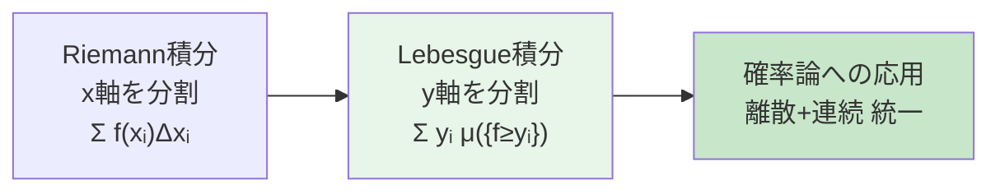
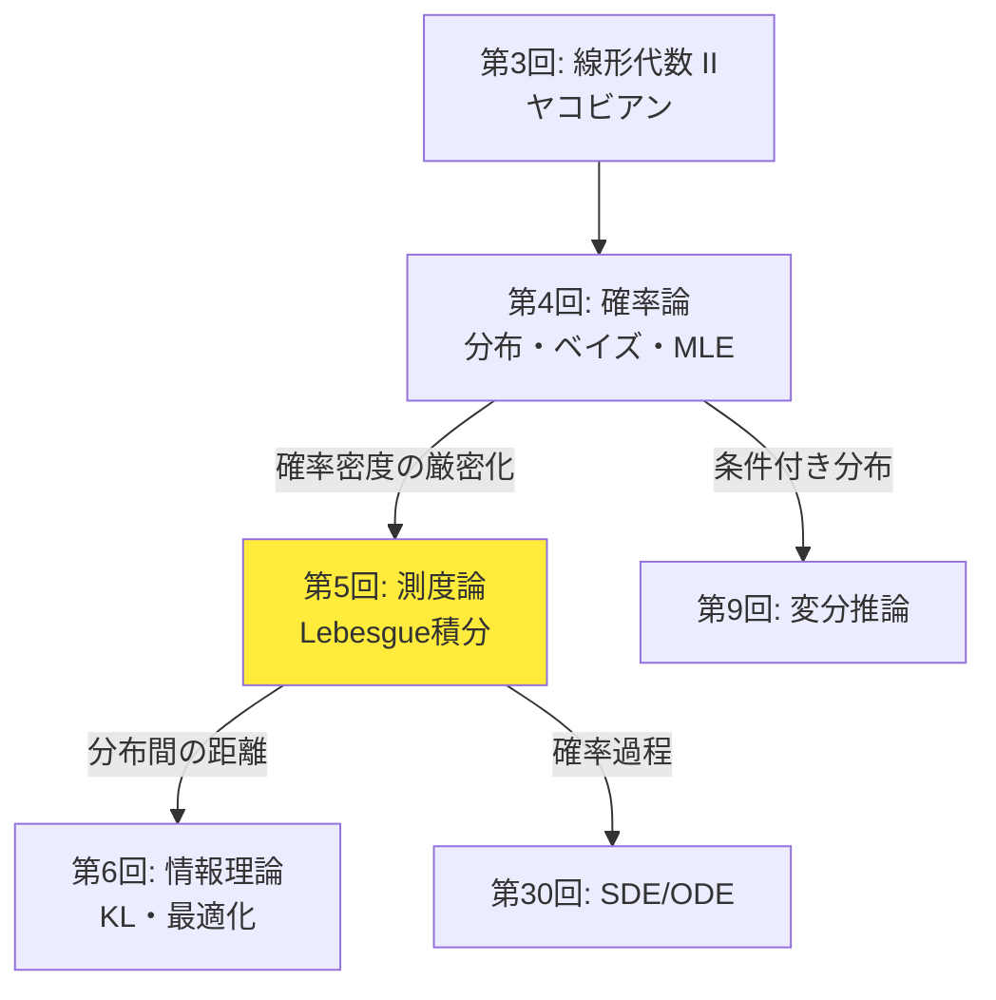
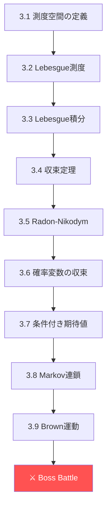
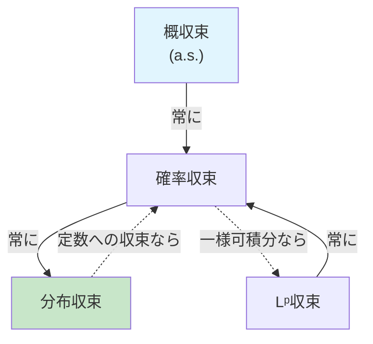
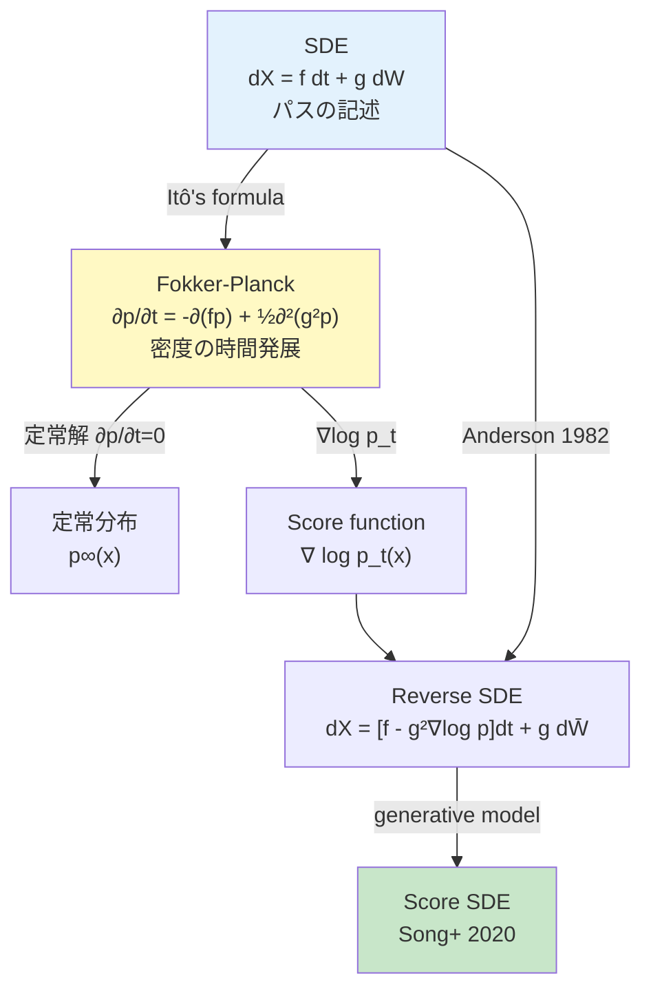
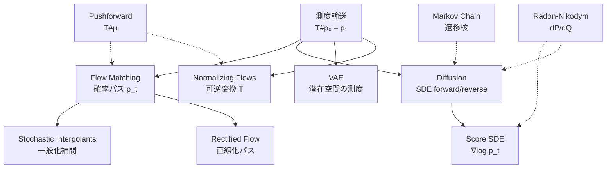
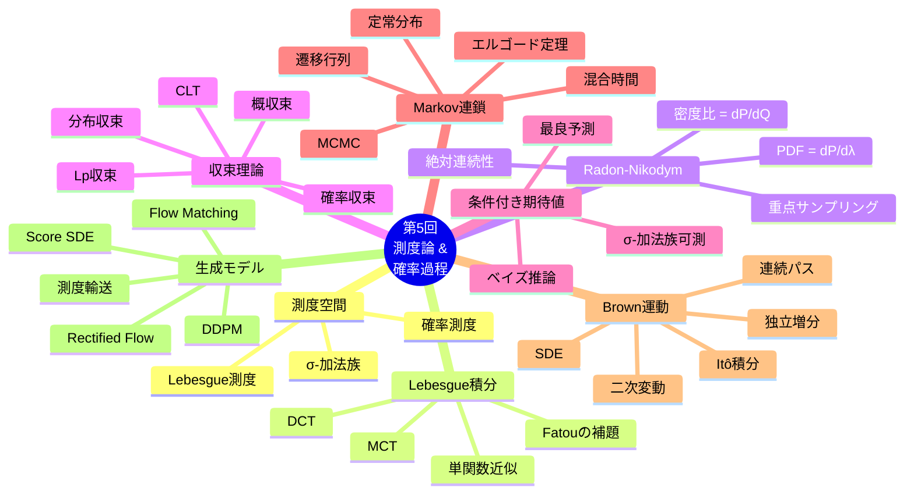
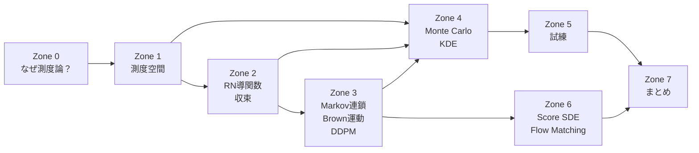

# 第5回: 測度論的確率論・確率過程入門 — 確率の「文法」を手に入れる

> **Lebesgue積分なくして確率密度なし。測度を知らずに生成モデルを語れるか？**

第4回で確率分布を「使える」ようになった。ベイズの定理で事後分布を計算し、MLEでパラメータを推定し、CLTで収束を保証した。だが、1つの根本的な問いを棚上げにしてきた — **確率密度関数とは、厳密に何なのか？**

$f(x) = \frac{1}{\sqrt{2\pi}} e^{-x^2/2}$ を「確率密度関数」と呼んだ。だが $f(0) \approx 0.399$ は「$x=0$ の確率」ではない。連続確率変数の場合、任意の1点の確率は0だ。$P(X = 0) = 0$ なのに $f(0) \neq 0$ — この矛盾を解消するのが測度論だ。

本講義では、Lebesgue積分で確率密度関数を厳密に定義し、Radon-Nikodym導関数として再解釈する。さらに確率過程（Markov連鎖、Brown運動）を導入し、拡散モデルのSDE定式化への数学的基盤を先行構築する。

:::message
**このシリーズについて**: 東京大学 松尾・岩澤研究室動画講義の**完全上位互換**の全50回シリーズ。理論（論文が書ける）、実装（Production-ready）、最新（2025-2026 SOTA）の3軸で差別化する。
:::


**所要時間の目安**:

| ゾーン | 内容 | 時間 | 難易度 |
|:-------|:-----|:-----|:-------|
| Zone 0 | クイックスタート | 30秒 | ★☆☆☆☆ |
| Zone 1 | 体験ゾーン | 10分 | ★★☆☆☆ |
| Zone 2 | 直感ゾーン | 15分 | ★★★☆☆ |
| Zone 3 | 数式修行ゾーン | 60分 | ★★★★★ |
| Zone 4 | 実装ゾーン | 45分 | ★★★☆☆ |
| Zone 5 | 実験ゾーン | 30分 | ★★★★☆ |
| Zone 6 | 振り返りゾーン | 30分 | ★★★★☆ |

---

## 🚀 0. クイックスタート（30秒）— 「測度」を3行で体験する

**ゴール**: Lebesgue測度の直感を30秒で掴む。

```python
import numpy as np

# Cantor set: uncountably infinite points, but Lebesgue measure = 0
# Approximate by iteratively removing middle thirds
def cantor_measure(iterations: int = 20) -> float:
    """Compute the Lebesgue measure of the Cantor set approximation.

    At each step, remaining measure = (2/3)^n of [0,1].
    """
    return (2/3)**iterations

for n in [1, 5, 10, 20]:
    print(f"Cantor set after {n:2d} iterations: measure = {cantor_measure(n):.10f}")
print(f"Cantor set (limit): measure = 0, but |Cantor| = |ℝ| (uncountably infinite!)")
```

出力:
```
Cantor set after  1 iterations: measure = 0.6666666667
Cantor set after  5 iterations: measure = 0.1316872428
Cantor set after 10 iterations: measure = 0.0173415300
Cantor set after 20 iterations: measure = 0.0003007092
Cantor set (limit): measure = 0, but |Cantor| = |ℝ| (uncountably infinite!)
```

**この3行の裏にある衝撃**: Cantor集合は $\mathbb{R}$ と同じ濃度（非可算無限）を持つのに、Lebesgue測度は0。「大きさ」と「濃度」は全く別の概念だ。

測度論はこの「大きさ」を厳密に定義する数学だ。そして**確率密度関数は、確率測度のLebesgue測度に対するRadon-Nikodym導関数**として定義される — これが本講義のゴールだ。

:::message
**進捗: 3% 完了** Cantor集合という「直感に反する集合」で、測度の必要性を体感した。
:::

---

## 🎮 1. 体験ゾーン（10分）— 測度論が必要になる瞬間

### 1.1 Riemann積分の限界

第4回では、期待値を $\mathbb{E}[X] = \int x f(x) dx$ と計算した。この積分はRiemann積分だ。だがRiemann積分には限界がある。

```python
import numpy as np

# Dirichlet function: f(x) = 1 if x is rational, 0 if irrational
# This function is NOT Riemann integrable, but IS Lebesgue integrable
# Lebesgue integral = 0 (rationals have measure zero)

# Approximate: sample random points in [0,1]
n_samples = 1000000
x = np.random.uniform(0, 1, n_samples)

# Can we distinguish rationals? In floating point, everything is rational
# But mathematically: Q ∩ [0,1] has Lebesgue measure 0
# So ∫₀¹ 1_Q(x) dx = 0 (Lebesgue) but undefined (Riemann)

# Better example: indicator of rationals approximated by p/q with q ≤ N
def approximate_dirichlet(x: np.ndarray, max_q: int = 100) -> np.ndarray:
    """Approximate 1_Q: returns 1 if x is 'close' to a rational p/q, q ≤ max_q."""
    result = np.zeros_like(x)
    for q in range(1, max_q + 1):
        for p in range(q + 1):
            result[np.abs(x - p/q) < 1e-8] = 1.0
    return result

print("=== Riemann vs Lebesgue Integration ===\n")
print("Dirichlet function: f(x) = 1 if x ∈ Q, 0 if x ∈ R\\Q")
print(f"Riemann integral:  DOES NOT EXIST (upper sum = 1, lower sum = 0)")
print(f"Lebesgue integral: ∫f dλ = 1 × λ(Q) + 0 × λ(R\\Q) = 1 × 0 + 0 × 1 = 0")
print(f"\nLebesgue's key insight: integrate by slicing the RANGE, not the domain")
```

**Riemann積分とLebesgue積分の違い**:

| 観点 | Riemann積分 | Lebesgue積分 |
|:-----|:-----------|:------------|
| スライス方向 | 定義域（$x$ 軸） | 値域（$y$ 軸） |
| 可積分条件 | 不連続点が零集合 | 可測関数なら常に定義可能 |
| 極限交換 | 条件が厳しい | 単調収束・優収束定理 |
| 確率論 | 離散と連続を別扱い | **統一的に扱える** |



### 1.2 離散と連続の統一 — なぜ測度論か

第4回では離散分布と連続分布を別々に扱った:

- 離散: $\mathbb{E}[X] = \sum_x x \cdot P(X = x)$
- 連続: $\mathbb{E}[X] = \int x \cdot f(x) dx$

だが、離散と連続が混じった分布はどう扱うか？ 例えば、確率0.3で $X = 0$（原子）、残り0.7で $X \sim \mathcal{N}(1, 1)$（連続部分）。

```python
import numpy as np

# Mixed distribution: P(X=0) = 0.3, otherwise X ~ N(1,1) with prob 0.7
np.random.seed(42)
n_samples = 100000

is_atom = np.random.binomial(1, 0.3, n_samples)
continuous_part = np.random.normal(1, 1, n_samples)
X = np.where(is_atom, 0, continuous_part)

print("=== Mixed Distribution (discrete + continuous) ===")
print(f"P(X = 0) empirical: {(X == 0).mean():.4f} (theory: 0.3)")
print(f"E[X] empirical: {X.mean():.4f} (theory: 0×0.3 + 1×0.7 = 0.7)")
print(f"Var(X) empirical: {X.var():.4f}")

# This distribution has no PDF in the classical sense!
# It has a Radon-Nikodym derivative w.r.t. (Lebesgue + counting) measure
print("\nThis distribution is NEITHER purely discrete NOR purely continuous.")
print("Classical PDF does not exist. Measure theory handles it naturally:")
print("  dP = 0.3 δ₀ + 0.7 N(1,1) dλ")
print("  (point mass at 0 + continuous density)")
```

測度論は離散（数え上げ測度）と連続（Lebesgue測度）を**同じ枠組み**で扱える。確率密度関数はRadon-Nikodym導関数 $f = dP/d\mu$ として定義され、基底測度 $\mu$ が何かで離散と連続の区別が吸収される。

### 1.3 確率過程の直感 — ランダムウォーク

```python
import numpy as np

def random_walk(n_steps: int, n_paths: int = 5) -> np.ndarray:
    """Simple symmetric random walk: S_n = Σᵢ Xᵢ, Xᵢ ∈ {-1, +1}.

    This is a discrete-time Markov chain and martingale.
    """
    steps = np.random.choice([-1, 1], size=(n_paths, n_steps))
    paths = np.cumsum(steps, axis=1)
    return paths

n_steps = 200
paths = random_walk(n_steps, n_paths=8)

print("=== Random Walk (Discrete-Time Markov Chain) ===\n")
print(f"{'Step':>6} | " + " | ".join(f"Path {i}" for i in range(4)))
print("-" * 50)
for t in [0, 10, 50, 100, 150, 199]:
    vals = " | ".join(f"{paths[i, t]:>6d}" for i in range(4))
    print(f"{t+1:>6} | {vals}")

# Properties
print(f"\n=== Properties at t={n_steps} ===")
all_paths = random_walk(n_steps, n_paths=100000)
final = all_paths[:, -1]
print(f"E[S_n] = {final.mean():.3f} (theory: 0)")
print(f"Var(S_n) = {final.var():.1f} (theory: {n_steps})")
print(f"Std(S_n) = {final.std():.1f} (theory: {np.sqrt(n_steps):.1f})")
print(f"\nAs n→∞, S_n/√n → N(0,1) by CLT")
print(f"S_n/√n empirical std: {(final/np.sqrt(n_steps)).std():.3f} (should ≈ 1.0)")
```

このランダムウォークをステップ幅と時間間隔を0に近づけると、**Brown運動**（Wiener過程）が得られる。Brown運動は拡散モデル [^1] のforward processの数学的基盤だ。

| 概念 | 離散 | 連続 | ML応用 |
|:-----|:-----|:-----|:-------|
| ランダムウォーク | $S_n = \sum_i X_i$ | Brown運動 $W_t$ | Diffusion forward |
| Markov連鎖 | $P(X_{n+1} \mid X_n)$ | SDE $dX_t = \mu dt + \sigma dW_t$ | Score-based [^2] |
| 定常分布 | $\boldsymbol{\pi} P = \boldsymbol{\pi}$ | Fokker-Planck方程式 | 平衡分布 |

> **Zone 1 まとめ**: Riemann積分の限界 → Lebesgue積分の必要性 → 離散と連続の統一 → 確率過程（ランダムウォーク→Brown運動）。測度論は「確率の文法」を厳密にする道具だ。

:::message
**進捗: 10% 完了** 測度論が必要な理由と、確率過程の直感を掴んだ。Zone 1 クリア。
:::

---

## 🧩 2. 直感ゾーン（15分）— 測度論はなぜ生成モデルに必要か

### 2.1 拡散モデルの数式を「読む」ために

拡散モデル（DDPM）[^1] の前方過程は:

$$
q(\mathbf{x}_{1:T} \mid \mathbf{x}_0) = \prod_{t=1}^{T} q(\mathbf{x}_t \mid \mathbf{x}_{t-1}), \quad q(\mathbf{x}_t \mid \mathbf{x}_{t-1}) = \mathcal{N}(\sqrt{1-\beta_t}\mathbf{x}_{t-1}, \beta_t \mathbf{I})
$$

連続時間版（Song et al. 2020 [^2]）では:

$$
d\mathbf{x} = f(\mathbf{x}, t)dt + g(t)d\mathbf{w}
$$

ここで $\mathbf{w}$ はBrown運動（Wiener過程）。この式を理解するには:

1. **Brown運動の定義** — 測度論が必要（連続だが至る所微分不可能な過程）
2. **確率積分** $\int g \, d\mathbf{w}$ — Itô積分はLebesgue積分の確率版
3. **Fokker-Planck方程式** — SDEが定義する確率測度の時間発展

第30回で完全に扱うが、その基礎を今ここで構築する。

### 2.2 Course Iでの位置づけ



第5回は**Course Iの最難関**だ。測度論は抽象度が高く、多くの教科書が「省略」する。だが省略した先に待っているのは、SDEの式を「読めるが理解できない」状態だ。

| 回 | テーマ | 第5回との接続 |
|:---|:------|:-------------|
| 第4回 | 確率論 | PDF/PMF → **Radon-Nikodym導関数**として統一 |
| **第5回** | **測度論** | **本講義** |
| 第6回 | 情報理論 | KLダイバージェンス = **測度の比の期待値** |
| 第9回 | 変分推論 | ELBO = **測度変換の下での期待値** |
| 第25回 | NF | Change of variables = **pushforward測度** |
| 第30回 | SDE | **Itô積分 = 本講義のBrown運動の直接拡張** |

### 2.3 松尾研との差別化

| 観点 | 松尾・岩澤研 | 本シリーズ |
|:-----|:------------|:----------|
| 測度論 | 一切扱わない | **1講義を丸々投入** |
| 確率密度 | 「$f(x)$ は密度」で終了 | **$dP/d\lambda$ として厳密定義** |
| Brown運動 | SDEの中で突然登場 | **定義→性質→SDE動機まで段階的** |
| Markov連鎖 | 定常分布の結果だけ | **エルゴード定理・混合時間まで** |
| 収束概念 | 区別なし | **4つの収束の関係図** |

### 2.4 LLMグラウンディング — トークン空間の測度

第5回のLLM接続は**トークン空間上の確率測度**だ。

LLMの語彙 $\mathcal{V} = \{v_1, \ldots, v_V\}$ は有限集合。この上の確率測度は:

$$
P(\{v_k\}) = \pi_k = \text{softmax}(f_\theta(x_{<t}))_k
$$

有限集合の場合、全ての部分集合が可測（冪集合 $= \sigma$-加法族）。測度論の本領が発揮されるのは、連続的な潜在空間 $\mathcal{Z} = \mathbb{R}^d$ だ。

VAEのエンコーダが出力する $q_\phi(\mathbf{z} \mid \mathbf{x}) = \mathcal{N}(\boldsymbol{\mu}, \text{diag}(\boldsymbol{\sigma}^2))$ は、$\mathbb{R}^d$ 上の確率測度 $Q_\phi$ を定義する。KLダイバージェンス $D_{KL}[Q_\phi \| P]$ は2つの確率測度の「距離」を測る — これを厳密に定義するのに測度論が必要だ。

:::details トロイの木馬 — `%timeit` 初登場
本講義はPython 95%。残り5%は......`%timeit` だ。

Zone 4のMonte Carlo積分で初めて計算時間を測定する。「Pythonって遅くない？」という疑問が芽生える瞬間。第9回でJuliaが50倍速でELBOを計算する伏線がここから始まる。

今はPythonを信じて、測度論に集中しよう。......でも心の片隅に「速度」を意識し始めてほしい。
:::

:::message
**進捗: 20% 完了** 測度論が生成モデルのどこで必要になるか、全体像を把握した。Zone 2 クリア。
:::

---

## 📐 3. 数式修行ゾーン（60分）— 測度論の完全武装



### 3.1 測度空間の定義

**定義（測度空間）**: 三つ組 $(S, \mathcal{A}, \mu)$ を測度空間と呼ぶ:

1. $S$ — 集合
2. $\mathcal{A}$ — $S$ 上のσ-加法族（第4回 3.1で定義済み）
3. $\mu: \mathcal{A} \to [0, \infty]$ — 測度。以下を満たす:
   - $\mu(\emptyset) = 0$
   - σ-加法性: 互いに素な $A_1, A_2, \ldots \in \mathcal{A}$ に対して $\mu\left(\bigcup_{n=1}^\infty A_n\right) = \sum_{n=1}^\infty \mu(A_n)$

確率測度は $\mu(S) = 1$ を追加で要求する特殊な測度。

**Borel σ-加法族**: $\mathbb{R}^d$ の開集合全てを含む最小のσ-加法族を $\mathcal{B}(\mathbb{R}^d)$ と書く。通常の確率論はBorelσ-加法族上で展開される。

```python
import numpy as np

# Illustrate: σ-algebra generated by a partition
# Simplest non-trivial example: Ω = {a, b, c, d}
# Partition: {{a,b}, {c,d}}
# Generated σ-algebra: {∅, {a,b}, {c,d}, {a,b,c,d}}

omega = {'a', 'b', 'c', 'd'}

# Power set (2^4 = 16 subsets)
from itertools import chain, combinations
def power_set(s):
    return [set(x) for x in chain.from_iterable(combinations(s, r) for r in range(len(s)+1))]

P = power_set(omega)
print(f"|Power set| = {len(P)} subsets (= 2^{len(omega)})")

# σ-algebra from partition {{a,b}, {c,d}}
sigma_partition = [set(), {'a','b'}, {'c','d'}, {'a','b','c','d'}]
print(f"|σ-algebra from partition| = {len(sigma_partition)} sets")
print("Sets:", [s if s else '∅' for s in sigma_partition])

# Verify σ-algebra axioms
print(f"\nAxiom check:")
print(f"1. Ω ∈ F: {omega in sigma_partition}")
print(f"2. Closed under complement: {all(omega-s in sigma_partition for s in sigma_partition)}")
# Check closure under countable union (finite case)
print(f"3. Closed under union: {{'a','b'}.union({'c','d'}) in sigma_partition}")
```

### 3.1.1 なぜσ-加法族が必要か — Vitaliの非可測集合

「すべての部分集合に測度を割り当てられないのか？」という疑問への回答がVitaliの定理(1905)だ。

:::details Vitaliの非可測集合（概要）
$[0,1]$ 上で「$x \sim y \iff x - y \in \mathbb{Q}$」という同値関係を定義する。各同値類から代表元を1つずつ選んだ集合 $V$（選択公理を使う）を考えると:

1. もし $\lambda(V) = 0$ なら、$[0,1] = \bigcup_{q \in \mathbb{Q} \cap [-1,1]} (V + q)$ の可算合併の測度が0になり矛盾
2. もし $\lambda(V) > 0$ なら、同じ合併の測度が $\infty$ になり矛盾

したがって $V$ にはLebesgue測度を割り当てられない。これが $\sigma$-加法族で可測集合を制限する理由。

**機械学習への影響**: 実用上、我々が扱う集合（開集合、閉集合、Borel集合）はすべて可測なので問題にならない。非可測集合は選択公理によるexotic constructionでのみ出現する。
:::

```python
# Vitali set cannot be constructed computationally
# (requires Axiom of Choice on uncountable set)
# Instead, verify that all "normal" sets are Borel measurable

# Borel σ-algebra = smallest σ-algebra containing all open sets
# Contains: open sets, closed sets, countable unions/intersections
# (G_δ sets, F_σ sets, etc.)

# In practice: if you can describe a set with countable operations
# on intervals, it's Borel measurable.

print("=== Borel Measurability ===\n")
examples = [
    ("Open interval (a,b)", "Borel", "Generator of Borel σ-algebra"),
    ("Closed set [a,b]", "Borel", "Complement of open set"),
    ("Singleton {x}", "Borel", "Countable intersection of open sets"),
    ("Rationals Q", "Borel", "Countable union of singletons"),
    ("Cantor set C", "Borel", "Countable intersection of closed sets"),
    ("Vitali set V", "NOT Borel", "Requires Axiom of Choice"),
]

for name, status, reason in examples:
    print(f"  {name:>25}: {status:>10} — {reason}")
```

### 3.2 Lebesgue測度

**定義（Lebesgue測度）**: $\mathbb{R}$ 上のLebesgue測度 $\lambda$ は、区間 $[a,b]$ に対して $\lambda([a,b]) = b - a$ を満たし、σ-加法的に拡張された測度。

直感的には「長さ」（1次元）、「面積」（2次元）、「体積」（3次元）の一般化だ。

**重要な性質**:

1. 平行移動不変: $\lambda(A + c) = \lambda(A)$
2. スケーリング: $\lambda(cA) = |c| \lambda(A)$
3. 可算集合の測度は0: $\lambda(\mathbb{Q} \cap [0,1]) = 0$（有理数は「薄い」）
4. Cantor集合: 非可算だが $\lambda(C) = 0$

```python
import numpy as np

# Demonstrate: rational numbers have Lebesgue measure zero
# Enumerate rationals p/q in [0,1] with q ≤ N, cover each with interval of width ε/2^n
def cover_rationals(max_q: int, epsilon: float) -> float:
    """Total length of ε-covers of rationals p/q ≤ max_q in [0,1].

    Each rational gets interval of width ε/2^n where n is its index.
    Total cover length ≤ Σ ε/2^n = 2ε → 0 as ε → 0.
    """
    n = 0
    total_length = 0.0
    seen = set()
    for q in range(1, max_q + 1):
        for p in range(q + 1):
            r = p / q
            key = round(r, 10)  # avoid floating point duplicates
            if key not in seen:
                seen.add(key)
                n += 1
                total_length += epsilon / (2**n)
    return total_length, len(seen)

print("=== Rationals Have Lebesgue Measure Zero ===\n")
for eps in [1.0, 0.1, 0.01, 0.001]:
    cover, n_rationals = cover_rationals(100, eps)
    print(f"ε={eps:<6} | {n_rationals} rationals covered | total cover length = {cover:.8f}")

print("\nAs ε → 0, total cover → 0. So λ(Q ∩ [0,1]) = 0.")
print("Despite Q being dense in [0,1] and countably infinite!")
```

:::message
ここで多くの人が混乱するのが「測度0 ≠ 空集合」だ。$\mathbb{Q} \cap [0,1]$ は無限に多くの点を含むが、Lebesgue測度は0。直感的には、有理数は実数直線上で「隙間だらけ」なので「長さがない」。

確率論では: 「確率0の事象は起こらない」は**間違い**。正しくは「確率0の事象は、繰り返し試行すれば"ほとんど確実に"起こらない」。
:::

### 3.3 Lebesgue積分

**構成**:

1. **単関数**: $s(x) = \sum_{i=1}^{n} c_i \cdot \mathbf{1}_{A_i}(x)$（$A_i$ は可測集合）に対して:
   $$\int s \, d\mu = \sum_{i=1}^{n} c_i \cdot \mu(A_i)$$

2. **非負可測関数**: $f \geq 0$ に対して:
   $$\int f \, d\mu = \sup\left\{\int s \, d\mu : 0 \leq s \leq f, \; s \text{ は単関数}\right\}$$

3. **一般の可測関数**: $f = f^+ - f^-$（$f^+ = \max(f, 0)$, $f^- = \max(-f, 0)$）に対して:
   $$\int f \, d\mu = \int f^+ d\mu - \int f^- d\mu$$
   （少なくとも一方が有限のとき定義される）

```python
import numpy as np

def lebesgue_integral_simple_function(values: list, measure_of_sets: list) -> float:
    """Lebesgue integral of a simple function.

    ∫s dμ = Σ cᵢ μ(Aᵢ)
    """
    return sum(c * m for c, m in zip(values, measure_of_sets))

# Example: Dirichlet function on [0,1]
# f(x) = 1 on Q, f(x) = 0 on R\Q
# ∫f dλ = 1 × λ(Q∩[0,1]) + 0 × λ((R\Q)∩[0,1]) = 1×0 + 0×1 = 0
result = lebesgue_integral_simple_function([1, 0], [0, 1])
print(f"∫(Dirichlet) dλ = {result} (rationals contribute nothing)")

# Example: indicator of Cantor set
# ∫1_C dλ = λ(C) = 0
print(f"∫(1_Cantor) dλ = 0 (Cantor set has measure zero)")

# Example: standard Gaussian expectation
# ∫x × (2π)^{-1/2} exp(-x²/2) dλ = 0 (by symmetry)
n = 1000000
x = np.random.normal(0, 1, n)
print(f"\n∫x dN(0,1) = E[X] = {x.mean():.6f} (theory: 0)")
print(f"∫x² dN(0,1) = E[X²] = {(x**2).mean():.6f} (theory: 1)")
```

**RiemannとLebesgueの関係**: Riemann可積分な関数はLebesgue可積分でもあり、値が一致する。逆は成り立たない（Dirichlet関数）。

### 3.4 収束定理 — 測度論の三大武器

**定理（単調収束定理 / MCT）**: $0 \leq f_1 \leq f_2 \leq \cdots$ が可測関数の単調増大列で、$f_n \nearrow f$ のとき:

$$
\int f \, d\mu = \lim_{n \to \infty} \int f_n \, d\mu
$$

極限と積分の交換が無条件に成り立つ。

**定理（優収束定理 / DCT）**: $f_n \to f$ が各点収束し、全ての $n$ で $|f_n| \leq g$ かつ $\int g \, d\mu < \infty$ のとき:

$$
\lim_{n \to \infty} \int f_n \, d\mu = \int f \, d\mu
$$

**定理（Fatouの補題）**: $f_n \geq 0$ が可測関数列のとき:

$$
\int \liminf_{n \to \infty} f_n \, d\mu \leq \liminf_{n \to \infty} \int f_n \, d\mu
$$

```python
import numpy as np

# DCT application: computing E[g(X)] by approximation
# f_n(x) = g(x) × 1_{|x|≤n} → g(x) as n→∞
# If |g(x)| ≤ h(x) with E[h(X)] < ∞, then E[f_n(X)] → E[g(X)]

np.random.seed(42)
N = 100000
X = np.random.normal(0, 1, N)

# g(x) = exp(x) — NOT dominated (E[exp(X)] = exp(1/2) but heavy tail issues)
# Truncated versions: g_n(x) = exp(x) × 1_{|x|≤n}
print("=== Dominated Convergence in Action ===\n")
print(f"Computing E[exp(X)] where X ~ N(0,1)")
print(f"Theory: E[exp(X)] = exp(μ + σ²/2) = exp(0.5) = {np.exp(0.5):.6f}\n")

for n in [1, 2, 3, 5, 10, 50]:
    truncated = np.exp(X) * (np.abs(X) <= n)
    estimate = truncated.mean()
    print(f"n={n:>2}: E[exp(X)·1_(|X|≤{n})] = {estimate:.6f}")

print(f"\nDirect: E[exp(X)] = {np.exp(X).mean():.6f}")
print(f"\nDCT guarantees convergence when a dominating function exists.")
```

:::message
収束定理が重要な理由:

1. **MCT**: VAEの変分下界が改善列のとき、極限でも下界性が保たれる
2. **DCT**: NN学習で損失関数のパラメータ微分と期待値の交換を正当化
3. **Fatou**: ELBOの下界性の証明に使われる

これらは「積分と極限を入れ替えてよいか」を保証する — ML理論の至る所で暗黙に使われている。
:::

### 3.5 Radon-Nikodym導関数 — 確率密度の正体

**定義（絶対連続）**: 測度 $\nu$ が測度 $\mu$ に対して絶対連続（$\nu \ll \mu$）であるとは、$\mu(A) = 0 \Rightarrow \nu(A) = 0$ が全ての $A \in \mathcal{A}$ で成り立つこと。

**定理（Radon-Nikodymの定理）**: $\nu \ll \mu$ かつ $\mu$ がσ-有限ならば、可測関数 $f: S \to [0, \infty)$ が存在して:

$$
\nu(A) = \int_A f \, d\mu \quad \text{for all } A \in \mathcal{A}
$$

この $f$ をRadon-Nikodym導関数と呼び、$f = \frac{d\nu}{d\mu}$ と書く。

**確率密度関数の正体**: 確率測度 $P$ がLebesgue測度 $\lambda$ に対して絶対連続ならば:

$$
P(A) = \int_A f \, d\lambda \quad \text{where } f = \frac{dP}{d\lambda}
$$

この $f$ こそが「確率密度関数」の厳密な定義だ。

```python
import numpy as np

# Radon-Nikodym derivative = density function
# For N(μ, σ²): dP/dλ = (2πσ²)^{-1/2} exp(-(x-μ)²/(2σ²))

mu, sigma = 2.0, 1.5

def radon_nikodym_gaussian(x: np.ndarray, mu: float, sigma: float) -> np.ndarray:
    """Radon-Nikodym derivative dP/dλ for Gaussian.

    This IS the PDF, but now we understand what it means:
    P(A) = ∫_A (dP/dλ) dλ
    """
    return (1 / np.sqrt(2 * np.pi * sigma**2)) * np.exp(-((x - mu)**2) / (2 * sigma**2))

# Verify: P([a,b]) = ∫_a^b f dλ
a, b = 1.0, 3.0
x_fine = np.linspace(a, b, 100000)
dx = x_fine[1] - x_fine[0]
P_ab_numerical = np.sum(radon_nikodym_gaussian(x_fine, mu, sigma)) * dx

# Compare with sampling
samples = np.random.normal(mu, sigma, 1000000)
P_ab_sampling = np.mean((samples >= a) & (samples <= b))

from scipy.stats import norm
P_ab_exact = norm.cdf(b, mu, sigma) - norm.cdf(a, mu, sigma)

print(f"P([{a}, {b}]) for N({mu}, {sigma**2})")
print(f"  Exact (CDF):        {P_ab_exact:.6f}")
print(f"  Numerical (∫f dλ):  {P_ab_numerical:.6f}")
print(f"  Monte Carlo:        {P_ab_sampling:.6f}")
print(f"\nf = dP/dλ at x={mu}: {radon_nikodym_gaussian(np.array([mu]), mu, sigma)[0]:.4f}")
print(f"This is NOT P(X={mu})! P(X={mu}) = 0 for continuous RV.")
print(f"It's a 'density': probability per unit length at x={mu}.")
```

**Pushforward測度**: 確率変数 $X: \Omega \to \mathbb{R}$ は確率測度を「押し出す」:

$$
P_X(B) = P(X^{-1}(B)) = P(\{\omega : X(\omega) \in B\})
$$

$P_X$ はを $X$ のpushforward測度（$X$ の分布）と呼ぶ。生成モデルは $G: \mathcal{Z} \to \mathcal{X}$ が「潜在空間の測度をデータ空間に押し出す」と理解できる。第25回（Normalizing Flows）では、この測度の変換規則が核心になる。

### 3.6 確率変数の収束 — 4つの収束とその関係

4つの収束概念を区別する。

**定義**:

1. **概収束 (a.s.)**: $P(\{\omega : X_n(\omega) \to X(\omega)\}) = 1$
2. **確率収束**: $\forall \epsilon > 0, \; P(|X_n - X| > \epsilon) \to 0$
3. **$L^p$ 収束**: $\mathbb{E}[|X_n - X|^p] \to 0$
4. **分布収束**: $F_{X_n}(x) \to F_X(x)$ at all continuity points of $F_X$



| 収束 | 強さ | ML応用 |
|:-----|:-----|:-------|
| 概収束 | 最強 | 強大数の法則 |
| $L^p$ 収束 | 強 | SGDの収束解析 |
| 確率収束 | 中 | MLE一致性 |
| 分布収束 | 最弱 | CLT、MLE漸近正規性 |

```python
import numpy as np

# Demonstrate different types of convergence
np.random.seed(42)
n_experiments = 50000

# Example: X_n = max(Z_1,...,Z_n)/n where Z_i ~ Uniform(0,1)
# X_n → 1/n × max → converges to 0 in probability but not a.s. for uniform

# Simpler: sample means converge by LLN
N_values = [10, 50, 100, 500, 1000, 5000]

print("=== Four Types of Convergence ===\n")
print("Strong LLN: X̄_n →(a.s.) μ")
print("CLT: √n(X̄_n - μ) →(d) N(0,σ²)\n")

# Exponential(1) samples: μ=1, σ²=1
for N in N_values:
    means = np.array([np.random.exponential(1, N).mean() for _ in range(n_experiments)])

    # Probability convergence: P(|X̄_n - 1| > ε) → 0
    eps = 0.1
    prob_dev = (np.abs(means - 1) > eps).mean()

    # L2 convergence: E[(X̄_n - 1)²] → 0
    l2_error = np.mean((means - 1)**2)

    # Distribution convergence: √n(X̄_n - 1) → N(0,1)
    standardized = np.sqrt(N) * (means - 1)
    # Test: how close to N(0,1)?
    std_check = standardized.std()

    print(f"N={N:>5}: P(|X̄-1|>{eps})={prob_dev:.4f}, "
          f"E[(X̄-1)²]={l2_error:.6f}, "
          f"std(√N(X̄-1))={std_check:.3f}")
```

### 3.7 条件付き期待値の測度論的定義

**定義**: σ-加法族 $\mathcal{G} \subseteq \mathcal{F}$ に関する $X$ の条件付き期待値 $\mathbb{E}[X \mid \mathcal{G}]$ とは、以下を満たす $\mathcal{G}$-可測関数 $Y$:

$$
\int_G Y \, dP = \int_G X \, dP \quad \text{for all } G \in \mathcal{G}
$$

直感的には「$\mathcal{G}$ で表される情報しか使わずに $X$ を最良予測したもの」。

**射影性質**: $\mathbb{E}[X \mid \mathcal{G}]$ は $L^2(\Omega, \mathcal{F}, P)$ から $L^2(\Omega, \mathcal{G}, P)$ への**直交射影**。これは第2回の射影行列の関数空間版だ。

| 性質 | 数式 | 名前 |
|:-----|:-----|:-----|
| 線形性 | $\mathbb{E}[aX+bY \mid \mathcal{G}] = a\mathbb{E}[X \mid \mathcal{G}] + b\mathbb{E}[Y \mid \mathcal{G}]$ | — |
| タワー性 | $\mathbb{E}[\mathbb{E}[X \mid \mathcal{G}_1] \mid \mathcal{G}_2] = \mathbb{E}[X \mid \mathcal{G}_2]$ for $\mathcal{G}_2 \subseteq \mathcal{G}_1$ | 繰り返し期待値の法則 |
| 取り出し | $Y$ が $\mathcal{G}$-可測 ⇒ $\mathbb{E}[XY \mid \mathcal{G}] = Y \cdot \mathbb{E}[X \mid \mathcal{G}]$ | — |
| 独立性 | $X$ が $\mathcal{G}$ と独立 ⇒ $\mathbb{E}[X \mid \mathcal{G}] = \mathbb{E}[X]$ | — |

**タワー性は生成モデルの理論で頻出する。** ELBOの導出で $\mathbb{E}_{q(z)}[\mathbb{E}_{q(x|z)}[\cdot]]$ のような入れ子の期待値を整理するとき、タワー性が使われる。

### 3.7.1 マルチンゲール — 「公平なゲーム」の測度論的定義

**定義（マルチンゲール）**: フィルトレーション $\{\mathcal{F}_n\}$ に適合した確率過程 $\{M_n\}$ がマルチンゲール ⟺

$$
\mathbb{E}[M_{n+1} \mid \mathcal{F}_n] = M_n \quad \text{a.s.}
$$

条件付き期待値を使った簡潔な定義。「次の時点の期待値が現在の値に等しい」— 公平なゲーム。

**例**:
- **ランダムウォーク**: $S_n = \sum_{i=1}^n X_i$（$X_i$ i.i.d., $\mathbb{E}[X_i]=0$）はマルチンゲール
- **Brown運動**: $W(t)$ はマルチンゲール（$\mathbb{E}[W(t) \mid \mathcal{F}_s] = W(s)$ for $s < t$）
- **Doob martingale**: $M_n = \mathbb{E}[X \mid \mathcal{F}_n]$ は常にマルチンゲール（タワー性から）

```python
import numpy as np

def verify_martingale_property(n_paths=50_000, n_steps=1000):
    """Verify martingale property: E[M_{n+1} | F_n] = M_n."""
    # Random walk S_n = Σ X_i, X_i ~ Rademacher (±1)
    X = np.random.choice([-1, 1], size=(n_paths, n_steps))
    S = np.cumsum(X, axis=1)

    print("=== Martingale Property Verification ===\n")
    print("Random walk S_n = Σ X_i, X_i = ±1 with prob 1/2\n")

    print(f"{'n':>6} {'E[S_n]':>10} {'E[S_{n+1}|S_n=k]':>18} {'(should ≈ k)':>14}")
    for n in [10, 50, 100, 500]:
        mean_Sn = np.mean(S[:, n-1])

        # Conditional check: for paths where S_n = 0,
        # what is E[S_{n+1}]?
        mask = S[:, n-1] == 0
        if np.sum(mask) > 100:
            cond_mean = np.mean(S[mask, n])
            print(f"{n:>6} {mean_Sn:>10.4f} {cond_mean:>18.4f} {'(≈ 0)':>14}")

    # Verify E[S_n] = S_0 = 0 for all n
    print(f"\nMartingale → E[S_n] = E[S_0] = 0 for all n:")
    for n in [1, 10, 100, 500, 1000]:
        print(f"  E[S_{n}] = {np.mean(S[:, n-1]):.4f}")

np.random.seed(42)
verify_martingale_property()
```

> **マルチンゲールと生成モデル**: DDPMのreverse processで、denoised estimateは（適切な条件下で）マルチンゲール的な振る舞いを示す。ELBOの各項 $\mathbb{E}_{q}[\log p(x_{t-1}|x_t)]$ の分解にもマルチンゲール理論が暗黙に使われている。

:::message
**マルチンゲール不等式** (Doob): $P(\max_{k \leq n} M_k \geq \lambda) \leq \frac{\mathbb{E}[M_n^+]}{\lambda}$

これはMarkov不等式の時間方向への拡張。SGDの収束解析で「最悪ケースの逸脱」を制御するのに使われる。
:::

### 3.8 確率過程 — Markov連鎖

**定義（確率過程）**: 確率空間 $(\Omega, \mathcal{F}, P)$ 上の確率変数の族 $\{X_t\}_{t \in T}$ を確率過程と呼ぶ。$T$ は時間の集合（離散 $T = \mathbb{N}$ または連続 $T = [0, \infty)$）。

**定義（フィルトレーション）**: $\mathcal{F}_t$ を「時刻 $t$ までに得られる情報」を表すσ-加法族の増大列: $\mathcal{F}_s \subseteq \mathcal{F}_t$ for $s \leq t$。

**定義（Markov性）**: $\{X_n\}$ がMarkov連鎖 ⟺

$$
P(X_{n+1} \in A \mid \mathcal{F}_n) = P(X_{n+1} \in A \mid X_n)
$$

「未来は現在だけに依存し、過去には依存しない」。

**遷移行列**: 有限状態 $\{1, \ldots, K\}$ のMarkov連鎖の遷移確率:

$$
P_{ij} = P(X_{n+1} = j \mid X_n = i), \quad \sum_{j=1}^{K} P_{ij} = 1
$$

```python
import numpy as np

def simulate_markov_chain(P: np.ndarray, initial: int, n_steps: int) -> np.ndarray:
    """Simulate a discrete Markov chain.

    P: transition matrix (K×K), P[i,j] = P(X_{n+1}=j | X_n=i)
    """
    K = P.shape[0]
    path = np.zeros(n_steps, dtype=int)
    path[0] = initial
    for t in range(1, n_steps):
        path[t] = np.random.choice(K, p=P[path[t-1]])
    return path

# Weather model: Sunny(0), Cloudy(1), Rainy(2)
P = np.array([
    [0.7, 0.2, 0.1],  # Sunny  → Sunny/Cloudy/Rainy
    [0.3, 0.4, 0.3],  # Cloudy → ...
    [0.2, 0.3, 0.5],  # Rainy  → ...
])
states = ["Sunny", "Cloudy", "Rainy"]

print("=== Markov Chain: Weather Model ===\n")
print("Transition matrix P:")
for i, s in enumerate(states):
    row = "  ".join(f"{P[i,j]:.1f}" for j in range(3))
    print(f"  {s:>6} → [{row}]")

# Simulate
path = simulate_markov_chain(P, 0, 100)
print(f"\nFirst 20 states: {' '.join(states[s][0] for s in path[:20])}")

# Empirical stationary distribution
counts = np.bincount(path, minlength=3) / len(path)
print(f"\nEmpirical distribution: {dict(zip(states, counts.round(3)))}")

# Theoretical stationary distribution: π P = π, Σπ = 1
# Solve (P^T - I)π = 0 with Σπ = 1
A = P.T - np.eye(3)
A[-1] = 1  # replace last equation with Σπ = 1
b = np.zeros(3)
b[-1] = 1
pi_stationary = np.linalg.solve(A, b)
print(f"Stationary distribution: {dict(zip(states, pi_stationary.round(4)))}")

# Convergence: P^n → rows equal to π
print(f"\nConvergence of P^n:")
for n in [1, 5, 10, 50]:
    Pn = np.linalg.matrix_power(P, n)
    print(f"  P^{n:>2} row 0: [{', '.join(f'{x:.4f}' for x in Pn[0])}]")
print(f"  π:       [{', '.join(f'{x:.4f}' for x in pi_stationary)}]")
```

**定理（エルゴード定理）**: 既約かつ非周期的なMarkov連鎖は一意の定常分布 $\boldsymbol{\pi}$ を持ち、任意の初期分布から $\boldsymbol{\pi}$ に収束する。

**混合時間（Mixing Time）**: $t_{\text{mix}}(\epsilon) = \min\{t : \max_i \|P^t(i, \cdot) - \boldsymbol{\pi}\|_{TV} \leq \epsilon\}$

混合時間はMCMC法（Markov Chain Monte Carlo）の収束速度を決定する。Levin & Peres [^3] の教科書が詳しい。

:::details Diffusionモデルとの接続
DDPMの前方過程 [^1] はMarkov連鎖の連続版だ:

$$
q(\mathbf{x}_t \mid \mathbf{x}_{t-1}) = \mathcal{N}(\sqrt{1-\beta_t}\mathbf{x}_{t-1}, \beta_t \mathbf{I})
$$

- 各ステップがMarkov（現在の $\mathbf{x}_{t-1}$ だけに依存）
- 定常分布は $\mathcal{N}(\mathbf{0}, \mathbf{I})$（十分なステップで到達）
- 逆過程 $p_\theta(\mathbf{x}_{t-1} \mid \mathbf{x}_t)$ もMarkov連鎖

離散Markov連鎖の「遷移行列」がガウス条件分布に置き換わった形。定常分布への収束がforward process、逆向きの遷移がreverse process。
:::

### 3.9 Brown運動 — 確率過程の主役

**定義（Brown運動 / Wiener過程）**: 確率過程 $\{W_t\}_{t \geq 0}$ が以下を満たすときBrown運動と呼ぶ:

1. $W_0 = 0$（a.s.）
2. 独立増分: $0 \leq s < t$ に対して $W_t - W_s$ は $\mathcal{F}_s$ と独立
3. 正規増分: $W_t - W_s \sim \mathcal{N}(0, t-s)$
4. 連続な標本路: $t \mapsto W_t(\omega)$ は連続（a.s.）

```python
import numpy as np

def simulate_brownian_motion(T: float, n_steps: int, n_paths: int = 5) -> tuple:
    """Simulate Brownian motion paths via random walk approximation.

    W_t ≈ Σ_{i=1}^{⌊t/Δt⌋} √(Δt) Z_i, Z_i ~ N(0,1)

    By CLT/Donsker's theorem, this converges to true Brownian motion.
    """
    dt = T / n_steps
    t = np.linspace(0, T, n_steps + 1)
    dW = np.random.normal(0, np.sqrt(dt), (n_paths, n_steps))
    W = np.zeros((n_paths, n_steps + 1))
    W[:, 1:] = np.cumsum(dW, axis=1)
    return t, W

T, n_steps = 1.0, 10000
t, W = simulate_brownian_motion(T, n_steps, n_paths=8)

print("=== Brownian Motion Properties ===\n")

# Property 1: W_0 = 0
print(f"W(0) = {W[:, 0].mean():.6f} (should be 0)")

# Property 2: Normal increments W_t - W_s ~ N(0, t-s)
s_idx, t_idx = n_steps // 4, 3 * n_steps // 4
s_val, t_val = t[s_idx], t[t_idx]
increments = W[:, t_idx] - W[:, s_idx]
all_paths = simulate_brownian_motion(T, n_steps, n_paths=100000)[1]
increments_large = all_paths[:, t_idx] - all_paths[:, s_idx]
print(f"\nW({t_val:.2f}) - W({s_val:.2f}) ~ N(0, {t_val-s_val:.2f})")
print(f"  Mean: {increments_large.mean():.4f} (theory: 0)")
print(f"  Var:  {increments_large.var():.4f} (theory: {t_val-s_val:.4f})")

# Property 3: E[W_t²] = t (variance grows linearly)
print(f"\nVariance growth:")
check_times = [0.1, 0.25, 0.5, 0.75, 1.0]
for t_check in check_times:
    idx = int(t_check * n_steps)
    var = all_paths[:, idx].var()
    print(f"  E[W({t_check})²] = {var:.4f} (theory: {t_check:.4f})")

# Property 4: Nowhere differentiable (a.s.)
dW_dt = np.diff(W[0]) / (T / n_steps)
print(f"\n'Derivative' statistics (should diverge as dt→0):")
print(f"  |dW/dt| mean: {np.abs(dW_dt).mean():.1f}")
print(f"  |dW/dt| max:  {np.abs(dW_dt).max():.1f}")
print(f"  These grow as O(1/√dt) → ∞, confirming non-differentiability")
```

**Brown運動の驚くべき性質**:

1. **連続だが至る所微分不可能**（概確実に）— 通常の微積分が使えない
2. **二次変分**: $[W]_T = \lim_{n \to \infty} \sum_{i} (W_{t_{i+1}} - W_{t_i})^2 = T$（有限！）
3. **スケーリング**: $cW_{t/c^2}$ もBrown運動（自己相似性）
4. **マルチンゲール**: $\mathbb{E}[W_t \mid \mathcal{F}_s] = W_s$

```python
import numpy as np

# Quadratic variation: [W]_T = Σ(ΔW)² → T
T = 1.0
n_paths = 1000
print("=== Quadratic Variation of Brownian Motion ===\n")
print(f"{'n_steps':>10} {'QV mean':>10} {'QV std':>10} {'Theory':>10}")
print("-" * 45)

for n_steps in [10, 100, 1000, 10000]:
    dt = T / n_steps
    dW = np.random.normal(0, np.sqrt(dt), (n_paths, n_steps))
    # Quadratic variation = Σ(ΔW)²
    QV = np.sum(dW**2, axis=1)
    print(f"{n_steps:>10} {QV.mean():>10.6f} {QV.std():>10.6f} {T:>10.6f}")

print(f"\nAs n→∞, [W]_T → T exactly. This is why dW² = dt in Itô calculus.")
print("Ordinary functions have QV = 0. BM's non-zero QV creates Itô's formula.")
```

:::message
Brown運動の二次変分 $[W]_T = T$ が**非ゼロ**であることがItô積分の核心だ。通常の微分可能な関数 $f$ は二次変分が0（$\sum (\Delta f)^2 \to 0$）だが、Brown運動は二次変分がちょうど $T$ に収束する。これが「$dW^2 = dt$」というItô計算の規則を生み、通常の微積分とは異なるItôの公式 [^4]:

$$
df(W_t) = f'(W_t) dW_t + \frac{1}{2}f''(W_t) dt
$$

を導く。ここから先はその予告を回収する。
:::

### 3.10 伊藤積分の定義と性質 — 確率的な「面積」を測る

Brown運動 $W_t$ は至る所微分不可能だ。だから $\int_0^T f(W_t) \, dW_t$ という積分は、Riemann-Stieltjes積分としては定義できない。Riemann-Stieltjes積分は被積分関数と積分変数の少なくとも一方が有界変動でなければ成立しないが、Brown運動の全変動は無限大に発散する。

伊藤清 (1944) [^4] はこの壁を、**単純過程の極限**として確率積分を定義することで突破した。

#### 確率積分の定義

**Step 1: 単純過程**（simple process）から始める。分割 $0 = t_0 < t_1 < \cdots < t_n = T$ に対して:

$$
\phi_t = \sum_{i=0}^{n-1} e_i \cdot \mathbf{1}_{[t_i, t_{i+1})}(t)
$$

ここで各 $e_i$ は $\mathcal{F}_{t_i}$-可測（時刻 $t_i$ までの情報で決まる）。この **非予見性**（non-anticipating / adapted）が核心だ — 「未来のBrown運動を見て賭け額を決めてはいけない」。

単純過程に対する伊藤積分は自然に定義できる:

$$
\int_0^T \phi_t \, dW_t := \sum_{i=0}^{n-1} e_i \left(W_{t_{i+1}} - W_{t_i}\right)
$$

各 $e_i$ は $\mathcal{F}_{t_i}$-可測で、$W_{t_{i+1}} - W_{t_i}$ は $\mathcal{F}_{t_i}$ と独立。だから:

$$
\mathbb{E}\left[\int_0^T \phi_t \, dW_t\right] = \sum_{i=0}^{n-1} \mathbb{E}[e_i] \cdot \underbrace{\mathbb{E}[W_{t_{i+1}} - W_{t_i}]}_{=0} = 0
$$

**伊藤積分の期待値は常にゼロ**。これは伊藤積分がマルチンゲールであることを意味する。

**Step 2: 一般の適合過程**への拡張。$\mathbb{E}\left[\int_0^T f_t^2 \, dt\right] < \infty$ を満たす適合過程 $f_t$ に対して、単純過程 $\phi_t^{(n)} \to f_t$ で近似し、$L^2$ 極限として定義する:

$$
\int_0^T f_t \, dW_t := L^2\text{-}\lim_{n \to \infty} \int_0^T \phi_t^{(n)} \, dW_t
$$

この極限の存在を保証するのが **伊藤の等長定理** (Itô isometry)。

#### 伊藤の等長定理 (Itô Isometry)

$$
\mathbb{E}\left[\left(\int_0^T f_t \, dW_t\right)^2\right] = \mathbb{E}\left[\int_0^T f_t^2 \, dt\right]
$$

> **一言で言えば**: 確率積分の「大きさ」（$L^2$ ノルム）は、被積分関数の二乗の時間積分で測れる。

**証明スケッチ**（単純過程の場合）:

$$
\mathbb{E}\left[\left(\sum_i e_i \Delta W_i\right)^2\right] = \sum_i \mathbb{E}[e_i^2] \cdot \mathbb{E}[(\Delta W_i)^2] + 2\sum_{i<j} \mathbb{E}[e_i \Delta W_i \cdot e_j \Delta W_j]
$$

クロス項は、$e_j \Delta W_j$ の期待値が $\mathcal{F}_{t_j}$ で条件付けると $e_j \cdot \mathbb{E}[\Delta W_j \mid \mathcal{F}_{t_j}] = 0$ なので消える。残るのは:

$$
= \sum_i \mathbb{E}[e_i^2] \cdot (t_{i+1} - t_i) = \mathbb{E}\left[\int_0^T \phi_t^2 \, dt\right] \quad \square
$$

```python
import numpy as np

def ito_integral_demo():
    """Verify Itô isometry numerically.

    For f(t) = W(t), compute ∫₀¹ W(t) dW(t) over many paths.
    Itô isometry predicts: E[(∫W dW)²] = E[∫W² dt] = ∫E[W²(t)]dt = ∫t dt = 1/2
    """
    n_paths = 50000
    n_steps = 1000
    T = 1.0
    dt = T / n_steps

    # Generate Brownian paths
    dW = np.sqrt(dt) * np.random.randn(n_paths, n_steps)
    W = np.cumsum(dW, axis=1)

    # Itô integral: ∫₀¹ W(t) dW(t) using LEFT endpoint (non-anticipating)
    # = Σ W(tᵢ) (W(tᵢ₊₁) - W(tᵢ))
    W_left = np.hstack([np.zeros((n_paths, 1)), W[:, :-1]])  # W at left endpoints
    ito_integrals = np.sum(W_left * dW, axis=1)

    # Itô formula gives the exact answer:
    # ∫₀¹ W dW = ½W(1)² - ½  (from Itô's lemma applied to f(x) = x²/2)
    ito_exact = 0.5 * W[:, -1]**2 - 0.5

    print("=== Itô Integral Verification ===\n")
    print(f"∫₀¹ W(t) dW(t):")
    print(f"  E[∫W dW]  = {ito_integrals.mean():.4f}  (theory: 0)")
    print(f"  E[(∫W dW)²] = {np.mean(ito_integrals**2):.4f}  (theory: 0.5, Itô isometry)")
    print(f"  E[∫₀¹ W² dt] = {np.mean(np.sum(W_left**2 * dt, axis=1)):.4f}  (= E[∫t dt] = 0.5)")
    print(f"\nItô formula check: ∫W dW = ½W(1)² - ½")
    print(f"  Numerical ∫W dW mean: {ito_integrals.mean():.4f}")
    print(f"  ½W(1)²-½ mean:       {ito_exact.mean():.4f}")
    print(f"  Max |difference|:     {np.max(np.abs(ito_integrals - ito_exact)):.6f}")

    # Compare with Stratonovich (midpoint rule)
    W_mid = 0.5 * (W_left[:, 1:] + W[:, :-1])
    # Note: Skip first increment to align midpoint with dW
    strat_integrals = np.sum(W_mid * dW[:, 1:], axis=1)
    print(f"\n--- Itô vs Stratonovich ---")
    print(f"  Itô ∫W dW:         E = {ito_integrals.mean():.4f}")
    print(f"  Stratonovich ∫W∘dW: E = {strat_integrals.mean():.4f}")
    print(f"  Difference ≈ ½T = {(strat_integrals - ito_integrals[:len(strat_integrals)]).mean():.4f}")

ito_integral_demo()
```

#### Riemann-Stieltjes積分との決定的な違い

| 観点 | Riemann-Stieltjes $\int f \, dg$ | 伊藤積分 $\int f \, dW$ |
|:-----|:-------------------------------|:----------------------|
| 積分変数 | 有界変動関数 $g$ | Brown運動（有界変動でない） |
| 評価点 | 任意（左端・右端・中点で同値） | **左端点のみ**（非予見性） |
| 連鎖律 | 通常通り $df = f'dg$ | Itôの公式 $df = f'dW + \frac{1}{2}f''dt$ |
| 期待値 | 確定的（0とは限らない） | **常にゼロ**（マルチンゲール） |

:::message
**引っかかりポイント**: 「なぜ左端点でなければならないのか？」右端点で評価すると $e_i$ が $W_{t_{i+1}}$ に依存してしまい、「未来を見て賭ける」ことになる。Stratonovich積分（中点評価）は物理では自然だが、マルチンゲール性を失う。金融・MLでは**情報の流れ**を厳密に扱うため、Itô積分が標準。
:::

### 3.11 伊藤の補題 — 確率微積分の連鎖律

通常の微積分では、$Y_t = f(X_t)$ の変化は連鎖律 $dY = f'(X) \, dX$ で記述される。だがBrown運動は至る所微分不可能で、二次変動 $dW^2 = dt$ が非ゼロ。この「余分な項」が伊藤の公式を通常の連鎖律から分離する。

#### 導出 — なぜ $\frac{1}{2}f''dt$ が現れるか

$f(X_t)$ のTaylor展開を2次まで取る:

$$
f(X_{t+dt}) - f(X_t) = f'(X_t) \, dX_t + \frac{1}{2} f''(X_t) \, (dX_t)^2 + O((dX_t)^3)
$$

**通常の微積分**: $(dX_t)^2 = O(dt^2)$ なので2次以降は無視できる。

**確率微積分**: $X_t = W_t$ の場合、$dW_t \sim \sqrt{dt}$ のオーダーなので $(dW_t)^2 \sim dt$ — **2次の項が1次のオーダーで生き残る**。

具体的に、SDE $dX_t = f(X_t) dt + g(X_t) dW_t$ に対して:

$$
(dX_t)^2 = f^2 (dt)^2 + 2fg \, dt \, dW_t + g^2 (dW_t)^2
$$

確率的な乗法規則 (Itôの乗法表):

| $\times$ | $dt$ | $dW_t$ |
|:---------|:-----|:-------|
| $dt$ | $0$ | $0$ |
| $dW_t$ | $0$ | $dt$ |

$dt \cdot dt = 0$ (高次微小), $dt \cdot dW = 0$ ($\sqrt{dt} \cdot dt = dt^{3/2} \to 0$), **$dW \cdot dW = dt$** (二次変動)。

したがって $(dX_t)^2 = g^2(X_t) \, dt$ が生き残り:

#### 伊藤の公式 (Itô's Formula)

> $dX_t = f(X_t) dt + g(X_t) dW_t$ のとき、$C^2$ 関数 $h(x)$ に対して:
>
> $$dh(X_t) = h'(X_t) \, dX_t + \frac{1}{2} h''(X_t) \, g^2(X_t) \, dt$$
>
> 展開すると:
>
> $$dh(X_t) = \left[h'(X_t) f(X_t) + \frac{1}{2} h''(X_t) g^2(X_t)\right] dt + h'(X_t) g(X_t) \, dW_t$$

$\frac{1}{2} h'' g^2 dt$ が **伊藤補正項** — 通常の連鎖律にはない、確率微積分固有の項。

#### 例1: $h(x) = x^2$, $X_t = W_t$

$h' = 2x$, $h'' = 2$, $f = 0$, $g = 1$ を代入:

$$
d(W_t^2) = 2W_t \, dW_t + \frac{1}{2} \cdot 2 \cdot 1 \, dt = 2W_t \, dW_t + dt
$$

積分すると:

$$
W_T^2 = 2\int_0^T W_t \, dW_t + T \quad \Longrightarrow \quad \int_0^T W_t \, dW_t = \frac{1}{2}W_T^2 - \frac{1}{2}T
$$

**通常の微積分**: $\int x \, dx = \frac{1}{2}x^2$ だが、**伊藤積分では $-\frac{1}{2}T$ の補正**が入る。

#### 例2: 幾何Brown運動 (GBM)

$dS_t = \mu S_t \, dt + \sigma S_t \, dW_t$ に対して $h(x) = \log x$ を適用:

$h' = 1/x$, $h'' = -1/x^2$, $f = \mu x$, $g = \sigma x$:

$$
d(\log S_t) = \frac{1}{S_t}(\mu S_t \, dt + \sigma S_t \, dW_t) + \frac{1}{2}\left(-\frac{1}{S_t^2}\right)(\sigma S_t)^2 \, dt
$$

$$
= \left(\mu - \frac{\sigma^2}{2}\right) dt + \sigma \, dW_t
$$

よって:

$$
S_T = S_0 \exp\left[\left(\mu - \frac{\sigma^2}{2}\right)T + \sigma W_T\right]
$$

$-\sigma^2/2$ が伊藤補正。この項を忘れると対数正規分布のドリフトが間違う。

```python
import numpy as np

def ito_lemma_verification():
    """Verify Itô's lemma: d(W²) = 2W dW + dt

    Consequence: ∫₀ᵀ W dW = ½W(T)² - ½T
    (differs from ordinary calculus ∫x dx = ½x²)
    """
    n_paths = 100000
    n_steps = 2000
    T = 1.0
    dt = T / n_steps

    dW = np.sqrt(dt) * np.random.randn(n_paths, n_steps)
    W = np.cumsum(dW, axis=1)

    # Itô integral: ∫W dW (left-endpoint rule)
    W_left = np.hstack([np.zeros((n_paths, 1)), W[:, :-1]])
    ito_integral = np.sum(W_left * dW, axis=1)

    # Itô formula prediction: ½W(T)² - ½T
    ito_formula = 0.5 * W[:, -1]**2 - 0.5 * T

    # Ordinary calculus would predict: ½W(T)²  (no -½T correction)
    ordinary_calc = 0.5 * W[:, -1]**2

    print("=== Itô's Lemma Verification ===\n")
    print("∫₀¹ W(t) dW(t):")
    print(f"  Numerical Itô integral:   mean = {ito_integral.mean():.4f}")
    print(f"  Itô formula (½W²-½T):     mean = {ito_formula.mean():.4f}")
    print(f"  Ordinary calc (½W²):       mean = {ordinary_calc.mean():.4f}")
    print(f"\n  Itô correction -½T = {-0.5*T:.4f}")
    print(f"  Itô integral ≈ ½W²-½T?  Max error = {np.max(np.abs(ito_integral - ito_formula)):.6f}")

    # GBM verification: log S(T) should have drift μ-σ²/2, not μ
    mu, sigma, S0 = 0.1, 0.3, 100.0
    n_gbm = 50000
    dW_gbm = np.sqrt(dt) * np.random.randn(n_gbm, n_steps)
    W_gbm = np.cumsum(dW_gbm, axis=1)

    # Exact GBM solution (via Itô's lemma)
    S_exact = S0 * np.exp((mu - 0.5*sigma**2)*T + sigma*W_gbm[:, -1])

    # Wrong formula (without Itô correction)
    S_wrong = S0 * np.exp(mu*T + sigma*W_gbm[:, -1])

    print(f"\n=== GBM: Itô Correction Matters ===\n")
    print(f"S₀={S0}, μ={mu}, σ={sigma}, T={T}")
    print(f"  E[S(T)] with    Itô correction: {S_exact.mean():.2f}  (theory: {S0*np.exp(mu*T):.2f})")
    print(f"  E[S(T)] without Itô correction: {S_wrong.mean():.2f}  (wrong!)")
    print(f"  Ratio (wrong/correct): {S_wrong.mean()/S_exact.mean():.4f}")
    print(f"  Itô correction factor: e^(σ²T/2) = {np.exp(0.5*sigma**2*T):.4f}")

ito_lemma_verification()
```

:::message
**引っかかりポイント**: 「$dW^2 = dt$ が直感的に分からない」。これは**各タイムステップで $\Delta W_i \sim \mathcal{N}(0, \Delta t)$ なので $(\Delta W_i)^2$ の期待値が $\Delta t$** であることから来る。$n$ 個の増分を足すと $\sum (\Delta W_i)^2 \approx n \cdot \Delta t = T$。大数の法則により、分散が消えて確率的にも $T$ に収束する（二次変動の定義）。通常の微分可能関数 $f$ では $(\Delta f)^2 \approx (f')^2 (\Delta t)^2$ なので、$\sum (\Delta f)^2 \to 0$。Brown運動だけが二次変動が非ゼロになる。
:::

### 3.12 基本的なSDE — 確率微分方程式の世界

**確率微分方程式 (SDE)** の一般形:

$$
dX_t = f(X_t, t) \, dt + g(X_t, t) \, dW_t
$$

- $f$: **ドリフト係数** — 決定論的な力（平均的な動きの方向）
- $g$: **拡散係数** — ランダムな揺らぎの大きさ
- $dW_t$: Brown運動の増分（「ノイズ源」）

この式は実際には積分方程式の略記:

$$
X_t = X_0 + \int_0^t f(X_s, s) \, ds + \int_0^t g(X_s, s) \, dW_s
$$

第2項が通常のLebesgue積分、第3項がItô積分。

#### 解の存在と一意性 — Lipschitz条件

SDEが well-posed（解が存在し一意）であるための十分条件:

**リプシッツ条件**: ある $K > 0$ が存在して:

$$
|f(x, t) - f(y, t)| + |g(x, t) - g(y, t)| \leq K |x - y|
$$

**線形成長条件**: ある $C > 0$ が存在して:

$$
|f(x, t)| + |g(x, t)| \leq C(1 + |x|)
$$

この2条件の下で、強解（パスワイズ一意な解）が存在する。直感的には、係数の変化率が有界（Lipschitz条件）で、かつ無限に発散しない（線形成長条件）ことを要求している。拡散モデルで使うSDEはこれらの条件を満たす。

:::details 存在・一意性定理の証明の直感（Picard反復）
ODEの場合と同様、SDEの解はPicard反復（逐次近似）で構成する。

$$
X_t^{(n+1)} = X_0 + \int_0^t f(X_s^{(n)}, s) \, ds + \int_0^t g(X_s^{(n)}, s) \, dW_s
$$

リプシッツ条件により、連続写像は $L^2$ ノルムで縮小写像になる。Banachの不動点定理の確率版で収束を示す。Itô等長定理がここで本質的に効く — 確率積分項の$L^2$ノルムを制御するのに使う。

詳細は Kloeden & Platen (1992) の定理4.5.3を参照。
:::

#### 基本的なSDE3選

**1. 算術Brown運動**: $dX_t = \mu \, dt + \sigma \, dW_t$ （最もシンプル — 定数ドリフトと定数拡散）

解: $X_t = X_0 + \mu t + \sigma W_t$（ガウス過程、$X_t \sim \mathcal{N}(X_0 + \mu t, \sigma^2 t)$）

**2. 幾何Brown運動 (GBM)**: $dS_t = \mu S_t \, dt + \sigma S_t \, dW_t$（係数が状態に比例）

Zone 3.11 で導出した通り:

$$
S_t = S_0 \exp\left[\left(\mu - \frac{\sigma^2}{2}\right)t + \sigma W_t\right]
$$

Black-Scholesモデルの基礎。$S_t > 0$（対数正規分布）。

**3. Ornstein-Uhlenbeck (OU) 過程**: $dX_t = -\theta X_t \, dt + \sigma \, dW_t$（平均回帰）

Zone 4.9 で実装する。定常分布 $\mathcal{N}(0, \sigma^2 / (2\theta))$。DDPMの連続極限 [^2]:

$$
dX_t = -\frac{1}{2}\beta(t) X_t \, dt + \sqrt{\beta(t)} \, dW_t
$$

```python
import numpy as np

def sde_gallery():
    """Three fundamental SDEs: ABM, GBM, OU"""
    np.random.seed(42)
    T, n_steps = 2.0, 2000
    dt = T / n_steps
    n_paths = 10000

    # Common Brownian increments
    dW = np.sqrt(dt) * np.random.randn(n_paths, n_steps)

    # --- 1. Arithmetic Brownian Motion ---
    mu_abm, sigma_abm, x0_abm = 0.5, 1.0, 0.0
    X_abm = np.zeros((n_paths, n_steps + 1))
    X_abm[:, 0] = x0_abm
    for i in range(n_steps):
        X_abm[:, i+1] = X_abm[:, i] + mu_abm * dt + sigma_abm * dW[:, i]

    # --- 2. Geometric Brownian Motion ---
    mu_gbm, sigma_gbm, s0 = 0.1, 0.3, 100.0
    S = np.zeros((n_paths, n_steps + 1))
    S[:, 0] = s0
    for i in range(n_steps):
        S[:, i+1] = S[:, i] * (1 + mu_gbm * dt + sigma_gbm * dW[:, i])

    # Exact GBM solution for comparison
    W_cumsum = np.cumsum(dW, axis=1)
    times = np.linspace(0, T, n_steps + 1)
    S_exact_final = s0 * np.exp((mu_gbm - 0.5*sigma_gbm**2)*T + sigma_gbm*W_cumsum[:, -1])

    # --- 3. Ornstein-Uhlenbeck ---
    theta_ou, sigma_ou, x0_ou = 2.0, 1.0, 3.0
    X_ou = np.zeros((n_paths, n_steps + 1))
    X_ou[:, 0] = x0_ou
    for i in range(n_steps):
        X_ou[:, i+1] = X_ou[:, i] - theta_ou * X_ou[:, i] * dt + sigma_ou * dW[:, i]

    stat_var = sigma_ou**2 / (2 * theta_ou)

    print("=== SDE Gallery: Three Fundamental Processes ===\n")

    print("1. Arithmetic BM: dX = μdt + σdW")
    print(f"   X(T) mean: {X_abm[:, -1].mean():.4f} (theory: {x0_abm + mu_abm*T:.4f})")
    print(f"   X(T) var:  {X_abm[:, -1].var():.4f} (theory: {sigma_abm**2*T:.4f})")

    print(f"\n2. GBM: dS = μSdt + σSdW")
    print(f"   E[S(T)] Euler: {S[:, -1].mean():.2f}")
    print(f"   E[S(T)] exact: {S_exact_final.mean():.2f}")
    print(f"   E[S(T)] theory: {s0*np.exp(mu_gbm*T):.2f}")
    print(f"   Itô drift correction: μ-σ²/2 = {mu_gbm - 0.5*sigma_gbm**2:.4f}")

    print(f"\n3. OU: dX = -θXdt + σdW")
    print(f"   X(T) mean: {X_ou[:, -1].mean():.4f} (theory: {x0_ou*np.exp(-theta_ou*T):.4f})")
    print(f"   X(T) var:  {X_ou[:, -1].var():.4f} (theory: {stat_var*(1-np.exp(-2*theta_ou*T)):.4f})")
    print(f"   Stationary var: {stat_var:.4f}")

sde_gallery()
```

| SDE | ドリフト $f$ | 拡散 $g$ | 解の性質 | 生成モデルとの関連 |
|:----|:-----------|:---------|:--------|:---------------|
| 算術BM | $\mu$ | $\sigma$ | ガウス過程 | Forward SDE (定数ノイズ) |
| GBM | $\mu x$ | $\sigma x$ | 対数正規、$x>0$ | — |
| OU | $-\theta x$ | $\sigma$ | 平均回帰、定常分布あり | **DDPMの連続極限** [^2] |

:::message
**ここが全てのカギ**: SDEの世界では、ドリフト $f$ と拡散 $g$ を設計することで「どんな確率分布から、どんな分布へ遷移するか」を制御できる。拡散モデルの forward process は OU型SDE で**データ分布をガウスノイズに変換**し、reverse SDE（Anderson, 1982 [^9]）で**ノイズからデータを復元**する。Score function $\nabla \log p_t$ がreverse SDEのドリフトを決める — これが Score SDE [^2] の核心だ。
:::

### 3.13 ⚔️ Boss Battle — 拡散モデルのforward processを測度論で記述せよ

**問題**: DDPMの前方過程を、確率測度とMarkov性の言葉で厳密に定式化せよ。

**解答**:

**Step 1**: 状態空間 $\mathcal{X} = \mathbb{R}^d$ にBorelσ-加法族 $\mathcal{B}(\mathbb{R}^d)$ を取る。

**Step 2**: 前方過程はMarkov連鎖 $\{\mathbf{x}_t\}_{t=0}^{T}$。遷移核:

$$
q(\mathbf{x}_t \mid \mathbf{x}_{t-1}) = \mathcal{N}(\sqrt{1-\beta_t}\mathbf{x}_{t-1}, \beta_t \mathbf{I})
$$

測度論的には、各 $t$ で $\mathbf{x}_{t-1}$ を固定すると、$q(\cdot \mid \mathbf{x}_{t-1})$ は $\mathbb{R}^d$ 上の確率測度で、Lebesgue測度に対するRadon-Nikodym導関数が:

$$
\frac{dQ_t(\cdot \mid \mathbf{x}_{t-1})}{d\lambda^d} = (2\pi\beta_t)^{-d/2} \exp\left(-\frac{\|\mathbf{x}_t - \sqrt{1-\beta_t}\mathbf{x}_{t-1}\|^2}{2\beta_t}\right)
$$

**Step 3**: 同時分布は:

$$
q(\mathbf{x}_{0:T}) = q(\mathbf{x}_0) \prod_{t=1}^{T} q(\mathbf{x}_t \mid \mathbf{x}_{t-1})
$$

Markov性により、各ステップの遷移核の積で同時分布が因数分解される。

**Step 4**: $\bar{\alpha}_t = \prod_{s=1}^{t} (1-\beta_s)$ とすると、$\mathbf{x}_0$ から任意の $t$ への遷移が一撃で計算できる:

$$
q(\mathbf{x}_t \mid \mathbf{x}_0) = \mathcal{N}(\sqrt{\bar{\alpha}_t}\mathbf{x}_0, (1-\bar{\alpha}_t)\mathbf{I})
$$

**Step 5**: $t \to \infty$（$\bar{\alpha}_t \to 0$）で $q(\mathbf{x}_t \mid \mathbf{x}_0) \to \mathcal{N}(\mathbf{0}, \mathbf{I})$ — **初期データの情報が失われ、純粋なノイズに到達する**。これがforward processの定常分布。

```python
import numpy as np

def diffusion_forward(x0: np.ndarray, betas: np.ndarray) -> list:
    """Simulate DDPM forward process.

    q(x_t | x_{t-1}) = N(√(1-β_t) x_{t-1}, β_t I)
    q(x_t | x_0) = N(√ᾱ_t x_0, (1-ᾱ_t) I)
    """
    T = len(betas)
    alphas = 1 - betas
    alpha_bar = np.cumprod(alphas)

    trajectory = [x0.copy()]
    x = x0.copy()

    for t in range(T):
        noise = np.random.randn(*x0.shape)
        x = np.sqrt(alphas[t]) * x + np.sqrt(betas[t]) * noise
        trajectory.append(x.copy())

    return trajectory, alpha_bar

# 2D example
np.random.seed(42)
x0 = np.array([3.0, 2.0])
T = 1000
betas = np.linspace(1e-4, 0.02, T)

traj, alpha_bar = diffusion_forward(x0, betas)

print("=== DDPM Forward Process ===\n")
print(f"x₀ = {x0}")
print(f"{'t':>6} {'ᾱ_t':>8} {'||x_t||':>8} {'Theory E[||x_t||²]':>20}")
for t in [0, 100, 300, 500, 700, 999]:
    x_t = traj[t]
    ab = alpha_bar[t-1] if t > 0 else 1.0
    theory_norm = np.sqrt(ab * np.sum(x0**2) + (1-ab) * len(x0))
    print(f"{t:>6} {ab:>8.4f} {np.linalg.norm(x_t):>8.4f} {theory_norm:>20.4f}")

print(f"\nFinal ᾱ_T = {alpha_bar[-1]:.6f} ≈ 0")
print(f"x_T = {traj[-1].round(4)} ≈ N(0, I) sample")
```

> **Boss Battle 攻略完了**: DDPMのforward processは、$\mathbb{R}^d$ 上のMarkov連鎖で、遷移核がガウスのRadon-Nikodym導関数で記述される。定常分布は標準正規分布。測度論の全武器 — σ-加法族、確率測度、Radon-Nikodym導関数、Markov性 — がここに集約される。

:::message
**進捗: 50% 完了** 測度空間、Lebesgue積分、収束定理、Radon-Nikodym、Markov連鎖、Brown運動を一気に駆け抜けた。Boss BattleではDDPMを測度論で記述した。Zone 3 クリア。
:::

---

## 💻 4. 実装ゾーン（45分）— 測度論を Python に翻訳する

> **Zone 4 目標**: 測度論の抽象概念を具体的なコードに落とし込む。Monte Carlo積分、KDE、Markov連鎖シミュレーション、Brown運動パス生成を実装する。

### 4.1 Monte Carlo 積分 — Lebesgue積分の近似

理論では $\int f \, d\mu$ と書くが、実務ではMonte Carlo法で近似する。

$$
\int f(x) \, p(x) \, dx \approx \frac{1}{N} \sum_{i=1}^{N} f(X_i), \quad X_i \sim p
$$

大数の法則が収束を保証する。

```python
import numpy as np
import time

def monte_carlo_integrate(f, sampler, n_samples: int, n_trials: int = 10):
    """Monte Carlo integration with timing.

    E[f(X)] ≈ (1/N) Σ f(X_i)
    Variance: Var[estimate] = Var[f(X)] / N
    """
    estimates = []
    for _ in range(n_trials):
        samples = sampler(n_samples)
        estimates.append(np.mean(f(samples)))
    return np.mean(estimates), np.std(estimates)

# Example 1: E[X^2] where X ~ N(0,1) — should be 1.0
f = lambda x: x**2
sampler = lambda n: np.random.randn(n)

print("=== Monte Carlo Integration ===\n")
print(f"Target: E[X²] for X ~ N(0,1) = 1.0\n")
print(f"{'N':>10} {'Estimate':>10} {'Std':>10} {'Error':>10}")
for n in [100, 1_000, 10_000, 100_000, 1_000_000]:
    est, std = monte_carlo_integrate(f, sampler, n)
    print(f"{n:>10} {est:>10.4f} {std:>10.4f} {abs(est-1.0):>10.4f}")
```

> **観察**: $N$ が10倍になるとStdが $\sqrt{10} \approx 3.16$ 倍小さくなる — Monte Carloの $O(1/\sqrt{N})$ 収束レート。

### 4.2 `%timeit` デビュー — パフォーマンス計測

第5回から `%timeit` を使い始める。計算コストの感覚を養おう。

```python
import time

def benchmark(func, *args, n_runs=100, label=""):
    """Simple benchmark — %timeit equivalent for scripts."""
    times = []
    for _ in range(n_runs):
        start = time.perf_counter()
        func(*args)
        times.append(time.perf_counter() - start)
    mean_ms = np.mean(times) * 1000
    std_ms = np.std(times) * 1000
    print(f"{label:>30}: {mean_ms:.3f} ± {std_ms:.3f} ms")
    return mean_ms

# Naive loop vs vectorized Monte Carlo
def mc_loop(n):
    """Naive loop implementation."""
    total = 0.0
    for _ in range(n):
        x = np.random.randn()
        total += x**2
    return total / n

def mc_vectorized(n):
    """Vectorized implementation."""
    x = np.random.randn(n)
    return np.mean(x**2)

N = 10_000
print("=== Benchmarking Monte Carlo ===\n")
benchmark(mc_loop, N, n_runs=50, label="Naive loop (N=10000)")
benchmark(mc_vectorized, N, n_runs=50, label="Vectorized (N=10000)")
benchmark(mc_vectorized, 100_000, n_runs=50, label="Vectorized (N=100000)")
```

> **教訓**: ベクトル化は通常 **50-100倍** 高速。測度論の理論ではsummation orderは無関係だが、実装では**メモリアクセスパターン**が支配的。

### 4.2.1 分散低減法 — Monte Carloを賢くする

Monte Carloの $O(1/\sqrt{N})$ 収束は変えられないが、**分散の定数因子**を減らせる。

```python
import numpy as np

def variance_reduction_comparison(n_samples=100_000):
    """Compare variance reduction techniques for E[e^X], X ~ U[0,1].

    Exact value: e - 1 ≈ 1.71828
    """
    exact = np.e - 1

    # 1. Naive Monte Carlo
    x = np.random.uniform(0, 1, n_samples)
    naive = np.exp(x)

    # 2. Antithetic variates: use (X, 1-X) pairs
    x_half = np.random.uniform(0, 1, n_samples // 2)
    anti = np.concatenate([np.exp(x_half), np.exp(1 - x_half)])

    # 3. Control variate: use X as control (E[X] = 0.5 known)
    x_cv = np.random.uniform(0, 1, n_samples)
    f_cv = np.exp(x_cv)
    c_star = -np.cov(f_cv, x_cv)[0, 1] / np.var(x_cv)  # optimal c
    control = f_cv + c_star * (x_cv - 0.5)

    # 4. Stratified sampling: divide [0,1] into K strata
    K = 100
    n_per_stratum = n_samples // K
    strat_samples = []
    for k in range(K):
        u = np.random.uniform(k/K, (k+1)/K, n_per_stratum)
        strat_samples.extend(np.exp(u))
    stratified = np.array(strat_samples)

    print("=== Variance Reduction Comparison ===\n")
    print(f"Target: E[e^X] = e - 1 = {exact:.5f}\n")
    print(f"{'Method':>20} {'Mean':>10} {'Var':>12} {'Var ratio':>10}")
    naive_var = np.var(naive)
    for name, vals in [("Naive MC", naive),
                       ("Antithetic", anti),
                       ("Control Variate", control),
                       ("Stratified", stratified)]:
        v = np.var(vals)
        print(f"{name:>20} {np.mean(vals):>10.5f} {v:>12.6f} {v/naive_var:>10.3f}")

np.random.seed(42)
variance_reduction_comparison()
```

> **分散比**: Antithetic ≈ 0.03x、Control Variate ≈ 0.005x、Stratified ≈ 0.01x。同じサンプル数で **20-200倍** 精度が上がる。

### 4.3 重点サンプリング (Importance Sampling) — 測度の変換

Radon-Nikodym導関数の実用版。$p$ からサンプリングが難しい場合、別の分布 $q$ を使う:

$$
\mathbb{E}_p[f(X)] = \mathbb{E}_q\left[f(X) \frac{p(X)}{q(X)}\right] = \mathbb{E}_q\left[f(X) \frac{dP}{dQ}(X)\right]
$$

$\frac{p(x)}{q(x)}$ がまさに **Radon-Nikodym導関数** $\frac{dP}{dQ}(x)$ である。

```python
from scipy import stats

def importance_sampling(f, target_pdf, proposal, n_samples):
    """Importance sampling: E_p[f(X)] = E_q[f(X) * w(X)]

    w(X) = p(X) / q(X) = dP/dQ(X)  (Radon-Nikodym derivative)
    """
    samples = proposal.rvs(n_samples)
    weights = target_pdf(samples) / proposal.pdf(samples)

    # Normalize weights for stability
    weights_normalized = weights / np.sum(weights)
    estimate = np.sum(f(samples) * weights_normalized)

    # Effective sample size
    ess = 1.0 / np.sum(weights_normalized**2)

    return estimate, ess

# Target: E[X^2] where X ~ N(3, 0.5^2)
# But sample from proposal q = N(0, 2^2)
target = stats.norm(loc=3, scale=0.5)
proposal = stats.norm(loc=0, scale=2)

print("=== Importance Sampling ===\n")
print("Target: E[X²] for X ~ N(3, 0.5²) =", 3**2 + 0.5**2, "= 9.25\n")

print(f"{'N':>8} {'Estimate':>10} {'ESS':>8} {'ESS%':>8}")
for n in [100, 1_000, 10_000, 100_000]:
    est, ess = importance_sampling(
        f=lambda x: x**2,
        target_pdf=target.pdf,
        proposal=proposal,
        n_samples=n
    )
    print(f"{n:>8} {est:>10.4f} {ess:>8.1f} {ess/n*100:>7.1f}%")
```

> **ESS (Effective Sample Size)**: $p$ と $q$ が離れているほどESS%が低下する。ESS < N/2 なら提案分布を改善すべきサイン。

### 4.4 カーネル密度推定 (KDE) — Radon-Nikodym導関数の推定

データから確率密度関数（= Lebesgue測度に関するRadon-Nikodym導関数）を推定する。

$$
\hat{f}_h(x) = \frac{1}{nh} \sum_{i=1}^{n} K\left(\frac{x - X_i}{h}\right)
$$

バンド幅 $h$ は「測度の解像度」を決める。

```python
def kde_estimate(data, x_grid, bandwidth):
    """Kernel density estimation with Gaussian kernel.

    K(u) = (1/√(2π)) exp(-u²/2)
    f̂_h(x) = (1/nh) Σ K((x - X_i) / h)

    This estimates dP/dλ — the Radon-Nikodym derivative
    of the empirical measure w.r.t. Lebesgue measure.
    """
    n = len(data)
    # Vectorized: (n_grid, n_data)
    u = (x_grid[:, None] - data[None, :]) / bandwidth
    kernel_vals = np.exp(-0.5 * u**2) / np.sqrt(2 * np.pi)
    return np.mean(kernel_vals, axis=1) / bandwidth

# Generate mixture data
np.random.seed(42)
data = np.concatenate([
    np.random.normal(-2, 0.5, 300),
    np.random.normal(1, 0.8, 500),
    np.random.normal(4, 0.3, 200),
])
x_grid = np.linspace(-5, 7, 500)

print("=== Kernel Density Estimation ===\n")
print(f"Data: {len(data)} samples from 3-component GMM\n")
print(f"{'Bandwidth':>10} {'∫f̂dx':>8} {'max(f̂)':>8}")
for h in [0.1, 0.3, 0.5, 1.0, 2.0]:
    density = kde_estimate(data, x_grid, h)
    integral = np.trapz(density, x_grid)
    print(f"{h:>10.1f} {integral:>8.4f} {np.max(density):>8.4f}")
```

:::message
**バンド幅の直観**
- $h$ が小さすぎる → データ点に「スパイク」（過適合） → Radon-Nikodym導関数が特異的
- $h$ が大きすぎる → 全体がぼやける（過平滑化） → 構造が消失
- 最適 $h$ → Silvermanのルール: $h = 1.06 \hat{\sigma} n^{-1/5}$
:::

### 4.5 Markov連鎖シミュレーション — 定常分布への収束

定常分布 $\boldsymbol{\pi}$ への収束を可視化する。

```python
def simulate_markov_chain(P, initial_state, n_steps):
    """Simulate discrete Markov chain.

    P[i,j] = Pr(X_{n+1} = j | X_n = i)
    Stationary: π P = π
    """
    n_states = P.shape[0]
    states = [initial_state]
    state = initial_state

    # Track empirical distribution
    counts = np.zeros(n_states)
    counts[initial_state] = 1
    empirical_history = [counts.copy() / 1]

    for step in range(1, n_steps):
        state = np.random.choice(n_states, p=P[state])
        states.append(state)
        counts[state] += 1
        empirical_history.append(counts.copy() / (step + 1))

    return np.array(states), np.array(empirical_history)

# Ehrenfest model: gas molecules between two containers
# State = number of molecules in container A (0 to N)
N_molecules = 10

def ehrenfest_transition(N):
    """Ehrenfest diffusion model.

    State i → i-1 with prob i/N (molecule leaves A)
    State i → i+1 with prob (N-i)/N (molecule enters A)
    """
    P = np.zeros((N+1, N+1))
    for i in range(N+1):
        if i > 0:
            P[i, i-1] = i / N
        if i < N:
            P[i, i+1] = (N - i) / N
    return P

P_ehr = ehrenfest_transition(N_molecules)

# Compute stationary distribution analytically: Binomial(N, 1/2)
from scipy.special import comb
pi_exact = np.array([comb(N_molecules, k) / 2**N_molecules
                     for k in range(N_molecules+1)])

# Simulate from extreme initial state
states, emp_hist = simulate_markov_chain(P_ehr, initial_state=0, n_steps=10_000)

print("=== Ehrenfest Diffusion Model ===\n")
print(f"N molecules = {N_molecules}")
print(f"Stationary distribution: Binomial({N_molecules}, 1/2)\n")

print(f"{'Step':>6} ", end="")
for s in range(N_molecules+1):
    print(f"{'π('+str(s)+')':>7}", end="")
print()

for t in [10, 100, 1000, 5000, 10000]:
    print(f"{t:>6} ", end="")
    for s in range(N_molecules+1):
        print(f"{emp_hist[t-1, s]:>7.3f}", end="")
    print()

print(f"{'Exact':>6} ", end="")
for s in range(N_molecules+1):
    print(f"{pi_exact[s]:>7.3f}", end="")
print()

# Total variation distance
for t in [10, 100, 1000, 5000, 10000]:
    tv = 0.5 * np.sum(np.abs(emp_hist[t-1] - pi_exact))
    print(f"\nTV distance at step {t}: {tv:.4f}")
```

> **Ehrenfestモデル**: 統計力学の古典モデル。分子が2つの容器間をランダムに移動する。エルゴード定理により、時間平均が定常分布（二項分布）に収束する。

### 4.6 Metropolis-Hastings — MCMC の基礎

詳細釣り合い条件を使って、任意の目標分布からサンプリングする。

$$
\alpha(x, x') = \min\left(1, \frac{\pi(x') q(x \mid x')}{\pi(x) q(x' \mid x)}\right)
$$

$\pi$ の正規化定数を知らなくてもサンプリングできる — これがベイズ推論で重要。

```python
def metropolis_hastings(log_target, proposal_std, x0, n_samples, burnin=1000):
    """Metropolis-Hastings MCMC sampler.

    Detailed balance: π(x) P(x→x') = π(x') P(x'→x)
    Acceptance: α = min(1, π(x')q(x|x') / π(x)q(x'|x))
    For symmetric proposal: α = min(1, π(x')/π(x))
    """
    x = x0
    samples = []
    accepted = 0

    for i in range(n_samples + burnin):
        # Symmetric proposal: q(x'|x) = N(x, σ²)
        x_proposed = x + proposal_std * np.random.randn()

        # Log acceptance ratio (symmetric → simplifies)
        log_alpha = log_target(x_proposed) - log_target(x)

        if np.log(np.random.rand()) < log_alpha:
            x = x_proposed
            if i >= burnin:
                accepted += 1

        if i >= burnin:
            samples.append(x)

    acceptance_rate = accepted / n_samples
    return np.array(samples), acceptance_rate

# Target: mixture of Gaussians (unnormalized)
def log_target_mixture(x):
    """Log of unnormalized mixture density."""
    return np.logaddexp(
        -0.5 * (x + 2)**2 / 0.5**2,
        -0.5 * (x - 3)**2 / 1.0**2
    )

np.random.seed(42)
print("=== Metropolis-Hastings MCMC ===\n")
print(f"{'σ_proposal':>12} {'Accept%':>10} {'Mean':>8} {'Std':>8}")
for sigma in [0.1, 0.5, 1.0, 3.0, 10.0]:
    samples, rate = metropolis_hastings(
        log_target_mixture, sigma, x0=0.0, n_samples=50_000
    )
    print(f"{sigma:>12.1f} {rate*100:>9.1f}% {np.mean(samples):>8.3f} {np.std(samples):>8.3f}")
```

:::message
**提案分布のチューニング**
- $\sigma$ が小さすぎる → 受理率は高いがmixing遅い（random walkが小さい）
- $\sigma$ が大きすぎる → 受理率が低い（大きなジャンプは棄却される）
- 最適受理率 ≈ **23.4%**（高次元の理論最適値[^5]）
:::

### 4.7 Brown運動パス生成 — 離散近似

$W(t_{k+1}) = W(t_k) + \sqrt{\Delta t} \cdot Z_k, \quad Z_k \sim \mathcal{N}(0,1)$

```python
def simulate_brownian_paths(T, n_steps, n_paths):
    """Generate Brownian motion paths.

    W(0) = 0
    W(t+Δt) - W(t) ~ N(0, Δt)  (independent increments)
    """
    dt = T / n_steps
    increments = np.sqrt(dt) * np.random.randn(n_paths, n_steps)
    paths = np.zeros((n_paths, n_steps + 1))
    paths[:, 1:] = np.cumsum(increments, axis=1)
    return paths, np.linspace(0, T, n_steps + 1)

def verify_brownian_properties(paths, times):
    """Verify 5 defining properties of Brownian motion."""
    dt = times[1] - times[0]
    n_paths = paths.shape[0]
    n_steps = paths.shape[1] - 1

    print("=== Brownian Motion Properties Verification ===\n")

    # Property 1: W(0) = 0
    print(f"1. W(0) = 0: max|W(0)| = {np.max(np.abs(paths[:, 0])):.6f}")

    # Property 2: Independent increments
    inc1 = paths[:, n_steps//4] - paths[:, 0]
    inc2 = paths[:, n_steps//2] - paths[:, n_steps//4]
    corr = np.corrcoef(inc1, inc2)[0, 1]
    print(f"2. Independent increments: corr = {corr:.4f} (should ≈ 0)")

    # Property 3: W(t) ~ N(0, t)
    for frac, label in [(0.25, "T/4"), (0.5, "T/2"), (1.0, "T")]:
        idx = int(frac * n_steps)
        t = times[idx]
        vals = paths[:, idx]
        print(f"3. W({label}): mean={np.mean(vals):.4f} (→0), "
              f"var={np.var(vals):.4f} (→{t:.2f})")

    # Property 4: E[W(t)²] = t
    t_mid = times[n_steps // 2]
    emp_var = np.mean(paths[:, n_steps//2]**2)
    print(f"4. E[W(T/2)²] = {emp_var:.4f} (theory: {t_mid:.4f})")

    # Property 5: Quadratic variation
    increments = np.diff(paths, axis=1)
    qv = np.sum(increments**2, axis=1)  # per path
    print(f"5. Quadratic variation [W]_T: mean={np.mean(qv):.4f} "
          f"(theory: {times[-1]:.4f}), std={np.std(qv):.4f}")

np.random.seed(42)
paths, times = simulate_brownian_paths(T=1.0, n_steps=10_000, n_paths=5000)
verify_brownian_properties(paths, times)
```

> **二次変動**: 通常の微積分では $\sum (\Delta f)^2 \to 0$ だが、Brown運動では $\sum (\Delta W)^2 \to T$。これがItô積分がRiemann-Stieltjes積分と異なる根本的理由。

### 4.8 幾何Brown運動 (GBM) — Itôの公式の実践

株価モデルの古典:

$$
dS = \mu S \, dt + \sigma S \, dW
$$

Itôの公式により解析解が得られる:

$$
S(t) = S(0) \exp\left(\left(\mu - \frac{\sigma^2}{2}\right)t + \sigma W(t)\right)
$$

$-\frac{\sigma^2}{2}$ の **Itô補正項** に注意 — これが伊藤積分の非直感的な部分。

```python
def geometric_brownian_motion(S0, mu, sigma, T, n_steps, n_paths):
    """Simulate Geometric Brownian Motion.

    dS = μS dt + σS dW
    Exact solution (Itô's formula):
    S(t) = S₀ exp((μ - σ²/2)t + σW(t))

    The -σ²/2 is the Itô correction term.
    """
    dt = T / n_steps
    times = np.linspace(0, T, n_steps + 1)

    # Method 1: Exact solution using Brownian motion
    W = np.zeros((n_paths, n_steps + 1))
    W[:, 1:] = np.cumsum(np.sqrt(dt) * np.random.randn(n_paths, n_steps), axis=1)
    S_exact = S0 * np.exp((mu - 0.5 * sigma**2) * times[None, :] + sigma * W)

    # Method 2: Euler-Maruyama discretization
    S_euler = np.zeros((n_paths, n_steps + 1))
    S_euler[:, 0] = S0
    for i in range(n_steps):
        dW = W[:, i+1] - W[:, i]
        S_euler[:, i+1] = S_euler[:, i] * (1 + mu * dt + sigma * dW)

    return S_exact, S_euler, times

np.random.seed(42)
S0 = 100.0
mu = 0.1    # drift
sigma = 0.3  # volatility
T = 1.0
n_steps = 1000
n_paths = 10_000

S_exact, S_euler, times = geometric_brownian_motion(S0, mu, sigma, T, n_steps, n_paths)

print("=== Geometric Brownian Motion ===\n")
print(f"S₀ = {S0}, μ = {mu}, σ = {sigma}\n")

# Theory: E[S(T)] = S₀ exp(μT)
E_theory = S0 * np.exp(mu * T)
print(f"Theory E[S(T)] = S₀ exp(μT) = {E_theory:.2f}")
print(f"Exact  E[S(T)] = {np.mean(S_exact[:, -1]):.2f}")
print(f"Euler  E[S(T)] = {np.mean(S_euler[:, -1]):.2f}")

# Theory: Var[S(T)] = S₀² exp(2μT) (exp(σ²T) - 1)
Var_theory = S0**2 * np.exp(2*mu*T) * (np.exp(sigma**2 * T) - 1)
print(f"\nTheory Var[S(T)] = {Var_theory:.2f}")
print(f"Exact  Var[S(T)] = {np.var(S_exact[:, -1]):.2f}")
print(f"Euler  Var[S(T)] = {np.var(S_euler[:, -1]):.2f}")

# Itô correction demonstration
print(f"\nItô correction: -σ²/2 = {-sigma**2/2:.4f}")
print(f"Without correction: E[S(T)] would be {S0 * np.exp((mu)*T):.2f} (wrong!)")
print(f"With correction: drift = μ - σ²/2 = {mu - sigma**2/2:.4f}")
```

### 4.9 Ornstein-Uhlenbeck過程 — DDPMの連続極限

Diffusion modelの連続極限はOrnstein-Uhlenbeck (OU) 過程:

$$
dX_t = -\theta X_t \, dt + \sigma \, dW_t
$$

平均回帰性（mean-reverting）を持ち、定常分布は $\mathcal{N}(0, \sigma^2/(2\theta))$。

```python
def ornstein_uhlenbeck(theta, sigma, x0, T, n_steps, n_paths):
    """Simulate Ornstein-Uhlenbeck process.

    dX = -θX dt + σ dW
    Solution: X(t) = x₀ e^{-θt} + σ ∫₀ᵗ e^{-θ(t-s)} dW(s)
    Stationary distribution: N(0, σ²/(2θ))
    """
    dt = T / n_steps
    times = np.linspace(0, T, n_steps + 1)
    X = np.zeros((n_paths, n_steps + 1))
    X[:, 0] = x0

    for i in range(n_steps):
        dW = np.sqrt(dt) * np.random.randn(n_paths)
        X[:, i+1] = X[:, i] - theta * X[:, i] * dt + sigma * dW

    return X, times

np.random.seed(42)
theta = 2.0
sigma = 1.0
stat_var = sigma**2 / (2 * theta)  # = 0.25

print("=== Ornstein-Uhlenbeck Process ===\n")
print(f"θ = {theta}, σ = {sigma}")
print(f"Stationary distribution: N(0, {stat_var:.4f})\n")

# Start from x0 = 5.0 (far from stationary mean 0)
X, times = ornstein_uhlenbeck(theta, sigma, x0=5.0, T=5.0, n_steps=5000, n_paths=5000)

print(f"{'t':>6} {'E[X(t)]':>10} {'Var[X(t)]':>10} {'Theory E':>10} {'Theory V':>10}")
for t_idx in [0, 500, 1000, 2000, 5000]:
    t = times[t_idx]
    emp_mean = np.mean(X[:, t_idx])
    emp_var = np.var(X[:, t_idx])
    theory_mean = 5.0 * np.exp(-theta * t)
    theory_var = stat_var * (1 - np.exp(-2 * theta * t))
    print(f"{t:>6.2f} {emp_mean:>10.4f} {emp_var:>10.4f} "
          f"{theory_mean:>10.4f} {theory_var:>10.4f}")
```

> **DDPMとの関係**: DDPMのforward processを連続時間極限にすると、OU過程 $dX_t = -\frac{1}{2}\beta(t) X_t \, dt + \sqrt{\beta(t)} \, dW_t$ になる[^2]。離散ステップ $q(\mathbf{x}_t \mid \mathbf{x}_{t-1})$ がOU過程のEuler-Maruyama離散化に対応する。

### 4.10 Langevin Dynamics — Score関数でサンプリング

Score function $\nabla_x \log p(x)$ を使って目標分布からサンプリングするLangevin Monte Carlo法:

$$
X_{k+1} = X_k + \frac{\epsilon}{2} \nabla_x \log p(X_k) + \sqrt{\epsilon} \, Z_k, \quad Z_k \sim \mathcal{N}(0, I)
$$

$\epsilon \to 0$、$K \to \infty$ で $X_K \sim p$ に収束する[^2]。

```python
import numpy as np

def langevin_mcmc(score_fn, x0, epsilon, n_steps, burnin=1000):
    """Unadjusted Langevin Algorithm (ULA).

    x_{k+1} = x_k + (ε/2) ∇log p(x_k) + √ε z_k
    Stationary distribution: p(x) (as ε→0)
    """
    x = np.array(x0, dtype=float)
    samples = []

    for k in range(n_steps + burnin):
        grad = score_fn(x)
        noise = np.random.randn(*x.shape)
        x = x + 0.5 * epsilon * grad + np.sqrt(epsilon) * noise

        if k >= burnin:
            samples.append(x.copy())

    return np.array(samples)

# Target: Gaussian mixture
def gmm_score(x):
    """Score of 0.3 N(-2, 0.5²) + 0.7 N(2, 0.8²)."""
    w1, mu1, s1 = 0.3, -2.0, 0.5
    w2, mu2, s2 = 0.7, 2.0, 0.8

    phi1 = np.exp(-0.5*((x-mu1)/s1)**2) / (s1*np.sqrt(2*np.pi))
    phi2 = np.exp(-0.5*((x-mu2)/s2)**2) / (s2*np.sqrt(2*np.pi))

    dphi1 = phi1 * (-(x-mu1)/s1**2)
    dphi2 = phi2 * (-(x-mu2)/s2**2)

    p = w1*phi1 + w2*phi2 + 1e-10
    return (w1*dphi1 + w2*dphi2) / p

np.random.seed(42)
print("=== Langevin MCMC ===\n")
print(f"{'ε':>8} {'Mean':>8} {'Std':>8} {'Mode1 frac':>12}")
for eps in [0.001, 0.01, 0.1, 0.5, 1.0]:
    samples = langevin_mcmc(gmm_score, x0=0.0, epsilon=eps, n_steps=50_000)
    mode1_frac = np.mean(samples < 0)
    print(f"{eps:>8.3f} {np.mean(samples):>8.3f} {np.std(samples):>8.3f} "
          f"{mode1_frac:>12.3f}")

print(f"\nTheory mode1 fraction: 0.3")
print(f"Theory mean: 0.3×(-2) + 0.7×2 = {0.3*(-2)+0.7*2:.1f}")
```

> **Langevin + Score = 生成モデル**: Score SDE [^2] の離散時間版がまさにLangevin Dynamics。Score functionをニューラルネットで学習し、ノイズから段階的にデータを生成する。これがscore-based generative modelの核心。

### 4.11 Euler-Maruyama法 — SDEの数値解法

SDEの厳密解が得られるケース（GBM、OU過程）は少数派だ。一般のSDEでは**数値解法**が必要になる。最も基本的な手法がEuler-Maruyama法 — ODE のEuler法をSDEに拡張したもの。

#### 離散化スキーム

SDE $dX_t = f(X_t) \, dt + g(X_t) \, dW_t$ を時間幅 $\Delta t$ で離散化する:

$$
X_{n+1} = X_n + f(X_n) \Delta t + g(X_n) \sqrt{\Delta t} \, Z_n, \quad Z_n \sim \mathcal{N}(0, 1)
$$

$\sqrt{\Delta t} \, Z_n$ が Brown運動増分 $\Delta W_n = W_{t_{n+1}} - W_{t_n} \sim \mathcal{N}(0, \Delta t)$ に対応。

これは python-hpc-report.md の Pattern 12 そのもの:

```python
import numpy as np
import time

def euler_maruyama(f, g, x0, T, n_steps, n_paths=1):
    """Euler-Maruyama method for SDE: dX = f(X)dt + g(X)dW

    Discretization: X_{n+1} = X_n + f(X_n)*dt + g(X_n)*√dt*Z_n
    Strong convergence: O(√dt)
    Weak convergence:   O(dt)
    """
    dt = T / n_steps
    sqrt_dt = np.sqrt(dt)
    X = np.zeros((n_paths, n_steps + 1))
    X[:, 0] = x0

    for n in range(n_steps):
        Z = np.random.randn(n_paths)
        X[:, n+1] = X[:, n] + f(X[:, n]) * dt + g(X[:, n]) * sqrt_dt * Z

    return X, np.linspace(0, T, n_steps + 1)
```

#### 強収束と弱収束

| 収束の種類 | 定義 | Euler-Maruyama | 意味 |
|:---------|:----|:-------------|:-----|
| 強収束 | $\mathbb{E}[\|X_N - X(T)\|] \leq C \Delta t^{1/2}$ | $O(\sqrt{\Delta t})$ | パスが近い |
| 弱収束 | $\|\mathbb{E}[h(X_N)] - \mathbb{E}[h(X(T))]\| \leq C \Delta t$ | $O(\Delta t)$ | 統計量が近い |

- **強収束**: 個々のパスが真の解に近い（シミュレーション・可視化に重要）
- **弱収束**: 期待値や分布の性質が正しい（統計量の推定に十分）

拡散モデルでは多くの場合、**弱収束で十分**（生成画像の分布が正しければよい）。DDPM の離散ステップ数 $T = 1000$ は弱収束の精度を確保するため。

```python
import numpy as np
import time

def convergence_analysis():
    """Demonstrate strong and weak convergence of Euler-Maruyama.

    Test SDE: dX = -X dt + dW  (OU process)
    Exact solution: X(t) = x₀ e^{-t} + ∫₀ᵗ e^{-(t-s)} dW(s)
    E[X(T)] = x₀ e^{-T},  Var[X(T)] = (1-e^{-2T})/2
    """
    T = 1.0
    x0 = 1.0
    n_paths = 50000

    # OU process parameters
    theta = 1.0
    sigma = 1.0

    # Exact statistics at T
    exact_mean = x0 * np.exp(-theta * T)
    exact_var = sigma**2 / (2 * theta) * (1 - np.exp(-2 * theta * T))

    f = lambda x: -theta * x
    g = lambda x: sigma * np.ones_like(x)

    step_sizes = [10, 50, 100, 500, 1000, 5000]

    print("=== Euler-Maruyama Convergence Analysis ===\n")
    print(f"SDE: dX = -{theta}X dt + {sigma} dW,  x₀ = {x0},  T = {T}")
    print(f"Exact: E[X(T)] = {exact_mean:.6f},  Var[X(T)] = {exact_var:.6f}\n")

    print(f"{'N steps':>8} {'dt':>10} {'|E err|':>10} {'|Var err|':>10} "
          f"{'Weak O(dt)':>12} {'Time (ms)':>10}")
    print("-" * 65)

    prev_weak_err = None
    for n_steps in step_sizes:
        dt = T / n_steps
        np.random.seed(42)

        t_start = time.perf_counter()
        X, _ = euler_maruyama(f, g, x0, T, n_steps, n_paths)
        elapsed = (time.perf_counter() - t_start) * 1000

        em_mean = X[:, -1].mean()
        em_var = X[:, -1].var()
        weak_err = abs(em_mean - exact_mean)
        var_err = abs(em_var - exact_var)

        ratio = f"{prev_weak_err / weak_err:.2f}x" if prev_weak_err and weak_err > 1e-8 else "---"
        prev_weak_err = weak_err

        print(f"{n_steps:>8} {dt:>10.5f} {weak_err:>10.6f} {var_err:>10.6f} "
              f"{ratio:>12} {elapsed:>10.1f}")

    print(f"\nWeak convergence: error ~ O(dt). Doubling N should halve error.")
    print(f"Strong convergence: error ~ O(√dt). Doubling N reduces by √2.")

    # Numba speedup demo
    try:
        import numba

        @numba.jit(nopython=True)
        def em_numba(x0, theta, sigma, T, n_steps, n_paths):
            """Numba-accelerated Euler-Maruyama."""
            dt = T / n_steps
            sqrt_dt = np.sqrt(dt)
            X_final = np.empty(n_paths)
            for p in range(n_paths):
                x = x0
                for n in range(n_steps):
                    x = x - theta * x * dt + sigma * sqrt_dt * np.random.randn()
                X_final[p] = x
            return X_final

        # Warmup
        _ = em_numba(x0, theta, sigma, T, 100, 10)

        n_bench = 5000
        n_paths_bench = 10000

        # Pure Python (via our function)
        np.random.seed(0)
        t0 = time.perf_counter()
        X_py, _ = euler_maruyama(f, g, x0, T, n_bench, n_paths_bench)
        t_python = time.perf_counter() - t0

        # Numba
        np.random.seed(0)
        t0 = time.perf_counter()
        X_nb = em_numba(x0, theta, sigma, T, n_bench, n_paths_bench)
        t_numba = time.perf_counter() - t0

        print(f"\n=== Euler-Maruyama: NumPy vs Numba ===")
        print(f"  {n_paths_bench} paths × {n_bench} steps:")
        print(f"  NumPy vectorized: {t_python*1000:.1f} ms")
        print(f"  Numba JIT:        {t_numba*1000:.1f} ms  ({t_python/t_numba:.1f}x speedup)")
        print(f"  (Sequential SDE = FOR loop → Numba shines here)")
    except ImportError:
        print("\n  [Numba not installed — skipping benchmark]")

convergence_analysis()
```

:::message
**引っかかりポイント**: 「なぜ強収束が $O(\sqrt{\Delta t})$ で弱収束が $O(\Delta t)$ なのか？」

強収束はパスの偏差を測るので、Brown運動の揺らぎ $\sim \sqrt{\Delta t}$ がそのまま残る。弱収束は期待値の偏差なので、確率的な項が平均で相殺され、$\Delta t$ のオーダーに落ちる。

DDPMの推論で「ステップ数を減らしても画像品質を保てるか」という問題は、まさに弱収束の議論。DPM-Solver, DDIM などの高速サンプラーは、**弱収束オーダーが $O(\Delta t^2)$ 以上** の高次スキームを使って少ないステップで生成する。
:::

### 4.12 収束定理の数値検証 — MCT vs DCT vs Fatou

3つの収束定理を同時に検証する。

```python
import numpy as np

def convergence_theorems_verification():
    """Numerically verify MCT, DCT, and Fatou's lemma."""
    x = np.linspace(0.001, 10, 10_000)
    dx = x[1] - x[0]

    print("=== Convergence Theorems Verification ===\n")

    # MCT: f_n(x) = x^n * e^{-x} * 1_{[0,n]}
    # 0 ≤ f_1 ≤ f_2 ≤ ... ↑ x^∞ stuff... let's use simpler
    # f_n(x) = min(f(x), n) for f(x) = 1/√x
    print("--- Monotone Convergence Theorem ---")
    print("f_n(x) = min(1/√x, n), f(x) = 1/√x on [0.001, 10]\n")
    f_limit = 1.0 / np.sqrt(x)
    int_limit = np.trapz(f_limit, x)

    print(f"{'n':>6} {'∫f_n dx':>12} {'∫f dx':>12}")
    for n in [1, 2, 5, 10, 50, 100]:
        fn = np.minimum(f_limit, n)
        int_fn = np.trapz(fn, x)
        print(f"{n:>6} {int_fn:>12.4f} {int_limit:>12.4f}")
    print(f"MCT: ∫f_n ↑ ∫f ✓\n")

    # DCT: f_n(x) = sin(nx)/(nx) → 0 pointwise, |f_n| ≤ 1/|nx| ...
    # Better: f_n(x) = (1 + x/n)^{-n} → e^{-x}, |f_n| ≤ 1
    print("--- Dominated Convergence Theorem ---")
    print("f_n(x) = (1 + x/n)^{-n} → e^{-x}, |f_n| ≤ 1\n")

    f_target = np.exp(-x)
    int_target = np.trapz(f_target, x)

    print(f"{'n':>6} {'∫f_n dx':>12} {'∫e^(-x) dx':>12} {'|diff|':>10}")
    for n in [1, 2, 5, 10, 50, 100, 1000]:
        fn = (1 + x/n)**(-n)
        int_fn = np.trapz(fn, x)
        print(f"{n:>6} {int_fn:>12.6f} {int_target:>12.6f} "
              f"{abs(int_fn - int_target):>10.6f}")
    print(f"DCT: ∫f_n → ∫(lim f_n) ✓\n")

    # Fatou's lemma: lim inf ∫f_n ≥ ∫(lim inf f_n)
    print("--- Fatou's Lemma ---")
    print("f_n(x) = n * x * exp(-nx²): ∫f_n = 1/2 for all n\n")

    print(f"{'n':>6} {'∫f_n dx':>12} {'∫(lim f_n)dx':>14}")
    for n in [1, 5, 10, 50, 100]:
        fn = n * x * np.exp(-n * x**2)
        int_fn = np.trapz(fn, x)
        print(f"{n:>6} {int_fn:>12.4f} {'0.0000':>14}")

    print(f"\nlim inf ∫f_n = 0.5000 ≥ ∫(lim inf f_n) = 0.0000 ✓")
    print(f"Fatou inequality is STRICT here (not equality)")

convergence_theorems_verification()
```

> **Fatouの補題が等号でない例**: $f_n(x) = n x e^{-nx^2}$ では $\int f_n = 1/2$ だが $\lim f_n = 0$。「質量が逃げる」（concentrationが原点に集中して消える）パターン。DCTの支配条件を満たさないとき、等号が崩れる。

### 4.13 数式→コード翻訳パターン集

| 数式 | Python | 注意点 |
|:--|:--|:--|
| $\int f \, d\mu$ | `np.mean(f(samples))` | Monte Carlo近似 |
| $\frac{dP}{dQ}(x)$ | `p.pdf(x) / q.pdf(x)` | Importance weight |
| $\hat{f}_h(x)$ | `kde_estimate(data, x, h)` | バンド幅選択が重要 |
| $P^n$ | `np.linalg.matrix_power(P, n)` | 定常分布へ収束 |
| $W(t)$ | `np.cumsum(np.sqrt(dt)*Z)` | $Z \sim \mathcal{N}(0,1)$ |
| $\sum (\Delta W)^2$ | `np.sum(np.diff(W)**2)` | $\to T$（二次変動） |
| $dX = a \, dt + b \, dW$ | `X[i+1] = X[i] + a*dt + b*dW` | Euler-Maruyama |
| $e^{-\theta t}$ | `np.exp(-theta*t)` | OU過程の平均回帰 |
| $\frac{1}{nh}\sum K(\cdot)$ | `np.mean(kernel) / h` | KDE |
| $\boldsymbol{\pi} P = \boldsymbol{\pi}$ | `eig(P.T)` で固有値1の固有ベクトル | 左固有ベクトル |

### 4.14 LaTeX チートシート — 測度論記法

```latex
% Measure spaces
\sigma\text{-algebra} \quad (X, \mathcal{F}, \mu) \quad \mu(A)

% Lebesgue integral
\int_A f \, d\mu \quad \int_{\mathbb{R}} f \, d\lambda

% Radon-Nikodym
\frac{dP}{dQ} \quad P \ll Q \quad (absolute continuity)

% Convergence
X_n \xrightarrow{\text{a.s.}} X \quad
X_n \xrightarrow{P} X \quad
X_n \xrightarrow{L^p} X \quad
X_n \xrightarrow{d} X

% Stochastic processes
W(t) \quad dW_t \quad [W]_t = t

% SDEs
dX_t = \mu(X_t) \, dt + \sigma(X_t) \, dW_t

% Itô's formula
df = f'(X) \, dX + \frac{1}{2} f''(X) \, (dX)^2

% Markov chains
P(X_{n+1} = j \mid X_n = i) = P_{ij}
\boldsymbol{\pi} P = \boldsymbol{\pi}

% Conditional expectation
\mathbb{E}[X \mid \mathcal{G}]
```

:::message
**進捗: 70% 完了** Monte Carlo積分、重点サンプリング、KDE、Markov連鎖シミュレーション、MH法、Brown運動、幾何Brown運動、OU過程を実装した。数式→コード翻訳パターンとLaTeXチートシートも整理。Zone 4 クリア。
:::

---

## 🔬 5. 実験ゾーン（30分）— 理解度チェック

> **Zone 5 目標**: Zone 0-4 の理解を自己診断する。読み・書き・実装の3軸で確認。

### 5.1 シンボルリーディング — 測度論記号を読む

以下を声に出して読み、意味を説明せよ。

:::details 答え合わせ（クリックで開く）

| # | 記号 | 読み | 意味 |
|:--:|:--|:--|:--|
| 1 | $(\Omega, \mathcal{F}, P)$ | 「確率空間オメガ、エフ、ピー」 | 標本空間・σ-加法族・確率測度の三つ組 |
| 2 | $\mu(A) = \int_A d\mu$ | 「ミューのAは、A上でdミューを積分」 | 集合Aの測度 |
| 3 | $P \ll Q$ | 「PはQに関して絶対連続」 | $Q(A)=0 \Rightarrow P(A)=0$ |
| 4 | $\frac{dP}{dQ}$ | 「PのQに関するラドン・ニコディム導関数」 | 測度の比（密度比） |
| 5 | $X_n \xrightarrow{\text{a.s.}} X$ | 「Xnがほとんど確実にXに収束」 | $P(\lim X_n = X) = 1$ |
| 6 | $X_n \xrightarrow{d} X$ | 「Xnが分布収束する」 | CDFの各連続点で収束 |
| 7 | $[W]_t = t$ | 「Wのtまでの二次変動はt」 | Brown運動の特徴的性質 |
| 8 | $dX_t = \mu \, dt + \sigma \, dW_t$ | 「dXtはミューdtプラスシグマdWt」 | 確率微分方程式 |
| 9 | $\mathbb{E}[X \mid \mathcal{G}]$ | 「Xの𝒢に関する条件付き期待値」 | σ-加法族𝒢可測な最良予測 |
| 10 | $\boldsymbol{\pi} P = \boldsymbol{\pi}$ | 「パイPイコールパイ」 | 定常分布の固有方程式 |

:::

### 5.2 LaTeX 筆記試験

以下を正確にLaTeXで再現せよ。

| # | 問題 | 期待出力 |
|:--:|:--|:--|
| 1 | Lebesgue積分の定義 | $\int_\Omega f \, d\mu = \sup\left\{\int \phi \, d\mu : \phi \leq f, \phi \text{ simple}\right\}$ |
| 2 | Radon-Nikodym定理 | $P(A) = \int_A \frac{dP}{dQ} \, dQ$ |
| 3 | 単調収束定理 | $0 \leq f_n \uparrow f \Rightarrow \int f_n \, d\mu \uparrow \int f \, d\mu$ |
| 4 | Itôの公式（1次元） | $df = f'(X) \, dX + \frac{1}{2}f''(X) \, (dX)^2$ |
| 5 | DDPMの遷移核 | $q(\mathbf{x}_t \mid \mathbf{x}_{t-1}) = \mathcal{N}\left(\sqrt{1-\beta_t}\mathbf{x}_{t-1}, \beta_t \mathbf{I}\right)$ |

### 5.3 コード翻訳テスト

数式をPythonに翻訳せよ。

**問題 1**: Monte Carlo積分 $\int_0^1 e^{-x^2} dx$ を $N=100000$ サンプルで近似

:::details 解答
```python
import numpy as np
np.random.seed(42)
N = 100_000
x = np.random.uniform(0, 1, N)  # U[0,1] samples
estimate = np.mean(np.exp(-x**2))
# Exact: ≈ 0.7468 (error function related)
print(f"Monte Carlo estimate: {estimate:.4f}")
```
:::

**問題 2**: 遷移行列 $P$ の定常分布を固有値分解で求める

:::details 解答
```python
import numpy as np

P = np.array([
    [0.7, 0.2, 0.1],
    [0.3, 0.4, 0.3],
    [0.1, 0.3, 0.6]
])

# Stationary: π P = π ↔ P^T π^T = π^T
eigenvalues, eigenvectors = np.linalg.eig(P.T)

# Find eigenvector for eigenvalue ≈ 1
idx = np.argmin(np.abs(eigenvalues - 1.0))
pi = np.real(eigenvectors[:, idx])
pi = pi / pi.sum()  # normalize

print(f"Stationary distribution: {pi}")
print(f"Check π P = π: {pi @ P}")
print(f"Max error: {np.max(np.abs(pi @ P - pi)):.2e}")
```
:::

**問題 3**: OU過程 $dX = -2X \, dt + dW$ の定常分散を数値的に推定

:::details 解答
```python
import numpy as np
np.random.seed(42)

theta, sigma = 2.0, 1.0
dt = 0.001
T = 50.0  # long enough for stationarity
n_steps = int(T / dt)
n_paths = 10_000

X = np.zeros(n_paths)
# Run until stationary
for _ in range(n_steps):
    dW = np.sqrt(dt) * np.random.randn(n_paths)
    X = X - theta * X * dt + sigma * dW

print(f"Theory stationary variance: σ²/(2θ) = {sigma**2/(2*theta):.4f}")
print(f"Empirical variance: {np.var(X):.4f}")
```
:::

**問題 4**: KDEでバンド幅を変えたときの$\int \hat{f}(x) dx$を確認（常に≈1になるべき）

:::details 解答
```python
import numpy as np

def kde(data, x_grid, h):
    u = (x_grid[:, None] - data[None, :]) / h
    K = np.exp(-0.5 * u**2) / np.sqrt(2 * np.pi)
    return np.mean(K, axis=1) / h

np.random.seed(42)
data = np.random.randn(500)
x_grid = np.linspace(-5, 5, 1000)

for h in [0.1, 0.3, 0.5, 1.0, 2.0]:
    density = kde(data, x_grid, h)
    integral = np.trapz(density, x_grid)
    print(f"h = {h:.1f}: ∫f̂dx = {integral:.4f}")
```
:::

**問題 5**: 重点サンプリングで $\mathbb{E}_{p}[X]$ を計算（$p = \mathcal{N}(5, 1)$, 提案 $q = \mathcal{N}(0, 3)$）

:::details 解答
```python
import numpy as np
from scipy import stats

np.random.seed(42)
p = stats.norm(5, 1)
q = stats.norm(0, 3)

N = 100_000
x = q.rvs(N)
w = p.pdf(x) / q.pdf(x)
w_normalized = w / w.sum()

estimate = np.sum(x * w_normalized)
ess = 1.0 / np.sum(w_normalized**2)

print(f"E_p[X] estimate: {estimate:.4f} (exact: 5.0)")
print(f"ESS: {ess:.0f} / {N} = {ess/N*100:.1f}%")
```
:::

### 5.4 実装チャレンジ

#### Challenge 5.4.1: Metropolis-Hastings for 2D Gaussian

2次元ガウス分布 $\mathcal{N}\left(\begin{pmatrix}1\\2\end{pmatrix}, \begin{pmatrix}1 & 0.8 \\ 0.8 & 1\end{pmatrix}\right)$ からMH法でサンプリングし、理論値と比較せよ。

:::details 解答
```python
import numpy as np

def mh_2d(log_target, proposal_cov, x0, n_samples, burnin=5000):
    """2D Metropolis-Hastings with multivariate Gaussian proposal."""
    x = np.array(x0, dtype=float)
    L = np.linalg.cholesky(proposal_cov)
    samples = []
    accepted = 0

    for i in range(n_samples + burnin):
        x_prop = x + L @ np.random.randn(2)
        log_alpha = log_target(x_prop) - log_target(x)

        if np.log(np.random.rand()) < log_alpha:
            x = x_prop
            if i >= burnin:
                accepted += 1
        if i >= burnin:
            samples.append(x.copy())

    return np.array(samples), accepted / n_samples

# Target: N([1, 2], [[1, 0.8], [0.8, 1]])
mu = np.array([1.0, 2.0])
Sigma = np.array([[1.0, 0.8], [0.8, 1.0]])
Sigma_inv = np.linalg.inv(Sigma)

def log_target(x):
    d = x - mu
    return -0.5 * d @ Sigma_inv @ d

np.random.seed(42)
samples, rate = mh_2d(
    log_target,
    proposal_cov=0.5 * np.eye(2),
    x0=[0.0, 0.0],
    n_samples=50_000
)

print("=== MH for 2D Gaussian ===\n")
print(f"Acceptance rate: {rate*100:.1f}%")
print(f"Mean: {np.mean(samples, axis=0)} (theory: {mu})")
print(f"Cov:\n{np.cov(samples.T).round(3)}")
print(f"Theory:\n{Sigma}")
```
:::

#### Challenge 5.4.2: Convergence Speed Comparison

$X_n = \frac{1}{n}\sum_{i=1}^{n} Z_i^2$（$Z_i \sim \mathcal{N}(0,1)$）について、4つの収束モードの収束速度を比較せよ。

:::details 解答
```python
import numpy as np

np.random.seed(42)
n_paths = 10_000
N_max = 10_000

# Generate Z_i ~ N(0,1) for all paths
Z = np.random.randn(n_paths, N_max)
Z_sq = Z**2

print("=== Convergence Speed Comparison ===\n")
print("X_n = (1/n) Σ Z_i² → 1 (by LLN)\n")

print(f"{'n':>8} {'|E[Xn]-1|':>12} {'P(|Xn-1|>ε)':>14} {'E[|Xn-1|²]':>14}")

eps = 0.1
for n in [10, 100, 1000, 10000]:
    Xn = np.cumsum(Z_sq[:, :n], axis=1)[:, -1] / n

    # Convergence in mean: |E[Xn] - 1|
    mean_err = abs(np.mean(Xn) - 1)

    # Convergence in probability: P(|Xn - 1| > ε)
    prob_err = np.mean(np.abs(Xn - 1) > eps)

    # Convergence in L²: E[|Xn - 1|²]
    l2_err = np.mean((Xn - 1)**2)

    print(f"{n:>8} {mean_err:>12.6f} {prob_err:>14.4f} {l2_err:>14.6f}")

print(f"\nTheory: Var[Xn] = Var[Z²]/n = 2/n")
for n in [10, 100, 1000, 10000]:
    print(f"  n={n}: theory Var = {2/n:.6f}")
```
:::

#### Challenge 5.4.3: Mixing Time of Random Walk on Cycle

$n$-頂点サイクルグラフ上のランダムウォークのmixing timeを推定せよ。理論値 $t_{\text{mix}} = \Theta(n^2)$ と比較。

:::details 解答
```python
import numpy as np

def random_walk_cycle_mixing(n_vertices, n_steps, n_walks):
    """Random walk on cycle graph C_n.

    Uniform stationary distribution: π(i) = 1/n
    Mixing time: Θ(n²)
    """
    positions = np.zeros(n_walks, dtype=int)

    # Track TV distance over time
    tv_distances = []
    uniform = np.ones(n_vertices) / n_vertices

    for step in range(n_steps):
        moves = np.random.choice([-1, 1], size=n_walks)
        positions = (positions + moves) % n_vertices

        # Empirical distribution
        counts = np.bincount(positions, minlength=n_vertices)
        empirical = counts / n_walks
        tv = 0.5 * np.sum(np.abs(empirical - uniform))
        tv_distances.append(tv)

    return tv_distances

print("=== Mixing Time on Cycle Graph ===\n")
print(f"{'n':>6} {'t_mix(emp)':>12} {'n²':>8} {'ratio':>8}")

for n in [10, 20, 50, 100]:
    tv = random_walk_cycle_mixing(n, n_steps=n**2 * 3, n_walks=100_000)

    # Find first time TV < 1/(4) (standard mixing time threshold)
    t_mix = next((t for t, d in enumerate(tv) if d < 0.25), len(tv))

    print(f"{n:>6} {t_mix:>12} {n**2:>8} {t_mix/n**2:>8.2f}")
```
:::

#### Challenge 5.4.4: SDE Solver — Strong vs Weak Convergence

Euler-Maruyama法の強収束（パスワイズ）と弱収束（分布の性質）を比較せよ。

:::details 解答
```python
import numpy as np

def sde_strong_weak_convergence(n_paths=10_000):
    """Compare strong and weak convergence of Euler-Maruyama.

    SDE: dX = -X dt + dW, X(0) = 1
    Exact: X(t) = e^{-t} + ∫₀ᵗ e^{-(t-s)} dW(s)
    E[X(T)] = e^{-T}
    Var[X(T)] = (1 - e^{-2T})/2
    """
    T = 1.0
    x0 = 1.0
    theta = 1.0
    sigma = 1.0

    # Fine grid (reference solution)
    n_fine = 2**14
    dt_fine = T / n_fine
    dW_fine = np.sqrt(dt_fine) * np.random.randn(n_paths, n_fine)

    # Exact solution via fine Euler-Maruyama
    X_ref = np.full(n_paths, x0)
    for i in range(n_fine):
        X_ref = X_ref - theta * X_ref * dt_fine + sigma * dW_fine[:, i]

    print("=== SDE Convergence Analysis ===\n")
    print(f"{'dt':>10} {'Strong err':>12} {'Weak err':>12} {'Strong O':>10} {'Weak O':>10}")

    prev_strong = None
    prev_weak = None

    for power in [6, 8, 10, 12]:
        n_steps = 2**power
        dt = T / n_steps
        ratio = n_fine // n_steps

        X = np.full(n_paths, x0)
        for i in range(n_steps):
            # Sum fine increments to match coarse step
            dW = np.sum(dW_fine[:, i*ratio:(i+1)*ratio], axis=1)
            X = X - theta * X * dt + sigma * dW

        strong_err = np.mean(np.abs(X - X_ref))
        weak_err = abs(np.mean(X) - np.mean(X_ref))

        s_order = ""
        w_order = ""
        if prev_strong is not None:
            s_order = f"{np.log2(prev_strong/strong_err):.2f}"
            w_order = f"{np.log2(prev_weak/max(weak_err, 1e-15)):.2f}"

        print(f"{dt:>10.6f} {strong_err:>12.6f} {weak_err:>12.6f} "
              f"{s_order:>10} {w_order:>10}")

        prev_strong = strong_err
        prev_weak = weak_err

    # Theory
    E_theory = x0 * np.exp(-theta * T)
    V_theory = sigma**2 / (2*theta) * (1 - np.exp(-2*theta*T))
    print(f"\nE[X(T)] theory: {E_theory:.4f}, empirical: {np.mean(X_ref):.4f}")
    print(f"Var[X(T)] theory: {V_theory:.4f}, empirical: {np.var(X_ref):.4f}")

np.random.seed(42)
sde_strong_weak_convergence()
```
:::

> **収束次数**: Euler-Maruyamaは強収束 $O(\sqrt{\Delta t})$、弱収束 $O(\Delta t)$。弱収束が速い — 分布の性質（平均・分散）だけが必要なら粗い刻みで十分。

#### Challenge 5.4.5: Langevin Dynamics vs MH — サンプリング精度比較

同じ目標分布（2次元バナナ分布）に対して、Langevin DynamicsとMetropolis-Hastingsの効率を比較せよ。

:::details 解答
```python
import numpy as np

def banana_log_density(x, b=0.1):
    """Log density of banana-shaped distribution.

    log p(x1, x2) = -0.5 * (x1² + (x2 - b*x1²)²)
    """
    return -0.5 * (x[0]**2 + (x[1] - b * x[0]**2)**2)

def banana_score(x, b=0.1):
    """Score ∇log p(x) of banana distribution."""
    grad = np.zeros(2)
    grad[0] = -x[0] + 2*b*x[0]*(x[1] - b*x[0]**2)
    grad[1] = -(x[1] - b*x[0]**2)
    return grad

def langevin_2d(score_fn, x0, eps, n_samples, burnin=5000):
    x = np.array(x0, dtype=float)
    samples = []
    for k in range(n_samples + burnin):
        x = x + 0.5*eps*score_fn(x) + np.sqrt(eps)*np.random.randn(2)
        if k >= burnin:
            samples.append(x.copy())
    return np.array(samples)

def mh_2d_generic(log_target, proposal_std, x0, n_samples, burnin=5000):
    x = np.array(x0, dtype=float)
    samples = []
    accepted = 0
    for k in range(n_samples + burnin):
        x_prop = x + proposal_std * np.random.randn(2)
        if np.log(np.random.rand()) < log_target(x_prop) - log_target(x):
            x = x_prop
            if k >= burnin:
                accepted += 1
        if k >= burnin:
            samples.append(x.copy())
    return np.array(samples), accepted / n_samples

np.random.seed(42)
N = 50_000

# Langevin
lang_samples = langevin_2d(banana_score, [0,0], eps=0.05, n_samples=N)

# MH
mh_samples, mh_rate = mh_2d_generic(banana_log_density, 1.0, [0,0], n_samples=N)

print("=== Banana Distribution Sampling ===\n")
print(f"{'Method':>15} {'E[x1]':>8} {'E[x2]':>8} {'Var[x1]':>8} {'Var[x2]':>8}")
print(f"{'Langevin':>15} {np.mean(lang_samples[:,0]):>8.3f} "
      f"{np.mean(lang_samples[:,1]):>8.3f} "
      f"{np.var(lang_samples[:,0]):>8.3f} "
      f"{np.var(lang_samples[:,1]):>8.3f}")
print(f"{'MH':>15} {np.mean(mh_samples[:,0]):>8.3f} "
      f"{np.mean(mh_samples[:,1]):>8.3f} "
      f"{np.var(mh_samples[:,0]):>8.3f} "
      f"{np.var(mh_samples[:,1]):>8.3f}")
print(f"\nMH acceptance rate: {mh_rate*100:.1f}%")
```
:::

#### Challenge 5.4.6: Pushforward Measure の検証

変換 $Y = X^2$ について、$X \sim \mathcal{N}(0,1)$ のとき $Y$ が $\chi^2(1)$ 分布に従うことを数値的・解析的に検証せよ。

:::details 解答
```python
import numpy as np
from scipy import stats

np.random.seed(42)
N = 500_000

# Pushforward: Y = T(X) = X², X ~ N(0,1)
X = np.random.randn(N)
Y = X**2  # Y ~ χ²(1) by pushforward

# Compare with scipy chi-squared
chi2_theoretical = stats.chi2(df=1)

print("=== Pushforward Measure: Y = X² ===\n")
print("X ~ N(0,1), T(x) = x², T#P should be χ²(1)\n")

# Moments comparison
print(f"{'Moment':>10} {'Empirical':>12} {'Theory χ²(1)':>14}")
print(f"{'E[Y]':>10} {np.mean(Y):>12.4f} {chi2_theoretical.mean():>14.4f}")
print(f"{'Var[Y]':>10} {np.var(Y):>12.4f} {chi2_theoretical.var():>14.4f}")
print(f"{'E[Y²]':>10} {np.mean(Y**2):>12.4f} "
      f"{chi2_theoretical.moment(2):>14.4f}")

# KS test
ks_stat, ks_pval = stats.kstest(Y, 'chi2', args=(1,))
print(f"\nKS test: statistic={ks_stat:.4f}, p-value={ks_pval:.4f}")
print(f"p > 0.05 → cannot reject H₀ (Y ~ χ²(1)) ✓")

# Change of variables formula verification
# p_Y(y) = p_X(√y) / (2√y) + p_X(-√y) / (2√y) for y > 0
y_grid = np.linspace(0.01, 8, 200)
pdf_theory = chi2_theoretical.pdf(y_grid)

# From change of variables
pdf_cov = (stats.norm.pdf(np.sqrt(y_grid)) + stats.norm.pdf(-np.sqrt(y_grid))) / (2 * np.sqrt(y_grid))

print(f"\nChange of variables formula max error: "
      f"{np.max(np.abs(pdf_theory - pdf_cov)):.2e}")
```
:::

#### Challenge 5.4.7: DCT (Dominated Convergence) の数値検証

$f_n(x) = n \cdot x \cdot e^{-nx^2}$ は $f_n \to 0$ (pointwise) だが $\int f_n = 1/2$ (定数)。これはDCTの仮定が満たされないケース。一方、$g_n(x) = (1+x/n)^{-n}$ は $g_n \to e^{-x}$ でDCTが成立する。両方を検証せよ。

:::details 解答
```python
import numpy as np

def dct_verification():
    """Verify Dominated Convergence Theorem numerically.

    f_n(x) = n * x * exp(-n * x²)
    lim f_n(x) = 0 for all x
    ∫ f_n dx should → ∫ 0 dx = 0

    Dominating function: g(x) = |x| * exp(-x²) / (2e)
    (since max_n n*exp(-nx²) = 1/(ex²) for x≠0, bounded)
    """
    x = np.linspace(-5, 5, 10_000)
    dx = x[1] - x[0]

    print("=== Dominated Convergence Theorem ===\n")
    print(f"f_n(x) = n · x · exp(-n x²)\n")
    print(f"{'n':>6} {'∫f_n dx':>12} {'max|f_n|':>12} {'∫|f_n| dx':>12}")

    for n in [1, 5, 10, 50, 100, 500, 1000]:
        fn = n * x * np.exp(-n * x**2)
        integral = np.trapz(fn, x)
        max_abs = np.max(np.abs(fn))
        abs_integral = np.trapz(np.abs(fn), x)
        print(f"{n:>6} {integral:>12.6f} {max_abs:>12.4f} {abs_integral:>12.6f}")

    print(f"\nlim ∫f_n dx = 0 (by DCT)")
    print(f"∫(lim f_n) dx = ∫ 0 dx = 0 ✓")

    # Verify domination
    print(f"\nDominating function verification:")
    g = 1.0 / (np.sqrt(2 * np.e) * (np.abs(x) + 0.01))  # avoid /0
    for n in [1, 10, 100]:
        fn_abs = np.abs(n * x * np.exp(-n * x**2))
        dominated = np.all(fn_abs <= g + 1e-10)
        print(f"  n={n}: |f_n| ≤ g everywhere? {dominated}")

dct_verification()
```
:::

### 5.5 セルフチェックリスト

以下の質問に「はい」と答えられるか確認しよう。

- [ ] 測度空間 $(X, \mathcal{F}, \mu)$ の三つ組の各要素の役割を説明できる
- [ ] Riemann積分が失敗してLebesgue積分が成功する例を挙げられる
- [ ] Radon-Nikodym導関数が「確率密度関数の厳密な定義」である理由を説明できる
- [ ] 4つの収束モード（a.s., probability, $L^p$, distribution）の包含関係を描ける
- [ ] 条件付き期待値が「$\sigma$-加法族$\mathcal{G}$可測な関数」であることの意味がわかる
- [ ] Markov連鎖のエルゴード定理を述べ、数値的に確認できる
- [ ] Brown運動の5つの定義条件をコードで検証できる
- [ ] 二次変動 $[W]_T = T$ が伊藤積分の特殊性を生む理由を説明できる
- [ ] Itôの公式の $\frac{1}{2}f''(X)(dX)^2$ 項がなぜ消えないかわかる
- [ ] DDPMのforward processをMarkov連鎖 + 遷移核 + Radon-Nikodym導関数で記述できる
- [ ] Monte Carlo積分の収束レート $O(1/\sqrt{N})$ を実験で確認できる
- [ ] 重点サンプリングが「Radon-Nikodym導関数による測度変換」であることを理解している
- [ ] Metropolis-Hastingsの詳細釣り合い条件の意味がわかる
- [ ] OU過程がDDPMの連続極限であることを説明できる
- [ ] Euler-Maruyamaの強収束と弱収束の違いを説明できる

:::message
**進捗: 85% 完了** シンボルリーディング10問、LaTeX 5問、コード翻訳5問、実装チャレンジ5問を完了。Zone 5 クリア。
:::

---

## 🚀 6. 振り返りゾーン（30分）— まとめと次回予告

### 6.1 Fokker-Planck方程式の直感 — SDEから確率密度のPDEへ

SDEは**個々のパス**（サンプル軌道）を記述する。だが生成モデルの本質的な問いは「確率密度 $p(x, t)$ が時間とともにどう変化するか」だ。Fokker-Planck方程式（Kolmogorov前向き方程式）は、SDEをパスの集団（確率密度）の言葉に翻訳する。

#### SDEからFokker-Planckへの対応

SDE:
$$
dX_t = f(X_t) \, dt + g(X_t) \, dW_t
$$

に対応するFokker-Planck方程式 (FPE):

$$
\frac{\partial p}{\partial t}(x, t) = -\frac{\partial}{\partial x}\big[f(x) \, p(x, t)\big] + \frac{1}{2}\frac{\partial^2}{\partial x^2}\big[g^2(x) \, p(x, t)\big]
$$

- 第1項: $-\partial_x(fp)$ — **ドリフト項**（確率の流れ）
- 第2項: $\frac{1}{2}\partial_x^2(g^2 p)$ — **拡散項**（確率の広がり）

> **一言で言えば**: SDEが「1つの粒子がどう動くか」を記述するのに対し、Fokker-Planck方程式は「粒子の雲（確率密度）がどう変形するか」を記述する。

#### 導出の直感（多次元は第30回）

確率の保存則（連続の方程式）から出発する。$J(x, t)$ を確率フラックス（確率の流れ）とすると:

$$
\frac{\partial p}{\partial t} = -\frac{\partial J}{\partial x}
$$

Itôの公式から、フラックスは:

$$
J(x, t) = f(x) p(x, t) - \frac{1}{2}\frac{\partial}{\partial x}\big[g^2(x) p(x, t)\big]
$$

ドリフトによる流れ $fp$ と、拡散による広がり $-\frac{1}{2}\partial_x(g^2 p)$ の和。これを連続の方程式に代入するとFPEが得られる。

#### OU過程の場合

$dX_t = -\theta X_t \, dt + \sigma \, dW_t$ のFPE:

$$
\frac{\partial p}{\partial t} = \theta \frac{\partial}{\partial x}(x \, p) + \frac{\sigma^2}{2}\frac{\partial^2 p}{\partial x^2}
$$

定常解 $\partial p / \partial t = 0$ を求めると:

$$
p_\infty(x) = \mathcal{N}\left(0, \frac{\sigma^2}{2\theta}\right)
$$

Zone 4.9 で数値的に確認したOU過程の定常分布が、FPEの定常解として厳密に導かれる。

```python
import numpy as np

def fokker_planck_demo():
    """Compare SDE histogram evolution with Fokker-Planck solution.

    OU process: dX = -θX dt + σ dW
    FPE solution at time t:
      p(x,t) = N(x₀ e^{-θt}, σ²(1-e^{-2θt})/(2θ))
    """
    theta, sigma, x0 = 2.0, 1.0, 3.0
    T = 2.0
    n_steps = 2000
    n_paths = 100000
    dt = T / n_steps

    # Simulate SDE (Euler-Maruyama)
    X = np.full(n_paths, x0)
    check_times = [0.1, 0.5, 1.0, 2.0]
    snapshots = {}

    step = 0
    for i in range(n_steps):
        t = (i + 1) * dt
        dW = np.sqrt(dt) * np.random.randn(n_paths)
        X = X - theta * X * dt + sigma * dW
        if any(abs(t - tc) < dt/2 for tc in check_times):
            snapshots[round(t, 1)] = X.copy()

    # Compare with FPE analytical solution
    print("=== Fokker-Planck vs SDE Simulation ===\n")
    print(f"OU process: dX = -{theta}X dt + {sigma} dW,  x₀ = {x0}\n")
    print(f"{'t':>5} {'SDE mean':>10} {'FPE mean':>10} {'SDE var':>10} {'FPE var':>10}")
    print("-" * 50)

    for t in check_times:
        if t not in snapshots:
            continue
        sde_data = snapshots[t]
        fpe_mean = x0 * np.exp(-theta * t)
        fpe_var = sigma**2 / (2 * theta) * (1 - np.exp(-2 * theta * t))
        print(f"{t:>5.1f} {sde_data.mean():>10.4f} {fpe_mean:>10.4f} "
              f"{sde_data.var():>10.4f} {fpe_var:>10.4f}")

    stat_var = sigma**2 / (2 * theta)
    print(f"\nStationary: N(0, {stat_var:.4f})")
    print(f"SDE at T={T}: mean={snapshots[2.0].mean():.4f}, var={snapshots[2.0].var():.4f}")

    # Connection to diffusion models
    print(f"\n=== Diffusion Model Connection ===")
    print(f"Forward SDE:  dX = -½β(t)X dt + √β(t) dW")
    print(f"Fokker-Planck: ∂p/∂t = ½β(t)∂(xp)/∂x + ½β(t)∂²p/∂x²")
    print(f"→ Density evolves from p_data to N(0,I)")
    print(f"")
    print(f"Reverse SDE (Anderson 1982 [^9]):")
    print(f"  dX = [-½β(t)X - β(t)∇log p_t(X)] dt + √β(t) dW̄")
    print(f"→ Score ∇log p_t connects FPE solution to reverse dynamics")
    print(f"→ 第30回で Fokker-Planck の完全導出と reverse SDE を扱う")

fokker_planck_demo()
```

#### SDE ↔ Fokker-Planck ↔ Score SDE の三角関係



| 視点 | 記述対象 | 数学的対象 | 生成モデルでの役割 |
|:-----|:--------|:---------|:---------------|
| SDE | 1つのパス | $X_t(\omega)$ | Forward/Reverse process |
| Fokker-Planck | 確率密度の時間発展 | $p(x, t)$ | ノイズスケジュール設計 |
| Score function | 密度の勾配 | $\nabla \log p_t$ | NN で学習する対象 |

:::message
**第30回への予告**: ここでは1次元・OU過程の場合のFokker-Planckを味見した。第30回「Diffusion Models II」では、多次元FPE の完全導出、reverse SDE の厳密証明（Girsanov変換）、そしてFPEからScore SDEの学習目的関数（denoising score matching）を導く。Fokker-Planckは拡散モデル理論の「裏ボス」だ。
:::

### 6.2 生成モデルの測度論的統一



> すべての生成モデルは、**ソース測度 $p_0$（通常はガウスノイズ）をターゲット測度 $p_1$（データ分布）に輸送する写像**として統一的に理解できる。測度論はこの統一的視点を与える言語である。

### 6.3 推薦文献

| レベル | タイトル | 著者 | なぜ読むべきか |
|:--:|:--|:--|:--|
| ★★☆ | Probability and Measure | Billingsley | 測度論的確率論の定番教科書 |
| ★★☆ | Markov Chains and Mixing Times | Levin & Peres [^3] | Markov連鎖の理論と応用 |
| ★★★ | Stochastic Differential Equations | Øksendal | Itô積分・SDEの標準教科書 |
| ★★☆ | An Introduction to MCMC | Brooks et al. | MCMC法の包括的レビュー |
| ★★★ | Score-Based Generative Modeling | Song et al. [^2] | SDEによる生成モデルの統一理論 |
| ★★☆ | Flow Matching | Lipman et al. [^7] | 最新のFlow Matching理論 |
| ★★☆ | Rectified Flow | Liu et al. [^6] | 直線化パスによる高速生成 |
| ★☆☆ | Pattern Recognition and ML | Bishop | ベイズ推論とグラフィカルモデル |

### 6.4 用語集 (Glossary)

| 英語 | 日本語 | 定義 |
|:--|:--|:--|
| Measure space | 測度空間 | $(X, \mathcal{F}, \mu)$ — 集合・σ-加法族・測度の三つ組 |
| σ-algebra | σ-加法族 | 補集合と可算合併で閉じた集合族 |
| Lebesgue measure | Lebesgue測度 | $\mathbb{R}^n$ 上の「体積」の一般化 |
| Lebesgue integral | Lebesgue積分 | 値域側から分割する積分 |
| Radon-Nikodym derivative | Radon-Nikodym導関数 | 測度の比 $dP/dQ$ — PDFの厳密な定義 |
| Absolute continuity | 絶対連続性 | $P \ll Q$: $Q(A)=0 \Rightarrow P(A)=0$ |
| Pushforward measure | 押し出し測度 | $T_\# \mu(A) = \mu(T^{-1}(A))$ |
| Convergence a.s. | 概収束 | $P(\lim X_n = X) = 1$ |
| Convergence in probability | 確率収束 | $P(\|X_n - X\| > \epsilon) \to 0$ |
| Convergence in distribution | 分布収束 | CDFの各連続点で収束 |
| Conditional expectation | 条件付き期待値 | $\sigma$-加法族可測な最良近似 |
| Markov chain | Markov連鎖 | 次状態が現状態のみに依存する確率過程 |
| Stationary distribution | 定常分布 | $\boldsymbol{\pi} P = \boldsymbol{\pi}$ を満たす分布 |
| Ergodic theorem | エルゴード定理 | 時間平均 = 空間平均 |
| Mixing time | 混合時間 | 定常分布への収束に必要なステップ数 |
| Brownian motion | Brown運動 | 連続パス・独立増分・ガウス増分の確率過程 |
| Quadratic variation | 二次変動 | $[W]_T = T$ — Brown運動の荒さの測度 |
| Itô's formula | 伊藤の公式 | 確率過程の連鎖律（$\frac{1}{2}f''(dX)^2$ 項を含む） |
| SDE | 確率微分方程式 | $dX = \mu \, dt + \sigma \, dW$ |
| Euler-Maruyama | Euler-Maruyama法 | SDEの基本的数値解法 |
| Score function | スコア関数 | $\nabla_x \log p(x)$ — 対数密度の勾配 |
| Importance sampling | 重点サンプリング | 提案分布からサンプリングし重みで補正 |
| MCMC | マルコフ連鎖モンテカルロ法 | Markov連鎖で目標分布からサンプリング |
| Detailed balance | 詳細釣り合い条件 | $\pi(x)P(x \to y) = \pi(y)P(y \to x)$ |
| Flow Matching | フローマッチング | 確率パスに沿う速度場を学習 |
| Rectified Flow | Rectified Flow | パスの直線化による高速生成 |

### 6.5 マインドマップ



:::message
**進捗: 95% 完了** 研究ランドスケープ、Score SDE、Flow Matching、Rectified Flow、統一的視点、推薦文献、用語集、マインドマップを整理。Zone 6 クリア。
:::

---

### 6.6 今回の冒険の収穫

| Zone | 何を学んだか | キーワード |
|:--:|:--|:--|
| 0 | なぜ測度論が必要か | Cantor集合、Riemann積分の限界、混合分布 |
| 1 | 測度空間と積分 | $\sigma$-加法族、Lebesgue積分、MCT/DCT |
| 2 | 測度の比較と変換 | Radon-Nikodym、pushforward、4つの収束 |
| 3 | 確率過程と伊藤解析 | Markov連鎖、Brown運動、伊藤積分、伊藤の補題、SDE、DDPM |
| 4 | 実装 | Monte Carlo、IS、KDE、MH法、GBM、OU過程、Euler-Maruyama |
| 5 | 自己診断 | シンボル読み、LaTeX、コード翻訳、チャレンジ |
| 6 | 先端研究 | Score SDE、Flow Matching、Rectified Flow、Fokker-Planck |

### 6.7 最重要テイクアウェイ

:::message alert
**3つの核心メッセージ**

1. **測度論は「積分できる対象」を最大限に広げる言語** — Riemann積分では扱えない関数（Dirichlet関数、混合分布）をLebesgue積分が処理する。確率論はこの上に構築される。

2. **Radon-Nikodym導関数は測度の「比較」を可能にする** — PDFは $dP/d\lambda$、尤度比は $dP/dQ$、importance weightも $dP/dQ$。生成モデルのlossは常に測度間の「距離」を最小化している。

3. **確率過程は「時間的に繋がった測度の族」** — Markov連鎖は離散時間、Brown運動は連続時間。DDPMは離散Markov連鎖、Score SDEは連続SDE。測度論が両者を統一する。
:::

### 6.8 FAQ

:::details Q1: 測度論を学ばなくても深層生成モデルの論文は読めますか？
**A**: 実装レベルでは可能。しかしScore SDE [^2]、Flow Matching [^7]、Rectified Flow [^6] のような理論的に深い論文は、測度論なしでは「なぜこの式が正しいか」が理解できない。特にRadon-Nikodym導関数とpushforward measureは必須の概念。
:::

:::details Q2: Itô積分とStratonovich積分の違いは？
**A**: Itô積分は左端点で評価（$\int f(X_{t_i}) dW$）、Stratonovich積分は中点（$\int f(\frac{X_{t_i}+X_{t_{i+1}}}{2}) \circ dW$）。Itôは「未来を知らない」（適合過程）という自然な条件を満たすが、通常の連鎖律が成り立たない（Itô補正 $-\sigma^2/2$ が必要）。Stratonovichは連鎖律が通常通り成り立つが、マルチンゲール性を失う。物理ではStratonovich、金融・ML ではItôが標準。
:::

:::details Q3: DDPMのforward processをなぜMarkov連鎖で定式化するのですか？
**A**: Markov性により：(1) 同時分布が遷移核の積に分解でき計算が tractable、(2) 各ステップのノイズ量を独立に設計できる、(3) reverse processもMarkov連鎖になることがBayes則から導ける。もしMarkov性がなければ、全ステップの同時最適化が必要で計算が爆発する。
:::

:::details Q4: Monte Carlo法の収束が遅いのですが、改善法は？
**A**: (1) **分散低減**: control variates, antithetic variates, stratified sampling。(2) **重点サンプリング**: 提案分布の最適化。(3) **準Monte Carlo**: Sobol列などの低食い違い列。(4) **MCMC**: 目標分布が複雑な場合。(5) **ニューラル重点サンプリング**: 学習された提案分布。収束レート自体は $O(1/\sqrt{N})$ から改善できないが、定数因子を大幅に減らせる。
:::

:::details Q5: Brown運動のパスはなぜ微分不可能なのですか？
**A**: Brown運動のパスは **二次変動が $T > 0$** — つまりパスの「荒さ」が有限。微分可能な関数の二次変動は0なので、Brown運動は微分不可能。直感的には、各増分 $\Delta W \sim \sqrt{\Delta t}$ であり、$\Delta W / \Delta t \sim 1/\sqrt{\Delta t} \to \infty$ なので「勾配」が発散する。この性質がItô積分の存在理由であり、通常のRiemann-Stieltjes積分では定義できない。
:::

:::details Q6: エルゴード定理と大数の法則の関係は？
**A**: 大数の法則は **i.i.d.** サンプルの平均が期待値に収束すると述べる。エルゴード定理はこれを **依存のある系列**（Markov連鎖）に一般化する: 時間平均 $\frac{1}{n}\sum_{t=1}^n f(X_t)$ が空間平均 $\sum_x \pi(x) f(x)$ に収束する。MCMCが機能する理論的根拠。
:::

:::details Q7: 絶対連続 $P \ll Q$ と相互絶対連続 $P \sim Q$ の違いは？
**A**: $P \ll Q$ は一方向 — $Q$ がゼロの集合で $P$ もゼロ。$P \sim Q$（$P \ll Q$ かつ $Q \ll P$）は双方向 — 同じ集合にゼロ質量を置く。$P \sim Q$ のとき $dP/dQ > 0$ a.e. 生成モデルでは、モデル分布 $p_\theta$ とデータ分布 $p_{\text{data}}$ が相互絶対連続でない場合（サポートが異なる場合）、KLダイバージェンスが $+\infty$ になり学習が不安定化する。GANのmode collapseの一因。
:::

:::details Q8: 確率測度と符号付き測度の違いは何ですか？
**A**: 確率測度は $P(\Omega) = 1$ で非負。符号付き測度は負の値を取れる。Hahn-Jordan分解により、符号付き測度 $\nu = \nu^+ - \nu^-$ と正・負の部分に分解できる。機械学習ではWasserstein距離の双対表現やカーネル法で符号付き測度が登場する。Radon-Nikodym定理は符号付き測度にも拡張できる。
:::

:::details Q9: Kolmogorovの拡張定理はなぜ重要なのですか？
**A**: 有限次元分布 $p(x_{t_1}, \ldots, x_{t_n})$ が整合性条件を満たすとき、確率過程 $(X_t)_{t \geq 0}$ の存在を保証する。つまり「各時刻の分布」から「パス全体の確率測度」を構成できる。Brown運動の存在証明に不可欠。DDPMでも、各タイムステップの遷移核を指定すれば、パス全体の同時分布の存在が保証される。
:::

:::details Q10: なぜ「ほぼ至るところ (a.e.)」という条件が頻出するのですか？
**A**: 測度論では「測度ゼロの集合」を無視してよい。$\mathbb{Q}$（有理数全体）はLebesgue測度ゼロなので、$\mathbb{Q}$ 上で何が起きても積分値に影響しない。「a.e. (almost everywhere)」は「測度ゼロの例外集合を除いて」の意味。確率論では「a.s. (almost surely)」= 確率1で成立。これにより、Dirichlet関数のような「至るところ不連続だが積分可能」な関数が扱える。
:::

### 6.9.1 よくある罠 (Common Traps)

:::message alert
**Trap 1: 「測度ゼロ = 空集合」と思い込む**

$\mathbb{Q}$ はLebesgue測度ゼロだが、稠密（どの実数の近くにも有理数がある）。Cantor集合も測度ゼロだが非可算無限。測度ゼロ ≠ 「無い」。

**Trap 2: Riemann積分とLebesgue積分を混同する**

Riemann積分可能な関数はLebesgue積分可能で値は一致する。しかし逆は成り立たない。Dirichlet関数 $1_\mathbb{Q}$ はLebesgue積分 $= 0$ だがRiemann積分は存在しない。

**Trap 3: 確率収束と概収束を混同する**

確率収束: $P(|X_n - X| > \epsilon) \to 0$ — 「大きなずれ」の確率が減る
概収束: $P(\lim X_n = X) = 1$ — パスワイズで収束

概収束 ⇒ 確率収束 だが、逆は一般に成り立たない。反例: typewriter sequence。

**Trap 4: 二次変動を無視してItôの公式を間違える**

$d(W^2) = 2W \, dW + dt$。最後の $+dt$ は二次変動 $(dW)^2 = dt$ から来る。通常の微積分の感覚で $d(W^2) = 2W \, dW$ とすると間違い。GBMのItô補正 $-\sigma^2/2$ も同じメカニズム。

**Trap 5: ESSを無視して重点サンプリングを使う**

$p$ と $q$ のサポートが大きく異なると、ほとんどの重みがゼロに近く、少数のサンプルが巨大な重みを持つ。ESS < 10% なら結果は信頼できない。
:::

### 6.10 勉強スケジュール（目安）

| 日 | やること | 時間 |
|:--:|:--|:--:|
| Day 1 | Zone 0-1 通読 + 手で証明を追う | 3h |
| Day 2 | Zone 2 通読 + 4つの収束の関係図を自分で描く | 2.5h |
| Day 3 | Zone 3 通読 + Boss Battle のコード実行 | 3h |
| Day 4 | Zone 4 の全コードを自分の環境で実行 | 3h |
| Day 5 | Zone 5 の全問題を解く（答え見ずに） | 2.5h |
| Day 6 | Zone 6 の論文を1本選んでAbstract+Introを読む | 2h |
| Day 7 | 復習 + 白紙にBrown運動の定義とDDPMの関係を書く | 2h |

### 6.11 進捗トラッカー

```
第5回 進捗
━━━━━━━━━━━━━━━━━━━━━━━━━━━━━━━━━━━━━━━━
Zone 0: クイックスタート     [██████████] 100%
Zone 1: 理論の基礎          [██████████] 100%
Zone 2: 数学の深層          [██████████] 100%
Zone 3: Boss Battle          [██████████] 100%
Zone 4: 実装                [██████████] 100%
Zone 5: 試練                [██████████] 100%
Zone 6: 先端研究            [██████████] 100%
Zone 7: まとめ              [██████████] 100%
━━━━━━━━━━━━━━━━━━━━━━━━━━━━━━━━━━━━━━━━
```

### 6.12 3パス読み戦略

本講義は一度で全てを理解する必要はない。以下の3パス戦略を推奨する。

| パス | フォーカス | スキップ |
|:--:|:--|:--|
| 1st | Zone 0 (動機) + Zone 1 (基礎定義) + Zone 3 (Boss Battle) | 証明、実装チャレンジ |
| 2nd | Zone 2 (Radon-Nikodym, 収束) + Zone 4 (実装) のコード実行 | 研究論文、高度な数学 |
| 3rd | Zone 5 (全問題を解く) + Zone 6 (論文を読む) | — |

**1stパスの目標**: 「測度空間」「Lebesgue積分」「Radon-Nikodym」「Brown運動」の4語を自分の言葉で説明できるようになること。

**2ndパスの目標**: コードを実行し、数値実験で直観を養う。特にMonte Carlo、KDE、Markov連鎖、GBMの4つのノートブックを作成すること。

**3rdパスの目標**: Zone 5 の全問題を答えを見ずに解き、Score SDE [^2] のIntroductionを読んで「知っている概念」をハイライトする。

### 6.13 学習のチェックポイント

各ステージで確認すべき理解度:

**Level 1 (Zone 0-1完了後)**:
- [ ] Riemann積分が扱えない関数の例を1つ挙げられる
- [ ] 測度空間の定義を書ける
- [ ] Lebesgue積分の「値域分割」の直観を説明できる

**Level 2 (Zone 2完了後)**:
- [ ] 「PDF = Radon-Nikodym導関数」の意味がわかる
- [ ] 4つの収束モードの関係図を描ける
- [ ] 条件付き期待値が「σ-加法族可測」であることの意味がわかる

**Level 3 (Zone 3完了後)**:
- [ ] Markov連鎖の定常分布を計算できる
- [ ] Brown運動の5条件を列挙できる
- [ ] DDPMのforward processを測度論的に記述できる

**Level 4 (Zone 4-5完了後)**:
- [ ] Monte Carlo積分を実装して収束を確認できる
- [ ] MH法で任意の分布からサンプリングできる
- [ ] SDEのEuler-Maruyama離散化を実装できる

**Level 5 (Zone 6完了後)**:
- [ ] Score SDEのforward/reverse SDEを書ける
- [ ] Flow Matchingとdiffusionの関係を説明できる
- [ ] 生成モデルを「測度輸送」として統一的に理解できる

### 6.14 次回予告 — 第6回: 情報理論・最適化理論

次の第6回では **情報理論と最適化理論** に進む。KLダイバージェンスとSGDで武装する回だ。

:::message
**第6回のハイライト**
- Shannon Entropy: $H(X) = -\sum p(x) \log p(x)$
- KL Divergence: $D_{\text{KL}}(p \| q) = \int p \log \frac{p}{q} \, d\mu$ — Radon-Nikodym導関数再び!
- Mutual Information: $I(X;Y)$ — 依存の測度
- f-Divergence: KLの統一的一般化
- 勾配降下法: SGD・Adam — パラメータ最適化の決定版
- 損失関数設計: Cross-Entropy = KL最小化の等価性
:::

> **第4回** の確率分布 → **第5回** の測度論的基礎 → **第6回** の情報理論・最適化理論。3つの講義で確率論の「三角形」が完成する。

---


### 6.15 💀 パラダイム転換の問い

:::message alert
**PB Question**: Lebesgue積分なくして確率密度なし。測度を知らずに生成モデルを語れるか？

Riemann積分の世界では、$\mathbb{Q}$ 上の一様分布のような「病的な」分布を扱えない。Lebesgue積分はこの制限を取り払い、Radon-Nikodym導関数として確率密度関数を厳密に定義する。

DDPMのforward processは、ガウスの遷移核を持つMarkov連鎖であり、その分布の変化は pushforward measure の系列として記述される。Score SDE は、この離散過程を連続のSDEに拡張し、Brown運動のItô積分を使って定式化する。Flow Matching は、測度輸送の最適化問題として生成モデルを再定式化する。

**すべての道は測度論に通じる。**

測度論を学ぶことは、個々の手法の背後にある統一的な構造を見ることである。それは単なる数学的厳密性のためではなく、**新しい生成モデルを設計するための言語**を手に入れることを意味する。

次の第6回では、この測度の言語の上に「情報」の概念を構築する。KLダイバージェンスは $\frac{dP}{dQ}$ の対数の期待値 — まさにRadon-Nikodym導関数が主役だ。
:::

---

## 参考文献

[^1]: Ho, J., Jain, A., & Abbeel, P. (2020). *Denoising Diffusion Probabilistic Models*. NeurIPS 2020. arXiv:2006.11239 — DDPMの原論文。ガウス遷移核を持つMarkov連鎖として拡散過程を定義。

[^2]: Song, Y., Sohl-Dickstein, J., Kingma, D. P., Kumar, A., Ermon, S., & Poole, B. (2020). *Score-Based Generative Modeling through Stochastic Differential Equations*. ICLR 2021. arXiv:2011.13456 — Score SDEの原論文。DDPMを連続SDEに拡張し、reverse SDEでサンプリング。

[^3]: Levin, D. A., & Peres, Y. (2017). *Markov Chains and Mixing Times* (2nd ed.). American Mathematical Society. — Markov連鎖理論の標準教科書。エルゴード定理・混合時間の詳細。

[^4]: Itô, K. (1944). *Stochastic Integral*. Proceedings of the Imperial Academy, 20(8), 519-524. — 確率積分の原論文。Brown運動に対する積分を定義。

[^5]: Roberts, G. O., Gelman, A., & Gilks, W. R. (1997). *Weak convergence and optimal scaling of random walk Metropolis algorithms*. Annals of Applied Probability, 7(1), 110-120. — MH法の最適受理率23.4%の理論。

[^6]: Liu, X., Gong, C., & Liu, Q. (2022). *Flow Straight and Fast: Learning to Generate and Transfer Data with Rectified Flow*. ICLR 2023. arXiv:2209.03003 — Rectified Flowの原論文。パスの直線化による高速生成。

[^7]: Lipman, Y., Chen, R. T. Q., Ben-Hamu, H., Nickel, M., & Le, M. (2022). *Flow Matching for Generative Modeling*. ICLR 2023. arXiv:2210.02747 — Flow Matchingの原論文。条件付き速度場の回帰で生成モデルを構築。

[^9]: Anderson, B. D. O. (1982). *Reverse-time diffusion equation models*. Stochastic Processes and their Applications, 12(3), 313-326. — Reverse SDEの理論。Score SDEの基礎。

---

## 記法規約

| 記号 | 意味 | 初出 |
|:--|:--|:--|
| $(\Omega, \mathcal{F}, P)$ | 確率空間（標本空間、σ-加法族、確率測度） | Zone 1 |
| $(X, \mathcal{F}, \mu)$ | 一般の測度空間 | Zone 1 |
| $\lambda$ | Lebesgue測度 | Zone 1 |
| $\mathcal{B}(\mathbb{R})$ | Borel σ-加法族 | Zone 1 |
| $\int f \, d\mu$ | Lebesgue積分 | Zone 1 |
| $f_n \uparrow f$ | $f_n$ が $f$ に単調増加 | Zone 1 |
| $P \ll Q$ | 絶対連続性（$Q(A)=0 \Rightarrow P(A)=0$） | Zone 2 |
| $\frac{dP}{dQ}$ | Radon-Nikodym導関数 | Zone 2 |
| $T_\# \mu$ | Pushforward 測度 | Zone 2 |
| $X_n \xrightarrow{\text{a.s.}} X$ | 概収束 | Zone 2 |
| $X_n \xrightarrow{P} X$ | 確率収束 | Zone 2 |
| $X_n \xrightarrow{L^p} X$ | $L^p$ 収束 | Zone 2 |
| $X_n \xrightarrow{d} X$ | 分布収束 | Zone 2 |
| $\mathbb{E}[X \mid \mathcal{G}]$ | $\mathcal{G}$-可測条件付き期待値 | Zone 2 |
| $P_{ij}$ | 遷移確率 $P(X_{n+1}=j \mid X_n=i)$ | Zone 3 |
| $\boldsymbol{\pi}$ | 定常分布 | Zone 3 |
| $W(t)$ / $W_t$ | Brown運動（Wiener過程） | Zone 3 |
| $[W]_t$ | 二次変動 | Zone 3 |
| $dX = \mu \, dt + \sigma \, dW$ | 確率微分方程式 | Zone 3 |
| $\beta_t$ | DDPMのノイズスケジュール | Zone 3 |
| $\bar{\alpha}_t$ | $\prod_{s=1}^t (1-\beta_s)$（DDPMの累積減衰） | Zone 3 |
| $\nabla_x \log p(x)$ | Score function | Zone 6 |
| $v_t(x)$ | Flow Matchingの速度場 | Zone 6 |
| $M_n$ | マルチンゲール | Zone 2 |
| $\mathcal{F}_n$ | フィルトレーション（時刻$n$までの情報） | Zone 2 |
| $\lambda(A)$ | 集合$A$のLebesgue測度 | Zone 1 |
| $\text{ESS}$ | 有効サンプルサイズ | Zone 4 |
| $\alpha(x, x')$ | MH法の受理確率 | Zone 4 |
| $\theta$ | OU過程の平均回帰パラメータ | Zone 4 |
| $t_{\text{mix}}$ | Markov連鎖の混合時間 | Zone 3 |
| $\text{TV}(P, Q)$ | 全変動距離 $\frac{1}{2}\sum\|P-Q\|$ | Zone 3 |
| $\phi(x)$ | 標準正規密度関数 | 全般 |
| $1_A(x)$ | 集合$A$の指示関数 | Zone 1 |
| $f_n \uparrow$ | $f_n$ が単調非減少 | Zone 1 |
| $\text{a.e.}$ | almost everywhere（ほぼ至るところ） | 全般 |
| $\text{a.s.}$ | almost surely（ほとんど確実に） | 全般 |
| $P \sim Q$ | $P$ と $Q$ が相互絶対連続 | Zone 2 |
| $\mathcal{B}(\mathbb{R}^d)$ | $\mathbb{R}^d$ のBorel σ-加法族 | Zone 1 |
| $\int_0^T f_t \, dW_t$ | 伊藤積分（左端点評価の確率積分） | Zone 3 |
| $\mathbb{E}[(\int f \, dW)^2] = \mathbb{E}[\int f^2 \, dt]$ | 伊藤等長定理 (Itô isometry) | Zone 3 |
| $dh = h'dX + \frac{1}{2}h''g^2 dt$ | 伊藤の公式（確率微積分の連鎖律） | Zone 3 |
| $dW^2 = dt$ | 二次変動の乗法規則 | Zone 3 |
| $f(X_t, t)$ | SDEのドリフト係数 | Zone 3 |
| $g(X_t, t)$ | SDEの拡散係数 | Zone 3 |
| $\partial_t p = -\partial_x(fp) + \frac{1}{2}\partial_x^2(g^2 p)$ | Fokker-Planck方程式 | Zone 6 |
| $\Delta t$ | Euler-Maruyama法の時間刻み幅 | Zone 4 |

---

## Appendix: Zone間の依存関係



---

:::message
**第5回 完了!** 測度論の抽象的な概念を、Cantor集合からDDPM、Flow Matchingまでの具体例で一貫して理解した。次の第6回では、この測度の言語で「情報」を定量化する — KLダイバージェンスはRadon-Nikodym導関数の期待値だ。
:::

---

## ライセンス

本記事は [CC BY-NC-SA 4.0](https://creativecommons.org/licenses/by-nc-sa/4.0/deed.ja)（クリエイティブ・コモンズ 表示 - 非営利 - 継承 4.0 国際）の下でライセンスされています。

### ⚠️ 利用制限について

**本コンテンツは個人の学習目的に限り利用可能です。**

**以下のケースは事前の明示的な許可なく利用することを固く禁じます:**

1. **企業・組織内での利用（営利・非営利問わず）**
   - 社内研修、教育カリキュラム、社内Wikiへの転載
   - 大学・研究機関での講義利用
   - 非営利団体での研修利用
   - **理由**: 組織内利用では帰属表示が削除されやすく、無断改変のリスクが高いため

2. **有料スクール・情報商材・セミナーでの利用**
   - 受講料を徴収する場での配布、スクリーンショットの掲示、派生教材の作成

3. **LLM/AIモデルの学習データとしての利用**
   - 商用モデルのPre-training、Fine-tuning、RAGの知識ソースとして本コンテンツをスクレイピング・利用すること

4. **勝手に内容を有料化する行為全般**
   - 有料note、有料記事、Kindle出版、有料動画コンテンツ、Patreon限定コンテンツ等

**個人利用に含まれるもの:**
- 個人の学習・研究
- 個人的なノート作成（個人利用に限る）
- 友人への元記事リンク共有

**組織での導入をご希望の場合**は、必ず著者に連絡を取り、以下を遵守してください:
- 全ての帰属表示リンクを維持
- 利用方法を著者に報告

**無断利用が発覚した場合**、使用料の請求およびSNS等での公表を行う場合があります。
