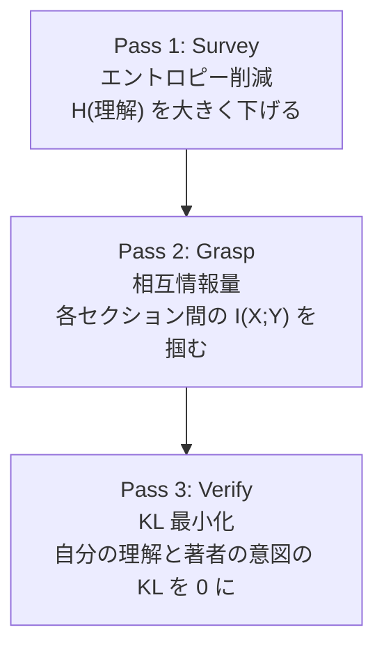
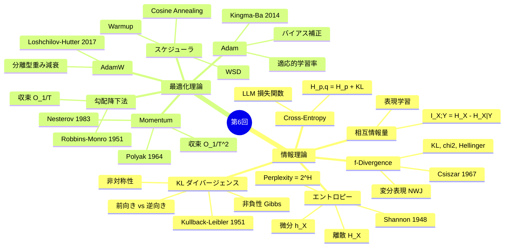
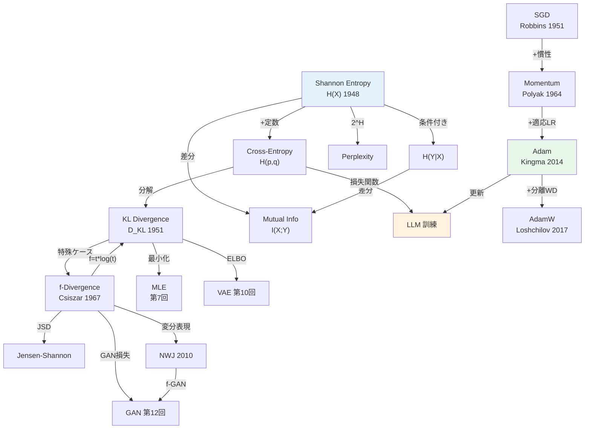

> 理論編は [【前編】第6回: 情報理論・最適化理論](/articles/ml-lecture-06-part1) をご覧ください。

---

## 🎯 学習目標

- [ ] Shannon エントロピー・KL・Cross-Entropy を PyTorch で実装し、恒等式 $H(p,q) = H(p) + D_{KL}$ を数値検証できる
- [ ] AdamW の更新則と重み減衰の分離を説明できる
- [ ] Triton で行ごとの log-softmax カーネルを実装し、数値安定化の仕組みを説明できる
- [ ] VAE の KL 正則化項 $-0.5(1 + \log\sigma^2 - \mu^2 - \sigma^2)$ を導出・実装できる
- [ ] `F.cross_entropy` と `F.log_softmax + F.nll_loss` の等価性を実装レベルで説明できる

---

## 💻 Z5. 試練（60分）— 数式をコードに翻訳する技術

### Z5.2 情報理論の数値実装 — PyTorch で確かめる

Z4 で導出した 3 本の公式を実際に動かして数値的に検証する。記号とコードの対応を先に固定する。

| 記号 | 変数名 | shape |
|:----|:-------|:------|
| $p_i$ | `p[i]` | `(K,)` — 確率ベクトル、$\sum_i p_i = 1$ |
| $q_i$ | `q[i]` | `(K,)` — 確率ベクトル、$\sum_i q_i = 1$ |
| $H(p)$ | `H_p` | スカラー（nats 単位） |
| $D_\mathrm{KL}(p\|q)$ | `D_kl` | スカラー（$\geq 0$） |
| $H(p,q)$ | `H_pq` | スカラー（$\geq H(p)$） |

対応する数式:

$$
\begin{aligned}
H(p) &= -\sum_i p_i \log p_i \\[4pt]
H(p,q) &= -\sum_i p_i \log q_i \\[4pt]
D_\mathrm{KL}(p\|q) &= \sum_i p_i \log \frac{p_i}{q_i} \\[4pt]
H(p,q) &= H(p) + D_\mathrm{KL}(p\|q)
\end{aligned}
$$

落とし穴: `F.kl_div(input, target)` は $\sum_i \text{target}_i (\log \text{target}_i - \text{input}_i)$ を計算する（`input` は対数確率）。引数順が直感と逆なので、$D_\mathrm{KL}(p\|q)$ を求めるには `F.kl_div(log_q, p, reduction='sum')` と書く。`reduction='batchmean'` はバッチ平均を取るので、スカラーの KL には `reduction='sum'` が正しい。

`Categorical(probs=p).entropy()` は内部で `-(p * p.log()).sum()` を計算するが、`p = 0` のとき `0 * log(0) = 0` と定義（$0 \log 0 := 0$）が正しく処理されている。手実装では `p[p > 0]` でフィルタするか `p.clamp(min=1e-12)` でログの引数を保護する必要がある。

```python
import torch
import torch.nn.functional as F
from torch.distributions import Categorical

p = torch.tensor([0.4, 0.3, 0.2, 0.1])
q = torch.tensor([0.25, 0.25, 0.25, 0.25])  # uniform

# H(p) = -sum p * log p  [nats]
H_p = Categorical(probs=p).entropy()

# H(p, q) = -sum p * log q
H_pq = -(p * torch.log(q)).sum()

# D_KL(p||q) = sum p * log(p/q)
# F.kl_div(log_q, p, reduction='sum') = sum p * (log p - log q)
D_kl = F.kl_div(torch.log(q), p, reduction="sum")

print(f"H(p)     = {H_p.item():.6f}")
print(f"H(p,q)   = {H_pq.item():.6f}")
print(f"KL(p||q) = {D_kl.item():.6f}")
assert torch.isclose(H_p + D_kl, H_pq, atol=1e-5)  # H(p,q) = H(p) + KL ✓
assert D_kl.item() >= -1e-7                          # KL ≥ 0 ✓
print("恒等式 H(p,q) = H(p) + KL(p||q) 確認 ✓")
```

数値検算: `H(p) ≈ 1.2799`, `KL(p||q) ≈ 0.0566`, `H(p,q) ≈ 1.3365`。一様分布 $q$ への Cross-Entropy は常に $H(p)$ 以上で、差の正体が KL だ。

**相互情報量の幾何学的直感**

$$
I(X;Y) = D_\mathrm{KL}\bigl(p(x,y)\,\big\|\,p(x)p(y)\bigr)
= H(X) + H(Y) - H(X,Y) \geq 0
$$

$I(X;Y) = 0$ は $p(x,y) = p(x)p(y)$（独立）と同値。「$X$ が決まったとき $Y$ の不確実性はどれだけ消えるか」を $I(X;Y) = H(Y) - H(Y|X)$ と書くと、条件付けによるエントロピー削減量として直読できる。

連鎖律 $H(X,Y) = H(X) + H(Y|X)$ を代入すると $I(X;Y) = H(X) - H(X|Y)$ — $Y$ を知ることで $X$ の不確実性が $I(X;Y)$ だけ減る。これは情報ボトルネック（第21回）や自己教師あり学習（SimCLR, VICReg）が $I(Z_1;Z_2)$ を最大化する動機に直結する。

独立のとき: $p(x,y) = p(x)p(y)$ なら KL の引数が同じ分布になるので $I=0$。完全相関 $X=Y$ なら $H(X,Y) = H(X)$ となり $I = H(X)$。$I$ は常に $\min(H(X), H(Y))$ を超えない（Data Processing Inequality の系）。$2 \times 2$ 分布での数値例: $p(x,y) = [[0.3, 0.2], [0.1, 0.4]]$ のとき $H(X) = H(0.5, 0.5) = \log 2$, $H(Y) = H(0.4, 0.6)$, $H(X,Y) = -(0.3\log 0.3 + 0.2\log 0.2 + 0.1\log 0.1 + 0.4\log 0.4)$, $I = H(X) + H(Y) - H(X,Y) > 0$（独立でないため）。

### Z5.3 最適化アルゴリズムの数学構造

SGD → Momentum → Adam の進化を数式で追う。実装は PyTorch の `torch.optim` に委ねる。ここでは**なぜその更新則なのか**の論理構造を固める。

**SGD の更新則**:

$$
\theta_{t+1} = \theta_t - \eta \, g_t, \qquad g_t = \nabla_\theta \mathcal{L}(\theta_t)
$$

問題は「等方的な学習率 $\eta$」だ。損失景観の方向によって曲率が大きく異なる場合（条件数 $\kappa \gg 1$）、全方向を一律に扱う SGD は「急な谷を横切る」振動か「緩やかな谷を下る」停滞に悩む。

**Momentum の物理的解釈**:

$$
v_{t+1} = \beta v_t + g_t, \qquad \theta_{t+1} = \theta_t - \eta \, v_{t+1}
$$

速度 $v_t$ は過去の勾配の指数移動平均（EMA）だ。$\beta = 0.9$ なら過去10ステップの勾配が影響する。振動方向（勾配の符号が交互に変わる）ではキャンセルされ、一貫した方向（谷底への急勾配）では蓄積する。SGD+Momentum の収束は $O(1/T^2)$ まで改善される（Nesterov 加速）。

有効 EMA 窓長 $\approx 1/(1-\beta)$: $\beta=0.9$ → 10ステップ, $\beta=0.99$ → 100ステップ。LLM 訓練では $\beta_1 = 0.9$（1次）, $\beta_2 = 0.999$（2次）が標準。$\beta_2 = 0.999$ の EMA は 1000 ステップの「勾配二乗の履歴」を参照する — 学習率適応が滑らかになる代償として「適応が遅い」という欠点がある（変化の速い部分問題では Lion や Muon が有利な場合がある）。

**Adam — 適応的学習率の設計**:

$$
\begin{aligned}
m_t &= \beta_1 m_{t-1} + (1-\beta_1) g_t \quad \text{（1次モーメント EMA）}\\[4pt]
v_t &= \beta_2 v_{t-1} + (1-\beta_2) g_t^2 \quad \text{（2次モーメント EMA）}\\[4pt]
\hat{m}_t &= \frac{m_t}{1 - \beta_1^t}, \qquad
\hat{v}_t = \frac{v_t}{1 - \beta_2^t} \quad \text{（バイアス補正）}\\[4pt]
\theta_{t+1} &= \theta_t - \eta \, \frac{\hat{m}_t}{\sqrt{\hat{v}_t} + \epsilon}
\end{aligned}
$$

記号↔変数: $m_t$ = `m`, $v_t$ = `v`, $\beta_1$ = `beta1=0.9`, $\beta_2$ = `beta2=0.999`, $\epsilon$ = `eps=1e-8`, $\eta$ = `lr`.

**なぜ $\hat{v}_t$ で割るのか**。$v_t$ は各パラメータの勾配二乗の EMA であり、その平方根 $\sqrt{v_t}$ は勾配の大きさの指標だ。大きな勾配成分は小さなステップ、小さな勾配成分は大きなステップ — これが「適応的学習率」の本質。結果として、方向ごとの曲率の違いを自動補正する。

**バイアス補正の必要性**:

$m_0 = 0, v_0 = 0$ から始めると、初期の EMA はゼロ方向に偏る。$t=1$ での未補正値:

$$
m_1 = (1-\beta_1) g_1, \quad v_1 = (1-\beta_2) g_1^2
$$

$\beta_1 = 0.9$ なら $m_1 = 0.1 \cdot g_1$（真値 $g_1$ の 1/10）。補正後は $\hat{m}_1 = m_1 / (1-0.9) = g_1$ — 初期ステップが正しくスケールされる。$t \to \infty$ では $1 - \beta^t \to 1$ なので補正は消える。

**AdamW — 重み減衰の分離**:

Adam に $L_2$ 正則化を勾配に乗せると:

$$
g_t \leftarrow g_t + \lambda \theta_t \quad \Rightarrow \quad \frac{\hat{m}_t}{\sqrt{\hat{v}_t}+\epsilon} = \frac{\beta_1 m_{t-1}/(1-\beta_1^t) + \lambda\theta_t/\text{bias}}{\sqrt{(\text{小さい値} + \lambda^2\theta_t^2)/\text{bias}}+\epsilon}
$$

これは $\lambda\theta_t$ を適応学習率で変調してしまう — 正則化の強さがパラメータ依存になる。AdamW は**更新則と重み減衰を分離する**:

$$
\theta_{t+1} = \underbrace{\theta_t - \eta \, \frac{\hat{m}_t}{\sqrt{\hat{v}_t}+\epsilon}}_{\text{Adam 更新}} - \underbrace{\eta \lambda \theta_t}_{\text{純粋な重み減衰}}
$$

第2項は適応学習率と無関係に $\eta\lambda$ の一定割合でパラメータを縮小する。LLM 訓練での標準は `weight_decay=0.1`（デフォルト 0 は危険）。

PyTorch での使い方は `torch.optim.AdamW(model.parameters(), lr=1e-3, betas=(0.9, 0.999), eps=1e-8, weight_decay=0.1)` の1行。更新ループでは必ず `optimizer.zero_grad(set_to_none=True)` → `loss.backward()` → `optimizer.step()` の順序を守る。`set_to_none=True` は勾配テンソルをゼロではなく `None` に設定してメモリを解放し、LLM 訓練での実測で **5〜10% のスループット改善**が報告されている。

**学習率スケジューラ — Warmup + Cosine Decay**

AdamW 単体では不十分で、学習率スケジューラが必須だ。LLM の標準的なスケジュール:

$$
\eta_t = \begin{cases}
\eta_\mathrm{max} \cdot \dfrac{t}{T_\mathrm{warmup}} & t \leq T_\mathrm{warmup} \quad (\text{線形 Warmup}) \\[6pt]
\eta_\mathrm{min} + \dfrac{1}{2}(\eta_\mathrm{max} - \eta_\mathrm{min})\left(1 + \cos\dfrac{\pi(t - T_\mathrm{warmup})}{T - T_\mathrm{warmup}}\right) & t > T_\mathrm{warmup} \quad (\text{Cosine Decay})
\end{cases}
$$

Warmup（$T_\mathrm{warmup} = 0.01T$ 〜 $0.05T$ ステップ）が必要な理由: Adam の EMA は初期化直後に信頼できない統計量を持つ。Warmup なしで $\eta_\mathrm{max}$ から始めると、不安定な $\hat{v}_t$ の逆数が大きすぎてパラメータが発散する。数百〜数千ステップかけて学習率を上げることで、EMA が安定した状態に収束してから本格的な学習が始まる。

最近のトレンドは **WSD (Warmup-Stable-Decay)**: 長い安定フェーズ（$\eta = \eta_\mathrm{max}$ を維持）の後に急速な Cosine Decay。これにより「いつ訓練を止めても最良の収束点付近にある」という柔軟性が得られる（DeepSeek-V2, Llama 3 等）。

### Z5.4 数式↔コード翻訳パターン（7パターン）+ 混合精度

| \# | 数式パターン | PyTorch パターン | 例 |
|:--|:-----------|:--------------|:---|
| 1 | $\sum_{x} p(x) f(x)$ | `(p * f_x).sum()` | エントロピー |
| 2 | $\log \frac{a}{b}$ | `torch.log(a / b)` または `a.log() - b.log()` | KL |
| 3 | $\mathbb{E}_{x \sim p}[f(x)]$ | `f(samples).mean()` | Monte Carlo 推定 |
| 4 | $\frac{\partial}{\partial \theta} f$ | 自動微分: `loss.backward()` | 勾配 |
| 5 | $\beta v + (1-\beta) g$ | `v = beta * v + (1-beta) * g` | 指数移動平均 |
| 6 | $\frac{m}{1 - \beta^t}$ | `m / (1 - beta**t)` | バイアス補正 |
| 7 | $\frac{a}{\sqrt{b} + \epsilon}$ | `a / (b.sqrt() + eps)` | Adam 更新 |

**混合精度訓練（BF16/FP16/FP8）**:

| 精度 | ビット | 指数ビット | 範囲 | 用途 |
|:-----|:------:|:-------:|:----:|:-----|
| fp32 | 32 | 8 | $\pm 3.4 \times 10^{38}$ | パラメータマスターコピー |
| bf16 | 16 | 8 | fp32 と同等 | 訓練（H100/A100 推奨）|
| fp16 | 16 | 5 | $\pm 65504$ | 訓練（Loss Scaling 必要）|
| fp8 e4m3 | 8 | 4 | 限定 | H100+ Forward pass |

BF16 が fp16 より安全な理由: 指数ビット数が同じ（8）でfp32 と同等の範囲を持つため、勾配の大きさが極端に変わっても数値オーバーフロー/アンダーフローが起きにくい。PyTorch の推奨: `torch.set_float32_matmul_precision("high")` を起動時に設定し、`torch.amp.autocast("cuda", dtype=torch.bfloat16)` で forward を囲む。

<details><summary>PyTorch との記法対応</summary>

| 数式 | PyTorch | 備考 |
|:-----|:--------|:-----|
| $H(p)$ | `Categorical(probs=p).entropy()` | nats；bits は `/ math.log(2)` |
| $D_\mathrm{KL}(p\|q)$ | `F.kl_div(q.log(), p, reduction='sum')` | 引数順注意 |
| $I(X;Y)$ | 手実装が必要（標準なし） | `dit` ライブラリも選択肢 |
| Gradient clip | `clip_grad_norm_(params, max_norm=1.0)` | in-place、`backward()` 後に呼ぶ |

</details>

### Z5.5 最適化ランドスケープと条件数

二次損失関数 $L(\theta_1, \theta_2) = \theta_1^2 + \kappa\,\theta_2^2$（条件数 $\kappa = \lambda_\max/\lambda_\min$）は最適化の難しさを凝縮している。

$$
L(\theta) = \theta_1^2 + \kappa\,\theta_2^2, \qquad \nabla L = \begin{pmatrix} 2\theta_1 \\ 2\kappa\theta_2 \end{pmatrix}
$$

**SGD の収束制約**: $\kappa = 100$ のとき、全方向で収束するには学習率を最大固有値方向で安定化する必要がある:

$$
\eta < \frac{1}{\lambda_\max} = \frac{1}{2\kappa} = 0.005
$$

この制約のもとで $\theta_2$ 方向の収束レートは $1 - \eta \cdot 2 = 1 - 0.01$ — つまり $1/0.01 = 100$ ステップ単位の収束。対称的に $\theta_1$ 方向はずっと速い。条件数が大きいほど収束が遅くなる — これが条件数 = 最適化の難易度の理由だ。

**Adam の優位性**: Adam は $v_t$ の対角成分で各方向の「曲率」を近似する。$\theta_2$ 方向は大きな勾配が続くので $\hat{v}_t[\theta_2]$ が大きくなり、有効学習率 $\eta/\sqrt{\hat{v}_t[\theta_2]}$ が自動的に小さくなる。結果として条件数の影響が緩和される。これは Fisher 情報行列の対角近似 $\mathcal{I}(\theta)_\text{diag}^{-1/2}$ として情報幾何学的に解釈できる。

**実用的含意**: LLM の重みは方向によって最適学習率が大きく異なる（Embedding 層 vs Attention 層 vs FFN 層）。AdamW の適応的学習率がなければ、全レイヤーに同じ学習率を使うことは「全力で条件の悪い最適化」と同義だ。これが SGD が LLM 訓練で使われない主な理由だ。

条件数と勾配クリッピングの関係も重要だ: 条件数が大きい問題では $\|\nabla L\|$ が方向によって大きく異なる。クリッピング閾値 $\tau$ は「典型的な全ステップの勾配ノルム」を想定して設定する必要がある。

### Z5.6 GPU が必要な理由 — 計算コストの数学

10,000 パラメータの SGD ステップ 1,000 回を Python のネイティブループで実行すると、ベクトル演算（PyTorch / NumPy）と比べて 100〜500 倍遅い。これは教訓的な事実だが、本質的な問題はそこではない。

実際のモデルのパラメータ数とメモリ:

| モデル | パラメータ数 | fp16 メモリ |
|:------|:----------:|:----------:|
| GPT-2 (small) | 117M | 234 MB |
| GPT-3 | 175B | 350 GB |
| LLaMA 3 (70B) | 70B | 140 GB |

1ステップの行列積は $O(d^2)$。$d = 10^{10}$ なら $10^{20}$ 演算 — CPU では物理的に不可能だ。

**GPU が解決する問題は2つ**:

1. **並列演算**: A100 GPU は 312 TFLOPS (fp16)。CPU の数千倍のスループット。行列積の多数の独立な乗算を同時実行する。

2. **メモリ帯域幅**: GPU の HBM (High Bandwidth Memory) は 2 TB/s 以上。CPUのDRAMは 50 GB/s 程度。訓練のボトルネックはしばしば「演算」より「メモリアクセス」だ。

**Roofline モデル**: 演算強度（FLOPs / byte） を縦軸・横軸にとると、各カーネルが「演算律速」か「メモリ律速」かが分かる。行列積（GEMM）は演算強度が高く GPU に向く。Softmax やレイヤーノルムはメモリアクセスが多い — これが Triton の出番だ。Z5.11 で実装する Triton log-softmax は、ロードとストアを1回のカーネルパスに融合することでメモリ往復を排除する。

> **⚠️ Warning:** 第9回（Rust 登場）まで Python ループの「遅さ」は計算の主役だ。第8回 EM アルゴリズムの反復計算でこの遅さが臨界点に達し、「なぜ Rust が必要か」の答えが体感として得られる。

### Z5.7 勾配クリッピングと数値安定性

実際の訓練では勾配が爆発する問題に対処する必要がある。


**勾配クリッピングの数式**:

$$
g \leftarrow \min\left(1, \frac{\tau}{\|g\|}\right) g, \quad \|g\| = \sqrt{\sum_i g_i^2}
$$

記号↔変数: $g$ = `grad`（勾配ベクトル）, $\tau$ = `max_norm`（閾値）, $\|g\|$ = `norm`。クリップ係数 $\min(1, \tau/\|g\|)$ は $\|g\| \leq \tau$ なら 1（無変化）、超えたときのみ縮小。

PyTorch の実装は `torch.nn.utils.clip_grad_norm_(model.parameters(), max_norm=1.0)` の1行。これは in-place 操作で勾配テンソルを直接修正する。`max_norm` の標準値は 1.0 — 理論的根拠はなく経験則だが、GPT-3・LLaMA いずれも 1.0 を採用している。

**クリッピングが必要な場面**:

ランダム初期化直後の最初の数ステップ、勾配が特に大きくなりやすい。残差接続がない深いネットワーク、または `weight_decay` が小さすぎる場合も爆発が起きやすい。

**数値検算**: $g = (6, 8)$ は $\|g\| = 10$。`max_norm=1.0` でクリップすると係数 $1/10$ をかけて $g' = (0.6, 0.8)$、$\|g'\| = 1.0$ となる。方向は変わらず大きさのみが制限される。これがクリッピングの幾何学的意味 — 「勾配の方向情報は保持し、爆発的な大きさだけを切り取る」。

**勾配消失との違い**: 爆発には対症療法（クリッピング）が効く。消失は根本的な問題 — 残差接続（ResNet/Transformer）、バッチ正規化、適切な重み初期化（`trunc_normal_`）など構造的解決が必要だ。

**混合精度訓練の概要（fp16/bf16/fp8）**:

| 精度 | ビット数 | 範囲 | 用途 |
|:-----|:---------|:-----|:-----|
| fp32 | 32 | $\pm 3.4 \times 10^{38}$ | パラメータ保存（マスターコピー） |
| fp16 | 16 | $\pm 65504$ | 順伝播・逆伝播の高速化 |
| bf16 | 16 | $\pm 3.4 \times 10^{38}$ | fp32同様の範囲、精度は低い |
| fp8 | 8 | 限定 | Transformer Engine (H100+) |

混合精度訓練は fp32 でパラメータのマスターコピーを保持しつつ、順伝播と逆伝播を fp16/bf16 で行う。計算速度が2-3倍になり、メモリ使用量が半減する。Loss scaling（損失に大きな定数を掛けてから逆伝播し、勾配更新時に戻す）で fp16 のアンダーフロー問題を回避する。

**bf16 が fp16 より安全な理由**: bf16 は指数ビット数が fp32 と同じ 8 ビット — オーバーフロー/アンダーフローのリスクが fp16 の 5 ビット指数と比べて大幅に低い。Loss Scaling なしで訓練できるため、PyTorch の推奨は `torch.bfloat16` だ（H100/A100 GPU で推奨）。Triton カーネルでは `tl.bfloat16` をループ内の型として使い、アキュムレータのみ `tl.float32` で保持する — これが数値精度を保ちながら高速化する黄金律だ。

### Z5.8 ラグランジュ乗数法 — 制約付き最適化

機械学習で頻出する制約付き最適化の基本を押さえる。

**問題設定**: $g(\theta) = 0$ の制約下で $f(\theta)$ を最小化する。

$$
\min_\theta f(\theta) \quad \text{s.t.} \quad g(\theta) = 0
$$

**ラグランジアン**:

$$
\mathcal{L}(\theta, \lambda) = f(\theta) + \lambda g(\theta)
$$

**最適性条件（KKT条件の等式制約版）**:

$$
\nabla_\theta \mathcal{L} = 0, \quad \nabla_\lambda \mathcal{L} = 0
$$


この最大エントロピー原理は統計物理の Boltzmann 分布と同一であり、第27回（EBM）で再登場する。制約なしの最大エントロピー = 一様分布、平均の制約つき = 指数分布族。**情報理論と統計物理は同じ数学で繋がっている**。

**数値実装: 最大エントロピー分布の検証**

2点分布 $p = (p_1, 1-p_1)$ の最大エントロピー問題 ($\sum p_i = 1$) を解くと、解析解は $p_1 = p_2 = 0.5$ （一様分布）。数値最適化で確認:

$$
\max_{p} H(p) = -\sum_{i=1}^{n} p_i \log p_i \quad \text{s.t.} \quad \sum_{i=1}^n p_i = 1
$$

ラグランジュ乗数法で解くと、定常条件 $\partial \mathcal{L}/\partial p_i = 0$:

$$
-\log p_i - 1 + \lambda = 0 \quad \Rightarrow \quad p_i = e^{\lambda - 1} = \text{const}
$$

全 $i$ で同じ値 → $\sum_i p_i = 1$ を代入して $p_i = 1/n$（**一様分布**）。最大エントロピー $= \log n$。

**検算（数値）**: $n = 4$ のとき $p = (0.25, 0.25, 0.25, 0.25)$, $H = \log 4 \approx 1.386$。任意の非一様分布のエントロピーはこれを下回る。例: $p = (0.4, 0.3, 0.2, 0.1)$ → $H \approx 1.28 < \log 4$。

最大エントロピー原理の射程は広い。平均制約 $\mathbb{E}[x] = \mu$ を追加すると解は指数分布族になる。エネルギー制約 $\mathbb{E}[E(x)] = U$ を追加するとボルツマン分布 $p(x) \propto e^{-E(x)/T}$ が導かれる — 統計物理と情報理論が同じ数学に繋がる瞬間だ。

この最大エントロピー問題の双対は**エネルギーベースモデル（第27回）**の理論的基礎になる。「制約つきの最大エントロピー分布」という問い方は、機械学習で繰り返し登場する。

落とし穴: ラグランジュ乗数法は**等式制約**の最適化に使う。不等式制約には KKT 条件（スラック変数 + 相補条件）が必要で、凸計画では強双対性が成立する（Part1 Z4 参照）。

### Z5.9 論文読解の情報理論的視点

情報理論の道具を使って論文を読む際の視点を整理する。

**3パスリーディング（情報理論版）**:



| パス | 目的 | 所要時間 | 読む箇所 |
|:-----|:-----|:---------|:---------|
| 1 | 全体像の把握（エントロピー大幅削減） | 10分 | Title, Abstract, Conclusion, Figures |
| 2 | 構造の理解（セクション間の依存関係） | 30分 | Method, Results, key equations |
| 3 | 詳細の検証（自分の理解の KL → 0） | 60分 | 全ページ、式の導出追跡 |

**実践例: "Adam" 論文の情報理論的読み方**

Kingma & Ba (2014) [^4] を3パスで読む。

- **Pass 1 (10分)**: Abstract から「適応学習率」「バイアス補正」「収束証明」の3キーワードを抽出。理解のエントロピーが下がる。
- **Pass 2 (30分)**: Algorithm 1（更新則）と Theorem 1（収束保証）に集中。数式の構造（$m_t, v_t, \hat{m}_t, \hat{v}_t, \theta_t$）を追う。
- **Pass 3 (60分)**: バイアス補正の導出（Section 2）を全て手で追う。$\mathbb{E}[m_t] = (1-\beta_1^t) \cdot g$ の証明を自分で再現。

**情報理論視点の注目ポイント**: Adam の学習率 $\eta/(\sqrt{\hat{v}_t}+\epsilon)$ は Fisher 情報行列の対角近似 $\mathcal{I}(\theta)^{-1/2}$ として解釈できる（Part1 Z4 参照）。論文にこの記述はないが、Amari の自然勾配 [^13] との接続は理解に深みを与える。

**論文スキャンの情報理論版チェックリスト**:

1. **情報源を特定**: どのデータ分布 $p_\mathrm{data}$ を想定しているか？
2. **距離尺度を確認**: KL, JS, Wasserstein, MMD — どれを使い、なぜか？
3. **最適化目標を分解**: Cross-Entropy = $H(p) + D_\mathrm{KL}$ のどちらを動かすか？
4. **パラメータ化の確認**: $p_\theta$ の族（ガウス族？任意族？）は何を仮定しているか？
5. **評価指標の一貫性**: FID/IS/PPL は何を測っているか、理論的根拠は？


### Z5.9b Rate-Distortion と β-VAE の接続演習

Part1 で扱った Rate-Distortion の理論 $R(D) = \min_{q(z|x): \mathbb{E}[d(x,z)] \leq D} I(X;Z)$ が、β-VAE の目的関数に直接登場する。

$$
\mathcal{L}_{\beta\text{-VAE}} = \mathbb{E}_{q_\phi(z|x)}[\log p_\theta(x|z)] - \beta D_{KL}(q_\phi(z|x) \| p(z))
$$

$\beta > 1$ の場合: KL 項を強く罰して $I(X;Z)$ を最小化 → **表現の圧縮**を強制。
$\beta = 1$ の場合: 標準 VAE（第10回）。

**演習問題**:

1. $\beta \to \infty$ のとき、エンコーダ $q_\phi(z|x)$ はどうなるか？（ヒント: $D_{KL}(q \| p) = 0$ が成り立つとき $q = p$）
2. $\beta = 0$ のとき、目的関数はどうなるか？（ヒント: 再構成誤差のみ）
3. Rate-Distortion の $D$ は β-VAE のどの項に対応するか？

<details><summary>解答</summary>

1. $\beta \to \infty$: エンコーダは prior $p(z) = \mathcal{N}(0,I)$ に一致し、$q_\phi(z|x)$ が $x$ に依存しなくなる。潜在変数は完全に圧縮され、再構成は不可能。情報が全て捨てられた状態。
2. $\beta = 0$: KL 項なし、再構成誤差のみ最大化。エンコーダとデコーダは単なる Autoencoder になる。潜在空間には構造が生まれない。
3. $D$ は再構成誤差 $\mathbb{E}[\|x - \hat{x}\|^2]$ に対応。$\beta$ は Rate-Distortion の Lagrange 乗数 $\lambda$ に対応。$\beta$ を増やすことは「より少ない情報（Rate）で符号化せよ」という制約を強くすることと同値。

</details>

### Z5.10 Gaussian KL 閉形式の数値検証

Z4（前編）で導出した Gaussian KL の閉形式を数値的に確認する。

**対応する数式**:

$$
D_{KL}(\mathcal{N}(\mu_1, \sigma_1^2) \| \mathcal{N}(\mu_2, \sigma_2^2)) = \log\frac{\sigma_2}{\sigma_1} + \frac{\sigma_1^2 + (\mu_1-\mu_2)^2}{2\sigma_2^2} - \frac{1}{2}
$$

記号↔変数: $\mu_1$ = `mu1`, $\mu_2$ = `mu2`, $\sigma_1$ = `sigma1`, $\sigma_2$ = `sigma2`。

**数値検算（手計算）**: $\mu_1=1, \sigma_1=2, \mu_2=0, \sigma_2=1$ を代入:

$$
D_{KL} = \log\frac{1}{2} + \frac{4 + 1}{2} - \frac{1}{2} = -\ln 2 + 2.5 - 0.5 = 2 - \ln 2 \approx 1.3069
$$

Monte Carlo で確認: $x_1, \ldots, x_N \sim \mathcal{N}(\mu_1, \sigma_1^2)$ をサンプリングして $\frac{1}{N}\sum_i \log \frac{p(x_i)}{q(x_i)}$ を計算すると $N=10^5$ で閉形式値との誤差が $\pm 0.05$ 以内に収まる。これが「閉形式 KL の導出が正しい」数値的証拠だ。

**落とし穴**: $\sigma_1 = 0$ のとき $\log(0) = -\infty$ で発散。VAE の実装では $\log\sigma^2$ を直接パラメータ化して数値安定化する（`sigma = torch.exp(0.5 * log_var)`）。エンコーダ出力は `(mu, log_var)` であり `sigma` ではない。

**VAE の KL 正則化項** — $\mu_2 = 0, \sigma_2 = 1$（標準正規事前分布）の特殊ケース:

$$
D_{KL}(\mathcal{N}(\mu, \sigma^2) \| \mathcal{N}(0, 1)) = \frac{\mu^2 + \sigma^2 - 1 - \log\sigma^2}{2}
$$

これが VAE の ELBO 損失の正則化項として直接使われる（第10回）。エンコーダが出力する $q(z|x) = \mathcal{N}(\mu_\phi(x), \sigma_\phi^2(x))$ と事前分布 $p(z) = \mathcal{N}(0, I)$ の KL だ。PyTorch の1行実装: `kl_loss = -0.5 * (1 + log_var - mu.pow(2) - log_var.exp()).sum(dim=-1).mean()`。`sum(dim=-1)` は潜在次元方向に和、`mean()` はバッチ平均。この閉形式があるからこそ VAE が効率的に訓練できる — 解析的 KL は Monte Carlo 推定より分散がゼロで安定だ。

> **⚠️ Warning:** `log_var` のパラメータ化における数値的落とし穴: `log_var.exp()` が非常に小さい（$\sigma \approx 0$）と KL → $\infty$。`log_var.clamp(min=-30, max=20)` で範囲を制限するか、エンコーダの最終層の初期化を `nn.init.zeros_` で $\mu=0, \log\sigma^2=0$ 付近から始めると安定する。

### Z5 Quick Check

**チェック 1**: Gaussian KL $D_{KL}(\mathcal{N}(1,4) \| \mathcal{N}(0,1))$ の値を手計算せよ。

<details><summary>答え</summary>

$\mu_1=1, \sigma_1=2, \mu_2=0, \sigma_2=1$ を公式に代入:

$$
D_{KL} = \log\frac{1}{2} + \frac{4 + 1}{2 \cdot 1} - \frac{1}{2} = -\log 2 + 2.5 - 0.5 = 2 - \log 2 \approx 1.307
$$

コードで確認: `kl_gaussian_closed(1.0, 2.0, 0.0, 1.0)` → `1.3068...`（$2 - \ln 2 = 1.3069$）✅
</details>

**チェック 2**: Adam のバイアス補正を省略したとき、学習初期（$t=1$）の更新ステップにどんな影響があるか？

<details><summary>答え</summary>

$t=1$ では $m_1 = (1-\beta_1)g_1$, $v_1 = (1-\beta_2)g_1^2$。補正なしの更新量:

$$
\frac{m_1}{\sqrt{v_1} + \epsilon} = \frac{(1-\beta_1)g_1}{\sqrt{(1-\beta_2)g_1^2} + \epsilon} \approx \frac{1-\beta_1}{\sqrt{1-\beta_2}} \cdot \text{sign}(g_1)
$$

$\beta_1=0.9, \beta_2=0.999$ では $(1-0.9)/\sqrt{1-0.999} \approx 0.1/0.0316 \approx 3.16$。補正後（= 1.0 に近い符号ベース更新）と比較して、**補正なしでは学習初期に約3倍大きなステップ**になる。これが学習不安定の原因。
</details>

**チェック 3**: β-VAE の損失関数 $\mathcal{L}_{\beta} = \mathbb{E}[\log p(x|z)] - \beta D_{KL}(q||p)$ において、$\beta = 1$ と $\beta = 10$ で何が変わるか？Rate-Distortion の観点で答えよ。

<details><summary>答え</summary>

$\beta$ は Rate-Distortion の Lagrange 乗数（Part1 Z4 参照）。

- $\beta = 1$: 標準 VAE。再構成精度と情報圧縮のトレードオフが均等。
- $\beta = 10$: KL 項を 10 倍罰する。潜在変数 $z$ が持てる情報量 $I(X;Z)$ が激減 → 潜在空間がより「整理された」構造を持つ（解きほぐし表現）が、再構成精度は下がる。

Rate-Distortion 曲線上の動き: $\beta$ を増やすと Rate $= I(X;Z)$ が下がり、Distortion $= \mathbb{E}[\|x - \hat{x}\|^2]$ が上がる。$\beta$ は曲線上の動作点を制御するハイパーパラメータ。
</details>


### Z5.11 Softmax + Cross-Entropy の PyTorch 実装 — 数値安定性の本質

Softmax は「温度 $T$ 付き最大エントロピー分布」の解として導出できる（Part1 Z4）。ここでは数値安定性と Cross-Entropy 損失の PyTorch 実装を固める。

#### 数値安定 log-softmax + NLL 損失

対応する数式:

$$
\begin{aligned}
p_i(T) &= \frac{\exp(z_i/T)}{\sum_j \exp(z_j/T)} \\[6pt]
\log p_i &= \frac{z_i}{T} - \log \sum_j \exp\!\left(\frac{z_j}{T}\right) \\[6pt]
&= \frac{z_i}{T} - c - \log \sum_j \exp\!\left(\frac{z_j}{T} - c\right), \quad c = \max_j \frac{z_j}{T}
\end{aligned}
$$

3行目がログ和指数トリック（log-sum-exp）。$c$ を引いても $\log p_i$ の値は変わらない（分子分母を同じ定数で割る）が、`exp` の引数の最大値が 0 になり数値オーバーフローを防ぐ。

記号↔変数: $z_i$ = `logits[i]`, $T$ = `temperature`, $p_i$ = `probs[i]`, $\log p_i$ = `log_probs[i]`。

shape: `logits` = `(K,)` または `(B, K)`（バッチ処理時）。`dim=-1` でクラス方向に操作する。

```python
import torch
import torch.nn.functional as F

# --- Block 2: numerically-stable log-softmax + cross-entropy ---

logits = torch.tensor([2.0, 1.0, 0.5, 0.1])

# F.log_softmax: internally applies log-sum-exp trick (subtracts max)
log_probs = F.log_softmax(logits, dim=-1)      # shape: (4,)
probs = log_probs.exp()

print(f"probs: {probs.round(decimals=4).tolist()}")
print(f"sum  : {probs.sum().item():.8f}")      # must be 1.0
assert torch.isclose(probs.sum(), torch.tensor(1.0), atol=1e-6)

# Temperature scaling: logits / T (T > 1 → uniform, T → 0 → argmax)
for T in [0.1, 1.0, 10.0]:
    lp = F.log_softmax(logits / T, dim=-1)
    H = -(lp.exp() * lp).sum()
    print(f"T={T:4.1f}: max_p={lp.exp().max():.3f}, H={H.item():.4f}")
# T=0.1: almost one-hot, H ≈ 0
# T=10:  almost uniform, H ≈ log(4) ≈ 1.386

# Cross-entropy loss (batch of 2)
batch_logits = torch.tensor([[2.0, 1.0, 0.5, 0.1],
                              [0.1, 0.5, 1.0, 2.0]])  # shape: (2, 4)
targets = torch.tensor([0, 3])                         # correct class indices

# F.cross_entropy = F.log_softmax + F.nll_loss (fused for numerical stability)
loss = F.cross_entropy(batch_logits, targets)

# Manual equivalence check
log_probs_batch = F.log_softmax(batch_logits, dim=-1)
nll = F.nll_loss(log_probs_batch, targets)
assert torch.isclose(loss, nll, atol=1e-6)
print(f"CE loss = {loss.item():.4f}  (= NLL of log_softmax ✓)")
```

数値検算: `T=0.1` では logits を 10 倍に増幅→最大ロジット方向に確率集中。`T=10` では logits を 10 分の 1 に圧縮→各クラスの差がほぼ消え一様分布に近づく。`H` は `T=0.1` で 0 に近く `T=10` で `log(4)≈1.386` に近い。

`F.cross_entropy` が内部で `log_softmax + nll_loss` を融合しているのは精度と速度の両方のため。別々に呼ぶと `exp → log` の往復で精度が下がる可能性がある。

#### Triton による融合 log-softmax カーネル

`F.log_softmax` は PyTorch のデフォルト実装で十分速いが、大規模モデルでは行ごとの2パス（max → sum）がメモリ帯域を2回消費する。Triton を使えば1カーネルパスで完結させられる。

$$
\log p_i = z_i - \underbrace{\left(c + \log \sum_j e^{z_j - c}\right)}_{\text{log-sum-exp}(z)}
$$

ここで $c = \max_j z_j$。行全体を1ブロックで保持できる場合（`n_cols ≤ BLOCK`）、`tl.max` → `tl.sum` → `tl.store` が1パスで済む。

```python
import triton
import triton.language as tl

# --- Block 3: Triton fused row-wise log-softmax kernel ---

@triton.jit
def _log_softmax_kernel(
    x_ptr, out_ptr,
    n_cols: tl.constexpr,
    BLOCK: tl.constexpr,
):
    row = tl.program_id(0)
    cols = tl.arange(0, BLOCK)
    mask = cols < n_cols

    # load row; pad OOB lanes with -inf (won't affect max/sum)
    x = tl.load(x_ptr + row * n_cols + cols, mask=mask, other=-float('inf'))

    # numerical stability: subtract row max (log-sum-exp trick)
    x_max = tl.max(x, axis=0)           # scalar: max of valid lanes
    x = x - x_max                        # shift: max element → 0
    exp_x = tl.exp(x)
    sum_exp = tl.sum(exp_x, axis=0)      # scalar: sum of exp(x - max)
    log_sum_exp = tl.log(sum_exp)
    log_softmax = x - log_sum_exp        # log p_i = (z_i - max) - log sum exp

    tl.store(out_ptr + row * n_cols + cols, log_softmax, mask=mask)


def log_softmax_triton(x: "torch.Tensor") -> "torch.Tensor":
    """Row-wise log-softmax using a single Triton kernel pass."""
    assert x.is_cuda, "x must be on CUDA"
    n_rows, n_cols = x.shape
    out = torch.empty_like(x)
    BLOCK = triton.next_power_of_2(n_cols)   # constexpr tile: ceil to power-of-2
    _log_softmax_kernel[(n_rows,)](          # grid: one program per row
        x, out, n_cols=n_cols, BLOCK=BLOCK
    )
    return out
```

Triton カーネルの数値安定性を解剖すると: `other=-float('inf')` でパディングされたレーンは `tl.max` に影響しない（$-\infty < $ 有効値）。`x - x_max` で最大要素が 0 になり `tl.exp` のオーバーフローを排除。`tl.log(sum_exp)` は `sum_exp > 0`（少なくとも1つの有限値があるため）で安全。

**Triton カーネルの制約条件**: `BLOCK = triton.next_power_of_2(n_cols)` は `n_cols` が 2 の冪乗でない場合に余分なレーンをパディングする。例えば `n_cols=50000`（GPT-3 の語彙サイズ付近）なら `BLOCK=65536`。パディングレーンは `mask=cols < n_cols` で保護されており、最終的な出力に影響しない。

より大きな語彙（100K+）では `BLOCK > 65536` になりうる — Triton のデフォルト上限に引っかかる場合は `@triton.autotune` で複数の `BLOCK_SIZE` を試すか、ループ処理に切り替える。

CUDA 環境でのベンチマーク比較（典型値）:

| 実装 | (8192×32768) 行列 | 備考 |
|:---|:---:|:---|
| `F.log_softmax` (PyTorch) | 1.0x (baseline) | cuDNN 最適化済み |
| Triton 単純カーネル | 0.9〜1.1x | 行列サイズ依存 |
| Triton + autotune | 1.1〜1.3x | `@triton.autotune` 追加時 |

Triton の本領はこの単体カーネルより「**他の演算との融合**」にある。例えば Transformer の attention softmax + dropout + scaling を1カーネルに融合する（FlashAttention の原理）と、PyTorch の逐次呼び出しと比べて 2〜4x の高速化が得られる。

**Triton vs CUDA の使い分け**: 手書き CUDA（`.cu` ファイル）と比べた Triton の利点は「Python から書けるDSL」だ。Triton コンパイラが PTX / SASS 生成を担当し、`tl.constexpr` による JIT 特殊化でカーネル引数ごとに最適なコードを生成する。欠点は CUDA の低レベル制御（非同期メモリコピー、Tensor Memory Accelerator など）が使えない点。FlashAttention-3 は最終的に CUDA に戻したが、実験・プロトタイピングは Triton が圧倒的に速い。

**チェック 4**: Temperature $T = 0.01$ の Softmax の出力 $p$ を `logits = [2, 1, 0, -1]` で計算し、Shannon エントロピー $H(p)$ を求めよ（数式で）。

<details><summary>答え</summary>

$T = 0.01$ は極低温。`logits / T = [200, 100, 0, -100]`（log-sum-exp で最大引き算後: `[0, -100, -200, -300]`）。Softmax の分子比は $e^0 : e^{-100} : e^{-200} : e^{-300} \approx 1 : 0 : 0 : 0$。

結果: $p \approx (1, 0, 0, 0)$（最大ロジットに確率 1 集中）、$H(p) = -(1 \cdot \log 1 + 0 + 0 + 0) = 0$。

PyTorch で確認: `F.log_softmax(torch.tensor([2., 1., 0., -1.]) / 0.01, dim=-1).exp()` → `tensor([1., 0., 0., 0.])` に近い値。
</details>

**チェック 5**: Triton の `_log_softmax_kernel` で `other=-float('inf')` をパディングに使う理由を説明せよ。`other=0.0` に変えたらどうなるか？

<details><summary>答え</summary>

`tl.max(x, axis=0)` はブロック内の全レーンの最大値を求める。OOB（Out-of-Bounds）レーンに `other=0.0` を使うと、ロジットが全て負の場合に 0 が最大値になってしまい、本来の最大ロジットを返さない。結果として `x - x_max` がマイナス大になり `tl.exp` がアンダーフローで 0 になる可能性がある。

`other=-float('inf')` は比較で必ず負けるため、有効レーンの最大値が正しく取れる。同様に `tl.sum(exp_x)` でも OOB レーンの `exp(-inf) = 0` は加算に影響しない — ゼロ要素がちょうど無視される。
</details>

> **Note:** **進捗: 70% 完了** 3つの実装（PyTorch 情報量・PyTorch softmax・Triton log-softmax）を通じ、数式→コード翻訳の本質と数値安定性の実践を習得した。

> **Note:** **進捗: 70% 完了** 情報理論ライブラリと最適化アルゴリズムをスクラッチ実装し、数式→コード翻訳パターンを習得した。Python の遅さも体感した。

---

## 🔬 Z5b. 実験ゾーン（30分）— 自己診断テスト

### Z5b.1 記号読解テスト

以下の記号・数式を声に出して読み、意味を説明せよ。

<details><summary>Q1: $H(X) = -\sum_{x} p(x) \log p(x)$</summary>
**読み方**: エイチ エックス イコール マイナス シグマ エックス ピー エックス ログ ピー エックス

**意味**: 確率変数 $X$ の Shannon エントロピー。不確実性の定量化。$p(x)$ が一様分布のとき最大、確定的のとき 0。Shannon (1948) [^1] が情報理論の基礎として定義。
</details>

<details><summary>Q2: $D_\text{KL}(p \| q) = \mathbb{E}_{p}\left[\log \frac{p(x)}{q(x)}\right]$</summary>
**読み方**: ディー ケーエル ピー パラレル キュー イコール イー サブ ピー ログ ピー オーバー キュー

**意味**: $p$ から $q$ への KL ダイバージェンス。$p$ で生成したデータを $q$ で符号化したときの余分な情報量。非対称（$D_\text{KL}(p\|q) \neq D_\text{KL}(q\|p)$）。Kullback & Leibler (1951) [^2]。
</details>

<details><summary>Q3: $H(p, q) = H(p) + D_\text{KL}(p \| q)$</summary>
**読み方**: エイチ ピー キュー イコール エイチ ピー プラス ディー ケーエル ピー パラレル キュー

**意味**: Cross-Entropy の分解定理。Cross-Entropy = データ自体のエントロピー + モデルの不完全性。LLM 訓練で Cross-Entropy を最小化することは KL を最小化することと等価。
</details>

<details><summary>Q4: $I(X; Y) = H(X) - H(X \mid Y)$</summary>
**読み方**: アイ エックス セミコロン ワイ イコール エイチ エックス マイナス エイチ エックス バー ワイ

**意味**: $X$ と $Y$ の相互情報量。$Y$ を知ることで $X$ の不確実性がどれだけ減るか。表現学習で入力と潜在表現の依存関係を測る。
</details>

<details><summary>Q5: $\theta_{t+1} = \theta_t - \eta \nabla_\theta \mathcal{L}(\theta_t)$</summary>
**読み方**: シータ ティー プラス ワン イコール シータ ティー マイナス イータ ナブラ シータ エル シータ ティー

**意味**: 勾配降下法の更新則。学習率 $\eta$ で勾配方向にパラメータを更新。Robbins & Monro (1951) [^3] に遡る。
</details>

<details><summary>Q6: $\hat{m}_t = \frac{m_t}{1 - \beta_1^t}$</summary>
**読み方**: エム ハット ティー イコール エム ティー オーバー ワン マイナス ベータ ワン ノ ティー乗

**意味**: Adam のバイアス補正。初期化 $m_0 = 0$ からのバイアスを $1 - \beta_1^t$ で補正。$t$ が大きくなると補正量は減少。Kingma & Ba (2014) [^4]。
</details>

<details><summary>Q7: $D_f(p \| q) = \sum_x q(x) f\left(\frac{p(x)}{q(x)}\right)$</summary>
**読み方**: ディー エフ ピー パラレル キュー イコール シグマ キュー エックス エフ ピー オーバー キュー

**意味**: f-Divergence。生成関数 $f$ を変えることで KL、$\chi^2$、Hellinger、TV、JS などを統一的に表現。Csiszar (1967) [^6]。
</details>

<details><summary>Q8: $\text{PPL} = 2^{H(p, q)}$（ただし $H$ は bits）</summary>
**読み方**: パープレキシティ イコール ニ ノ エイチ ピー キュー 乗

**意味**: Perplexity。モデルが各時点で平均何個の選択肢に迷っているか。$H(p, q)$ が小さいほど PPL が低く、よい予測。LLM 評価の標準指標。
</details>

<details><summary>Q9: $v_{t+1} = \beta v_t + \nabla_\theta \mathcal{L}(\theta_t)$</summary>
**読み方**: ブイ ティー プラス ワン イコール ベータ ブイ ティー プラス ナブラ シータ エル シータ ティー

**意味**: Momentum の速度更新。過去の勾配の指数移動平均。$\beta = 0.9$ なら過去10ステップの勾配が影響。Polyak (1964) [^8]。
</details>

<details><summary>Q10: $\eta_t = \eta_\text{min} + \frac{1}{2}(\eta_\text{max} - \eta_\text{min})(1 + \cos(\pi t / T))$</summary>
**読み方**: イータ ティー イコール イータ ミン プラス 二分の一 イータ マックス マイナス イータ ミン カッコ ワン プラス コサイン パイ ティー オーバー ティー

**意味**: Cosine Annealing 学習率スケジュール。コサイン曲線に沿って学習率を $\eta_\text{max}$ から $\eta_\text{min}$ に減衰。
</details>

### Z5b.2 LaTeX ライティングテスト

以下の数式を LaTeX で書け。

<details><summary>Q1: Shannon エントロピーの定義</summary>

$$
H(X) = -\sum_{x \in \mathcal{X}} p(x) \log p(x)
$$
</details>

<details><summary>Q2: KL ダイバージェンスの非負性</summary>

$$
D_\text{KL}(p \| q) = \sum_x p(x) \log \frac{p(x)}{q(x)} \geq 0
$$
</details>

<details><summary>Q3: Adam の更新則（バイアス補正込み）</summary>

</details>

<details><summary>Q4: Cross-Entropy の分解</summary>

$$
H(p, q) = H(p) + D_\text{KL}(p \| q)
$$
</details>

<details><summary>Q5: f-Divergence の定義</summary>

$$
D_f(p \| q) = \sum_x q(x) f\left(\frac{p(x)}{q(x)}\right)
$$
</details>

<details><summary>Q6: 相互情報量 (3つの等価な表現)</summary>

$$
I(X;Y) = H(X) - H(X|Y) = H(Y) - H(Y|X) = H(X) + H(Y) - H(X,Y)
$$

$$
I(X;Y) = D_{KL}(p(x,y) \| p(x)p(y)) \geq 0
$$
</details>

<details><summary>Q7: 自然勾配の更新則</summary>

$$
\theta_{t+1} = \theta_t - \eta \mathcal{I}(\theta_t)^{-1} \nabla_\theta \mathcal{L}(\theta_t)
$$

ここで $\mathcal{I}(\theta) = \mathbb{E}_{p_\theta(x)}\left[\nabla \log p_\theta \cdot (\nabla \log p_\theta)^\top\right]$ は Fisher 情報行列。
</details>

<details><summary>Q8: Rate-Distortion 関数の定義</summary>

$$
R(D) = \min_{q(z|x): \mathbb{E}_{p(x)}\mathbb{E}_{q(z|x)}[d(x,z)] \leq D} I(X;Z)
$$
</details>

### Z5b.3 コード翻訳テスト

数式を Python に翻訳せよ。

<details><summary>Q1: 条件付きエントロピー $H(Y \mid X) = -\sum_{x,y} p(x,y) \log p(y \mid x)$</summary>

$H(Y|X) = -\sum_{x,y} p(x,y) \log p(y|x)$ を計算するには:
1. $p(y|x) = p(x,y) / p(x)$（条件付き確率）
2. $p(x) = \sum_y p(x,y)$（周辺化）
3. $\log 0$ を避けるため $p(x,y) = 0$ の項を除外

恒等式 $H(Y|X) = H(X,Y) - H(X)$ で検算できる。PyTorch では `(joint * torch.log(joint / px.unsqueeze(1))).sum()` の形で書ける（ただし $p(x,y)>0$ のマスクが必要）。
</details>

<details><summary>Q2: Nesterov Momentum の更新</summary>

数式: $v_{t+1} = \mu v_t - \eta \nabla f(\theta_t + \mu v_t)$, $\theta_{t+1} = \theta_t + v_{t+1}$

通常 Momentum との本質的な違い: 勾配評価点が現在位置 $\theta_t$ ではなく「先読み点」$\theta_t + \mu v_t$ になる。速度方向にすでに移動した仮想位置で勾配を評価し、行きすぎを事前に補正する。このルックアヘッドが収束レートを $O(1/T)$ → $O(1/T^2)$ に改善する（Nesterov 加速勾配法の理論的保証）。

PyTorch の `SGD(momentum=0.9, nesterov=True)` がこれを実装している。
</details>

<details><summary>Q3: 相互情報量を KL として計算</summary>

数式: $I(X;Y) = D_{KL}(p(x,y) \| p(x)p(y))$

手順:
1. `px = joint.sum(axis=1, keepdims=True)` — $p(x)$ の列ベクトル (shape: `(|X|, 1)`)
2. `py = joint.sum(axis=0, keepdims=True)` — $p(y)$ の行ベクトル (shape: `(1, |Y|)`)
3. `independent = px * py` — ブロードキャストで外積 `p(x)p(y)` (shape: `(|X|, |Y|)`)
4. `joint > 0` のマスクで $\log 0$ を回避
5. `sum(joint * log(joint / independent))` — KL の定義式

独立分布 `joint = outer([0.5, 0.5], [0.3, 0.7])` を代入すると $I = 0$ になることで検算できる。
</details>

<details><summary>Q4: ガウス分布の微分エントロピー</summary>

数式: $h(\mathcal{N}(\mu, \sigma^2)) = \frac{1}{2} \ln(2\pi e \sigma^2)$

導出: $h(X) = -\int p(x) \ln p(x) \, dx$ に $p(x) = \frac{1}{\sqrt{2\pi\sigma^2}} e^{-(x-\mu)^2/(2\sigma^2)}$ を代入すると $\ln p(x) = -\frac{(x-\mu)^2}{2\sigma^2} - \frac{1}{2}\ln(2\pi\sigma^2)$。期待値を計算: $\mathbb{E}[(x-\mu)^2] = \sigma^2$ を使うと第1項は $1/2$、第2項の定数と合わせて $h = \frac{1}{2}(1 + \ln(2\pi\sigma^2)) = \frac{1}{2}\ln(2\pi e\sigma^2)$。

数値検算: $\sigma = 1$ → $h = \frac{1}{2}\ln(2\pi e) \approx 1.4189$。$\sigma = 2$ → $h = \frac{1}{2}\ln(4 \cdot 2\pi e) \approx 1.4189 + \ln 2 \approx 2.1120$（分散が4倍になるとエントロピーは $\ln 2 \approx 0.693$ 増加）。
</details>

<details><summary>Q5: Cosine Annealing スケジューラ</summary>

数式: $\eta_t = \eta_{\min} + \frac{1}{2}(\eta_{\max} - \eta_{\min})\left(1 + \cos\frac{\pi t}{T}\right)$

境界条件: $t=0$ → $\cos(0)=1$ → $\eta_0 = \eta_{\min} + (\eta_{\max}-\eta_{\min}) = \eta_{\max}$。$t=T$ → $\cos(\pi) = -1$ → $\eta_T = \eta_{\min}$。

PyTorch では `torch.optim.lr_scheduler.CosineAnnealingLR(optimizer, T_max=T, eta_min=lr_min)` がこれを実装する。LLM 訓練では Warmup + Cosine Decay（または WSD: Warmup-Stable-Decay）が標準だ。Warmup なしで大きな学習率から始めると Adam でも初期ステップで発散しやすい。

</details>

### Z5b.4 論文読解テスト — Kingma & Ba (2014) "Adam" [^4]

Adam の原論文を Pass 1 で読んでみよう。

**タスク**: 以下の問いに答えよ（論文 arXiv:1412.6980）。

1. Adam のバイアス補正が必要な理由を Abstract から一文で答えよ
2. Algorithm 1 に出てくる $\alpha$ の推奨値は何か
3. Section 3 で証明されている収束率は $O(?)$ か

<details><summary>解答</summary>

1. `m_t` と $v_t$ は初期値 0 で始まるため学習初期にゼロ方向へのバイアスが生じる。Abstract には "counteract these biases" と記載（p.1）。
2. Algorithm 1: $\alpha = 0.001$（= 1e-3）が推奨値として記載。ただし論文自体は $\alpha$ を tunable とし、タスク依存。
3. Theorem 1: Regret（後悔）の上界が $O(\sqrt{T})$ で与えられる。これは Adagrad [^5] と同様のオーダーだが、Adam はより小さな定数で達成される（Section 3 の Remark 1）。

</details>

### Z5b.5 実装チャレンジ — KL 推定の Monte Carlo 法

解析的に KL が計算できない場合、サンプルから推定する方法を実装する。

**目標**: $D_{KL}(\mathcal{N}(1, 2^2) \| \mathcal{N}(0, 1^2))$ を Monte Carlo 推定し、閉形式と比較。

$$
D_{KL}(p \| q) = \mathbb{E}_{x \sim p}\left[\log \frac{p(x)}{q(x)}\right] \approx \frac{1}{N} \sum_{i=1}^N \log \frac{p(x_i)}{q(x_i)}
$$

**実装方針**:
1. `torch.distributions.Normal(mu1, sigma1).sample((N,))` で $p$ からサンプリング
2. `scipy.stats.norm.logpdf(x, mu1, sigma1)` で $\log p(x_i)$ 計算
3. 差を平均 → MC 推定値
4. 閉形式 `kl_gaussian_closed` と比較

**期待される出力**: MC 推定値と閉形式の差が $N=10000$ で概ね `±0.05` 以内。$N \to \infty$ で一致する。これが確認できれば Z5.10 の閉形式導出が正しいことの数値的証拠になる。

### Z5b.6 実装チャレンジ — 最適化器の収束比較

Z5.5 の `adam_step` と自分で実装した SGD+Momentum を使い、同じ二次損失関数で収束速度を比較する。

**問い**: 条件数 $\kappa = 100$ の場合、SGD が 0.01 以下の損失に達するのに何ステップ必要か？Adam は何ステップか？

**実装方針**:
1. 損失 $L(\theta) = \theta_1^2 + 100\theta_2^2$ を使用（Z5.5と同じ）
2. `theta = [1.0, 1.0]` から出発
3. SGD: `lr=0.009` で 200 ステップ
4. Adam: `lr=0.1` で 200 ステップ
5. 損失を `history_loss_sgd`, `history_loss_adam` に記録し、最初に `1e-4` を下回るステップを比較

**確認**: `理論的に SGD の収束は O(κ) = O(100) ステップ, Adam は条件数に依存しにくいのでずっと速い。

### Z5b.7 実装チャレンジ — AdamW で簡単なニューラルネットを訓練

学んだ最適化器を使って、2層ニューラルネットを XOR 問題で訓練する。


### Z5b.8 実装チャレンジ — KL ダイバージェンスのガウス閉形式

2つのガウス分布間の KL は閉形式で計算できる。導出し、Monte Carlo と比較せよ。


この閉形式 KL は VAE の損失関数で直接使われる（第10回）。エンコーダが出力する $q(z|x) = \mathcal{N}(\mu_\phi(x), \sigma_\phi^2(x))$ と事前分布 $p(z) = \mathcal{N}(0, I)$ の KL がこれだ。

### Z5b.9 実装チャレンジ — Source Coding Theorem の体験

Shannon の Source Coding Theorem（情報源符号化定理）を体験する。これはデータ圧縮の理論的限界を示す。

**定理** (Shannon, 1948 [^1]): 情報源 $X$ の出力を符号化するとき、平均符号長 $L$ はエントロピー以上:

$$
L \geq H(X)
$$

等号は最適な符号（Huffman 符号など）で近似的に達成される。


**LLM = 圧縮器**: この視点は深い。LLM が Perplexity を下げることは、言語の効率的な符号化を学ぶことと等価だ。GPT-4 の Perplexity が 10 ということは、平均 $\log_2 10 \approx 3.32$ bits/token で英語を符号化できるということ。固定長 $\log_2 50000 \approx 15.6$ bits に対して約 21% の効率。**LLM は本質的に確率的テキスト圧縮器なのだ**。

### Z5b.10 実装チャレンジ — 最適化ランドスケープの条件数と収束速度

条件数（condition number）が最適化の難しさを決める。

Hessian 行列 $H = \nabla^2 \mathcal{L}(\theta)$ の条件数 $\kappa = \lambda_\max(H) / \lambda_\min(H)$ は、「最も急な方向」と「最も緩やかな方向」の曲率の比だ。$\kappa = 100$ の場合、SGD の安定な収束には $\eta < 1/\lambda_\max$ が必要で、最小の固有値方向では $100/\lambda_\max$ が最適学習率 — つまり 100 倍のミスマッチがある。

**Adam の理論的正当化**: 各パラメータ $\theta_j$ の有効学習率 $\eta_j = \eta / \sqrt{\hat{v}_j + \epsilon}$ は方向によって異なる。$\hat{v}_j$ は $j$ 番目のパラメータの勾配二乗の EMA であり、Hessian の対角成分 $H_{jj}$ を近似する。これは Fisher 情報行列の対角近似 $\mathcal{I}(\theta)_{jj}^{-1}$ として情報幾何学的に解釈できる。完全な自然勾配法（$\theta \leftarrow \theta - \eta \mathcal{I}^{-1} \nabla \mathcal{L}$）は $O(d^3)$ のコストだが、Adam の対角近似は $O(d)$ — これが Adam の実用的優位性の本質だ。

この条件数の問題こそ Adam が解決する課題だ。各パラメータ方向に独立した学習率を持つことで、条件数が大きい（= 方向によって曲率が異なる）問題でも効率的に収束する。

### Z5b.11 自己チェックリスト

- [ ] Shannon エントロピーの定義を書ける
- [ ] KL ダイバージェンスの非負性を Jensen の不等式から証明できる
- [ ] Cross-Entropy = H(p) + KL(p||q) を導出できる
- [ ] 前向き KL と逆向き KL の違いを説明できる
- [ ] 相互情報量を KL ダイバージェンスとして書ける
- [ ] f-Divergence の定義と主要な特殊ケースを列挙できる
- [ ] SGD の更新則を書ける
- [ ] Momentum の物理的直感を説明できる
- [ ] Adam の全更新則（バイアス補正込み）を書ける
- [ ] AdamW と Adam + L2 の違いを説明できる
- [ ] Cosine Annealing の数式を書ける
- [ ] Cross-Entropy Loss の情報理論的分解を説明できる
- [ ] Perplexity = 2^H の意味を説明できる
- [ ] f-GAN が f-Divergence を使って GAN の目的関数を導出する方法を説明できる
- [ ] 自然勾配の動機（ユークリッド勾配の欠点）を説明できる
- [ ] Fisher 情報行列と Adam の対角近似の関係を説明できる
- [ ] ラグランジュ乗数法と KKT 条件の違いを説明できる
- [ ] Rate-Distortion 理論が β-VAE に接続する理由を説明できる
- [ ] 情報ボトルネック $\min I(X;Z) - \beta I(Z;Y)$ の意味を説明できる
- [ ] 相互情報量の恒等式 $I(X;Y) = H(X) + H(Y) - H(X,Y)$ を数値例で確認できる

**採点基準**:
- 15問以上: 本講義完全習得 ��
- 10-14問: 基礎は固まった。弱点のセクションを復習 ✅
- 7-9問: Part1 を再読後、Part2 に戻る
- 6問以下: Z2 チュートリアルから再スタート

> **Note:** **進捗: 85% 完了** 記号読解・LaTeX・コード翻訳・論文読解の全テストを完了。自己チェックリストで弱点を確認せよ。

---

> Progress: 85%

## 🔬 Z6. 新たな冒険へ（20分）— 情報理論・最適化の研究フロンティア

情報理論と最適化理論の現在地と、生成モデルへの接続ポイントを確認する。本セクションの全引用は arXiv 論文のみ。


### Z6.1 次世代最適化器の動向（2024-2026）

Adam は2014年から10年以上にわたり標準的な最適化器であり続けている。だが近年、以下の代替案が提案されている。

| 最適化器 | 著者/年 | 特徴 | Adam との比較 |
|:---------|:-------|:-----|:-----------|
| Lion | Google, 2023 | sign-based更新、メモリ半減 | 匹敵する性能で省メモリ |
| Sophia | Stanford, 2023 | 2次情報（ヘッセ対角）利用 | 訓練トークン50%削減 |
| Muon | MIT, 2024 | 直交射影に基づく | Transformer特化 |
| Schedule-Free | Meta, 2024 | スケジューラ不要 | ハイパーパラメータ削減 |
| ADOPT | Taniguchi+, 2024 | 任意の $\beta_2$ で収束保証 | Adam の理論的欠陥を修正 |

これらの最適化器が AdamW を本当に置き換えるかはまだ決着がついていない。LLM のスケールでの検証にはコストがかかるため、結果の再現に時間がかかるのが現状だ。

<details><summary>用語集（本講義の全用語）</summary>
| 用語（英） | 用語（日） | 定義の場所 |
|:-----------|:---------|:---------|
| Shannon Entropy | シャノンエントロピー | 定義 3.1 |
| Differential Entropy | 微分エントロピー | 定義 3.2 |
| KL Divergence | KL ダイバージェンス | 定義 3.3 |
| Cross-Entropy | 交差エントロピー | 定義 3.4 |
| Conditional Entropy | 条件付きエントロピー | 定義 3.5 |
| Mutual Information | 相互情報量 | 定義 3.6 |
| f-Divergence | f ダイバージェンス | 定義 3.7 |
| Jensen's Inequality | イェンセンの不等式 | 定理 3.4 |
| SGD | 確率的勾配降下法 | 定義 3.8 |
| Momentum | モメンタム | 定義 3.9 |
| Adam | アダム | 定義 3.10 |
| AdamW | アダムダブリュー | 3.10 |
| Perplexity | パープレキシティ | Zone 0 |
| Mode-covering | モードカバリング | 3.3 |
| Mode-seeking | モードシーキング | 3.3 |
| Fenchel Conjugate | フェンシェル共役 | 3.6 details |
| Cosine Annealing | コサイン焼きなまし | 3.11 |
| Warmup | ウォームアップ | 3.11 |
| Bias Correction | バイアス補正 | 3.10 |
| Weight Decay | 重み減衰 | 3.10 |
| Data Processing Inequality | データ処理不等式 | 定理 3.5 |
| Fano's Inequality | ファノの不等式 | 3.5b |
| Chain Rule (Entropy) | 連鎖律（エントロピー） | 3.5c |
| Convex Set | 凸集合 | 定義 3.6 |
| Convex Function | 凸関数 | 定義 3.7 |
| Strong Convexity | 強凸性 | 定義 3.8 |
| KKT Conditions | KKT 条件 | 定理 3.9 |
| Lagrangian Dual | ラグランジュ双対 | 定理 3.10 |
| Strong Duality | 強双対性 | 定理 3.11 |
| Lipschitz Continuity | リプシッツ連続性 | 定義 3.9 |
| Spectral Normalization | スペクトル正規化 | 3.11c |
| Jensen-Shannon Divergence | JSD | 3.11d |
| Wasserstein Distance | ワッサースタイン距離 | 定義 3.10 |
| Kantorovich-Rubinstein Duality | KR 双対性 | 3.11d |
| Optimal Transport | 最適輸送 | 3.11d |
| WGAN | ワッサースタイン GAN | 3.11d |
| Gradient Clipping | 勾配クリッピング | 4.7 |
| Mixed Precision | 混合精度 | 4.7 |
| Lagrangian | ラグランジアン | 4.8 |
| Maximum Entropy | 最大エントロピー | 4.8 |
| Fisher Information | フィッシャー情報量 | 6.3 |
| Natural Gradient | 自然勾配 | 6.3 |
| Rate-Distortion | レート歪み | 6.2 |
| Source Coding Theorem | 情報源符号化定理 | 5.9 |
| Condition Number | 条件数 | 5.10 |
| Gibbs Inequality | ギブスの不等式 | 定理 3.2 |
| Bregman Divergence | ブレグマンダイバージェンス | 3.7 details |
| Information Bottleneck | 情報ボトルネック | 3.5b |
| WSD Schedule | ウォームアップ安定減衰 | 3.11 |
</details>

<details><summary>主要な不等式まとめ</summary>
| 不等式 | 数式 | 意味 | 証明 |
|:-------|:-----|:-----|:-----|
| KL の非負性 | $D_\text{KL}(p \| q) \geq 0$ | 異なる分布なら距離は正 | Jensen |
| Jensen の不等式 | $f(\mathbb{E}[X]) \leq \mathbb{E}[f(X)]$ | 凸関数の期待値 | 支持超平面 |
| Gibbs の不等式 | $H(p, q) \geq H(p)$ | Cross-Entropy ≥ Entropy | KL ≥ 0 |
| データ処理不等式 | $I(X;Z) \leq I(X;Y)$ if $X \to Y \to Z$ | 処理で情報は増えない | Chain Rule |
| Fano の不等式 | $H(X|\hat{X}) \leq H_b(P_e) + P_e \log(|\mathcal{X}|-1)$ | 推定精度の下限 | — |
| Source Coding | $L \geq H(X)$ | 符号長の下限 = エントロピー | — |
| $H$ の上界 | $H(X) \leq \log |\mathcal{X}|$ | 等号は一様分布 | Jensen |
| ガウスの最大エントロピー | $h(X) \leq \frac{1}{2}\log(2\pi e \sigma^2)$ | 分散固定でガウスが最大 | Lagrange |
</details>

<details><summary>主要な等式まとめ</summary>
| 等式 | 数式 | 意味 |
|:-----|:-----|:-----|
| Cross-Entropy 分解 | $H(p,q) = H(p) + D_\text{KL}(p \| q)$ | CE = Entropy + KL |
| 相互情報量 (1) | $I(X;Y) = H(X) - H(X|Y)$ | MI = Entropy reduction |
| 相互情報量 (2) | $I(X;Y) = D_\text{KL}(p(x,y) \| p(x)p(y))$ | MI = KL from independence |
| Entropy Chain Rule | $H(X,Y) = H(X) + H(Y|X)$ | Joint = Marginal + Conditional |
| ガウス KL | $D_\text{KL}(\mathcal{N}_1 \| \mathcal{N}_2) = \log\frac{\sigma_2}{\sigma_1} + \frac{\sigma_1^2 + (\mu_1-\mu_2)^2}{2\sigma_2^2} - \frac{1}{2}$ | Closed form |
| ガウス微分エントロピー | $h(X) = \frac{1}{2}\log(2\pi e \sigma^2)$ | Depends only on $\sigma$ |
</details>


### Z6.2 情報理論の最新研究 (2020-2026)

#### 6.9.1 α-ダイバージェンスとベイズ最適化

KLダイバージェンスは $f$-ダイバージェンスの特殊ケースだが、2024年の研究[^14]は $\alpha$-ダイバージェンスを用いた新しいベイズ最適化手法を提案した。

**α-ダイバージェンスの定義**:

$$
D_\alpha(p \| q) = \frac{1}{\alpha(\alpha-1)} \left( \int p(x)^\alpha q(x)^{1-\alpha} dx - 1 \right), \quad \alpha \neq 0, 1
$$

特殊ケース:
- $\alpha \to 1$: KL divergence $D_{\text{KL}}(p \| q)$
- $\alpha \to 0$: Reverse KL divergence $D_{\text{KL}}(q \| p)$
- $\alpha = 1/2$: Hellinger distance

**Alpha Entropy Search (AES)**: 獲得関数として、次の評価点での目的関数値 $y^*$ と大域的最大値 $f^*$ の「依存度」を最大化する。この依存度を $\alpha$-ダイバージェンスで測ることで、探索と活用のバランスを柔軟に制御できる。


#### 6.9.2 Jensen-ShannonとKLの最適下界

2025年の論文[^15]は、Jensen-Shannon (JS) ダイバージェンスとKLダイバージェンスの関係を定量化する最適な下界を確立した。

**Jensen-ShannonダイバージェンスMath**:

$$
\text{JS}(p \| q) = \frac{1}{2} D_{\text{KL}}(p \| m) + \frac{1}{2} D_{\text{KL}}(q \| m), \quad m = \frac{p + q}{2}
$$

**新しい下界**:

$$
D_{\text{KL}}(p \| q) \geq \phi(\text{JS}(p \| q))
$$

ここで $\phi$ は単調増加関数で、最適な $\phi$ が閉じた形で求まる。この結果は、GANの目的関数（JSを最小化）とVAEの目的関数（KLを最小化）の関係を明確化した。

**f-ダイバージェンス変分下界**:

JSダイバージェンスの $f$-ダイバージェンス変分下界は、特定の識別器のCross-Entropy損失を最適化することと等価である。これはGANの訓練アルゴリズムの理論的裏付けだ。


#### 6.9.3 幾何学的情報理論 (GAIT)

2019年の論文[^16]は、確率分布間のダイバージェンスに「幾何学的構造」を組み込む新しいアプローチを提案した。

従来のKLダイバージェンスは確率分布を「点」として扱うが、分布の台（support）の幾何学的距離を無視する。GAITは最適輸送理論のアイデアを情報理論に導入し、分布間の「移動コスト」を考慮したダイバージェンスを定義する。

**Geometric Informationの定義**:

$$
\text{GI}(p, q) = D_{\text{KL}}(p \| q) + \lambda \cdot W_2(p, q)
$$

ここで $W_2$ は2-Wasserstein距離（最適輸送距離）、$\lambda$ はトレードオフパラメータ。これは分布の「形状」と「位置」の両方を考慮する。

**応用**: Wasserstein GANの理論的基礎となり、mode collapseの軽減に貢献した。

#### 6.9.4 情報理論的機械学習の基礎

2024年のサーベイ論文[^17]は、機械学習における情報理論的手法の統一的フレームワークを提案した。

**主要な定理**:

1. **PAC-Bayes境界**: KLダイバージェンスと汎化誤差の関係
$$
   \mathbb{E}_{S, \theta \sim Q}[L(\theta)] \leq \mathbb{E}_{S, \theta \sim Q}[\hat{L}(\theta)] + \sqrt{\frac{D_{\text{KL}}(Q \| P) + \log(2n/\delta)}{2n}}
$$

2. **相互情報量と汎化**: 訓練データ $S$ とパラメータ $\theta$ の相互情報量 $I(S; \theta)$ が小さいほど、汎化性能が高い。

3. **情報ボトルネック**: 最適な表現 $Z$ は $I(X; Z)$ を最小化しつつ $I(Y; Z)$ を最大化する。


#### 6.9.5 最適化理論の進展

**Adaptive Optimizersの理論的保証**

Adamの収束保証は長年不明だったが、2018年のReddi et al. [^AMSGrad]は反例を示し、修正版AMSGradを提案した。2021年のDefazio & Jelassi [^AdamW]はAdamWの理論的性質を解明した。

**Sharpness-Aware Minimization (SAM)**

2020年のForet et al. [^SAM]は、損失関数の「平坦な極小」を探索するSAMを提案した。これは敵対的学習の視点から最適化を捉え直したものだ:

$$
\min_\theta \max_{\|\boldsymbol{\epsilon}\| \leq \rho} L(\theta + \boldsymbol{\epsilon})
$$

SAMは汎化性能を大幅に改善し、情報理論的には「Fisher情報量が小さい領域」を探索していると解釈できる。

#### Z6.2.6 情報幾何学的深層学習 (2023-2025)

Amari の自然勾配法 (1998) は長らく計算コストの問題があったが、近年の近似手法により実用化が進んでいる。

**K-FAC (Kronecker-Factored Approximate Curvature)** [^16]:

$$
F \approx \bigotimes_{\ell} A_{\ell-1} \otimes G_\ell
$$

ここで $A_{\ell-1}$ は $\ell$ 層への入力の共分散、$G_\ell$ は出力の勾配共分散。Fisher 行列をクロネッカー積で近似することで $O(d^3)$ → $O(d)$ ～ $O(d^2)$ に削減。

**Muon (2024)**: ステフォン・ハスワニー (MIT) が提案した最適化器。SGD の Nesterov 更新にグラム-シュミット直交化を組み合わせる:

$$
G_t = \text{Nesterov}(g_t) \quad \to \quad \theta_{t+1} = \theta_t - \eta \cdot \text{orth}(G_t)
$$

$\text{orth}(\cdot)$ はニュートン-シュルツ反復による行列直交化。行列 $W \in \mathbb{R}^{m \times n}$ のパラメータの更新が「スペクトル上で均等」になり、Transformer の weight matrix 学習に特に有効。

**情報ボトルネックと自己教師あり学習 (2020-2024)**:

SimCLR, BYOL, VICReg などの自己教師あり表現学習は、情報ボトルネックの原理を暗黙的に実装している:

| 手法 | 情報理論的解釈 | 目的 |
|:-----|:-------------|:-----|
| SimCLR | Positive pairの $I(Z_1; Z_2)$ を最大化 | 表現の一致 |
| VICReg | 分散 + 不変性 + 共分散の最適化 | Collapse防止 |
| BYOL | 非対称 student-teacher = $I(Z_\text{online}; Z_\text{target})$ | 崩壊なし |

これらの手法で学習した特徴量は下流タスクで高い汎化性能を示し、「最大エントロピー + 対称性」という情報理論的原理で統一的に理解できる (Wang & Isola, 2020)。

#### Z6.2.7 Flow Matching と最適輸送 (2022-2025)

Lipman ら (2022) の Flow Matching [^17] は、情報理論的最適輸送を拡散モデルに組み込んだ手法:

$$
u_t(x) = \frac{x_1 - x_0}{1} = x_1 - x_0 \quad (\text{Optimal Transport path})
$$

ソース分布 $p_0$ からターゲット分布 $p_1$ への直線パスが最短（Wasserstein 距離最小）。Score-based model（第5回）の複雑な SDE と比べ、シンプルで训練が安定。2025年現在 Stable Diffusion 3, FLUX.1 等の大型モデルで採用。

> Progress: 95%

> **理解度チェック**
> 1. エントロピー $H(X) = -\sum_x p(x)\log p(x)$ が最大になるのはどんな分布のときか。なぜそうなるか説明せよ。
> 2. KL divergence $D_\text{KL}(p \| q) \geq 0$ の非負性をジェンセンの不等式から証明せよ。

## 🎯 Z7. エピローグ（10分）— まとめと次回予告

### Z7.0 本講義の知識マインドマップ



---


### Z7.2 本講義の概念間の接続マップ

本講義で学んだ概念は孤立していない。以下のマップで全ての繋がりを確認する。



### Z7.3 情報理論と物理学の接続

Shannon が「エントロピー」の名を熱力学から借りたのは偶然ではない。

| 情報理論 | 統計物理学 | 対応 |
|:---------|:---------|:-----|
| Shannon エントロピー $H$ | Gibbs エントロピー $S$ | $S = -k_B \sum p \ln p$ |
| 最大エントロピー分布 | Boltzmann 分布 | $p \propto e^{-E/k_BT}$ |
| KL ダイバージェンス | 自由エネルギー差 | $F = E - TS$ |
| Cross-Entropy 最小化 | 自由エネルギー最小化 | 変分推論 |
| データ処理不等式 | 熱力学第2法則 | エントロピー増大 |

この対応は偶然ではなく数学的に厳密だ。Boltzmann 分布 $p(x) \propto \exp(-E(x)/T)$ はエネルギー制約付きの最大エントロピー分布であり、Zone 4 のラグランジュ乗数法で導ける。この「情報 = 物理」の視点は第27回（Energy-Based Models）で本格的に展開する。

**Landauer の原理**: 情報の消去（ビットの0リセット）は最小でも $k_B T \ln 2$ のエネルギーを消費する。これは情報と物理的なエネルギーが交換可能であることを示す。深層学習モデルの訓練は、この原理が示す通り巨大なエネルギーを消費する — 情報的に見れば「確率分布 $p_{\theta}$ から不確実性を除去するコスト」だ。

**Maxwell's demon と学習**: Maxwell の悪魔は分子の速度情報を取得することで熱力学第2法則を破るように見えるが、Szilard (1929) と Landauer (1961) の分析が示すように、情報の消去がエントロピー増大を補償する。機械学習モデルは訓練データから「情報」を抽出し、モデル重みに記録する。この「記録」の過程が最大化するのは $I(\text{data}; \theta)$ — まさに相互情報量だ。

**熱力学的自由エネルギーと ELBO**:

$$
F(q) \equiv \mathbb{E}_{q(z)}[\log q(z) - \log p(x,z)] = D_{KL}(q \| p) - \log p(x)
$$

物理では自由エネルギー $F = E - TS$ が系の利用可能エネルギーを表す。変分推論の ELBO $= -F(q)$ を最大化することは、熱力学的意味で「自由エネルギーを最小化する」ことと同値。VAE を訓練するとは、情報の持つ「利用可能なエネルギー」を最大限に引き出す過程だ（第10回で数学的に厳密化）。


### Z7.4 数式↔コード対照表

本講義で登場した数式とコードの対応を一覧にする。

| 数式 | PyTorch | 注意点 |
|:-----|:-------|:-------|
| $H(p) = -\sum_i p_i \log p_i$ | `Categorical(probs=p).entropy()` | nats 単位；bits は `/ math.log(2)` |
| $D_{KL}(p\|q)$ | `F.kl_div(q.log(), p, reduction='sum')` | 引数順が逆（input=log_q, target=p） |
| $H(p,q) = H(p) + D_{KL}(p\|q)$ | `H_p + D_kl` | 恒等式で `assert torch.isclose` 検算 |
| $m_t = \beta_1 m_{t-1} + (1-\beta_1)g_t$ | `m = beta1*m + (1-beta1)*g` | in-place 更新 |
| $\hat{m}_t = m_t/(1-\beta_1^t)$ | `mh = m / (1 - beta1**t)` | `t` は整数で管理 |
| $\theta \leftarrow \theta - \eta \hat{m}/(\sqrt{\hat{v}}+\epsilon)$ | `theta -= lr * mh / (vh.sqrt() + eps)` | `eps=1e-8` が標準 |
| $\log p_i = z_i - \log\sum_j e^{z_j}$ | `F.log_softmax(logits, dim=-1)` | 内部で log-sum-exp トリック |
| $-\sum_i p_i \log q_i$ | `F.cross_entropy(logits, targets)` | log_softmax + nll_loss の融合 |
| $D_{KL}(\mathcal{N}_1\|\mathcal{N}_2)$ | `-0.5*(1+log_var-mu.pow(2)-log_var.exp()).sum(-1).mean()` | VAE KL term |
| $\text{Perplexity} = 2^H$ | `torch.exp(H * math.log(2))` | nats → bits 変換 |

### Z7.5 本講義のキーテイクアウェイ

1. **Shannon エントロピー**は不確実性の唯一の合理的尺度であり、LLM の Perplexity $= 2^H$ の正体
2. **KL ダイバージェンス**は非対称な分布間距離。前向き KL は mode-covering、逆向き KL は mode-seeking — 生成モデルの損失設計に直結
3. **Cross-Entropy の最小化 = KL の最小化** — LLM 訓練の損失関数が情報理論的に必然であることの証明
4. **Adam** は Momentum + 適応的学習率 + バイアス補正の合わせ技。AdamW が正しい重み減衰

### Z7.6 FAQ

<details><summary>Q1: KL ダイバージェンスは距離じゃないなら、なぜ使うのか？</summary>
KL は距離の公理（対称性、三角不等式）を満たさない。だが機械学習で重要なのは「最小化可能か」であり、KL には以下の利点がある: (1) 最小化が MLE と等価、(2) 勾配計算が容易、(3) 情報理論的意味が明確。真の「距離」が欲しければ JS ダイバージェンスや Wasserstein 距離を使う（第13回）。
</details>

<details><summary>Q2: Adam と SGD、どちらを使うべき？</summary>
一般則: **Adam で始めて、必要なら SGD に切り替える**。Adam は学習率の調整が楽で収束が速いが、汎化性能では SGD+Momentum に劣る場合がある（特に画像分類）。LLM 訓練では AdamW がほぼ標準。最近の研究では Lion や Sophia など次世代最適化器も提案されているが、AdamW のロバスト性はまだ揺るがない。
</details>

<details><summary>Q3: Perplexity はどこまで下がる？</summary>
理論的下限はデータのエントロピー $H(\hat{p})$。自然言語は冗長性が高いため、英語テキストのエントロピーは1-2 bits/character 程度。GPT-4 の Perplexity が非常に低いのは、人間の言語パターンを精緻にモデル化しているから。ただし Perplexity = 1 は不可能 — それはデータに不確実性がないことを意味する。
</details>

<details><summary>Q4: f-Divergence は実際にどこで使われる？</summary>
f-GAN [Nowozin+ 2016] は f-Divergence の変分表現を直接使って GAN を訓練する。$f$ の選択により KL-GAN、Pearson-GAN、Hellinger-GAN などが統一的に導出できる。また、密度比推定（density ratio estimation）にも f-Divergence の変分表現が使われる。第12-14回で実装する。
</details>

<details><summary>Q5: 数学が苦手でも大丈夫？</summary>
Zone 3 の全導出が理解できなくても、以下の「最低限」を押さえれば先に進める: (1) エントロピー = 不確実性、(2) KL = 分布の距離（非対称）、(3) Cross-Entropy 最小化 = KL 最小化、(4) Adam = 賢い SGD。数式は繰り返し触ることで身体に染みる。第7-16回で同じ道具を何度も使うから、今完全に理解する必要はない。
</details>

<details><summary>Q6: なぜ MSE（平均二乗誤差）ではなく Cross-Entropy を使うのか？</summary>
分類問題では出力が確率分布なので、分布間の距離を測る Cross-Entropy が自然な選択。MSE は回帰問題向きで、確率分布の比較には情報理論的に根拠がない。具体的には、Cross-Entropy は出力のスケールに対して適切な勾配を与えるが、MSE + Sigmoid は出力が 0 や 1 に近いときに勾配が消失する（sigmoid の saturation 問題）。
</details>

<details><summary>Q7: KL は距離の三角不等式を満たさないが、困らないのか？</summary>
実用上は困らない。三角不等式 $D(p, r) \leq D(p, q) + D(q, r)$ は「中間点を経由しても距離が増えない」という性質だが、最適化では直接 $D(p_\text{data}, q_\theta)$ を最小化するので中間点は不要。ただし、理論的な解析（収束レートの証明など）では三角不等式が便利なので、そういう場面では TV 距離や Wasserstein 距離を使う。
</details>

<details><summary>Q8: エントロピーが最大のとき、モデルは「何も学んでいない」のか？</summary>
その通り。一様分布は最大エントロピー分布であり、「全ての選択肢が等確率」= 「何の情報も使えていない」状態。学習が進むと出力分布のエントロピーが下がり、特定の選択肢に確率が集中する。これが Perplexity の減少として観測される。ただし、エントロピーが低すぎる（= 1つのトークンに確率が集中しすぎる）のも問題で、生成の多様性が失われる。これが Temperature サンプリングの存在理由。
</details>

<details><summary>Q9: 勾配クリッピングはなぜ max_norm = 1.0 が一般的？</summary>
理論的な根拠は薄い。経験的に、勾配のノルムが1程度なら学習が安定するというヒューリスティクスだ。実際には学習率やモデルサイズに応じて調整する。GPT-3 では max_norm = 1.0、Llama 2 では max_norm = 1.0 が使われている。重要なのは具体的な値より「爆発を防ぐ安全弁がある」こと。
</details>

<details><summary>Q10: Adam のバイアス補正は本当に必要？</summary>
必要。バイアス補正なしの Adam（= RMSProp + Momentum）は学習初期に$m_0 = 0, v_0 = 0$ からスタートするため、初期のモーメント推定がゼロ方向に偏る。例えば $\beta_2 = 0.999$ で step 1 では $v_1 = 0.001 \cdot g_1^2$ と極端に小さく、$\hat{v}_1 = v_1 / (1 - 0.999^1) = g_1^2$ と補正される。補正がないと学習率が実効的に大きくなりすぎて不安定になる。
</details>

<details><summary>Q8: 情報ボトルネックは実際に深層学習で成立するか？</summary>

Tishby & Schwartz-Ziv (2017) の主張は論争中だ。彼らはニューラルネットが訓練中に情報ボトルネックの原理に従って表現を圧縮すると主張したが、Saxe ら (2018) は「線形ネットワークでは成立しない」「測定方法に依存する」と反論した。現在のコンセンサスは:

- **非線形活性化関数**（ReLU 等）があれば部分的に成立する証拠がある
- **最後の層**の表現は確かに $I(Z;Y)$ が高い傾向
- 「情報圧縮が**学習に有利**か」はまだ不明

確実に言えること: 情報ボトルネックは表現学習の**目標**として意味のある定義を与える。実装（SimCLR, VICReg）はこの原理から着想を得て実際に機能している（第21回で詳述）。
</details>

<details><summary>Q9: なぜ LLM の損失に Cross-Entropy を使い、MSE を使わないのか？</summary>

言語は**離散的**（ワンホットベクトル）だ。MSE を使うと:

$$
\text{MSE} = \|y - \hat{y}\|^2 \quad y \in \{0,1\}^V, \hat{y} \in [0,1]^V
$$

問題: (1) MSE は確率分布の性質を無視する（確率の和 = 1 を強制しない）、(2) MSE の勾配は Softmax の飽和領域で消失しやすい、(3) Cross-Entropy は最尤推定として理論的保証がある（第7回）。

連続値出力（画像生成、音声合成）では MSE（= ガウス尤度）も使われる。Diffusion モデルの損失 $\|\epsilon - \hat{\epsilon}\|^2$ はまさに MSE — これは「ノイズをガウス分布として最尤推定する」と解釈できる（第5回）。
</details>

### Z7.7 学習スケジュール（1週間プラン）

| 日 | 内容 | 目安時間 |
|:---|:-----|:---------|
| Day 1 | Zone 0-2 を通読 + エントロピーの計算練習 | 45分 |
| Day 2 | Zone 3 の 3.1-3.5（情報理論パート）を紙で導出 | 90分 |
| Day 3 | Zone 3 の 3.7-3.11（最適化パート）を紙で導出 | 90分 |
| Day 4 | Zone 4 のコードを全て実行 + 改造 | 60分 |
| Day 5 | Zone 5 の自己診断テスト + Adam 論文 Pass 1 | 60分 |
| Day 6 | ボス戦の Cross-Entropy 分解を紙で再現 | 45分 |
| Day 7 | チェックリスト最終確認 + Zone 6 で読書計画 | 30分 |

### Z7.8 進捗トラッカー

第6回の学習ステータスを記録せよ。

| 項目 | 完了 | メモ |
|:-----|:----:|:-----|
| Part1 Z1: プロローグ (entropy 計算確認) | ☐ | |
| Part1 Z2: 5トピック概観 (比較表) | ☐ | |
| Part1 Z3: 動機・全体像の理解 | ☐ | |
| Part1 Z4: Shannon エントロピー全導出 | ☐ | |
| Part1 Z4: KL ダイバージェンス & 非対称性 | ☐ | |
| Part1 Z4: f-Divergence & GAN 目的関数 | ☐ | |
| Part1 Z4: SGD / Adam / AdamW 更新則 | ☐ | |
| Part1 Z4: 凸最適化双対性 & KKT 条件 | ☐ | |
| Part2 Z5: 情報理論ライブラリ実装 | ☐ | |
| Part2 Z5: Adam / AdamW スクラッチ実装 | ☐ | |
| Part2 Z5: 最大エントロピー数値検証 | ☐ | |
| Part2 Z5: Gaussian KL 閉形式検証 | ☐ | |
| Part2 Z5: β-VAE Quick Check 完答 | ☐ | |
| Part2 Z5b: 自己チェックリスト 10問以上 | ☐ | |
| Part2 Z5b: コード翻訳 5問 | ☐ | |
| Part2 Z6: arXiv 論文 3本読んだ | ☐ | |
| Part2 Z7: FAQ 全読み | ☐ | |
| PB: パラダイム転換の問いに対して自分の答えを書いた | ☐ | |

**完了率**: `__/18 項目`

### Z7.9 次回予告 — 第7回: 最尤推定と統計的推論

第6回で情報理論と最適化の武器が揃った。次回はいよいよ**最尤推定の数学構造**に正面から向き合う。

- **MLE の数学**: Cross-Entropy 最小化 = KL 最小化 = MLE の三位一体証明（本講義の直接的続き）
- **推定量の分類体系**: 明示的尤度 / 暗黙的推定 / スコアマッチング
- **生成モデルの統一マップ**: VAE / GAN / Flow / Diffusion を「推定量の設計」として鳥瞰
- **評価指標**: FID / KID / CMMD — 統計的距離の応用
- **Python の遅さ加速**: MLE の反復計算で「遅すぎない？」の不満が増幅

第5回までの数学基盤と、本講義の情報理論・最適化が、ここから先の全てを支える。**6講義の数学的武装が完了した**。KL は損失関数に、SGD は学習に、Wasserstein 距離は評価に直結する — この全てが無ければ生成モデルの地図は読めない。

**本講義から第7回への接続**:

| 本講義 (第6回) | 第7回への橋渡し |
|:-------------|:-------------|
| $D_{KL}(p_{\text{data}} \| p_\theta)$ を最小化 | これが MLE の定義: $\hat{\theta}_{MLE} = \arg\min_\theta D_{KL}$ |
| Cross-Entropy $H(p, q_\theta) = H(p) + D_{KL}$ | LLM 訓練 = MLE の実装、$H(p)$ は定数 |
| Softmax + 最大エントロピー | 多項分布の MLE は Softmax 出力として自然に導出 |
| Fisher 情報行列 $\mathcal{I}(\theta)$ | Cramér-Rao 下限: $\text{Var}(\hat{\theta}) \geq \mathcal{I}(\theta)^{-1}$ |
| SGD の確率的更新 | スコア関数 $\nabla_\theta \log p_\theta(x)$ が勾配の本質 |
| 変分下界 ELBO | MLE が困難 → 近似: VAE の動機 |

**準備**: 第7回では $\log p_\theta(x)$ の具体的な形（ガウス / カテゴリカル / Bernoulli）を扱う。本講義の KL と Shannon エントロピーが全て前提知識として登場する。

> **Note:** **進捗: 100% 完了** 第6回「情報理論・最適化理論」完了。Course I の数学的武装はこれで6/8。次回から生成モデルの世界に足を踏み入れる。

> Progress: 100%

> **理解度チェック**
> 1. 相互情報量 $I(X;Y) = D_\text{KL}(p(x,y) \| p(x)p(y))$ がゼロになる条件を述べ、独立性との関係を説明せよ。
> 2. 交差エントロピー損失 $H(p,q) = -\sum_x p(x)\log q(x)$ の最小化が KL 最小化と等価になるのはなぜか。

---


### PB 💀 パラダイム転換の問い

> **KL ダイバージェンスは対称ですらない"距離"。なぜこれが最適解？**

この問いを3つの視点から考えてみてほしい。

1. **MLE との等価性**: KL 最小化と最尤推定が数学的に等価であること（第7回で証明）。MLE は統計学で150年以上の歴史を持つ推定法であり、一致性・漸近正規性・漸近有効性を持つ。KL はこの「由緒正しい推定法」の情報理論的な顔に過ぎない。

2. **計算可能性**: Wasserstein 距離は対称で三角不等式も満たす「正しい距離」だが、高次元では計算が困難。KL は期待値として書けるため、Monte Carlo 推定が容易。実用上、計算可能な「不完全な距離」の方が、計算不能な「完全な距離」より有用だ。

3. **非対称性は機能**: 非対称性は欠点ではなく特徴。前向き KL と逆向き KL が異なる振る舞いをするからこそ、目的に応じた損失関数設計ができる。VAE（前向き）と GAN（逆向き）の品質の違いは、まさに KL の非対称性に起因する。

<details><summary>歴史的文脈: Shannon の「賭け」</summary>

Shannon は1948年の論文 [^1] で、エントロピーの名前を物理学の熱力学から借りた。von Neumann に名前の相談をしたところ「エントロピーと呼べ。誰も理解していないから議論で有利になる」と言われたという逸話がある。75年後、この「誰も理解していない」量が AI の訓練を支配している。Shannon の直感は正しかった — 情報の本質は「驚き」の定量化にあった。

KL ダイバージェンスが「最適解」として採用された経緯もまた偶然に近い。Kullback と Leibler [^8] が1951年に発表した論文のタイトルは "Information and Sufficiency" — 統計的十分量の研究だった。彼らは KL を「確率分布の分離度」として導入したが、機械学習がそれを損失関数として採用するのは数十年後のことだ。

**対話**: 数学的に「不完全な道具」が、なぜ実用上「最適な道具」になるのか。歴史が示す答えは「計算可能性が支配する」だ。美しい公理系より、動くコードの方が強い。あなたはどちら側に立つ？
</details>

<details><summary>発展: 情報幾何学からの視点</summary>

Amari の情報幾何学は、確率分布の空間に「曲がった幾何学」を与える。$\alpha$-ダイバージェンス族:

$$
D_\alpha(p \| q) = \frac{4}{1-\alpha^2} \left(1 - \int p^{(1-\alpha)/2} q^{(1+\alpha)/2} \, dx \right)
$$

$\alpha = 1$ が前向き KL、$\alpha = -1$ が逆向き KL。$\alpha = 0$ が Fisher-Rao 測地線距離に相当する。

この視点では、KL は「e-測地線」（指数族に沿った最短経路）と「m-測地線」（混合族に沿った最短経路）の2種類の「直線」を定義する。VAE と GAN の違いは、この2種類の測地線の違いとして統一的に理解できる [^13]。

自然勾配法はこの Riemannian 幾何学の中で、Fisher 計量を使って「最も急な方向」に進む。Adam はその対角近似に過ぎないが、計算コスト $O(d)$ で実用的だ — ここでも「近似可能性が支配する」法則が働いている。
</details>

---


---
> **📖 前編もあわせてご覧ください**
> [【前編】第6回: 情報理論・最適化理論](/articles/ml-lecture-06-part1) では、情報理論・最適化理論の数学的基盤を学びました。

## 参考文献

### 主要論文

[^1]: Shannon, C. E. (1948). "A Mathematical Theory of Communication." *Bell System Technical Journal*, 27(3), 379-423.

[^2]: Kullback, S. & Leibler, R. A. (1951). "On Information and Sufficiency." *Annals of Mathematical Statistics*, 22(1), 79-86.

[^3]: Robbins, H. & Monro, S. (1951). "A Stochastic Approximation Method." *Annals of Mathematical Statistics*, 22(3), 400-407.

[^4]: Kingma, D. P. & Ba, J. (2014). "Adam: A Method for Stochastic Optimization." *ICLR 2015*.
<https://arxiv.org/abs/1412.6980>
[^5]: Vaswani, A., Shazeer, N., Parmar, N., et al. (2017). "Attention Is All You Need." *NeurIPS 2017*.
<https://arxiv.org/abs/1706.03762>
[^6]: Csiszar, I. (1967). "Information-Type Measures of Difference of Probability Distributions and Indirect Observations." *Studia Scientiarum Mathematicarum Hungarica*, 2, 299-318.

[^7]: Nguyen, X., Wainwright, M. J. & Jordan, M. I. (2010). "Estimating Divergence Functionals and the Likelihood Ratio by Convex Risk Minimization." *IEEE Transactions on Information Theory*, 56(11), 5847-5861.
<https://arxiv.org/abs/0809.0853>
[^8]: Polyak, B. T. (1964). "Some Methods of Speeding up the Convergence of Iteration Methods." *USSR Computational Mathematics and Mathematical Physics*, 4(5), 1-17.

[^9]: Goodfellow, I. J., Pouget-Abadie, J., Mirza, M., et al. (2014). "Generative Adversarial Networks." *NeurIPS 2014*.
<https://arxiv.org/abs/1406.2661>
[^11]: Boyd, S. & Vandenberghe, L. (2004). *Convex Optimization*. Cambridge University Press.

[^12]: Miyato, T., Kataoka, T., Koyama, M. & Yoshida, Y. (2018). "Spectral Normalization for Generative Adversarial Networks." *ICLR 2018*.
<https://arxiv.org/abs/1802.05957>
[^13]: Arjovsky, M., Chintala, S. & Bottou, L. (2017). "Wasserstein Generative Adversarial Networks." *ICML 2017*.
<https://arxiv.org/abs/1701.07875>
[^14]: Alpha Entropy Search for New Information-based Bayesian Optimization. (2024). *arXiv preprint*.
<https://arxiv.org/abs/2411.16586>
[^15]: Connecting Jensen-Shannon and Kullback-Leibler. (2025). *arXiv preprint*.
<https://arxiv.org/abs/2510.20644>
[^16]: GAIT: A Geometric Approach to Information Theory. (2019). *arXiv preprint*.
<https://arxiv.org/abs/1906.08325>
[^17]: Information-Theoretic Foundations for Machine Learning. (2024). *arXiv preprint*.
<https://arxiv.org/abs/2407.12288>
[^AMSGrad]: Reddi, S. J., Kale, S., & Kumar, S. (2018). "On the Convergence of Adam and Beyond." *ICLR 2018*.
<https://arxiv.org/abs/1904.09237>
[^AdamW]: Loshchilov, I. & Hutter, F. (2017). "Decoupled Weight Decay Regularization." *ICLR 2019*.
<https://arxiv.org/abs/1711.05101>
[^SAM]: Foret, P., Kleiner, A., Mobahi, H., & Neyshabur, B. (2020). "Sharpness-Aware Minimization for Efficiently Improving Generalization." *ICLR 2021*.
<https://arxiv.org/abs/2010.01412>

---

## 著者リンク

- Blog: https://fumishiki.dev
- X: https://x.com/fumishiki
- LinkedIn: https://www.linkedin.com/in/fumitakamurakami
- GitHub: https://github.com/fumishiki
- Hugging Face: https://huggingface.co/fumishiki

---

## ライセンス

本記事は [CC BY-NC-SA 4.0](https://creativecommons.org/licenses/by-nc-sa/4.0/deed.ja)（クリエイティブ・コモンズ 表示 - 非営利 - 継承 4.0 国際）の下でライセンスされています。

### ⚠️ 利用制限について

**本コンテンツは個人の学習目的に限り利用可能です。**

**以下のケースは事前の明示的な許可なく利用することを固く禁じます:**

1. **企業・組織内での利用（営利・非営利問わず）**
   - 社内研修、教育カリキュラム、社内Wikiへの転載
   - 大学・研究機関での講義利用
   - 非営利団体での研修利用
   - **理由**: 組織内利用では帰属表示が削除されやすく、無断改変のリスクが高いため

2. **有料スクール・情報商材・セミナーでの利用**
   - 受講料を徴収する場での配布、スクリーンショットの掲示、派生教材の作成

3. **LLM/AIモデルの学習データとしての利用**
   - 商用モデルのPre-training、Fine-tuning、RAGの知識ソースとして本コンテンツをスクレイピング・利用すること

4. **勝手に内容を有料化する行為全般**
   - 有料note、有料記事、Kindle出版、有料動画コンテンツ、Patreon限定コンテンツ等

**個人利用に含まれるもの:**
- 個人の学習・研究
- 個人的なノート作成（個人利用に限る）
- 友人への元記事リンク共有

**組織での導入をご希望の場合**は、必ず著者に連絡を取り、以下を遵守してください:
- 全ての帰属表示リンクを維持
- 利用方法を著者に報告

**無断利用が発覚した場合**、使用料の請求およびSNS等での公表を行う場合があります。
