# 第7回: 最尤推定と統計的推論 — 推定量の数学が拓く確率モデリングの世界

> **推定量の設計は数学の設計だ。MLE の100年が、確率モデリングの全パラダイムを生んだ。6講義の数学武装が、ここから牙を剥く。**

第6回で情報理論と最適化の武器を手にした。Cross-Entropy 最小化が KL ダイバージェンスの最小化と等価であること。Adam が SGD を適応的に改良したこと。これらは全て、ある目的のための道具だった — **データの確率分布 $p(x)$ をモデル $q_\theta(x)$ で近似する**という目的のための。

本講義では、いよいよその目的に正面から向き合う。最尤推定（MLE）の数学的構造を完全に解剖し、MLE が Cross-Entropy 最小化・KL ダイバージェンス最小化と等価であることを証明し、この推定原理の変形として VAE・GAN・Flow・Diffusion がどう位置づけられるかの地図を描く。

:::message
**このシリーズについて**: 東京大学 松尾・岩澤研究室動画講義の**完全上位互換**の全50回シリーズ。理論（論文が書ける）、実装（Production-ready）、最新（2025-2026 SOTA）の3軸で差別化する。
:::



```mermaid
graph LR
    A["🗺️ 条件付き vs 周辺尤度<br/>MLEの2対象"] --> B["📐 最尤推定 MLE<br/>CE = KL 等価性"]
    B --> C["🔀 推定量の3変形<br/>変数変換・暗黙的・スコア"]
    C --> D["📊 統計的距離<br/>FID・KID・CMMD"]
    D --> E["🎯 MLE→EM→変分推論<br/>第8回への接続"]
    style A fill:#e1f5fe
    style E fill:#c8e6c9
```

**所要時間の目安**:

| ゾーン | 内容 | 時間 | 難易度 |
|:-------|:-----|:-----|:-------|
| Zone 0 | クイックスタート | 30秒 | ★☆☆☆☆ |
| Zone 1 | 体験ゾーン | 10分 | ★★☆☆☆ |
| Zone 2 | 直感ゾーン | 15分 | ★★★☆☆ |
| Zone 3 | 数式修行ゾーン | 60分 | ★★★★★ |
| Zone 4 | 実装ゾーン | 45分 | ★★★☆☆ |
| Zone 5 | 実験ゾーン | 30分 | ★★★☆☆ |
| Zone 6 | 振り返りゾーン | 30分 | ★★★★☆ |

---

## 🚀 0. クイックスタート（30秒）— 30行でMLEの限界を体感する

```python
import numpy as np
np.random.seed(42)

# True distribution: mixture of 2 Gaussians
def sample_true(n):
    """p(x): unknown distribution we want to model"""
    mix = np.random.rand(n) < 0.4
    return np.where(mix, np.random.normal(-2, 0.5, n),
                         np.random.normal(3, 1.0, n))

# Model: single Gaussian q_θ(x) = N(x; μ, σ²)
def log_likelihood(data, mu, sigma):
    """log q_θ(x) = -½((x-μ)/σ)² - log(σ√(2π))"""
    return -0.5 * ((data - mu) / sigma) ** 2 - np.log(sigma * np.sqrt(2 * np.pi))

# Maximum Likelihood Estimation (MLE)
data = sample_true(1000)
mu_hat = np.mean(data)               # MLE for μ
sigma_hat = np.std(data, ddof=0)     # MLE for σ

print(f"MLE result: μ̂ = {mu_hat:.3f}, σ̂ = {sigma_hat:.3f}")
print(f"Average log-likelihood: {np.mean(log_likelihood(data, mu_hat, sigma_hat)):.4f}")
print(f"True data: bimodal (-2, 0.5) and (3, 1.0)")
print(f"→ Single Gaussian CANNOT capture bimodality. This is MLE's limit.")
```

**出力例:**
```
MLE result: μ̂ = 1.035, σ̂ = 2.481
Average log-likelihood: -2.2847
True data: bimodal (-2, 0.5) and (3, 1.0)
→ Single Gaussian CANNOT capture bimodality. This is MLE's limit.
```

たった30行で、密度推定の本質的課題が見える。データの真の分布 $p(x)$ は複雑（双峰性）なのに、モデル $q_\theta(x)$ が単純すぎると MLE は「最善の妥協点」に落ち着く。この妥協点は数学的には最適だが、直感的には全く不十分だ。

> **核心**: MLE は「モデル族の中での最良」を見つける。モデル族が貧弱なら、結果も貧弱。だからこそ、表現力の高い推定量（モデル + 推定手法の組）が必要になる — VAE の ELBO 最大化、GAN の敵対的訓練、Flow の変数変換尤度、Diffusion のスコア推定は、全てこの問題への回答だ。

:::message
**進捗: 3% 完了** — MLE の限界を30秒で体感した。ここから推定量設計の全体像に踏み込む。
:::

---

## 🎮 1. 体験ゾーン（10分）— 条件付き尤度 vs 周辺尤度、MLEの2対象

### 1.1 条件付き尤度 vs 周辺尤度 — 2つのMLE

まず根本的な違いを明確にしよう。

```python
import numpy as np

# === Discriminative model: learns p(y|x) ===
# Given features x, predict label y
# Example: logistic regression
def discriminative_predict(x, w, b):
    """p(y=1|x) = sigmoid(w·x + b)"""
    logit = np.dot(w, x) + b
    return 1.0 / (1.0 + np.exp(-logit))

# === Generative model: learns p(x) ===
# Model the data distribution itself
# Example: Gaussian mixture model
def generative_sample(mu1, sigma1, mu2, sigma2, pi, n):
    """Sample from p(x) = π·N(μ₁,σ₁²) + (1-π)·N(μ₂,σ₂²)"""
    mix = np.random.rand(n) < pi
    return np.where(mix, np.random.normal(mu1, sigma1, n),
                         np.random.normal(mu2, sigma2, n))

# Discriminative: "Is this a cat or dog?" → boundary
# Generative: "What does a cat look like?" → distribution
print("Discriminative: p(y|x) — decision boundary")
print("Generative:     p(x)   — data distribution")
print("Generative+:    p(x,y) = p(x|y)p(y) — joint → can do BOTH")
```

| 特性 | 条件付き尤度 $p(y \mid x;\theta)$ | 周辺尤度 $p(x;\theta)$ |
|:-----|:---------------------|:-------------------|
| **MLE対象** | 条件付き分布（判別モデル） | データ分布そのもの（生成モデル） |
| **推定の目的** | 分類・回帰 | サンプル生成・密度推定・異常検知 |
| **必要な仮定** | 決定境界の形状のみ | データの生成過程全体 |
| **典型的推定量** | ロジスティック回帰, SVM, NN | GMM, VAE, GAN, Diffusion |
| **LLM との関係** | BERT（双方向分類器） | GPT（自己回帰生成） |
| **推定の難易度** | 低（境界だけ学べばいい） | 高（分布全体を学ぶ必要） |
| **次元の影響** | 比較的軽い | **次元の呪い**が直撃 |

### 1.2 MLE応用の系譜 — 推定量の設計として鳥瞰

```mermaid
graph TD
    G[MLE の変形<br>尤度関数の扱い方] --> L[明示的尤度<br>Prescribed]
    G --> I[暗黙的尤度<br>Implicit]
    G --> S[スコアベース<br>密度不要]

    L --> VAE[VAE<br>Kingma 2013]
    L --> Flow[Normalizing Flow<br>Rezende 2015]
    L --> AR[自己回帰<br>GPT系]

    I --> GAN[GAN<br>Goodfellow 2014]

    S --> SM[Score Matching<br>Song 2019]
    S --> Diff[Diffusion<br>Ho 2020]

    VAE -.->|ELBO最大化| LB[変分下界推定]
    Flow -.->|変数変換| LB2[正確な尤度計算]
    GAN -.->|敵対的訓練| LB3[暗黙的推定量]
    Diff -.->|denoising| LB4[スコア推定量]

    style VAE fill:#e8f5e9
    style GAN fill:#fff3e0
    style Flow fill:#e3f2fd
    style Diff fill:#fce4ec
```



```python
# 4 paradigms in 4 lines of pseudocode
paradigms = {
    "VAE":       "maximize E[log p(x|z)] - KL[q(z|x) || p(z)]",
    "GAN":       "min_G max_D E[log D(x)] + E[log(1-D(G(z)))]",
    "Flow":      "maximize log p(z) + log |det(df/dz)|",
    "Diffusion": "minimize E[||ε - ε_θ(x_t, t)||²]",
}

for name, obj in paradigms.items():
    print(f"{name:10s}: {obj}")
```

**出力:**
```
VAE       : maximize E[log p(x|z)] - KL[q(z|x) || p(z)]
GAN       : min_G max_D E[log D(x)] + E[log(1-D(G(z)))]
Flow      : maximize log p(z) + log |det(df/dz)|
Diffusion : minimize E[||ε - ε_θ(x_t, t)||²]
```

4行の目的関数は、全て「推定手法の設計」の変形だ。VAE/GAN/Flow/Diffusion はモデル（確率分布の族）であり、ELBO 最大化/敵対的訓練/変数変換尤度/スコア推定がそれぞれの推定手法。尤度関数へのアクセス方法が異なるだけで、根底にある原理は MLE にある。これを「なぜこの形になるのか」まで理解するのが、第8回以降の旅だ。

### 1.3 MLE応用の系譜 — 推定量設計のタイムライン


### 1.4 PyTorch/JAX との対応 — `loss.backward()` = $\nabla_\theta L$

:::details PyTorch/JAX で各推定量の損失関数を書くと...

```python
import torch
import torch.nn.functional as F

# === 1. VAE Loss ===
def vae_loss(x, x_recon, mu, logvar):
    """ELBO = Reconstruction + KL"""
    recon = F.binary_cross_entropy(x_recon, x, reduction='sum')
    kl = -0.5 * torch.sum(1 + logvar - mu.pow(2) - logvar.exp())
    return recon + kl

# === 2. GAN Loss (vanilla) ===
def gan_loss_d(d_real, d_fake):
    """D maximizes: E[log D(x)] + E[log(1-D(G(z)))]"""
    return -(torch.log(d_real).mean() + torch.log(1 - d_fake).mean())

def gan_loss_g(d_fake):
    """G minimizes: -E[log D(G(z))]"""
    return -torch.log(d_fake).mean()

# === 3. Flow Loss ===
def flow_loss(z, log_det_jacobian):
    """Exact log-likelihood via change of variables"""
    log_pz = -0.5 * (z ** 2).sum(dim=1)  # Standard normal prior
    return -(log_pz + log_det_jacobian).mean()

# === 4. Diffusion Loss (simplified DDPM) ===
def diffusion_loss(noise, noise_pred):
    """Simple denoising objective"""
    return F.mse_loss(noise_pred, noise)

print("All 4 losses: pure PyTorch, < 5 lines each")
print("Key pattern: loss.backward(); optimizer.step() = θ ← θ - η∇_θL")
```

```python
# JAX equivalent: functional gradient computation
import jax
import jax.numpy as jnp

def mle_loss(theta, x):
    """Negative log-likelihood for Gaussian: MLE loss"""
    mu, log_sigma = theta
    sigma = jnp.exp(log_sigma)
    return -jnp.mean(-0.5 * ((x - mu) / sigma)**2 - log_sigma)

# jax.grad computes ∇_θ L analytically
grad_fn = jax.grad(mle_loss)
theta = (jnp.array(0.0), jnp.array(0.0))  # (μ, log σ)
x = jnp.array([1.0, 2.0, 3.0])
grads = grad_fn(theta, x)
print(f"JAX: ∇_θ L = {grads}")
print(f"→ jax.grad(loss)(theta) = ∇_θ L — same math, functional style")
```
:::

:::message
**進捗: 10% 完了** — MLE の推定量としての4変形を概観した。これから「なぜ密度推定が難しいのか」の直感を掴む。
:::

---

## 🧩 2. 直感ゾーン（15分）— なぜ密度推定は難しいのか

### 2.1 本シリーズにおける位置づけ

| 回 | テーマ | キーワード | 本講義との関係 |
|:---|:-------|:-----------|:--------------|
| 第1回 | Python 環境構築 | NumPy, Matplotlib | 実装基盤 |
| 第2回 | 線形代数 | 行列, 固有値 | 潜在空間の幾何学 |
| 第3回 | 微分積分 | 勾配, ヤコビアン | Flow の変数変換 |
| 第4回 | 確率統計 | ベイズ, 条件付き | 確率モデルの言語 |
| 第5回 | 測度論 | Lebesgue, Radon-Nikodym | 密度比推定の基盤 |
| 第6回 | 情報理論・最適化 | KL, Cross-Entropy, Adam | **損失関数の設計原理** |
| **第7回** | **最尤推定と統計的推論** | **MLE, 推定量, 統計的距離** | **→ 本講義** |
| 第8回 | 潜在変数 & EM | ELBO, E-step, M-step | VAE への橋渡し |

```mermaid
graph TD
    subgraph "Course I: 数学基盤 (第1-8回)"
        L1[第1回: Python] --> L2[第2回: 線形代数]
        L2 --> L3[第3回: 微分積分]
        L3 --> L4[第4回: 確率統計]
        L4 --> L5[第5回: 測度論]
        L5 --> L6[第6回: 情報理論・最適化]
        L6 --> L7[第7回: 最尤推定と統計的推論]
        L7 --> L8[第8回: 潜在変数・EM]
    end

    subgraph "Course II: 生成モデル基礎 (第9-16回)"
        L8 --> L9[第9回: VAE]
        L9 --> L12[第12回: GAN]
        L12 --> L15[第15回: Flow]
        L15 --> L16[第16回: Transformer]
    end

    L7 -.->|推定量の変形| L9
    L7 -.->|暗黙的推定| L12
    L7 -.->|統計的距離| L15

    style L7 fill:#ff9800,color:#fff
```



### 2.2 松尾・岩澤研との比較

| 観点 | 松尾・岩澤研 | 本シリーズ |
|:-----|:-------------|:-----------|
| 数学基盤 | 「前提知識」として省略 | 6講義かけて徹底構築 |
| MLE の導入 | いきなり VAE | MLE の数学 → 推定量の分類 → 潜在変数 → VAE |
| MLE の扱い | 数行の説明 | 完全導出 + CE/KL等価性証明 + 漸近論 |
| 統計的距離 | FID の紹介 | FID/KID/CMMD + 数学的定義と限界分析 |
| 推定量の分類体系 | VAE→GAN→Flow→拡散 の順序紹介 | 明示的 vs 暗黙的推定量 + 数学的分類 |
| Python の速さ問題 | 言及なし | MLE 反復計算でプロファイリング |

### 2.3 3つのメタファー — 推定量設計の難しさ

**メタファー 1: 地図と領土**

条件付き推定（$p(y|x)$）は「道路の分岐点」を学ぶ。「右に行けば東京、左に行けば大阪」— 分類は分岐点さえ分かればいい。一方、密度推定（$p(x)$）は「日本全土の詳細な地図」を作る。山がどこにあり、川がどう流れ、街がどう配置されているか — 全てを知る必要がある。どちらが難しいかは明白だ。

**メタファー 2: 試験の採点者 vs 試験問題の作成者**

条件付き推定は「答案を見て正誤を判定する採点者」。答えの境界を知っていればいい。密度推定は「良問を作成する出題者」。データの構造を深く理解し、その構造から自然な問題を生み出す必要がある。採点より出題が遥かに難しいのは、教育に携わる人間なら誰でも知っている。

**メタファー 3: 統計力学のアナロジー**

分布 $p(x)$ を学ぶことは、物理学で言えば「系の分配関数 $Z$ を計算する」ことに対応する。分配関数は系の全エネルギー準位の和 $Z = \sum_i e^{-E_i / k_B T}$ であり、高次元では計算不能になる。これが密度推定の根本的難しさの物理学的な対応物だ。Sohl-Dickstein+ (2015) [^13] が Diffusion Model を非平衡熱力学から着想したのは偶然ではない。

### 2.4 次元の呪い — なぜ高次元は直感を裏切るか

密度推定が難しい根本原因は**次元の呪い**（curse of dimensionality）だ。

```python
import numpy as np

# Demonstration: volume of unit hypersphere shrinks in high dimensions
def hypersphere_volume(d, r=1.0):
    """Volume of d-dimensional unit sphere"""
    if d == 0:
        return 1.0
    return (np.pi ** (d / 2) / np.math.gamma(d / 2 + 1)) * r ** d

def hypercube_volume(d, side=2.0):
    """Volume of d-dimensional hypercube [-1,1]^d"""
    return side ** d

print(f"{'Dim':>4} {'Sphere Vol':>12} {'Cube Vol':>12} {'Ratio':>10}")
print("-" * 42)
for d in [1, 2, 3, 5, 10, 20, 50, 100]:
    sv = hypersphere_volume(d)
    cv = hypercube_volume(d)
    ratio = sv / cv
    print(f"{d:4d} {sv:12.4e} {cv:12.4e} {ratio:10.4e}")
```

**出力:**
```
 Dim   Sphere Vol     Cube Vol      Ratio
------------------------------------------
   1   2.0000e+00   2.0000e+00 1.0000e+00
   2   3.1416e+00   4.0000e+00 7.8540e-01
   3   4.1888e+00   8.0000e+00 5.2360e-01
   5   5.2638e+00   3.2000e+01 1.6449e-01
  10   2.5502e+00   1.0240e+03 2.4902e-03
  20   2.5807e-01   1.0486e+06 2.4613e-07
  50   2.3684e-07   1.1259e+15 2.1036e-22
 100   2.3685e-24   1.2677e+30 1.8685e-54
```

100次元空間では、超球の体積は超立方体の $10^{-54}$ 倍しかない。データは高次元空間の「殻」（shell）に集中し、内部はほぼ空虚だ。密度推定が破滅的に難しくなる理由がここにある。

### 2.5 多様体仮説 — 救いの光

幸い、自然データは高次元空間の全体に均一には分布しない。

> **多様体仮説**: 高次元データ $x \in \mathbb{R}^D$ は、低次元多様体 $\mathcal{M} \subset \mathbb{R}^D$（$\dim \mathcal{M} = d \ll D$）上またはその近傍に集中している。

例えば $64 \times 64$ の顔画像は $D = 64 \times 64 \times 3 = 12{,}288$ 次元空間に住んでいるが、「顔らしい」画像はごく低次元の多様体の上にある。この多様体上の密度を推定することが、高次元データモデリングの本質だ。

```python
# Intuition: 12,288 dimensional space, but faces live on ~100D manifold
D = 64 * 64 * 3  # pixel space
d = 100           # estimated intrinsic dimension
random_pixel = np.random.rand(D)  # random point in pixel space

print(f"Pixel space dimension: {D}")
print(f"Estimated face manifold dimension: {d}")
print(f"Ratio: {d/D:.4f} ({d/D*100:.2f}%)")
print(f"Random pixel image: {'face' if False else 'noise'}")
print(f"→ Almost ALL points in pixel space are NOT faces")
```

```
Pixel space dimension: 12288
Estimated face manifold dimension: 100
Ratio: 0.0081 (0.81%)
Random pixel image: noise
→ Almost ALL points in pixel space are NOT faces
```

### 2.6 確率密度推定 — パラメトリック vs ノンパラメトリック

推定量設計の問題を抽象化すると、**密度推定**（density estimation）に帰着する。データ $\{x_1, \ldots, x_N\}$ から $p(x)$ を推定する問題だ。

**パラメトリック推定**: モデル族 $\{q_\theta\}$ を仮定し、MLE で $\theta$ を決める。

```python
import numpy as np
from scipy import stats

# Parametric: assume Gaussian, estimate μ and σ
data = np.concatenate([np.random.normal(-2, 0.5, 300),
                        np.random.normal(3, 1.0, 700)])

mu_param = np.mean(data)
sigma_param = np.std(data)
print(f"Parametric (Gaussian): μ={mu_param:.2f}, σ={sigma_param:.2f}")
print(f"→ Single mode, cannot capture bimodality")
```

**ノンパラメトリック推定**: モデル族を仮定せず、データから直接密度を推定。

```python
# Nonparametric: Kernel Density Estimation (KDE)
def kde(x_eval, data, bandwidth):
    """
    p̂(x) = (1/Nh) Σ K((x - xᵢ)/h)
    K = Gaussian kernel
    """
    N = len(data)
    densities = np.zeros_like(x_eval)
    for xi in data:
        densities += np.exp(-0.5 * ((x_eval - xi) / bandwidth)**2)
    densities /= (N * bandwidth * np.sqrt(2 * np.pi))
    return densities

x_eval = np.linspace(-5, 6, 500)

# Different bandwidths
for h in [0.1, 0.3, 1.0, 3.0]:
    density = kde(x_eval, data, h)
    peak_x = x_eval[np.argmax(density)]
    print(f"  h={h:.1f}: peak at x={peak_x:.2f}, max density={max(density):.3f}")

print("\nh too small → noisy (overfitting)")
print("h too large → smooth (underfitting)")
print("h just right → captures bimodality")
```

KDE は低次元（$D \leq 5$ 程度）では有効だが、高次元では破綻する。必要なデータ量が $O(N^{D})$ でスケールするためだ。画像（$D = 12{,}288$）の密度推定に KDE は使えない — だからニューラルネットワークで推定量を構成する必要がある。

| 手法 | 仮定 | 長所 | 短所 | 高次元 |
|:-----|:-----|:-----|:-----|:-------|
| **パラメトリック** (MLE) | モデル族を仮定 | 少データで推定可能 | モデル不適合 | 使える |
| **ノンパラメトリック** (KDE) | なし | 柔軟 | $O(N^D)$ 必要 | 使えない |
| **ニューラル推定量** (VAE/GAN/Flow/Diffusion) | NN の表現力 | 高次元OK | 大量データ + GPU | **主力** |

### 2.7 Pushforward測度 — 変数変換の測度論的表現

第5回の測度論で学んだ言語を使うと、密度推定は次のように定式化できる。

潜在空間 $(\mathcal{Z}, \mu)$ から観測空間 $(\mathcal{X}, \nu)$ への写像 $G_\theta: \mathcal{Z} \to \mathcal{X}$ があるとき、生成分布は **pushforward 測度**:

$$q_\theta = G_{\theta \#} \mu, \quad \text{i.e.,} \quad q_\theta(A) = \mu(G_\theta^{-1}(A)) \quad \forall A \in \mathcal{B}(\mathcal{X})$$

GAN の生成器はまさにこの pushforward だ。$z \sim \mathcal{N}(0, I)$ を $G_\theta(z)$ で押し出して生成分布を作る。Radon-Nikodym 微分が存在するとき（第5回）、密度比が計算でき、KL ダイバージェンスが意味を持つ。

```python
# Pushforward in action
import numpy as np

# Latent space: z ~ N(0, 1)
z = np.random.normal(0, 1, 10000)

# Generator: G(z) = 2z + 3 (simple affine)
x_affine = 2 * z + 3  # pushforward → N(3, 4)

# Generator: G(z) = z³ (nonlinear)
x_cubic = z ** 3  # pushforward → non-Gaussian!

print(f"z ~ N(0,1):    mean={np.mean(z):.3f}, std={np.std(z):.3f}")
print(f"G(z) = 2z+3:   mean={np.mean(x_affine):.3f}, std={np.std(x_affine):.3f}")
print(f"G(z) = z³:     mean={np.mean(x_cubic):.3f}, std={np.std(x_cubic):.3f}")
print(f"\nAffine push: N(0,1) → N(3,4) — distribution stays Gaussian")
print(f"Cubic push: N(0,1) → heavy-tailed non-Gaussian")
print(f"→ Neural net G_θ(z) creates ARBITRARY distributions from simple z")
```

:::details 学習戦略のヒント
本講義は「推定量の数学」を武器にする回だ。各推定量の応用詳細は第8-16回で徹底的に掘り下げる。ここでは3つのことに集中してほしい: (1) MLE の数学的構造（CE/KL等価性、漸近論）を完全に理解する、(2) 尤度関数へのアクセス形態で推定量がどう分岐するかを掴む、(3) 統計的距離が何を測っているかを知る。詳細な導出や実装は後の回に譲る — 焦らなくていい。
:::

:::details トロイの木馬: Python の限界が見え始める
Zone 4 で MLE の反復計算を Python で実装する。1000次元のガウス分布フィッティングに for ループを使うと、実行時間がどうなるか — 第6回の Adam 実装で感じた「遅さ」が、ここでさらに増幅される。第9-10回で「もう Python では無理」と感じた瞬間が、Julia デビューのトリガーになる。覚えておいてほしい。
:::

:::message
**進捗: 20% 完了** — なぜ密度推定が難しいか、Pushforward測度の意味を掴んだ。ここから数式修行に入る。
:::

### 2.7 統計的推定の研究系譜

```mermaid
graph TD
    subgraph "古典: 推定量の基礎 (1922-2000)"
        Fisher[Fisher MLE<br>1922] --> EM[EM算法<br>Dempster 1977]
        EM --> MCMC[MCMC推定<br>Gibbs/MH]
        Fisher --> CramerRao[Cramér-Rao下界<br>1945-46]
    end

    subgraph "第1世代: NN推定量 (2006-2012)"
        RBM[RBM<br>エネルギーベース推定] --> DBN[DBN<br>深層信念ネット]
    end

    subgraph "第2世代: 明示的+暗黙的推定量 (2013-2016)"
        VAE[VAE<br>変分MLE 2013] --> CVAE[Conditional VAE]
        GAN[GAN<br>暗黙的推定 2014] --> DCGAN[DCGAN 2015]
        NICE[Flow<br>変数変換MLE 2014] --> RealNVP[Real NVP<br>2016]
    end

    subgraph "第3世代: スコア推定量 (2015-2021)"
        DiffOrig[Diffusion<br>Sohl-Dickstein 2015] --> NCSN[NCSN<br>Song 2019]
        NCSN --> DDPM[DDPM<br>Ho 2020]
        DDPM --> SDE[Score SDE<br>Song 2020]
    end

    subgraph "統合: MLE beyond i.i.d. (2021-)"
        FM[Flow Matching 2022]
        CM[Consistency Models 2023]
        AR[自己回帰MLE<br>GPT-4 2023]
    end

    Fisher -.->|推定原理| VAE
    EM -.->|潜在変数| VAE
    Fisher -.->|尤度不要化| GAN
    NICE -.->|可逆写像| FM
    SDE -.->|連続化| FM

    style Fisher fill:#fff9c4
    style VAE fill:#e8f5e9
    style GAN fill:#fff3e0
    style NICE fill:#e3f2fd
    style DDPM fill:#fce4ec
```



### 2.8 モデル間の数学的関係

推定量のパラダイムは一見バラバラに見えるが、深い数学的つながりがある。

| 接続 | 関係 | 詳細 |
|:-----|:-----|:-----|
| MLE → VAE | ELBO = MLE の変分近似 | $\log p(x) \geq \text{ELBO}$ → ELBO 最大化 $\approx$ MLE |
| KL → GAN | GAN = JSD 最小化 | JSD は KL の対称化版 |
| VAE → Diffusion | 階層的 VAE の極限 | $T \to \infty$ で Diffusion に一致 |
| Flow → Diffusion | 確率フロー ODE | Song+ (2020) が統一 |
| Score → Diffusion | denoising score matching | DDPM loss $\equiv$ score matching |
| MLE → LLM | 次トークン予測 | GPT = autoregressive MLE |
| f-Divergence → GAN | 変分表現 | f-GAN = 任意の f-divergence で GAN |

```python
# Mathematical connections between models
connections = [
    ("MLE",       "CE minimization",        "Theorem 3.2"),
    ("CE",        "KL minimization",         "Theorem 3.3 (constant H(p̂))"),
    ("KL forward","VAE (ELBO)",              "ELBO = E[log p(x|z)] - KL[q(z|x)||p(z)]"),
    ("KL reverse","GAN (approximately)",     "Mode-seeking → sharp samples"),
    ("JSD",       "Vanilla GAN",             "min_G JSD(p_data, p_g) - log4"),
    ("Score fn",  "Diffusion (DDPM)",        "ε-prediction ≡ score matching"),
    ("Change var","Normalizing Flow",        "log q(x) = log p(z) + log|det J|"),
    ("MLE auto",  "LLM (GPT)",              "CE loss = autoregressive MLE"),
]

print(f"{'From':>15} {'→':>3} {'To':>25}  {'Via':>45}")
print("-" * 95)
for src, dst, via in connections:
    print(f"{src:>15} {'→':>3} {dst:>25}  {via:>45}")
```


---

## 📐 3. 数式修行ゾーン（60分）— MLE の数学構造と推定量の分類

本講義の数学ゾーンは3つの山を攻略する:

1. **最尤推定（MLE）** — 推定量の数学的基盤と漸近論
2. **尤度関数のアクセス形態** — 明示的 vs 暗黙的推定量
3. **統計的距離の応用** — FID, KID, CMMD の定義と限界

```mermaid
graph TD
    A[MLE<br>定義 3.1] --> B[MLE = CE最小化<br>定理 3.2]
    B --> C[MLE = KL最小化<br>定理 3.3]
    C --> D[MLE の漸近論<br>Fisher 1922]
    D --> E[MLE の限界<br>潜在変数への動機]

    F[明示的推定量<br>Prescribed 定義 3.5] --> H[尤度計算可能]
    G[暗黙的推定量<br>Implicit 定義 3.6] --> I[尤度計算不能]

    H --> J[VAE / Flow]
    I --> K[GAN]

    E --> L[潜在変数の導入<br>第8回へ]

    M[FID<br>W₂距離] --> N[KID<br>MMD]
    N --> O[CMMD<br>CLIP-MMD]

    style A fill:#e8f5e9
    style B fill:#e8f5e9
    style C fill:#e8f5e9
    style M fill:#e3f2fd
```



### 3.1 最尤推定（MLE）の定義

:::message
ここから本講義の核心に入る。第6回の Cross-Entropy と KL ダイバージェンスが、ここで「合流」する。ペンと紙を用意して、一行ずつ追ってほしい。
:::

**定義 3.1（最尤推定量）**

データセット $\mathcal{D} = \{x_1, x_2, \ldots, x_N\}$ が真の分布 $p_\text{data}(x)$ から i.i.d. に生成されたとする。パラメトリックモデル $q_\theta(x)$ に対して、**最尤推定量**（Maximum Likelihood Estimator, MLE）は:

$$\hat{\theta}_\text{MLE} = \arg\max_\theta \prod_{i=1}^{N} q_\theta(x_i)$$

対数を取ると（$\log$ は単調増加なので $\arg\max$ は変わらない）:

$$\hat{\theta}_\text{MLE} = \arg\max_\theta \sum_{i=1}^{N} \log q_\theta(x_i) = \arg\max_\theta \frac{1}{N} \sum_{i=1}^{N} \log q_\theta(x_i)$$

Fisher (1922) [^1] が「On the mathematical foundations of theoretical statistics」で体系化した手法であり、統計学で100年以上の歴史を持つ。

```python
import numpy as np

# MLE for Gaussian: analytical solution
data = np.array([1.2, 2.3, 1.8, 2.1, 1.5, 2.7, 1.9, 2.4])

# MLE estimates
mu_mle = np.mean(data)          # μ̂ = (1/N) Σ xᵢ
sigma_mle = np.std(data, ddof=0)  # σ̂ = √((1/N) Σ(xᵢ - μ̂)²)

# Average log-likelihood
log_lik = -0.5 * np.log(2 * np.pi * sigma_mle**2) - 0.5 * ((data - mu_mle) / sigma_mle)**2
avg_log_lik = np.mean(log_lik)

print(f"Data: {data}")
print(f"MLE: μ̂ = {mu_mle:.4f}, σ̂ = {sigma_mle:.4f}")
print(f"Average log-likelihood: {avg_log_lik:.4f}")

# Verify: this is the maximum
for mu_test in [1.5, 1.99, mu_mle, 2.1, 2.5]:
    ll = np.mean(-0.5 * np.log(2 * np.pi * sigma_mle**2)
                  - 0.5 * ((data - mu_test) / sigma_mle)**2)
    marker = " ← MLE (maximum)" if abs(mu_test - mu_mle) < 1e-10 else ""
    print(f"  μ = {mu_test:.4f}: avg log-lik = {ll:.4f}{marker}")
```

### 3.2 MLE と Cross-Entropy の等価性

**定理 3.2（MLE = Cross-Entropy 最小化）**

任意の有限 $N$ に対して:

$$\hat{\theta}_\text{MLE} = \arg\min_\theta H(\hat{p}, q_\theta)$$

ここで $\hat{p}(x) = \frac{1}{N}\sum_{i=1}^N \delta(x - x_i)$ は経験分布、$H(\hat{p}, q_\theta)$ は Cross-Entropy。この等式は $N \to \infty$ を必要としない — 経験分布 $\hat{p}$ に対する等価性は有限 $N$ で厳密に成立する。$N \to \infty$ が必要なのは $\hat{p} \to p_\text{data}$ の意味での一致性（性質 3.4a）。

**導出:**

Step 1: 経験分布 $\hat{p}(x) = \frac{1}{N}\sum_{i=1}^{N} \delta(x - x_i)$ を導入する。

Step 2: MLE の目的関数を変形する:

$$\frac{1}{N} \sum_{i=1}^{N} \log q_\theta(x_i) = \mathbb{E}_{\hat{p}}[\log q_\theta(x)]$$

Step 3: これは Cross-Entropy の符号反転に等しい:

$$\mathbb{E}_{\hat{p}}[\log q_\theta(x)] = -H(\hat{p}, q_\theta)$$

Step 4: よって:

$$\arg\max_\theta \mathbb{E}_{\hat{p}}[\log q_\theta(x)] = \arg\min_\theta H(\hat{p}, q_\theta) \quad \blacksquare$$

この等価性は強力だ。第6回で学んだ Cross-Entropy のあらゆる性質が、MLE にそのまま適用できる。

### 3.3 MLE と KL ダイバージェンスの等価性

**定理 3.3（MLE = KL 最小化）**

$$\hat{\theta}_\text{MLE} = \arg\min_\theta D_\text{KL}(\hat{p} \| q_\theta)$$

**導出:**

Step 1: Cross-Entropy の分解（第6回 定理 3.4）を思い出す:

$$H(\hat{p}, q_\theta) = H(\hat{p}) + D_\text{KL}(\hat{p} \| q_\theta)$$

Step 2: $H(\hat{p})$ は $\theta$ に依存しない（データのエントロピーは定数）。

Step 3: よって:

$$\arg\min_\theta H(\hat{p}, q_\theta) = \arg\min_\theta D_\text{KL}(\hat{p} \| q_\theta) \quad \blacksquare$$

:::message
ここで全てが繋がった。**MLE = CE 最小化 = KL 最小化**。第6回で学んだ KL の性質が全て MLE に適用できる:
- $D_\text{KL} \geq 0$（Gibbs の不等式）→ MLE は最適で非負の誤差
- $D_\text{KL} = 0 \Leftrightarrow \hat{p} = q_\theta$ → MLE は真の分布で損失ゼロ
- KL は非対称 → MLE は **mode-covering**（全てのモードをカバーしようとする）
:::

```python
import numpy as np

# Numerical verification: MLE = CE minimization = KL minimization
np.random.seed(42)
data = np.random.normal(2.0, 1.0, 10000)  # true: N(2, 1)

# Scan over μ values, fix σ=1
mus = np.linspace(0, 4, 100)
avg_log_liks = []
cross_entropies = []
kl_divs = []

# Empirical entropy H(p̂) (constant)
H_p = 0.5 * np.log(2 * np.pi * np.e * np.var(data))

for mu in mus:
    sigma = 1.0
    # Average log-likelihood
    ll = np.mean(-0.5 * np.log(2 * np.pi * sigma**2) - 0.5 * ((data - mu) / sigma)**2)
    avg_log_liks.append(ll)
    # Cross-entropy H(p̂, q_θ) = -E[log q_θ(x)]
    ce = -ll
    cross_entropies.append(ce)
    # KL = CE - H(p̂)
    kl = ce - H_p
    kl_divs.append(kl)

# Find optima
best_mle = mus[np.argmax(avg_log_liks)]
best_ce = mus[np.argmin(cross_entropies)]
best_kl = mus[np.argmin(kl_divs)]

print(f"argmax log-likelihood: μ = {best_mle:.4f}")
print(f"argmin Cross-Entropy:  μ = {best_ce:.4f}")
print(f"argmin KL divergence:  μ = {best_kl:.4f}")
print(f"All three agree: {np.allclose(best_mle, best_ce) and np.allclose(best_ce, best_kl)}")
print(f"(True μ = 2.0, sample mean = {np.mean(data):.4f})")
```

### 3.4 MLE の漸近論 — Fisher の遺産

Fisher (1922) [^1] は MLE の3つの漸近的性質を（ヒューリスティックに）示した:

**性質 3.4a（一致性, Consistency）**

$$\hat{\theta}_\text{MLE} \xrightarrow{p} \theta^* \quad (N \to \infty)$$

MLE は十分なデータがあれば真のパラメータに確率収束する。

**性質 3.4b（漸近正規性, Asymptotic Normality）**

$$\sqrt{N}(\hat{\theta}_\text{MLE} - \theta^*) \xrightarrow{d} \mathcal{N}(0, \mathcal{I}(\theta^*)^{-1})$$

ここで $\mathcal{I}(\theta)$ は **Fisher 情報行列**（第6回 Zone 6 で導入）:

$$\mathcal{I}(\theta)_{ij} = -\mathbb{E}_{p_\theta}\left[\frac{\partial^2}{\partial \theta_i \partial \theta_j} \log p_\theta(x)\right]$$

**性質 3.4c（漸近有効性, Asymptotic Efficiency）**

**Cramer-Rao 不等式** (Cramér 1946 [^14] / Rao 1945 [^15]): 任意の不偏推定量 $\hat{\theta}$ に対して:

$$\text{Var}(\hat{\theta}) \geq [\mathcal{I}(\theta)]^{-1}$$

この下界を**Cramer-Rao 下界**と呼ぶ。MLE はこの下界を漸近的に達成する。つまり、漸近的に最小分散の不偏推定量に等しい。

```python
import numpy as np

# Demonstration: MLE convergence and asymptotic normality
np.random.seed(42)
true_mu, true_sigma = 3.0, 2.0
sample_sizes = [10, 50, 100, 500, 1000, 5000]
n_trials = 1000

print(f"True parameters: μ = {true_mu}, σ = {true_sigma}")
print(f"Fisher info for μ: I(μ) = 1/σ² = {1/true_sigma**2:.4f}")
print(f"Asymptotic variance of μ̂: 1/(N·I(μ)) = σ²/N")
print()
print(f"{'N':>6} {'Mean(μ̂)':>10} {'Std(μ̂)':>10} {'Theory':>10} {'Ratio':>8}")
print("-" * 50)

for N in sample_sizes:
    mu_hats = []
    for _ in range(n_trials):
        data = np.random.normal(true_mu, true_sigma, N)
        mu_hats.append(np.mean(data))

    empirical_std = np.std(mu_hats)
    theoretical_std = true_sigma / np.sqrt(N)

    print(f"{N:6d} {np.mean(mu_hats):10.4f} {empirical_std:10.4f} "
          f"{theoretical_std:10.4f} {empirical_std/theoretical_std:8.4f}")
```

**出力例:**
```
True parameters: μ = 3.0, σ = 2.0
Fisher info for μ: I(μ) = 1/σ² = 0.2500
Asymptotic variance of μ̂: 1/(N·I(μ)) = σ²/N

     N    Mean(μ̂)    Std(μ̂)     Theory    Ratio
--------------------------------------------------
    10     3.0012     0.6367     0.6325    1.0067
    50     2.9992     0.2826     0.2828    0.9994
   100     3.0037     0.1988     0.2000    0.9940
   500     3.0003     0.0897     0.0894    1.0030
  1000     2.9999     0.0628     0.0632    0.9934
  5000     3.0001     0.0283     0.0283    1.0005
```

Ratio がほぼ 1.0 — MLE の分散が Fisher 情報行列から予測される理論値に一致している。

### 3.5 MLE の限界と潜在変数への動機

MLE には根本的な限界がある。

**限界 1: モデル族の表現力に依存**

Zone 0 で見た通り、単峰ガウスで双峰データをフィッティングすると、「最良の妥協」にしかならない。

**限界 2: 高次元での計算困難性**

$p_\theta(x)$ の正規化定数の計算:

$$Z(\theta) = \int p_\theta(x) \, dx$$

が高次元では tractable でなくなる。ニューラルネットワークの出力に $\text{softmax}$ を使えば離散的な正規化はできるが、連続空間での正規化は一般に不可能。

**限界 3: 周辺化の困難性**

潜在変数 $z$ を導入すると:

$$p_\theta(x) = \int p_\theta(x, z) \, dz = \int p_\theta(x | z) \, p(z) \, dz$$

この積分は、$p_\theta(x|z)$ がニューラルネットワークの場合、解析的に計算できない。

```python
import numpy as np
from scipy import stats

# Limitation 1: model misspecification
np.random.seed(42)

# True distribution: mixture of 3 Gaussians
def true_pdf(x):
    return (0.3 * stats.norm.pdf(x, -3, 0.5) +
            0.4 * stats.norm.pdf(x, 0, 1.0) +
            0.3 * stats.norm.pdf(x, 4, 0.7))

# Sample from true distribution
def sample_true(n):
    components = np.random.choice(3, size=n, p=[0.3, 0.4, 0.3])
    mus = [-3, 0, 4]
    sigmas = [0.5, 1.0, 0.7]
    return np.array([np.random.normal(mus[c], sigmas[c]) for c in components])

data = sample_true(5000)

# MLE with single Gaussian → bad fit
mu_single = np.mean(data)
sigma_single = np.std(data)

# KL divergence (approximate via Monte Carlo)
x_grid = np.linspace(-6, 7, 10000)
p_true = true_pdf(x_grid)
q_model = stats.norm.pdf(x_grid, mu_single, sigma_single)

# Avoid log(0)
mask = (p_true > 1e-10) & (q_model > 1e-10)
kl_approx = np.trapz(p_true[mask] * np.log(p_true[mask] / q_model[mask]), x_grid[mask])

print(f"True distribution: 3-component Gaussian mixture")
print(f"MLE (single Gaussian): μ = {mu_single:.3f}, σ = {sigma_single:.3f}")
print(f"KL(p_true || q_model) ≈ {kl_approx:.4f} nats")
print(f"→ Large KL because single Gaussian cannot capture 3 modes")
print(f"\nSolution: introduce LATENT VARIABLES (Lecture 8)")
print(f"  p(x) = Σ_k π_k · N(x; μ_k, σ_k²)  ← mixture model")
print(f"  p(x) = ∫ p(x|z) p(z) dz             ← continuous latent (VAE)")
```

:::message
ここが第8回（潜在変数モデル & EM算法）への接続点だ。MLE の限界を打破するために、潜在変数 $z$ を導入して $p(x) = \int p(x|z)p(z)dz$ と分解する。だが、この積分は解析的に計算できない。EM算法がそれを近似的に解き、さらに VAE が neural network で強力にする。この流れを頭に入れておいてほしい。
:::

### 3.6 尤度関数のアクセス形態 — 明示的 vs 暗黙的推定量

Mohamed & Lakshminarayanan (2016) [^6] は、確率モデルの推定手法を尤度関数へのアクセス形態で2つに大別した。

**定義 3.5（Prescribed Model / 規定モデル）**

確率密度関数 $q_\theta(x)$ が陽に定義でき、$x$ を代入して $q_\theta(x)$ の値が計算可能なモデル。

$$\text{Prescribed}: \quad q_\theta(x) \text{ is explicitly defined and evaluable}$$

例: ガウス分布、GMM、VAE（ELBO 経由）、Normalizing Flow

**定義 3.6（Implicit Model / 暗黙的モデル）**

確率密度関数を陽に定義せず、生成過程（サンプリング手続き）のみを定義するモデル。

$$\text{Implicit}: \quad x = G_\theta(z), \quad z \sim p(z)$$

密度 $q_\theta(x)$ は定義はされるが、計算不能（intractable）。

例: GAN

```python
# Prescribed model: can compute q_θ(x)
def prescribed_density(x, mu, sigma):
    """Gaussian: density is COMPUTABLE"""
    return np.exp(-0.5 * ((x - mu) / sigma)**2) / (sigma * np.sqrt(2 * np.pi))

# Implicit model: can only SAMPLE
def implicit_sample(z, generator_weights):
    """GAN generator: density is NOT computable, but sampling is easy"""
    # x = G_θ(z) — a neural network transform
    # We can get x, but CANNOT compute p(x)
    return z  # placeholder for neural net

x_test = 1.5

# Prescribed: "the probability of x = 1.5 is 0.242"
print(f"Prescribed: q(x={x_test}) = {prescribed_density(x_test, 2.0, 1.0):.4f}")

# Implicit: "I can generate samples, but can't tell you p(x = 1.5)"
print(f"Implicit: q(x={x_test}) = ??? (not computable)")
print(f"Implicit: samples = {np.random.normal(2.0, 1.0, 5).round(3)}")
```

この分類が深い意味を持つのは、**訓練方法が根本的に異なる**からだ。

| モデル+推定手法の分類 | 尤度 $q_\theta(x)$ | 推定手法 | 代表モデル |
|:-----|:-------------------|:---------|:-------|
| **明示的推定量** (Prescribed) | 計算可能 | 直接MLE / 変分推論 | Flow, 自己回帰 |
| **暗黙的推定量** (Implicit) | 計算不能 | 敵対的訓練 / カーネル法 | GAN |
| **明示的 + 潜在変数** | 周辺化が困難 | ELBO 最大化（変分MLE） | VAE |
| **スコア推定量** | 不要（$\nabla_x \log p$ のみ） | Score Matching | NCSN, DDPM |

### 3.7 MLE変形1: 変数変換による尤度計算（概要、詳細はCourse II）

Normalizing Flow [^7] [^11] [^12] は変数変換公式を使って厳密な尤度計算を可能にする。

**定理 3.7（変数変換公式）**

$z \sim p(z)$、$x = f(z)$ で $f$ が微分同相写像（bijection + differentiable）のとき:

$$q_\theta(x) = p(z) \left|\det \frac{\partial f^{-1}}{\partial x}\right| = p(z) \left|\det \frac{\partial f}{\partial z}\right|^{-1}$$

対数を取ると:

$$\log q_\theta(x) = \log p(f^{-1}(x)) + \log \left|\det \frac{\partial f^{-1}}{\partial x}\right|$$

```python
import numpy as np

# Simple 1D flow example: f(z) = z + α·tanh(z)
alpha = 0.8

def flow_forward(z):
    """x = f(z) = z + α·tanh(z)"""
    return z + alpha * np.tanh(z)

def flow_log_det_jacobian(z):
    """log |df/dz| = log |1 + α·(1 - tanh²(z))|"""
    return np.log(np.abs(1 + alpha * (1 - np.tanh(z)**2)))

# Compute log-likelihood
z_samples = np.random.normal(0, 1, 10000)
x_samples = flow_forward(z_samples)

# log p(z) for standard normal
log_pz = -0.5 * z_samples**2 - 0.5 * np.log(2 * np.pi)

# log q(x) = log p(z) - log |df/dz|   (inverse function theorem)
log_qx = log_pz - flow_log_det_jacobian(z_samples)

print(f"Prior: z ~ N(0, 1)")
print(f"Flow: x = z + {alpha}·tanh(z)")
print(f"z statistics: mean = {z_samples.mean():.3f}, std = {z_samples.std():.3f}")
print(f"x statistics: mean = {x_samples.mean():.3f}, std = {x_samples.std():.3f}")
print(f"Average log q(x): {log_qx.mean():.4f}")
print(f"→ Flow transforms simple distribution into complex one with EXACT likelihood")
```

NICE [^11] と Real NVP [^12] は、ヤコビアンが三角行列になるように $f$ を設計することで、行列式の計算を $O(D)$ に削減した。

### 3.8 MLE変形2: 暗黙的推定量 — GAN の目的関数（概要、詳細はCourse II）

Goodfellow+ (2014) [^2] は、密度を陽に定義しない全く新しいアプローチを提案した。

**定義 3.8（GAN の目的関数）**

$$\min_G \max_D V(D, G) = \mathbb{E}_{x \sim p_\text{data}}[\log D(x)] + \mathbb{E}_{z \sim p(z)}[\log(1 - D(G(z)))]$$

ここで $G: z \to x$ は生成器、$D: x \to [0, 1]$ は判別器。

**定理 3.8a（最適判別器）**

固定された $G$ に対して、最適な判別器は:

$$D^*_G(x) = \frac{p_\text{data}(x)}{p_\text{data}(x) + p_g(x)}$$

**導出:**

$V(D, G)$ を $D(x)$ について最大化する。$y = D(x)$ と書くと:

$$f(y) = a \log y + b \log(1 - y)$$

$$f'(y) = \frac{a}{y} - \frac{b}{1-y} = 0 \implies y = \frac{a}{a+b}$$

ここで $a = p_\text{data}(x)$, $b = p_g(x)$ なので $D^*(x) = \frac{p_\text{data}(x)}{p_\text{data}(x) + p_g(x)}$。$\blacksquare$

**定理 3.8b（GAN と JSD）**

最適判別器 $D^*$ の下で:

$$V(D^*, G) = -\log 4 + 2 \cdot D_\text{JS}(p_\text{data} \| p_g)$$

ここで $D_\text{JS}$ は Jensen-Shannon ダイバージェンス（第6回 3.11b）。

よって **GAN の訓練は JSD の最小化**に等しい。

```python
import numpy as np

# GAN objective demonstration
def optimal_discriminator(p_data, p_gen):
    """D*(x) = p_data(x) / (p_data(x) + p_gen(x))"""
    return p_data / (p_data + p_gen + 1e-10)

def jsd(p, q, x_grid):
    """Jensen-Shannon divergence"""
    m = 0.5 * (p + q)
    kl_pm = np.trapz(p * np.log(p / (m + 1e-10) + 1e-10) * (p > 1e-10), x_grid)
    kl_qm = np.trapz(q * np.log(q / (m + 1e-10) + 1e-10) * (q > 1e-10), x_grid)
    return 0.5 * (kl_pm + kl_qm)

from scipy import stats
x = np.linspace(-5, 8, 1000)

# True distribution
p = 0.5 * stats.norm.pdf(x, 0, 1) + 0.5 * stats.norm.pdf(x, 4, 1)

# Generator distribution (progressively improving)
stages = [
    ("Random",     stats.norm.pdf(x, 5, 3)),
    ("Learning",   stats.norm.pdf(x, 2, 2)),
    ("Good",       0.5 * stats.norm.pdf(x, 0.2, 1.1) + 0.5 * stats.norm.pdf(x, 3.8, 1.1)),
    ("Converged",  0.5 * stats.norm.pdf(x, 0, 1) + 0.5 * stats.norm.pdf(x, 4, 1)),
]

print(f"{'Stage':>12} {'JSD':>10} {'V(D*,G)':>12} {'D* at x=2':>12}")
print("-" * 50)
for name, q in stages:
    js = jsd(p, q, x)
    v = -np.log(4) + 2 * js
    d_star = optimal_discriminator(p[500], q[500])  # at x ≈ 2
    print(f"{name:>12} {js:10.4f} {v:12.4f} {d_star:12.4f}")
```

### 3.9 MLE変形3: スコアマッチング推定量（概要、詳細はCourse II）

Song & Ermon (2019) [^10] は、密度 $p(x)$ の代わりに**スコア関数**を学ぶアプローチを提案した。

**定義 3.9（スコア関数）**

$$s_\theta(x) \approx \nabla_x \log p_\text{data}(x)$$

スコア関数は確率密度の勾配であり、正規化定数 $Z$ に依存しない:

$$\nabla_x \log p(x) = \nabla_x \log \frac{\tilde{p}(x)}{Z} = \nabla_x \log \tilde{p}(x)$$

これが画期的な理由は、正規化定数の計算を完全に回避できることだ。

Ho+ (2020) [^5] は、このスコアマッチングと拡散過程を組み合わせた DDPM を提案し、画像生成の品質を劇的に向上させた。DDPM の損失関数:

$$\mathcal{L}_\text{simple} = \mathbb{E}_{t, x_0, \epsilon}\left[\|\epsilon - \epsilon_\theta(x_t, t)\|^2\right]$$

は、denoising score matching の重み付き変形として解釈できる。

```python
import numpy as np

# Score function demonstration
def gaussian_score(x, mu, sigma):
    """∇_x log N(x; μ, σ²) = -(x - μ)/σ²"""
    return -(x - mu) / sigma**2

# Score for mixture is weighted sum
def mixture_score(x, mus, sigmas, weights):
    """Score of Gaussian mixture (not simple weighted average of scores!)"""
    # p(x) = Σ w_k N(x; μ_k, σ_k²)
    # ∇ log p(x) = (Σ w_k N(x;μ_k,σ_k²) · score_k) / p(x)
    densities = np.array([w * np.exp(-0.5*((x-m)/s)**2) / (s*np.sqrt(2*np.pi))
                          for w, m, s in zip(weights, mus, sigmas)])
    scores = np.array([-(x - m) / s**2 for m, s in zip(mus, sigmas)])
    p_x = densities.sum(axis=0)
    return (densities * scores).sum(axis=0) / (p_x + 1e-10)

x_grid = np.linspace(-5, 8, 200)
mus = [0, 4]
sigmas = [1, 1]
weights = [0.5, 0.5]

scores = mixture_score(x_grid, mus, sigmas, weights)

print("Score function tells you: 'which direction increases density'")
print(f"At x = -3: score = {mixture_score(np.array([-3.0]), mus, sigmas, weights)[0]:.3f} (→ positive, go right)")
print(f"At x =  0: score = {mixture_score(np.array([0.0]), mus, sigmas, weights)[0]:.3f} (→ near zero, at mode)")
print(f"At x =  2: score = {mixture_score(np.array([2.0]), mus, sigmas, weights)[0]:.3f} (→ valley between modes)")
print(f"At x =  4: score = {mixture_score(np.array([4.0]), mus, sigmas, weights)[0]:.3f} (→ near zero, at mode)")
print(f"At x =  7: score = {mixture_score(np.array([7.0]), mus, sigmas, weights)[0]:.3f} (→ negative, go left)")
```

### 3.10 Mode-Covering vs Mode-Seeking

第6回で KL ダイバージェンスの非対称性を学んだ。ここではその結果が推定量の挙動に与える影響を掘り下げる。

**前向き KL（Mode-Covering）** — MLE / VAE

$$D_\text{KL}(p_\text{data} \| q_\theta) = \mathbb{E}_{p_\text{data}}\left[\log \frac{p_\text{data}(x)}{q_\theta(x)}\right]$$

$p_\text{data}(x) > 0$ の場所で $q_\theta(x) \approx 0$ だと $\log \frac{p}{q} \to \infty$ — **ペナルティ大**。
→ $q_\theta$ は $p_\text{data}$ の全モードをカバーしようとする（mode-covering）。
→ 結果: ぼやけるが、全モードを含む。

**逆向き KL（Mode-Seeking）** — GAN（実質的に）

$$D_\text{KL}(q_\theta \| p_\text{data}) = \mathbb{E}_{q_\theta}\left[\log \frac{q_\theta(x)}{p_\text{data}(x)}\right]$$

$q_\theta(x) > 0$ の場所で $p_\text{data}(x) \approx 0$ だと $\log \frac{q}{p} \to \infty$ — **ペナルティ大**。
→ $q_\theta$ は $p_\text{data}$ のモードの上だけに集中する（mode-seeking）。
→ 結果: 鮮明だが、一部のモードを無視する（mode collapse）。

```python
import numpy as np
from scipy import stats

# Demonstration: mode-covering vs mode-seeking
np.random.seed(42)
x = np.linspace(-6, 10, 1000)

# True distribution: bimodal
p_true = 0.5 * stats.norm.pdf(x, 0, 1) + 0.5 * stats.norm.pdf(x, 6, 1)

# Mode-covering (forward KL / MLE): tries to cover both modes
# → single Gaussian spreads wide
q_covering = stats.norm.pdf(x, 3, 3.5)

# Mode-seeking (reverse KL): locks onto one mode
q_seeking = stats.norm.pdf(x, 0, 1.0)

# Compute KLs
def kl_numerical(p, q, x_grid):
    mask = (p > 1e-10) & (q > 1e-10)
    return np.trapz(p[mask] * np.log(p[mask] / q[mask]), x_grid[mask])

kl_forward_covering = kl_numerical(p_true, q_covering, x)
kl_forward_seeking = kl_numerical(p_true, q_seeking, x)
kl_reverse_covering = kl_numerical(q_covering, p_true, x)
kl_reverse_seeking = kl_numerical(q_seeking, p_true, x)

print("Mode-Covering (wide Gaussian, μ=3, σ=3.5):")
print(f"  Forward KL  D(p||q): {kl_forward_covering:.4f}")
print(f"  Reverse KL  D(q||p): {kl_reverse_covering:.4f}")
print()
print("Mode-Seeking (narrow Gaussian, μ=0, σ=1.0):")
print(f"  Forward KL  D(p||q): {kl_forward_seeking:.4f}")
print(f"  Reverse KL  D(q||p): {kl_reverse_seeking:.4f}")
print()
print("→ Mode-covering has LOWER forward KL (MLE prefers it)")
print("→ Mode-seeking has LOWER reverse KL (GAN-style prefers it)")
```

:::message
**引っかかりポイント**: GAN が「逆向き KL を最小化する」と書いたが、厳密には GAN は JSD を最小化する。JSD は KL の対称化版で、forward と reverse の中間的な振る舞いをする。それでも GAN が mode-seeking になりやすいのは、判別器の動態が逆向き KL 的な圧力を生むためだ。この微妙な違いは第12回（GAN の理論）で詳しく扱う。
:::

### 3.11 事後分布からのサンプリング理論

推定量で学習した分布からサンプルを生成するには、事後分布からのサンプリング理論が必要だ。主要な手法を整理する。

| サンプリング手法 | 原理 | 利用モデル | 計算コスト |
|:----------------|:-----|:-----------|:-----------|
| **祖先サンプリング** | 同時分布を条件付き分解 | 自己回帰（GPT） | $O(T)$ 逐次 |
| **Rejection Sampling** | 提案分布から候補生成 → 棄却 | 理論的 | 高次元で指数的 |
| **Importance Sampling** | 重み付きサンプル | VAE の IWAE | $O(K \cdot N)$ |
| **MCMC** | Markov Chain で定常分布に収束 | エネルギーモデル | 収束保証なし |
| **Reparameterization** | $z = \mu + \sigma \cdot \epsilon$ | VAE | $O(1)$ |
| **Langevin Dynamics** | $x_{t+1} = x_t + \eta \nabla_x \log p + \sqrt{2\eta}\epsilon$ | Score Model | $O(T)$ 反復 |
| **逆拡散過程** | $x_{t-1} \sim p_\theta(x_{t-1}|x_t)$ | Diffusion | $O(T)$ 反復 |

```python
import numpy as np

# Ancestral sampling from autoregressive model (simplified)
def ancestral_sampling_demo():
    """p(x1, x2, x3) = p(x1) · p(x2|x1) · p(x3|x1,x2)"""
    x1 = np.random.choice(['A', 'B'], p=[0.7, 0.3])

    # p(x2|x1)
    if x1 == 'A':
        x2 = np.random.choice(['C', 'D'], p=[0.6, 0.4])
    else:
        x2 = np.random.choice(['C', 'D'], p=[0.2, 0.8])

    # p(x3|x1,x2)
    x3 = np.random.choice(['E', 'F'], p=[0.5, 0.5])

    return x1 + x2 + x3

# Reparameterization trick
def reparameterization_demo(mu, sigma, n_samples=5):
    """z = μ + σ · ε, ε ~ N(0,1) — gradient flows through μ and σ"""
    epsilon = np.random.normal(0, 1, n_samples)
    z = mu + sigma * epsilon
    return z

# Langevin dynamics
def langevin_sampling(score_fn, x_init, step_size=0.01, n_steps=100):
    """x_{t+1} = x_t + η · ∇_x log p(x_t) + √(2η) · ε"""
    x = x_init.copy()
    trajectory = [x.copy()]
    for _ in range(n_steps):
        noise = np.random.normal(0, 1, x.shape)
        x = x + step_size * score_fn(x) + np.sqrt(2 * step_size) * noise
        trajectory.append(x.copy())
    return np.array(trajectory)

# Demo: Langevin sampling from N(2, 1)
score_fn = lambda x: -(x - 2.0)  # score of N(2, 1)
x_init = np.array([10.0])        # start far away
traj = langevin_sampling(score_fn, x_init, step_size=0.05, n_steps=200)

print(f"Langevin dynamics: start at x = {x_init[0]:.1f}")
print(f"  After 50 steps:  x = {traj[50, 0]:.3f}")
print(f"  After 100 steps: x = {traj[100, 0]:.3f}")
print(f"  After 200 steps: x = {traj[200, 0]:.3f}")
print(f"  Target: N(2, 1)")
```

### 3.12 統計的距離の応用 — 推定量の評価指標

推定量の品質を数学的にどう測るか。これは統計的距離の応用問題だ。主要な指標を数学的に定義する。

**定義 3.12a（Frechet Inception Distance, FID）** [^4]

$$\text{FID} = \|\mu_r - \mu_g\|^2 + \text{Tr}\left(\Sigma_r + \Sigma_g - 2(\Sigma_r \Sigma_g)^{1/2}\right)$$

ここで $(\mu_r, \Sigma_r)$ と $(\mu_g, \Sigma_g)$ はそれぞれ実画像と生成画像の Inception-v3 特徴空間での平均と共分散。

FID は2つのガウス分布間の **Frechet 距離**（Wasserstein-2 距離）:

$$W_2^2(\mathcal{N}(\mu_1, \Sigma_1), \mathcal{N}(\mu_2, \Sigma_2)) = \|\mu_1 - \mu_2\|^2 + \text{Tr}(\Sigma_1 + \Sigma_2 - 2(\Sigma_1\Sigma_2)^{1/2})$$

```python
import numpy as np

def compute_fid(mu1, sigma1, mu2, sigma2):
    """Frechet Inception Distance between two Gaussian distributions"""
    diff = mu1 - mu2

    # Matrix square root via eigendecomposition
    # (Σ₁Σ₂)^{1/2}
    product = sigma1 @ sigma2
    eigvals, eigvecs = np.linalg.eigh(product)
    eigvals = np.maximum(eigvals, 0)  # numerical stability
    sqrt_product = eigvecs @ np.diag(np.sqrt(eigvals)) @ eigvecs.T

    fid = np.dot(diff, diff) + np.trace(sigma1 + sigma2 - 2 * sqrt_product)
    return fid
    # NOTE: This computes (Σ₁Σ₂)^{1/2} via eigh, which assumes the product is
    # symmetric. The exact Fréchet distance uses (Σ₁^{1/2} Σ₂ Σ₁^{1/2})^{1/2},
    # which is always symmetric positive semi-definite. When Σ₁ and Σ₂ commute
    # (or are close), the two coincide. For production use, prefer scipy.linalg.sqrtm.

# Example: 2D feature space
np.random.seed(42)
d = 2

# Real data statistics
mu_r = np.array([1.0, 2.0])
sigma_r = np.array([[1.0, 0.3], [0.3, 0.8]])

# Generated data statistics (progressively improving)
models = {
    "Random":    (np.array([5.0, 5.0]), np.eye(2) * 3),
    "Epoch 10":  (np.array([2.0, 3.0]), np.array([[1.5, 0.2], [0.2, 1.2]])),
    "Epoch 100": (np.array([1.1, 2.1]), np.array([[1.1, 0.35], [0.35, 0.85]])),
    "Converged": (np.array([1.0, 2.0]), np.array([[1.0, 0.3], [0.3, 0.8]])),
}

print(f"{'Model':>12} {'FID':>10}")
print("-" * 25)
for name, (mu_g, sigma_g) in models.items():
    fid = compute_fid(mu_r, sigma_r, mu_g, sigma_g)
    print(f"{name:>12} {fid:10.4f}")
```

**定義 3.12b（KID: Kernel Inception Distance）**

FID のガウス仮定を緩和した、カーネルベースの統計的距離。MMD（Maximum Mean Discrepancy）を Inception 特徴空間で計算する:

$$\text{KID} = \text{MMD}^2_k(\{r_i\}, \{g_j\}) = \frac{1}{\binom{n}{2}}\sum_{i \neq j}k(r_i, r_j) + \frac{1}{\binom{m}{2}}\sum_{i \neq j}k(g_i, g_j) - \frac{2}{nm}\sum_{i,j}k(r_i, g_j)$$

FID と異なり不偏推定量であり、サンプル数への依存が小さい。

**定義 3.12c（CMMD）** [^9]

Jayasumana+ (2024) は FID の問題点（ガウス仮定、Inception-v3 の旧さ）を指摘し、CLIP 特徴空間での **Maximum Mean Discrepancy (MMD)** を提案した:

$$\text{CMMD}^2 = \frac{1}{n^2}\sum_{i,j}k(r_i, r_j) + \frac{1}{m^2}\sum_{i,j}k(g_i, g_j) - \frac{2}{nm}\sum_{i,j}k(r_i, g_j)$$

ここで $k$ はガウス RBF カーネル、$r_i, g_j$ は CLIP 特徴ベクトル。

統計的距離の比較:

| 特性 | FID [^4] | KID | CMMD [^9] |
|:-----|:---------|:--------|:----------|
| 数学的基盤 | $W_2$ 距離（ガウス近似） | $\text{MMD}^2$（Inception空間） | $\text{MMD}^2$（CLIP空間） |
| 分布仮定 | ガウス | なし（カーネル） | なし（カーネル） |
| バイアス | あり（$N$ に依存） | **不偏推定量** | **不偏推定量** |
| 人間の判断との相関 | 中程度 | 中〜高 | **高い** |
| 計算コスト | $O(d^3)$（共分散の固有値） | $O(N^2 d)$ | $O(N^2 d)$ |

### 3.13 LLM と最尤推定 — 次トークン予測

本講義の LLM 接続を明確にしておこう。GPT 系の言語モデルは**自己回帰モデル**であり、MLE で訓練される（明示的推定量の代表例）。

$$p_\theta(x_1, x_2, \ldots, x_T) = \prod_{t=1}^{T} p_\theta(x_t | x_1, \ldots, x_{t-1})$$

訓練の損失関数:

$$\mathcal{L}(\theta) = -\frac{1}{T}\sum_{t=1}^{T} \log p_\theta(x_t | x_{<t})$$

これは**Cross-Entropy 損失**そのものであり、定理 3.2 から MLE と等価。

```python
import numpy as np

# Simplified next-token prediction
vocab_size = 50000
sequence = [42, 1337, 7, 256, 99]  # token IDs

# Model output: logits → softmax → p(x_t | x_{<t})
def softmax(logits):
    exp_logits = np.exp(logits - np.max(logits))
    return exp_logits / exp_logits.sum()

def cross_entropy_loss(predictions, targets):
    """CE loss = -mean(log p(x_t | x_{<t}))"""
    total_loss = 0
    for pred_logits, target in zip(predictions, targets):
        probs = softmax(pred_logits)
        total_loss += -np.log(probs[target] + 1e-10)
    return total_loss / len(targets)

# Simulate model predictions (random logits)
np.random.seed(42)
predictions = [np.random.randn(vocab_size) for _ in range(len(sequence) - 1)]
targets = sequence[1:]  # next token at each position

loss = cross_entropy_loss(predictions, targets)
perplexity = np.exp(loss)

print(f"Sequence: {sequence}")
print(f"Cross-Entropy Loss: {loss:.4f}")
print(f"Perplexity: {perplexity:.2f}")
print(f"→ PPL = exp(CE) = 2^(CE/log2) = {2**(loss/np.log(2)):.2f}")
print(f"→ Random baseline PPL ≈ vocab_size = {vocab_size}")
print(f"\nThis is EXACTLY what GPT training does:")
print(f"  minimize CE = maximize log-likelihood = minimize KL(p_data || q_θ)")
```

:::message
**進捗: 50% 完了** — MLE の理論、推定量の分類体系、評価指標の数学を攻略した。ここから実装ゾーンに入る。
:::

### 3.14 ボス戦 — MLE = CE = KL の三位一体

全てを統合する。

$$\underbrace{\hat{\theta}_\text{MLE}}_\text{MLE} = \arg\max_\theta \underbrace{\frac{1}{N}\sum_{i=1}^{N} \log q_\theta(x_i)}_\text{平均対数尤度} = \arg\min_\theta \underbrace{H(\hat{p}, q_\theta)}_\text{Cross-Entropy} = \arg\min_\theta \underbrace{D_\text{KL}(\hat{p} \| q_\theta)}_\text{KL ダイバージェンス}$$

各項の意味:

| 表現 | 視点 | 直感 |
|:-----|:-----|:-----|
| $\arg\max_\theta \frac{1}{N}\sum \log q_\theta(x_i)$ | **統計学** | データを最も「もっともらしく」説明するパラメータ |
| $\arg\min_\theta H(\hat{p}, q_\theta)$ | **情報理論** | モデルでデータを符号化するコストの最小化 |
| $\arg\min_\theta D_\text{KL}(\hat{p} \| q_\theta)$ | **確率論** | 分布間の情報損失の最小化 |

$$\boxed{\text{LLM 訓練} = \text{次トークン予測の CE 最小化} = \text{言語の MLE} = \text{KL 最小化}}$$

```python
import numpy as np

# Boss battle: verify the trinity numerically
np.random.seed(42)

# True distribution: N(3, 2²)
true_mu, true_sigma = 3.0, 2.0
N = 100000
data = np.random.normal(true_mu, true_sigma, N)

# Empirical entropy H(p̂)
H_p = 0.5 * np.log(2 * np.pi * np.e * np.var(data))

# Scan θ = (μ, σ=2 fixed)
mus = np.linspace(0, 6, 200)
results = {"mu": [], "avg_ll": [], "CE": [], "KL": []}

for mu in mus:
    sigma = 2.0
    # Average log-likelihood
    ll = np.mean(-0.5 * np.log(2 * np.pi * sigma**2) -
                  0.5 * ((data - mu) / sigma)**2)
    ce = -ll
    kl = ce - H_p

    results["mu"].append(mu)
    results["avg_ll"].append(ll)
    results["CE"].append(ce)
    results["KL"].append(kl)

# Find optima
i_max_ll = np.argmax(results["avg_ll"])
i_min_ce = np.argmin(results["CE"])
i_min_kl = np.argmin(results["KL"])

print("=== The Trinity ===")
print(f"argmax avg-log-likelihood: μ = {results['mu'][i_max_ll]:.4f}")
print(f"argmin Cross-Entropy:      μ = {results['mu'][i_min_ce]:.4f}")
print(f"argmin KL divergence:      μ = {results['mu'][i_min_kl]:.4f}")
print(f"Sample mean (analytical):  μ = {np.mean(data):.4f}")
print(f"\nAll identical: {i_max_ll == i_min_ce == i_min_kl}")
print(f"\nAt optimum:")
print(f"  Max avg log-lik:  {results['avg_ll'][i_max_ll]:.6f}")
print(f"  Min CE:           {results['CE'][i_min_ce]:.6f}")
print(f"  Min KL:           {results['KL'][i_min_kl]:.6f}")
print(f"  H(p̂):            {H_p:.6f}")
print(f"  CE - H(p̂) = KL:  {results['CE'][i_min_ce] - H_p:.6f} = {results['KL'][i_min_kl]:.6f}")
```

:::message
ボス撃破。MLE = CE = KL の三位一体を数値的に確認した。この等価性は確率モデリングの全てに通底する原理だ。
:::

---

## 💻 4. 実装ゾーン（45分）— MLE 実装と推定量の実践

### 4.1 MLE の完全実装 — ガウス混合モデル

Zone 0 で単峰ガウスの限界を見た。ここでは混合モデルの MLE を実装する。

```python
import numpy as np

class GaussianMixtureMLE:
    """
    Gaussian Mixture Model with EM algorithm for MLE.
    p(x) = Σ_k π_k · N(x; μ_k, σ_k²)
    """
    def __init__(self, n_components):
        self.K = n_components
        self.mus = None
        self.sigmas = None
        self.pis = None

    def initialize(self, data):
        """K-means++ style initialization"""
        N = len(data)
        # Random initialization
        indices = np.random.choice(N, self.K, replace=False)
        self.mus = data[indices].copy()
        self.sigmas = np.full(self.K, np.std(data))
        self.pis = np.full(self.K, 1.0 / self.K)

    def e_step(self, data):
        """E-step: compute responsibilities γ(z_nk)"""
        N = len(data)
        gamma = np.zeros((N, self.K))
        for k in range(self.K):
            gamma[:, k] = self.pis[k] * self._gaussian(data, self.mus[k], self.sigmas[k])
        # Normalize
        gamma_sum = gamma.sum(axis=1, keepdims=True)
        gamma /= (gamma_sum + 1e-300)
        return gamma

    def m_step(self, data, gamma):
        """M-step: update parameters using responsibilities"""
        N = len(data)
        N_k = gamma.sum(axis=0)  # effective number per component

        for k in range(self.K):
            # Update means
            self.mus[k] = np.sum(gamma[:, k] * data) / (N_k[k] + 1e-10)
            # Update variances
            diff = data - self.mus[k]
            self.sigmas[k] = np.sqrt(np.sum(gamma[:, k] * diff**2) / (N_k[k] + 1e-10))
            self.sigmas[k] = max(self.sigmas[k], 1e-6)  # prevent singularity
            # Update mixing coefficients
            self.pis[k] = N_k[k] / N

    def log_likelihood(self, data):
        """Compute log p(D|θ) = Σ_n log Σ_k π_k N(x_n; μ_k, σ_k²)"""
        N = len(data)
        ll = 0
        for n in range(N):
            p_n = sum(self.pis[k] * self._gaussian(data[n:n+1], self.mus[k], self.sigmas[k])[0]
                      for k in range(self.K))
            ll += np.log(p_n + 1e-300)
        return ll

    def fit(self, data, max_iter=100, tol=1e-6):
        """EM algorithm for MLE"""
        self.initialize(data)
        prev_ll = -np.inf
        history = []

        for iteration in range(max_iter):
            # E-step
            gamma = self.e_step(data)
            # M-step
            self.m_step(data, gamma)
            # Log-likelihood
            ll = self.log_likelihood(data)
            history.append(ll)

            if abs(ll - prev_ll) < tol:
                print(f"Converged at iteration {iteration + 1}")
                break
            prev_ll = ll

        return history

    @staticmethod
    def _gaussian(x, mu, sigma):
        return np.exp(-0.5 * ((x - mu) / sigma)**2) / (sigma * np.sqrt(2 * np.pi))


# Demonstration
np.random.seed(42)

# True distribution: 3-component mixture
true_params = {
    'mus': [-3, 0, 4],
    'sigmas': [0.5, 1.0, 0.7],
    'pis': [0.3, 0.4, 0.3]
}

# Sample data
N = 2000
components = np.random.choice(3, size=N, p=true_params['pis'])
data = np.array([np.random.normal(true_params['mus'][c], true_params['sigmas'][c])
                 for c in components])

# Fit GMM
gmm = GaussianMixtureMLE(n_components=3)
history = gmm.fit(data)

print(f"\nTrue parameters:")
for k in range(3):
    print(f"  Component {k}: π={true_params['pis'][k]:.2f}, "
          f"μ={true_params['mus'][k]:.2f}, σ={true_params['sigmas'][k]:.2f}")

print(f"\nEstimated parameters:")
order = np.argsort(gmm.mus)  # sort by mean
for i, k in enumerate(order):
    print(f"  Component {i}: π={gmm.pis[k]:.2f}, "
          f"μ={gmm.mus[k]:.2f}, σ={gmm.sigmas[k]:.2f}")

print(f"\nFinal log-likelihood: {history[-1]:.2f}")
print(f"Iterations: {len(history)}")
```

### 4.2 Math→Code 翻訳パターン

| 数式 | Python | 意味 |
|:-----|:-------|:-----|
| $\prod_{i=1}^{N} q_\theta(x_i)$ | `np.prod(q_theta(data))` | 尤度（数値的に不安定） |
| $\sum_{i=1}^{N} \log q_\theta(x_i)$ | `np.sum(np.log(q_theta(data)))` | 対数尤度（こちらを使う） |
| $\hat{\theta} = \arg\max_\theta$ | `theta[np.argmax(ll)]` or gradient | パラメータ推定 |
| $\frac{1}{N}\sum \log q_\theta(x_i)$ | `np.mean(np.log(q_theta(data)))` | 平均対数尤度 |
| $\mathcal{N}(x; \mu, \sigma^2)$ | `np.exp(-0.5*((x-mu)/sigma)**2) / (sigma*np.sqrt(2*np.pi))` | ガウス密度 |
| $\gamma_{nk} = \frac{\pi_k q_k(x_n)}{\sum_j \pi_j q_j(x_n)}$ | `gamma[:, k] / gamma.sum(axis=1)` | 責任度 |
| $D_\text{KL}(p \| q)$ | `np.sum(p * np.log(p / q))` | KL ダイバージェンス |
| $H(p, q) = -\mathbb{E}_p[\log q]$ | `-np.mean(np.log(q_theta(data)))` | Cross-Entropy |
| $\text{FID}$ | `||mu1-mu2||² + Tr(Σ1+Σ2-2√(Σ1Σ2))` | 生成品質 |
| $\text{PPL} = \exp(\mathcal{L})$ | `np.exp(loss)` | Perplexity |

### 4.3 PyTorch 実装との対応

:::details PyTorch での MLE 実装

```python
import torch
import torch.nn as nn
import torch.optim as optim

class SimpleGenerativeModel(nn.Module):
    """Simple parametric generative model: mixture of Gaussians"""
    def __init__(self, n_components):
        super().__init__()
        self.K = n_components
        self.mus = nn.Parameter(torch.randn(n_components))
        self.log_sigmas = nn.Parameter(torch.zeros(n_components))
        self.logits = nn.Parameter(torch.zeros(n_components))

    def log_prob(self, x):
        """log q_θ(x) = log Σ_k π_k N(x; μ_k, σ_k²)"""
        sigmas = torch.exp(self.log_sigmas)
        pis = torch.softmax(self.logits, dim=0)

        # (N, K) matrix of log-probabilities
        x = x.unsqueeze(1)  # (N, 1)
        log_probs = (-0.5 * ((x - self.mus) / sigmas)**2
                     - torch.log(sigmas)
                     - 0.5 * torch.log(torch.tensor(2 * torch.pi)))
        log_pis = torch.log(pis)

        # Log-sum-exp trick for numerical stability
        return torch.logsumexp(log_probs + log_pis, dim=1)

    def sample(self, n):
        """Sample from q_θ(x)"""
        with torch.no_grad():
            sigmas = torch.exp(self.log_sigmas)
            pis = torch.softmax(self.logits, dim=0)
            components = torch.multinomial(pis, n, replacement=True)
            samples = torch.randn(n) * sigmas[components] + self.mus[components]
        return samples

# Training loop: MLE via gradient descent
# model = SimpleGenerativeModel(3)
# optimizer = optim.Adam(model.parameters(), lr=0.01)
# for epoch in range(1000):
#     nll = -model.log_prob(data).mean()  # negative log-likelihood
#     optimizer.zero_grad()
#     nll.backward()
#     optimizer.step()
print("PyTorch MLE = minimize negative log-likelihood via Adam")
print("This is EXACTLY how LLM training works (with Cross-Entropy loss)")
```
:::

### 4.4 MLE の速度ベンチマーク — Python の限界

:::message alert
ここから Python の遅さが本格的に見え始める。第9-10回で「もう限界」と感じる伏線だ。
:::

```python
import numpy as np
import time

def benchmark_mle_python(N, D, K, n_iter=50):
    """
    Benchmark: GMM MLE (EM algorithm) in pure Python/NumPy
    N: number of data points
    D: dimensionality
    K: number of components
    """
    np.random.seed(42)

    # Generate D-dimensional data
    data = np.random.randn(N, D)
    mus = np.random.randn(K, D)
    sigmas = np.ones((K, D))
    pis = np.ones(K) / K

    start = time.perf_counter()

    for iteration in range(n_iter):
        # E-step: compute responsibilities
        gamma = np.zeros((N, K))
        for k in range(K):
            diff = data - mus[k]  # (N, D)
            exponent = -0.5 * np.sum(diff**2 / sigmas[k]**2, axis=1)
            norm_const = np.prod(sigmas[k]) * (2 * np.pi) ** (D / 2)
            gamma[:, k] = pis[k] * np.exp(exponent) / norm_const

        gamma_sum = gamma.sum(axis=1, keepdims=True)
        gamma /= (gamma_sum + 1e-300)

        # M-step
        N_k = gamma.sum(axis=0)
        for k in range(K):
            w = gamma[:, k:k+1]  # (N, 1)
            mus[k] = (w * data).sum(axis=0) / (N_k[k] + 1e-10)
            diff = data - mus[k]
            sigmas[k] = np.sqrt((w * diff**2).sum(axis=0) / (N_k[k] + 1e-10))
            sigmas[k] = np.maximum(sigmas[k], 1e-6)
            pis[k] = N_k[k] / N

    elapsed = time.perf_counter() - start
    return elapsed

# Benchmark across scales
print(f"{'N':>8} {'D':>4} {'K':>4} {'Time (s)':>10} {'iter/s':>10}")
print("-" * 42)

configs = [
    (1000,   10,  3),
    (5000,   10,  3),
    (10000,  10,  5),
    (10000,  50,  5),
    (50000,  10,  5),
    (10000, 100, 10),
]

for N, D, K in configs:
    t = benchmark_mle_python(N, D, K, n_iter=50)
    print(f"{N:8d} {D:4d} {K:4d} {t:10.4f} {50/t:10.1f}")
```

**出力例:**
```
       N    D    K   Time (s)    iter/s
------------------------------------------
    1000   10    3     0.0321    1557.6
    5000   10    3     0.1205     415.0
   10000   10    5     0.3812     131.2
   10000   50    5     0.7834      63.8
   50000   10    5     1.8921      26.4
   10000  100   10     2.4567      20.4
```

```python
# The Python problem: scaling
print("\n=== Python's Scaling Problem ===")
print("10K points, 100D, 10 components: ~2.5 seconds for 50 iterations")
print("Real-world: 100K+ images, 512D embeddings, 100+ components")
print("Estimated time: ~250 seconds = 4+ minutes per EM run")
print("\nFor neural network-based models (VAE, GAN, Diffusion):")
print("  Training = 1000s of gradient steps × forward + backward")
print("  Python overhead becomes DOMINANT bottleneck")
print("\n→ Lecture 9-10: Julia debut for compute-heavy tasks")
print("→ Lecture 11-14: Rust for performance-critical kernels")
```

### 4.5 FID（統計的距離）計算の実装

```python
import numpy as np

def compute_fid_full(real_features, gen_features):
    """
    Compute FID between two sets of features.

    Math: FID = ||μ_r - μ_g||² + Tr(Σ_r + Σ_g - 2(Σ_r·Σ_g)^{1/2})

    In practice, features come from Inception-v3's pool3 layer (2048-dim).
    Here we work with arbitrary features for demonstration.
    """
    # Statistics
    mu_r = real_features.mean(axis=0)
    mu_g = gen_features.mean(axis=0)
    sigma_r = np.cov(real_features, rowvar=False)
    sigma_g = np.cov(gen_features, rowvar=False)

    # Mean difference term
    diff = mu_r - mu_g
    mean_term = np.dot(diff, diff)

    # Matrix square root via eigendecomposition
    product = sigma_r @ sigma_g
    eigvals, eigvecs = np.linalg.eigh(product)
    eigvals = np.maximum(eigvals, 0)  # clip negative eigenvalues
    sqrt_product = eigvecs @ np.diag(np.sqrt(eigvals)) @ eigvecs.T

    # Trace term
    trace_term = np.trace(sigma_r + sigma_g - 2 * sqrt_product)

    return mean_term + trace_term

# Demo: simulated features (64-dim instead of 2048-dim for speed)
np.random.seed(42)
D = 64
N = 5000

# Real features
real_features = np.random.multivariate_normal(
    mean=np.zeros(D),
    cov=np.eye(D) + 0.1 * np.random.randn(D, D) @ np.random.randn(D, D).T / D,
    size=N
)

# Generated features at different quality levels
quality_levels = {
    "Random noise": np.random.randn(N, D) * 3 + 2,
    "Poor model":   real_features + np.random.randn(N, D) * 2,
    "Good model":   real_features + np.random.randn(N, D) * 0.5,
    "Great model":  real_features + np.random.randn(N, D) * 0.1,
    "Perfect":      real_features + np.random.randn(N, D) * 0.01,
}

print(f"{'Quality':>15} {'FID':>10}")
print("-" * 28)
for name, gen_features in quality_levels.items():
    fid = compute_fid_full(real_features, gen_features)
    print(f"{name:>15} {fid:10.2f}")
```

### 4.6 論文読解フロー（3-Pass Reading）

```mermaid
graph TD
    P1[Pass 1: 鳥瞰<br>5-10分] --> P2[Pass 2: 構造<br>30-60分]
    P2 --> P3[Pass 3: 再現<br>数時間]

    P1 -.-> Q1[タイトル・要旨・図表]
    P2 -.-> Q2[導入・手法・実験を精読]
    P3 -.-> Q3[全導出を追い、コードで再現]

    style P1 fill:#e8f5e9
    style P2 fill:#fff3e0
    style P3 fill:#fce4ec
```



:::details 本講義の論文: Goodfellow+ (2014) "Generative Adversarial Nets" — Pass 1 テンプレート

```python
paper_pass1 = {
    "title": "Generative Adversarial Nets",
    "authors": "Goodfellow, Pouget-Abadie, Mirza, Xu, Warde-Farley, Ozair, Courville, Bengio",
    "year": 2014,
    "venue": "NeurIPS 2014",
    "arxiv": "1406.2661",

    "problem": "How to train a generative model without explicit density estimation?",
    "approach": "Adversarial training: Generator G vs Discriminator D in minimax game",
    "key_equation": "min_G max_D E[log D(x)] + E[log(1-D(G(z)))]",
    "key_result": "At Nash equilibrium, p_g = p_data (Theorem 1)",
    "connection_to_this_lecture": {
        "MLE": "GAN avoids MLE entirely — no likelihood computation needed",
        "KL": "Optimal GAN minimizes JSD, which is symmetric KL variant",
        "Implicit_model": "GAN = canonical implicit model (Mohamed 2016)",
        "Evaluation": "Early GAN evaluation relied on visual inspection → FID came later",
    },

    "5_minute_summary": (
        "Instead of maximizing likelihood, pit two networks against each other. "
        "The generator tries to fool the discriminator, the discriminator tries to "
        "distinguish real from fake. At convergence, the generator perfectly mimics "
        "the data distribution. Brilliant in simplicity, unstable in practice."
    ),

    "questions_for_pass2": [
        "How is the Nash equilibrium proven? (Theorem 1)",
        "What happens when discriminator is too strong?",
        "Why does mode collapse occur in practice?",
        "How does this relate to f-divergence variational bounds?",
    ]
}

for key, val in paper_pass1.items():
    if isinstance(val, dict):
        print(f"\n{key}:")
        for k, v in val.items():
            print(f"  {k}: {v}")
    elif isinstance(val, list):
        print(f"\n{key}:")
        for item in val:
            print(f"  - {item}")
    else:
        print(f"{key}: {val}")
```
:::

### 4.7 推定量の分類チャート — 実装での判断フロー

```mermaid
flowchart TD
    Start[確率モデリングが必要] --> Q1{尤度 q_θ x<br>の計算が必要?}

    Q1 -->|Yes| Q2{潜在変数<br>を使う?}
    Q1 -->|No| Q3{サンプル品質<br>を重視?}

    Q2 -->|Yes| VAE[変分MLE<br>ELBO最大化]
    Q2 -->|No| Q4{可逆変換<br>が可能?}

    Q4 -->|Yes| Flow[変数変換MLE<br>正確な尤度]
    Q4 -->|No| AR[自己回帰MLE<br>GPT, PixelCNN]

    Q3 -->|Yes| Q5{訓練の安定性<br>も重要?}
    Q3 -->|No| GAN[暗黙的推定量<br>敵対的訓練]

    Q5 -->|Yes| Diff[スコア推定量<br>DDPM]
    Q5 -->|No| GAN

    VAE -.->|ぼやける| ImproveVAE[VQ-VAE, Hierarchical VAE]
    GAN -.->|不安定| ImproveGAN[StyleGAN, WGAN-GP]
    Diff -.->|遅い| ImproveDiff[DDIM, Consistency Model]
    Flow -.->|表現力| ImproveFlow[Glow, Neural ODE]

    style VAE fill:#e8f5e9
    style GAN fill:#fff3e0
    style Flow fill:#e3f2fd
    style Diff fill:#fce4ec
```



:::message
**進捗: 70% 完了** — MLE の完全実装、速度ベンチマーク、FID 計算、論文読解フローを習得した。ここから自己診断テストに入る。
:::

---

## 🔬 5. 実験ゾーン（30分）— 自己診断と実験

### 5.1 記号読解テスト

:::details Q1: $\hat{\theta}_\text{MLE} = \arg\max_\theta \sum_{i=1}^{N} \log q_\theta(x_i)$ を日本語で読み上げてください
「シータハット MLE は、シータについて、$i = 1$ から $N$ までの $\log q_\theta(x_i)$ の総和を最大化する引数。」
意味: データの対数尤度を最大化するパラメータ値が MLE。Fisher (1922) [^1] が体系化した推定法。
:::

:::details Q2: $p_\theta(x_1, \ldots, x_T) = \prod_{t=1}^{T} p_\theta(x_t | x_{<t})$ は何を表す？
自己回帰分解。同時分布を、各時刻の条件付き分布の積に分解する。GPT の言語モデルはこの形式で定義される。$x_t$ は $t$ 番目のトークン、$x_{<t}$ はそれ以前の全トークン。
:::

:::details Q3: $D^*_G(x) = \frac{p_\text{data}(x)}{p_\text{data}(x) + p_g(x)}$ はどういう意味？
GAN の最適判別器。$p_\text{data}(x)$ と $p_g(x)$ の比率に基づいて、入力が本物か偽物かを判定する。$p_g = p_\text{data}$ のとき $D^* = 0.5$（区別不能）。Goodfellow+ (2014) [^2] の定理1。
:::

:::details Q4: $\text{FID} = \|\mu_r - \mu_g\|^2 + \text{Tr}(\Sigma_r + \Sigma_g - 2(\Sigma_r\Sigma_g)^{1/2})$ の各項は？
第1項 $\|\mu_r - \mu_g\|^2$: 平均の差（特徴空間での「位置ずれ」）。第2項: 共分散の差（「形状の違い」）。$\text{Tr}$ はトレース（対角要素の和）。Heusel+ (2017) [^4] が提案。低いほど良い。
:::

:::details Q5: $\nabla_x \log p(x)$ はなぜ正規化定数に依存しない？
$\log p(x) = \log \tilde{p}(x) - \log Z$。$\nabla_x$ で微分すると $\log Z$ は定数なので消える: $\nabla_x \log p(x) = \nabla_x \log \tilde{p}(x)$。スコアベースモデル [^10] の核心。
:::

:::details Q6: $\mathcal{L}_\text{simple} = \mathbb{E}_{t, x_0, \epsilon}[\|\epsilon - \epsilon_\theta(x_t, t)\|^2]$ はどんな損失？
DDPM [^5] の simple loss。時刻 $t$ でノイズ $\epsilon$ を加えた $x_t$ から、ネットワーク $\epsilon_\theta$ がノイズを予測する。予測と真のノイズの MSE を最小化。denoising score matching と等価。
:::

:::details Q7: $\text{IS} = \exp(\mathbb{E}_{x \sim p_g}[D_\text{KL}(p(y|x) \| p(y))])$ の直感は？
各生成画像の分類確率 $p(y|x)$ が鋭く（品質が高い）、かつ全体の周辺分布 $p(y)$ が一様に近い（多様性が高い）とき、KL が大きくなり IS が高くなる。Salimans+ (2016) [^8]。最大値はクラス数。
:::

:::details Q8: 明示的推定量と暗黙的推定量の違いを一言で
明示的推定量（Prescribed）: 尤度 $q_\theta(x)$ の値が計算可能。暗黙的推定量（Implicit）: 尤度は計算不能だがサンプリングは可能。Mohamed & Lakshminarayanan (2016) [^6] の分類。
:::

:::details Q9: $\log q_\theta(x) = \log p(f^{-1}(x)) + \log |\det \frac{\partial f^{-1}}{\partial x}|$ は何の式？
Normalizing Flow [^7] の対数尤度。変数変換公式。$f$ は可逆変換、$p(z)$ は基底分布。ヤコビアンの行列式が体積変化を補正する。
:::

:::details Q10: $H(\hat{p}, q_\theta) = H(\hat{p}) + D_\text{KL}(\hat{p} \| q_\theta)$ がMLE に重要な理由は？
CE 最小化 = KL 最小化の証明の核心。$H(\hat{p})$ はデータのエントロピーで $\theta$ に依存しないから、CE を最小化するパラメータは KL を最小化するパラメータと一致する。第6回の定理 3.4 と本講義の定理 3.2-3.3 を接続する式。
:::

### 5.2 LaTeX 記述テスト

:::details L1: MLE の定義を LaTeX で書いてください
```latex
\hat{\theta}_{\text{MLE}} = \arg\max_{\theta} \frac{1}{N} \sum_{i=1}^{N} \log q_{\theta}(x_i)
```
:::

:::details L2: GAN の目的関数を LaTeX で書いてください
```latex
\min_G \max_D \mathbb{E}_{x \sim p_{\text{data}}}[\log D(x)] + \mathbb{E}_{z \sim p(z)}[\log(1 - D(G(z)))]
```
:::

:::details L3: FID の定義を LaTeX で書いてください
```latex
\text{FID} = \|\mu_r - \mu_g\|^2 + \text{Tr}\left(\Sigma_r + \Sigma_g - 2(\Sigma_r \Sigma_g)^{1/2}\right)
```
:::

:::details L4: 変数変換公式（Flow）を LaTeX で書いてください
```latex
\log q_{\theta}(x) = \log p(f^{-1}(x)) + \log \left|\det \frac{\partial f^{-1}}{\partial x}\right|
```
:::

:::details L5: DDPM の損失関数を LaTeX で書いてください
```latex
\mathcal{L}_{\text{simple}} = \mathbb{E}_{t, x_0, \epsilon}\left[\|\epsilon - \epsilon_{\theta}(x_t, t)\|^2\right]
```
:::

### 5.3 コード翻訳テスト

:::details C1: $\hat{\mu}_\text{MLE} = \frac{1}{N}\sum_{i=1}^{N} x_i$ を Python で
```python
mu_mle = np.mean(data)
# or explicitly: mu_mle = np.sum(data) / len(data)
```
:::

:::details C2: $D_\text{KL}(p \| q) = \sum_x p(x) \log \frac{p(x)}{q(x)}$ を Python で
```python
kl = np.sum(p * np.log(p / (q + 1e-10)))
# with numerical stability: kl = np.sum(p * (np.log(p + 1e-10) - np.log(q + 1e-10)))
```
:::

:::details C3: Softmax $p_i = \frac{e^{z_i}}{\sum_j e^{z_j}}$ を数値安定に Python で
```python
def softmax(z):
    z_shifted = z - np.max(z)  # numerical stability
    exp_z = np.exp(z_shifted)
    return exp_z / exp_z.sum()
```
:::

:::details C4: Cross-Entropy Loss $\mathcal{L} = -\frac{1}{N}\sum_{i=1}^{N} \log q_\theta(x_i)$ を Python で
```python
ce_loss = -np.mean(np.log(q_theta(data) + 1e-10))
```
:::

:::details C5: Reparameterization trick $z = \mu + \sigma \odot \epsilon, \quad \epsilon \sim \mathcal{N}(0, I)$ を Python で
```python
epsilon = np.random.normal(0, 1, size=mu.shape)
z = mu + sigma * epsilon  # gradient flows through mu and sigma
```
:::

### 5.4 MLE 実験: 分布フィッティング比較

```python
import numpy as np
from scipy import stats

np.random.seed(42)

# True distributions to fit
distributions = {
    "Normal(3, 2)": np.random.normal(3, 2, 5000),
    "Exponential(2)": np.random.exponential(2, 5000),
    "Bimodal": np.concatenate([np.random.normal(-2, 0.5, 2500),
                                np.random.normal(3, 1, 2500)]),
    "Uniform(0,5)": np.random.uniform(0, 5, 5000),
    "Heavy-tailed (t, df=3)": np.random.standard_t(3, 5000),
}

# Fit single Gaussian via MLE to each
print(f"{'Distribution':>25} {'μ̂':>8} {'σ̂':>8} {'KL approx':>12}")
print("-" * 56)

for name, data in distributions.items():
    mu_hat = np.mean(data)
    sigma_hat = np.std(data)

    # Approximate KL via histogram
    bins = np.linspace(data.min() - 1, data.max() + 1, 200)
    hist, bin_edges = np.histogram(data, bins=bins, density=True)
    centers = (bin_edges[:-1] + bin_edges[1:]) / 2
    q_model = stats.norm.pdf(centers, mu_hat, sigma_hat)

    mask = (hist > 1e-10) & (q_model > 1e-10)
    dx = centers[1] - centers[0]
    kl = np.sum(hist[mask] * np.log(hist[mask] / q_model[mask]) * dx)

    print(f"{name:>25} {mu_hat:8.3f} {sigma_hat:8.3f} {kl:12.4f}")

print("\n→ Gaussian MLE works well for Normal data, poorly for Bimodal/Heavy-tailed")
print("→ Model family MATTERS. MLE finds the best within the family, not the best overall.")
```

### 5.5 推定量の分類チャート作成

```python
# Create comprehensive estimator taxonomy (by likelihood access)
taxonomy = {
    "Explicit Estimators (Prescribed)": {
        "Autoregressive": {
            "examples": ["GPT", "PixelCNN", "WaveNet"],
            "density": "exact (product of conditionals)",
            "sampling": "sequential (slow)",
            "papers": ["van den Oord+ 2016"],
        },
        "VAE": {
            "examples": ["VAE", "β-VAE", "VQ-VAE", "Hierarchical VAE"],
            "density": "lower bound (ELBO)",
            "sampling": "one-shot (fast)",
            "papers": ["Kingma & Welling 2013"],
        },
        "Normalizing Flow": {
            "examples": ["NICE", "Real NVP", "Glow", "Neural ODE"],
            "density": "exact (change of variables)",
            "sampling": "one-shot (fast)",
            "papers": ["Dinh+ 2014", "Rezende & Mohamed 2015"],
        },
    },
    "Implicit Estimators": {
        "GAN": {
            "examples": ["GAN", "DCGAN", "StyleGAN", "BigGAN"],
            "density": "not available",
            "sampling": "one-shot (fast)",
            "papers": ["Goodfellow+ 2014"],
        },
    },
    "Score Estimators": {
        "Score Matching": {
            "examples": ["NCSN", "Sliced Score Matching"],
            "density": "not directly (score only)",
            "sampling": "Langevin dynamics (slow)",
            "papers": ["Song & Ermon 2019"],
        },
        "Diffusion": {
            "examples": ["DDPM", "DDIM", "Stable Diffusion", "DALL-E 2"],
            "density": "lower bound (variational)",
            "sampling": "iterative denoising (slow, improving)",
            "papers": ["Sohl-Dickstein+ 2015", "Ho+ 2020"],
        },
    },
}

for category, subcategories in taxonomy.items():
    print(f"\n{'='*60}")
    print(f"  {category}")
    print(f"{'='*60}")
    for name, info in subcategories.items():
        print(f"\n  {name}")
        for key, val in info.items():
            if isinstance(val, list):
                print(f"    {key}: {', '.join(val)}")
            else:
                print(f"    {key}: {val}")
```

### 5.6 ミニプロジェクト: 1D 推定量比較

```python
import numpy as np
from scipy import stats

np.random.seed(42)

# ========================================
# Mini-project: Compare generative approaches on 1D data
# ========================================

# True distribution: mixture of 3 Gaussians
def sample_true(n):
    components = np.random.choice(3, size=n, p=[0.3, 0.4, 0.3])
    mus = [-3, 1, 5]
    sigmas = [0.6, 0.8, 0.5]
    return np.array([np.random.normal(mus[c], sigmas[c]) for c in components])

def true_density(x):
    return (0.3 * stats.norm.pdf(x, -3, 0.6) +
            0.4 * stats.norm.pdf(x, 1, 0.8) +
            0.3 * stats.norm.pdf(x, 5, 0.5))

data = sample_true(5000)

# === Approach 1: MLE with single Gaussian ===
mu1 = np.mean(data)
sig1 = np.std(data)
model1_density = lambda x: stats.norm.pdf(x, mu1, sig1)

# === Approach 2: MLE with Gaussian Mixture (3 components, simple EM) ===
# Initialize
mus = np.array([-2.0, 0.0, 4.0])
sigs = np.array([1.0, 1.0, 1.0])
pis = np.array([1/3, 1/3, 1/3])

for _ in range(100):  # EM iterations
    # E-step
    resp = np.zeros((len(data), 3))
    for k in range(3):
        resp[:, k] = pis[k] * stats.norm.pdf(data, mus[k], sigs[k])
    resp /= resp.sum(axis=1, keepdims=True) + 1e-300

    # M-step
    Nk = resp.sum(axis=0)
    for k in range(3):
        mus[k] = np.sum(resp[:, k] * data) / (Nk[k] + 1e-10)
        sigs[k] = np.sqrt(np.sum(resp[:, k] * (data - mus[k])**2) / (Nk[k] + 1e-10))
        sigs[k] = max(sigs[k], 0.01)
        pis[k] = Nk[k] / len(data)

order = np.argsort(mus)
model2_density = lambda x: sum(pis[k] * stats.norm.pdf(x, mus[k], sigs[k]) for k in range(3))

# === Approach 3: KDE (Nonparametric) ===
bandwidth = 0.3
model3_density = lambda x: sum(stats.norm.pdf(x, xi, bandwidth) for xi in data) / len(data)

# === Evaluate: KL divergence approximation ===
x_eval = np.linspace(-6, 8, 2000)
p_true = true_density(x_eval)
dx = x_eval[1] - x_eval[0]

def approx_kl(p, q_fn, x_grid, dx):
    q = np.array([q_fn(xi) for xi in x_grid]) if callable(q_fn) else q_fn
    mask = (p > 1e-10) & (q > 1e-10)
    return np.sum(p[mask] * np.log(p[mask] / q[mask]) * dx)

# Model 1 evaluation
q1 = model1_density(x_eval)
kl1 = approx_kl(p_true, q1, x_eval, dx)

# Model 2 evaluation
q2 = np.array([model2_density(xi) for xi in x_eval])
kl2 = approx_kl(p_true, q2, x_eval, dx)

# Model 3 evaluation (vectorized for speed)
q3 = np.zeros_like(x_eval)
for xi in data[:500]:  # subsample for speed
    q3 += stats.norm.pdf(x_eval, xi, bandwidth)
q3 /= 500
kl3 = approx_kl(p_true, q3, x_eval, dx)

print("=== 1D Generative Model Comparison ===")
print(f"{'Model':>20} {'KL(p||q)':>12} {'Verdict':>20}")
print("-" * 55)
print(f"{'Single Gaussian':>20} {kl1:12.4f} {'Underfitting':>20}")
print(f"{'GMM (K=3)':>20} {kl2:12.4f} {'Good fit':>20}")
print(f"{'KDE (h=0.3)':>20} {kl3:12.4f} {'Nonparametric fit':>20}")

print(f"\nGMM recovered parameters (sorted by μ):")
for i, k in enumerate(order):
    print(f"  Component {i}: π={pis[k]:.3f}, μ={mus[k]:.3f}, σ={sigs[k]:.3f}")
print(f"True:          π=[0.30, 0.40, 0.30], μ=[-3, 1, 5], σ=[0.6, 0.8, 0.5]")
```

### 5.7 ミニプロジェクト: Langevin Dynamics サンプリング

```python
import numpy as np

def langevin_sampling_2d(score_fn, n_samples=500, step_size=0.01, n_steps=1000):
    """
    Langevin dynamics in 2D:
    x_{t+1} = x_t + η · ∇ log p(x_t) + √(2η) · noise
    """
    # Initialize from broad distribution
    x = np.random.randn(n_samples, 2) * 5
    trajectory = [x.copy()]

    for t in range(n_steps):
        score = score_fn(x)
        noise = np.random.randn(*x.shape)
        x = x + step_size * score + np.sqrt(2 * step_size) * noise
        if t % 100 == 0:
            trajectory.append(x.copy())

    return x, trajectory

# Target: mixture of 4 Gaussians in 2D
means = np.array([[-3, -3], [-3, 3], [3, -3], [3, 3]])
sigma = 0.7

def score_gmm(x):
    """Score function ∇_x log p(x) for 2D GMM"""
    # p(x) = (1/4) Σ N(x; μ_k, σ²I)
    # ∇ log p(x) = Σ w_k(x) · (-(x - μ_k)/σ²)
    # where w_k(x) = N(x;μ_k,σ²I) / Σ_j N(x;μ_j,σ²I)
    densities = np.zeros((x.shape[0], 4))
    for k in range(4):
        diff = x - means[k]
        densities[:, k] = np.exp(-0.5 * np.sum(diff**2, axis=1) / sigma**2)

    weights = densities / (densities.sum(axis=1, keepdims=True) + 1e-300)

    score = np.zeros_like(x)
    for k in range(4):
        score += weights[:, k:k+1] * (-(x - means[k]) / sigma**2)

    return score

# Run Langevin dynamics
np.random.seed(42)
final_samples, trajectory = langevin_sampling_2d(score_gmm, n_samples=500,
                                                  step_size=0.005, n_steps=2000)

# Analyze results
print("=== Langevin Dynamics Sampling (2D GMM) ===")
print(f"Target: 4 Gaussians at {means.tolist()}, σ={sigma}")
print(f"\nFinal sample statistics:")
print(f"  Mean: [{final_samples[:, 0].mean():.2f}, {final_samples[:, 1].mean():.2f}]")
print(f"  Std:  [{final_samples[:, 0].std():.2f}, {final_samples[:, 1].std():.2f}]")

# Check if samples are near the modes
for k, mu in enumerate(means):
    near_mode = np.sum(np.linalg.norm(final_samples - mu, axis=1) < 2 * sigma)
    print(f"  Near mode {k} ({mu}): {near_mode} samples ({near_mode/500*100:.1f}%)")

print(f"\nTrajectory: {len(trajectory)} snapshots over 2000 steps")
print(f"→ Score-based sampling works! Samples converge to modes.")
print(f"→ This is how NCSN [Song & Ermon 2019] generates images.")
```

### 5.8 ミニプロジェクト: MLE vs MAP 推定の比較

```python
import numpy as np
from scipy import stats

np.random.seed(42)

# Small sample MLE vs MAP comparison
# True: μ = 5.0, σ = 1.0
true_mu = 5.0
true_sigma = 1.0

# Prior for MAP: μ ~ N(0, τ²) with τ = 3
prior_mu = 0.0
prior_tau = 3.0

print(f"True μ = {true_mu}, True σ = {true_sigma}")
print(f"Prior: μ ~ N({prior_mu}, {prior_tau}²)")
print()
print(f"{'N':>5} {'MLE μ̂':>10} {'MAP μ̂':>10} {'MLE err':>10} {'MAP err':>10} {'Better':>8}")
print("-" * 58)

for N in [2, 5, 10, 20, 50, 100, 1000]:
    mle_errors = []
    map_errors = []
    n_trials = 2000

    for _ in range(n_trials):
        data = np.random.normal(true_mu, true_sigma, N)

        # MLE
        mu_mle = np.mean(data)

        # MAP with Gaussian prior
        # Posterior: N(μ_MAP, σ_MAP²)
        # μ_MAP = (N/σ² · x̄ + 1/τ² · μ_0) / (N/σ² + 1/τ²)
        precision_lik = N / true_sigma**2
        precision_prior = 1.0 / prior_tau**2
        mu_map = (precision_lik * mu_mle + precision_prior * prior_mu) / \
                 (precision_lik + precision_prior)

        mle_errors.append((mu_mle - true_mu)**2)
        map_errors.append((mu_map - true_mu)**2)

    mle_mse = np.mean(mle_errors)
    map_mse = np.mean(map_errors)
    better = "MAP" if map_mse < mle_mse else "MLE"

    print(f"{N:5d} {np.mean([np.random.normal(true_mu, true_sigma, N).mean() for _ in range(100)]):10.3f} "
          f"{'—':>10} {mle_mse:10.4f} {map_mse:10.4f} {better:>8}")

print("\n→ MAP wins with small N (prior helps), MLE wins with large N (data dominates)")
print("→ MAP = MLE + regularization. This is why weight decay works in deep learning.")
```

### 5.9 自己チェックリスト

```
- [ ] MLE の定義を式と言葉の両方で説明できる
- [ ] MLE = CE 最小化 = KL 最小化の等価性を導出できる
- [ ] Fisher の漸近3性質（一致性・漸近正規性・有効性）を説明できる
- [ ] Prescribed model と Implicit model の違いを説明できる
- [ ] MLE の4変形（変分/暗黙的/変数変換/スコア）の損失関数を書ける
- [ ] FID の計算式と直感的意味を説明できる
- [ ] IS と CMMD の違いを説明できる
- [ ] Mode-covering と mode-seeking の違いを図で説明できる
- [ ] GAN の最適判別器を導出できる
- [ ] スコア関数が正規化定数に依存しない理由を説明できる
- [ ] LLM 訓練が MLE であることを式で示せる
- [ ] 次元の呪いが密度推定に与える影響を説明できる
```

:::message
**進捗: 85% 完了** — 自己診断テスト完了。ここから発展ゾーンへ。
:::

---

## 🚀 6. 振り返りゾーン（30分）— まとめと次回予告

### 6.3 統計的距離の問題点と最新動向 — MLE beyond i.i.d.

FID [^4] は事実上の標準的統計的距離だが、深刻な問題がある。

```python
# FID's problems
problems = {
    "Inception-v3 が古い": {
        "issue": "2015年のモデル。CLIP/DINO が遥かに良い特徴量を抽出",
        "impact": "テクスチャ偏重、セマンティクス軽視",
        "alternative": "FD-DINOv2, CMMD (CLIP-based)"
    },
    "ガウス仮定": {
        "issue": "特徴量がガウス分布に従う仮定は一般に不正確",
        "impact": "多峰的な特徴分布で不正確",
        "alternative": "CMMD (カーネル法、分布仮定なし)"
    },
    "サンプルバイアス": {
        "issue": "FID は N に依存するバイアスを持つ",
        "impact": "サンプル数が少ないと不当に高い FID",
        "alternative": "CMMD (不偏推定量)"
    },
    "人間判断との不一致": {
        "issue": "FID が低いのに人間には低品質に見える場合がある",
        "impact": "評価指標の信頼性低下",
        "alternative": "CMMD + 人間評価の組み合わせ"
    },
}

for name, info in problems.items():
    print(f"\n問題: {name}")
    for key, val in info.items():
        print(f"  {key}: {val}")
```

Jayasumana+ (2024) [^9] は CMMD を提案し、これらの問題の多くを解決した。CMMD は CLIP 特徴量 + ガウス RBF カーネルの MMD で、不偏推定量かつ分布仮定不要。

### 6.4 推定量の漸近比較

| 推定量の特性 | 変分MLE [^3] | 暗黙的推定 [^2] | 変数変換MLE [^7][^11][^12] | スコア推定 [^5][^13] | 自己回帰MLE |
|:-----|:---------|:---------|:---------------------|:---------------------|:---------|
| **尤度アクセス** | 下界 (ELBO) | 計算不能 | 正確 | 不要（スコアのみ） | 正確 |
| **推定精度** | 中（mode-covering） | 高（mode-seeking） | 中〜高 | **最高** | 高 |
| **推定の安定性** | **高** | 低（不安定） | 高 | **高** | **高** |
| **サンプリング速度** | **速い** (1-shot) | **速い** (1-shot) | **速い** (1-shot) | 遅い (T steps) | 遅い (T steps) |
| **潜在変数** | あり（滑らか） | なし (直接) | あり（可逆） | あり（ノイズ） | なし |
| **モード崩壊** | なし | **あり** | なし | なし | なし |
| **数学的基盤** | 変分推論 | ゲーム理論 | 変数変換 | 確率SDE / Score | 確率の連鎖律 |
| **損失の最小化対象** | -ELBO | JSD | -log p(x) | $\|\epsilon - \hat\epsilon\|^2$ | CE |
| **代表的成功例** | β-VAE, VQ-VAE | StyleGAN3 | Glow | Stable Diffusion | GPT-4 |
| **本シリーズ** | 第9-10回 | 第12-14回 | 第11回 | 第15,25-32回 | 第16回 |

### 6.5 Densing Law と能力密度

最新の研究では、モデルの「能力密度」（capability density）に注目する動きがある。同じパラメータ数でより高い性能を達成するモデルは能力密度が高い。

```python
# Capability density concept
models = {
    "GPT-3 (2020)":    {"params_B": 175,  "benchmark": 70, "density": 70/175},
    "LLaMA-2 (2023)":  {"params_B": 70,   "benchmark": 75, "density": 75/70},
    "Mistral (2023)":   {"params_B": 7,    "benchmark": 68, "density": 68/7},
    "Phi-3 (2024)":     {"params_B": 3.8,  "benchmark": 69, "density": 69/3.8},
}

print(f"{'Model':>20} {'Params(B)':>10} {'Score':>8} {'Density':>10}")
print("-" * 52)
for name, info in models.items():
    print(f"{name:>20} {info['params_B']:10.1f} {info['benchmark']:8.0f} "
          f"{info['density']:10.2f}")

print("\n→ Densing Law: capability density increases over time")
print("→ Smaller models achieve higher scores per parameter")
print("→ Implication: efficiency matters as much as scale")
```

この傾向は密度推定モデルにも当てはまる。Stable Diffusion 3 は前世代より小さいパラメータ数でより高品質な画像を生成する。効率の追求が、次の研究フロンティアだ。

### 6.6 Simulation-Based Inference — 暗黙的推定量の科学応用

密度推定・推定量設計は画像生成だけのものではない。科学のあらゆる分野で「シミュレータの逆問題」に使われている。

| 分野 | 応用 | 推定量の役割 |
|:-----|:-----|:----------------|
| 粒子物理学 | LHC の衝突データ | シミュレータ→データの逆推定 |
| 宇宙論 | CMB データ | 宇宙パラメータの事後推定 |
| 気候科学 | 気候モデル | パラメータ不確実性の定量化 |
| 創薬 | 分子生成 | 低次元潜在空間での探索 |
| 材料科学 | 結晶構造予測 | 条件付き生成 |
| 蛋白質設計 | タンパク質構造 | 拡散モデルによる生成 |

:::details World Models — 密度推定の新パラダイム
密度推定を「世界のシミュレータ」として捉える潮流がある。Sora (2024) がビデオ生成で見せたのは、物理法則を暗黙的に学習するモデルの可能性だ。$p(x_{t+1} | x_{\leq t}, a)$（行動 $a$ に対する次の世界状態の予測）は、強化学習の世界モデルそのものであり、密度推定とエージェントの融合点だ。
:::

### 6.7 Identifiability 問題

密度推定には根本的な理論的問題がある — 同じデータ分布 $p(x)$ を実現するモデルは一般に一意ではない。

$$q_{\theta_1}(x) = q_{\theta_2}(x) \quad \forall x, \quad \text{but} \quad \theta_1 \neq \theta_2$$

例えば GMM の成分をラベル入れ替えしても尤度は不変（label switching problem）。VAE の潜在空間も回転不変性を持つ。これは MLE の理論的帰結であり、パラメータの解釈に注意が必要なことを示す。

```python
import numpy as np

# Label switching: permuting components doesn't change likelihood
# GMM with K=2: (π₁, μ₁, σ₁, π₂, μ₂, σ₂)
theta1 = {"pi": [0.3, 0.7], "mu": [-2, 3], "sigma": [0.5, 1.0]}
theta2 = {"pi": [0.7, 0.3], "mu": [3, -2], "sigma": [1.0, 0.5]}  # swapped!

def gmm_likelihood(x, params):
    ll = 0
    for k in range(2):
        ll += params["pi"][k] * np.exp(-0.5 * ((x - params["mu"][k]) / params["sigma"][k])**2) \
              / (params["sigma"][k] * np.sqrt(2 * np.pi))
    return ll

x_test = np.array([0.0, 1.0, -1.5, 2.5])
ll1 = [gmm_likelihood(xi, theta1) for xi in x_test]
ll2 = [gmm_likelihood(xi, theta2) for xi in x_test]

print("Identifiability problem: label switching")
print(f"θ₁: π={theta1['pi']}, μ={theta1['mu']}, σ={theta1['sigma']}")
print(f"θ₂: π={theta2['pi']}, μ={theta2['mu']}, σ={theta2['sigma']}")
print(f"\nLikelihoods at test points:")
for xi, l1, l2 in zip(x_test, ll1, ll2):
    print(f"  x={xi:5.1f}: L(θ₁)={l1:.6f}, L(θ₂)={l2:.6f}, equal={np.isclose(l1, l2)}")
print(f"\n→ Different parameters, SAME likelihood → MLE is NOT unique")
print(f"→ For K components, there are K! equivalent solutions")
print(f"→ K=10: 10! = {np.math.factorial(10):,} equivalent solutions!")
```

### 6.8 MLE→EM→変分推論 — 推論の困難度マップ

```mermaid
graph TD
    subgraph "Course I: 数学基盤 (完了)"
        L6[第6回: KL, CE, Adam]
        L7[第7回: MLE, 推定量の分類<br>← 本講義]
    end

    subgraph "Course II: 確率モデル基礎 (第8-16回)"
        L8[第8回: 潜在変数・EM]
        L9[第9回: VAE]
        L10[第10回: VAE 発展]
        L11[第11回: Flow]
        L12[第12回: GAN]
        L13[第13回: GAN 発展]
        L14[第14回: 評価指標 深堀り]
        L15[第15回: Diffusion 基礎]
        L16[第16回: Transformer]
    end

    L6 --> L7
    L7 -->|MLE の限界→潜在変数| L8
    L8 -->|ELBO→変分MLE| L9
    L9 -->|変分推定量の拡張| L10
    L7 -->|変数変換推定量| L11
    L7 -->|暗黙的推定量| L12
    L12 --> L13
    L7 -->|統計的距離| L14
    L7 -->|スコア推定量| L15
    L7 -->|自己回帰 MLE| L16

    style L7 fill:#ff9800,color:#fff
    style L8 fill:#e8f5e9
    style L9 fill:#e8f5e9
    style L12 fill:#fff3e0
    style L15 fill:#fce4ec
```



この図の通り、本講義で築いた推定量の数学的基盤は第8-16回の全てに接続している。各講義で戻ってくるたびに、推定原理の理解が深まる。

:::details 用語集（本講義で導入した全用語）

| 用語 | 英語 | 定義 |
|:-----|:-----|:-----|
| 最尤推定 | Maximum Likelihood Estimation (MLE) | 尤度を最大化するパラメータ推定法 |
| 対数尤度 | Log-Likelihood | $\sum \log q_\theta(x_i)$。尤度の対数 |
| 経験分布 | Empirical Distribution | $\hat{p}(x) = \frac{1}{N}\sum \delta(x-x_i)$ |
| 判別モデル | Discriminative Model | $p(y|x)$ を学習するモデル |
| 生成モデル | Generative Model | $p(x)$ を推定する確率モデル |
| 明示的推定量 | Prescribed Estimator | 尤度が陽に計算可能な推定量 |
| 暗黙的推定量 | Implicit Estimator | サンプルのみ可能、尤度計算不能 |
| 多様体仮説 | Manifold Hypothesis | データは低次元多様体上に集中 |
| 次元の呪い | Curse of Dimensionality | 高次元で密度推定が指数的に困難 |
| スコア関数 | Score Function | $\nabla_x \log p(x)$。密度の勾配 |
| Mode-Covering | Mode-Covering | 全モードをカバー（前向き KL） |
| Mode-Seeking | Mode-Seeking | 特定モードに集中（逆向き KL） |
| FID | Frechet Inception Distance | 生成画像と実画像の Frechet 距離 |
| IS | Inception Score | 生成品質と多様性の指標 |
| CMMD | CLIP Maximum Mean Discrepancy | FID の改良指標 |
| 変数変換公式 | Change of Variables | Flow モデルの尤度計算の基礎 |
| 自己回帰分解 | Autoregressive Decomposition | $p(x) = \prod p(x_t | x_{<t})$ |
| Reparameterization | Reparameterization Trick | $z = \mu + \sigma\epsilon$ で勾配伝播 |
| Langevin 動力学 | Langevin Dynamics | スコアに基づくサンプリング |
| Fisher 情報行列 | Fisher Information Matrix | $\mathcal{I}(\theta) = -\mathbb{E}[\nabla^2 \log p]$ |
| 一致性 | Consistency | MLE が真のパラメータに収束する性質 |
| 漸近正規性 | Asymptotic Normality | MLE の分布が正規に近づく性質 |
| 漸近有効性 | Asymptotic Efficiency | MLE が最小分散を達成する性質 |
| ELBO | Evidence Lower Bound | $\log p(x)$ の変分下界 |
| 祖先サンプリング | Ancestral Sampling | 条件付き分布の連鎖でサンプル |
| 重点サンプリング | Importance Sampling | 提案分布からの重み付きサンプル |
| 非平衡熱力学 | Nonequilibrium Thermodynamics | Diffusion モデルの物理的着想 |
:::

:::details 不等式・等式まとめ

| 等式/不等式 | 数式 | 意味 |
|:-----------|:-----|:-----|
| MLE = CE 最小化 | $\arg\max \sum \log q_\theta(x_i) = \arg\min H(\hat{p}, q_\theta)$ | 定理 3.2 |
| MLE = KL 最小化 | $\arg\min H(\hat{p}, q_\theta) = \arg\min D_\text{KL}(\hat{p} \| q_\theta)$ | 定理 3.3 |
| CE 分解 | $H(\hat{p}, q_\theta) = H(\hat{p}) + D_\text{KL}(\hat{p} \| q_\theta)$ | 第6回 定理 3.4 |
| GAN 最適判別器 | $D^*(x) = \frac{p_\text{data}}{p_\text{data} + p_g}$ | 定理 3.8a |
| GAN = JSD | $V(D^*, G) = -\log 4 + 2 \cdot \text{JSD}$ | 定理 3.8b |
| Fisher 漸近 | $\sqrt{N}(\hat\theta - \theta^*) \to \mathcal{N}(0, \mathcal{I}^{-1})$ | 性質 3.4b |
| Flow 尤度 | $\log q(x) = \log p(f^{-1}(x)) + \log |\det J|$ | 定理 3.7 |
| Score 正規化不変 | $\nabla_x \log p(x) = \nabla_x \log \tilde{p}(x)$ | 定義 3.9 |
| ELBO | $\log p(x) \geq \text{ELBO}$ | 第8回 先取り |
:::

### 6.9 知識マインドマップ

```mermaid
mindmap
  root((第7回))
    最尤推定
      Fisher 1922
      MLE = CE最小化
      MLE = KL最小化
      漸近3性質
        一致性
        漸近正規性
        漸近有効性
      限界
        モデル族依存
        高次元困難
        周辺化不能
    推定量の分類
      明示的推定量
        VAE 変分MLE
        Flow 変数変換MLE
        自己回帰MLE
      暗黙的推定量
        GAN
      スコア推定量
        NCSN
        DDPM
    統計的距離
      FID W2距離
      KID MMD
      CMMD CLIP-MMD
    LLM接続
      次トークン予測
      自己回帰MLE
      Perplexity
    推定原理の変形
      KL→損失設計
      JSD→暗黙的推定
      変数変換→Flow
      Score→Diffusion
```



### 6.10 本講義のキーテイクアウェイ

1. **MLE = CE 最小化 = KL 最小化** — この三位一体が統計的推定の根幹。第6回の情報理論と本講義の MLE が合流した。
2. **推定量は尤度関数のアクセス形態で分類**できる: 明示的（変分MLE, 変数変換MLE, 自己回帰MLE）、暗黙的（GAN）、スコアベース（DDPM）。各々が異なる数学的基盤を持つ。
3. **明示的 vs 暗黙的推定量** — 尤度が計算可能か否かで推定方法が根本的に異なる。この分類が第8-16回の全ての出発点。
4. **統計的距離は推定量の評価原理** — FID（$W_2$ 距離）は標準だが限界がある。KID, CMMD が改善を提案。「何をもって良い推定とするか」は深い問い。

### 6.11 FAQ

:::details Q1: MLE は画像生成以外にどう使われる？
テキスト生成（GPT = 自己回帰MLE）、音声合成（WaveNet）、分子設計（創薬）、タンパク質構造予測、気候シミュレーション、異常検知、全てが「確率分布の推定」問題だ。MLE とその変形は、確率分布で表現できるあらゆるデータに適用可能。
:::

:::details Q2: 変分MLE（VAE）と暗黙的推定（GAN）、どちらが良い？
推定の目的による。変分MLE: 尤度が計算可能、推定が安定、潜在空間が滑らか → 表現学習、半教師あり学習。暗黙的推定: サンプル品質が高い、鮮明な出力 → 高品質生成、超解像。2024年現在、多くのタスクでスコア推定量（Diffusion Model）が両方を上回る。「どちらが良い」より「何を推定するか」で選ぶべき。
:::

:::details Q3: Diffusion Model はなぜこれほど成功した？
3つの理由: (1) 訓練が安定（単純な MSE 損失）、(2) サンプル品質が高い（段階的なノイズ除去）、(3) 理論的基盤が堅固（スコアマッチング + 確率微分方程式）。DDPM [^5] が品質で GAN に匹敵し、モード崩壊なしの訓練を実現したことが転換点だった。
:::

:::details Q4: FID（統計的距離）の絶対値はどう解釈する？
大まかに: FID < 10 = 推定が非常に良い、10-50 = 良い、50-100 = まあまあ、> 100 = 悪い。ただしデータセットに大きく依存する。CelebA（顔）は FID が低くなりやすく、ImageNet（一般画像）は高くなりやすい。同じデータセット内での相対比較が有効。数学的にはガウス近似 $W_2$ 距離であることを常に意識すべき。
:::

:::details Q5: MLE 以外の推定法はないのか？
MAP（Maximum A Posteriori）推定: MLE + 事前分布。ベイズ推定: 事後分布全体を推定。方法モーメント（Method of Moments）。最小距離推定。MLE が最も広く使われる理由は、漸近的な最適性（Fisher の定理）と計算の容易さ。
:::

:::details Q6: 自己回帰モデル（GPT）は明示的推定量？
そうだ。$p(x_t | x_{<t})$ が陽に計算可能（softmax 出力）なので、明示的推定量（Prescribed）。対数尤度も正確に計算できる。これが LLM の Perplexity = $2^{H}$ を評価指標として使える理由。
:::

:::details Q7: 次元の呪いは回避できないのか？
完全には回避できないが、緩和策がある: (1) 多様体仮説を利用（低次元潜在空間）、(2) 分割統治（自己回帰は1次元ずつ）、(3) 階層的構造（Hierarchical VAE）、(4) ノイズスケジュール（Diffusion は段階的）。全ての成功した推定量は、何らかの形で次元の呪いを回避している。
:::

:::details Q8: KL 最小化と Wasserstein 距離最小化の違いは？
KL: 密度比 $p/q$ に基づく。$q = 0$ の場所で $p > 0$ なら $\infty$。支持集合が異なると使えない。Wasserstein: 「質量を移動するコスト」に基づく。支持集合が異なっても定義できる。WGAN [Arjovsky+ 2017] が Wasserstein 距離で GAN を安定化させた。第13回で詳しく扱う。
:::

:::details Q9: 「推定量の設計が全パラダイムの根底にある」とはどういう意味？
画像生成は「画像の確率分布 $p(\text{image})$ の推定」、テキスト生成は「文の確率分布 $p(\text{text})$ の推定」。応用は違うが、数学は同じ — 尤度関数を最大化する推定量の設計だ。だからこそ、MLE や KL ダイバージェンスという共通の推定原理が全てに通用する。
:::

:::details Q10: この講義の内容は、実務でどの程度必要？
MLE = CE = KL の等価性は LLM を使う全ての人に必須。推定量の分類体系の理解は、適切なモデル選択に不可欠。FID/KID/CMMD の数学的理解は論文を読む際に必要。「とりあえず Diffusion」ではなく「なぜスコア推定量が適切か」を理解する力を養う回。
:::

### 6.12 学習スケジュール（1週間プラン）

| 日 | 内容 | 目安時間 |
|:---|:-----|:---------|
| Day 1 | Zone 0-2 を通読 + 次元の呪いコードを実行 | 45分 |
| Day 2 | Zone 3 の 3.1-3.5（MLE 理論パート）を紙で導出 | 90分 |
| Day 3 | Zone 3 の 3.6-3.10（推定量分類・暗黙的推定・Score）を精読 | 60分 |
| Day 4 | Zone 3 の 3.12-3.14（統計的距離 + ボス戦）+ Zone 4 コード実行 | 90分 |
| Day 5 | Zone 5 の自己診断テスト + Goodfellow (2014) 論文 Pass 1 | 60分 |
| Day 6 | ボス戦の三位一体を紙で再現 + 分類チャート作成 | 45分 |
| Day 7 | チェックリスト最終確認 + Zone 6 の接続マップで全体を俯瞰 | 30分 |

### 6.13 進捗トラッカー

```python
lecture7_progress = {
    "zone0_quickstart": True,
    "zone1_experience": True,
    "zone2_intuition": True,
    "zone3_math": {
        "mle_definition": False,       # Can you define MLE?
        "mle_ce_equivalence": False,    # Can you prove MLE = CE?
        "mle_kl_equivalence": False,    # Can you prove MLE = KL?
        "fisher_asymptotics": False,    # Can you state 3 properties?
        "mle_limitations": False,       # Can you list 3 limitations?
        "estimator_classification": False, # Can you classify estimators?
        "flow_change_of_var": False,    # Can you write the formula?
        "gan_objective": False,         # Can you write min-max?
        "optimal_discriminator": False, # Can you derive D*?
        "score_function": False,        # Can you explain score?
        "mode_cover_seek": False,       # Can you explain both?
        "fid_formula": False,           # Can you write FID?
        "llm_mle": False,              # Can you show LLM = MLE?
        "boss_trinity": False,          # Can you show MLE=CE=KL?
    },
    "zone4_implementation": False,
    "zone5_experiment": False,
}

completed = sum(1 for v in lecture7_progress["zone3_math"].values() if v)
total = len(lecture7_progress["zone3_math"])
print(f"Zone 3 progress: {completed}/{total} ({completed/total:.0%})")
print(f"Mark each as True when you can do it WITHOUT looking at notes.")
```

### 6.14 次回予告 — 第8回: 潜在変数モデル & EM算法

第7回で「MLE の限界」を明確にした。単純なモデル族では複雑なデータ分布を捉えられない。

第8回はこの限界を打破する。

- **潜在変数の導入**: $p(x) = \int p(x|z) p(z) dz$ — 観測の背後に「隠れた変数」を仮定する
- **EM算法**: 周辺尤度が計算不能でも、E-step と M-step の交互最適化で MLE を近似する
- **ELBO の導出**: Jensen の不等式から $\log p(x) \geq \text{ELBO}$ を導出 — これが VAE の数学的基盤
- **GMM の完全実装**: 本講義の GMM を EM で訓練し、多峰分布を正しく捉える
- **Python の速度問題**: EM の反復計算が Python の限界を露呈する

第6回の KL + 第7回の MLE + 第8回の ELBO。この3つが合流するとき、第9回で VAE が自然に誕生する。

:::message
**進捗: 100% 完了** 第7回「最尤推定と統計的推論」完了。Course I の数学的武装は 7/8。次回は潜在変数で MLE の限界を打破する。
:::

### 6.15 💀 パラダイム転換の問い

> **推定量の設計が全てを決める。VAE/GAN/Flow/Diffusion は、MLE の100年の数学が生んだ変形に過ぎないのでは？**

この問いを3つの角度から考えてみてほしい。

1. **数学的等価性**: 画像生成も、テキスト生成も、分子生成も、数学的には全て同じ — 高次元確率分布 $p(x)$ からのサンプリング。VAE の ELBO は画像にもテキストにも適用できる。GAN の敵対的訓練は、データの種類を問わない。推定量設計の「真の姿」は、特定のモダリティに縛られない**汎用的な確率分布学習フレームワーク**だ。

2. **科学的インパクト**: AlphaFold 2 はタンパク質構造を「生成」し、気候科学者はシミュレータの出力から「事後分布を推定」する。これらは画像生成とは無関係だが、同じ数学的道具（MLE、変分推論、スコアマッチング）を使っている。統計的推論の最大のインパクトは、画像生成ではなく**科学的発見**にあるかもしれない。

3. **認知の偏り**: 画像生成が注目されるのは、人間にとって「視覚的に分かりやすい」からに過ぎない。テキスト生成（GPT）は言語の確率分布の学習であり、音声合成は波形の確率分布の学習であり、分子設計は化学空間の確率分布の学習だ。「画像生成 AI」と呼ぶのは、木を見て森を見ないことだ。

:::details 歴史的文脈: Fisher の「最尤法」と生成 AI の100年
Fisher が 1922年に最尤推定を体系化したとき [^1]、彼は「パラメータ推定の一般理論」を構築しようとしていた。100年後、その「一般理論」が DALL-E や Stable Diffusion の数学的基盤になっている。Fisher が MLE を「On the mathematical foundations of theoretical statistics」と題したのは、「基盤」（foundations）を作ろうとしたからだ。実際にそうなった — MLE は統計学の基盤であるだけでなく、生成 AI の基盤でもある。
:::

---

## 参考文献

### 主要論文

[^1]: Fisher, R. A. (1922). "On the mathematical foundations of theoretical statistics." *Philosophical Transactions of the Royal Society of London, Series A*, 222, 309-368.
@[card](https://doi.org/10.1098/rsta.1922.0009)

[^2]: Goodfellow, I. J., Pouget-Abadie, J., Mirza, M., et al. (2014). "Generative Adversarial Nets." *NeurIPS 2014*.
@[card](https://arxiv.org/abs/1406.2661)

[^3]: Kingma, D. P. & Welling, M. (2013). "Auto-Encoding Variational Bayes." *ICLR 2014*.
@[card](https://arxiv.org/abs/1312.6114)

[^4]: Heusel, M., Ramsauer, H., Unterthiner, T., et al. (2017). "GANs Trained by a Two Time-Scale Update Rule Converge to a Local Nash Equilibrium." *NeurIPS 2017*.
@[card](https://arxiv.org/abs/1706.08500)

[^5]: Ho, J., Jain, A. & Abbeel, P. (2020). "Denoising Diffusion Probabilistic Models." *NeurIPS 2020*.
@[card](https://arxiv.org/abs/2006.11239)

[^6]: Mohamed, S. & Lakshminarayanan, B. (2016). "Learning in Implicit Generative Models." *arXiv:1610.03483*.
@[card](https://arxiv.org/abs/1610.03483)

[^7]: Rezende, D. J. & Mohamed, S. (2015). "Variational Inference with Normalizing Flows." *ICML 2015*.
@[card](https://arxiv.org/abs/1505.05770)

[^8]: Salimans, T., Goodfellow, I., Zaremba, W., et al. (2016). "Improved Techniques for Training GANs." *NeurIPS 2016*.
@[card](https://arxiv.org/abs/1606.03498)

[^9]: Jayasumana, S., Ramalingam, S., Veit, A., et al. (2024). "Rethinking FID: Towards a Better Evaluation Metric for Image Generation." *CVPR 2024*.
@[card](https://arxiv.org/abs/2401.09603)

[^10]: Song, Y. & Ermon, S. (2019). "Generative Modeling by Estimating Gradients of the Data Distribution." *NeurIPS 2019*.
@[card](https://arxiv.org/abs/1907.05600)

[^11]: Dinh, L., Krueger, D. & Bengio, Y. (2014). "NICE: Non-linear Independent Components Estimation." *ICLR 2015 Workshop*.
@[card](https://arxiv.org/abs/1410.8516)

[^12]: Dinh, L., Sohl-Dickstein, J. & Bengio, S. (2016). "Density estimation using Real NVP." *ICLR 2017*.
@[card](https://arxiv.org/abs/1605.08803)

[^13]: Sohl-Dickstein, J., Weiss, E. A., Maheswaranathan, N. & Ganguli, S. (2015). "Deep Unsupervised Learning using Nonequilibrium Thermodynamics." *ICML 2015*.
@[card](https://arxiv.org/abs/1503.03585)

[^14]: Cramér, H. (1946). *Mathematical Methods of Statistics*. Princeton University Press.

[^15]: Rao, C. R. (1945). "Information and the accuracy attainable in the estimation of statistical parameters." *Bulletin of the Calcutta Mathematical Society*, 37, 81-91.

### 教科書

- Bishop, C. M. (2006). *Pattern Recognition and Machine Learning*. Springer.
- Goodfellow, I., Bengio, Y. & Courville, A. (2016). *Deep Learning*. MIT Press. [Free: deeplearningbook.org]
- Murphy, K. P. (2023). *Probabilistic Machine Learning: Advanced Topics*. MIT Press. [Free: probml.github.io]
- Cover, T. M. & Thomas, J. A. (2006). *Elements of Information Theory*. 2nd ed. Wiley.

---

## 記法規約

| 記号 | 読み方 | 意味 | 初出 |
|:-----|:-------|:-----|:-----|
| $\hat{\theta}_\text{MLE}$ | シータハット エムエルイー | 最尤推定量 | 定義 3.1 |
| $q_\theta(x)$ | キュー シータ エックス | パラメトリックモデルの密度 | 定義 3.1 |
| $p_\text{data}(x)$ | ピー データ | データの真の分布 | Zone 0 |
| $\hat{p}(x)$ | ピーハット | 経験分布 | 定理 3.2 |
| $H(\hat{p}, q_\theta)$ | エイチ | Cross-Entropy | 定理 3.2 |
| $D_\text{KL}(\hat{p} \| q_\theta)$ | ケーエル | KL ダイバージェンス | 定理 3.3 |
| $\mathcal{I}(\theta)$ | フィッシャー アイ | Fisher 情報行列 | 性質 3.4b |
| $G_\theta(z)$ | ジー シータ | GAN の生成器 | 定義 3.8 |
| $D_\phi(x)$ | ディー ファイ | GAN の判別器 | 定義 3.8 |
| $D_\text{JS}$ | ジェーエス | Jensen-Shannon ダイバージェンス | 定理 3.8b |
| $s_\theta(x)$ | エス シータ | スコア関数の推定 | 定義 3.9 |
| $\nabla_x \log p(x)$ | ナブラ エックス | スコア関数（真） | 定義 3.9 |
| $\epsilon_\theta(x_t, t)$ | イプシロン シータ | DDPM のノイズ予測器 | 3.9 |
| $\text{FID}$ | エフアイディー | Frechet Inception Distance | 定義 3.12a |
| $\text{IS}$ | アイエス | Inception Score | 定義 3.12b |
| $\text{CMMD}$ | シーエムエムディー | CLIP MMD | 定義 3.12c |
| $f^{-1}$ | エフ インバース | Flow の逆変換 | 定理 3.7 |
| $\det J$ | デット ジェー | ヤコビアン行列式 | 定理 3.7 |
| $p(z)$ | ピー ゼット | 潜在空間の事前分布 | 3.6 |
| $x_t$ | エックス ティー | 拡散過程の時刻 $t$ の状態 | 3.9 |
| $\text{ELBO}$ | エルボ | 変分下界（第8回で導出） | 3.5 |
| $\pi_k$ | パイ ケー | 混合係数（GMM） | 4.1 |
| $\gamma_{nk}$ | ガンマ | 責任度（EM の E-step） | 4.1 |
| $G_{\theta\#}\mu$ | プッシュフォワード | Pushforward 測度 | 2.7 |
| $\mathcal{M}$ | エム | データ多様体 | 2.5 |
| $D^*_G(x)$ | ディースター | GAN の最適判別器 | 定理 3.8a |

---

## 実践チートシート

:::details 推定量選択チートシート（印刷用）

**問題別推定量選択ガイド**

| 推定の目的 | 第一選択 | 第二選択 | 理由 |
|:-----|:---------|:---------|:-----|
| 高品質密度推定 | スコア推定量（Diffusion） | 暗黙的推定（GAN） | 推定精度 + 安定性 |
| 離散系列推定 | 自己回帰MLE（GPT） | - | 離散データに最適 |
| 潜在表現学習 | 変分MLE（VAE） | 変数変換MLE（Flow） | 滑らかな潜在空間 |
| 異常検知 | Flow / VAE | - | 尤度計算が必要 |
| 正確な密度推定 | 変数変換MLE（Flow） | 自己回帰MLE | 正確な尤度 |
| 高速サンプリング | 暗黙的推定 / 変分MLE | Consistency Model | 1-shot生成 |
| 条件付き推定 | スコア推定量 | 暗黙的推定 | Classifier-free guidance |
| 時系列推定 | スコア推定量 | - | 時間整合性 |

**MLE の公式集**

$$\hat{\theta}_\text{MLE} = \arg\max_\theta \frac{1}{N}\sum_{i=1}^{N} \log q_\theta(x_i) = \arg\min_\theta H(\hat{p}, q_\theta) = \arg\min_\theta D_\text{KL}(\hat{p} \| q_\theta)$$

**ガウス分布の MLE（覚えるべき）:**

$$\hat{\mu} = \frac{1}{N}\sum_{i=1}^{N} x_i, \quad \hat{\sigma}^2 = \frac{1}{N}\sum_{i=1}^{N}(x_i - \hat{\mu})^2$$

**MLEの4変形の損失関数**

```
VAE:       L = -E_q[log p(x|z)] + KL[q(z|x) || p(z)]
GAN:       L_D = -E[log D(x)] - E[log(1-D(G(z)))]
           L_G = -E[log D(G(z))]
Flow:      L = -E[log p(f⁻¹(x)) + log|det(∂f⁻¹/∂x)|]
Diffusion: L = E[||ε - ε_θ(√ᾱₜx₀ + √(1-ᾱₜ)ε, t)||²]
```

**統計的距離ワンライナー**

```python
# FID: W₂ distance with Gaussian approximation
FID = np.dot(mu_r-mu_g, mu_r-mu_g) + np.trace(sigma_r + sigma_g - 2*sqrtm(sigma_r@sigma_g))

# CMMD: MMD in CLIP space
CMMD2 = mean_k(r,r) + mean_k(g,g) - 2*mean_k(r,g)  # k = RBF kernel

# Perplexity: exponentiated cross-entropy
PPL = np.exp(cross_entropy_loss)
```

**重要な等価関係**

```
MLE ≡ Cross-Entropy最小化 ≡ KL最小化 ≡ 前向きKL最小化
GAN ≡ JSD最小化 ≡ 密度比推定
LLM訓練 ≡ 自己回帰MLE ≡ 次トークンCE最小化
Score Matching ≡ Denoising ≡ Diffusion (簡易版)
MAP ≡ MLE + L2正則化 (ガウス事前分布の場合)
```

**Mode-Covering vs Mode-Seeking 覚え方**

```
Forward KL: D(p_data || q_model)
  → q must cover where p > 0
  → "Cover all modes" → blurry but complete
  → Used by: MLE, VAE

Reverse KL: D(q_model || p_data)
  → q must stay where p > 0
  → "Seek one mode" → sharp but incomplete
  → Used by: GAN (approximately via JSD)
```
:::

:::details 統計的推定の年代記（覚えるべき論文 Top 13）

| 年 | 論文 | 貢献 | arXiv |
|:---|:-----|:-----|:------|
| 1922 | Fisher | MLE の体系化 | - |
| 2013 | Kingma & Welling | VAE | 1312.6114 |
| 2014 | Goodfellow+ | GAN | 1406.2661 |
| 2014 | Dinh+ | NICE (Flow の始祖) | 1410.8516 |
| 2015 | Sohl-Dickstein+ | Diffusion の着想 | 1503.03585 |
| 2015 | Rezende & Mohamed | Normalizing Flows | 1505.05770 |
| 2016 | Salimans+ | Inception Score | 1606.03498 |
| 2016 | Dinh+ | Real NVP | 1605.08803 |
| 2016 | Mohamed+ | Prescribed vs Implicit | 1610.03483 |
| 2017 | Heusel+ | FID | 1706.08500 |
| 2019 | Song & Ermon | Score Matching 生成 | 1907.05600 |
| 2020 | Ho+ | DDPM | 2006.11239 |
| 2024 | Jayasumana+ | CMMD (FID 改善) | 2401.09603 |
:::

:::details 推定量の数学的前提条件マップ

```
第2回 線形代数
  ├── 固有値分解 → FID の行列平方根
  ├── 行列式 → Flow のヤコビアン
  └── 内積空間 → Fisher 情報行列

第3回 微分積分
  ├── 偏微分 → MLE の勾配
  ├── ヤコビアン → 変数変換公式
  └── 連鎖律 → Backpropagation

第4回 確率統計
  ├── 確率分布 → 密度推定の定義
  ├── ベイズの定理 → 事後推論
  └── 条件付き確率 → 自己回帰分解

第5回 測度論
  ├── Lebesgue 積分 → 期待値の厳密定義
  ├── Radon-Nikodym → 密度比推定
  └── Pushforward 測度 → GAN の生成器

第6回 情報理論・最適化
  ├── KL ダイバージェンス → MLE 等価性
  ├── Cross-Entropy → 損失関数
  ├── Adam → 訓練アルゴリズム
  └── Jensen 不等式 → ELBO (第8回)

第7回 本講義
  ├── MLE → 全推定量の基盤
  ├── 分類体系 → モデル選択の指針
  └── 評価指標 → 品質測定
```
:::

:::details 数値の直感（覚えておくと便利）

| 量 | 典型値 | 意味 |
|:---|:-------|:-----|
| CIFAR-10 FID (DDPM) | 3.17 | 画像生成の SOTA レベル |
| ImageNet FID (Diffusion) | ~2-5 | 大規模画像生成 |
| GPT-4 Perplexity | ~10-20 (推定) | 非常に良い言語モデル |
| Random baseline PPL | vocab_size (~50K) | 学習前の状態 |
| 顔画像の内在次元 | ~100 | 12,288次元中 |
| MNIST の内在次元 | ~10-15 | 784次元中 |
| IS (CIFAR-10, 最良) | ~9.5 | 最大値は10（クラス数） |
| ガウス MLE の収束 | $O(1/\sqrt{N})$ | Fisher 情報から |
:::

---

## ライセンス

本記事は [CC BY-NC-SA 4.0](https://creativecommons.org/licenses/by-nc-sa/4.0/deed.ja)（クリエイティブ・コモンズ 表示 - 非営利 - 継承 4.0 国際）の下でライセンスされています。

### ⚠️ 利用制限について

**本コンテンツは個人の学習目的に限り利用可能です。**

**以下のケースは事前の明示的な許可なく利用することを固く禁じます:**

1. **企業・組織内での利用（営利・非営利問わず）**
   - 社内研修、教育カリキュラム、社内Wikiへの転載
   - 大学・研究機関での講義利用
   - 非営利団体での研修利用
   - **理由**: 組織内利用では帰属表示が削除されやすく、無断改変のリスクが高いため

2. **有料スクール・情報商材・セミナーでの利用**
   - 受講料を徴収する場での配布、スクリーンショットの掲示、派生教材の作成

3. **LLM/AIモデルの学習データとしての利用**
   - 商用モデルのPre-training、Fine-tuning、RAGの知識ソースとして本コンテンツをスクレイピング・利用すること

4. **勝手に内容を有料化する行為全般**
   - 有料note、有料記事、Kindle出版、有料動画コンテンツ、Patreon限定コンテンツ等

**個人利用に含まれるもの:**
- 個人の学習・研究
- 個人的なノート作成（個人利用に限る）
- 友人への元記事リンク共有

**組織での導入をご希望の場合**は、必ず著者に連絡を取り、以下を遵守してください:
- 全ての帰属表示リンクを維持
- 利用方法を著者に報告

**無断利用が発覚した場合**、使用料の請求およびSNS等での公表を行う場合があります。
