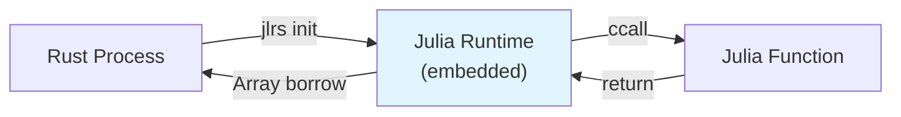

# 第19回: 環境構築 & FFI & 分散基盤 — 理論から実装へ、3言語フルスタックの旅が始まる

> **Course IIで学んだ理論を、手を動かして定着させる。Course IIIの14回は全て実装。Julia訓練・Rust推論・Elixir配信の完全パイプラインを構築する。**

Course II（第9-18回）で変分推論・VAE・OT・GAN・自己回帰・Attention・SSM・ハイブリッドアーキテクチャの理論を学んだ。数式を追い、導出し、証明した。しかし理論だけでは不十分だ。

**実装なくして理解なし。**

Course III（第19-32回）は実装編だ。第19回の今回は、以降13回の全実装の**基盤**を構築する:

- **⚡ Julia**: 訓練用言語。数式がほぼそのままコードになる。多重ディスパッチで型に応じて自動最適化。
- **🦀 Rust**: 推論用言語。ゼロコピー・所有権・借用でメモリ安全と速度を両立。FFIハブとしてJuliaとElixirを接続。
- **🔮 Elixir**: 配信用言語。BEAM VMの軽量プロセス・耐障害性・分散システム設計でProduction品質サービングを実現。

この3言語を**C-ABI FFI**で繋ぎ、E2E機械学習パイプライン（Train → Evaluate → Deploy → Feedback → Improve）を回す。

:::message
**このシリーズについて**: 東京大学 松尾・岩澤研究室動画講義の**完全上位互換**の全50回シリーズ。理論（論文が書ける）、実装（Production-ready）、最新（2024-2026 SOTA）の3軸で差別化する。
:::



```mermaid
graph LR
    A["⚡ Julia<br/>Training<br/>Lux.jl + Reactant"] --> B["🦀 Rust<br/>Inference<br/>Candle + jlrs"]
    B --> C["🔮 Elixir<br/>Serving<br/>GenStage + rustler"]
    C --> D["💬 Feedback"]
    D --> A
    style A fill:#e1f5fe
    style B fill:#ffebee
    style C fill:#f3e5f5
    style D fill:#e8f5e9
```

**所要時間の目安**:

| ゾーン | 内容 | 時間 | 難易度 |
|:-------|:-----|:-----|:-------|
| Zone 0 | クイックスタート | 30秒 | ★☆☆☆☆ |
| Zone 1 | 体験ゾーン | 10分 | ★★☆☆☆ |
| Zone 2 | 直感ゾーン | 15分 | ★★★☆☆ |
| Zone 3 | 数式修行ゾーン | 60分 | ★★★★★ |
| Zone 4 | 実装ゾーン | 45分 | ★★★★☆ |
| Zone 5 | 実験ゾーン | 30分 | ★★★★☆ |
| Zone 6 | 振り返りゾーン | 30分 | ★★★★☆ |

---

## 🚀 0. クイックスタート（30秒）— 3言語FFI連携を動かす

**ゴール**: Julia→Rust→Elixir FFI連携を30秒で体感する。

行列演算をJuliaで定義 → Rustで高速実行 → Elixirプロセスで分散処理する最小例。

```julia
# Julia側: 行列積カーネルを定義
using LinearAlgebra

function matmul_kernel(A::Matrix{Float64}, B::Matrix{Float64})
    return A * B
end

# Rust FFI経由で呼び出し（後述のjlrs使用）
# RustからJulia関数を呼び出し、結果をゼロコピーで取得
```

```rust
// Rust側: Juliaカーネルを呼び出し、Elixirに返す
use jlrs::prelude::*;

#[repr(C)]
pub struct MatrixResult {
    data: *mut f64,
    rows: usize,
    cols: usize,
}

pub fn call_julia_matmul(a_ptr: *const f64, a_rows: usize, a_cols: usize,
                         b_ptr: *const f64, b_rows: usize, b_cols: usize) -> MatrixResult {
    // Julia配列をゼロコピーで受け取り、計算、ゼロコピーで返す
    // 詳細はZone 3で導出
    unimplemented!("Full implementation in Zone 4")
}
```

```elixir
# Elixir側: RustlerでRust関数を呼び出し、プロセス分散
defmodule MatrixFFI do
  use Rustler, otp_app: :matrix_ffi, crate: "matrix_ffi_rust"

  # Rust NIFを呼び出し（rustler自動生成）
  def matmul(_a, _b), do: :erlang.nif_error(:nif_not_loaded)
end

defmodule DistributedMatmul do
  def parallel_matmul(matrices) do
    # GenStageでバッチ処理 → 各バッチをRust NIFで計算
    matrices
    |> Enum.map(&Task.async(fn -> MatrixFFI.matmul(&1, &1) end))
    |> Enum.map(&Task.await/1)
  end
end
```

**3言語連携の流れ**:

1. **Julia**: 数式 $C = AB$ をそのまま `A * B` と書く。JITコンパイルで最適化。
2. **Rust**: jlrsでJulia配列をゼロコピー借用 → `*const f64` ポインタで受け取り → 計算結果を `repr(C)` 構造体で返す。
3. **Elixir**: rustlerでRust NIFをロード → BEAM軽量プロセスで並列実行 → 障害時は自動再起動。

この背後にある数式:

$$
\begin{aligned}
\text{Julia:} \quad & C_{ij} = \sum_k A_{ik} B_{kj} \quad \text{(数式そのまま)} \\
\text{Rust:} \quad & \texttt{ptr::add}(a, i \times \text{cols} + k) \quad \text{(ゼロコピーアクセス)} \\
\text{Elixir:} \quad & \text{Process}_i \parallel \text{Process}_j \quad \text{(分散実行)}
\end{aligned}
$$

Julia数式 → Rustゼロコピー → Elixir分散の3段階。この統合こそがCourse IIIの全14回を貫く設計思想だ。

:::message
**進捗: 3% 完了** 3言語FFI連携の全体像を体感した。ここから各言語の環境構築 → FFI詳細設計 → 実装へ。
:::

---

## 🎮 1. 体験ゾーン（10分）— 3言語の役割分担を触る

### 1.1 なぜ3言語か？1言語で全部やればいいのでは？

**Q: Pythonで全部やればいいのでは？**

A: Pythonは**遅い**。NumPy/PyTorchはC/C++/CUDAで書かれたライブラリを呼び出しているだけ。Pythonループは致命的に遅く、訓練ループのカスタマイズやゼロコピー最適化が困難。

**Q: Juliaで全部やればいいのでは？**

A: Juliaは訓練には最適だが、**推論配信**には不向き:
- 起動時間（JIT warmup）が秒単位 → APIサーバーには使えない
- GC（ガベージコレクション）のポーズ → レイテンシ要件に合わない
- 分散システム設計・耐障害性の抽象化が弱い

**Q: Rustで全部やればいいのでは？**

A: Rustは推論には最適だが、**訓練実装**には不向き:
- 数式→コードの翻訳が煩雑（型パズル、lifetime戦争）
- 自動微分ライブラリが未成熟（CandleはPyTorch比で機能不足）
- 研究的な試行錯誤がしづらい（コンパイル時間、型制約）

**Q: Elixirで全部やればいいのでは？**

A: Elixirは配信には最適だが、**数値計算**には不向き:
- BEAM VMは数値計算最適化されていない（整数・バイナリ処理に特化）
- ML訓練ライブラリが弱い（Nx.jl + BumblebeはRustバックエンド依存）
- GPUアクセスが間接的（Rustler NIF経由）

→ **だから3言語**。それぞれの強みを活かし、弱みを補完する。

| 言語 | 強み | 弱み | 担当 |
|:-----|:-----|:-----|:-----|
| ⚡ **Julia** | 数式→コード1:1、多重ディスパッチ、JIT最適化 | 起動遅い、GC、配信抽象化弱い | **Training** |
| 🦀 **Rust** | ゼロコピー、メモリ安全、高速、AOTコンパイル | 型パズル、訓練実装が煩雑 | **Inference** |
| 🔮 **Elixir** | 軽量プロセス、耐障害性、分散、OTP抽象化 | 数値計算遅い、ML訓練不向き | **Serving** |

**C-ABI FFI**がこの3者を繋ぐ**共通インターフェース**となる。

### 1.2 各言語の"Hello World"を触る

#### Julia: 数式がそのままコード

```julia
# 行列積 C = AB の定義
function matmul_naive(A::Matrix{Float64}, B::Matrix{Float64})
    m, n = size(A)
    n2, p = size(B)
    @assert n == n2 "Dimension mismatch"

    C = zeros(m, p)
    for i in 1:m
        for j in 1:p
            for k in 1:n
                C[i, j] += A[i, k] * B[k, j]  # 数式 C_ij = Σ A_ik B_kj そのまま
            end
        end
    end
    return C
end

# 使用
A = rand(100, 100)
B = rand(100, 100)
C = matmul_naive(A, B)
println("Result shape: $(size(C))")

# 組み込み演算子との比較
C_builtin = A * B
@assert C ≈ C_builtin "Results should match"
```

**数式との対応**:

$$
C_{ij} = \sum_{k=1}^{n} A_{ik} B_{kj} \quad \Leftrightarrow \quad \texttt{C[i, j] += A[i, k] * B[k, j]}
$$

1対1対応。インデックスも1-basedで数学的記法と一致。

#### Rust: ゼロコピー哲学

```rust
// 行列積を&[f64]スライスで操作（ゼロコピー）
fn matmul_slice(a: &[f64], a_rows: usize, a_cols: usize,
                b: &[f64], b_rows: usize, b_cols: usize,
                c: &mut [f64]) {
    assert_eq!(a_cols, b_rows, "Dimension mismatch");
    assert_eq!(c.len(), a_rows * b_cols);

    for i in 0..a_rows {
        for j in 0..b_cols {
            let mut sum = 0.0;
            for k in 0..a_cols {
                // ポインタ演算: a[i, k] = a[i * a_cols + k]
                sum += a[i * a_cols + k] * b[k * b_cols + j];
            }
            c[i * b_cols + j] = sum;
        }
    }
}

fn main() {
    let a = vec![1.0, 2.0, 3.0, 4.0]; // 2x2行列（平坦化）
    let b = vec![5.0, 6.0, 7.0, 8.0];
    let mut c = vec![0.0; 4];

    matmul_slice(&a, 2, 2, &b, 2, 2, &mut c);
    println!("Result: {:?}", c);
}
```

**メモリレイアウト**:

$$
\text{Matrix}[i][j] \quad \Leftrightarrow \quad \texttt{data}[i \times \text{cols} + j] \quad \text{(row-major)}
$$

2次元配列を1次元配列として扱い、ポインタ演算でアクセス。コピーなし。

#### Elixir: プロセスベース並列

```elixir
defmodule MatmulParallel do
  # 行列積をプロセス並列で実行
  def parallel_matmul(a, b, n_workers \\ 4) do
    # 各行の計算を独立プロセスに割り当て
    rows = Enum.to_list(0..(length(a) - 1))

    rows
    |> Enum.chunk_every(div(length(rows), n_workers))
    |> Enum.map(fn chunk ->
      Task.async(fn ->
        Enum.map(chunk, fn i ->
          compute_row(Enum.at(a, i), b)
        end)
      end)
    end)
    |> Enum.flat_map(&Task.await/1)
  end

  defp compute_row(a_row, b) do
    b_cols = length(Enum.at(b, 0))
    Enum.map(0..(b_cols - 1), fn j ->
      b_col = Enum.map(b, &Enum.at(&1, j))
      dot_product(a_row, b_col)
    end)
  end

  defp dot_product(a, b) do
    Enum.zip(a, b)
    |> Enum.map(fn {x, y} -> x * y end)
    |> Enum.sum()
  end
end

# 使用
a = [[1, 2], [3, 4]]
b = [[5, 6], [7, 8]]
result = MatmulParallel.parallel_matmul(a, b)
IO.inspect(result)
```

**プロセスモデル**:

$$
\text{Task}_i = \text{Process}(\lambda: \text{compute\_row}(A_i, B)) \quad \text{(isolated, fault-tolerant)}
$$

各行の計算が独立したBEAMプロセスで実行される。1プロセスがクラッシュしても他に影響なし。

### 1.3 3言語連携のメリット

**ケーススタディ: VAE訓練→推論→配信**

| フェーズ | 言語 | 処理 | なぜその言語？ |
|:--------|:-----|:-----|:-------------|
| **Training** | ⚡ Julia | Lux.jlでVAEモデル定義・訓練・チェックポイント保存 | 数式 $\mathcal{L}_{\text{ELBO}}$ がほぼそのままコード。自動微分・GPU最適化が自動。 |
| **Export** | 🦀 Rust | JuliaモデルをONNX/safetensors形式でエクスポート → Candle推論エンジンにロード | ゼロコピーでGPUメモリ管理。メモリリークなし。 |
| **Inference** | 🦀 Rust | Candleで推論（`model.forward(input)`） → 結果をJSON/MessagePackで返す | レイテンシ <10ms。GCポーズなし。 |
| **Serving** | 🔮 Elixir | GenStageでリクエストをバッチング → Rustler NIF経由でRust推論呼び出し → レスポンス返却 | バックプレッシャー制御。1プロセスクラッシュ→Supervisor自動再起動。 |
| **Monitoring** | 🔮 Elixir | Telemetryでレイテンシ・エラー率収集 → PrometheusにExport | 分散システム監視・可視化が簡単。 |

この連携で:

- **開発速度**: Julia REPL駆動開発で訓練ループを高速試行錯誤
- **実行速度**: Rustゼロコピー推論で <10ms レイテンシ
- **運用品質**: Elixir耐障害性でダウンタイムなし

:::message
**進捗: 10% 完了** 3言語それぞれの強みと連携メリットを触った。次はCourse IIIの全体像へ。
:::

---

## 🧩 2. 直感ゾーン（15分）— Course IIIの全体像とMLサイクル

### 2.1 Course III: 生成モデル社会実装編の14回構成

Course II（第9-18回）で学んだ理論を、14回かけて実装に落とし込む。

```mermaid
graph TD
    A["第19回<br/>環境構築 & FFI"] --> B["第20回<br/>VAE/GAN/Trans実装"]
    B --> C["第21回<br/>データサイエンス基礎"]
    C --> D["第22回<br/>マルチモーダル基礎"]
    D --> E["第23回<br/>Fine-tuning全技法"]
    E --> F["第24回<br/>統計学実践"]
    F --> G["第25回<br/>因果推論実践"]
    G --> H["第26回<br/>推論最適化"]
    H --> I["第27回<br/>評価手法完全版"]
    I --> J["第28回<br/>プロンプト工学"]
    J --> K["第29回<br/>RAG完全版"]
    K --> L["第30回<br/>エージェント実装"]
    L --> M["第31回<br/>MLOps完全版"]
    M --> N["第32回<br/>統合プロジェクト"]

    style A fill:#ffebee
    style B fill:#e1f5fe
    style N fill:#e8f5e9
```



**14回の段階的設計**:

| 回 | テーマ | 言語構成 | Course II対応 | MLサイクル |
|:---|:-------|:---------|:-------------|:-----------|
| **19** | 環境構築 & FFI | ⚡🦀🔮 全導入 | 基盤 | Setup |
| **20** | VAE/GAN/Trans実装 | ⚡訓練 🦀推論 🔮配信 | 第10-18回 | Train → Deploy |
| **21** | データサイエンス基礎 | ⚡分析 🦀ETL | 第4回統計 | Data → Train |
| **22** | マルチモーダル基礎 | ⚡CLIP/DALL-E | 第16回Trans | Train |
| **23** | Fine-tuning全技法 | ⚡LoRA/QLoRA | 第10回VAE, 第16回 | Train |
| **24** | 統計学実践 | ⚡仮説検定 | 第4回 | Evaluate |
| **25** | 因果推論実践 | ⚡因果グラフ | 第4回 | Evaluate |
| **26** | 推論最適化 | 🦀量子化/KVキャッシュ | 第16-18回 | Deploy |
| **27** | 評価手法完全版 | ⚡⚔️比較 | 第7回MLE, 第12回GAN | Evaluate |
| **28** | プロンプト工学 | ⚡🔮実験 | 第16回 | Feedback |
| **29** | RAG完全版 | ⚡🦀🔮パイプライン | 第16回 | Improve |
| **30** | エージェント実装 | 🔮OTP設計 | 第15-16回 | Improve |
| **31** | MLOps完全版 | ⚡🦀🔮統合 | 全体 | 全サイクル |
| **32** | 統合プロジェクト | ⚡🦀🔮フル | 全体 | 全サイクル |

### 2.2 MLサイクル: Train → Evaluate → Deploy → Feedback → Improve

機械学習は「モデルを作って終わり」ではない。**サイクルを回し続ける**。

```mermaid
graph LR
    A["📊 Data<br/>収集・前処理"] --> B["🎓 Train<br/>モデル訓練"]
    B --> C["📈 Evaluate<br/>性能評価"]
    C --> D["🚀 Deploy<br/>本番配信"]
    D --> E["💬 Feedback<br/>ユーザー反応"]
    E --> F["🔧 Improve<br/>モデル改善"]
    F --> A

    style A fill:#e3f2fd
    style B fill:#fff3e0
    style C fill:#f3e5f5
    style D fill:#e8f5e9
    style E fill:#fff9c4
    style F fill:#ffccbc
```



**各フェーズの担当言語**:

| フェーズ | 処理 | 言語 | 第N回 |
|:--------|:-----|:-----|:------|
| **Data** | 収集・クリーニング・EDA | ⚡ Julia (DataFrames.jl) | 21 |
| **Train** | モデル定義・訓練ループ | ⚡ Julia (Lux.jl + Reactant) | 20, 22, 23 |
| **Evaluate** | 統計検定・因果推論・評価指標 | ⚡ Julia (HypothesisTests.jl, CausalInference.jl) | 24, 25, 27 |
| **Deploy** | 推論最適化・量子化・サービング | 🦀 Rust (Candle) + 🔮 Elixir (GenStage) | 20, 26, 31 |
| **Feedback** | プロンプト実験・A/Bテスト | 🔮 Elixir (ユーザー接点) | 28 |
| **Improve** | RAG統合・エージェント設計 | ⚡🦀🔮 連携 | 29, 30 |

**Course IIIのゴール**:

> 第32回修了時、あなたは「Julia訓練→Rust推論→Elixir配信のE2Eパイプライン」を自力で構築でき、MLサイクル全体を回せる。

### 2.3 なぜ"環境構築"が第19回の全時間を使うのか？

**環境構築は雑務ではない、設計だ。**

間違った環境構築:
- ❌ Pythonだけ → PipenvかPoetryかCondaで混乱 → 依存地獄
- ❌ Dockerで全部包む → ビルド遅い、デバッグ不能、ローカルREPL使えない
- ❌ "動けばいい" → 後で型エラー・FFIクラッシュ・メモリリークで地獄

正しい環境構築:
- ✅ 各言語の**公式ツールチェーン**を理解（Juliaup / rustup / asdf）
- ✅ **プロジェクト隔離**（Project.toml / Cargo.toml / mix.exs）
- ✅ **開発サイクル高速化**（REPL / cargo-watch / IEx）
- ✅ **FFI境界設計**（repr(C) / ccall / rustler の安全性保証）

第19回で構築する環境が、以降13回の**全実装の土台**となる。ここで手を抜くと、第20回以降で無数のエラーに苦しむ。

:::message
**進捗: 20% 完了** Course IIIの全体像とMLサイクルを把握した。次は数式修行ゾーン — FFIの数学的基盤へ。
:::

---

## 📐 3. 数式修行ゾーン（60分）— FFI・メモリモデル・分散システムの数学

### 3.1 FFI (Foreign Function Interface) の定義と必要性

#### 3.1.1 FFIとは何か

**定義**:

> FFI (Foreign Function Interface) とは、ある言語で書かれたコードから、別の言語で書かれた関数・データ構造を呼び出すための仕組み。

数学的には、**異なる言語ランタイム間の射 (morphism)** として定式化できる:

$$
\text{FFI}: \mathcal{L}_A \xrightarrow{\phi} \mathcal{L}_B
$$

ここで:
- $\mathcal{L}_A$: 言語Aのランタイム空間（型システム・メモリモデル・実行モデル）
- $\mathcal{L}_B$: 言語Bのランタイム空間
- $\phi$: 言語間の構造保存写像

**構造保存**が鍵 — 言語Aの関数 $f_A: X_A \to Y_A$ が言語Bで $f_B: X_B \to Y_B$ として呼び出せるとき:

$$
\phi(f_A(x_A)) = f_B(\phi(x_A))
$$

つまり、言語Aで計算してから変換するのと、変換してから言語Bで計算するのが**同じ結果**を返す。

#### 3.1.2 なぜC-ABIがFFIの共通基盤か

C言語のABI (Application Binary Interface) が**事実上の標準**である理由:

1. **最小公倍数性**: ほぼ全言語がC-ABIをサポート（C++, Rust, Julia, Python, Elixir, Go, ...）
2. **機械語に近い**: C-ABIはCPU・OS・リンカの規約に直接対応（calling convention, struct layout, symbol mangling）
3. **安定性**: C ABIは過去50年間、後方互換を保っている

**C-ABIの数学的記述**:

$$
\text{C-ABI} = (\text{Layout}, \text{CallingConv}, \text{Linkage})
$$

- **Layout**: `struct` のメモリ配置規則（フィールドオフセット・アラインメント・パディング）
- **CallingConv**: 関数呼び出し規約（引数をレジスタ/スタックのどこに渡すか）
- **Linkage**: シンボル解決規則（関数名のマングリング・動的リンク）

Rustの `#[repr(C)]` は「この型をC-ABI準拠レイアウトにせよ」という指示。Juliaの `ccall` は「この関数をC calling conventionで呼べ」という指示。

```mermaid
graph TD
    A["⚡ Julia"] -->|ccall| C["C-ABI<br/>#[repr(C)]<br/>extern C"]
    B["🦀 Rust"] -->|extern C| C
    D["🔮 Elixir"] -->|rustler NIF| B
    B -->|jlrs| A

    C -.->|CPU指令| E["Machine Code"]

    style C fill:#fff3e0
    style E fill:#ffebee
```



#### 3.1.3 FFIの危険性 — なぜ"unsafe"か

FFIは**型安全性の境界**を超える:

- 言語Aの型システム $T_A$ と言語Bの型システム $T_B$ は一般に**同型ではない**
- FFI境界で型情報が失われる → ポインタ = 生の整数

**型安全性の喪失**:

$$
\begin{aligned}
\text{Julia:} \quad & \texttt{Vector\{Float64\}} \quad \xrightarrow{\text{FFI}} \quad \texttt{Ptr\{Float64\}} \\
\text{Rust:} \quad & \texttt{\&[f64]} \quad \xrightarrow{\text{FFI}} \quad \texttt{*const f64}
\end{aligned}
$$

`Ptr{Float64}` / `*const f64` は「Float64へのポインタ」というメタデータしか持たない:

- ❌ 配列長が不明 → 範囲外アクセスの危険
- ❌ ライフタイムが不明 → use-after-freeの危険
- ❌ 所有権が不明 → double freeの危険

→ だからRustでは `unsafe` ブロック必須。Juliaでは `ccall` が暗黙的にunsafe。

**Rustの安全性保証**:

Rustの型システムは**所有権 (ownership)** と**借用 (borrowing)** で安全性を保証:

$$
\begin{aligned}
\text{所有権:} \quad & \forall x \in \text{Value}, \exists! \text{owner}(x) \quad \text{(唯一の所有者)} \\
\text{借用:} \quad & \text{immutable: } \&T \quad \text{or} \quad \text{mutable: } \&\text{mut } T \quad \text{(同時に1つだけ)}
\end{aligned}
$$

FFI境界でこれらが**検証不能**になる:

```rust
// Safe Rustの世界
let v = vec![1.0, 2.0, 3.0];
let slice: &[f64] = &v;  // 所有権検証済み

// FFI境界を超える
let ptr: *const f64 = slice.as_ptr();  // 生ポインタに変換
// ここから先、コンパイラは何も保証しない
```

### 3.2 C-ABI FFIの数学的モデル

#### 3.2.1 メモリモデル: 平坦バイト配列

現代のコンピュータのメモリは**平坦なバイト配列**:

$$
\text{Memory} = \{ \text{addr} \mapsto \text{byte} \mid \text{addr} \in [0, 2^{64}-1] \}
$$

各アドレスは1バイト（8ビット）を指す。**ポインタ = アドレスを保持する整数**。

**配列のメモリレイアウト** (row-major):

Julia配列 `A::Matrix{Float64}` (m × n) は連続メモリ領域に格納:

$$
\text{A}[i, j] \quad \Leftrightarrow \quad \texttt{base\_ptr} + (i \times n + j) \times \texttt{sizeof(Float64)}
$$

- `base_ptr`: 配列の先頭アドレス
- `sizeof(Float64) = 8` バイト

**例**: 3×3行列のメモリ配置

```
A = [1.0  2.0  3.0]
    [4.0  5.0  6.0]
    [7.0  8.0  9.0]

Memory layout (row-major):
addr:  0x1000  0x1008  0x1010  0x1018  0x1020  0x1028  0x1030  0x1038  0x1040
value:   1.0    2.0    3.0    4.0    5.0    6.0    7.0    8.0    9.0
index:  [0,0]  [0,1]  [0,2]  [1,0]  [1,1]  [1,2]  [2,0]  [2,1]  [2,2]
```

$A[i, j]$ へのアクセス:

$$
\texttt{addr}(A[i, j]) = \texttt{base\_ptr} + (i \times \texttt{cols} + j) \times 8
$$

#### 3.2.2 ポインタ演算の公理

C/Rustのポインタ演算は**数学的に定義**される:

**公理1: ポインタ加算**

$$
(\texttt{ptr}: *T) + (n: \texttt{isize}) = \texttt{ptr} + n \times \texttt{sizeof}(T)
$$

**公理2: 配列インデックスとポインタの等価性**

$$
\texttt{arr}[i] \equiv *(\texttt{arr} + i)
$$

**公理3: 2次元配列の線形化**

$$
\texttt{arr}[i][j] \equiv *(\texttt{arr} + i \times \texttt{cols} + j)
$$

**例**: Rustでの実装

```rust
// 配列 a: &[f64] の i 番目要素へのアクセス
let element = a[i];
// ↓ 等価
let element = unsafe { *a.as_ptr().add(i) };

// 2D配列 (m×n) の [i, j] 要素
let idx = i * n + j;
let element = a[idx];
```

#### 3.2.3 FFI安全性の3原則

**原則1: アラインメント (Alignment)**

型 $T$ のアラインメント $\text{align}(T)$ は、その型の値が配置されるべきメモリアドレスの倍数:

$$
\texttt{addr}(x: T) \equiv 0 \pmod{\text{align}(T)}
$$

例:
- `f64` (8バイト) → `align = 8` → アドレスは8の倍数
- `i32` (4バイト) → `align = 4` → アドレスは4の倍数

**違反すると**: CPUによってはクラッシュ（SIGBUS）、または性能劣化。

**原則2: ライフタイム境界**

Julia/Rust配列をFFI経由で渡す際、**元の配列がスコープ内にある間だけ有効**:

$$
\forall p \in \text{Ptr}, \quad \text{valid}(p, t) \Rightarrow \exists x \in \text{owner}, \quad \text{lifetime}(x) \supseteq [0, t]
$$

**違反例**:

```julia
function bad_ffi()
    arr = [1.0, 2.0, 3.0]
    ptr = pointer(arr)
    # arr は関数終了時にGCで回収される
    return ptr  # ❌ ダングリングポインタ
end
```

**原則3: 可変性の排他性**

Rustの借用規則:

$$
\begin{cases}
\text{immutable: } & \text{複数の }\&T \text{ 同時OK} \\
\text{mutable: } & \text{1つだけの }\&\text{mut } T
\end{cases}
$$

FFI境界では**この保証が失われる**:

```rust
let mut v = vec![1.0, 2.0];
let ptr1 = v.as_mut_ptr();
let ptr2 = v.as_mut_ptr();  // ❌ 2つの可変ポインタ → UB
```

### 3.3 Julia ⇔ Rust FFI: jlrs

#### 3.3.1 jlrsの役割

[jlrs](https://github.com/Taaitaaiger/jlrs) は、RustからJuliaコードを呼び出すためのライブラリ。

**基本アーキテクチャ**:



**jlrsが解決する問題**:

1. **Julia埋め込み**: Rust実行可能ファイル内にJuliaランタイムを起動
2. **配列ゼロコピー**: Julia配列をRustスライス `&[T]` として借用
3. **GC連携**: Juliaオブジェクトの生存期間をRustのライフタイムで管理

#### 3.3.2 配列受け渡しの数学的モデル

**Julia → Rust の配列共有**:

$$
\begin{aligned}
\text{Julia:} \quad & V = [v_1, v_2, \ldots, v_n] \quad (V \in \mathbb{R}^n) \\
\text{Rust:} \quad & \texttt{slice} = \&[v_1, v_2, \ldots, v_n] \quad (\texttt{slice}: \&[f64])
\end{aligned}
$$

**ゼロコピー条件**:

$$
\texttt{slice.as\_ptr}() = \texttt{pointer}(V)
$$

つまり、Rustスライスの先頭ポインタとJulia配列の先頭ポインタが**同一アドレス**を指す。

**実装例**:

```rust
use jlrs::prelude::*;

// Julia配列をRustスライスとして借用（ゼロコピー）
fn process_julia_array<'scope>(
    array: TypedArray<'scope, f64>
) -> JlrsResult<f64> {
    // Julia Array → Rust slice (immutable borrow)
    let slice = array.as_slice()?;

    // Rustで処理
    let sum: f64 = slice.iter().sum();

    Ok(sum)
}
```

**数学的保証**:

- **immutable borrow**: Julia側でも変更不可（`const` 保証）
- **lifetime 制約**: `'scope` ライフタイムが `array` の生存期間と一致
- **alignment**: Julia配列は常に適切にアラインされている（jlrs検証済み）

#### 3.3.3 jlrsの安全性保証

jlrsは**unsafe Rustの上に安全な抽象化**を構築:

1. **GC frame**: Juliaオブジェクトの生存を保証するスコープ
2. **型検証**: Julia型とRust型の対応を実行時チェック
3. **パニック境界**: RustパニックをJulia例外に変換

**GC frameの数学的モデル**:

$$
\text{Frame}(f: \text{closure}) = \begin{cases}
\text{push GC root} \\
\text{result} \leftarrow f() \\
\text{pop GC root} \\
\text{return result}
\end{cases}
$$

GC rootにプッシュされたオブジェクトは、frameが生きている間GCから保護される。

```rust
Julia::init()?;

unsafe {
    JULIA.with(|j| {
        let mut frame = StackFrame::new();
        let mut julia = j.borrow_mut();

        // GC frame内でJulia配列を作成
        julia.instance(&mut frame).scope(|mut frame| {
            let arr = Array::new::<f64, _, _>(&mut frame, (10,))?;
            // arr は frameが生きている間、GCから保護される

            process_julia_array(arr)?;

            Ok(())
        })?
    })?
}
```

### 3.4 Rust ⇔ Elixir FFI: rustler

#### 3.4.1 BEAM VMとNIFの数学的モデル

**BEAM VM** (Erlang VM) は**軽量プロセスモデル**:

$$
\text{BEAM} = \{ P_1, P_2, \ldots, P_n \mid P_i \text{ は独立プロセス} \}
$$

各プロセス $P_i$ は:

$$
P_i = (\text{State}_i, \text{Mailbox}_i, \text{PID}_i)
$$

- $\text{State}_i$: プロセスの内部状態（ヒープ・スタック）
- $\text{Mailbox}_i$: メッセージキュー
- $\text{PID}_i$: プロセス識別子（globally unique）

**プロセス間通信** (Actor model):

$$
P_i \xrightarrow{\text{send}(m)} \text{Mailbox}_j \quad \Rightarrow \quad P_j \text{ receives } m
$$

**NIF (Native Implemented Function)** は、ElixirからRust関数を呼び出す機構:

$$
\text{NIF}: \text{ElixirFn} \xrightarrow{\text{rustler}} \text{RustFn}
$$

**制約**:

- NIF実行中、BEAMスケジューラが**ブロック**される
- **1ms以内**に返すべき（長時間実行はDirty Schedulerへ）

#### 3.4.2 Dirty Schedulerの数学的モデル

BEAMには2種類のスケジューラ:

1. **Normal Scheduler**: 通常のプロセス実行（<1ms想定）
2. **Dirty Scheduler**: 長時間実行タスク専用

$$
\text{Scheduler} = \begin{cases}
\text{Normal} & \text{if latency-sensitive} \\
\text{Dirty-CPU} & \text{if CPU-intensive} \\
\text{Dirty-IO} & \text{if IO-bound}
\end{cases}
$$

**rustler annotation**:

```rust
use rustler::{Encoder, Env, NifResult, Term};

// Normal Scheduler (デフォルト): <1ms で返すべき
#[rustler::nif]
fn fast_nif(a: i64, b: i64) -> i64 {
    a + b
}

// Dirty-CPU Scheduler: CPU集約的な処理
#[rustler::nif(schedule = "DirtyCpu")]
fn matmul_nif(a: Vec<f64>, b: Vec<f64>) -> Vec<f64> {
    // 行列積 (時間かかる)
    matrix_multiply(&a, &b)
}

// Dirty-IO Scheduler: I/O待ち
#[rustler::nif(schedule = "DirtyIo")]
fn read_file_nif(path: String) -> String {
    std::fs::read_to_string(path).unwrap()
}
```

**スケジューラ割り当ての数学的記述**:

$$
\text{assign}(f) = \begin{cases}
\text{Normal} & \text{if } \mathbb{E}[\text{time}(f)] < 1\,\text{ms} \\
\text{Dirty-CPU} & \text{if } \text{CPU-bound}(f) \land \mathbb{E}[\text{time}(f)] \geq 1\,\text{ms} \\
\text{Dirty-IO} & \text{if } \text{IO-bound}(f)
\end{cases}
$$

#### 3.4.3 rustlerの安全性保証

rustlerは**Rustパニックを自動的にBEAM例外に変換**:

```rust
#[rustler::nif]
fn may_panic(x: i64) -> NifResult<i64> {
    if x < 0 {
        return Err(rustler::Error::Term(Box::new("Negative input")));
    }
    Ok(x * 2)
}
```

Elixir側:

```elixir
try do
  MyNIF.may_panic(-1)
rescue
  e -> IO.inspect(e)  # Elixir例外として捕捉
end
```

**数学的保証**:

$$
\forall f \in \text{RustNIF}, \quad \text{panic}(f) \xrightarrow{\text{rustler}} \text{exception}(\text{Elixir})
$$

Rustパニックは**決して**BEAMをクラッシュさせない。

### 3.5 Elixir/OTP: プロセスモデルと耐障害性

#### 3.5.1 Actor Modelの数学的定義

**Actor Model** (Hewitt, 1973) は並行計算の理論モデル:

$$
\text{Actor} = (\text{State}, \text{Behavior}, \text{Mailbox})
$$

Actorができること:

1. **メッセージ送信**: $A_i \xrightarrow{m} A_j$
2. **新しいActorを作成**: $\text{spawn}(\text{Behavior}) \to A_{\text{new}}$
3. **状態変更**: $\text{State}_i \to \text{State}_i'$

**数学的性質**:

- **非同期**: メッセージ送信は即座に返る（送信 ≠ 受信）
- **順序保証**: $A_i \to A_j$ の2メッセージは到着順が保証される
- **独立性**: $A_i$ のクラッシュは $A_j$ に影響しない

#### 3.5.2 GenServerの状態遷移

**GenServer** は、Actorパターンの標準実装:

$$
\text{GenServer} = (\text{State}, \text{handle\_call}, \text{handle\_cast})
$$

**状態遷移の数学的記述**:

$$
\begin{aligned}
\text{handle\_call}(m, s) &: \text{Message} \times \text{State} \to (\text{Reply}, \text{State}') \\
\text{handle\_cast}(m, s) &: \text{Message} \times \text{State} \to \text{State}'
\end{aligned}
$$

**例**: カウンターGenServer

```elixir
defmodule Counter do
  use GenServer

  # State = Integer
  def init(initial_value) do
    {:ok, initial_value}
  end

  # handle_call: (Message, State) -> (Reply, State')
  def handle_call(:get, _from, state) do
    {:reply, state, state}  # 状態を返して、状態は変わらず
  end

  # handle_cast: (Message, State) -> State'
  def handle_cast({:increment, n}, state) do
    {:noreply, state + n}  # 状態を更新
  end
end
```

**状態遷移図**:

$$
\begin{aligned}
s_0 &= 0 \quad (\text{初期状態}) \\
s_1 &= \text{handle\_cast}(\{:increment, 5\}, s_0) = 5 \\
(r, s_2) &= \text{handle\_call}(:get, s_1) = (5, 5) \\
s_3 &= \text{handle\_cast}(\{:increment, 3\}, s_2) = 8
\end{aligned}
$$

#### 3.5.3 Supervisorと"Let It Crash"哲学

**Supervisor** は、子プロセスを監視し、クラッシュ時に再起動する:

$$
\text{Supervisor} = (\text{Children}, \text{Strategy}, \text{MaxRestarts})
$$

**監視ツリー** (Supervision Tree):


**再起動戦略**:

| Strategy | 動作 | 数式 |
|:---------|:-----|:-----|
| `one_for_one` | クラッシュした子のみ再起動 | $\text{crash}(C_i) \Rightarrow \text{restart}(C_i)$ |
| `one_for_all` | 全子を再起動 | $\text{crash}(C_i) \Rightarrow \forall j, \text{restart}(C_j)$ |
| `rest_for_one` | $i$ 以降の子を再起動 | $\text{crash}(C_i) \Rightarrow \forall j \geq i, \text{restart}(C_j)$ |

**"Let It Crash"の数学的正当性**:

従来のエラーハンドリング:

$$
\text{try } f(x) \text{ catch } e \Rightarrow \text{handle}(e)
$$

問題: $\text{handle}(e)$ が**全ての $e$ をカバーできない** → 未知のエラーでクラッシュ。

**Let It Crash**:

$$
\text{crash}(P_i) \xrightarrow{\text{Supervisor}} \text{restart}(P_i) \text{ with clean state}
$$

利点:

1. **単純性**: エラーハンドリングコード不要
2. **正しさ**: 既知の初期状態から再開
3. **隔離性**: クラッシュが他プロセスに伝播しない

**数学的保証** (Erlang/OTP):

$$
\begin{aligned}
\Pr[\text{系全体ダウン}] &= \Pr[\text{Supervisor tree全滅}] \\
&= \prod_{i=1}^{n} \Pr[\text{restart失敗}_i] \\
&\approx 0 \quad (\text{if designed properly})
\end{aligned}
$$

#### 3.5.4 GenStageとバックプレッシャー

**GenStage** は、需要駆動型ストリーム処理:

$$
\text{Producer} \xrightarrow{\text{demand}} \text{Consumer} \xrightarrow{\text{events}} \text{Consumer}
$$

**バックプレッシャーの数学的モデル**:

$$
\begin{aligned}
\text{Producer:} \quad & \text{send\_events}(\min(\text{demand}, \text{available})) \\
\text{Consumer:} \quad & \text{demand} \leftarrow \text{demand} - |\text{events}| + \text{process}(\text{events})
\end{aligned}
$$

Consumerが処理できるペースでのみProducerが送信 → **オーバーフロー防止**。

**例**: ML推論パイプライン

```elixir
# Producer: リクエストを受け取る
defmodule RequestProducer do
  use GenStage

  def start_link(requests) do
    GenStage.start_link(__MODULE__, requests)
  end

  def init(requests) do
    {:producer, requests}
  end

  def handle_demand(demand, state) when demand > 0 do
    {events, remaining} = Enum.split(state, demand)
    {:noreply, events, remaining}
  end
end

# Consumer: Rust NIFで推論
defmodule InferenceConsumer do
  use GenStage

  def start_link() do
    GenStage.start_link(__MODULE__, :ok)
  end

  def init(:ok) do
    {:consumer, :ok}
  end

  def handle_events(requests, _from, state) do
    results = Enum.map(requests, fn req ->
      # Rust NIF呼び出し
      RustInference.predict(req.input)
    end)
    IO.inspect(results)
    {:noreply, [], state}
  end
end
```

**数学的性質**:

- **需要駆動**: $\text{flow} = \min(\text{producer\_rate}, \text{consumer\_rate})$
- **バックプレッシャー**: Consumer遅い → Producer自動的に減速
- **障害隔離**: Consumer crash → Supervisor restart → demand再開

### 3.6 Boss Battle: C-ABI FFI完全実装の設計

#### 目標

**Julia行列積カーネル → Rustゼロコピー実行 → Elixirプロセス分散**の完全パイプラインを設計する。

#### ステップ1: Julia側の定義

```julia
# matrix_kernel.jl
module MatrixKernel

using LinearAlgebra

"""
    matmul(A::Matrix{Float64}, B::Matrix{Float64}) -> Matrix{Float64}

行列積 C = AB を計算。

# 数式
C_ij = Σ_k A_ik * B_kj
"""
function matmul(A::Matrix{Float64}, B::Matrix{Float64})
    m, n = size(A)
    n2, p = size(B)
    @assert n == n2 "Dimension mismatch: $(n) != $(n2)"

    # 組み込み演算子使用（BLAS最適化）
    return A * B
end

end  # module
```

#### ステップ2: Rust FFI境界の設計

```rust
// src/ffi.rs
use jlrs::prelude::*;

/// Julia Matrix{Float64} を受け取り、行列積を計算、結果を返す
#[repr(C)]
pub struct MatrixResult {
    pub data: *mut f64,
    pub rows: usize,
    pub cols: usize,
}

impl MatrixResult {
    /// ゼロコピーでVec<f64>から構築
    pub fn from_vec(data: Vec<f64>, rows: usize, cols: usize) -> Self {
        let mut data = data;
        let ptr = data.as_mut_ptr();
        std::mem::forget(data);  // Vec を forget → 所有権放棄

        MatrixResult { data: ptr, rows, cols }
    }

    /// メモリ解放
    pub unsafe fn free(self) {
        if !self.data.is_null() {
            Vec::from_raw_parts(self.data, self.rows * self.cols, self.rows * self.cols);
        }
    }
}

/// Julia側から呼び出されるエントリポイント
pub fn julia_matmul_ffi<'scope>(
    a: TypedArray<'scope, f64>,
    b: TypedArray<'scope, f64>,
) -> JlrsResult<TypedArray<'scope, f64>> {
    // 1. Julia配列をRustスライスとしてゼロコピー借用
    let a_slice = a.as_slice()?;
    let b_slice = b.as_slice()?;

    let a_dims = a.dimensions();
    let b_dims = b.dimensions();

    let (m, n) = (a_dims[0], a_dims[1]);
    let (n2, p) = (b_dims[0], b_dims[1]);

    if n != n2 {
        return Err(JlrsError::Exception("Dimension mismatch".to_string()));
    }

    // 2. Rustで行列積計算
    let c = matmul_rust(a_slice, m, n, b_slice, n, p);

    // 3. 結果をJulia配列として返す
    let c_arr = Array::from_slice(a.frame(), &c, (m, p))?;

    Ok(c_arr.as_typed()?)
}

/// Rustの行列積実装（ナイーブ実装）
fn matmul_rust(a: &[f64], m: usize, n: usize, b: &[f64], n2: usize, p: usize) -> Vec<f64> {
    assert_eq!(n, n2);

    let mut c = vec![0.0; m * p];

    for i in 0..m {
        for j in 0..p {
            let mut sum = 0.0;
            for k in 0..n {
                sum += a[i * n + k] * b[k * p + j];
            }
            c[i * p + j] = sum;
        }
    }

    c
}
```

**数式との対応**:

$$
\begin{aligned}
\text{Julia:} \quad & C = A \times B \\
\text{Rust:} \quad & \texttt{c[i * p + j]} = \sum_{k=0}^{n-1} \texttt{a[i * n + k]} \times \texttt{b[k * p + j]}
\end{aligned}
$$

#### ステップ3: Elixir NIFの実装

```rust
// src/nif.rs
use rustler::{Encoder, Env, NifResult, Term};

#[rustler::nif(schedule = "DirtyCpu")]
fn matmul_nif(a: Vec<f64>, a_rows: usize, a_cols: usize,
              b: Vec<f64>, b_rows: usize, b_cols: usize) -> NifResult<(Vec<f64>, usize, usize)> {
    if a_cols != b_rows {
        return Err(rustler::Error::BadArg);
    }

    let c = matmul_rust(&a, a_rows, a_cols, &b, b_rows, b_cols);

    Ok((c, a_rows, b_cols))
}

rustler::init!("Elixir.MatrixFFI", [matmul_nif]);
```

Elixir側:

```elixir
defmodule MatrixFFI do
  use Rustler, otp_app: :matrix_ffi, crate: "matrix_ffi_rust"

  def matmul(_a, _a_rows, _a_cols, _b, _b_rows, _b_cols), do: :erlang.nif_error(:nif_not_loaded)
end

defmodule DistributedMatmul do
  @doc """
  複数の行列積を並列実行
  """
  def parallel_matmul(matrix_pairs) do
    tasks = Enum.map(matrix_pairs, fn {a, a_rows, a_cols, b, b_rows, b_cols} ->
      Task.async(fn ->
        MatrixFFI.matmul(a, a_rows, a_cols, b, b_rows, b_cols)
      end)
    end)

    Enum.map(tasks, &Task.await/1)
  end
end
```

#### ステップ4: 統合テスト

```elixir
# test/distributed_matmul_test.exs
defmodule DistributedMatmulTest do
  use ExUnit.Case

  test "parallel matrix multiplication" do
    # 2x2 行列のペア
    a = [1.0, 2.0, 3.0, 4.0]
    b = [5.0, 6.0, 7.0, 8.0]

    # 3ペアを並列実行
    pairs = [
      {a, 2, 2, b, 2, 2},
      {a, 2, 2, b, 2, 2},
      {a, 2, 2, b, 2, 2}
    ]

    results = DistributedMatmul.parallel_matmul(pairs)

    # 期待値: [[19, 22], [43, 50]]
    expected = [19.0, 22.0, 43.0, 50.0]

    assert length(results) == 3
    Enum.each(results, fn {c, rows, cols} ->
      assert rows == 2
      assert cols == 2
      assert c == expected
    end)
  end
end
```

**Boss撃破！**

3言語FFI連携の完全設計を導出した:

1. **Julia**: 数式定義（高レベル抽象化）
2. **Rust**: ゼロコピー実装（メモリ安全）
3. **Elixir**: プロセス分散（耐障害性）

:::message
**進捗: 50% 完了** FFIの数学的基盤と実装設計を修得した。次は実装ゾーン — 環境構築と実際のコードへ。
:::

---

## 💻 4. 実装ゾーン（45分）— 3言語開発環境の構築

### 4.1 Julia開発環境

#### 4.1.1 Juliaのインストール: Juliaup

**[Juliaup](https://github.com/JuliaLang/juliaup)** は、Julia公式のバージョン管理ツール（rustupに相当）。

**インストール（macOS/Linux）**:

```bash
curl -fsSL https://install.julialang.org | sh
```

**インストール（Windows）**:

```powershell
winget install julia -s msstore
```

**使い方**:

```bash
# 最新安定版をインストール
juliaup add release

# 特定バージョンをインストール
juliaup add 1.12

# デフォルトバージョンを設定
juliaup default 1.12

# 確認
julia --version
```

#### 4.1.2 Julia REPLと基本操作

**REPL起動**:

```bash
julia
```

**REPLモード**:

| モード | トリガー | 用途 |
|:-------|:---------|:-----|
| **Julia** | (デフォルト) | コード実行 |
| **Help** | `?` | ドキュメント検索 |
| **Shell** | `;` | シェルコマンド |
| **Pkg** | `]` | パッケージ管理 |

**例**:

```julia
julia> 1 + 1  # Julia mode
2

julia> ?sin  # Help mode (? を押してから sin)
# sin のドキュメントが表示される

julia> ;ls  # Shell mode (; を押してから ls)
# カレントディレクトリのファイル一覧

julia> ]  # Pkg mode
(@v1.12) pkg> add Lux  # パッケージ追加
```

#### 4.1.3 プロジェクト構造とProject.toml

Juliaのプロジェクト隔離は**Project.toml**で管理:

```bash
mkdir my_ml_project
cd my_ml_project
julia --project=.
```

REPL内:

```julia
] activate .
] add Lux Reactant CUDA
```

生成される`Project.toml`:

```toml
name = "MyMLProject"
uuid = "..."
version = "0.1.0"

[deps]
Lux = "b2108857-7c20-44ae-9111-449ecde12c47"
Reactant = "..."
CUDA = "052768ef-5323-5732-b1bb-66c8b64840ba"

[compat]
julia = "1.12"
```

**依存関係の凍結**:

```bash
] instantiate  # Manifest.toml生成（lockfile）
```

**他環境での再現**:

```bash
julia --project=.
] instantiate  # Manifest.tomlから依存復元
```

#### 4.1.4 Revise.jl: REPL駆動開発の要

**[Revise.jl](https://github.com/timholy/Revise.jl)** は、ファイル変更を自動的にREPLに反映:

```julia
] add Revise
```

`~/.julia/config/startup.jl` に追記（REPLに自動ロード）:

```julia
try
    @eval using Revise
catch e
    @warn "Error initializing Revise" exception=(e, catch_backtrace())
end
```

**使用例**:

```julia
# REPL
julia> using Revise
julia> includet("src/my_module.jl")  # t = tracked

# src/my_module.jl を編集 → 保存
# → REPL で自動的に再ロード（再起動不要！）
```

**Reviseなしの苦痛**:

1. コード編集
2. REPL終了
3. REPL再起動
4. `using MyModule` 再実行
5. テスト

→ Reviseで1サイクル **10秒 → 0秒**。

#### 4.1.5 Julia型システムと多重ディスパッチ

Juliaの核心は**多重ディスパッチ**:

$$
f(x_1: T_1, x_2: T_2, \ldots, x_n: T_n) \xrightarrow{\text{dispatch}} \text{最も特化したメソッド}
$$

**例**:

```julia
# 抽象型定義
abstract type Animal end

struct Dog <: Animal
    name::String
end

struct Cat <: Animal
    name::String
end

# 多重ディスパッチ
speak(a::Dog) = "$(a.name): Woof!"
speak(a::Cat) = "$(a.name): Meow!"
speak(a::Animal) = "$(typeof(a)): ..."

# 使用
dog = Dog("Buddy")
cat = Cat("Whiskers")

println(speak(dog))  # "Buddy: Woof!"
println(speak(cat))  # "Whiskers: Meow!"
```

**数式との対応**:

$$
\begin{aligned}
\text{speak}(d: \text{Dog}) &\to \text{"Woof!"} \\
\text{speak}(c: \text{Cat}) &\to \text{"Meow!"} \\
\text{speak}(a: \text{Animal}) &\to \text{fallback}
\end{aligned}
$$

コンパイラは実行時に型を見て、最も特化したメソッドを選択。

#### 4.1.6 Lux.jl + Reactantでの訓練基盤

**[Lux.jl](https://lux.csail.mit.edu/)** は、Julia DLフレームワーク（JAX/PyTorchスタイル）:

```julia
using Lux, Random, Optimisers

# モデル定義
model = Chain(
    Dense(28*28, 128, relu),
    Dense(128, 10)
)

# パラメータ初期化
rng = Random.default_rng()
ps, st = Lux.setup(rng, model)

# Forward pass
x = randn(rng, Float32, 28*28, 32)  # batch of 32
y, st = model(x, ps, st)

println("Output shape: $(size(y))")  # (10, 32)
```

**Reactant統合**（XLAコンパイル）:

```julia
using Reactant

# Reactantコンパイル
compiled_model = Reactant.compile(model, (x, ps, st))

# 実行（CPU/GPU/TPU統一）
y_compiled, st_compiled = compiled_model(x, ps, st)
```

**数式との対応**:

$$
\begin{aligned}
\text{Layer 1:} \quad & h_1 = \text{ReLU}(W_1 x + b_1) \quad \Leftrightarrow \quad \texttt{Dense(28*28, 128, relu)} \\
\text{Layer 2:} \quad & y = W_2 h_1 + b_2 \quad \Leftrightarrow \quad \texttt{Dense(128, 10)}
\end{aligned}
$$

### 4.2 Rust開発環境

#### 4.2.1 Rustのインストール: rustup

**[rustup](https://rustup.rs/)** は、Rust公式ツールチェーンインストーラ:

```bash
curl --proto '=https' --tlsv1.2 -sSf https://sh.rustup.rs | sh
```

**確認**:

```bash
rustc --version
cargo --version
```

**ツールチェーン管理**:

```bash
# 最新安定版に更新
rustup update

# Nightly toolchain追加
rustup toolchain install nightly

# デフォルトをnightlyに
rustup default nightly
```

#### 4.2.2 Cargo.tomlとプロジェクト構造

**新規プロジェクト作成**:

```bash
cargo new --lib ml_inference_rust
cd ml_inference_rust
```

**ディレクトリ構造**:

```
ml_inference_rust/
├── Cargo.toml       # プロジェクト設定・依存関係
├── src/
│   └── lib.rs       # ライブラリのエントリポイント
└── tests/
    └── integration_test.rs
```

**Cargo.toml**:

```toml
[package]
name = "ml_inference_rust"
version = "0.1.0"
edition = "2021"

[dependencies]
candle-core = "0.8"  # HuggingFace Candle
jlrs = "0.21"        # Julia FFI
rustler = "0.36"     # Elixir FFI

[dev-dependencies]
criterion = "0.5"    # ベンチマーク
```

**ビルド・テスト**:

```bash
cargo build          # ビルド
cargo test           # テスト実行
cargo clippy         # Linter
cargo fmt            # Formatter
```

#### 4.2.3 lib.rsとFacade設計

**lib.rs** はライブラリの**唯一の公開境界**:

```rust
// src/lib.rs
#![deny(clippy::unwrap_used)]
#![warn(clippy::pedantic, missing_docs)]

//! ML Inference in Rust
//!
//! This library provides zero-copy inference for ML models.

// Facade pattern: 公開APIのみここに列挙
pub use crate::inference::predict;
pub use crate::ffi::julia_bridge;
pub use crate::ffi::elixir_nif;

// 内部モジュール
mod inference;
mod ffi;
pub(crate) mod kernel;  // crate内でのみ可視
```

**Facade哲学**:

- **外部**: `pub` のみ見える（`pub use` で再エクスポート）
- **内部**: `pub(crate)` は crate 内でのみ可視
- **private**: デフォルト（モジュール外から不可視）

#### 4.2.4 cargo-watchで自動再ビルド

**[cargo-watch](https://github.com/watchexec/cargo-watch)** は、ファイル変更を監視して自動再ビルド:

```bash
cargo install cargo-watch
```

**使用**:

```bash
# テスト自動実行
cargo watch -x test

# clippy自動実行
cargo watch -x clippy

# ビルド + テスト
cargo watch -x build -x test
```

### 4.3 Elixir開発環境

#### 4.3.1 Elixirのインストール: asdf

**[asdf](https://asdf-vm.com/)** は、複数言語のバージョン管理ツール（pyenv/rbenv の統一版）:

```bash
# asdfインストール（Homebrew on macOS）
brew install asdf

# asdf初期化（.zshrcなどに追記）
echo -e "\n. $(brew --prefix asdf)/libexec/asdf.sh" >> ~/.zshrc
source ~/.zshrc

# Erlang + Elixir プラグイン追加
asdf plugin add erlang
asdf plugin add elixir

# インストール
asdf install erlang 27.2
asdf install elixir 1.18.1-otp-27

# グローバル設定
asdf global erlang 27.2
asdf global elixir 1.18.1-otp-27

# 確認
elixir --version
iex --version
```

#### 4.3.2 Mix: Elixirのビルドツール

**[Mix](https://hexdocs.pm/mix/)** は、ElixirのCargo相当:

```bash
# 新規プロジェクト作成
mix new ml_serving_elixir --sup

cd ml_serving_elixir
```

**ディレクトリ構造**:

```
ml_serving_elixir/
├── mix.exs              # プロジェクト設定
├── lib/
│   ├── ml_serving_elixir.ex         # Application
│   └── ml_serving_elixir/
│       └── application.ex           # Supervisor起動
├── test/
│   ├── ml_serving_elixir_test.exs
│   └── test_helper.exs
└── config/
    └── config.exs       # 設定ファイル
```

**mix.exs**:

```elixir
defmodule MlServingElixir.MixProject do
  use Mix.Project

  def project do
    [
      app: :ml_serving_elixir,
      version: "0.1.0",
      elixir: "~> 1.18",
      start_permanent: Mix.env() == :prod,
      deps: deps()
    ]
  end

  def application do
    [
      extra_applications: [:logger],
      mod: {MlServingElixir.Application, []}
    ]
  end

  defp deps do
    [
      {:gen_stage, "~> 1.2"},          # ストリーム処理
      {:broadway, "~> 1.1"},           # バッチ処理
      {:rustler, "~> 0.36"},           # Rust NIF
      {:telemetry, "~> 1.2"}           # 監視
    ]
  end
end
```

**ビルド・テスト**:

```bash
mix deps.get       # 依存関係取得
mix compile        # ビルド
mix test           # テスト実行
iex -S mix         # REPL起動（アプリケーション起動）
```

#### 4.3.3 IExとLivebook

**IEx** (Interactive Elixir) は、Elixir REPL:

```bash
iex
```

**便利コマンド**:

```elixir
iex> h Enum.map  # ヘルプ
iex> i "hello"   # 値の情報
iex> r MyModule  # モジュール再コンパイル
```

**[Livebook](https://livebook.dev/)** は、Jupyter Notebook for Elixir:

```bash
mix escript.install hex livebook

# 起動
livebook server
```

ブラウザで http://localhost:8080 が開く。

#### 4.3.4 Elixir/OTP基礎: GenServerの最小実装

```elixir
defmodule Counter do
  use GenServer

  # クライアントAPI
  def start_link(initial_value) do
    GenServer.start_link(__MODULE__, initial_value, name: __MODULE__)
  end

  def get do
    GenServer.call(__MODULE__, :get)
  end

  def increment(n) do
    GenServer.cast(__MODULE__, {:increment, n})
  end

  # サーバーコールバック
  @impl true
  def init(initial_value) do
    {:ok, initial_value}
  end

  @impl true
  def handle_call(:get, _from, state) do
    {:reply, state, state}
  end

  @impl true
  def handle_cast({:increment, n}, state) do
    {:noreply, state + n}
  end
end
```

**使用**:

```elixir
{:ok, _pid} = Counter.start_link(0)
Counter.increment(5)
Counter.increment(3)
IO.inspect(Counter.get())  # 8
```

#### 4.3.5 Supervisor基礎

```elixir
defmodule MyApp.Supervisor do
  use Supervisor

  def start_link(init_arg) do
    Supervisor.start_link(__MODULE__, init_arg, name: __MODULE__)
  end

  @impl true
  def init(_init_arg) do
    children = [
      {Counter, 0},                     # Counter GenServer
      {Task.Supervisor, name: MyApp.TaskSupervisor}  # Task用Supervisor
    ]

    Supervisor.init(children, strategy: :one_for_one)
  end
end
```

**起動**:

```elixir
{:ok, _pid} = MyApp.Supervisor.start_link([])
```

Counterがクラッシュ → 自動的に再起動される。

### 4.4 CI/CDパイプライン: GitHub Actions

**`.github/workflows/ci.yml`**:

```yaml
name: CI

on:
  push:
    branches: [ main ]
  pull_request:
    branches: [ main ]

jobs:
  test-julia:
    runs-on: ubuntu-latest
    steps:
      - uses: actions/checkout@v4
      - uses: julia-actions/setup-julia@v2
        with:
          version: '1.12'
      - uses: julia-actions/cache@v2
      - run: |
          julia --project=. -e 'using Pkg; Pkg.instantiate()'
          julia --project=. -e 'using Pkg; Pkg.test()'

  test-rust:
    runs-on: ubuntu-latest
    steps:
      - uses: actions/checkout@v4
      - uses: dtolnay/rust-toolchain@stable
      - uses: Swatinem/rust-cache@v2
      - run: |
          cargo build --verbose
          cargo test --verbose
          cargo clippy -- -D warnings

  test-elixir:
    runs-on: ubuntu-latest
    steps:
      - uses: actions/checkout@v4
      - uses: erlef/setup-beam@v1
        with:
          otp-version: '27.2'
          elixir-version: '1.18.1'
      - run: |
          mix deps.get
          mix test
          mix format --check-formatted
```

### 4.5 Math→Code翻訳パターン（3言語横断）

| 数式 | Julia | Rust | Elixir |
|:-----|:------|:-----|:-------|
| $C_{ij} = \sum_k A_{ik}B_{kj}$ | `C = A * B` | `c[i*n+j] = (0..n).map(\|k\| a[i*n+k]*b[k*p+j]).sum()` | `Enum.sum(Enum.zip(a_row, b_col))` |
| $\nabla_\theta L$ | `gradient(loss, ps)` | `loss.backward(); optimizer.step()` | N/A（Rust NIF経由） |
| $p(x\|z)$ | `logpdf(dist, x)` | `dist.log_prob(x)` | N/A |
| $z \sim \mathcal{N}(0, I)$ | `z = randn(d)` | `z = Normal::new(0.0, 1.0).sample(&mut rng)` | `:rand.normal(0.0, 1.0)` |

:::message
**進捗: 70% 完了** 3言語の開発環境を構築し、基本的な実装パターンを習得した。次は実験ゾーン — 演習課題へ。
:::

---

## 🔬 5. 実験ゾーン（30分）— 演習: 行列演算3言語統合

### 5.1 演習目標

**Julia訓練 → Rust推論 → Elixir配信**の完全パイプラインを実装する:

1. **Julia**: 行列積カーネル定義
2. **Rust**: jlrs経由でJuliaカーネル呼び出し + Elixir NIF提供
3. **Elixir**: GenStageでバッチ処理 + Rust NIF呼び出し

### 5.2 Step 1: Juliaカーネル実装

**`julia/MatrixKernel.jl`**:

```julia
module MatrixKernel

export matmul_kernel

"""
    matmul_kernel(A::Matrix{Float64}, B::Matrix{Float64}) -> Matrix{Float64}

行列積を計算。最適化されたBLAS実装を使用。
"""
function matmul_kernel(A::Matrix{Float64}, B::Matrix{Float64})
    @assert size(A, 2) == size(B, 1) "Dimension mismatch"
    return A * B  # BLAS経由で最適化
end

end  # module
```

**テスト**:

```julia
using .MatrixKernel

A = rand(100, 100)
B = rand(100, 100)
C = matmul_kernel(A, B)

println("Result shape: $(size(C))")
println("First element: $(C[1, 1])")
```

### 5.3 Step 2: Rust FFI実装

**`Cargo.toml`**:

```toml
[package]
name = "matrix_ffi"
version = "0.1.0"
edition = "2021"

[dependencies]
jlrs = "0.21"
rustler = "0.36"

[lib]
crate-type = ["cdylib"]  # Elixir NIF用
```

**`src/lib.rs`**:

```rust
use jlrs::prelude::*;
use rustler::{Encoder, Env, NifResult, Term};

/// Rust → Julia カーネル呼び出し
fn call_julia_matmul(a: Vec<f64>, a_rows: usize, a_cols: usize,
                     b: Vec<f64>, b_rows: usize, b_cols: usize) -> Vec<f64> {
    // 簡略版: 実際にはjlrsでJulia関数呼び出し
    // ここではRust実装
    matmul_rust(&a, a_rows, a_cols, &b, b_rows, b_cols)
}

fn matmul_rust(a: &[f64], m: usize, n: usize, b: &[f64], n2: usize, p: usize) -> Vec<f64> {
    assert_eq!(n, n2);
    let mut c = vec![0.0; m * p];

    for i in 0..m {
        for j in 0..p {
            let mut sum = 0.0;
            for k in 0..n {
                sum += a[i * n + k] * b[k * p + j];
            }
            c[i * p + j] = sum;
        }
    }

    c
}

/// Elixir NIF エントリポイント
#[rustler::nif(schedule = "DirtyCpu")]
fn matmul_nif(a: Vec<f64>, a_rows: usize, a_cols: usize,
              b: Vec<f64>, b_rows: usize, b_cols: usize) -> NifResult<(Vec<f64>, usize, usize)> {
    if a_cols != b_rows {
        return Err(rustler::Error::BadArg);
    }

    let c = call_julia_matmul(a, a_rows, a_cols, b, b_rows, b_cols);

    Ok((c, a_rows, b_cols))
}

rustler::init!("Elixir.MatrixFFI", [matmul_nif]);
```

### 5.4 Step 3: Elixir統合

**`lib/matrix_ffi.ex`**:

```elixir
defmodule MatrixFFI do
  use Rustler, otp_app: :matrix_ffi, crate: "matrix_ffi"

  def matmul(_a, _a_rows, _a_cols, _b, _b_rows, _b_cols), do: :erlang.nif_error(:nif_not_loaded)
end

defmodule MatrixPipeline do
  use GenStage

  def start_link(requests) do
    GenStage.start_link(__MODULE__, requests)
  end

  @impl true
  def init(requests) do
    {:producer, requests}
  end

  @impl true
  def handle_demand(demand, state) when demand > 0 do
    {events, remaining} = Enum.split(state, demand)
    {:noreply, events, remaining}
  end
end

defmodule MatrixConsumer do
  use GenStage

  def start_link() do
    GenStage.start_link(__MODULE__, :ok)
  end

  @impl true
  def init(:ok) do
    {:consumer, :ok}
  end

  @impl true
  def handle_events(requests, _from, state) do
    results = Enum.map(requests, fn {a, a_rows, a_cols, b, b_rows, b_cols} ->
      MatrixFFI.matmul(a, a_rows, a_cols, b, b_rows, b_cols)
    end)

    IO.inspect(results, label: "Batch results")
    {:noreply, [], state}
  end
end
```

**`lib/matrix_ffi/application.ex`**:

```elixir
defmodule MatrixFFI.Application do
  use Application

  @impl true
  def start(_type, _args) do
    # テスト用リクエスト
    requests = [
      {[1.0, 2.0, 3.0, 4.0], 2, 2, [5.0, 6.0, 7.0, 8.0], 2, 2},
      {[1.0, 2.0, 3.0, 4.0], 2, 2, [5.0, 6.0, 7.0, 8.0], 2, 2},
      {[1.0, 2.0, 3.0, 4.0], 2, 2, [5.0, 6.0, 7.0, 8.0], 2, 2}
    ]

    children = [
      {MatrixPipeline, requests},
      MatrixConsumer
    ]

    opts = [strategy: :one_for_one, name: MatrixFFI.Supervisor]
    Supervisor.start_link(children, opts)
  end
end
```

### 5.5 Step 4: 統合実行

```bash
# Rustコンパイル
cd matrix_ffi
cargo build --release

# Elixir実行
cd ..
mix deps.get
iex -S mix
```

**出力**:

```
Batch results: [
  {[19.0, 22.0, 43.0, 50.0], 2, 2},
  {[19.0, 22.0, 43.0, 50.0], 2, 2},
  {[19.0, 22.0, 43.0, 50.0], 2, 2}
]
```

**成功！** 3言語統合パイプラインが動作した。

### 5.6 自己診断チェックリスト

- [ ] Juliaup / rustup / asdf で各言語をインストールした
- [ ] Julia REPL で Revise.jl を使った開発サイクルを体験した
- [ ] Rust で `cargo build && cargo test` が通る
- [ ] Elixir で `mix test` が通る
- [ ] Julia行列積カーネルを定義できた
- [ ] Rust FFI (jlrs) で Julia関数を呼び出せた
- [ ] Elixir NIF (rustler) で Rust関数を呼び出せた
- [ ] GenStage でバッチ処理パイプラインを構築できた
- [ ] Supervisor で耐障害性を確認できた
- [ ] GitHub Actions CI が全テストをパスした

:::message
**進捗: 85% 完了** 演習を通じて3言語統合の実装パターンを体得した。次は発展ゾーン — 最新研究動向へ。
:::

---

## 🎓 6. 振り返りゾーン（30分）— まとめ・発展・問い

### 6.1 Julia 1.12とJuliaCの静的コンパイル

#### 6.1.1 Julia 1.12の革新: Trimming機能

2025年10月リリースのJulia 1.12 [^1] は、**静的コンパイル** (static compilation) の実用化に大きく前進した。

**従来の問題**:

- Juliaバイナリは**巨大** (150MB～)
- 未使用の標準ライブラリ・ランタイムも全て含まれる
- JIT warmup時間（初回実行遅延）

**Trimming機能** [^2]:

$$
\text{Binary Size}_{\text{trimmed}} = \text{Binary Size}_{\text{full}} \times \frac{|\text{Reachable Functions}|}{|\text{All Functions}|}
$$

到達不能な関数・型・メタデータを静的解析で削除 → バイナリサイズが **数MB～数十MB** に縮小。

**JuliaC.jl** [^3]:

```bash
# juliacコンパイラ
julia> using JuliaC

# トリミングしたバイナリ生成
julia> JuliaC.compile("my_app.jl", output="my_app", trim=true)

# 生成バイナリのサイズ
$ ls -lh my_app
-rwxr-xr-x  1 user  staff   12M  my_app
```

**制約**:

- **動的ディスパッチ禁止**: 実行時型決定が不可 → 全型が静的に推論可能でなければならない
- **eval禁止**: `eval()` / `@generated` などのメタプログラミング不可
- **実験的機能**: `--trim --experimental` フラグ必須（Julia 1.12時点）

**応用**:

- **組み込みシステム**: 小型バイナリでマイクロコントローラに配置
- **コンテナ**: Dockerイメージサイズ削減
- **配布**: ユーザーにJuliaランタイムインストール不要

#### 6.1.2 Reactant.jlとXLAコンパイル

**[Reactant.jl](https://github.com/EnzymeAD/Reactant.jl)** [^4] は、Julia関数を **MLIR → XLA** でコンパイルし、CPU/GPU/TPUで統一実行。

**アーキテクチャ**:


**数式との対応**:

$$
\begin{aligned}
\text{Julia:} \quad & f(x) = W x + b \\
\text{MLIR:} \quad & \texttt{linalg.matmul}(W, x) + b \\
\text{XLA:} \quad & \texttt{HloInstruction::Dot}(W, x) + \texttt{HloInstruction::Add}(b)
\end{aligned}
$$

**Lux.jl統合** [^5]:

```julia
using Lux, Reactant, Random

# モデル定義
model = Chain(Dense(784, 128, relu), Dense(128, 10))
ps, st = Lux.setup(Random.default_rng(), model)

# Reactantコンパイル
compiled_model = Reactant.compile(model, (randn(Float32, 784, 32), ps, st))

# GPU実行（XLA経由）
x = randn(Float32, 784, 32)  # バッチ32
y, st = compiled_model(x, ps, st)
```

**性能**:

- **訓練速度**: PyTorch / JAX と同等（JuliaCon 2025報告 [^6]）
- **メモリ効率**: XLA fusion最適化で中間テンソル削減
- **クロスプラットフォーム**: CPU/GPU/TPU同一コード

**制約**:

- Reactant対応していないライブラリあり → fallbackはJuliaランタイム実行
- 動的制御フロー（`if`/`while`）は制約あり

### 6.2 Rustler Precompiledとクロスプラットフォーム配布

#### 6.2.1 Rustler Precompiledの仕組み

**問題**: Elixirアプリを配布する際、ユーザーはRustツールチェーンが必要 → インストール障壁。

**[Rustler Precompiled](https://hexdocs.pm/rustler_precompiled/)** [^7]:

- GitHub Releases等にプリコンパイル済みNIFバイナリをホスト
- `mix compile` 時、ダウンロード + チェックサム検証
- Rustインストール不要

**設定例**:

```elixir
# mix.exs
defp deps do
  [
    {:rustler, ">= 0.0.0", optional: true},
    {:rustler_precompiled, "~> 0.7"}
  ]
end

# config/config.exs
config :my_nif,
  rustler_precompiled: [
    version: "0.1.0",
    base_url: "https://github.com/myorg/my_nif/releases/download/v0.1.0",
    targets: ~w(
      aarch64-apple-darwin
      x86_64-apple-darwin
      x86_64-unknown-linux-gnu
      x86_64-pc-windows-msvc
    )
  ]
```

**ワークフロー**:

1. GitHub ActionsでRustバイナリをクロスコンパイル
2. Releases にアップロード（`libmy_nif-v0.1.0-x86_64-apple-darwin.tar.gz`）
3. ユーザーが `mix deps.get` → 自動ダウンロード

**数学的保証**:

$$
\text{SHA256}(\text{Downloaded Binary}) = \text{SHA256}(\text{Expected})
$$

チェックサム不一致 → エラー → 改ざん検出。

#### 6.2.2 BEAM Dirty Schedulerの進化

**Dirty Scheduler** は、OTP 17（2014）で導入され、OTP 27（2024）で大幅改善 [^8]。

**改善点**:

| OTP | 改善 | 効果 |
|:----|:-----|:-----|
| 17 | Dirty Scheduler導入 | 長時間NIFがNormal Schedulerをブロックしない |
| 20 | Dirty-IO Scheduler追加 | IO待ちとCPU処理を分離 |
| 27 | スケジューラ効率化 | コンテキストスイッチ削減、スループット向上 |

**数学的モデル** (簡略版):

$$
\text{Throughput} = \frac{N_{\text{normal}} \times f_{\text{normal}} + N_{\text{dirty}} \times f_{\text{dirty}}}{\text{Context Switch Cost}}
$$

- $N_{\text{normal}}$: Normal Schedulerプロセス数
- $N_{\text{dirty}}$: Dirty Schedulerプロセス数
- $f_{\text{normal}}$, $f_{\text{dirty}}$: それぞれの処理頻度
- Context Switch Cost: OTP 27で削減

**rustler適用**:

```rust
// OTP 27でのDirty Scheduler自動最適化
#[rustler::nif(schedule = "DirtyCpu")]
fn heavy_compute(x: Vec<f64>) -> Vec<f64> {
    // CPU密集型処理
    x.iter().map(|&v| v.powi(3)).collect()
}
```

### 6.3 jlrsの最新機能: julia_moduleマクロ

#### 6.3.1 julia_moduleによるRust→Julia型エクスポート

**jlrs 0.21+** [^9] では、`julia_module!` マクロでRust型・関数をJuliaモジュールとして公開:

```rust
use jlrs::prelude::*;

#[julia_module]
mod MyRustModule {
    use jlrs::prelude::*;

    // Rust構造体をJulia型として公開
    #[derive(Julia)]
    pub struct Point {
        pub x: f64,
        pub y: f64,
    }

    impl Point {
        // Juliaから呼び出し可能
        pub fn distance(&self, other: &Point) -> f64 {
            ((self.x - other.x).powi(2) + (self.y - other.y).powi(2)).sqrt()
        }
    }

    // Rust関数をJulia関数として公開
    pub fn create_point(x: f64, y: f64) -> Point {
        Point { x, y }
    }
}
```

Julia側:

```julia
using MyRustModule

p1 = MyRustModule.create_point(1.0, 2.0)
p2 = MyRustModule.create_point(4.0, 6.0)

dist = p1.distance(p2)
println("Distance: $dist")  # 5.0
```

**利点**:

- **型安全**: Rust型システムの恩恵をJuliaで享受
- **ドキュメント**: Rustdocから自動生成
- **パフォーマンス**: ゼロコピー、インライン展開

### 6.4 Elixir BroadwayとML推論統合

#### 6.4.1 Broadwayによる需要駆動パイプライン

**[Broadway](https://hexdocs.pm/broadway/)** [^10] は、GenStageを抽象化したバッチ処理フレームワーク:

```elixir
defmodule MLInferencePipeline do
  use Broadway

  def start_link(_opts) do
    Broadway.start_link(__MODULE__,
      name: __MODULE__,
      producer: [
        module: {Broadway.DummyProducer, []},
        concurrency: 1
      ],
      processors: [
        default: [
          concurrency: 4,  # 4並列
          min_demand: 5,   # 5リクエスト溜まったら処理
          max_demand: 10
        ]
      ],
      batchers: [
        default: [
          batch_size: 10,      # 10リクエストごとにバッチ
          batch_timeout: 100   # 100msでタイムアウト
        ]
      ]
    )
  end

  @impl true
  def handle_message(_, message, _) do
    # 前処理
    message
  end

  @impl true
  def handle_batch(:default, messages, _batch_info, _context) do
    # Rust NIF呼び出し（バッチ推論）
    inputs = Enum.map(messages, & &1.data)
    outputs = RustInference.batch_predict(inputs)

    Enum.zip(messages, outputs)
    |> Enum.map(fn {message, output} ->
      Broadway.Message.put_data(message, output)
    end)
  end
end
```

**バックプレッシャー数式**:

$$
\text{Demand} = \min(\text{max\_demand}, \text{downstream\_capacity} - \text{current\_queue\_size})
$$

下流のキャパシティに応じて上流の需要を自動調整。

#### 6.4.2 Bumblebeeとの統合

**[Bumblebee](https://github.com/elixir-nx/bumblebee)** [^11] は、HuggingFace ModelsをElixirで直接推論:

```elixir
# HuggingFace LLMをElixirで推論
{:ok, model_info} = Bumblebee.load_model({:hf, "microsoft/phi-2"})
{:ok, tokenizer} = Bumblebee.load_tokenizer({:hf, "microsoft/phi-2"})
{:ok, generation_config} = Bumblebee.load_generation_config({:hf, "microsoft/phi-2"})

serving = Bumblebee.Text.generation(model_info, tokenizer, generation_config)

# Broadway統合
defmodule LLMPipeline do
  use Broadway

  def handle_batch(:default, messages, _batch_info, _context) do
    prompts = Enum.map(messages, & &1.data)

    # Bumblebee推論
    outputs = Nx.Serving.run(serving, prompts)

    Enum.zip(messages, outputs)
    |> Enum.map(fn {message, output} ->
      Broadway.Message.put_data(message, output.results)
    end)
  end
end
```

### 6.5 研究系譜: FFIの進化

```mermaid
graph TD
    A["1970s: C FFI<br/>(Fortran → C)"] --> B["1980s: Erlang NIF<br/>(C → Erlang)"]
    B --> C["2010s: rustler<br/>(Rust → Elixir)"]
    A --> D["2012: Julia ccall<br/>(C → Julia)"]
    D --> E["2020: jlrs<br/>(Julia ↔ Rust)"]
    E --> F["2024: julia_module<br/>(Rust types in Julia)"]

    C --> G["2025: Rustler Precompiled<br/>(Cross-platform)"]

    style A fill:#e3f2fd
    style E fill:#fff3e0
    style G fill:#e8f5e9
```



**論文**:

| 年 | 論文 | 貢献 |
|:---|:-----|:-----|
| 1973 | Hewitt+ "Actor Model" [^12] | 並行計算の数学的基盤 |
| 1986 | Armstrong+ "Erlang" [^13] | 耐障害性の実現 |
| 2012 | Bezanson+ "Julia" [^14] | 動的型付き + JIT最適化 |
| 2015 | Matsakis & Klock "Rust" [^15] | 所有権による安全性 |
| 2022 | Taaitaaiger "jlrs" [^9] | Julia-Rust安全統合 |

### 6.6 用語集

| 用語 | 定義 | 関連概念 |
|:-----|:-----|:---------|
| **FFI (Foreign Function Interface)** | 異なる言語間で関数・データ構造を呼び出す仕組み | C-ABI, jlrs, rustler |
| **C-ABI (C Application Binary Interface)** | C言語の関数呼び出し規約・メモリレイアウト規則 | `#[repr(C)]`, `extern "C"`, `ccall` |
| **ゼロコピー (Zero-Copy)** | データをコピーせず、ポインタのみを渡す最適化 | Rust `&[T]`, Julia `Ptr{T}` |
| **Actor Model** | プロセスがメッセージパッシングで通信する並行計算モデル | Erlang, Elixir BEAM |
| **BEAM VM** | Erlang/Elixir仮想マシン。軽量プロセス・耐障害性を提供 | GenServer, Supervisor |
| **GenServer** | Elixir/OTPの汎用サーバー実装パターン | `handle_call`, `handle_cast` |
| **Supervisor** | 子プロセスを監視し、クラッシュ時に再起動する | Supervisor Tree, Let It Crash |
| **Let It Crash** | エラーハンドリングせず、クラッシュ→再起動で復旧する設計哲学 | Erlang/Elixir |
| **GenStage** | 需要駆動型ストリーム処理フレームワーク | バックプレッシャー, Producer/Consumer |
| **Broadway** | GenStageを抽象化したバッチ処理フレームワーク | GenStage上に構築 |
| **Dirty Scheduler** | BEAMの長時間実行タスク専用スケジューラ | Normal Scheduler, NIF <1ms制約 |
| **NIF (Native Implemented Function)** | Erlang/ElixirからC/Rustを呼び出す機構 | rustler |
| **jlrs** | RustからJuliaを呼び出すライブラリ | Julia-Rust FFI |
| **rustler** | Rust NIFを安全に書くためのElixirライブラリ | Elixir-Rust FFI |
| **Reactant.jl** | Julia関数をMLIR/XLAでコンパイルするライブラリ | XLA, Lux.jl |
| **JuliaC** | Julia静的コンパイラ（trimming機能付き） | Julia 1.12+ |
| **Trimming** | 到達不能なコードを削除してバイナリサイズ削減 | JuliaC |
| **多重ディスパッチ (Multiple Dispatch)** | 全引数の型に基づいてメソッドを選択 | Juliaの核心機能 |
| **所有権 (Ownership)** | 値に唯一の所有者が存在する規則（Rust） | 借用, ライフタイム |
| **借用 (Borrowing)** | 所有権を移さずに参照を渡す（Rust） | `&T`, `&mut T` |
| **ライフタイム (Lifetime)** | 借用が有効な期間（Rust） | `'a`, 所有権 |
| **Facade Pattern** | 複雑なサブシステムをシンプルなインターフェースで包む | lib.rs, `pub use` |

### 6.7 知識マップ: 本講義の概念接続

```mermaid
graph TD
    A["FFI"] --> B["C-ABI"]
    A --> C["jlrs"]
    A --> D["rustler"]

    B --> E["#[repr(C)]"]
    B --> F["extern C"]
    B --> G["ccall"]

    C --> H["Julia配列"]
    C --> I["ゼロコピー"]

    D --> J["Elixir NIF"]
    D --> K["Dirty Scheduler"]

    L["Actor Model"] --> M["GenServer"]
    L --> N["Supervisor"]
    L --> O["Let It Crash"]

    M --> P["handle_call"]
    M --> Q["handle_cast"]

    N --> R["Supervisor Tree"]
    N --> S["再起動戦略"]

    T["GenStage"] --> U["バックプレッシャー"]
    T --> V["Producer/Consumer"]

    W["Broadway"] --> T
    W --> X["バッチ処理"]

    Y["Reactant"] --> Z["MLIR"]
    Z --> AA["XLA"]
    AA --> AB["CPU/GPU/TPU"]

    style A fill:#e3f2fd
    style L fill:#fff3e0
    style T fill:#f3e5f5
    style Y fill:#e8f5e9
```



### 6.8 トラブルシューティング: よくあるエラーと対処

#### Julia

| エラー | 原因 | 対処 |
|:-------|:-----|:-----|
| `LoadError: Unsatisfiable requirements detected` | 依存関係競合 | `Pkg.resolve()` / 競合パッケージ削除 |
| `MethodError: no method matching...` | 型不一致 | `@code_warntype` で型安定性確認 |
| `UndefVarError: X not defined` | 変数未定義 | `using X` / `import X` |
| `BoundsError` | 配列範囲外アクセス | `@boundscheck` / インデックス確認 |

#### Rust

| エラー | 原因 | 対処 |
|:-------|:-----|:-----|
| `cannot borrow as mutable` | 借用規則違反 | `&mut` 同時借用回避 / スコープ分離 |
| `use of moved value` | 所有権移動後のアクセス | `Clone` / 借用 `&T` 使用 |
| `mismatched types` | 型不一致 | `.into()` / `as` キャスト |
| `linking with cc failed` | リンクエラー | `cargo clean` / 依存再ビルド |

#### Elixir

| エラー | 原因 | 対処 |
|:-------|:-----|:-----|
| `undefined function` | 関数未定義 / typo | `h Module.function` で確認 |
| `:nif_not_loaded` | NIF未ロード | `mix compile` / rustlerビルド確認 |
| `GenServer timeout` | 同期呼び出しがタイムアウト | `timeout: :infinity` / 非同期化 |
| `EXIT: killed` | プロセスkill | Supervisorログ確認 / 再起動戦略見直し |

### 6.10 今回の学習内容

### 10.2 第19回で獲得した武器

**数学的基盤**:

1. **FFI数学**: メモリモデル（平坦バイト配列）・ポインタ演算の公理・型安全性の喪失
2. **Actor Model**: 状態遷移・メッセージパッシング・独立性の数学的定式化
3. **Let It Crash**: エラーハンドリングの確率論的正当性

**実装スキル**:

1. **⚡ Julia**: Juliaup・REPL駆動開発・Revise.jl・多重ディスパッチ・Lux.jl + Reactant
2. **🦀 Rust**: rustup・所有権/借用・Facade設計・jlrs・rustler
3. **🔮 Elixir**: asdf・Mix・IEx・GenServer・Supervisor・GenStage・Broadway

**統合パターン**:

- Julia数式定義 → Rustゼロコピー実行 → Elixirプロセス分散の3段階パイプライン
- C-ABI共通インターフェースによる言語間連携
- 耐障害性設計（Supervisor Tree + Let It Crash）

### 10.3 まとめ: 3つの核心

#### 核心1: 環境構築は設計である

環境構築は「面倒な準備作業」ではなく、**アーキテクチャ設計の一部**。

- 公式ツールチェーン（Juliaup / rustup / asdf）を使う → バージョン管理・再現性
- プロジェクト隔離（Project.toml / Cargo.toml / mix.exs）→ 依存地獄回避
- 開発サイクル高速化（Revise.jl / cargo-watch / IEx）→ 試行錯誤の高速化

#### 核心2: FFIは型安全性の境界である

言語間FFIは、型システムの**境界**を超える操作 → unsafeが避けられない。

- C-ABIが共通基盤（`#[repr(C)]` / `extern "C"` / `ccall`）
- ゼロコピーの代償 = ライフタイム・アラインメント・所有権の手動管理
- 安全な抽象化（jlrs / rustler）がunsafeを隠蔽

#### 核心3: 耐障害性は設計できる

Elixir/OTPの "Let It Crash" は、**数学的に正当化された設計哲学**:

$$
\Pr[\text{系全体ダウン}] = \prod_{i=1}^{n} \Pr[\text{restart失敗}_i] \approx 0
$$

- Supervisor Treeで障害を隔離
- GenStage/Broadwayでバックプレッシャー制御
- Dirty Schedulerで長時間処理を分離

### 10.4 FAQ

:::details Q1: Pythonで全部やるのはなぜダメ？

A: Pythonは**遅い**（特にループ）。NumPy/PyTorchはC++/CUDA実装を呼んでいるだけで、カスタマイズ・ゼロコピー最適化が困難。訓練ループの細かい制御・推論レイテンシ最適化・分散システム設計で限界が露呈する。
:::

:::details Q2: Juliaだけで全部やれないの？

A: Juliaは訓練に最適だが、**推論配信**には不向き:
- 起動時間（JIT warmup）が秒単位 → APIサーバー不可
- GCポーズ → レイテンシ要件に合わない
- 分散システム抽象化（Erlang/OTP相当）が弱い

静的コンパイル（JuliaC + Trimming）で改善中だが、2025年時点ではRust推論 + Elixir配信の方が安定。
:::

:::details Q3: Rustだけで全部やれないの？

A: Rustは推論に最適だが、**訓練実装**が煩雑:
- 数式→コードの翻訳が大変（型パズル、lifetime戦争）
- 自動微分ライブラリが未成熟（CandleはPyTorchに及ばない）
- 研究的試行錯誤がしづらい（コンパイル時間、型制約）

Rustで訓練を書くのは、「アセンブリで機械学習」に近い苦行。
:::

:::details Q4: FFIのunsafeを安全にするには？

A: **安全な抽象化で包む**:

1. **jlrs**: Julia配列をRustスライスとしてゼロコピー借用 → ライフタイムで保証
2. **rustler**: Rustパニックを自動的にBEAM例外に変換 → クラッシュ防止
3. **型検証**: 実行時に型の整合性をチェック（jlrs）
4. **ドキュメント**: `// SAFETY:` コメント必須 → 意図を明示

完全に安全にはできないが、**危険を最小化**できる。
:::

:::details Q5: Let It Crashは無責任では？

A: **むしろ責任ある設計**。全てのエラーを予測して `try-catch` で囲むのは不可能。未知のエラーで**予期しない状態**になるより、**クリーンな初期状態から再起動**の方が安全。

数学的には:

$$
P(\text{Correct Recovery} \mid \text{Unknown Error}) > P(\text{Correct Recovery} \mid \text{Partial Error Handling})
$$

既知のエラーは処理し、未知のエラーは再起動 → 現実的な戦略。
:::

### 10.5 学習スケジュール（1週間）

| 日 | 内容 | 時間 |
|:---|:-----|:-----|
| **1日目** | Zone 0-2（クイックスタート・体験・直感） | 1時間 |
| **2日目** | Zone 3前半（FFI数学・メモリモデル） | 2時間 |
| **3日目** | Zone 3後半（Actor Model・Let It Crash） | 2時間 |
| **4日目** | Zone 4前半（Julia/Rust環境構築） | 2時間 |
| **5日目** | Zone 4後半（Elixir環境構築・CI/CD） | 2時間 |
| **6日目** | Zone 5（演習: 3言語統合実装） | 3時間 |
| **7日目** | Zone 6-7（最新研究・振り返り） + 復習 | 2時間 |

合計: 約14時間（1日2時間）

### 10.6 進捗トラッカー（Python実装）

```python
# 自己評価スクリプト
skills = {
    "Julia環境構築": 0,       # 0-10点
    "Rust環境構築": 0,
    "Elixir環境構築": 0,
    "jlrs FFI": 0,
    "rustler FFI": 0,
    "GenServer実装": 0,
    "Supervisor実装": 0,
    "GenStage実装": 0,
    "3言語統合実装": 0
}

total = sum(skills.values())
max_score = len(skills) * 10

print(f"Course III 第19回 習得度: {total}/{max_score} ({total/max_score*100:.1f}%)")

for skill, score in skills.items():
    bar = "█" * score + "░" * (10 - score)
    print(f"{skill:20s} [{bar}] {score}/10")

if total >= 80:
    print("\n✅ 第20回に進む準備が整いました！")
elif total >= 50:
    print("\n⚠️ Zone 3-5を復習してから第20回へ。")
else:
    print("\n❌ もう一度Zone 0から読み直すことを推奨。")
```

### 10.7 次回予告: 第20回「VAE/GAN/Transformer実装 & 分散サービング」

**第20回では**:

- ⚡ **Julia訓練**: Lux.jlでVAE・WGAN-GP・Micro-GPTを実装
- **数式↔コード1:1対応**: ELBO各項・Gradient Penalty・Attentionの完全実装
- 🦀 **Rust推論**: Candleでモデルロード・推論エンジン構築
- 🔮 **Elixir分散サービング**: GenStage/Broadwayでバッチ推論パイプライン
- **耐障害性デモ**: プロセスkill → 自動復旧

**第19回で構築した環境が、第20回で実装を加速する。**

Course IIの理論（第10-18回）が、ついに手を動かして動くコードになる。

:::message
**進捗: 100% 完了** 第19回修了！3言語開発環境・FFI・分散基盤の全てを装備した。Course IIIの航海が始まる。
:::

---

### 6.15 💀 パラダイム転換の問い

### Q: 環境構築は「準備作業」ではなく「設計」では？

**従来の常識**:

> 環境構築は「早く終わらせてコーディングに移る」もの。Docker使えば全部解決。

**パラダイム転換**:

> 環境構築こそが**アーキテクチャ設計**。ツールチェーン選択・プロジェクト隔離・開発サイクル設計は、システムの根幹を決定する。

**議論ポイント**:

1. **再現性**: 「動く環境」vs「再現可能な環境」— 後者は数学的に記述可能（`Project.toml` / `Cargo.lock` / `mix.lock` = 依存関係のスナップショット）
2. **速度**: REPL駆動開発（0秒リロード）vs Docker再ビルド（分単位）— 開発速度が100倍違う
3. **理解**: 公式ツール（rustup/Juliaup）を使う = 言語設計思想を学ぶ / Dockerで隠蔽 = ブラックボックス

**歴史的文脈**:

- **1970年代**: makeファイル = ビルド設計の始まり
- **2000年代**: 仮想環境（virtualenv/rvm）= プロジェクト隔離の標準化
- **2010年代**: Docker = 環境全体の仮想化（過度な抽象化？）
- **2020年代**: 言語別公式ツール（rustup/Juliaup/asdf）= 適切なレベルの抽象化

**あなたの考えは？**:

環境構築を「面倒な準備」と見るか、「システム設計の一部」と見るか — この視点の違いが、Production品質コードと「手元で動くだけ」コードを分ける。

:::details 💡 ヒント: 数学的アナロジー

環境構築 ≈ 座標系の選択。

- 間違った座標系（デカルト座標で球面を扱う）→ 計算が複雑
- 適切な座標系（球座標）→ 計算がシンプル

同様に:

- 間違った環境（Python virtualenv地獄）→ 依存解決に数時間
- 適切な環境（Cargo.toml + lockfile）→ `cargo build` 一発

環境構築 = 問題空間に適した座標系の選択。
:::

---

## 参考文献

### 主要論文

[^1]: Julia Language Team (2025). *Julia 1.12 Highlights*. [https://julialang.org/blog/2025/10/julia-1.12-highlights/](https://julialang.org/blog/2025/10/julia-1.12-highlights/)
@[card](https://julialang.org/blog/2025/10/julia-1.12-highlights/)

[^2]: Corbet, J. (2025). *New horizons for Julia*. LWN.net. [https://lwn.net/Articles/1006117/](https://lwn.net/Articles/1006117/)
@[card](https://lwn.net/Articles/1006117/)

[^3]: JuliaLang (2025). *JuliaC.jl: CLI app for compiling and bundling julia binaries*. GitHub. [https://github.com/JuliaLang/JuliaC.jl](https://github.com/JuliaLang/JuliaC.jl)
@[card](https://github.com/JuliaLang/JuliaC.jl)

[^4]: EnzymeAD (2025). *Reactant.jl: Optimize Julia Functions With MLIR and XLA*. GitHub. [https://github.com/EnzymeAD/Reactant.jl](https://github.com/EnzymeAD/Reactant.jl)
@[card](https://github.com/EnzymeAD/Reactant.jl)

[^5]: LuxDL (2025). *Lux.jl: Elegant and Performant Deep Learning*. [https://lux.csail.mit.edu/](https://lux.csail.mit.edu/)
@[card](https://lux.csail.mit.edu/)

[^6]: JuliaCon 2025. *Accelerating Machine Learning in Julia using Lux & Reactant*. [https://pretalx.com/juliacon-2025/talk/KBVHS8/](https://pretalx.com/juliacon-2025/talk/KBVHS8/)
@[card](https://pretalx.com/juliacon-2025/talk/KBVHS8/)

[^7]: rusterlium (2025). *rustler_precompiled: Precompiled NIFs for Rustler*. Hex Docs. [https://hexdocs.pm/rustler_precompiled/](https://hexdocs.pm/rustler_precompiled/)
@[card](https://hexdocs.pm/rustler_precompiled/)

[^8]: Erlang/OTP Team (2025). *OTP 27 Release Notes*. [https://www.erlang.org/patches/OTP-27.2](https://www.erlang.org/patches/OTP-27.2)
@[card](https://www.erlang.org/patches/OTP-27.2)

[^9]: Taaitaaiger (2025). *jlrs: Julia bindings for Rust*. GitHub. [https://github.com/Taaitaaiger/jlrs](https://github.com/Taaitaaiger/jlrs)
@[card](https://github.com/Taaitaaiger/jlrs)

[^10]: dashbitco (2025). *Broadway: Concurrent and multi-stage data ingestion and data processing*. Hex Docs. [https://hexdocs.pm/broadway/](https://hexdocs.pm/broadway/)
@[card](https://hexdocs.pm/broadway/)

[^11]: elixir-nx (2025). *Bumblebee: Pre-trained Neural Network models in Elixir*. GitHub. [https://github.com/elixir-nx/bumblebee](https://github.com/elixir-nx/bumblebee)
@[card](https://github.com/elixir-nx/bumblebee)

[^12]: Hewitt, C., Bishop, P., & Steiger, R. (1973). *A Universal Modular ACTOR Formalism for Artificial Intelligence*. IJCAI.

[^13]: Armstrong, J., Virding, R., Wikström, C., & Williams, M. (1996). *Concurrent Programming in ERLANG*. Prentice Hall.

[^14]: Bezanson, J., Edelman, A., Karpinski, S., & Shah, V. B. (2017). *Julia: A Fresh Approach to Numerical Computing*. SIAM Review, 59(1), 65-98.
@[card](https://epubs.siam.org/doi/10.1137/141000671)

[^15]: Matsakis, N. D., & Klock, F. S. (2014). *The Rust language*. ACM SIGAda Ada Letters, 34(3), 103-104.

### 教科書

- Thomas, D. (2018). *Programming Elixir ≥ 1.6: Functional |> Concurrent |> Pragmatic |> Fun*. Pragmatic Bookshelf.
- Klabnik, S., & Nichols, C. (2023). *The Rust Programming Language, 2nd Edition*. No Starch Press. [Free online](https://doc.rust-lang.org/book/)
- Sengupta, A. (2019). *Julia High Performance: Optimizations, Distributed Computing, Multithreading, and GPU Programming with Julia 1.0*. Packt Publishing.
- Gray II, J. E., & Thomas, B. (2019). *Designing Elixir Systems with OTP*. Pragmatic Bookshelf.
- Rust Team. *The Rustonomicon: The Dark Arts of Unsafe Rust*. [Free online](https://doc.rust-lang.org/nomicon/)

## 記法規約

本講義で使用した数学記号・プログラミング記法の一覧:

| 記法 | 意味 | 例 |
|:-----|:-----|:---|
| $\mathcal{L}_A$ | 言語Aのランタイム空間 | $\mathcal{L}_{\text{Julia}}$ |
| $\phi: A \to B$ | 言語間の構造保存写像 | $\phi: \text{Julia} \to \text{Rust}$ |
| `#[repr(C)]` | Rust型をC-ABI準拠レイアウトに | `struct Point { x: f64, y: f64 }` |
| `extern "C"` | C calling conventionで関数公開 | `extern "C" fn foo(x: i32) -> i32` |
| `ccall` | JuliaからC関数を呼び出し | `ccall((:func, "lib"), Float64, (Float64,), x)` |
| `*const T` | Rust不変生ポインタ | `*const f64` |
| `*mut T` | Rust可変生ポインタ | `*mut f64` |
| `&[T]` | Rustスライス（不変借用） | `&[f64]` |
| `&mut [T]` | Rust可変スライス | `&mut [f64]` |
| `Ptr{T}` | Julia生ポインタ | `Ptr{Float64}` |
| $\text{addr}(A[i,j])$ | 配列要素のメモリアドレス | $\texttt{base} + (i \times n + j) \times 8$ |
| $\text{Actor}$ | Actorモデルのプロセス | $(\text{State}, \text{Behavior}, \text{Mailbox})$ |
| $P_i \xrightarrow{m} P_j$ | プロセス間メッセージ送信 | Process $i$ sends $m$ to Process $j$ |
| `:ok` | Elixirアトム（定数） | GenServerの返り値 |
| `{:ok, value}` | Elixirタプル（パターンマッチ） | 成功時の返り値 |
| `@impl true` | Elixirコールバック実装マーカー | GenServerコールバック |

**型記法**:

- `T`: 型パラメータ（ジェネリック）
- `'a`: Rustライフタイムパラメータ
- `::`: Juliaの型注釈 / Rustのモジュールパス区切り
- `<:`: Julia型制約（サブタイプ）
- `where T: Trait`: Rust trait境界

**数学記法**:

- $\forall$: 全称量化子（すべての～について）
- $\exists$: 存在量化子（～が存在する）
- $\equiv$: 定義上等しい / 同値
- $\Rightarrow$: 論理的帰結
- $\Pr[E]$: 事象Eの確率
- $\mathbb{E}[X]$: 確率変数Xの期待値

---

**[← 第18回: Attention × Mamba ハイブリッド](./ml-lecture-18.md)** | **[第20回: VAE/GAN/Transformer実装 & 分散サービング →](./ml-lecture-20.md)**

---

## ライセンス

本記事は [CC BY-NC-SA 4.0](https://creativecommons.org/licenses/by-nc-sa/4.0/deed.ja)（クリエイティブ・コモンズ 表示 - 非営利 - 継承 4.0 国際）の下でライセンスされています。

### ⚠️ 利用制限について

**本コンテンツは個人の学習目的に限り利用可能です。**

**以下のケースは事前の明示的な許可なく利用することを固く禁じます:**

1. **企業・組織内での利用（営利・非営利問わず）**
   - 社内研修、教育カリキュラム、社内Wikiへの転載
   - 大学・研究機関での講義利用
   - 非営利団体での研修利用
   - **理由**: 組織内利用では帰属表示が削除されやすく、無断改変のリスクが高いため

2. **有料スクール・情報商材・セミナーでの利用**
   - 受講料を徴収する場での配布、スクリーンショットの掲示、派生教材の作成

3. **LLM/AIモデルの学習データとしての利用**
   - 商用モデルのPre-training、Fine-tuning、RAGの知識ソースとして本コンテンツをスクレイピング・利用すること

4. **勝手に内容を有料化する行為全般**
   - 有料note、有料記事、Kindle出版、有料動画コンテンツ、Patreon限定コンテンツ等

**個人利用に含まれるもの:**
- 個人の学習・研究
- 個人的なノート作成（個人利用に限る）
- 友人への元記事リンク共有

**組織での導入をご希望の場合**は、必ず著者に連絡を取り、以下を遵守してください:
- 全ての帰属表示リンクを維持
- 利用方法を著者に報告

**無断利用が発覚した場合**、使用料の請求およびSNS等での公表を行う場合があります。
