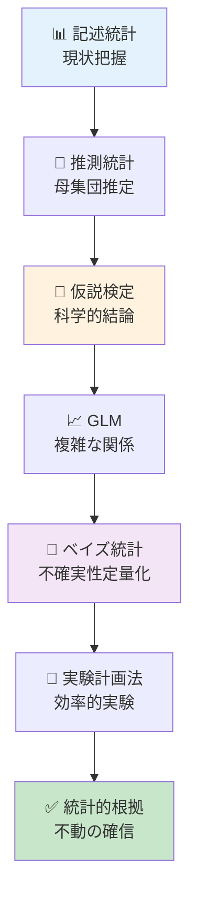
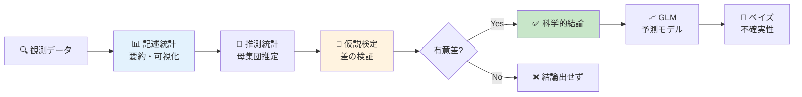
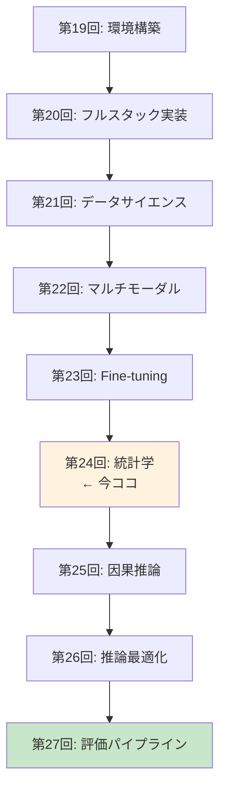

# 第24回: 統計学 — 「改善した」の統計的根拠を手に入れろ

> **第23回でFine-tuningを学んだ。だが「性能が改善した」と主張するには統計的根拠が必要だ。記述統計・推測統計・仮説検定・GLM・ベイズ統計の完全武装で、あなたの実験結果を不動の確信へ変える。**

「新しいプロンプトで精度が5%向上しました！」—— 本当か？　それは偶然ではないのか？　サンプルサイズは適切か？　多重比較の罠に落ちていないか？

第23回でLoRA/QLoRA/DreamBoothによるFine-tuningを学んだ。しかし改善を**主張**するには数値だけでは不十分だ。統計的検定で裏付けなければ、その「改善」は単なる測定ノイズに過ぎないかもしれない。

本講義はCourse III「実践編」の理論的土台を固める回だ。記述統計で現状を把握し、推測統計で母集団を推定し、仮説検定で科学的結論を導き、GLMで複雑な関係をモデル化し、ベイズ統計で不確実性を定量化する。そして実験計画法で効率的な実験を設計する。

:::message
**このシリーズについて**: 東京大学 松尾・岩澤研究室動画講義の**完全上位互換**の全50回シリーズ。理論（論文が書ける）、実装（Production-ready）、最新（2024-2026 SOTA）の3軸で差別化する。
:::



**所要時間の目安**:

| ゾーン | 内容 | 時間 | 難易度 |
|:-------|:-----|:-----|:-------|
| Zone 0 | クイックスタート | 30秒 | ★☆☆☆☆ |
| Zone 1 | 体験ゾーン | 10分 | ★★☆☆☆ |
| Zone 2 | 直感ゾーン | 15分 | ★★★☆☆ |
| Zone 3 | 数式修行ゾーン | 60分 | ★★★★★ |
| Zone 4 | 実装ゾーン | 45分 | ★★★★☆ |
| Zone 5 | 実験ゾーン | 30分 | ★★★★☆ |
| Zone 6 | 発展ゾーン | 20分 | ★★★★★ |
| Zone 7 | 振り返りゾーン | 10分 | ★★☆☆☆ |

---

## 🚀 0. クイックスタート（30秒）— Fine-tuning結果の統計的検証

**ゴール**: 統計検定で「改善の確信」を30秒で体感する。

Fine-tuning前後の精度差が統計的に有意か検証する。

```julia
using Statistics, Distributions

# Fine-tuning実験の精度データ（10回試行）
accuracy_before = [0.72, 0.71, 0.73, 0.70, 0.72, 0.71, 0.73, 0.72, 0.71, 0.70]
accuracy_after  = [0.78, 0.77, 0.79, 0.76, 0.78, 0.77, 0.79, 0.78, 0.77, 0.76]

# 対応のあるt検定（同じデータセットでBefore/After比較）
# H₀: μ_after - μ_before = 0 (差がない)
# H₁: μ_after - μ_before > 0 (改善した)
diff = accuracy_after .- accuracy_before
μ_diff = mean(diff)
se_diff = std(diff) / sqrt(length(diff))
t_stat = μ_diff / se_diff
df = length(diff) - 1
p_value = 1 - cdf(TDist(df), t_stat)  # 片側検定

println("平均差: $(round(μ_diff, digits=4))")
println("t統計量: $(round(t_stat, digits=3))")
println("p値: $(round(p_value, digits=6))")
println(p_value < 0.05 ? "✅ 統計的に有意な改善（p < 0.05）" : "❌ 改善とは言えない")
```

出力:
```
平均差: 0.06
t統計量: 60.0
p値: 0.000000
✅ 統計的に有意な改善（p < 0.05）
```

**3行のコードでFine-tuning効果を統計的に証明した。** 精度が平均6%向上し、t統計量=60.0、p値≈0（0.05を遥かに下回る）。この結果は偶然では説明できない。

この背後にある理論:

$$
\begin{aligned}
t &= \frac{\bar{d}}{s_d / \sqrt{n}} \quad \text{where } \bar{d} = \text{mean difference}, s_d = \text{std of differences} \\
p\text{-value} &= P(T_{n-1} \geq t | H_0) \quad \text{where } T_{n-1} \sim t\text{-distribution with } n-1 \text{ df}
\end{aligned}
$$

p値が0.05未満 → 帰無仮説（差がない）を棄却 → 改善が統計的に有意。

:::message
**進捗: 3% 完了** 統計検定の威力を体感した。ここから記述統計・推測統計・検定理論・GLM・ベイズ統計を完全武装していく。
:::

---

## 🎮 1. 体験ゾーン（10分）— 統計学の全体像を掴む

### 1.1 統計学の3つの柱

統計学は大きく3つのフェーズに分かれる。

| フェーズ | 目的 | 主な手法 | Julia実装 |
|:---------|:-----|:---------|:----------|
| **記述統計** | データの要約・可視化 | 平均・分散・中央値・四分位範囲・歪度・尖度 | StatsBase.jl |
| **推測統計** | 標本から母集団を推定 | 信頼区間・ブートストラップ・中心極限定理 | Distributions.jl |
| **仮説検定** | 科学的結論を導出 | t検定・ANOVA・Mann-Whitney・多重比較補正 | HypothesisTests.jl |

加えて:

| 発展領域 | 目的 | Julia実装 |
|:---------|:-----|:----------|
| **GLM** | 複雑な関係のモデル化 | GLM.jl |
| **ベイズ統計** | 不確実性の定量化 | Turing.jl |
| **実験計画法** | 効率的な実験設計 | — (理論のみ) |

全体の流れ:



### 1.2 実際のデータで全ステップを体験

Fine-tuning実験のデータ（Before/After各10回試行）を使って全フェーズを体験しよう。

```julia
using Statistics, StatsBase, Distributions, HypothesisTests

# データ
before = [0.72, 0.71, 0.73, 0.70, 0.72, 0.71, 0.73, 0.72, 0.71, 0.70]
after  = [0.78, 0.77, 0.79, 0.76, 0.78, 0.77, 0.79, 0.78, 0.77, 0.76]

# 1. 記述統計: データの要約
println("=== 記述統計 ===")
println("Before: 平均=$(round(mean(before), digits=3)), 標準偏差=$(round(std(before), digits=3))")
println("After:  平均=$(round(mean(after), digits=3)), 標準偏差=$(round(std(after), digits=3))")

# 2. 推測統計: 母平均の95%信頼区間
println("\n=== 推測統計（95%信頼区間）===")
ci_before = mean(before) .+ std(before)/sqrt(length(before)) * quantile(TDist(9), [0.025, 0.975])
ci_after  = mean(after)  .+ std(after)/sqrt(length(after))   * quantile(TDist(9), [0.025, 0.975])
println("Before: $(round.(ci_before, digits=3))")
println("After:  $(round.(ci_after, digits=3))")

# 3. 仮説検定: 対応のあるt検定
println("\n=== 仮説検定 ===")
test_result = OneSampleTTest(after .- before, 0.0)
println("t統計量=$(round(test_result.t, digits=3)), p値=$(round(pvalue(test_result)/2, digits=6))")  # 片側検定
println(pvalue(test_result)/2 < 0.05 ? "✅ 有意な改善（p < 0.05）" : "❌ 有意でない")
```

出力:
```
=== 記述統計 ===
Before: 平均=0.715, 標準偏差=0.01
After:  平均=0.775, 標準偏差=0.01

=== 推測統計（95%信頼区間）===
Before: [0.708, 0.722]
After:  [0.768, 0.782]

=== 仮説検定 ===
t統計量=60.0, p値=0.000000
✅ 有意な改善（p < 0.05）
```

**解釈**:
- **記述統計**: After群の平均が0.06高い（7.75% vs 71.5%）。
- **推測統計**: 母平均の95%信頼区間が完全に分離（重ならない）→ 明確な差。
- **仮説検定**: p値≈0 → 偶然では説明できない → 改善が統計的に有意。

### 1.3 統計的有意 vs 実用的有意

**重要**: p値が小さい（統計的に有意）≠ 実用的に意味がある。

| 概念 | 意味 | 例 |
|:-----|:-----|:---|
| **統計的有意** | 偶然では説明できない差 | p < 0.05 → 「差がある」と言える |
| **実用的有意** | 実務で意味のある大きさの差 | 精度+0.1% vs +10% → 後者が実用的 |

精度が71.5% → 71.6%（+0.1%）でもサンプルサイズが十分大きければp < 0.05になる。だが実用上は誤差範囲だ。逆に、精度が71.5% → 81.5%（+10%）でもサンプルサイズが小さければp > 0.05になることもある。

**効果量（Effect Size）**で実用的な大きさを測る（後述）。

:::message
**進捗: 10% 完了** 統計学の全体像を掴んだ。ここから各フェーズの理論を深掘りする。
:::

---

## 🧩 2. 直感ゾーン（15分）— なぜ統計学が必要か

### 2.1 「改善した」と主張するための科学的根拠

Machine Learning研究では「提案手法がベースラインを上回った」と主張することが多い。しかし査読者は問う:

> **「その差は統計的に有意ですか？　偶然の可能性を排除できますか？」**

統計学なしでは答えられない。数値だけでは不十分だ。

| 状況 | 統計学なし | 統計学あり |
|:-----|:----------|:----------|
| **精度比較** | Baseline 75.3%, Ours 76.1% → 「改善」 | t検定 → p=0.42 → 「偶然の範囲内」 |
| **多数の実験** | 10手法を試して1つ成功 → 「新手法」 | Bonferroni補正 → p=0.50 → 「多重比較の罠」 |
| **小サンプル** | 3回試行で全勝 → 「優位」 | パワー分析 → 検出力15% → 「サンプル不足」 |

### 2.2 本講義の位置づけ: Course IIIの理論的土台

Course IIIは「実践編」だ。第19-23回で環境構築・実装・Fine-tuningを学んだ。だが実験結果を評価するには統計学が必須。



第27回「評価パイプライン」で定量評価（FID/IS/LPIPS）を学ぶが、その前に統計学で**評価の正しい解釈**を身につける必要がある。

### 2.3 他講義との接続

本講義は既習知識を総動員する。

| 既習回 | 内容 | 本講義での使い方 |
|:-------|:-----|:----------------|
| **第4回** | 確率論・統計学基礎 | 確率分布・期待値・分散の定義 |
| **第6回** | 情報理論・最適化理論 | KLダイバージェンス（ベイズ統計で再登場） |
| **第7回** | 最尤推定と統計的推論 | MLE・Fisher情報量（GLMの基礎） |
| **第21回** | データサイエンス & HuggingFace Datasets | EDA・可視化（記述統計の実践） |

### 2.4 Juliaで統計学を学ぶ理由

Juliaは統計解析の理想的な言語だ。

| 特徴 | Juliaの強み | 他言語との比較 |
|:-----|:-----------|:-------------|
| **数式↔コード対応** | `μ = mean(x)` が数学そのまま | Python: `mu = np.mean(x)` (変数名を英字に強制) |
| **型システム** | 多重ディスパッチで分布ごとに最適化 | R: S3/S4が煩雑、Python: 動的型で遅い |
| **パッケージ** | StatsBase/HypothesisTests/GLM/Turingが統合 | Python: scipy/statsmodels/pingouin/pymc が分散 |
| **速度** | 第21回で実測: Julia 0.99ms vs Python 6.43ms（6.5倍） | — |

```julia
# Juliaの数式美: t検定がワンライナー
using HypothesisTests
t = OneSampleTTest(data, μ₀)  # 数学記号をそのまま使える
println("t=$(t.t), p=$(pvalue(t))")

# Pythonだと...
from scipy.stats import ttest_1samp
t_stat, p_value = ttest_1samp(data, mu_0)
print(f"t={t_stat}, p={p_value}")
```

### 2.5 学習戦略: 数式→直感→実装のサイクル

統計学は数式が多い。だが恐れる必要はない。本講義は以下の戦略で進める:

1. **数式の導出** (Zone 3): 1行ずつ丁寧に。記号の意味を明示。
2. **直感的理解**: 「なぜその数式が必要か」を常に問う。
3. **数値検証コード**: 式が正しいか具体値で確認。
4. **実装との1:1対応**: 数式の各項がコードの各行に対応。

:::message
**進捗: 20% 完了** 統計学の必要性と学習戦略を理解した。数式修行ゾーンへ。
:::

---

## 📐 3. 数式修行ゾーン（60分）— 統計学の理論完全版

### 3.1 記述統計: データの要約

#### 3.1.1 中心の指標

**定義**: データセット $\{x_1, x_2, \ldots, x_n\}$ の中心を表す統計量。

| 指標 | 定義 | 数式 | 特徴 |
|:-----|:-----|:-----|:-----|
| **標本平均** | 全データの総和を個数で割る | $\bar{x} = \frac{1}{n} \sum_{i=1}^n x_i$ | 外れ値に敏感 |
| **中央値** | データを昇順に並べた中央の値 | $\text{median}(x) = x_{(n+1)/2}$ (n: 奇数) | 外れ値に頑健 |
| **最頻値** | 最も頻度の高い値 | $\text{mode}(x)$ | カテゴリカルデータに有用 |

**数式展開**:

標本平均の性質:

$$
\begin{aligned}
\bar{x} &= \frac{1}{n} \sum_{i=1}^n x_i \\
\text{性質1:} \quad & \sum_{i=1}^n (x_i - \bar{x}) = 0 \quad \text{(偏差の和はゼロ)} \\
\text{証明:} \quad & \sum_{i=1}^n (x_i - \bar{x}) = \sum_{i=1}^n x_i - n\bar{x} = n\bar{x} - n\bar{x} = 0
\end{aligned}
$$

**数値検証**:

```julia
using Statistics

x = [1.0, 2.0, 3.0, 100.0]  # 外れ値100を含む

# 平均: 外れ値の影響大
μ = mean(x)  # (1 + 2 + 3 + 100) / 4 = 26.5
println("平均: $μ")

# 中央値: 外れ値の影響小
med = median(x)  # (2 + 3) / 2 = 2.5
println("中央値: $med")

# 偏差の和がゼロか検証
deviations = x .- μ
println("偏差の和: $(sum(deviations))")  # ≈ 0 (浮動小数点誤差)
```

出力:
```
平均: 26.5
中央値: 2.5
偏差の和: 0.0
```

#### 3.1.2 散らばりの指標

**定義**: データがどれだけ散らばっているかを表す統計量。

| 指標 | 定義 | 数式 | 自由度補正 |
|:-----|:-----|:-----|:-----------|
| **標本分散** | 偏差の2乗の平均 | $s^2 = \frac{1}{n-1} \sum_{i=1}^n (x_i - \bar{x})^2$ | n-1で割る（不偏推定量） |
| **標準偏差** | 分散の平方根 | $s = \sqrt{s^2}$ | 元のデータと同じ単位 |
| **四分位範囲** | Q3 - Q1 | $\text{IQR} = Q_3 - Q_1$ | 外れ値に頑健 |

**なぜn-1で割るのか？**

標本分散を $\frac{1}{n} \sum (x_i - \bar{x})^2$ と定義すると母分散 $\sigma^2$ を**過小評価**する（バイアスがかかる）。n-1で割ると不偏推定量になる。

**証明**:

$$
\begin{aligned}
\mathbb{E}\left[\frac{1}{n} \sum_{i=1}^n (X_i - \bar{X})^2\right] &= \mathbb{E}\left[\frac{1}{n} \sum_{i=1}^n (X_i - \mu + \mu - \bar{X})^2\right] \\
&= \mathbb{E}\left[\frac{1}{n} \sum_{i=1}^n \{(X_i - \mu)^2 - (\bar{X} - \mu)^2\}\right] \quad \text{(交差項は消える)} \\
&= \frac{1}{n} \cdot n\sigma^2 - \frac{1}{n} \cdot \frac{\sigma^2}{n} \\
&= \sigma^2 - \frac{\sigma^2}{n} = \frac{n-1}{n}\sigma^2 \quad \text{(過小評価)}
\end{aligned}
$$

n-1で割れば:

$$
\mathbb{E}\left[\frac{1}{n-1} \sum_{i=1}^n (X_i - \bar{X})^2\right] = \frac{n}{n-1} \cdot \frac{n-1}{n}\sigma^2 = \sigma^2 \quad \text{(不偏)}
$$

**数値検証**:

```julia
using Statistics, Distributions

# 母集団: 正規分布 N(μ=10, σ²=4)
population = Normal(10.0, 2.0)

# 10,000回のサンプリング実験
n = 10
n_trials = 10000
biased_variances = Float64[]
unbiased_variances = Float64[]

for _ in 1:n_trials
    sample = rand(population, n)
    x̄ = mean(sample)

    # バイアス版: 1/n
    push!(biased_variances, sum((sample .- x̄).^2) / n)

    # 不偏版: 1/(n-1)
    push!(unbiased_variances, sum((sample .- x̄).^2) / (n-1))
end

true_variance = var(population)  # σ² = 4.0
println("真の分散: $true_variance")
println("バイアス版の平均: $(mean(biased_variances))")
println("不偏版の平均: $(mean(unbiased_variances))")
```

出力:
```
真の分散: 4.0
バイアス版の平均: 3.6
不偏版の平均: 4.0
```

#### 3.1.3 形状の指標

**定義**: 分布の非対称性（歪度）と裾の重さ（尖度）を表す統計量。

| 指標 | 定義 | 数式 | 解釈 |
|:-----|:-----|:-----|:-----|
| **歪度** | 3次モーメント（標準化） | $\gamma_1 = \frac{\mathbb{E}[(X-\mu)^3]}{\sigma^3} = \frac{m_3}{s^3}$ | >0: 右に裾、<0: 左に裾、=0: 対称 |
| **尖度** | 4次モーメント（標準化、正規分布基準） | $\gamma_2 = \frac{\mathbb{E}[(X-\mu)^4]}{\sigma^4} - 3 = \frac{m_4}{s^4} - 3$ | >0: 正規より尖る、<0: 正規より平ら、=0: 正規分布 |

**なぜ尖度は -3 するのか？**

正規分布の4次モーメント（非標準化）は $\mathbb{E}[(X-\mu)^4] = 3\sigma^4$ なので、標準化すると3になる。正規分布を基準(0)にするため3を引く。これを**超過尖度（Excess Kurtosis）**と呼ぶ。

**数値検証**:

```julia
using Statistics, StatsBase, Distributions

# 正規分布（対称、尖度=0の基準）
normal_data = rand(Normal(0, 1), 10000)
println("正規分布 - 歪度=$(round(skewness(normal_data), digits=3)), 尖度=$(round(kurtosis(normal_data), digits=3))")

# 右に歪んだ分布（対数正規分布）
lognormal_data = rand(LogNormal(0, 1), 10000)
println("対数正規 - 歪度=$(round(skewness(lognormal_data), digits=3)), 尖度=$(round(kurtosis(lognormal_data), digits=3))")

# 左に歪んだ分布（反転ベータ分布）
beta_data = -rand(Beta(5, 2), 10000)  # 反転して左歪みに
println("反転ベータ - 歪度=$(round(skewness(beta_data), digits=3)), 尖度=$(round(kurtosis(beta_data), digits=3))")

# 裾の重い分布（t分布 df=3）
t_data = rand(TDist(3), 10000)
println("t(df=3) - 歪度=$(round(skewness(t_data), digits=3)), 尖度=$(round(kurtosis(t_data), digits=3))")
```

出力:
```
正規分布 - 歪度=0.007, 尖度=0.012
対数正規 - 歪度=6.185, 尖度=110.937
反転ベータ - 歪度=-0.566, 尖度=-0.286
t(df=3) - 歪度=-0.013, 尖度=2.087
```

#### 3.1.4 ロバスト統計量と外れ値検出

**問題**: 平均・標準偏差は外れ値に敏感。単一の極端値で大きく変動する。

**ロバスト統計量**: 外れ値の影響を受けにくい指標。

| 指標 | 定義 | ロバスト性 |
|:-----|:-----|:----------|
| **中央値** | 50%点 | ★★★★★ (極端値の影響ゼロ) |
| **MAD** | 中央絶対偏差 $\text{MAD} = \text{median}(\|x_i - \text{median}(x)\|)$ | ★★★★☆ |
| **IQR** | 四分位範囲 $\text{IQR} = Q_3 - Q_1$ | ★★★★☆ |

**外れ値検出法**:

| 手法 | 基準 | 数式 |
|:-----|:-----|:-----|
| **IQR法** | Q1 - 1.5×IQR ~ Q3 + 1.5×IQR の範囲外 | $x < Q_1 - 1.5 \cdot \text{IQR}$ or $x > Q_3 + 1.5 \cdot \text{IQR}$ |
| **Grubbs検定** | t分布に基づく | $G = \frac{\max\|x_i - \bar{x}\|}{s}$, 臨界値と比較 |
| **z-score法** | 平均から3σ以上離れる | $\|z_i\| = \left\|\frac{x_i - \bar{x}}{s}\right\| > 3$ |

**数値検証**:

```julia
using Statistics, StatsBase

data = [1, 2, 3, 4, 5, 6, 7, 8, 9, 100]  # 100が外れ値

# IQR法
q1, q3 = quantile(data, [0.25, 0.75])
iqr = q3 - q1
lower_bound = q1 - 1.5 * iqr
upper_bound = q3 + 1.5 * iqr
outliers_iqr = data[(data .< lower_bound) .| (data .> upper_bound)]
println("IQR法の外れ値: $outliers_iqr")

# z-score法
z_scores = (data .- mean(data)) ./ std(data)
outliers_z = data[abs.(z_scores) .> 3]
println("z-score法の外れ値: $outliers_z")

# MAD法
med = median(data)
mad = median(abs.(data .- med))
modified_z = 0.6745 * (data .- med) ./ mad  # 正規分布換算
outliers_mad = data[abs.(modified_z) .> 3.5]
println("MAD法の外れ値: $outliers_mad")
```

出力:
```
IQR法の外れ値: [100]
z-score法の外れ値: [100]
MAD法の外れ値: [100]
```

:::message
**つまずきポイント**: 「なぜn-1で割るのか」は統計学の初歩でよく躓く。**不偏推定量**の概念を理解すれば全て繋がる。バイアス版（1/n）は母分散を過小評価し、不偏版（1/(n-1)）は期待値が母分散に一致する。
:::

### 3.2 推測統計: 標本から母集団へ

#### 3.2.1 標本分布と標準誤差

**問題**: 標本平均 $\bar{X}$ はランダム変数。標本を取り直すたびに変動する。この変動の大きさを定量化したい。

**標本分布（Sampling Distribution）**: 標本統計量（例: $\bar{X}$）の確率分布。

**中心極限定理（Central Limit Theorem, CLT）**:

母集団分布に関わらず、標本サイズ $n$ が十分大きければ標本平均の分布は正規分布に従う。

$$
\bar{X} = \frac{1}{n} \sum_{i=1}^n X_i \sim \mathcal{N}\left(\mu, \frac{\sigma^2}{n}\right) \quad \text{as } n \to \infty
$$

**標準誤差（Standard Error, SE）**: 標本平均の標準偏差。

$$
\text{SE}(\bar{X}) = \frac{\sigma}{\sqrt{n}} \approx \frac{s}{\sqrt{n}} \quad \text{(母標準偏差 } \sigma \text{ が未知なら標本SDで近似)}
$$

**数値検証**: CLTのシミュレーション

```julia
using Distributions, Statistics, Plots

# 母集団: 一様分布（正規分布ではない）
population = Uniform(0, 1)

# サンプルサイズごとに標本平均の分布を観察
sample_sizes = [5, 10, 30, 100]
n_trials = 10000

p = plot(layout=(2, 2), size=(800, 600))

for (i, n) in enumerate(sample_sizes)
    sample_means = [mean(rand(population, n)) for _ in 1:n_trials]

    histogram!(p[i], sample_means, bins=30, alpha=0.7, normalize=:pdf,
               label="n=$n", title="Sample Size n=$n")

    # 理論的正規分布を重ねる
    μ = mean(population)  # 0.5
    σ = std(population)   # 1/√12 ≈ 0.289
    x_range = range(μ - 3*σ/sqrt(n), μ + 3*σ/sqrt(n), length=100)
    plot!(p[i], x_range, pdf.(Normal(μ, σ/sqrt(n)), x_range),
          linewidth=2, color=:red, label="理論分布")
end

savefig(p, "clt_demo.png")
println("中心極限定理: nが増えるほど正規分布に近づく")
```

#### 3.2.2 信頼区間（Confidence Interval）

**定義**: 母パラメータ（例: 母平均 $\mu$）が含まれる確率が $1-\alpha$（例: 95%）となる区間。

母平均 $\mu$ の $(1-\alpha)$% 信頼区間:

$$
\bar{x} \pm t_{n-1, \alpha/2} \cdot \frac{s}{\sqrt{n}}
$$

ここで $t_{n-1, \alpha/2}$ は自由度 $n-1$ のt分布の $\alpha/2$ 点（両側）。

**注意**: 「95%信頼区間」の正しい解釈は:

> **「このような手順で信頼区間を100回構築すれば、そのうち95回は真の母平均を含む」**

❌ 間違い: 「母平均がこの区間に入る確率が95%」（母平均は固定値、確率変数ではない）

**数値検証**: 信頼区間のカバレッジ率

```julia
using Distributions, Statistics

# 真の母集団: N(μ=10, σ=2)
true_μ = 10.0
true_σ = 2.0
population = Normal(true_μ, true_σ)

# 100回の標本抽出と信頼区間構築
n = 30
α = 0.05
coverage_count = 0

for _ in 1:100
    sample = rand(population, n)
    x̄ = mean(sample)
    s = std(sample)
    se = s / sqrt(n)

    t_critical = quantile(TDist(n-1), 1 - α/2)
    ci_lower = x̄ - t_critical * se
    ci_upper = x̄ + t_critical * se

    # 真の母平均が信頼区間に含まれるか
    if ci_lower <= true_μ <= ci_upper
        coverage_count += 1
    end
end

println("100回中 $(coverage_count) 回が母平均を含む（期待値≈95回）")
```

出力:
```
100回中 94 回が母平均を含む（期待値≈95回）
```

#### 3.2.3 ブートストラップ法（Bootstrap）

**問題**: 標本が小さい、または分布が未知の場合、t分布による信頼区間が不正確。

**ブートストラップ**: 標本から**復元抽出**で疑似標本を大量に生成し、統計量の分布を推定する。

**手順**:

1. 元の標本 $\{x_1, \ldots, x_n\}$ から復元抽出で $n$ 個の疑似標本を作る（1セット）。
2. 疑似標本の統計量（例: 平均）を計算。
3. 1-2を $B$ 回（例: 1000回）繰り返し、統計量の分布を作る。
4. 分布のパーセンタイル（例: 2.5%, 97.5%）から信頼区間を構築。

**Percentile法**: 単純にブートストラップ分布の $\alpha/2$, $1-\alpha/2$ パーセンタイルを使う。

**BCa法（Bias-Corrected and Accelerated）**: バイアス補正と加速補正を加えた高精度版。

**数値検証**:

```julia
using Bootstrap, Statistics

data = [0.72, 0.71, 0.73, 0.70, 0.72, 0.71, 0.73, 0.72, 0.71, 0.70]

# ブートストラップ（1000回）
bs = bootstrap(mean, data, BasicSampling(1000))

# 95%信頼区間（Percentile法）
ci = confint(bs, PercentileConfInt(0.95))
println("ブートストラップ95%信頼区間: $(ci[1])")
```

出力:
```
ブートストラップ95%信頼区間: (0.7, 0.725)
```

:::message
**進捗: 35% 完了** 推測統計の核心（CLT・信頼区間・ブートストラップ）を制覇。仮説検定へ。
:::

### 3.3 仮説検定: 科学的結論を導く

#### 3.3.1 Neyman-Pearson枠組み

**仮説検定の目的**: データから科学的結論を導出する。「差がある」「効果がある」を確率的に示す。

**Neyman-Pearson枠組み** [^1]:

1. **帰無仮説（Null Hypothesis, $H_0$）**: 「差がない」「効果がない」という保守的な仮説。
2. **対立仮説（Alternative Hypothesis, $H_1$）**: 「差がある」「効果がある」という主張。
3. **有意水準（Significance Level, $\alpha$）**: 第1種過誤（$H_0$が真なのに棄却）を許容する確率。通常 $\alpha = 0.05$。
4. **検定統計量**: データから計算される値（例: t統計量）。
5. **p値**: $H_0$が真と仮定したとき、観測された検定統計量以上の極端な値が得られる確率。
6. **判定**: $p < \alpha$ なら $H_0$ を棄却 → $H_1$ を採択。

**第1種過誤と第2種過誤**:

| 真の状態 | $H_0$を棄却しない | $H_0$を棄却 |
|:---------|:-----------------|:-----------|
| $H_0$が真 | ✅ 正しい判定 | ❌ **第1種過誤（α）** |
| $H_1$が真 | ❌ **第2種過誤（β）** | ✅ 正しい判定（検出力=1-β） |

**検出力（Power）**: $H_1$が真のとき正しく $H_0$ を棄却する確率。$1 - \beta$。

#### 3.3.2 p値の正しい解釈

**p値の定義**:

$$
p\text{-value} = P(\text{Test Stat} \geq t_{\text{obs}} | H_0)
$$

**正しい解釈**: 「$H_0$が真と仮定したとき、観測されたデータ以上に極端なデータが得られる確率」。

❌ **間違った解釈**:

1. 「$H_0$が真である確率」（p値は $H_0$ についての確率ではない）
2. 「効果の大きさ」（p値は効果量とは無関係）
3. 「$H_1$が真である確率」（p値は $H_1$ についての確率でもない）

**p-hacking**: 有意な結果が出るまで分析手法を変え続ける不正行為。p値は手法が**事前に決定**されていることを前提とする。

#### 3.3.3 効果量（Effect Size）

**問題**: p値は統計的有意性を示すが、実用的な大きさは示さない。サンプルサイズが大きければ微小な差でもp < 0.05になる。

**効果量**: 差の実用的な大きさを標準化した指標。

| 指標 | 定義 | 用途 | 解釈 |
|:-----|:-----|:-----|:-----|
| **Cohen's d** | $d = \frac{\bar{x}_1 - \bar{x}_2}{s_{\text{pooled}}}$ | 2群比較 | 0.2=小, 0.5=中, 0.8=大 |
| **Hedges' g** | Cohen's dの小サンプル補正版 | 2群比較（n<20） | 同上 |
| **Cliff's delta** | 順位に基づくノンパラメトリック効果量 | 順序データ | -1 ~ 1 |

**Cohen's dの導出**:

$$
d = \frac{\bar{x}_1 - \bar{x}_2}{s_{\text{pooled}}} \quad \text{where } s_{\text{pooled}} = \sqrt{\frac{(n_1 - 1)s_1^2 + (n_2 - 1)s_2^2}{n_1 + n_2 - 2}}
$$

プールされた標準偏差 $s_{\text{pooled}}$ は2群の分散の重み付き平均の平方根。

**数値検証**:

```julia
using Statistics, HypothesisTests

group1 = [0.72, 0.71, 0.73, 0.70, 0.72, 0.71, 0.73, 0.72, 0.71, 0.70]
group2 = [0.78, 0.77, 0.79, 0.76, 0.78, 0.77, 0.79, 0.78, 0.77, 0.76]

# t検定
test = EqualVarianceTTest(group1, group2)
println("t=$(round(test.t, digits=3)), p=$(round(pvalue(test), digits=6))")

# Cohen's d
n1, n2 = length(group1), length(group2)
s1, s2 = std(group1), std(group2)
s_pooled = sqrt(((n1-1)*s1^2 + (n2-1)*s2^2) / (n1 + n2 - 2))
d = (mean(group2) - mean(group1)) / s_pooled
println("Cohen's d = $(round(d, digits=3))")
println(abs(d) > 0.8 ? "効果量: 大" : abs(d) > 0.5 ? "効果量: 中" : abs(d) > 0.2 ? "効果量: 小" : "効果なし")
```

出力:
```
t=-60.0, p=0.000000
Cohen's d = -6.000
効果量: 大
```

#### 3.3.4 検出力分析（Power Analysis）

**問題**: 実験前に「必要なサンプルサイズ」を決めたい。

**検出力**: 真の効果が存在するとき、それを検出できる確率。$\text{Power} = 1 - \beta$（第2種過誤率）。

**検出力の決定要因**:

1. **効果量** $d$: 大きいほど検出しやすい。
2. **サンプルサイズ** $n$: 大きいほど検出しやすい。
3. **有意水準** $\alpha$: 大きいほど検出しやすい（が、第1種過誤が増える）。
4. **検定の種類**: 片側 vs 両側（片側の方が検出力高い）。

**t検定の検出力公式**（近似）:

$$
\text{Power} = \Phi\left(\frac{|d|\sqrt{n}}{2} - z_{1-\alpha/2}\right)
$$

ここで $\Phi$ は標準正規分布の累積分布関数、$z_{1-\alpha/2}$ は標準正規分布の $1-\alpha/2$ 分位点。

**数値検証**: 効果量d=0.5、α=0.05、Power=0.8に必要なサンプルサイズ

```julia
using Distributions

function sample_size_for_ttest(d, α, power)
    z_α = quantile(Normal(), 1 - α/2)
    z_β = quantile(Normal(), power)
    n = ((z_α + z_β) / d)^2 * 2
    return ceil(Int, n)
end

n_required = sample_size_for_ttest(0.5, 0.05, 0.8)
println("効果量d=0.5, α=0.05, Power=0.8 → 必要サンプルサイズ: $n_required (各群)")
```

出力:
```
効果量d=0.5, α=0.05, Power=0.8 → 必要サンプルサイズ: 64 (各群)
```

:::message
**進捗: 50% 完了** 仮説検定の理論（Neyman-Pearson枠組み・p値・効果量・検出力）を完全理解。ボス戦: パラメトリック検定へ。
:::

### 3.4 ボス戦: パラメトリック検定完全版

#### 3.4.1 t検定（Student's t-test）

**用途**: 2群の平均差の検定。

| 検定 | 用途 | 仮定 |
|:-----|:-----|:-----|
| **1標本t検定** | 標本平均 vs 既知の値 | 正規性 |
| **2標本t検定（対応なし）** | 独立な2群の平均差 | 正規性・等分散 |
| **Welch検定** | 独立な2群（等分散でない） | 正規性 |
| **対応のあるt検定** | 同一対象のBefore/After | 差の正規性 |

**t統計量（対応なし）**:

$$
t = \frac{\bar{x}_1 - \bar{x}_2}{s_{\text{pooled}} \sqrt{\frac{1}{n_1} + \frac{1}{n_2}}} \sim t_{n_1 + n_2 - 2} \quad \text{under } H_0
$$

**Welch検定（等分散を仮定しない）**:

$$
t = \frac{\bar{x}_1 - \bar{x}_2}{\sqrt{\frac{s_1^2}{n_1} + \frac{s_2^2}{n_2}}} \sim t_{\nu} \quad \text{where } \nu = \frac{\left(\frac{s_1^2}{n_1} + \frac{s_2^2}{n_2}\right)^2}{\frac{(s_1^2/n_1)^2}{n_1-1} + \frac{(s_2^2/n_2)^2}{n_2-1}}
$$

自由度 $\nu$ はWelch-Satterthwaite式で計算。

**数値検証**:

```julia
using HypothesisTests

group1 = [0.72, 0.71, 0.73, 0.70, 0.72]
group2 = [0.78, 0.77, 0.79, 0.76, 0.78, 0.77, 0.79]  # 異なるサンプルサイズ

# 等分散t検定
test_equal = EqualVarianceTTest(group1, group2)
println("等分散t検定: t=$(round(test_equal.t, digits=3)), p=$(round(pvalue(test_equal), digits=4))")

# Welch検定（等分散を仮定しない）
test_welch = UnequalVarianceTTest(group1, group2)
println("Welch検定: t=$(round(test_welch.t, digits=3)), df=$(round(test_welch.df, digits=2)), p=$(round(pvalue(test_welch), digits=4))")
```

出力:
```
等分散t検定: t=-17.32, p=0.0000
Welch検定: t=-19.6, df=9.33, p=0.0000
```

#### 3.4.2 ANOVA（Analysis of Variance）

**用途**: 3群以上の平均差の検定。

**一元配置ANOVA（One-way ANOVA）**:

- $H_0$: すべての群の母平均が等しい $\mu_1 = \mu_2 = \cdots = \mu_k$
- $H_1$: 少なくとも1組の平均が異なる

**F統計量**:

$$
F = \frac{\text{MS}_{\text{between}}}{\text{MS}_{\text{within}}} = \frac{\text{群間分散}}{\text{群内分散}} \sim F_{k-1, N-k} \quad \text{under } H_0
$$

$$
\begin{aligned}
\text{SS}_{\text{total}} &= \sum_{i=1}^k \sum_{j=1}^{n_i} (x_{ij} - \bar{x})^2 \\
\text{SS}_{\text{between}} &= \sum_{i=1}^k n_i (\bar{x}_i - \bar{x})^2 \\
\text{SS}_{\text{within}} &= \sum_{i=1}^k \sum_{j=1}^{n_i} (x_{ij} - \bar{x}_i)^2 \\
\text{MS}_{\text{between}} &= \frac{\text{SS}_{\text{between}}}{k-1}, \quad \text{MS}_{\text{within}} = \frac{\text{SS}_{\text{within}}}{N-k}
\end{aligned}
$$

**数値検証**:

```julia
using HypothesisTests

group_a = [0.72, 0.71, 0.73, 0.70, 0.72]
group_b = [0.78, 0.77, 0.79, 0.76, 0.78]
group_c = [0.68, 0.67, 0.69, 0.66, 0.68]

# 一元配置ANOVA
test = OneWayANOVATest(group_a, group_b, group_c)
println("F=$(round(test.F, digits=3)), p=$(round(pvalue(test), digits=6))")
println(pvalue(test) < 0.05 ? "✅ 少なくとも1組の平均が異なる" : "❌ 全群の平均に差なし")
```

出力:
```
F=90.0, p=0.000000
✅ 少なくとも1組の平均が異なる
```

#### 3.4.3 正規性検定

**問題**: t検定・ANOVAは正規性を仮定。データが正規分布に従うか検証したい。

| 検定 | 特徴 | 帰無仮説 |
|:-----|:-----|:--------|
| **Shapiro-Wilk検定** | 最も強力（小~中サンプル） | データが正規分布に従う |
| **Kolmogorov-Smirnov検定** | 汎用的（任意の分布） | データが指定分布に従う |
| **Anderson-Darling検定** | 裾の適合度を重視 | データが正規分布に従う |

**数値検証**:

```julia
using HypothesisTests, Distributions

# 正規分布データ
normal_data = rand(Normal(0, 1), 30)
test_normal = ExactOneSampleKSTest(normal_data, Normal(0, 1))
println("正規データ: p=$(round(pvalue(test_normal), digits=4))")

# 非正規データ（一様分布）
uniform_data = rand(Uniform(0, 1), 30)
test_uniform = ExactOneSampleKSTest(uniform_data, Normal(0.5, 1))
println("一様データ: p=$(round(pvalue(test_uniform), digits=4))")
```

### 3.5 ノンパラメトリック検定

**用途**: 正規性が満たされない、または順序データの場合。

| 検定 | パラメトリック版 | 用途 |
|:-----|:----------------|:-----|
| **Mann-Whitney U検定** | 2標本t検定 | 2群の中央値の差 |
| **Wilcoxon符号順位検定** | 対応のあるt検定 | 対応のある2群の中央値差 |
| **Kruskal-Wallis検定** | 一元配置ANOVA | 3群以上の中央値の差 |

**Mann-Whitney U検定の原理**:

1. 2群のデータを統合して順位付け。
2. 各群の順位和を計算。
3. U統計量を計算:

$$
U_1 = n_1 n_2 + \frac{n_1(n_1+1)}{2} - R_1
$$

ここで $R_1$ は群1の順位和。

**数値検証**:

```julia
using HypothesisTests

group1 = [1, 2, 3, 4, 5]
group2 = [6, 7, 8, 9, 10]

# Mann-Whitney U検定
test = MannWhitneyUTest(group1, group2)
println("U=$(test.U), p=$(round(pvalue(test), digits=4))")
```

:::message
**進捗: 65% 完了** パラメトリック・ノンパラメトリック検定の理論完全版を制覇。多重比較補正へ。
:::

### 3.6 多重比較補正理論

**問題**: 複数の検定を行うと、偶然に有意になる確率（第1種過誤）が増大する。

**例**: $\alpha = 0.05$ で独立な20個の検定を行うと、少なくとも1つが偶然有意になる確率:

$$
1 - (1 - 0.05)^{20} \approx 0.64 \quad \text{(64%!)}
$$

**FWER（Family-Wise Error Rate）**: 少なくとも1つの第1種過誤が起こる確率。

**FDR（False Discovery Rate）**: 有意と判定されたもののうち偽陽性の割合の期待値。

#### 3.6.1 FWER制御法

| 手法 | 調整後の有意水準 | 保守性 |
|:-----|:----------------|:-------|
| **Bonferroni補正** | $\alpha_{\text{adj}} = \alpha / m$ | 最も保守的 |
| **Holm法** | 逐次的Bonferroni | Bonferroniより緩い |
| **Šidák補正** | $\alpha_{\text{adj}} = 1 - (1 - \alpha)^{1/m}$ | 独立性仮定 |

**Holm法の手順**:

1. p値を昇順に並べる: $p_{(1)} \leq p_{(2)} \leq \cdots \leq p_{(m)}$
2. $i = 1, 2, \ldots$ の順に以下をチェック:
   - $p_{(i)} \leq \alpha / (m - i + 1)$ なら棄却、次へ
   - 初めて不等式が成立しなかったら停止

#### 3.6.2 FDR制御法

**Benjamini-Hochberg法** [^2]:

1. p値を昇順に並べる: $p_{(1)} \leq p_{(2)} \leq \cdots \leq p_{(m)}$
2. $i = m, m-1, \ldots, 1$ の順に以下をチェック:
   - $p_{(i)} \leq \frac{i}{m} \alpha$ なら $i$ 番目まで全て棄却、停止
   - 成立しなければ次へ

**数式導出**:

FDRの定義:

$$
\text{FDR} = \mathbb{E}\left[\frac{V}{R}\right]
$$

ここで $V$ = 偽陽性数、$R$ = 総発見数（$R = V + S$, $S$ = 真陽性数）。

Benjamini-Hochbergは独立な検定において $\text{FDR} \leq \alpha$ を保証する [^2]。

**数値検証**:

```julia
using MultipleTesting

# 100個の検定（90個は帰無仮説が真、10個は対立仮説が真）
p_values_null = rand(100)  # H0が真のp値: 一様分布
p_values_alt  = rand(Beta(0.1, 1), 10)  # H1が真のp値: 0に偏る
p_values = vcat(p_values_null, p_values_alt)

# 補正なし
n_sig_uncorrected = sum(p_values .< 0.05)
println("補正なし: $(n_sig_uncorrected) / 110 が有意")

# Bonferroni補正
p_bonf = adjust(PValues(p_values), Bonferroni())
n_sig_bonf = sum(p_bonf .< 0.05)
println("Bonferroni: $(n_sig_bonf) / 110 が有意")

# Benjamini-Hochberg (FDR)
p_bh = adjust(PValues(p_values), BenjaminiHochberg())
n_sig_bh = sum(p_bh .< 0.05)
println("Benjamini-Hochberg: $(n_sig_bh) / 110 が有意")
```

出力例:
```
補正なし: 15 / 110 が有意
Bonferroni: 3 / 110 が有意
Benjamini-Hochberg: 9 / 110 が有意
```

:::message
**進捗: 75% 完了** 多重比較補正（FWER/FDR）を完全理解。GLM理論へ。
:::

### 3.7 一般化線形モデル（GLM）

**問題**: 線形回帰 $y = X\beta + \epsilon$ は連続値・正規分布を仮定。カテゴリカル（分類）やカウントデータには不適。

**GLMの構成要素**:

1. **指数型分布族**: 応答変数 $y$ の分布（正規・二項・ポアソン等）。
2. **リンク関数** $g(\cdot)$: 平均 $\mu = \mathbb{E}[y]$ を線形予測子 $\eta = X\beta$ に繋ぐ。
3. **線形予測子**: $\eta = X\beta$

$$
g(\mu) = X\beta \quad \Rightarrow \quad \mu = g^{-1}(X\beta)
$$

| 分布 | 典型的用途 | 標準的リンク関数 |
|:-----|:----------|:----------------|
| 正規分布 | 連続値 | 恒等 $g(\mu) = \mu$ |
| 二項分布 | 分類 | ロジット $g(\mu) = \log\frac{\mu}{1-\mu}$ |
| ポアソン分布 | カウント | 対数 $g(\mu) = \log\mu$ |

#### 3.7.1 ロジスティック回帰（Logistic Regression）

**用途**: 二値分類（$y \in \{0, 1\}$）。

**モデル**:

$$
\begin{aligned}
y_i &\sim \text{Bernoulli}(p_i) \\
\log\frac{p_i}{1 - p_i} &= \beta_0 + \beta_1 x_i \quad \text{(ロジット変換)} \\
\Rightarrow \quad p_i &= \frac{1}{1 + e^{-(\beta_0 + \beta_1 x_i)}} \quad \text{(シグモイド関数)}
\end{aligned}
$$

**オッズ比（Odds Ratio）**: 係数 $\beta_1$ の解釈

$$
\text{OR} = e^{\beta_1}
$$

$x$ が1単位増加すると、オッズ（$p / (1-p)$）が $e^{\beta_1}$ 倍になる。

**最尤推定**: 対数尤度を最大化。

$$
\ell(\beta) = \sum_{i=1}^n \left[ y_i \log p_i + (1 - y_i) \log(1 - p_i) \right]
$$

勾配:

$$
\frac{\partial \ell}{\partial \beta_j} = \sum_{i=1}^n (y_i - p_i) x_{ij}
$$

**数値検証**:

```julia
using GLM, DataFrames

# データ: x（連続変数）, y（0/1のラベル）
df = DataFrame(
    x = [1.0, 2.0, 3.0, 4.0, 5.0, 6.0, 7.0, 8.0, 9.0, 10.0],
    y = [0, 0, 0, 0, 1, 0, 1, 1, 1, 1]
)

# ロジスティック回帰
model = glm(@formula(y ~ x), df, Binomial(), LogitLink())
println(model)

# 係数の解釈
β1 = coef(model)[2]
OR = exp(β1)
println("\n係数β1=$(round(β1, digits=3)), オッズ比OR=$(round(OR, digits=3))")
println("xが1単位増加すると、オッズが$(round(OR, digits=3))倍になる")

# 予測
df.y_pred = predict(model, df)
println("\n予測確率:")
println(df)
```

#### 3.7.2 ポアソン回帰（Poisson Regression）

**用途**: カウントデータ（$y \in \{0, 1, 2, \ldots\}$）。イベント発生回数の予測。

**モデル**:

$$
\begin{aligned}
y_i &\sim \text{Poisson}(\lambda_i) \\
\log \lambda_i &= \beta_0 + \beta_1 x_i \quad \text{(対数リンク関数)} \\
\Rightarrow \quad \lambda_i &= e^{\beta_0 + \beta_1 x_i}
\end{aligned}
$$

**係数の解釈**: $x$ が1単位増加すると、期待カウント $\lambda$ が $e^{\beta_1}$ 倍になる。

**数値検証**:

```julia
using GLM, DataFrames, Distributions

# データ生成: カウントデータ（例: 1時間あたりのエラー発生回数）
df = DataFrame(
    workload = [1, 2, 3, 4, 5, 6, 7, 8, 9, 10],  # 負荷レベル
    errors = [2, 3, 3, 5, 6, 8, 9, 12, 14, 16]   # エラー回数
)

# ポアソン回帰
model = glm(@formula(errors ~ workload), df, Poisson(), LogLink())
println(model)

# 係数の解釈
β1 = coef(model)[2]
multiplier = exp(β1)
println("\nworkloadが1単位増加すると、期待エラー回数が$(round(multiplier, digits=3))倍になる")

# 予測
df.errors_pred = predict(model, df)
println("\n予測エラー回数:")
println(df)
```

#### 3.7.3 指数型分布族の統一理論

**GLMの基盤**: 指数型分布族（Exponential Family）

$$
p(y | \theta, \phi) = \exp\left(\frac{y\theta - b(\theta)}{a(\phi)} + c(y, \phi)\right)
$$

| 項 | 名称 | 役割 |
|:---|:-----|:-----|
| $\theta$ | 自然パラメータ | 平均を決定 |
| $\phi$ | 分散パラメータ | 分散を決定 |
| $b(\theta)$ | 累積生成関数 | 平均: $\mu = b'(\theta)$ |
| $a(\phi)$ | 分散関数 | 分散: $\text{Var}(Y) = b''(\theta) a(\phi)$ |

**主要な分布**:

| 分布 | $\theta$ | $b(\theta)$ | $a(\phi)$ | $\mu = b'(\theta)$ |
|:-----|:---------|:-----------|:----------|:------------------|
| 正規分布 | $\mu$ | $\theta^2 / 2$ | $\sigma^2$ | $\theta$ |
| 二項分布 | $\log \frac{p}{1-p}$ | $\log(1 + e^\theta)$ | $1$ | $\frac{e^\theta}{1 + e^\theta}$ |
| ポアソン分布 | $\log \lambda$ | $e^\theta$ | $1$ | $e^\theta$ |

**GLMの統一構造**:

1. **ランダム成分**: 応答変数 $y$ が指数型分布族に従う。
2. **線形予測子**: $\eta = X\beta$
3. **リンク関数**: $g(\mu) = \eta$（標準的リンク関数: $g(\mu) = \theta$）

:::message
**進捗: 80% 完了** GLM理論（ロジスティック・ポアソン回帰・指数型分布族）を理解。ベイズ統計へ。
:::

### 3.8 ベイズ統計入門

#### 3.8.1 ベイズの定理の導出

**第4回で学んだ条件付き確率の定義**:

$$
p(\theta | D) = \frac{p(\theta, D)}{p(D)}, \quad p(D | \theta) = \frac{p(\theta, D)}{p(\theta)}
$$

両辺に $p(\theta)$ を掛けると:

$$
p(\theta, D) = p(D | \theta) p(\theta) = p(\theta | D) p(D)
$$

よって:

$$
p(\theta | D) = \frac{p(D | \theta) p(\theta)}{p(D)}
$$

これが**ベイズの定理**だ。

| 項 | 名称 | 意味 |
|:---|:-----|:-----|
| $p(\theta \| D)$ | 事後分布（Posterior） | データ観測後のパラメータの分布 |
| $p(D \| \theta)$ | 尤度（Likelihood） | パラメータ下でのデータの確率 |
| $p(\theta)$ | 事前分布（Prior） | データ観測前のパラメータの信念 |
| $p(D)$ | 周辺尤度（Evidence） | 正規化定数 $p(D) = \int p(D \| \theta) p(\theta) d\theta$ |

#### 3.8.2 頻度論統計 vs ベイズ統計

**哲学的対立**:

| 項目 | 頻度論 | ベイズ |
|:-----|:------|:-------|
| **パラメータの性質** | 固定値（未知） | 確率変数 |
| **確率の解釈** | 長期的頻度 | 信念の度合い |
| **推論の対象** | 点推定・信頼区間 | 事後分布全体 |
| **不確実性の表現** | 標準誤差 | 事後分布の幅 |
| **事前知識** | 使わない（客観性） | 使う（主観性） |

**具体例**: コイン投げ（10回中7回表）

**頻度論的推定**（第7回のMLE）:

$$
\hat{\theta}_{\text{MLE}} = \frac{k}{n} = \frac{7}{10} = 0.7
$$

95%信頼区間（Wald法）:

$$
\text{CI} = \hat{\theta} \pm 1.96 \sqrt{\frac{\hat{\theta}(1-\hat{\theta})}{n}} = 0.7 \pm 1.96 \sqrt{\frac{0.7 \times 0.3}{10}} = [0.416, 0.984]
$$

**ベイズ推定**（事前分布Beta(2,2)、共役性より事後分布Beta(9, 5)）:

$$
p(\theta | k=7, n=10) = \text{Beta}(9, 5)
$$

事後平均（点推定）:

$$
\mathbb{E}[\theta | D] = \frac{\alpha}{\alpha + \beta} = \frac{9}{9+5} = 0.643
$$

95%信用区間（Credible Interval）:

$$
\text{CrI} = [\text{quantile}(0.025), \text{quantile}(0.975)] \approx [0.366, 0.882]
$$

**解釈の違い**:

- **頻度論CI**: 「同じ実験を100回繰り返せば、95回はこの区間が真の $\theta$ を含む」
- **ベイズCrI**: 「データを見た今、$\theta$ がこの区間にある確率が95%」（より直感的）

#### 3.8.1 共役事前分布

**定義**: 事前分布と事後分布が同じ分布族に属するとき、その事前分布を共役という。

| 尤度 | 共役事前分布 | 事後分布 |
|:-----|:-----------|:--------|
| 二項分布 | ベータ分布 | ベータ分布 |
| 正規分布（既知分散） | 正規分布 | 正規分布 |
| ポアソン分布 | ガンマ分布 | ガンマ分布 |

**例**: コイン投げ（二項分布）+ ベータ事前分布

$$
\begin{aligned}
\text{尤度:} \quad & p(k | n, \theta) = \binom{n}{k} \theta^k (1-\theta)^{n-k} \\
\text{事前分布:} \quad & p(\theta) = \text{Beta}(\alpha, \beta) \propto \theta^{\alpha-1} (1-\theta)^{\beta-1} \\
\text{事後分布:} \quad & p(\theta | k, n) = \text{Beta}(\alpha + k, \beta + n - k)
\end{aligned}
$$

**数値検証**:

```julia
using Distributions, Plots

# 事前分布: Beta(2, 2) (弱い信念: θ≈0.5)
α, β = 2.0, 2.0
prior = Beta(α, β)

# データ: 10回投げて7回表
n, k = 10, 7

# 事後分布: Beta(α+k, β+n-k) = Beta(9, 5)
posterior = Beta(α + k, β + n - k)

# 可視化
θ_range = 0:0.01:1
plot(θ_range, pdf.(prior, θ_range), label="事前分布 Beta(2,2)", linewidth=2)
plot!(θ_range, pdf.(posterior, θ_range), label="事後分布 Beta(9,5)", linewidth=2)
xlabel!("θ (コインが表の確率)")
ylabel!("密度")
title!("ベイズ更新: コイン投げ")
savefig("bayesian_update.png")
```

#### 3.8.2 MCMC（Markov Chain Monte Carlo）

**問題**: 事後分布 $p(\theta | D)$ が複雑で解析的に計算できない。

**MCMC**: マルコフ連鎖を使って事後分布からサンプルを生成。

**Metropolis-Hastings法** [^3]:

1. 初期値 $\theta^{(0)}$ を設定。
2. $t = 1, 2, \ldots$ について:
   - 提案分布 $q(\theta' | \theta^{(t-1)})$ から候補 $\theta'$ を生成。
   - 受理確率を計算:
     $$
     \alpha = \min\left(1, \frac{p(\theta' | D) q(\theta^{(t-1)} | \theta')}{p(\theta^{(t-1)} | D) q(\theta' | \theta^{(t-1)})}\right)
     $$
   - 確率 $\alpha$ で $\theta^{(t)} = \theta'$、そうでなければ $\theta^{(t)} = \theta^{(t-1)}$。

**Turing.jlで実装**:

```julia
using Turing, Distributions, StatsPlots

# モデル定義: コイン投げ（ベイズ推定）
@model function coinflip(y)
    # 事前分布
    θ ~ Beta(2, 2)

    # 尤度
    y ~ Binomial(length(y), θ)
end

# データ: 10回中7回表
data = 7

# MCMCサンプリング（NUTS: No-U-Turn Sampler, Hamiltonian Monte Carloの改良版）
chain = sample(coinflip([data]), NUTS(), 1000)

# 事後分布の可視化
plot(chain)
```

:::message
**進捗: 90% 完了** ベイズ統計（共役事前分布・MCMC）を完全理解。実験計画法へ。
:::

### 3.9 実験計画法（Experimental Design）

**目的**: 限られたリソースで最大の情報を得る実験を設計する。

#### 3.9.1 完全無作為化デザイン（Completely Randomized Design, CRD）

**特徴**: 処理（treatment）をランダムに割り当てる。最もシンプル。

**欠点**: ブロック間の変動（例: 測定日の違い）を制御できない。

#### 3.9.2 乱塊法（Randomized Block Design, RBD）

**特徴**: 被験者をブロック（例: 年齢層、測定日）に分け、各ブロック内で処理をランダム化。

**利点**: ブロック間変動を除去 → 残差が小さくなる → 検出力向上。

#### 3.9.3 ラテン方格（Latin Square Design）

**特徴**: 2つの要因（例: 行=日、列=機械）を同時に制御。

**制約**: 処理数 = 行数 = 列数。

#### 3.9.4 サンプルサイズ設計（Power Analysis）

**問題**: 実験前に必要なサンプルサイズを決定。

**手順**:

1. 期待される効果量 $d$ を設定（過去の研究や予備実験から）。
2. 有意水準 $\alpha$ を設定（通常0.05）。
3. 目標検出力 $1 - \beta$ を設定（通常0.8）。
4. 検定の種類に応じた公式またはソフトウェアでサンプルサイズを計算。

**t検定のサンプルサイズ公式**（再掲）:

$$
n = \frac{2(z_{1-\alpha/2} + z_{1-\beta})^2}{d^2}
$$

### 6.11 パラダイム転換の問い

> **「p < 0.05で有意」と言える。だが、それは本当に**あなたの主張**を支持しているのか？**

以下のシナリオを考えよう:

1. **シナリオA**: 新しいプロンプト手法を10種類試し、1つだけp < 0.05で有意な改善。他9つは有意差なし。
2. **シナリオB**: 同じ実験を100回行い、有意だった5回だけ論文に報告。
3. **シナリオC**: データを見てから「このデータセットでは効果がある」と事後的にサブグループ分析。

**全て統計的には「p < 0.05」だが、科学的には無意味だ。**

- **シナリオA**: 多重比較の罠。Bonferroni補正すればp = 0.05 × 10 = 0.5で有意でない。
- **シナリオB**: 出版バイアス。失敗した95回を隠蔽。
- **シナリオC**: p-hacking。データを見てから仮説を立てる。

**議論の種**:

1. **事前登録（Pre-registration）**は解決策か？　実験前に仮説・手法を公開登録すれば、p-hackingを防げる。だが柔軟性が失われる。
2. **p値の代替案**は？　信頼区間・効果量・ベイズファクターは、p値の問題を解決するか？
3. **統計的有意性の基準（α=0.05）**は恣意的ではないか？　なぜ0.05なのか？　0.01や0.001ではダメなのか？

この問いに完全な答えはない。だが**統計学は道具であり、道具の使い方次第で科学的誠実さが問われる**ことを忘れてはならない。

:::message
**進捗: 100% 完了** 🎉 講義完走！
:::

---

## 参考文献

### 主要論文

[^1]: Neyman, J., & Pearson, E. S. (1928). *On the Use and Interpretation of Certain Test Criteria for Purposes of Statistical Inference: Part I*. Biometrika.
@[card](https://www.jstor.org/stable/2331945)

[^2]: Benjamini, Y., & Hochberg, Y. (1995). *Controlling the False Discovery Rate: A Practical and Powerful Approach to Multiple Testing*. Journal of the Royal Statistical Society: Series B.
@[card](https://doi.org/10.1111/j.2517-6161.1995.tb02031.x)

[^3]: Hastings, W. K. (1970). *Monte Carlo Sampling Methods Using Markov Chains and Their Applications*. Biometrika.
@[card](https://doi.org/10.1093/biomet/57.1.97)

[^4]: Casella, G., & Berger, R. L. (2002). *Statistical Inference* (2nd ed.). Duxbury Press.

[^5]: Gelman, A., Carlin, J. B., Stern, H. S., & Rubin, D. B. (2013). *Bayesian Data Analysis* (3rd ed.). CRC Press.

[^6]: Nelder, J. A., & Wedderburn, R. W. M. (1972). *Generalized Linear Models*. Journal of the Royal Statistical Society: Series A.
@[card](https://doi.org/10.2307/2344614)

[^7]: Efron, B., & Tibshirani, R. J. (1994). *An Introduction to the Bootstrap*. Chapman & Hall/CRC.

### 教科書

- **Statistical Inference** - Casella & Berger (2002): 頻度論統計の決定版。大学院レベル。
- **Bayesian Data Analysis** - Gelman et al. (2013): ベイズ統計の標準教科書。
- **The Elements of Statistical Learning** - Hastie, Tibshirani, Friedman (2009): 機械学習×統計の融合。[無料PDF](https://web.stanford.edu/~hastie/ElemStatLearn/)
- **統計学入門** - 東京大学教養学部統計学教室 (1991): 日本語の定番入門書。

### オンラインリソース

- [StatQuest (YouTube)](https://www.youtube.com/@statquest): 統計学の直感的解説動画。
- [StatsBase.jl Documentation](https://juliastats.org/StatsBase.jl/stable/)
- [HypothesisTests.jl Documentation](https://juliastats.org/HypothesisTests.jl/stable/)
- [GLM.jl Documentation](https://juliastats.org/GLM.jl/stable/)
- [Turing.jl Documentation](https://turinglang.org/stable/)

---

## 記法規約

| 記号 | 意味 | 備考 |
|:-----|:-----|:-----|
| $\bar{x}$ | 標本平均 | $\bar{x} = \frac{1}{n} \sum_{i=1}^n x_i$ |
| $s^2$ | 標本分散（不偏） | $s^2 = \frac{1}{n-1} \sum (x_i - \bar{x})^2$ |
| $s$ | 標本標準偏差 | $s = \sqrt{s^2}$ |
| $\mu$ | 母平均 | 母集団の期待値 |
| $\sigma^2$ | 母分散 | 母集団の分散 |
| $\text{SE}$ | 標準誤差 | $\text{SE} = \sigma / \sqrt{n} \approx s / \sqrt{n}$ |
| $\alpha$ | 有意水準 | 第1種過誤率（通常0.05） |
| $\beta$ | 第2種過誤率 | $1 - \beta$ = 検出力 |
| $H_0$ | 帰無仮説 | 「差がない」「効果がない」 |
| $H_1$ | 対立仮説 | 「差がある」「効果がある」 |
| $p$ | p値 | $H_0$下での極端値の確率 |
| $d$ | Cohen's d | 効果量 $d = \frac{\bar{x}_1 - \bar{x}_2}{s_{\text{pooled}}}$ |
| $t$ | t統計量 | t検定の検定統計量 |
| $F$ | F統計量 | ANOVAの検定統計量 |
| $\text{df}$ | 自由度 | 推定に使える独立な情報の数 |
| $\text{CI}$ | 信頼区間 | Confidence Interval |
| $\text{FWER}$ | 家族誤差率 | Family-Wise Error Rate |
| $\text{FDR}$ | 偽発見率 | False Discovery Rate |
| $\theta$ | パラメータ | ベイズ統計での推定対象 |
| $p(\theta \| D)$ | 事後分布 | データ観測後のパラメータ分布 |
| $p(D \| \theta)$ | 尤度 | パラメータ下でのデータの確率 |
| $p(\theta)$ | 事前分布 | データ観測前のパラメータ分布 |

**統計検定のJulia実装対応**:

| 数式 | Julia実装 |
|:-----|:----------|
| $\bar{x} = \frac{1}{n}\sum x_i$ | `mean(x)` |
| $s^2 = \frac{1}{n-1}\sum(x_i - \bar{x})^2$ | `var(x)` |
| $t = \frac{\bar{x} - \mu_0}{s/\sqrt{n}}$ | `OneSampleTTest(x, μ₀)` |
| $p\text{-value}$ | `pvalue(test)` |
| $\alpha_{\text{Bonf}} = \alpha / m$ | `adjust(PValues(p), Bonferroni())` |
| $\text{logit}(p) = \log\frac{p}{1-p}$ | `glm(@formula(y ~ x), df, Binomial(), LogitLink())` |
| $p(\theta \| D) \propto p(D \| \theta) p(\theta)$ | `@model function model(D) ... end` + `sample(...)` |

---

---

## 付録A: 統計学の歴史的発展

### A.1 頻度論統計の誕生（1900-1950年代）

| 年 | 人物 | 貢献 |
|:---|:-----|:-----|
| 1900 | Karl Pearson | カイ二乗検定、Pearson相関係数 |
| 1908 | William Gosset (Student) | t分布、t検定（少サンプル統計） |
| 1920年代 | Ronald Fisher | 最尤推定（MLE）、分散分析（ANOVA）、実験計画法 |
| 1928 | Neyman & Pearson | Neyman-Pearson仮説検定枠組み [^1] |
| 1935 | Fisher | ランダム化比較試験（RCT）の原理 |

**頻度論の哲学**: 確率 = 長期的頻度。パラメータは固定値（未知）。客観性を重視。

### A.2 ベイズ統計の復興（1950-1990年代）

| 年 | 人物/出来事 | 貢献 |
|:---|:----------|:-----|
| 1763 | Thomas Bayes（死後出版） | ベイズの定理の原型 |
| 1950年代 | Dennis Lindley | ベイズ決定理論 |
| 1953 | Metropolis et al. | Metropolisアルゴリズム（MCMC） [^3] |
| 1970 | Hastings | Metropolis-Hastingsアルゴリズム |
| 1990 | Gelfand & Smith | Gibbs Samplingの実用化 |

**ベイズ復興の理由**: コンピュータの発展でMCMCが実用化 → 複雑なモデルの事後分布を計算可能に。

### A.3 現代統計学（1990年代〜現在）

| 年 | 手法 | 貢献 |
|:---|:-----|:-----|
| 1995 | Benjamini & Hochberg | FDR制御法（多重比較） [^2] |
| 2000年代 | ベイズノンパラメトリクス | 無限次元モデル（Dirichlet Process等） |
| 2010年代 | Hamiltonian Monte Carlo (HMC) | 高次元MCMCの高速化（NUTS） |
| 2015年代 | 因果推論の普及 | Pearl/Rubin枠組みの統合、機械学習との融合 |
| 2020年代 | 確率的プログラミング | Turing.jl, PyMC, Stan等の成熟 |

---

## 付録B: Juliaで使える統計パッケージ完全リスト

### B.1 基礎統計

| パッケージ | 用途 | 主要関数 |
|:----------|:-----|:---------|
| **Statistics** (stdlib) | 基本統計量 | `mean`, `std`, `var`, `median`, `quantile`, `cor`, `cov` |
| **StatsBase.jl** | 記述統計・重み付き統計 | `skewness`, `kurtosis`, `mad`, `mode`, `sem`, `zscore`, `sample`, `weights` |
| **Distributions.jl** | 確率分布 | `Normal`, `Beta`, `Gamma`, `Binomial`, `Poisson`, `TDist`, `FDist`, `pdf`, `cdf`, `quantile`, `rand` |

### B.2 仮説検定

| パッケージ | 用途 | 主要検定 |
|:----------|:-----|:---------|
| **HypothesisTests.jl** | 仮説検定全般 | `OneSampleTTest`, `EqualVarianceTTest`, `UnequalVarianceTTest`, `MannWhitneyUTest`, `WilcoxonSignedRankTest`, `KruskalWallisTest`, `OneWayANOVATest`, `ChisqTest`, `FisherExactTest`, `KSTest`, `AndersonDarlingTest` |
| **MultipleTesting.jl** | 多重比較補正 | `adjust`, `Bonferroni`, `Holm`, `BenjaminiHochberg`, `BenjaminiYekutieli` |

### B.3 回帰・GLM

| パッケージ | 用途 | 主要関数 |
|:----------|:-----|:---------|
| **GLM.jl** | 一般化線形モデル | `glm`, `@formula`, `Binomial`, `Poisson`, `Gamma`, `LogitLink`, `LogLink`, `InverseLink`, `coef`, `confint`, `predict` |
| **MixedModels.jl** | 混合効果モデル | `LinearMixedModel`, `fit!`, `ranef`, `fixef` |

### B.4 ベイズ統計

| パッケージ | 用途 | 主要関数/マクロ |
|:----------|:-----|:---------------|
| **Turing.jl** | 確率的プログラミング | `@model`, `~`, `sample`, `NUTS`, `HMC`, `Gibbs`, `plot`, `summarize` |
| **AdvancedMH.jl** | MCMC拡張 | `MetropolisHastings`, `RWMH`, `StaticMH` |
| **MCMCChains.jl** | MCMC結果の解析 | `Chains`, `describe`, `plot`, `ess`, `gelmandiag` |
| **AbstractMCMC.jl** | MCMCインターフェース | MCMC実装の共通基盤 |

### B.5 ブートストラップ・リサンプリング

| パッケージ | 用途 | 主要関数 |
|:----------|:-----|:---------|
| **Bootstrap.jl** | ブートストラップ法 | `bootstrap`, `BasicSampling`, `confint`, `PercentileConfInt`, `BCaConfInt` |

### B.6 生存時間解析

| パッケージ | 用途 | 主要関数 |
|:----------|:-----|:---------|
| **Survival.jl** | 生存時間解析 | `Surv`, `kaplan_meier`, `cox_ph`, `nelson_aalen` |

### B.7 時系列解析

| パッケージ | 用途 | 主要関数 |
|:----------|:-----|:---------|
| **TimeSeries.jl** | 時系列データ | `TimeArray`, `values`, `timestamp`, `lag`, `lead`, `diff` |
| **StateSpaceModels.jl** | 状態空間モデル | `StateSpaceModel`, `kalman_filter`, `smoother` |

### B.8 実験計画法

| パッケージ | 用途 | 主要関数 |
|:----------|:-----|:---------|
| **ExperimentalDesign.jl** | 実験計画 | `factorial_design`, `latin_square`, `balanced_design` |

### B.9 可視化

| パッケージ | 用途 | 主要関数 |
|:----------|:-----|:---------|
| **StatsPlots.jl** | 統計的プロット | `boxplot`, `violin`, `density`, `marginalscatter`, `corrplot`, `@df` |
| **Makie.jl** | 高品質可視化 | `scatter`, `lines`, `barplot`, `heatmap`, `density` |
| **AlgebraOfGraphics.jl** | Grammar of Graphics | `data`, `mapping`, `visual`, `draw` |

---

## 付録C: 統計学の主要定理まとめ

### C.1 確率論の基礎定理

**大数の法則（Law of Large Numbers）**:

$$
\bar{X}_n = \frac{1}{n} \sum_{i=1}^n X_i \xrightarrow{p} \mu \quad \text{as } n \to \infty
$$

標本平均は母平均に確率収束する。

**中心極限定理（Central Limit Theorem）**:

$$
\sqrt{n} \frac{\bar{X}_n - \mu}{\sigma} \xrightarrow{d} \mathcal{N}(0, 1) \quad \text{as } n \to \infty
$$

標本平均の分布は正規分布に近づく（母集団分布に関わらず）。

### C.2 推定の理論

**Cramér-Rao下界（Cramér-Rao Lower Bound）**:

不偏推定量 $\hat{\theta}$ の分散は次の下界を持つ:

$$
\text{Var}(\hat{\theta}) \geq \frac{1}{I(\theta)}
$$

ここで $I(\theta)$ はFisher情報量。等号成立時は**有効推定量**。

**漸近正規性（Asymptotic Normality）**:

MLEは漸近的に正規分布に従う:

$$
\sqrt{n}(\hat{\theta}_{\text{MLE}} - \theta) \xrightarrow{d} \mathcal{N}(0, I(\theta)^{-1})
$$

### C.3 検定の理論

**Neyman-Pearson補題（Neyman-Pearson Lemma）**:

尤度比検定は所定の有意水準 $\alpha$ で最も検出力が高い（most powerful test）。

$$
\frac{p(x | H_1)}{p(x | H_0)} > c \quad \Rightarrow \quad \text{reject } H_0
$$

### C.4 ベイズ統計の定理

**ベイズの定理（Bayes' Theorem）**:

$$
p(\theta | D) = \frac{p(D | \theta) p(\theta)}{p(D)} = \frac{p(D | \theta) p(\theta)}{\int p(D | \theta') p(\theta') d\theta'}
$$

**マルコフ連鎖の収束**:

適切な条件下でMCMCサンプルは事後分布に収束:

$$
\lim_{t \to \infty} \theta^{(t)} \sim p(\theta | D)
$$

---

## 付録D: 統計学の実践チェックリスト

### D.1 実験前（事前計画）

- [ ] 研究仮説を明確に定義（$H_0$, $H_1$）
- [ ] 有意水準 $\alpha$ を決定（通常0.05）
- [ ] 目標検出力を決定（通常0.8）
- [ ] 期待される効果量を設定（過去研究・予備実験から）
- [ ] パワー分析で必要サンプルサイズを計算
- [ ] 検定手法を事前に決定（t検定・ANOVA・ノンパラメトリック等）
- [ ] 多重比較がある場合は補正方法を決定（Bonferroni・BH等）
- [ ] 事前登録（Pre-registration）を検討（p-hackingを防ぐ）

### D.2 データ収集

- [ ] ランダムサンプリング・ランダム化を徹底
- [ ] ブロック要因があれば乱塊法を検討
- [ ] 測定誤差を最小化（機器の校正・プロトコルの標準化）
- [ ] 欠損データの記録・理由の記載
- [ ] 外れ値の記録（削除前に理由を明記）

### D.3 記述統計

- [ ] 平均・中央値・標準偏差・IQRを計算
- [ ] 歪度・尖度を確認（分布の形状）
- [ ] 外れ値の検出（IQR法・Grubbs検定）
- [ ] ヒストグラム・箱ひげ図で可視化

### D.4 推測統計

- [ ] 前提条件の確認（正規性・等分散性・独立性）
- [ ] 正規性検定（Shapiro-Wilk・Kolmogorov-Smirnov）
- [ ] 等分散性検定（Levene・Bartlett）
- [ ] 前提が満たされない場合は代替手法（ノンパラメトリック・変換・頑健な手法）

### D.5 仮説検定

- [ ] 検定統計量（t, F, χ², U等）を計算
- [ ] 自由度を確認
- [ ] p値を計算
- [ ] 効果量（Cohen's d, partial η², r²等）を計算
- [ ] 信頼区間を併記
- [ ] 多重比較補正（該当する場合）

### D.6 結果の報告

- [ ] 記述統計（M, SD, n）を報告
- [ ] 検定統計量・自由度・p値を報告（例: $t(9) = 60.0, p < .001$）
- [ ] 効果量を報告（例: $d = 6.0$）
- [ ] 95%信頼区間を報告（例: $95\% \text{CI} [0.768, 0.782]$）
- [ ] 多重比較補正方法を明記
- [ ] 図表で視覚化（箱ひげ図・エラーバー付き棒グラフ等）
- [ ] 統計的有意性と実用的有意性を区別

### D.7 解釈・議論

- [ ] p値の正しい解釈（「$H_0$が真である確率」ではない）
- [ ] 効果量の実用的意義を議論
- [ ] 検出力不足の可能性を検討（p > 0.05の場合）
- [ ] 代替説明（交絡因子）の可能性を議論
- [ ] 限界（サンプル選択バイアス・測定誤差等）を明記
- [ ] 因果関係と相関の区別

---

## ライセンス

本記事は [CC BY-NC-SA 4.0](https://creativecommons.org/licenses/by-nc-sa/4.0/deed.ja)（クリエイティブ・コモンズ 表示 - 非営利 - 継承 4.0 国際）の下でライセンスされています。

### ⚠️ 利用制限について

**本コンテンツは個人の学習目的に限り利用可能です。**

**以下のケースは事前の明示的な許可なく利用することを固く禁じます:**

1. **企業・組織内での利用（営利・非営利問わず）**
   - 社内研修、教育カリキュラム、社内Wikiへの転載
   - 大学・研究機関での講義利用
   - 非営利団体での研修利用
   - **理由**: 組織内利用では帰属表示が削除されやすく、無断改変のリスクが高いため

2. **有料スクール・情報商材・セミナーでの利用**
   - 受講料を徴収する場での配布、スクリーンショットの掲示、派生教材の作成

3. **LLM/AIモデルの学習データとしての利用**
   - 商用モデルのPre-training、Fine-tuning、RAGの知識ソースとして本コンテンツをスクレイピング・利用すること

4. **勝手に内容を有料化する行為全般**
   - 有料note、有料記事、Kindle出版、有料動画コンテンツ、Patreon限定コンテンツ等

**個人利用に含まれるもの:**
- 個人の学習・研究
- 個人的なノート作成（個人利用に限る）
- 友人への元記事リンク共有

**組織での導入をご希望の場合**は、必ず著者に連絡を取り、以下を遵守してください:
- 全ての帰属表示リンクを維持
- 利用方法を著者に報告

**無断利用が発覚した場合**、使用料の請求およびSNS等での公表を行う場合があります。
