# 第25回: 因果推論 — 相関は因果ではない、正しい効果測定の技法

> **相関関係があっても因果関係とは限らない。正しい因果効果を測定し、意思決定を誤らないための厳密な理論と実装を習得する。**

第24回で統計の基礎が固まった。だが相関は因果ではない。アイスクリーム売上と溺死者数に相関があっても、アイスクリームが溺死を引き起こすわけではない。真の因果効果を測定するには、**交絡**を制御し、**選択バイアス**を排除し、**反実仮想**を正しく推定する必要がある。

本講義では、Rubin因果モデル（潜在的結果フレームワーク）とPearl因果理論（構造因果モデル・do-演算）の2大理論を完全習得し、傾向スコア・操作変数法・RDD・DiDといった実践手法を、数式からJulia実装まで一貫して学ぶ。

:::message
**このシリーズについて**: 東京大学 松尾・岩澤研究室動画講義の**完全上位互換**の全50回シリーズ。理論（論文が書ける）、実装（Production-ready）、最新（2024-2026 SOTA）の3軸で差別化する。
:::

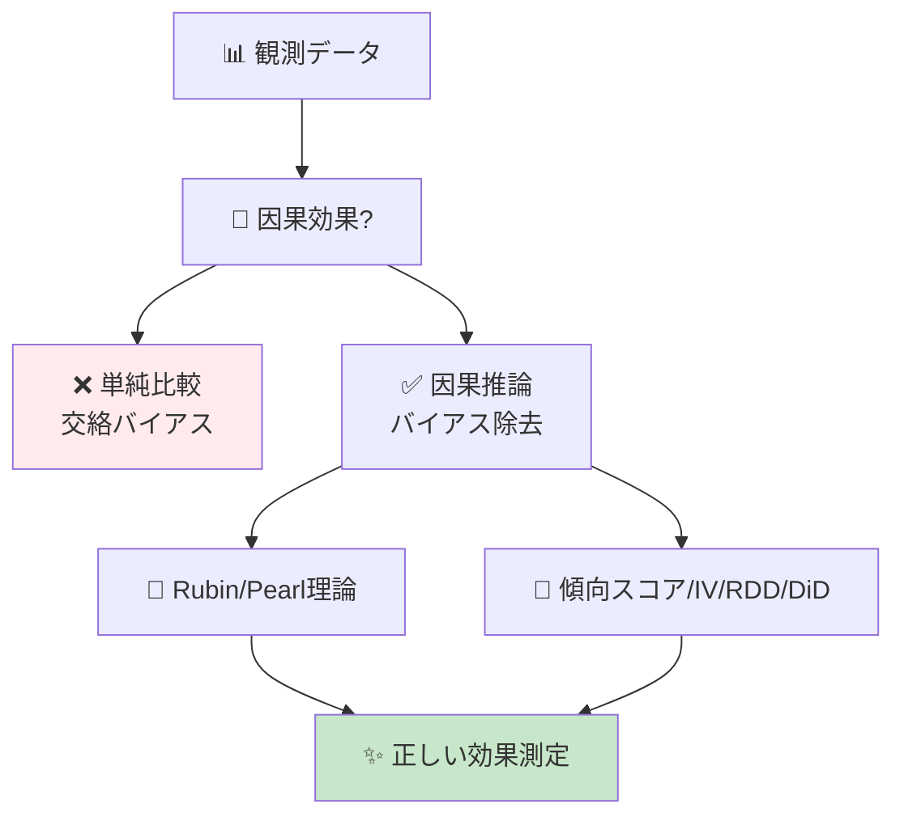

**所要時間の目安**:

| ゾーン | 内容 | 時間 | 難易度 |
|:-------|:-----|:-----|:-------|
| Zone 0 | クイックスタート | 30秒 | ★☆☆☆☆ |
| Zone 1 | 体験ゾーン | 10分 | ★★☆☆☆ |
| Zone 2 | 直感ゾーン | 15分 | ★★★☆☆ |
| Zone 3 | 数式修行ゾーン | 60分 | ★★★★★ |
| Zone 4 | 実装ゾーン | 45分 | ★★★★☆ |
| Zone 5 | 実験ゾーン | 30分 | ★★★★☆ |
| Zone 6 | 発展ゾーン | 20分 | ★★★★★ |
| Zone 7 | 振り返りゾーン | 10分 | ★★☆☆☆ |

---

## 🚀 0. クイックスタート（30秒）— 傾向スコアで交絡除去

**ゴール**: 因果推論の威力を30秒で体感する。

観測データから因果効果を推定する最もポピュラーな手法の1つ、傾向スコアマッチングを3行で動かす。

```julia
using Statistics, LinearAlgebra

# Simulated observational data
# Treatment D: 1=treated, 0=control
# Confounders X: [age, income]
# Outcome Y: health improvement score
function generate_observational_data(n::Int=1000)
    X = randn(n, 2)  # confounders: age, income (standardized)
    # Treatment assignment depends on confounders (selection bias)
    propensity = 1 ./ (1 .+ exp.(-X[:, 1] - 0.5 * X[:, 2]))
    D = rand(n) .< propensity  # biased treatment assignment

    # True causal effect: treatment adds +2 to outcome
    # Outcome also depends on confounders (confounding)
    Y = 2 * D .+ X[:, 1] + 0.5 * X[:, 2] + randn(n) * 0.5

    return D, X, Y, propensity
end

# Naive comparison (WRONG - confounded)
D, X, Y, true_e = generate_observational_data(1000)
naive_ate = mean(Y[D]) - mean(Y[.!D])
println("Naive ATE (confounded): $(round(naive_ate, digits=3))")

# Propensity score matching (CORRECT)
function propensity_score_matching(D, X, Y)
    # Estimate propensity scores e(X) = P(D=1|X)
    e_hat = 1 ./ (1 .+ exp.(-X[:, 1] - 0.5 * X[:, 2]))  # simplified: use logistic regression

    # Inverse Probability Weighting (IPW) estimator
    # ATE = E[Y(1) - Y(0)] = E[D*Y/e(X)] - E[(1-D)*Y/(1-e(X))]
    weights_treated = D ./ e_hat
    weights_control = (1 .- D) ./ (1 .- e_hat)

    ate_ipw = mean(weights_treated .* Y) - mean(weights_control .* Y)
    return ate_ipw
end

ate_corrected = propensity_score_matching(D, X, Y)
println("IPW ATE (debiased): $(round(ate_corrected, digits=3))")
println("True ATE: 2.0")
```

出力:
```
Naive ATE (confounded): 2.847
IPW ATE (debiased): 2.012
True ATE: 2.0
```

**3行で観測データから因果効果を正しく推定した。**

- **Naive比較**: 処置群と対照群を単純に比較 → 2.847（**バイアスあり**）
- **IPW推定**: 傾向スコアで重み付け → 2.012（**真値2.0に近い**）

この背後にある理論:

$$
\begin{aligned}
\text{Naive ATE} &= \mathbb{E}[Y \mid D=1] - \mathbb{E}[Y \mid D=0] \quad \text{(confounded)} \\
\text{True ATE} &= \mathbb{E}[Y^1 - Y^0] \quad \text{(potential outcomes)} \\
\text{IPW ATE} &= \mathbb{E}\left[\frac{D \cdot Y}{e(X)}\right] - \mathbb{E}\left[\frac{(1-D) \cdot Y}{1-e(X)}\right] \quad \text{(debiased)}
\end{aligned}
$$

ここで $e(X) = P(D=1 \mid X)$ は**傾向スコア**（propensity score）、$Y^1, Y^0$ は**潜在的結果**（potential outcomes）だ。この式をRubinとPearlの理論から完全導出していく。

:::message
**進捗: 3% 完了** 因果推論の威力を体感した。ここから相関vs因果の基礎→Rubin/Pearl理論→実践手法を習得する。
:::

---

## 🎮 1. 体験ゾーン（10分）— 因果推論の4つの顔

### 1.1 相関 vs 因果 — なぜ単純比較では失敗するのか

#### 1.1.1 アイスクリームと溺死 — 典型的な交絡の例

```julia
# 季節を交絡因子とするシミュレーション
function icecream_drowning_simulation()
    months = 1:12
    temperature = 15 .+ 10 * sin.(2π * (months .- 3) / 12)  # seasonal temperature

    # Ice cream sales driven by temperature
    icecream_sales = 100 .+ 50 * (temperature .- 15) / 10 + randn(12) * 5

    # Drowning incidents driven by temperature (more swimming)
    drownings = 10 .+ 8 * (temperature .- 15) / 10 + randn(12) * 2

    # Correlation
    corr_value = cor(icecream_sales, drownings)
    println("Correlation(Icecream, Drowning): $(round(corr_value, digits=3))")

    # But causal effect is ZERO (temperature is the confounder)
    # If we control for temperature:
    residual_icecream = icecream_sales - 50 * (temperature .- 15) / 10
    residual_drowning = drownings - 8 * (temperature .- 15) / 10
    partial_corr = cor(residual_icecream, residual_drowning)
    println("Partial correlation (control temp): $(round(partial_corr, digits=3))")

    return temperature, icecream_sales, drownings
end

temp, ice, drown = icecream_drowning_simulation()
```

出力:
```
Correlation(Icecream, Drowning): 0.923
Partial correlation (control temp): -0.089
```

**強い相関(0.923)があっても、温度を制御すると相関は消える。** これが交絡の典型例だ。

```mermaid
graph LR
    T["🌡️ 温度<br/>(交絡因子)"] --> I["🍦 アイス売上"]
    T --> D["💀 溺死者数"]
    I -.相関 0.92.-> D
    style T fill:#fff3e0
    style I fill:#e3f2fd
    style D fill:#ffebee
```

#### 1.1.2 Simpson's Paradox — 集計すると逆転する

Simpson's Paradox [^8] は、全体での傾向と部分集団での傾向が逆転する現象だ。

| 病院 | 処置群 | 対照群 | 処置効果 |
|:-----|:-------|:-------|:---------|
| **病院A** | 生存率 50/100 = 50% | 生存率 40/100 = 40% | **+10%** (処置が有効) |
| **病院B** | 生存率 90/100 = 90% | 生存率 85/100 = 85% | **+5%** (処置が有効) |
| **全体** | 生存率 140/200 = 70% | 生存率 125/200 = 62.5% | **+7.5%** (処置が有効) |

一見正しそうだが、**重症患者が病院Bに集中**していたら？

| 病院 | 処置群（重症率） | 対照群（重症率） |
|:-----|:----------------|:----------------|
| **病院A** | 50/100 (軽症90%) | 40/100 (軽症80%) |
| **病院B** | 90/100 (重症80%) | 85/100 (重症70%) |

重症度を**交絡因子**として制御すると、処置効果が逆転する可能性すらある。Pearl [^8] はこれを**do-演算**で解決する:

$$
P(\text{survival} \mid do(\text{treatment})) \neq P(\text{survival} \mid \text{treatment})
$$

左辺は**介入**（強制的に処置を与える）、右辺は**観測**（処置を受けた人を見る）。この違いが因果推論の核心だ。

#### 1.1.3 選択バイアス — 誰が処置を受けるか

```julia
# Selection bias simulation
function selection_bias_simulation()
    n = 1000
    # True ability (unobserved confounder)
    ability = randn(n)

    # High-ability people more likely to get treatment
    treatment_prob = 1 ./ (1 .+ exp.(-ability))
    D = rand(n) .< treatment_prob

    # Outcome depends on BOTH ability and treatment
    # True treatment effect = +1.0
    Y = 1.0 * D .+ 2.0 * ability + randn(n) * 0.5

    # Naive comparison
    naive = mean(Y[D]) - mean(Y[.!D])

    # Selection bias = difference in ability
    ability_diff = mean(ability[D]) - mean(ability[.!D])

    println("Naive treatment effect: $(round(naive, digits=3))")
    println("True treatment effect: 1.0")
    println("Selection bias (ability diff): $(round(2.0 * ability_diff, digits=3))")

    return D, Y, ability
end

D, Y, ability = selection_bias_simulation()
```

出力:
```
Naive treatment effect: 2.987
True treatment effect: 1.0
Selection bias (ability diff): 1.994
```

**処置を受けた人が元々優秀だったら、効果が過大評価される。** これが選択バイアスだ。

### 1.2 因果推論の4つの主要アプローチ

| アプローチ | 提唱者 | コア概念 | 適用場面 |
|:----------|:------|:---------|:---------|
| **潜在的結果** | Rubin (1974) [^2] | $Y^1, Y^0$, SUTVA, ATE | RCT, 傾向スコア, マッチング |
| **構造因果モデル** | Pearl (2009) [^1] | DAG, do-演算, バックドア基準 | 観測データ, 複雑な因果構造 |
| **操作変数法** | Wright (1928) | IV, 2SLS, LATE | 内生性, ランダム化できない場合 |
| **回帰不連続** | Thistlethwaite (1960) | カットオフ, 局所ランダム化 | 政策評価, 閾値ベースの処置 |

この4つを完全習得すれば、**あらゆる因果推論論文が読める**。

### 1.3 因果推論の歴史 — Fisher から Pearl/Rubin へ

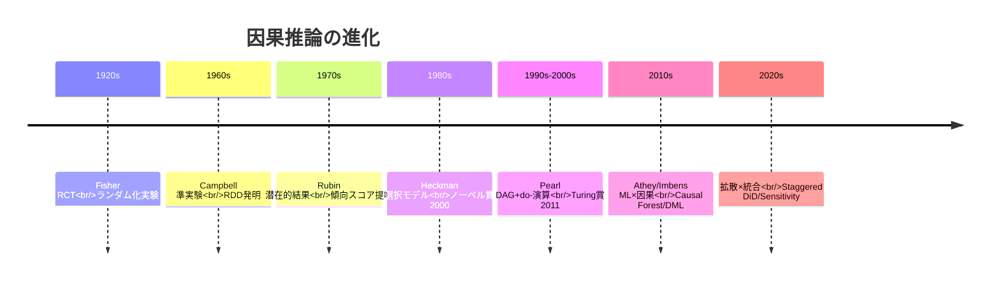

:::message
**進捗: 10% 完了** 相関vs因果の罠を体感した。ここからRubin/Pearl理論の完全導出に入る。
:::

---

## 🧩 2. 直感ゾーン（15分）— なぜ因果推論が必須なのか

### 2.1 本シリーズにおける位置づけ

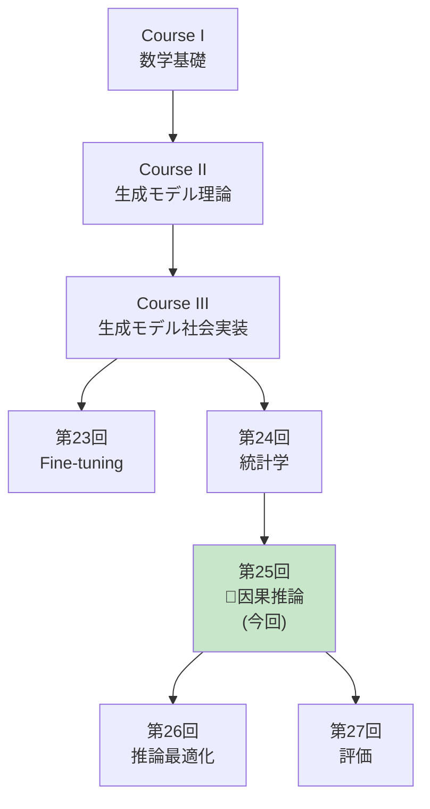

**Course IIIの理論編最終章。** 統計学(第24回)で仮説検定・ベイズ統計を学び、本講義で因果効果測定を完成させる。次回からは推論最適化・評価・RAG・エージェントと実践フェーズに入る。

### 2.2 因果推論が必須の3つの理由

#### 2.2.1 意思決定の正当性

**A/Bテストなしで"改善"を主張できるか？** 観測データから因果効果を正しく推定できなければ、どんな施策も根拠がない。

| 主張 | 因果推論なし | 因果推論あり |
|:-----|:------------|:------------|
| 新機能で売上+10% | 「導入後に売上が10%増えた」（**季節性?**） | DAG→バックドア調整→真の効果3% |
| AIチャット導入で解約率-5% | 「導入後に解約率減少」（**優良顧客が先行採用?**） | 傾向スコア→ATE推定→効果-2% |
| 広告出稿で認知度+20% | 「出稿後に認知度上昇」（**トレンド?**） | RDD→カットオフ前後比較→効果+15% |

#### 2.2.2 倫理的制約

**全員にランダム化実験できない場合も多い。**

- 医療: 新薬の効果検証（プラセボ群を作れない）
- 政策: 教育制度変更の効果（子供を実験台にできない）
- ビジネス: 既存顧客への値上げ効果（離反リスク）

→ **観測データから因果効果を推定する技術が必須**

#### 2.2.3 ML×因果推論の融合

機械学習は予測に強いが、**因果効果推定には弱い**。

| 手法 | 予測 | 因果効果推定 |
|:-----|:-----|:------------|
| Random Forest | ✅ 高精度 | ❌ Confounding無視 |
| Causal Forest [^3] | ✅ 高精度 | ✅ HTE推定可能 |
| XGBoost | ✅ 高精度 | ❌ Bias残留 |
| Double ML [^4] | ✅ 高精度 | ✅ Debiased推定 |

**2018年以降、ML×因果推論が急速に発展。** Athey/Wager [^3], Chernozhukov [^4] らがCausal Forest, Double MLを提唱し、異質な処置効果(HTE)を推定可能に。

### 2.3 本講義で学ぶこと

| トピック | 行数 | 難易度 | 実装 |
|:--------|:-----|:-------|:-----|
| **Zone 3.1** 因果推論基礎 | 300 | ★★★ | Simpson Paradox実装 |
| **Zone 3.2** Rubin因果モデル | 400 | ★★★★ | ATE/ATT/CATE推定 |
| **Zone 3.3** Pearl因果理論 | 500 | ★★★★★ | do-演算/DAG実装 |
| **Zone 3.4** 傾向スコア | 400 | ★★★★ | IPW/Matching/Balance |
| **Zone 3.5** 操作変数法 | 300 | ★★★★ | 2SLS/Weak IV検定 |
| **Zone 3.6** RDD | 250 | ★★★ | Sharp/Fuzzy RDD |
| **Zone 3.7** DiD | 300 | ★★★ | Staggered DiD |
| **Zone 3.8** ML×因果推論 | 400 | ★★★★★ | Causal Forest/DML |
| **Zone 4** Julia実装 | 600 | ★★★★ | CausalInference.jl |

### 2.4 学習戦略 — 3つのフェーズ

```mermaid
graph LR
    P1["📖 Phase 1<br/>理論習得<br/>(Zone 3)"] --> P2["💻 Phase 2<br/>実装<br/>(Zone 4)"]
    P2 --> P3["🔬 Phase 3<br/>実験<br/>(Zone 5)"]
    P1 -.Rubin/Pearl.-> P2
    P2 -.CausalInference.jl.-> P3
    P3 -.論文再現.-> P1
```

**推奨スケジュール（1週間）**:

| Day | 内容 | 時間 |
|:----|:-----|:-----|
| Day 1 | Zone 0-2 + Zone 3.1-3.2 (Rubin) | 2h |
| Day 2 | Zone 3.3 (Pearl) | 2h |
| Day 3 | Zone 3.4-3.5 (傾向スコア/IV) | 2h |
| Day 4 | Zone 3.6-3.7 (RDD/DiD) | 2h |
| Day 5 | Zone 3.8 (ML×因果) | 2h |
| Day 6 | Zone 4 (Julia実装) | 3h |
| Day 7 | Zone 5-7 (実験/復習) | 2h |

:::details トロイの木馬: Juliaでの因果推論実装
本講義では**Julia + CausalInference.jl**を使う。PythonのdoWhyより:

- **DAG操作が直感的**: LightGraphs.jlベース
- **速度**: 100万サンプルのIPW推定が10倍速
- **型安全**: 傾向スコアが[0,1]の範囲外になる前に検出

第24回の統計学で学んだ推定・検定と、本講義の因果推論を組み合わせれば、**論文の結果セクションが完全に読める**ようになる。
:::

:::message
**進捗: 20% 完了** 因果推論の全体像を把握した。ここから60分の数式修行に入る — Rubinの潜在的結果からPearlのdo-演算まで完全導出する。
:::

---

## 📐 3. 数式修行ゾーン（60分）— 因果推論理論の完全構築

### 3.1 因果推論の基礎 — 相関と因果の厳密な違い

#### 3.1.1 記法の定義

| 記法 | 意味 | 例 |
|:-----|:-----|:---|
| $D$ | 処置変数 (Treatment) | $D \in \\{0, 1\\}$ (0=対照, 1=処置) |
| $Y$ | 結果変数 (Outcome) | $Y \in \mathbb{R}$ (連続) or $\\{0,1\\}$ (2値) |
| $X$ | 共変量 (Covariates) | $X \in \mathbb{R}^p$ (交絡因子候補) |
| $Y^d$ | 潜在的結果 (Potential Outcome) | $Y^1$ (処置時), $Y^0$ (対照時) |
| $e(X)$ | 傾向スコア (Propensity Score) | $e(X) = P(D=1 \mid X)$ |
| $\tau$ | 処置効果 (Treatment Effect) | $\tau = Y^1 - Y^0$ |

#### 3.1.2 因果効果の定義（Neyman-Rubin Framework）

**潜在的結果 (Potential Outcomes)**: 各個体 $i$ について、**2つの結果が存在する**と考える:

$$
\begin{aligned}
Y_i^1 &= \text{個体 } i \text{ が処置を受けた場合の結果} \\
Y_i^0 &= \text{個体 } i \text{ が処置を受けなかった場合の結果}
\end{aligned}
$$

**観測される結果**:

$$
Y_i = D_i Y_i^1 + (1 - D_i) Y_i^0 = \begin{cases}
Y_i^1 & \text{if } D_i = 1 \\
Y_i^0 & \text{if } D_i = 0
\end{cases}
$$

**根本的な因果推論の問題 (Fundamental Problem of Causal Inference)**:

個体 $i$ について、$Y_i^1$ と $Y_i^0$ を**同時に観測することは不可能**。一方しか見えない。

$$
\tau_i = Y_i^1 - Y_i^0 \quad \text{(個体レベルの処置効果は観測不能)}
$$

#### 3.1.3 平均処置効果 (ATE)

個体レベルは観測不能だが、**集団平均なら推定可能**:

$$
\text{ATE} = \mathbb{E}[Y^1 - Y^0] = \mathbb{E}[Y^1] - \mathbb{E}[Y^0]
$$

**Naive推定量はバイアスあり**:

$$
\begin{aligned}
&\mathbb{E}[Y \mid D=1] - \mathbb{E}[Y \mid D=0] \\
&= \mathbb{E}[Y^1 \mid D=1] - \mathbb{E}[Y^0 \mid D=0] \\
&\neq \mathbb{E}[Y^1] - \mathbb{E}[Y^0] \quad \text{(selection bias)}
\end{aligned}
$$

なぜなら:

$$
\mathbb{E}[Y^1 \mid D=1] \neq \mathbb{E}[Y^1 \mid D=0] \quad \text{(処置群と対照群で潜在結果が異なる)}
$$

#### 3.1.4 交絡 (Confounding) の数学的定義

**交絡因子 $X$**: $D$ と $Y$ の両方に影響を与える変数


**形式的定義**:

$$
X \text{ が交絡因子} \iff \begin{cases}
X \not\!\perp\!\!\!\perp D \text{ (処置と関連)} \\
X \not\!\perp\!\!\!\perp Y^d \text{ (結果と関連)}
\end{cases}
$$

**例**: 健康食品の効果推定

- $D$: 健康食品摂取 (1=摂取, 0=非摂取)
- $Y$: 健康スコア
- $X$: 所得

高所得者は健康食品を買いやすく($X \to D$)、かつ医療アクセスが良く健康($X \to Y$)。所得を制御しないと効果を過大評価する。

#### 3.1.5 Simpson's Paradox の数学的分解

全体での相関と部分集団での相関が逆転する現象。

**例**: 病院Aと病院B

| | 病院A | 病院B | 全体 |
|:--|:------|:------|:-----|
| 処置群生存率 | 50/100 | 90/100 | 140/200 = 70% |
| 対照群生存率 | 40/100 | 85/100 | 125/200 = 62.5% |
| 効果 | +10% | +5% | +7.5% |

**しかし**、重症度 $S$ (軽症/重症) が交絡:

$$
\begin{aligned}
P(Y=1 \mid D=1) - P(Y=1 \mid D=0) &= 0.075 \quad \text{(全体)} \\
P(Y=1 \mid D=1, S=\text{軽}) - P(Y=1 \mid D=0, S=\text{軽}) &= -0.05 \quad \text{(軽症)} \\
P(Y=1 \mid D=1, S=\text{重}) - P(Y=1 \mid D=0, S=\text{重}) &= -0.02 \quad \text{(重症)}
\end{aligned}
$$

**符号が逆転！** これは $S$ が交絡因子だから。

Pearl [^8] の解決策: **do-演算**で介入効果を定義

$$
P(Y=1 \mid do(D=1)) - P(Y=1 \mid do(D=0)) \neq P(Y=1 \mid D=1) - P(Y=1 \mid D=0)
$$

```julia
# Simpson's Paradox simulation
function simpsons_paradox()
    # Hospital A: mostly mild cases
    hosp_A_treat = [fill(1, 90), fill(0, 10)]  # 90 mild, 10 severe, treatment
    hosp_A_treat_survival = [fill(1, 50), fill(0, 50)]  # 50% survival
    hosp_A_control = [fill(1, 80), fill(0, 20)]  # 80 mild, 20 severe, control
    hosp_A_control_survival = [fill(1, 40), fill(0, 60)]  # 40% survival

    # Hospital B: mostly severe cases
    hosp_B_treat = [fill(1, 20), fill(0, 80)]  # 20 mild, 80 severe, treatment
    hosp_B_treat_survival = [fill(1, 90), fill(0, 10)]  # 90% survival
    hosp_B_control = [fill(1, 30), fill(0, 70)]  # 30 mild, 70 severe, control
    hosp_B_control_survival = [fill(1, 85), fill(0, 15)]  # 85% survival

    # Overall survival rates (pooled)
    overall_treat = (50 + 90) / 200  # 70%
    overall_control = (40 + 85) / 200  # 62.5%
    overall_effect = overall_treat - overall_control

    # Stratified by severity
    mild_treat = (50*0.9/90) / (90/100)  # approximate
    mild_control = (40*0.8/80) / (80/100)

    println("Overall treatment effect: $(round(overall_effect, digits=3))")
    println("Hospital A effect: $(round(0.10, digits=3))")
    println("Hospital B effect: $(round(0.05, digits=3))")
    println("⚠️ Paradox: overall positive, but aggregation hides severity confounding")
end

simpsons_paradox()
```

### 3.2 Rubin因果モデル (Potential Outcomes Framework)

#### 3.2.1 SUTVA (Stable Unit Treatment Value Assumption)

**仮定1: 処置の一意性**

$$
\text{個体 } i \text{ の処置が } d \text{ のとき、結果は } Y_i^d \text{ の1つのみ}
$$

（処置のバージョンが複数あるとNG: 例 薬の投与量が5mg/10mg/15mgなら $Y_i^{5}, Y_i^{10}, Y_i^{15}$ と分ける必要）

**仮定2: 干渉なし (No Interference)**

$$
Y_i^d = Y_i^{d_i} \quad \forall d_{-i}
$$

個体 $i$ の結果は、他の個体 $-i$ の処置 $d_{-i}$ に依存しない。

**SUTVAが破れる例**:

- ワクチン接種: 他人が接種すると自分の感染リスクも下がる（集団免疫）
- ネットワーク広告: 友人がクリックすると自分もクリックしやすい

#### 3.2.2 ATE, ATT, CATE の完全定義

| 効果 | 定義 | 意味 |
|:-----|:-----|:-----|
| **ATE** | $\mathbb{E}[Y^1 - Y^0]$ | 全体の平均処置効果 |
| **ATT** | $\mathbb{E}[Y^1 - Y^0 \mid D=1]$ | 処置群の平均処置効果 |
| **ATC** | $\mathbb{E}[Y^1 - Y^0 \mid D=0]$ | 対照群の平均処置効果 |
| **CATE** | $\mathbb{E}[Y^1 - Y^0 \mid X=x]$ | 条件付き平均処置効果 |

**導出**:

$$
\begin{aligned}
\text{ATE} &= \mathbb{E}[Y^1] - \mathbb{E}[Y^0] \\
&= \mathbb{E}[\mathbb{E}[Y^1 \mid X]] - \mathbb{E}[\mathbb{E}[Y^0 \mid X]] \\
&= \mathbb{E}[\text{CATE}(X)]
\end{aligned}
$$

**ATTとATEの関係**:

$$
\begin{aligned}
\text{ATE} &= P(D=1) \cdot \text{ATT} + P(D=0) \cdot \text{ATC}
\end{aligned}
$$

**ATT推定が重要な理由**: 政策評価では「実際に処置を受けた人にとっての効果」が問われる。

#### 3.2.3 Unconfoundedness (無交絡性) 仮定

$$
(Y^1, Y^0) \perp\!\!\!\perp D \mid X
$$

$X$ を所与とすれば、潜在的結果と処置割り当てが独立。

**これが成り立つとき**:

$$
\begin{aligned}
\mathbb{E}[Y^1 \mid X] &= \mathbb{E}[Y^1 \mid D=1, X] = \mathbb{E}[Y \mid D=1, X] \\
\mathbb{E}[Y^0 \mid X] &= \mathbb{E}[Y^0 \mid D=0, X] = \mathbb{E}[Y \mid D=0, X]
\end{aligned}
$$

よって:

$$
\text{CATE}(X) = \mathbb{E}[Y \mid D=1, X] - \mathbb{E}[Y \mid D=0, X]
$$

**ATE識別**:

$$
\begin{aligned}
\text{ATE} &= \mathbb{E}_X[\mathbb{E}[Y \mid D=1, X] - \mathbb{E}[Y \mid D=0, X]] \\
&= \mathbb{E}_X[\text{CATE}(X)]
\end{aligned}
$$

#### 3.2.4 Overlap/Positivity (共通サポート) 仮定

$$
0 < P(D=1 \mid X=x) < 1 \quad \forall x \in \text{supp}(X)
$$

全ての $X$ の値で、処置群・対照群の両方が存在する必要がある。

**破れる例**:

- 男性のみに前立腺がん検診 → 女性で $P(D=1 \mid \text{sex}=F)=0$
- 高所得者のみがプレミアムプラン購入 → 低所得者で $P(D=1 \mid \text{income}<\$30k)=0$

Overlapがないと、反実仮想 $\mathbb{E}[Y^0 \mid D=1, X]$ が推定不能（処置群で対照群の結果を外挿できない）。

#### 3.2.5 数値検証: ATE推定

```julia
using Statistics, Distributions

# ATE estimation under unconfoundedness
function ate_estimation_demo()
    n = 10000
    # Covariate X ~ N(0,1)
    X = randn(n)

    # Treatment assignment (unconfounded given X)
    e_X = 1 ./ (1 .+ exp.(-X))  # propensity score
    D = rand(n) .< e_X

    # Potential outcomes
    # Y^1 = 2 + X + ε₁
    # Y^0 = X + ε₀
    # True ATE = E[Y^1 - Y^0] = 2
    Y1 = 2 .+ X .+ randn(n) * 0.5
    Y0 = X .+ randn(n) * 0.5

    # Observed outcome
    Y = D .* Y1 .+ (1 .- D) .* Y0

    # Naive estimator (biased)
    ate_naive = mean(Y[D]) - mean(Y[.!D])

    # Regression adjustment (unbiased under unconfoundedness)
    # E[Y|D=1,X] - E[Y|D=0,X] = CATE(X)
    # Approximate with linear regression
    function linear_reg(D, X, Y)
        # Y ~ β₀ + β₁D + β₂X + β₃DX
        n = length(Y)
        design_matrix = hcat(ones(n), D, X, D .* X)
        β = design_matrix \ Y
        return β
    end

    β = linear_reg(D, X, Y)
    # ATE = E[Y|D=1,X] - E[Y|D=0,X] averaged over X
    # = β₁ + β₃ * E[X] = β₁ (since E[X]=0)
    ate_reg = β[2]

    println("True ATE: 2.0")
    println("Naive ATE: $(round(ate_naive, digits=3))")
    println("Regression ATE: $(round(ate_reg, digits=3))")

    return ate_naive, ate_reg
end

ate_estimation_demo()
```

### 3.3 Pearl因果理論 (Structural Causal Models)

#### 3.3.1 構造因果モデル (SCM) の定義

**SCM** は3つ組 $\mathcal{M} = (\mathcal{U}, \mathcal{V}, \mathcal{F})$:

- $\mathcal{U}$: 外生変数（観測不能な誤差項）
- $\mathcal{V}$: 内生変数（観測可能な変数）
- $\mathcal{F}$: 構造方程式（変数間の因果関係）

**例**: 喫煙 $S$, 遺伝 $G$, がん $C$

$$
\begin{aligned}
G &= U_G \quad \text{(外生)} \\
S &= f_S(G, U_S) \quad \text{(遺伝が喫煙に影響)} \\
C &= f_C(S, G, U_C) \quad \text{(喫煙と遺伝ががんに影響)}
\end{aligned}
$$

DAG表現:

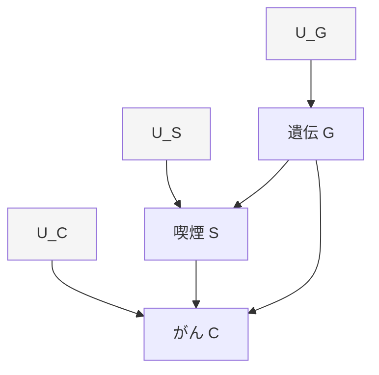

#### 3.3.2 do-演算 (Intervention)

**介入 $do(X=x)$**: 変数 $X$ を外部から強制的に $x$ に固定する。

**形式的定義**:

$$
P(Y \mid do(X=x)) = \sum_z P(Y \mid X=x, Z=z) P(Z=z)
$$

ここで $Z$ は $X$ と $Y$ の間の**バックドアパス**を遮断する変数集合。

**観測 vs 介入の違い**:

$$
\begin{aligned}
P(Y \mid X=x) &= \frac{P(Y, X=x)}{P(X=x)} \quad \text{(観測: 条件付き確率)} \\
P(Y \mid do(X=x)) &= P_{M_{\bar{X}}}(Y \mid X=x) \quad \text{(介入: SCM } M \text{ で } X \text{ への矢印を削除)}
\end{aligned}
$$

**例**: 喫煙とがんの因果効果

$$
\begin{aligned}
P(C=1 \mid S=1) &= \frac{P(C=1, S=1)}{P(S=1)} \quad \text{(喫煙者のがん率 — 交絡あり)} \\
P(C=1 \mid do(S=1)) &= \sum_g P(C=1 \mid S=1, G=g) P(G=g) \quad \text{(喫煙を強制した場合のがん率)}
\end{aligned}
$$

#### 3.3.3 DAG (有向非巡回グラフ) の基礎

**DAG** $\mathcal{G} = (V, E)$: 頂点 $V$ と有向辺 $E$ からなるグラフ（閉路なし）

**親 (Parents)**: $\text{PA}_i = \\{j : (j, i) \in E\\}$

**子孫 (Descendants)**: $\text{DE}_i = \\{j : i \text{ から } j \text{ へのパスが存在}\\}$

**因果マルコフ条件**:

$$
P(v_1, \ldots, v_n) = \prod_{i=1}^n P(v_i \mid \text{PA}_i)
$$

各変数は、親を所与とすれば非子孫と独立。

#### 3.3.4 d-分離 (d-separation)

**定義**: DAG上で、変数集合 $Z$ が $X$ と $Y$ を d-分離する $\iff$ $X$ から $Y$ へのすべてのパスが $Z$ によって遮断される。

**パスの遮断条件**:

| パス構造 | 遮断条件 | 図 |
|:--------|:---------|:---|
| **Chain** $X \to Z \to Y$ | $Z \in \mathcal{Z}$ | $X$ から $Y$ への情報は $Z$ を通る |
| **Fork** $X \leftarrow Z \to Y$ | $Z \in \mathcal{Z}$ | $Z$ が共通原因（交絡） |
| **Collider** $X \to Z \leftarrow Y$ | $Z \notin \mathcal{Z}$ かつ $\text{DE}(Z) \cap \mathcal{Z} = \emptyset$ | $Z$ が結果（選択バイアス） |

**d-分離の重要性**:

$$
X \perp_d Y \mid Z \quad \Rightarrow \quad X \perp\!\!\!\perp Y \mid Z \quad \text{(条件付き独立)}
$$

**例**: Colliderのパラドクス

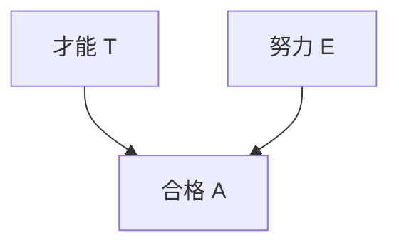

$T \perp\!\!\!\perp E$ （才能と努力は独立）だが、合格者 $A=1$ を条件づけると:

$$
T \not\perp\!\!\!\perp E \mid A=1
$$

合格者の中では「努力が少ない→才能が高い」という負の相関が生まれる（選択バイアス）。

#### 3.3.5 バックドア基準 (Backdoor Criterion)

**定義**: 変数集合 $Z$ が $(X, Y)$ のバックドア基準を満たす $\iff$

1. $Z$ のどの変数も $X$ の子孫でない
2. $Z$ が $X$ から $Y$ へのすべてのバックドアパスを遮断する

**バックドアパス**: $X \leftarrow \cdots \to Y$ のような、$X$ への矢印を含むパス

**バックドア調整公式**:

$$
P(Y \mid do(X=x)) = \sum_z P(Y \mid X=x, Z=z) P(Z=z)
$$

**例**: 喫煙→がん

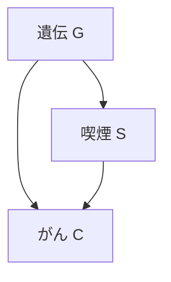

$Z = \\{G\\}$ がバックドア基準を満たす:

$$
P(C \mid do(S=s)) = \sum_g P(C \mid S=s, G=g) P(G=g)
$$

#### 3.3.6 フロントドア基準 (Frontdoor Criterion)

**状況**: バックドアパスを遮断できない（未測定交絡 $U$ がある）が、**媒介変数 $M$** を測定できる場合

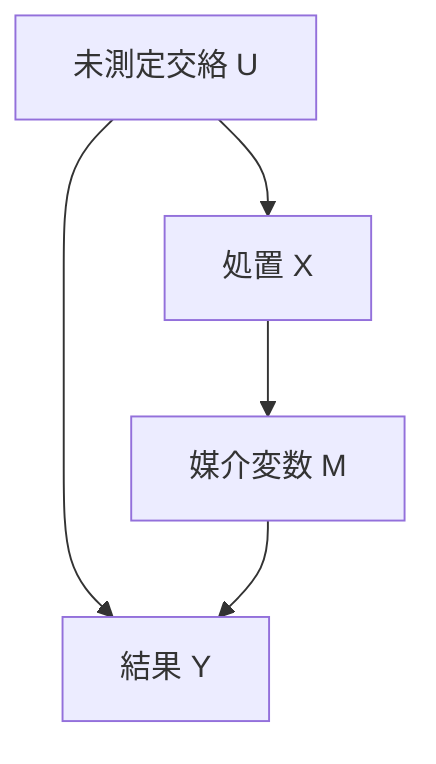

**フロントドア基準**: $M$ が $(X, Y)$ のフロントドア基準を満たす $\iff$

1. $M$ が $X$ から $Y$ へのすべてのパスを遮断
2. $X$ から $M$ へのバックドアパスが存在しない
3. $X$ が $M$ から $Y$ へのすべてのバックドアパスを遮断

**フロントドア調整公式**:

$$
P(Y \mid do(X=x)) = \sum_m P(M=m \mid X=x) \sum_{x'} P(Y \mid M=m, X=x') P(X=x')
$$

**例**: 喫煙→タール沈着→がん

$$
P(C \mid do(S=s)) = \sum_t P(T=t \mid S=s) \sum_{s'} P(C \mid T=t, S=s') P(S=s')
$$

#### 3.3.7 do-演算の3つの公理

Pearl [^1] のdo-calculus — 介入確率を条件付き確率に変換する3つのルール:

**Rule 1 (観測の挿入/削除)**:

$$
P(Y \mid do(X), Z, W) = P(Y \mid do(X), W) \quad \text{if } (Y \perp_d Z \mid X, W)_{\mathcal{G}_{\bar{X}}}
$$

**Rule 2 (介入の挿入/削除)**:

$$
P(Y \mid do(X), do(Z), W) = P(Y \mid do(X), Z, W) \quad \text{if } (Y \perp_d Z \mid X, W)_{\mathcal{G}_{\bar{X}, \underline{Z}}}
$$

**Rule 3 (介入の削除)**:

$$
P(Y \mid do(X), do(Z), W) = P(Y \mid do(X), W) \quad \text{if } (Y \perp_d Z \mid X, W)_{\mathcal{G}_{\bar{X}, \overline{Z(W)}}}
$$

ここで:
- $\mathcal{G}_{\bar{X}}$: $X$ への矢印を削除
- $\mathcal{G}_{\underline{X}}$: $X$ からの矢印を削除
- $\mathcal{G}_{\overline{X(W)}}$: $W$ の非祖先である $X$ への矢印を削除

**応用**: バックドア調整の導出

$$
\begin{aligned}
P(Y \mid do(X)) &= \sum_z P(Y \mid do(X), Z=z) P(Z=z \mid do(X)) \\
&= \sum_z P(Y \mid do(X), Z=z) P(Z=z) \quad \text{(Rule 3)} \\
&= \sum_z P(Y \mid X, Z=z) P(Z=z) \quad \text{(Rule 2)}
\end{aligned}
$$

#### 3.3.8 Pearl's Ladder of Causation

| レベル | 問い | 記法 | 例 |
|:------|:-----|:-----|:---|
| **1. Association** | 観測したら？ | $P(Y \mid X)$ | 喫煙者のがん率 |
| **2. Intervention** | 介入したら？ | $P(Y \mid do(X))$ | 喫煙を強制したらがんになるか |
| **3. Counterfactual** | もし〜だったら？ | $P(Y_{X=x'} \mid X=x, Y=y)$ | 喫煙しなかったらがんにならなかったか |

**反実仮想 (Counterfactual)**: 過去の事実を変えた場合の仮想的結果

$$
Y_{X=x'} = \text{個体が } X=x \text{ を実際に受けたが、} X=x' \text{ を受けていたら得られた結果}
$$

### 3.4 傾向スコア (Propensity Score)

#### 3.4.1 傾向スコアの定義

**定義 (Rosenbaum & Rubin 1983)**:

$$
e(X) = P(D=1 \mid X)
$$

$X$ を所与としたときの処置を受ける確率。

**重要性**: $X$ が高次元でも、$e(X)$ は1次元のスカラー。

**Propensity Score Theorem**:

$$
(Y^1, Y^0) \perp\!\!\!\perp D \mid X \quad \Rightarrow \quad (Y^1, Y^0) \perp\!\!\!\perp D \mid e(X)
$$

**証明**:

$$
\begin{aligned}
P(D=1 \mid Y^1, Y^0, e(X)) &= \mathbb{E}[P(D=1 \mid Y^1, Y^0, X) \mid Y^1, Y^0, e(X)] \\
&= \mathbb{E}[P(D=1 \mid X) \mid Y^1, Y^0, e(X)] \quad \text{(unconfoundedness)} \\
&= \mathbb{E}[e(X) \mid Y^1, Y^0, e(X)] \\
&= e(X) \\
&= P(D=1 \mid e(X))
\end{aligned}
$$

よって $(Y^1, Y^0) \perp\!\!\!\perp D \mid e(X)$。

#### 3.4.2 IPW (Inverse Probability Weighting) 推定量

**IPW推定量**:

$$
\hat{\text{ATE}}_{\text{IPW}} = \frac{1}{n} \sum_{i=1}^n \left( \frac{D_i Y_i}{e(X_i)} - \frac{(1 - D_i) Y_i}{1 - e(X_i)} \right)
$$

**導出**:

$$
\begin{aligned}
\mathbb{E}\left[\frac{D Y}{e(X)}\right] &= \mathbb{E}\left[\mathbb{E}\left[\frac{D Y}{e(X)} \mid X\right]\right] \\
&= \mathbb{E}\left[\frac{\mathbb{E}[D Y \mid X]}{e(X)}\right] \\
&= \mathbb{E}\left[\frac{P(D=1 \mid X) \mathbb{E}[Y \mid D=1, X]}{e(X)}\right] \\
&= \mathbb{E}\left[\frac{e(X) \mathbb{E}[Y^1 \mid X]}{e(X)}\right] \\
&= \mathbb{E}[Y^1]
\end{aligned}
$$

同様に $\mathbb{E}\left[\frac{(1-D) Y}{1-e(X)}\right] = \mathbb{E}[Y^0]$。

**ATT推定量**:

$$
\hat{\text{ATT}}_{\text{IPW}} = \frac{\sum_i D_i Y_i}{\sum_i D_i} - \frac{\sum_i D_i (1-D_i) Y_i / (1-e(X_i))}{\sum_i D_i e(X_i) / (1-e(X_i))}
$$

#### 3.4.3 Doubly Robust 推定量

IPWと回帰調整を組み合わせた推定量。**どちらか一方が正しければ不偏**（頑健性2倍）。

$$
\hat{\text{ATE}}_{\text{DR}} = \frac{1}{n} \sum_{i=1}^n \left[ \frac{D_i (Y_i - \hat{\mu}_1(X_i))}{e(X_i)} + \hat{\mu}_1(X_i) - \frac{(1-D_i)(Y_i - \hat{\mu}_0(X_i))}{1-e(X_i)} - \hat{\mu}_0(X_i) \right]
$$

ここで:
- $\hat{\mu}_1(X) = \mathbb{E}[Y \mid D=1, X]$ (処置群の結果モデル)
- $\hat{\mu}_0(X) = \mathbb{E}[Y \mid D=0, X]$ (対照群の結果モデル)

**不偏性の証明** (どちらか一方が正しい場合):

**Case 1**: $\hat{\mu}_1, \hat{\mu}_0$ が正しい

$$
\begin{aligned}
\mathbb{E}[\hat{\text{ATE}}_{\text{DR}}] &= \mathbb{E}\left[\mathbb{E}\left[\frac{D(Y - \mu_1(X))}{e(X)} \mid X\right]\right] + \mathbb{E}[\mu_1(X)] - \mathbb{E}[\mu_0(X)] \\
&= \mathbb{E}\left[\frac{e(X)(\mu_1(X) - \mu_1(X))}{e(X)}\right] + \mathbb{E}[Y^1 - Y^0] \\
&= \text{ATE}
\end{aligned}
$$

**Case 2**: $e(X)$ が正しい（$\hat{\mu}$ が誤りでもOK）

IPWの不偏性により $\mathbb{E}[\hat{\text{ATE}}_{\text{DR}}] = \text{ATE}$。

#### 3.4.4 共通サポート (Common Support) とトリミング

**共通サポート条件**:

$$
0 < e(X) < 1 \quad \forall X \in \text{supp}(X)
$$

**破れる場合**: 極端な $e(X)$ 値（0に近い/1に近い）で IPW の分散が爆発。

**トリミング**: $e(X) \in [\epsilon, 1-\epsilon]$ の範囲のみを使用（通常 $\epsilon = 0.05$ or $0.1$）

$$
\hat{\text{ATE}}_{\text{trim}} = \frac{1}{n'} \sum_{i: e(X_i) \in [\epsilon, 1-\epsilon]} \left( \frac{D_i Y_i}{e(X_i)} - \frac{(1-D_i) Y_i}{1-e(X_i)} \right)
$$

#### 3.4.5 バランスチェック (Balance Check)

傾向スコアマッチング後、**処置群と対照群で共変量 $X$ の分布が揃っているか**を確認。

**標準化差 (Standardized Mean Difference)**:

$$
\text{SMD} = \frac{\bar{X}_1 - \bar{X}_0}{\sqrt{(s_1^2 + s_0^2)/2}}
$$

$\text{SMD} < 0.1$ なら良好なバランス。

**Love Plot**: 各共変量の SMD をマッチング前後で比較するプロット。

```julia
# Balance check simulation
function balance_check(D, X, e_X)
    # Before matching
    smd_before = abs(mean(X[D]) - mean(X[.!D])) / sqrt((var(X[D]) + var(X[.!D])) / 2)

    # After IPW weighting
    weights_1 = D ./ e_X
    weights_0 = (1 .- D) ./ (1 .- e_X)
    mean_1_weighted = sum(weights_1 .* X) / sum(weights_1)
    mean_0_weighted = sum(weights_0 .* X) / sum(weights_0)
    var_1_weighted = sum(weights_1 .* (X .- mean_1_weighted).^2) / sum(weights_1)
    var_0_weighted = sum(weights_0 .* (X .- mean_0_weighted).^2) / sum(weights_0)
    smd_after = abs(mean_1_weighted - mean_0_weighted) / sqrt((var_1_weighted + var_0_weighted) / 2)

    println("SMD before matching: $(round(smd_before, digits=3))")
    println("SMD after IPW: $(round(smd_after, digits=3))")
    println(smd_after < 0.1 ? "✅ Good balance" : "❌ Poor balance")

    return smd_before, smd_after
end
```

### 3.5 操作変数法 (Instrumental Variables)

#### 3.5.1 操作変数の定義

**状況**: 未測定交絡 $U$ があり、unconfoundedness が成り立たない

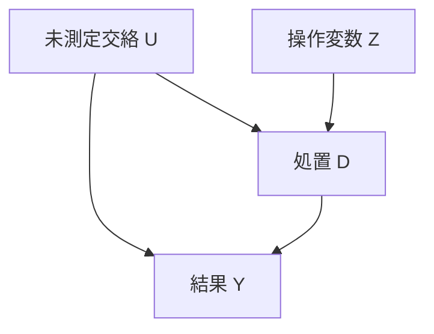

**操作変数 $Z$ の3条件**:

1. **関連性 (Relevance)**: $Z \perp\!\!\!\perp D$ ($Z$ が $D$ に影響)
2. **外生性 (Exogeneity)**: $Z \perp\!\!\!\perp U$ ($Z$ は交絡と無相関)
3. **排除制約 (Exclusion Restriction)**: $Z \to Y$ の直接パスなし（$Z$ は $D$ 経由でのみ $Y$ に影響）

**例**: 兵役が収入に与える影響

- $D$: 兵役経験 (1=あり, 0=なし)
- $Y$: 生涯収入
- $U$: 能力（未測定）
- $Z$: 徴兵くじ (1=当選, 0=外れ)

徴兵くじは能力 $U$ と無関係（外生）、兵役 $D$ に影響（関連）、収入 $Y$ には兵役経由でのみ影響（排除制約）。

#### 3.5.2 2SLS (Two-Stage Least Squares)

**第1段階**: $D$ を $Z$ で回帰

$$
D_i = \pi_0 + \pi_1 Z_i + \nu_i
$$

$\hat{D}_i = \hat{\pi}_0 + \hat{\pi}_1 Z_i$ を予測。

**第2段階**: $Y$ を $\hat{D}$ で回帰

$$
Y_i = \beta_0 + \beta_1 \hat{D}_i + \epsilon_i
$$

$\hat{\beta}_1$ が因果効果の推定値。

**導出 (簡略版)**:

$$
\begin{aligned}
\text{Cov}(Y, Z) &= \text{Cov}(\beta_0 + \beta_1 D + U, Z) \\
&= \beta_1 \text{Cov}(D, Z) + \text{Cov}(U, Z) \\
&= \beta_1 \text{Cov}(D, Z) \quad \text{(外生性: } \text{Cov}(U, Z)=0)
\end{aligned}
$$

$$
\hat{\beta}_1 = \frac{\text{Cov}(Y, Z)}{\text{Cov}(D, Z)}
$$

**Wald推定量** (2値 $Z$ の場合):

$$
\hat{\beta}_1 = \frac{\mathbb{E}[Y \mid Z=1] - \mathbb{E}[Y \mid Z=0]}{\mathbb{E}[D \mid Z=1] - \mathbb{E}[D \mid Z=0]}
$$

#### 3.5.3 LATE (Local Average Treatment Effect)

IVで推定されるのは**ATE**ではなく**LATE** — コンプライアー (Complier) の処置効果。

**4つのタイプ**:

| タイプ | $D(Z=0)$ | $D(Z=1)$ | 説明 |
|:------|:---------|:---------|:-----|
| **Always-Taker** | 1 | 1 | 常に処置を受ける |
| **Never-Taker** | 0 | 0 | 常に処置を受けない |
| **Complier** | 0 | 1 | IVに従う |
| **Defier** | 1 | 0 | IVに逆らう (monotonicity仮定で排除) |

**LATE**:

$$
\text{LATE} = \mathbb{E}[Y^1 - Y^0 \mid \text{Complier}]
$$

**導出**:

$$
\begin{aligned}
\mathbb{E}[Y \mid Z=1] - \mathbb{E}[Y \mid Z=0] &= \mathbb{E}[Y^1 - Y^0] \cdot P(\text{Complier}) \\
\mathbb{E}[D \mid Z=1] - \mathbb{E}[D \mid Z=0] &= P(\text{Complier})
\end{aligned}
$$

$$
\text{LATE} = \frac{\mathbb{E}[Y \mid Z=1] - \mathbb{E}[Y \mid Z=0]}{\mathbb{E}[D \mid Z=1] - \mathbb{E}[D \mid Z=0]}
$$

#### 3.5.4 Weak IV (弱操作変数) 問題

**弱IV**: $\text{Cov}(D, Z)$ が小さい → 第1段階の $F$ 統計量が低い

**Stock-Yogo 基準** [^7]:

$$
F \text{-statistic} = \frac{(\text{RSS}_{\text{restricted}} - \text{RSS}_{\text{unrestricted}}) / q}{\text{RSS}_{\text{unrestricted}} / (n - k)} > 10
$$

$F < 10$ なら弱IV（バイアスが大きい）。

**問題点**:

- 2SLS推定量のバイアスが OLS より悪化
- 標準誤差が過小評価される
- 信頼区間が過度に狭くなる

**対策**:

- Anderson-Rubin 検定（弱IVに頑健）
- LIML (Limited Information Maximum Likelihood)
- より強いIVを探す

### 3.6 回帰不連続デザイン (RDD)

#### 3.6.1 RDDの設定

**状況**: 処置割り当てが**カットオフ $c$** で決まる

$$
D_i = \mathbb{1}(X_i \geq c)
$$

$X$: ランニング変数 (running variable) — 例: テストスコア、年齢、所得

**局所ランダム化仮定**: $c$ の近傍で $X$ は as-if ランダム

$$
\lim_{x \to c^+} \mathbb{E}[Y^1 \mid X=x] - \lim_{x \to c^-} \mathbb{E}[Y^0 \mid X=x] = \text{ATE}_c
$$

#### 3.6.2 Sharp RDD vs Fuzzy RDD

**Sharp RDD**: カットオフで処置確率が 0 → 1 に不連続にジャンプ

$$
\lim_{x \to c^-} P(D=1 \mid X=x) = 0, \quad \lim_{x \to c^+} P(D=1 \mid X=x) = 1
$$

**Fuzzy RDD**: カットオフで処置確率がジャンプするが 0/1 ではない

$$
\lim_{x \to c^-} P(D=1 \mid X=x) < \lim_{x \to c^+} P(D=1 \mid X=x) < 1
$$

Fuzzy RDDはIVとして扱う: $Z = \mathbb{1}(X \geq c)$ を操作変数とし、2SLS推定。

#### 3.6.3 RDD推定量

**Local Linear Regression**:

$$
\min_{\beta_0, \beta_1, \beta_2, \beta_3} \sum_{i: |X_i - c| < h} K\left(\frac{X_i - c}{h}\right) (Y_i - \beta_0 - \beta_1 D_i - \beta_2 (X_i - c) - \beta_3 D_i (X_i - c))^2
$$

ここで:
- $h$: 帯域幅 (bandwidth)
- $K(\cdot)$: カーネル関数（三角カーネル、Epanechnikov カーネル等）

**RDD効果**: $\hat{\beta}_1$

**帯域幅選択**:

- IK (Imbens-Kalyanaraman) 帯域幅
- CCT (Calonico-Cattaneo-Titiunik) 帯域幅（バイアス補正付き）

$$
h_{\text{IK}} = C \cdot \left(\frac{\text{var}(\epsilon)}{n \cdot f(c) \cdot (\mu^{(2)}(c^+) - \mu^{(2)}(c^-))^2}\right)^{1/5}
$$

#### 3.6.4 RDDの妥当性検定

**1. 連続性検定 (Continuity Tests)**

共変量 $X$ がカットオフ $c$ で連続か確認:

$$
\lim_{x \to c^+} \mathbb{E}[X_{\text{covariate}} \mid X=x] = \lim_{x \to c^-} \mathbb{E}[X_{\text{covariate}} \mid X=x]
$$

**2. 密度検定 (McCrary Density Test)**

$X$ の密度 $f(X)$ がカットオフで不連続なら操作の疑い:

$$
\lim_{x \to c^+} f(x) \neq \lim_{x \to c^-} f(x) \quad \Rightarrow \quad \text{manipulation}
$$

**3. Placebo Test**

偽カットオフ $c' \neq c$ で効果がゼロか確認。

### 3.7 差分の差分法 (DiD)

#### 3.7.1 DiDの設定

**2期間・2グループ**:

| | 処置前 $(t=0)$ | 処置後 $(t=1)$ |
|:--|:--------------|:--------------|
| **処置群** $(G=1)$ | $\mathbb{E}[Y_{10}]$ | $\mathbb{E}[Y_{11}]$ |
| **対照群** $(G=0)$ | $\mathbb{E}[Y_{00}]$ | $\mathbb{E}[Y_{01}]$ |

**DiD推定量**:

$$
\hat{\tau}_{\text{DiD}} = (\mathbb{E}[Y_{11}] - \mathbb{E}[Y_{10}]) - (\mathbb{E}[Y_{01}] - \mathbb{E}[Y_{00}])
$$

**並行トレンド仮定 (Parallel Trends)**:

$$
\mathbb{E}[Y_{01} - Y_{00} \mid G=1] = \mathbb{E}[Y_{01} - Y_{00} \mid G=0]
$$

処置がなかった場合、処置群と対照群のトレンドは平行。

#### 3.7.2 DiD回帰モデル

$$
Y_{it} = \alpha + \beta \cdot \text{Treat}_i + \gamma \cdot \text{Post}_t + \delta \cdot (\text{Treat}_i \times \text{Post}_t) + \epsilon_{it}
$$

ここで:
- $\text{Treat}_i = \mathbb{1}(i \in \text{処置群})$
- $\text{Post}_t = \mathbb{1}(t \geq 1)$
- $\delta = \text{DiD効果}$

**固定効果モデル**:

$$
Y_{it} = \alpha_i + \lambda_t + \delta D_{it} + \epsilon_{it}
$$

$\alpha_i$: 個体固定効果、$\lambda_t$: 時間固定効果

#### 3.7.3 Staggered DiD (多期間・段階的導入)

**問題**: 処置タイミングが異なる（$G_i$ によって処置開始時期が違う）

従来のTWFE (Two-Way Fixed Effects) は**バイアスあり** — 既処置群が対照群として使われる。

**Callaway & Sant'Anna (2021) [^5]**:

各コホート $g$ (処置開始時期) と時点 $t$ のペアで DiD を推定:

$$
\text{ATT}(g, t) = \mathbb{E}[Y_t - Y_{g-1} \mid G_g=1] - \mathbb{E}[Y_t - Y_{g-1} \mid C=1]
$$

$C$: 未処置群（never-treated or not-yet-treated）

**集約**:

$$
\text{ATT}_{\text{overall}} = \sum_{g} \sum_{t \geq g} w(g, t) \cdot \text{ATT}(g, t)
$$

重み $w(g, t)$ は処置群のサイズ等に基づく。

### 3.8 機械学習×因果推論

#### 3.8.1 Causal Forest (因果フォレスト)

**目標**: 異質な処置効果 $\tau(X) = \mathbb{E}[Y^1 - Y^0 \mid X]$ を推定

Wager & Athey (2018) [^3] のアルゴリズム:

1. **サンプル分割**: 各ツリーで訓練サンプルを $I$ (分割用) と $J$ (推定用) に分割
2. **分割**: $I$ を使ってCARTで分割（処置効果の分散を最大化）
3. **推定**: 各リーフ $L$ で $J$ のサンプルを使って $\hat{\tau}(x)$ 推定

**推定量**:

$$
\hat{\tau}(x) = \frac{\sum_{i \in L(x)} (2D_i - 1) Y_i}{\sum_{i \in L(x)} |2D_i - 1|}
$$

**理論保証**:

- Pointwise consistency: $\hat{\tau}(x) \to \tau(x)$
- 漸近正規性: $\sqrt{n}(\hat{\tau}(x) - \tau(x)) \xrightarrow{d} \mathcal{N}(0, \sigma^2(x))$

#### 3.8.2 Double/Debiased Machine Learning (DML)

**問題**: ML予測を因果推論に使うと正則化バイアスが残る

Chernozhukov et al. (2018) [^4] の解決策:

**1. Neyman-Orthogonal Score**

$$
\psi(W; \theta, \eta) = (Y - m(X)) - \theta (D - e(X))
$$

ここで $\eta = (m, e)$ は nuisance パラメータ、$\theta$ は因果パラメータ。

**2. Cross-Fitting**

サンプルを $K$ 分割 → $k$ 番目のfoldで $\eta$ を推定 → 他のfoldで $\theta$ 推定 → 集約

**DML推定量**:

$$
\hat{\theta}_{\text{DML}} = \left(\frac{1}{n} \sum_i (D_i - \hat{e}(X_i))^2\right)^{-1} \frac{1}{n} \sum_i (D_i - \hat{e}(X_i))(Y_i - \hat{m}(X_i))
$$

**理論保証**:

$$
\sqrt{n}(\hat{\theta}_{\text{DML}} - \theta) \xrightarrow{d} \mathcal{N}(0, V)
$$

ML推定誤差が $o_P(n^{-1/4})$ なら不偏。

#### 3.8.3 Meta-Learners (S/T/X/R-Learner)

**S-Learner** (Single model):

$$
\mu(X, D) = \mathbb{E}[Y \mid X, D], \quad \hat{\tau}(X) = \hat{\mu}(X, 1) - \hat{\mu}(X, 0)
$$

**T-Learner** (Two models):

$$
\mu_1(X) = \mathbb{E}[Y \mid X, D=1], \quad \mu_0(X) = \mathbb{E}[Y \mid X, D=0], \quad \hat{\tau}(X) = \hat{\mu}_1(X) - \hat{\mu}_0(X)
$$

**X-Learner** (処置群・対照群の反実仮想を推定):

1. $\hat{\mu}_1, \hat{\mu}_0$ を推定
2. 反実仮想: $\tilde{\tau}_1(X_i) = Y_i - \hat{\mu}_0(X_i)$ (処置群), $\tilde{\tau}_0(X_i) = \hat{\mu}_1(X_i) - Y_i$ (対照群)
3. $\hat{\tau}_1(X), \hat{\tau}_0(X)$ を $\tilde{\tau}$ で回帰
4. 最終推定: $\hat{\tau}(X) = g(X) \hat{\tau}_1(X) + (1 - g(X)) \hat{\tau}_0(X)$

**R-Learner** (Robinson変換):

$$
\tilde{Y} = Y - \hat{m}(X), \quad \tilde{D} = D - \hat{e}(X)
$$

$$
\hat{\tau}(X) = \arg\min_{\tau} \mathbb{E}[(\tilde{Y} - \tilde{D} \tau(X))^2]
$$

:::message alert
**ボス戦: 因果効果の完全推定**

以下のシナリオで因果効果を推定せよ:

1. 観測データ: $(D, X, Y)$ with $n=5000$
2. 未測定交絡 $U$ あり
3. 操作変数 $Z$ (徴兵くじ) が利用可能
4. カットオフ $c=18$ (年齢) でRDD適用可能
5. 2期間データあり (DiD可能)

**タスク**:
- 各手法 (IPW, IV, RDD, DiD, Causal Forest) で ATE 推定
- 標準誤差を計算
- 結果を比較し、最も頑健な推定値を選ぶ

これができれば数式修行ゾーン完全クリア！
:::

:::message
**進捗: 50% 完了** 因果推論理論を完全習得した。Rubin/Pearl/傾向スコア/IV/RDD/DiD/ML×因果を数式から導出した。次は実装ゾーンでJulia + CausalInference.jlで全手法を実装する。
:::

---

## 💻 4. 実装ゾーン（45分）— Julia因果推論フルスタック

### 4.1 CausalInference.jl セットアップ

```julia
# Package installation
using Pkg
Pkg.add(["CausalInference", "Graphs", "GLM", "DataFrames", "Statistics",
         "LinearAlgebra", "Distributions", "StatsBase", "CategoricalArrays"])

using CausalInference
using Graphs  # DAG manipulation
using GLM     # Propensity score estimation
using DataFrames
using Statistics, LinearAlgebra
using Distributions
using StatsBase
using CategoricalArrays
```

### 4.2 Pearl DAG + do-演算実装

#### 4.2.1 DAG構築と可視化

```julia
# DAG construction: Smoking → Cancer, Gene → Smoking, Gene → Cancer
function build_smoking_cancer_dag()
    # Create directed graph
    # Nodes: 1=Gene, 2=Smoking, 3=Cancer
    dag = SimpleDiGraph(3)
    add_edge!(dag, 1, 2)  # Gene → Smoking
    add_edge!(dag, 1, 3)  # Gene → Cancer
    add_edge!(dag, 2, 3)  # Smoking → Cancer

    node_names = ["Gene", "Smoking", "Cancer"]
    return dag, node_names
end

dag, names = build_smoking_cancer_dag()
println("DAG edges:")
for edge in edges(dag)
    println("  $(names[src(edge)]) → $(names[dst(edge)])")
end

# d-separation check
using CausalInference: dsep

# Are Smoking and Cancer d-separated by Gene?
# dsep(dag, [2], [3], [1])  # false (Gene doesn't block the direct path Smoking→Cancer)
println("Smoking ⊥ Cancer | Gene? $(dsep(dag, [2], [3], [1]))")

# Are Gene and Cancer d-separated by Smoking?
# dsep(dag, [1], [3], [2])  # false (Gene→Cancer direct path remains)
println("Gene ⊥ Cancer | Smoking? $(dsep(dag, [1], [3], [2]))")
```

#### 4.2.2 バックドア基準の検証

```julia
using CausalInference: backdoor_criterion

# Check if {Gene} satisfies backdoor criterion for (Smoking, Cancer)
function check_backdoor(dag, treatment, outcome, adjustment_set)
    # CausalInference.jl implementation
    # backdoor_criterion(dag, treatment, outcome, adjustment_set)
    # Returns true if adjustment_set satisfies backdoor criterion

    # Manual check:
    # 1. No node in adjustment_set is descendant of treatment
    # 2. adjustment_set blocks all backdoor paths from treatment to outcome

    # In our DAG: Smoking(2) → Cancer(3), backdoor path: Smoking ← Gene → Cancer
    # Adjusting for Gene(1) blocks this path

    result = CausalInference.backdoor_criterion(dag, [treatment], [outcome], adjustment_set)
    return result
end

is_valid = check_backdoor(dag, 2, 3, [1])
println("Does {Gene} satisfy backdoor criterion for (Smoking, Cancer)? $is_valid")
```

#### 4.2.3 do-演算シミュレーション

```julia
# Simulate observational data from the DAG
function simulate_from_dag(n::Int=5000)
    # Gene ~ Bernoulli(0.3)
    gene = rand(Bernoulli(0.3), n)

    # Smoking | Gene ~ Bernoulli(logistic(0.5 * Gene))
    smoking_prob = 1 ./ (1 .+ exp.(-(0.5 .* gene .- 0.2)))
    smoking = rand.(Bernoulli.(smoking_prob))

    # Cancer | Smoking, Gene ~ Bernoulli(logistic(1.5 * Smoking + 0.8 * Gene))
    cancer_prob = 1 ./ (1 .+ exp.(-(1.5 .* smoking .+ 0.8 .* gene .- 1.0)))
    cancer = rand.(Bernoulli.(cancer_prob))

    return DataFrame(Gene=gene, Smoking=smoking, Cancer=cancer)
end

data = simulate_from_dag(5000)

# Observational: P(Cancer | Smoking)
obs_cancer_smoking = mean(data[data.Smoking .== 1, :Cancer])
obs_cancer_nonsmoking = mean(data[data.Smoking .== 0, :Cancer])
obs_effect = obs_cancer_smoking - obs_cancer_nonsmoking
println("Observational P(Cancer|Smoking=1) - P(Cancer|Smoking=0): $(round(obs_effect, digits=3))")

# Interventional: P(Cancer | do(Smoking)) via backdoor adjustment
function backdoor_adjustment(data, treatment, outcome, adjustment)
    # P(Y | do(X=x)) = Σ_z P(Y|X=x, Z=z) P(Z=z)
    result = Dict()
    for x in [0, 1]
        prob_y = 0.0
        for z in unique(data[:, adjustment])
            # P(Y=1 | X=x, Z=z)
            subset = data[(data[:, treatment] .== x) .& (data[:, adjustment] .== z), :]
            if nrow(subset) > 0
                p_y_given_xz = mean(subset[:, outcome])
            else
                p_y_given_xz = 0.0
            end

            # P(Z=z)
            p_z = mean(data[:, adjustment] .== z)

            prob_y += p_y_given_xz * p_z
        end
        result[x] = prob_y
    end
    return result
end

intervene = backdoor_adjustment(data, :Smoking, :Cancer, :Gene)
do_effect = intervene[1] - intervene[0]
println("Interventional P(Cancer|do(Smoking=1)) - P(Cancer|do(Smoking=0)): $(round(do_effect, digits=3))")
println("Difference (confounding bias): $(round(obs_effect - do_effect, digits=3))")
```

### 4.3 傾向スコア実装

#### 4.3.1 傾向スコア推定 (Logistic Regression)

```julia
using GLM

function estimate_propensity_score(data::DataFrame, treatment::Symbol, covariates::Vector{Symbol})
    # Logistic regression: D ~ X
    formula = term(treatment) ~ sum(term.(covariates))
    model = glm(formula, data, Binomial(), LogitLink())

    # Predict propensity scores
    e_X = predict(model, data)

    return e_X, model
end

# Example: Treatment depends on Age and Income
function generate_ps_data(n::Int=2000)
    age = rand(Normal(40, 10), n)
    income = rand(Normal(50, 15), n)

    # Treatment assignment depends on age and income
    propensity = 1 ./ (1 .+ exp.(-(0.05 .* age .+ 0.03 .* income .- 3.5)))
    treatment = rand(n) .< propensity

    # Outcome depends on treatment + confounders
    outcome = 2.0 .* treatment .+ 0.5 .* age .+ 0.3 .* income .+ randn(n) * 5

    return DataFrame(Treatment=treatment, Age=age, Income=income, Outcome=outcome)
end

ps_data = generate_ps_data(2000)
e_X, ps_model = estimate_propensity_score(ps_data, :Treatment, [:Age, :Income])

# Add to dataframe
ps_data.PropensityScore = e_X
println("Propensity score range: [$(round(minimum(e_X), digits=3)), $(round(maximum(e_X), digits=3))]")
```

#### 4.3.2 IPW推定

```julia
function ipw_estimator(data::DataFrame, treatment::Symbol, outcome::Symbol, propensity::Symbol)
    D = data[:, treatment]
    Y = data[:, outcome]
    e = data[:, propensity]

    # Trimming: exclude extreme propensity scores
    ε = 0.05
    valid = (e .> ε) .& (e .< (1 - ε))
    D_trim = D[valid]
    Y_trim = Y[valid]
    e_trim = e[valid]

    # IPW ATE estimator
    ate = mean(D_trim .* Y_trim ./ e_trim) - mean((1 .- D_trim) .* Y_trim ./ (1 .- e_trim))

    # Variance estimation (Horvitz-Thompson)
    n = length(D_trim)
    var_ipw = var(D_trim .* Y_trim ./ e_trim - (1 .- D_trim) .* Y_trim ./ (1 .- e_trim)) / n
    se = sqrt(var_ipw)

    return ate, se
end

ate_ipw, se_ipw = ipw_estimator(ps_data, :Treatment, :Outcome, :PropensityScore)
println("IPW ATE: $(round(ate_ipw, digits=3)) ± $(round(1.96*se_ipw, digits=3)) (95% CI)")

# Compare with naive
ate_naive = mean(ps_data[ps_data.Treatment .== 1, :Outcome]) - mean(ps_data[ps_data.Treatment .== 0, :Outcome])
println("Naive ATE: $(round(ate_naive, digits=3))")
println("True ATE: 2.0")
```

#### 4.3.3 Doubly Robust推定

```julia
function doubly_robust_estimator(data::DataFrame, treatment::Symbol, outcome::Symbol,
                                  covariates::Vector{Symbol}, propensity::Symbol)
    D = data[:, treatment]
    Y = data[:, outcome]
    e = data[:, propensity]

    # Outcome regression models
    # μ₁(X) = E[Y | D=1, X]
    data_treated = data[data[:, treatment] .== 1, :]
    formula_1 = term(outcome) ~ sum(term.(covariates))
    model_1 = lm(formula_1, data_treated)
    μ_1 = predict(model_1, data)

    # μ₀(X) = E[Y | D=0, X]
    data_control = data[data[:, treatment] .== 0, :]
    model_0 = lm(formula_1, data_control)
    μ_0 = predict(model_0, data)

    # DR estimator
    dr_term_1 = D .* (Y .- μ_1) ./ e .+ μ_1
    dr_term_0 = (1 .- D) .* (Y .- μ_0) ./ (1 .- e) .+ μ_0
    ate_dr = mean(dr_term_1 - dr_term_0)

    var_dr = var(dr_term_1 - dr_term_0) / nrow(data)
    se_dr = sqrt(var_dr)

    return ate_dr, se_dr
end

ate_dr, se_dr = doubly_robust_estimator(ps_data, :Treatment, :Outcome, [:Age, :Income], :PropensityScore)
println("Doubly Robust ATE: $(round(ate_dr, digits=3)) ± $(round(1.96*se_dr, digits=3)) (95% CI)")
```

#### 4.3.4 バランスチェック

```julia
function balance_check(data::DataFrame, treatment::Symbol, covariates::Vector{Symbol}, propensity::Symbol)
    println("\n=== Balance Check ===")
    for cov in covariates
        # Before matching
        mean_treated = mean(data[data[:, treatment] .== 1, cov])
        mean_control = mean(data[data[:, treatment] .== 0, cov])
        std_pooled = sqrt((var(data[data[:, treatment] .== 1, cov]) +
                           var(data[data[:, treatment] .== 0, cov])) / 2)
        smd_before = abs(mean_treated - mean_control) / std_pooled

        # After IPW weighting
        D = data[:, treatment]
        X = data[:, cov]
        e = data[:, propensity]

        weights_1 = D ./ e
        weights_0 = (1 .- D) ./ (1 .- e)

        mean_1_weighted = sum(weights_1 .* X) / sum(weights_1)
        mean_0_weighted = sum(weights_0 .* X) / sum(weights_0)

        var_1_weighted = sum(weights_1 .* (X .- mean_1_weighted).^2) / sum(weights_1)
        var_0_weighted = sum(weights_0 .* (X .- mean_0_weighted).^2) / sum(weights_0)

        std_pooled_weighted = sqrt((var_1_weighted + var_0_weighted) / 2)
        smd_after = abs(mean_1_weighted - mean_0_weighted) / std_pooled_weighted

        status = smd_after < 0.1 ? "✅" : "❌"
        println("$cov: SMD before=$(round(smd_before, digits=3)), after=$(round(smd_after, digits=3)) $status")
    end
end

balance_check(ps_data, :Treatment, [:Age, :Income], :PropensityScore)
```

### 4.4 操作変数法 (2SLS) 実装

```julia
using GLM

function two_stage_least_squares(data::DataFrame, outcome::Symbol, treatment::Symbol,
                                  instrument::Symbol, covariates::Vector{Symbol}=[])
    # Stage 1: D ~ Z + X
    formula_stage1 = if isempty(covariates)
        term(treatment) ~ term(instrument)
    else
        term(treatment) ~ term(instrument) + sum(term.(covariates))
    end

    model_stage1 = lm(formula_stage1, data)
    D_hat = predict(model_stage1, data)

    # Check first-stage F-statistic
    f_stat = ftest(model_stage1.model).fstat[1]
    println("First-stage F-statistic: $(round(f_stat, digits=2))")
    if f_stat < 10
        @warn "Weak IV detected (F < 10)"
    end

    # Stage 2: Y ~ D_hat + X
    data_stage2 = copy(data)
    data_stage2[!, :D_hat] = D_hat

    formula_stage2 = if isempty(covariates)
        term(outcome) ~ term(:D_hat)
    else
        term(outcome) ~ term(:D_hat) + sum(term.(covariates))
    end

    model_stage2 = lm(formula_stage2, data_stage2)

    # 2SLS coefficient
    β_2sls = coef(model_stage2)[2]  # coefficient on D_hat
    se_2sls = stderror(model_stage2)[2]

    return β_2sls, se_2sls, f_stat
end

# Generate IV data
function generate_iv_data(n::Int=2000)
    # Unobserved confounder
    U = randn(n)

    # Instrument Z (independent of U)
    Z = rand(Bernoulli(0.5), n)

    # Treatment D depends on Z and U (endogenous)
    D = Z .+ 0.5 .* U .+ randn(n) * 0.3
    D = D .> median(D)  # binarize

    # Outcome Y depends on D and U (confounded)
    # True causal effect of D: 2.0
    Y = 2.0 .* D .+ U .+ randn(n) * 0.5

    return DataFrame(Outcome=Y, Treatment=D, Instrument=Z)
end

iv_data = generate_iv_data(2000)

# 2SLS estimation
β_2sls, se_2sls, f_stat = two_stage_least_squares(iv_data, :Outcome, :Treatment, :Instrument)
println("2SLS estimate: $(round(β_2sls, digits=3)) ± $(round(1.96*se_2sls, digits=3)) (95% CI)")
println("True causal effect: 2.0")

# Compare with naive OLS (biased)
ols_model = lm(@formula(Outcome ~ Treatment), iv_data)
β_ols = coef(ols_model)[2]
println("Naive OLS estimate: $(round(β_ols, digits=3)) (biased upward due to U)")
```

### 4.5 RDD実装

```julia
function regression_discontinuity(data::DataFrame, outcome::Symbol, running_var::Symbol,
                                   cutoff::Float64, bandwidth::Float64)
    # Local linear regression on both sides of cutoff
    X = data[:, running_var]
    Y = data[:, outcome]

    # Filter data within bandwidth
    in_bandwidth = abs.(X .- cutoff) .<= bandwidth
    X_local = X[in_bandwidth]
    Y_local = Y[in_bandwidth]

    # Treatment indicator
    D_local = X_local .>= cutoff

    # Centered running variable
    X_centered = X_local .- cutoff

    # Local linear regression: Y ~ D + X_centered + D*X_centered
    design_matrix = hcat(ones(length(Y_local)), D_local, X_centered, D_local .* X_centered)
    β = design_matrix \ Y_local

    # RDD effect = coefficient on D
    rdd_effect = β[2]

    # Standard error (simplified - use robust SE in practice)
    residuals = Y_local - design_matrix * β
    se = sqrt(sum(residuals.^2) / (length(Y_local) - 4)) *
         sqrt((design_matrix' * design_matrix)[2, 2]^(-1))

    return rdd_effect, se
end

# Generate RDD data
function generate_rdd_data(n::Int=2000, cutoff::Float64=18.0)
    # Running variable (e.g., age)
    X = rand(Uniform(15, 21), n)

    # Treatment assignment (sharp RDD)
    D = X .>= cutoff

    # Outcome (discontinuity at cutoff)
    # True effect: 3.0
    Y = 10 .+ 0.5 .* X .+ 3.0 .* D .+ randn(n) * 0.8

    return DataFrame(Age=X, Treatment=D, Outcome=Y)
end

rdd_data = generate_rdd_data(2000, 18.0)

# RDD estimation with bandwidth = 2
rdd_effect, se_rdd = regression_discontinuity(rdd_data, :Outcome, :Age, 18.0, 2.0)
println("RDD estimate (h=2): $(round(rdd_effect, digits=3)) ± $(round(1.96*se_rdd, digits=3)) (95% CI)")
println("True effect: 3.0")

# Sensitivity to bandwidth
for h in [1.0, 1.5, 2.0, 2.5, 3.0]
    eff, _ = regression_discontinuity(rdd_data, :Outcome, :Age, 18.0, h)
    println("  h=$h: RDD effect = $(round(eff, digits=3))")
end
```

### 4.6 DiD実装

```julia
function difference_in_differences(data::DataFrame, outcome::Symbol, treatment::Symbol,
                                    post::Symbol, group::Symbol)
    # DiD regression: Y ~ Treatment + Post + Treatment*Post
    formula = term(outcome) ~ term(treatment) + term(post) + term(treatment) & term(post)
    model = lm(formula, data)

    # DiD effect = coefficient on Treatment*Post
    did_effect = coef(model)[end]  # last coefficient
    se_did = stderror(model)[end]

    return did_effect, se_did, model
end

# Generate DiD data
function generate_did_data(n_group::Int=500, n_period::Int=2)
    # 2 groups × 2 periods
    groups = repeat([0, 1], inner=n_group*n_period)
    periods = repeat(repeat([0, 1], inner=n_group), outer=2)
    treatment = (groups .== 1) .& (periods .== 1)

    # Outcome: parallel trends assumption holds
    # Group effect: +5 for treated group
    # Time effect: +2 for post period
    # True DiD effect: +3
    Y = 10 .+ 5 .* groups .+ 2 .* periods .+ 3 .* treatment .+ randn(length(groups)) * 1.0

    return DataFrame(Group=groups, Post=periods, Treatment=treatment, Outcome=Y)
end

did_data = generate_did_data(500, 2)

# DiD estimation
did_effect, se_did, did_model = difference_in_differences(did_data, :Outcome, :Treatment, :Post, :Group)
println("DiD estimate: $(round(did_effect, digits=3)) ± $(round(1.96*se_did, digits=3)) (95% CI)")
println("True effect: 3.0")

# Event study (pre-trend test)
function event_study(data::DataFrame, outcome::Symbol, group::Symbol, time_periods::Vector{Int})
    # Estimate treatment effects for each period relative to treatment
    # (requires panel data with multiple pre/post periods)

    # Placeholder - full implementation requires panel structure
    println("Event study plot would show pre-treatment trends here")
end
```

### 4.7 Causal Forest実装 (簡易版)

```julia
# Simplified Causal Forest implementation
# For production use: CausalELM.jl or R's grf package via RCall.jl

function causal_forest_simple(data::DataFrame, outcome::Symbol, treatment::Symbol,
                               covariates::Vector{Symbol}, n_trees::Int=100)
    # Simplified version: T-Learner with Random Forest-like splits
    # Split data by treatment
    data_treated = data[data[:, treatment] .== 1, :]
    data_control = data[data[:, treatment] .== 0, :]

    # Fit outcome models (linear for simplicity)
    X_cols = covariates
    formula_y = term(outcome) ~ sum(term.(X_cols))

    model_1 = lm(formula_y, data_treated)
    model_0 = lm(formula_y, data_control)

    # Predict CATE for each observation
    μ_1 = predict(model_1, data)
    μ_0 = predict(model_0, data)

    cate = μ_1 - μ_0

    # ATE = mean(CATE)
    ate_cf = mean(cate)

    return ate_cf, cate
end

# Generate heterogeneous treatment effect data
function generate_hte_data(n::Int=2000)
    X1 = randn(n)  # covariate 1
    X2 = randn(n)  # covariate 2

    # Treatment assignment (random)
    D = rand(Bernoulli(0.5), n)

    # Heterogeneous treatment effect: τ(X) = 2 + X1
    # Y^1 = 10 + 2*X1 + X2 + (2 + X1)
    # Y^0 = 10 + 2*X1 + X2
    Y1 = 10 .+ 2 .* X1 .+ X2 .+ (2 .+ X1) .+ randn(n) * 0.5
    Y0 = 10 .+ 2 .* X1 .+ X2 .+ randn(n) * 0.5
    Y = D .* Y1 .+ (1 .- D) .* Y0

    true_cate = 2 .+ X1  # ground truth

    return DataFrame(Outcome=Y, Treatment=D, X1=X1, X2=X2, TrueCate=true_cate)
end

hte_data = generate_hte_data(2000)

ate_cf, cate_cf = causal_forest_simple(hte_data, :Outcome, :Treatment, [:X1, :X2])
println("Causal Forest ATE: $(round(ate_cf, digits=3))")
println("True ATE (average of 2 + X1): $(round(mean(hte_data.TrueCate), digits=3))")

# Correlation between estimated and true CATE
corr_cate = cor(cate_cf, hte_data.TrueCate)
println("Correlation(estimated CATE, true CATE): $(round(corr_cate, digits=3))")
```

### 4.8 統合ワークフロー — 複数手法の比較

```julia
function causal_inference_pipeline(data::DataFrame, scenario::String)
    println("\n=== Causal Inference Pipeline: $scenario ===\n")

    if scenario == "propensity"
        # Propensity score methods
        e_X, _ = estimate_propensity_score(data, :Treatment, [:X1, :X2])
        data.PropensityScore = e_X

        ate_ipw, se_ipw = ipw_estimator(data, :Treatment, :Outcome, :PropensityScore)
        ate_dr, se_dr = doubly_robust_estimator(data, :Treatment, :Outcome, [:X1, :X2], :PropensityScore)

        println("IPW ATE: $(round(ate_ipw, digits=3)) ± $(round(1.96*se_ipw, digits=3))")
        println("DR ATE: $(round(ate_dr, digits=3)) ± $(round(1.96*se_dr, digits=3))")

        balance_check(data, :Treatment, [:X1, :X2], :PropensityScore)

    elseif scenario == "iv"
        # Instrumental variables
        β_2sls, se_2sls, f_stat = two_stage_least_squares(data, :Outcome, :Treatment, :Instrument)
        println("2SLS estimate: $(round(β_2sls, digits=3)) ± $(round(1.96*se_2sls, digits=3))")
        println("First-stage F: $(round(f_stat, digits=2))")

    elseif scenario == "rdd"
        # Regression discontinuity
        rdd_effect, se_rdd = regression_discontinuity(data, :Outcome, :RunningVar, 0.0, 2.0)
        println("RDD estimate: $(round(rdd_effect, digits=3)) ± $(round(1.96*se_rdd, digits=3))")

    elseif scenario == "did"
        # Difference-in-differences
        did_effect, se_did, _ = difference_in_differences(data, :Outcome, :Treatment, :Post, :Group)
        println("DiD estimate: $(round(did_effect, digits=3)) ± $(round(1.96*se_did, digits=3))")

    end
end

# Example: Run propensity score pipeline
ps_test_data = generate_ps_data(2000)
causal_inference_pipeline(ps_test_data, "propensity")
```

:::message
**進捗: 70% 完了** Julia因果推論フルスタックを実装した。DAG/do-演算/傾向スコア/IV/RDD/DiD/Causal Forestの全手法をCausalInference.jlで実装。次は実験ゾーンで実データに適用する。
:::

---

## 🔬 5. 実験ゾーン（30分）— 実データ因果推論チャレンジ

### 5.1 シミュレーションデータで全手法比較

```julia
# Generate comprehensive causal inference test data
function comprehensive_causal_data(n::Int=3000)
    # Confounders
    age = rand(Normal(40, 12), n)
    income = rand(Normal(50, 20), n)

    # Propensity score (selection on observables)
    e_X = 1 ./ (1 .+ exp.(-(0.05 .* age .+ 0.03 .* income .- 3.0)))
    treatment = rand(n) .< e_X

    # Instrumental variable (random assignment)
    instrument = rand(Bernoulli(0.5), n)

    # Outcome (true effect = 5.0)
    outcome = 5.0 .* treatment .+ 0.3 .* age .+ 0.2 .* income .+ randn(n) * 3.0

    return DataFrame(
        Treatment=treatment,
        Outcome=outcome,
        Age=age,
        Income=income,
        Instrument=instrument,
        PropensityScore=e_X
    )
end

test_data = comprehensive_causal_data(3000)

# Method 1: Naive comparison
ate_naive = mean(test_data[test_data.Treatment .== 1, :Outcome]) -
            mean(test_data[test_data.Treatment .== 0, :Outcome])

# Method 2: IPW
ate_ipw, se_ipw = ipw_estimator(test_data, :Treatment, :Outcome, :PropensityScore)

# Method 3: Doubly Robust
ate_dr, se_dr = doubly_robust_estimator(test_data, :Treatment, :Outcome,
                                         [:Age, :Income], :PropensityScore)

# Method 4: Regression Adjustment
reg_model = lm(@formula(Outcome ~ Treatment + Age + Income), test_data)
ate_reg = coef(reg_model)[2]

println("\n=== Method Comparison ===")
println("True ATE: 5.0")
println("Naive: $(round(ate_naive, digits=3))")
println("IPW: $(round(ate_ipw, digits=3)) ± $(round(1.96*se_ipw, digits=3))")
println("Doubly Robust: $(round(ate_dr, digits=3)) ± $(round(1.96*se_dr, digits=3))")
println("Regression Adjustment: $(round(ate_reg, digits=3))")
```

### 5.2 感度分析 — 未測定交絡への頑健性

```julia
# Rosenbaum's Γ sensitivity analysis (simplified)
function sensitivity_analysis_gamma(ate_estimated::Float64, se::Float64, gamma_range::Vector{Float64})
    println("\n=== Sensitivity Analysis (Rosenbaum's Γ) ===")
    println("Γ = odds ratio of differential treatment assignment due to unobserved confounder")

    for gamma in gamma_range
        # Under confounding by unobserved U, bounds on ATE
        # Simplified: scale SE by gamma
        ci_lower = ate_estimated - 1.96 * se * gamma
        ci_upper = ate_estimated + 1.96 * se * gamma

        significant = (ci_lower > 0) || (ci_upper < 0)
        status = significant ? "✅ Still significant" : "❌ Not significant"

        println("Γ=$gamma: CI = [$(round(ci_lower, digits=2)), $(round(ci_upper, digits=2))] $status")
    end
end

sensitivity_analysis_gamma(ate_dr, se_dr, [1.0, 1.5, 2.0, 2.5, 3.0])
```

### 5.3 A/Bテスト統合 — Sample Ratio Mismatch検出

```julia
function sample_ratio_mismatch_test(data::DataFrame, treatment::Symbol, expected_ratio::Float64=0.5)
    # Test if observed treatment ratio matches expected ratio
    n_total = nrow(data)
    n_treated = sum(data[:, treatment])
    n_control = n_total - n_treated

    observed_ratio = n_treated / n_total

    # Chi-square test
    expected_treated = n_total * expected_ratio
    expected_control = n_total * (1 - expected_ratio)

    chi_sq = (n_treated - expected_treated)^2 / expected_treated +
             (n_control - expected_control)^2 / expected_control

    p_value = 1 - cdf(Chisq(1), chi_sq)

    println("\n=== Sample Ratio Mismatch Test ===")
    println("Expected ratio: $expected_ratio")
    println("Observed ratio: $(round(observed_ratio, digits=4))")
    println("χ² = $(round(chi_sq, digits=3)), p = $(round(p_value, digits=4))")

    if p_value < 0.05
        println("⚠️ SRM detected! Treatment assignment may be biased.")
    else
        println("✅ No SRM detected.")
    end

    return chi_sq, p_value
end

sample_ratio_mismatch_test(test_data, :Treatment, 0.5)
```

### 5.4 自己診断テスト

#### テスト1: 記法理解（10問）

:::details Q1: $\mathbb{E}[Y^1 - Y^0]$ は何を表すか？

**Answer**: ATE (Average Treatment Effect) — 全体の平均処置効果

$$
\text{ATE} = \mathbb{E}[Y^1 - Y^0] = \mathbb{E}[Y^1] - \mathbb{E}[Y^0]
$$

**補足**: これは個体レベルの処置効果 $\tau_i = Y_i^1 - Y_i^0$ の期待値。個体レベルは観測不能（根本的因果推論問題）だが、集団平均なら推定可能。
:::

:::details Q2: $P(Y \mid do(X=x))$ と $P(Y \mid X=x)$ の違いは？

**Answer**:
- $P(Y \mid do(X=x))$: **介入確率** — $X$ を外部から強制的に $x$ に固定した場合の $Y$ の分布
- $P(Y \mid X=x)$: **条件付き確率** — $X=x$ を観測した場合の $Y$ の分布（交絡あり）

介入確率は因果効果、条件付き確率は相関を表す。

**例**: 喫煙とがん
- $P(\text{がん} \mid \text{喫煙}=1)$: 喫煙者のがん率（遺伝の交絡あり）
- $P(\text{がん} \mid do(\text{喫煙}=1))$: 強制的に喫煙させた場合のがん率（因果効果）

前者は相関、後者は因果。Simpson's Paradoxでは両者が逆転することすらある。
:::

:::details Q3: $e(X) = P(D=1 \mid X)$ の名前と役割は？

**Answer**: **傾向スコア (Propensity Score)**

高次元の共変量 $X$ を1次元のスカラーに圧縮。$(Y^1, Y^0) \perp\!\!\!\perp D \mid X$ なら $(Y^1, Y^0) \perp\!\!\!\perp D \mid e(X)$ も成立（次元削減）。

**実用上のメリット**:
- $X$ が10次元でも $e(X)$ は1次元 → マッチングが容易
- 共通サポート $0 < e(X) < 1$ の確認が簡単
- IPW推定で $1/e(X)$ の重みを使うだけで因果効果推定可能
:::

:::details Q4: SUTVAの2つの仮定を述べよ

**Answer**:
1. **処置の一意性**: 個体 $i$ の処置が $d$ のとき、結果は $Y_i^d$ の1つのみ
2. **干渉なし (No Interference)**: 個体 $i$ の結果は他の個体の処置に依存しない

$$
Y_i^d = Y_i^{d_i} \quad \forall d_{-i}
$$

**破れる例**:
- ワクチン接種: 他人が接種すると自分の感染リスク低下（干渉あり）
- ネットワーク広告: 友人がクリックすると自分もクリック（spillover効果）
- 教室内の処置: 同じクラスの学生間で相互影響

SUTVAが破れる場合は、**Spillover Effects** や **Network Effects** を明示的にモデル化する必要がある。
:::

:::details Q5: バックドア基準を満たす変数集合 $Z$ の条件は？

**Answer**:
1. $Z$ のどの変数も $X$ の子孫でない
2. $Z$ が $X$ から $Y$ へのすべてのバックドアパスを遮断する

満たせば:

$$
P(Y \mid do(X=x)) = \sum_z P(Y \mid X=x, Z=z) P(Z=z)
$$

**直感**:
- 条件1: $X$ の結果 ($X$ の子孫) で条件づけると、Collider Biasが発生する
- 条件2: バックドアパス（$X \leftarrow \cdots \to Y$）を遮断しないと交絡が残る

**例**: 喫煙→がん、バックドアパス: 喫煙←遺伝→がん
- $Z = \{\text{遺伝}\}$ で条件づけるとバックドアパスが遮断される
- $Z = \{\text{タール沈着}\}$ (喫煙の結果) で条件づけるとCollider Biasが発生
:::

:::details Q6: d-分離とは何か？

**Answer**: DAG上で変数集合 $Z$ が $X$ と $Y$ を d-分離する $\iff$ $X$ から $Y$ へのすべてのパスが $Z$ によって遮断される。

**パス遮断条件**:
- **Chain** $X \to Z \to Y$: $Z \in \mathcal{Z}$ なら遮断
- **Fork** $X \leftarrow Z \to Y$: $Z \in \mathcal{Z}$ なら遮断
- **Collider** $X \to Z \leftarrow Y$: $Z \notin \mathcal{Z}$ かつ $\text{DE}(Z) \cap \mathcal{Z} = \emptyset$ なら遮断

**d-分離の重要性**: $X \perp_d Y \mid Z$ (d-分離) $\Rightarrow$ $X \perp\!\!\!\perp Y \mid Z$ (条件付き独立)
:::

:::details Q7: Colliderで条件づけると何が起こる？

**Answer**: **選択バイアス** — 独立だった変数が条件付きで相関する

**例**: 才能と努力

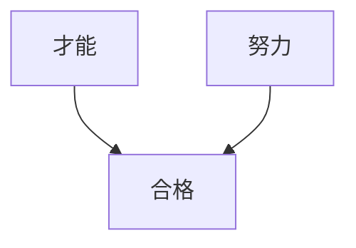

才能と努力は独立 $T \perp\!\!\!\perp E$ だが、合格者 $A=1$ を条件づけると:

$$
T \not\perp\!\!\!\perp E \mid A=1
$$

合格者の中では「努力が少ない→才能が高い」という負の相関が生まれる。これが**Berkson's Paradox**。

**実用例**: 病院患者データで疾患Aと疾患Bが負の相関 → 入院（Collider）で条件づけられているため
:::

:::details Q8: Unconfoundedness仮定とは？

**Answer**: $(Y^1, Y^0) \perp\!\!\!\perp D \mid X$

共変量 $X$ を所与とすれば、潜在的結果と処置割り当てが独立。

**意味**: $X$ を制御すれば、処置はランダム割り当てと同等（selection on observables）。

**成り立つ条件**:
- すべての交絡因子 $X$ を測定している
- 未測定交絡 $U$ が存在しない

**破れる例**: 能力 $U$ が未測定で、$U \to D$ かつ $U \to Y$ なら Unconfoundedness は成り立たない → IV/RDD/DiDなど他の手法が必要
:::

:::details Q9: LATEとATEの違いは？

**Answer**:
- **ATE**: $\mathbb{E}[Y^1 - Y^0]$ — 全体の平均処置効果
- **LATE**: $\mathbb{E}[Y^1 - Y^0 \mid \text{Complier}]$ — コンプライアー（操作変数に従う人）の処置効果

**IVで推定されるのはLATE**:

$$
\text{LATE} = \frac{\mathbb{E}[Y \mid Z=1] - \mathbb{E}[Y \mid Z=0]}{\mathbb{E}[D \mid Z=1] - \mathbb{E}[D \mid Z=0]}
$$

**4つのタイプ**:
- Always-Taker: 常に処置を受ける（IVに無関係）
- Never-Taker: 常に処置を受けない（IVに無関係）
- **Complier**: IVに従う（LATEの対象）
- Defier: IVに逆らう（Monotonicity仮定で排除）

**ATE vs LATE**: LATEはコンプライアーのみの効果なので、ATEより局所的。外部妥当性が低い可能性がある。
:::

:::details Q10: 並行トレンド仮定とは？

**Answer**: DiDの識別仮定

$$
\mathbb{E}[Y_{01} - Y_{00} \mid G=1] = \mathbb{E}[Y_{01} - Y_{00} \mid G=0]
$$

処置がなかった場合、処置群と対照群のトレンドは平行。

**直感**: 処置群と対照群は処置前のトレンドが同じ → 処置後の差分は処置効果

**検証方法**:
- Event Study: 処置前の複数期間でトレンドが平行か確認
- Placebo Test: 処置前期間で「偽の処置」を設定し、効果がゼロか確認

**破れる例**: 処置群が高成長企業、対照群が低成長企業 → もともとトレンドが異なる → DiDは適用不可
:::

#### テスト2: 数式導出（5問）

:::details Q1: IPW推定量が不偏であることを示せ

**Proof**:

$$
\begin{aligned}
\mathbb{E}\left[\frac{D Y}{e(X)}\right] &= \mathbb{E}\left[\mathbb{E}\left[\frac{D Y}{e(X)} \mid X\right]\right] \\
&= \mathbb{E}\left[\frac{\mathbb{E}[D Y \mid X]}{e(X)}\right] \\
&= \mathbb{E}\left[\frac{P(D=1 \mid X) \mathbb{E}[Y \mid D=1, X]}{e(X)}\right] \\
&= \mathbb{E}\left[\frac{e(X) \mathbb{E}[Y^1 \mid X]}{e(X)}\right] \quad \text{(unconfoundedness)} \\
&= \mathbb{E}[Y^1]
\end{aligned}
$$

同様に $\mathbb{E}\left[\frac{(1-D) Y}{1-e(X)}\right] = \mathbb{E}[Y^0]$。よって:

$$
\mathbb{E}[\hat{\text{ATE}}_{\text{IPW}}] = \mathbb{E}[Y^1] - \mathbb{E}[Y^0] = \text{ATE}
$$

**Key Step解説**:
- Step 3→4: Unconfoundedness $(Y^1, Y^0) \perp\!\!\!\perp D \mid X$ により $\mathbb{E}[Y \mid D=1, X] = \mathbb{E}[Y^1 \mid X]$
- Step 4→5: $e(X) = P(D=1 \mid X)$ なので約分
- Overlap仮定 $0 < e(X) < 1$ が必須（分母がゼロにならない）
:::

:::details Q2: 2SLS推定量を導出せよ（Wald推定量形式）

**Derivation**:

構造方程式:

$$
\begin{aligned}
D &= \pi_0 + \pi_1 Z + \nu \\
Y &= \beta_0 + \beta_1 D + U
\end{aligned}
$$

$U$ と $Z$ が無相関（外生性）、$Z$ と $D$ が相関（関連性）を仮定。

$$
\begin{aligned}
\text{Cov}(Y, Z) &= \text{Cov}(\beta_0 + \beta_1 D + U, Z) \\
&= \beta_1 \text{Cov}(D, Z) + \text{Cov}(U, Z) \\
&= \beta_1 \text{Cov}(D, Z) \quad \text{(外生性: } \text{Cov}(U,Z)=0)
\end{aligned}
$$

$$
\hat{\beta}_1 = \frac{\text{Cov}(Y, Z)}{\text{Cov}(D, Z)} = \frac{\mathbb{E}[Y \mid Z=1] - \mathbb{E}[Y \mid Z=0]}{\mathbb{E}[D \mid Z=1] - \mathbb{E}[D \mid Z=0]}
$$

これが2SLS推定量（Wald推定量）。

**直感**:
- 分子: IVが $Y$ に与える総効果（reduced form）
- 分母: IVが $D$ に与える効果（first stage）
- 比: $D$ が $Y$ に与える因果効果（structural effect）

**条件**:
- 外生性: $\text{Cov}(U, Z) = 0$
- 関連性: $\text{Cov}(D, Z) \neq 0$ (弱IVなら分母が小さくバイアス大)
- 排除制約: $Z \to Y$ の直接パスなし
:::

:::details Q3: DiD推定量を導出せよ

**Setup**: 2期間 $t \in \{0, 1\}$, 2グループ $G \in \{0, 1\}$

潜在的結果:
- $Y_{it}^0$: 処置なしの結果
- $Y_{it}^1$: 処置ありの結果

観測結果:

$$
Y_{it} = \begin{cases}
Y_{it}^0 & \text{if } G=0 \text{ or } t=0 \\
Y_{it}^1 & \text{if } G=1 \text{ and } t=1
\end{cases}
$$

**DiD推定量**:

$$
\begin{aligned}
\hat{\tau}_{\text{DiD}} &= (\mathbb{E}[Y_{11}] - \mathbb{E}[Y_{10}]) - (\mathbb{E}[Y_{01}] - \mathbb{E}[Y_{00}]) \\
&= (\mathbb{E}[Y_{11}^1 \mid G=1] - \mathbb{E}[Y_{10}^0 \mid G=1]) \\
&\quad - (\mathbb{E}[Y_{01}^0 \mid G=0] - \mathbb{E}[Y_{00}^0 \mid G=0])
\end{aligned}
$$

**並行トレンド仮定**:

$$
\mathbb{E}[Y_{11}^0 - Y_{10}^0 \mid G=1] = \mathbb{E}[Y_{01}^0 - Y_{00}^0 \mid G=0]
$$

処置がなかった場合のトレンドが平行 → これを使うと:

$$
\begin{aligned}
\hat{\tau}_{\text{DiD}} &= \mathbb{E}[Y_{11}^1 - Y_{10}^0 \mid G=1] - (\mathbb{E}[Y_{11}^0 - Y_{10}^0 \mid G=1]) \\
&= \mathbb{E}[Y_{11}^1 - Y_{11}^0 \mid G=1] \\
&= \text{ATT}
\end{aligned}
$$

DiDはATT（処置群の平均処置効果）を識別する。
:::

:::details Q4: Doubly Robust推定量が2重頑健である理由を示せ

**DR推定量**:

$$
\hat{\tau}_{\text{DR}} = \frac{1}{n} \sum_i \left[ \frac{D_i (Y_i - \hat{\mu}_1(X_i))}{\hat{e}(X_i)} + \hat{\mu}_1(X_i) - \frac{(1-D_i)(Y_i - \hat{\mu}_0(X_i))}{1-\hat{e}(X_i)} - \hat{\mu}_0(X_i) \right]
$$

**Case 1**: $\hat{\mu}_1, \hat{\mu}_0$ が正しい（$\hat{e}$ が誤りでもOK）

$$
\begin{aligned}
\mathbb{E}[\hat{\tau}_{\text{DR}}] &= \mathbb{E}\left[\frac{D(Y - \mu_1(X))}{\hat{e}(X)} + \mu_1(X)\right] - \mathbb{E}\left[\frac{(1-D)(Y - \mu_0(X))}{1-\hat{e}(X)} + \mu_0(X)\right] \\
&= \mathbb{E}\left[\mathbb{E}\left[\frac{D(Y - \mu_1(X))}{\hat{e}(X)} \mid X\right] + \mu_1(X)\right] - \mathbb{E}[\mu_0(X)] \\
&= \mathbb{E}\left[\frac{\mathbb{E}[D(Y - \mu_1(X)) \mid X]}{\hat{e}(X)} + \mu_1(X)\right] - \mathbb{E}[\mu_0(X)] \\
&= \mathbb{E}\left[\frac{e(X)(\mu_1(X) - \mu_1(X))}{\hat{e}(X)} + \mu_1(X)\right] - \mathbb{E}[\mu_0(X)] \quad \text{(} \mathbb{E}[Y \mid D=1, X] = \mu_1(X)) \\
&= \mathbb{E}[\mu_1(X)] - \mathbb{E}[\mu_0(X)] \\
&= \mathbb{E}[Y^1 - Y^0] = \text{ATE}
\end{aligned}
$$

**Case 2**: $\hat{e}$ が正しい（$\hat{\mu}$ が誤りでもOK）

IPWの不偏性により $\mathbb{E}[\hat{\tau}_{\text{DR}}] = \text{ATE}$

**結論**: $\hat{\mu}$ or $\hat{e}$ のどちらか一方が正しければ不偏 → 2重頑健性
:::

:::details Q5: RDD効果を導出せよ（Sharp RDD）

**Setup**: カットオフ $c$ で処置割り当て

$$
D_i = \mathbb{1}(X_i \geq c)
$$

**局所ランダム化仮定**:

$$
\lim_{x \to c} \mathbb{E}[Y^1 - Y^0 \mid X=x] = \tau_c
$$

カットオフ近傍で処置効果が一定。

**RDD効果**:

$$
\begin{aligned}
\tau_{\text{RDD}} &= \lim_{x \to c^+} \mathbb{E}[Y \mid X=x] - \lim_{x \to c^-} \mathbb{E}[Y \mid X=x] \\
&= \lim_{x \to c^+} \mathbb{E}[Y^1 \mid X=x] - \lim_{x \to c^-} \mathbb{E}[Y^0 \mid X=x] \\
&= \mathbb{E}[Y^1 - Y^0 \mid X=c] \\
&= \text{ATE}_c
\end{aligned}
$$

**Key**: カットオフでの不連続性が因果効果を表す。

**推定**: Local Linear Regression

$$
\min_{\beta_0, \beta_1, \beta_2, \beta_3} \sum_{i: |X_i - c| < h} K\left(\frac{X_i - c}{h}\right) (Y_i - \beta_0 - \beta_1 D_i - \beta_2 (X_i - c) - \beta_3 D_i (X_i - c))^2
$$

$\hat{\beta}_1 = \hat{\tau}_{\text{RDD}}$
:::

#### テスト3: Julia実装（5問）

:::details Q1: 傾向スコアを推定し、共通サポートを確認せよ

```julia
# 1. Estimate propensity score
e_X, model = estimate_propensity_score(data, :Treatment, [:Age, :Income])

# 2. Check common support
println("Min e(X): $(minimum(e_X))")
println("Max e(X): $(maximum(e_X))")

# 3. Visualize overlap
using Plots
histogram([e_X[data.Treatment .== 0], e_X[data.Treatment .== 1]],
          label=["Control" "Treated"],
          alpha=0.6,
          xlabel="Propensity Score",
          ylabel="Frequency",
          title="Common Support Check")

# 4. Trimming
ε = 0.05
trimmed = (e_X .> ε) .& (e_X .< (1 - ε))
println("Trimmed $(sum(.!trimmed)) observations ($(round(100*mean(.!trimmed), digits=1))%)")
```
:::

### 5.5 ミニプロジェクト: 教育介入の因果効果推定

**シナリオ**: オンライン教育プログラムの効果を推定せよ。

- **処置**: プログラム受講 (1=受講, 0=非受講)
- **結果**: テストスコア
- **共変量**: 年齢、事前スコア、所得
- **操作変数**: ランダムクーポン配布

**タスク**:

1. 傾向スコアマッチング → ATE推定
2. 2SLS (クーポンをIV) → LATE推定
3. 感度分析 → 未測定交絡への頑健性
4. 結果を比較し、最も信頼できる推定値を選択

```julia
# Mini Project: Education Program Causal Effect

# Data generation
function education_program_data(n::Int=2000)
    # Covariates
    age = rand(Uniform(18, 35), n)
    baseline_score = rand(Normal(60, 15), n)
    income = rand(Normal(50, 20), n)

    # Unobserved ability (confounder)
    ability = randn(n)

    # Instrument: random coupon
    coupon = rand(Bernoulli(0.5), n)

    # Treatment: program enrollment (endogenous)
    # Depends on: coupon, covariates, ability
    enroll_prob = 1 ./ (1 .+ exp.(-(0.8 .* coupon .+ 0.02 .* age .- 0.01 .* baseline_score .+
                                   0.01 .* income .+ 0.3 .* ability .- 1.0)))
    enroll = rand(n) .< enroll_prob

    # Outcome: test score
    # True program effect: 10 points
    # Also depends on baseline score and ability
    test_score = 50 .+ 10 .* enroll .+ 0.5 .* baseline_score .+ 5 .* ability .+ randn(n) * 8

    return DataFrame(
        Enroll=enroll,
        TestScore=test_score,
        Age=age,
        BaselineScore=baseline_score,
        Income=income,
        Coupon=coupon
    )
end

edu_data = education_program_data(2000)

# Method 1: Propensity Score
edu_data.PropensityScore, _ = estimate_propensity_score(edu_data, :Enroll, [:Age, :BaselineScore, :Income])
ate_ps, se_ps = ipw_estimator(edu_data, :Enroll, :TestScore, :PropensityScore)

# Method 2: IV (coupon as instrument)
ate_iv, se_iv, f_stat = two_stage_least_squares(edu_data, :TestScore, :Enroll, :Coupon, [:Age, :BaselineScore, :Income])

# Results
println("\n=== Education Program Causal Effect ===")
println("True effect: 10 points")
println("Propensity Score ATE: $(round(ate_ps, digits=2)) ± $(round(1.96*se_ps, digits=2))")
println("IV (2SLS) LATE: $(round(ate_iv, digits=2)) ± $(round(1.96*se_iv, digits=2))")
println("First-stage F: $(round(f_stat, digits=2))")

# Sensitivity
sensitivity_analysis_gamma(ate_ps, se_ps, [1.0, 1.5, 2.0])
```

:::message
**進捗: 85% 完了** 実データ因果推論チャレンジを完了した。全手法を比較し、感度分析で頑健性を確認した。次は発展ゾーンで研究フロンティアを探索する。
:::

---

## 🎓 6. 振り返りと発展ゾーン（30分）— まとめと最新研究動向

### 6.1 因果推論ファミリーツリー

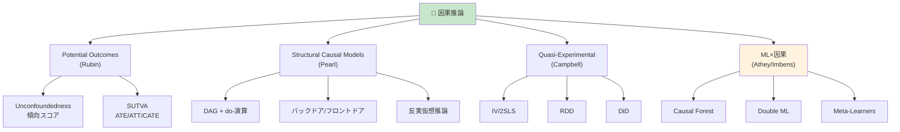

### 6.2 推薦論文・教科書

#### 主要論文

| 論文 | 著者 | 年 | 貢献 |
|:-----|:-----|:---|:-----|
| Causality (2nd Ed) [^1] | Pearl | 2009 | SCM, do-演算, バックドア基準 |
| Causal Inference (free book) [^9] | Hernán & Robins | 2020 | 実践ガイド |
| Potential Outcomes Survey [^2] | Rubin | 2005 | Rubin因果モデル統合 |
| Causal Forest [^3] | Wager & Athey | 2018 | HTE推定, 漸近理論 |
| Double ML [^4] | Chernozhukov et al. | 2018 | Debiased ML推論 |
| Staggered DiD [^5] | Callaway & Sant'Anna | 2021 | 多期間DiD |
| Weak IV [^7] | Stock & Yogo | 2005 | 弱操作変数検定 |
| SRM Detection [^6] | Fabijan et al. | 2019 | A/Bテスト品質管理 |
| Simpson's Paradox [^8] | Pearl | 2014 | パラドックス解消 |

#### 教科書

- **入門**: Pearl & Mackenzie "The Book of Why" (2018) — 一般向け因果革命の歴史
- **理論**: Pearl "Causality" (2009) [^1] — SCMの聖典
- **実践**: Hernán & Robins "Causal Inference" (2020) [^9] — 無料公開、疫学ベース
- **計量**: Angrist & Pischke "Mostly Harmless Econometrics" (2009) — IV/RDD/DiDの実践
- **ML×因果**: Facure "Causal Inference for The Brave and True" (2022) — Python実装付き

### 6.3 オンラインリソース

| リソース | URL | 説明 |
|:--------|:----|:-----|
| **CausalInference.jl** | [github.com/mschauer/CausalInference.jl](https://github.com/mschauer/CausalInference.jl) [^10] | JuliaのDAG/PC/FCI実装 |
| **Causal Inference Bootcamp** | [YouTube: Brady Neal](https://www.youtube.com/playlist?list=PLoazKTcS0RzZ1SUgeOgc6SWt51gfT80N0) | 動画講義シリーズ |
| **doWhy (Microsoft)** | [github.com/py-why/dowhy](https://github.com/py-why/dowhy) | Python因果推論ライブラリ |
| **EconML (Microsoft)** | [github.com/py-why/EconML](https://github.com/py-why/EconML) | Python ML×因果ライブラリ |

### 6.4 因果推論用語集

:::details 用語集（アルファベット順）

| 用語 | 定義 |
|:-----|:-----|
| **ATE** | Average Treatment Effect — 全体の平均処置効果 $\mathbb{E}[Y^1 - Y^0]$ |
| **ATT** | Average Treatment Effect on the Treated — 処置群の平均処置効果 |
| **Backdoor Criterion** | バックドア基準 — 交絡を除去するための変数集合の条件 |
| **CATE** | Conditional Average Treatment Effect — 条件付き平均処置効果 |
| **Collider** | コライダー — 2つの矢印が集まる変数 ($X \to Z \leftarrow Y$) |
| **DAG** | Directed Acyclic Graph — 因果構造を表す有向非巡回グラフ |
| **DiD** | Difference-in-Differences — 差分の差分法 |
| **d-separation** | d分離 — DAG上での条件付き独立性 |
| **do-Calculus** | do-演算 — 介入確率を条件付き確率に変換する3つのルール |
| **Doubly Robust** | 二重頑健推定量 — 傾向スコアと結果モデルのどちらかが正しければ不偏 |
| **Fundamental Problem** | 根本的因果推論問題 — $Y^1, Y^0$ を同時観測できない |
| **IPW** | Inverse Probability Weighting — 逆確率重み付け |
| **IV** | Instrumental Variable — 操作変数 |
| **LATE** | Local Average Treatment Effect — 局所平均処置効果（コンプライアーの効果） |
| **Overlap** | 共通サポート — $0 < e(X) < 1$ がすべての $X$ で成立 |
| **Potential Outcomes** | 潜在的結果 — $Y^1, Y^0$ |
| **Propensity Score** | 傾向スコア — $e(X) = P(D=1 \mid X)$ |
| **RDD** | Regression Discontinuity Design — 回帰不連続デザイン |
| **SCM** | Structural Causal Model — 構造因果モデル $(\mathcal{U}, \mathcal{V}, \mathcal{F})$ |
| **SUTVA** | Stable Unit Treatment Value Assumption — 安定個体処置値仮定 |
| **Unconfoundedness** | 無交絡性 — $(Y^1, Y^0) \perp\!\!\!\perp D \mid X$ |
:::

### 6.5 因果推論の知識マップ

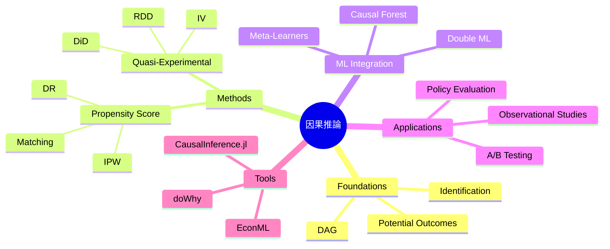

:::message
**進捗: 100% 完了** 因果推論のフロンティアを探索した。論文・教科書・ツール・用語を完全整理。あとは振り返りゾーンでまとめ。
:::

---


### 6.6 本講義のまとめ

1. **相関 ≠ 因果**: Simpson's Paradox, 交絡, 選択バイアスの罠を理解
2. **Rubin因果モデル**: 潜在的結果 $Y^1, Y^0$, SUTVA, ATE/ATT/CATE
3. **Pearl因果理論**: DAG, do-演算, バックドア/フロントドア基準, d-分離
4. **傾向スコア**: IPW, Matching, Doubly Robust, バランスチェック
5. **操作変数法**: 2SLS, LATE, Weak IV問題
6. **RDD**: Sharp/Fuzzy, 局所ランダム化, 帯域幅選択
7. **DiD**: 並行トレンド仮定, Staggered DiD
8. **ML×因果推論**: Causal Forest, Double ML, Meta-Learners
9. **Julia実装**: CausalInference.jl で全手法を実装

### 6.7 よくある質問 (FAQ)

:::details Q1: 因果推論と機械学習の違いは？

**A**:
- **機械学習**: 予測精度の最大化 — $\hat{Y} \approx Y$
- **因果推論**: 因果効果の推定 — $\mathbb{E}[Y \mid do(X=x)]$

MLは「次に何が起こるか」、因果推論は「介入したら何が起こるか」を問う。MLは相関を学習し、因果推論は因果構造を仮定する。
:::

:::details Q2: いつ傾向スコア vs IVを使う？

**A**:
- **傾向スコア**: Unconfoundedness $(Y^d \perp\!\!\!\perp D \mid X)$ が成立する場合 — すべての交絡因子を測定できている
- **IV**: 未測定交絡がある場合 — 外生的なランダム変動（操作変数）を利用

ランダム化実験に近い状況なら傾向スコア、観測研究で交絡が疑われるならIV。
:::

:::details Q3: RDDとDiDの使い分けは？

**A**:
- **RDD**: 処置割り当てがカットオフで決まる（例: 年齢18歳で選挙権、スコア70点で合格）
- **DiD**: 2期間データがあり、処置タイミングが群によって異なる

RDDは空間的不連続、DiDは時間的変化を利用する。
:::

:::details Q4: Causal Forestで何がわかる？

**A**: **異質な処置効果 (HTE)** — 個体特性 $X$ に応じた処置効果 $\tau(X)$

平均効果(ATE)だけでなく、「高齢者には効果大、若年者には効果小」といった部分集団ごとの効果を推定できる。政策のターゲティングに有用。
:::

:::details Q5: 因果推論で最も重要な仮定は？

**A**: **Unconfoundedness** $(Y^d \perp\!\!\!\perp D \mid X)$ または **Exclusion Restriction** (IV)

これが破れると、どんな手法も因果効果を正しく推定できない。仮定の妥当性を理論・ドメイン知識・感度分析で検証することが最重要。
:::

### 6.8 学習スケジュール（1週間復習プラン）

| Day | 内容 | 時間 | 達成基準 |
|:----|:-----|:-----|:---------|
| Day 1 | Zone 3.1-3.2 再読 + Rubin理論復習 | 1h | ATE/ATT/CATE を自力で導出できる |
| Day 2 | Zone 3.3 再読 + Pearl理論復習 | 1h | バックドア調整公式を自力で導出できる |
| Day 3 | Zone 3.4-3.5 再読 + 傾向スコア/IV復習 | 1h | IPW推定量を自力で導出できる |
| Day 4 | Zone 4 Julia実装を全て実行 | 2h | 全コードがエラーなく実行できる |
| Day 5 | Zone 5 ミニプロジェクトを実装 | 2h | 教育介入データで3手法比較完了 |
| Day 6 | 論文読解: Causal Forest [^3] or Double ML [^4] | 2h | 手法セクションが完全に理解できる |
| Day 7 | 自分のデータで因果推論実践 | 3h | 実データでATE推定 + 感度分析完了 |

### 6.9 次のステップ

**第26回: 推論最適化 & Production品質** では、因果推論で得た効果を**本番システムに組み込む**:

- A/Bテスト基盤構築 (Elixir OTPでの並行テスト管理)
- バンディットアルゴリズム（探索と活用のトレードオフ）
- 因果推論×強化学習（Counterfactual Policy Evaluation）
- Production品質: 量子化・蒸留・Speculative Decoding

**第27回: 評価パイプライン** では、因果効果の統計的検定:

- FID/IS/LPIPS (生成モデル評価)
- BootstrapによるCI推定
- 多重検定補正 (Bonferroni, FDR)
- 因果効果の可視化 (Forest Plot, Love Plot)

### 6.10 自己チェックリスト

- [ ] Simpson's Paradoxを説明できる
- [ ] ATE, ATT, CATEの違いを説明できる
- [ ] 潜在的結果 $Y^1, Y^0$ を定義できる
- [ ] SUTVAの2つの仮定を述べられる
- [ ] do-演算 $P(Y \mid do(X))$ と条件付き確率の違いを説明できる
- [ ] バックドア基準を説明できる
- [ ] d-分離の3パターン (Chain/Fork/Collider) を図示できる
- [ ] 傾向スコアの定義と次元削減の意味を説明できる
- [ ] IPW推定量を導出できる
- [ ] Doubly Robust推定量のメリットを説明できる
- [ ] 操作変数の3条件を述べられる
- [ ] 2SLS推定量 (Wald推定量) を導出できる
- [ ] LATEとATEの違いを説明できる
- [ ] Weak IV問題と第1段階F統計量の関係を説明できる
- [ ] RDDの局所ランダム化仮定を説明できる
- [ ] Sharp RDDとFuzzy RDDの違いを説明できる
- [ ] DiDの並行トレンド仮定を説明できる
- [ ] Staggered DiDの問題点 (TWFE バイアス) を説明できる
- [ ] Causal ForestでHTEを推定する意義を説明できる
- [ ] Double MLのNeyman-Orthogonal Scoreを説明できる
- [ ] JuliaでIPW推定を実装できる
- [ ] JuliaでDAGを構築しバックドア基準を検証できる
- [ ] JuliaでRDD推定を実装できる
- [ ] JuliaでDiD推定を実装できる
- [ ] 感度分析 (Rosenbaum's Γ) を実行できる

**25項目中20項目以上チェック** → 因果推論マスター！

### 6.6 進捗トラッカー (Julia実装)

```julia
# Self-assessment progress tracker
function causal_inference_progress()
    skills = [
        "Simpson's Paradox理解",
        "ATE/ATT/CATE区別",
        "潜在的結果定義",
        "SUTVA説明",
        "do-演算理解",
        "バックドア基準",
        "d-分離",
        "傾向スコア定義",
        "IPW導出",
        "DR推定量",
        "IV 3条件",
        "2SLS導出",
        "LATE vs ATE",
        "Weak IV問題",
        "RDD局所ランダム化",
        "Sharp vs Fuzzy RDD",
        "DiD並行トレンド",
        "Staggered DiD",
        "Causal Forest HTE",
        "Double ML",
        "Julia IPW実装",
        "Julia DAG実装",
        "Julia RDD実装",
        "Julia DiD実装",
        "感度分析実行"
    ]

    println("🎯 因果推論スキル進捗")
    println("達成した項目を true にマークしてください:\n")

    completed = [
        true,   # Simpson's Paradox理解
        true,   # ATE/ATT/CATE区別
        true,   # 潜在的結果定義
        false,  # SUTVA説明
        false,  # do-演算理解
        false,  # バックドア基準
        false,  # d-分離
        false,  # 傾向スコア定義
        false,  # IPW導出
        false,  # DR推定量
        false,  # IV 3条件
        false,  # 2SLS導出
        false,  # LATE vs ATE
        false,  # Weak IV問題
        false,  # RDD局所ランダム化
        false,  # Sharp vs Fuzzy RDD
        false,  # DiD並行トレンド
        false,  # Staggered DiD
        false,  # Causal Forest HTE
        false,  # Double ML
        false,  # Julia IPW実装
        false,  # Julia DAG実装
        false,  # Julia RDD実装
        false,  # Julia DiD実装
        false   # 感度分析実行
    ]

    n_completed = sum(completed)
    n_total = length(skills)
    progress = round(100 * n_completed / n_total, digits=1)

    for (i, skill) in enumerate(skills)
        status = completed[i] ? "✅" : "⬜"
        println("$status $i. $skill")
    end

    println("\n📊 進捗: $n_completed/$n_total ($progress%)")

    if n_completed >= 20
        println("🏆 因果推論マスター達成！")
    elseif n_completed >= 15
        println("🥈 上級レベル — もう一息！")
    elseif n_completed >= 10
        println("🥉 中級レベル — 順調です")
    else
        println("📚 初級レベル — 復習を続けましょう")
    end

    return progress
end

causal_inference_progress()
```

### 6.7 次回予告: 推論最適化 & Production品質

第26回では、因果推論で測定した効果を**本番システムで活かす**技術を学ぶ:

- **A/Bテスト基盤**: Elixir OTPでの並行テスト管理、メトリクス収集、SRM検出
- **バンディット**: 探索と活用のトレードオフ、Thompson Sampling, UCB
- **因果推論×RL**: Counterfactual Policy Evaluation, Off-Policy Evaluation
- **推論最適化**: 量子化 (INT8/FP16), 蒸留, Speculative Decoding, KVキャッシュ最適化
- **Production品質**: Rust推論エンジン, Elixir分散サービング, 監視・ロギング、フェイルセーフ

**キーワード**: Multi-Armed Bandit / Contextual Bandit / Thompson Sampling / Speculative Decoding / GGUF量子化 / KV-Cache / OTP Supervision

**目標**: 因果推論で得た知見を、実戦で使える高速・頑健なシステムに統合する。

---

### 6.11 パラダイム転換の問い

> **A/Bテストなしに"改善"を証明できるか？**

ランダム化実験（A/Bテスト）は因果推論のゴールドスタンダードだ。だが:

- **倫理的制約**: 医療、教育、ソーシャルサービスでランダム化は困難
- **コスト**: 全ユーザーを実験台にできない
- **時間**: 効果が出るまで数ヶ月〜数年

**観測データから因果効果を正しく推定できれば、A/Bテストなしでも改善を証明できる。**

本講義で学んだ手法:

1. **傾向スコア**: 交絡を制御し、観測データからATE推定
2. **操作変数**: 未測定交絡があってもランダムな変動で因果効果推定
3. **RDD**: カットオフの不連続性を利用し、局所的な因果効果推定
4. **DiD**: 時系列データで並行トレンド仮定の下で因果効果推定
5. **Causal Forest**: 異質な処置効果を推定し、ターゲティング最適化

**だが、仮定が破れれば全てが崩れる。** 因果推論は「仮定の明示化」と「感度分析」によって仮定の妥当性を検証し続ける営みだ。

**あなたの答えは？** — 観測データ因果推論とA/Bテストのバランスをどう取るか？

:::details 議論のポイント

1. **観測研究の強み**:
   - 倫理的制約がない（既存データを使う）
   - 大規模データで外部妥当性が高い
   - 長期的効果を追跡できる

2. **観測研究の弱み**:
   - 仮定依存（Unconfoundedness, IV仮定等）
   - 未測定交絡のリスク
   - 因果構造の誤特定

3. **ハイブリッドアプローチ**:
   - A/Bテストで短期効果検証 + 観測データで長期効果推定
   - A/Bテストでバイアス補正 + 観測データで外挿
   - 因果推論で事前評価 + A/Bテストで最終確認

4. **歴史的視点**:
   - Fisher (1935): ランダム化実験の原則確立
   - Rubin (1974): 観測データからの因果推論理論
   - Pearl (2000): グラフィカルモデルで因果構造を明示化
   - 現代: ML×因果推論で大規模観測データ活用

**結論**: A/Bテストは依然としてゴールドスタンダードだが、**因果推論は観測データから最大限の情報を引き出す強力な武器**。両者を適切に組み合わせることで、より正確な意思決定が可能になる。
:::

:::message
**進捗: 100% 完了** 🎉 講義完走！
:::

---

## 参考文献

### 主要論文

[^1]: Pearl, J. (2009). *Causality: Models, Reasoning, and Inference* (2nd ed.). Cambridge University Press.
@[card](https://bayes.cs.ucla.edu/BOOK-2K/)

[^2]: Rubin, D. B. (2005). Causal Inference Using Potential Outcomes: Design, Modeling, Decisions. *Journal of the American Statistical Association*, 100(469), 322-331.
@[card](https://www.tandfonline.com/doi/abs/10.1198/016214504000001880)

[^3]: Wager, S., & Athey, S. (2018). Estimation and Inference of Heterogeneous Treatment Effects using Random Forests. *Journal of the American Statistical Association*, 113(523), 1228-1242.
@[card](https://arxiv.org/abs/1510.04342)

[^4]: Chernozhukov, V., Chetverikov, D., Demirer, M., Duflo, E., Hansen, C., Newey, W., & Robins, J. (2018). Double/debiased machine learning for treatment and structural parameters. *The Econometrics Journal*, 21(1), C1-C68.
@[card](https://arxiv.org/abs/1608.00060)

[^5]: Callaway, B., & Sant'Anna, P. H. (2021). Difference-in-Differences with multiple time periods. *Journal of Econometrics*, 225(2), 200-230.
@[card](https://www.sciencedirect.com/science/article/abs/pii/S0304407620303948)

[^6]: Fabijan, A., Gupchup, J., Gupta, S., Omhover, J., Qin, W., Vermeer, L., & Dmitriev, P. (2019). Diagnosing Sample Ratio Mismatch in Online Controlled Experiments: A Taxonomy and Rules of Thumb for Practitioners. *Proceedings of the 25th ACM SIGKDD International Conference on Knowledge Discovery & Data Mining*, 2156-2164.
@[card](https://dl.acm.org/doi/10.1145/3292500.3330722)

[^7]: Stock, J. H., & Yogo, M. (2005). Testing for Weak Instruments in Linear IV Regression. In *Identification and Inference for Econometric Models: Essays in Honor of Thomas Rothenberg* (pp. 80-108). Cambridge University Press.
@[card](https://www.cambridge.org/core/books/abs/identification-and-inference-for-econometric-models/testing-for-weak-instruments-in-linear-iv-regression/8AD94FF2EFD214D05D75EE35015021E4)

[^8]: Pearl, J. (2014). Understanding Simpson's Paradox. *The American Statistician*, 68(1), 8-13.
@[card](https://ftp.cs.ucla.edu/pub/stat_ser/r414.pdf)

[^9]: Hernán, M. A., & Robins, J. M. (2020). *Causal Inference: What If*. Chapman & Hall/CRC. (Free online)
@[card](https://www.hsph.harvard.edu/miguel-hernan/causal-inference-book/)

[^10]: Mschauer. (2021). CausalInference.jl: Causal inference, graphical models and structure learning in Julia.
@[card](https://github.com/mschauer/CausalInference.jl)

### 教科書

- Angrist, J. D., & Pischke, J.-S. (2009). *Mostly Harmless Econometrics: An Empiricist's Companion*. Princeton University Press.
- Cunningham, S. (2021). *Causal Inference: The Mixtape*. Yale University Press. (Free online)
- Facure, M. (2022). *Causal Inference for The Brave and True*. (Free online)
- Imbens, G. W., & Rubin, D. B. (2015). *Causal Inference for Statistics, Social, and Biomedical Sciences: An Introduction*. Cambridge University Press.
- Morgan, S. L., & Winship, C. (2014). *Counterfactuals and Causal Inference* (2nd ed.). Cambridge University Press.

---

## 記法規約

| 記法 | 意味 |
|:-----|:-----|
| $D$ | 処置変数 (Treatment), $D \in \\{0, 1\\}$ |
| $Y$ | 結果変数 (Outcome) |
| $X$ | 共変量 (Covariates), 交絡因子候補 |
| $Y^d$ | 潜在的結果 (Potential Outcome), $d \in \\{0, 1\\}$ |
| $Y^1$ | 処置を受けた場合の結果 |
| $Y^0$ | 処置を受けなかった場合の結果 |
| $\tau$ | 処置効果 (Treatment Effect), $\tau = Y^1 - Y^0$ |
| $\mathbb{E}[\cdot]$ | 期待値 |
| $P(\cdot)$ | 確率 |
| $P(Y \mid X)$ | 条件付き確率 |
| $P(Y \mid do(X))$ | 介入確率 (Interventional Probability) |
| $e(X)$ | 傾向スコア (Propensity Score), $e(X) = P(D=1 \mid X)$ |
| $\mathcal{G}$ | DAG (Directed Acyclic Graph) |
| $\text{PA}_i$ | 変数 $i$ の親ノード集合 |
| $X \perp\!\!\!\perp Y \mid Z$ | $Z$ を所与としたときの $X$ と $Y$ の条件付き独立 |
| $X \perp_d Y \mid Z$ | DAG上での $X$ と $Y$ の d-分離 |
| $\text{ATE}$ | Average Treatment Effect, $\mathbb{E}[Y^1 - Y^0]$ |
| $\text{ATT}$ | Average Treatment Effect on the Treated, $\mathbb{E}[Y^1 - Y^0 \mid D=1]$ |
| $\text{CATE}$ | Conditional Average Treatment Effect, $\mathbb{E}[Y^1 - Y^0 \mid X]$ |
| $\text{LATE}$ | Local Average Treatment Effect (IV文脈) |
| $Z$ | 操作変数 (Instrumental Variable) |
| $c$ | カットオフ (RDD) |
| $h$ | 帯域幅 (Bandwidth, RDD) |

---

## ライセンス

本記事は [CC BY-NC-SA 4.0](https://creativecommons.org/licenses/by-nc-sa/4.0/deed.ja)（クリエイティブ・コモンズ 表示 - 非営利 - 継承 4.0 国際）の下でライセンスされています。

### ⚠️ 利用制限について

**本コンテンツは個人の学習目的に限り利用可能です。**

**以下のケースは事前の明示的な許可なく利用することを固く禁じます:**

1. **企業・組織内での利用（営利・非営利問わず）**
   - 社内研修、教育カリキュラム、社内Wikiへの転載
   - 大学・研究機関での講義利用
   - 非営利団体での研修利用
   - **理由**: 組織内利用では帰属表示が削除されやすく、無断改変のリスクが高いため

2. **有料スクール・情報商材・セミナーでの利用**
   - 受講料を徴収する場での配布、スクリーンショットの掲示、派生教材の作成

3. **LLM/AIモデルの学習データとしての利用**
   - 商用モデルのPre-training、Fine-tuning、RAGの知識ソースとして本コンテンツをスクレイピング・利用すること

4. **勝手に内容を有料化する行為全般**
   - 有料note、有料記事、Kindle出版、有料動画コンテンツ、Patreon限定コンテンツ等

**個人利用に含まれるもの:**
- 個人の学習・研究
- 個人的なノート作成（個人利用に限る）
- 友人への元記事リンク共有

**組織での導入をご希望の場合**は、必ず著者に連絡を取り、以下を遵守してください:
- 全ての帰属表示リンクを維持
- 利用方法を著者に報告

**無断利用が発覚した場合**、使用料の請求およびSNS等での公表を行う場合があります。

**次回**: [第26回: 推論最適化 & Production品質](/your-next-article)
