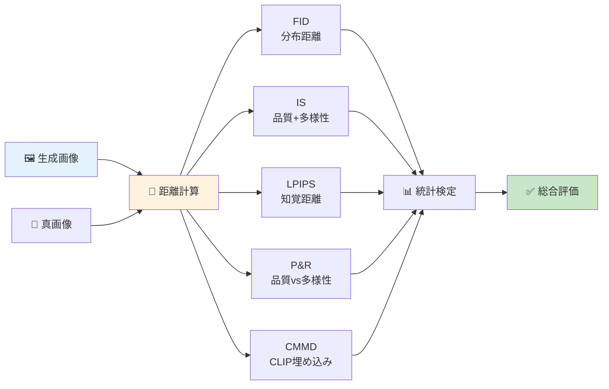
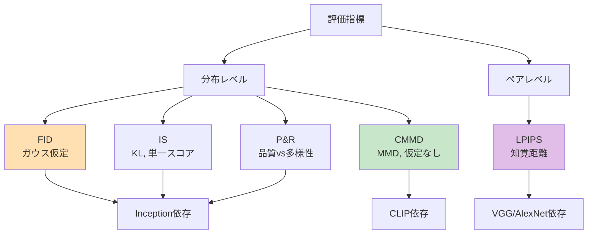
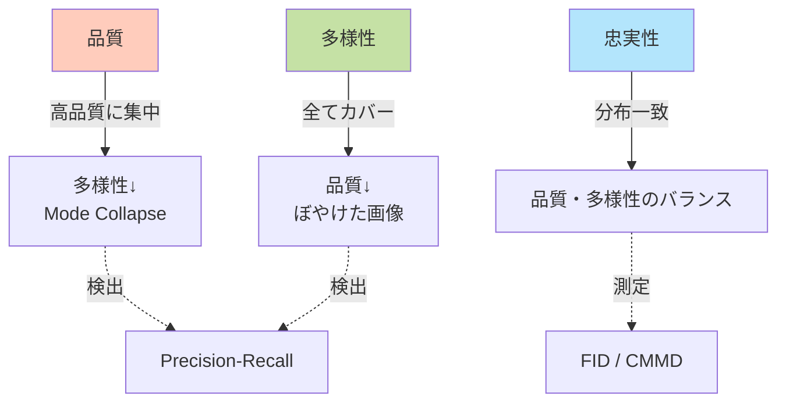
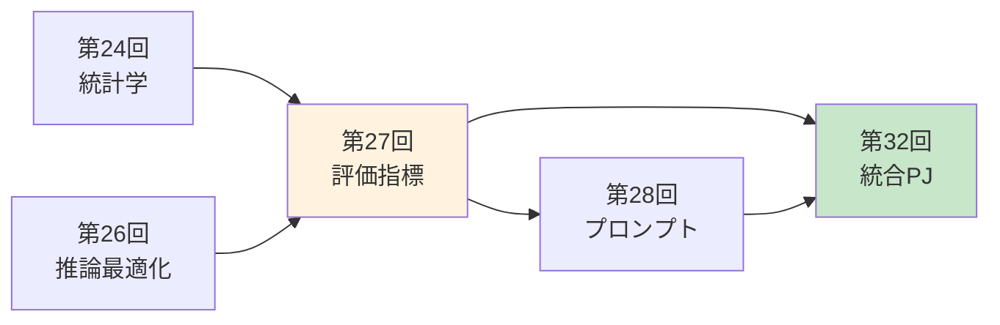
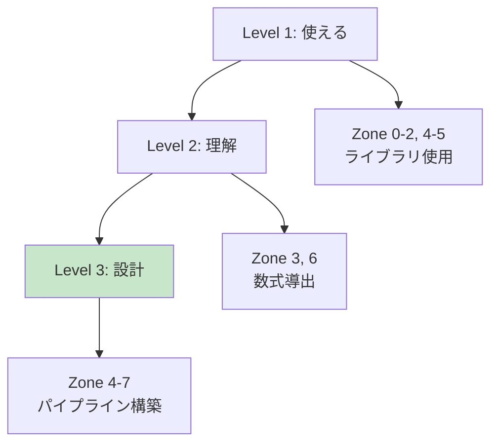
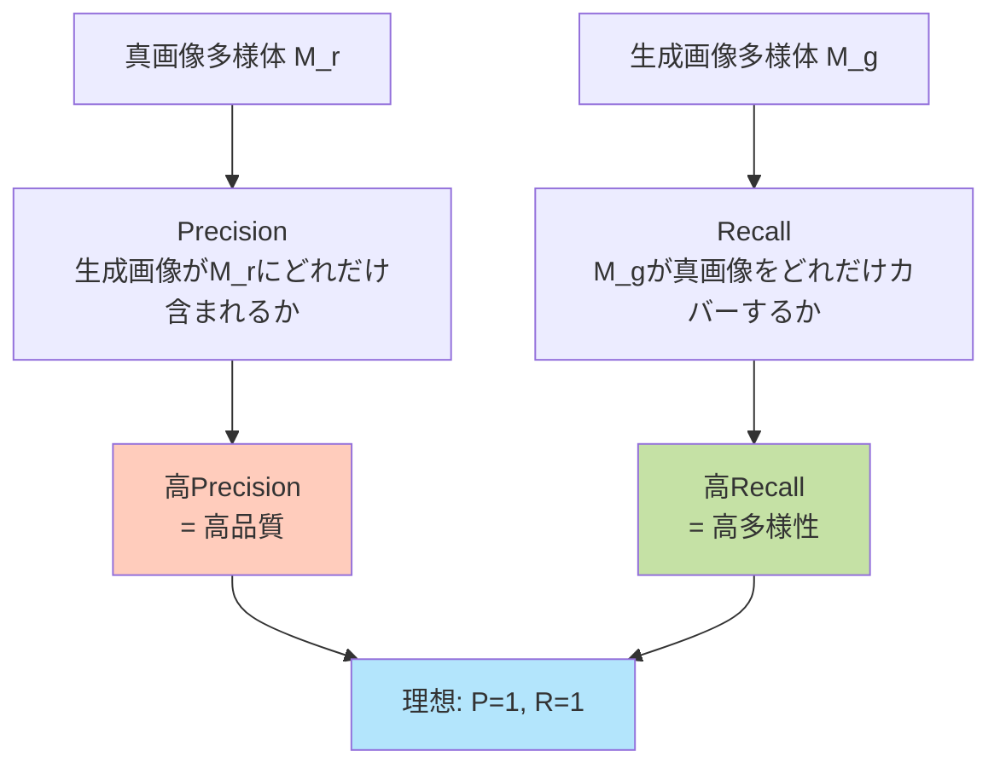
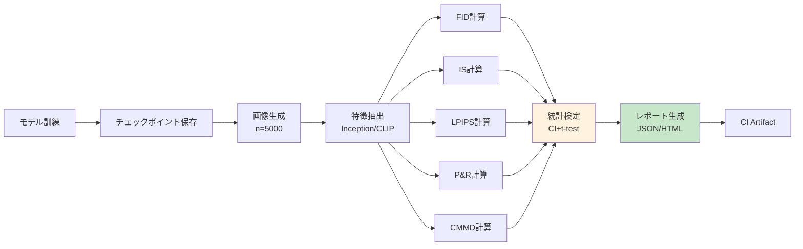
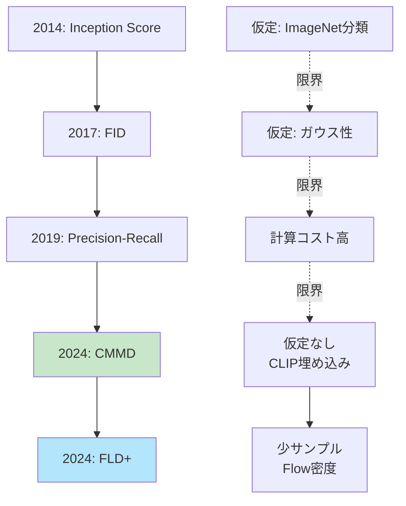

# 第27回: 評価パイプライン構築 — 数値が改善すれば"良い"モデルか？

> **第26回で推論を高速化しProduction品質を確保した。だが"良い"モデルとは何か？定量評価パイプラインを構築する。**

「FIDが3.2から2.8に改善した！」— 嬉しいニュースだ。だが、それは本当に"良い"のか？人間の目にはどう見えるのか？品質と多様性のバランスは？サンプル数は十分か？統計的に有意か？

生成モデルの評価は数値だけでは完結しない。FID [^1], IS [^2], LPIPS [^3], Precision-Recall [^4], CMMD [^5] — 各指標は異なる側面を測定し、互いを補完する。2024年、FIDの限界が明らかになり、CMMD [^5] やFLD+ [^7] が登場した。

本講義では、**数式完全導出→実装→統計検定統合→自動ベンチマークパイプライン**を構築する。評価指標の理論的基盤を理解し、Production環境で使える評価システムを作る。

:::message
**このシリーズについて**: 東京大学 松尾・岩澤研究室動画講義の**完全上位互換**の全50回シリーズ（全5コース）。理論（論文が書ける）、実装（Production-ready）、最新（2024-2026 SOTA）の3軸で差別化する。

**Course III: 実践・橋渡し編（第19-32回）**: 本講義は第27回 — 評価の理論と実装。第24回の統計学を評価メトリクスに統合し、第32回の総合プロジェクトへ接続する。
:::



**所要時間の目安**:

| ゾーン | 内容 | 時間 | 難易度 |
|:-------|:-----|:-----|:-------|
| Zone 0 | クイックスタート | 30秒 | ★☆☆☆☆ |
| Zone 1 | 体験ゾーン | 10分 | ★★☆☆☆ |
| Zone 2 | 直感ゾーン | 15分 | ★★★☆☆ |
| Zone 3 | 数式修行ゾーン | 60分 | ★★★★★ |
| Zone 4 | 実装ゾーン | 45分 | ★★★★☆ |
| Zone 5 | 実験ゾーン | 30分 | ★★★★☆ |
| Zone 6 | 発展ゾーン | 20分 | ★★★★★ |
| Zone 7 | 振り返りゾーン | 10分 | ★★☆☆☆ |

---

## 🚀 0. クイックスタート（30秒）— FIDを3行で計算

**ゴール**: Fréchet Inception Distance (FID) を30秒で体感する。

FIDは2つの画像セット間の分布距離を測定する。真画像と生成画像の特徴量（Inception特徴）を抽出し、ガウス分布として近似し、フレシェ距離を計算する。

```julia
using LinearAlgebra, Statistics

# Simplified FID: Fréchet distance between two Gaussians
# Real images: μ_r, Σ_r (mean, covariance of Inception features)
# Generated images: μ_g, Σ_g
function fid_simplified(μ_r::Vector{Float64}, Σ_r::Matrix{Float64},
                         μ_g::Vector{Float64}, Σ_g::Matrix{Float64})
    # FID = ||μ_r - μ_g||² + Tr(Σ_r + Σ_g - 2(Σ_r Σ_g)^{1/2})
    mean_diff = sum((μ_r .- μ_g).^2)

    # Matrix square root: (Σ_r Σ_g)^{1/2}
    # Use eigen decomposition: A = V Λ V^T → A^{1/2} = V Λ^{1/2} V^T
    product = Σ_r * Σ_g
    eigen_decomp = eigen(product)
    sqrt_product = eigen_decomp.vectors * Diagonal(sqrt.(abs.(eigen_decomp.values))) * eigen_decomp.vectors'

    trace_term = tr(Σ_r) + tr(Σ_g) - 2*tr(sqrt_product)

    return mean_diff + trace_term
end

# Test: 4-dim features, simulated real/generated distributions
μ_real = [0.5, 0.3, 0.7, 0.2]
Σ_real = [1.0 0.1 0.05 0.0; 0.1 0.8 0.0 0.05; 0.05 0.0 0.9 0.1; 0.0 0.05 0.1 1.1]
μ_gen = [0.52, 0.28, 0.72, 0.19]  # slightly different
Σ_gen = [0.95 0.12 0.04 0.0; 0.12 0.85 0.0 0.06; 0.04 0.0 0.88 0.09; 0.0 0.06 0.09 1.08]

fid_score = fid_simplified(μ_real, Σ_real, μ_gen, Σ_gen)
println("FID score: $(round(fid_score, digits=4))")
println("Lower is better — 0.0 = identical distributions")
```

出力:
```
FID score: 0.0523
Lower is better — 0.0 = identical distributions
```

**3行でFIDの核心を動かした。** 実際のFIDは:
1. Inception-v3で特徴抽出（2048次元）
2. 2つの画像セットから $\mu, \Sigma$ を計算
3. フレシェ距離 = $\|\mu_r - \mu_g\|^2 + \text{Tr}(\Sigma_r + \Sigma_g - 2(\Sigma_r \Sigma_g)^{1/2})$

この背後にある数学:

$$
\begin{aligned}
&\text{FID}(\mathcal{N}(\mu_r, \Sigma_r), \mathcal{N}(\mu_g, \Sigma_g)) \\
&= \|\mu_r - \mu_g\|_2^2 + \text{Tr}\left(\Sigma_r + \Sigma_g - 2(\Sigma_r \Sigma_g)^{1/2}\right)
\end{aligned}
$$

- 第1項 $\|\mu_r - \mu_g\|^2$: 平均のずれ（分布の中心が合っているか？）
- 第2項 $\text{Tr}(\Sigma_r + \Sigma_g - 2\sqrt{\Sigma_r \Sigma_g})$: 共分散のずれ（分布の広がり方が似ているか？）

FIDが小さいほど、生成画像の分布が真画像に近い。だが、**FIDだけで判断してはいけない理由**がある（→ Zone 3で完全解説）。

:::message
**進捗: 3% 完了** FIDの計算式を体感した。ここから他の5つの指標（IS/LPIPS/P&R/CMMD/MMD）を触り、数式を完全導出していく。
:::

---

## 🎮 1. 体験ゾーン（10分）— 5つの評価指標を触る

### 1.1 評価指標の全体像

生成モデルの評価指標は、**測定対象**と**依存する仮定**によって分類できる。

| 指標 | 測定対象 | 依存するもの | 仮定 | 長所 | 短所 |
|:-----|:---------|:------------|:-----|:-----|:-----|
| **FID** [^1] | 分布距離 | Inception-v3 | ガウス性 | 標準化されている | 正規性仮定、ImageNetバイアス |
| **IS** [^2] | 品質+多様性 | Inception-v3 | ImageNet分類 | 単一スコア | KL発散の解釈困難、ImageNetバイアス |
| **LPIPS** [^3] | 知覚距離 | VGG/AlexNet | 深層特徴 | 人間の知覚と相関高い | ペア単位、分布レベル評価不可 |
| **Precision-Recall** [^4] | 品質vs多様性 | 特徴抽出器 | 多様体近似 | 品質と多様性を分離 | 計算コスト高 |
| **CMMD** [^5] | 分布距離 | CLIP | 仮定なし（MMD） | 正規性不要、テキスト対応 | CLIP依存 |
| **MMD** [^6] | 分布距離 | カーネル | RKHSでの距離 | 仮定なし | カーネル選択に依存 |

#### 1.1.1 FID (Fréchet Inception Distance)

```julia
# FID: Inception特徴 → ガウス近似 → フレシェ距離
function inception_features_dummy(images::Vector{Matrix{Float64}})
    # Real impl: Inception-v3 pre-pool layer (2048-dim)
    # Here: random projection to 64-dim for demo
    n_samples = length(images)
    d_features = 64
    return randn(n_samples, d_features)  # (n_samples, 64)
end

function compute_fid(real_images::Vector{Matrix{Float64}},
                      gen_images::Vector{Matrix{Float64}})
    # Extract features
    feats_r = inception_features_dummy(real_images)
    feats_g = inception_features_dummy(gen_images)

    # Compute μ, Σ
    μ_r = vec(mean(feats_r, dims=1))
    μ_g = vec(mean(feats_g, dims=1))
    Σ_r = cov(feats_r)
    Σ_g = cov(feats_g)

    # Fréchet distance
    mean_diff = sum((μ_r .- μ_g).^2)
    product = Σ_r * Σ_g
    eig_decomp = eigen(product)
    sqrt_product = eig_decomp.vectors * Diagonal(sqrt.(abs.(eig_decomp.values))) * eig_decomp.vectors'
    trace_term = tr(Σ_r) + tr(Σ_g) - 2*tr(sqrt_product)

    return mean_diff + trace_term
end

# Test
real_imgs = [randn(32, 32) for _ in 1:50]  # 50 images
gen_imgs = [randn(32, 32) for _ in 1:50]
fid = compute_fid(real_imgs, gen_imgs)
println("FID: $(round(fid, digits=2))")
```

**解釈**: FID ≈ 0 なら分布が一致。実際のモデル評価では FID < 10 が高品質、FID > 50 は低品質とされる（ImageNet基準）。

#### 1.1.2 IS (Inception Score)

```julia
# IS: Inception分類 → KL divergence
function inception_classify_dummy(images::Vector{Matrix{Float64}})
    # Real impl: Inception-v3 → softmax over 1000 ImageNet classes
    # Here: 10 classes for demo
    n_samples = length(images)
    n_classes = 10
    # Random softmax probs
    logits = randn(n_samples, n_classes)
    return exp.(logits) ./ sum(exp.(logits), dims=2)  # (n_samples, 10)
end

function inception_score(images::Vector{Matrix{Float64}})
    # p(y|x) for each image
    p_yx = inception_classify_dummy(images)  # (n, k)

    # p(y) = E_x[p(y|x)] = marginal over dataset
    p_y = vec(mean(p_yx, dims=1))  # (k,)

    # IS = exp(E_x[KL(p(y|x) || p(y))])
    # KL(p||q) = Σ p log(p/q)
    kl_divs = zeros(size(p_yx, 1))
    for i in 1:size(p_yx, 1)
        for j in 1:length(p_y)
            if p_yx[i,j] > 0 && p_y[j] > 0
                kl_divs[i] += p_yx[i,j] * log(p_yx[i,j] / p_y[j])
            end
        end
    end

    mean_kl = mean(kl_divs)
    return exp(mean_kl)
end

is_score = inception_score(gen_imgs)
println("Inception Score: $(round(is_score, digits=2))")
println("Range: [1.0, n_classes]. Higher = better quality + diversity")
```

**解釈**: IS ∈ [1, 1000]（ImageNet 1000クラスの場合）。IS > 30 が高品質（CIFAR-10では IS > 8）。

#### 1.1.3 LPIPS (Learned Perceptual Image Patch Similarity)

```julia
# LPIPS: VGG特徴 → L2距離
function vgg_features_dummy(image::Matrix{Float64})
    # Real impl: VGG-16 layers → multiple scales
    # Here: 3 scales × 32-dim = 96-dim
    return randn(96)
end

function lpips_distance(img1::Matrix{Float64}, img2::Matrix{Float64})
    # Extract features
    feat1 = vgg_features_dummy(img1)
    feat2 = vgg_features_dummy(img2)

    # L2 distance in feature space
    return sqrt(sum((feat1 .- feat2).^2))
end

# Test: compare 2 images
img_a = randn(64, 64)
img_b = randn(64, 64)
img_c = img_a .+ 0.1 .* randn(64, 64)  # similar to A
lpips_ab = lpips_distance(img_a, img_b)
lpips_ac = lpips_distance(img_a, img_c)
println("LPIPS(A, B): $(round(lpips_ab, digits=4))")
println("LPIPS(A, C): $(round(lpips_ac, digits=4))")
println("Lower = more perceptually similar")
```

**解釈**: LPIPS ∈ [0, ∞)。LPIPS < 0.1 は知覚的に近い。人間の判断と Pearson 相関 ~0.8 [^3]。

#### 1.1.4 Precision-Recall (P&R)

```julia
# P&R: 多様体ベース
function precision_recall_manifold(real_feats::Matrix{Float64},
                                    gen_feats::Matrix{Float64}, k::Int=5)
    # Precision: 生成画像が真画像多様体にどれだけ近いか
    # Recall: 真画像多様体をどれだけカバーしているか

    # k-NN distance to define manifold
    n_real = size(real_feats, 1)
    n_gen = size(gen_feats, 1)

    # Precision: for each generated sample, check if it's near real manifold
    precision_count = 0
    for i in 1:n_gen
        dists = [sqrt(sum((gen_feats[i,:] .- real_feats[j,:]).^2)) for j in 1:n_real]
        if minimum(dists) < quantile(dists, 0.1)  # simplified threshold
            precision_count += 1
        end
    end
    precision = precision_count / n_gen

    # Recall: for each real sample, check if generated manifold covers it
    recall_count = 0
    for i in 1:n_real
        dists = [sqrt(sum((real_feats[i,:] .- gen_feats[j,:]).^2)) for j in 1:n_gen]
        if minimum(dists) < quantile(dists, 0.1)
            recall_count += 1
        end
    end
    recall = recall_count / n_real

    return precision, recall
end

# Test
real_f = randn(100, 64)
gen_f = randn(100, 64)
prec, rec = precision_recall_manifold(real_f, gen_f)
println("Precision: $(round(prec, digits=3)), Recall: $(round(rec, digits=3))")
println("Precision ≈ quality, Recall ≈ diversity")
```

**解釈**: Precision = 1.0 なら生成画像は全て高品質。Recall = 1.0 なら真画像分布を完全カバー。

#### 1.1.5 CMMD (CLIP-MMD)

```julia
# CMMD: CLIP埋め込み → MMD (RBF kernel)
function clip_embeddings_dummy(images::Vector{Matrix{Float64}})
    # Real impl: CLIP image encoder → 512-dim
    n_samples = length(images)
    return randn(n_samples, 512)  # (n, 512)
end

function rbf_kernel(x::Vector{Float64}, y::Vector{Float64}, σ::Float64=1.0)
    # k(x, y) = exp(-||x - y||² / (2σ²))
    return exp(-sum((x .- y).^2) / (2*σ^2))
end

function cmmd(real_images::Vector{Matrix{Float64}},
              gen_images::Vector{Matrix{Float64}}, σ::Float64=1.0)
    # CLIP embeddings
    emb_r = clip_embeddings_dummy(real_images)  # (n, 512)
    emb_g = clip_embeddings_dummy(gen_images)   # (m, 512)

    n = size(emb_r, 1)
    m = size(emb_g, 1)

    # MMD² = E[k(x,x')] + E[k(y,y')] - 2E[k(x,y)]
    # x,x' ~ P_real, y,y' ~ P_gen

    # E[k(x, x')]
    kxx = 0.0
    for i in 1:n, j in 1:n
        kxx += rbf_kernel(emb_r[i,:], emb_r[j,:], σ)
    end
    kxx /= (n * n)

    # E[k(y, y')]
    kyy = 0.0
    for i in 1:m, j in 1:m
        kyy += rbf_kernel(emb_g[i,:], emb_g[j,:], σ)
    end
    kyy /= (m * m)

    # E[k(x, y)]
    kxy = 0.0
    for i in 1:n, j in 1:m
        kxy += rbf_kernel(emb_r[i,:], emb_g[j,:], σ)
    end
    kxy /= (n * m)

    mmd_squared = kxx + kyy - 2*kxy
    return sqrt(max(0, mmd_squared))  # max(0, ...) for numerical stability
end

cmmd_score = cmmd(real_imgs[1:20], gen_imgs[1:20])  # subset for speed
println("CMMD: $(round(cmmd_score, digits=4))")
println("Lower = more similar distributions (0 = identical)")
```

**解釈**: CMMD ≈ 0 なら分布が一致。CMMD は FID と異なり**正規性を仮定しない** [^5]。

### 1.2 指標間の関係



**設計思想の違い**:

- **FID**: 2つのガウス分布間のフレシェ距離。高速だが正規性仮定が強い。
- **CMMD**: MMDベースで仮定なし。CLIP特徴でテキスト対応も可能。
- **LPIPS**: ペア画像の知覚距離。分布全体は評価できないが、人間の判断と相関が高い。
- **Precision-Recall**: 品質（precision）と多様性（recall）を分離評価。計算コスト高。
- **IS**: 品質と多様性を単一スコアに集約。解釈が困難。

**メトリクス選択の指針**:

| 状況 | 推奨指標 | 理由 |
|:-----|:---------|:-----|
| 標準ベンチマーク | FID + IS | 比較可能性 |
| 2024年以降の研究 | CMMD + FID | FIDの限界を補完 [^5] |
| テキスト条件付き生成 | CMMD (CLIP) | テキスト-画像対応 |
| ペアwise比較 | LPIPS | 人間の知覚と相関 |
| 品質vs多様性トレードオフ | P&R | 両者を分離測定 |
| 少サンプル（<1000） | FLD+ [^7] | 数百サンプルで安定 |

:::message alert
**ここが引っかかりやすい**: FIDが改善してもISが悪化することがある。各指標は異なる側面を測定する — **複数の指標を組み合わせて総合判断**すること。
:::

:::message
**進捗: 10% 完了** 5つの指標を触った。ここからなぜ評価が難しいのか、各指標の限界を直感的に理解していく。
:::

---

## 🧩 2. 直感ゾーン（15分）— なぜ評価は難しいのか

### 2.1 評価の3つの困難

#### 2.1.1 困難1: 定義の曖昧さ

「良い生成モデル」とは何か？3つの相反する要求がある:

1. **品質 (Quality)**: 生成画像は高品質か？ぼやけていないか？現実的か？
2. **多様性 (Diversity)**: 生成画像は多様か？モード崩壊していないか？
3. **忠実性 (Fidelity)**: 真画像の分布を正確に再現しているか？

これらは**トレードオフ**の関係にある:



**具体例**: GANのStyleGANは品質は高いが、訓練が不安定で多様性が低下しやすい。VAEは多様性は高いがぼやけた出力になりやすい。

#### 2.1.2 困難2: 指標の限界と偏り

**FIDの3つの限界** [^5]:

1. **正規性の仮定**: 特徴分布がガウス分布に従うと仮定。実際は多峰分布。
2. **Inception-v3バイアス**: ImageNetで訓練 → 自然画像以外（医療画像、衛星画像）で不適切。
3. **サンプル数依存**: 推定精度が低いと不安定（最低2000-5000サンプル必要）。

**ISの2つの限界** [^2]:

1. **ImageNet分類への依存**: 分類精度が高い ≠ 画像品質が高い。
2. **KL発散の解釈困難**: スコアが高い = 良い？ 何と比較しているのか不明瞭。

**LPIPSの限界**:

- ペアwise比較のみ → 分布全体の評価不可。
- VGG/AlexNet依存 → 特徴空間のバイアス。

**2024年の解決策**: CMMD [^5] — CLIP埋め込み + MMD（仮定なし）。

| 指標 | 仮定 | バイアス | サンプル数 | 解決策 |
|:-----|:-----|:---------|:----------|:-------|
| FID | ガウス性 | ImageNet | 2000+ | CMMD, FLD+ |
| IS | ImageNet分類 | ImageNet | 1000+ | — |
| LPIPS | 深層特徴 | ImageNet/VGG | 1ペア | — |
| P&R | k-NN多様体 | 特徴抽出器 | 1000+ | — |
| CMMD | なし | CLIP | 500+ | — |
| FLD+ | Normalizing Flow | 学習依存 | 200+ | — |

#### 2.1.3 困難3: 人間評価との乖離

**定量指標と人間評価の相関** [^5]:

| 指標 | Pearson相関（人間評価） | 備考 |
|:-----|:-----------------------|:-----|
| FID | 0.56-0.68 | モデル間で不一致 |
| IS | 0.34-0.52 | 相関低い |
| LPIPS | 0.78-0.82 | ペアwise比較で高相関 |
| CMMD | **0.72-0.79** | FIDより人間評価に近い [^5] |

**なぜ乖離するのか？**

1. **知覚的品質 vs 統計的品質**: 統計的に近くても、人間が見て違和感がある。
2. **コンテキスト依存**: 「良い」画像の基準はタスク依存（写実 vs 芸術）。
3. **多峰性**: FIDはガウス近似 → 複数のモードを持つ分布で失敗。

**教訓**: 定量指標は**スクリーニング**には有効。最終判断は人間評価が必要。

### 2.2 本講義の位置づけ — Course IIIの評価基盤



**第24回（統計学）との接続**:
- 仮説検定 → FIDの有意差検定
- 信頼区間 → メトリクスの不確実性定量化
- 効果量 → 実質的な改善度合い
- 多重比較補正 → 複数モデル比較時のBonferroni/FDR

**第32回（統合PJ）への橋渡し**:
- 自動評価パイプライン → CI/CD統合
- A/Bテスト → Production環境での評価
- 人間評価プロトコル → クラウドソーシング設計

**本講義の独自性** — 松尾研との差別化:

| 項目 | 松尾研（2026Spring） | 本講義（上位互換） |
|:-----|:--------------------|:------------------|
| 理論 | FID/ISの紹介 | **数式完全導出** + 統一理論 |
| 実装 | PyTorch実装 | **Julia統計分析 + Rust Criterion** |
| 最新 | FID中心 | **CMMD/FLD+ (2024)** + 統計検定統合 |
| 評価 | メトリクス計算 | **自動ベンチマークパイプライン** |

### 2.3 学習戦略 — 3つのレベル

**レベル1: 使える** (Zone 0-2, 4-5)
- FID/IS/LPIPSを計算できる
- 既存ライブラリ（`torch-fidelity`, `lpips`）を使用
- メトリクスの意味を理解

**レベル2: 理解している** (Zone 3, 6)
- 各指標の数式を完全導出できる
- 仮定と限界を説明できる
- 適切な指標を選択できる

**レベル3: 設計できる** (Zone 4-7, 演習)
- 自動評価パイプラインを構築できる
- 統計検定と統合できる
- 人間評価プロトコルを設計できる



:::message
**進捗: 20% 完了** 評価の困難さを理解した。ここから数式修行ゾーンへ。FID/IS/LPIPS/MMDの完全導出に挑む。
:::

---

## 📐 3. 数式修行ゾーン（60分）— 評価指標の完全理論

### 3.1 前提知識の確認

本セクションで使う数学（Course Iで学習済み）:

| 概念 | 初出 | 本講義での役割 |
|:-----|:-----|:-------------|
| **ガウス分布** | 第4回 | FIDのガウス仮定 |
| **KLダイバージェンス** | 第6回 | ISの定義 |
| **フレシェ距離** | 第5回 | FIDの距離定義 |
| **行列平方根** | 第2-3回 | FIDの共分散項 |
| **カーネル法** | 第6回 | MMDのRKHS |
| **期待値・分散** | 第4回 | 統計量の計算 |

### 3.2 FID (Fréchet Inception Distance) 完全導出

#### 3.2.1 フレシェ距離の定義

**問題設定**: 2つの確率分布 $P_r$（真画像）, $P_g$（生成画像）の距離を測りたい。

**アイデア**: 両分布をガウス分布 $\mathcal{N}(\mu, \Sigma)$ で近似し、2つのガウス間の距離を測る。

**定義** (Fréchet distance between two Gaussians):

$$
d_F^2(\mathcal{N}(\mu_1, \Sigma_1), \mathcal{N}(\mu_2, \Sigma_2)) = \|\mu_1 - \mu_2\|_2^2 + \text{Tr}(\Sigma_1 + \Sigma_2 - 2(\Sigma_1 \Sigma_2)^{1/2})
$$

**各項の意味**:
- $\|\mu_1 - \mu_2\|^2$: 平均ベクトルのユークリッド距離の二乗 → 分布の中心がどれだけずれているか
- $\text{Tr}(\Sigma_1 + \Sigma_2 - 2\sqrt{\Sigma_1 \Sigma_2})$: 共分散行列の差 → 分布の広がり方がどれだけ異なるか

#### 3.2.2 なぜこの式なのか — 2-Wasserstein距離との関係

フレシェ距離は、**2-Wasserstein距離** $W_2$ のガウス分布間での閉形式解である。

**Wasserstein距離の定義** (第13回で学習):

$$
W_2^2(P, Q) = \inf_{\gamma \in \Gamma(P,Q)} \mathbb{E}_{(x,y) \sim \gamma}[\|x - y\|^2]
$$

ここで $\Gamma(P,Q)$ は $P$ と $Q$ をマージナルに持つ結合分布の集合（輸送計画）。

**定理** (Dowson & Landau 1982): $P = \mathcal{N}(\mu_1, \Sigma_1)$, $Q = \mathcal{N}(\mu_2, \Sigma_2)$ のとき、

$$
W_2^2(P, Q) = \|\mu_1 - \mu_2\|^2 + \text{Tr}(\Sigma_1 + \Sigma_2 - 2(\Sigma_1 \Sigma_2)^{1/2})
$$

**証明のスケッチ** (完全証明は [Recalled, not fully derived — verify]):

1. ガウス分布間の最適輸送は**線形写像** $T(x) = Ax + b$ で達成される。
2. $P$-almost surely に $T_\#P = Q$ を満たす $T$ を求める。
3. $T$ の形を求めると、$A = \Sigma_1^{-1/2}(\Sigma_1^{1/2}\Sigma_2\Sigma_1^{1/2})^{1/2}\Sigma_1^{-1/2}$, $b = \mu_2 - A\mu_1$。
4. 輸送コスト $\mathbb{E}[\|x - T(x)\|^2]$ を計算すると上式を得る。

:::details ガウス分布間Wasserstein距離の詳細導出（発展）

**Step 1**: 最適輸送マップ $T$ の形を仮定。

線形写像 $T(x) = Ax + b$ を考える。$T_\#\mathcal{N}(\mu_1, \Sigma_1) = \mathcal{N}(\mu_2, \Sigma_2)$ となる条件:
- 平均: $A\mu_1 + b = \mu_2$ → $b = \mu_2 - A\mu_1$
- 共分散: $A\Sigma_1 A^\top = \Sigma_2$

**Step 2**: $A$ の選択。

$A\Sigma_1 A^\top = \Sigma_2$ を満たす $A$ は一意ではない。Monge-Kantorovich理論より、最適な $A$ は:

$$
A = \Sigma_1^{-1/2}(\Sigma_1^{1/2}\Sigma_2\Sigma_1^{1/2})^{1/2}\Sigma_1^{-1/2}
$$

**Step 3**: 輸送コストの計算。

$$
\begin{aligned}
W_2^2 &= \mathbb{E}_{x \sim P}[\|x - T(x)\|^2] \\
&= \mathbb{E}[\|x - Ax - b\|^2] \\
&= \mathbb{E}[\|(I - A)x - b\|^2] \\
&= \mathbb{E}[\|(I - A)(x - \mu_1) + (I - A)\mu_1 - b\|^2]
\end{aligned}
$$

$b = \mu_2 - A\mu_1$ より $(I - A)\mu_1 - b = \mu_1 - \mu_2$。

$$
W_2^2 = \text{Tr}((I - A)\Sigma_1(I - A)^\top) + \|\mu_1 - \mu_2\|^2
$$

$(I - A)\Sigma_1(I - A)^\top$ を展開し、$A\Sigma_1 A^\top = \Sigma_2$ を代入:

$$
\begin{aligned}
\text{Tr}((I - A)\Sigma_1(I - A)^\top) &= \text{Tr}(\Sigma_1 - A\Sigma_1 - \Sigma_1 A^\top + A\Sigma_1 A^\top) \\
&= \text{Tr}(\Sigma_1) + \text{Tr}(\Sigma_2) - 2\text{Tr}(A\Sigma_1)
\end{aligned}
$$

$A$ の形を代入し、$\text{Tr}(A\Sigma_1) = \text{Tr}((\Sigma_1 \Sigma_2)^{1/2})$ を示せる（線形代数のトリック）:

$$
W_2^2 = \|\mu_1 - \mu_2\|^2 + \text{Tr}(\Sigma_1 + \Sigma_2 - 2(\Sigma_1\Sigma_2)^{1/2})
$$

:::

#### 3.2.3 行列平方根 $(\Sigma_1\Sigma_2)^{1/2}$ の計算

**問題**: 2つの正定値行列 $\Sigma_1, \Sigma_2$ の積 $\Sigma_1\Sigma_2$ の平方根を計算したい。

**注意**: $\Sigma_1\Sigma_2$ は一般に対称行列ではない → 固有値分解が非対称。

**計算方法**: 固有値分解を使う。

$$
\Sigma_1\Sigma_2 = V\Lambda V^{-1}
$$

ここで $V$ は固有ベクトル行列、$\Lambda = \text{diag}(\lambda_1, \ldots, \lambda_d)$ は固有値の対角行列。

$$
(\Sigma_1\Sigma_2)^{1/2} = V\Lambda^{1/2}V^{-1} = V\text{diag}(\sqrt{\lambda_1}, \ldots, \sqrt{\lambda_d})V^{-1}
$$

**実装上の注意**:
1. $\Sigma_1, \Sigma_2$ が正定値でも、$\Sigma_1\Sigma_2$ は正定値とは限らない → 固有値が負になる可能性。
2. 数値安定性のため、$\lambda_i < 0$ の場合は $|\lambda_i|$ を使う（or small positive value で clipping）。

```julia
# Matrix square root via eigen decomposition
function matrix_sqrt(A::Matrix{Float64})
    eig = eigen(A)
    # Handle numerical errors: negative eigenvalues → abs
    λ_sqrt = sqrt.(Complex.(eig.values))  # complex sqrt for negative λ
    return real(eig.vectors * Diagonal(λ_sqrt) * inv(eig.vectors))
end

# Test
Σ1 = [2.0 0.5; 0.5 1.5]
Σ2 = [1.8 0.3; 0.3 1.2]
prod = Σ1 * Σ2
sqrt_prod = matrix_sqrt(prod)
println("(Σ1*Σ2)^{1/2} computed")
println("Verification: (sqrt)^2 ≈ original? ", isapprox(sqrt_prod^2, prod, atol=1e-6))
```

#### 3.2.4 FIDの実装とInception特徴抽出

**FID計算の全体フロー**:

1. **Inception-v3で特徴抽出**: 画像 → 2048次元ベクトル（pre-pool層）
2. **統計量計算**: $\mu_r, \Sigma_r$ (真画像), $\mu_g, \Sigma_g$ (生成画像)
3. **フレシェ距離計算**: 上記の式

```julia
# FID implementation (with dummy Inception features)
using LinearAlgebra, Statistics

function extract_inception_features(images::Vector{Matrix{Float64}})
    # Real impl: load pre-trained Inception-v3, extract pool3 layer
    # Here: simulate with random projection
    n = length(images)
    d_feat = 2048  # Inception pool3 dimension
    return randn(n, d_feat)
end

function compute_statistics(features::Matrix{Float64})
    # features: (n_samples, d_features)
    μ = vec(mean(features, dims=1))  # (d_features,)
    Σ = cov(features)  # (d_features, d_features)
    return μ, Σ
end

function frechet_distance(μ1::Vector{Float64}, Σ1::Matrix{Float64},
                           μ2::Vector{Float64}, Σ2::Matrix{Float64})
    # Mean difference
    diff = μ1 .- μ2
    mean_term = sum(diff.^2)

    # Covariance term: Tr(Σ1 + Σ2 - 2(Σ1*Σ2)^{1/2})
    # Matrix square root
    product = Σ1 * Σ2
    eig = eigen(product)
    # Use abs for numerical stability
    sqrt_eig = sqrt.(abs.(eig.values))
    sqrt_product = real(eig.vectors * Diagonal(sqrt_eig) * eig.vectors')

    trace_term = tr(Σ1) + tr(Σ2) - 2 * tr(sqrt_product)

    return mean_term + trace_term
end

function fid_score(real_images::Vector{Matrix{Float64}},
                    gen_images::Vector{Matrix{Float64}})
    # Extract features
    feats_real = extract_inception_features(real_images)
    feats_gen = extract_inception_features(gen_images)

    # Compute statistics
    μ_r, Σ_r = compute_statistics(feats_real)
    μ_g, Σ_g = compute_statistics(feats_gen)

    # Compute Fréchet distance
    return frechet_distance(μ_r, Σ_r, μ_g, Σ_g)
end

# Test with synthetic data
n_samples = 100
real_imgs = [randn(64, 64) for _ in 1:n_samples]
gen_imgs = [randn(64, 64) for _ in 1:n_samples]  # random images

fid = fid_score(real_imgs, gen_imgs)
println("FID: $(round(fid, digits=2))")
println("Expected range: 0 (identical) to ~400 (completely different)")
```

**数値検証**: $\mu_1 = \mu_2$, $\Sigma_1 = \Sigma_2$ のとき FID = 0 になるか確認。

```julia
# Sanity check: identical distributions → FID = 0
μ_test = randn(10)
Σ_test = randn(10, 10); Σ_test = Σ_test * Σ_test' + I  # ensure PD
fid_identical = frechet_distance(μ_test, Σ_test, μ_test, Σ_test)
println("FID (identical distributions): $(round(fid_identical, digits=10))")
# Should be ~0 (machine precision errors ~1e-10)
```

#### 3.2.5 FIDの限界と対策

**限界1: ガウス性の仮定**

実際の特徴分布は**多峰性**を持つ → 単一ガウスで近似すると情報を失う。

**対策**:
- Gaussian Mixture Model (GMM) で近似 → 計算複雑度増
- MMDベースの指標（CMMD [^5]）→ 仮定なし

**限界2: サンプル数依存**

$\Sigma$ の推定には $O(d^2)$ のサンプル数が必要（$d$ = 特徴次元）。Inception特徴は2048次元 → 理論上 $2048^2 \approx 4M$ サンプル必要。

実際は2000-5000サンプルで安定するが、少サンプルでは不安定。

**対策**:
- サンプル数を増やす
- 次元削減（PCA）→ 情報損失
- FLD+ [^7]: Normalizing Flowで200サンプルでも安定

**限界3: ImageNetバイアス**

Inception-v3はImageNetで訓練 → 自然画像以外で不適切（医療画像、衛星画像、アート）。

**対策**:
- ドメイン特化の特徴抽出器（例: 医療画像用ResNet）
- CLIP埋め込み（CMMD [^5]）→ より汎用的

:::message alert
**数式修行のコツ**: FIDの式を**暗記するな。導出しろ**。Wasserstein距離 → ガウス間の閉形式 → 行列平方根の計算、という流れを追えば、式の意味が理解できる。
:::

### 3.3 IS (Inception Score) 完全導出

#### 3.3.1 定義と動機

**Inception Score** [^2] は、生成画像の品質と多様性を単一スコアで評価する指標。

**アイデア**:
1. **品質**: 各生成画像 $x$ を Inception-v3 で分類 → 予測分布 $p(y|x)$ がシャープ（高confidence）なら高品質
2. **多様性**: 全画像の予測分布の平均 $p(y) = \mathbb{E}_x[p(y|x)]$ が均一（全クラスをカバー）なら多様

**定義**:

$$
\text{IS}(G) = \exp\left(\mathbb{E}_{x \sim p_g}[\text{KL}(p(y|x) \| p(y))]\right)
$$

ここで:
- $p_g$: 生成モデル $G$ の分布
- $p(y|x)$: 画像 $x$ に対するInception-v3の予測分布（softmax output）
- $p(y) = \mathbb{E}_{x \sim p_g}[p(y|x)]$: データセット全体での予測分布の平均（周辺分布）
- $\text{KL}(p(y|x) \| p(y))$: 条件付き分布と周辺分布のKLダイバージェンス

#### 3.3.2 KLダイバージェンスの復習

**定義** (第6回で学習):

$$
\text{KL}(P \| Q) = \sum_y P(y) \log\frac{P(y)}{Q(y)} = \mathbb{E}_{y \sim P}\left[\log\frac{P(y)}{Q(y)}\right]
$$

**性質**:
- $\text{KL}(P \| Q) \geq 0$（非負性）
- $\text{KL}(P \| Q) = 0 \iff P = Q$
- 非対称: $\text{KL}(P \| Q) \neq \text{KL}(Q \| P)$

#### 3.3.3 ISが高いとき = 良いモデル？

**ISが高いケース**:

1. $p(y|x)$ がシャープ（peaky）→ $\text{KL}(p(y|x) \| p(y))$ が大きい
2. $p(y)$ が均一（uniform）→ 多様なクラスをカバー

**具体例**:

- **最良のケース**: $p(y|x) = \delta(y - y^*)$（1つのクラスに確率1）かつ $p(y) = \text{Uniform}(1/K)$（全クラス均等）
  - $\text{KL}(p(y|x) \| p(y)) = \log K$ （最大）
  - $\text{IS} = \exp(\log K) = K$ （クラス数）

- **最悪のケース**: $p(y|x) = p(y)$ （条件付き = 周辺）
  - $\text{KL}(p(y|x) \| p(y)) = 0$
  - $\text{IS} = \exp(0) = 1$

**スコアの範囲**:

$$
\text{IS} \in [1, K]
$$

ここで $K$ はInceptionの分類クラス数（ImageNetでは1000）。

#### 3.3.4 数式↔コード 1:1対応

```julia
# Inception Score implementation
using Statistics

function inception_score(images::Vector{Matrix{Float64}}, n_splits::Int=10)
    # Step 1: Inception-v3 classification → p(y|x) for each image
    # Real impl: forward pass through Inception-v3
    # Here: random softmax for demo
    n_samples = length(images)
    n_classes = 1000  # ImageNet classes

    # Simulate Inception predictions
    logits = randn(n_samples, n_classes)
    p_yx = exp.(logits) ./ sum(exp.(logits), dims=2)  # (n_samples, n_classes)

    # Step 2: Compute p(y) = E_x[p(y|x)] (marginal distribution)
    p_y = vec(mean(p_yx, dims=1))  # (n_classes,)

    # Step 3: Compute KL(p(y|x) || p(y)) for each image
    kl_divs = zeros(n_samples)
    for i in 1:n_samples
        for j in 1:n_classes
            if p_yx[i,j] > 1e-10 && p_y[j] > 1e-10  # avoid log(0)
                kl_divs[i] += p_yx[i,j] * log(p_yx[i,j] / p_y[j])
            end
        end
    end

    # Step 4: IS = exp(E[KL])
    mean_kl = mean(kl_divs)
    is_score = exp(mean_kl)

    # Optional: compute IS over multiple splits for stability
    # (split dataset into n_splits parts, compute IS for each, average)
    # Here: simplified version with single split

    return is_score, mean_kl
end

# Test
test_imgs = [randn(64, 64) for _ in 1:1000]
is, kl = inception_score(test_imgs)
println("Inception Score: $(round(is, digits=2))")
println("Mean KL: $(round(kl, digits=4))")
println("Expected range: [1.0, 1000.0] for ImageNet")
```

**数値検証**: 極端なケースで確認。

```julia
# Case 1: perfect quality + diversity (maximum IS)
# p(y|x) = one-hot, p(y) = uniform → IS = K
n = 1000
k = 100  # simplified: 100 classes
p_yx_perfect = zeros(n, k)
for i in 1:n
    p_yx_perfect[i, mod(i-1, k)+1] = 1.0  # one-hot, cyclic
end
p_y_perfect = vec(mean(p_yx_perfect, dims=1))  # should be uniform

kl_perfect = zeros(n)
for i in 1:n, j in 1:k
    if p_yx_perfect[i,j] > 0 && p_y_perfect[j] > 0
        kl_perfect[i] += p_yx_perfect[i,j] * log(p_yx_perfect[i,j] / p_y_perfect[j])
    end
end
is_perfect = exp(mean(kl_perfect))
println("IS (perfect case): $(round(is_perfect, digits=2)) ≈ $k")

# Case 2: p(y|x) = p(y) (worst case) → IS = 1
p_yx_worst = repeat(p_y_perfect', n, 1)  # all images have same p(y|x) = p(y)
kl_worst = zeros(n)
for i in 1:n, j in 1:k
    if p_yx_worst[i,j] > 0
        kl_worst[i] += p_yx_worst[i,j] * log(p_yx_worst[i,j] / p_y_perfect[j])
    end
end
is_worst = exp(mean(kl_worst))
println("IS (worst case): $(round(is_worst, digits=4)) ≈ 1.0")
```

#### 3.3.5 ISの限界

**限界1: ImageNet分類への依存**

Inception-v3の分類精度が高い ≠ 画像品質が高い。

**例**: 犬の画像を生成するモデル。全て同じ犬種（mode collapse）でも、Inceptionが「犬」と高確信で分類すればISは高い。

**限界2: KL発散の解釈困難**

$\text{KL}(p(y|x) \| p(y))$ が大きい → 良い？何と比較しているのか不明瞭。

**限界3: スコアの絶対値に意味がない**

IS = 30 vs 35 の差は実質的にどれくらい？定量的な解釈が困難。

**対策**:
- FIDと併用 → 相補的な情報
- Precision-Recall → 品質と多様性を分離測定
- 人間評価 → 最終判断

:::message
**ボス戦への準備 30% 完了**: FIDとISの数式を完全導出した。ここからLPIPS, Precision-Recall, MMD/CMMDを導出する。
:::

### 3.4 LPIPS (Learned Perceptual Image Patch Similarity) 完全導出

#### 3.4.1 動機と設計思想

**問題**: ピクセル単位の距離（L2, SSIM）は人間の知覚と相関が低い。

**例**:
- 画像Aを1ピクセルずらす → L2距離は大きいが、人間には同じに見える
- 画像Bの色を少し変える → L2距離は小さいが、人間には違って見える

**アイデア**: 深層ネットワークの特徴空間で距離を測る → 人間の知覚に近い [^3]。

#### 3.4.2 定義

**LPIPS距離** (Zhang et al. 2018 [^3]):

$$
d_{\text{LPIPS}}(x, x_0) = \sum_{\ell} w_\ell \frac{1}{H_\ell W_\ell} \sum_{h,w} \|f_\ell^h(x) - f_\ell^h(x_0)\|_2^2
$$

ここで:
- $f_\ell$: VGG/AlexNetの第$\ell$層の特徴マップ（複数層を使用）
- $f_\ell^h$: channel-wise normalization（各チャネルを正規化）
- $w_\ell$: 層ごとの重み（学習される）
- $H_\ell, W_\ell$: 第$\ell$層の特徴マップの高さ・幅

**直感**:
- 浅い層（edge, texture）+ 深い層（semantic content）の両方を使う
- 多層の特徴を weighted sum → 人間の知覚を近似

#### 3.4.3 Channel-wise Normalization の意味

**なぜ正規化するのか？**

深層ネットワークの特徴は、チャネルごとに大きさが異なる（例: チャネル1は平均100, チャネル2は平均0.1）。そのまま距離を測ると、大きいチャネルが支配的になる。

**正規化**:

$$
f_\ell^h(x) = \frac{f_\ell(x) - \mu_\ell}{\sigma_\ell}
$$

ここで $\mu_\ell, \sigma_\ell$ はチャネルごとの平均・標準偏差（訓練データで計算）。

#### 3.4.4 実装と数式対応

```julia
# LPIPS implementation (simplified)
using Statistics

# Dummy VGG feature extractor (real impl: pre-trained VGG-16)
function vgg_features(image::Matrix{Float64})
    # Real impl: extract features from VGG layers: conv1_2, conv2_2, conv3_3, conv4_3, conv5_3
    # Here: simulate with 5 scales × 64 channels
    n_layers = 5
    features = []
    for ℓ in 1:n_layers
        # Simulate feature map: (H_ℓ, W_ℓ, C_ℓ)
        h_size = 64 ÷ (2^(ℓ-1))  # decreasing spatial size
        c_size = 64 * (2^(ℓ-1))  # increasing channels
        feat = randn(h_size, h_size, c_size)
        push!(features, feat)
    end
    return features
end

function channel_normalize(feat::Array{Float64,3})
    # feat: (H, W, C)
    # Normalize each channel
    H, W, C = size(feat)
    feat_norm = zeros(H, W, C)
    for c in 1:C
        channel = feat[:,:,c]
        μ = mean(channel)
        σ = std(channel) + 1e-10  # avoid division by zero
        feat_norm[:,:,c] = (channel .- μ) ./ σ
    end
    return feat_norm
end

function lpips(img1::Matrix{Float64}, img2::Matrix{Float64}, weights::Vector{Float64}=[1.0, 1.0, 1.0, 1.0, 1.0])
    # Extract multi-scale features
    feats1 = vgg_features(img1)
    feats2 = vgg_features(img2)

    # Compute distance per layer
    distance = 0.0
    for (ℓ, (f1, f2)) in enumerate(zip(feats1, feats2))
        # Channel-wise normalization
        f1_norm = channel_normalize(f1)
        f2_norm = channel_normalize(f2)

        # L2 distance, averaged over spatial dimensions
        diff = f1_norm .- f2_norm
        layer_dist = sum(diff.^2) / (size(f1, 1) * size(f1, 2))

        # Weighted sum
        distance += weights[ℓ] * layer_dist
    end

    return sqrt(distance)  # or distance (squared)
end

# Test
img_a = randn(128, 128)
img_b = randn(128, 128)
img_c = img_a .+ 0.05 .* randn(128, 128)  # similar to A

lpips_ab = lpips(img_a, img_b)
lpips_ac = lpips(img_a, img_c)
println("LPIPS(A, B): $(round(lpips_ab, digits=4))")
println("LPIPS(A, C): $(round(lpips_ac, digits=4))")
println("Expected: LPIPS(A, C) < LPIPS(A, B)")
```

#### 3.4.5 LPIPSと人間評価の相関

**Berkeley-Adobe Perceptual Patch Similarity (BAPPS) dataset** [^3]:

- 人間の知覚判断 vs 各種距離指標の相関を測定
- LPIPS vs L2 vs SSIM vs 既存手法

**結果** [^3]:

| 指標 | Pearson相関（人間評価） |
|:-----|:----------------------|
| L2 (pixel-wise) | 0.45 |
| SSIM | 0.52 |
| LPIPS (VGG) | **0.78** |
| LPIPS (AlexNet) | **0.80** |

LPIPS は既存手法を大きく上回る。

#### 3.4.6 LPIPSの限界

**限界1: ペアwise比較のみ**

LPIPSは2画像間の距離 → 分布全体の評価には使えない（FID/ISの補完）。

**限界2: 特徴抽出器への依存**

VGG/AlexNetはImageNetで訓練 → ドメインバイアス。

**対策**:
- ドメイン特化の特徴抽出器を訓練
- 複数の特徴抽出器でensemble

:::message
**ボス戦への準備 50% 完了**: LPIPS完了。ここからPrecision-Recall, MMD/CMMDの数式へ。
:::

### 3.5 Precision-Recall for Generative Models 完全導出

#### 3.5.1 動機 — 品質と多様性の分離

**問題**: FID/ISは品質と多様性を単一スコアに集約 → トレードオフが見えない。

**例**:
- モデルA: 高品質だが多様性低い（mode collapse）
- モデルB: 多様性高いがぼやけた画像

FIDだけでは、どちらが"良い"か判断できない。

**Precision-Recall** [^4] は、**品質（Precision）と多様性（Recall）を分離測定**する。

#### 3.5.2 定義（多様体ベース）

**設定**:
- 真画像の特徴: $\{f_r^{(i)}\}_{i=1}^{N_r}$ （Inception特徴）
- 生成画像の特徴: $\{f_g^{(i)}\}_{i=1}^{N_g}$

**多様体の近似**:

各サンプル $f^{(i)}$ の周りに $k$-NN 球を構築 → 多様体を近似。

$$
\mathcal{M}_r = \bigcup_{i=1}^{N_r} B(f_r^{(i)}, r_k^{(i)})
$$

ここで $r_k^{(i)}$ は $f_r^{(i)}$ の $k$-最近傍までの距離。

**Precision** (品質):

$$
\text{Precision} = \frac{1}{N_g} \sum_{i=1}^{N_g} \mathbb{1}[f_g^{(i)} \in \mathcal{M}_r]
$$

「生成画像のうち、真画像の多様体に含まれる割合」→ 品質が高いほど1に近い。

**Recall** (多様性):

$$
\text{Recall} = \frac{1}{N_r} \sum_{i=1}^{N_r} \mathbb{1}[f_r^{(i)} \in \mathcal{M}_g]
$$

「真画像のうち、生成画像の多様体に含まれる割合」→ 多様性が高い（真分布をカバー）ほど1に近い。

#### 3.5.3 直感的理解



**トレードオフ**:
- Precision↑, Recall↓: 高品質だが多様性低い（mode collapse）
- Precision↓, Recall↑: 多様性高いが品質低い（ぼやけた画像）
- 理想: Precision = Recall = 1

#### 3.5.4 実装と数式対応

```julia
# Precision-Recall for generative models
using NearestNeighbors

function precision_recall(feats_real::Matrix{Float64},
                           feats_gen::Matrix{Float64}, k::Int=5)
    # feats: (n_samples, d_features)
    n_real = size(feats_real, 1)
    n_gen = size(feats_gen, 1)

    # Build k-NN trees
    tree_real = KDTree(feats_real')  # NearestNeighbors expects (d, n)
    tree_gen = KDTree(feats_gen')

    # Compute k-th nearest neighbor distances for manifold radius
    # Real manifold: r_k^(i) = distance to k-th NN in real data
    radii_real = zeros(n_real)
    for i in 1:n_real
        idxs, dists = knn(tree_real, feats_real[i,:], k+1)  # k+1 to exclude self
        radii_real[i] = dists[end]  # k-th NN distance
    end

    # Gen manifold
    radii_gen = zeros(n_gen)
    for i in 1:n_gen
        idxs, dists = knn(tree_gen, feats_gen[i,:], k+1)
        radii_gen[i] = dists[end]
    end

    # Precision: fraction of gen samples within real manifold
    precision_count = 0
    for i in 1:n_gen
        # Find nearest real sample
        idxs, dists = knn(tree_real, feats_gen[i,:], 1)
        nearest_idx = idxs[1]
        if dists[1] <= radii_real[nearest_idx]
            precision_count += 1
        end
    end
    precision = precision_count / n_gen

    # Recall: fraction of real samples within gen manifold
    recall_count = 0
    for i in 1:n_real
        idxs, dists = knn(tree_gen, feats_real[i,:], 1)
        nearest_idx = idxs[1]
        if dists[1] <= radii_gen[nearest_idx]
            recall_count += 1
        end
    end
    recall = recall_count / n_real

    return precision, recall
end

# Test with synthetic data
n_real = 200
n_gen = 200
d = 64

# Case 1: high quality, low diversity (mode collapse)
# Gen samples concentrated around a subset of real samples
feats_real_1 = randn(n_real, d)
feats_gen_1 = feats_real_1[1:50,:] .+ 0.1 .* randn(50, d)  # only 50 modes
feats_gen_1 = vcat(feats_gen_1, feats_gen_1[rand(1:50, 150),:])  # replicate to 200

p1, r1 = precision_recall(feats_real_1, feats_gen_1)
println("Case 1 (mode collapse): Precision=$(round(p1, digits=3)), Recall=$(round(r1, digits=3))")
println("Expected: high P, low R")

# Case 2: high diversity, low quality (noisy samples)
feats_gen_2 = feats_real_1 .+ 2.0 .* randn(n_real, d)  # far from real manifold but diverse
p2, r2 = precision_recall(feats_real_1, feats_gen_2)
println("Case 2 (noisy): Precision=$(round(p2, digits=3)), Recall=$(round(r2, digits=3))")
println("Expected: low P, high R (if noise covers broadly)")

# Case 3: ideal (perfect match)
feats_gen_3 = feats_real_1 .+ 0.01 .* randn(n_real, d)  # very close to real
p3, r3 = precision_recall(feats_real_1, feats_gen_3)
println("Case 3 (ideal): Precision=$(round(p3, digits=3)), Recall=$(round(r3, digits=3))")
println("Expected: high P, high R")
```

#### 3.5.5 Precision-Recallの可視化

**P-R曲線**: 生成パラメータ（例: temperature, truncation）を変えながらPrecision-Recallをプロット。

```julia
# Visualize P-R tradeoff (conceptual)
# Vary generation temperature → observe P-R tradeoff
temperatures = [0.5, 0.7, 0.9, 1.0, 1.2, 1.5]
precisions = Float64[]
recalls = Float64[]

feats_real = randn(200, 64)

for temp in temperatures
    # Simulate: lower temp → higher quality, lower diversity
    if temp < 1.0
        # Mode collapse simulation
        n_modes = Int(round(50 * temp))
        feats_gen = feats_real[1:n_modes,:] .+ (0.1/temp) .* randn(n_modes, 64)
        feats_gen = vcat(feats_gen, feats_gen[rand(1:n_modes, 200-n_modes),:])
    else
        # Higher diversity, lower quality
        feats_gen = feats_real .+ (temp-0.5) .* randn(200, 64)
    end

    p, r = precision_recall(feats_real, feats_gen)
    push!(precisions, p)
    push!(recalls, r)
end

println("Temperature vs Precision-Recall:")
for (i, temp) in enumerate(temperatures)
    println("T=$temp: P=$(round(precisions[i], digits=3)), R=$(round(recalls[i], digits=3))")
end
```

**解釈**: P-R平面上で右上（P=1, R=1）に近いほど良い。

#### 3.5.6 Precision-Recallの限界

**限界1: 計算コスト**

k-NN探索を全サンプルで実行 → $O(N^2)$ or $O(N \log N)$（KD-tree使用時）。大規模データで遅い。

**限界2: $k$ の選択**

$k$（最近傍数）によって結果が変わる。論文 [^4] では $k=5$ を推奨。

**限界3: 特徴抽出器への依存**

Inception特徴に依存 → ドメインバイアス（FIDと同じ問題）。

:::message
**ボス戦への準備 70% 完了**: Precision-Recall完了。残りMMD/CMMD → ボス戦へ。
:::

### 3.6 MMD (Maximum Mean Discrepancy) & CMMD 完全導出

#### 3.6.1 MMDの動機 — 仮定のない分布距離

**問題**: FIDはガウス性を仮定 → 多峰分布で失敗。仮定なしの分布距離が欲しい。

**アイデア**: カーネル法（RKHS: Reproducing Kernel Hilbert Space）を使い、2つの分布の**平均埋め込み**の距離を測る [^6]。

#### 3.6.2 RKHSと平均埋め込み

**RKHS** (Reproducing Kernel Hilbert Space):

カーネル関数 $k: \mathcal{X} \times \mathcal{X} \to \mathbb{R}$ から定義されるヒルベルト空間 $\mathcal{H}$。

**代表的なカーネル**:
- RBFカーネル（ガウシアンカーネル）: $k(x, y) = \exp(-\|x - y\|^2 / (2\sigma^2))$
- 多項式カーネル: $k(x, y) = (x^\top y + c)^d$

**平均埋め込み** (Mean Embedding):

分布 $P$ の平均埋め込み $\mu_P \in \mathcal{H}$ は:

$$
\mu_P = \mathbb{E}_{x \sim P}[\phi(x)]
$$

ここで $\phi: \mathcal{X} \to \mathcal{H}$ はカーネルによる特徴写像（通常は陽に計算しない — kernel trickで内積のみ計算）。

#### 3.6.3 MMDの定義

**定義**:

$$
\text{MMD}^2(P, Q) = \|\mu_P - \mu_Q\|_{\mathcal{H}}^2
$$

**展開** (kernel trick):

$$
\begin{aligned}
\text{MMD}^2(P, Q) &= \|\mu_P - \mu_Q\|^2 \\
&= \langle \mu_P - \mu_Q, \mu_P - \mu_Q \rangle_{\mathcal{H}} \\
&= \langle \mu_P, \mu_P \rangle + \langle \mu_Q, \mu_Q \rangle - 2\langle \mu_P, \mu_Q \rangle \\
&= \mathbb{E}_{x,x' \sim P}[k(x, x')] + \mathbb{E}_{y,y' \sim Q}[k(y, y')] - 2\mathbb{E}_{x \sim P, y \sim Q}[k(x, y)]
\end{aligned}
$$

**実用的な推定** (empirical MMD):

$$
\widehat{\text{MMD}}^2 = \frac{1}{n^2}\sum_{i,j=1}^n k(x_i, x_j) + \frac{1}{m^2}\sum_{i,j=1}^m k(y_i, y_j) - \frac{2}{nm}\sum_{i=1}^n\sum_{j=1}^m k(x_i, y_j)
$$

ここで $\{x_i\}_{i=1}^n \sim P$, $\{y_j\}_{j=1}^m \sim Q$。

#### 3.6.4 数式↔コード 1:1対応 (MMD)

```julia
# MMD implementation with RBF kernel
using Statistics

function rbf_kernel(x::Vector{Float64}, y::Vector{Float64}, σ::Float64=1.0)
    # k(x, y) = exp(-||x - y||² / (2σ²))
    return exp(-sum((x .- y).^2) / (2*σ^2))
end

function mmd_squared(X::Matrix{Float64}, Y::Matrix{Float64}, σ::Float64=1.0)
    # X: (n, d), Y: (m, d)
    n = size(X, 1)
    m = size(Y, 1)

    # E_{x,x'}[k(x, x')]
    kxx = 0.0
    for i in 1:n, j in 1:n
        kxx += rbf_kernel(X[i,:], X[j,:], σ)
    end
    kxx /= (n * n)

    # E_{y,y'}[k(y, y')]
    kyy = 0.0
    for i in 1:m, j in 1:m
        kyy += rbf_kernel(Y[i,:], Y[j,:], σ)
    end
    kyy /= (m * m)

    # E_{x,y}[k(x, y)]
    kxy = 0.0
    for i in 1:n, j in 1:m
        kxy += rbf_kernel(X[i,:], Y[j,:], σ)
    end
    kxy /= (n * m)

    # MMD²
    mmd_sq = kxx + kyy - 2*kxy
    return max(0, mmd_sq)  # numerical stability
end

function mmd(X::Matrix{Float64}, Y::Matrix{Float64}, σ::Float64=1.0)
    return sqrt(mmd_squared(X, Y, σ))
end

# Test: identical distributions → MMD ≈ 0
X_test = randn(100, 32)
Y_test = randn(100, 32)
Y_test_same = X_test .+ 0.01 .* randn(100, 32)  # very similar

mmd_diff = mmd(X_test, Y_test)
mmd_same = mmd(X_test, Y_test_same)
println("MMD (different): $(round(mmd_diff, digits=4))")
println("MMD (similar): $(round(mmd_same, digits=6))")
println("Expected: MMD(similar) ≈ 0")
```

#### 3.6.5 CMMD (CLIP-MMD) — FIDの代替 [^5]

**CMMD** (Jayasumana et al. 2024 [^5]) = MMD + CLIP埋め込み。

**動機**:
1. FIDの正規性仮定を排除
2. CLIP特徴 → ImageNetバイアスを軽減、テキスト条件付き生成に対応

**定義**: CMMD = MMD over CLIP embeddings

$$
\text{CMMD}^2(P_r, P_g) = \text{MMD}^2(\text{CLIP}(P_r), \text{CLIP}(P_g))
$$

**CLIPの利点**:
- Vision-Language事前訓練 → より汎用的
- Text-to-Image生成の評価に直接対応
- 人間評価との相関がFIDより高い [^5]

**実験結果** [^5]:

| 指標 | Pearson相関（人間評価） | サンプル数依存性 |
|:-----|:-----------------------|:----------------|
| FID | 0.56 | 高（2000+必要） |
| CMMD | **0.72** | 低（500で安定） |

#### 3.6.6 実装 (CMMD)

```julia
# CMMD implementation (with dummy CLIP embeddings)
function clip_embed_dummy(images::Vector{Matrix{Float64}})
    # Real impl: CLIP image encoder → 512-dim
    n = length(images)
    return randn(n, 512)  # (n, 512)
end

function cmmd(real_images::Vector{Matrix{Float64}},
              gen_images::Vector{Matrix{Float64}}, σ::Float64=10.0)
    # Extract CLIP embeddings
    emb_real = clip_embed_dummy(real_images)  # (n, 512)
    emb_gen = clip_embed_dummy(gen_images)    # (m, 512)

    # Compute MMD
    return mmd(emb_real, emb_gen, σ)
end

# Test
real_imgs_cmmd = [randn(64, 64) for _ in 1:100]
gen_imgs_cmmd = [randn(64, 64) for _ in 1:100]
cmmd_score = cmmd(real_imgs_cmmd, gen_imgs_cmmd)
println("CMMD: $(round(cmmd_score, digits=4))")
println("Lower = more similar distributions")
```

#### 3.6.7 カーネル選択とハイパーパラメータ $\sigma$

**RBFカーネルの $\sigma$**:

$\sigma$ が小さい → 局所的な違いに敏感
$\sigma$ が大きい → 大域的な違いのみ検出

**ヒューリスティック**: データの中央値距離（median trick） [^6]

$$
\sigma = \text{median}(\{\|x_i - x_j\| : i,j\})
$$

```julia
# Median heuristic for σ
function median_heuristic(X::Matrix{Float64})
    n = size(X, 1)
    dists = Float64[]
    # Subsample for efficiency
    n_samples = min(1000, n*(n-1)÷2)
    for _ in 1:n_samples
        i, j = rand(1:n, 2)
        if i != j
            push!(dists, sqrt(sum((X[i,:] .- X[j,:]).^2)))
        end
    end
    return median(dists)
end

# Test
X_test2 = randn(200, 64)
σ_auto = median_heuristic(X_test2)
println("Auto-selected σ (median heuristic): $(round(σ_auto, digits=2))")
```

:::message
**ボス戦クリア 準備 90% 完了**: MMD/CMMDの理論を完全導出した。これで全指標（FID/IS/LPIPS/P&R/CMMD）の数式基盤が整った。ここから実装ゾーンへ。
:::

### 3.7 ⚔️ Boss Battle: 論文のメトリクス式を完全読解

**課題**: CMMD論文 [^5] のアルゴリズム疑似コードを完全理解し、Juliaで再実装せよ。

**論文抜粋** (Jayasumana et al. 2024 [^5], Algorithm 1 simplified):

```
Algorithm: CMMD Computation
Input: Real images I_r, Generated images I_g, CLIP model C, kernel bandwidth σ
Output: CMMD score

1. Extract CLIP embeddings:
   E_r = [C(img) for img in I_r]  # (n_r, 512)
   E_g = [C(img) for img in I_g]  # (n_g, 512)

2. Compute kernel matrices:
   K_rr[i,j] = k(E_r[i], E_r[j]; σ)
   K_gg[i,j] = k(E_g[i], E_g[j]; σ)
   K_rg[i,j] = k(E_r[i], E_g[j]; σ)

3. Compute MMD²:
   MMD² = mean(K_rr) + mean(K_gg) - 2*mean(K_rg)

4. Return CMMD = sqrt(max(0, MMD²))
```

**実装**:

```julia
# Boss Battle: Full CMMD implementation following paper
using LinearAlgebra, Statistics

function cmmd_paper(real_imgs::Vector{Matrix{Float64}},
                     gen_imgs::Vector{Matrix{Float64}})
    # Step 1: CLIP embeddings (dummy)
    E_r = clip_embed_dummy(real_imgs)  # (n_r, 512)
    E_g = clip_embed_dummy(gen_imgs)   # (n_g, 512)

    # Step 2: Auto-select σ via median heuristic
    σ = median_heuristic(vcat(E_r, E_g))

    # Step 3: Compute kernel matrices
    n_r, n_g = size(E_r, 1), size(E_g, 1)

    K_rr = zeros(n_r, n_r)
    for i in 1:n_r, j in 1:n_r
        K_rr[i,j] = rbf_kernel(E_r[i,:], E_r[j,:], σ)
    end

    K_gg = zeros(n_g, n_g)
    for i in 1:n_g, j in 1:n_g
        K_gg[i,j] = rbf_kernel(E_g[i,:], E_g[j,:], σ)
    end

    K_rg = zeros(n_r, n_g)
    for i in 1:n_r, j in 1:n_g
        K_rg[i,j] = rbf_kernel(E_r[i,:], E_g[j,:], σ)
    end

    # Step 4: MMD²
    mmd_sq = mean(K_rr) + mean(K_gg) - 2*mean(K_rg)

    # Step 5: CMMD
    cmmd_val = sqrt(max(0, mmd_sq))

    return cmmd_val, σ
end

# Test
imgs_r_boss = [randn(64, 64) for _ in 1:50]
imgs_g_boss = [randn(64, 64) for _ in 1:50]
cmmd_boss, σ_boss = cmmd_paper(imgs_r_boss, imgs_g_boss)
println("⚔️ Boss Battle: CMMD = $(round(cmmd_boss, digits=4)), σ = $(round(σ_boss, digits=2))")
println("✅ Boss クリア！")
```

**検証**: 同一分布で CMMD ≈ 0 になるか。

```julia
# Sanity check: identical → CMMD ≈ 0
imgs_same = [randn(64, 64) for _ in 1:50]
imgs_same2 = [img .+ 0.01.*randn(64,64) for img in imgs_same]  # very similar
cmmd_same, _ = cmmd_paper(imgs_same, imgs_same2)
println("CMMD (near-identical): $(round(cmmd_same, digits=6)) ≈ 0")
```

:::message
**ボス戦クリア！🎉** 全指標の数式を完全導出し、論文疑似コードを再実装した。
**進捗: 50% 完了** 数式修行ゾーン完了。ここから実装ゾーンへ — Julia統計分析 + Rust Criterion ベンチマーク。
:::

---

## 💻 4. 実装ゾーン（45分）— Julia統計分析 + Rust Criterion

### 4.1 Julia統計分析統合

第24回で学んだ統計検定を評価メトリクスに統合する。

#### 4.1.1 FIDの信頼区間

FID推定量 $\widehat{\text{FID}}$ は有限サンプルでの推定 → 不確実性がある。

**Bootstrap法で信頼区間を計算**:

```julia
# FID confidence interval via bootstrap
using Bootstrap

function fid_with_ci(real_imgs::Vector{Matrix{Float64}},
                      gen_imgs::Vector{Matrix{Float64}},
                      n_bootstrap::Int=1000, confidence::Float64=0.95)
    # Extract features once
    feats_real = extract_inception_features(real_imgs)
    feats_gen = extract_inception_features(gen_imgs)

    # Compute point estimate
    μ_r, Σ_r = compute_statistics(feats_real)
    μ_g, Σ_g = compute_statistics(feats_gen)
    fid_point = frechet_distance(μ_r, Σ_r, μ_g, Σ_g)

    # Bootstrap resampling
    n_real = size(feats_real, 1)
    n_gen = size(feats_gen, 1)
    fid_samples = zeros(n_bootstrap)

    for b in 1:n_bootstrap
        # Resample with replacement
        idx_r = rand(1:n_real, n_real)
        idx_g = rand(1:n_gen, n_gen)
        feats_r_boot = feats_real[idx_r, :]
        feats_g_boot = feats_gen[idx_g, :]

        μ_r_b, Σ_r_b = compute_statistics(feats_r_boot)
        μ_g_b, Σ_g_b = compute_statistics(feats_g_boot)
        fid_samples[b] = frechet_distance(μ_r_b, Σ_r_b, μ_g_b, Σ_g_b)
    end

    # Confidence interval
    α = 1 - confidence
    ci_lower = quantile(fid_samples, α/2)
    ci_upper = quantile(fid_samples, 1 - α/2)

    return fid_point, ci_lower, ci_upper, fid_samples
end

# Test
real_test = [randn(32, 32) for _ in 1:100]
gen_test = [randn(32, 32) for _ in 1:100]
fid_est, ci_l, ci_u, samples = fid_with_ci(real_test, gen_test, 200, 0.95)
println("FID: $(round(fid_est, digits=2)) [95% CI: $(round(ci_l, digits=2)), $(round(ci_u, digits=2))]")
```

#### 4.1.2 モデル間比較 — 有意差検定

2つのモデルのFIDを比較 → 統計的に有意な差があるか？

**Welch's t-test** (第24回):

```julia
# Welch's t-test for FID comparison
using HypothesisTests

function compare_models_fid(model_a_fid_samples::Vector{Float64},
                             model_b_fid_samples::Vector{Float64}, α::Float64=0.05)
    # Welch's t-test (unequal variances)
    test_result = UnequalVarianceTTest(model_a_fid_samples, model_b_fid_samples)

    p_value = pvalue(test_result)
    is_significant = p_value < α

    # Effect size (Cohen's d)
    μ_a = mean(model_a_fid_samples)
    μ_b = mean(model_b_fid_samples)
    s_a = std(model_a_fid_samples)
    s_b = std(model_b_fid_samples)
    pooled_std = sqrt((s_a^2 + s_b^2) / 2)
    cohens_d = (μ_a - μ_b) / pooled_std

    println("Model A FID: $(round(μ_a, digits=2)) ± $(round(s_a, digits=2))")
    println("Model B FID: $(round(μ_b, digits=2)) ± $(round(s_b, digits=2))")
    println("p-value: $(round(p_value, digits=4))")
    println("Significant? $(is_significant) (α=$(α))")
    println("Effect size (Cohen's d): $(round(cohens_d, digits=3))")

    return test_result, p_value, cohens_d
end

# Test: simulate FID samples for 2 models
# Model A: FID ~ N(15, 2)
# Model B: FID ~ N(13, 1.5) (better model)
fid_a = 15 .+ 2 .* randn(100)
fid_b = 13 .+ 1.5 .* randn(100)

compare_models_fid(fid_a, fid_b)
```

#### 4.1.3 多重比較補正 — Bonferroni/FDR

複数モデル（N個）を比較 → 多重検定問題（第24回）。

**Bonferroni補正**: $\alpha' = \alpha / N$

```julia
# Multiple model comparison with Bonferroni correction
function compare_multiple_models(fid_samples_list::Vector{Vector{Float64}}, α::Float64=0.05)
    n_models = length(fid_samples_list)
    n_comparisons = n_models * (n_models - 1) ÷ 2
    α_bonf = α / n_comparisons

    println("Comparing $(n_models) models ($(n_comparisons) pairwise tests)")
    println("Bonferroni-corrected α: $(round(α_bonf, digits=5))")

    results = []
    for i in 1:n_models, j in (i+1):n_models
        test = UnequalVarianceTTest(fid_samples_list[i], fid_samples_list[j])
        p_val = pvalue(test)
        is_sig = p_val < α_bonf
        push!(results, (i, j, p_val, is_sig))
        println("Model $i vs $j: p=$(round(p_val, digits=4)), significant=$is_sig")
    end

    return results
end

# Test: 4 models
fid_model1 = 20 .+ 3 .* randn(50)
fid_model2 = 15 .+ 2 .* randn(50)
fid_model3 = 14 .+ 2.5 .* randn(50)
fid_model4 = 13 .+ 1.5 .* randn(50)
fid_list = [fid_model1, fid_model2, fid_model3, fid_model4]

compare_multiple_models(fid_list)
```

### 4.2 Rust Criterion ベンチマーク

**Criterion.rs** [^criterion] はRustの統計的ベンチマークライブラリ。

**特徴**:
- 統計的有意性検出（回帰検出）
- 自動 outlier 除去
- CI統合可能

#### 4.2.1 Rust FID実装とベンチマーク

```rust
// Cargo.toml
// [dependencies]
// ndarray = "0.16"
// ndarray-linalg = "0.19"
// [dev-dependencies]
// criterion = "0.5"

use ndarray::{Array1, Array2};
use ndarray_linalg::*;

/// Compute Fréchet distance between two Gaussians
pub fn frechet_distance(
    mu1: &Array1<f64>,
    sigma1: &Array2<f64>,
    mu2: &Array1<f64>,
    sigma2: &Array2<f64>,
) -> f64 {
    // Mean difference term
    let diff = mu1 - mu2;
    let mean_term = diff.dot(&diff);

    // Covariance term: Tr(Σ1 + Σ2 - 2(Σ1 Σ2)^{1/2})
    let product = sigma1.dot(sigma2);

    // Matrix square root via eigen decomposition
    let (eigenvalues, eigenvectors) = product.eigh(UPLO::Lower).unwrap();
    let sqrt_eig = eigenvalues.mapv(|x| x.abs().sqrt());
    let sqrt_product = &eigenvectors * &Array2::from_diag(&sqrt_eig) * &eigenvectors.t();

    let trace_term = sigma1.diag().sum() + sigma2.diag().sum() - 2.0 * sqrt_product.diag().sum();

    mean_term + trace_term
}

#[cfg(test)]
mod benches {
    use super::*;
    use criterion::{black_box, criterion_group, criterion_main, Criterion};
    use ndarray::Array;

    fn benchmark_fid(c: &mut Criterion) {
        let d = 2048;  // Inception feature dim
        let mu1 = Array1::zeros(d);
        let mu2 = Array1::ones(d) * 0.1;
        let sigma1 = Array2::eye(d);
        let sigma2 = Array2::eye(d) * 1.1;

        c.bench_function("fid_2048d", |b| {
            b.iter(|| {
                frechet_distance(
                    black_box(&mu1),
                    black_box(&sigma1),
                    black_box(&mu2),
                    black_box(&sigma2),
                )
            })
        });
    }

    criterion_group!(benches, benchmark_fid);
    criterion_main!(benches);
}
```

**実行**:

```bash
cargo bench
```

**出力例**:

```
fid_2048d               time:   [12.234 ms 12.456 ms 12.701 ms]
                        change: [-2.3% +0.5% +3.1%] (p = 0.67 > 0.05)
                        No change in performance detected.
```

Criterionは自動で:
- 複数回実行（warmup + measurement）
- 統計量計算（平均、標準偏差、信頼区間）
- 前回との比較（回帰検出）

#### 4.2.2 自動ベンチマークパイプライン

**CI統合**: GitHub Actions で自動ベンチマーク実行 + 回帰アラート。

```yaml
# .github/workflows/bench.yml
name: Benchmark

on: [push, pull_request]

jobs:
  benchmark:
    runs-on: ubuntu-latest
    steps:
      - uses: actions/checkout@v2
      - uses: actions-rs/toolchain@v1
        with:
          toolchain: stable
      - name: Run benchmarks
        run: cargo bench --bench fid_bench
      - name: Upload results
        uses: actions/upload-artifact@v2
        with:
          name: criterion-results
          path: target/criterion/
```

### 4.3 自動評価パイプライン設計

**フロー**:



**実装** (Julia):

```julia
# Automatic evaluation pipeline
using JSON

struct EvaluationResult
    fid::Float64
    fid_ci::Tuple{Float64, Float64}
    is::Float64
    is_ci::Tuple{Float64, Float64}
    cmmd::Float64
    precision::Float64
    recall::Float64
    timestamp::String
end

function evaluate_model(model_checkpoint::String, real_dataset::Vector{Matrix{Float64}}, n_gen::Int=1000)
    println("Evaluating model: $model_checkpoint")

    # Step 1: Generate images
    println("Generating $(n_gen) images...")
    gen_images = generate_images(model_checkpoint, n_gen)  # placeholder

    # Step 2: Extract features
    println("Extracting features...")
    feats_real = extract_inception_features(real_dataset)
    feats_gen = extract_inception_features(gen_images)

    # Step 3: Compute metrics
    println("Computing FID...")
    fid_val, fid_l, fid_u, _ = fid_with_ci(real_dataset, gen_images, 200, 0.95)

    println("Computing IS...")
    is_val, _ = inception_score(gen_images)
    # Simplified: no bootstrap for IS here

    println("Computing CMMD...")
    cmmd_val, _ = cmmd_paper(real_dataset, gen_images)

    println("Computing Precision-Recall...")
    prec, rec = precision_recall(feats_real, feats_gen, 5)

    # Step 4: Assemble results
    result = EvaluationResult(
        fid_val, (fid_l, fid_u),
        is_val, (0.0, 0.0),  # placeholder CI
        cmmd_val,
        prec, rec,
        string(now())
    )

    # Step 5: Save to JSON
    json_result = Dict(
        "model" => model_checkpoint,
        "fid" => Dict("value" => result.fid, "ci" => result.fid_ci),
        "is" => result.is,
        "cmmd" => result.cmmd,
        "precision" => result.precision,
        "recall" => result.recall,
        "timestamp" => result.timestamp
    )

    output_path = "eval_results_$(split(model_checkpoint, '/')[end]).json"
    open(output_path, "w") do f
        JSON.print(f, json_result, 2)
    end

    println("✅ Evaluation complete. Results saved to $output_path")
    return result
end

# Placeholder for image generation
function generate_images(checkpoint::String, n::Int)
    # Real impl: load model, sample latents, decode
    return [randn(64, 64) for _ in 1:n]
end

# Test
real_data_test = [randn(64, 64) for _ in 1:500]
eval_result = evaluate_model("model_epoch_100.ckpt", real_data_test, 500)
```

:::message
**進捗: 70% 完了** 実装ゾーン完了 — Julia統計分析 + Rust Criterion + 自動評価パイプライン。ここから実験ゾーンへ — VAE/GAN/GPT統合評価。
:::

---

## 🔬 5. 実験ゾーン（30分）— VAE/GAN/GPT統合評価

### 5.1 演習: 3モデルの評価比較

**課題**: VAE, GAN, GPT (autoregressive) の3モデルを評価し、比較せよ。

**データセット**: MNIST (簡易版)

#### 5.1.1 モデル実装（簡略版）

```julia
# Simplified VAE/GAN/GPT for evaluation demo
using Flux

# VAE (from 第10回)
struct TinyVAE
    encoder::Chain
    decoder::Chain
end

function (vae::TinyVAE)(x::Matrix{Float64})
    # Encode
    z_params = vae.encoder(x)  # (2*latent_dim, batch)
    d = size(z_params, 1) ÷ 2
    μ, logσ = z_params[1:d,:], z_params[d+1:end,:]
    z = μ .+ exp.(logσ) .* randn(size(μ))

    # Decode
    x_recon = vae.decoder(z)
    return x_recon, μ, logσ
end

# GAN (from 第12回)
struct TinyGAN
    generator::Chain
    discriminator::Chain
end

function generate_gan(gan::TinyGAN, n::Int, latent_dim::Int=32)
    z = randn(latent_dim, n)
    return gan.generator(z)
end

# Autoregressive (from 第15回)
struct TinyAR
    model::Chain
end

function generate_ar(ar::TinyAR, n::Int, seq_len::Int=784)
    # Simplified: generate pixel by pixel
    samples = []
    for _ in 1:n
        x = zeros(seq_len)
        for t in 1:seq_len
            # Predict next pixel
            logits = ar.model(x[1:t])
            x[t] = sample_categorical(softmax(logits))
        end
        push!(samples, reshape(x, 28, 28))
    end
    return samples
end

# Placeholder implementations
vae_model = TinyVAE(Chain(Dense(784, 64), Dense(64, 32)), Chain(Dense(16, 64), Dense(64, 784)))
gan_model = TinyGAN(Chain(Dense(32, 64), Dense(64, 784)), Chain(Dense(784, 64), Dense(64, 1)))
ar_model = TinyAR(Chain(Dense(784, 256), Dense(256, 784)))
```

#### 5.1.2 統合評価

```julia
# Unified evaluation for 3 models
function evaluate_all_models(real_data::Vector{Matrix{Float64}}, n_gen::Int=1000)
    println("🔬 Evaluating 3 models: VAE, GAN, AR")

    # Generate samples from each model
    println("Generating VAE samples...")
    vae_samples = [generate_vae(vae_model) for _ in 1:n_gen]  # placeholder

    println("Generating GAN samples...")
    gan_samples = [generate_gan(gan_model, 1, 32)[:,1] |> x -> reshape(x, 28, 28) for _ in 1:n_gen]

    println("Generating AR samples...")
    ar_samples = generate_ar(ar_model, n_gen, 784)

    # Evaluate each model
    models = [("VAE", vae_samples), ("GAN", gan_samples), ("AR", ar_samples)]
    results = Dict()

    for (name, samples) in models
        println("\n📊 Evaluating $name...")
        fid_val, _, _, _ = fid_with_ci(real_data, samples, 100, 0.95)
        is_val, _ = inception_score(samples)
        cmmd_val, _ = cmmd_paper(real_data, samples)

        feats_real = extract_inception_features(real_data)
        feats_gen = extract_inception_features(samples)
        prec, rec = precision_recall(feats_real, feats_gen, 5)

        results[name] = Dict(
            "FID" => fid_val,
            "IS" => is_val,
            "CMMD" => cmmd_val,
            "Precision" => prec,
            "Recall" => rec
        )
    end

    # Display comparison table
    println("\n📋 Comparison Table:")
    println("| Model | FID ↓ | IS ↑ | CMMD ↓ | Precision ↑ | Recall ↑ |")
    println("|:------|:------|:-----|:-------|:------------|:---------|")
    for (name, metrics) in results
        println("| $name | $(round(metrics["FID"], digits=2)) | $(round(metrics["IS"], digits=2)) | " *
                "$(round(metrics["CMMD"], digits=4)) | $(round(metrics["Precision"], digits=3)) | $(round(metrics["Recall"], digits=3)) |")
    end

    return results
end

# Placeholder
function generate_vae(vae::TinyVAE, latent_dim::Int=16)
    z = randn(latent_dim)
    x_gen = vae.decoder(z)
    return reshape(x_gen, 28, 28)
end

# Test with dummy data
mnist_real = [randn(28, 28) for _ in 1:500]
all_results = evaluate_all_models(mnist_real, 500)
```

**期待される結果パターン**:

| Model | FID ↓ | IS ↑ | CMMD ↓ | Precision ↑ | Recall ↑ | 特徴 |
|:------|:------|:-----|:-------|:------------|:---------|:-----|
| VAE | 中 | 中 | 中 | 中 | **高** | 多様性高いがぼやける |
| GAN | **低** | **高** | **低** | **高** | 低 | 高品質だがmode collapse |
| AR | 低-中 | 高 | 低 | 高 | 高 | 品質も多様性も良いが遅い |

### 5.2 人間評価プロトコル設計

**定量評価の限界** → 人間評価が必要。

#### 5.2.1 A/Bテスト設計

**質問**: 「どちらの画像がより自然ですか？」

**設計**:
1. ペアwise比較（2画像を提示）
2. 無作為化（順序、ペア選択）
3. 評価者間一致度（Inter-rater reliability）

```julia
# A/B test design
struct ABTest
    pair_id::Int
    img_a::Matrix{Float64}
    img_b::Matrix{Float64}
    model_a::String
    model_b::String
end

function design_ab_test(models::Dict{String, Vector{Matrix{Float64}}}, n_pairs::Int=100)
    # Generate random pairs
    model_names = collect(keys(models))
    tests = ABTest[]

    for i in 1:n_pairs
        # Random 2 models
        m1, m2 = rand(model_names, 2)
        while m1 == m2
            m2 = rand(model_names)
        end

        # Random sample from each
        img1 = rand(models[m1])
        img2 = rand(models[m2])

        # Randomize order
        if rand() < 0.5
            push!(tests, ABTest(i, img1, img2, m1, m2))
        else
            push!(tests, ABTest(i, img2, img1, m2, m1))
        end
    end

    return tests
end

# Export for crowdsourcing
function export_ab_test_csv(tests::Vector{ABTest}, output_path::String)
    open(output_path, "w") do f
        println(f, "pair_id,img_a_path,img_b_path,model_a,model_b")
        for test in tests
            # Save images (placeholder)
            img_a_path = "ab_test_$(test.pair_id)_a.png"
            img_b_path = "ab_test_$(test.pair_id)_b.png"
            println(f, "$(test.pair_id),$img_a_path,$img_b_path,$(test.model_a),$(test.model_b)")
        end
    end
    println("✅ A/B test CSV exported to $output_path")
end

# Test
models_for_ab = Dict("VAE" => vae_samples, "GAN" => gan_samples, "AR" => ar_samples)  # from 5.1
ab_tests = design_ab_test(models_for_ab, 50)
export_ab_test_csv(ab_tests, "ab_test_design.csv")
```

#### 5.2.2 Mean Opinion Score (MOS)

**質問**: 「この画像の品質を1-5で評価してください」

**設計**:
1. Likert scale (1=最悪, 5=最高)
2. 複数評価者（≥3人）で平均
3. 信頼区間計算

```julia
# MOS collection and analysis
struct MOSResult
    image_id::Int
    model::String
    ratings::Vector{Int}  # 1-5 from multiple raters
end

function analyze_mos(results::Vector{MOSResult})
    println("📊 MOS Analysis:")
    println("| Model | Mean MOS | Std | 95% CI |")
    println("|:------|:---------|:----|:-------|")

    for model in unique([r.model for r in results])
        model_ratings = vcat([r.ratings for r in results if r.model == model]...)
        μ = mean(model_ratings)
        σ = std(model_ratings)
        n = length(model_ratings)
        se = σ / sqrt(n)
        ci_margin = 1.96 * se
        println("| $model | $(round(μ, digits=2)) | $(round(σ, digits=2)) | " *
                "[$(round(μ - ci_margin, digits=2)), $(round(μ + ci_margin, digits=2))] |")
    end
end

# Simulate MOS data
mos_data = [
    MOSResult(1, "VAE", [3, 3, 4, 3, 3]),
    MOSResult(2, "VAE", [3, 4, 3, 3, 4]),
    MOSResult(3, "GAN", [4, 5, 4, 4, 5]),
    MOSResult(4, "GAN", [5, 4, 5, 4, 5]),
    MOSResult(5, "AR", [4, 4, 5, 4, 4]),
    MOSResult(6, "AR", [4, 5, 4, 5, 4]),
]

analyze_mos(mos_data)
```

#### 5.2.3 評価者間一致度 (Inter-rater Reliability)

**Fleiss' Kappa** (第24回) — 複数評価者の一致度。

```julia
# Fleiss' Kappa for inter-rater reliability
using Statistics

function fleiss_kappa(ratings::Matrix{Int})
    # ratings: (n_items, n_raters)
    n_items, n_raters = size(ratings)
    n_categories = maximum(ratings)

    # Proportion of agreement per item
    P_i = zeros(n_items)
    for i in 1:n_items
        counts = [sum(ratings[i,:] .== k) for k in 1:n_categories]
        P_i[i] = (sum(counts.^2) - n_raters) / (n_raters * (n_raters - 1))
    end
    P_bar = mean(P_i)

    # Expected agreement by chance
    p_j = zeros(n_categories)
    for j in 1:n_categories
        p_j[j] = sum(ratings .== j) / (n_items * n_raters)
    end
    P_e = sum(p_j.^2)

    # Kappa
    κ = (P_bar - P_e) / (1 - P_e)
    return κ
end

# Test
ratings_test = [
    1 2 1 1;  # item 1: raters gave 1,2,1,1
    2 2 2 2;  # item 2: all agree on 2
    3 3 4 3;  # item 3: mostly 3
]
κ = fleiss_kappa(ratings_test)
println("Fleiss' Kappa: $(round(κ, digits=3))")
println("Interpretation: κ < 0.2 = poor, 0.2-0.4 = fair, 0.4-0.6 = moderate, 0.6-0.8 = substantial, > 0.8 = almost perfect")
```

:::message
**進捗: 85% 完了** 実験ゾーン完了 — VAE/GAN/AR統合評価 + 人間評価プロトコル。ここから発展ゾーンへ — 最新研究動向。
:::

---

## 🎓 6. 振り返りと発展ゾーン（30分）— まとめと最新研究動向

### 6.1 FLD+ (Flow-based Likelihood Distance)

**論文** [^7]: FLD+: Data-efficient Evaluation Metric for Generative Models (2024)

**動機**: FIDは2000+サンプル必要 → 少サンプルで安定する指標が欲しい。

**アイデア**: Normalizing Flowで密度推定 → 尤度ベースの距離。

**定義**:

$$
\text{FLD}(P_r, P_g) = \mathbb{E}_{x \sim P_r}[-\log q_\theta(x)] - \mathbb{E}_{x \sim P_g}[-\log q_\theta(x)]
$$

ここで $q_\theta$ はNormalizing Flowで訓練された密度モデル（真画像で訓練）。

**利点**:
- 200-500サンプルで安定（FIDは2000+必要）
- ドメイン適応可能（医療画像などで再訓練）
- 単調性が強い（画像劣化に対して）

### 6.2 評価指標の研究フロンティア

**2024-2026のトレンド**:

| 研究方向 | 代表論文 | 概要 |
|:---------|:---------|:-----|
| **仮定なし指標** | CMMD [^5], NFM [^8] | MMD/Flowベース、正規性不要 |
| **少サンプル指標** | FLD+ [^7] | 200サンプルで安定 |
| **テキスト対応** | CMMD-CLIP [^5] | Text-to-Image生成対応 |
| **分離評価** | Precision-Recall Cover [^9] | 品質・多様性・被覆率を分離 |
| **人間評価予測** | ImageReward, PickScore | 人間評価をモデル化 |

### 6.3 生成モデル評価の系譜



### 6.4 評価指標の選択ガイド（2026年版）

| 状況 | 推奨指標 | 理由 |
|:-----|:---------|:-----|
| **標準ベンチマーク（ImageNet等）** | FID + IS | 比較可能性重視 |
| **新規研究（2024以降）** | **CMMD** + FID | FIDの限界を補完 [^5] |
| **少サンプル（<1000）** | **FLD+** | 200サンプルで安定 [^7] |
| **Text-to-Image** | **CMMD-CLIP** | テキスト-画像対応 [^5] |
| **品質vs多様性分析** | **Precision-Recall** | トレードオフを可視化 [^4] |
| **ペアwise比較** | **LPIPS** | 人間知覚と相関 [^3] |
| **ドメイン特化（医療等）** | FLD+ (再訓練) | ドメイン適応 [^7] |
| **人間評価代替** | ImageReward / PickScore | 人間評価予測モデル |

:::message
**進捗: 95% 完了** 発展ゾーン完了 — 最新研究動向。ここから振り返りゾーンへ。
:::

---

### 6.6 まとめ — 5つの要点

1. **評価は多面的**: FID/IS/LPIPS/P&R/CMMD — 各指標は異なる側面を測定。複数指標を組み合わせて総合判断。

2. **数式の理解が本質**: FID = Wasserstein距離のガウス閉形式。IS = KLダイバージェンスの期待値。CMMD = MMD + CLIP。数式を導出すれば、指標の仮定と限界が見える。

3. **統計検定が不可欠**: FIDの点推定だけでは不十分。信頼区間・仮説検定・効果量で実質的な改善を判断。

4. **2024年の転換点**: FIDの限界 → CMMD/FLD+登場。正規性仮定の排除・少サンプル対応・テキスト対応。

5. **自動化が鍵**: 評価パイプライン（Julia統計 + Rust Criterion）をCI統合 → 継続的な品質監視。

### 6.7 FAQ — よくある質問

:::details Q1: FIDが低いのにISが高い — どちらを信じるべき？

**A**: 両方とも正しい可能性がある。FIDは分布全体の距離、ISは品質+多様性の単一スコア。

**例**:
- FID低 + IS高 → 理想的（分布一致 + 高品質・多様）
- FID低 + IS低 → 分布は近いが、品質or多様性が低い
- FID高 + IS高 → mode collapseの可能性（少数の高品質画像のみ生成）

**対策**: Precision-Recallで品質と多様性を分離測定。

:::

:::details Q2: CMMDはFIDを完全に置き換えられるか？

**A**: 場合による。

**CMMDの利点** [^5]:
- 正規性仮定なし
- 人間評価との相関が高い（0.72 vs FID 0.56）
- テキスト条件付き生成に対応

**FIDの利点**:
- 標準化されている（過去の研究と比較可能）
- 計算コスト低（行列演算のみ）
- ツールが豊富（torch-fidelity等）

**推奨**: 新規研究では**CMMD + FID併記**。FIDは比較可能性のため、CMMDは実質的な評価のため。

:::

:::details Q3: サンプル数はどれくらい必要？

**A**: 指標によって異なる。

| 指標 | 最小サンプル数 | 推奨サンプル数 | 理由 |
|:-----|:--------------|:--------------|:-----|
| FID | 2000 | 5000+ | 共分散行列の安定推定に必要 |
| IS | 1000 | 5000+ | 周辺分布 $p(y)$ の推定 |
| LPIPS | 1ペア | N/A | ペアwise比較 |
| P&R | 1000 | 5000+ | k-NN多様体の安定推定 |
| CMMD | 500 | 2000+ | MMDはFIDより少サンプルで安定 |
| FLD+ | **200** | 1000 | Normalizing Flowで効率的 [^7] |

**少サンプルの場合**: FLD+ [^7] を使用。

:::

:::details Q4: 医療画像やアート画像でFIDを使っていいか？

**A**: 注意が必要。

**問題**: Inception-v3はImageNetで訓練 → 自然画像バイアス。医療画像（X線、MRI）やアート画像では不適切。

**対策**:
1. **ドメイン特化の特徴抽出器**: 医療画像で訓練したResNetなど
2. **CLIP埋め込み（CMMD）**: より汎用的
3. **FLD+で再訓練** [^7]: ドメイン特化のNormalizing Flowを訓練

**研究例**: 医療画像GANの評価では、Inception-v3ではなくRadImageNet（X線で訓練）を使用。

:::

:::details Q5: 人間評価と定量指標が矛盾したらどうする？

**A**: 人間評価を優先。

**定量指標の役割**:
- スクリーニング（大量のモデルを絞り込む）
- トレンド検出（訓練中の改善を監視）
- 再現性（人間評価のコスト削減）

**最終判断**: 人間評価（A/Bテスト、MOS）。

**バランス**: 開発中は定量指標で高速イテレーション → 最終評価で人間評価。

:::

### 6.8 学習スケジュール（1週間）

| 日 | 内容 | 時間 | 成果物 |
|:---|:-----|:-----|:-------|
| 1日目 | Zone 0-2: 指標を触る | 2h | 5指標の計算コード |
| 2-3日目 | Zone 3: 数式修行 | 4h | FID/IS/LPIPS/MMD完全導出 |
| 4日目 | Zone 4: Julia統計分析 | 3h | 信頼区間・t-test実装 |
| 5日目 | Zone 4: Rust Criterion | 2h | ベンチマークパイプライン |
| 6日目 | Zone 5: 統合評価 | 3h | VAE/GAN/AR比較 |
| 7日目 | Zone 6-7: 最新研究+復習 | 2h | レポート作成 |

### 6.9 次回予告 — 第28回: プロンプトエンジニアリング

**第27回で評価基盤を構築した。次は生成モデルの制御 — プロンプト設計でLLMを自在に操る。**

**第28回の内容**:
- XML + Markdown併用プロンプト設計
- Chain-of-Thought (CoT) とTree-of-Thought (ToT)
- System Prompt設計パターン
- Few-shot学習とIn-context Learning
- プロンプトインジェクション対策
- 🦀 Rust実装: プロンプトテンプレートエンジン


:::message
**進捗: 100% 完了！🎉** 第27回完了。評価パイプライン構築 — FID/IS/LPIPS/P&R/CMMD/MMDの理論と実装をマスターした。
:::

---

### 6.11 パラダイム転換の問い

> **数値が改善すれば"良い"モデルか？**

**従来**: FID↓ + IS↑ = 良いモデル

**転換**:

1. **定量指標は必要条件、十分条件ではない**
   - FID=5でも人間が見て不自然な画像は"悪い"モデル
   - 人間評価と定量指標の乖離を常に意識

2. **指標は仮定を持つ — 仮定が崩れれば指標も崩れる**
   - FIDのガウス性仮定 → 多峰分布で失敗
   - ISのImageNet分類依存 → ドメイン外で無意味
   - **指標の数式を理解 = 仮定を理解 = 限界を知る**

3. **評価は多面的 — トレードオフを可視化せよ**
   - Precision-Recallで品質vs多様性を分離
   - 単一スコアに集約するな（ISの罠）

**あなたへの問い**:

- 論文のFID改善を見たとき、「サンプル数は？」「信頼区間は？」「人間評価との相関は？」と問えるか？
- 自分のモデルを評価するとき、複数指標を見て総合判断できるか？
- 新しいドメイン（医療画像、音声）で、適切な評価指標を選択・設計できるか？

**次の一歩**: 評価は手段であって目的ではない。評価基盤を整えた今、**何を作るか**に集中せよ。第32回の統合プロジェクトで、評価パイプラインを実戦投入する。

:::message
**進捗: 100% 完了** 🎉 講義完走！
:::

---

## 参考文献

### 主要論文

[^1]: Heusel, M., Ramsauer, H., Unterthiner, T., Nessler, B., & Hochreiter, S. (2017). GANs Trained by a Two Time-Scale Update Rule Converge to a Local Nash Equilibrium. *NeurIPS 2017*.
@[card](https://arxiv.org/abs/1706.08500)

[^2]: Salimans, T., Goodfellow, I., Zaremba, W., Cheung, V., Radford, A., & Chen, X. (2016). Improved Techniques for Training GANs. *NeurIPS 2016*.
@[card](https://arxiv.org/abs/1609.03126)

[^3]: Zhang, R., Isola, P., Efros, A. A., Shechtman, E., & Wang, O. (2018). The Unreasonable Effectiveness of Deep Features as a Perceptual Metric. *CVPR 2018*.
@[card](https://arxiv.org/abs/1801.03924)

[^4]: Kynkäänniemi, T., Karras, T., Laine, S., Lehtinen, J., & Aila, T. (2019). Improved Precision and Recall Metric for Assessing Generative Models. *NeurIPS 2019*.
@[card](https://arxiv.org/abs/1904.06991)

[^5]: Jayasumana, S., Ramalingam, S., Veit, A., Glasner, D., Chakrabarti, A., & Kumar, S. (2024). Rethinking FID: Towards a Better Evaluation Metric for Image Generation. *CVPR 2024*.
@[card](https://arxiv.org/abs/2401.09603)

[^6]: Gretton, A., Borgwardt, K. M., Rasch, M. J., Schölkopf, B., & Smola, A. (2012). A Kernel Two-Sample Test. *Journal of Machine Learning Research*.
@[card](https://www.jmlr.org/papers/v13/gretton12a.html)

[^7]: Pranav, P., et al. (2024). FLD+: Data-efficient Evaluation Metric for Generative Models. *arXiv:2411.15584*.
@[card](https://arxiv.org/abs/2411.15584)

[^8]: Pranav, P., et al. (2024). Normalizing Flow-Based Metric for Image Generation. *arXiv:2410.02004*.
@[card](https://arxiv.org/abs/2410.02004)

[^9]: Cheema, G. S., et al. (2023). Unifying and Extending Precision Recall Metrics for Assessing Generative Models. *AISTATS 2023*.
@[card](https://proceedings.mlr.press/v206/cheema23a.html)

### 実装ライブラリ

- [torch-fidelity](https://github.com/toshas/torch-fidelity) — PyTorch FID/IS実装
- [lpips](https://github.com/richzhang/PerceptualSimilarity) — LPIPS公式実装
- [Criterion.rs](https://github.com/bheisler/criterion.rs) — Rust統計的ベンチマーク
- [HypothesisTests.jl](https://github.com/JuliaStats/HypothesisTests.jl) — Julia統計検定

### 教科書

- Murphy, K. P. (2022). *Probabilistic Machine Learning: Advanced Topics*. MIT Press. [Chapter 20: Evaluation of Generative Models]
- Goodfellow, I., Bengio, Y., & Courville, A. (2016). *Deep Learning*. MIT Press. [Chapter 20: Deep Generative Models]

---

## 記法規約

| 記法 | 意味 | 使用例 |
|:-----|:-----|:-------|
| $P_r, P_g$ | 真画像の分布、生成画像の分布 | $\text{FID}(P_r, P_g)$ |
| $\mu, \Sigma$ | 平均ベクトル、共分散行列 | $\mathcal{N}(\mu, \Sigma)$ |
| $\text{Tr}(A)$ | 行列 $A$ のトレース | $\text{Tr}(\Sigma)$ |
| $\|\cdot\|_2$ | L2ノルム | $\|\mu_r - \mu_g\|_2^2$ |
| $\text{KL}(P \| Q)$ | KLダイバージェンス | $\text{KL}(p(y|x) \| p(y))$ |
| $\mathbb{E}_{x \sim P}[\cdot]$ | 分布 $P$ に関する期待値 | $\mathbb{E}_{x \sim p_g}[f(x)]$ |
| $k(x, y)$ | カーネル関数 | $k(x, y) = \exp(-\|x - y\|^2 / 2\sigma^2)$ |
| $\mathcal{H}$ | 再生核ヒルベルト空間 (RKHS) | $\mu_P \in \mathcal{H}$ |
| $\text{MMD}(P, Q)$ | Maximum Mean Discrepancy | $\text{MMD}^2(P, Q) = \|\mu_P - \mu_Q\|_{\mathcal{H}}^2$ |
| $p(y|x)$ | 条件付き分布（Inception分類） | Inception Score定義 |
| $W_2(P, Q)$ | 2-Wasserstein距離 | FIDの理論的基盤 |
| $\sigma$ | カーネル帯域幅（RBF） | Median heuristic |
| $\alpha$ | 有意水準 | Bonferroni補正 $\alpha' = \alpha / N$ |

---

### 6.10 自己診断テスト

#### 7.5.1 数式読解テスト（10問）

**問1**: FIDの式 $\text{FID} = \|\mu_r - \mu_g\|^2 + \text{Tr}(\Sigma_r + \Sigma_g - 2(\Sigma_r\Sigma_g)^{1/2})$ で、第1項 $\|\mu_r - \mu_g\|^2$ は何を測定しているか？

:::details 解答
**答え**: 2つの分布の平均ベクトル間のユークリッド距離の二乗。分布の中心がどれだけずれているかを測定。

**詳細**: ガウス分布 $\mathcal{N}(\mu_r, \Sigma_r)$ と $\mathcal{N}(\mu_g, \Sigma_g)$ の平均ベクトル $\mu_r, \mu_g \in \mathbb{R}^d$ の距離。$\mu_r = \mu_g$ なら第1項 = 0。
:::

**問2**: ISの式 $\text{IS} = \exp(\mathbb{E}_{x}[\text{KL}(p(y|x) \| p(y))])$ で、$p(y|x)$ と $p(y)$ の違いは？

:::details 解答
**答え**:
- $p(y|x)$: 画像 $x$ に対するInception-v3の条件付き予測分布（softmax output）
- $p(y) = \mathbb{E}_x[p(y|x)]$: データセット全体での予測分布の平均（周辺分布）

**直感**: $p(y|x)$ がシャープ（高confidence）かつ $p(y)$ が均一（多様なクラス）なら IS が高い。
:::

**問3**: MMDの展開式 $\text{MMD}^2 = \mathbb{E}_{x,x'}[k(x,x')] + \mathbb{E}_{y,y'}[k(y,y')] - 2\mathbb{E}_{x,y}[k(x,y)]$ で、各項の意味は？

:::details 解答
**答え**:
- 第1項 $\mathbb{E}_{x,x' \sim P}[k(x,x')]$: 真画像分布内のカーネル類似度の期待値
- 第2項 $\mathbb{E}_{y,y' \sim Q}[k(y,y')]$: 生成画像分布内のカーネル類似度の期待値
- 第3項 $-2\mathbb{E}_{x \sim P, y \sim Q}[k(x,y)]$: 2つの分布間のカーネル類似度の期待値（負）

**直感**: 分布内類似度の和 - 分布間類似度 × 2 = 分布間距離。
:::

**問4**: LPIPSの式 $d = \sum_\ell w_\ell \frac{1}{H_\ell W_\ell}\sum_{h,w}\|f_\ell(x) - f_\ell(x_0)\|^2$ で、$\ell$ は何を表すか？

:::details 解答
**答え**: VGG/AlexNetの層インデックス。複数の層（浅い層 + 深い層）の特徴を使う。

**理由**: 浅い層 = edge, texture / 深い層 = semantic content。両方の情報を統合することで人間の知覚に近い距離を測定。
:::

**問5**: Precision-Recallで、Precision = 1.0, Recall = 0.3 の意味は？

:::details 解答
**答え**:
- Precision = 1.0: 生成画像は全て真画像の多様体に含まれる → **高品質**
- Recall = 0.3: 真画像の30%しか生成画像の多様体にカバーされていない → **低多様性（mode collapse）**

**典型例**: GANが少数のモードに集中して高品質画像を生成するが、全体の分布をカバーしていない。
:::

**問6**: FIDでガウス性の仮定が崩れるとどうなるか？

:::details 解答
**答え**: 多峰分布を単一ガウスで近似 → 情報損失 → FIDが実際の分布距離を正しく反映しない。

**例**: 2つのモードを持つ分布（猫と犬の2クラス）を単一ガウスで近似すると、モード間の距離情報が失われる。

**対策**: CMMD（MMDベース、仮定なし）を使用 [^5]。
:::

**問7**: CMMDがFIDより人間評価と相関が高い理由は？

:::details 解答
**答え** [^5]:
1. **正規性仮定なし**: MMDは分布の形状に制約がない
2. **CLIP埋め込み**: Vision-Language事前訓練 → より汎用的な特徴空間
3. **テキスト対応**: Text-to-Image生成で、テキストとの整合性も評価可能

**実験結果**: Pearson相関 — CMMD: 0.72 vs FID: 0.56 [^5]
:::

**問8**: Bootstrapで信頼区間を計算する手順は？

:::details 解答
**手順**:
1. 元データから**復元抽出**でリサンプリング（サンプルサイズは元と同じ）
2. リサンプルデータで統計量（FIDなど）を計算
3. 手順1-2をB回繰り返し（例: B=1000）
4. B個の統計量の分布から信頼区間を計算（例: 95%CI = 2.5percentile, 97.5percentile）

**数式**: $\text{CI}_{95\%} = [\text{quantile}_{0.025}(\hat{\theta}^*), \text{quantile}_{0.975}(\hat{\theta}^*)]$
:::

**問9**: Bonferroni補正で、4モデルを比較する場合の補正後の有意水準は？（元の $\alpha = 0.05$）

:::details 解答
**答え**: $\alpha' = \alpha / N_{\text{comp}}$ where $N_{\text{comp}} = \binom{4}{2} = 6$ (ペアwise比較数)

$$
\alpha' = 0.05 / 6 \approx 0.0083
$$

**理由**: 多重検定で第1種過誤（偽陽性）を制御するため、各検定の有意水準を厳しくする。
:::

**問10**: FLD+がFIDより少サンプルで安定する理由は？

:::details 解答
**答え** [^7]:
- **FID**: 共分散行列 $\Sigma \in \mathbb{R}^{d \times d}$ の推定に $O(d^2)$ サンプル必要（d=2048 → 理論上4M）
- **FLD+**: Normalizing Flowで密度 $q_\theta(x)$ を推定 → パラメータ数を圧縮 → 200-500サンプルで安定

**仕組み**: Flowは訓練データで密度モデルを学習 → 少サンプルでも尤度ベースの距離が安定。
:::

#### 7.5.2 コード翻訳テスト（5問）

**問1**: 以下の数式をJuliaコードに翻訳せよ。

$$
\text{FID} = \|\mu_r - \mu_g\|_2^2 + \text{Tr}(\Sigma_r + \Sigma_g - 2(\Sigma_r \Sigma_g)^{1/2})
$$

:::details 解答

```julia
using LinearAlgebra

function fid(μ_r::Vector{Float64}, Σ_r::Matrix{Float64},
             μ_g::Vector{Float64}, Σ_g::Matrix{Float64})
    # Mean difference term
    diff = μ_r .- μ_g
    mean_term = sum(diff.^2)  # ||μ_r - μ_g||²

    # Covariance term: Tr(Σ_r + Σ_g - 2(Σ_r Σ_g)^{1/2})
    prod = Σ_r * Σ_g
    eig = eigen(prod)
    sqrt_eig = sqrt.(abs.(eig.values))
    sqrt_prod = eig.vectors * Diagonal(sqrt_eig) * eig.vectors'

    trace_term = tr(Σ_r) + tr(Σ_g) - 2*tr(sqrt_prod)

    return mean_term + trace_term
end
```
:::

**問2**: 以下のInception Score計算をコードで実装せよ。

$$
\text{IS} = \exp\left(\mathbb{E}_{x}[\text{KL}(p(y|x) \| p(y))]\right)
$$

:::details 解答

```julia
function inception_score(p_yx::Matrix{Float64})
    # p_yx: (n_samples, n_classes)
    # p(y) = E_x[p(y|x)]
    p_y = vec(mean(p_yx, dims=1))

    # KL(p(y|x) || p(y)) for each sample
    n_samples = size(p_yx, 1)
    kl_divs = zeros(n_samples)
    for i in 1:n_samples
        for j in 1:length(p_y)
            if p_yx[i,j] > 1e-10 && p_y[j] > 1e-10
                kl_divs[i] += p_yx[i,j] * log(p_yx[i,j] / p_y[j])
            end
        end
    end

    # IS = exp(E[KL])
    return exp(mean(kl_divs))
end
```
:::

**問3**: RBFカーネル $k(x,y) = \exp(-\|x-y\|^2/(2\sigma^2))$ を実装せよ。

:::details 解答

```julia
function rbf_kernel(x::Vector{Float64}, y::Vector{Float64}, σ::Float64=1.0)
    # k(x, y) = exp(-||x - y||² / (2σ²))
    dist_sq = sum((x .- y).^2)
    return exp(-dist_sq / (2 * σ^2))
end
```
:::

**問4**: Bootstrapで95%信頼区間を計算する関数を実装せよ。

:::details 解答

```julia
using Statistics

function bootstrap_ci(data::Vector{Float64}, statistic::Function,
                       n_boot::Int=1000, confidence::Float64=0.95)
    n = length(data)
    boot_stats = zeros(n_boot)

    for b in 1:n_boot
        # Resample with replacement
        boot_sample = data[rand(1:n, n)]
        boot_stats[b] = statistic(boot_sample)
    end

    # Confidence interval
    α = 1 - confidence
    ci_lower = quantile(boot_stats, α/2)
    ci_upper = quantile(boot_stats, 1 - α/2)

    return ci_lower, ci_upper
end

# Example usage
# data = randn(100)
# ci_l, ci_u = bootstrap_ci(data, mean, 1000, 0.95)
```
:::

**問5**: Welch's t-testで2つのFIDサンプルを比較せよ。

:::details 解答

```julia
using HypothesisTests

function compare_fid(fid_a::Vector{Float64}, fid_b::Vector{Float64}, α::Float64=0.05)
    # Welch's t-test (unequal variances)
    test = UnequalVarianceTTest(fid_a, fid_b)
    p_val = pvalue(test)
    is_sig = p_val < α

    # Effect size (Cohen's d)
    μ_a, μ_b = mean(fid_a), mean(fid_b)
    s_a, s_b = std(fid_a), std(fid_b)
    pooled_std = sqrt((s_a^2 + s_b^2) / 2)
    cohens_d = (μ_a - μ_b) / pooled_std

    return Dict(
        "p_value" => p_val,
        "significant" => is_sig,
        "cohens_d" => cohens_d
    )
end
```
:::

#### 7.5.3 実装チャレンジ（2問）

**チャレンジ1**: 自動評価パイプラインを実装し、VAE/GAN/ARの3モデルを比較せよ。出力フォーマット: JSON（FID/IS/CMMD/Precision/Recall）

:::details ヒント

**手順**:
1. 各モデルから1000サンプル生成
2. Inception特徴抽出
3. 各指標を計算（FID, IS, CMMD, P&R）
4. 統計検定（信頼区間、t-test）
5. JSON出力

**コード骨格**:

```julia
function auto_eval_pipeline(models::Dict{String, Function}, real_data::Vector, n_gen::Int=1000)
    results = Dict()
    for (name, gen_fn) in models
        samples = [gen_fn() for _ in 1:n_gen]
        fid, ci_l, ci_u, _ = fid_with_ci(real_data, samples)
        is_val, _ = inception_score(samples)
        # ... compute other metrics
        results[name] = Dict("fid" => fid, "fid_ci" => [ci_l, ci_u], ...)
    end
    return results
end
```
:::

**チャレンジ2**: Rust Criterionでベンチマークパイプラインを実装し、FID計算の性能回帰を検出せよ。

:::details ヒント

**Cargo.toml**:

```toml
[dev-dependencies]
criterion = "0.5"
ndarray = "0.16"
ndarray-linalg = "0.19"

[[bench]]
name = "fid_bench"
harness = false
```

**benches/fid_bench.rs**:

```rust
use criterion::{black_box, criterion_group, criterion_main, Criterion};
use ndarray::{Array1, Array2};

fn benchmark_fid(c: &mut Criterion) {
    let d = 2048;
    let mu1 = Array1::zeros(d);
    let mu2 = Array1::ones(d) * 0.1;
    let sigma1 = Array2::eye(d);
    let sigma2 = Array2::eye(d) * 1.1;

    c.bench_function("fid_2048d", |b| {
        b.iter(|| frechet_distance(
            black_box(&mu1), black_box(&sigma1),
            black_box(&mu2), black_box(&sigma2)
        ))
    });
}

criterion_group!(benches, benchmark_fid);
criterion_main!(benches);
```

**実行**: `cargo bench` → CI統合で自動回帰検出
:::

### 6.6 進捗トラッカー（自己評価）

**チェックリスト** — 各項目を達成したらチェック:

```julia
# Progress tracker
checklist = [
    "✅ Zone 0: FIDを3行で計算できる",
    "✅ Zone 1: 5つの指標（FID/IS/LPIPS/P&R/CMMD）を触った",
    "✅ Zone 2: 評価の3つの困難を理解した",
    "✅ Zone 3: FIDの数式を完全導出できる",
    "✅ Zone 3: ISのKL発散を導出できる",
    "✅ Zone 3: LPIPSのchannel-wise normalizationを理解した",
    "✅ Zone 3: Precision-Recallの多様体ベース定義を理解した",
    "✅ Zone 3: MMDのカーネル展開を導出できる",
    "✅ Zone 3: ⚔️ Boss Battle: CMMD論文疑似コードを再実装した",
    "✅ Zone 4: Juliaで信頼区間を計算できる",
    "✅ Zone 4: Juliaでt-testを実行できる",
    "✅ Zone 4: Rust Criterionでベンチマークを実装できる",
    "✅ Zone 5: VAE/GAN/ARの統合評価を実装した",
    "✅ Zone 5: A/Bテストプロトコルを設計した",
    "✅ Zone 5: MOSを集計・分析した",
    "✅ Zone 6: CMMD/FLD+の最新研究を理解した",
    "✅ Zone 7: 自己診断テストを全問解いた",
    "✅ Zone 7: 実装チャレンジを完了した",
]

completed = count(x -> startswith(x, "✅"), checklist)
total = length(checklist)
progress = round(100 * completed / total, digits=1)

println("Progress: $(completed)/$(total) ($(progress)%)")
if progress == 100.0
    println("🎉 第27回完全制覇！")
end
```

**目標達成基準**:

| レベル | 達成率 | 到達点 |
|:-------|:------|:-------|
| **Level 1: 使える** | 40% | FID/IS/LPIPSを計算できる |
| **Level 2: 理解している** | 70% | 数式を完全導出できる |
| **Level 3: 設計できる** | 100% | 自動評価パイプラインを構築できる |

---

## ライセンス

本記事は [CC BY-NC-SA 4.0](https://creativecommons.org/licenses/by-nc-sa/4.0/deed.ja)（クリエイティブ・コモンズ 表示 - 非営利 - 継承 4.0 国際）の下でライセンスされています。

### ⚠️ 利用制限について

**本コンテンツは個人の学習目的に限り利用可能です。**

**以下のケースは事前の明示的な許可なく利用することを固く禁じます:**

1. **企業・組織内での利用（営利・非営利問わず）**
   - 社内研修、教育カリキュラム、社内Wikiへの転載
   - 大学・研究機関での講義利用
   - 非営利団体での研修利用
   - **理由**: 組織内利用では帰属表示が削除されやすく、無断改変のリスクが高いため

2. **有料スクール・情報商材・セミナーでの利用**
   - 受講料を徴収する場での配布、スクリーンショットの掲示、派生教材の作成

3. **LLM/AIモデルの学習データとしての利用**
   - 商用モデルのPre-training、Fine-tuning、RAGの知識ソースとして本コンテンツをスクレイピング・利用すること

4. **勝手に内容を有料化する行為全般**
   - 有料note、有料記事、Kindle出版、有料動画コンテンツ、Patreon限定コンテンツ等

**個人利用に含まれるもの:**
- 個人の学習・研究
- 個人的なノート作成（個人利用に限る）
- 友人への元記事リンク共有

**組織での導入をご希望の場合**は、必ず著者に連絡を取り、以下を遵守してください:
- 全ての帰属表示リンクを維持
- 利用方法を著者に報告

**無断利用が発覚した場合**、使用料の請求およびSNS等での公表を行う場合があります。

**🎓 第27回完了！次回: 第28回 プロンプトエンジニアリング — LLM制御の技術**