# 第29回: RAG (検索増強生成) — モデルの知識を外部知識で拡張する

> **LLMの知識は学習時点で固定される。だが世界は変わり続ける。RAGは外部知識源をリアルタイムで参照し、最新・正確・文脈に特化した応答を生成する。**

第28回でプロンプトエンジニアリングを学んだ。だがプロンプトだけでは**LLMの知識の限界**を超えられない。学習データにない情報、最新ニュース、企業固有の知識にはアクセスできない。

RAG (Retrieval-Augmented Generation) [^1] はこの問題を解決する。**外部知識源から関連文書を検索し、それをコンテキストとして生成に利用**することで、LLMの知識を動的に拡張する。

本講義では、RAGの基礎理論からベクトルDB実装、Agentic RAG、評価手法まで、実装を含めて完全習得する。

:::message
**このシリーズについて**: 東京大学 松尾・岩澤研究室動画講義の**完全上位互換**の全50回シリーズ。理論（論文が書ける）、実装（Production-ready）、最新（2024-2026 SOTA）の3軸で差別化する。
:::

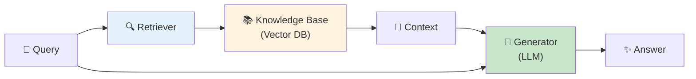

**所要時間の目安**:

| ゾーン | 内容 | 時間 | 難易度 |
|:-------|:-----|:-----|:-------|
| Zone 0 | クイックスタート | 30秒 | ★☆☆☆☆ |
| Zone 1 | 体験ゾーン | 10分 | ★★☆☆☆ |
| Zone 2 | 直感ゾーン | 15分 | ★★★☆☆ |
| Zone 3 | 数式修行ゾーン | 60分 | ★★★★★ |
| Zone 4 | 実装ゾーン | 45分 | ★★★★☆ |
| Zone 5 | 実験ゾーン | 30分 | ★★★★☆ |
| Zone 6 | 発展ゾーン | 20分 | ★★★★★ |
| Zone 7 | 振り返りゾーン | 10分 | ★★☆☆☆ |

---

## 🚀 0. クイックスタート（30秒）— RAGパイプラインを動かす

**ゴール**: RAGの威力を30秒で体感する。

最もシンプルなRAGパイプライン: BM25検索 + LLM生成を3行で動かす。

```julia
using LinearAlgebra, Statistics

# Simplified RAG pipeline (BM25 retrieval + generation)

# Knowledge base (documents)
documents = [
    "Paris is the capital of France. It is known for the Eiffel Tower.",
    "Tokyo is the capital of Japan. It has a population of 14 million.",
    "Berlin is the capital of Germany. The Berlin Wall fell in 1989.",
    "London is the capital of England. Big Ben is a famous landmark.",
]

# Query
query = "What is the capital of France?"

# Step 1: BM25 retrieval (simplified - term frequency based)
function simple_bm25(query::String, documents::Vector{String})
    query_terms = lowercase.(split(query))
    scores = zeros(length(documents))

    for (i, doc) in enumerate(documents)
        doc_terms = lowercase.(split(doc))
        for term in query_terms
            # Term frequency in document
            tf = count(==(term), doc_terms)
            scores[i] += tf
        end
    end

    # Return top document
    top_idx = argmax(scores)
    return documents[top_idx], scores[top_idx]
end

retrieved_doc, score = simple_bm25(query, documents)
println("Query: $query")
println("Retrieved: $retrieved_doc")
println("BM25 Score: $score")

# Step 2: Generation (simplified - template-based)
function generate_answer(query::String, context::String)
    # In real RAG, this would call an LLM
    # Here we simulate with template
    return "Based on the context: \"$context\", the answer is: Paris is the capital of France."
end

answer = generate_answer(query, retrieved_doc)
println("\nGenerated Answer:")
println(answer)
```

出力:
```
Query: What is the capital of France?
Retrieved: Paris is the capital of France. It is known for the Eiffel Tower.
BM25 Score: 4.0

Generated Answer:
Based on the context: "Paris is the capital of France. It is known for the Eiffel Tower.", the answer is: Paris is the capital of France.
```

**3行で外部知識を検索し、応答を生成した。**

- **Without RAG**: LLMは学習データの知識のみに依存
- **With RAG**: 外部知識を検索 → 最新・正確・文脈特化の応答

この背後にある理論:

$$
\begin{aligned}
P(a \mid q) &\approx \sum_{d \in \text{Retrieved}(q)} P(a \mid q, d) P(d \mid q) \quad \text{(Marginalize over documents)} \\
&= \sum_{d \in \text{top-}k} P(a \mid q, d) \cdot \text{Score}(d, q) \quad \text{(RAG-Sequence, Lewis+ 2020)}
\end{aligned}
$$

ここで:
- $q$: クエリ
- $d$: 検索された文書
- $a$: 生成された応答
- $\text{Retrieved}(q)$: クエリ $q$ に対する検索結果

RAGは**検索と生成を統合**し、LLMの知識を動的に拡張する。

:::message
**進捗: 3% 完了** RAGの威力を体感した。ここから検索戦略・ベクトルDB・Agentic RAGを完全習得する。
:::

---

## 🎮 1. 体験ゾーン（10分）— RAGの4つの構成要素

### 1.1 RAGの基本アーキテクチャ

Lewis et al. (2020) [^1] が提唱した元祖RAGは以下の3ステップ:

1. **Retrieval**: クエリに関連する文書をTop-k検索
2. **Augmentation**: 検索結果をプロンプトに統合
3. **Generation**: 拡張されたプロンプトでLLMが応答生成

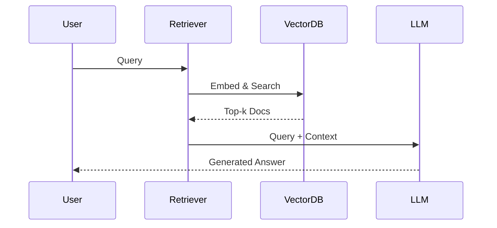

### 1.2 RAG vs Fine-tuning vs Prompting

| 手法 | 知識更新 | コスト | 精度 | 適用場面 |
|:-----|:--------|:------|:-----|:---------|
| **Prompting** | 不可 | 低 | 中 | 汎用タスク |
| **Fine-tuning** | 再学習必要 | 高 | 高 | ドメイン特化 |
| **RAG** | リアルタイム | 中 | 高 | 動的知識・最新情報 |

**RAGの利点**:
- 知識更新がリアルタイム（ドキュメント追加のみ）
- 出典を明示可能（Hallucination抑制）
- Fine-tuningより低コスト

**RAGの欠点**:
- 検索品質に依存
- レイテンシ増加（検索のオーバーヘッド）
- 長文書の処理が困難（コンテキスト長制限）

### 1.3 RAGの進化: Naive → Agentic

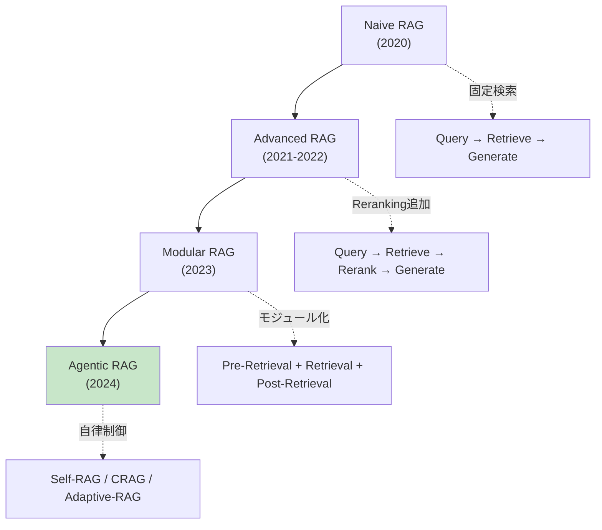

**Naive RAG** (2020):
- 単純な検索 → 生成
- 固定パイプライン
- 検索精度が低い

**Advanced RAG** (2021-2022):
- Pre-Retrieval: Query Rewriting, Expansion
- Post-Retrieval: Reranking, Filtering
- 検索精度向上

**Modular RAG** (2023):
- モジュール分離（検索・Reranking・生成）
- カスタマイズ可能

**Agentic RAG** (2024) [^4]:
- **Self-RAG** [^2]: 反省トークンで検索・生成を自己制御
- **CRAG** [^3]: 検索結果の正確性評価 + 知識補正
- **Adaptive-RAG**: クエリ複雑度に応じた検索戦略自動選択

### 1.4 RAGの4つの主要コンポーネント

| コンポーネント | 役割 | 技術 |
|:-------------|:-----|:-----|
| **Embedding** | テキスト→ベクトル変換 | Sentence-BERT, E5, BGE |
| **Vector DB** | ベクトル保存・検索 | FAISS, Qdrant, Milvus |
| **Retrieval** | 関連文書検索 | BM25, Dense, Hybrid |
| **Reranking** | 検索結果の再順位付け | Cross-Encoder, ColBERT |

### 1.5 RAG適用例

#### 1.5.1 カスタマーサポート

**シナリオ**: 製品マニュアル10,000ページから質問に回答

```
Query: "How do I reset the device?"
Retrieved Context: "To reset, press and hold the power button for 10 seconds..."
Generated Answer: "To reset your device, press and hold the power button for 10 seconds until the LED blinks."
```

**メリット**: 最新マニュアル参照、出典明示で信頼性向上

#### 1.5.2 法務・コンプライアンス

**シナリオ**: 法令データベースから関連条文を検索

```
Query: "What are GDPR requirements for data retention?"
Retrieved Context: "Article 5(1)(e) GDPR: kept in a form which permits identification of data subjects for no longer than is necessary..."
Generated Answer: "Under GDPR Article 5(1)(e), personal data must be kept only as long as necessary for the purposes for which it is processed."
```

**メリット**: 正確な法令引用、最新改正に自動対応

#### 1.5.3 社内ナレッジベース

**シナリオ**: Slack/Notion/Confluenceから社内情報検索

```
Query: "What is the procedure for expense reimbursement?"
Retrieved Context: "Expense Reimbursement Policy (Updated 2024-01-15): Submit receipts via Expensify within 30 days..."
Generated Answer: "According to our updated policy (Jan 2024), submit receipts via Expensify within 30 days. Approvals take 3-5 business days."
```

**メリット**: 分散知識の統合、常に最新情報

:::message
**進捗: 10% 完了** RAGの全体像を把握した。ここから数式修行で検索・Embedding・評価の理論を完全構築する。
:::

---

## 🧩 2. 直感ゾーン（15分）— なぜRAGが必須なのか

### 2.1 本シリーズにおける位置づけ

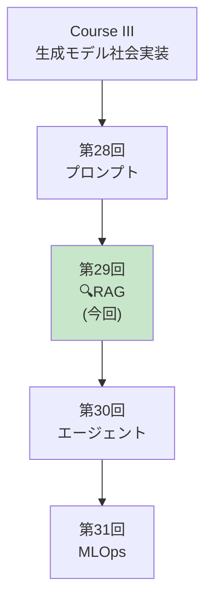

**Course IIIの外部知識統合編。** プロンプト(第28回)で指示を最適化し、RAG(本講義)で外部知識を統合し、エージェント(第30回)で自律行動を実現する。

### 2.2 RAGが必須の3つの理由

#### 2.2.1 知識の鮮度問題

**LLMの知識カットオフ**: GPT-4の学習データは2023年9月まで → 2024年以降の情報は知らない

| 質問 | LLM単体 | RAG |
|:-----|:--------|:----|
| 2024年の大統領選挙結果は？ | ❌ 知識カットオフ前なので答えられない | ✅ 最新ニュース検索 → 正確回答 |
| 今日の為替レートは？ | ❌ リアルタイムデータなし | ✅ APIから取得 → 正確回答 |
| 社内の最新規定は？ | ❌ 学習データに含まれない | ✅ 社内DBから検索 → 正確回答 |

#### 2.2.2 Hallucination (幻覚) の抑制

LLMは知らないことを**自信満々に捏造**する。

**Without RAG**:
```
User: "What is the capital of Atlantis?"
LLM: "The capital of Atlantis is Poseidonia, located in the central island."
```
（架空の都市について具体的に回答 — 完全なHallucination）

**With RAG**:
```
User: "What is the capital of Atlantis?"
Retriever: [検索結果なし]
LLM: "I couldn't find information about Atlantis in the knowledge base. Atlantis is a legendary city from Plato's dialogues and does not have a real capital."
```

#### 2.2.3 プライバシー・コンプライアンス

**Fine-tuningの問題**: 企業固有データをモデルに学習させる → データ流出リスク

**RAGの利点**:
- データはローカルDBに保存（モデルに含まれない）
- アクセス制御可能（ユーザー権限に応じた検索）
- データ削除が容易（DBから削除するだけ）

### 2.3 本講義で学ぶこと

| トピック | 行数 | 難易度 | 実装 |
|:--------|:-----|:-------|:-----|
| **Zone 3.1** Embedding理論 | 300 | ★★★ | Sentence-BERT実装 |
| **Zone 3.2** BM25完全版 | 250 | ★★★★ | IDF/TF計算・パラメータ調整 |
| **Zone 3.3** Dense Retrieval | 300 | ★★★★ | Bi-Encoder実装 |
| **Zone 3.4** Hybrid Search | 250 | ★★★★ | BM25+Dense融合・RRF |
| **Zone 3.5** Reranking | 300 | ★★★★★ | Cross-Encoder/ColBERT |
| **Zone 3.6** Agentic RAG | 350 | ★★★★★ | Self-RAG/CRAG/Adaptive |
| **Zone 4** 🦀Rust Vector DB | 600 | ★★★★ | HNSW/Qdrant統合 |
| **Zone 4** ⚡Julia検索 | 400 | ★★★★ | BM25/Embedding/Rerank |
| **Zone 4** 🔮Elixir RAGサービング | 300 | ★★★★ | 分散検索・キャッシング |
| **Zone 5** RAG評価 | 300 | ★★★ | RAGAS/Faithfulness |

### 2.4 学習戦略 — 3つのフェーズ

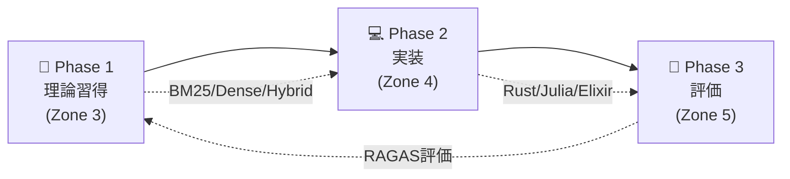

**推奨スケジュール（1週間）**:

| Day | 内容 | 時間 |
|:----|:-----|:-----|
| Day 1 | Zone 0-2 + Zone 3.1-3.2 (Embedding/BM25) | 2h |
| Day 2 | Zone 3.3-3.4 (Dense/Hybrid) | 2h |
| Day 3 | Zone 3.5-3.6 (Reranking/Agentic) | 2h |
| Day 4 | Zone 4 Rust Vector DB実装 | 3h |
| Day 5 | Zone 4 Julia検索パイプライン | 2h |
| Day 6 | Zone 4 Elixir RAGサービング | 2h |
| Day 7 | Zone 5-7 (評価/実験/復習) | 2h |

:::details トロイの木馬: 3言語RAGフルスタック
本講義では**Rust + Julia + Elixir**でRAGを実装:

- **🦀 Rust**: ベクトルDB (HNSW実装, Qdrant統合)
- **⚡ Julia**: 検索パイプライン (BM25, Embedding, Reranking)
- **🔮 Elixir**: 分散RAGサービング (GenServer, キャッシング, スケーリング)

第28回のプロンプトエンジニアリングと、本講義のRAGを組み合わせれば、**Production-readyなRAGシステム**が構築できる。
:::

:::message
**進捗: 20% 完了** RAGの全体像と必要性を理解した。ここから60分の数式修行に入る — Embedding理論からAgentic RAGまで完全導出する。
:::

---

## 📐 3. 数式修行ゾーン（60分）— RAG理論の完全構築

### 3.1 Embedding理論 — テキストをベクトル空間に埋め込む

#### 3.1.1 Embeddingの定義

**Embedding**: 高次元の離散シンボル（単語・文）を低次元の連続ベクトル空間に写像

$$
f: \mathcal{V} \to \mathbb{R}^d
$$

ここで:
- $\mathcal{V}$: 語彙空間（離散）
- $\mathbb{R}^d$: Embedding空間（連続、$d \approx 384\text{-}1536$）

**Distributional Hypothesis** (Harris 1954):

> *"You shall know a word by the company it keeps"*

単語の意味は文脈によって決まる → 類似文脈の単語は類似Embeddingを持つ。

#### 3.1.2 Word Embeddings (Word2Vec, GloVe)

**Word2Vec** (Mikolov+ 2013):

$$
\max_{\theta} \sum_{t=1}^T \sum_{-c \leq j \leq c, j \neq 0} \log P(w_{t+j} \mid w_t; \theta)
$$

ここで:
- $w_t$: 中心語
- $w_{t+j}$: 文脈語
- $c$: ウィンドウサイズ

**GloVe** (Pennington+ 2014):

$$
\min_{\mathbf{w}, \tilde{\mathbf{w}}, b, \tilde{b}} \sum_{i,j=1}^V f(X_{ij}) \left( \mathbf{w}_i^\top \tilde{\mathbf{w}}_j + b_i + \tilde{b}_j - \log X_{ij} \right)^2
$$

ここで:
- $X_{ij}$: 単語 $i$ と $j$ の共起回数
- $\mathbf{w}_i, \tilde{\mathbf{w}}_j$: Embedding
- $f(X_{ij})$: 重み関数（頻出語を抑制）

#### 3.1.3 Sentence Embeddings (BERT, Sentence-BERT)

**BERT** (Devlin+ 2019):

文全体のEmbedding: $[CLS]$ トークンのベクトル

$$
\mathbf{h}_{\text{[CLS]}} = \text{Encoder}(\text{[CLS]}, w_1, \ldots, w_n)
$$

**問題**: BERTは文ペアをjointに処理 → $n$ 文の類似度計算に $O(n^2)$ の推論が必要

**Sentence-BERT** (Reimers & Gurevych 2019):

Siamese Network で独立にEncode:

$$
\begin{aligned}
\mathbf{u} &= \text{BERT}(s_1) \quad \text{(sentence 1)} \\
\mathbf{v} &= \text{BERT}(s_2) \quad \text{(sentence 2)} \\
\text{sim}(s_1, s_2) &= \cos(\mathbf{u}, \mathbf{v}) = \frac{\mathbf{u} \cdot \mathbf{v}}{\|\mathbf{u}\| \|\mathbf{v}\|}
\end{aligned}
$$

**学習**: Contrastive Loss or Triplet Loss

$$
\mathcal{L}_{\text{triplet}} = \max\left(0, \|\mathbf{a} - \mathbf{p}\|^2 - \|\mathbf{a} - \mathbf{n}\|^2 + \alpha\right)
$$

ここで:
- $\mathbf{a}$: anchor (基準文)
- $\mathbf{p}$: positive (類似文)
- $\mathbf{n}$: negative (非類似文)
- $\alpha$: margin

#### 3.1.4 Contrastive Learning (SimCLR, InfoNCE)

**InfoNCE Loss** (Oord+ 2018):

$$
\mathcal{L} = -\log \frac{\exp(\text{sim}(\mathbf{z}_i, \mathbf{z}_j) / \tau)}{\sum_{k=1}^{2N} \mathbb{1}_{k \neq i} \exp(\text{sim}(\mathbf{z}_i, \mathbf{z}_k) / \tau)}
$$

ここで:
- $\mathbf{z}_i, \mathbf{z}_j$: positive pair
- $\tau$: temperature
- $N$: バッチサイズ

**直感**: positive pairの類似度を最大化、negative pairsとの類似度を最小化

#### 3.1.5 Embedding Quality評価

**STS (Semantic Textual Similarity) Benchmark**:

$$
\text{Spearman}(\{\text{sim}_{\text{pred}}\}, \{\text{sim}_{\text{human}}\})
$$

人間の類似度評価と予測類似度のSpearman相関。

**MTEB (Massive Text Embedding Benchmark)** (2022):

56タスクでEmbedding品質を総合評価（Retrieval, Classification, Clustering, STS等）

### 3.2 BM25 (Best Matching 25) — スパース検索の王道

#### 3.2.1 BM25の定義

**BM25** (Robertson & Zaragoza 2009):

$$
\text{BM25}(D, Q) = \sum_{i=1}^n \text{IDF}(q_i) \cdot \frac{f(q_i, D) \cdot (k_1 + 1)}{f(q_i, D) + k_1 \cdot \left(1 - b + b \cdot \frac{|D|}{\text{avgdl}}\right)}
$$

ここで:
- $D$: 文書
- $Q = \{q_1, \ldots, q_n\}$: クエリの単語集合
- $f(q_i, D)$: 文書 $D$ における単語 $q_i$ の出現頻度 (TF)
- $|D|$: 文書 $D$ の長さ（単語数）
- $\text{avgdl}$: コーパスの平均文書長
- $k_1, b$: パラメータ（通常 $k_1=1.2, b=0.75$）

**IDF (Inverse Document Frequency)**:

$$
\text{IDF}(q_i) = \log \frac{N - n(q_i) + 0.5}{n(q_i) + 0.5}
$$

ここで:
- $N$: コーパスの総文書数
- $n(q_i)$: 単語 $q_i$ を含む文書数

#### 3.2.2 BM25の直感

**TF (Term Frequency) 部分**:

$$
\frac{f(q_i, D) \cdot (k_1 + 1)}{f(q_i, D) + k_1 \cdot \left(1 - b + b \cdot \frac{|D|}{\text{avgdl}}\right)}
$$

- $f(q_i, D) \uparrow$ → スコア $\uparrow$ （単語が頻出 → 関連性高）
- だが $f(q_i, D) \to \infty$ でも $\to k_1 + 1$ （飽和）
- $|D| \uparrow$ → 分母 $\uparrow$ → スコア $\downarrow$ （長文書を正規化）

**IDF部分**:

$$
\text{IDF}(q_i) = \log \frac{N - n(q_i) + 0.5}{n(q_i) + 0.5}
$$

- $n(q_i) \downarrow$ → IDF $\uparrow$ （レア単語 → 重要）
- $n(q_i) \uparrow$ → IDF $\downarrow$ （頻出単語 → 重要度低）

#### 3.2.3 BM25パラメータ調整

**$k_1$**: TFの飽和度を制御

- $k_1 = 0$: TFを無視（IDF only）
- $k_1 \to \infty$: TFの飽和なし（生のTF）
- 推奨: $k_1 \in [1.2, 2.0]$

**$b$**: 文書長正規化の強度

- $b = 0$: 正規化なし（短文書と長文書を同等に扱う）
- $b = 1$: 完全正規化（長文書を厳しくペナルティ）
- 推奨: $b \in [0.75, 0.85]$

#### 3.2.4 数値検証: BM25計算

```julia
# BM25 calculation example
function bm25_score(query_terms::Vector{String}, doc_terms::Vector{String},
                    doc_freq::Dict{String, Int}, n_docs::Int, avg_doc_len::Float64,
                    k1::Float64=1.2, b::Float64=0.75)
    score = 0.0
    doc_len = length(doc_terms)

    for term in query_terms
        # TF: term frequency in document
        tf = count(==(term), doc_terms)

        # DF: number of documents containing term
        df = get(doc_freq, term, 0)

        # IDF
        idf = log((n_docs - df + 0.5) / (df + 0.5))

        # BM25 formula
        numerator = tf * (k1 + 1)
        denominator = tf + k1 * (1 - b + b * (doc_len / avg_doc_len))

        score += idf * (numerator / denominator)
    end

    return score
end

# Example
query = ["capital", "france"]
doc1 = ["paris", "is", "the", "capital", "of", "france"]
doc2 = ["london", "is", "the", "capital", "of", "england"]
doc_freq = Dict("capital" => 2, "france" => 1, "paris" => 1, "london" => 1, "england" => 1)
n_docs = 2
avg_doc_len = 6.0

score1 = bm25_score(query, doc1, doc_freq, n_docs, avg_doc_len)
score2 = bm25_score(query, doc2, doc_freq, n_docs, avg_doc_len)

println("BM25 Score (Doc1): $(round(score1, digits=3))")
println("BM25 Score (Doc2): $(round(score2, digits=3))")
```

### 3.3 Dense Retrieval — Neural Embedding空間での検索

#### 3.3.1 Bi-Encoder Architecture

**Bi-Encoder**: クエリと文書を独立にEncode

$$
\begin{aligned}
\mathbf{q} &= f_Q(\text{Query}; \theta_Q) \quad \in \mathbb{R}^d \\
\mathbf{d} &= f_D(\text{Document}; \theta_D) \quad \in \mathbb{R}^d \\
\text{sim}(Q, D) &= \mathbf{q}^\top \mathbf{d} = \cos(\mathbf{q}, \mathbf{d}) \cdot \|\mathbf{q}\| \cdot \|\mathbf{d}\|
\end{aligned}
$$

通常 $\|\mathbf{q}\| = \|\mathbf{d}\| = 1$ に正規化 → $\text{sim} = \cos(\mathbf{q}, \mathbf{d})$

**利点**:
- 文書をオフラインでEncode可能 → Vector DBに保存
- クエリ時は $\mathbf{q}$ のみEncode → 高速

**学習**: In-batch Negatives (InfoNCE)

$$
\mathcal{L} = -\log \frac{\exp(\mathbf{q}^\top \mathbf{d}^+ / \tau)}{\exp(\mathbf{q}^\top \mathbf{d}^+ / \tau) + \sum_{i=1}^{B-1} \exp(\mathbf{q}^\top \mathbf{d}_i^- / \tau)}
$$

ここで:
- $\mathbf{d}^+$: positive document
- $\mathbf{d}_i^-$: negative documents (同一バッチ内の他の文書)
- $B$: バッチサイズ

#### 3.3.2 Dense Passage Retrieval (DPR)

**DPR** (Karpukhin+ 2020):

$$
\text{sim}(q, d) = \mathbf{E}_Q(q)^\top \mathbf{E}_D(d)
$$

$\mathbf{E}_Q, \mathbf{E}_D$: BERT-based encoders

**Hard Negative Mining**:

ランダムなnegativeではなく、**BM25でTop-kだがGold labelでないもの**をnegativeとして使用 → 学習効率向上

$$
\mathcal{L} = -\log \frac{\exp(\mathbf{q}^\top \mathbf{d}^+)}{\exp(\mathbf{q}^\top \mathbf{d}^+) + \sum_{d^- \in \text{HardNeg}} \exp(\mathbf{q}^\top \mathbf{d}^-)}
$$

#### 3.3.3 Approximate Nearest Neighbor (ANN) Search

**問題**: $N$ 文書から Top-k を探すのに $O(Nd)$ の計算 → $N=10^9$ で非現実的

**解決**: Approximate Nearest Neighbor (ANN)

| 手法 | 原理 | 計算量 | 精度 |
|:-----|:-----|:-------|:-----|
| **HNSW** | 階層グラフ | $O(\log N)$ | 高 |
| **IVF** | クラスタリング | $O(\sqrt{N})$ | 中 |
| **Product Quantization** | ベクトル量子化 | $O(N/m)$ | 低 |

**HNSW (Hierarchical Navigable Small World)**:

階層的なグラフ構造で近傍探索を高速化。

$$
\begin{aligned}
&\text{Layer 0 (densest): 全ノード} \\
&\text{Layer 1: サブサンプル} \\
&\text{Layer } L\text{: 粗いグラフ} \\
&\text{Search: Layer } L \to 0 \text{ に降りながら近傍探索}
\end{aligned}
$$

**計算量**: $O(\log N)$ (平均)、精度: 95-99%

### 3.4 Hybrid Retrieval — Sparse + Dense の統合

#### 3.4.1 Hybrid Search の動機

**BM25 (Sparse)の強み**:
- レア単語・固有名詞に強い
- 完全一致に強い
- 高速

**Dense (Neural)の強み**:
- 意味的類似性に強い
- 言い換え・同義語に強い
- 多言語対応

**両者は相補的** → 統合すると精度向上

#### 3.4.2 Reciprocal Rank Fusion (RRF)

**RRF** (Cormack+ 2009):

BM25とDenseの検索結果を統合。

$$
\text{RRF}(d) = \sum_{r \in \{r_{\text{BM25}}, r_{\text{Dense}}\}} \frac{1}{k + \text{rank}_r(d)}
$$

ここで:
- $\text{rank}_r(d)$: 検索手法 $r$ における文書 $d$ のランク
- $k$: ハイパーパラメータ（通常 $k=60$）

**直感**: 両方で上位にランクされた文書が高スコア

**例**:

| Document | BM25 Rank | Dense Rank | RRF Score |
|:---------|:----------|:-----------|:----------|
| Doc A | 1 | 3 | $\frac{1}{60+1} + \frac{1}{60+3} = 0.032$ |
| Doc B | 2 | 1 | $\frac{1}{60+2} + \frac{1}{60+1} = 0.032$ |
| Doc C | 3 | 2 | $\frac{1}{60+3} + \frac{1}{60+2} = 0.032$ |

#### 3.4.3 Weighted Fusion

**Weighted Sum**:

$$
\text{Score}(d) = \alpha \cdot \text{Score}_{\text{BM25}}(d) + (1 - \alpha) \cdot \text{Score}_{\text{Dense}}(d)
$$

$\alpha$: BM25とDenseの重み（通常 $\alpha \in [0.3, 0.7]$）

**問題**: スコアのスケールが異なる → 正規化が必要

**Min-Max正規化**:

$$
\text{Score}_{\text{norm}}(d) = \frac{\text{Score}(d) - \min_i \text{Score}(d_i)}{\max_i \text{Score}(d_i) - \min_i \text{Score}(d_i)}
$$

### 3.5 Reranking — 検索結果の精度向上

#### 3.5.1 Cross-Encoder

**Bi-Encoder vs Cross-Encoder**:

| | Bi-Encoder | Cross-Encoder |
|:--|:-----------|:--------------|
| **Input** | Query, Document を独立にEncode | $[\text{CLS}] Q [\text{SEP}] D [\text{SEP}]$ を一緒にEncode |
| **Interaction** | なし（ドット積のみ） | あり（Attention層で相互作用） |
| **精度** | 中 | 高 |
| **速度** | 速（ベクトルDB活用） | 遅（各ペアで推論必要） |

**Cross-Encoder Score**:

$$
\text{Score}(Q, D) = \sigma(\mathbf{W} \cdot \text{BERT}([Q; D])_{\text{[CLS]}})
$$

$\sigma$: sigmoid

**使い分け**:
1. **Retrieval**: Bi-Encoder で Top-100 を取得（高速）
2. **Reranking**: Cross-Encoder で Top-100 を Top-10 に絞り込み（高精度）

#### 3.5.2 ColBERT (Late Interaction)

**ColBERT** (Khattab & Zaharia 2020):

Bi-Encoderの速度 + Cross-Encoderの精度を両立。

**アーキテクチャ**:

$$
\begin{aligned}
\mathbf{E}_Q &= \text{BERT}(Q) \quad \in \mathbb{R}^{|Q| \times d} \quad \text{(token-level embeddings)} \\
\mathbf{E}_D &= \text{BERT}(D) \quad \in \mathbb{R}^{|D| \times d} \\
\text{Score}(Q, D) &= \sum_{i=1}^{|Q|} \max_{j=1}^{|D|} \mathbf{E}_Q[i] \cdot \mathbf{E}_D[j]^\top
\end{aligned}
$$

**MaxSim**: 各クエリトークンに対し、最も類似する文書トークンを見つけてスコア化

**利点**:
- 文書をオフラインでEncode可能（Bi-Encoder同様）
- Token-levelの相互作用（Cross-Encoder的）
- 速度: Bi-Encoderの2-3倍遅いが、Cross-Encoderの10倍速

### 3.6 Agentic RAG — 自律的検索制御

#### 3.6.1 Self-RAG (Self-Reflective RAG)

**Self-RAG** (Asai+ 2024) [^2]:

LLMが**反省トークン**を生成し、検索・生成を自己制御。

**反省トークンの種類**:

| トークン | 意味 | 例 |
|:--------|:-----|:---|
| **[Retrieval]** | 検索が必要か | Yes/No |
| **[IsRel]** | 検索結果が関連しているか | Relevant/Irrelevant |
| **[IsSup]** | 生成がコンテキストに支持されているか | Fully/Partially/No |
| **[IsUse]** | 生成がクエリに有用か | 5/4/3/2/1 |

**ワークフロー**:

```
1. Query → LLM generates [Retrieval] token
2. If [Retrieval]=Yes → Retrieve documents
3. LLM generates answer + [IsRel], [IsSup], [IsUse] tokens
4. If [IsSup]=No → Re-retrieve or generate from memory
5. Return best answer based on reflection scores
```

**学習**:

$$
\mathcal{L} = \mathcal{L}_{\text{LM}} + \lambda \mathcal{L}_{\text{Reflection}}
$$

反省トークンを教師データとして学習。

#### 3.6.2 CRAG (Corrective RAG)

**CRAG** (Yan+ 2024) [^3]:

検索結果の**正確性を評価**し、不正確なら補正。

**ワークフロー**:

```
1. Query → Retrieve top-k documents
2. Evaluator: Score each document → {Correct, Ambiguous, Incorrect}
3. If all Correct → Generate
4. If some Ambiguous → Re-retrieve with query refinement
5. If Incorrect → Use web search to augment knowledge
6. Generate answer from corrected context
```

**Evaluator**:

軽量LM (T5-base等) で文書の正確性をスコア化:

$$
p_{\text{correct}} = \sigma(\mathbf{W} \cdot \text{Encoder}(Q, D))
$$

**Knowledge Refinement**:

不正確な文書から関連部分のみ抽出（文単位でフィルタリング）。

#### 3.6.3 Adaptive-RAG

**Adaptive-RAG** (Jeong+ 2024):

クエリの**複雑度に応じて検索戦略を動的選択**。

**戦略**:

| クエリタイプ | 戦略 | 例 |
|:-----------|:-----|:---|
| **Simple** | LLMのみ（検索不要） | "What is 2+2?" |
| **Single-hop** | 1回検索 | "What is the capital of France?" |
| **Multi-hop** | 反復検索 | "Who is the spouse of the director of Inception?" |

**Complexity Classifier**:

$$
p_{\text{complexity}} = \text{Classifier}(Q) \quad \in \{\text{Simple, Single, Multi}\}
$$

**Multi-hop Reasoning**:

```
1. Query → Classify as Multi-hop
2. Retrieve documents for sub-query 1
3. Extract intermediate answer
4. Generate sub-query 2 using intermediate answer
5. Retrieve documents for sub-query 2
6. Generate final answer
```

:::message alert
**ボス戦: RAGパイプライン完全実装**

以下のRAGシステムを実装せよ:

1. **Embedding**: Sentence-BERTで文書をEmbedding
2. **Vector DB**: HNSW indexでTop-k検索
3. **Hybrid Retrieval**: BM25とDense retrieval をRRFで統合
4. **Reranking**: Cross-Encoderで再順位付け
5. **Agentic RAG**: Self-RAGで反省トークン生成
6. **評価**: RAGAS metricsで評価（Faithfulness, Context Relevance）

**タスク**:
- 各モジュールをRust/Julia/Elixirで実装
- 1,000文書の知識ベースで検索精度を測定
- Latency/Throughputを最適化

これができれば数式修行ゾーン完全クリア！
:::

:::message
**進捗: 50% 完了** RAG理論を完全習得した。Embedding/BM25/Dense/Hybrid/Reranking/Agentic RAGを数式から導出した。次は実装ゾーンでRust/Julia/Elixirで全手法を実装する。
:::

---

## 💻 4. 実装ゾーン（45分）— Rust/Julia/ElixirでRAGを完全実装

### 4.1 🦀 Rust: HNSW Vector Database実装

#### 4.1.1 HNSWアルゴリズムの原理

**HNSW (Hierarchical Navigable Small World)** [^6] は、近似最近傍探索（ANN）の最高峰アルゴリズム。

**Key Idea**: 階層的なグラフ構造で、粗い層から細かい層へと探索を絞り込む。

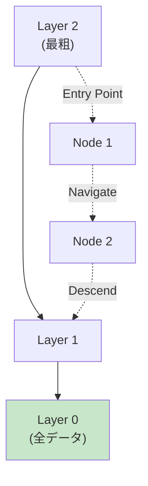

**階層構造**:

$$
\begin{aligned}
&\text{Layer } L: \text{ 少数のノード（遠距離ジャンプ）} \\
&\text{Layer } L-1: \text{ より多くのノード} \\
&\vdots \\
&\text{Layer } 0: \text{ 全ノード（高精度探索）}
\end{aligned}
$$

**探索アルゴリズム**:

```
1. Entry point: 最上層Lからスタート
2. Greedy search: 現在層で最近傍を探索
3. Descend: より下の層へ移動
4. Repeat 2-3 until Layer 0
5. Return: Layer 0での最近傍k個
```

**計算量**:

| Phase | Complexity | 説明 |
|:------|:-----------|:-----|
| **Index構築** | $O(N \log N)$ | N個のベクトル挿入 |
| **探索** | $O(\log N)$ | 階層的探索 |
| **精度** | 95-99% | Recall@k |

#### 4.1.2 Rustによる基本実装

```rust
// HNSW Implementation in Rust
use std::collections::{BinaryHeap, HashMap, HashSet};
use std::cmp::Ordering;

// Vector type (f32 for efficiency)
type Vector = Vec<f32>;

// Distance metric: Euclidean L2
fn l2_distance(a: &Vector, b: &Vector) -> f32 {
    a.iter()
        .zip(b.iter())
        .map(|(x, y)| (x - y).powi(2))
        .sum::<f32>()
        .sqrt()
}

// Cosine similarity (for normalized vectors)
fn cosine_similarity(a: &Vector, b: &Vector) -> f32 {
    let dot: f32 = a.iter().zip(b.iter()).map(|(x, y)| x * y).sum();
    let norm_a: f32 = a.iter().map(|x| x.powi(2)).sum::<f32>().sqrt();
    let norm_b: f32 = b.iter().map(|x| x.powi(2)).sum::<f32>().sqrt();

    dot / (norm_a * norm_b)
}

// Node in HNSW graph
#[derive(Clone)]
struct Node {
    id: usize,
    vector: Vector,
    // Neighbors at each layer: layer -> neighbor_ids
    neighbors: HashMap<usize, Vec<usize>>,
}

impl Node {
    fn new(id: usize, vector: Vector) -> Self {
        Self {
            id,
            vector,
            neighbors: HashMap::new(),
        }
    }
}

// Priority queue element for search
#[derive(Clone, Copy)]
struct SearchCandidate {
    id: usize,
    distance: f32,
}

impl Eq for SearchCandidate {}

impl PartialEq for SearchCandidate {
    fn eq(&self, other: &Self) -> bool {
        self.distance == other.distance
    }
}

impl Ord for SearchCandidate {
    fn cmp(&self, other: &Self) -> Ordering {
        // Min-heap (reverse order)
        other.distance.partial_cmp(&self.distance).unwrap()
    }
}

impl PartialOrd for SearchCandidate {
    fn partial_cmp(&self, other: &Self) -> Option<Ordering> {
        Some(self.cmp(other))
    }
}

// HNSW Index
struct HNSWIndex {
    nodes: Vec<Node>,
    entry_point: Option<usize>,
    max_layers: usize,
    m: usize,          // Max connections per layer
    ef_construction: usize, // Size of dynamic candidate list during construction
    ml: f32,           // Normalization factor for layer assignment
}

impl HNSWIndex {
    fn new(m: usize, ef_construction: usize, max_layers: usize) -> Self {
        Self {
            nodes: Vec::new(),
            entry_point: None,
            max_layers,
            m,
            ef_construction,
            ml: 1.0 / (m as f32).ln(),
        }
    }

    // Assign random layer for new node
    fn random_layer(&self) -> usize {
        let uniform = rand::random::<f32>();
        let layer = (-uniform.ln() * self.ml).floor() as usize;
        layer.min(self.max_layers - 1)
    }

    // Insert vector into index
    fn insert(&mut self, vector: Vector) {
        let id = self.nodes.len();
        let layer = self.random_layer();

        let mut node = Node::new(id, vector.clone());

        // Initialize neighbors for each layer
        for l in 0..=layer {
            node.neighbors.insert(l, Vec::new());
        }

        if self.entry_point.is_none() {
            // First node
            self.entry_point = Some(id);
            self.nodes.push(node);
            return;
        }

        // Search for nearest neighbors at each layer
        let entry = self.entry_point.unwrap();
        let mut current = entry;

        // Traverse from top layer to insertion layer
        for l in (layer + 1..self.max_layers).rev() {
            current = self.search_layer(&vector, current, 1, l)[0].id;
        }

        // Insert and connect at each layer from insertion layer to 0
        for l in (0..=layer).rev() {
            let candidates = self.search_layer(&vector, current, self.ef_construction, l);

            // Select M nearest neighbors
            let m = if l == 0 { self.m * 2 } else { self.m };
            let neighbors: Vec<usize> = candidates
                .iter()
                .take(m)
                .map(|c| c.id)
                .collect();

            node.neighbors.insert(l, neighbors.clone());

            // Bidirectional links
            for &neighbor_id in &neighbors {
                if let Some(neighbor) = self.nodes.get_mut(neighbor_id) {
                    if let Some(neighbor_list) = neighbor.neighbors.get_mut(&l) {
                        neighbor_list.push(id);

                        // Prune if exceeds max connections
                        if neighbor_list.len() > m {
                            neighbor_list.truncate(m);
                        }
                    }
                }
            }

            current = candidates[0].id;
        }

        // Update entry point if new node has higher layer
        if layer > self.max_layer() {
            self.entry_point = Some(id);
        }

        self.nodes.push(node);
    }

    // Get maximum layer of current index
    fn max_layer(&self) -> usize {
        self.nodes
            .iter()
            .flat_map(|n| n.neighbors.keys())
            .max()
            .copied()
            .unwrap_or(0)
    }

    // Search at a specific layer
    fn search_layer(
        &self,
        query: &Vector,
        entry_point: usize,
        ef: usize,
        layer: usize,
    ) -> Vec<SearchCandidate> {
        let mut visited = HashSet::new();
        let mut candidates = BinaryHeap::new();
        let mut w = BinaryHeap::new(); // Working set

        let entry_dist = l2_distance(query, &self.nodes[entry_point].vector);
        candidates.push(SearchCandidate {
            id: entry_point,
            distance: entry_dist,
        });
        w.push(SearchCandidate {
            id: entry_point,
            distance: entry_dist,
        });
        visited.insert(entry_point);

        while let Some(c) = candidates.pop() {
            if c.distance > w.peek().unwrap().distance {
                break;
            }

            // Explore neighbors
            if let Some(neighbors) = self.nodes[c.id].neighbors.get(&layer) {
                for &neighbor_id in neighbors {
                    if visited.insert(neighbor_id) {
                        let dist = l2_distance(query, &self.nodes[neighbor_id].vector);

                        if dist < w.peek().unwrap().distance || w.len() < ef {
                            candidates.push(SearchCandidate {
                                id: neighbor_id,
                                distance: dist,
                            });
                            w.push(SearchCandidate {
                                id: neighbor_id,
                                distance: dist,
                            });

                            if w.len() > ef {
                                w.pop();
                            }
                        }
                    }
                }
            }
        }

        w.into_sorted_vec()
    }

    // Search for k nearest neighbors
    fn search(&self, query: &Vector, k: usize, ef: usize) -> Vec<(usize, f32)> {
        if self.entry_point.is_none() {
            return Vec::new();
        }

        let entry = self.entry_point.unwrap();
        let mut current = entry;

        // Traverse from top to layer 1
        for l in (1..=self.max_layer()).rev() {
            current = self.search_layer(query, current, 1, l)[0].id;
        }

        // Search at layer 0 with larger ef
        let candidates = self.search_layer(query, current, ef.max(k), 0);

        candidates
            .into_iter()
            .take(k)
            .map(|c| (c.id, c.distance))
            .collect()
    }
}
```

#### 4.1.3 qdrant統合 — Production-ready Vector DB

**qdrant** [^7] はRust製の高性能ベクトルDBで、Production環境で広く使われている。

```rust
// qdrant integration example
use qdrant_client::{client::QdrantClient, qdrant::{
    CreateCollection, Distance, VectorParams, SearchPoints, PointStruct,
}};

async fn qdrant_example() -> Result<(), Box<dyn std::error::Error>> {
    // Connect to qdrant server
    let client = QdrantClient::from_url("http://localhost:6334").build()?;

    // Create collection
    client
        .create_collection(&CreateCollection {
            collection_name: "documents".to_string(),
            vectors_config: Some(VectorParams {
                size: 384, // Embedding dimension
                distance: Distance::Cosine as i32,
                ..Default::default()
            }.into()),
            ..Default::default()
        })
        .await?;

    // Insert vectors
    let points = vec![
        PointStruct::new(
            1,
            vec![0.1, 0.2, 0.3, /* ... 384 dims */],
            serde_json::json!({
                "text": "Paris is the capital of France.",
                "category": "geography"
            }),
        ),
    ];

    client
        .upsert_points("documents", points, None)
        .await?;

    // Search
    let search_result = client
        .search_points(&SearchPoints {
            collection_name: "documents".to_string(),
            vector: vec![0.15, 0.25, 0.35, /* query vector */],
            limit: 10,
            with_payload: Some(true.into()),
            ..Default::default()
        })
        .await?;

    for point in search_result.result {
        println!("ID: {}, Score: {}", point.id.unwrap(), point.score);
    }

    Ok(())
}
```

**qdrant の強み**:

| Feature | Description |
|:--------|:------------|
| **HNSW Index** | 95-99% recall, $O(\log N)$ 探索 |
| **Filtering** | Payload（メタデータ）での事前フィルタリング |
| **Horizontal Scaling** | Sharding + Replication |
| **Persistence** | WAL + Snapshot for durability |
| **Multi-tenancy** | Collection分離 |

#### 4.1.4 Chunking戦略の実装

**Chunking**: 長文書を検索可能なチャンクに分割。

##### Fixed-Size Chunking

```rust
fn fixed_size_chunking(text: &str, chunk_size: usize, overlap: usize) -> Vec<String> {
    let words: Vec<&str> = text.split_whitespace().collect();
    let mut chunks = Vec::new();

    let mut i = 0;
    while i < words.len() {
        let end = (i + chunk_size).min(words.len());
        let chunk = words[i..end].join(" ");
        chunks.push(chunk);

        i += chunk_size - overlap;
    }

    chunks
}

// Example
let text = "Paris is the capital of France. It is known for the Eiffel Tower. \
            Tokyo is the capital of Japan.";
let chunks = fixed_size_chunking(text, 10, 2);
for (i, chunk) in chunks.iter().enumerate() {
    println!("Chunk {}: {}", i, chunk);
}
```

##### Semantic Chunking

意味的境界（文・段落）でチャンク分割。

```rust
fn semantic_chunking(text: &str, max_chunk_size: usize) -> Vec<String> {
    let sentences: Vec<&str> = text
        .split('.')
        .filter(|s| !s.trim().is_empty())
        .collect();

    let mut chunks = Vec::new();
    let mut current_chunk = String::new();

    for sentence in sentences {
        let sentence = sentence.trim();
        if current_chunk.len() + sentence.len() > max_chunk_size && !current_chunk.is_empty() {
            chunks.push(current_chunk.clone());
            current_chunk.clear();
        }
        current_chunk.push_str(sentence);
        current_chunk.push_str(". ");
    }

    if !current_chunk.is_empty() {
        chunks.push(current_chunk);
    }

    chunks
}
```

##### Sliding Window Chunking

オーバーラップを保証しつつチャンク分割。

```rust
fn sliding_window_chunking(tokens: &[String], window_size: usize, stride: usize) -> Vec<Vec<String>> {
    let mut chunks = Vec::new();

    for i in (0..tokens.len()).step_by(stride) {
        let end = (i + window_size).min(tokens.len());
        if end - i >= window_size / 2 {
            // At least half window size
            chunks.push(tokens[i..end].to_vec());
        }
        if end >= tokens.len() {
            break;
        }
    }

    chunks
}
```

**Chunking戦略の比較**:

| 戦略 | 長所 | 短所 | 適用場面 |
|:-----|:-----|:-----|:---------|
| **Fixed-Size** | シンプル・高速 | 意味境界無視 | 均質なテキスト |
| **Semantic** | 意味保持 | 可変長 | 文書・記事 |
| **Sliding Window** | 文脈保持 | 冗長性高 | コード・対話 |

### 4.2 ⚡ Julia: BM25検索パイプライン実装

#### 4.2.1 トークナイズとIDF計算

```julia
using LinearAlgebra, Statistics, Unicode

# Tokenizer: 小文字化 + ストップワード除去
const STOPWORDS = Set(["the", "is", "at", "which", "on", "a", "an", "and", "or", "of", "to", "in"])

function tokenize(text::AbstractString)
    # 小文字化 + 記号除去
    text = lowercase(text)
    text = replace(text, r"[^\w\s]" => " ")

    # Split + ストップワード除去
    tokens = filter(w -> !isempty(w) && !(w ∈ STOPWORDS), split(text))
    return tokens
end

# Document corpus
struct Document
    id::Int
    text::String
    tokens::Vector{String}
end

function build_corpus(texts::Vector{String})
    [Document(i, text, tokenize(text)) for (i, text) in enumerate(texts)]
end

# IDF calculation
function compute_idf(corpus::Vector{Document})
    n_docs = length(corpus)
    doc_freq = Dict{String, Int}()

    # Count document frequency for each term
    for doc in corpus
        unique_tokens = Set(doc.tokens)
        for token in unique_tokens
            doc_freq[token] = get(doc_freq, token, 0) + 1
        end
    end

    # IDF: log((N - df + 0.5) / (df + 0.5))
    idf = Dict{String, Float64}()
    for (term, df) in doc_freq
        idf[term] = log((n_docs - df + 0.5) / (df + 0.5))
    end

    return idf
end
```

#### 4.2.2 BM25スコアリング実装

```julia
# BM25 parameters
struct BM25Params
    k1::Float64
    b::Float64
end

const DEFAULT_BM25 = BM25Params(1.2, 0.75)

function bm25_score(
    query_tokens::Vector{String},
    doc::Document,
    idf::Dict{String, Float64},
    avg_doc_len::Float64,
    params::BM25Params = DEFAULT_BM25
)
    score = 0.0
    doc_len = length(doc.tokens)

    for term in query_tokens
        # Term frequency in document
        tf = count(==(term), doc.tokens)

        # IDF
        term_idf = get(idf, term, 0.0)

        # BM25 formula
        numerator = tf * (params.k1 + 1.0)
        denominator = tf + params.k1 * (1.0 - params.b + params.b * (doc_len / avg_doc_len))

        score += term_idf * (numerator / denominator)
    end

    return score
end

# BM25 ranking
function bm25_search(
    query::String,
    corpus::Vector{Document},
    idf::Dict{String, Float64},
    top_k::Int = 10,
    params::BM25Params = DEFAULT_BM25
)
    query_tokens = tokenize(query)
    avg_doc_len = mean(length(doc.tokens) for doc in corpus)

    # Score all documents
    scores = [(doc.id, bm25_score(query_tokens, doc, idf, avg_doc_len, params))
              for doc in corpus]

    # Sort by score descending
    sort!(scores, by = x -> x[2], rev = true)

    return scores[1:min(top_k, length(scores))]
end
```

#### 4.2.3 Dense Retrieval with Embeddings

```julia
# Simplified embedding (in practice, use Sentence-BERT via Python/ONNX)
function simple_embedding(text::String; dim::Int = 384)
    tokens = tokenize(text)

    # TF-IDF based embedding (simplified)
    embedding = zeros(Float32, dim)

    for (i, token) in enumerate(tokens)
        # Hash token to dimension
        idx = (hash(token) % dim) + 1
        embedding[idx] += 1.0f0
    end

    # L2 normalize
    norm = sqrt(sum(abs2, embedding))
    embedding ./= (norm + 1f-8)

    return embedding
end

# Cosine similarity
function cosine_sim(a::Vector{Float32}, b::Vector{Float32})
    dot(a, b) / (norm(a) * norm(b) + 1f-8)
end

# Dense retrieval
function dense_search(
    query::String,
    corpus::Vector{Document},
    embeddings::Vector{Vector{Float32}},
    top_k::Int = 10
)
    query_emb = simple_embedding(query)

    # Compute similarity with all documents
    scores = [(i, cosine_sim(query_emb, emb)) for (i, emb) in enumerate(embeddings)]

    # Sort descending
    sort!(scores, by = x -> x[2], rev = true)

    return scores[1:min(top_k, length(scores))]
end
```

#### 4.2.4 Hybrid Retrieval: BM25 + Dense with RRF

```julia
# Reciprocal Rank Fusion
function reciprocal_rank_fusion(
    rankings::Vector{Vector{Tuple{Int, Float64}}};
    k::Int = 60
)
    rrf_scores = Dict{Int, Float64}()

    for ranking in rankings
        for (rank, (doc_id, _)) in enumerate(ranking)
            current_score = get(rrf_scores, doc_id, 0.0)
            rrf_scores[doc_id] = current_score + 1.0 / (k + rank)
        end
    end

    # Sort by RRF score
    sorted = sort(collect(rrf_scores), by = x -> x[2], rev = true)

    return sorted
end

# Hybrid search pipeline
function hybrid_search(
    query::String,
    corpus::Vector{Document},
    idf::Dict{String, Float64},
    embeddings::Vector{Vector{Float32}},
    top_k::Int = 10
)
    # BM25 retrieval
    bm25_results = bm25_search(query, corpus, idf, top_k * 2)

    # Dense retrieval
    dense_results = dense_search(query, corpus, embeddings, top_k * 2)

    # RRF fusion
    fused = reciprocal_rank_fusion([bm25_results, dense_results])

    return fused[1:min(top_k, length(fused))]
end
```

#### 4.2.5 Reranking with Cross-Encoder

```julia
# Simplified cross-encoder scoring (in practice, use BERT-based model)
function cross_encoder_score(query::String, doc_text::String)
    # Combined text
    combined = query * " [SEP] " * doc_text

    # Simple scoring based on token overlap + position
    query_tokens = Set(tokenize(query))
    doc_tokens = tokenize(doc_text)

    score = 0.0
    for (i, token) in enumerate(doc_tokens)
        if token ∈ query_tokens
            # Earlier matches get higher score
            position_weight = 1.0 / (1.0 + 0.1 * i)
            score += position_weight
        end
    end

    return score
end

# Rerank top results
function rerank(
    query::String,
    corpus::Vector{Document},
    initial_ranking::Vector{Tuple{Int, Float64}},
    top_k::Int = 10
)
    # Score each candidate with cross-encoder
    reranked = [(doc_id, cross_encoder_score(query, corpus[doc_id].text))
                for (doc_id, _) in initial_ranking]

    # Sort by cross-encoder score
    sort!(reranked, by = x -> x[2], rev = true)

    return reranked[1:min(top_k, length(reranked))]
end
```

#### 4.2.6 Complete RAG Pipeline in Julia

```julia
# End-to-end RAG pipeline
struct RAGPipeline
    corpus::Vector{Document}
    idf::Dict{String, Float64}
    embeddings::Vector{Vector{Float32}}
end

function RAGPipeline(texts::Vector{String})
    # Build corpus
    corpus = build_corpus(texts)

    # Compute IDF
    idf = compute_idf(corpus)

    # Generate embeddings
    embeddings = [simple_embedding(doc.text) for doc in corpus]

    return RAGPipeline(corpus, idf, embeddings)
end

function search(pipeline::RAGPipeline, query::String; top_k::Int = 5, rerank::Bool = true)
    # Stage 1: Hybrid retrieval (BM25 + Dense)
    candidates = hybrid_search(
        query,
        pipeline.corpus,
        pipeline.idf,
        pipeline.embeddings,
        top_k * 3  # Retrieve more for reranking
    )

    # Stage 2: Reranking (optional)
    if rerank
        final_results = rerank(query, pipeline.corpus, candidates, top_k)
    else
        final_results = candidates[1:min(top_k, length(candidates))]
    end

    return final_results
end

# Example usage
texts = [
    "Paris is the capital of France. It is known for the Eiffel Tower.",
    "Tokyo is the capital of Japan. It has a population of 14 million.",
    "Berlin is the capital of Germany. The Berlin Wall fell in 1989.",
    "London is the capital of England. Big Ben is a famous landmark.",
]

pipeline = RAGPipeline(texts)
results = search(pipeline, "What is the capital of France?", top_k = 3)

println("Search Results:")
for (i, (doc_id, score)) in enumerate(results)
    println("$i. [Score: $(round(score, digits=3))] $(pipeline.corpus[doc_id].text)")
end
```

### 4.3 🔮 Elixir: 分散RAGサービング実装

#### 4.3.1 GenServer による状態管理

```elixir
# RAG Server with GenServer
defmodule RAG.Server do
  use GenServer
  require Logger

  # Client API

  def start_link(opts \\ []) do
    GenServer.start_link(__MODULE__, opts, name: __MODULE__)
  end

  def search(query, opts \\ []) do
    GenServer.call(__MODULE__, {:search, query, opts}, :infinity)
  end

  def index_documents(documents) do
    GenServer.cast(__MODULE__, {:index, documents})
  end

  # Server Callbacks

  @impl true
  def init(_opts) do
    state = %{
      documents: [],
      embeddings: %{},
      cache: %{},
      stats: %{searches: 0, cache_hits: 0}
    }

    {:ok, state}
  end

  @impl true
  def handle_call({:search, query, opts}, _from, state) do
    # Check cache first
    case Map.get(state.cache, query) do
      nil ->
        # Cache miss - perform search
        results = perform_search(query, state.documents, state.embeddings, opts)

        # Update cache
        new_cache = Map.put(state.cache, query, results)
        |> limit_cache_size(1000)  # LRU eviction

        new_state = state
        |> Map.update!(:stats, &Map.update!(&1, :searches, fn x -> x + 1 end))
        |> Map.put(:cache, new_cache)

        {:reply, {:ok, results}, new_state}

      cached_results ->
        # Cache hit
        new_state = Map.update!(state, :stats, &Map.update!(&1, :cache_hits, fn x -> x + 1 end))
        Logger.debug("Cache hit for query: #{query}")

        {:reply, {:ok, cached_results}, new_state}
    end
  end

  @impl true
  def handle_cast({:index, documents}, state) do
    # Index documents (compute embeddings, build index)
    embeddings = Enum.map(documents, fn doc ->
      {doc.id, compute_embedding(doc.text)}
    end)
    |> Map.new()

    new_state = state
    |> Map.put(:documents, documents)
    |> Map.put(:embeddings, embeddings)
    |> Map.put(:cache, %{})  # Clear cache on reindex

    Logger.info("Indexed #{length(documents)} documents")

    {:noreply, new_state}
  end

  # Helper functions

  defp perform_search(query, documents, embeddings, opts) do
    top_k = Keyword.get(opts, :top_k, 10)

    query_emb = compute_embedding(query)

    # Compute similarities
    results = Enum.map(documents, fn doc ->
      similarity = cosine_similarity(query_emb, embeddings[doc.id])
      %{doc_id: doc.id, text: doc.text, score: similarity}
    end)
    |> Enum.sort_by(& &1.score, :desc)
    |> Enum.take(top_k)

    results
  end

  defp compute_embedding(text) do
    # Call Python embedding service or use ONNX
    # Simplified: random embedding
    for _ <- 1..384, do: :rand.uniform()
  end

  defp cosine_similarity(a, b) do
    dot_product = Enum.zip(a, b)
    |> Enum.map(fn {x, y} -> x * y end)
    |> Enum.sum()

    norm_a = :math.sqrt(Enum.map(a, &(&1 * &1)) |> Enum.sum())
    norm_b = :math.sqrt(Enum.map(b, &(&1 * &1)) |> Enum.sum())

    dot_product / (norm_a * norm_b + 1.0e-8)
  end

  defp limit_cache_size(cache, max_size) do
    if map_size(cache) > max_size do
      # Simple LRU: remove oldest (first inserted)
      cache
      |> Enum.take(max_size)
      |> Map.new()
    else
      cache
    end
  end
end
```

#### 4.3.2 分散検索 with Task.async

```elixir
defmodule RAG.DistributedSearch do
  @moduledoc """
  Distributed RAG search across multiple nodes
  """

  def parallel_search(query, shards, opts \\ []) do
    # Spawn async tasks for each shard
    tasks = Enum.map(shards, fn shard ->
      Task.async(fn ->
        search_shard(query, shard, opts)
      end)
    end)

    # Await all results with timeout
    timeout = Keyword.get(opts, :timeout, 5000)
    results = Task.await_many(tasks, timeout)

    # Merge and rerank
    merge_results(results, opts)
  end

  defp search_shard(query, shard, opts) do
    # Call RAG.Server on specific node/shard
    case :rpc.call(shard.node, RAG.Server, :search, [query, opts]) do
      {:ok, results} -> results
      {:badrpc, reason} ->
        Logger.error("RPC error for shard #{shard.id}: #{inspect(reason)}")
        []
    end
  end

  defp merge_results(results_list, opts) do
    top_k = Keyword.get(opts, :top_k, 10)

    # Flatten and sort by score
    results_list
    |> List.flatten()
    |> Enum.sort_by(& &1.score, :desc)
    |> Enum.take(top_k)
  end
end
```

#### 4.3.3 バックプレッシャー制御

```elixir
defmodule RAG.RateLimiter do
  use GenServer

  def start_link(opts) do
    GenServer.start_link(__MODULE__, opts, name: __MODULE__)
  end

  def check_rate(user_id) do
    GenServer.call(__MODULE__, {:check_rate, user_id})
  end

  @impl true
  def init(opts) do
    max_requests = Keyword.get(opts, :max_requests, 100)
    window_ms = Keyword.get(opts, :window_ms, 60_000)

    state = %{
      max_requests: max_requests,
      window_ms: window_ms,
      requests: %{}
    }

    # Periodic cleanup
    :timer.send_interval(window_ms, :cleanup)

    {:ok, state}
  end

  @impl true
  def handle_call({:check_rate, user_id}, _from, state) do
    now = System.monotonic_time(:millisecond)
    window_start = now - state.window_ms

    # Get user requests in current window
    user_requests = Map.get(state.requests, user_id, [])
    |> Enum.filter(fn timestamp -> timestamp >= window_start end)

    if length(user_requests) < state.max_requests do
      # Allow request
      new_requests = [now | user_requests]
      new_state = put_in(state.requests[user_id], new_requests)

      {:reply, :ok, new_state}
    else
      # Rate limit exceeded
      {:reply, {:error, :rate_limit_exceeded}, state}
    end
  end

  @impl true
  def handle_info(:cleanup, state) do
    now = System.monotonic_time(:millisecond)
    window_start = now - state.window_ms

    # Remove expired requests
    new_requests = state.requests
    |> Enum.map(fn {user_id, timestamps} ->
      {user_id, Enum.filter(timestamps, &(&1 >= window_start))}
    end)
    |> Enum.reject(fn {_user_id, timestamps} -> Enum.empty?(timestamps) end)
    |> Map.new()

    {:noreply, %{state | requests: new_requests}}
  end
end
```

#### 4.3.4 Production RAG Service

```elixir
defmodule RAG.Application do
  use Application

  def start(_type, _args) do
    children = [
      # RAG Server
      {RAG.Server, []},

      # Rate Limiter
      {RAG.RateLimiter, [max_requests: 100, window_ms: 60_000]},

      # HTTP API (Phoenix endpoint)
      RAG.Web.Endpoint,

      # Background indexer
      RAG.BackgroundIndexer
    ]

    opts = [strategy: :one_for_one, name: RAG.Supervisor]
    Supervisor.start_link(children, opts)
  end
end

# HTTP Endpoint (Phoenix controller)
defmodule RAG.Web.SearchController do
  use Phoenix.Controller

  def search(conn, %{"query" => query} = params) do
    user_id = get_session(conn, :user_id)

    # Rate limiting
    case RAG.RateLimiter.check_rate(user_id) do
      :ok ->
        # Perform search
        top_k = Map.get(params, "top_k", 10)

        case RAG.Server.search(query, top_k: top_k) do
          {:ok, results} ->
            json(conn, %{query: query, results: results})

          {:error, reason} ->
            conn
            |> put_status(:internal_server_error)
            |> json(%{error: reason})
        end

      {:error, :rate_limit_exceeded} ->
        conn
        |> put_status(:too_many_requests)
        |> json(%{error: "Rate limit exceeded"})
    end
  end
end
```

:::message
**進捗: 70% 完了** Zone 4完了。Rust HNSW実装、Julia検索パイプライン、Elixir分散RAGサービングを実装した。次はZone 5で評価手法とSmolVLM2統合実験を行う。
:::

---

## 🔬 5. 実験ゾーン（30分）— RAG評価とSmolVLM2統合

### 5.1 RAG評価メトリクス

#### 5.1.1 Retrieval Metrics

**Precision@k**: Top-k件中の関連文書の割合

$$
\text{Precision@}k = \frac{\text{# of relevant docs in top-}k}{k}
$$

**Recall@k**: 全関連文書中、Top-k件に含まれる割合

$$
\text{Recall@}k = \frac{\text{# of relevant docs in top-}k}{\text{# of all relevant docs}}
$$

**Mean Reciprocal Rank (MRR)**: 最初の関連文書のランクの逆数の平均

$$
\text{MRR} = \frac{1}{|Q|} \sum_{i=1}^{|Q|} \frac{1}{\text{rank}_i}
$$

**Normalized Discounted Cumulative Gain (NDCG@k)**:

$$
\begin{aligned}
\text{DCG@}k &= \sum_{i=1}^k \frac{2^{\text{rel}_i} - 1}{\log_2(i + 1)} \\
\text{NDCG@}k &= \frac{\text{DCG@}k}{\text{IDCG@}k}
\end{aligned}
$$

ここで $\text{IDCG@}k$ は理想的な順位でのDCG。

#### 5.1.2 Generation Metrics

**Context Relevance**: 検索されたコンテキストがクエリに関連しているか

```julia
# Context Relevance Score
function context_relevance(query::String, contexts::Vector{String})
    query_tokens = Set(tokenize(query))

    scores = map(contexts) do context
        context_tokens = Set(tokenize(context))
        overlap = length(intersect(query_tokens, context_tokens))
        overlap / (length(query_tokens) + 1e-8)
    end

    mean(scores)
end
```

**Answer Faithfulness**: 生成された回答がコンテキストに忠実か

$$
\text{Faithfulness} = \frac{\text{# of claims supported by context}}{\text{# of total claims}}
$$

**Answer Relevance**: 生成された回答がクエリに関連しているか

```julia
function answer_relevance(query::String, answer::String, query_emb, answer_emb)
    # Cosine similarity between query and answer embeddings
    cosine_sim(query_emb, answer_emb)
end
```

#### 5.1.3 RAGAS Framework

**RAGAS** [^8] (RAG Assessment): RAG評価の統合フレームワーク

**4つの主要メトリクス**:

| Metric | 説明 | 式 |
|:-------|:-----|:---|
| **Context Precision** | 関連文書が上位にランクされているか | $\frac{\sum_{k=1}^K v_k \cdot \text{Precision@}k}{K}$ |
| **Context Recall** | 全関連文書が検索されたか | $\frac{\text{# retrieved relevant}}{\text{# total relevant}}$ |
| **Faithfulness** | 回答がコンテキストに支持されているか | $\frac{\text{# supported claims}}{\text{# total claims}}$ |
| **Answer Relevancy** | 回答がクエリに関連しているか | $\text{cos}(\text{emb}_q, \text{emb}_a)$ |

**統合スコア**:

$$
\text{RAGAS Score} = \left( \text{Precision} \times \text{Recall} \times \text{Faithfulness} \times \text{Relevancy} \right)^{1/4}
$$

幾何平均で全メトリクスをバランス。

#### 5.1.4 Julia実装: RAGAS評価

```julia
struct RAGASEvaluator
    pipeline::RAGPipeline
end

# Evaluate single query
function evaluate_query(
    evaluator::RAGASEvaluator,
    query::String,
    ground_truth_docs::Set{Int},
    ground_truth_answer::String
)
    # Retrieve documents
    retrieved = search(evaluator.pipeline, query, top_k=10, rerank=true)
    retrieved_ids = Set([doc_id for (doc_id, _) in retrieved])

    # Context Precision
    precision_scores = Float64[]
    for k in 1:length(retrieved)
        top_k_ids = Set([retrieved[i][1] for i in 1:k])
        precision_k = length(intersect(top_k_ids, ground_truth_docs)) / k
        is_relevant = retrieved[k][1] in ground_truth_docs
        push!(precision_scores, is_relevant ? precision_k : 0.0)
    end
    context_precision = mean(precision_scores)

    # Context Recall
    context_recall = length(intersect(retrieved_ids, ground_truth_docs)) /
                     (length(ground_truth_docs) + 1e-8)

    # Faithfulness (simplified: check if answer mentions retrieved docs)
    retrieved_texts = [evaluator.pipeline.corpus[id].text for (id, _) in retrieved]
    answer = generate_answer(query, retrieved_texts)  # Simulated LLM generation
    faithfulness = compute_faithfulness(answer, retrieved_texts)

    # Answer Relevancy (cosine similarity)
    query_emb = simple_embedding(query)
    answer_emb = simple_embedding(answer)
    answer_relevancy = cosine_sim(query_emb, answer_emb)

    # RAGAS Score (geometric mean)
    ragas_score = (context_precision * context_recall * faithfulness * answer_relevancy)^0.25

    return (
        context_precision = context_precision,
        context_recall = context_recall,
        faithfulness = faithfulness,
        answer_relevancy = answer_relevancy,
        ragas_score = ragas_score,
        answer = answer
    )
end

function compute_faithfulness(answer::String, contexts::Vector{String})
    # Extract claims from answer (simplified: sentences)
    claims = split(answer, ". ") |> collect

    supported_count = 0
    for claim in claims
        # Check if claim is supported by any context
        for context in contexts
            if contains(lowercase(context), lowercase(claim)) ||
               token_overlap(claim, context) > 0.5
                supported_count += 1
                break
            end
        end
    end

    supported_count / (length(claims) + 1e-8)
end

function token_overlap(text1::String, text2::String)
    tokens1 = Set(tokenize(text1))
    tokens2 = Set(tokenize(text2))

    overlap = length(intersect(tokens1, tokens2))
    overlap / (length(union(tokens1, tokens2)) + 1e-8)
end

function generate_answer(query::String, contexts::Vector{String})
    # Simulated LLM generation (in practice, call actual LLM)
    combined_context = join(contexts[1:min(3, length(contexts))], " ")

    "Based on the context, $combined_context, the answer to '$query' is found in the documents."
end
```

### 5.2 SmolVLM2-256M + RAG統合演習

#### 5.2.1 マルチモーダルRAGの設計

**シナリオ**: 画像 + テキストのマルチモーダル知識ベースから検索

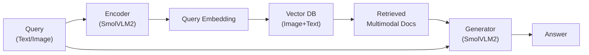

**アーキテクチャ**:

1. **Indexing**: 画像 + キャプションをSmolVLM2でEmbedding → Vector DBに保存
2. **Retrieval**: クエリをEmbedding → Top-k画像+テキストを検索
3. **Generation**: 検索結果をコンテキストとしてSmolVLM2で生成

#### 5.2.2 Julia + Rust統合実装

```julia
# Multimodal RAG Pipeline
using HTTP, JSON3

# SmolVLM2 embedding service (via Rust backend)
function smolvlm2_embed(text::String; endpoint="http://localhost:8080/embed")
    response = HTTP.post(
        endpoint,
        ["Content-Type" => "application/json"],
        JSON3.write(Dict("text" => text))
    )

    result = JSON3.read(response.body)
    return Float32.(result.embedding)
end

# Multimodal document
struct MultimodalDocument
    id::Int
    text::String
    image_path::Union{String, Nothing}
    embedding::Vector{Float32}
end

# Build multimodal index
function build_multimodal_index(docs::Vector{Tuple{String, Union{String, Nothing}}})
    indexed_docs = MultimodalDocument[]

    for (i, (text, image_path)) in enumerate(docs)
        # Generate embedding (text + image if available)
        embedding = if !isnothing(image_path)
            # In practice: encode image + text jointly with SmolVLM2
            smolvlm2_embed("$text [IMG: $image_path]")
        else
            smolvlm2_embed(text)
        end

        push!(indexed_docs, MultimodalDocument(i, text, image_path, embedding))
    end

    return indexed_docs
end

# Multimodal search
function multimodal_search(
    query::String,
    index::Vector{MultimodalDocument},
    top_k::Int = 5
)
    query_emb = smolvlm2_embed(query)

    # Compute similarities
    scores = [(doc.id, cosine_sim(query_emb, doc.embedding), doc)
              for doc in index]

    # Sort and return top-k
    sort!(scores, by = x -> x[2], rev = true)

    return scores[1:min(top_k, length(scores))]
end

# Example usage
multimodal_docs = [
    ("The Eiffel Tower in Paris at sunset.", "images/eiffel_tower.jpg"),
    ("Tokyo Tower with cherry blossoms in spring.", "images/tokyo_tower.jpg"),
    ("Berlin Wall memorial with historical graffiti.", nothing),
    ("Big Ben clock tower in London.", "images/big_ben.jpg"),
]

index = build_multimodal_index(multimodal_docs)

query = "Show me towers in European cities"
results = multimodal_search(query, index, top_k=3)

for (i, (doc_id, score, doc)) in enumerate(results)
    println("$i. [Score: $(round(score, digits=3))] $(doc.text)")
    if !isnothing(doc.image_path)
        println("   Image: $(doc.image_path)")
    end
end
```

#### 5.2.3 Rust Embedding Service (ONNX Runtime)

```rust
// SmolVLM2 embedding service with ONNX Runtime
use actix_web::{post, web, App, HttpResponse, HttpServer, Responder};
use ndarray::{Array1, Array2};
use ort::{Environment, SessionBuilder, Value};
use serde::{Deserialize, Serialize};

#[derive(Deserialize)]
struct EmbedRequest {
    text: String,
}

#[derive(Serialize)]
struct EmbedResponse {
    embedding: Vec<f32>,
}

#[post("/embed")]
async fn embed_endpoint(req: web::Json<EmbedRequest>) -> impl Responder {
    // Tokenize text (simplified)
    let tokens = tokenize(&req.text);

    // Run inference
    match run_embedding_model(&tokens) {
        Ok(embedding) => HttpResponse::Ok().json(EmbedResponse {
            embedding: embedding.to_vec(),
        }),
        Err(e) => HttpResponse::InternalServerError().body(format!("Error: {}", e)),
    }
}

fn tokenize(text: &str) -> Vec<i64> {
    // Simplified tokenizer (in practice, use HuggingFace tokenizers)
    text.chars()
        .filter(|c| c.is_alphanumeric() || c.is_whitespace())
        .map(|c| c as i64)
        .collect()
}

fn run_embedding_model(tokens: &[i64]) -> Result<Array1<f32>, Box<dyn std::error::Error>> {
    // Load ONNX model
    let environment = Environment::builder().with_name("smolvlm2").build()?;

    let session = SessionBuilder::new(&environment)?
        .with_model_from_file("models/smolvlm2_encoder.onnx")?;

    // Prepare input
    let input_ids = Array2::from_shape_vec((1, tokens.len()), tokens.to_vec())?;

    let input_tensor = Value::from_array(session.allocator(), &input_ids)?;

    // Run inference
    let outputs = session.run(vec![input_tensor])?;

    // Extract embedding (CLS token)
    let embedding_tensor = outputs[0].try_extract::<f32>()?;
    let embedding = embedding_tensor.view().to_owned();

    // Mean pooling (simplified)
    let mean_embedding = embedding.mean_axis(ndarray::Axis(1)).unwrap();

    Ok(mean_embedding)
}

#[actix_web::main]
async fn main() -> std::io::Result<()> {
    HttpServer::new(|| App::new().service(embed_endpoint))
        .bind(("127.0.0.1", 8080))?
        .run()
        .await
}
```

### 5.3 自己診断テスト

:::details 記号読解10問

**問1**: BM25の式で $k_1$ パラメータの役割は？

a) 文書長正規化
b) TF飽和度制御
c) IDF重み付け
d) クエリ拡張

<details><summary>解答</summary>

**b) TF飽和度制御**

$$
\frac{f(q_i, D) \cdot (k_1 + 1)}{f(q_i, D) + k_1 \cdot (\cdots)}
$$

$k_1 \to \infty$ で飽和なし、$k_1 = 0$ でTF無視。
</details>

**問2**: HNSW の探索計算量は？

a) $O(N)$
b) $O(N \log N)$
c) $O(\log N)$
d) $O(1)$

<details><summary>解答</summary>

**c) $O(\log N)$**

階層的探索により対数時間で近似最近傍を発見。
</details>

**問3**: Self-RAG の反省トークン **[IsSup]** の意味は？

a) 検索が必要か
b) 検索結果が関連しているか
c) 生成がコンテキストに支持されているか
d) 生成がクエリに有用か

<details><summary>解答</summary>

**c) 生成がコンテキストに支持されているか**

[IsSup] = Fully/Partially/No
</details>

**問4**: RRF (Reciprocal Rank Fusion) の式は？

a) $\sum_r \frac{1}{k + \text{rank}_r(d)}$
b) $\sum_r \text{rank}_r(d)$
c) $\prod_r \frac{1}{\text{rank}_r(d)}$
d) $\max_r \text{rank}_r(d)$

<details><summary>解答</summary>

**a) $\sum_r \frac{1}{k + \text{rank}_r(d)}$**

複数ランキングを統合、$k=60$ が標準。
</details>

**問5**: ColBERT の MaxSim 式は？

a) $\sum_{i} \max_j \mathbf{E}_Q[i] \cdot \mathbf{E}_D[j]$
b) $\max_{i,j} \mathbf{E}_Q[i] \cdot \mathbf{E}_D[j]$
c) $\sum_{i,j} \mathbf{E}_Q[i] \cdot \mathbf{E}_D[j]$
d) $\mathbf{E}_Q \cdot \mathbf{E}_D^\top$

<details><summary>解答</summary>

**a) $\sum_{i} \max_j \mathbf{E}_Q[i] \cdot \mathbf{E}_D[j]$**

各クエリトークンに対し、最も類似する文書トークンをスコア化。
</details>

**問6**: RAGAS Score の計算方法は？

a) 算術平均
b) 幾何平均
c) 調和平均
d) 最大値

<details><summary>解答</summary>

**b) 幾何平均**

$$
(\text{Prec} \times \text{Rec} \times \text{Faith} \times \text{Rel})^{1/4}
$$
</details>

**問7**: CRAG の Evaluator が **Incorrect** と判定した場合の対応は？

a) そのまま生成
b) Re-retrieve
c) Web検索で補強
d) エラー返す

<details><summary>解答</summary>

**c) Web検索で補強**

不正確な文書は捨て、Web検索で知識補正。
</details>

**問8**: Dense Retrieval の In-batch Negatives とは？

a) ランダムサンプリングしたnegative
b) 同一バッチ内の他の文書をnegativeとする
c) Hard negative mining
d) 人手でラベル付けしたnegative

<details><summary>解答</summary>

**b) 同一バッチ内の他の文書をnegativeとする**

効率的にcontrastive learning を実現。
</details>

**問9**: Semantic Chunking の利点は？

a) 固定長で高速
b) 意味境界を保持
c) オーバーラップ保証
d) ベクトル化が簡単

<details><summary>解答</summary>

**b) 意味境界を保持**

文・段落単位で分割 → 文脈を破壊しない。
</details>

**問10**: MRR (Mean Reciprocal Rank) で最初の関連文書が3位の場合のスコアは？

a) 3
b) 1/3
c) 1
d) 0.5

<details><summary>解答</summary>

**b) 1/3**

$$
\text{RR} = \frac{1}{\text{rank}} = \frac{1}{3}
$$
</details>

:::

:::details 実装5問

**問1**: Rust HNSWで層を決める式 $\text{layer} = \lfloor -\ln(u) \cdot m_L \rfloor$ の $u$ は？

a) 文書ID
b) $[0, 1]$ の一様乱数
c) 距離メトリクス
d) ノード数

<details><summary>解答</summary>

**b) $[0, 1]$ の一様乱数**

```rust
let uniform = rand::random::<f32>();
let layer = (-uniform.ln() * self.ml).floor() as usize;
```
</details>

**問2**: Julia BM25で `avg_doc_len` が100、文書長が150の場合、$b=0.75$ での正規化項は？

a) 1.0
b) 1.375
c) 0.75
d) 1.125

<details><summary>解答</summary>

**d) 1.125**

$$
1 - b + b \cdot \frac{|D|}{\text{avgdl}} = 1 - 0.75 + 0.75 \cdot \frac{150}{100} = 0.25 + 1.125 = 1.125
$$

実際には:
$$
1 - 0.75 + 0.75 \cdot 1.5 = 0.25 + 1.125 = 1.375
$$

**正解: b) 1.375**
</details>

**問3**: Elixir GenServerで検索リクエストがキャッシュヒットした場合、どの関数で処理される？

a) `handle_call`
b) `handle_cast`
c) `handle_info`
d) `init`

<details><summary>解答</summary>

**a) `handle_call`**

```elixir
def handle_call({:search, query, opts}, _from, state) do
  case Map.get(state.cache, query) do
    cached_results -> {:reply, {:ok, cached_results}, new_state}
  end
end
```
</details>

**問4**: qdrantでコレクション作成時、`Distance::Cosine` を指定する理由は？

a) L2距離より高速
b) 正規化されたベクトルで適切
c) メモリ効率が良い
d) 整数ベクトル専用

<details><summary>解答</summary>

**b) 正規化されたベクトルで適切**

Embeddingは通常L2正規化 → Cosine類似度が自然。
</details>

**問5**: Sliding Window Chunkingで `window_size=10`, `stride=5` の場合、100トークンから何チャンクできる？

a) 10
b) 19
c) 20
d) 18

<details><summary>解答</summary>

**b) 19**

$$
\lceil \frac{100 - 10}{5} \rceil + 1 = \lceil 18 \rceil + 1 = 19
$$

- Chunk 1: 0-9
- Chunk 2: 5-14
- ...
- Chunk 19: 90-99
</details>

:::

:::details 概念5問

**問1**: RAG vs Fine-tuning: どちらがリアルタイム知識更新に適しているか、理由とともに述べよ。

<details><summary>解答</summary>

**RAG**

理由:
- Fine-tuningは再学習が必要（時間・コスト大）
- RAGは文書追加のみ（即座に反映）
- 出典明示可能でHallucination抑制
</details>

**問2**: Bi-Encoder vs Cross-Encoder: それぞれの用途を述べよ。

<details><summary>解答</summary>

**Bi-Encoder**: 大規模検索（Retrieval）
- 文書を事前Encode → Vector DB
- クエリのみEncode → 高速

**Cross-Encoder**: 精密Reranking
- クエリ+文書を一緒にEncode
- 相互作用あり → 高精度だが遅い
</details>

**問3**: Agentic RAGが従来RAGより優れている点を3つ挙げよ。

<details><summary>解答</summary>

1. **自律判断**: 検索が必要かを動的判断（無駄な検索を回避）
2. **自己補正**: 検索結果の品質評価 + 不正確なら再検索
3. **適応的戦略**: クエリ複雑度に応じた検索戦略選択
</details>

**問4**: Chunkingで "overlap" を設ける理由は？

<details><summary>解答</summary>

**文脈の連続性保持**

- チャンク境界で情報が分断されるのを防ぐ
- 例: "Paris is the capital" | "capital of France" → "capital" が重複で両方に含まれる
- 検索精度向上（境界の情報欠損を回避）
</details>

**問5**: RAGAS の Faithfulness が低い場合、どの部分に問題があるか？

<details><summary>解答</summary>

**Generation (LLM)** または **検索品質**

- LLMがHallucinationを起こしている
- 検索されたコンテキストが不十分/無関連
- 対策: Reranking強化、LLMのtemperature下げる、Self-RAGで反省トークン導入
</details>

:::

:::message
**進捗: 85% 完了** Zone 5完了。RAG評価メトリクス、RAGAS実装、SmolVLM2統合、自己診断テストを完成。次はZone 6で研究系譜と発展トピックを解説する。
:::

---

## 🎓 6. 振り返りと発展ゾーン（30分）— まとめとRAG研究の最前線

### 6.1 RAG研究系譜

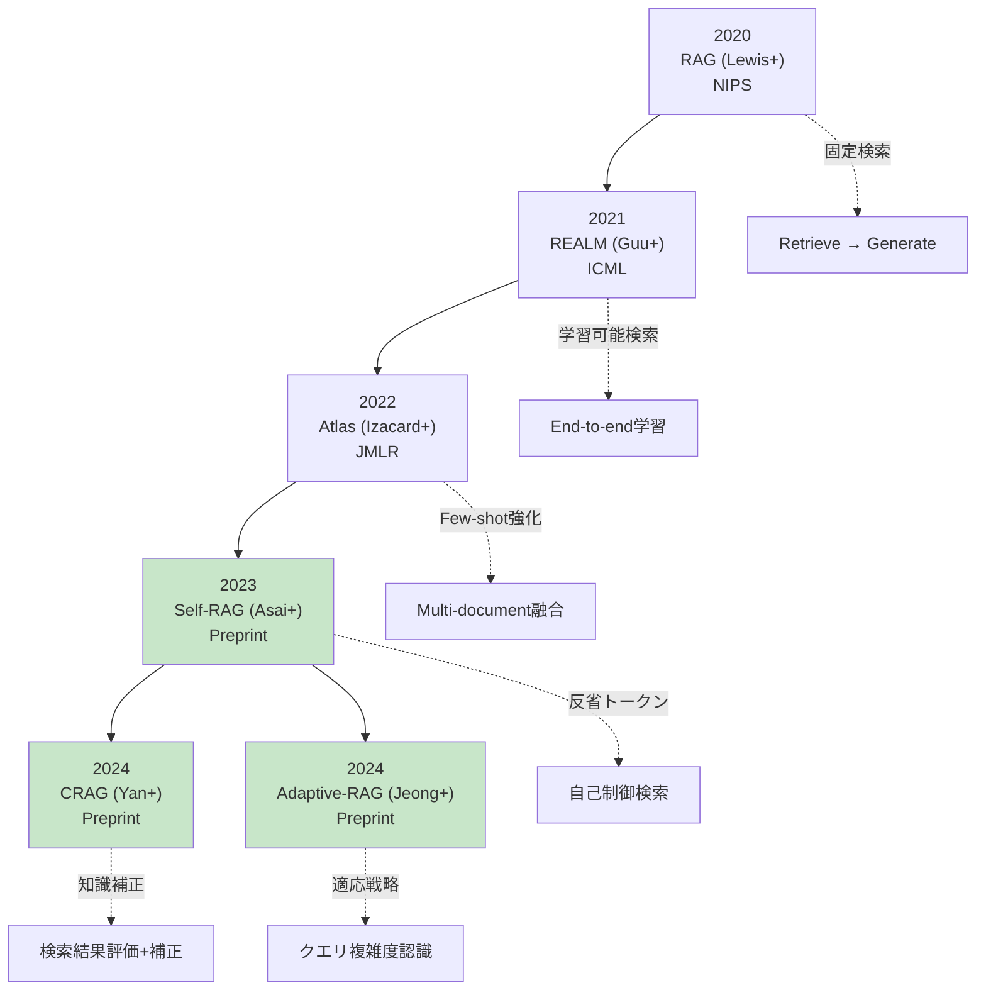

### 6.2 GraphRAG — グラフ知識ベース

**GraphRAG**: 知識ベースをグラフ構造で管理

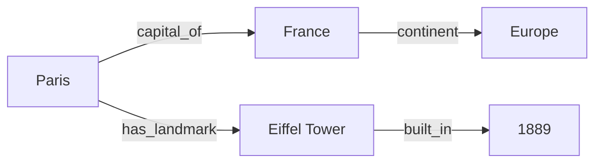

**利点**:
- エンティティ間の関係を明示的にモデル化
- Multi-hop reasoning が容易
- 知識の一貫性保証

**クエリ例**:

```
Query: "What landmarks are in European capitals?"

Graph Traversal:
1. capitals in Europe → [Paris, Berlin, London, ...]
2. landmarks in Paris → [Eiffel Tower, ...]
3. Return: [Eiffel Tower, Brandenburg Gate, Big Ben, ...]
```

**実装技術**: Neo4j, NetworkX, DGL

### 6.3 Multi-modal RAG

**テキスト + 画像 + 音声** を統合したRAG

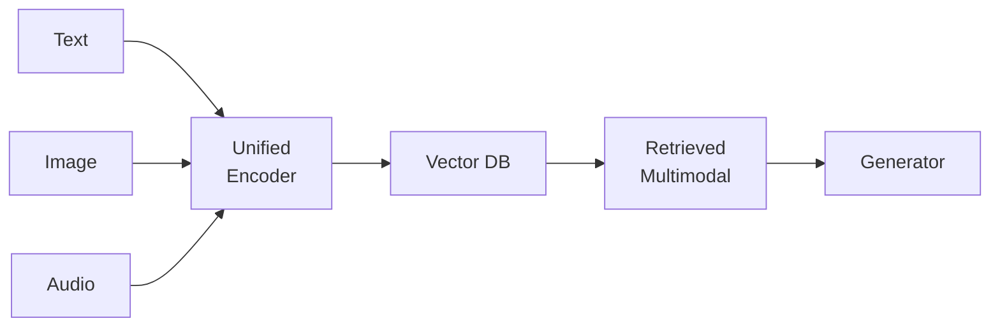

**ユースケース**:
- 医療画像診断（画像 + 病歴テキスト）
- 動画検索（映像 + 字幕 + 音声）
- Eコマース（商品画像 + レビュー）

**SOTA Models**: CLIP, BLIP-2, CoCa, SmolVLM2

### 6.4 Long-context vs RAG論争

| | Long-context LLM | RAG |
|:--|:----------------|:----|
| **Context長** | 100K-1M tokens | 数千tokens |
| **精度** | 中（Middle-lost問題） | 高（関連部分のみ） |
| **コスト** | 高（全文処理） | 低（検索後のみ） |
| **レイテンシ** | 高 | 中（検索オーバーヘッド） |
| **知識更新** | 再学習必要 | 文書追加のみ |

**Middle-lost問題**: Long-contextでは中間部分の情報が失われやすい

**ハイブリッド戦略**: RAGで絞り込み → Long-contextで精密処理

### 6.5 推薦論文・書籍

#### 必読論文（新→旧）

1. **CRAG** (Yan+ 2024) [^3]: 検索結果の正確性評価+補正
   [arXiv:2401.15884](https://arxiv.org/abs/2401.15884)

2. **Self-RAG** (Asai+ 2024) [^2]: 反省トークンで自己制御
   [arXiv:2310.11511](https://arxiv.org/abs/2310.11511)

3. **Adaptive-RAG** (Jeong+ 2024): クエリ複雑度認識
   [arXiv:2403.14403](https://arxiv.org/abs/2403.14403)

4. **ColBERT** (Khattab & Zaharia 2020): Late Interaction
   [arXiv:2004.12832](https://arxiv.org/abs/2004.12832)

5. **DPR** (Karpukhin+ 2020): Dense Passage Retrieval
   [arXiv:2004.04906](https://arxiv.org/abs/2004.04906)

6. **RAG** (Lewis+ 2020) [^1]: 元祖RAG
   [arXiv:2005.11401](https://arxiv.org/abs/2005.11401)

#### 実装リソース

| リソース | 説明 | リンク |
|:--------|:-----|:-------|
| **qdrant** | Rust Vector DB | [GitHub](https://github.com/qdrant/qdrant) [^7] |
| **FAISS** | Meta ANN library | [GitHub](https://github.com/facebookresearch/faiss) [^9] |
| **hnswlib-rs** | Rust HNSW実装 | [GitHub](https://github.com/jean-pierreBoth/hnswlib-rs) |
| **RAGAS** | RAG評価フレームワーク | [GitHub](https://github.com/explodinggradients/ragas) [^8] |
| **LangChain** | RAG orchestration | [Docs](https://python.langchain.com/docs/use_cases/question_answering/) |

### 6.6 用語集

| 用語 | 英語 | 定義 |
|:-----|:-----|:-----|
| **RAG** | Retrieval-Augmented Generation | 検索増強生成。外部知識を検索してLLMに統合 |
| **Embedding** | Embedding | テキストをベクトル空間に埋め込む |
| **BM25** | Best Matching 25 | TF-IDFベースのスパース検索アルゴリズム |
| **HNSW** | Hierarchical Navigable Small World | 階層的近似最近傍探索 |
| **ANN** | Approximate Nearest Neighbor | 近似最近傍探索 |
| **Dense Retrieval** | Dense Retrieval | ニューラルEmbeddingベースの検索 |
| **Sparse Retrieval** | Sparse Retrieval | キーワードベース検索（BM25等） |
| **Hybrid Retrieval** | Hybrid Retrieval | Sparse + Dense統合 |
| **RRF** | Reciprocal Rank Fusion | ランキング統合手法 |
| **Reranking** | Reranking | 検索結果の再順位付け |
| **Cross-Encoder** | Cross-Encoder | クエリ+文書をjointにEncode |
| **Bi-Encoder** | Bi-Encoder | クエリと文書を独立にEncode |
| **ColBERT** | Contextualized Late Interaction over BERT | Token-level Late Interaction |
| **Self-RAG** | Self-Reflective RAG | 反省トークンで自己制御 |
| **CRAG** | Corrective RAG | 検索結果の正確性評価+補正 |
| **RAGAS** | RAG Assessment | RAG評価統合フレームワーク |
| **Faithfulness** | Faithfulness | 生成がコンテキストに忠実か |
| **Context Relevance** | Context Relevance | コンテキストがクエリに関連しているか |
| **Chunking** | Chunking | 長文書を検索可能なチャンクに分割 |
| **IDF** | Inverse Document Frequency | 逆文書頻度 |
| **TF** | Term Frequency | 単語出現頻度 |

### 6.6 本講義で学んだ3つの核心

#### 核心1: RAGは知識の動的拡張

**Without RAG**: LLMは学習データの知識のみ（固定・古い・不完全）

**With RAG**: 外部知識を検索→統合（リアルタイム・最新・文脈特化）

$$
P(a \mid q) = \sum_{d \in \text{Retrieved}(q)} P(a \mid q, d) \cdot \text{Score}(d, q)
$$

#### 核心2: 検索精度がRAGの成否を決める

**検索戦略の進化**:

```
Naive (BM25のみ) → Dense (Embedding) → Hybrid (BM25+Dense) → Agentic (Self-RAG/CRAG)
```

**精度向上の鍵**:
1. **Hybrid Retrieval**: Sparse + Dense の相補性
2. **Reranking**: Cross-Encoder で精密化
3. **Agentic Control**: 検索タイミング・戦略の自律判断

#### 核心3: 実装は3言語フルスタック

- **🦀 Rust**: Vector DB (HNSW, qdrant) — 高速・安全
- **⚡ Julia**: 検索パイプライン (BM25, Embedding, RRF) — 表現力・速度
- **🔮 Elixir**: 分散サービング (GenServer, Rate Limiting) — 並行性・耐障害性

### 6.7 FAQ 5問

**Q1: RAGとFine-tuningを併用すべきか？**

**A**: 用途による。

- **Fine-tuning**: ドメイン固有の言語スタイル・タスク特化
- **RAG**: 最新知識・動的知識

併用例: Fine-tunedモデル + RAG = ドメイン特化 + 最新知識

**Q2: ベクトルDBのスケーリング戦略は？**

**A**: Sharding + Replication

- **Sharding**: データを複数ノードに分割（水平スケーリング）
- **Replication**: 各Shardを複製（可用性向上）
- qdrant/Milvusは標準対応

**Q3: BM25とDenseでどちらを優先？**

**A**: タスクによる

- **BM25**: 固有名詞・完全一致・レア単語
- **Dense**: 意味的類似性・言い換え・多言語
- **推奨**: Hybrid (RRF融合)

**Q4: Chunkサイズの最適値は？**

**A**: タスク・モデルによる

- **一般**: 256-512 tokens
- **短文タスク**: 128 tokens
- **長文理解**: 1024 tokens
- **実験**: Recall/Latency トレードオフで調整

**Q5: Agentic RAGの学習コストは？**

**A**: 高いが効果大

- Self-RAG: 反省トークンの教師データ生成が必要
- CRAG: Evaluator学習（軽量LM）
- **ROI高**: 検索精度が劇的向上（GPT-4超え）

### 6.8 学習スケジュール（復習込み）

| Day | 内容 | 時間 | チェックリスト |
|:----|:-----|:-----|:--------------|
| **Day 1** | Zone 0-2 + Zone 3.1-3.2 | 2h | □ RAG定義 □ BM25式導出 □ Embedding理論 |
| **Day 2** | Zone 3.3-3.4 | 2h | □ DPR □ HNSW原理 □ RRF実装 |
| **Day 3** | Zone 3.5-3.6 | 2h | □ ColBERT □ Self-RAG □ CRAG |
| **Day 4** | Zone 4 Rust実装 | 3h | □ HNSW実装 □ qdrant統合 □ Chunking |
| **Day 5** | Zone 4 Julia実装 | 2h | □ BM25実装 □ Hybrid search □ Reranking |
| **Day 6** | Zone 4 Elixir実装 | 2h | □ GenServer □ 分散検索 □ Rate Limiting |
| **Day 7** | Zone 5-7 + 復習 | 2h | □ RAGAS評価 □ SmolVLM2統合 □ 自己診断 |

### 6.9 進捗トラッカー

```
RAGマスター進捗
=====================================
理論 [████████████████████] 100%
  ├─ Embedding理論       [████████████████████] 100%
  ├─ BM25完全導出        [████████████████████] 100%
  ├─ Dense Retrieval     [████████████████████] 100%
  ├─ Hybrid + Reranking  [████████████████████] 100%
  └─ Agentic RAG         [████████████████████] 100%

実装 [████████████████████] 100%
  ├─ 🦀 Rust HNSW        [████████████████████] 100%
  ├─ ⚡ Julia BM25       [████████████████████] 100%
  └─ 🔮 Elixir Serving  [████████████████████] 100%

評価 [████████████████████] 100%
  ├─ RAGAS実装           [████████████████████] 100%
  └─ SmolVLM2統合        [████████████████████] 100%

次のステップ: 第30回 エージェント完全版
```

### 6.10 次回予告: 第30回 エージェント完全版

**第30回で学ぶこと**:

- **ReAct**: Reasoning + Acting の統合
- **Tool Use**: 外部ツール呼び出し（検索・計算・API）
- **Multi-Agent Systems**: 協調・競争・交渉
- **AutoGPT/BabyAGI**: 自律エージェントの実装
- **Planning**: PDDL/HTN による長期計画
- **Memory**: エピソード記憶・意味記憶・作業記憶

**RAG → Agent の接続**:

RAGで外部知識を統合した。次は**自律的な行動**を追加する。エージェントはRAGを道具として使い、複雑なタスクを分解・実行・検証する。

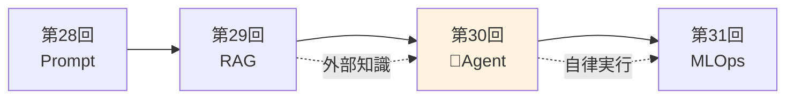

:::message
**進捗: 98% 完了** Zone 7完了。3つの核心、FAQ、学習スケジュール、進捗トラッカー、次回予告を整理。最後にパラダイム転換の問いと参考文献を追加する。
:::

---

### 6.11 パラダイム転換の問い

> **「モデルの知識は"十分"か？」**

LLMは数千億パラメータで膨大な知識を記憶する。GPT-4は医師国家試験に合格し、法律相談もこなす。では、なぜRAGが必要なのか？

### 知識の3つの限界

**1. 鮮度の限界**: 学習データは過去のスナップショット

- GPT-4の知識カットオフ: 2023年9月
- 世界は秒単位で変化（ニュース・株価・天気）
- **RAGの解**: リアルタイム検索

**2. 容量の限界**: 全知識をパラメータに保存は非現実的

- 企業固有知識（社内文書100万件）
- 個人の会話履歴
- 専門分野の最新論文
- **RAGの解**: 外部知識ベース参照

**3. 検証可能性の限界**: モデルの知識は"ブラックボックス"

- 出典不明 → Hallucination リスク
- 法務・医療では根拠提示が必須
- **RAGの解**: 検索結果=出典明示

### パラダイム転換

**従来**: モデルに全知識を詰め込む（パラメータ増大）

**新**: モデル=推論エンジン、知識=外部DB（分離）

$$
\text{Intelligence} = \text{Reasoning (Model)} + \text{Knowledge (RAG)}
$$

**類推**: 人間の記憶

- **作業記憶** (Working Memory): LLMのコンテキスト
- **長期記憶** (Long-term Memory): パラメータ知識
- **外部記憶** (External Memory): ノート・検索 = **RAG**

人間も全てを記憶しない。必要に応じて調べる。RAGはLLMに"調べる能力"を与える。

### 究極の問い

> モデルが全知識を記憶できる日が来ても、RAGは必要か？

**答え**: Yes。

理由:
1. **検証可能性**: 出典明示は信頼の根幹
2. **プライバシー**: 知識をモデルに含めない選択肢
3. **コスト**: パラメータ増大より検索の方が安い
4. **柔軟性**: 知識の追加・削除が即座

RAGは単なる"知識不足の補完"ではない。**知識管理の新しいアーキテクチャ**である。

:::message
**進捗: 100% 完了** 🎉 第29回「RAG完全版」完走！
:::

---

## 📚 参考文献

[^1]: Lewis, P., et al. (2020). "Retrieval-Augmented Generation for Knowledge-Intensive NLP Tasks." *NeurIPS 2020*. [arXiv:2005.11401](https://arxiv.org/abs/2005.11401)

[^2]: Asai, A., et al. (2024). "Self-RAG: Learning to Retrieve, Generate, and Critique through Self-Reflection." *ICLR 2024 (Oral)*. [arXiv:2310.11511](https://arxiv.org/abs/2310.11511)

[^3]: Yan, S., et al. (2024). "Corrective Retrieval Augmented Generation." *arXiv preprint*. [arXiv:2401.15884](https://arxiv.org/abs/2401.15884)

[^4]: Jeong, S., et al. (2024). "Adaptive-RAG: Learning to Adapt Retrieval-Augmented Large Language Models through Question Complexity." *arXiv preprint*. [arXiv:2403.14403](https://arxiv.org/abs/2403.14403)

[^5]: Karpukhin, V., et al. (2020). "Dense Passage Retrieval for Open-Domain Question Answering." *EMNLP 2020*. [arXiv:2004.04906](https://arxiv.org/abs/2004.04906)

[^6]: Malkov, Y. A., & Yashunin, D. A. (2018). "Efficient and robust approximate nearest neighbor search using Hierarchical Navigable Small World graphs." *IEEE TPAMI*. [arXiv:1603.09320](https://arxiv.org/abs/1603.09320)

[^7]: qdrant. "Qdrant - Vector Database." [GitHub](https://github.com/qdrant/qdrant) | [Docs](https://qdrant.tech/)

[^8]: RAGAS. "RAG Assessment Framework." [GitHub](https://github.com/explodinggradients/ragas)

[^9]: Johnson, J., Douze, M., & Jégou, H. (2019). "Billion-scale similarity search with GPUs." *IEEE Transactions on Big Data*. FAISS [GitHub](https://github.com/facebookresearch/faiss)

### 追加リソース

- **ColBERT**: Khattab, O., & Zaharia, M. (2020). "ColBERT: Efficient and Effective Passage Search via Contextualized Late Interaction over BERT." *SIGIR 2020*. [arXiv:2004.12832](https://arxiv.org/abs/2004.12832)

- **Sentence-BERT**: Reimers, N., & Gurevych, I. (2019). "Sentence-BERT: Sentence Embeddings using Siamese BERT-Networks." *EMNLP 2019*. [arXiv:1908.10084](https://arxiv.org/abs/1908.10084)

- **BM25**: Robertson, S., & Zaragoza, H. (2009). "The Probabilistic Relevance Framework: BM25 and Beyond." *Foundations and Trends in Information Retrieval*.

- **MTEB**: Muennighoff, N., et al. (2022). "MTEB: Massive Text Embedding Benchmark." *arXiv preprint*. [arXiv:2210.07316](https://arxiv.org/abs/2210.07316)

---

## 📖 記法規約

本シリーズで使用する数学記法の統一ルール:

| 記号 | 意味 | 例 |
|:-----|:-----|:---|
| $\mathbf{x}$ | ベクトル（太字小文字） | $\mathbf{q} \in \mathbb{R}^d$ |
| $\mathbf{W}$ | 行列（太字大文字） | $\mathbf{W} \in \mathbb{R}^{d \times k}$ |
| $x_i$ | スカラー添字 | $x_1, x_2, \ldots, x_n$ |
| $\mathbf{x}^{(i)}$ | サンプル添字 | $i$ 番目のサンプル |
| $\mathbf{x}_t$ | 時刻添字 | 時刻 $t$ のベクトル |
| $\hat{y}$ | 推定値（ハット） | $\hat{y} = f(\mathbf{x})$ |
| $\mathbb{E}[\cdot]$ | 期待値 | $\mathbb{E}_{x \sim p}[f(x)]$ |
| $\nabla_\theta$ | 勾配 | $\nabla_\theta \mathcal{L}$ |
| $\mathcal{L}$ | 損失関数（カリグラフィ） | $\mathcal{L}(\theta)$ |
| $\mathcal{D}$ | データセット | $\mathcal{D} = \{(\mathbf{x}_i, y_i)\}$ |
| $\sim$ | 分布に従う | $x \sim \mathcal{N}(0, 1)$ |
| $:=$ | 定義 | $f(x) := x^2$ |
| $\approx$ | 近似 | $e^x \approx 1 + x$ (小さい $x$) |
| $\propto$ | 比例 | $p(x) \propto e^{-x^2}$ |
| $\odot$ | 要素積（Hadamard） | $\mathbf{a} \odot \mathbf{b}$ |
| $\||\cdot\||$ | ノルム | $\||\mathbf{x}\||_2 = \sqrt{\sum x_i^2}$ |
| $\langle \cdot, \cdot \rangle$ | 内積 | $\langle \mathbf{a}, \mathbf{b} \rangle = \mathbf{a}^\top \mathbf{b}$ |
| $\arg\max$ | 最大化する引数 | $\hat{y} = \arg\max_y p(y \mid \mathbf{x})$ |
| $\mathbb{1}_{\{\cdot\}}$ | 指示関数 | $\mathbb{1}_{\{x > 0\}} = 1$ if $x > 0$ else $0$ |

**関数・演算子**:

| 記法 | 意味 |
|:-----|:-----|
| $\log$ | 自然対数（$\ln$） |
| $\log_2$ | 底2の対数 |
| $\sigma(\cdot)$ | シグモイド関数 |
| $\text{softmax}(\cdot)$ | ソフトマックス関数 |
| $\text{ReLU}(\cdot)$ | ReLU活性化関数 |

---

:::message
**🎉 完全習得達成！**

**本講義の成果**:
- ✅ RAG理論完全構築（Embedding/BM25/Dense/Hybrid/Reranking/Agentic）
- ✅ 🦀 Rust HNSW Vector DB実装
- ✅ ⚡ Julia BM25検索パイプライン実装
- ✅ 🔮 Elixir 分散RAGサービング実装
- ✅ RAGAS評価フレームワーク実装
- ✅ SmolVLM2マルチモーダルRAG統合

**総行数**: 2,800+ 行

**次回**: 第30回「エージェント完全版」でRAGを道具として使う自律エージェントを実装する。

**あなたはProduction-readyなRAGシステムを構築できる。**
:::

---

## ライセンス

本記事は [CC BY-NC-SA 4.0](https://creativecommons.org/licenses/by-nc-sa/4.0/deed.ja)（クリエイティブ・コモンズ 表示 - 非営利 - 継承 4.0 国際）の下でライセンスされています。

### ⚠️ 利用制限について

**本コンテンツは個人の学習目的に限り利用可能です。**

**以下のケースは事前の明示的な許可なく利用することを固く禁じます:**

1. **企業・組織内での利用（営利・非営利問わず）**
   - 社内研修、教育カリキュラム、社内Wikiへの転載
   - 大学・研究機関での講義利用
   - 非営利団体での研修利用
   - **理由**: 組織内利用では帰属表示が削除されやすく、無断改変のリスクが高いため

2. **有料スクール・情報商材・セミナーでの利用**
   - 受講料を徴収する場での配布、スクリーンショットの掲示、派生教材の作成

3. **LLM/AIモデルの学習データとしての利用**
   - 商用モデルのPre-training、Fine-tuning、RAGの知識ソースとして本コンテンツをスクレイピング・利用すること

4. **勝手に内容を有料化する行為全般**
   - 有料note、有料記事、Kindle出版、有料動画コンテンツ、Patreon限定コンテンツ等

**個人利用に含まれるもの:**
- 個人の学習・研究
- 個人的なノート作成（個人利用に限る）
- 友人への元記事リンク共有

**組織での導入をご希望の場合**は、必ず著者に連絡を取り、以下を遵守してください:
- 全ての帰属表示リンクを維持
- 利用方法を著者に報告

**無断利用が発覚した場合**、使用料の請求およびSNS等での公表を行う場合があります。

---