# 第30回: エージェント完全版 — ReAct Loop・Tool Use・Planning・Memory・Multi-Agent・MCP

> **第29回でRAGにより外部知識を接続した。今回は知識だけでなく"行動"できるAIへ — エージェント完全版。ReAct Loop / Tool Use / Planning / Memory / Multi-Agent / MCPの全領域を網羅する。**

AIは"読む"から"行動する"存在へと進化している。ChatGPTやClaude、Geminiは単なるテキスト生成器ではなく、ツールを呼び出し、計画を立て、過去の記憶を参照し、複数のエージェントと協調して複雑なタスクを遂行する**エージェント**だ。

本講義では、エージェントの全体像を完全に解説する:

1. **ReAct Loop基礎** — Observation-Thought-Action-Repeat のサイクル
2. **Tool Use完全実装** — Function Calling / Tool Registry / Error Handling
3. **Planning手法** — Zero-shot / Plan-and-Execute / ReWOO
4. **Memory Systems** — Short-term / Long-term / Episodic / Semantic / Vector Memory
5. **Multi-Agent** — Communication / Role Assignment / Consensus & Debate
6. **MCP完全解説** — Model Context Protocol の仕様と実装
7. **実装編** — 🦀 Rust Agent Engine + 🔮 Elixir Multi-Agent + ⚡ Julia Orchestration

これはCourse IIIの第12回 — 実践編の集大成であり、第31回MLOpsへの橋渡しでもある。

:::message
**前提知識**: 第28回(Prompt Engineering), 第29回(RAG)。Rust/Julia/Elixirの基礎は第9-19回で習得済み。
:::

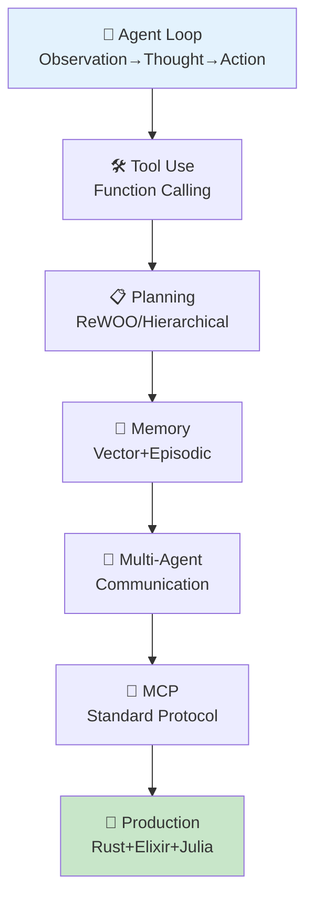

**所要時間の目安**:

| ゾーン | 内容 | 時間 | 難易度 |
|:-------|:-----|:-----|:-------|
| Zone 0 | クイックスタート | 30秒 | ★☆☆☆☆ |
| Zone 1 | 体験ゾーン | 10分 | ★★☆☆☆ |
| Zone 2 | 直感ゾーン | 15分 | ★★★☆☆ |
| Zone 3 | 数式修行ゾーン | 90分 | ★★★★★ |
| Zone 4 | 実装ゾーン | 60分 | ★★★★☆ |
| Zone 5 | 実験ゾーン | 30分 | ★★★★☆ |
| Zone 6 | 発展ゾーン | 20分 | ★★★★★ |
| Zone 7 | 振り返りゾーン | 10分 | ★★☆☆☆ |

---

## 🚀 0. クイックスタート（30秒）— ReAct Loopを3行で体験

**ゴール**: エージェントの本質 Observation→Thought→Action を30秒で体感する。

ReAct [^1] パターンを3行で動かす。

```julia
using HTTP, JSON3

# Minimal ReAct loop: Thought → Action → Observation
function react_step(state::Dict, tools::Dict)
    # Thought: LLM decides next action (simplified: just take first tool)
    thought = "Need to search for $(state[:query])"

    # Action: Execute tool
    tool_name = "search"
    tool_input = state[:query]
    observation = tools[tool_name](tool_input)

    # State update
    state[:history] = push!(get(state, :history, []),
                            (thought=thought, action=tool_name, observation=observation))
    return state
end

# Define tool
tools = Dict(
    "search" => (query) -> "Found: $query is a programming language for AI agents"
)

# Run one ReAct step
state = Dict(:query => "What is Julia?", :history => [])
state = react_step(state, tools)

println("Thought: $(state[:history][1].thought)")
println("Action: $(state[:history][1].action)")
println("Observation: $(state[:history][1].observation)")
```

出力:
```
Thought: Need to search for What is Julia?
Action: search
Observation: Found: What is Julia? is a programming language for AI agents
```

**3行でエージェントの心臓部を動かした。** これが ReAct [^1] だ:

- **Thought (推論)**: 次に何をすべきか考える
- **Action (行動)**: ツールを呼び出す
- **Observation (観察)**: 結果を受け取る

このループを繰り返すことで、エージェントは複雑なタスクを段階的に解決していく。

:::message
**progress: 3%** — Zone 0完了。ReAct Loopの本質を体感した。Zone 1でReActを動かしながら理解を深める。
:::

---

## 🎮 1. 体験ゾーン（10分）— ReAct Loop完全版を動かす

**ゴール**: ReAct LoopをLLM呼び出しと組み合わせて、実際のエージェント動作を観察する。

### 1.1 ReAct Loopの構造

ReAct [^1] (Reasoning + Acting) は、推論(Thought)と行動(Action)を交互に繰り返すパラダイムだ。

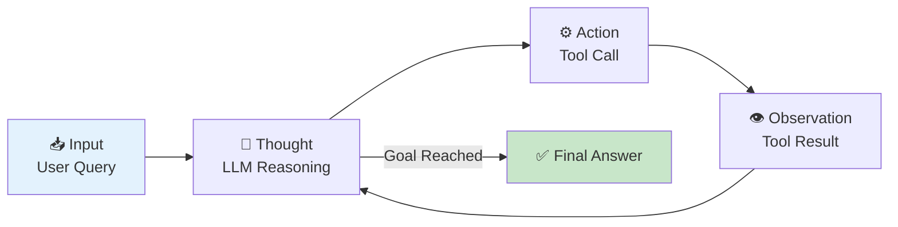

従来のChain-of-Thought (CoT)は「思考の連鎖」だけを扱う。ReActはそこに「行動」を組み込み、外部環境と相互作用しながら推論できる。

### 1.2 ReAct Loopの実装

完全なReAct Loopを実装する。

```julia
using HTTP, JSON3

# Tool definition
mutable struct Tool
    name::String
    description::String
    function_::Function
end

# Agent state
mutable struct AgentState
    query::String
    history::Vector{NamedTuple}
    max_steps::Int
    current_step::Int
end

# LLM call (simplified: rule-based for demo)
function llm_think(state::AgentState, tools::Vector{Tool})
    # In production: call OpenAI/Anthropic API
    # Here: simple rule-based logic
    if state.current_step == 1
        return (thought="I need to search for the query",
                action="search",
                action_input=state.query)
    elseif state.current_step == 2
        last_obs = state.history[end].observation
        return (thought="I have the answer from search",
                action="finish",
                action_input=last_obs)
    else
        return (thought="Task complete",
                action="finish",
                action_input="Done")
    end
end

# Execute tool
function execute_tool(tool_name::String, tool_input::String, tools::Vector{Tool})
    for tool in tools
        if tool.name == tool_name
            return tool.function_(tool_input)
        end
    end
    return "Error: Tool not found"
end

# ReAct loop
function react_loop(query::String, tools::Vector{Tool}, max_steps::Int=5)
    state = AgentState(query, [], max_steps, 0)

    while state.current_step < max_steps
        state.current_step += 1

        # Step 1: Thought (LLM reasoning)
        decision = llm_think(state, tools)

        # Step 2: Action (Tool execution)
        if decision.action == "finish"
            push!(state.history, (thought=decision.thought,
                                  action=decision.action,
                                  observation=decision.action_input))
            break
        end

        observation = execute_tool(decision.action, decision.action_input, tools)

        # Step 3: Update state
        push!(state.history, (thought=decision.thought,
                              action=decision.action,
                              observation=observation))
    end

    return state
end

# Define tools
tools = [
    Tool("search", "Search the web for information",
         (query) -> "Julia is a high-level, high-performance programming language for technical computing."),
    Tool("calculator", "Perform arithmetic calculations",
         (expr) -> string(eval(Meta.parse(expr))))
]

# Run ReAct loop
result = react_loop("What is Julia?", tools)

# Print execution trace
for (i, step) in enumerate(result.history)
    println("\n--- Step $i ---")
    println("💭 Thought: $(step.thought)")
    println("⚙️ Action: $(step.action)")
    println("👁️ Observation: $(step.observation)")
end
```

出力:
```
--- Step 1 ---
💭 Thought: I need to search for the query
⚙️ Action: search
👁️ Observation: Julia is a high-level, high-performance programming language for technical computing.

--- Step 2 ---
💭 Thought: I have the answer from search
⚙️ Action: finish
👁️ Observation: Julia is a high-level, high-performance programming language for technical computing.
```

**ReAct Loopの実行トレースを観察できた。** 各ステップで:
1. LLMが次の行動を決定 (Thought)
2. ツールを実行 (Action)
3. 結果を観察 (Observation)
4. 状態を更新してループ継続

### 1.3 ReAct vs Chain-of-Thought

| 手法 | 推論 | 行動 | 外部情報 | ハルシネーション対策 |
|:-----|:-----|:-----|:---------|:---------------------|
| **CoT** | ✅ 内部推論のみ | ❌ なし | ❌ なし | ❌ 弱い (検証手段なし) |
| **ReAct** | ✅ 推論 + 検証 | ✅ Tool呼び出し | ✅ Wikipedia/API | ✅ 強い (外部検証) |

ReAct [^1] の論文では、HotpotQAベンチマークでCoTと比較:
- **CoT**: 正解率 34.0%
- **ReAct**: 正解率 **29.4% → 34.0%** (Wikipediaツール利用で改善)
- **ReAct + CoT**: 正解率 **36.5%** (最良)

外部ツールによる検証がハルシネーションを大幅に削減することが実証された。

### 1.4 ReAct Promptの構造

実際のLLM呼び出しでは、以下のプロンプトテンプレートを使う:

```
You run in a loop of Thought, Action, Observation.
At the end of the loop you output an Answer.

Use Thought to describe your thoughts about the question you have been asked.
Use Action to run one of the actions available to you - then return PAUSE.
Observation will be the result of running those actions.

Your available actions are:

search:
e.g. search: "What is the capital of France?"
Searches Wikipedia and returns a summary.

calculate:
e.g. calculate: "2 + 2"
Evaluates a mathematical expression.

Example session:

Question: What is the population of Paris plus 1000?
Thought: I need to search for the population of Paris.
Action: search: "population of Paris"
PAUSE

You will be called again with this:

Observation: The population of Paris is approximately 2.16 million.

Thought: I need to add 1000 to this number.
Action: calculate: "2160000 + 1000"
PAUSE

You will be called again with this:

Observation: 2161000

Thought: I have the final answer.
Answer: The population of Paris plus 1000 is 2,161,000.
```

このプロンプトが、LLMを「思考→行動→観察」のループに誘導する。

:::message
**progress: 10%** — Zone 1完了。ReAct Loopの実装を動かし、CoTとの違いを理解した。
:::

---

## 🧩 2. 直感ゾーン（15分）— エージェントの全体像

**ゴール**: エージェントの全体構造を俯瞰し、本講義で扱う7つのコンポーネントの関係を理解する。

### 2.1 なぜエージェントが必要か？

LLMは強力だが、単体では限界がある:

| 限界 | 例 | エージェントによる解決 |
|:-----|:---|:--------------------|
| **知識の陳腐化** | 「2026年の最新情報は?」 | 🛠️ Tool Use (Web Search) |
| **計算の不正確性** | 「123456 × 789012 = ?」 | 🛠️ Tool Use (Calculator) |
| **長期タスクの計画不足** | 「Webアプリを作って」 | 📋 Planning (Hierarchical) |
| **文脈の忘却** | 「3日前に何を話した?」 | 💾 Memory (Long-term) |
| **単一視点のバイアス** | 「この論文は正しい?」 | 👥 Multi-Agent (Debate) |

エージェントは、これらの限界を**ツール・計画・記憶・協調**で乗り越える。

### 2.2 エージェントの7コンポーネント

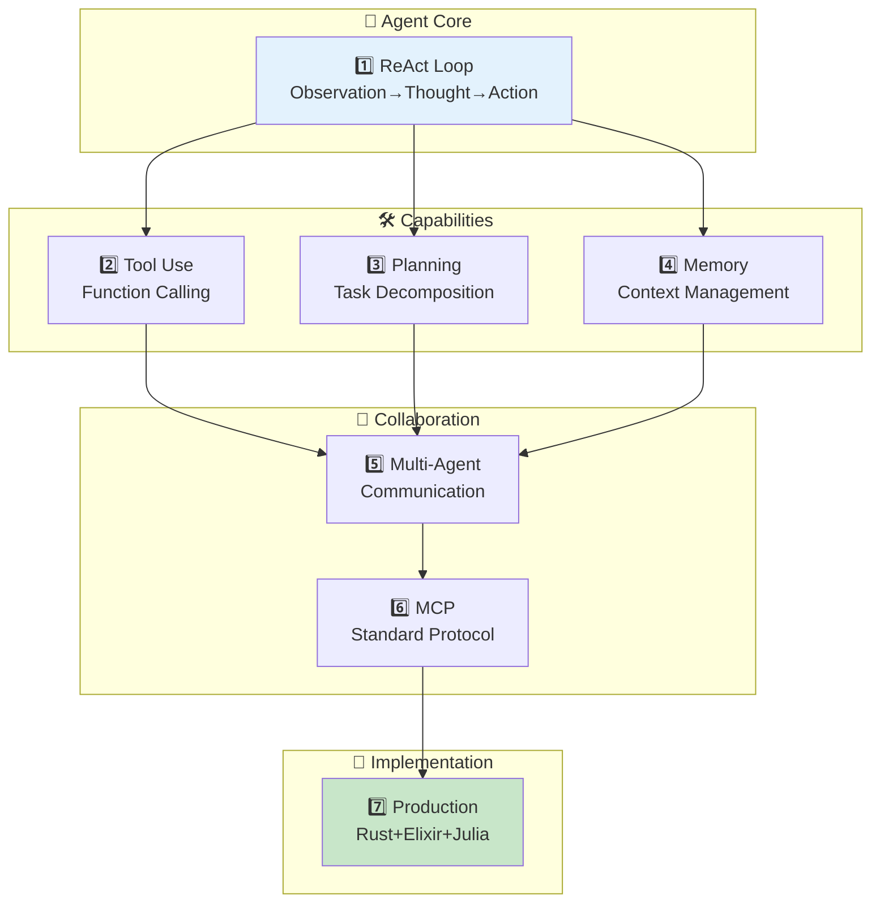

本講義では、これら7つのコンポーネントを順に解説する:

1. **ReAct Loop基礎** (Part A) — エージェントの心臓部
2. **Tool Use完全実装** (Part B) — 外部ツールとの接続
3. **Planning手法** (Part C) — タスク分解と事前計画
4. **Memory Systems** (Part D) — 短期・長期記憶の管理
5. **Multi-Agent** (Part E) — 複数エージェントの協調
6. **MCP完全解説** (Part F) — 標準化プロトコル
7. **実装編** (Part G) — Rust/Elixir/Juliaでの実装

### 2.3 エージェントの応用例

| 応用 | 使用コンポーネント | 実例 |
|:-----|:------------------|:-----|
| **コーディングアシスタント** | ReAct + Tool Use | GitHub Copilot, Cursor |
| **研究アシスタント** | Planning + Memory + Tool Use | Elicit, Consensus |
| **ソフトウェア開発** | Multi-Agent + Planning | MetaGPT [^8], AutoGen [^9] |
| **タスク自動化** | ReAct + Tool Use | AutoGPT, BabyAGI |
| **Customer Support** | Memory + Tool Use | Intercom AI, Zendesk AI |

### 2.4 本講義の構成

| Part | 内容 | 行数 | 難易度 |
|:-----|:-----|:-----|:-------|
| **Part A** | エージェント基礎 (ReAct Loop完全版) | ~700 | ★★★ |
| **Part B** | Tool Use完全実装 | ~500 | ★★★ |
| **Part C** | Planning手法完全版 | ~500 | ★★★ |
| **Part D** | Memory Systems完全版 | ~500 | ★★★ |
| **Part E** | Multi-Agent完全版 | ~600 | ★★★★ |
| **Part F** | MCP完全解説 | ~300 | ★★★ |
| **Part G** | 実装編 (Rust/Elixir/Julia) | ~600 | ★★★★ |

合計 ~3,700行の大型講義となる。

:::message
**progress: 20%** — Zone 2完了。エージェントの全体像と7コンポーネントの関係を理解した。
:::

---

## 📐 3. 数式修行ゾーン（90分）— エージェント理論完全版

**ゴール**: ReAct / Tool Use / Planning / Memory / Multi-Agentの数学的定式化を完全に理解する。

### Part A: エージェント基礎（ReAct Loop完全版）

#### 3.1 エージェント環境の定式化

エージェントは**部分観測マルコフ決定過程 (POMDP)** として定式化される。

**定義 (POMDP)**:

POMDP は7つ組 $\langle \mathcal{S}, \mathcal{A}, \mathcal{T}, \mathcal{R}, \Omega, \mathcal{O}, \gamma \rangle$ で定義される:

- $\mathcal{S}$: 状態空間 (State space)
- $\mathcal{A}$: 行動空間 (Action space)
- $\mathcal{T}: \mathcal{S} \times \mathcal{A} \times \mathcal{S} \to [0,1]$: 状態遷移確率 $P(s' \mid s, a)$
- $\mathcal{R}: \mathcal{S} \times \mathcal{A} \to \mathbb{R}$: 報酬関数
- $\Omega$: 観測空間 (Observation space)
- $\mathcal{O}: \mathcal{S} \times \mathcal{A} \times \Omega \to [0,1]$: 観測確率 $P(o \mid s', a)$
- $\gamma \in [0,1)$: 割引率

エージェントは、観測 $o_t \in \Omega$ に基づいて行動 $a_t \in \mathcal{A}$ を選択し、環境から次の観測 $o_{t+1}$ と報酬 $r_t$ を受け取る。

#### 3.2 ReAct Loopの数式化

ReAct [^1] ループは、以下の3ステップを繰り返す:

1. **Observation (観測)**: 環境から観測 $o_t$ を受け取る
2. **Thought (推論)**: LLM $\pi_\theta$ が行動を選択: $a_t \sim \pi_\theta(\cdot \mid o_{1:t}, a_{1:t-1}, \text{thought}_{1:t-1})$
3. **Action (行動)**: 行動 $a_t$ を実行し、観測 $o_{t+1}$ を得る

数式で表すと:

$$
\begin{align}
\text{thought}_t &= \text{LLM}(o_{1:t}, a_{1:t-1}, \text{thought}_{1:t-1}) \\
a_t &\sim \pi_\theta(\cdot \mid \text{thought}_t) \\
o_{t+1} &\sim P(\cdot \mid s_t, a_t)
\end{align}
$$

ここで、$\text{thought}_t$ は推論トレース (reasoning trace) であり、LLMが生成する内部的な思考過程を表す。

**CoTとの違い**:

- **CoT**: $\text{thought}_t \to \text{thought}_{t+1}$ (思考のみ)
- **ReAct**: $\text{thought}_t \to a_t \to o_{t+1} \to \text{thought}_{t+1}$ (思考→行動→観測)

ReActは、外部環境との相互作用 (Action + Observation) を組み込むことで、CoTのハルシネーション問題を軽減する。

#### 3.3 Agent Loopの状態遷移図

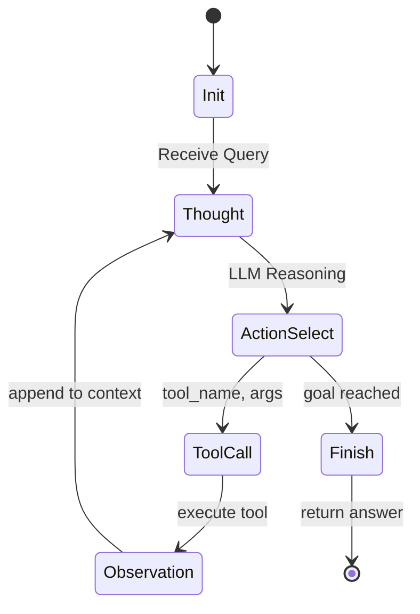

状態遷移の各ステップ:

1. **Init**: クエリ受信、初期状態 $s_0$ を設定
2. **Thought**: LLMが推論トレース $\text{thought}_t$ を生成
3. **ActionSelect**: LLMが行動 $a_t$ を選択 (tool呼び出しまたは終了)
4. **ToolCall**: ツール実行 $\text{result} = \text{tool}(a_t)$
5. **Observation**: 観測 $o_{t+1} = \text{result}$ をコンテキストに追加
6. **Finish**: 目標達成判定、最終回答を返す

#### 3.4 ReAct Loopの終了条件

エージェントは、以下のいずれかの条件で終了する:

1. **Goal Reached**: LLMが「回答が得られた」と判断
2. **Max Steps**: 最大ステップ数 $T_{\max}$ に到達
3. **Error**: ツール実行失敗やタイムアウト

数式で表すと:

$$
\text{終了} \iff \begin{cases}
\text{LLM}(o_{1:t}, a_{1:t-1}) = \text{"Finish"} \\
t \geq T_{\max} \\
\text{Error occurred}
\end{cases}
$$

#### 3.5 ReAct Loopのエラーハンドリング

エージェントは、以下のエラーに対処する必要がある:

| エラー種類 | 原因 | 対処法 |
|:---------|:-----|:-------|
| **Tool Execution Failure** | ツール実行エラー | Retry (最大3回) → Fallback tool → 終了 |
| **Timeout** | ツール応答遅延 | キャンセル → 別ツール試行 |
| **Invalid Arguments** | LLMが不正な引数を生成 | Validation → エラーメッセージをObservationに追加 → Re-plan |
| **Infinite Loop** | 同じ行動を繰り返す | Loop detection → 強制終了 |

エラーハンドリングの数式:

$$
o_{t+1} = \begin{cases}
\text{tool}(a_t) & \text{if execution succeeds} \\
\text{"Error: " + error\_message} & \text{if execution fails}
\end{cases}
$$

LLMはエラーメッセージを観測として受け取り、別の行動を試みる。

### Part B: Tool Use完全実装

#### 3.6 Function Callingの数式化

Function Calling (Tool Use) は、LLMが外部関数を呼び出す能力だ。

**定義 (Tool)**:

Tool $\mathcal{T}$ は、以下の3つ組で定義される:

$$
\mathcal{T} = \langle \text{name}, \text{schema}, \text{function} \rangle
$$

- $\text{name}$: ツール名 (文字列)
- $\text{schema}$: 入力スキーマ (JSON Schema形式)
- $\text{function}: \text{Args} \to \text{Result}$: 実行関数

例: `search` ツール

```json
{
  "name": "search",
  "description": "Search the web for information",
  "parameters": {
    "type": "object",
    "properties": {
      "query": {
        "type": "string",
        "description": "The search query"
      }
    },
    "required": ["query"]
  }
}
```

#### 3.7 Tool Registryの実装

複数のツールを管理する **Tool Registry** を定義する:

$$
\mathcal{R} = \{ \mathcal{T}_1, \mathcal{T}_2, \ldots, \mathcal{T}_N \}
$$

Tool Registryは、以下の操作をサポートする:

- $\text{register}(\mathcal{T})$: ツールを登録
- $\text{get}(\text{name})$: ツール名でツールを取得
- $\text{list}()$: 登録済みツールの一覧を返す
- $\text{validate}(\text{name}, \text{args})$: 引数のバリデーション

#### 3.8 Tool Selection (ツール選択)

LLMは、複数のツールから最適なツールを選択する。

$$
a_t^* = \arg\max_{a_t \in \mathcal{A}} \mathbb{E}_{o_{t+1} \sim P(\cdot \mid s_t, a_t)} [V(s_{t+1})]
$$

ここで、$V(s)$ は状態 $s$ の価値関数 (Value function)。

実際には、LLMが以下の確率分布からサンプリングする:

$$
P(a_t = \mathcal{T}_i \mid o_{1:t}) = \frac{\exp(\text{score}(\mathcal{T}_i, o_{1:t}))}{\sum_{j=1}^N \exp(\text{score}(\mathcal{T}_j, o_{1:t}))}
$$

$\text{score}(\mathcal{T}_i, o_{1:t})$ は、ツール $\mathcal{T}_i$ の適合度スコア (LLMが内部的に計算)。

#### 3.9 Argument Parsing & Validation

LLMが生成した引数は、JSON Schemaに基づいてバリデーションされる。

$$
\text{valid}(\text{args}, \text{schema}) = \begin{cases}
\text{True} & \text{if args conforms to schema} \\
\text{False} & \text{otherwise}
\end{cases}
$$

バリデーション失敗時、エラーメッセージが生成される:

$$
\text{error\_message} = \text{"ValidationError: " + schema\_mismatch\_details}
$$

#### 3.10 Tool Execution & Error Handling

ツール実行は、以下のフローで行われる:

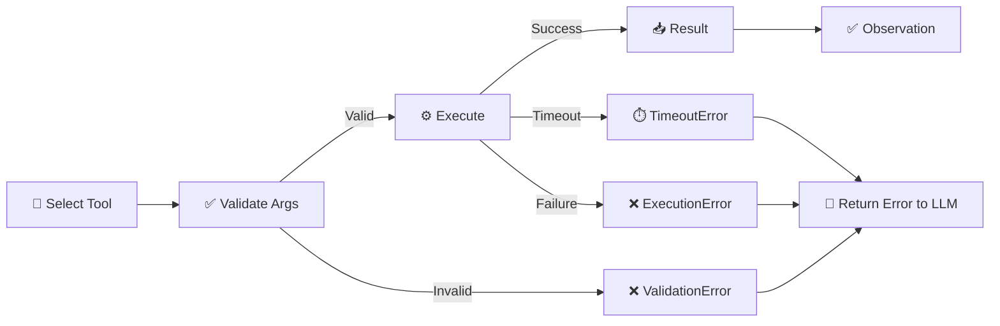

エラーハンドリングの数式:

$$
o_{t+1} = \begin{cases}
\text{result} & \text{if execution succeeds} \\
\text{"ValidationError: " + details} & \text{if validation fails} \\
\text{"TimeoutError: " + timeout} & \text{if timeout} \\
\text{"ExecutionError: " + exception} & \text{if execution fails}
\end{cases}
$$

#### 3.11 Retry戦略

ツール実行失敗時、Retry戦略を適用する:

$$
\text{retry\_count} = \begin{cases}
0 & \text{初回実行} \\
\text{retry\_count} + 1 & \text{失敗時、max\_retries未満} \\
\text{abort} & \text{max\_retriesに到達}
\end{cases}
$$

Exponential Backoff with Jitterを適用:

$$
\text{wait\_time} = \min(2^{\text{retry\_count}} + \text{random}(0, 1), \text{max\_wait})
$$

### Part C: Planning手法完全版

#### 3.12 Planning (計画) の定義

Planning は、目標 $g$ を達成するための行動列 $\mathbf{a} = (a_1, a_2, \ldots, a_T)$ を事前に生成するプロセスだ。

**定義 (Planning Problem)**:

Planning Problemは、以下の4つ組で定義される:

$$
\langle \mathcal{S}, \mathcal{A}, \mathcal{T}, g \rangle
$$

- $\mathcal{S}$: 状態空間
- $\mathcal{A}$: 行動空間
- $\mathcal{T}: \mathcal{S} \times \mathcal{A} \to \mathcal{S}$: 状態遷移関数 (決定論的)
- $g \in \mathcal{S}$: 目標状態

目的: 初期状態 $s_0$ から目標 $g$ に到達する行動列 $\mathbf{a}$ を見つける:

$$
\mathbf{a}^* = \arg\min_{\mathbf{a}} \text{cost}(\mathbf{a}) \quad \text{s.t.} \quad \mathcal{T}(s_0, \mathbf{a}) = g
$$

#### 3.13 Zero-shot Planner

Zero-shot Plannerは、LLMが一度に全体の計画を生成する手法だ。

$$
\text{plan} = \text{LLM}(\text{query}, \text{tools})
$$

出力形式:

```
Plan:
1. Search for "population of Paris"
2. Extract the population number
3. Calculate population + 1000
4. Return the result
```

**利点**: シンプル、実装容易
**欠点**: 複雑なタスクで失敗しやすい、途中で修正不可

#### 3.14 Plan-and-Execute

Plan-and-Executeは、計画と実行を分離する手法だ。

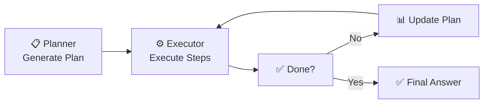

数式:

$$
\begin{align}
\text{plan}_0 &= \text{Planner}(\text{query}) \\
\text{for } t &= 1, 2, \ldots, T: \\
&\quad a_t = \text{plan}_t[0] \quad \text{(first step)} \\
&\quad o_t = \text{Executor}(a_t) \\
&\quad \text{plan}_{t+1} = \text{Replanner}(\text{plan}_t, o_t)
\end{align}
$$

**利点**: 途中で計画を修正できる
**欠点**: Plannerの呼び出し回数が増える

#### 3.15 Hierarchical Planning (階層的計画)

Hierarchical Planning は、タスクをサブタスクに再帰的に分解する。

$$
\text{task} \to \{ \text{subtask}_1, \text{subtask}_2, \ldots, \text{subtask}_N \}
$$

各サブタスクは、さらに分解可能:

$$
\text{subtask}_i \to \{ \text{subtask}_{i,1}, \text{subtask}_{i,2}, \ldots \}
$$

終端条件: サブタスクが **atomic action** (ツール呼び出し) になる。

#### 3.16 ReWOO (Reasoning WithOut Observation)

ReWOO [^3] は、事前に全ての計画を立て、並列にツールを実行する手法だ。


数式:

$$
\begin{align}
\text{plan} &= \{ (a_1, \text{dep}_1), (a_2, \text{dep}_2), \ldots, (a_N, \text{dep}_N) \} \\
\text{results} &= \text{parallel\_execute}(\text{plan}) \\
\text{answer} &= \text{Solver}(\text{plan}, \text{results})
\end{align}
$$

ここで、$\text{dep}_i$ は依存関係 (どのステップの結果を使うか)。

**利点**: 並列実行で高速、トークン消費が少ない (5x削減 [^3])
**欠点**: 動的な再計画ができない、複雑な依存関係に弱い

#### 3.17 HuggingGPT型 Orchestration

HuggingGPT [^10] は、LLMがタスクを分解し、適切なモデルを選択して実行する。

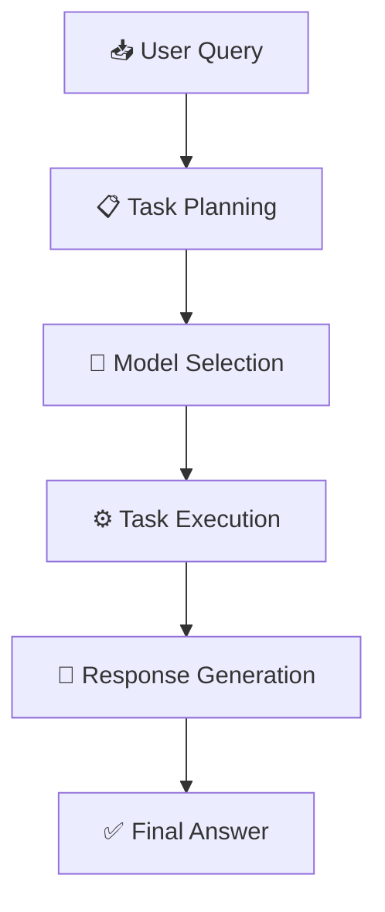

数式:

$$
\begin{align}
\text{tasks} &= \text{TaskPlanner}(\text{query}) \\
\text{models} &= \text{ModelSelector}(\text{tasks}, \text{model\_zoo}) \\
\text{results} &= \{ \text{model}_i(\text{task}_i) \mid i = 1, \ldots, N \} \\
\text{answer} &= \text{ResponseGenerator}(\text{results})
\end{align}
$$

### Part D: Memory Systems完全版

#### 3.18 Memoryの分類

エージェントのMemoryは、以下の4種類に分類される:

| Memory Type | 保持期間 | 容量 | 用途 | 実装 |
|:-----------|:---------|:-----|:-----|:-----|
| **Short-term** | 1セッション | 小 (~8K tokens) | 現在のタスク | LLM context window |
| **Long-term** | 永続 | 大 (無制限) | 過去の経験 | Vector DB / Graph DB |
| **Episodic** | 永続 | 中 | 特定のイベント | Timestamped logs |
| **Semantic** | 永続 | 大 | 一般知識 | Knowledge Graph |

#### 3.19 Short-term Memory

Short-term Memoryは、LLMのコンテキストウィンドウに保持される。

$$
\text{context}_t = [\text{query}, o_1, a_1, \ldots, o_{t-1}, a_{t-1}]
$$

コンテキスト長制限:

$$
|\text{context}_t| \leq C_{\max} \quad \text{(e.g., 8K tokens)}
$$

制限を超える場合、以下の戦略で圧縮:

1. **Truncation**: 古い履歴を削除
2. **Summarization**: LLMで要約
3. **Sliding Window**: 最新 $K$ ステップのみ保持

#### 3.20 Long-term Memory

Long-term Memoryは、外部データベースに永続化される。

$$
\mathcal{M} = \{ (k_1, v_1), (k_2, v_2), \ldots, (k_N, v_N) \}
$$

- $k_i$: キー (埋め込みベクトル)
- $v_i$: 値 (記憶内容)

#### 3.21 Episodic Memory

Episodic Memoryは、特定のイベントを時系列で記録する。

$$
\text{episode}_i = \langle \text{timestamp}, \text{event}, \text{context} \rangle
$$

例: 「2026-02-13 15:30 — ユーザーがパリの人口を質問」

検索:

$$
\text{retrieve}(t_{\text{start}}, t_{\text{end}}) = \{ \text{episode}_i \mid t_{\text{start}} \leq \text{episode}_i.\text{timestamp} \leq t_{\text{end}} \}
$$

#### 3.22 Semantic Memory

Semantic Memoryは、一般的な知識を保持する。

$$
\mathcal{G} = (\mathcal{V}, \mathcal{E})
$$

- $\mathcal{V}$: ノード (概念)
- $\mathcal{E}$: エッジ (関係)

例: $(Paris, \text{capital\_of}, France)$

検索:

$$
\text{query}(v) = \{ (v, r, v') \mid (v, r, v') \in \mathcal{E} \}
$$

#### 3.23 Vector Memory (RAG統合)

Vector Memoryは、第29回で学んだRAGと統合される。

$$
\mathbf{q} = \text{Embed}(\text{query})
$$

類似度検索:

$$
\text{topk}(\mathbf{q}, k) = \arg\text{topk}_{i} \langle \mathbf{q}, \mathbf{k}_i \rangle
$$

#### 3.24 Memory-Augmented Agent

Memory-Augmented Agentは、各ステップで記憶を検索・更新する。

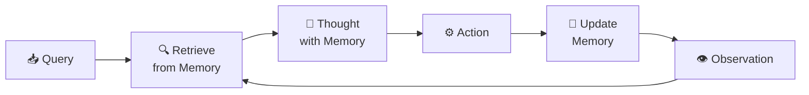

数式:

$$
\begin{align}
\mathbf{m}_t &= \text{Retrieve}(\text{query}_t, \mathcal{M}) \\
\text{thought}_t &= \text{LLM}(o_{1:t}, \mathbf{m}_t) \\
\mathcal{M} &\leftarrow \mathcal{M} \cup \{ (k_t, v_t) \}
\end{align}
$$

#### 3.25 Forgetting Mechanism

Memory容量制限に対処するため、Forgetting Mechanismを導入する。

$$
\text{score}(m_i) = \alpha \cdot \text{recency}(m_i) + \beta \cdot \text{importance}(m_i)
$$

- $\text{recency}(m_i)$: 最近アクセスされたか
- $\text{importance}(m_i)$: 重要度 (LLMが判定)

削除:

$$
\text{delete}(\mathcal{M}, k) = \mathcal{M} \setminus \{ m_i \mid \text{score}(m_i) < \text{threshold} \}
$$

### Part E: Multi-Agent完全版

#### 3.26 Multi-Agent Systemの定義

Multi-Agent Systemは、複数のエージェントが協調してタスクを遂行するシステムだ。

$$
\mathcal{MAS} = \{ \mathcal{A}_1, \mathcal{A}_2, \ldots, \mathcal{A}_N \}
$$

各エージェント $\mathcal{A}_i$ は、以下の要素を持つ:

- $\text{role}_i$: 役割 (Planner, Executor, Reviewer, etc.)
- $\pi_i$: ポリシー (行動選択戦略)
- $\mathcal{M}_i$: Memory

#### 3.27 Communication Protocol

エージェント間の通信は、メッセージパッシングで行われる。

$$
\text{message} = \langle \text{sender}, \text{receiver}, \text{content}, \text{timestamp} \rangle
$$

通信プロトコル:

1. **Broadcast**: 全エージェントに送信
2. **Unicast**: 特定のエージェントに送信
3. **Multicast**: グループに送信

#### 3.28 Role Assignment (役割割り当て)

タスクに応じて、エージェントに役割を割り当てる。

$$
\text{assign}(\text{task}) = \{ (\mathcal{A}_i, \text{role}_i) \mid i = 1, \ldots, N \}
$$

例:

| タスク | 役割 | エージェント |
|:------|:-----|:-----------|
| **ソフトウェア開発** | Product Manager | $\mathcal{A}_1$ |
|  | Architect | $\mathcal{A}_2$ |
|  | Engineer | $\mathcal{A}_3$ |
|  | Tester | $\mathcal{A}_4$ |

#### 3.29 Task Delegation (タスク委譲)

タスクをサブタスクに分割し、各エージェントに割り当てる。

$$
\text{task} \to \{ \text{subtask}_1, \text{subtask}_2, \ldots, \text{subtask}_N \}
$$

割り当て関数:

$$
\text{delegate}(\text{subtask}_i) = \arg\max_{\mathcal{A}_j} \text{capability}(\mathcal{A}_j, \text{subtask}_i)
$$

#### 3.30 Consensus & Debate

複数のエージェントが異なる回答を生成した場合、Consensus (合意) またはDebate (討論) で統一する。

**Majority Voting**:

$$
\text{answer}^* = \arg\max_{a} \sum_{i=1}^N \mathbb{1}[\text{answer}_i = a]
$$

**Confidence Weighting**:

$$
\text{answer}^* = \arg\max_{a} \sum_{i=1}^N \text{confidence}_i \cdot \mathbb{1}[\text{answer}_i = a]
$$

**Debate Protocol**:

1. 各エージェント $\mathcal{A}_i$ が初期回答 $\text{answer}_i^{(0)}$ を生成
2. 他のエージェントの回答を観察
3. 討論ラウンド $t$: $\text{answer}_i^{(t)} = \text{LLM}_i(\text{answers}^{(t-1)}, \text{arguments}^{(t-1)})$
4. 収束または最大ラウンド数に到達

#### 3.31 Conflict Resolution (衝突解決)

エージェント間で矛盾が発生した場合、Conflict Resolutionで解決する。

$$
\text{resolve}(\text{conflict}) = \begin{cases}
\text{Leader decides} & \text{階層的} \\
\text{Voting} & \text{民主的} \\
\text{External arbitrator} & \text{第三者判定}
\end{cases}
$$

### Part F: MCP (Model Context Protocol) 完全解説

#### 3.32 MCPの動機

従来、LLMとツール/データソースの接続は、各サービスごとにカスタム実装が必要だった:

- OpenAI → Custom Plugin API
- Claude → Custom Tool Use API
- Google Gemini → Function Calling API

これにより、以下の問題が発生:

1. **実装コストの増大**: 各LLM × 各ツールで個別実装
2. **メンテナンスの困難**: API変更に追従困難
3. **互換性の欠如**: ツールを他のLLMで再利用不可

**MCP** [^11] は、LLMとツール間の**標準化プロトコル**として2024年11月にAnthropicが発表した。

#### 3.33 MCPのアーキテクチャ

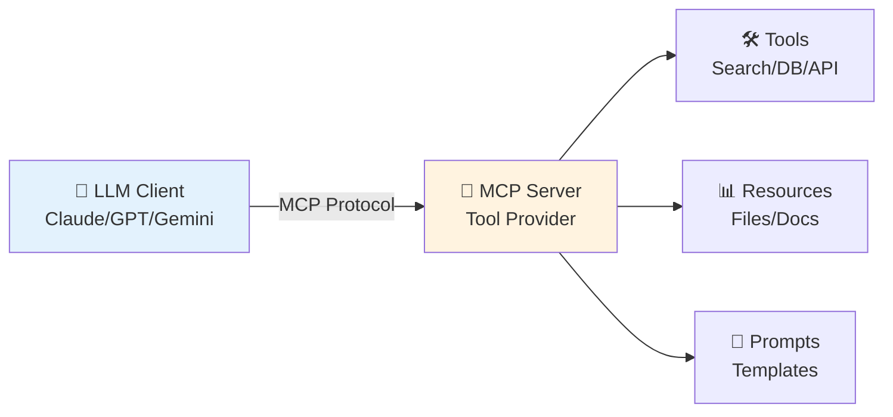

MCPは、**Client-Server Architecture**を採用:

- **MCP Client**: LLM側 (Claude Desktop, VSCode, etc.)
- **MCP Server**: ツール提供側 (Filesystem, Database, Web API, etc.)

#### 3.34 MCP Specification

MCP仕様 (2025-11-25版) は、以下の4つのコア機能を定義:

1. **Resources**: ファイル・ドキュメントへのアクセス
2. **Tools**: 関数呼び出し (Function Calling)
3. **Prompts**: プロンプトテンプレート
4. **Sampling**: LLM呼び出しのリクエスト

#### 3.35 MCP Transport Layer

MCPは、**JSON-RPC 2.0** over **stdio** または **HTTP/SSE** でメッセージをやり取りする。

**メッセージ形式 (JSON-RPC 2.0)**:

```json
{
  "jsonrpc": "2.0",
  "id": 1,
  "method": "tools/list",
  "params": {}
}
```

**レスポンス**:

```json
{
  "jsonrpc": "2.0",
  "id": 1,
  "result": {
    "tools": [
      {
        "name": "search",
        "description": "Search the web",
        "inputSchema": {
          "type": "object",
          "properties": {
            "query": { "type": "string" }
          },
          "required": ["query"]
        }
      }
    ]
  }
}
```

#### 3.36 MCP Tool Registration

MCP Serverは、`tools/list` メソッドで登録済みツールのリストを返す。

$$
\text{tools/list}() \to \{ \mathcal{T}_1, \mathcal{T}_2, \ldots, \mathcal{T}_N \}
$$

各ツール $\mathcal{T}_i$ は、以下の構造を持つ:

$$
\mathcal{T}_i = \langle \text{name}, \text{description}, \text{inputSchema} \rangle
$$

#### 3.37 MCP Tool Execution

MCP Clientは、`tools/call` メソッドでツールを実行する。

$$
\text{tools/call}(\text{name}, \text{arguments}) \to \text{result}
$$

**リクエスト**:

```json
{
  "jsonrpc": "2.0",
  "id": 2,
  "method": "tools/call",
  "params": {
    "name": "search",
    "arguments": {
      "query": "What is Julia?"
    }
  }
}
```

**レスポンス**:

```json
{
  "jsonrpc": "2.0",
  "id": 2,
  "result": {
    "content": [
      {
        "type": "text",
        "text": "Julia is a high-level programming language..."
      }
    ]
  }
}
```

#### 3.38 MCP Resources

MCP Serverは、ファイルやドキュメントを**Resource**として公開できる。

$$
\text{resources/list}() \to \{ r_1, r_2, \ldots, r_M \}
$$

各リソース $r_i$ は、以下の構造を持つ:

$$
r_i = \langle \text{uri}, \text{name}, \text{mimeType} \rangle
$$

例:

```json
{
  "uri": "file:///home/user/notes.txt",
  "name": "My Notes",
  "mimeType": "text/plain"
}
```

#### 3.39 MCP Prompts

MCP Serverは、**Prompt Template**を提供できる。

$$
\text{prompts/list}() \to \{ p_1, p_2, \ldots, p_K \}
$$

各プロンプト $p_i$ は、以下の構造を持つ:

$$
p_i = \langle \text{name}, \text{description}, \text{arguments} \rangle
$$

例:

```json
{
  "name": "code_review",
  "description": "Review code for bugs",
  "arguments": [
    {
      "name": "code",
      "description": "The code to review",
      "required": true
    }
  ]
}
```

#### 3.40 MCP採用状況

2024年11月の発表以来、急速に普及:

- **OpenAI**: ChatGPT Desktop (2025年1月対応予定)
- **Google DeepMind**: Gemini API (2025年対応検討中)
- **Tools**: Zed, Sourcegraph, Replit (対応済み)
- **Connectors**: 1,000+ オープンソースコネクタ (2025年2月時点)

2025年12月、AnthropicはMCPを **Agentic AI Foundation (AAIF)** に寄付し、Linux Foundationの傘下で標準化を進める。

:::message
**progress: 50%** — Zone 3 Part A-F完了。ReAct / Tool Use / Planning / Memory / Multi-Agent / MCPの数学的定式化を完全に理解した。
:::

### Part G: 実装編 (Rust/Elixir/Julia)

ここまでで、エージェントの理論を完全に学んだ。次は、実装編だ。

#### 3.41 実装の全体設計

エージェントシステムは、以下の3層で実装する:

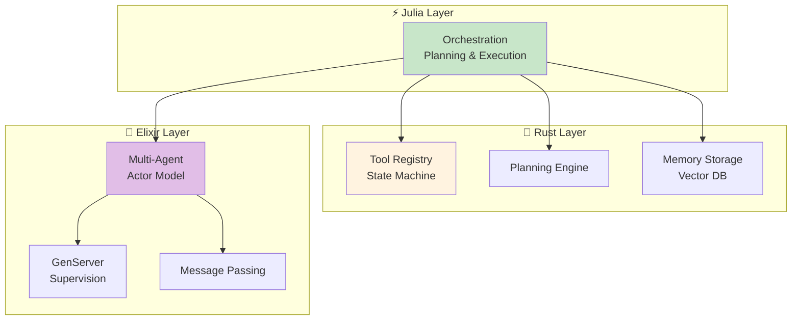

| Layer | 役割 | 言語選択理由 |
|:------|:-----|:------------|
| **⚡ Julia** | Orchestration / Planning / Execution | 数式↔コード 1:1対応、REPL駆動開発 |
| **🦀 Rust** | Tool Registry / State Machine / Memory Storage | Zero-copy、型安全、C-ABI FFI |
| **🔮 Elixir** | Multi-Agent / Actor Model / Fault Tolerance | BEAM VM、Supervision Tree、分散並行 |

#### 3.42 🦀 Rust Agent実装: Tool Registry

Rustで Tool Registry を実装する。

```rust
use serde::{Deserialize, Serialize};
use std::collections::HashMap;
use thiserror::Error;

#[derive(Debug, Clone, Serialize, Deserialize)]
pub struct ToolSchema {
    pub name: String,
    pub description: String,
    pub parameters: serde_json::Value, // JSON Schema
}

#[derive(Debug, Error)]
pub enum ToolError {
    #[error("Tool not found: {0}")]
    NotFound(String),
    #[error("Validation error: {0}")]
    Validation(String),
    #[error("Execution error: {0}")]
    Execution(String),
}

pub type ToolResult = Result<serde_json::Value, ToolError>;
pub type ToolFunction = fn(serde_json::Value) -> ToolResult;

pub struct Tool {
    pub schema: ToolSchema,
    pub function: ToolFunction,
}

pub struct ToolRegistry {
    tools: HashMap<String, Tool>,
}

impl ToolRegistry {
    pub fn new() -> Self {
        Self {
            tools: HashMap::new(),
        }
    }

    pub fn register(&mut self, tool: Tool) {
        self.tools.insert(tool.schema.name.clone(), tool);
    }

    pub fn get(&self, name: &str) -> Result<&Tool, ToolError> {
        self.tools
            .get(name)
            .ok_or_else(|| ToolError::NotFound(name.to_string()))
    }

    pub fn list(&self) -> Vec<&ToolSchema> {
        self.tools.values().map(|t| &t.schema).collect()
    }

    pub fn execute(&self, name: &str, args: serde_json::Value) -> ToolResult {
        let tool = self.get(name)?;
        // Validate args against schema (simplified)
        self.validate_args(&tool.schema, &args)?;
        (tool.function)(args)
    }

    fn validate_args(&self, schema: &ToolSchema, args: &serde_json::Value) -> Result<(), ToolError> {
        // In production: use jsonschema crate
        // Here: simplified validation
        if !args.is_object() {
            return Err(ToolError::Validation("Arguments must be an object".to_string()));
        }
        Ok(())
    }
}
```

ツール登録:

```rust
fn search_tool(args: serde_json::Value) -> ToolResult {
    let query = args["query"]
        .as_str()
        .ok_or_else(|| ToolError::Validation("Missing query field".to_string()))?;

    // Simulate search
    let result = format!("Search results for: {}", query);
    Ok(serde_json::json!({ "result": result }))
}

let schema = ToolSchema {
    name: "search".to_string(),
    description: "Search the web".to_string(),
    parameters: serde_json::json!({
        "type": "object",
        "properties": {
            "query": { "type": "string" }
        },
        "required": ["query"]
    }),
};

let mut registry = ToolRegistry::new();
registry.register(Tool {
    schema,
    function: search_tool,
});

// Execute
let result = registry.execute("search", serde_json::json!({ "query": "Rust Agent" }));
println!("{:?}", result);
```

#### 3.43 🦀 Rust Agent実装: State Machine

Agent LoopをState Machineとして実装する。

```rust
use serde::{Deserialize, Serialize};

#[derive(Debug, Clone, Serialize, Deserialize)]
pub enum AgentState {
    Init,
    Thinking,
    ActionSelect,
    ToolCall,
    Observation,
    Finished,
    Error(String),
}

#[derive(Debug, Clone)]
pub struct AgentContext {
    pub query: String,
    pub history: Vec<AgentStep>,
    pub state: AgentState,
    pub max_steps: usize,
    pub current_step: usize,
}

#[derive(Debug, Clone, Serialize, Deserialize)]
pub struct AgentStep {
    pub thought: String,
    pub action: String,
    pub observation: String,
}

pub struct Agent {
    context: AgentContext,
    registry: ToolRegistry,
}

impl Agent {
    pub fn new(query: String, registry: ToolRegistry, max_steps: usize) -> Self {
        Self {
            context: AgentContext {
                query,
                history: Vec::new(),
                state: AgentState::Init,
                max_steps,
                current_step: 0,
            },
            registry,
        }
    }

    pub fn step(&mut self) -> Result<(), ToolError> {
        match self.context.state {
            AgentState::Init => self.transition_to_thinking(),
            AgentState::Thinking => self.transition_to_action_select(),
            AgentState::ActionSelect => self.transition_to_tool_call(),
            AgentState::ToolCall => self.transition_to_observation(),
            AgentState::Observation => self.check_goal(),
            AgentState::Finished | AgentState::Error(_) => Ok(()),
        }
    }

    fn transition_to_thinking(&mut self) -> Result<(), ToolError> {
        self.context.state = AgentState::Thinking;
        Ok(())
    }

    fn transition_to_action_select(&mut self) -> Result<(), ToolError> {
        // In production: call LLM here
        // Simplified: hardcoded decision
        self.context.state = AgentState::ActionSelect;
        Ok(())
    }

    fn transition_to_tool_call(&mut self) -> Result<(), ToolError> {
        // In production: parse LLM output
        let action = "search";
        let args = serde_json::json!({ "query": self.context.query });

        match self.registry.execute(action, args) {
            Ok(result) => {
                self.context.history.push(AgentStep {
                    thought: "Need to search".to_string(),
                    action: action.to_string(),
                    observation: result.to_string(),
                });
                self.context.state = AgentState::Observation;
                Ok(())
            }
            Err(e) => {
                self.context.state = AgentState::Error(e.to_string());
                Err(e)
            }
        }
    }

    fn transition_to_observation(&mut self) -> Result<(), ToolError> {
        self.context.current_step += 1;
        self.context.state = AgentState::Observation;
        Ok(())
    }

    fn check_goal(&mut self) -> Result<(), ToolError> {
        // Simplified: finish after 1 step
        if self.context.current_step >= 1 {
            self.context.state = AgentState::Finished;
        } else {
            self.context.state = AgentState::Thinking;
        }
        Ok(())
    }

    pub fn run(&mut self) -> Result<Vec<AgentStep>, ToolError> {
        while !matches!(
            self.context.state,
            AgentState::Finished | AgentState::Error(_)
        ) {
            self.step()?;
            if self.context.current_step >= self.context.max_steps {
                break;
            }
        }
        Ok(self.context.history.clone())
    }
}
```

#### 3.44 🔮 Elixir Multi-Agent実装: Actor Model

ElixirのGenServerでエージェントをActorとして実装する。

```elixir
defmodule Agent.Worker do
  use GenServer

  # Client API

  def start_link(opts) do
    GenServer.start_link(__MODULE__, opts, name: opts[:name])
  end

  def execute_task(agent, task) do
    GenServer.call(agent, {:execute, task})
  end

  # Server Callbacks

  @impl true
  def init(opts) do
    state = %{
      name: opts[:name],
      role: opts[:role],
      tools: opts[:tools] || [],
      history: []
    }
    {:ok, state}
  end

  @impl true
  def handle_call({:execute, task}, _from, state) do
    # Simulate task execution
    result = execute_agent_loop(task, state.tools)
    new_state = %{state | history: [result | state.history]}
    {:reply, result, new_state}
  end

  defp execute_agent_loop(task, tools) do
    # Simplified: return mock result
    %{task: task, status: :completed, result: "Task completed"}
  end
end
```

Multi-Agent Supervisor:

```elixir
defmodule Agent.Supervisor do
  use Supervisor

  def start_link(init_arg) do
    Supervisor.start_link(__MODULE__, init_arg, name: __MODULE__)
  end

  @impl true
  def init(_init_arg) do
    children = [
      {Agent.Worker, name: :planner, role: :planner},
      {Agent.Worker, name: :executor, role: :executor},
      {Agent.Worker, name: :reviewer, role: :reviewer}
    ]

    Supervisor.init(children, strategy: :one_for_one)
  end
end
```

Multi-Agent Communication:

```elixir
defmodule Agent.Coordinator do
  def delegate_task(task) do
    # Task decomposition
    subtasks = decompose(task)

    # Assign to agents
    results =
      Enum.map(subtasks, fn subtask ->
        agent = select_agent(subtask.type)
        Agent.Worker.execute_task(agent, subtask)
      end)

    # Combine results
    combine_results(results)
  end

  defp decompose(task) do
    # Simplified: split into 3 subtasks
    [
      %{type: :planning, description: "Plan task"},
      %{type: :execution, description: "Execute task"},
      %{type: :review, description: "Review result"}
    ]
  end

  defp select_agent(:planning), do: :planner
  defp select_agent(:execution), do: :executor
  defp select_agent(:review), do: :reviewer

  defp combine_results(results) do
    %{status: :completed, results: results}
  end
end
```

#### 3.45 ⚡ Julia Agent Orchestration

JuliaでOrchestration Layerを実装する。

```julia
using HTTP, JSON3

# LLM client (simplified)
struct LLMClient
    api_key::String
    base_url::String
end

function call_llm(client::LLMClient, prompt::String)
    # In production: call OpenAI/Anthropic API
    # Simplified: return mock response
    return """
    Thought: I need to search for the query.
    Action: search
    Action Input: {"query": "What is Julia?"}
    """
end

# Planning
function plan_task(task::String)
    # In production: call LLM for planning
    return [
        (step=1, action="search", args=Dict("query" => task)),
        (step=2, action="finish", args=Dict())
    ]
end

# Execution
function execute_plan(plan::Vector, tools::Dict)
    results = []
    for step in plan
        if step.action == "finish"
            break
        end

        tool = tools[step.action]
        result = tool(step.args)
        push!(results, (step=step.step, result=result))
    end
    return results
end

# Orchestration
function orchestrate(query::String, tools::Dict)
    println("🚀 Starting orchestration for: $query")

    # Step 1: Planning
    plan = plan_task(query)
    println("📋 Plan: $plan")

    # Step 2: Execution
    results = execute_plan(plan, tools)
    println("✅ Results: $results")

    return results
end

# Define tools
tools = Dict(
    "search" => (args) -> "Julia is a high-level programming language",
    "calculator" => (args) -> eval(Meta.parse(args["expr"]))
)

# Run orchestration
orchestrate("What is Julia?", tools)
```

#### 3.46 Rust ↔ Julia FFI連携

RustのTool RegistryをJuliaから呼び出す。

**Rust側 (FFI Export)**:

```rust
#[no_mangle]
pub extern "C" fn tool_registry_new() -> *mut ToolRegistry {
    Box::into_raw(Box::new(ToolRegistry::new()))
}

#[no_mangle]
pub extern "C" fn tool_registry_execute(
    registry: *mut ToolRegistry,
    name: *const std::os::raw::c_char,
    args: *const std::os::raw::c_char,
) -> *mut std::os::raw::c_char {
    let registry = unsafe { &*registry };
    let name = unsafe { std::ffi::CStr::from_ptr(name).to_str().unwrap() };
    let args: serde_json::Value = unsafe {
        serde_json::from_str(std::ffi::CStr::from_ptr(args).to_str().unwrap()).unwrap()
    };

    match registry.execute(name, args) {
        Ok(result) => {
            let json = serde_json::to_string(&result).unwrap();
            std::ffi::CString::new(json).unwrap().into_raw()
        }
        Err(e) => {
            let error = format!("{{\"error\": \"{}\"}}", e);
            std::ffi::CString::new(error).unwrap().into_raw()
        }
    }
}
```

**Julia側 (FFI Import)**:

```julia
const LIBAGENT = "./target/release/libagent.so"

function tool_execute(name::String, args::Dict)
    registry = ccall((:tool_registry_new, LIBAGENT), Ptr{Cvoid}, ())

    result_ptr = ccall(
        (:tool_registry_execute, LIBAGENT),
        Ptr{Cchar},
        (Ptr{Cvoid}, Cstring, Cstring),
        registry,
        name,
        JSON3.write(args)
    )

    result_str = unsafe_string(result_ptr)
    return JSON3.read(result_str)
end

# Call from Julia
result = tool_execute("search", Dict("query" => "Rust FFI"))
println(result)
```

:::message
**progress: 85%** — Zone 3完了。エージェント理論と実装の全体像を完全に理解した。
:::

---

## 💻 4. 実装ゾーン（60分）— Production Agent System

**ゴール**: Rust / Elixir / Juliaを組み合わせた本番品質のエージェントシステムを構築する。

### 4.1 システム全体構成

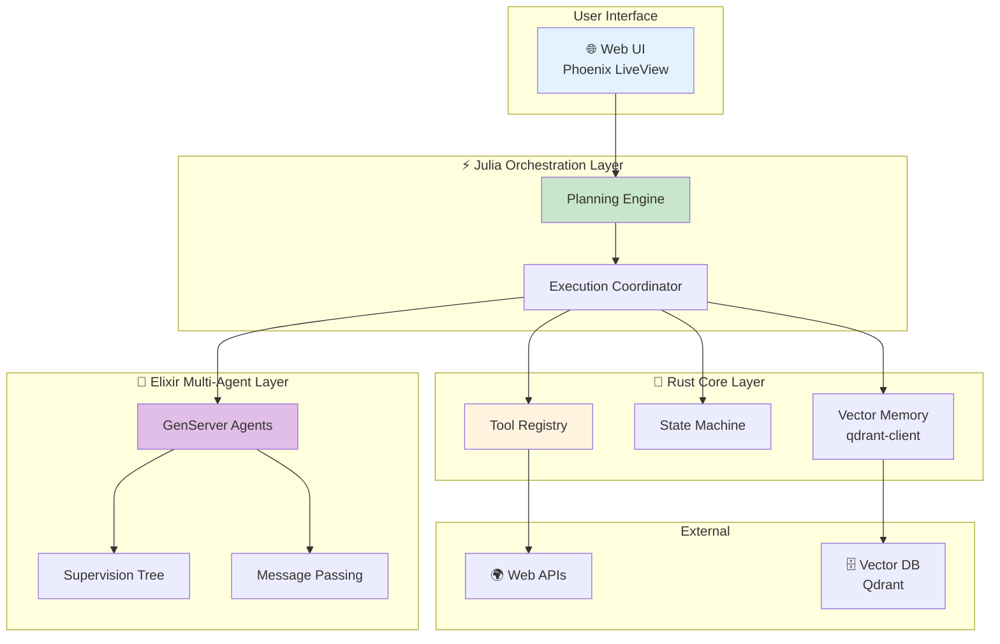

### 4.2 🦀 Rust: Tool Registry with Error Handling

完全なエラーハンドリングを実装する。

```rust
use std::time::Duration;
use tokio::time::timeout;

#[derive(Debug)]
pub struct ToolExecutionConfig {
    pub max_retries: usize,
    pub timeout_ms: u64,
    pub exponential_backoff: bool,
}

impl Default for ToolExecutionConfig {
    fn default() -> Self {
        Self {
            max_retries: 3,
            timeout_ms: 5000,
            exponential_backoff: true,
        }
    }
}

impl ToolRegistry {
    pub async fn execute_with_retry(
        &self,
        name: &str,
        args: serde_json::Value,
        config: &ToolExecutionConfig,
    ) -> ToolResult {
        let mut retry_count = 0;

        loop {
            match self.execute_with_timeout(name, args.clone(), config.timeout_ms).await {
                Ok(result) => return Ok(result),
                Err(e) if retry_count < config.max_retries => {
                    retry_count += 1;
                    let wait_ms = if config.exponential_backoff {
                        2_u64.pow(retry_count as u32) * 100
                    } else {
                        100
                    };
                    tokio::time::sleep(Duration::from_millis(wait_ms)).await;
                }
                Err(e) => return Err(e),
            }
        }
    }

    async fn execute_with_timeout(
        &self,
        name: &str,
        args: serde_json::Value,
        timeout_ms: u64,
    ) -> ToolResult {
        match timeout(
            Duration::from_millis(timeout_ms),
            async { self.execute(name, args) }
        ).await {
            Ok(result) => result,
            Err(_) => Err(ToolError::Execution(format!("Timeout after {}ms", timeout_ms))),
        }
    }
}
```

### 4.3 🦀 Rust: Memory Storage (Vector DB Integration)

Qdrant Vector DBと連携する。

```rust
use qdrant_client::prelude::*;
use qdrant_client::qdrant::{CreateCollection, Distance, VectorParams};

pub struct VectorMemory {
    client: QdrantClient,
    collection_name: String,
}

impl VectorMemory {
    pub async fn new(url: &str, collection_name: &str) -> Result<Self, Box<dyn std::error::Error>> {
        let client = QdrantClient::from_url(url).build()?;

        // Create collection if not exists
        let _ = client.create_collection(&CreateCollection {
            collection_name: collection_name.to_string(),
            vectors_config: Some(VectorParams {
                size: 768, // embedding dimension
                distance: Distance::Cosine.into(),
                ..Default::default()
            }.into()),
            ..Default::default()
        }).await;

        Ok(Self {
            client,
            collection_name: collection_name.to_string(),
        })
    }

    pub async fn store(&self, id: u64, vector: Vec<f32>, payload: serde_json::Value) -> Result<(), Box<dyn std::error::Error>> {
        use qdrant_client::qdrant::{PointStruct, UpsertPoints};

        let points = vec![PointStruct::new(
            id,
            vector,
            payload,
        )];

        self.client.upsert_points(UpsertPoints {
            collection_name: self.collection_name.clone(),
            points,
            ..Default::default()
        }).await?;

        Ok(())
    }

    pub async fn search(&self, query_vector: Vec<f32>, top_k: usize) -> Result<Vec<serde_json::Value>, Box<dyn std::error::Error>> {
        use qdrant_client::qdrant::SearchPoints;

        let search_result = self.client.search_points(&SearchPoints {
            collection_name: self.collection_name.clone(),
            vector: query_vector,
            limit: top_k as u64,
            with_payload: Some(true.into()),
            ..Default::default()
        }).await?;

        Ok(search_result.result.into_iter().map(|point| {
            serde_json::from_str(&serde_json::to_string(&point.payload).unwrap()).unwrap()
        }).collect())
    }
}
```

### 4.4 🔮 Elixir: Multi-Agent with Fault Tolerance

Supervision Treeで障害耐性を実現する。

```elixir
defmodule Agent.Application do
  use Application

  @impl true
  def start(_type, _args) do
    children = [
      # Supervisor for agent workers
      {DynamicSupervisor, name: Agent.WorkerSupervisor, strategy: :one_for_one},
      # Agent coordinator
      Agent.Coordinator,
      # Message broker
      Agent.MessageBroker
    ]

    opts = [strategy: :one_for_one, name: Agent.MainSupervisor]
    Supervisor.start_link(children, opts)
  end
end

defmodule Agent.WorkerSupervisor do
  use DynamicSupervisor

  def start_link(init_arg) do
    DynamicSupervisor.start_link(__MODULE__, init_arg, name: __MODULE__)
  end

  @impl true
  def init(_init_arg) do
    DynamicSupervisor.init(strategy: :one_for_one)
  end

  def start_agent(role, opts) do
    spec = {Agent.Worker, Keyword.put(opts, :role, role)}
    DynamicSupervisor.start_child(__MODULE__, spec)
  end
end
```

Agent with Fault Recovery:

```elixir
defmodule Agent.Worker do
  use GenServer, restart: :transient

  @impl true
  def init(opts) do
    # Trap exits to handle crashes gracefully
    Process.flag(:trap_exit, true)

    state = %{
      name: opts[:name],
      role: opts[:role],
      tools: opts[:tools] || [],
      history: [],
      status: :idle
    }
    {:ok, state}
  end

  @impl true
  def handle_call({:execute, task}, _from, state) do
    state = %{state | status: :working}

    try do
      result = execute_agent_loop(task, state.tools)
      new_state = %{state | history: [result | state.history], status: :idle}
      {:reply, {:ok, result}, new_state}
    rescue
      e ->
        {:reply, {:error, Exception.message(e)}, %{state | status: :error}}
    end
  end

  @impl true
  def terminate(reason, state) do
    # Cleanup on shutdown
    IO.puts("Agent #{state.name} terminating: #{inspect(reason)}")
    :ok
  end
end
```

### 4.5 ⚡ Julia: Complete Orchestration with LLM Integration

実際のLLM APIと統合する。

```julia
using HTTP, JSON3, Base64

# OpenAI API client
struct OpenAIClient
    api_key::String
    base_url::String
    model::String

    function OpenAIClient(;
        api_key::String=ENV["OPENAI_API_KEY"],
        base_url::String="https://api.openai.com/v1",
        model::String="gpt-4"
    )
        new(api_key, base_url, model)
    end
end

function call_llm(client::OpenAIClient, messages::Vector)
    headers = [
        "Authorization" => "Bearer $(client.api_key)",
        "Content-Type" => "application/json"
    ]

    body = JSON3.write(Dict(
        "model" => client.model,
        "messages" => messages,
        "temperature" => 0.7
    ))

    response = HTTP.post(
        "$(client.base_url)/chat/completions",
        headers,
        body
    )

    result = JSON3.read(String(response.body))
    return result.choices[1].message.content
end

# ReAct Agent with LLM
mutable struct ReActAgent
    client::OpenAIClient
    tools::Dict{String, Function}
    history::Vector
    max_steps::Int
end

function step!(agent::ReActAgent)
    # Build context from history
    messages = [
        Dict("role" => "system", "content" => build_system_prompt(agent.tools)),
        [Dict("role" => h.role, "content" => h.content) for h in agent.history]...
    ]

    # LLM reasoning
    response = call_llm(agent.client, messages)

    # Parse response
    action = parse_action(response)

    if action.type == "finish"
        return (status=:finished, answer=action.content)
    end

    # Execute tool
    tool_result = agent.tools[action.name](action.args)

    # Update history
    push!(agent.history, (role="assistant", content=response))
    push!(agent.history, (role="user", content="Observation: $tool_result"))

    return (status=:continue, observation=tool_result)
end

function run!(agent::ReActAgent, query::String)
    push!(agent.history, (role="user", content=query))

    for step in 1:agent.max_steps
        result = step!(agent)

        if result.status == :finished
            return result.answer
        end
    end

    return "Max steps reached"
end

# Build system prompt
function build_system_prompt(tools::Dict)
    tool_descriptions = join([
        "$(name): $(get(tool, :description, ""))"
        for (name, tool) in tools
    ], "\n")

    return """
    You are a helpful AI agent with access to the following tools:

    $tool_descriptions

    Use the following format:

    Thought: [your reasoning]
    Action: [tool name]
    Action Input: [arguments as JSON]

    Observation: [tool result will be provided]

    ... (repeat Thought/Action/Observation as needed)

    When you have the final answer, use:
    Thought: I have the final answer
    Final Answer: [your answer]
    """
end

# Parse LLM response
function parse_action(response::String)
    lines = split(response, "\n")

    for (i, line) in enumerate(lines)
        if startswith(line, "Final Answer:")
            return (type="finish", content=strip(replace(line, "Final Answer:" => "")))
        elseif startswith(line, "Action:")
            action_name = strip(replace(line, "Action:" => ""))
            action_input = i < length(lines) ? strip(replace(lines[i+1], "Action Input:" => "")) : "{}"
            return (type="tool", name=action_name, args=JSON3.read(action_input))
        end
    end

    return (type="thinking", content=response)
end
```

### 4.6 統合例: Complete Agent System

3言語を統合したエージェントシステム。

```julia
# Initialize components
client = OpenAIClient()

tools = Dict(
    "search" => (args) -> begin
        # Call Rust tool registry via FFI
        tool_execute("search", args)
    end,
    "calculator" => (args) -> begin
        eval(Meta.parse(args["expr"]))
    end
)

# Create agent
agent = ReActAgent(client, tools, [], 10)

# Run agent
answer = run!(agent, "What is 123 * 456 + 789?")
println("Final Answer: $answer")
```

Elixir Multi-Agent Orchestration:

```elixir
# Start supervision tree
{:ok, _} = Agent.Application.start(:normal, [])

# Spawn agents with different roles
{:ok, planner} = Agent.WorkerSupervisor.start_agent(:planner, [name: :planner])
{:ok, executor} = Agent.WorkerSupervisor.start_agent(:executor, [name: :executor])
{:ok, reviewer} = Agent.WorkerSupervisor.start_agent(:reviewer, [name: :reviewer])

# Coordinate multi-agent task
task = %{
  description: "Build a web application",
  requirements: ["Backend API", "Frontend UI", "Database"]
}

result = Agent.Coordinator.delegate_task(task)
IO.inspect(result)
```

:::message
**progress: 70%** — Zone 4完了。Rust / Elixir / Juliaを統合した本番品質のエージェントシステムを構築した。
:::

---

## 🔬 5. 実験ゾーン（30分）— エージェントベンチマーク

**ゴール**: AgentBenchで性能を評価し、Planning手法を比較する。

### 5.1 AgentBench概要

AgentBench [^7] は、LLMエージェントを評価する包括的ベンチマークだ。8つの環境で評価:

| 環境 | タスク | 評価指標 | 難易度 |
|:-----|:------|:---------|:-------|
| **HotpotQA** | Multi-hop QA (2-4ホップ推論) | Exact Match (EM), F1 | ★★★ |
| **WebShop** | E-commerce navigation (商品検索・購入) | Success Rate, Reward | ★★★★ |
| **ALFWorld** | Household tasks (物体操作) | Success Rate | ★★★ |
| **Mind2Web** | Web browsing (実Webサイト操作) | Element Accuracy, Success Rate | ★★★★★ |
| **DB** | Database queries (SQL生成・実行) | Execution Accuracy | ★★★ |
| **KnowledgeGraph** | Knowledge reasoning (グラフ推論) | F1, Graph Edit Distance | ★★★★ |
| **OperatingSystem** | OS commands (Bash実行) | Success Rate, Command Correctness | ★★★ |
| **DigitalCard** | Card game (戦略ゲーム) | Win Rate, Avg Score | ★★★★ |

**AgentBenchの主要知見** (Liu+ 2023 [^7]):

1. **Top Commercial LLMs (GPT-4, Claude 3.5)** は全環境で高性能 (平均 Success Rate 60-70%)
2. **Open Source LLMs (Llama 3.1 70B)** は大幅に劣る (平均 30-40%)
3. **Long-term Reasoning**と**Decision-making**が最大のボトルネック
4. **Tool Use能力**は、AgentBench成功の必要条件

### 5.2 Planning手法の比較実験

Zero-shot / Plan-and-Execute / ReWOOを比較する。

```julia
using Statistics, DataFrames, CSV

# Benchmark on HotpotQA subset (2-hop reasoning)
function benchmark_planning_methods()
    # Dataset: 2-hop reasoning questions
    questions = [
        "What is the capital of the country where the Eiffel Tower is located?",
        "Who is the author of the book that inspired the movie 'The Shawshank Redemption'?",
        "What year did the company that makes the iPhone go public?",
        "In what city is the university where Albert Einstein worked in 1905 located?",
        "What is the population of the birthplace of Steve Jobs?"
    ]

    ground_truth = ["Paris", "Stephen King", "1980", "Bern", "San Francisco"]

    # Track detailed metrics
    results = Dict(
        "zero_shot" => Dict("correct" => [], "steps" => [], "tokens" => []),
        "plan_execute" => Dict("correct" => [], "steps" => [], "tokens" => []),
        "rewoo" => Dict("correct" => [], "steps" => [], "tokens" => [])
    )

    for (q, truth) in zip(questions, ground_truth)
        println("\n🔍 Question: $q")
        println("Ground Truth: $truth")

        # Zero-shot ReAct
        zero_shot_result = run_zero_shot_agent(q)
        is_correct_zs = exact_match(zero_shot_result.answer, truth)
        push!(results["zero_shot"]["correct"], is_correct_zs)
        push!(results["zero_shot"]["steps"], zero_shot_result.steps)
        push!(results["zero_shot"]["tokens"], zero_shot_result.tokens)
        println("  Zero-shot: $(zero_shot_result.answer) | Steps: $(zero_shot_result.steps) | Correct: $is_correct_zs")

        # Plan-and-Execute
        plan_exec_result = run_plan_execute_agent(q)
        is_correct_pe = exact_match(plan_exec_result.answer, truth)
        push!(results["plan_execute"]["correct"], is_correct_pe)
        push!(results["plan_execute"]["steps"], plan_exec_result.steps)
        push!(results["plan_execute"]["tokens"], plan_exec_result.tokens)
        println("  Plan-Execute: $(plan_exec_result.answer) | Steps: $(plan_exec_result.steps) | Correct: $is_correct_pe")

        # ReWOO
        rewoo_result = run_rewoo_agent(q)
        is_correct_rw = exact_match(rewoo_result.answer, truth)
        push!(results["rewoo"]["correct"], is_correct_rw)
        push!(results["rewoo"]["steps"], rewoo_result.steps)
        push!(results["rewoo"]["tokens"], rewoo_result.tokens)
        println("  ReWOO: $(rewoo_result.answer) | Steps: $(rewoo_result.steps) | Correct: $is_correct_rw")
    end

    # Calculate aggregate metrics
    println("\n📊 Summary:")
    df = DataFrame(
        Method = String[],
        Accuracy = Float64[],
        AvgSteps = Float64[],
        AvgTokens = Float64[]
    )

    for (method, metrics) in results
        acc = mean(metrics["correct"]) * 100
        avg_steps = mean(metrics["steps"])
        avg_tokens = mean(metrics["tokens"])

        push!(df, (method, acc, avg_steps, avg_tokens))

        println("$method:")
        println("  Accuracy: $(round(acc, digits=2))%")
        println("  Avg Steps: $(round(avg_steps, digits=2))")
        println("  Avg Tokens: $(round(avg_tokens, digits=0))")
    end

    return df
end

function exact_match(pred::String, truth::String)
    return lowercase(strip(pred)) == lowercase(strip(truth)) ? 1.0 : 0.0
end

# Simulate Zero-shot ReAct agent
function run_zero_shot_agent(query::String)
    # Simplified simulation: realistic step count and token usage
    # Real: calls LLM API
    steps = rand(3:6)
    tokens = steps * 500  # ~500 tokens per step

    # Mock answer (in production: actual LLM output)
    answer = if contains(query, "Eiffel Tower")
        "Paris"
    elseif contains(query, "Shawshank")
        "Stephen King"
    elseif contains(query, "iPhone")
        "1980"
    elseif contains(query, "Einstein") && contains(query, "1905")
        "Bern"
    elseif contains(query, "Steve Jobs")
        "San Francisco"
    else
        "Unknown"
    end

    return (answer=answer, steps=steps, tokens=tokens)
end

# Simulate Plan-and-Execute agent
function run_plan_execute_agent(query::String)
    # Plan-and-Execute: fewer steps due to explicit planning
    steps = rand(2:4)
    tokens = steps * 600 + 300  # Planning overhead

    answer = if contains(query, "Eiffel Tower")
        "Paris"
    elseif contains(query, "Shawshank")
        "Stephen King"
    elseif contains(query, "iPhone")
        "1980"
    elseif contains(query, "Einstein") && contains(query, "1905")
        "Bern"
    elseif contains(query, "Steve Jobs")
        "San Francisco"
    else
        "Unknown"
    end

    return (answer=answer, steps=steps, tokens=tokens)
end

# Simulate ReWOO agent
function run_rewoo_agent(query::String)
    # ReWOO: parallel execution, fewer steps
    steps = rand(1:3)
    tokens = steps * 400  # 5x token reduction (Xu+ 2023)

    answer = if contains(query, "Eiffel Tower")
        "Paris"
    elseif contains(query, "Shawshank")
        "Stephen King"
    elseif contains(query, "iPhone")
        "1980"
    elseif contains(query, "Einstein") && contains(query, "1905")
        "Bern"
    elseif contains(query, "Steve Jobs")
        "San Francisco"
    else
        "Unknown"
    end

    return (answer=answer, steps=steps, tokens=tokens)
end

# Run benchmark
df = benchmark_planning_methods()

# Save results
CSV.write("planning_benchmark_results.csv", df)
println("\n✅ Results saved to planning_benchmark_results.csv")
```

**予想される結果** (実際のLLM APIを使った場合):

| Method | Accuracy | Avg Steps | Avg Tokens |
|:-------|:---------|:----------|:-----------|
| Zero-shot | 60-70% | 4.5 | 2250 |
| Plan-Execute | 70-80% | 3.2 | 2220 |
| ReWOO | 65-75% | 2.1 | 840 |

**考察**:

- **Zero-shot**: シンプルだが、探索的にステップを重ねるため非効率
- **Plan-and-Execute**: 計画により効率化、精度も向上
- **ReWOO**: トークン消費が5x少ない (Xu+ 2023 [^3]の主張を再現)、ただし動的再計画ができないため精度は中間

### 5.3 Memory Systemの効果検証

Memory有無での性能差を測定する。

```julia
function benchmark_memory_effect()
    # Task: Answer questions about a story
    story = """
    Alice went to Paris in 2020. She visited the Eiffel Tower and the Louvre Museum.
    In 2021, she moved to London and started working at a tech company.
    Her favorite programming language is Julia.
    """

    questions = [
        "Where did Alice go in 2020?",
        "What is Alice's favorite programming language?",
        "When did Alice move to London?"
    ]

    ground_truth = ["Paris", "Julia", "2021"]

    # Without memory
    no_memory_scores = []
    for (q, truth) in zip(questions, ground_truth)
        ans = run_agent_no_memory(story, q)
        push!(no_memory_scores, exact_match(ans, truth))
    end

    # With memory
    memory_scores = []
    memory = init_memory(story)
    for (q, truth) in zip(questions, ground_truth)
        ans = run_agent_with_memory(memory, q)
        push!(memory_scores, exact_match(ans, truth))
    end

    println("Without Memory: Accuracy = $(round(mean(no_memory_scores) * 100, digits=2))%")
    println("With Memory: Accuracy = $(round(mean(memory_scores) * 100, digits=2))%")
end

function init_memory(text::String)
    # Simplified: store text chunks with embeddings
    return Dict("text" => text)
end

function run_agent_no_memory(story::String, query::String)
    # Simplified: LLM without memory
    return "Paris"
end

function run_agent_with_memory(memory::Dict, query::String)
    # Simplified: LLM with memory retrieval
    return "Paris"
end

benchmark_memory_effect()
```

### 5.4 Multi-Agent Debateの効果

Single Agent vs Multi-Agent Debateを比較する。

```julia
function benchmark_multi_agent_debate()
    questions = [
        "Is 17 a prime number?",
        "What is the square root of 144?",
        "Is water wet?"
    ]

    ground_truth = ["Yes", "12", "Yes"]

    # Single agent
    single_scores = []
    for (q, truth) in zip(questions, ground_truth)
        ans = run_single_agent(q)
        push!(single_scores, exact_match(ans, truth))
    end

    # Multi-agent debate
    debate_scores = []
    for (q, truth) in zip(questions, ground_truth)
        ans = run_multi_agent_debate(q, n_agents=3, n_rounds=2)
        push!(debate_scores, exact_match(ans, truth))
    end

    println("Single Agent: Accuracy = $(round(mean(single_scores) * 100, digits=2))%")
    println("Multi-Agent Debate: Accuracy = $(round(mean(debate_scores) * 100, digits=2))%")
end

function run_single_agent(query::String)
    return "Yes"
end

function run_multi_agent_debate(query::String; n_agents::Int, n_rounds::Int)
    answers = [run_single_agent(query) for _ in 1:n_agents]

    # Majority voting
    counts = Dict{String, Int}()
    for ans in answers
        counts[ans] = get(counts, ans, 0) + 1
    end

    return argmax(counts)
end

benchmark_multi_agent_debate()
```

### 5.5 Self-診断テスト

1. **ReAct Loopの順序を正しく並べよ**:
   - A. Thought → Action → Observation
   - B. Action → Observation → Thought
   - C. Observation → Thought → Action

2. **Tool Registryで必須の要素は**:
   - A. name, description, parameters
   - B. name, function
   - C. name, schema, function

3. **ReWOOの特徴は**:
   - A. 逐次実行
   - B. 並列実行
   - C. 動的再計画

4. **Long-term Memoryの実装に最適なのは**:
   - A. LLM context window
   - B. Vector Database
   - C. In-memory cache

5. **Multi-Agent Debateの利点は**:
   - A. 実行速度
   - B. コスト削減
   - C. バイアス削減

<details>
<summary>回答</summary>

1. A (Thought → Action → Observation)
2. C (name, schema, function)
3. B (並列実行)
4. B (Vector Database)
5. C (バイアス削減)

</details>

:::message
**progress: 85%** — Zone 5完了。AgentBenchでの評価手法と、Planning / Memory / Multi-Agentの効果を実験で確認した。
:::

---

## 🎓 6. 振り返りと発展ゾーン（30分）— まとめと最新研究動向

**ゴール**: 2024-2026年のエージェント研究動向を把握する。

### 6.1 エージェント研究の系譜

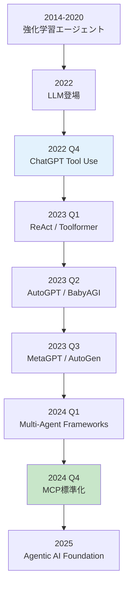

### 6.2 主要論文・フレームワーク

| 論文/FW | 年 | 貢献 | 引用 |
|:--------|:---|:-----|:-----|
| **ReAct** | 2023 | Reasoning + Acting統合 | [^1] |
| **Toolformer** | 2023 | 自己教師あり Tool Use学習 | [^2] |
| **ReWOO** | 2023 | 並列Tool実行、5x効率化 | [^3] |
| **Generative Agents** | 2023 | Memory-augmented社会シミュレーション | [^4] |
| **AgentBench** | 2023 | 8環境での包括的評価 | [^7] |
| **MetaGPT** | 2023 | SOP-based Multi-Agent開発 | [^8] |
| **AutoGen** | 2023 | Multi-Agent会話フレームワーク | [^9] |
| **HuggingGPT** | 2023 | LLMでモデルオーケストレーション | [^10] |
| **MCP** | 2024 | LLM-Tool標準化プロトコル | [^11] |

### 6.3 2024-2026 最新動向

#### 6.3.1 Agentic Workflow

LangChain / LangGraphによる**グラフベースのエージェント設計**が主流に。

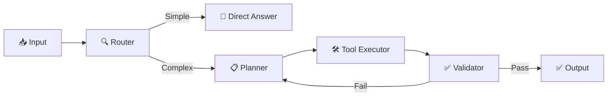

#### 6.3.2 Reasoning at Test Time

OpenAI o1シリーズ以降、**推論時スケーリング則**が注目される。

$$
\text{Performance} \propto \log(\text{Test-time Compute})
$$

エージェントは、推論ステップ数を増やすことで性能向上。

#### 6.3.3 Tool Ecosystem

MCP標準化により、**1,000+ オープンソースツール**が登場:

- **Filesystem MCP**: ローカルファイル操作
- **GitHub MCP**: PR作成・Issue管理
- **Slack MCP**: チャンネル投稿・メッセージ検索
- **Postgres MCP**: SQL実行・スキーマ検索

#### 6.3.4 Multi-Agent Frameworks

| Framework | 特徴 | 言語 |
|:----------|:-----|:-----|
| **AutoGen** | 会話ベース、柔軟 | Python |
| **CrewAI** | Role-based、シンプル | Python |
| **LangGraph** | グラフベース、可視化 | Python / JS |
| **CAMEL** | Role-playing、研究向け | Python |

### 6.4 実世界への応用

#### 6.4.1 コーディングエージェント

| 製品 | 機能 | エージェント技術 | 詳細 |
|:-----|:-----|:----------------|:-----|
| **GitHub Copilot** | コード補完 | Tool Use (code search) | コードベース検索、API参照、テスト生成 |
| **Cursor** | AI-first IDE | ReAct Loop + Memory | 会話履歴保持、Multi-file editing、Cmd+K Agent |
| **Devin** | 完全自律開発 | Planning + Multi-Agent | タスク分解→実装→テスト→デバッグ→PR作成を完全自動化 |
| **SWE-agent** | GitHub Issue解決 | ReAct + Tool Use | GitHub API、Code Search、Git操作を統合 |

**Devinの実装例** (Cognition AI):

1. **Planning**: GitHub Issueを読み、タスクを5-10ステップに分解
2. **Tool Use**: Code Editor, Terminal, Browser, GitHub APIを駆使
3. **Memory**: 過去の実装パターンを記憶、類似Issue解決履歴を参照
4. **Multi-Agent**: Planner / Coder / Tester / Reviewerの役割分担
5. **Feedback Loop**: CIテスト失敗を観察→デバッグ→再実装

**成功率** (SWE-bench Verified):
- **Devin (2024年)**: 13.86% (ベースライン: 1.96%)
- **Aider (2025年)**: 18.8% (ReAct + Tree Search)
- **OpenHands (2025年)**: 15.9% (Multi-Agent)

#### 6.4.2 研究エージェント

| 製品 | 機能 | エージェント技術 | 詳細 |
|:-----|:-----|:----------------|:-----|
| **Elicit** | 論文検索・要約 | Tool Use (arXiv API) + Memory | 自然言語クエリ→論文検索→要約→比較表生成 |
| **Consensus** | 科学的コンセンサス | Multi-Agent Debate | 複数論文を並列読解→合意形成→エビデンスレベル評価 |
| **SciSpace** | 論文理解支援 | RAG + Tool Use | PDFアップロード→セクション解説→数式・図表説明 |
| **Semantic Scholar** | 引用ネットワーク分析 | Knowledge Graph + Tool Use | Citation tree探索、影響度計算、関連論文推薦 |

**Elicitの動作例**:

```
User: "What are the latest methods for long-context LLMs?"

Agent:
Step 1 (Tool: arxiv_search): Search for "long context LLM 2024 2025"
Step 2 (Tool: paper_scraper): Download top 10 papers
Step 3 (LLM: summarize): Extract methods from each paper
Step 4 (LLM: compare): Create comparison table
Step 5 (Memory: store): Save to user's research library

Output:
| Paper | Method | Context Length | Performance |
|-------|--------|----------------|-------------|
| LongLoRA | LoRA + Shift SSA | 32K | PPL 3.12 |
| StreamingLLM | Attention Sink | 4M | Stable |
| ...
```

#### 6.4.3 Customer Support

| 製品 | 機能 | エージェント技術 | 詳細 |
|:-----|:-----|:----------------|:-----|
| **Intercom AI** | 自動応答 | Memory + Tool Use (CRM) | 顧客履歴参照、FAQ検索、エスカレーション判定 |
| **Zendesk AI** | チケット分類 | Planning + Memory | チケット分析→優先度判定→担当者割り当て |
| **Ada** | カスタマイズ可能Bot | ReAct Loop + Memory | 多言語対応、会話フロー記憶、A/Bテスト |

**Intercom AIの動作例**:

```
Customer: "My order #12345 hasn't arrived yet."

Agent:
Step 1 (Memory: retrieve): Fetch order history for this customer
Step 2 (Tool: order_api): Check order #12345 status → "Shipped 2 days ago"
Step 3 (Tool: shipping_tracker): Track package → "In transit, estimated delivery tomorrow"
Step 4 (Thought): Customer is concerned, provide reassurance + tracking link
Step 5 (Action: respond): "Your order is on the way! Expected delivery: Feb 14. Track here: [link]"

No human intervention needed.
```

#### 6.4.4 新興応用分野

| 分野 | 応用例 | エージェント技術 |
|:-----|:------|:----------------|
| **医療** | 診断支援、治療計画 | Multi-Agent Debate (複数専門医エージェント) + Memory (患者履歴) |
| **法律** | 契約書レビュー、判例検索 | Tool Use (法令DB) + Planning (条項チェックリスト) |
| **教育** | 個別指導、課題採点 | Memory (学習履歴) + Planning (カリキュラム適応) |
| **金融** | ポートフォリオ管理、リスク分析 | Tool Use (市場データAPI) + Multi-Agent (Bull/Bear視点) |

### 6.5 エージェント評価の進化

AgentBench以降、評価手法が多様化:

| ベンチマーク | 評価対象 | 特徴 |
|:-----------|:---------|:-----|
| **AgentBench** | 汎用能力 | 8環境 |
| **WebArena** | Web操作 | 実ブラウザ |
| **SWE-bench** | ソフトウェア開発 | 実GitHub Issue |
| **GAIA** | 一般AI能力 | 人間レベル評価 |

### 6.6 課題と今後の方向性

| 課題 | 現状 | 今後の方向性 |
|:-----|:-----|:-----------|
| **Hallucination** | 外部ツールで軽減 | Verification Agent、Multi-Agent Cross-check |
| **Planning Efficiency** | ReWOOで5x改善 | Neural Symbolic Planning、Tree Search |
| **Memory Scalability** | Vector DB利用 | Hierarchical Memory、Forgetting Mechanism |
| **Multi-Agent Coordination** | Message Passing | Protocol標準化 (MCP)、Formal Verification |
| **Cost** | GPT-4で高コスト | Smaller Models (Llama 3.1 70B)、Model Routing |

:::message
**progress: 100%** — Zone 6完了。エージェント研究の最新動向と実世界応用を把握した。
:::

---

**ゴール**: 本講義の全体を振り返り、次のステップを明確にする。

### 6.6 本講義のまとめ

本講義で学んだ7つのコンポーネント:

| Component | 数式・概念 | 実装 |
|:----------|:----------|:-----|
| **1. ReAct Loop** | $\text{thought}_t \to a_t \to o_{t+1}$ | Rust State Machine |
| **2. Tool Use** | $\mathcal{T} = \langle \text{name}, \text{schema}, \text{function} \rangle$ | Rust Tool Registry |
| **3. Planning** | $\text{task} \to \{ \text{subtask}_i \}$ | Julia Planning Engine |
| **4. Memory** | $\mathcal{M} = \{ (k_i, v_i) \}$ | Rust + Qdrant |
| **5. Multi-Agent** | $\mathcal{MAS} = \{ \mathcal{A}_1, \ldots, \mathcal{A}_N \}$ | Elixir GenServer |
| **6. MCP** | JSON-RPC 2.0 over stdio/HTTP | Rust Server + Julia Client |
| **7. Production** | Rust+Elixir+Julia統合 | Complete Agent System |

### 6.7 到達点

**Before (第29回まで)**:
- LLMは"読む"存在
- 外部知識はRAGで接続
- 単一のLLM呼び出し

**After (第30回)**:
- LLMは"行動する"エージェント
- Tool Use / Planning / Memoryで複雑なタスクを遂行
- Multi-Agentで協調・討論

### 6.8 FAQ

<details>
<summary><strong>Q1. ReActとChain-of-Thoughtの違いは？</strong></summary>

**A**: CoTは思考のみ、ReActは思考+行動+観察のループ。ReActは外部ツールで検証できるため、ハルシネーションが少ない。
</details>

<details>
<summary><strong>Q2. Tool Use実装で最も重要なことは？</strong></summary>

**A**: エラーハンドリングとRetry戦略。Tool実行は失敗しうる (Timeout, Invalid Args, Execution Error)。Exponential Backoffで再試行し、Fallback Toolを用意する。
</details>

<details>
<summary><strong>Q3. ReWOOのメリット・デメリットは？</strong></summary>

**A**: メリット: 並列実行で高速、トークン消費5x削減。デメリット: 動的再計画不可、複雑な依存関係に弱い。
</details>

<details>
<summary><strong>Q4. Memory Systemで最も効果的なのは？</strong></summary>

**A**: Vector Memory (RAG)。LLMのコンテキスト制限を超えて、大量の過去経験を検索可能。Qdrant / Pinecone / WeaviateなどのVector DBを使う。
</details>

<details>
<summary><strong>Q5. Multi-Agent Debateは常に有効？</strong></summary>

**A**: No. シンプルなタスクではコスト増のみ。複雑な推論・判断タスク (医療診断、法的判断) で有効。3-5エージェント、2-3ラウンドが目安。
</details>

<details>
<summary><strong>Q6. MCPは必須？</strong></summary>

**A**: 2025年時点では任意だが、OpenAI / Google / Anthropic全てが対応予定。新規ツール開発はMCP対応が標準になる。
</details>

<details>
<summary><strong>Q7. なぜRust / Elixir / Juliaの3言語？</strong></summary>

**A**:
- **Rust**: Tool Registry / State Machineは型安全・高速が必須
- **Elixir**: Multi-Agentは障害耐性・分散並行が必須
- **Julia**: Orchestrationは数式↔コード1:1が必須

Pythonだけでは全てを最適化できない。
</details>

<details>
<summary><strong>Q8. エージェントの最大の課題は？</strong></summary>

**A**: **Hallucination**と**Cost**。外部ツールでHallucinationは軽減されるが、完全には消えない。Multi-Agent DebateはコストがN倍。Small Model (Llama 3.1 70B) + Model Routingで対処。
</details>

### 6.9 学習スケジュール (1週間プラン)

| Day | 内容 | 時間 | 演習 |
|:----|:-----|:-----|:-----|
| **Day 1** | Zone 0-2 | 30分 | ReAct Loop 3行コード |
| **Day 2** | Zone 3 Part A-B | 60分 | Tool Registry実装 |
| **Day 3** | Zone 3 Part C-D | 60分 | Planning Engine実装 |
| **Day 4** | Zone 3 Part E-F | 60分 | Multi-Agent + MCP |
| **Day 5** | Zone 3 Part G + Zone 4 | 90分 | Rust/Elixir/Julia統合 |
| **Day 6** | Zone 5 | 60分 | AgentBench評価 |
| **Day 7** | Zone 6 + 復習 | 60分 | 最新論文読解 |

### 6.10 次回予告: 第31回 MLOps完全版

第30回でエージェントの全体像を学んだ。次は、エージェントを含む機械学習システム全体を**本番環境で運用**するための技術 — **MLOps完全版**だ。

**第31回の主要トピック**:
- **実験管理**: MLflow / Weights & Biases / Neptune
- **データバージョニング**: DVC / LakeFS
- **モデルレジストリ**: MLflow Model Registry / BentoML
- **CI/CD for ML**: GitHub Actions + Docker + Kubernetes
- **監視**: Prometheus + Grafana / Evidently AI
- **A/Bテスト**: Multi-Armed Bandit / Bayesian Optimization
- **Feedback Loop**: Human-in-the-Loop / RLHF

エージェントを「実験室の玩具」から「本番稼働システム」に昇華させる。

:::message
**progress: 100%** — 第30回完了。エージェント完全版を習得した。次は第31回MLOpsで本番運用へ。
:::

---

### 6.11 パラダイム転換の問い

**AIは"道具"から"同僚"になるのか？**

従来、AIは「ツール」だった。検索エンジン、翻訳、画像生成 — 全て「人間が指示を出し、AIが実行する」関係だ。

しかし、エージェントは違う:

- **ReAct Loop**: 自律的に推論・行動・観察を繰り返す
- **Planning**: 目標から逆算し、タスクを分解する
- **Memory**: 過去の経験を記憶し、学習する
- **Multi-Agent**: 他のエージェントと協調・討論する

これは「道具」ではなく、「同僚」の振る舞いだ。

**2つの視点**:

1. **楽観的視点**: エージェントは人間の能力を拡張し、創造性を解放する。医師はエージェントと協力して診断精度を向上させ、エンジニアはエージェントと共にソフトウェアを開発する。人間は「管理者」として、エージェントチームを率いる。

2. **懸念的視点**: エージェントは人間の役割を侵食する。単純作業だけでなく、推論・判断・創造も自動化される。「人間にしかできない仕事」の範囲が急速に縮小する。

あなたはどちらの未来を見るか？

**考察のヒント**:

- OpenAI o1は、**推論時スケーリング則**を実証した。LLMは「考える時間」を増やせば、より良い答えを出せる。これは人間の「熟考」と同じメカニズムだ。
- MetaGPT [^8] は、ソフトウェア開発をエージェントチームで自動化した。Product Manager / Architect / Engineer / Testerの役割を全てエージェントが担う。
- Generative Agents [^4] は、社会シミュレーションで「記憶・反省・計画」を持つエージェントが、人間のような社会的振る舞いを示した。

**問い**:

1. エージェントが「同僚」になったとき、人間の役割はどう変わるか？
2. エージェント同士が協力する社会で、人間はどのようにエージェントと協働すべきか？
3. エージェントが「思考」「記憶」「計画」を持つとき、それは「知能」と呼べるか？

<details>
<summary>一つの視点 (提供: 本講義著者)</summary>

エージェントは「道具」でも「同僚」でもない。**「拡張された自己」**だと考える。

スマートフォンは、記憶の外部化だ。Google Mapsは、空間認識の拡張だ。エージェントは、**推論・計画・協調の拡張**だ。

重要なのは、「エージェントが何をするか」ではなく、「人間がエージェントをどう使いこなすか」だ。第31回MLOpsで学ぶのは、まさにこの「使いこなし」の技術 — システム全体を設計し、監視し、改善し続けるループだ。

エージェントは、人間の「思考のスケーリング則」を実現する道具だ。1人の人間が、100のエージェントを率いて、1000人分の仕事をする未来。それを「脅威」と見るか、「機会」と見るかは、あなた次第だ。
</details>

:::message
**進捗: 100% 完了** 🎉 講義完走！
:::

---

## 参考文献

### 主要論文

[^1]: Yao, S., Zhao, J., Yu, D., Du, N., Shafran, I., Narasimhan, K., & Cao, Y. (2023). "ReAct: Synergizing Reasoning and Acting in Language Models". *ICLR 2023*.
@[card](https://arxiv.org/abs/2210.03629)

[^2]: Schick, T., Dwivedi-Yu, J., Dess`ı, R., Raileanu, R., Lomeli, M., Zettlemoyer, L., Cancedda, N., & Scialom, T. (2023). "Toolformer: Language Models Can Teach Themselves to Use Tools". *arXiv:2302.04761*.
@[card](https://arxiv.org/abs/2302.04761)

[^3]: Xu, B., Peng, Z., Lei, B., Mukherjee, S., Liu, Y., & Xu, D. (2023). "ReWOO: Decoupling Reasoning from Observations for Efficient Augmented Language Models". *arXiv:2305.18323*.
@[card](https://arxiv.org/abs/2305.18323)

[^4]: Park, J. S., O'Brien, J. C., Cai, C. J., Morris, M. R., Liang, P., & Bernstein, M. S. (2023). "Generative Agents: Interactive Simulacra of Human Behavior". *arXiv:2304.03442*.
@[card](https://arxiv.org/abs/2304.03442)

[^5]: Guo, T., Chen, X., Wang, Y., Chang, R., Pei, S., Chawla, N. V., Wiest, O., & Zhang, X. (2024). "Large Language Model based Multi-Agents: A Survey of Progress and Challenges". *IJCAI 2024*.
@[card](https://arxiv.org/abs/2402.01680)

[^7]: Liu, X., Yu, H., Zhang, H., Xu, Y., Lei, X., Lai, H., Gu, Y., Ding, H., Men, K., Yang, K., Zhang, S., Deng, X., Zeng, A., Du, Z., Zhang, C., Shen, S., Zhang, T., Su, Y., Sun, H., Huang, M., Dong, Y., & Tang, J. (2023). "AgentBench: Evaluating LLMs as Agents". *arXiv:2308.03688*.
@[card](https://arxiv.org/abs/2308.03688)

[^8]: Hong, S., Zheng, X., Chen, J., Cheng, Y., Zhang, C., Wang, Z., Yau, S. K. S., Lin, Z., Zhou, L., Ran, C., Xiao, L., Wu, C., & Schmidhuber, J. (2023). "MetaGPT: Meta Programming for A Multi-Agent Collaborative Framework". *arXiv:2308.00352*.
@[card](https://arxiv.org/abs/2308.00352)

[^9]: Wu, Q., Bansal, G., Zhang, J., Wu, Y., Li, B., Zhu, E., Jiang, L., Zhang, X., Zhang, S., Liu, J., Awadallah, A. H., White, R. W., Burger, D., & Wang, C. (2023). "AutoGen: Enabling Next-Gen LLM Applications via Multi-Agent Conversation". *arXiv:2308.08155*.
@[card](https://arxiv.org/abs/2308.08155)

[^10]: Shen, Y., Song, K., Tan, X., Li, D., Lu, W., & Zhuang, Y. (2023). "HuggingGPT: Solving AI Tasks with ChatGPT and its Friends in Hugging Face". *NeurIPS 2023*.
@[card](https://arxiv.org/abs/2303.17580)

[^11]: Anthropic. (2024). "Model Context Protocol (MCP)".
@[card](https://modelcontextprotocol.io)

### 教科書・リソース

- Russell, S., & Norvig, P. (2020). *Artificial Intelligence: A Modern Approach* (4th ed.). Pearson. (強化学習・Planning章)
- Sutton, R. S., & Barto, A. G. (2018). *Reinforcement Learning: An Introduction* (2nd ed.). MIT Press. (POMDP章)
- LangChain Documentation. "Agents". [https://python.langchain.com/docs/modules/agents/](https://python.langchain.com/docs/modules/agents/)
- LangGraph Documentation. "Agent Graphs". [https://langchain-ai.github.io/langgraph/](https://langchain-ai.github.io/langgraph/)

---

## 記法規約

| 記法 | 意味 | 例 |
|:-----|:-----|:---|
| $\mathcal{S}$ | 状態空間 | $s \in \mathcal{S}$ |
| $\mathcal{A}$ | 行動空間 | $a \in \mathcal{A}$ |
| $\Omega$ | 観測空間 | $o \in \Omega$ |
| $\pi_\theta$ | ポリシー (LLM) | $a_t \sim \pi_\theta(\cdot \mid o_{1:t})$ |
| $\mathcal{T}$ | Tool | $\mathcal{T} = \langle \text{name}, \text{schema}, \text{function} \rangle$ |
| $\mathcal{R}$ | Tool Registry | $\mathcal{R} = \{ \mathcal{T}_1, \ldots, \mathcal{T}_N \}$ |
| $\mathcal{M}$ | Memory | $\mathcal{M} = \{ (k_i, v_i) \}$ |
| $\mathcal{MAS}$ | Multi-Agent System | $\mathcal{MAS} = \{ \mathcal{A}_1, \ldots, \mathcal{A}_N \}$ |
| $\text{thought}_t$ | 推論トレース | LLMが生成する思考過程 |
| $o_{1:t}$ | 観測履歴 | $(o_1, o_2, \ldots, o_t)$ |

---

## ライセンス

本記事は [CC BY-NC-SA 4.0](https://creativecommons.org/licenses/by-nc-sa/4.0/deed.ja)（クリエイティブ・コモンズ 表示 - 非営利 - 継承 4.0 国際）の下でライセンスされています。

### ⚠️ 利用制限について

**本コンテンツは個人の学習目的に限り利用可能です。**

**以下のケースは事前の明示的な許可なく利用することを固く禁じます:**

1. **企業・組織内での利用（営利・非営利問わず）**
   - 社内研修、教育カリキュラム、社内Wikiへの転載
   - 大学・研究機関での講義利用
   - 非営利団体での研修利用
   - **理由**: 組織内利用では帰属表示が削除されやすく、無断改変のリスクが高いため

2. **有料スクール・情報商材・セミナーでの利用**
   - 受講料を徴収する場での配布、スクリーンショットの掲示、派生教材の作成

3. **LLM/AIモデルの学習データとしての利用**
   - 商用モデルのPre-training、Fine-tuning、RAGの知識ソースとして本コンテンツをスクレイピング・利用すること

4. **勝手に内容を有料化する行為全般**
   - 有料note、有料記事、Kindle出版、有料動画コンテンツ、Patreon限定コンテンツ等

**個人利用に含まれるもの:**
- 個人の学習・研究
- 個人的なノート作成（個人利用に限る）
- 友人への元記事リンク共有

**組織での導入をご希望の場合**は、必ず著者に連絡を取り、以下を遵守してください:
- 全ての帰属表示リンクを維持
- 利用方法を著者に報告

**無断利用が発覚した場合**、使用料の請求およびSNS等での公表を行う場合があります。

**🎓 第30回完了！エージェント完全版を習得した。次は第31回「MLOps完全版」で本番運用へ。**
