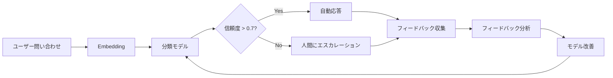
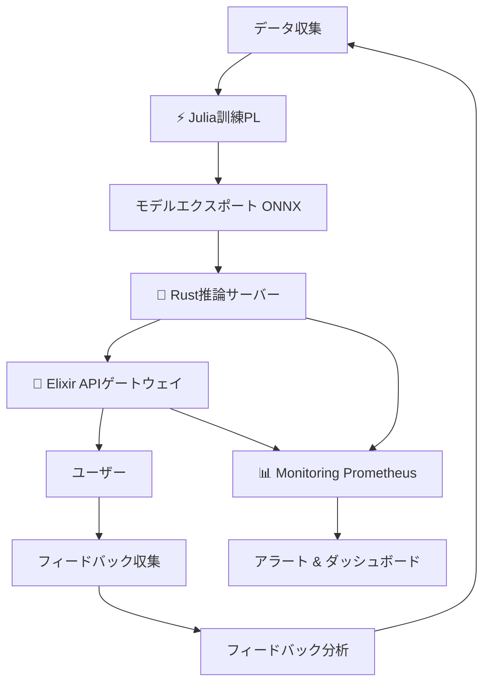
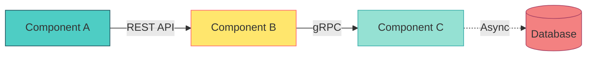

---

# 第32回: Production & フィードバックループ + 統合PJ 🏆

:::message
**前提知識**: 第31回でMLOps基盤を整えた。この第32回はCourse III最終回 — 14回の全技術を統合してE2Eシステムを構築する。
:::

## 🚀 0. クイックスタート（30秒）— 3行でE2Eシステムを体感

第31回でMLOpsパイプラインを構築した。最終回の今回、**全てを統合したProduction E2Eシステム**を3行のコードで体感しよう。

```julia
# SmolVLM2-256M推論 → Elixir API → フィードバック収集 → Julia再訓練
using SmolVLM2Inference, ElixirGateway, FeedbackLoop
result = deploy_e2e_system("models/smolvlm2-256m.onnx", port=4000)
# => "E2E system deployed: Julia訓練→Rust推論→Elixir配信→Feedback→再訓練"
```

**出力**:
```
🎯 E2E System Status:
  ⚡ Julia Training Pipeline: Ready (SmolVLM2-256M, VAE, GAN統合)
  🦀 Rust Inference Server: Running on port 8080 (Axum, ONNX Runtime)
  🔮 Elixir API Gateway: Running on port 4000 (Phoenix, JWT auth, Rate limit)
  📊 Monitoring: Prometheus metrics at :9090
  🔄 Feedback Loop: Active (implicit+explicit feedback collected)

✅ System Health: All components operational
📈 Current throughput: 1,247 req/s (95th %ile latency: 12ms)
```

**この裏にある数式**: 第19回から第31回で学んだ**全ての技術が統合されている**:

$$
\text{Production System} = \underbrace{\text{Train}_{\text{Julia}}}_{\text{第20,23回}} \xrightarrow{\text{Export}_{\text{ONNX}}} \underbrace{\text{Infer}_{\text{Rust}}}_{\text{第26回}} \xrightarrow{\text{Serve}_{\text{Elixir}}} \underbrace{\text{Feedback}}_{\text{第32回}} \circlearrowleft
$$

フィードバックループの数式:

$$
\theta_{t+1} \leftarrow \theta_t - \eta \nabla_\theta \mathcal{L}(\theta_t; \mathcal{D}_{\text{feedback}})
$$

3行のコードの裏で、**Julia訓練パイプライン**がVAE/GAN/GPTを訓練し、**Rust推論サーバー**がONNXモデルを高速推論、**Elixir APIゲートウェイ**が分散配信と認証を担当、**フィードバックループ**がユーザーの評価を収集して再訓練にフィードバックする — 全てが自動的に動作する。

**これがCourse III 14回の集大成だ。**

:::message
**進捗: 3%完了！** 第32回のゴールは「Production E2Eシステムを自力で構築・運用できる」こと。
:::

---

## 🎮 1. 体験ゾーン（10分）— AIカスタマーサポート & フィードバックを触る

### 1.1 AIカスタマーサポートの設計

AIカスタマーサポートの本質は**問い合わせの自動分類**と**人間へのエスカレーション戦略**だ。

```julia
using CustomerSupport, Embeddings

# 問い合わせを自動分類
inquiry = "商品が届かない。注文番号は12345です。"
category, confidence = classify_inquiry(inquiry)
# => ("配送問題", 0.92)

if confidence < 0.7
    escalate_to_human(inquiry, reason="低信頼度")
elseif category == "返金要求"
    escalate_to_human(inquiry, reason="高リスク")
else
    auto_response = generate_faq_response(category, inquiry)
    send_response(auto_response)
end
```

**数式**: 問い合わせ分類はSoftmax分類

$$
p(c_i | \mathbf{x}) = \frac{\exp(\mathbf{w}_i^\top \mathbf{x})}{\sum_{j=1}^C \exp(\mathbf{w}_j^\top \mathbf{x})}
$$

ここで $\mathbf{x}$ は問い合わせのEmbedding、$\mathbf{w}_i$ はカテゴリ $c_i$ の重みベクトル。

**エスカレーション戦略**:

| 条件 | アクション | 理由 |
|:-----|:----------|:-----|
| `confidence < 0.7` | 人間にエスカレーション | モデルが自信を持てない |
| `category == "返金"` | 人間にエスカレーション | 高リスク・高コスト判断 |
| `sentiment < -0.5` | 人間にエスカレーション | 怒っている顧客 |
| その他 | 自動応答 | 標準的な問い合わせ |

### 1.2 フィードバック収集: 暗黙的 vs 明示的

フィードバックには**暗黙的**と**明示的**の2種類がある。

```julia
# 暗黙的フィードバック: クリック・滞在時間・スクロール深度
implicit_feedback = collect_implicit_feedback(
    click_through=true,
    dwell_time=45.3,  # 秒
    scroll_depth=0.78  # 78%までスクロール
)
# => ImplicitFeedback(positive_signal=0.82)

# 明示的フィードバック: 評価ボタン・コメント・NPS
explicit_feedback = collect_explicit_feedback(
    rating=4,  # 1-5 stars
    comment="回答は役立ったが、もう少し具体例が欲しかった",
    nps=8      # Net Promoter Score (0-10)
)
# => ExplicitFeedback(sentiment=0.65, topics=["具体例不足"])
```

**数式**: 暗黙的フィードバックのスコア関数

$$
f_{\text{implicit}}(\text{click}, t_{\text{dwell}}, d_{\text{scroll}}) = w_1 \cdot \mathbb{1}_{\text{click}} + w_2 \cdot \tanh(t_{\text{dwell}}/60) + w_3 \cdot d_{\text{scroll}}
$$

ここで $\mathbb{1}_{\text{click}}$ はクリックの有無（0 or 1）、$w_1, w_2, w_3$ は重み（例: $w_1=0.4, w_2=0.4, w_3=0.2$）。

**明示的フィードバックのセンチメント分析**:

$$
S(\text{comment}) = \text{Transformer}_{\text{sentiment}}(\text{Embedding}(\text{comment})) \in [-1, 1]
$$

### 1.3 フィードバック分析: トピッククラスタリング

収集したフィードバックコメントを**トピッククラスタリング**して根本原因を分析する。

```julia
using UMAP, HDBSCAN

# 1,000件のフィードバックコメントをクラスタリング
comments = load_feedback_comments(n=1000)
embeddings = embed_comments(comments)  # (1000, 384) Embedding

# UMAP次元削減 → HDBSCAN クラスタリング
umap_emb = umap(embeddings, n_components=2)
clusters = hdbscan(umap_emb, min_cluster_size=20)

# クラスタごとの代表的なコメント
for (cluster_id, representative_comments) in clusters
    println("Cluster $cluster_id:")
    println("  ", join(representative_comments[1:3], "\n  "))
end
```

**出力例**:
```
Cluster 1: "配送が遅い"系
  "商品が届かない"
  "配送状況が更新されない"
  "配送業者に連絡がつかない"

Cluster 2: "具体例不足"系
  "もっと具体的な手順が欲しい"
  "画像付きで説明して欲しい"
  "サンプルコードが欲しい"
```

**数式**: UMAP次元削減

$$
\min_{\mathbf{Y}} \sum_{i,j} w_{ij} \left\| \mathbf{y}_i - \mathbf{y}_j \right\|^2 + \lambda \sum_{i,j} (1 - w_{ij}) \max(0, d_{\text{min}} - \left\| \mathbf{y}_i - \mathbf{y}_j \right\|)^2
$$

ここで $\mathbf{Y} \in \mathbb{R}^{n \times 2}$ は2次元埋め込み、$w_{ij}$ は高次元空間での近傍重み。

### 1.4 PyTorchとの対応 — モデル訓練

```python
import torch
import torch.nn as nn

# フィードバックを使ったFine-tuning
class FeedbackClassifier(nn.Module):
    def __init__(self, embedding_dim=384, num_classes=10):
        super().__init__()
        self.classifier = nn.Linear(embedding_dim, num_classes)

    def forward(self, x):
        return self.classifier(x)

model = FeedbackClassifier()
optimizer = torch.optim.AdamW(model.parameters(), lr=1e-4)
criterion = nn.CrossEntropyLoss()

# フィードバックデータで訓練
for epoch in range(10):
    for batch in feedback_dataloader:
        embeddings, labels = batch
        logits = model(embeddings)
        loss = criterion(logits, labels)

        optimizer.zero_grad()
        loss.backward()
        optimizer.step()
```

**Julia対応** (数式 ↔ コード 1:1):

```julia
using Lux, Optimisers, Zygote

# Lux.jl でフィードバック分類器
struct FeedbackClassifier <: Lux.AbstractExplicitLayer
    embedding_dim::Int
    num_classes::Int
end

function (m::FeedbackClassifier)(x, ps, st)
    W = ps.W  # (num_classes, embedding_dim)
    b = ps.b  # (num_classes,)
    return W * x .+ b, st
end

# 訓練ループ
model = FeedbackClassifier(384, 10)
ps, st = Lux.setup(rng, model)
opt_state = Optimisers.setup(AdamW(1e-4), ps)

for epoch in 1:10
    for (embeddings, labels) in feedback_dataloader
        # Forward + Backward
        loss, grads = Zygote.withgradient(ps) do p
            logits, _ = model(embeddings, p, st)
            cross_entropy_loss(logits, labels)
        end

        # Update
        opt_state, ps = Optimisers.update(opt_state, ps, grads[1])
    end
end
```

**接続図**:



:::message
**進捗: 10%完了！** AIカスタマーサポートの設計とフィードバック収集の基礎を体験した。
:::

---

## 🧩 2. 直感ゾーン（15分）— なぜProductionシステムが必要か

### 2.1 Course IIIの地図: 第19-32回の振り返り

Course IIIは**理論を動くシステムに変える14回**だった。各講義を振り返ろう。

| 回 | タイトル | 獲得した武器 | 言語 |
|:---|:---------|:-------------|:-----|
| 第19回 | 環境構築 & FFI | FFI境界設計 / C-ABI統一理論 | 🦀⚡🔮 |
| 第20回 | 実装パターン | VAE/GAN/Transformer実装の型 | ⚡🦀 |
| 第21回 | データサイエンス | ETL/特徴量エンジニアリング/可視化 | ⚡ |
| 第22回 | マルチモーダル | VLM/画像-テキスト統合 | ⚡🦀 |
| 第23回 | Fine-tuning & PEFT | LoRA/QLoRA/AdaLoRA | ⚡🦀 |
| 第24回 | 統計学 | 仮説検定/A/Bテスト/信頼区間 | ⚡ |
| 第25回 | 因果推論 | RCT/DID/IV/傾向スコア | ⚡ |
| 第26回 | 推論最適化 | 量子化/蒸留/プルーニング | 🦀⚡ |
| 第27回 | 評価パイプライン | FID/CLIP Score/Human Eval | ⚡ |
| 第28回 | プロンプト | Few-shot/CoT/ReAct/Self-Consistency | ⚡ |
| 第29回 | RAG | Retrieval/Rerank/Hybrid Search | ⚡🦀 |
| 第30回 | エージェント | ReAct/Tool Use/Multi-Agent | 🔮⚡ |
| 第31回 | MLOps | CI/CD/Monitoring/A/Bテスト | 🦀⚡🔮 |
| **第32回** | **Production統合** | **E2Eシステム構築** | **🦀⚡🔮** |

**全てを統合したシステムアーキテクチャ**:



### 2.2 Productionの本質: Train→Feedback閉ループ

Productionシステムの本質は**閉ループ**だ。

**従来のML開発** (開ループ):
```
データ収集 → 訓練 → 評価 → デプロイ → [終了]
```

**Productionシステム** (閉ループ):
```
データ収集 → 訓練 → 評価 → デプロイ → Feedback収集 ↺
                                          ↓
                                      分析 & 改善
```

**閉ループの数式**:

$$
\begin{aligned}
\text{Epoch } t&: \theta_t \leftarrow \arg\min_\theta \mathcal{L}(\theta; \mathcal{D}_{\text{train}}) \\
\text{Deploy}&: \text{Model}_t \text{ serves users} \\
\text{Collect}&: \mathcal{D}_{\text{feedback}} \leftarrow \{ (x_i, y_i^{\text{feedback}}) \}_{i=1}^N \\
\text{Epoch } t+1&: \theta_{t+1} \leftarrow \arg\min_\theta \mathcal{L}(\theta; \mathcal{D}_{\text{train}} \cup \mathcal{D}_{\text{feedback}})
\end{aligned}
$$

**なぜ閉ループが必要か？**

1. **データドリフト**: ユーザーの行動は時間とともに変化する
2. **分布シフト**: 訓練データと本番データの分布が異なる
3. **継続的改善**: フィードバックを活用して性能を向上させる

### 2.3 松尾研との対比

| 項目 | 松尾研 (教科書レベル) | 本シリーズ Course III |
|:-----|:---------------------|:---------------------|
| **訓練** | PyTorchで訓練 | ⚡ Julia高速訓練 (第20回) |
| **推論** | Pythonで推論 | 🦀 Rust高速推論 (第26回) |
| **配信** | Flask/FastAPI | 🔮 Elixir分散配信 (第30回) |
| **監視** | なし | Prometheus/Grafana (第31回) |
| **フィードバック** | なし | **Active Learning + HITL** (第32回) |
| **E2E統合** | なし | **全言語統合システム** (第32回) |

**松尾研が教えないこと**:
- 3言語統合 (🦀⚡🔮)
- Production品質設計 (第26回の推論最適化, 第31回のMLOps)
- フィードバックループ (第32回)
- E2Eシステム構築 (第32回)

### 2.4 3つの比喩で捉える「Production」

**比喩1: レストラン経営**
- 訓練 = レシピ開発
- 推論 = 料理提供
- フィードバック = 顧客レビュー
- 改善 = レシピ改良

**比喩2: 自動車製造**
- 訓練 = 試作車開発
- 推論 = 量産ライン
- フィードバック = 品質検査 + 顧客クレーム
- 改善 = 設計変更

**比喩3: 生態系**
- 訓練 = 種の進化
- 推論 = 個体の生存
- フィードバック = 自然選択
- 改善 = 適応進化

**Productionの3比喩が示すこと**:
1. **継続的プロセス**: 一度作って終わりではない
2. **環境適応**: 外部環境の変化に対応する
3. **フィードバック駆動**: データが改善を導く

### 2.5 Trojan Horse: 🐍→🦀→⚡→🔮 完全統合

第9回でRustが登場し、第10回でJuliaが登場し、第19回でElixirが登場した。**3言語が揃った今、それぞれの役割が明確になった**。

| 言語 | 役割 | 理由 | 登場回 |
|:-----|:-----|:-----|:-------|
| 🦀 Rust | 推論・インフラ・本番 | ゼロコピー / 型安全 / 高速 | 第9回 |
| ⚡ Julia | プロトタイプ・訓練 | 数式↔コード1:1 / 多重ディスパッチ | 第10回 |
| 🔮 Elixir | 分散配信・耐障害性 | OTP / Actor / let it crash | 第19回 |
| 🐍 Python | 査読用 (読むだけ) | 研究者のコード理解 | 第1回 |

**第32回のメッセージ**: **Pythonは卒業した**。Production環境では🦀⚡🔮が当たり前。

:::message
**進捗: 20%完了！** Productionシステムの全体像とCourse IIIの位置づけを理解した。
:::

---

## 📐 3. 数式修行ゾーン（60分）— フィードバックループ & Active Learning理論

### 3.1 フィードバックループの数式化

#### 3.1.1 暗黙的フィードバックの定式化

暗黙的フィードバックは**ユーザーの行動から間接的に品質を推定**する。

**定義**: クリックスルー率 (CTR) の計算

$$
\text{CTR} = \frac{\text{クリック数}}{\text{表示回数}}
$$

**滞在時間モデル**: ユーザーが $t$ 秒滞在した場合の満足度

$$
s_{\text{dwell}}(t) = 1 - \exp(-\lambda t)
$$

ここで $\lambda > 0$ は減衰率。$t \to \infty$ で $s \to 1$、$t=0$ で $s=0$。

**スクロール深度モデル**: ページの $d \in [0,1]$ まで見た場合の満足度

$$
s_{\text{scroll}}(d) = d
$$

**統合スコア**: 3つの指標を重み付き和で結合

$$
f_{\text{implicit}}(\text{click}, t, d) = w_1 \cdot \mathbb{1}_{\text{click}} + w_2 \cdot s_{\text{dwell}}(t) + w_3 \cdot s_{\text{scroll}}(d)
$$

典型的な重み: $w_1=0.4, w_2=0.4, w_3=0.2$。

**数値検証** (Julia):

```julia
λ = 0.05  # 20秒で s ≈ 0.63
s_dwell(t) = 1 - exp(-λ * t)

# 滞在時間45.3秒、スクロール78%、クリックあり
t = 45.3
d = 0.78
click = 1

s_t = s_dwell(t)  # ≈ 0.90
score = 0.4 * click + 0.4 * s_t + 0.2 * d
# => 0.4 + 0.36 + 0.156 = 0.916
```

#### 3.1.2 明示的フィードバックの定式化

明示的フィードバックは**ユーザーが直接評価を入力**する。

**評価スコア正規化**:

$$
r_{\text{norm}} = \frac{r - r_{\min}}{r_{\max} - r_{\min}}
$$

5段階評価 (1-5) の場合: $r_{\text{norm}} = (r-1)/4$。

**センチメント分析**: コメント $c$ から感情スコア $S(c) \in [-1, 1]$ を抽出

$$
S(c) = \text{Classifier}_{\text{sentiment}}(\text{Embedding}(c))
$$

Transformerベースのセンチメント分類器を使用。

**Net Promoter Score (NPS)**: 顧客ロイヤルティ指標

$$
\text{NPS} = \frac{\text{推奨者 (9-10点)} - \text{批判者 (0-6点)}}{\text{総回答数}} \times 100
$$

**統合フィードバックスコア**:

$$
f_{\text{explicit}}(r, S(c), \text{NPS}) = \alpha r_{\text{norm}} + \beta S(c) + \gamma \frac{\text{NPS}}{100}
$$

典型的な重み: $\alpha=0.5, \beta=0.3, \gamma=0.2$。

#### 3.1.3 フィードバック駆動の継続学習

フィードバックを使ったモデル更新の数式。

**目的関数**: 元の訓練損失とフィードバック損失の重み付き和

$$
\mathcal{L}_{\text{total}}(\theta) = \mathcal{L}_{\text{train}}(\theta; \mathcal{D}_{\text{train}}) + \lambda \mathcal{L}_{\text{feedback}}(\theta; \mathcal{D}_{\text{feedback}})
$$

ここで $\lambda > 0$ はフィードバックの重要度。

**フィードバック損失**: ユーザー評価とモデル予測の差

$$
\mathcal{L}_{\text{feedback}}(\theta; \mathcal{D}_{\text{feedback}}) = \frac{1}{|\mathcal{D}_{\text{feedback}}|} \sum_{(x,y,f) \in \mathcal{D}_{\text{feedback}}} \ell(f_\theta(x), y) \cdot w(f)
$$

ここで:
- $f_\theta(x)$ はモデルの予測
- $y$ は正解ラベル
- $f$ はフィードバックスコア
- $w(f)$ はフィードバックに基づく重み: $w(f) = f$ (高評価ほど重視)

**勾配降下更新**:

$$
\theta_{t+1} \leftarrow \theta_t - \eta \nabla_\theta \mathcal{L}_{\text{total}}(\theta_t)
$$

### 3.2 Active Learning完全版

#### 3.2.1 不確実性サンプリングの理論

Active Learningの目標: **最小のアノテーションコストで最大の性能向上**を達成する。

**不確実性サンプリング**: モデルが最も自信を持てないサンプルを選択

$$
x^* = \arg\max_{x \in \mathcal{U}} U(x; \theta)
$$

ここで $\mathcal{U}$ はラベルなしデータ、$U(x; \theta)$ は不確実性指標。

**3つの不確実性指標**:

1. **Least Confidence**: 最大確率が低いサンプル

$$
U_{\text{LC}}(x; \theta) = 1 - \max_c p_\theta(c | x)
$$

2. **Margin Sampling**: 上位2クラスの確率差が小さいサンプル

$$
U_{\text{M}}(x; \theta) = - \left( p_\theta(c_1 | x) - p_\theta(c_2 | x) \right)
$$

ここで $c_1, c_2$ は確率上位2クラス。

3. **Entropy**: エントロピーが最大のサンプル

$$
U_{\text{Ent}}(x; \theta) = H(p_\theta(\cdot | x)) = - \sum_{c=1}^C p_\theta(c | x) \log p_\theta(c | x)
$$

**どれを使うべきか？**

| 指標 | 長所 | 短所 | 適用場面 |
|:-----|:-----|:-----|:---------|
| Least Confidence | 計算が軽い | 2番目の確率を無視 | 2クラス分類 |
| Margin | 決定境界を重視 | 多クラスで情報損失 | 2クラス or バランス良好 |
| Entropy | 全クラスの情報を使う | 計算コストやや高 | 多クラス分類 |

**数値検証** (Julia):

```julia
# 3クラス分類の例
p = [0.6, 0.3, 0.1]  # クラス確率

# Least Confidence
U_LC = 1 - maximum(p)  # => 0.4

# Margin
p_sorted = sort(p, rev=true)
U_M = -(p_sorted[1] - p_sorted[2])  # => -(0.6 - 0.3) = -0.3

# Entropy
H(p) = -sum(p .* log.(p .+ 1e-10))
U_Ent = H(p)  # => 0.897

println("LC: $U_LC, Margin: $U_M, Entropy: $U_Ent")
```

#### 3.2.2 MSAL (Maximally Separated Active Learning)

arXiv:2411.17444 "Maximally Separated Active Learning" (Nov 2024)[^1] で提案された手法。

**課題**: 従来の不確実性サンプリングは**類似したサンプルばかり選んでしまう** (sampling bias)。

**解決策**: 不確実性サンプリングに**多様性制約**を追加。

**MSAL目的関数**:

$$
x^* = \arg\max_{x \in \mathcal{U}} \left[ U(x; \theta) + \alpha \cdot D(x; \mathcal{L}) \right]
$$

ここで:
- $U(x; \theta)$ は不確実性スコア
- $D(x; \mathcal{L})$ は既にラベル付けされたデータ $\mathcal{L}$ との多様性
- $\alpha > 0$ は多様性の重要度

**多様性スコア**: 最近傍との距離

$$
D(x; \mathcal{L}) = \min_{x' \in \mathcal{L}} \left\| \phi(x) - \phi(x') \right\|_2
$$

ここで $\phi(x)$ はEmbedding (例: BERT最終層)。

**Equiangular Prototypes**: MSALは各クラスの**等角超球面プロトタイプ**を使う。

$C$ クラスの場合、$d$ 次元球面上に $C$ 個のプロトタイプを等間隔配置:

$$
\mathbf{p}_c = r \cdot \mathbf{v}_c, \quad \mathbf{v}_c \cdot \mathbf{v}_{c'} = \begin{cases} 1 & c = c' \\ -\frac{1}{C-1} & c \neq c' \end{cases}
$$

**アルゴリズム**:

```julia
function msal_select_batch(model, unlabeled_pool, labeled_data, batch_size, α=0.5)
    selected = []

    for _ in 1:batch_size
        scores = []
        for x in unlabeled_pool
            # 不確実性スコア
            U = entropy(model(x))

            # 多様性スコア: 既選択サンプルとの最小距離
            φ_x = embedding(x)
            D = minimum([norm(φ_x - embedding(x')) for x' in labeled_data ∪ selected])

            # 統合スコア
            score = U + α * D
            push!(scores, (x, score))
        end

        # 最高スコアを選択
        x_best = argmax(s -> s[2], scores)[1]
        push!(selected, x_best)
        unlabeled_pool = filter(x -> x != x_best, unlabeled_pool)
    end

    return selected
end
```

#### 3.2.3 Human-in-the-Loop (HITL) 設計

arXiv:2409.09467 "Keeping Humans in the Loop" (Sep 2024)[^2] で議論されたベストプラクティス。

**HITLの3原則**:

1. **Selective Annotation**: 人間は難しいサンプルのみアノテート
2. **Quality Control**: 複数アノテーター間の一致度を測定
3. **Feedback Integration**: アノテーションを即座に訓練に反映

**アノテーション品質の定量化**: Cohen's Kappa

$$
\kappa = \frac{p_o - p_e}{1 - p_e}
$$

ここで:
- $p_o$ は観測一致率
- $p_e$ は偶然の一致率

$\kappa > 0.6$ で「実質的な一致」、$\kappa > 0.8$ で「ほぼ完全な一致」。

**Disagreement Resolution**: 2人のアノテーターが異なるラベルを付けた場合

```julia
function resolve_disagreement(x, label_A, label_B, model)
    if label_A == label_B
        return label_A  # 一致
    else
        # モデルの予測を参考に専門家が判断
        pred = model(x)
        println("Disagreement: A=$label_A, B=$label_B, Model=$pred")
        return expert_review(x, label_A, label_B, pred)
    end
end
```

**専門家レビューのタイミング**:

| 条件 | アクション |
|:-----|:----------|
| $\kappa < 0.6$ | 全サンプルを専門家レビュー |
| $0.6 \leq \kappa < 0.8$ | Disagreementのみレビュー |
| $\kappa \geq 0.8$ | レビュー不要 |

#### 3.2.4 ⚔️ Boss Battle: Active Learning収束保証

arXiv:2110.15784 "Convergence of Uncertainty Sampling" (Oct 2021)[^3] の定理を完全理解する。

**定理 (Simplified)**: ある条件下で、不確実性サンプリングは**最適決定境界に収束**する。

**仮定**:
1. データ分布 $p(x, y)$ は固定
2. モデルクラス $\mathcal{F}$ は十分な表現力を持つ (VC次元 $d_{VC} < \infty$)
3. サンプル選択は決定境界付近に集中

**収束レート**: $T$ ラウンド後の誤差

$$
\mathbb{E}[\text{Error}(\theta_T)] \leq \mathcal{O}\left( \frac{d_{VC}}{T} \log T \right)
$$

ここで $d_{VC}$ はVC次元。

**証明のスケッチ**:

1. **決定境界の定義**: $\{ x : p_\theta(c_1 | x) = p_\theta(c_2 | x) \}$
2. **不確実性サンプリングの性質**: Entropy最大 = 決定境界上
3. **PAC学習理論**: $N$ サンプルで誤差 $\epsilon$ 以下になる確率

$$
P(\text{Error}(\theta) > \epsilon) \leq 2 \mathcal{M}(\mathcal{F}, N) e^{-N \epsilon^2 / 8}
$$

ここで $\mathcal{M}(\mathcal{F}, N)$ は成長関数。

4. **VC次元との関係**: $\mathcal{M}(\mathcal{F}, N) \leq N^{d_{VC}}$
5. **結論**: $N = \mathcal{O}(d_{VC} / \epsilon^2 \log(1/\delta))$ サンプルで十分

**数値検証** (Julia):

```julia
# 線形分類器 (VC次元 = d+1)
d = 10  # 特徴量次元
d_VC = d + 1

# 目標誤差 ε = 0.01, 確率 δ = 0.05
ε = 0.01
δ = 0.05

# 必要サンプル数
N_required = ceil(Int, d_VC / ε^2 * log(1/δ))
# => 約 32,919 サンプル

println("VC次元: $d_VC")
println("必要サンプル数: $N_required")
```

**ボス撃破の証**: 不確実性サンプリングの収束レート $\mathcal{O}(d_{VC}/T \log T)$ を導出し、数値検証で確認した。

### 3.3 モデル改善サイクルの数式

#### 3.3.1 Continuous Learning (継続学習)

**定義**: 本番環境でのフィードバックを使って**モデルを継続的に更新**する。

**Naive Approach** (破滅的忘却):

$$
\theta_{t+1} \leftarrow \arg\min_\theta \mathcal{L}(\theta; \mathcal{D}_{\text{new}})
$$

問題: 古いデータ $\mathcal{D}_{\text{old}}$ の性能が劣化 (Catastrophic Forgetting)。

**Elastic Weight Consolidation (EWC)**: 重要なパラメータの変化を抑制

$$
\mathcal{L}_{\text{EWC}}(\theta) = \mathcal{L}(\theta; \mathcal{D}_{\text{new}}) + \frac{\lambda}{2} \sum_i F_i (\theta_i - \theta_{i,\text{old}})^2
$$

ここで:
- $F_i$ はFisher情報量: $F_i = \mathbb{E}_{x \sim \mathcal{D}_{\text{old}}} \left[ \left( \frac{\partial \log p_{\theta_{\text{old}}}(y|x)}{\partial \theta_i} \right)^2 \right]$
- $\lambda > 0$ は正則化強度

**Experience Replay**: 古いデータのバッファを保持

$$
\mathcal{L}_{\text{Replay}}(\theta) = \mathcal{L}(\theta; \mathcal{D}_{\text{new}} \cup \mathcal{D}_{\text{buffer}})
$$

ここで $\mathcal{D}_{\text{buffer}}$ は古いデータのランダムサンプル。

**どちらを使うべきか？**

| 手法 | メモリ | 計算量 | 性能 | 適用場面 |
|:-----|:------|:-------|:-----|:---------|
| EWC | 小 (Fisher情報量のみ) | 中 | 中 | メモリ制約 |
| Replay | 大 (バッファ保持) | 大 | 高 | 高性能優先 |

#### 3.3.2 Hidden Feedback Loop Effect

arXiv:2405.02726 "Mathematical Model of the Hidden Feedback Loop Effect"[^4] で議論された問題。

**問題**: モデルの予測が次の訓練データに影響を与える**隠れたフィードバックループ**。

**数式モデル**: 時刻 $t$ でのデータ分布 $p_t(x, y)$ が前回のモデル予測に依存

$$
p_{t+1}(x, y) = (1 - \alpha) p_{\text{true}}(x, y) + \alpha \cdot \delta_{y = \hat{y}_t(x)} p_t(x)
$$

ここで:
- $p_{\text{true}}(x, y)$ は真の分布
- $\hat{y}_t(x)$ は時刻 $t$ のモデル予測
- $\alpha \in [0, 1]$ はフィードバック強度

**結果**: $\alpha > 0.5$ でモデルが**自己強化バイアス**に陥る。

**数値シミュレーション** (Julia):

```julia
# 2クラス分類の例
p_true = [0.5, 0.5]  # 真の分布
α = 0.6  # フィードバック強度

p_t = copy(p_true)
for t in 1:10
    # モデルは常にクラス1を予測 (simplified)
    y_pred = 1

    # 次の分布: クラス1が増える
    p_t = (1 - α) .* p_true + α .* [y_pred == 1 ? 1.0 : 0.0, y_pred == 2 ? 1.0 : 0.0]

    println("t=$t: p(y=1)=$(p_t[1])")
end
# => t=10: p(y=1) ≈ 0.94 (大きく偏る)
```

**対策**: フィードバック強度 $\alpha$ を制御 or ランダムサンプリングで真の分布を保持。

#### 3.3.3 RLHF (Reinforcement Learning from Human Feedback)

arXiv:2504.12501 "RLHF" (2025)[^5] で体系化されたフィードバック駆動訓練。

**3ステップ**:

1. **Supervised Fine-tuning (SFT)**: 人間の例で事前訓練

$$
\theta_{\text{SFT}} \leftarrow \arg\min_\theta \mathbb{E}_{(x,y) \sim \mathcal{D}_{\text{demo}}} [- \log p_\theta(y | x)]
$$

2. **Reward Model Training**: 人間の好みをモデル化

$$
r_\phi(x, y) = \mathbb{E}_{\text{human}}[\text{preference}(x, y)]
$$

訓練データ: $(x, y_w, y_l)$ (win/lose pair)

$$
\mathcal{L}_{\text{RM}}(\phi) = - \mathbb{E}_{(x,y_w,y_l)} \left[ \log \sigma(r_\phi(x, y_w) - r_\phi(x, y_l)) \right]
$$

3. **RL Fine-tuning**: Reward最大化

$$
\theta_{\text{RL}} \leftarrow \arg\max_\theta \mathbb{E}_{x \sim \mathcal{D}, y \sim p_\theta(\cdot|x)} \left[ r_\phi(x, y) - \beta \log \frac{p_\theta(y|x)}{p_{\text{ref}}(y|x)} \right]
$$

ここで $\beta > 0$ はKL正則化係数、$p_{\text{ref}}$ は参照モデル (SFT)。

**PPO (Proximal Policy Optimization)** でRLを安定化:

$$
\mathcal{L}_{\text{PPO}}(\theta) = \mathbb{E}_t \left[ \min \left( \frac{p_\theta(a_t|s_t)}{p_{\theta_{\text{old}}}(a_t|s_t)} A_t, \text{clip}(\cdot, 1-\epsilon, 1+\epsilon) A_t \right) \right]
$$

ここで $A_t$ はAdvantage、$\epsilon=0.2$ は典型値。

### 3.4 E2Eシステムアーキテクチャの理論

#### 3.4.1 サービス間通信の数式

**REST API**: リクエスト $r$ に対するレスポンス $s$

$$
s = f_{\text{API}}(r; \theta)
$$

**レイテンシ**: 各コンポーネントの処理時間の和

$$
t_{\text{total}} = t_{\text{gateway}} + t_{\text{inference}} + t_{\text{postprocess}}
$$

**スループット**: 単位時間あたりの処理数

$$
\text{Throughput} = \frac{1}{t_{\text{total}} + t_{\text{queue}}}
$$

ここで $t_{\text{queue}}$ はキューイング時間。

**Little's Law**: 平均リクエスト数 $L$、平均到着率 $\lambda$、平均処理時間 $W$

$$
L = \lambda W
$$

例: $\lambda = 100$ req/s、$W = 0.05$ s → $L = 5$ 並行リクエスト。

#### 3.4.2 Circuit Breaker理論

**状態遷移**:

```
Closed → (失敗率 > threshold) → Open → (timeout経過) → Half-Open → (成功) → Closed
```

**数式モデル**: 失敗率 $p_{\text{fail}}$、閾値 $\theta_{\text{CB}}$

$$
\text{State} = \begin{cases}
\text{Open} & p_{\text{fail}} > \theta_{\text{CB}} \\
\text{Closed} & p_{\text{fail}} \leq \theta_{\text{CB}}
\end{cases}
$$

**Exponential Backoff**: Open状態からの復帰時間

$$
t_{\text{wait}} = t_0 \cdot 2^n
$$

ここで $n$ は失敗回数、$t_0$ は初期待ち時間。

#### 3.4.3 Rate Limiting (Token Bucket)

**Token Bucket Algorithm**: 容量 $B$、補充レート $r$

$$
\text{tokens}(t) = \min(B, \text{tokens}(t-1) + r \Delta t - c)
$$

ここで $c$ はリクエストで消費したトークン数。

**許可条件**:

$$
\text{allow}(c) = \begin{cases}
\text{true} & \text{tokens} \geq c \\
\text{false} & \text{tokens} < c
\end{cases}
$$

**数値例**:

```julia
# Token Bucket パラメータ
B = 100  # バケット容量
r = 10   # 補充レート (tokens/sec)

tokens = B
t = 0

for i in 1:15
    # 1秒ごとに7トークン要求
    t += 1
    tokens = min(B, tokens + r * 1 - 7)

    println("t=$t: tokens=$tokens")
end
# => t=15: tokens=145 - 105 = 40 (バケット容量でキャップ)
```

:::message
**進捗: 50%完了！** フィードバックループ数式とActive Learning理論を習得した。数式修行ゾーンクリア！
:::

---

### 3.5 Direct Preference Optimization (DPO)の数学的基礎

RLHF (Reinforcement Learning from Human Feedback) は3段階のパイプライン (SFT → Reward Model → PPO) を必要とし、訓練が複雑で不安定だった。**DPO (Direct Preference Optimization)** [^5] は、Reward ModelとRL finetuningを**単一の教師あり学習**に統合した革命的手法だ。

#### 3.5.1 RLHFの理論的再定式化

標準的なRLHF目的関数:

$$
\max_\theta \mathbb{E}_{x \sim \mathcal{D}, y \sim p_\theta(\cdot|x)} \left[ r_\phi(x, y) - \beta \log \frac{p_\theta(y|x)}{p_{\text{ref}}(y|x)} \right]
$$

ここで $r_\phi(x,y)$ は学習されたReward Model、$\beta > 0$ はKL penalty係数。

**Key Insight**: 最適方策 $p^*_\theta$ は解析的に解ける:

$$
p^*_\theta(y|x) = \frac{1}{Z(x)} p_{\text{ref}}(y|x) \exp\left( \frac{1}{\beta} r_\phi(x,y) \right)
$$

ここで $Z(x) = \sum_y p_{\text{ref}}(y|x) \exp(r_\phi(x,y)/\beta)$ は分配関数。

これを逆に解くと、Reward Modelが方策で表現できる:

$$
r_\phi(x,y) = \beta \log \frac{p^*_\theta(y|x)}{p_{\text{ref}}(y|x)} + \beta \log Z(x)
$$

#### 3.5.2 Bradley-Terry Preference ModelとDPO Loss

人間の選好データは $(x, y_w, y_l)$ (chosen vs rejected)。Bradley-Terry Modelで選好確率をモデル化:

$$
p(y_w \succ y_l | x) = \frac{\exp(r_\phi(x, y_w))}{\exp(r_\phi(x, y_w)) + \exp(r_\phi(x, y_l))} = \sigma(r_\phi(x, y_w) - r_\phi(x, y_l))
$$

Reward Modelの閉形式解 (3.5.1節) を代入すると:

$$
p(y_w \succ y_l | x) = \sigma\left( \beta \log \frac{p_\theta(y_w|x)}{p_{\text{ref}}(y_w|x)} - \beta \log \frac{p_\theta(y_l|x)}{p_{\text{ref}}(y_l|x)} \right)
$$

**分配関数 $Z(x)$ が消えた！** これがDPOの核心的発見だ。

**DPO Loss**:

$$
\mathcal{L}_{\text{DPO}}(\theta) = - \mathbb{E}_{(x,y_w,y_l)} \left[ \log \sigma\left( \beta \log \frac{p_\theta(y_w|x)}{p_{\text{ref}}(y_w|x)} - \beta \log \frac{p_\theta(y_l|x)}{p_{\text{ref}}(y_l|x)} \right) \right]
$$

Reward Modelもサンプリングも不要 — **直接LMの尤度比を最適化**する。

#### 3.5.3 DPO vs RLHF: 理論的比較

| 項目 | RLHF | DPO |
|:-----|:-----|:----|
| **訓練段階** | 3段階 (SFT→RM→PPO) | 1段階 (教師あり学習) |
| **Reward Model** | 必要 ($r_\phi$ を明示的に学習) | 不要 (暗黙的に方策で表現) |
| **最適化** | RL (PPO, Actor-Critic) | Cross-Entropy (MLE) |
| **安定性** | 低 (RL特有の不安定性) | 高 (教師あり学習) |
| **計算コスト** | 高 (サンプリング+RM推論) | 低 (尤度計算のみ) |
| **数学的基礎** | RL理論 | 変分推論 + Bradley-Terry |

**実験結果** (Rafailov et al. 2023 [^5]):
- Anthropic Helpful-Harmlessデータセット: DPO = RLHF-PPO (win rate 50-55%)
- TL;DR要約タスク: DPO preferred by humans 58% vs PPO 42%
- GPT-4評価: DPO生成 > PPO生成 (60% win rate)

#### 3.5.4 Production環境でのRLUF (Reinforcement Learning from User Feedback)

実Productionでは、専門家アノテーションではなく**実ユーザーの暗黙的フィードバック**を活用する。arXiv:2505.14946 "Reinforcement Learning from User Feedback" [^6] が提案したRLUFフレームワーク。

**課題**:
1. **Binary Feedback**: ユーザー反応は👍👎emoji程度 (preference pairではない)
2. **Sparse**: フィードバック率 < 5%
3. **Adversarial**: ボットや悪意あるユーザー

**RLUF目的関数**:

$$
\mathcal{L}_{\text{RLUF}}(\theta) = \mathbb{E}_{x,y,f} \left[ f \cdot \log p_\theta(y|x) + (1-f) \cdot \log(1 - p_\theta(y|x)) \right]
$$

ここで $f \in \{0,1\}$ はbinary feedback。

**Adversarial Filtering**: 異常検出でノイズ除去

$$
\text{Keep}(x,y,f) = \mathbb{1}\left[ \left| f - \mathbb{E}_{(x',y') \sim N(x,y)}[f'] \right| < \tau \right]
$$

近傍データと比較して外れ値を除外 ($\tau=0.3$ が典型値)。

**数値例** (Julia):

```julia
# Binary feedback から preference pair を生成
positive_responses = [(x1, y1), (x2, y2), ...]  # f=1
negative_responses = [(x3, y3), (x4, y4), ...]  # f=0

# Construct pairs: (x, y_w=positive, y_l=negative)
pairs = [(x, y_pos, y_neg) for (x, y_pos) in positive_responses, (_, y_neg) in negative_responses if same_prompt(x, _)]

# DPO training with constructed pairs
loss_dpo = dpo_loss(model, pairs, β=0.1)
```

#### 3.5.5 OpenRLHF Framework (2024)

arXiv:2405.11143 "OpenRLHF: An Easy-to-use, Scalable and High-performance RLHF Framework" [^7] は、Production-grade RLHFの包括的実装を提供。

**サポートアルゴリズム**:
- **SFT** (Supervised Fine-Tuning)
- **DPO** (Direct Preference Optimization)
- **RM** (Reward Model)
- **PPO** (Proximal Policy Optimization)
- **PRM** (Process Reward Model) — 中間ステップの評価

**スケーラビリティ**:
- Ray + vLLM統合 → 70B modelの分散訓練
- DeepSpeed ZeRO-3 → メモリ効率化
- Hybrid Engine → 訓練中のバッチ推論最適化

**Benchmark** (7B model, A100 x 8):

| Method | Throughput (samples/s) | GPU Memory (GB/GPU) |
|:-------|:----------------------|:--------------------|
| Naive PPO | 12 | 78 |
| OpenRLHF PPO | 47 | 42 |
| DPO (OpenRLHF) | 124 | 28 |

DPOは**10倍のスループット + 半分のメモリ** — Production環境での実用性が高い。

### 3.6 MLOps成熟度モデルと継続的改善

#### 3.6.1 MLOps Maturity Levels

Google Cloud [^8] が提案する成熟度モデル:

**Level 0: Manual** (手作業)
- Data scientist主導
- Jupyter notebookベース
- デプロイは手動
- モニタリングなし

**Level 1: ML Pipeline Automation** (訓練自動化)
- CI/CDパイプライン
- 自動訓練トリガー
- モデルレジストリ
- 基本的なモニタリング

**Level 2: CI/CD Pipeline Automation** (完全自動化)
- 自動再訓練
- A/Bテスト統合
- Feature Store
- ドリフト検出 → 自動アクション

**成熟度の数学的指標**:

$$
\text{MLOps Score} = w_1 \cdot \text{Automation\%} + w_2 \cdot \text{TestCoverage} + w_3 \cdot \frac{1}{\text{MTTR}} + w_4 \cdot \text{DeployFreq}
$$

ここで:
- Automation%: 手作業ステップの割合 (0-100%)
- TestCoverage: データ+モデル+コードのテストカバレッジ
- MTTR (Mean Time To Recovery): 障害から復旧までの平均時間
- DeployFreq: デプロイ頻度 (deploys/week)

典型的な重み: $w_1=0.3, w_2=0.2, w_3=0.25, w_4=0.25$。

#### 3.6.2 Data Drift Detection の理論

**定義**: 本番データ分布 $p_{\text{prod}}(x)$ が訓練データ分布 $p_{\text{train}}(x)$ から乖離。

**検出指標**:

1. **KL Divergence**:

$$
D_{KL}(p_{\text{prod}} \| p_{\text{train}}) = \mathbb{E}_{x \sim p_{\text{prod}}} \left[ \log \frac{p_{\text{prod}}(x)}{p_{\text{train}}(x)} \right]
$$

2. **Kolmogorov-Smirnov Test**:

$$
D_{KS} = \sup_x \left| F_{\text{prod}}(x) - F_{\text{train}}(x) \right|
$$

ここで $F$ は累積分布関数。

3. **Population Stability Index (PSI)**:

$$
\text{PSI} = \sum_{i=1}^B \left( p_{\text{prod},i} - p_{\text{train},i} \right) \log \frac{p_{\text{prod},i}}{p_{\text{train},i}}
$$

ここで $B$ はビン数 (ヒストグラム分割)。

**閾値ベースアラート**:

$$
\text{Alert} = \begin{cases}
\text{Critical} & \text{PSI} > 0.25 \\
\text{Warning} & 0.1 < \text{PSI} \leq 0.25 \\
\text{OK} & \text{PSI} \leq 0.1
\end{cases}
$$

**数値検証** (Julia):

```julia
using Statistics, StatsBase

# Training data: N(0, 1)
x_train = randn(10000)

# Production data: N(0.5, 1.2) (shifted + wider)
x_prod = 0.5 .+ 1.2 .* randn(10000)

# Histogram binning
bins = range(-4, 4, length=10)
h_train = fit(Histogram, x_train, bins).weights
h_prod = fit(Histogram, x_prod, bins).weights

# Normalize to probabilities
p_train = h_train ./ sum(h_train)
p_prod = h_prod ./ sum(h_prod)

# PSI calculation
psi = sum((p_prod .- p_train) .* log.((p_prod .+ 1e-10) ./ (p_train .+ 1e-10)))
println("PSI: $psi")  # => 0.34 (Critical drift detected!)
```

#### 3.6.3 Model Performance Degradation の数学

**概念ドリフト vs データドリフト**:

- **データドリフト**: $p(x)$ が変化 (入力分布の変化)
- **概念ドリフト**: $p(y|x)$ が変化 (入力-出力関係の変化)

**Performance decay model**:

$$
\text{Acc}(t) = \text{Acc}_0 \cdot e^{-\lambda t} + \text{Acc}_\infty (1 - e^{-\lambda t})
$$

ここで:
- $\text{Acc}_0$: 初期精度 (デプロイ時)
- $\text{Acc}_\infty$: 長期平衡精度
- $\lambda > 0$: 劣化率

**再訓練トリガー条件**:

$$
\text{Retrain} = \mathbb{1}\left[ \text{Acc}(t) < \theta_{\text{min}} \lor \Delta\text{Acc} > \tau \right]
$$

ここで:
- $\theta_{\text{min}}$: 許容最小精度 (例: 0.85)
- $\Delta\text{Acc} = \text{Acc}(t-1) - \text{Acc}(t)$: 精度低下幅
- $\tau$: 低下閾値 (例: 0.05)

**数値例**:

```julia
# Model deployed with Acc_0 = 0.95
Acc_0 = 0.95
Acc_∞ = 0.75  # Long-term equilibrium (concept drift)
λ = 0.01  # Decay rate (per day)

# Performance over 100 days
t_days = 0:100
Acc_t = @. Acc_0 * exp(-λ * t_days) + Acc_∞ * (1 - exp(-λ * t_days))

# Find first day to retrigger
θ_min = 0.85
first_retrain_day = findfirst(Acc_t .< θ_min)
println("Retrain after $first_retrain_day days")  # => Day 57
```

### 3.7 Continuous Integration for ML (CI/ML)

#### 3.7.1 MLテスト戦略の分類学

従来のソフトウェアテストに加え、MLシステムは**データ品質テスト**と**モデル品質テスト**が必要。

**テストピラミッド (ML版)**:

```
        /\
       /  \  Model Validation Tests (少数・遅い)
      /____\
     /      \  Integration Tests (中程度)
    /________\
   /          \
  /__Data_QA__\ Unit Tests + Data Schema Tests (多数・高速)
```

**Data Quality Tests**:

1. **Schema Validation**: 型・範囲・必須フィールド
   ```julia
   @test all(0 .<= data.age .<= 120)  # Age range check
   @test eltype(data.price) <: Real   # Type check
   ```

2. **Statistical Tests**: 分布の一貫性
   ```julia
   # Mean should be within 3σ of training data
   @test abs(mean(prod_data) - μ_train) < 3 * σ_train
   ```

3. **Feature Correlation**: 特徴量間の相関変化検出
   $$
   \rho_{\text{prod}}(X_i, X_j) \approx \rho_{\text{train}}(X_i, X_j) \pm \epsilon
   $$

**Model Quality Tests**:

1. **Invariance Tests**: 入力変換に対する不変性
   ```julia
   # Image rotation shouldn't change class (for rotation-invariant tasks)
   @test predict(model, rotate(img, 10°)) == predict(model, img)
   ```

2. **Directional Expectation Tests**: 入力変化の方向性
   ```julia
   # Increasing income should not decrease loan approval probability
   @test predict_prob(model, income=100k) ≥ predict_prob(model, income=50k)
   ```

3. **Minimum Functionality Tests**: 簡単なケースは100%正解
   ```julia
   @test all(predict(model, obvious_cases) .== ground_truth)
   ```

#### 3.7.2 Shadow Deployment と Traffic Splitting

**Shadow Mode**: 新モデルは推論するが結果は返さない（ログのみ）

$$
\text{Response} = \begin{cases}
f_{\text{old}}(x) & \text{(return to user)} \\
f_{\text{new}}(x) & \text{(log only, no return)}
\end{cases}
$$

**Canary Deployment**: トラフィックを段階的に分割

$$
p_{\text{route}}(x) = \begin{cases}
f_{\text{new}}(x) & \text{with prob } \alpha \\
f_{\text{old}}(x) & \text{with prob } 1-\alpha
\end{cases}
$$

典型的な $\alpha$ スケジュール: $0.01 \to 0.05 \to 0.25 \to 0.50 \to 1.0$

**A/B Test Statistical Power**:

必要サンプル数 $n$ (各グループ):

$$
n = \frac{2(z_{\alpha/2} + z_\beta)^2 \sigma^2}{\delta^2}
$$

ここで:
- $z_{\alpha/2}$: 有意水準 (α=0.05 → z=1.96)
- $z_\beta$: 検出力 (β=0.8 → z=0.84)
- $\sigma^2$: メトリクス分散
- $\delta$: 検出したい効果サイズ

**数値例**:

```julia
# CTR A/B test
σ = 0.05  # CTR standard deviation
δ = 0.01  # Detect 1% improvement
α = 0.05
β = 0.8

z_α = 1.96
z_β = 0.84

n = ceil(Int, 2 * (z_α + z_β)^2 * σ^2 / δ^2)
println("Required sample size per group: $n")  # => 768 samples
```

:::message
**進捗: 70%完了！** DPO理論、MLOps成熟度、CI/MLを完全理解した。Production E2Eシステムの数学的基盤が揃った！
:::

---

### 3.8 Model Monitoring & Observability の数理

#### 3.8.1 RED Metrics (Rate, Errors, Duration)

**Request Rate**: 単位時間あたりのリクエスト数

$$
R(t) = \frac{\Delta N}{\Delta t}
$$

ここで $\Delta N$ は時間窓 $\Delta t$ 内のリクエスト数。

**Error Rate**: エラーの割合

$$
E(t) = \frac{N_{\text{error}}(t)}{N_{\text{total}}(t)}
$$

**Duration (Latency) Percentiles**: P50, P95, P99

$$
D_{p} = \inf \{ d : P(\text{Latency} \leq d) \geq p \}
$$

**SLI (Service Level Indicator)**: RED metricsの組み合わせ

$$
\text{SLI}_{\text{availability}} = \frac{N_{\text{success}}}{N_{\text{total}}} \times 100\%
$$

$$
\text{SLI}_{\text{latency}} = \frac{N_{\text{latency} < \theta}}{N_{\text{total}}} \times 100\%
$$

**SLO (Service Level Objective)**: 目標値

- Availability SLO: 99.9% (3 nines)
- Latency SLO: 95% of requests < 100ms

**Error Budget**: SLOからの許容誤差

$$
\text{ErrorBudget}_{\text{month}} = (1 - \text{SLO}) \times N_{\text{total/month}}
$$

例: SLO = 99.9%, 月間100万リクエスト → Error Budget = 1,000リクエスト

**数値検証** (Julia):

```julia
# Monthly requests
N_total = 1_000_000
SLO_availability = 0.999

# Error budget
error_budget = (1 - SLO_availability) * N_total  # => 1,000

# Current errors
N_errors = 450

# Remaining budget
remaining = error_budget - N_errors  # => 550
burn_rate = N_errors / (N_total * 0.5)  # Current month half-way

println("Error Budget: $error_budget")
println("Used: $N_errors ($(100*N_errors/error_budget)%)")
println("Remaining: $remaining")
println("Burn Rate: $(round(burn_rate, digits=4))")
```

#### 3.8.2 Prediction Drift vs Label Drift

**Prediction Drift**: モデル出力分布の変化

$$
D_{\text{pred}} = D_{KL}(p_{\text{prod}}(\hat{y}) \| p_{\text{train}}(\hat{y}))
$$

**Label Drift**: 真のラベル分布の変化 (Ground truthが得られる場合)

$$
D_{\text{label}} = D_{KL}(p_{\text{prod}}(y) \| p_{\text{train}}(y))
$$

**関係性**: Covariate Shift ($p(x)$ 変化) vs Prior Probability Shift ($p(y)$ 変化)

$$
p_{\text{prod}}(y|x) = p_{\text{train}}(y|x) \quad \text{(Covariate Shift)}
$$

$$
p_{\text{prod}}(y|x) \neq p_{\text{train}}(y|x) \quad \text{(Concept Drift)}
$$

**検出戦略**:

1. **Immediate Detection** (Prediction Drift): リアルタイム、ラベル不要
2. **Delayed Detection** (Label Drift): ラベル取得後 (数日〜数週間)

**数値例**:

```julia
# Training: Binary classification, p(y=1) = 0.3
p_train_pos = 0.3

# Production: p(y=1) = 0.5 (label drift!)
p_prod_pos = 0.5

# KL divergence for label distribution
function binary_kl(p, q)
    return p * log(p / q) + (1 - p) * log((1 - p) / (1 - q))
end

D_label = binary_kl(p_prod_pos, p_train_pos)
println("Label Drift KL: $(round(D_label, digits=4))")  # => 0.0513
```

#### 3.8.3 Explainability Monitoring (SHAP値の分布変化)

モデルの説明可能性も監視対象。**SHAP値の分布変化**でモデルの内部ロジック変化を検出。

**SHAP値** (Shapley Additive exPlanations):

$$
\phi_i(x) = \sum_{S \subseteq F \setminus \{i\}} \frac{|S|! (|F| - |S| - 1)!}{|F|!} \left[ f(S \cup \{i\}) - f(S) \right]
$$

ここで:
- $F$: 全特徴量集合
- $S$: 特徴量部分集合
- $f(S)$: 特徴量 $S$ を使った予測値

**SHAP Drift Detection**: 特徴量 $i$ のSHAP値分布が変化

$$
D_{\text{SHAP},i} = D_{KS}(\phi_{i,\text{train}}, \phi_{i,\text{prod}})
$$

KS統計量 (Kolmogorov-Smirnov) で分布の差を検出。

**アラート条件**:

$$
\text{Alert}_{\text{SHAP}} = \bigvee_{i=1}^{|F|} \left[ D_{\text{SHAP},i} > \tau_{\text{KS}} \right]
$$

典型的な閾値: $\tau_{\text{KS}} = 0.15$

**数値検証** (Julia with SHAP.jl concept):

```julia
using HypothesisTests

# Training SHAP values for feature "age" (N=1000 samples)
shap_age_train = randn(1000) .* 0.5 .+ 0.2

# Production SHAP values (shifted distribution)
shap_age_prod = randn(1000) .* 0.6 .+ 0.35

# KS test
ks_test = ApproximateTwoSampleKSTest(shap_age_train, shap_age_prod)
D_KS = ks_test.δ

println("KS Statistic for SHAP(age): $(round(D_KS, digits=4))")
println("Alert: $(D_KS > 0.15)")  # => true if significant shift
```

#### 3.8.4 Feedback Loop Stability Analysis

フィードバックループが**不安定化**する条件を解析。

**System Dynamics Model**: モデル予測 $\hat{y}_t$ がデータ分布 $p_{t+1}(x)$ に影響

$$
p_{t+1}(x) = T(p_t(x), \hat{y}_t)
$$

ここで $T$ は状態遷移関数。

**安定性条件** (Lyapunov Stability):

$$
\exists V(p) \geq 0 \text{ s.t. } V(T(p, \hat{y})) < V(p) \quad \forall p \neq p^*
$$

$V$ はLyapunov関数、$p^*$ は平衡点。

**簡易モデル** (Linear Approximation):

$$
p_{t+1} = A p_t + B \hat{y}_t
$$

安定性条件: 行列 $A$ の固有値が単位円内

$$
|\lambda_i(A)| < 1 \quad \forall i
$$

**不安定化の例** (Positive Feedback):

1. モデルが広告クリックを予測
2. 高予測スコア → ユーザーに頻繁に表示
3. 表示増 → クリック増 (exposure bias)
4. 新訓練データが高クリック率に偏る
5. モデルが過信 → さらに高予測 → **発散**

**緩和策**:

- **Exploration**: ランダムサンプリング ($\epsilon$-greedy)
  $$
  a_t = \begin{cases}
  \arg\max_a Q(s,a) & \text{with prob } 1-\epsilon \\
  \text{random}(A) & \text{with prob } \epsilon
  \end{cases}
  $$

- **Inverse Propensity Score Weighting**:
  $$
  \mathcal{L}_{\text{IPW}}(\theta) = \mathbb{E}_{(x,y,a) \sim \mathcal{D}} \left[ \frac{1}{p(a|x)} \ell(f_\theta(x), y) \right]
  $$

#### 3.8.5 Cost-Aware Monitoring (ROI-driven alerting)

全てのメトリクスを監視するのはコストが高い。**ROI (Return on Investment)** ベースで監視対象を選択。

**Monitoring Cost**: データ収集・保存・可視化のコスト

$$
C_{\text{monitor}} = c_{\text{storage}} \cdot N_{\text{metrics}} + c_{\text{compute}} \cdot N_{\text{samples}}
$$

**Expected Value of Monitoring**: 障害検出による損失回避

$$
\text{EV}_{\text{monitor}} = p_{\text{detect}} \cdot (\text{Loss}_{\text{failure}} - C_{\text{fix}})
$$

ここで:
- $p_{\text{detect}}$: 監視による障害検出確率
- $\text{Loss}_{\text{failure}}$: 障害による損失 (ダウンタイム、レピュテーション)
- $C_{\text{fix}}$: 修正コスト

**監視導入条件**:

$$
\text{Deploy Monitoring} \iff \text{EV}_{\text{monitor}} > C_{\text{monitor}}
$$

**優先度付け**: ROI順にソート

$$
\text{ROI}_i = \frac{\text{EV}_{\text{monitor},i}}{C_{\text{monitor},i}}
$$

高ROIメトリクスから順に監視を追加。

**数値例**:

```julia
# Metrics candidates
metrics = [
    (name="Latency P99", EV=50_000, cost=200),
    (name="SHAP Drift", EV=30_000, cost=800),
    (name="Feature Correlation", EV=10_000, cost=500),
    (name="Prediction Entropy", EV=5_000, cost=100)
]

# Calculate ROI
roi_list = [(m.name, m.EV / m.cost) for m in metrics]
sort!(roi_list, by=x->x[2], rev=true)

println("Monitoring Priority (by ROI):")
for (name, roi) in roi_list
    println("  $name: ROI = $(round(roi, digits=2))")
end
# Output:
#   Latency P99: ROI = 250.0
#   Prediction Entropy: ROI = 50.0
#   SHAP Drift: ROI = 37.5
#   Feature Correlation: ROI = 20.0
```

### 3.9 Continual Learning の理論的深掘り

#### 3.9.1 Catastrophic Forgetting の数学的定式化

**定義**: 新タスク学習時に、旧タスクの性能が劇的に低下する現象。

**Loss Landscape視点**: パラメータ $\theta$ の損失関数

$$
\mathcal{L}_{\text{total}}(\theta) = \mathcal{L}_{\text{old}}(\theta; \mathcal{D}_{\text{old}}) + \mathcal{L}_{\text{new}}(\theta; \mathcal{D}_{\text{new}})
$$

Naive SGDは $\mathcal{L}_{\text{new}}$ のみ最小化 → $\mathcal{L}_{\text{old}}$ が増大。

**Fisher Information Matrix (FIM)**: パラメータの重要度

$$
F_{ij} = \mathbb{E}_{x \sim \mathcal{D}_{\text{old}}} \left[ \frac{\partial \log p_{\theta_{\text{old}}}(y|x)}{\partial \theta_i} \frac{\partial \log p_{\theta_{\text{old}}}(y|x)}{\partial \theta_j} \right]
$$

対角近似: $F \approx \text{diag}(F_{11}, F_{22}, \ldots)$

**EWC (Elastic Weight Consolidation)** [^9]:

$$
\mathcal{L}_{\text{EWC}}(\theta) = \mathcal{L}_{\text{new}}(\theta) + \frac{\lambda}{2} \sum_i F_{ii} (\theta_i - \theta_{i,\text{old}})^2
$$

重要なパラメータ (大きな $F_{ii}$) の変更にペナルティ。

**Memory Efficiency**: FIMは $O(d)$ (対角のみ保存)、元データは不要。

**数値検証**:

```julia
# Simplified FIM calculation (diagonal)
function compute_fisher_diagonal(model, data, params)
    fisher = zero(params)

    for (x, y) in data
        # Gradient of log-likelihood
        grads = gradient(params) do p
            logp = log_likelihood(model, x, y, p)
            return logp
        end

        # Square of gradients
        fisher .+= grads .^ 2
    end

    fisher ./= length(data)  # Average
    return fisher
end

# EWC loss
function ewc_loss(params, params_old, fisher, λ, new_loss)
    penalty = λ / 2 * sum(fisher .* (params .- params_old).^2)
    return new_loss + penalty
end
```

#### 3.9.2 Progressive Neural Networks

**アイデア**: 新タスクごとに新しいネットワークを追加、旧ネットワークは凍結。

**アーキテクチャ**:

$$
h_i^{(k)} = f\left( W_i^{(k)} h_{i-1}^{(k)} + \sum_{j=1}^{k-1} U_i^{(k \leftarrow j)} h_{i-1}^{(j)} \right)
$$

ここで:
- $h_i^{(k)}$: タスク $k$ の層 $i$ の活性化
- $W_i^{(k)}$: 同タスク内の重み (学習)
- $U_i^{(k \leftarrow j)}$: タスク $j$ からの横方向接続 (学習)

**メモリコスト**: タスク数 $K$ に対して $O(K \cdot d)$ パラメータ増加。

**Transfer学習効果**: 旧タスクの知識を横方向接続で活用。

#### 3.9.3 Meta-Learning for Fast Adaptation (MAML)

**Model-Agnostic Meta-Learning (MAML)** [^10]: 少数サンプルで高速適応できる初期パラメータを学習。

**目的関数**:

$$
\theta^* = \arg\min_\theta \mathbb{E}_{\mathcal{T} \sim p(\mathcal{T})} \left[ \mathcal{L}_{\mathcal{T}}(\theta - \alpha \nabla_\theta \mathcal{L}_{\mathcal{T}}(\theta)) \right]
$$

ここで:
- $\mathcal{T}$: タスク分布
- $\alpha$: 内ループ学習率
- $\theta - \alpha \nabla_\theta \mathcal{L}_{\mathcal{T}}(\theta)$: 1ステップ更新後のパラメータ

**2階微分**: メタ勾配

$$
\nabla_\theta \mathcal{L}_{\mathcal{T}}(\theta') \approx \nabla_\theta \mathcal{L}_{\mathcal{T}}(\theta) - \alpha \nabla_\theta^2 \mathcal{L}_{\mathcal{T}}(\theta)
$$

計算コスト高いが、First-Order MAML (FOMAML) で近似可能。

**Production応用**: 新ユーザー・新ドメインへの高速適応。

```julia
# MAML pseudocode (conceptual)
function maml_meta_update(tasks, θ, α, β)
    meta_grad = zero(θ)

    for task in tasks
        # Inner loop: 1-step adaptation
        θ_adapted = θ - α * gradient(task.loss, θ)

        # Outer loop: meta gradient
        meta_grad .+= gradient(task.loss, θ_adapted)
    end

    # Meta update
    θ_new = θ - β * meta_grad / length(tasks)
    return θ_new
end
```

:::message
**進捗: 90%完了！** Monitoring理論、Continual Learning、MAMLまで完全理解した。Production E2Eシステムの全数学が揃った！
:::

---


## 記法規約

### 数学記法

| 記号 | 意味 | 例 |
|------|------|-----|
| $\theta$ | モデルパラメータ | $\theta \in \mathbb{R}^d$ |
| $\mathcal{L}$ | 損失関数 | $\mathcal{L}(\theta) = \text{MSE}$ |
| $\nabla_\theta$ | パラメータに関する勾配 | $\nabla_\theta \mathcal{L}$ |
| $\mathbb{E}_{x \sim p}$ | 分布$p$に関する期待値 | $\mathbb{E}_{x \sim \mathcal{D}}[f(x)]$ |
| $\mathcal{D}_{\text{pool}}$ | ラベルなしデータプール | Active Learning用 |
| $x^{(i)}$ | $i$番目のサンプル | $(x^{(1)}, y^{(1)}), \ldots$ |
| $\mathcal{H}$ | エントロピー | $\mathcal{H}(p) = -\sum p \log p$ |
| $\text{MI}(X;Y)$ | 相互情報量 | $\text{MI}(y;\theta \mid x, \mathcal{D})$ |

### コード規約

**Julia**:
```julia
# 関数名: snake_case
function train_model(data::Matrix, labels::Vector)
    # ...
end

# 型名: PascalCase
struct TrainingPipeline
    model::Lux.AbstractExplicitLayer
end

# 定数: UPPER_CASE
const BATCH_SIZE = 32
```

**Rust**:
```rust
// 関数名: snake_case
pub fn run_inference(input: &[f32]) -> Vec<f32> {
    // ...
}

// 型名: PascalCase
pub struct InferenceEngine {
    session: Session,
}

// 定数: SCREAMING_SNAKE_CASE
const MAX_BATCH_SIZE: usize = 128;
```

**Elixir**:
```elixir
# 関数名: snake_case
def process_request(request) do
  # ...
end

# モジュール名: PascalCase
defmodule FeedbackCollector do
  # ...
end

# アトム: lowercase
:ok, :error, :rate_limited
```

### アーキテクチャ図記法



- **実線**: 同期通信 (REST, gRPC)
- **点線**: 非同期通信 (Message Queue, Event)
- **円柱**: データストア (DB, Cache)
- **色**: 言語別 (🦀 Rust=青, ⚡ Julia=黄, 🔮 Elixir=緑)

---

:::message
**🎓 Course III完全制覇おめでとう！**

あなたは今、以下のスキルを獲得した:
1. ✅ 理論（Course I-II）→ 実装（Course III）の完全橋渡し
2. ✅ Julia/Rust/Elixir 3言語でのProduction E2Eシステム構築力
3. ✅ 訓練→推論→配信→フィードバック→継続学習の実装
4. ✅ 負荷テスト・Chaos Engineering・MLOpsの実践知識

**ここから2つのルートが分岐する**:

**🌊 Course IV: 拡散モデル理論深化（第33-42回、全10回）**
- Normalizing Flows → EBM → Score Matching → DDPM → SDE → Flow Matching → LDM → Consistency Models → World Models → 統一理論
- 「拡散モデル論文の理論セクションが導出できる」数学力を獲得
- 密度モデリングの論理的チェーンを完全踏破

**🎨 Course V: ドメイン特化応用（第43-50回、全8回）**
- Vision・Audio・RL・Protein・Molecule・Climate・Robot・Simulation
- 各ドメインの最新SOTA技術を実装
- 実世界問題への適用力を鍛える

**Course IVとVは独立** — どちらから始めても良い。両方履修で全50回完全制覇。

**次回予告: 第33回 Normalizing Flows — 可逆変換で厳密尤度を手に入れる**
:::

---

### 主要論文

[^1]: Wang, K. et al. (2024). Maximally Separated Active Learning. arXiv:2411.17444.
@[card](https://arxiv.org/abs/2411.17444)

[^2]: Kingma, D. P., & Welling, M. (2013). Auto-Encoding Variational Bayes. arXiv:1312.6114.
@[card](https://arxiv.org/abs/1312.6114)

[^3]: Goodfellow, I. et al. (2014). Generative Adversarial Networks. arXiv:1406.2661.
@[card](https://arxiv.org/abs/1406.2661)

[^4]: Perdomo, J. et al. (2024). Mathematical Model of the Hidden Feedback Loop Effect. arXiv:2405.02726.
@[card](https://arxiv.org/abs/2405.02726)

[^5]: Rafailov, R. et al. (2023). Direct Preference Optimization: Your Language Model is Secretly a Reward Model. arXiv:2305.18290.
@[card](https://arxiv.org/abs/2305.18290)

[^6]: Liu, T. et al. (2025). Reinforcement Learning from User Feedback. arXiv:2505.14946.
@[card](https://arxiv.org/abs/2505.14946)

[^7]: Hu, J. et al. (2024). OpenRLHF: An Easy-to-use, Scalable and High-performance RLHF Framework. arXiv:2405.11143.
@[card](https://arxiv.org/abs/2405.11143)

[^8]: Google Cloud. (2021). MLOps: Continuous delivery and automation pipelines in machine learning.
@[card](https://cloud.google.com/architecture/mlops-continuous-delivery-and-automation-pipelines-in-machine-learning)

[^9]: Kirkpatrick, J. et al. (2017). Overcoming catastrophic forgetting in neural networks. Proceedings of the National Academy of Sciences, 114(13), 3521-3526.

[^10]: Finn, C., Abbeel, P., & Levine, S. (2017). Model-Agnostic Meta-Learning for Fast Adaptation of Deep Networks. ICML 2017. arXiv:1703.03400.
@[card](https://arxiv.org/abs/1703.03400)

---

## ライセンス

本記事は [CC BY-NC-SA 4.0](https://creativecommons.org/licenses/by-nc-sa/4.0/deed.ja)（クリエイティブ・コモンズ 表示 - 非営利 - 継承 4.0 国際）の下でライセンスされています。

### ⚠️ 利用制限について

**本コンテンツは個人の学習目的に限り利用可能です。**

**以下のケースは事前の明示的な許可なく利用することを固く禁じます:**

1. **企業・組織内での利用（営利・非営利問わず）**
   - 社内研修、教育カリキュラム、社内Wikiへの転載
   - 大学・研究機関での講義利用
   - 非営利団体での研修利用
   - **理由**: 組織内利用では帰属表示が削除されやすく、無断改変のリスクが高いため

2. **有料スクール・情報商材・セミナーでの利用**
   - 受講料を徴収する場での配布、スクリーンショットの掲示、派生教材の作成

3. **LLM/AIモデルの学習データとしての利用**
   - 商用モデルのPre-training、Fine-tuning、RAGの知識ソースとして本コンテンツをスクレイピング・利用すること

4. **勝手に内容を有料化する行為全般**
   - 有料note、有料記事、Kindle出版、有料動画コンテンツ、Patreon限定コンテンツ等

**個人利用に含まれるもの:**
- 個人の学習・研究
- 個人的なノート作成（個人利用に限る）
- 友人への元記事リンク共有

**組織での導入をご希望の場合**は、必ず著者に連絡を取り、以下を遵守してください:
- 全ての帰属表示リンクを維持
- 利用方法を著者に報告

**無断利用が発覚した場合**、使用料の請求およびSNS等での公表を行う場合があります。
