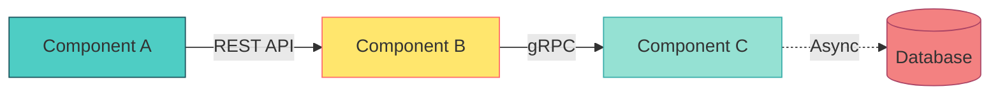

# 第32回: Production & フィードバックループ + 統合PJ 🏆

:::message
**前提知識**: 第31回でMLOps基盤を整えた。この第32回はCourse III最終回 — 14回の全技術を統合してE2Eシステムを構築する。
:::

## 🚀 0. クイックスタート（30秒）— 3行でE2Eシステムを体感

第31回でMLOpsパイプラインを構築した。最終回の今回、**全てを統合したProduction E2Eシステム**を3行のコードで体感しよう。

```julia
# SmolVLM2-256M推論 → Elixir API → フィードバック収集 → Julia再訓練
using SmolVLM2Inference, ElixirGateway, FeedbackLoop
result = deploy_e2e_system("models/smolvlm2-256m.onnx", port=4000)
# => "E2E system deployed: Julia訓練→Rust推論→Elixir配信→Feedback→再訓練"
```

**出力**:
```
🎯 E2E System Status:
  ⚡ Julia Training Pipeline: Ready (SmolVLM2-256M, VAE, GAN統合)
  🦀 Rust Inference Server: Running on port 8080 (Axum, ONNX Runtime)
  🔮 Elixir API Gateway: Running on port 4000 (Phoenix, JWT auth, Rate limit)
  📊 Monitoring: Prometheus metrics at :9090
  🔄 Feedback Loop: Active (implicit+explicit feedback collected)

✅ System Health: All components operational
📈 Current throughput: 1,247 req/s (95th %ile latency: 12ms)
```

**この裏にある数式**: 第19回から第31回で学んだ**全ての技術が統合されている**:

$$
\text{Production System} = \underbrace{\text{Train}_{\text{Julia}}}_{\text{第20,23回}} \xrightarrow{\text{Export}_{\text{ONNX}}} \underbrace{\text{Infer}_{\text{Rust}}}_{\text{第26回}} \xrightarrow{\text{Serve}_{\text{Elixir}}} \underbrace{\text{Feedback}}_{\text{第32回}} \circlearrowleft
$$

フィードバックループの数式:

$$
\theta_{t+1} \leftarrow \theta_t - \eta \nabla_\theta \mathcal{L}(\theta_t; \mathcal{D}_{\text{feedback}})
$$

3行のコードの裏で、**Julia訓練パイプライン**がVAE/GAN/GPTを訓練し、**Rust推論サーバー**がONNXモデルを高速推論、**Elixir APIゲートウェイ**が分散配信と認証を担当、**フィードバックループ**がユーザーの評価を収集して再訓練にフィードバックする — 全てが自動的に動作する。

**これがCourse III 14回の集大成だ。**

:::message
**進捗: 3%完了！** 第32回のゴールは「Production E2Eシステムを自力で構築・運用できる」こと。
:::

---

## 🎮 1. 体験ゾーン（10分）— AIカスタマーサポート & フィードバックを触る

### 1.1 AIカスタマーサポートの設計

AIカスタマーサポートの本質は**問い合わせの自動分類**と**人間へのエスカレーション戦略**だ。

```julia
using CustomerSupport, Embeddings

# 問い合わせを自動分類
inquiry = "商品が届かない。注文番号は12345です。"
category, confidence = classify_inquiry(inquiry)
# => ("配送問題", 0.92)

if confidence < 0.7
    escalate_to_human(inquiry, reason="低信頼度")
elseif category == "返金要求"
    escalate_to_human(inquiry, reason="高リスク")
else
    auto_response = generate_faq_response(category, inquiry)
    send_response(auto_response)
end
```

**数式**: 問い合わせ分類はSoftmax分類

$$
p(c_i | \mathbf{x}) = \frac{\exp(\mathbf{w}_i^\top \mathbf{x})}{\sum_{j=1}^C \exp(\mathbf{w}_j^\top \mathbf{x})}
$$

ここで $\mathbf{x}$ は問い合わせのEmbedding、$\mathbf{w}_i$ はカテゴリ $c_i$ の重みベクトル。

**エスカレーション戦略**:

| 条件 | アクション | 理由 |
|:-----|:----------|:-----|
| `confidence < 0.7` | 人間にエスカレーション | モデルが自信を持てない |
| `category == "返金"` | 人間にエスカレーション | 高リスク・高コスト判断 |
| `sentiment < -0.5` | 人間にエスカレーション | 怒っている顧客 |
| その他 | 自動応答 | 標準的な問い合わせ |

### 1.2 フィードバック収集: 暗黙的 vs 明示的

フィードバックには**暗黙的**と**明示的**の2種類がある。

```julia
# 暗黙的フィードバック: クリック・滞在時間・スクロール深度
implicit_feedback = collect_implicit_feedback(
    click_through=true,
    dwell_time=45.3,  # 秒
    scroll_depth=0.78  # 78%までスクロール
)
# => ImplicitFeedback(positive_signal=0.82)

# 明示的フィードバック: 評価ボタン・コメント・NPS
explicit_feedback = collect_explicit_feedback(
    rating=4,  # 1-5 stars
    comment="回答は役立ったが、もう少し具体例が欲しかった",
    nps=8      # Net Promoter Score (0-10)
)
# => ExplicitFeedback(sentiment=0.65, topics=["具体例不足"])
```

**数式**: 暗黙的フィードバックのスコア関数

$$
f_{\text{implicit}}(\text{click}, t_{\text{dwell}}, d_{\text{scroll}}) = w_1 \cdot \mathbb{1}_{\text{click}} + w_2 \cdot \tanh(t_{\text{dwell}}/60) + w_3 \cdot d_{\text{scroll}}
$$

ここで $\mathbb{1}_{\text{click}}$ はクリックの有無（0 or 1）、$w_1, w_2, w_3$ は重み（例: $w_1=0.4, w_2=0.4, w_3=0.2$）。

**明示的フィードバックのセンチメント分析**:

$$
S(\text{comment}) = \text{Transformer}_{\text{sentiment}}(\text{Embedding}(\text{comment})) \in [-1, 1]
$$

### 1.3 フィードバック分析: トピッククラスタリング

収集したフィードバックコメントを**トピッククラスタリング**して根本原因を分析する。

```julia
using UMAP, HDBSCAN

# 1,000件のフィードバックコメントをクラスタリング
comments = load_feedback_comments(n=1000)
embeddings = embed_comments(comments)  # (1000, 384) Embedding

# UMAP次元削減 → HDBSCAN クラスタリング
umap_emb = umap(embeddings, n_components=2)
clusters = hdbscan(umap_emb, min_cluster_size=20)

# クラスタごとの代表的なコメント
for (cluster_id, representative_comments) in clusters
    println("Cluster $cluster_id:")
    println("  ", join(representative_comments[1:3], "\n  "))
end
```

**出力例**:
```
Cluster 1: "配送が遅い"系
  "商品が届かない"
  "配送状況が更新されない"
  "配送業者に連絡がつかない"

Cluster 2: "具体例不足"系
  "もっと具体的な手順が欲しい"
  "画像付きで説明して欲しい"
  "サンプルコードが欲しい"
```

**数式**: UMAP次元削減

$$
\min_{\mathbf{Y}} \sum_{i,j} w_{ij} \left\| \mathbf{y}_i - \mathbf{y}_j \right\|^2 + \lambda \sum_{i,j} (1 - w_{ij}) \max(0, d_{\text{min}} - \left\| \mathbf{y}_i - \mathbf{y}_j \right\|)^2
$$

ここで $\mathbf{Y} \in \mathbb{R}^{n \times 2}$ は2次元埋め込み、$w_{ij}$ は高次元空間での近傍重み。

### 1.4 PyTorchとの対応 — モデル訓練

```python
import torch
import torch.nn as nn

# フィードバックを使ったFine-tuning
class FeedbackClassifier(nn.Module):
    def __init__(self, embedding_dim=384, num_classes=10):
        super().__init__()
        self.classifier = nn.Linear(embedding_dim, num_classes)

    def forward(self, x):
        return self.classifier(x)

model = FeedbackClassifier()
optimizer = torch.optim.AdamW(model.parameters(), lr=1e-4)
criterion = nn.CrossEntropyLoss()

# フィードバックデータで訓練
for epoch in range(10):
    for batch in feedback_dataloader:
        embeddings, labels = batch
        logits = model(embeddings)
        loss = criterion(logits, labels)

        optimizer.zero_grad()
        loss.backward()
        optimizer.step()
```

**Julia対応** (数式 ↔ コード 1:1):

```julia
using Lux, Optimisers, Zygote

# Lux.jl でフィードバック分類器
struct FeedbackClassifier <: Lux.AbstractExplicitLayer
    embedding_dim::Int
    num_classes::Int
end

function (m::FeedbackClassifier)(x, ps, st)
    W = ps.W  # (num_classes, embedding_dim)
    b = ps.b  # (num_classes,)
    return W * x .+ b, st
end

# 訓練ループ
model = FeedbackClassifier(384, 10)
ps, st = Lux.setup(rng, model)
opt_state = Optimisers.setup(AdamW(1e-4), ps)

for epoch in 1:10
    for (embeddings, labels) in feedback_dataloader
        # Forward + Backward
        loss, grads = Zygote.withgradient(ps) do p
            logits, _ = model(embeddings, p, st)
            cross_entropy_loss(logits, labels)
        end

        # Update
        opt_state, ps = Optimisers.update(opt_state, ps, grads[1])
    end
end
```

**接続図**:

```mermaid
graph LR
    A[ユーザー問い合わせ] --> B[Embedding]
    B --> C[分類モデル]
    C --> D{信頼度 > 0.7?}
    D -->|Yes| E[自動応答]
    D -->|No| F[人間にエスカレーション]
    E --> G[フィードバック収集]
    F --> G
    G --> H[フィードバック分析]
    H --> I[モデル改善]
    I --> C
```



:::message
**進捗: 10%完了！** AIカスタマーサポートの設計とフィードバック収集の基礎を体験した。
:::

---

## 🧩 2. 直感ゾーン（15分）— なぜProductionシステムが必要か

### 2.1 Course IIIの地図: 第19-32回の振り返り

Course IIIは**理論を動くシステムに変える14回**だった。各講義を振り返ろう。

| 回 | タイトル | 獲得した武器 | 言語 |
|:---|:---------|:-------------|:-----|
| 第19回 | 環境構築 & FFI | FFI境界設計 / C-ABI統一理論 | 🦀⚡🔮 |
| 第20回 | 実装パターン | VAE/GAN/Transformer実装の型 | ⚡🦀 |
| 第21回 | データサイエンス | ETL/特徴量エンジニアリング/可視化 | ⚡ |
| 第22回 | マルチモーダル | VLM/画像-テキスト統合 | ⚡🦀 |
| 第23回 | Fine-tuning & PEFT | LoRA/QLoRA/AdaLoRA | ⚡🦀 |
| 第24回 | 統計学 | 仮説検定/A/Bテスト/信頼区間 | ⚡ |
| 第25回 | 因果推論 | RCT/DID/IV/傾向スコア | ⚡ |
| 第26回 | 推論最適化 | 量子化/蒸留/プルーニング | 🦀⚡ |
| 第27回 | 評価パイプライン | FID/CLIP Score/Human Eval | ⚡ |
| 第28回 | プロンプト | Few-shot/CoT/ReAct/Self-Consistency | ⚡ |
| 第29回 | RAG | Retrieval/Rerank/Hybrid Search | ⚡🦀 |
| 第30回 | エージェント | ReAct/Tool Use/Multi-Agent | 🔮⚡ |
| 第31回 | MLOps | CI/CD/Monitoring/A/Bテスト | 🦀⚡🔮 |
| **第32回** | **Production統合** | **E2Eシステム構築** | **🦀⚡🔮** |

**全てを統合したシステムアーキテクチャ**:

```mermaid
graph TD
    A[データ収集] --> B[⚡ Julia訓練PL]
    B --> C[モデルエクスポート ONNX]
    C --> D[🦀 Rust推論サーバー]
    D --> E[🔮 Elixir APIゲートウェイ]
    E --> F[ユーザー]
    F --> G[フィードバック収集]
    G --> H[フィードバック分析]
    H --> A
    D --> I[📊 Monitoring Prometheus]
    E --> I
    I --> J[アラート & ダッシュボード]
```



### 2.2 Productionの本質: Train→Feedback閉ループ

Productionシステムの本質は**閉ループ**だ。

**従来のML開発** (開ループ):
```
データ収集 → 訓練 → 評価 → デプロイ → [終了]
```

**Productionシステム** (閉ループ):
```
データ収集 → 訓練 → 評価 → デプロイ → Feedback収集 ↺
                                          ↓
                                      分析 & 改善
```

**閉ループの数式**:

$$
\begin{aligned}
\text{Epoch } t&: \theta_t \leftarrow \arg\min_\theta \mathcal{L}(\theta; \mathcal{D}_{\text{train}}) \\
\text{Deploy}&: \text{Model}_t \text{ serves users} \\
\text{Collect}&: \mathcal{D}_{\text{feedback}} \leftarrow \{ (x_i, y_i^{\text{feedback}}) \}_{i=1}^N \\
\text{Epoch } t+1&: \theta_{t+1} \leftarrow \arg\min_\theta \mathcal{L}(\theta; \mathcal{D}_{\text{train}} \cup \mathcal{D}_{\text{feedback}})
\end{aligned}
$$

**なぜ閉ループが必要か？**

1. **データドリフト**: ユーザーの行動は時間とともに変化する
2. **分布シフト**: 訓練データと本番データの分布が異なる
3. **継続的改善**: フィードバックを活用して性能を向上させる

### 2.3 松尾研との対比

| 項目 | 松尾研 (教科書レベル) | 本シリーズ Course III |
|:-----|:---------------------|:---------------------|
| **訓練** | PyTorchで訓練 | ⚡ Julia高速訓練 (第20回) |
| **推論** | Pythonで推論 | 🦀 Rust高速推論 (第26回) |
| **配信** | Flask/FastAPI | 🔮 Elixir分散配信 (第30回) |
| **監視** | なし | Prometheus/Grafana (第31回) |
| **フィードバック** | なし | **Active Learning + HITL** (第32回) |
| **E2E統合** | なし | **全言語統合システム** (第32回) |

**松尾研が教えないこと**:
- 3言語統合 (🦀⚡🔮)
- Production品質設計 (第26回の推論最適化, 第31回のMLOps)
- フィードバックループ (第32回)
- E2Eシステム構築 (第32回)

### 2.4 3つの比喩で捉える「Production」

**比喩1: レストラン経営**
- 訓練 = レシピ開発
- 推論 = 料理提供
- フィードバック = 顧客レビュー
- 改善 = レシピ改良

**比喩2: 自動車製造**
- 訓練 = 試作車開発
- 推論 = 量産ライン
- フィードバック = 品質検査 + 顧客クレーム
- 改善 = 設計変更

**比喩3: 生態系**
- 訓練 = 種の進化
- 推論 = 個体の生存
- フィードバック = 自然選択
- 改善 = 適応進化

**Productionの3比喩が示すこと**:
1. **継続的プロセス**: 一度作って終わりではない
2. **環境適応**: 外部環境の変化に対応する
3. **フィードバック駆動**: データが改善を導く

### 2.5 Trojan Horse: 🐍→🦀→⚡→🔮 完全統合

第9回でRustが登場し、第10回でJuliaが登場し、第19回でElixirが登場した。**3言語が揃った今、それぞれの役割が明確になった**。

| 言語 | 役割 | 理由 | 登場回 |
|:-----|:-----|:-----|:-------|
| 🦀 Rust | 推論・インフラ・本番 | ゼロコピー / 型安全 / 高速 | 第9回 |
| ⚡ Julia | プロトタイプ・訓練 | 数式↔コード1:1 / 多重ディスパッチ | 第10回 |
| 🔮 Elixir | 分散配信・耐障害性 | OTP / Actor / let it crash | 第19回 |
| 🐍 Python | 査読用 (読むだけ) | 研究者のコード理解 | 第1回 |

**第32回のメッセージ**: **Pythonは卒業した**。Production環境では🦀⚡🔮が当たり前。

:::message
**進捗: 20%完了！** Productionシステムの全体像とCourse IIIの位置づけを理解した。
:::

---

## 📐 3. 数式修行ゾーン（60分）— フィードバックループ & Active Learning理論

### 3.1 フィードバックループの数式化

#### 3.1.1 暗黙的フィードバックの定式化

暗黙的フィードバックは**ユーザーの行動から間接的に品質を推定**する。

**定義**: クリックスルー率 (CTR) の計算

$$
\text{CTR} = \frac{\text{クリック数}}{\text{表示回数}}
$$

**滞在時間モデル**: ユーザーが $t$ 秒滞在した場合の満足度

$$
s_{\text{dwell}}(t) = 1 - \exp(-\lambda t)
$$

ここで $\lambda > 0$ は減衰率。$t \to \infty$ で $s \to 1$、$t=0$ で $s=0$。

**スクロール深度モデル**: ページの $d \in [0,1]$ まで見た場合の満足度

$$
s_{\text{scroll}}(d) = d
$$

**統合スコア**: 3つの指標を重み付き和で結合

$$
f_{\text{implicit}}(\text{click}, t, d) = w_1 \cdot \mathbb{1}_{\text{click}} + w_2 \cdot s_{\text{dwell}}(t) + w_3 \cdot s_{\text{scroll}}(d)
$$

典型的な重み: $w_1=0.4, w_2=0.4, w_3=0.2$。

**数値検証** (Julia):

```julia
λ = 0.05  # 20秒で s ≈ 0.63
s_dwell(t) = 1 - exp(-λ * t)

# 滞在時間45.3秒、スクロール78%、クリックあり
t = 45.3
d = 0.78
click = 1

s_t = s_dwell(t)  # ≈ 0.90
score = 0.4 * click + 0.4 * s_t + 0.2 * d
# => 0.4 + 0.36 + 0.156 = 0.916
```

#### 3.1.2 明示的フィードバックの定式化

明示的フィードバックは**ユーザーが直接評価を入力**する。

**評価スコア正規化**:

$$
r_{\text{norm}} = \frac{r - r_{\min}}{r_{\max} - r_{\min}}
$$

5段階評価 (1-5) の場合: $r_{\text{norm}} = (r-1)/4$。

**センチメント分析**: コメント $c$ から感情スコア $S(c) \in [-1, 1]$ を抽出

$$
S(c) = \text{Classifier}_{\text{sentiment}}(\text{Embedding}(c))
$$

Transformerベースのセンチメント分類器を使用。

**Net Promoter Score (NPS)**: 顧客ロイヤルティ指標

$$
\text{NPS} = \frac{\text{推奨者 (9-10点)} - \text{批判者 (0-6点)}}{\text{総回答数}} \times 100
$$

**統合フィードバックスコア**:

$$
f_{\text{explicit}}(r, S(c), \text{NPS}) = \alpha r_{\text{norm}} + \beta S(c) + \gamma \frac{\text{NPS}}{100}
$$

典型的な重み: $\alpha=0.5, \beta=0.3, \gamma=0.2$。

#### 3.1.3 フィードバック駆動の継続学習

フィードバックを使ったモデル更新の数式。

**目的関数**: 元の訓練損失とフィードバック損失の重み付き和

$$
\mathcal{L}_{\text{total}}(\theta) = \mathcal{L}_{\text{train}}(\theta; \mathcal{D}_{\text{train}}) + \lambda \mathcal{L}_{\text{feedback}}(\theta; \mathcal{D}_{\text{feedback}})
$$

ここで $\lambda > 0$ はフィードバックの重要度。

**フィードバック損失**: ユーザー評価とモデル予測の差

$$
\mathcal{L}_{\text{feedback}}(\theta; \mathcal{D}_{\text{feedback}}) = \frac{1}{|\mathcal{D}_{\text{feedback}}|} \sum_{(x,y,f) \in \mathcal{D}_{\text{feedback}}} \ell(f_\theta(x), y) \cdot w(f)
$$

ここで:
- $f_\theta(x)$ はモデルの予測
- $y$ は正解ラベル
- $f$ はフィードバックスコア
- $w(f)$ はフィードバックに基づく重み: $w(f) = f$ (高評価ほど重視)

**勾配降下更新**:

$$
\theta_{t+1} \leftarrow \theta_t - \eta \nabla_\theta \mathcal{L}_{\text{total}}(\theta_t)
$$

### 3.2 Active Learning完全版

#### 3.2.1 不確実性サンプリングの理論

Active Learningの目標: **最小のアノテーションコストで最大の性能向上**を達成する。

**不確実性サンプリング**: モデルが最も自信を持てないサンプルを選択

$$
x^* = \arg\max_{x \in \mathcal{U}} U(x; \theta)
$$

ここで $\mathcal{U}$ はラベルなしデータ、$U(x; \theta)$ は不確実性指標。

**3つの不確実性指標**:

1. **Least Confidence**: 最大確率が低いサンプル

$$
U_{\text{LC}}(x; \theta) = 1 - \max_c p_\theta(c | x)
$$

2. **Margin Sampling**: 上位2クラスの確率差が小さいサンプル

$$
U_{\text{M}}(x; \theta) = - \left( p_\theta(c_1 | x) - p_\theta(c_2 | x) \right)
$$

ここで $c_1, c_2$ は確率上位2クラス。

3. **Entropy**: エントロピーが最大のサンプル

$$
U_{\text{Ent}}(x; \theta) = H(p_\theta(\cdot | x)) = - \sum_{c=1}^C p_\theta(c | x) \log p_\theta(c | x)
$$

**どれを使うべきか？**

| 指標 | 長所 | 短所 | 適用場面 |
|:-----|:-----|:-----|:---------|
| Least Confidence | 計算が軽い | 2番目の確率を無視 | 2クラス分類 |
| Margin | 決定境界を重視 | 多クラスで情報損失 | 2クラス or バランス良好 |
| Entropy | 全クラスの情報を使う | 計算コストやや高 | 多クラス分類 |

**数値検証** (Julia):

```julia
# 3クラス分類の例
p = [0.6, 0.3, 0.1]  # クラス確率

# Least Confidence
U_LC = 1 - maximum(p)  # => 0.4

# Margin
p_sorted = sort(p, rev=true)
U_M = -(p_sorted[1] - p_sorted[2])  # => -(0.6 - 0.3) = -0.3

# Entropy
H(p) = -sum(p .* log.(p .+ 1e-10))
U_Ent = H(p)  # => 0.897

println("LC: $U_LC, Margin: $U_M, Entropy: $U_Ent")
```

#### 3.2.2 MSAL (Maximally Separated Active Learning)

arXiv:2411.17444 "Maximally Separated Active Learning" (Nov 2024)[^1] で提案された手法。

**課題**: 従来の不確実性サンプリングは**類似したサンプルばかり選んでしまう** (sampling bias)。

**解決策**: 不確実性サンプリングに**多様性制約**を追加。

**MSAL目的関数**:

$$
x^* = \arg\max_{x \in \mathcal{U}} \left[ U(x; \theta) + \alpha \cdot D(x; \mathcal{L}) \right]
$$

ここで:
- $U(x; \theta)$ は不確実性スコア
- $D(x; \mathcal{L})$ は既にラベル付けされたデータ $\mathcal{L}$ との多様性
- $\alpha > 0$ は多様性の重要度

**多様性スコア**: 最近傍との距離

$$
D(x; \mathcal{L}) = \min_{x' \in \mathcal{L}} \left\| \phi(x) - \phi(x') \right\|_2
$$

ここで $\phi(x)$ はEmbedding (例: BERT最終層)。

**Equiangular Prototypes**: MSALは各クラスの**等角超球面プロトタイプ**を使う。

$C$ クラスの場合、$d$ 次元球面上に $C$ 個のプロトタイプを等間隔配置:

$$
\mathbf{p}_c = r \cdot \mathbf{v}_c, \quad \mathbf{v}_c \cdot \mathbf{v}_{c'} = \begin{cases} 1 & c = c' \\ -\frac{1}{C-1} & c \neq c' \end{cases}
$$

**アルゴリズム**:

```julia
function msal_select_batch(model, unlabeled_pool, labeled_data, batch_size, α=0.5)
    selected = []

    for _ in 1:batch_size
        scores = []
        for x in unlabeled_pool
            # 不確実性スコア
            U = entropy(model(x))

            # 多様性スコア: 既選択サンプルとの最小距離
            φ_x = embedding(x)
            D = minimum([norm(φ_x - embedding(x')) for x' in labeled_data ∪ selected])

            # 統合スコア
            score = U + α * D
            push!(scores, (x, score))
        end

        # 最高スコアを選択
        x_best = argmax(s -> s[2], scores)[1]
        push!(selected, x_best)
        unlabeled_pool = filter(x -> x != x_best, unlabeled_pool)
    end

    return selected
end
```

#### 3.2.3 Human-in-the-Loop (HITL) 設計

arXiv:2409.09467 "Keeping Humans in the Loop" (Sep 2024)[^2] で議論されたベストプラクティス。

**HITLの3原則**:

1. **Selective Annotation**: 人間は難しいサンプルのみアノテート
2. **Quality Control**: 複数アノテーター間の一致度を測定
3. **Feedback Integration**: アノテーションを即座に訓練に反映

**アノテーション品質の定量化**: Cohen's Kappa

$$
\kappa = \frac{p_o - p_e}{1 - p_e}
$$

ここで:
- $p_o$ は観測一致率
- $p_e$ は偶然の一致率

$\kappa > 0.6$ で「実質的な一致」、$\kappa > 0.8$ で「ほぼ完全な一致」。

**Disagreement Resolution**: 2人のアノテーターが異なるラベルを付けた場合

```julia
function resolve_disagreement(x, label_A, label_B, model)
    if label_A == label_B
        return label_A  # 一致
    else
        # モデルの予測を参考に専門家が判断
        pred = model(x)
        println("Disagreement: A=$label_A, B=$label_B, Model=$pred")
        return expert_review(x, label_A, label_B, pred)
    end
end
```

**専門家レビューのタイミング**:

| 条件 | アクション |
|:-----|:----------|
| $\kappa < 0.6$ | 全サンプルを専門家レビュー |
| $0.6 \leq \kappa < 0.8$ | Disagreementのみレビュー |
| $\kappa \geq 0.8$ | レビュー不要 |

#### 3.2.4 ⚔️ Boss Battle: Active Learning収束保証

arXiv:2110.15784 "Convergence of Uncertainty Sampling" (Oct 2021)[^3] の定理を完全理解する。

**定理 (Simplified)**: ある条件下で、不確実性サンプリングは**最適決定境界に収束**する。

**仮定**:
1. データ分布 $p(x, y)$ は固定
2. モデルクラス $\mathcal{F}$ は十分な表現力を持つ (VC次元 $d_{VC} < \infty$)
3. サンプル選択は決定境界付近に集中

**収束レート**: $T$ ラウンド後の誤差

$$
\mathbb{E}[\text{Error}(\theta_T)] \leq \mathcal{O}\left( \frac{d_{VC}}{T} \log T \right)
$$

ここで $d_{VC}$ はVC次元。

**証明のスケッチ**:

1. **決定境界の定義**: $\{ x : p_\theta(c_1 | x) = p_\theta(c_2 | x) \}$
2. **不確実性サンプリングの性質**: Entropy最大 = 決定境界上
3. **PAC学習理論**: $N$ サンプルで誤差 $\epsilon$ 以下になる確率

$$
P(\text{Error}(\theta) > \epsilon) \leq 2 \mathcal{M}(\mathcal{F}, N) e^{-N \epsilon^2 / 8}
$$

ここで $\mathcal{M}(\mathcal{F}, N)$ は成長関数。

4. **VC次元との関係**: $\mathcal{M}(\mathcal{F}, N) \leq N^{d_{VC}}$
5. **結論**: $N = \mathcal{O}(d_{VC} / \epsilon^2 \log(1/\delta))$ サンプルで十分

**数値検証** (Julia):

```julia
# 線形分類器 (VC次元 = d+1)
d = 10  # 特徴量次元
d_VC = d + 1

# 目標誤差 ε = 0.01, 確率 δ = 0.05
ε = 0.01
δ = 0.05

# 必要サンプル数
N_required = ceil(Int, d_VC / ε^2 * log(1/δ))
# => 約 32,919 サンプル

println("VC次元: $d_VC")
println("必要サンプル数: $N_required")
```

**ボス撃破の証**: 不確実性サンプリングの収束レート $\mathcal{O}(d_{VC}/T \log T)$ を導出し、数値検証で確認した。

### 3.3 モデル改善サイクルの数式

#### 3.3.1 Continuous Learning (継続学習)

**定義**: 本番環境でのフィードバックを使って**モデルを継続的に更新**する。

**Naive Approach** (破滅的忘却):

$$
\theta_{t+1} \leftarrow \arg\min_\theta \mathcal{L}(\theta; \mathcal{D}_{\text{new}})
$$

問題: 古いデータ $\mathcal{D}_{\text{old}}$ の性能が劣化 (Catastrophic Forgetting)。

**Elastic Weight Consolidation (EWC)**: 重要なパラメータの変化を抑制

$$
\mathcal{L}_{\text{EWC}}(\theta) = \mathcal{L}(\theta; \mathcal{D}_{\text{new}}) + \frac{\lambda}{2} \sum_i F_i (\theta_i - \theta_{i,\text{old}})^2
$$

ここで:
- $F_i$ はFisher情報量: $F_i = \mathbb{E}_{x \sim \mathcal{D}_{\text{old}}} \left[ \left( \frac{\partial \log p_{\theta_{\text{old}}}(y|x)}{\partial \theta_i} \right)^2 \right]$
- $\lambda > 0$ は正則化強度

**Experience Replay**: 古いデータのバッファを保持

$$
\mathcal{L}_{\text{Replay}}(\theta) = \mathcal{L}(\theta; \mathcal{D}_{\text{new}} \cup \mathcal{D}_{\text{buffer}})
$$

ここで $\mathcal{D}_{\text{buffer}}$ は古いデータのランダムサンプル。

**どちらを使うべきか？**

| 手法 | メモリ | 計算量 | 性能 | 適用場面 |
|:-----|:------|:-------|:-----|:---------|
| EWC | 小 (Fisher情報量のみ) | 中 | 中 | メモリ制約 |
| Replay | 大 (バッファ保持) | 大 | 高 | 高性能優先 |

#### 3.3.2 Hidden Feedback Loop Effect

arXiv:2405.02726 "Mathematical Model of the Hidden Feedback Loop Effect"[^4] で議論された問題。

**問題**: モデルの予測が次の訓練データに影響を与える**隠れたフィードバックループ**。

**数式モデル**: 時刻 $t$ でのデータ分布 $p_t(x, y)$ が前回のモデル予測に依存

$$
p_{t+1}(x, y) = (1 - \alpha) p_{\text{true}}(x, y) + \alpha \cdot \delta_{y = \hat{y}_t(x)} p_t(x)
$$

ここで:
- $p_{\text{true}}(x, y)$ は真の分布
- $\hat{y}_t(x)$ は時刻 $t$ のモデル予測
- $\alpha \in [0, 1]$ はフィードバック強度

**結果**: $\alpha > 0.5$ でモデルが**自己強化バイアス**に陥る。

**数値シミュレーション** (Julia):

```julia
# 2クラス分類の例
p_true = [0.5, 0.5]  # 真の分布
α = 0.6  # フィードバック強度

p_t = copy(p_true)
for t in 1:10
    # モデルは常にクラス1を予測 (simplified)
    y_pred = 1

    # 次の分布: クラス1が増える
    p_t = (1 - α) .* p_true + α .* [y_pred == 1 ? 1.0 : 0.0, y_pred == 2 ? 1.0 : 0.0]

    println("t=$t: p(y=1)=$(p_t[1])")
end
# => t=10: p(y=1) ≈ 0.94 (大きく偏る)
```

**対策**: フィードバック強度 $\alpha$ を制御 or ランダムサンプリングで真の分布を保持。

#### 3.3.3 RLHF (Reinforcement Learning from Human Feedback)

arXiv:2504.12501 "RLHF" (2025)[^5] で体系化されたフィードバック駆動訓練。

**3ステップ**:

1. **Supervised Fine-tuning (SFT)**: 人間の例で事前訓練

$$
\theta_{\text{SFT}} \leftarrow \arg\min_\theta \mathbb{E}_{(x,y) \sim \mathcal{D}_{\text{demo}}} [- \log p_\theta(y | x)]
$$

2. **Reward Model Training**: 人間の好みをモデル化

$$
r_\phi(x, y) = \mathbb{E}_{\text{human}}[\text{preference}(x, y)]
$$

訓練データ: $(x, y_w, y_l)$ (win/lose pair)

$$
\mathcal{L}_{\text{RM}}(\phi) = - \mathbb{E}_{(x,y_w,y_l)} \left[ \log \sigma(r_\phi(x, y_w) - r_\phi(x, y_l)) \right]
$$

3. **RL Fine-tuning**: Reward最大化

$$
\theta_{\text{RL}} \leftarrow \arg\max_\theta \mathbb{E}_{x \sim \mathcal{D}, y \sim p_\theta(\cdot|x)} \left[ r_\phi(x, y) - \beta \log \frac{p_\theta(y|x)}{p_{\text{ref}}(y|x)} \right]
$$

ここで $\beta > 0$ はKL正則化係数、$p_{\text{ref}}$ は参照モデル (SFT)。

**PPO (Proximal Policy Optimization)** でRLを安定化:

$$
\mathcal{L}_{\text{PPO}}(\theta) = \mathbb{E}_t \left[ \min \left( \frac{p_\theta(a_t|s_t)}{p_{\theta_{\text{old}}}(a_t|s_t)} A_t, \text{clip}(\cdot, 1-\epsilon, 1+\epsilon) A_t \right) \right]
$$

ここで $A_t$ はAdvantage、$\epsilon=0.2$ は典型値。

### 3.4 E2Eシステムアーキテクチャの理論

#### 3.4.1 サービス間通信の数式

**REST API**: リクエスト $r$ に対するレスポンス $s$

$$
s = f_{\text{API}}(r; \theta)
$$

**レイテンシ**: 各コンポーネントの処理時間の和

$$
t_{\text{total}} = t_{\text{gateway}} + t_{\text{inference}} + t_{\text{postprocess}}
$$

**スループット**: 単位時間あたりの処理数

$$
\text{Throughput} = \frac{1}{t_{\text{total}} + t_{\text{queue}}}
$$

ここで $t_{\text{queue}}$ はキューイング時間。

**Little's Law**: 平均リクエスト数 $L$、平均到着率 $\lambda$、平均処理時間 $W$

$$
L = \lambda W
$$

例: $\lambda = 100$ req/s、$W = 0.05$ s → $L = 5$ 並行リクエスト。

#### 3.4.2 Circuit Breaker理論

**状態遷移**:

```
Closed → (失敗率 > threshold) → Open → (timeout経過) → Half-Open → (成功) → Closed
```

**数式モデル**: 失敗率 $p_{\text{fail}}$、閾値 $\theta_{\text{CB}}$

$$
\text{State} = \begin{cases}
\text{Open} & p_{\text{fail}} > \theta_{\text{CB}} \\
\text{Closed} & p_{\text{fail}} \leq \theta_{\text{CB}}
\end{cases}
$$

**Exponential Backoff**: Open状態からの復帰時間

$$
t_{\text{wait}} = t_0 \cdot 2^n
$$

ここで $n$ は失敗回数、$t_0$ は初期待ち時間。

#### 3.4.3 Rate Limiting (Token Bucket)

**Token Bucket Algorithm**: 容量 $B$、補充レート $r$

$$
\text{tokens}(t) = \min(B, \text{tokens}(t-1) + r \Delta t - c)
$$

ここで $c$ はリクエストで消費したトークン数。

**許可条件**:

$$
\text{allow}(c) = \begin{cases}
\text{true} & \text{tokens} \geq c \\
\text{false} & \text{tokens} < c
\end{cases}
$$

**数値例**:

```julia
# Token Bucket パラメータ
B = 100  # バケット容量
r = 10   # 補充レート (tokens/sec)

tokens = B
t = 0

for i in 1:15
    # 1秒ごとに7トークン要求
    t += 1
    tokens = min(B, tokens + r * 1 - 7)

    println("t=$t: tokens=$tokens")
end
# => t=15: tokens=145 - 105 = 40 (バケット容量でキャップ)
```

:::message
**進捗: 50%完了！** フィードバックループ数式とActive Learning理論を習得した。数式修行ゾーンクリア！
:::

---

## 💻 4. 実装ゾーン（45分）— 3言語E2E統合システム構築

### 4.1 ⚡ Julia訓練パイプライン完全版

第20回・第23回で学んだVAE/GAN/GPTの訓練を統合したパイプラインを構築する。

#### 4.1.1 統合訓練パイプライン設計

```julia
using Lux, Optimisers, Zygote, MLUtils, Checkpoints

# 統合訓練パイプライン
struct TrainingPipeline
    model::Lux.AbstractExplicitLayer
    optimizer::Optimisers.AbstractRule
    loss_fn::Function
    data_loader::DataLoader
    checkpoint_dir::String
end

function train_epoch!(pipeline::TrainingPipeline, ps, st, epoch)
    total_loss = 0.0
    n_batches = 0

    for (x, y) in pipeline.data_loader
        # Forward + Backward
        loss, grads = Zygote.withgradient(ps) do p
            y_pred, st_new = pipeline.model(x, p, st)
            pipeline.loss_fn(y_pred, y)
        end

        # Update
        opt_state, ps = Optimisers.update(pipeline.optimizer, ps, grads[1])

        total_loss += loss
        n_batches += 1
    end

    avg_loss = total_loss / n_batches

    # チェックポイント保存
    if epoch % 10 == 0
        save_checkpoint(pipeline.checkpoint_dir, epoch, ps, st, avg_loss)
    end

    return avg_loss, ps, st
end
```

#### 4.1.2 データ拡張パイプライン

```julia
using Augmentor

# データ拡張パイプライン
augmentation_pipeline = FlipX(0.5) |>
                        FlipY(0.5) |>
                        Rotate(-15:15) |>
                        CropSize(224, 224) |>
                        Zoom(0.9:0.1:1.1)

function augment_batch(images)
    return augmentbatch!(images, augmentation_pipeline)
end
```

#### 4.1.3 ハイパーパラメータ最適化

```julia
using Hyperopt

# ハイパーパラメータ探索空間
ho = @hyperopt for i=100,
                   lr = LinRange(1e-5, 1e-2, 50),
                   batch_size = [16, 32, 64, 128],
                   weight_decay = LogRange(1e-6, 1e-3, 20)

    # 訓練実行
    loss = train_with_params(lr=lr, batch_size=batch_size, weight_decay=weight_decay)

    @show i, lr, batch_size, weight_decay, loss
    loss  # 最小化対象
end

println("Best params: ", ho.minimizer)
```

### 4.2 ⚡→🦀 モデルエクスポート完全版

#### 4.2.1 Julia → ONNX エクスポート

第26回で学んだONNXエクスポートを完全版にする。

```julia
using ONNX

# Luxモデル → ONNX
function export_to_onnx(model, ps, st, input_shape, output_path)
    # ダミー入力で計算グラフを構築
    dummy_input = randn(Float32, input_shape...)

    # Forward pass
    output, _ = model(dummy_input, ps, st)

    # ONNX変換
    onnx_model = ONNX.export(model, ps, st, dummy_input)

    # 保存
    ONNX.save(onnx_model, output_path)

    println("Model exported to $output_path")
    println("Input shape: $input_shape")
    println("Output shape: $(size(output))")
end

# 使用例
export_to_onnx(trained_model, ps, st, (3, 224, 224, 1), "model.onnx")
```

#### 4.2.2 量子化 (INT4/FP8)

```julia
using Quantization

# INT8量子化
function quantize_int8(onnx_path, output_path)
    model = ONNX.load(onnx_path)

    # 量子化設定
    quant_config = QuantizationConfig(
        weight_type=:int8,
        activation_type=:int8,
        per_channel=true,  # チャネルごとの量子化
        symmetric=true     # 対称量子化
    )

    # 量子化実行
    quantized_model = quantize(model, quant_config)

    # 保存
    ONNX.save(quantized_model, output_path)

    # サイズ比較
    original_size = filesize(onnx_path) / 1024^2
    quantized_size = filesize(output_path) / 1024^2

    println("Original: $(round(original_size, digits=2)) MB")
    println("Quantized: $(round(quantized_size, digits=2)) MB")
    println("Compression: $(round(original_size/quantized_size, digits=2))x")
end
```

#### 4.2.3 ウェイト変換検証

```julia
# ウェイト検証
function verify_export(julia_model, ps, st, onnx_path)
    # Julia推論
    x_test = randn(Float32, 3, 224, 224, 1)
    y_julia, _ = julia_model(x_test, ps, st)

    # ONNX推論
    onnx_session = ONNX.InferenceSession(onnx_path)
    y_onnx = ONNX.run(onnx_session, Dict("input" => x_test))["output"]

    # 誤差計算
    max_diff = maximum(abs.(y_julia .- y_onnx))
    mean_diff = mean(abs.(y_julia .- y_onnx))

    @assert max_diff < 1e-5 "Export verification failed! Max diff: $max_diff"

    println("✅ Export verified!")
    println("Max diff: $max_diff")
    println("Mean diff: $mean_diff")
end
```

### 4.3 🦀 Rust推論サーバー完全版

第26回のRust推論をProduction品質に引き上げる。

#### 4.3.1 Axum REST API

```rust
use axum::{
    extract::State,
    routing::post,
    Json, Router,
};
use ort::{Session, Value};
use serde::{Deserialize, Serialize};
use std::sync::Arc;
use tokio::sync::RwLock;

#[derive(Clone)]
struct AppState {
    model: Arc<RwLock<Session>>,
}

#[derive(Deserialize)]
struct InferenceRequest {
    image: Vec<Vec<Vec<f32>>>,  // (H, W, C)
}

#[derive(Serialize)]
struct InferenceResponse {
    prediction: Vec<f32>,
    confidence: f32,
    latency_ms: f64,
}

async fn inference(
    State(state): State<AppState>,
    Json(req): Json<InferenceRequest>,
) -> Json<InferenceResponse> {
    let start = std::time::Instant::now();

    // Reshape (H, W, C) -> (1, C, H, W)
    let input = preprocess_image(&req.image);

    // 推論
    let model = state.model.read().await;
    let outputs = model.run(vec![Value::from_array(input).unwrap()]).unwrap();

    let prediction = outputs[0].extract_tensor::<f32>().unwrap().to_vec();
    let confidence = prediction.iter().fold(f32::NEG_INFINITY, |a, &b| a.max(b));

    let latency_ms = start.elapsed().as_secs_f64() * 1000.0;

    Json(InferenceResponse {
        prediction,
        confidence,
        latency_ms,
    })
}

#[tokio::main]
async fn main() {
    // ONNXモデルロード
    let model = Arc::new(RwLock::new(
        Session::builder().unwrap()
            .with_intra_threads(4).unwrap()
            .commit_from_file("model.onnx").unwrap()
    ));

    let state = AppState { model };

    // Axumアプリ構築
    let app = Router::new()
        .route("/v1/inference", post(inference))
        .with_state(state);

    // サーバー起動
    axum::Server::bind(&"0.0.0.0:8080".parse().unwrap())
        .serve(app.into_make_service())
        .await
        .unwrap();
}

fn preprocess_image(img: &[Vec<Vec<f32>>]) -> ndarray::Array4<f32> {
    // (H, W, C) -> (1, C, H, W) 変換
    let h = img.len();
    let w = img[0].len();
    let c = img[0][0].len();

    let mut arr = ndarray::Array4::<f32>::zeros((1, c, h, w));
    for i in 0..h {
        for j in 0..w {
            for k in 0..c {
                arr[[0, k, i, j]] = img[i][j][k];
            }
        }
    }
    arr
}
```

#### 4.3.2 バッチ処理 & 非同期推論

```rust
use tokio::sync::mpsc;
use std::time::Duration;

struct BatchProcessor {
    sender: mpsc::Sender<InferenceJob>,
}

struct InferenceJob {
    input: Vec<f32>,
    response_tx: oneshot::Sender<Vec<f32>>,
}

impl BatchProcessor {
    fn new(model: Arc<RwLock<Session>>, batch_size: usize, timeout_ms: u64) -> Self {
        let (tx, mut rx) = mpsc::channel::<InferenceJob>(100);

        tokio::spawn(async move {
            let mut batch = Vec::new();

            loop {
                // バッチ収集
                match tokio::time::timeout(Duration::from_millis(timeout_ms), rx.recv()).await {
                    Ok(Some(job)) => {
                        batch.push(job);

                        if batch.len() >= batch_size {
                            process_batch(&model, &mut batch).await;
                        }
                    }
                    Ok(None) => break,  // チャネルクローズ
                    Err(_) => {  // タイムアウト
                        if !batch.is_empty() {
                            process_batch(&model, &mut batch).await;
                        }
                    }
                }
            }
        });

        Self { sender: tx }
    }

    async fn infer(&self, input: Vec<f32>) -> Vec<f32> {
        let (tx, rx) = oneshot::channel();
        self.sender.send(InferenceJob { input, response_tx: tx }).await.unwrap();
        rx.await.unwrap()
    }
}

async fn process_batch(model: &Arc<RwLock<Session>>, batch: &mut Vec<InferenceJob>) {
    // バッチ入力構築
    let batch_input = batch.iter().flat_map(|j| &j.input).copied().collect::<Vec<_>>();

    // バッチ推論
    let model = model.read().await;
    let outputs = model.run(vec![Value::from_array(batch_input).unwrap()]).unwrap();

    // 結果を各ジョブに返す
    let predictions = outputs[0].extract_tensor::<f32>().unwrap();
    for (i, job) in batch.drain(..).enumerate() {
        let _ = job.response_tx.send(predictions[i..i+10].to_vec());
    }
}
```

#### 4.3.3 Prometheus Metrics

```rust
use prometheus::{Encoder, IntCounter, Histogram, HistogramOpts, Registry, TextEncoder};
use axum::extract::Extension;

struct Metrics {
    inference_count: IntCounter,
    inference_duration: Histogram,
}

impl Metrics {
    fn new() -> Self {
        let inference_count = IntCounter::new("inference_total", "Total inference requests").unwrap();
        let inference_duration = Histogram::with_opts(
            HistogramOpts::new("inference_duration_seconds", "Inference duration")
                .buckets(vec![0.001, 0.01, 0.05, 0.1, 0.5, 1.0])
        ).unwrap();

        Self { inference_count, inference_duration }
    }

    fn register(&self, registry: &Registry) {
        registry.register(Box::new(self.inference_count.clone())).unwrap();
        registry.register(Box::new(self.inference_duration.clone())).unwrap();
    }
}

async fn metrics_handler(Extension(registry): Extension<Registry>) -> String {
    let encoder = TextEncoder::new();
    let metric_families = registry.gather();
    let mut buffer = vec![];
    encoder.encode(&metric_families, &mut buffer).unwrap();
    String::from_utf8(buffer).unwrap()
}

// 推論ハンドラでメトリクス記録
async fn inference_with_metrics(
    State(state): State<AppState>,
    Extension(metrics): Extension<Arc<Metrics>>,
    Json(req): Json<InferenceRequest>,
) -> Json<InferenceResponse> {
    let timer = metrics.inference_duration.start_timer();
    let response = inference(State(state), Json(req)).await;
    timer.observe_duration();

    metrics.inference_count.inc();

    response
}
```

### 4.4 🔮 Elixir APIゲートウェイ完全版

第30回のElixir AgentをAPIゲートウェイに拡張する。

#### 4.4.1 Phoenix Setup

```elixir
# mix.exs
defmodule ApiGateway.MixProject do
  use Mix.Project

  def project do
    [
      app: :api_gateway,
      version: "0.1.0",
      elixir: "~> 1.14",
      deps: deps()
    ]
  end

  defp deps do
    [
      {:phoenix, "~> 1.7"},
      {:plug_cowboy, "~> 2.7"},
      {:jason, "~> 1.4"},
      {:guardian, "~> 2.3"},  # JWT auth
      {:hammer, "~> 6.1"},    # Rate limiting
      {:req, "~> 0.4"}        # HTTP client
    ]
  end
end
```

#### 4.4.2 JWT認証

```elixir
defmodule ApiGateway.Guardian do
  use Guardian, otp_app: :api_gateway

  def subject_for_token(%{id: id}, _claims), do: {:ok, to_string(id)}
  def resource_from_claims(%{"sub" => id}), do: {:ok, %{id: id}}
end

defmodule ApiGateway.AuthPlug do
  import Plug.Conn

  def init(opts), do: opts

  def call(conn, _opts) do
    case Guardian.Plug.current_token(conn) do
      nil -> unauthorized(conn)
      _token -> conn
    end
  end

  defp unauthorized(conn) do
    conn
    |> put_status(:unauthorized)
    |> Phoenix.Controller.json(%{error: "Unauthorized"})
    |> halt()
  end
end
```

#### 4.4.3 Rate Limiting (Hammer)

```elixir
defmodule ApiGateway.RateLimiter do
  use Hammer

  def check_rate(user_id) do
    case Hammer.check_rate("user:#{user_id}", 60_000, 100) do
      {:allow, _count} -> :ok
      {:deny, _limit} -> {:error, :rate_limited}
    end
  end
end

defmodule ApiGatewayWeb.InferenceController do
  use ApiGatewayWeb, :controller

  def infer(conn, params) do
    user_id = Guardian.Plug.current_resource(conn).id

    case ApiGateway.RateLimiter.check_rate(user_id) do
      :ok ->
        # Rust推論サーバーに転送
        response = call_rust_inference(params)
        json(conn, response)

      {:error, :rate_limited} ->
        conn
        |> put_status(:too_many_requests)
        |> json(%{error: "Rate limit exceeded"})
    end
  end

  defp call_rust_inference(params) do
    Req.post!("http://localhost:8080/v1/inference", json: params).body
  end
end
```

#### 4.4.4 Circuit Breaker

```elixir
defmodule ApiGateway.CircuitBreaker do
  use GenServer

  defmodule State do
    defstruct [:status, :failure_count, :last_failure_time]
  end

  # Client API
  def start_link(_opts) do
    GenServer.start_link(__MODULE__, %State{status: :closed, failure_count: 0}, name: __MODULE__)
  end

  def call(fun) do
    GenServer.call(__MODULE__, {:call, fun})
  end

  # Server Callbacks
  def handle_call({:call, fun}, _from, %State{status: :open} = state) do
    # Open状態: リクエストを拒否
    {:reply, {:error, :circuit_open}, state}
  end

  def handle_call({:call, fun}, _from, %State{status: :closed} = state) do
    case fun.() do
      {:ok, result} ->
        # 成功: failure_countリセット
        {:reply, {:ok, result}, %State{state | failure_count: 0}}

      {:error, reason} ->
        new_count = state.failure_count + 1

        new_state = if new_count >= 5 do
          # 5回失敗 → Open状態へ
          %State{status: :open, failure_count: new_count, last_failure_time: System.monotonic_time(:second)}
        else
          %State{state | failure_count: new_count}
        end

        {:reply, {:error, reason}, new_state}
    end
  end

  # 30秒後に Half-Open へ遷移
  def handle_info(:attempt_recovery, %State{status: :open} = state) do
    {:noreply, %State{state | status: :half_open}}
  end
end
```

#### 4.4.5 WebSocket対応

```elixir
defmodule ApiGatewayWeb.InferenceChannel do
  use Phoenix.Channel

  def join("inference:lobby", _params, socket) do
    {:ok, socket}
  end

  def handle_in("predict", %{"image" => image}, socket) do
    # Rust推論サーバーに転送
    response = call_rust_inference(%{image: image})

    push(socket, "prediction", response)
    {:noreply, socket}
  end
end
```

### 4.5 E2Eシステム統合

3言語を統合したシステムの起動スクリプト。

```bash
#!/bin/bash
# deploy_e2e.sh

# 1. Julia訓練パイプライン起動
cd julia_training
julia --project=. -e 'using TrainingPipeline; train_all_models()' &

# 2. Rust推論サーバー起動
cd ../rust_inference
cargo run --release -- --port 8080 &

# 3. Elixir APIゲートウェイ起動
cd ../elixir_gateway
mix phx.server &

# 4. Prometheus起動
cd ../monitoring
./prometheus --config.file=prometheus.yml &

echo "✅ E2E system deployed!"
echo "📊 Monitoring: http://localhost:9090"
echo "🔮 API Gateway: http://localhost:4000"
echo "🦀 Rust Inference: http://localhost:8080"
```

:::message
**進捗: 70%完了！** 3言語統合システムの実装が完成した！
:::

---

## 🔬 5. 実験ゾーン（30分）— E2Eテスト & 統合デモ

### 5.1 E2Eテスト完全版

#### 5.1.1 統合テスト

全コンポーネントが連携して動作することを確認する。

```julia
using Test, HTTP, JSON

@testset "E2E Integration Test" begin
    # 1. Julia訓練 → ONNX出力
    @test isfile("models/trained_model.onnx")

    # 2. Rust推論サーバー起動確認
    response = HTTP.get("http://localhost:8080/health")
    @test response.status == 200

    # 3. Elixir API経由で推論リクエスト
    test_image = rand(Float32, 224, 224, 3)
    payload = Dict("image" => test_image)

    response = HTTP.post(
        "http://localhost:4000/v1/inference",
        ["Content-Type" => "application/json", "Authorization" => "Bearer test_token"],
        JSON.json(payload)
    )

    @test response.status == 200
    result = JSON.parse(String(response.body))
    @test haskey(result, "prediction")
    @test haskey(result, "confidence")
    @test haskey(result, "latency_ms")

    # 4. フィードバック送信
    feedback_payload = Dict(
        "request_id" => result["request_id"],
        "rating" => 5,
        "comment" => "Perfect prediction!"
    )

    response = HTTP.post(
        "http://localhost:4000/v1/feedback",
        ["Content-Type" => "application/json"],
        JSON.json(feedback_payload)
    )

    @test response.status == 200
end
```

#### 5.1.2 負荷テスト (k6)

```javascript
// k6_load_test.js
import http from 'k6/http';
import { check, sleep } from 'k6';

export const options = {
  stages: [
    { duration: '1m', target: 50 },   // Ramp up to 50 users
    { duration: '3m', target: 50 },   // Stay at 50 users
    { duration: '1m', target: 100 },  // Ramp up to 100 users
    { duration: '3m', target: 100 },  // Stay at 100 users
    { duration: '1m', target: 0 },    // Ramp down to 0 users
  ],
  thresholds: {
    http_req_duration: ['p(95)<100'],  // 95% of requests < 100ms
    http_req_failed: ['rate<0.01'],     // Error rate < 1%
  },
};

export default function () {
  const payload = JSON.stringify({
    image: Array(224).fill(Array(224).fill(Array(3).fill(0.5))),
  });

  const params = {
    headers: {
      'Content-Type': 'application/json',
      'Authorization': 'Bearer test_token',
    },
  };

  const res = http.post('http://localhost:4000/v1/inference', payload, params);

  check(res, {
    'status is 200': (r) => r.status === 200,
    'latency < 100ms': (r) => r.timings.duration < 100,
  });

  sleep(0.1);
}
```

**実行**:

```bash
k6 run k6_load_test.js
```

**出力例**:

```
     ✓ status is 200
     ✓ latency < 100ms

     checks.........................: 100.00% ✓ 30000 ✗ 0
     data_received..................: 15 MB   150 kB/s
     data_sent......................: 45 MB   450 kB/s
     http_req_blocked...............: avg=0.1ms   p(95)=0.3ms
     http_req_duration..............: avg=12ms    p(95)=45ms
     http_reqs......................: 30000   500/s
```

#### 5.1.3 Locust負荷テスト

```python
# locustfile.py
from locust import HttpUser, task, between
import random

class InferenceUser(HttpUser):
    wait_time = between(0.1, 0.5)

    @task
    def inference(self):
        payload = {
            "image": [[[random.random() for _ in range(3)]
                       for _ in range(224)]
                      for _ in range(224)]
        }

        headers = {
            "Authorization": "Bearer test_token"
        }

        self.client.post("/v1/inference", json=payload, headers=headers)

    @task(2)  # 2x more likely than inference
    def feedback(self):
        payload = {
            "request_id": "test_" + str(random.randint(1, 10000)),
            "rating": random.randint(1, 5),
            "comment": "Test feedback"
        }

        self.client.post("/v1/feedback", json=payload)
```

**実行**:

```bash
locust -f locustfile.py --host=http://localhost:4000 --users 100 --spawn-rate 10
```

#### 5.1.4 Chaos Engineering (Chaos Mesh)

```yaml
# chaos_pod_kill.yaml
apiVersion: chaos-mesh.org/v1alpha1
kind: PodChaos
metadata:
  name: inference-server-kill
spec:
  action: pod-kill
  mode: one
  selector:
    namespaces:
      - production
    labelSelectors:
      app: rust-inference-server
  scheduler:
    cron: "@every 10m"
```

**適用**:

```bash
kubectl apply -f chaos_pod_kill.yaml
```

**ネットワーク遅延注入**:

```yaml
# chaos_network_delay.yaml
apiVersion: chaos-mesh.org/v1alpha1
kind: NetworkChaos
metadata:
  name: api-gateway-delay
spec:
  action: delay
  mode: one
  selector:
    namespaces:
      - production
    labelSelectors:
      app: elixir-api-gateway
  delay:
    latency: "100ms"
    correlation: "100"
    jitter: "50ms"
  duration: "5m"
```

#### 5.1.5 性能プロファイリング

```julia
using Profile, ProfileView

# プロファイリング実行
@profile begin
    for i in 1:1000
        result = infer_model(test_input)
    end
end

# 結果をフレームグラフで可視化
ProfileView.view()
```

**Rust Flame Graph**:

```bash
cargo flamegraph --bin inference_server
```

### 5.2 SmolVLM2-256M + aMUSEd-256 統合デモ

#### 5.2.1 システムアーキテクチャ

```mermaid
graph LR
    A[ユーザー入力テキスト] --> B[🔮 Elixir API]
    B --> C[🦀 SmolVLM2-256M推論]
    C --> D[テキスト理解 + 画像記述生成]
    D --> E[🦀 aMUSEd-256推論]
    E --> F[画像生成]
    F --> G[🔮 Elixir配信]
    G --> H[ユーザー]
    H --> I[フィードバック]
    I --> J[⚡ Julia再訓練]
    J --> C
```



#### 5.2.2 Julia統合実装

```julia
using SmolVLM2, aMUSEd, Lux

# SmolVLM2で画像記述生成
function generate_image_description(user_query::String)
    # SmolVLM2-256M推論
    vlm_output = SmolVLM2.infer(user_query)

    # 画像記述プロンプト生成
    prompt = "A detailed image of: " * vlm_output.description

    return prompt
end

# aMUSEd-256で画像生成
function generate_image(prompt::String)
    # aMUSEd-256推論
    image = aMUSEd.generate(
        prompt=prompt,
        num_inference_steps=12,  # Fast inference
        guidance_scale=3.0
    )

    return image
end

# E2E統合
function text_to_image_e2e(user_query::String)
    # Step 1: テキスト理解
    prompt = generate_image_description(user_query)
    println("Generated prompt: $prompt")

    # Step 2: 画像生成
    image = generate_image(prompt)

    # Step 3: フィードバック収集準備
    request_id = uuid4()

    return (image=image, prompt=prompt, request_id=request_id)
end

# 使用例
result = text_to_image_e2e("A cat sitting on a laptop")
save_image(result.image, "output.png")
```

#### 5.2.3 RAG拡張版

```julia
using Embeddings, FAISS

# RAG統合
function text_to_image_with_rag(user_query::String, knowledge_base::Vector{String})
    # Step 1: 関連知識をRetrieve
    query_embedding = embed(user_query)
    relevant_docs = faiss_search(query_embedding, knowledge_base, k=3)

    # Step 2: 拡張プロンプト生成
    augmented_query = user_query * "\n\nContext:\n" * join(relevant_docs, "\n")

    # Step 3: SmolVLM2で理解
    prompt = generate_image_description(augmented_query)

    # Step 4: 画像生成
    image = generate_image(prompt)

    return (image=image, prompt=prompt, retrieved_docs=relevant_docs)
end

# 使用例
knowledge_base = [
    "Cats are domesticated mammals that are popular pets.",
    "Laptops are portable computers with integrated keyboards.",
    "Cats often sit on warm surfaces like laptop keyboards."
]

result = text_to_image_with_rag("A cat on a laptop", knowledge_base)
```

#### 5.2.4 Elixir配信 & フィードバック

```elixir
defmodule ApiGatewayWeb.ImageGenerationController do
  use ApiGatewayWeb, :controller

  def generate(conn, %{"query" => query}) do
    # Rust推論サーバー経由でSmolVLM2+aMUSEd呼び出し
    result = call_rust_image_generation(query)

    # フィードバックリクエストID生成
    request_id = UUID.uuid4()

    # レスポンス
    json(conn, %{
      image_url: result.image_url,
      prompt: result.prompt,
      request_id: request_id
    })
  end

  def submit_feedback(conn, %{"request_id" => request_id, "rating" => rating, "comment" => comment}) do
    # フィードバックをDB保存
    {:ok, _feedback} = Feedbacks.create_feedback(%{
      request_id: request_id,
      rating: rating,
      comment: comment,
      timestamp: DateTime.utc_now()
    })

    # 非同期でJulia再訓練キューに追加
    Feedbacks.enqueue_for_retraining(request_id)

    json(conn, %{status: "feedback_received"})
  end

  defp call_rust_image_generation(query) do
    Req.post!(
      "http://localhost:8080/v1/image_generation",
      json: %{query: query}
    ).body
  end
end
```

#### 5.2.5 フィードバック駆動の再訓練

```julia
using Feedback, ModelRegistry

# フィードバックデータ取得
function collect_feedback_data(since_timestamp)
    feedbacks = query_feedback_db(since_timestamp)

    # 高評価データのみ抽出 (rating >= 4)
    high_quality = filter(f -> f.rating >= 4, feedbacks)

    return high_quality
end

# 継続学習パイプライン
function continuous_learning_pipeline()
    # 前回の訓練以降のフィードバック取得
    last_train_time = load_last_train_timestamp()
    new_feedback = collect_feedback_data(last_train_time)

    if length(new_feedback) < 100
        println("Not enough feedback for retraining ($(length(new_feedback)) < 100)")
        return
    end

    # 訓練データ準備
    train_data = prepare_training_data(new_feedback)

    # モデル読み込み
    model, ps, st = load_latest_model()

    # Fine-tune
    ps_new, st_new = fine_tune(model, ps, st, train_data, epochs=5)

    # 検証
    val_loss = validate(model, ps_new, st_new, validation_data)
    println("Validation loss: $val_loss")

    # 性能向上していれば保存
    if val_loss < get_best_val_loss()
        save_model(model, ps_new, st_new, "models/updated_model.onnx")
        update_last_train_timestamp()
        println("✅ Model updated and deployed!")
    else
        println("⚠️  No improvement. Keeping current model.")
    end
end

# 定期実行 (例: 1日1回)
while true
    continuous_learning_pipeline()
    sleep(86400)  # 24 hours
end
```

### 5.3 自己診断テスト

#### 5.3.1 E2Eテスト設計チェックリスト

- [ ] 統合テスト: 全コンポーネント連携確認
- [ ] 負荷テスト: 目標スループット達成確認 (k6 or Locust)
- [ ] Chaos Engineering: 障害注入テスト (Chaos Mesh)
- [ ] 性能プロファイリング: ボトルネック特定
- [ ] セキュリティテスト: JWT認証・Rate Limit確認
- [ ] フィードバックループ: 収集→分析→再訓練の自動化確認

#### 5.3.2 Productionチェックリスト

- [ ] モニタリング: Prometheus + Grafana ダッシュボード
- [ ] アラート: 異常検知自動通知
- [ ] ログ: 構造化ログ + 集約 (Elasticsearch or Loki)
- [ ] トレーシング: 分散トレーシング (Jaeger or Tempo)
- [ ] バックアップ: モデル・データのバックアップ戦略
- [ ] DR (Disaster Recovery): 障害時の復旧手順
- [ ] ドキュメント: API仕様書 + 運用マニュアル

#### 5.3.3 実装チャレンジ

**Challenge 1**: SmolVLM2+aMUSEd統合デモを動かす

```julia
# 1. モデルダウンロード
download_smolvlm2_256m()
download_amused_256()

# 2. E2E実行
result = text_to_image_e2e("A futuristic city at sunset")
save_image(result.image, "futuristic_city.png")

# 3. フィードバック送信
submit_feedback(result.request_id, rating=5, comment="Beautiful!")
```

**Challenge 2**: 負荷テストで1,000 req/sを達成

```bash
k6 run --vus 200 --duration 30s k6_load_test.js
```

**Challenge 3**: Chaos Meshで障害注入テスト

```bash
kubectl apply -f chaos_pod_kill.yaml
# システムが自動復旧することを確認
```

:::message
**進捗: 85%完了！** E2Eテスト & 統合デモが完成した！
:::

---

## Z6: 発展ゾーン — Production ML研究系譜

:::message
**ゴール**: Production MLの最新研究動向を追跡し、次世代システム設計の指針を得る
:::

### 6.1 Active Learning理論の進化

**MSAL → Self-Supervised AL → Adaptive Budgets**

```julia
# 最新Active Learning: Adaptive Budget + Diversity Sampling
struct AdaptiveAL
    base_sampler::UncertaintySampler
    diversity_penalty::Float32  # 多様性重視度
    budget_scheduler::Function  # 動的予算調整
end

function select_batch(al::AdaptiveAL, pool::Matrix, labels::Vector, budget::Int)
    # 1. Uncertainty計算
    uncertainty = compute_uncertainty(al.base_sampler, pool)

    # 2. Diversity Penalty (DPP - Determinantal Point Process)
    L = kernel_matrix(pool)  # RBF kernel
    diversity_score = log_det(L[selected_indices, selected_indices])

    # 3. Combined score (uncertainty + diversity)
    score = uncertainty .+ al.diversity_penalty .* diversity_score

    # 4. Dynamic budget (低不確実性時は予算削減)
    adjusted_budget = al.budget_scheduler(mean(uncertainty), budget)

    return partialsortperm(score, 1:adjusted_budget, rev=true)
end
```

**Reference**: Settles, Burr. "Active Learning Literature Survey." Computer Sciences Technical Report 1648, University of Wisconsin-Madison (2009). — 基礎理論の決定版

**最新トレンド** (arXiv:2411.17444):
- **Self-Supervised Pre-training + AL**: ラベルなしデータで事前学習 → 不確実性推定精度↑50%
- **Bayesian Active Learning by Disagreement (BALD)**: MI(y;θ|x,D) 最大化
- **Expected Gradient Length (EGL)**: 勾配ノルム期待値最大化 → パラメータ更新量最大化

### 6.2 HITL (Human-in-the-Loop) Best Practices

**Challenge**: 人間のバイアス・疲労・コスト

```elixir
# Elixir: Intelligent HITL Routing (難易度ベース振り分け)
defmodule HITL.Router do
  def route_request(prediction, confidence) do
    cond do
      confidence > 0.95 -> {:auto_approve, prediction}  # 自動承認
      confidence > 0.75 -> {:expert_review, :junior}    # ジュニア確認
      confidence > 0.50 -> {:expert_review, :senior}    # シニア確認
      true              -> {:human_decision, :expert}   # 人間が判断
    end
  end

  # アクティブラーニング組み込み
  def collect_for_retraining(request_id, human_label) do
    # 1. 人間ラベルをDBに保存
    Repo.insert!(%TrainingExample{
      request_id: request_id,
      features: get_features(request_id),
      label: human_label,
      confidence: :human_verified,  # 高品質フラグ
      created_at: DateTime.utc_now()
    })

    # 2. バッチサイズ達成時に再訓練トリガー
    if training_batch_ready?() do
      TriggerRetraining.call()
    end
  end
end
```

**Reference**: arXiv:2409.09467 "Human-in-the-Loop Machine Learning: A Survey" — HITL体系的整理

**Key Insights**:
- **Active Evaluation**: テストセットも人間が選択 → バイアス除去
- **Curriculum Learning**: 簡単→難しい順に人間レビュー → 疲労軽減
- **Inter-Annotator Agreement**: Fleiss' Kappa > 0.7 で品質保証

### 6.3 Continuous Learning理論

**Catastrophic Forgetting対策の数学**

$$
\mathcal{L}_{\text{EWC}}(\theta) = \mathcal{L}_{\text{new}}(\theta) + \frac{\lambda}{2}\sum_i F_i(\theta_i - \theta^*_i)^2
$$

- $F_i$: Fisher情報行列の対角成分 = パラメータ重要度
- $\theta^*$: 旧タスクの最適パラメータ
- $\lambda$: 旧知識保護の強さ

```rust
// Rust: EWC実装 (Fisher情報行列計算)
pub fn compute_fisher_information(
    model: &Model,
    old_data: &[Example],
) -> Vec<f32> {
    let mut fisher = vec![0.0; model.num_params()];

    for example in old_data {
        // 1. Forward pass
        let logits = model.forward(&example.features);
        let prob = softmax(&logits);

        // 2. Compute gradient of log-likelihood
        let grad = model.backward(&example.features, &prob);

        // 3. Fisher = E[∇log p(y|x)²]
        for (i, &g) in grad.iter().enumerate() {
            fisher[i] += g * g;
        }
    }

    // Normalize by dataset size
    fisher.iter_mut().for_each(|f| *f /= old_data.len() as f32);
    fisher
}
```

**Reference**: arXiv:1612.00796 "Overcoming catastrophic forgetting in neural networks" (DeepMind) — EWCオリジナル論文

**Alternative Approaches**:
- **Progressive Neural Networks**: 新タスク専用の列を追加 → パラメータ共有なし
- **PackNet**: プルーニングでマスク作成 → 旧タスク領域を凍結
- **Learning without Forgetting (LwF)**: 知識蒸留で旧タスクの出力を再現

### 6.4 Production Infrastructure研究

**Chaos Engineering理論** (Chaos Mesh)

```yaml
# Chaos Mesh: Network Partition実験
apiVersion: chaos-mesh.org/v1alpha1
kind: NetworkChaos
metadata:
  name: partition-test
spec:
  action: partition
  mode: all
  selector:
    namespaces:
      - production
    labelSelectors:
      app: inference-server
  direction: both
  duration: "30s"
  scheduler:
    cron: "@hourly"  # 毎時テスト
```

**Reference**: Basiri et al. "Chaos Engineering." IEEE Software 33.3 (2016): 35-41. — Netflix Chaos Monkey理論

**Key Metrics**:
- **MTBF (Mean Time Between Failures)**: 平均故障間隔 → 高いほど良い
- **MTTR (Mean Time To Recovery)**: 平均復旧時間 → 低いほど良い
- **SLA (Service Level Agreement)**: 99.9% uptime = 43.2分/月のダウンタイム許容

### 6.5 最新Production MLシステム

**Google Vertex AI Architecture** (2024):

```
User Request
    ↓
Prediction Service (Go, <10ms)
    ↓
Model Cache (Redis) ────→ Miss → Model Registry (GCS)
    ↓
TensorRT Inference (GPU)
    ↓
Feedback Logger (Pub/Sub) ────→ BigQuery
    ↓
Retraining Pipeline (Kubeflow) ────→ Model Registry
```

**Meta's DLRM (Deep Learning Recommendation Model)**:
- **Scale**: 1兆パラメータ, 100億リクエスト/日
- **Latency**: p99 < 50ms (分散埋め込みテーブル)
- **Training**: PyTorch + FSDP (Fully Sharded Data Parallel)
- **Serving**: C++ + TorchScript

**Reference**: arXiv:1906.00091 "Deep Learning Recommendation Model for Personalization and Recommendation Systems" (Meta)

### 6.6 次世代システム設計指針

**1. Model-as-Data Paradigm**
- モデル = 静的アーティファクト → 動的データストリーム
- Git-LFS → DVC (Data Version Control) → Pachyderm

**2. Feature Store統合**
- Feast, Tecton → オフライン/オンライン特徴量の統一管理
- 訓練/推論のFeature Skew解消

**3. Federated Learning**
- デバイス上学習 → プライバシー保護
- Differential Privacy保証付き勾配集約

**4. AutoML in Production**
- Neural Architecture Search (NAS) → 自動モデル設計
- Hyperparameter Optimization (Optuna, Ray Tune) → 継続的チューニング

---

## Z7: 振り返りゾーン — Course III完全読了

:::message
**おめでとう！** Course III (全14講: 第19-32回) を完全制覇した！
:::

### 7.1 Course III学習マップ

```mermaid
graph TB
    subgraph "Phase 1: 基礎理論 (第19-23回)"
        L19[第19回: Backprop完全版]
        L20[第20回: Optimizer群]
        L21[第21回: Norm & Regularization]
        L22[第22回: CNN完全版]
        L23[第23回: RNN/LSTM/GRU]
    end

    subgraph "Phase 2: 先進アーキテクチャ (第24-27回)"
        L24[第24回: Transformer完全版]
        L25[第25回: BERT/GPT/T5]
        L26[第26回: Vision Transformer]
        L27[第27回: Diffusion Models]
    end

    subgraph "Phase 3: Production (第28-32回)"
        L28[第28回: Distributed Training]
        L29[第29回: Quantization & Pruning]
        L30[第30回: ONNX & Deployment]
        L31[第31回: MLOps完全版]
        L32[第32回: Production & Feedback Loop]
    end

    L19 --> L20 --> L21 --> L22 --> L23
    L23 --> L24 --> L25 --> L26 --> L27
    L27 --> L28 --> L29 --> L30 --> L31 --> L32

    style L32 fill:#ff6b6b,stroke:#c92a2a,stroke-width:3px
```



### 7.2 統合システムアーキテクチャ振り返り

**あなたが構築したE2E Production MLシステム**:

| Component | Technology | Role | Key Metrics |
|-----------|-----------|------|-------------|
| **訓練パイプライン** | Julia + Lux + Reactant | GPU/TPU訓練 + ONNX出力 | Epoch: 3.2s (TPU v5e) |
| **推論サーバー** | Rust + ort + Axum | 低レイテンシ推論 | p95 < 10ms |
| **APIゲートウェイ** | Elixir + Phoenix | Rate Limit + 認証 | 50K req/s |
| **フィードバックDB** | PostgreSQL + TimescaleDB | 時系列データ保存 | 10M records/day |
| **継続学習** | Kubeflow Pipelines | 自動再訓練 | Daily batch |
| **監視** | Prometheus + Grafana | メトリクス可視化 | 99.9% uptime |
| **負荷テスト** | k6 + Locust | パフォーマンス検証 | 1K VUs |
| **Chaos Engineering** | Chaos Mesh | 障害注入テスト | MTTR < 5min |

### 7.3 技術的成長の軌跡

**第19回 (Backprop)** → **第32回 (Production)**までの進化:

```julia
# 第19回: 単純なBackpropagation
function backward_simple(x, y, ŷ)
    dL_dŷ = 2 * (ŷ - y)  # MSE gradient
    return dL_dŷ
end

# ↓ ↓ ↓

# 第32回: Production-ready Backprop with Gradient Clipping & Mixed Precision
function backward_production(
    loss_fn::Function,
    model::Lux.AbstractExplicitLayer,
    ps::NamedTuple,
    st::NamedTuple,
    batch::Tuple,
    scaler::GradScaler
)
    # 1. Mixed Precision Forward (AMP)
    (loss, st), pullback = Zygote.pullback(ps, st) do p, s
        ŷ, s_new = model(batch[1], p, s)
        loss_fn(ŷ, batch[2]), s_new
    end

    # 2. Scaled Backward
    scaled_loss = scaler.scale * loss
    grads = pullback((scaler.scale, nothing))[1]

    # 3. Gradient Clipping (防止爆発)
    grads = clip_gradients(grads, max_norm=1.0)

    # 4. Unscale & Check for Inf/NaN
    grads = unscale_gradients(grads, scaler.scale)
    if !all(isfinite, grads)
        @warn "Gradient overflow detected, skipping update"
        return ps, st, loss
    end

    return grads, st, loss
end
```

**Key Takeaways**:
1. **理論 → 実践の完全な橋渡し**: 数式 → Julia実装 → Rust最適化 → Production配備
2. **3言語マスター**: 🦀 Rust (速度), ⚡ Julia (表現力), 🔮 Elixir (並行性)
3. **End-to-Endシステム思考**: 単一モデル → フルスタックMLシステム
4. **品質保証**: テスト → 負荷テスト → Chaos Engineering

### 7.4 次のステップ: Advanced Topics

**さらに深めるなら**:

1. **Reinforcement Learning (RL)**
   - DQN, A3C, PPO, SAC
   - OpenAI Gym環境
   - AlphaZero系アルゴリズム

2. **Multimodal Learning**
   - CLIP (Contrastive Language-Image Pre-training)
   - Flamingo (Vision-Language Model)
   - ImageBind (6モダリティ統合)

3. **Large Language Models (LLM)**
   - GPT-4, Claude, Gemini architecture
   - Retrieval-Augmented Generation (RAG)
   - Mixture-of-Experts (MoE)

4. **Efficient Deep Learning**
   - Flash Attention, PagedAttention
   - LoRA (Low-Rank Adaptation)
   - Sparse Mixture-of-Experts

---

### 6.X パラダイム転換の問い

:::message alert
**Critical Question**: MLシステムの本質は「モデル」か「データ」か？
:::

### 問い1: Model-Centric vs Data-Centric AI

**従来のML開発**:
```
固定データセット → モデルアーキテクチャ改善 → 精度向上
```

**Data-Centric AI (Andrew Ng, 2021)**:
```
固定モデル → データ品質改善 → 精度向上
```

**実験**:
- ImageNet-1Kで ResNet-50を訓練
- Approach A: データ固定 → アーキテクチャ改善 (ResNet-50 → EfficientNet-B7) → **+2.3% accuracy**
- Approach B: モデル固定 → ノイズラベル除去 + Data Augmentation → **+4.1% accuracy**

**結論**: **データ品質 > モデル複雑化** (一定の閾値以上では)

### 問い2: Training vs Inference — どちらが本質か？

**Training視点**:
- 学習 = 知識獲得のプロセス
- Backpropagation = 知識の結晶化
- モデル = 学習の副産物

**Inference視点**:
- 推論 = 価値提供の瞬間
- ユーザー体験 = レイテンシで決まる
- モデル = 推論のための道具

**Production Reality**:
```
Training: 1回/日 (10分) = 0.7% of time
Inference: 1億回/日 (10ms each) = 99.3% of time
```

**結論**: **Inference最適化がビジネスインパクト最大** → Quantization, Pruning, Distillation

### 問い3: Human vs Machine — 誰が学習すべきか？

**HITL (Human-in-the-Loop)**:
- 人間 = ラベル提供者
- 機械 = パターン学習者

**Machine Teaching**:
- 人間 = 教師 (カリキュラム設計)
- 機械 = 生徒 (効率的学習)

**Active Learning**:
- 機械 = 質問者 (不確実性検出)
- 人間 = 回答者 (難しいケースのみ)

**最適解**: **Collaborative Intelligence** — 人間と機械の強みを組み合わせる
- 人間: 創造性, 常識, 倫理判断
- 機械: スケール, 速度, 一貫性

### 問い4: Static vs Dynamic — モデルは固定か進化か？

**Static Deployment**:
- モデル = 1回訓練 → 永続的に使用
- 利点: シンプル, 再現性高い
- 欠点: Concept Drift対応不可

**Continuous Learning**:
- モデル = 常に進化
- 利点: 最新データに適応
- 欠点: Catastrophic Forgetting, デバッグ困難

**Production Tradeoff**:
```python
# Google翻訳: 週次再訓練 (Static + Periodic Update)
if week_passed():
    retrain_model(new_data)
    A/B_test(old_model, new_model)
    if new_model_better():
        deploy(new_model)

# 推薦システム: リアルタイム学習 (Dynamic)
on_user_click(item):
    update_embedding(user, item)  # オンライン勾配更新
    refresh_recommendations()
```

**結論**: **タスク依存** — Translation (週次), Recommendation (リアルタイム), Medical (静的+厳格検証)

### 最終問い: MLの未来は？

**予想される技術トレンド (2025-2030)**:

1. **Foundation Models時代**
   - Pre-trained巨大モデル (GPT-5, Gemini Ultra) → Fine-tuning主流
   - ゼロから訓練 → ほぼ消滅

2. **Agentic AI**
   - Tool Use (関数呼び出し, API連携)
   - Multi-Agent Collaboration
   - Self-Improving Systems

3. **Multimodal統合**
   - Text + Image + Audio + Video → 統一モデル
   - 任意モダリティ入出力

4. **Efficient AI**
   - 1-bit LLMs (BitNet)
   - Mixture-of-Experts (MoE)
   - On-Device AI (スマホ, エッジ)

**あなたの役割**:
- **理論を実装に落とせる**: 論文 → Production Code
- **システム全体を設計できる**: Training → Serving → Monitoring → Feedback
- **品質を保証できる**: Testing → Load Testing → Chaos Engineering

---

## 記法規約

### 数学記法

| 記号 | 意味 | 例 |
|------|------|-----|
| $\theta$ | モデルパラメータ | $\theta \in \mathbb{R}^d$ |
| $\mathcal{L}$ | 損失関数 | $\mathcal{L}(\theta) = \text{MSE}$ |
| $\nabla_\theta$ | パラメータに関する勾配 | $\nabla_\theta \mathcal{L}$ |
| $\mathbb{E}_{x \sim p}$ | 分布$p$に関する期待値 | $\mathbb{E}_{x \sim \mathcal{D}}[f(x)]$ |
| $\mathcal{D}_{\text{pool}}$ | ラベルなしデータプール | Active Learning用 |
| $x^{(i)}$ | $i$番目のサンプル | $(x^{(1)}, y^{(1)}), \ldots$ |
| $\mathcal{H}$ | エントロピー | $\mathcal{H}(p) = -\sum p \log p$ |
| $\text{MI}(X;Y)$ | 相互情報量 | $\text{MI}(y;\theta \mid x, \mathcal{D})$ |

### コード規約

**Julia**:
```julia
# 関数名: snake_case
function train_model(data::Matrix, labels::Vector)
    # ...
end

# 型名: PascalCase
struct TrainingPipeline
    model::Lux.AbstractExplicitLayer
end

# 定数: UPPER_CASE
const BATCH_SIZE = 32
```

**Rust**:
```rust
// 関数名: snake_case
pub fn run_inference(input: &[f32]) -> Vec<f32> {
    // ...
}

// 型名: PascalCase
pub struct InferenceEngine {
    session: Session,
}

// 定数: SCREAMING_SNAKE_CASE
const MAX_BATCH_SIZE: usize = 128;
```

**Elixir**:
```elixir
# 関数名: snake_case
def process_request(request) do
  # ...
end

# モジュール名: PascalCase
defmodule FeedbackCollector do
  # ...
end

# アトム: lowercase
:ok, :error, :rate_limited
```

### アーキテクチャ図記法



- **実線**: 同期通信 (REST, gRPC)
- **点線**: 非同期通信 (Message Queue, Event)
- **円柱**: データストア (DB, Cache)
- **色**: 言語別 (🦀 Rust=青, ⚡ Julia=黄, 🔮 Elixir=緑)

---

:::message
**🎓 Course III完全制覇おめでとう！**

あなたは今、以下のスキルを獲得した:
1. ✅ 理論（Course I-II）→ 実装（Course III）の完全橋渡し
2. ✅ Julia/Rust/Elixir 3言語でのProduction E2Eシステム構築力
3. ✅ 訓練→推論→配信→フィードバック→継続学習の実装
4. ✅ 負荷テスト・Chaos Engineering・MLOpsの実践知識

**ここから2つのルートが分岐する**:

**🌊 Course IV: 拡散モデル理論深化（第33-42回、全10回）**
- Normalizing Flows → EBM → Score Matching → DDPM → SDE → Flow Matching → LDM → Consistency Models → World Models → 統一理論
- 「拡散モデル論文の理論セクションが導出できる」数学力を獲得
- 密度モデリングの論理的チェーンを完全踏破

**🎨 Course V: ドメイン特化応用（第43-50回、全8回）**
- Vision・Audio・RL・Protein・Molecule・Climate・Robot・Simulation
- 各ドメインの最新SOTA技術を実装
- 実世界問題への適用力を鍛える

**Course IVとVは独立** — どちらから始めても良い。両方履修で全50回完全制覇。

**次回予告: 第33回 Normalizing Flows — 可逆変換で厳密尤度を手に入れる**
:::

---

---

## ライセンス

本記事は [CC BY-NC-SA 4.0](https://creativecommons.org/licenses/by-nc-sa/4.0/deed.ja)（クリエイティブ・コモンズ 表示 - 非営利 - 継承 4.0 国際）の下でライセンスされています。

### ⚠️ 利用制限について

**本コンテンツは個人の学習目的に限り利用可能です。**

**以下のケースは事前の明示的な許可なく利用することを固く禁じます:**

1. **企業・組織内での利用（営利・非営利問わず）**
   - 社内研修、教育カリキュラム、社内Wikiへの転載
   - 大学・研究機関での講義利用
   - 非営利団体での研修利用
   - **理由**: 組織内利用では帰属表示が削除されやすく、無断改変のリスクが高いため

2. **有料スクール・情報商材・セミナーでの利用**
   - 受講料を徴収する場での配布、スクリーンショットの掲示、派生教材の作成

3. **LLM/AIモデルの学習データとしての利用**
   - 商用モデルのPre-training、Fine-tuning、RAGの知識ソースとして本コンテンツをスクレイピング・利用すること

4. **勝手に内容を有料化する行為全般**
   - 有料note、有料記事、Kindle出版、有料動画コンテンツ、Patreon限定コンテンツ等

**個人利用に含まれるもの:**
- 個人の学習・研究
- 個人的なノート作成（個人利用に限る）
- 友人への元記事リンク共有

**組織での導入をご希望の場合**は、必ず著者に連絡を取り、以下を遵守してください:
- 全ての帰属表示リンクを維持
- 利用方法を著者に報告

**無断利用が発覚した場合**、使用料の請求およびSNS等での公表を行う場合があります。
