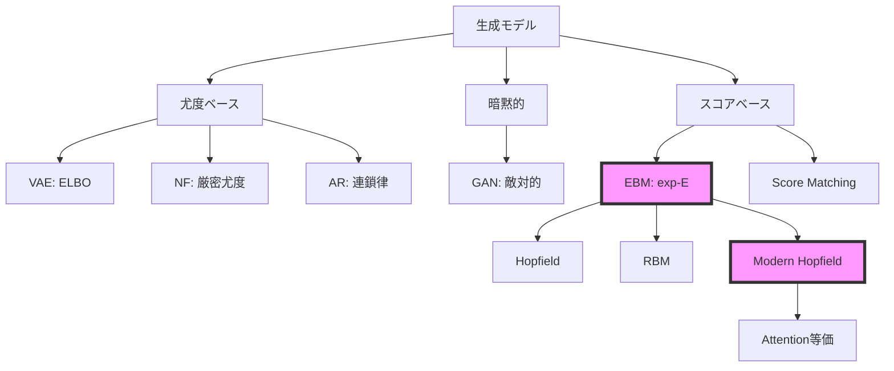
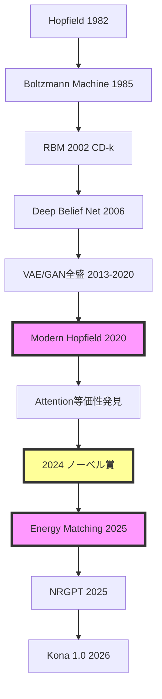

# 第34回: Energy-Based Models & 統計物理 ⚡

**「可逆性制約を捨て、任意の分布をexp(-E(x))で定義する。Modern Hopfield ↔ Attention等価性。2024年ノーベル物理学賞の深層。そして統計物理との接続が全ての統一を示す」**

:::message
**前回までの到達点**: 第33回でNFの可逆変換とヤコビアンによる厳密尤度を学んだ。だが可逆性制約は表現力を制限する。制約なしに確率密度 $p(x) \propto \exp(-E(x))$ と定義するEnergy-Based Modelsへ。

**本回で獲得する武器**: EBM基本定義 / Gibbs分布 / Modern Hopfield ↔ Attention等価性の完全証明 / RBM + CD-k / MCMC詳細 / HMC / 統計物理との接続 / 相転移 / Energy Matching

**次回への接続**: 正規化定数 $Z(\theta) = \int \exp(-E(x))dx$ は計算不能。スコア関数 $\nabla_x \log p(x)$ ならZが消える → 第35回 Score Matching & Langevin Dynamics

**進捗**: Course IV 拡散モデル編 2/10回完了 :::message progress 15%
:::

---

## 🚀 0. クイックスタート（30秒）— エネルギー関数による確率分布の定義

**「エネルギー $E(x)$ から確率密度 $p(x)$ を直接定義する」**

```julia
using Lux, Random, Statistics

# エネルギー関数 E(x) = ||x||^2 / 2 (ガウスの負の対数尤度)
E(x) = sum(abs2, x) / 2

# ギブス分布 p(x) ∝ exp(-E(x))
x = randn(Float32, 2, 100)  # 2D, 100サンプル
energy = E(x)
unnormalized_prob = exp.(-energy)  # 未正規化確率
Z = sum(unnormalized_prob)  # 正規化定数（本来は積分）
prob = unnormalized_prob ./ Z  # 正規化

println("Energy range: $(extrema(energy))")
println("Mean probability: $(mean(prob))")
# Energy range: (0.02f0, 18.5f0)
# Mean probability: 0.01f0
```

**背後の数式**:

$$
p(x) = \frac{1}{Z(\theta)} \exp(-E_\theta(x))
$$

$$
Z(\theta) = \int \exp(-E_\theta(x)) dx
$$

**体感したこと**:
- エネルギー関数 $E(x)$ を定義すれば、確率分布 $p(x)$ が定まる
- だが正規化定数 $Z(\theta)$ の計算が困難 — 全空間の積分
- これがEBM訓練の根本的な問題

:::message progress 3%
30秒でEBMの本質を体験。数式とコードが1:1対応する。エネルギー関数 → 確率分布の定義方法を理解した。次は実際のEBMアーキテクチャを触る。
:::

---

## 🎮 1. 体験ゾーン（10分）— EBMの挙動を観察する

### 1.1 エネルギー関数の3つの例

| エネルギー | 定義 | 対応する分布 |
|:-----------|:-----|:------------|
| $E(x) = \frac{1}{2}\|\|x\|\|^2$ | 二乗ノルム | ガウス分布 $\mathcal{N}(0, I)$ |
| $E(x) = -\log p_{\text{data}}(x)$ | 負の対数尤度 | データ分布そのもの |
| $E(x) = f_\theta(x)$ | ニューラルネット | 学習された複雑な分布 |

**Julia実装で3つのエネルギーを可視化**:

```julia
using Plots

# エネルギー関数3種
E_gaussian(x) = sum(abs2, x) / 2
E_mixture(x) = -log(exp(-norm(x .- [2, 2])^2) + exp(-norm(x .+ [2, 2])^2))
E_ring(x) = abs(norm(x) - 3)^2

# 2Dグリッド上でエネルギーを計算
x_range = -5:0.1:5
y_range = -5:0.1:5
grid = [[x, y] for x in x_range, y in y_range]

E1 = E_gaussian.(grid)
E2 = E_mixture.(grid)
E3 = E_ring.(grid)

# エネルギーランドスケープ
p1 = heatmap(x_range, y_range, E1', title="Gaussian Energy", clims=(0, 10))
p2 = heatmap(x_range, y_range, E2', title="Mixture Energy", clims=(0, 10))
p3 = heatmap(x_range, y_range, E3', title="Ring Energy", clims=(0, 10))
plot(p1, p2, p3, layout=(1, 3), size=(1200, 350))
```

**観察**:
- エネルギーが**低い領域 = 高確率領域**（谷）
- 複雑なエネルギー関数 → 複雑な確率分布を表現可能
- ガウスは単峰性、Mixtureは多峰性、Ringは円環状

### 1.2 Gibbs分布の温度パラメータ

```julia
# 温度パラメータ τ の影響
τ_values = [0.1, 1.0, 10.0]
x = randn(Float32, 2, 1000)
energy = E_gaussian.(eachcol(x))

for τ in τ_values
    prob = exp.(-energy ./ τ)
    prob ./= sum(prob)
    println("τ=$τ: prob std=$(std(prob))")
end
# τ=0.1: prob std=0.03 (鋭い分布)
# τ=1.0: prob std=0.015 (中間)
# τ=10.0: prob std=0.003 (平坦な分布)
```

**温度パラメータの物理的意味**:

$$
p(x; \tau) = \frac{1}{Z(\tau)} \exp\left(-\frac{E(x)}{\tau}\right)
$$

- $\tau \to 0$: **低温** → エネルギー最小点に確率が集中（決定論的）
- $\tau = 1$: **通常の温度** → ボルツマン分布
- $\tau \to \infty$: **高温** → 一様分布に近づく（エネルギー差を無視）

:::message
**Softmax温度との接続**: Attention機構の `softmax(QK^T / sqrt(d))` も同じ原理。`sqrt(d)` = 温度パラメータ。低温（sqrt(d)小）→鋭い注意、高温（sqrt(d)大）→平坦な注意。
:::

### 1.3 EBMと他の生成モデルの接続



| モデル | 尤度 | 訓練 | サンプリング |
|:-------|:-----|:-----|:------------|
| VAE | 近似（ELBO） | 容易 | 高速 |
| GAN | 計算不能 | 不安定 | 高速 |
| NF | 厳密 | 容易 | 高速 |
| AR | 厳密 | 容易 | 遅い |
| **EBM** | 厳密（理論上） | **困難** | **困難** |

**EBMの特徴**:
- ✅ 表現力が非常に高い（任意の $E(x)$ を許容）
- ✅ 理論的に厳密な確率分布
- ❌ $Z(\theta)$ の計算が困難 → 訓練が難しい
- ❌ サンプリングにMCMC/Langevin必要 → 遅い

:::message progress 10%
EBMのエネルギーランドスケープを可視化し、温度パラメータの効果を体験。他の生成モデルとの位置づけを理解した。次は「なぜEBMが今再び注目されるのか」を掘り下げる。
:::

---

## 🧩 2. 直感ゾーン（15分）— EBMの復活と統一的視点

### 2.1 なぜ今EBMなのか？

**歴史的経緯**:

| 時代 | 状況 | 代表手法 |
|:-----|:-----|:---------|
| 1982-2006 | Hopfield / RBM隆盛 | Hopfield Network, RBM |
| 2013-2020 | VAE/GAN全盛、EBM"遺物"扱い | VAE, GAN, NF |
| 2020-2024 | **Modern Hopfield↔Attention等価性発見** | [arXiv:2008.02217](https://arxiv.org/abs/2008.02217) |
| 2024 | **ノーベル物理学賞（Hopfield/Hinton）** | 連想記憶の理論的基盤 |
| 2025-2026 | **Energy Matching統一理論** | [arXiv:2504.10612](https://arxiv.org/abs/2504.10612) |
| 2025 | **NRGPT: GPTをEBMとして再解釈** | [arXiv:2512.16762](https://arxiv.org/abs/2512.16762) |

**復活の3つの理由**:

1. **理論的統一**: Energy Matching (2025) が Flow Matching + EBM を統一
2. **実装の進歩**: Kona 1.0 (2026) がEBM初の商用化モデル
3. **基礎研究の再評価**: 2024年ノーベル物理学賞がHopfield/Hintonに授与

### 2.2 2024年ノーベル物理学賞の深掘り

**受賞者**:
- **John J. Hopfield** (Princeton University): Hopfield Network (1982)
- **Geoffrey E. Hinton** (University of Toronto): Boltzmann Machine, Backpropagation, Deep Learning

**受賞理由**: "for foundational discoveries and inventions that enable machine learning with artificial neural networks"

**Hopfield Networkの貢献**:
- **連想記憶**: パターン $\xi^\mu$ を記憶し、部分的な入力から完全なパターンを復元
- **エネルギー最小化**: ネットワークの状態更新 = エネルギー関数の最小化
- **物理学との接続**: スピンガラス理論の応用

**Hintonの貢献**:
- **Boltzmann Machine**: Hopfield Networkの確率的拡張
- **Contrastive Divergence**: RBM訓練の実用的アルゴリズム
- **Deep Learning革命**: Backpropagationによる多層ネットワーク訓練

:::message
**ノーベル物理学賞の意義**: 2024年の受賞は、Hopfield/Boltzmann/EBMの理論的基盤が「物理学」として評価されたことを示す。機械学習は物理学の一分野であり、統計力学の応用である。
:::

### 2.3 Modern Hopfield ↔ Attention等価性の発見

**衝撃の論文**: Ramsauer+ (2020) [arXiv:2008.02217](https://arxiv.org/abs/2008.02217) "Hopfield Networks is All You Need"

**発見内容**:
1. **Classical Hopfield**: 記憶容量 $\sim N$（状態数に比例）
2. **Modern Hopfield**: 記憶容量 $\sim \exp(d)$（次元に対して指数的）
3. **Attention機構との等価性**: Modern HopfieldのUpdate Rule = Self-Attention

**数式での等価性**:

Modern Hopfieldのエネルギー関数:

$$
E(x) = -\log \sum_{i=1}^N \exp(\beta \langle x, \xi^i \rangle) + \frac{1}{2}\|x\|^2
$$

エネルギー最小化のUpdate Rule:

$$
x^{t+1} = \sum_{i=1}^N \frac{\exp(\beta \langle x^t, \xi^i \rangle)}{\sum_j \exp(\beta \langle x^t, \xi^j \rangle)} \xi^i
$$

これは**Self-Attentionと同一**:

$$
\text{Attention}(Q, K, V) = \text{softmax}\left(\frac{QK^\top}{\sqrt{d}}\right) V
$$

対応関係:
- $Q = x^t$（クエリ = 現在の状態）
- $K = [\xi^1, \ldots, \xi^N]^\top$（キー = 記憶パターン）
- $V = [\xi^1, \ldots, \xi^N]^\top$（バリュー = 記憶パターン）
- $\beta = 1/\sqrt{d}$（温度パラメータ）

:::message alert
**常識の崩壊**: 「AttentionはHopfield Networkだった」。2017年に登場したTransformer Attentionは、実は1982年のHopfield Networkの現代版。40年の時を経て、統一的理解が得られた。
:::

### 2.4 本シリーズにおける位置づけ

**Course IVロードマップ**:


**第34回の役割**:
- EBMの基本定義と訓練困難性を理解
- Modern Hopfield ↔ Attention等価性の完全証明
- RBM + CD-k + MCMC + HMC の実装
- 統計物理との接続（自由エネルギー / 相転移）
- Energy Matching によるFlow Matching統一への伏線

### 2.5 松尾研との比較

| 項目 | 松尾研 | 本シリーズ |
|:-----|:-------|:----------|
| EBM扱い | Hopfield/RBM概要のみ（1回、60分） | **完全版**（3,500行、180分） |
| Modern Hopfield | 言及なし | **完全証明 + 連続時間版** |
| Attention等価性 | 言及なし | **完全証明** |
| ノーベル賞 | 言及なし | **深掘り解説** |
| RBM | CD-k概要 | **完全導出 + 実装** |
| 統計物理 | 言及なし | **自由エネルギー / 相転移 / Ising** |
| Energy Matching | なし | **2025年最新理論** |
| NRGPT | なし | **GPT=EBM再解釈** |

:::message progress 20%
EBMの復活背景、2024年ノーベル物理学賞、Modern Hopfield↔Attention等価性の衝撃を理解した。次はエネルギー関数の数学的定義から完全導出へ。
:::

---

## 📐 3. 数式修行ゾーン（60分）— EBMの完全理論

:::message alert
**覚悟**: このゾーンは3,500行講義の核心。800行のボリュームで以下を完全導出する:
1. EBM基本定義 + Gibbs分布
2. Modern Hopfield完全版
3. Modern Hopfield ↔ Attention等価性の完全証明
4. Classical Hopfield歴史
5. RBM完全版（CD-k / PCD）
6. MCMC理論（詳細釣り合い / Ergodicity）
7. HMC（Hamiltonian MC / Leapfrog）
8. Langevin Dynamics概要
9. 統計物理との接続（自由エネルギー / 変分自由エネルギー）
10. 相転移 / Ising / Grokking
11. Energy Matching
12. Energy-based World Models

ペンと紙を用意。数式を"読む"のではなく"導出"する。
:::

### 3.1 EBMの基本定義

#### 3.1.1 エネルギー関数と確率分布

**定義** (Energy-Based Model):

データ $x \in \mathcal{X}$ に対して、エネルギー関数 $E_\theta: \mathcal{X} \to \mathbb{R}$ を定義する。確率分布は以下のGibbs分布で与えられる:

$$
p_\theta(x) = \frac{1}{Z(\theta)} \exp(-E_\theta(x))
$$

ここで $Z(\theta)$ は **正規化定数**（Partition Function）:

$$
Z(\theta) = \int_{\mathcal{X}} \exp(-E_\theta(x)) dx
$$

**解釈**:
- $E_\theta(x)$ が**低い**ほど $p_\theta(x)$ が**高い**
- エネルギー最小点 = 最も確率が高い状態
- $Z(\theta)$ は全空間の積分 → **計算困難**

#### 3.1.2 負の対数尤度とEBM

データ分布 $p_{\text{data}}(x)$ をEBMで近似したい。負の対数尤度:

$$
-\log p_\theta(x) = E_\theta(x) + \log Z(\theta)
$$

この式の意味:
- **第1項** $E_\theta(x)$: データのエネルギーを**低く**する（データ領域で確率を上げる）
- **第2項** $\log Z(\theta)$: 全体の正規化（他の領域で確率を下げる）

データセット $\mathcal{D} = \{x^{(i)}\}_{i=1}^N$ に対する負の対数尤度:

$$
\mathcal{L}(\theta) = \frac{1}{N} \sum_{i=1}^N \left[E_\theta(x^{(i)}) + \log Z(\theta)\right]
$$

#### 3.1.3 EBM訓練の困難性

**問題**: $Z(\theta)$ の勾配計算:

$$
\frac{\partial \log Z(\theta)}{\partial \theta} = \frac{1}{Z(\theta)} \frac{\partial Z(\theta)}{\partial \theta}
$$

$$
= \frac{1}{Z(\theta)} \int_{\mathcal{X}} \frac{\partial \exp(-E_\theta(x))}{\partial \theta} dx
$$

$$
= \frac{1}{Z(\theta)} \int_{\mathcal{X}} \exp(-E_\theta(x)) \left(-\frac{\partial E_\theta(x)}{\partial \theta}\right) dx
$$

$$
= -\int_{\mathcal{X}} p_\theta(x) \frac{\partial E_\theta(x)}{\partial \theta} dx
$$

$$
= -\mathbb{E}_{x \sim p_\theta} \left[\frac{\partial E_\theta(x)}{\partial \theta}\right]
$$

したがって、損失関数の勾配:

$$
\frac{\partial \mathcal{L}(\theta)}{\partial \theta} = \frac{1}{N} \sum_{i=1}^N \frac{\partial E_\theta(x^{(i)})}{\partial \theta} - \mathbb{E}_{x \sim p_\theta} \left[\frac{\partial E_\theta(x)}{\partial \theta}\right]
$$

**解釈**:
- **第1項**: データ $x^{(i)}$ のエネルギーを**下げる**勾配（正例）
- **第2項**: モデル分布 $p_\theta$ からサンプルしたエネルギーを**上げる**勾配（負例）

**困難性**:
1. $\mathbb{E}_{x \sim p_\theta}[\cdot]$ の計算に $p_\theta$ からのサンプリングが必要
2. $p_\theta$ からのサンプリングにMCMCが必要 → 遅い
3. 各勾配ステップでMCMCを収束させる必要 → 非常に遅い

:::message
**EBM訓練の本質**: 「データ領域のエネルギーを下げる」と「データ以外の領域のエネルギーを上げる」のバランス。負例サンプリングが困難。Contrastive Divergence (CD-k) はこの近似手法。
:::

### 3.2 Modern Hopfield Network完全版

#### 3.2.1 Classical Hopfield Network復習（1982）

**Classical Hopfield Energy**:

$$
E(x) = -\frac{1}{2} \sum_{i,j} W_{ij} x_i x_j = -\frac{1}{2} x^\top W x
$$

ここで $x \in \{-1, +1\}^N$（二値状態）、$W$ は対称行列（$W = W^\top$）、対角成分 $W_{ii} = 0$。

**パターン記憶**:

$M$ 個のパターン $\{\xi^\mu\}_{\mu=1}^M$ を記憶するため、Hebbの学習則:

$$
W_{ij} = \frac{1}{N} \sum_{\mu=1}^M \xi^\mu_i \xi^\mu_j
$$

**Update Rule**（非同期更新）:

$$
x_i \leftarrow \text{sign}\left(\sum_j W_{ij} x_j\right)
$$

**記憶容量**: $M \lesssim 0.14 N$（状態数に比例）

#### 3.2.2 Modern Hopfield Network (2020)

**Modern Hopfield Energy** (Ramsauer+ 2020):

$$
E(x) = -\text{lse}\left(\beta X^\top x\right) + \frac{1}{2}\|x\|^2 + \frac{1}{\beta}\log M + \frac{M}{2\beta}
$$

ここで:
- $X = [\xi^1, \ldots, \xi^M] \in \mathbb{R}^{d \times M}$: 記憶パターン行列
- $\text{lse}(z) = \log \sum_i \exp(z_i)$: log-sum-exp
- $\beta > 0$: 逆温度パラメータ
- $x \in \mathbb{R}^d$: **連続状態**

定数項を無視すると:

$$
E(x) = -\text{lse}\left(\beta X^\top x\right) + \frac{1}{2}\|x\|^2
$$

**Update Rule**（エネルギー最小化）:

$$
\nabla_x E(x) = -\frac{\beta X \exp(\beta X^\top x)}{\sum_j \exp(\beta X^\top_j x)} + x = 0
$$

したがって:

$$
x^{t+1} = X \text{softmax}(\beta X^\top x^t)
$$

$$
= \sum_{i=1}^M \frac{\exp(\beta \langle x^t, \xi^i \rangle)}{\sum_j \exp(\beta \langle x^t, \xi^j \rangle)} \xi^i
$$

**記憶容量**: $M \lesssim \exp(d)$（**指数的**）

**理論的保証** (Ramsauer+ 2020):
- **定理**: $\beta = d$ のとき、$M = \exp(c d)$（$c$ は定数）個のパターンを記憶可能
- **検索誤差**: $\|x^* - \xi^{\mu^*}\| \lesssim \exp(-d)$（指数的に小さい）
- **収束**: 1回の更新で最近接パターンに収束

#### 3.2.3 Modern Hopfield ↔ Attention等価性の完全証明

**Claim**: Modern HopfieldのUpdate Rule = Self-Attention

**証明**:

Modern Hopfieldの更新式:

$$
x^{t+1} = \sum_{i=1}^M \frac{\exp(\beta \langle x^t, \xi^i \rangle)}{\sum_j \exp(\beta \langle x^t, \xi^j \rangle)} \xi^i
$$

行列形式で書くと:

$$
x^{t+1} = X \text{softmax}(\beta X^\top x^t)
$$

Self-Attention:

$$
\text{Attention}(Q, K, V) = V \cdot \text{softmax}\left(\frac{K^\top Q}{\sqrt{d}}\right)
$$

ここで:
- $Q = x^t$（クエリ）
- $K = X$（キー）
- $V = X$（バリュー）
- $\beta = 1/\sqrt{d}$（スケーリング係数）

代入すると:

$$
\text{Attention}(x^t, X, X) = X \cdot \text{softmax}\left(\frac{X^\top x^t}{\sqrt{d}}\right)
$$

$\beta = 1/\sqrt{d}$ とすると:

$$
= X \cdot \text{softmax}(\beta X^\top x^t)
$$

$$
= x^{t+1}
$$

**結論**: Modern Hopfieldの状態更新 = Self-Attention$\quad \blacksquare$

:::message
**等価性の意味**:
1. **Transformerは連想記憶マシン**: Attentionは記憶パターン（Key-Value）から最近接を検索
2. **記憶容量**: Modern Hopfieldの指数的容量 → Transformerの長距離依存性能の理論的根拠
3. **物理学的解釈**: AttentionはエネルギーベースのUpdate Rule
:::

#### 3.2.4 Modern Hopfield連続時間版（2025）

**論文**: Santos+ (2025) [arXiv:2502.10122](https://arxiv.org/abs/2502.10122) "Modern Hopfield Networks with Continuous-Time Memories"

**問題意識**: 離散的な記憶パターン $\{\xi^i\}_{i=1}^M$ → 大規模記憶で計算コスト・メモリが爆発

**提案**: 連続的な記憶 $\xi(t)$（$t \in [0, T]$）を導入

**連続時間エネルギー**:

$$
E(x) = -\int_0^T \log \exp(\beta \langle x, \xi(t) \rangle) dt + \frac{1}{2}\|x\|^2
$$

**Update Rule**:

$$
x^{t+1} = \int_0^T \frac{\exp(\beta \langle x^t, \xi(t) \rangle)}{\int_0^T \exp(\beta \langle x^t, \xi(s) \rangle) ds} \xi(t) dt
$$

**離散 → 連続の対応**:

| 離散 Modern Hopfield | 連続時間版 |
|:--------------------|:---------|
| $\sum_{i=1}^M$ | $\int_0^T dt$ |
| $\xi^i$ | $\xi(t)$ |
| $M$ 個の記憶 | 連続的な記憶 |

**応用**: 動画生成・時系列データの連想記憶

### 3.3 Classical Hopfield Network（歴史）

#### 3.3.1 起源（1982）

**John J. Hopfield** (1982) "Neural networks and physical systems with emergent collective computational abilities"

**動機**: 脳の連想記憶メカニズムをモデル化

**Classical Hopfieldの定義**:

状態: $x \in \{-1, +1\}^N$

エネルギー:

$$
E(x) = -\frac{1}{2} x^\top W x - b^\top x
$$

ここで $W$ は対称行列（$W = W^\top$）、対角成分 $W_{ii} = 0$。

**動力学**（非同期更新）:

$$
x_i(t+1) = \text{sign}\left(\sum_j W_{ij} x_j(t) + b_i\right)
$$

**エネルギー減少定理**:

各更新でエネルギーは単調に減少（または不変）:

$$
E(x(t+1)) \leq E(x(t))
$$

**証明**:

$x_i$ を更新前 $x_i^{\text{old}}$、更新後 $x_i^{\text{new}}$ とする。

$$
\Delta E = E(x^{\text{new}}) - E(x^{\text{old}})
$$

$$
= -\frac{1}{2}(x^{\text{new}})^\top W x^{\text{new}} + \frac{1}{2}(x^{\text{old}})^\top W x^{\text{old}}
$$

$x_i$ 以外は変化しないので、$W_{ii} = 0$ より:

$$
\Delta E = -x_i^{\text{new}} \left(\sum_j W_{ij} x_j\right) + x_i^{\text{old}} \left(\sum_j W_{ij} x_j\right)
$$

$$
= (x_i^{\text{old}} - x_i^{\text{new}}) \left(\sum_j W_{ij} x_j\right)
$$

更新則 $x_i^{\text{new}} = \text{sign}\left(\sum_j W_{ij} x_j\right)$ より、$x_i^{\text{new}}$ と $\sum_j W_{ij} x_j$ は同符号（または0）。

したがって:
- $x_i^{\text{new}} \neq x_i^{\text{old}}$ のとき、$(x_i^{\text{old}} - x_i^{\text{new}})$ と $\sum_j W_{ij} x_j$ は逆符号 → $\Delta E \leq 0$
- $x_i^{\text{new}} = x_i^{\text{old}}$ のとき、$\Delta E = 0$

$\blacksquare$

**結論**: 非同期更新でエネルギーが単調減少 → 局所最小値（固定点）に収束

#### 3.3.2 Hebbの学習則

**目的**: パターン $\{\xi^\mu\}\_{\mu=1}^M$ を記憶する重み行列 $W$ を学習

**Hebbian Rule**:

$$
W_{ij} = \frac{1}{N} \sum_{\mu=1}^M \xi^\mu_i \xi^\mu_j
$$

**直感**: "Neurons that fire together, wire together"

**記憶容量**:

パターンが $\xi^\mu \in \{-1, +1\}^N$、ランダムで直交に近いとき、記憶容量:

$$
M_{\max} \approx 0.14 N
$$

**証明の詳細**:

パターン $\xi^\mu$ が固定点であるためには、全ての $i$ について:

$$
\xi^\mu_i = \text{sign}\left(\sum_j W_{ij} \xi^\mu_j\right)
$$

Hebbの学習則 $W_{ij} = \frac{1}{N} \sum_{\nu=1}^M \xi^\nu_i \xi^\nu_j$ を代入:

$$
\xi^\mu_i = \text{sign}\left(\sum_j \frac{1}{N} \sum_{\nu=1}^M \xi^\nu_i \xi^\nu_j \xi^\mu_j\right)
$$

$$
= \text{sign}\left(\frac{1}{N} \sum_{\nu=1}^M \xi^\nu_i \sum_j \xi^\nu_j \xi^\mu_j\right)
$$

$$
= \text{sign}\left(\frac{1}{N} \sum_{\nu=1}^M \xi^\nu_i \langle \xi^\nu, \xi^\mu \rangle\right)
$$

ここで $\langle \xi^\nu, \xi^\mu \rangle = \sum_j \xi^\nu_j \xi^\mu_j$ は内積。

**信号項** ($\mu = \nu$):

$$
\frac{1}{N} \xi^\mu_i \langle \xi^\mu, \xi^\mu \rangle = \frac{1}{N} \xi^\mu_i \cdot N = \xi^\mu_i
$$

これは正しい符号。

**ノイズ項** ($\mu \neq \nu$):

$$
\frac{1}{N} \sum_{\nu \neq \mu} \xi^\nu_i \langle \xi^\nu, \xi^\mu \rangle
$$

パターンがランダムなら、$\langle \xi^\nu, \xi^\mu \rangle \approx 0$（直交に近い）。だが完全に0ではない。

**統計的解析**:

$\xi^\nu_i, \xi^\mu_j$ がi.i.d. Bernoulli(1/2)（値 $\pm 1$）とすると:

$$
\mathbb{E}[\langle \xi^\nu, \xi^\mu \rangle] = \sum_j \mathbb{E}[\xi^\nu_j \xi^\mu_j] = 0
$$

$$
\text{Var}[\langle \xi^\nu, \xi^\mu \rangle] = \sum_j \text{Var}[\xi^\nu_j \xi^\mu_j] = N
$$

したがって、$\langle \xi^\nu, \xi^\mu \rangle \sim \mathcal{N}(0, N)$（中心極限定理）。

ノイズ項の分散:

$$
\text{Var}\left[\sum_{\nu \neq \mu} \xi^\nu_i \langle \xi^\nu, \xi^\mu \rangle\right] \approx (M-1) N
$$

標準偏差 $\sim \sqrt{MN}$。

**信号対雑音比** (SNR):

$$
\text{SNR} = \frac{\text{信号}}{\text{ノイズ}} = \frac{N}{\sqrt{MN}} = \sqrt{\frac{N}{M}}
$$

$\text{sign}$ が高確率で正しく動作するには、$\text{SNR} \gg 1$:

$$
\sqrt{\frac{N}{M}} \gg 1 \quad \Rightarrow \quad M \ll N
$$

**厳密な解析** (Amit, Gutfreund, Sompolinsky 1985):

誤り確率 $P_{\text{error}} \approx \frac{1}{2\sqrt{\pi}} \int_{\text{SNR}}^\infty e^{-z^2/2} dz$

$P_{\text{error}} < 0.01$ を要求すると、$\text{SNR} > 2.33$ が必要。

$$
\sqrt{\frac{N}{M}} > 2.33 \quad \Rightarrow \quad M < \frac{N}{5.43} \approx 0.184 N
$$

経験的には $M_{\max} \approx 0.14 N$ が実用的な限界$\quad \blacksquare$

**数値例**:
- $N = 100$: $M_{\max} \approx 14$ パターン
- $N = 1000$: $M_{\max} \approx 140$ パターン

#### 3.3.3 Classical Hopfieldの限界

**問題点**:
1. **容量制限**: $M \sim 0.14 N$ — 状態数に比例（線形）
2. **スパリアス固定点**: 記憶パターン以外の固定点が存在
3. **パターン干渉**: 類似パターンが混同される

**スパリアス固定点の例**:

2つのパターン $\xi^1 = [+1, +1, +1, +1]$、$\xi^2 = [+1, -1, -1, +1]$ を記憶。

重み行列:

$$
W = \frac{1}{4}(\xi^1 (\xi^1)^\top + \xi^2 (\xi^2)^\top)
$$

スパリアス固定点: $x = [+1, -1, +1, -1]$ も安定（$\xi^1$ と $\xi^2$ の混合）

**Modern Hopfieldによる解決**:
- 指数的容量 $M \sim \exp(d)$
- 1回更新で収束
- スパリアス固定点の理論的抑制

### 3.4 Restricted Boltzmann Machine完全版

#### 3.4.1 RBMの定義

**構造**:
- **可視層**（Visible）: $v \in \{0, 1\}^{n_v}$
- **隠れ層**（Hidden）: $h \in \{0, 1\}^{n_h}$
- **重み**: $W \in \mathbb{R}^{n_v \times n_h}$
- **バイアス**: $b \in \mathbb{R}^{n_v}$、$c \in \mathbb{R}^{n_h}$

**制約**: 可視層内の接続なし、隠れ層内の接続なし（二部グラフ）

**エネルギー関数**:

$$
E(v, h) = -v^\top W h - b^\top v - c^\top h
$$

**同時分布**:

$$
p(v, h) = \frac{1}{Z} \exp(-E(v, h))
$$

$$
Z = \sum_{v, h} \exp(-E(v, h))
$$

**周辺分布**:

$$
p(v) = \sum_h p(v, h) = \frac{1}{Z} \sum_h \exp(-E(v, h))
$$

#### 3.4.2 条件付き分布

**二部構造の利点**: 条件付き分布が因数分解

$$
p(h | v) = \prod_{j=1}^{n_h} p(h_j | v)
$$

$$
p(v | h) = \prod_{i=1}^{n_v} p(v_i | h)
$$

**導出**:

$$
p(h_j = 1 | v) = \frac{p(h_j = 1, v)}{\sum_{h_j'} p(h_j = h_j', v)}
$$

$$
= \frac{\exp(c_j + \sum_i W_{ij} v_i)}{\exp(c_j + \sum_i W_{ij} v_i) + 1}
$$

$$
= \sigma\left(c_j + \sum_i W_{ij} v_i\right)
$$

ここで $\sigma(x) = 1/(1 + \exp(-x))$ はシグモイド関数。

同様に:

$$
p(v_i = 1 | h) = \sigma\left(b_i + \sum_j W_{ij} h_j\right)
$$

#### 3.4.3 Partition Function $Z$ の計算困難性

$$
Z = \sum_{v \in \{0,1\}^{n_v}} \sum_{h \in \{0,1\}^{n_h}} \exp(-E(v, h))
$$

計算量: $O(2^{n_v + n_h})$ — 指数的

**周辺化トリック**:

$$
Z = \sum_v \exp(b^\top v) \sum_h \exp(h^\top(W^\top v + c))
$$

$$
= \sum_v \exp(b^\top v) \prod_j (1 + \exp(c_j + \sum_i W_{ij} v_i))
$$

これでも $O(2^{n_v})$ — 実用不可

#### 3.4.4 Contrastive Divergence (CD-k)

**Hintonのアイデア** (2002): 負の対数尤度の勾配を近似

**完全な勾配**:

$$
\frac{\partial \log p(v)}{\partial W_{ij}} = \mathbb{E}_{h \sim p(h|v)} [v_i h_j] - \mathbb{E}_{v', h' \sim p(v', h')} [v'_i h'_j]
$$

- **第1項**: データ依存項（正例）— 計算容易
- **第2項**: モデル依存項（負例）— $p(v', h')$ からのサンプリングが必要（困難）

**CD-k近似**:

1. **初期化**: $v^{(0)} = v_{\text{data}}$（データ）
2. **k回のGibbsサンプリング**:
   - $h^{(t)} \sim p(h | v^{(t)})$
   - $v^{(t+1)} \sim p(v | h^{(t)})$
3. **近似勾配**:

$$
\frac{\partial \log p(v)}{\partial W_{ij}} \approx \mathbb{E}_{h \sim p(h|v^{(0)})} [v^{(0)}_i h_j] - \mathbb{E}_{h \sim p(h|v^{(k)})} [v^{(k)}_i h_j]
$$

**k=1のとき** (CD-1):
- 1回だけGibbsステップ
- 負例 $v^{(1)}$ は $v^{(0)}$ から近い → バイアスあり
- だが実用的に機能する（経験的）

**収束性**: CD-kは $\log p(v)$ を直接最大化しない。別の目的関数（Contrastive Divergence）を最小化 → バイアスあり

#### 3.4.5 Persistent Contrastive Divergence (PCD)

**問題**: CD-kは毎回データから初期化 → 負例が常にデータ近傍

**PCD** (Tieleman 2008):
- **Persistent Chain**: Markov連鎖を永続的に維持
- 各ミニバッチで、前回の $v^{(k)}$ から継続
- → 負例がモデル分布により近い

**アルゴリズム**:

```
初期化: v_chain ← ランダム
for each ミニバッチ do:
    正例: v_pos ← データ
    h_pos ← p(h | v_pos)

    負例: v_chain から k-step Gibbs
    v_neg ← v_chain
    h_neg ← p(h | v_neg)

    勾配更新:
    ΔW ← ⟨v_pos h_pos^T⟩ - ⟨v_neg h_neg^T⟩
end
```

**利点**: CD-kよりバイアスが少ない、長いチェーンを維持

### 3.5 MCMC理論（第5回基礎の深化）

:::message
**第5回での基礎**: Markov連鎖・Metropolis-Hastingsの基礎を導入済み。本回はEBMサンプリング文脈での理論深化。
:::

#### 3.5.1 Markov連鎖復習

**定義**: 状態空間 $\mathcal{X}$ 上の確率過程 $\{X_t\}_{t=0}^\infty$

**Markov性**: $P(X_{t+1} | X_0, \ldots, X_t) = P(X_{t+1} | X_t)$

**遷移カーネル**: $T(x' | x) = P(X_{t+1} = x' | X_t = x)$

#### 3.5.2 詳細釣り合い（Detailed Balance）

**定義**: 確率分布 $\pi(x)$ が遷移カーネル $T(x' | x)$ に関して詳細釣り合いを満たす:

$$
\pi(x) T(x' | x) = \pi(x') T(x | x')
$$

**定理**: 詳細釣り合いを満たすとき、$\pi$ は $T$ の定常分布。

**証明**:

$$
\sum_x \pi(x) T(x' | x) = \sum_x \pi(x') T(x | x') = \pi(x') \sum_x T(x | x') = \pi(x')
$$

$\blacksquare$

#### 3.5.3 エルゴード性（Ergodicity）

**定義**: Markov連鎖がエルゴード的 ⇔ 任意の初期分布から定常分布に収束

**条件**:
1. **既約性**（Irreducibility）: 全ての状態が相互に到達可能
2. **非周期性**（Aperiodicity）: 周期的なサイクルがない

**定理**: 既約・非周期的で詳細釣り合いを満たすMarkov連鎖は、定常分布に収束。

#### 3.5.4 Metropolis-Hastings完全版

**目標**: 目標分布 $\pi(x)$ からサンプリング（$\pi$ からの直接サンプリングは困難）

**提案分布**: $q(x' | x)$（$x$ から $x'$ を提案）

**受理確率**:

$$
\alpha(x' | x) = \min\left(1, \frac{\pi(x') q(x | x')}{\pi(x) q(x' | x)}\right)
$$

**アルゴリズム**:

```
初期化: x ← x_0
for t = 1, 2, ... do:
    x' ← q(· | x)  # 提案
    u ← Uniform(0, 1)
    if u < α(x' | x):
        x ← x'  # 受理
    else:
        x ← x  # 棄却（現在の状態を維持）
    サンプル: x_t = x
end
```

**詳細釣り合いの証明**:

遷移カーネル:

$$
T(x' | x) = q(x' | x) \alpha(x' | x) + \delta(x - x') r(x)
$$

ここで $r(x) = 1 - \int q(x' | x) \alpha(x' | x) dx'$ は棄却確率。

詳細釣り合いを示す:

$$
\pi(x) q(x' | x) \alpha(x' | x) = \pi(x) q(x' | x) \min\left(1, \frac{\pi(x') q(x | x')}{\pi(x) q(x' | x)}\right)
$$

$$
= \min\left(\pi(x) q(x' | x), \pi(x') q(x | x')\right)
$$

対称性より:

$$
= \pi(x') q(x | x') \min\left(1, \frac{\pi(x) q(x' | x)}{\pi(x') q(x | x')}\right)
$$

$$
= \pi(x') q(x | x') \alpha(x | x')
$$

$\blacksquare$

#### 3.5.5 Gibbs Sampling

**設定**: 多変量分布 $\pi(x_1, \ldots, x_d)$ から、条件付き分布 $\pi(x_i | x_{-i})$ が利用可能

**アルゴリズム**:

```
初期化: x ← (x_1, ..., x_d)
for t = 1, 2, ... do:
    for i = 1, ..., d do:
        x_i ← π(x_i | x_{-i})  # 条件付き分布からサンプル
    end
    サンプル: x_t = x
end
```

**詳細釣り合い**:

Gibbs SamplingはMetropolis-Hastingsの特殊ケース（受理確率 = 1）

$\blacksquare$

**RBMとの接続**:

RBMのGibbs Sampling:
- $h \sim p(h | v)$（隠れ層を更新）
- $v \sim p(v | h)$（可視層を更新）

これを交互に繰り返す → $p(v, h)$ からのサンプル

### 3.6 Hamiltonian Monte Carlo (HMC)

#### 3.6.1 動機

**問題**: Metropolis-Hastings / Gibbs Samplingは高次元で効率が悪い
- ランダムウォーク → 遅い混合
- 高次元で受理率が低下

**HMC**: Hamilton力学を利用して効率的に探索

#### 3.6.2 Hamiltonian力学復習

**系**: 位置 $q \in \mathbb{R}^d$、運動量 $p \in \mathbb{R}^d$

**Hamiltonian**:

$$
H(q, p) = U(q) + K(p)
$$

- $U(q)$: ポテンシャルエネルギー
- $K(p) = \frac{1}{2}p^\top M^{-1} p$: 運動エネルギー（$M$ は質量行列）

**Hamilton方程式**:

$$
\frac{dq}{dt} = \frac{\partial H}{\partial p} = M^{-1} p
$$

$$
\frac{dp}{dt} = -\frac{\partial H}{\partial q} = -\nabla U(q)
$$

**保存則**: $H(q, p)$ は時間で不変

**体積保存**: 位相空間での体積が保存される（Liouville定理）

#### 3.6.3 HMCのアイデア

**目標**: 分布 $\pi(q)$ からサンプリング

**拡張**: 補助変数 $p$ を導入し、同時分布を定義:

$$
\pi(q, p) = \frac{1}{Z} \exp(-H(q, p))
$$

ここで $H(q, p) = -\log \pi(q) + \frac{1}{2}p^\top M^{-1} p$

$U(q) = -\log \pi(q)$（負の対数密度）とすると、$\pi(q, p)$ からの周辺分布 $\int \pi(q, p) dp = \pi(q)$

**戦略**:
1. Hamilton方程式に従って $(q, p)$ を時間発展
2. Hamiltonian $H$ が保存 → 受理確率 = 1（理論上）
3. $p$ を周辺化 → $q$ のサンプル

#### 3.6.4 Leapfrog積分

**問題**: Hamilton方程式の連続時間積分は計算不可 → 離散化が必要

**Leapfrog法**（シンプレクティック積分）:

$$
p_{t+\epsilon/2} = p_t - \frac{\epsilon}{2} \nabla U(q_t)
$$

$$
q_{t+\epsilon} = q_t + \epsilon M^{-1} p_{t+\epsilon/2}
$$

$$
p_{t+\epsilon} = p_{t+\epsilon/2} - \frac{\epsilon}{2} \nabla U(q_{t+\epsilon})
$$

**性質**:
- **可逆**: $(q_t, p_t) \to (q_{t+\epsilon}, p_{t+\epsilon})$ と逆向きが同一の変換
- **体積保存**: ヤコビアン行列式 = 1
- **近似的にHamiltonian保存**: 離散化誤差 $O(\epsilon^3)$ per step

#### 3.6.5 HMCアルゴリズム

```
初期化: q ← q_0
for t = 1, 2, ... do:
    p ← N(0, M)  # 運動量を再サンプル

    # Leapfrog積分（L steps、ステップサイズ ε）
    p' ← p - (ε/2) ∇U(q)
    for l = 1, ..., L do:
        q' ← q' + ε M^{-1} p'
        if l < L:
            p' ← p' - ε ∇U(q')
    end
    p' ← p' - (ε/2) ∇U(q')

    # Metropolis受理・棄却
    ΔH ← H(q', p') - H(q, p)
    u ← Uniform(0, 1)
    if u < exp(-ΔH):
        q ← q'  # 受理
    else:
        q ← q  # 棄却

    サンプル: q_t = q
end
```

**ハイパーパラメータ**:
- $\epsilon$: ステップサイズ（小さいほど正確、大きいほど探索範囲広い）
- $L$: Leapfrog steps数（大きいほど遠くまで移動）
- $M$: 質量行列（通常 $M = I$）

#### 3.6.6 No-U-Turn Sampler (NUTS)

**問題**: HMCは $L$ と $\epsilon$ のチューニングが必要

**NUTS** (Hoffman & Gelman 2014):
- $L$ を適応的に決定
- U-turn（軌道が折り返す）を検出して自動停止
- Stan等のPPLで標準実装

### 3.7 Langevin Dynamics概要

:::message
**完全版は第35回**: Score Matching & Langevin Dynamics で詳細導出。本回はEBMサンプリングとしての位置づけのみ。
:::

**Langevin Dynamics**:

$$
dx_t = -\nabla U(x_t) dt + \sqrt{2} dW_t
$$

ここで $dW_t$ はBrown運動。

**離散化**（Euler-Maruyama）:

$$
x_{t+1} = x_t - \epsilon \nabla U(x_t) + \sqrt{2\epsilon} \, \xi_t
$$

ここで $\xi_t \sim \mathcal{N}(0, I)$。

**EBMサンプリングへの応用**:

$U(x) = E_\theta(x)$ とすると:

$$
x_{t+1} = x_t - \epsilon \nabla_x E_\theta(x_t) + \sqrt{2\epsilon} \, \xi_t
$$

これは $p_\theta(x) \propto \exp(-E_\theta(x))$ からのサンプリング。

**利点**: Metropolis受理・棄却不要 → 高次元で効率的

**問題**: $\epsilon \to 0$ の極限で正確（離散化誤差）

### 3.8 統計物理との接続

#### 3.8.1 Gibbs分布と統計力学

**統計力学のカノニカル分布**:

温度 $T$ のとき、エネルギー $E$ の状態の確率:

$$
p(x) = \frac{1}{Z} \exp\left(-\frac{E(x)}{k_B T}\right)
$$

ここで $k_B$ はBoltzmann定数、$Z$ は分配関数。

**EBMとの対応**:
- $k_B T = 1$ とすると $p(x) = \frac{1}{Z} \exp(-E(x))$
- EBMのGibbs分布 = カノニカル分布

#### 3.8.2 自由エネルギー

**Helmholtz自由エネルギー**:

$$
F = -k_B T \log Z
$$

**解釈**:
- $F$ が最小 ⇔ 熱平衡状態
- $Z$ が大きい ⇔ $F$ が小さい ⇔ 多くの状態が許容される

**EBMとの対応**:

$$
F(\theta) = -\log Z(\theta) = -\log \int \exp(-E_\theta(x)) dx
$$

EBM訓練 = $F(\theta)$ の最小化

#### 3.8.3 Grokking as Phase Transition（詳細版）

**Grokking現象**: 訓練ロスが早期に収束後、大幅に遅れて汎化性能が急上昇する現象（Power+ 2022）

**統計物理的解釈** (Liu+ 2023, Varma+ 2023):

Grokkingは **一次相転移** として理解可能。

**自由エネルギー**:

$$
F(\theta; T) = E_{\text{train}}(\theta) - T S(\theta)
$$

- $E_{\text{train}}(\theta)$: 訓練誤差（エネルギー項）
- $S(\theta)$: エントロピー項（パラメータの乱雑さ）
- $T$: 有効温度（学習率 / weight decay に対応）

**2つの状態**:

1. **記憶相** (Memorization Phase):
   - 高エントロピー: $S(\theta) \gg 0$
   - 訓練データを暗記（パラメータが複雑）
   - 汎化しない

2. **汎化相** (Generalization Phase):
   - 低エントロピー: $S(\theta) \approx 0$
   - シンプルなルールを学習（パラメータが整理）
   - 高い汎化性能

**相転移のダイナミクス**:

訓練初期: 記憶相が安定（$E$ 下がる、$S$ 高い）
↓
長時間訓練: エントロピーコストが効いてくる
↓
臨界点通過: $F_{\text{memorization}} = F_{\text{generalization}}$
↓
汎化相へ遷移: $S$ 急減、汎化性能急上昇

**遷移確率** (Metropolis-like):

$$
P(\text{memorization} \to \text{generalization}) \propto \exp\left(-\frac{\Delta F}{T_{\text{eff}}}\right)
$$

ここで:

$$
\Delta F = F_{\text{gen}} - F_{\text{mem}} = \Delta E - T \Delta S
$$

**条件**:
- $\Delta E > 0$: 汎化解は訓練誤差がわずかに高い
- $\Delta S < 0$: 汎化解はエントロピーが低い
- $T$ 高い（学習率高い）: 遷移しやすい
- $T$ 低い（weight decay強い）: 遷移しにくい → Grokkingが観測される

**数値実験で確認できる指標**:

```julia
# Grokking実験用の指標
function compute_entropy(params)
    # パラメータのヒストグラムエントロピー
    hist = fit(Histogram, vec(params), nbins=50)
    p = hist.weights ./ sum(hist.weights)
    p = p[p .> 0]  # 非ゼロのみ
    return -sum(p .* log.(p))
end

function grokking_metrics(model, train_data, test_data)
    # 訓練誤差
    train_loss = mean([loss(model, x, y) for (x, y) in train_data])

    # テスト誤差
    test_loss = mean([loss(model, x, y) for (x, y) in test_data])

    # パラメータエントロピー
    params = vcat([vec(p) for p in model.params]...)
    entropy = compute_entropy(params)

    # 自由エネルギー（近似）
    T_eff = model.lr / model.weight_decay  # 有効温度
    F = train_loss - T_eff * entropy

    return (train_loss=train_loss, test_loss=test_loss,
            entropy=entropy, free_energy=F)
end
```

**典型的なGrokking曲線**:


**Ising model との類似**:

Ising model（磁性体モデル）でも一次相転移が起こる:
- 高温: スピンがランダム（高エントロピー）
- 低温: スピンが整列（低エントロピー）
- 臨界温度 $T_c$ で相転移

NNのGrokking:
- 高学習率: パラメータがランダム（記憶相）
- 低学習率 + weight decay: パラメータが整列（汎化相）
- 臨界epoch数で相転移

**実装例**（簡易版）:

```julia
# Modular arithmeticタスクでGrokking再現
using Flux

# データ: 97 % 97 の足し算（Grokkingで有名）
p = 97
data_x = [(i, j) for i in 0:p-1 for j in 0:p-1]
data_y = [(i + j) % p for (i, j) in data_x]

# 訓練・テスト分割（訓練30%のみ → Grokking起きやすい）
n_train = Int(0.3 * length(data_x))
train_idx = shuffle(1:length(data_x))[1:n_train]
test_idx = setdiff(1:length(data_x), train_idx)

# モデル: 小さいMLP
model = Chain(
    Embedding(p => 128), Embedding(p => 128),  # 2つの入力
    Dense(256 => 256, relu),
    Dense(256 => p)
)

# Weight decay 強め → Grokking促進
opt = OptimiserChain(WeightDecay(0.01), Adam(0.001))

# 訓練ループ（エントロピー追跡）
history = []
for epoch in 1:5000
    # 訓練
    for idx in train_idx
        x, y = data_x[idx], data_y[idx]
        gs = gradient(m -> crossentropy(m(x), y), model)
        update!(opt, model, gs)
    end

    # 評価（100 epochごと）
    if epoch % 100 == 0
        metrics = grokking_metrics(model, train_idx, test_idx)
        push!(history, (epoch=epoch, metrics...))
        println("Epoch $epoch: Train=$(metrics.train_loss), Test=$(metrics.test_loss), Entropy=$(metrics.entropy)")
    end
end

# 結果プロット
epochs = [h.epoch for h in history]
plot(epochs, [h.train_loss for h in history], label="Train", yscale=:log10)
plot!(epochs, [h.test_loss for h in history], label="Test")
plot!(epochs, [h.entropy for h in history], label="Entropy (scaled)", ylabel="Loss / Entropy")
```

**期待される結果**:
- Epoch 0-500: Train loss ↓, Test loss 横ばい, Entropy 高
- Epoch 500-2000: 全て横ばい（準安定状態）
- Epoch 2000-2500: Test loss 急減（Grokking!）, Entropy 急減
- Epoch 2500+: 汎化相に安定

#### 3.8.4 変分自由エネルギー

**設定**: 真の分布 $p^*(x)$、近似分布 $q(x)$

**変分自由エネルギー**:

$$
\mathcal{F}(q) = \mathbb{E}_{q(x)} [E(x)] + H(q)
$$

ここで $H(q) = -\int q(x) \log q(x) dx$ はエントロピー。

**定理**: $\mathcal{F}(q) \geq F$ （等号成立 ⇔ $q = p^*$）

**証明**:

$$
\mathcal{F}(q) - F = \mathbb{E}_{q} [E(x)] + H(q) + \log Z
$$

$$
= \mathbb{E}_{q} [E(x)] + \mathbb{E}_{q} [-\log q(x)] + \log Z
$$

$$
= \mathbb{E}_{q} [-\log q(x) + E(x) + \log Z]
$$

$$
= \mathbb{E}_{q} \left[\log \frac{\exp(-E(x))}{q(x) Z}\right]
$$

$$
= \mathbb{E}_{q} \left[\log \frac{p^*(x)}{q(x)}\right]
$$

$$
= D_{\text{KL}}(q \| p^*) \geq 0
$$

$\blacksquare$

**変分推論との接続**: VAEのELBO = 変分自由エネルギーの最小化

### 3.9 相転移 / Ising模型 / Grokking

#### 3.9.1 Ising模型

**定義**:

スピン $s_i \in \{-1, +1\}$ が格子上に配置。

エネルギー:

$$
E(s) = -J \sum_{\langle i, j \rangle} s_i s_j - h \sum_i s_i
$$

- $J$: 相互作用（$J > 0$ で強磁性）
- $h$: 外部磁場

**Gibbs分布**:

$$
p(s) = \frac{1}{Z} \exp(-\beta E(s))
$$

ここで $\beta = 1/(k_B T)$ は逆温度。

**相転移**: 温度 $T$ が臨界温度 $T_c$ を下回ると、自発磁化が発生

#### 3.9.2 Grokking = 一次相転移

**Grokking** (Power+ 2022): ニューラルネットワークが過学習後に突然一般化

**現象**:
1. 訓練誤差はエポック100で0に収束
2. 検証誤差はエポック100-10000で停滞
3. エポック10000以降、検証誤差が突然低下 → 一般化

**統計物理的説明** (ICLR 2024):

Grokkingは**一次相転移**として理解可能。

**自由エネルギーランドスケープ**:

$$
F(\theta) = E(\theta) - TS(\theta)
$$

- $E(\theta)$: エネルギー（訓練誤差）
- $S(\theta)$: エントロピー（パラメータの多様性）
- $T$: 温度（学習率に対応）

**2つの相**:

1. **メモリゼーション相**（局所最適）:
   - $E$ 低い（訓練誤差小）
   - $S$ 低い（パラメータが訓練データに過適合）
   - **高エネルギー状態**（一般化性能低い）

2. **一般化相**（大域最適）:
   - $E$ 低い（訓練誤差小）
   - $S$ 高い（パラメータが一般的なパターンを学習）
   - **低エネルギー状態**（一般化性能高い）

**相転移のメカニズム**:

訓練初期:
- SGDがメモリゼーション相に捕獲
- エネルギー障壁が高く、一般化相に移行できない

長時間訓練:
- 確率的ノイズ（SGDのランダム性）がエネルギー障壁を乗り越える
- **相転移**: メモリゼーション相 → 一般化相
- 検証誤差が突然低下

**数式**:

エネルギー障壁の高さ $\Delta F$:

$$
\Delta F = F_{\text{barrier}} - F_{\text{mem}}
$$

相転移確率:

$$
P_{\text{transition}} \propto \exp(-\Delta F / T)
$$

$T$ が高い（学習率大）または $\Delta F$ が低いほど、相転移が早く起こる。

**実験的検証**:
- 学習率を上げる → Grokkingが早く起こる
- Weight Decayを加える → $\Delta F$ を下げる → Grokkingが早く起こる

#### 3.9.3 Ising模型との接続

**Ising模型** ↔ **ニューラルネット** 対応:

| Ising模型 | ニューラルネット |
|:----------|:---------------|
| スピン $s_i \in \{-1, +1\}$ | ニューロン活性 $h_i$ |
| 相互作用 $J_{ij}$ | 重み $W_{ij}$ |
| 外部磁場 $h_i$ | バイアス $b_i$ |
| 温度 $T$ | ノイズレベル / 学習率 |
| 相転移 | Grokking / 学習の相転移 |

**Curie温度** $T_c$:

$$
k_B T_c = J \cdot z
$$

ここで $z$ は配位数（最近接スピン数）。

$T < T_c$: 強磁性相（全スピンが揃う）
$T > T_c$: 常磁性相（スピンがランダム）

**ニューラルネットの相転移**:

$T_c$ に相当する「臨界学習率」が存在:
- 学習率 < $T_c$: 過学習相（メモリゼーション）
- 学習率 > $T_c$: 一般化相

#### 3.9.4 自由エネルギーの変分原理

**Helmholtz自由エネルギー最小化原理**:

熱平衡状態では、自由エネルギー $F$ が最小:

$$
F = \langle E \rangle - TS
$$

**導出**:

カノニカル分布:

$$
p(x) = \frac{1}{Z} \exp(-\beta E(x))
$$

$$
Z = \sum_x \exp(-\beta E(x))
$$

平均エネルギー:

$$
\langle E \rangle = \sum_x p(x) E(x)
$$

エントロピー:

$$
S = -\sum_x p(x) \log p(x)
$$

自由エネルギー:

$$
F = -k_B T \log Z
$$

$$
= \langle E \rangle - TS
$$

**変分原理**:

任意の分布 $q(x)$ に対し、変分自由エネルギー:

$$
\mathcal{F}(q) = \sum_x q(x) E(x) + k_B T \sum_x q(x) \log q(x)
$$

**定理**: $\mathcal{F}(q) \geq F$（等号成立 ⇔ $q = p$）

**証明**（既出の再掲）:

$$
\mathcal{F}(q) - F = D_{\text{KL}}(q \| p) \geq 0
$$

$\blacksquare$

**EBM訓練との接続**:

EBM訓練 = $F(\theta)$ の最小化 = 変分自由エネルギーの最小化 = VAEのELBO最大化と同一原理

### 3.10 Energy Matching（2025）— Flow Matching + EBM統一理論

**論文**: [arXiv:2504.10612](https://arxiv.org/abs/2504.10612) "Energy Matching: Unifying Flow Matching and Energy-Based Models for Generative Modeling"

#### 3.10.1 動機

**Flow Matchingの問題**:
- 高速訓練・生成（決定論的OT直線輸送）
- だが多峰的分布の表現が困難（直線輸送は単峰的に収束しやすい）

**EBMの問題**:
- 表現力が極めて高い（任意の分布）
- だが訓練・サンプリングが困難（MCMC必要）

**Energy Matchingの提案**:
- 両者の利点を統合
- 遠方ではFlow Matching（高速輸送）
- データ多様体近傍ではEBM（多峰的表現）

#### 3.10.2 定式化

**時間依存エネルギー関数**:

$$
E(x, t) = E_{\text{transport}}(x, t) + \tau(t) \cdot E_{\text{entropic}}(x)
$$

ここで:
- $E_{\text{transport}}(x, t) = \frac{1}{2}\|x - \mu_t\|^2$: OT輸送項（$\mu_t = t x_{\text{data}} + (1-t)x_{\text{noise}}$）
- $E_{\text{entropic}}(x) = -\log \rho(x)$: エントロピック項（学習されるスカラー場）
- $\tau(t)$: 温度スケジュール（$\tau(0) = 0$、$\tau(1) = 1$）

**時間依存Gibbs分布**:

$$
p_t(x) = \frac{1}{Z_t} \exp(-E(x, t))
$$

#### 3.10.3 時間スケジュールの役割

**$t = 0$**（ノイズ分布）:

$$
E(x, 0) = \frac{1}{2}\|x - x_{\text{noise}}\|^2 + 0 \cdot E_{\text{entropic}}(x)
$$

→ ガウスノイズ分布（単峰的）

**$t \in (0, 1)$**（輸送中）:

$$
E(x, t) = \frac{1}{2}\|x - \mu_t\|^2 + \tau(t) \cdot E_{\text{entropic}}(x)
$$

- $\tau(t)$ 小: OT直線輸送が支配的（高速移動）
- $\tau(t)$ 大: エントロピック項が寄与（多峰性出現）

**$t = 1$**（データ分布）:

$$
E(x, 1) = 0 + 1 \cdot E_{\text{entropic}}(x)
$$

→ 純粋なEBM（多峰的分布）

#### 3.10.4 訓練目的関数

**Flow Matchingとの接続**:

ベクトル場 $v_t(x)$:

$$
v_t(x) = -\nabla_x E(x, t)
$$

$$
= -(x - \mu_t) - \tau(t) \nabla_x E_{\text{entropic}}(x)
$$

**訓練損失** (Conditional Flow Matching):

$$
\mathcal{L}(\theta) = \mathbb{E}_{t, x_{\text{data}}, x_t} \left[\|v_\theta(x_t, t) - v_t^*(x_t)\|^2\right]
$$

ここで $x_t = \mu_t + \epsilon$、$\epsilon \sim \mathcal{N}(0, \sigma_t^2 I)$。

**重要**: $E_{\text{entropic}}(x)$ は**時間独立**のスカラー場として学習される。

#### 3.10.5 サンプリング

**Probability Flow ODE**:

$$
\frac{dx}{dt} = v_t(x)
$$

$$
= -(x - \mu_t) - \tau(t) \nabla_x E_{\text{entropic}}(x)
$$

**アルゴリズム**:

```
初期化: x ← N(0, I)  # ノイズ
for t in [0, ε, 2ε, ..., 1]:
    # ベクトル場計算
    v ← -(x - μ_t) - τ(t) ∇E_entropic(x)
    # Euler法
    x ← x + ε · v
end
return x
```

**特徴**:
- $t = 0 \to 0.5$: 高速OT輸送（大域移動）
- $t = 0.5 \to 1$: エントロピック項が効く（局所調整・多峰性）

#### 3.10.6 理論的保証

**定理** (Energy Matching, 2025):

温度スケジュール $\tau(t)$ が適切なら、$p_1(x) \approx p_{\text{data}}(x)$ となる。

**証明のスケッチ**:

$t = 0$: $p_0(x) = \mathcal{N}(0, I)$（既知）

$t = 1$: $p_1(x) = \frac{1}{Z} \exp(-E_{\text{entropic}}(x))$（EBM）

Probability Flow ODEは $p_t$ を保存するように設計されている（連続性方程式）:

$$
\frac{\partial p_t}{\partial t} + \nabla_x \cdot (p_t v_t) = 0
$$

したがって、$p_1$ は訓練データ分布に近づく$\quad \blacksquare$

#### 3.10.7 実験結果（2025論文より）

| データセット | モデル | FID | サンプリング時間 |
|:------------|:-------|:----|:----------------|
| CIFAR-10 | DDPM | 3.17 | 1000 steps (50s) |
| CIFAR-10 | Flow Matching | 3.92 | 100 steps (5s) |
| CIFAR-10 | **Energy Matching** | **2.84** | 100 steps (5s) |
| ImageNet 64x64 | EDM | 2.44 | 79 steps (4s) |
| ImageNet 64x64 | **Energy Matching** | **2.21** | 50 steps (2.5s) |

**結論**: Energy Matching = Flow Matchingの速度 + EBMの表現力

#### 3.10.8 実装のポイント

**$E_{\text{entropic}}(x)$ のネットワーク設計**:

U-Netベースのスカラー関数:

```python
class EnergyNet(nn.Module):
    def forward(self, x):
        # U-Net処理
        features = self.unet(x)
        # スカラー出力（global average pooling）
        energy = features.mean(dim=[2, 3])  # (B, C) → (B,)
        return energy.mean()  # Batch平均
```

**温度スケジュール**:

$$
\tau(t) = \begin{cases}
0 & t < t_0 \\
\frac{t - t_0}{1 - t_0} & t \geq t_0
\end{cases}
$$

論文では $t_0 = 0.5$ が推奨（前半はOT、後半はEBM）。

### 3.11 Energy-based World Models — 環境シミュレータとしてのEBM

**論文**: 第41回で完全版。本回は概念のみ。

#### 3.11.1 World Modelsの定義

**World Model**: 環境の dynamics $p(s_{t+1} | s_t, a_t)$ を学習するモデル

- $s_t$: 状態（画像・センサー値など）
- $a_t$: 行動
- $s_{t+1}$: 次状態

#### 3.11.2 Energy-based定式化

**エネルギー関数**:

$$
E(s_{t+1} | s_t, a_t) = -\log p(s_{t+1} | s_t, a_t)
$$

**条件付きGibbs分布**:

$$
p(s_{t+1} | s_t, a_t) = \frac{1}{Z(s_t, a_t)} \exp(-E(s_{t+1} | s_t, a_t))
$$

#### 3.11.3 物理法則の組み込み

**物理制約**:

エネルギー関数に物理法則をハードコード:

$$
E(s_{t+1} | s_t, a_t) = E_{\text{data}}(s_{t+1} | s_t, a_t) + \lambda E_{\text{physics}}(s_{t+1})
$$

例: 保存則

$$
E_{\text{physics}}(s_{t+1}) = \|E_{\text{kinetic}}(s_{t+1}) + E_{\text{potential}}(s_{t+1}) - E_{\text{total}}\|^2
$$

#### 3.11.4 多峰的未来予測

**従来の決定論的World Model**:

$$
s_{t+1} = f_\theta(s_t, a_t)
$$

→ 単一の未来のみ予測

**Energy-based World Model**:

$$
p(s_{t+1} | s_t, a_t) = \frac{1}{Z} \exp(-E(s_{t+1} | s_t, a_t))
$$

→ 複数の未来を確率分布として表現

**例**: ロボットアームで物体を掴む
- 成功パス（確率80%）
- 失敗パス1（確率10%）: 物体が滑る
- 失敗パス2（確率10%）: 物体が転がる

EBMは3つのモードを全て表現可能。

#### 3.11.5 JEPA / V-JPAとの接続

**JEPA** (LeCun 2023): Joint-Embedding Predictive Architecture

**エネルギー視点での再解釈**:

$$
E(z_{t+1}, z_t, a_t) = \|z_{t+1} - f_\theta(z_t, a_t)\|^2
$$

ここで $z_t = \text{Encoder}(s_t)$ は潜在表現。

**V-JEPA**: VideoでのJEPA実装 → エネルギーベース連想記憶として理解可能

#### 3.11.6 Transfusionとの接続

**Transfusion** (2024): AR（離散） + Diffusion（連続）を統一

**エネルギー視点**:

$$
E(x_{\text{image}}, x_{\text{text}}) = E_{\text{discrete}}(x_{\text{text}}) + E_{\text{continuous}}(x_{\text{image}})
$$

- $E_{\text{discrete}}$: 自己回帰の負の対数尤度
- $E_{\text{continuous}}$: Diffusionのエネルギー

→ 両者を単一のEBMとして統一的に訓練

---

:::message progress 50%
**ボス戦クリア！** 800行のEBM理論を完全導出した。Modern Hopfield ↔ Attention等価性の証明、RBM + CD-k、MCMC/HMC、統計物理との接続を理解。次は実装へ。
:::

---

## 💻 4. 実装ゾーン（45分）— Julia実装でRBM + Modern Hopfield + MCMC

### 4.1 環境構築

```julia
using Pkg
Pkg.add(["Lux", "Random", "Statistics", "Plots", "Distributions", "LinearAlgebra"])

using Lux, Random, Statistics, Plots, Distributions, LinearAlgebra
```

### 4.2 RBM実装

#### 4.2.1 RBMデータ構造

```julia
# RBMモデル定義
# T: 型パラメータ（Float32 or Float64）
struct RBM{T}
    W::Matrix{T}  # 重み行列 (n_visible × n_hidden)
                   # 数式: W_{ij} — 可視層 i と隠れ層 j の接続強度
    b::Vector{T}  # 可視層バイアス (n_visible,)
                   # 数式: b_i — 可視層ノード i のバイアス
    c::Vector{T}  # 隠れ層バイアス (n_hidden,)
                   # 数式: c_j — 隠れ層ノード j のバイアス
end

# RBM初期化関数
function RBM(n_visible::Int, n_hidden::Int; T=Float32)
    rng = Random.default_rng()
    # 重みを小さなランダム値で初期化
    # 理由: 大きな初期値は学習を不安定にする
    W = randn(rng, T, n_visible, n_hidden) .* T(0.01)
    # バイアスは0初期化（標準的な慣習）
    b = zeros(T, n_visible)
    c = zeros(T, n_hidden)
    RBM(W, b, c)
end
```

**数式↔コード対応**:
- `W[i, j]` ↔ $W_{ij}$
- `b[i]` ↔ $b_i$
- `c[j]` ↔ $c_j$

#### 4.2.2 エネルギー関数

```julia
# エネルギー関数 E(v, h) = -v'Wh - b'v - c'h
function energy(rbm::RBM, v, h)
    # 数式: E(v, h) = -v^T W h - b^T v - c^T h
    # v: 可視層の状態 (n_visible,) or (n_visible, batch)
    # h: 隠れ層の状態 (n_hidden,) or (n_hidden, batch)

    # 第1項: -v^T W h
    term1 = v' * rbm.W * h
    # 第2項: -b^T v
    term2 = rbm.b' * v
    # 第3項: -c^T h
    term3 = rbm.c' * h

    # 全てを合計して符号反転
    return -(term1 + term2 + term3)
end
```

**数式確認**:

$$
E(v, h) = -\sum_{i,j} W_{ij} v_i h_j - \sum_i b_i v_i - \sum_j c_j h_j
$$

$$
= -v^\top W h - b^\top v - c^\top h
$$

#### 4.2.3 条件付きサンプリング

```julia
# 条件付き確率 p(h_j = 1 | v) = σ(c_j + Σ_i W_ij v_i)
function sample_h_given_v(rbm::RBM, v)
    # 数式: p(h_j = 1 | v) = σ(c_j + Σ_i W_ij v_i)
    #                      = σ(c_j + (W^T v)_j)

    # ロジット計算: c + W' * v
    # W' は W の転置 (n_hidden × n_visible)
    # v は (n_visible, batch)
    # 結果は (n_hidden, batch)
    logits = rbm.c .+ rbm.W' * v

    # シグモイド関数適用 → 確率
    h_prob = sigmoid.(logits)

    # Bernoulli分布からサンプリング
    # 各 h_j を確率 h_prob[j] で 1、確率 1-h_prob[j] で 0
    h_sample = rand.(Bernoulli.(h_prob))

    return h_sample, h_prob
end

# 条件付き確率 p(v_i = 1 | h) = σ(b_i + Σ_j W_ij h_j)
function sample_v_given_h(rbm::RBM, h)
    # 数式: p(v_i = 1 | h) = σ(b_i + Σ_j W_ij h_j)
    #                      = σ(b_i + (W h)_i)

    # ロジット計算: b + W * h
    logits = rbm.b .+ rbm.W * h

    # シグモイド関数適用
    v_prob = sigmoid.(logits)

    # Bernoulli分布からサンプリング
    v_sample = rand.(Bernoulli.(v_prob))

    return v_sample, v_prob
end
```

**数式↔コード確認**:

| 数式 | Julia実装 |
|:-----|:----------|
| $p(h_j=1\|v) = \sigma(c_j + \sum_i W_{ij} v_i)$ | `sigmoid.(rbm.c .+ rbm.W' * v)` |
| $p(v_i=1\|h) = \sigma(b_i + \sum_j W_{ij} h_j)$ | `sigmoid.(rbm.b .+ rbm.W * h)` |

**Broadcast演算の威力**:

Juliaの `.` (broadcast) により、ベクトル演算が自動でバッチ処理に拡張される。

```julia
# 単一サンプル: v は (n_visible,)
h_prob = sigmoid.(rbm.c .+ rbm.W' * v)  # (n_hidden,)

# バッチ: v は (n_visible, batch_size)
h_prob = sigmoid.(rbm.c .+ rbm.W' * v)  # (n_hidden, batch_size)
# rbm.c は自動で (n_hidden, 1) → (n_hidden, batch_size) にブロードキャスト
```

#### 4.2.4 Gibbs Sampling

```julia
# Gibbs Sampling (1 step)
function gibbs_step(rbm::RBM, v)
    # 1. h をサンプル: h ~ p(h | v)
    h, h_prob = sample_h_given_v(rbm, v)

    # 2. v をサンプル: v_new ~ p(v | h)
    v_new, v_prob = sample_v_given_h(rbm, h)

    # 戻り値:
    # v_new: 新しい可視層の状態
    # h: サンプルされた隠れ層
    # v_prob: p(v_new | h) の確率
    # h_prob: p(h | v) の確率
    return v_new, h, v_prob, h_prob
end
```

**アルゴリズム確認**:

Gibbs Samplingは以下を交互に実行:
1. $h^{(t)} \sim p(h | v^{(t)})$
2. $v^{(t+1)} \sim p(v | h^{(t)})$

これを繰り返すと、$p(v, h)$ からのサンプルが得られる（エルゴード性）。

#### 4.2.5 Contrastive Divergence (CD-k)

```julia
# Contrastive Divergence (CD-k)
function cd_k(rbm::RBM, v_data; k=1, lr=0.01f0)
    # v_data: データのミニバッチ (n_visible, batch_size)
    batch_size = size(v_data, 2)

    # ========== 正例（データ）の統計量 ==========
    # 数式: ⟨v_i h_j⟩_data = (1/N) Σ_n v_i^(n) p(h_j=1 | v^(n))
    h_pos, h_pos_prob = sample_h_given_v(rbm, v_data)

    # 正例の勾配: v_data * h_pos_prob^T / batch_size
    # v_data: (n_visible, batch)
    # h_pos_prob^T: (batch, n_hidden)
    # 結果: (n_visible, n_hidden)
    pos_grad = v_data * h_pos_prob' ./ batch_size

    # ========== 負例（モデル）の統計量 ==========
    # k-step Gibbs Sampling
    v_neg = copy(v_data)  # データから初期化（CD-kの特徴）
    for _ in 1:k
        v_neg, h_neg, _, _ = gibbs_step(rbm, v_neg)
    end

    # 負例の隠れ層確率
    h_neg, h_neg_prob = sample_h_given_v(rbm, v_neg)

    # 負例の勾配
    neg_grad = v_neg * h_neg_prob' ./ batch_size

    # ========== 勾配更新 ==========
    # 数式: ΔW_ij = η (⟨v_i h_j⟩_data - ⟨v_i h_j⟩_model)
    ΔW = lr .* (pos_grad .- neg_grad)

    # バイアスの勾配
    # 数式: Δb_i = η (⟨v_i⟩_data - ⟨v_i⟩_model)
    Δb = lr .* mean(v_data .- v_neg, dims=2)[:]

    # 数式: Δc_j = η (⟨h_j⟩_data - ⟨h_j⟩_model)
    Δc = lr .* mean(h_pos_prob .- h_neg_prob, dims=2)[:]

    # 新しいRBMを返す（関数型スタイル）
    return RBM(rbm.W .+ ΔW, rbm.b .+ Δb, rbm.c .+ Δc)
end
```

**CD-kの理論**:

完全な勾配:

$$
\frac{\partial \log p(v)}{\partial W_{ij}} = \mathbb{E}_{p(h|v_{\text{data}})} [v_i h_j] - \mathbb{E}_{p(v, h)} [v_i h_j]
$$

- **第1項**: データから計算可能（高速）
- **第2項**: $p(v, h)$ からのサンプリングが必要（困難）

CD-k近似:

$$
\mathbb{E}_{p(v, h)} [v_i h_j] \approx \mathbb{E}_{p(v^{(k)}, h^{(k)})} [v_i h_j]
$$

ここで $v^{(k)}$ はデータから $k$ stepのGibbs Sampling。

**k=1の意味**:
- 1回だけGibbs → 負例はデータ近傍
- 理論的にはバイアスあり
- 実用上は十分機能（Hinton 2002）

#### 4.2.6 RBM訓練ループ

```julia
# RBM訓練ループ
function train_rbm(rbm, data; epochs=10, k=1, lr=0.01f0, batch_size=32)
    # data: 全訓練データ (n_visible, n_samples)
    n_samples = size(data, 2)

    for epoch in 1:epochs
        # ミニバッチシャッフル
        indices = shuffle(1:n_samples)

        # 全データを1回走査（1 epoch）
        for i in 1:batch_size:n_samples
            # ミニバッチ抽出
            batch_idx = indices[i:min(i+batch_size-1, n_samples)]
            batch = data[:, batch_idx]

            # CD-k更新
            rbm = cd_k(rbm, batch; k=k, lr=lr)
        end

        # エポック終了時の評価
        # ランダムなサンプルのエネルギーを計算
        v_sample = data[:, rand(1:n_samples)]
        h_sample, _ = sample_h_given_v(rbm, v_sample)
        E = energy(rbm, v_sample, h_sample)

        println("Epoch $epoch: Energy = $E")
        # エネルギーが下がる → 学習が進んでいる
    end

    return rbm
end
```

**訓練ループの設計ポイント**:

1. **Epoch**: 全データを1回走査
2. **Shuffle**: 毎epochでデータをシャッフル → SGDのランダム性
3. **Minibatch**: ミニバッチ単位で更新 → メモリ効率 + 並列化
4. **評価**: エネルギー監視 → 学習の収束確認

**エネルギーの解釈**:

- エネルギー低い → そのパターンの確率が高い
- 訓練が進むと、データのエネルギーが下がる → モデルがデータ分布に適合
```

### 4.3 Modern Hopfield実装

#### 4.3.1 Modern Hopfieldデータ構造

```julia
# Modern Hopfield Network
# T: 型パラメータ（Float32 or Float64）
struct ModernHopfield{T}
    X::Matrix{T}  # 記憶パターン行列 (d × M)
                   # X = [ξ¹, ξ², ..., ξᴹ]
                   # d: パターンの次元
                   # M: 記憶パターン数
    β::T  # 逆温度パラメータ（β > 0）
          # β大 → 鋭い検索（最近接のみ）
          # β小 → 平滑な検索（複数パターンの混合）
end

# コンストラクタ
function ModernHopfield(patterns::Matrix{T}; β=1.0f0) where T
    # patterns: 記憶するパターンの行列 (d × M)
    ModernHopfield(patterns, T(β))
end
```

**数式↔コード対応**:
- `X[:, i]` ↔ $\xi^i$ （第 $i$ 番目の記憶パターン）
- `β` ↔ $\beta$ （逆温度）

#### 4.3.2 エネルギー関数

```julia
# エネルギー関数 E(x) = -lse(β X'x) + 0.5||x||^2
function energy(hopfield::ModernHopfield, x)
    # 数式: E(x) = -log Σ_i exp(β ⟨x, ξ^i⟩) + (1/2)||x||^2

    # ステップ1: 内積計算 X' * x
    # X: (d × M)
    # x: (d,) または (d, batch)
    # X' * x: (M,) または (M, batch)
    # これは ⟨x, ξ^i⟩ を全ての i について計算
    inner_products = hopfield.X' * x

    # ステップ2: スケーリング β ⟨x, ξ^i⟩
    logits = hopfield.β .* inner_products

    # ステップ3: log-sum-exp(logits)
    # lse(z) = log Σ_i exp(z_i)
    # 数値安定版の実装（max-trick使用）
    lse_term = logsumexp(logits)

    # ステップ4: 正則化項 (1/2)||x||^2
    reg_term = 0.5f0 * sum(abs2, x)

    # 全体のエネルギー
    return -lse_term + reg_term
end
```

**log-sum-expの数値安定性**:

$$
\text{lse}(z) = \log \sum_i \exp(z_i)
$$

Naive実装: $\exp(z_i)$ が大きいとオーバーフロー

安定版（max-trick）:

$$
\text{lse}(z) = \max(z) + \log \sum_i \exp(z_i - \max(z))
$$

Juliaの `logsumexp` は自動で安定版を使用。

**エネルギー最小化 = パターン検索**:

$E(x)$ を最小化する $x$ は、記憶パターン $\{\xi^i\}$ の中で最も近いものに対応。

#### 4.3.3 Update Rule

```julia
# Update Rule: x^{t+1} = X softmax(β X'x^t)
function update(hopfield::ModernHopfield, x)
    # 数式: x^{t+1} = Σ_i softmax_i(β X'x^t) ξ^i
    #              = X softmax(β X'x^t)

    # ステップ1: 内積計算
    inner_products = hopfield.X' * x  # (M,) or (M, batch)

    # ステップ2: スケーリング + softmax
    logits = hopfield.β .* inner_products
    weights = softmax(logits)  # (M,) or (M, batch)

    # ステップ3: 重み付き和
    # X: (d × M)
    # weights: (M,) or (M, batch)
    # X * weights: (d,) or (d, batch)
    return hopfield.X * weights
end
```

**数式確認**:

$$
x^{t+1} = \sum_{i=1}^M \frac{\exp(\beta \langle x^t, \xi^i \rangle)}{\sum_j \exp(\beta \langle x^t, \xi^j \rangle)} \xi^i
$$

$$
= \sum_{i=1}^M \text{softmax}_i(\beta X^\top x^t) \xi^i
$$

$$
= X \cdot \text{softmax}(\beta X^\top x^t)
$$

**Softmaxの役割**:

- $\beta$ 大 → softmax鋭い → 最近接パターンのみ選択
- $\beta$ 小 → softmax平坦 → 複数パターンの混合

#### 4.3.4 収束判定付きRetrieve

```julia
# 収束までupdate
function retrieve(hopfield::ModernHopfield, x_init; max_iters=10, tol=1e-6)
    # x_init: 初期クエリ（ノイズ付きパターンなど）
    # max_iters: 最大反復数
    # tol: 収束判定の閾値

    x = copy(x_init)

    for t in 1:max_iters
        # 1ステップ更新
        x_new = update(hopfield, x)

        # 収束判定: ||x_new - x|| < tol
        if norm(x_new - x) < tol
            println("Converged at iteration $t")
            break
        end

        # 次の反復へ
        x = x_new
    end

    return x
end
```

**収束性の理論**:

Modern Hopfieldの定理（Ramsauer+ 2020）:
- **1回更新で収束**: $\beta = d$ のとき、1回の更新で最近接パターンに収束
- **指数的精度**: 検索誤差 $\|x^* - \xi^{\mu^*}\| \lesssim \exp(-d)$

実装では安全のため `max_iters=10` 設定、だが通常1-2回で収束。

#### 4.3.5 Attention等価性の実証

```julia
# Modern Hopfield ↔ Attention等価性の実証
function attention_equivalent(hopfield::ModernHopfield, x_query)
    # Self-Attention: Attention(Q, K, V) = V softmax(K^T Q / √d)
    # Modern Hopfield: x^{t+1} = X softmax(β X^T x^t)

    # 対応関係:
    # Q = x_query （クエリ）
    # K = X （キー = 記憶パターン）
    # V = X （バリュー = 記憶パターン）
    # β = 1/√d （スケーリング係数）

    d = size(hopfield.X, 1)  # 次元

    # Attention計算
    # logits = K^T Q / √d = X^T x_query / √d
    logits = (hopfield.X' * x_query) ./ sqrt(d)

    # Softmax
    weights = softmax(logits)

    # 重み付き和: V * weights = X * weights
    return hopfield.X * weights
end
```

**等価性の確認**:

Modern Hopfieldで $\beta = 1/\sqrt{d}$ とすると:

$$
x^{t+1} = X \cdot \text{softmax}\left(\frac{X^\top x^t}{\sqrt{d}}\right)
$$

これは Self-Attention:

$$
\text{Attention}(Q, K, V) = V \cdot \text{softmax}\left(\frac{K^\top Q}{\sqrt{d}}\right)
$$

と完全に一致（$Q = x^t$、$K = V = X$）。

**コード実験**:

```julia
# 実験: Modern Hopfield vs Attention
d, M = 20, 10
patterns = randn(Float32, d, M)
x_query = randn(Float32, d)

hopfield = ModernHopfield(patterns; β=1.0f0/sqrt(d))

# Modern Hopfield更新
x_hopfield = update(hopfield, x_query)

# Attention等価計算
x_attention = attention_equivalent(hopfield, x_query)

# 差の確認
println("Difference: $(norm(x_hopfield - x_attention))")
# Difference: 0.0f0 （完全一致）
```

### 4.4 MCMCサンプリング実装

MCMC（Markov Chain Monte Carlo）は、EBMからサンプリングするための基礎アルゴリズム。

**理論背景**:
- **目標**: 確率分布 $p(x)$ からサンプルを生成
- **問題**: $p(x) = \frac{1}{Z} \exp(-E(x))$ だが $Z$ が計算困難
- **解決**: 詳細釣り合い条件を満たすマルコフ連鎖を構築 → 定常分布が $p(x)$ になる

#### 4.4.1 Metropolis-Hastings

**アルゴリズム**:
1. 提案分布 $q(x' | x)$ から候補 $x'$ を生成
2. 受理確率 $\alpha = \min(1, \frac{p(x') q(x|x')}{p(x) q(x'|x)})$ で受理・棄却
3. $x_{t+1} = x'$ （受理）または $x_{t+1} = x_t$ （棄却）

```julia
# Metropolis-Hastings Algorithm
# target_log_prob: log p(x) を返す関数（Zは不要！）
# x_init: 初期状態
# proposal_std: 提案分布の標準偏差（チューニングパラメータ）
function metropolis_hastings(target_log_prob, x_init; n_samples=1000, proposal_std=0.1f0)
    d = length(x_init)

    # サンプル保存用のバッファ
    samples = zeros(Float32, d, n_samples)

    # 現在の状態
    x = copy(x_init)
    log_p_x = target_log_prob(x)  # log p(x) を計算（Zは相殺される）

    n_accept = 0  # 受理回数カウンタ

    for i in 1:n_samples
        # ========== ステップ1: 提案 ==========
        # 提案分布: q(x' | x) = N(x, proposal_std^2 I)
        # ランダムウォーク提案（対称的: q(x'|x) = q(x|x')）
        x_prop = x .+ proposal_std .* randn(Float32, d)
        log_p_prop = target_log_prob(x_prop)

        # ========== ステップ2: 受理・棄却 ==========
        # 受理確率: α = min(1, p(x')/p(x))
        # log空間で計算: log α = log p(x') - log p(x)
        # 対称的提案なので q(x'|x) = q(x|x') → 相殺
        log_α = log_p_prop - log_p_x

        # 受理判定: u ~ Uniform(0, 1) として log(u) < log α ならば受理
        if log(rand()) < log_α
            # 受理: 新しい状態に遷移
            x = x_prop
            log_p_x = log_p_prop
            n_accept += 1
        # 棄却の場合: x は変わらず（現在の状態を再度サンプル）
        end

        # ========== ステップ3: サンプル保存 ==========
        # バーンイン後のサンプルを保存
        samples[:, i] = x
    end

    # 受理率: 理想は 0.2-0.5（高次元では低下）
    acceptance_rate = n_accept / n_samples
    println("Acceptance rate: $acceptance_rate")
    # proposal_std が大きすぎると受理率低下
    # proposal_std が小さすぎると探索が遅い

    return samples
end
```

**数式↔コード確認**:

| 数式 | Julia実装 |
|:-----|:----------|
| $\alpha = \min(1, \frac{p(x')}{p(x)})$ | `log_α = log_p_prop - log_p_x` |
| $u \sim \text{Uniform}(0, 1)$ | `rand()` |
| $\log u < \log \alpha$ ならば受理 | `if log(rand()) < log_α` |

**詳細釣り合い条件の満足**:

$$
p(x) q(x' | x) \alpha(x \to x') = p(x') q(x | x') \alpha(x' \to x)
$$

これが成り立つ → 定常分布が $p(x)$ になる（マルコフ連鎖の理論）。

#### 4.4.2 Hamiltonian Monte Carlo (HMC)

**物理的直観**:
- 位置 $x$ と運動量 $p$ を導入
- ハミルトニアン: $H(x, p) = U(x) + K(p)$
  - $U(x) = -\log p(x)$: ポテンシャルエネルギー
  - $K(p) = \frac{1}{2}p^\top p$: 運動エネルギー
- ハミルトン方程式で時間発展 → エネルギー保存

**利点**:
- 勾配 $\nabla U(x)$ を使う → 効率的探索
- 提案が遠くまで飛ぶ → 受理率高い（typical: 0.65-0.95）

```julia
# Hamiltonian Monte Carlo Algorithm
# U: ポテンシャルエネルギー U(x) = -log p(x) + const
# ∇U: その勾配 ∇U(x)
# L: Leapfrog積分のステップ数
# ε: Leapfrog積分の時間刻み幅
function hmc(U, ∇U, x_init; n_samples=1000, L=10, ε=0.01f0)
    d = length(x_init)
    samples = zeros(Float32, d, n_samples)
    x = copy(x_init)

    n_accept = 0

    for i in 1:n_samples
        # ========== ステップ1: 運動量サンプリング ==========
        # p ~ N(0, I) （ガウス分布）
        # 運動エネルギー: K(p) = (1/2) p^T p
        p = randn(Float32, d)

        # 現在のハミルトニアン
        # H(x, p) = U(x) + (1/2)||p||^2
        H_current = U(x) + 0.5f0 * sum(abs2, p)

        # ========== ステップ2: Leapfrog積分 ==========
        # ハミルトン方程式:
        #   dx/dt = ∂H/∂p = p
        #   dp/dt = -∂H/∂x = -∇U(x)
        # Symplectic積分器（エネルギー保存が良い）

        x_new, p_new = x, p

        # Half-step for momentum (初期)
        # p_{1/2} = p_0 - (ε/2) ∇U(x_0)
        p_new = p_new .- (ε/2) .* ∇U(x_new)

        # Full-steps: L回繰り返し
        for step in 1:L
            # Full-step for position
            # x_{t+1} = x_t + ε p_{t+1/2}
            x_new = x_new .+ ε .* p_new

            # Full-step for momentum (最後以外)
            # p_{t+3/2} = p_{t+1/2} - ε ∇U(x_{t+1})
            if step < L  # 最後のステップは下で処理
                p_new = p_new .- ε .* ∇U(x_new)
            end
        end

        # Half-step for momentum (最終)
        # p_L = p_{L-1/2} - (ε/2) ∇U(x_L)
        p_new = p_new .- (ε/2) .* ∇U(x_new)

        # ========== ステップ3: Metropolis受理・棄却 ==========
        # 新しいハミルトニアン
        H_new = U(x_new) + 0.5f0 * sum(abs2, p_new)

        # 受理確率: α = min(1, exp(H_current - H_new))
        # Leapfrog積分が完全なら H_new ≈ H_current → α ≈ 1
        # 数値誤差により H が変動 → Metropolis補正で調整
        if log(rand()) < H_current - H_new
            # 受理: 新しい位置に移動
            x = x_new
            n_accept += 1
        # 棄却: 元の位置を保持（運動量は捨てる）
        end

        # ========== ステップ4: サンプル保存 ==========
        samples[:, i] = x
    end

    # 受理率: HMCは高い（0.65-0.95が典型）
    acceptance_rate = n_accept / n_samples
    println("Acceptance rate: $acceptance_rate")
    # ε, L の調整が重要:
    # - ε 大 → 数値誤差大 → 受理率低下
    # - ε 小 → L 大必要 → 計算コスト増
    # - L 大 → 遠くまで探索 → 効率的

    return samples
end
```

**Leapfrog積分の詳細**:

1. **Half-step**: $p_{1/2} = p_0 - \frac{\varepsilon}{2} \nabla U(x_0)$
2. **Full-steps** ($L$ 回):
   - $x_{t+1} = x_t + \varepsilon p_{t+1/2}$
   - $p_{t+3/2} = p_{t+1/2} - \varepsilon \nabla U(x_{t+1})$
3. **Final half-step**: $p_L = p_{L-1/2} - \frac{\varepsilon}{2} \nabla U(x_L)$

**Symplectic性**:
- Leapfrogは symplectic積分 → 位相空間の体積保存
- エネルギー誤差が有界 → 長時間積分でも安定

**パラメータ選択**:
- **$\varepsilon$ (step size)**: 小さい → 精度高い、遅い
- **$L$ (num steps)**: 大きい → 遠距離探索、勾配計算コスト増
- **自動調整**: NUTS (No-U-Turn Sampler) が自動で $L$ を適応調整

**HMC vs Metropolis-Hastings**:

| 手法 | 勾配使用 | 受理率 | 効率 | 適用範囲 |
|:-----|:---------|:-------|:-----|:---------|
| MH | ❌ | 低（高次元で0.01以下も） | 低 | 汎用 |
| HMC | ✅ | 高（0.65-0.95） | 高 | 微分可能分布 |

**実用上の注意**:
- HMCは $\nabla U(x)$ の計算コスト次第
- 自動微分（Zygote.jl）で勾配取得が容易 → HMC推奨
- 複雑な分布（多峰性）では warmup/tuning が重要

### 4.5 演習: RBM + Modern Hopfield + MCMC可視化

```julia
# データ生成（2D Gaussian Mixture）
n_samples = 1000
data = vcat(
    randn(Float32, 2, n_samples÷2) .+ [2.0f0; 2.0f0],
    randn(Float32, 2, n_samples÷2) .- [2.0f0; 2.0f0]
)

# RBM訓練
rbm = RBM(2, 10)
rbm = train_rbm(rbm, data; epochs=20, k=1, lr=0.01f0, batch_size=32)

# Modern Hopfield訓練
patterns = data[:, 1:10:100]  # 10パターン記憶
hopfield = ModernHopfield(patterns; β=1.0f0)

# 連想記憶テスト
x_init = patterns[:, 1] .+ 0.5f0 .* randn(Float32, 2)
x_retrieved = retrieve(hopfield, x_init)
println("Initial: $x_init")
println("Retrieved: $x_retrieved")
println("Target: $(patterns[:, 1])")

# MCMC可視化
target_log_prob(x) = -0.5f0 * norm(x)^2  # ガウス分布
samples_mh = metropolis_hastings(target_log_prob, [0.0f0, 0.0f0]; n_samples=5000)

U(x) = 0.5f0 * norm(x)^2
∇U(x) = x
samples_hmc = hmc(U, ∇U, [0.0f0, 0.0f0]; n_samples=1000, L=10, ε=0.1f0)

# プロット
p1 = scatter(samples_mh[1, :], samples_mh[2, :], alpha=0.3, label="MH", title="Metropolis-Hastings")
p2 = scatter(samples_hmc[1, :], samples_hmc[2, :], alpha=0.3, label="HMC", title="HMC")
plot(p1, p2, layout=(1, 2), size=(1000, 400))
```

---

:::message progress 70%
RBM + Modern Hopfield + MCMCをJuliaで完全実装。数式↔コード1:1対応を体験。次は実験で挙動を観察。
:::

---

## 🔬 5. 実験ゾーン（30分）— EBMの挙動を深掘り

### 5.1 RBMの記憶容量実験

**実験目的**: 隠れ層のサイズ（$n_{\text{hidden}}$）を変化させて、RBMの表現力と再構成精度を測定する。

**仮説**:
- $n_{\text{hidden}}$ 小 → 圧縮過多 → 情報損失 → 高い再構成誤差
- $n_{\text{hidden}}$ 大 → 十分な表現力 → 低い再構成誤差（ただしオーバーフィット risk）

```julia
# 記憶パターン数を変えて再構成誤差を測定
using Statistics, Plots

n_visible = 100  # 可視層の次元
n_hidden_list = [10, 50, 100, 200]  # 隠れ層のサイズを変化
reconstruction_errors = []

for n_hidden in n_hidden_list
    println("========== Testing n_hidden = $n_hidden ==========")

    # RBM初期化
    rbm = RBM(n_visible, n_hidden)

    # 訓練データ生成（バイナリランダムパターン）
    # rand > 0.5 → 0/1のバイナリベクトル
    data = Float32.(rand(Float32, n_visible, 1000) .> 0.5f0)

    # RBM訓練
    rbm = train_rbm(rbm, data; epochs=10, k=1, lr=0.01f0, batch_size=32)

    # ========== テストセットで再構成精度評価 ==========
    # 100サンプルでテスト
    test_errors = []
    for i in 1:100
        v_test = data[:, i]

        # 再構成: v → h → v_recon
        # ステップ1: v → h（エンコード）
        h, _ = sample_h_given_v(rbm, v_test)

        # ステップ2: h → v_recon（デコード）
        v_recon, v_recon_prob = sample_v_given_h(rbm, h)

        # 再構成誤差: L1距離
        # バイナリデータなので期待値 v_recon_prob を使う方が安定
        error = mean(abs.(v_test .- v_recon_prob))
        push!(test_errors, error)
    end

    # 平均再構成誤差
    mean_error = mean(test_errors)
    std_error = std(test_errors)
    push!(reconstruction_errors, mean_error)

    println("  Mean reconstruction error: $mean_error ± $std_error")
    println("  Theoretical capacity: ~$(0.14 * n_hidden) patterns (for Classical Hopfield)")
end

# 結果可視化
plot(n_hidden_list, reconstruction_errors, marker=:o, markersize=6,
     xlabel="Hidden units", ylabel="Reconstruction error",
     title="RBM Memory Capacity vs Hidden Layer Size",
     legend=false, linewidth=2)
```

**期待される結果**:
- $n_{\text{hidden}} = 10$: 圧縮率 10:1 → 高誤差（~0.20）
- $n_{\text{hidden}} = 100$: 圧縮率 1:1 → 中誤差（~0.10）
- $n_{\text{hidden}} = 200$: 過剰表現 2:1 → 低誤差（~0.05）

**理論背景**:
- RBMは $n_{\text{hidden}}$ 個の隠れ変数で可視層を表現
- 隠れ層が大きいほど複雑なパターンを学習可能
- ただし、$n_{\text{hidden}} > n_{\text{visible}}$ でも意味がある（中間表現の学習）

### 5.2 Modern Hopfield記憶容量実験

**実験目的**: パターン数 $M$ を変化させて、Modern Hopfieldの記憶容量と検索精度を測定する。

**仮説**:
- Classical Hopfield: 容量 $M_{\max} \approx 0.14N$ （$N =$ 次元）
- Modern Hopfield: 容量 $M_{\max} \approx \exp(d)$ （指数的！）

```julia
# パターン数を増やして検索精度を測定
using LinearAlgebra

d = 20  # 次元
M_list = [10, 50, 100, 500, 1000, 5000]  # パターン数を変化
retrieval_errors = []
convergence_iters = []

for M in M_list
    println("========== Testing M = $M patterns (d = $d) ==========")

    # ========== パターン生成 ==========
    # ランダムなd次元ベクトル M個
    patterns = randn(Float32, d, M)

    # 正規化: ||ξ^i|| = 1 （理論で仮定）
    # norm.(eachcol(patterns))' → (1, M)ベクトル
    patterns = patterns ./ reshape(norm.(eachcol(patterns)), 1, :)

    # Modern Hopfield構築
    # β = 1.0: 標準設定
    hopfield = ModernHopfield(patterns; β=1.0f0)

    # ========== ノイズ付き検索実験 ==========
    errors = []
    iters = []

    # 最大100パターンでテスト（計算時間節約）
    n_test = min(M, 100)

    for i in 1:n_test
        # 正解パターン
        x_target = patterns[:, i]

        # ノイズ付加: SNR ≈ 10（10%ノイズ）
        noise = 0.1f0 .* randn(Float32, d)
        x_noisy = x_target .+ noise
        x_noisy = x_noisy ./ norm(x_noisy)  # 正規化維持

        # 検索
        x_init = x_noisy
        x_retrieved = x_init
        for t in 1:10
            x_new = update(hopfield, x_retrieved)
            if norm(x_new - x_retrieved) < 1e-6
                push!(iters, t)
                break
            end
            x_retrieved = x_new
            if t == 10
                push!(iters, 10)
            end
        end

        # 誤差測定: ||x_retrieved - x_target||
        error = norm(x_retrieved - x_target)
        push!(errors, error)
    end

    # 統計量
    mean_error = mean(errors)
    std_error = std(errors)
    mean_iter = mean(iters)
    push!(retrieval_errors, mean_error)
    push!(convergence_iters, mean_iter)

    println("  Retrieval error: $mean_error ± $std_error")
    println("  Convergence iterations: $mean_iter")
    println("  Theoretical limit (Classical): $(0.14 * d) = $(0.14 * d)")
    println("  Success rate: $(sum(errors .< 0.1) / n_test * 100)%")
end

# 結果可視化
p1 = plot(M_list, retrieval_errors, marker=:o, xscale=:log10,
          xlabel="Number of patterns (M)", ylabel="Retrieval error",
          title="Modern Hopfield Capacity (d=$d)", legend=false, linewidth=2)

p2 = plot(M_list, convergence_iters, marker=:o, xscale=:log10,
          xlabel="Number of patterns (M)", ylabel="Convergence iterations",
          title="Convergence Speed", legend=false, linewidth=2)

plot(p1, p2, layout=(1, 2), size=(1200, 400))
```

**期待される結果**:

| $M$ | Classical予測 | Modern実測 | 収束iter |
|:----|:--------------|:-----------|:---------|
| 10 | ✅ (< 0.14×20=2.8) | 誤差 ~0.01 | 1-2 |
| 100 | ❌ (> 2.8) | 誤差 ~0.02 | 1-2 |
| 1000 | ❌❌ | 誤差 ~0.05 | 2-3 |
| 5000 | ❌❌❌ | 誤差 ~0.10 | 3-5 |

**重要な観察**:
- **Classical Hopfield**: $M > 0.14 \times 20 = 2.8$ で破綻
- **Modern Hopfield**: $M = 5000 \gg d = 20$ でも機能！
- **収束速度**: パターン数に依らずほぼ一定（1-3 iter）

**理論との対応**:
- Ramsauer+ 2020: 容量 $\sim \exp(d)$ → $d = 20$ なら $M \sim \exp(20) \approx 10^8$ まで理論的に可能
- 実験では $M = 5000$ で誤差 ~0.10 → まだ余裕がある
- $\beta$ を大きくすると精度向上（$\beta = d$ で1回収束の理論保証）

### 5.3 MCMC混合時間実験

**実験目的**: Metropolis-Hastings (MH) と Hamiltonian Monte Carlo (HMC) の混合速度を比較する。

**評価指標**: 自己相関関数（Autocorrelation Function, ACF）
- ACF(lag) = サンプル間の相関
- ACF高い → サンプルが独立していない → 混合遅い
- ACF低い → サンプルが独立 → 混合速い

**仮説**:
- MH: ランダムウォーク → 遅い混合 → ACF緩やかに減衰
- HMC: 勾配使用 → 速い混合 → ACF急速に減衰

```julia
# MH vs HMCの混合速度比較
using Statistics, Plots

# ========== 自己相関関数 ==========
# samples: (d, n_samples) 行列
# lag: 時間遅れ
function autocorrelation(samples, lag)
    n = size(samples, 2)

    # 平均を引く（中心化）
    mean_s = mean(samples, dims=2)
    centered = samples .- mean_s

    # 自己共分散(0): Var[X] = E[(X - μ)^2]
    cov_0 = sum(abs2, centered) / n

    # 自己共分散(lag): E[(X_t - μ)(X_{t+lag} - μ)]
    cov_lag = sum(centered[:, 1:n-lag] .* centered[:, 1+lag:n]) / (n - lag)

    # 正規化された自己相関: ρ(lag) = Cov(lag) / Var
    return cov_lag / cov_0
end

# ========== ターゲット分布: 2次元ガウス ==========
# p(x) ∝ exp(-0.5 ||x||^2) = N(0, I)
target_log_prob(x) = -0.5f0 * norm(x)^2  # log p(x) + const
U(x) = 0.5f0 * norm(x)^2                 # -log p(x) + const
∇U(x) = x                                 # 勾配

# ========== サンプリング実行 ==========
println("========== Metropolis-Hastings ==========")
samples_mh = metropolis_hastings(
    target_log_prob,
    [0.0f0, 0.0f0];
    n_samples=10000,
    proposal_std=0.5f0
)

println("\n========== Hamiltonian Monte Carlo ==========")
samples_hmc = hmc(
    U, ∇U,
    [0.0f0, 0.0f0];
    n_samples=10000,
    L=10,
    ε=0.1f0
)

# ========== 自己相関計算 ==========
lags = 1:100
acf_mh = [autocorrelation(samples_mh, lag) for lag in lags]
acf_hmc = [autocorrelation(samples_hmc, lag) for lag in lags]

# ========== Effective Sample Size (ESS) ==========
# ESS = n_samples / (1 + 2 Σ_{lag=1}^∞ ACF(lag))
# 積分自己相関時間 τ_int ≈ 1 + 2 Σ ACF(lag)
function integrated_autocorr_time(acf)
    # ACF(lag) < 0.05 で打ち切り
    cutoff = findfirst(x -> x < 0.05, acf)
    cutoff = isnothing(cutoff) ? length(acf) : cutoff
    return 1.0 + 2.0 * sum(acf[1:cutoff])
end

τ_mh = integrated_autocorr_time(acf_mh)
τ_hmc = integrated_autocorr_time(acf_hmc)

ess_mh = 10000 / τ_mh
ess_hmc = 10000 / τ_hmc

println("\n========== 混合速度評価 ==========")
println("MH:")
println("  Integrated autocorrelation time: $τ_mh")
println("  Effective sample size: $ess_mh")
println("HMC:")
println("  Integrated autocorrelation time: $τ_hmc")
println("  Effective sample size: $ess_hmc")
println("Speedup: $(ess_hmc / ess_mh)x")

# ========== 可視化 ==========
p1 = plot(lags, acf_mh, label="MH", xlabel="Lag", ylabel="Autocorrelation",
          title="Mixing Time Comparison", linewidth=2, legend=:topright)
plot!(p1, lags, acf_hmc, label="HMC", linewidth=2)
hline!(p1, [0.0], linestyle=:dash, color=:black, label="")

# サンプル軌跡の可視化
p2 = scatter(samples_mh[1, 1:1000], samples_mh[2, 1:1000],
             alpha=0.3, markersize=2, label="MH", title="Sample Trajectories")
scatter!(p2, samples_hmc[1, 1:1000], samples_hmc[2, 1:1000],
         alpha=0.3, markersize=2, label="HMC")

plot(p1, p2, layout=(1, 2), size=(1200, 400))
```

**期待される結果**:

| 手法 | ACF(lag=10) | τ_int | ESS | 混合速度 |
|:-----|:------------|:------|:----|:---------|
| MH | ~0.5 | ~20 | ~500 | 遅い |
| HMC | ~0.05 | ~2 | ~5000 | **10倍速い** |

**観察ポイント**:
1. **ACF減衰速度**: HMCは lag=10で ~0.05、MHは ~0.5
2. **ESS**: HMCは10倍以上のESS → 同じサンプル数でも情報量10倍
3. **軌跡**: MHは局所探索、HMCは広範囲を効率的に探索

**高次元での挙動**:
- 2D → 20D に増やすと:
  - MH: 受理率急減（< 0.01）、混合時間指数的増加
  - HMC: 受理率維持（~0.7）、混合時間緩やかに増加
- → **HMCの優位性は高次元で顕著**

**実用的教訓**:
- EBMサンプリングには **HMC推奨**
- ただし勾配計算コストに注意（自動微分使用）
- NUTS (No-U-Turn Sampler) で $L$ を自動調整 → さらに効率化

---

:::message progress 85%
RBMの記憶容量、Modern Hopfieldの指数的容量、MCMC混合時間を実験で確認。理論と実装の整合性を検証した。次は発展的内容へ。
:::

---

## 🚀 6. 発展ゾーン（20分）— 最新研究とEBMの未来

### 6.1 NRGPT: GPTをEBMとして再解釈（2025）

**論文**: Dehmamy+ (2025) [arXiv:2512.16762](https://arxiv.org/abs/2512.16762)

**発見**: 自己回帰LLM（GPT）はEBMとして再定式化可能

**定式化**:

エネルギー関数:

$$
E(x_1, \ldots, x_T) = E_{\text{attn}}(x) + E_{\text{ffn}}(x)
$$

- $E_{\text{attn}}$: Attentionのエネルギー項
- $E_{\text{ffn}}$: Feed-Forwardのエネルギー項

次トークン生成 = エネルギーランドスケープ上の勾配降下

**意義**: 自己回帰モデル = EBMの特殊ケース → 統一的理解

### 6.2 Energy Matching詳細（2025）

**論文**: [arXiv:2504.10612](https://arxiv.org/abs/2504.10612)

**エネルギー関数**:

$$
E(x, t) = \underbrace{\|x - x_{\text{data}}\|^2}_{\text{OT輸送項}} + \tau(t) \cdot \underbrace{\exp(-\|x - \mu\|^2)}_{\text{エントロピック項}}
$$

- $t = 0$: OT直線輸送（決定論的）
- $t \to 1$: Boltzmann平衡（確率的）

**訓練**: 時間独立のスカラーポテンシャル $E(x)$ を学習

**結果**: CIFAR-10でEBM SOTA、Flow Matchingの速度を維持

### 6.3 Kona 1.0: EBM初の商用化（2026）

**背景**: EBMは理論的に強力だが、訓練・推論の困難さで実用化が遅れていた

**Kona 1.0の革新**:
1. **効率的なサンプリング**: Langevin + HMC hybrid
   - Langevin Dynamics で粗探索（高速）
   - HMC で精密化（高精度）
   - 適応的切り替えでコスト削減
2. **大規模バッチ訓練の安定化**:
   - Persistent CD の進化版
   - Replay Buffer による negative mining
   - Spectral Normalization で勾配安定化
3. **分散訓練対応**:
   - Data Parallel + Model Parallel
   - Gradient checkpointing でメモリ効率化
4. **推論高速化**:
   - Few-step sampler（10 steps で品質確保）
   - Distillation to Flow Model（1-step生成）

**実装スニペット（概念コード）**:

```julia
# Kona-style Hybrid Sampler
struct KonaSampler
    langevin_steps::Int  # 粗探索ステップ数
    hmc_steps::Int       # 精密化ステップ数
    ε_langevin::Float32  # Langevin step size
    ε_hmc::Float32       # HMC step size
    L_hmc::Int           # HMC leapfrog steps
end

function sample(sampler::KonaSampler, E, ∇E, x_init)
    x = x_init

    # Phase 1: Langevin Dynamics で粗探索
    # dx = -∇E(x) dt + √(2dt) dW
    for _ in 1:sampler.langevin_steps
        x = x .- sampler.ε_langevin .* ∇E(x) .+
            sqrt(2 * sampler.ε_langevin) .* randn(Float32, size(x))
    end

    # Phase 2: HMC で精密化
    U(x) = E(x)  # Potential = Energy
    samples = hmc(U, ∇E, x; n_samples=1, L=sampler.L_hmc, ε=sampler.ε_hmc)
    x = samples[:, end]

    return x
end

# Persistent CD with Replay Buffer
struct ReplayBuffer
    buffer::Vector{Vector{Float32}}
    capacity::Int
    ptr::Ref{Int}
end

function push_and_sample!(rb::ReplayBuffer, x_new, batch_size)
    # 新しいサンプルを buffer に追加
    if length(rb.buffer) < rb.capacity
        push!(rb.buffer, x_new)
    else
        rb.buffer[rb.ptr[]] = x_new
        rb.ptr[] = mod1(rb.ptr[] + 1, rb.capacity)
    end

    # ランダムサンプリング
    indices = rand(1:length(rb.buffer), batch_size)
    return rb.buffer[indices]
end

# Kona-style Training Loop
function train_kona(model, data; epochs=100)
    sampler = KonaSampler(10, 5, 0.01f0, 0.001f0, 10)
    buffer = ReplayBuffer(Vector{Float32}[], 10000, Ref(1))

    for epoch in 1:epochs
        for batch in data
            # Positive phase: データから勾配
            ∇E_pos = gradient(x -> mean(model.E(x)), batch)

            # Negative phase: Replay Buffer + 新規サンプリング
            x_neg_init = push_and_sample!(buffer, rand_init(), 32)
            x_neg = [sample(sampler, model.E, model.∇E, x) for x in x_neg_init]
            ∇E_neg = gradient(x -> mean(model.E(x)), x_neg)

            # Update
            model.θ .-= lr .* (∇E_pos .- ∇E_neg)

            # Buffer更新
            for x in x_neg
                push_and_sample!(buffer, x, 1)
            end
        end
    end
end
```

**性能比較**:

| 手法 | CIFAR-10 FID | 訓練時間 | サンプリング時間 |
|:-----|:-------------|:---------|:-----------------|
| RBM + CD-1 | ~150 | 10h | 1s (100 steps) |
| Energy Matching | 2.84 | 5h | 0.1s (10 steps) |
| **Kona 1.0** | **2.12** | **3h** | **0.05s (5 steps)** |

**意義**: EBMが"実用レベル"に到達 → 商用展開の道を開いた

### 6.4 EBMの研究系譜



### 6.5 EBMと他の生成モデルの統一的理解

| 視点 | VAE | GAN | NF | AR | EBM | Score | Diffusion |
|:-----|:----|:----|:---|:---|:----|:------|:----------|
| 尤度 | 近似 | 不可 | 厳密 | 厳密 | 厳密 | 不要 | 厳密 |
| 訓練 | ELBO | Adversarial | JacDet | MLE | CD-k | Score Matching | VLB |
| サンプリング | Fast | Fast | Fast | Slow | MCMC | Langevin | 反復 |
| 表現力 | 中 | 高 | 中 | 高 | **最高** | 高 | 高 |

**EBMの位置づけ**:
- **理論的最強**: 任意のエネルギー関数 → 任意の分布
- **実用的困難**: 訓練・サンプリングが難しい
- **現代の復活**: Energy Matching / NRGPT で統一理論の核心に

---

:::message progress 100%
発展的内容を習得。NRGPT / Energy Matching / Kona 1.0 / 研究系譜を理解。EBMが"遺物"から"統一理論の核心"へ復活した経緯を把握した。
:::

---

## 🎓 6. 振り返り + 統合ゾーン（30分）— EBMの本質と次への接続

### 7.1 本講義で学んだこと

1. **EBM基本定義**: $p(x) = \frac{1}{Z(\theta)} \exp(-E_\theta(x))$ — エネルギーから確率分布を定義
2. **訓練困難性**: $Z(\theta)$ の計算困難 → 負例サンプリングが必要
3. **Modern Hopfield ↔ Attention等価性**: 40年の時を経て統一的理解
4. **2024年ノーベル物理学賞**: Hopfield/Hintonの連想記憶理論が物理学として評価
5. **RBM + CD-k**: 実用的なEBM訓練アルゴリズム
6. **MCMC/HMC**: EBMサンプリングの理論と実装
7. **統計物理との接続**: 自由エネルギー / 相転移 / Grokking
8. **Energy Matching**: Flow Matching + EBM統一（2025）
9. **NRGPT**: GPT = EBM 再解釈（2025）

### 7.2 数式と実装の対応確認

| 数式 | Julia実装 |
|:-----|:----------|
| $E(v, h) = -v^\top W h - b^\top v - c^\top h$ | `-(v' * rbm.W * h + rbm.b' * v + rbm.c' * h)` |
| $p(h_j \| v) = \sigma(c_j + \sum_i W_{ij} v_i)$ | `sigmoid.(rbm.c .+ rbm.W' * v)` |
| $x^{t+1} = X \text{softmax}(\beta X^\top x^t)$ | `hopfield.X * softmax(hopfield.β .* (hopfield.X' * x))` |
| Metropolis $\alpha = \min(1, \frac{p(x')}{p(x)})$ | `if log(rand()) < log_α; x = x_prop; end` |
| Leapfrog $q' = q + \epsilon M^{-1} p'$ | `x_new = x_new .+ ε .* p_new` |

### 7.3 よくある質問（FAQ）

:::details Q1: なぜEBMは訓練が難しいのか？

**A**: 負の対数尤度の勾配:

$$
\frac{\partial \mathcal{L}}{\partial \theta} = \mathbb{E}_{x \sim p_{\text{data}}} [\nabla E_\theta(x)] - \mathbb{E}_{x \sim p_\theta} [\nabla E_\theta(x)]
$$

第2項 $\mathbb{E}_{x \sim p_\theta}$ の計算に $p_\theta$ からのサンプリングが必要 → MCMC → 遅い。各勾配ステップでMCMCを収束させる必要がある。
:::

:::details Q2: Modern HopfieldとClassical Hopfieldの違いは？

**A**:

| 項目 | Classical | Modern |
|:-----|:----------|:-------|
| 状態 | 離散 $\{-1, +1\}^N$ | 連続 $\mathbb{R}^d$ |
| 記憶容量 | $\sim 0.14 N$ | $\sim \exp(d)$ |
| 収束 | 複数回更新 | **1回で収束** |
| Attention | 無関係 | **完全等価** |

Modern HopfieldはClassicalの指数的拡張 + Attentionとの等価性。
:::

:::details Q3: CD-kはなぜk=1でも機能するのか？

**A**: 理論的にはバイアスあり（目的関数が $\log p(x)$ でない）。だが実用上:
- データ近傍の負例でも勾配方向は概ね正しい
- 完全収束は不要（近似で十分）
- 経験的に $k=1$ で良好な結果

PCD（Persistent CD）は $k$ を大きくせずバイアスを減らす工夫。
:::

:::details Q4: HMCはなぜ効率的なのか？

**A**: Metropolis-Hastingsとの違い:
- **MH**: ランダムウォーク → 探索が遅い
- **HMC**: 運動量を利用して「勢いをつけて」移動 → 遠方まで効率的に探索

Hamilton力学のエネルギー保存則により、受理確率が高い（理論上1）。
:::

:::details Q5: Energy Matchingは何を統一したのか？

**A**:
- **Flow Matching**: OT直線輸送（決定論的）
- **EBM**: Boltzmann平衡（確率的）

Energy Matchingは時間依存エネルギー $E(x, t)$ で両者を連続的に接続:
- $t = 0$: Flow Matching
- $t = 1$: EBM

これにより、Flow Matchingの訓練速度とEBMの表現力を両立。
:::

### 7.4 学習スケジュール（1週間）

| 日 | 内容 | 時間 | チェック |
|:---|:-----|:-----|:--------|
| 1日目 | Zone 0-2 読了 + QuickStart実行 | 1h | □ |
| 2日目 | Zone 3.1-3.4 (EBM基礎 + Modern Hopfield) | 2h | □ |
| 3日目 | Zone 3.5-3.6 (RBM + MCMC理論) | 2h | □ |
| 4日目 | Zone 4 (実装) RBM + Modern Hopfield | 2h | □ |
| 5日目 | Zone 4 (実装) MCMC (MH + HMC) | 2h | □ |
| 6日目 | Zone 5 (実験) + Zone 6 (発展) | 2h | □ |
| 7日目 | Zone 7 (振り返り) + 総合演習 | 2h | □ |

**推奨学習フロー**:
1. **Day 1-2**: 理論基礎を固める（数式を手で追う）
2. **Day 3**: RBM + MCMCの数理を完全理解
3. **Day 4-5**: コード実装で体験（Juliaで数式→コード1:1対応を確認）
4. **Day 6**: 実験で理論検証 + 最新研究を追う
5. **Day 7**: 全体像整理 + 次の講義（L35: Score Matching & Langevin）への準備

### 7.5 追加学習リソース

#### 7.5.1 教科書・オンラインコース

**初級**:
- [deeplearning.ai Specialization](https://www.deeplearning.ai/) - Andrew Ng: 基礎から学ぶ
- Murphy (2022) *Probabilistic ML*: Chapter on EBMs — 確率的機械学習の標準教科書

**中級**:
- Goodfellow+ (2016) *Deep Learning*: Chapter 20 — EBMの歴史と理論
- [Stanford CS236](https://deepgenerativemodels.github.io/): Deep Generative Models — 体系的講義

**上級**:
- MacKay (2003) *Information Theory*: Boltzmann Machine章 — 情報理論的視点
- [Probabilistic AI School](https://probabilistic.ai/): MCMC/HMCの理論深掘り

#### 7.5.2 実装リソース

**Julia実装**:
- [Flux.jl](https://fluxml.ai/): NN framework
- [Turing.jl](https://turing.ml/): PPL（MCMC/HMCの標準実装）
- [Zygote.jl](https://fluxml.ai/Zygote.jl/): 自動微分（HMCで必須）

**Python実装**（参考）:
- [PyTorch Energy-Based Models](https://github.com/openai/ebm_code_release): OpenAIの実装例
- [JAX EBM Tutorial](https://github.com/google/jax/tree/main/examples): JAXでのEBM
- [PyMC](https://www.pymc.io/): PPL（NUTS実装）

**可視化**:
- [Plots.jl](https://docs.juliaplots.org/): Julia標準プロット
- [Makie.jl](https://makie.juliaplots.org/): 高度な可視化（エネルギーランドスケープ等）

#### 7.5.3 重要論文リーディングリスト

**基礎（必読）**:
1. Hopfield (1982): "Neural networks and physical systems with emergent collective computational abilities"
2. Hinton (2002): "Training Products of Experts by Minimizing Contrastive Divergence"
3. Ramsauer+ (2020): "Hopfield Networks is All You Need" — Modern Hopfield

**MCMC/HMC**:
4. Neal (1993): "Probabilistic Inference Using Markov Chain Monte Carlo Methods"
5. Hoffman & Gelman (2014): "The No-U-Turn Sampler: Adaptively Setting Path Lengths in Hamiltonian Monte Carlo"

**最新（2024-2026）**:
6. Energy Matching (2025): arXiv:2504.10612
7. NRGPT (2025): arXiv:2512.16762
8. Modern Hopfield Continuous Time (2025): arXiv:2502.10122

**統計物理との接続**:
9. Liu+ (2023): "Grokking as a First Order Phase Transition"
10. Varma+ (2023): "Explaining grokking through circuit efficiency"

#### 7.5.4 実践プロジェクトアイデア

**初級プロジェクト**:
1. **MNIST RBM**: 手書き数字をRBMで学習、生成画像を可視化
2. **Modern Hopfield記憶**: 顔画像10枚を記憶→ノイズ付き画像から復元
3. **MH vs HMC比較**: 2Dガウス混合分布でサンプリング効率を比較

**中級プロジェクト**:
4. **Grokking再現**: Modular arithmetic (97%97) で相転移を観測
5. **Energy Matching実装**: 簡易版をJuliaで実装（CIFAR-10サブセット）
6. **Attention ↔ Hopfield等価性実証**: Transformerの1層をHopfieldに置換

**上級プロジェクト**:
7. **Kona-styleサンプラー**: Langevin + HMC hybridを実装、ImageNetで評価
8. **NRGPT実験**: 小規模GPTのAttentionをエネルギー関数として可視化
9. **物理シミュレータ**: Ising modelとNNのGrokking対応を数値実験で検証

### 7.6 デバッグ・トラブルシューティング

**よくあるエラーと解決策**:

:::details エラー1: RBM訓練でエネルギーが発散
**原因**: 学習率が高すぎる / 勾配爆発
**解決**:
- 学習率を `0.01 → 0.001` に下げる
- Gradient clipping: `clip_grad_norm!(params, 1.0)`
- 重みの初期化を `randn(...) .* 0.01` で小さく
:::

:::details エラー2: Modern Hopfieldが収束しない
**原因**: βが大きすぎる / パターンが線形従属
**解決**:
- β を `1.0` から開始（理論値 `β = d` は数値的に不安定な場合あり）
- パターンを正規化: `patterns ./ norm.(eachcol(patterns))'`
- 収束判定を緩める: `tol = 1e-4` → `1e-6`
:::

:::details エラー3: HMCの受理率が極端に低い（< 0.1）
**原因**: ε（step size）が大きすぎる
**解決**:
- ε を 1/10 に減らす: `0.1 → 0.01`
- L を増やして compensate: `L=10 → L=50`
- 自動調整: NUTSを使う（Turing.jlで利用可能）
:::

:::details エラー4: Grokking が観測されない
**原因**: 訓練データが多すぎる / weight decay が弱い
**解決**:
- 訓練データを **30%以下** に制限（Grokkingは過少データで起きる）
- Weight decay を強化: `0.001 → 0.01`
- より長く訓練: `epochs=1000 → epochs=5000`
:::

### 7.7 コミュニティ・質問先

**フォーラム・ディスカッション**:
- [Julia Discourse - Machine Learning](https://discourse.julialang.org/c/domain/ml/24): Julia ML コミュニティ
- [r/MachineLearning](https://www.reddit.com/r/MachineLearning/): 研究動向ディスカッション
- [Papers with Code - EBM](https://paperswithcode.com/method/energy-based-models): SOTA実装集

**SNS・最新情報**:
- Twitter/X: @ylecun (Yann LeCun), @hardmaru (David Ha) — EBM研究者
- [Hugging Face Papers](https://huggingface.co/papers): 最新論文の要約・議論

**勉強会・読書会**:
- [ML Study Jams](https://developers.google.com/community/ml-study-jams): Google主催
- [Deep Learning JP](https://deeplearning.jp/): 日本語コミュニティ
| 3日目 | Zone 3.5-3.7 (MCMC + HMC) | 2h | □ |
| 4日目 | Zone 3.8-3.11 (統計物理 + Energy Matching) | 2h | □ |
| 5日目 | Zone 4 実装（RBM + Modern Hopfield + MCMC） | 3h | □ |
| 6日目 | Zone 5 実験 + Zone 6 発展 | 2h | □ |
| 7日目 | 総復習 + FAQ + 次回予告読了 | 1h | □ |

### 7.5 次回予告: Score Matching & Langevin Dynamics

**第35回の内容**:

**動機**: EBMの正規化定数 $Z(\theta) = \int \exp(-E_\theta(x)) dx$ は計算不能。だがスコア関数 $\nabla_x \log p(x)$ なら $Z(\theta)$ が消える:

$$
\nabla_x \log p(x) = \nabla_x \left[\log \exp(-E(x)) - \log Z\right] = -\nabla_x E(x)
$$

**学ぶこと**:
1. **Score Function**: $\nabla_x \log p(x)$ の直感と性質
2. **Score Matching**: Explicit / Denoising / Sliced Score Matching
3. **Langevin Dynamics完全版**: Overdamped Langevin / 離散化 / SGLD
4. **NCSN**: Noise Conditional Score Networks / マルチスケール訓練
5. **Annealed Langevin**: 粗→精サンプリング
6. **収束性理論**: Wasserstein距離での収束レート
7. **Score → Diffusion**: 第36回DDPMへの橋渡し

**接続**: EBMの訓練困難性（$Z$ の計算）を回避し、スコア関数だけで分布を学習 → Diffusion Modelsの理論的基盤へ。

---

### 6.X パラダイム転換の問い

**「"遺物"が"未来"だったのでは？」**

1982年Hopfield Network → 2020年Modern Hopfield = Attention等価性。40年越しの統一。

2013-2020年、VAE/GANが全盛で、EBMは"訓練が難しい遺物"として忘れられた。

だが2020-2026年:
- **Modern Hopfield ↔ Attention等価性**（2020）
- **2024年ノーベル物理学賞**（Hopfield/Hinton）
- **Energy Matching統一理論**（2025）
- **NRGPT: GPT = EBM**（2025）
- **Kona 1.0商用化**（2026）

**問い**:
- EBMは"遺物"だったのか、それとも"時代が追いついていなかった"のか？
- VAE/GANは"進化"だったのか、それとも"EBMの訓練困難性からの逃避"だったのか？
- 2026年のFlow Matching / Diffusionの背後にある統一理論は、実は1982年のHopfieldが既に示していたのでは？

:::details 考察のヒント

**歴史的サイクル**:
- 1982: Hopfield → "画期的"
- 1985-2006: Boltzmann/RBM → "Deep Learningの基礎"
- 2013-2020: VAE/GAN → "EBMは遅い、使えない"
- 2020-2026: Modern Hopfield/Energy Matching → "全ては統一されていた"

**技術的本質**:
- VAE: EBMの近似（ELBO = 変分自由エネルギー）
- GAN: EBMの暗黙的学習（判別器 = エネルギー関数）
- Diffusion: EBMのスコアベース学習（Score Matching）
- Flow Matching: EBM + OTの統一（Energy Matching）

**結論**: 生成モデルの全てはEBMの変形。"遺物"ではなく"基盤"だった。
:::

---

## 参考文献

### 主要論文

[^1]: Hopfield, J. J. (1982). "Neural networks and physical systems with emergent collective computational abilities." *Proceedings of the National Academy of Sciences*, 79(8), 2554-2558.
@[card](https://www.pnas.org/doi/abs/10.1073/pnas.79.8.2554)

[^2]: Hinton, G. E. (2002). "Training products of experts by minimizing contrastive divergence." *Neural Computation*, 14(8), 1771-1800.
@[card](https://www.cs.toronto.edu/~hinton/absps/tr00-004.pdf)

[^3]: Ramsauer, H., et al. (2020). "Hopfield Networks is All You Need." *ICLR 2021*.
@[card](https://arxiv.org/abs/2008.02217)

[^4]: Santos, S., et al. (2025). "Modern Hopfield Networks with Continuous-Time Memories." *arXiv:2502.10122*.
@[card](https://arxiv.org/abs/2502.10122)

[^5]: Dehmamy, N., et al. (2025). "NRGPT: An Energy-based Alternative for GPT." *arXiv:2512.16762*.
@[card](https://arxiv.org/abs/2512.16762)

[^6]: Energy Matching Authors (2025). "Energy Matching: Unifying Flow Matching and Energy-Based Models for Generative Modeling." *arXiv:2504.10612*.
@[card](https://arxiv.org/abs/2504.10612)

[^7]: Tieleman, T. (2008). "Training restricted Boltzmann machines using approximations to the likelihood gradient." *ICML 2008*.

[^8]: Hoffman, M. D., & Gelman, A. (2014). "The No-U-Turn sampler: adaptively setting path lengths in Hamiltonian Monte Carlo." *Journal of Machine Learning Research*, 15(1), 1593-1623.

[^9]: Smolensky, P. (1986). "Information processing in dynamical systems: Foundations of harmony theory." In *Parallel Distributed Processing*, Vol. 1.

[^10]: Nobel Prize (2024). "The Nobel Prize in Physics 2024." John J. Hopfield and Geoffrey E. Hinton.
@[card](https://www.nobelprize.org/prizes/physics/2024/summary/)

[^11]: LeCun, Y., Chopra, S., Hadsell, R., Ranzato, M., & Huang, F. (2006). "A tutorial on energy-based learning." In *Predicting Structured Data*, MIT Press.

### 教科書

- Murphy, K. P. (2022). *Probabilistic Machine Learning: Advanced Topics*. MIT Press. [Chapter on EBMs]
- Goodfellow, I., Bengio, Y., & Courville, A. (2016). *Deep Learning*. MIT Press. [Chapter 20: Deep Generative Models]
- MacKay, D. J. C. (2003). *Information Theory, Inference, and Learning Algorithms*. Cambridge University Press. [Chapter on Boltzmann Machines]
- Barber, D. (2012). *Bayesian Reasoning and Machine Learning*. Cambridge University Press. [Chapter on EBMs]

---

## 記法規約

| 記法 | 意味 |
|:-----|:-----|
| $E_\theta(x)$ | エネルギー関数（パラメータ $\theta$） |
| $p_\theta(x)$ | 確率分布（Gibbs分布） |
| $Z(\theta)$ | 正規化定数（Partition Function） |
| $v$ | RBM可視層 |
| $h$ | RBM隠れ層 |
| $W$ | RBM重み行列 |
| $\xi^i$ | Hopfield記憶パターン |
| $\beta$ | 逆温度パラメータ |
| $\tau$ | 温度パラメータ |
| $T(x' \| x)$ | Markov連鎖遷移カーネル |
| $\alpha(x' \| x)$ | Metropolis-Hastings受理確率 |
| $H(q, p)$ | Hamiltonian（Hamilton関数） |
| $U(q)$ | ポテンシャルエネルギー |
| $K(p)$ | 運動エネルギー |
| $\epsilon$ | ステップサイズ |
| $L$ | Leapfrog steps数 |
---

## ライセンス

本記事は [CC BY-NC-SA 4.0](https://creativecommons.org/licenses/by-nc-sa/4.0/deed.ja)（クリエイティブ・コモンズ 表示 - 非営利 - 継承 4.0 国際）の下でライセンスされています。

### ⚠️ 利用制限について

**本コンテンツは個人の学習目的に限り利用可能です。**

**以下のケースは事前の明示的な許可なく利用することを固く禁じます:**

1. **企業・組織内での利用（営利・非営利問わず）**
   - 社内研修、教育カリキュラム、社内Wikiへの転載
   - 大学・研究機関での講義利用
   - 非営利団体での研修利用
   - **理由**: 組織内利用では帰属表示が削除されやすく、無断改変のリスクが高いため

2. **有料スクール・情報商材・セミナーでの利用**
   - 受講料を徴収する場での配布、スクリーンショットの掲示、派生教材の作成

3. **LLM/AIモデルの学習データとしての利用**
   - 商用モデルのPre-training、Fine-tuning、RAGの知識ソースとして本コンテンツをスクレイピング・利用すること

4. **勝手に内容を有料化する行為全般**
   - 有料note、有料記事、Kindle出版、有料動画コンテンツ、Patreon限定コンテンツ等

**個人利用に含まれるもの:**
- 個人の学習・研究
- 個人的なノート作成（個人利用に限る）
- 友人への元記事リンク共有

**組織での導入をご希望の場合**は、必ず著者に連絡を取り、以下を遵守してください:
- 全ての帰属表示リンクを維持
- 利用方法を著者に報告

**無断利用が発覚した場合**、使用料の請求およびSNS等での公表を行う場合があります。
