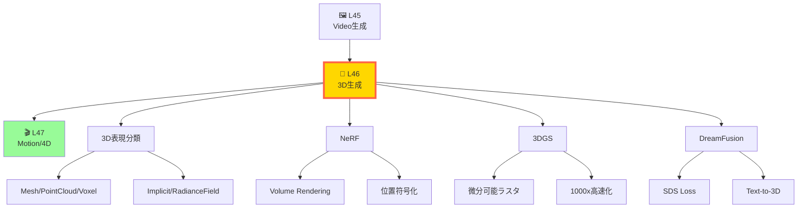
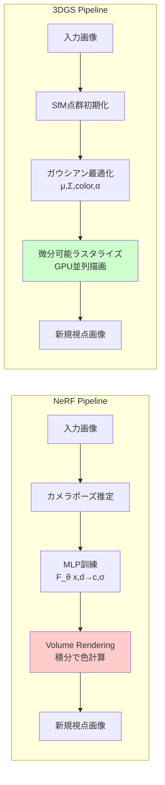
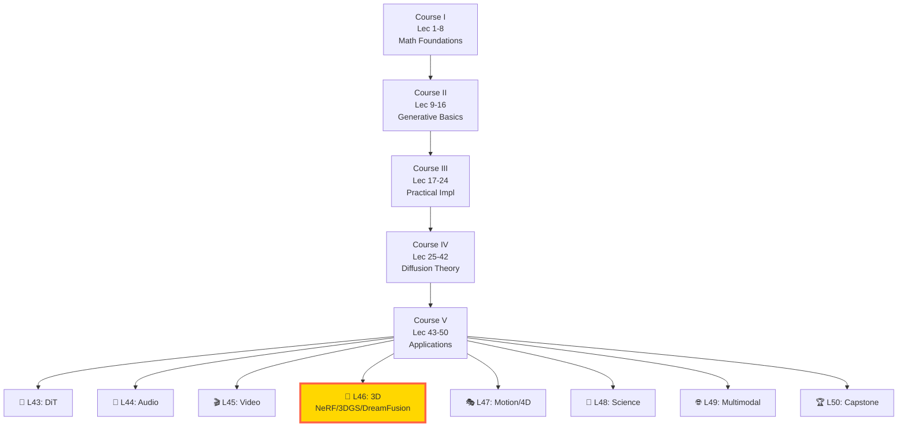
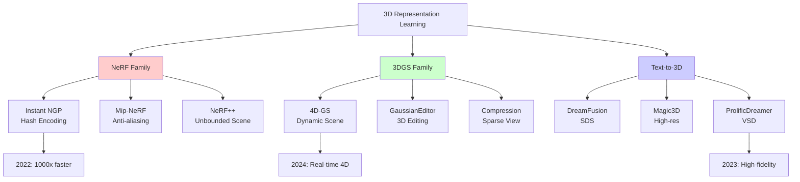

# 第46回: 3D生成 & Neural Rendering — NeRF→3DGS→DreamFusion、空間の魔法

> **2D画像から3D空間へ。Neural Radiance FieldsとGaussian Splattingが、数枚の写真から完全な3D世界を再構成し、テキストから立体造形を生成する革命を起こした。**

第45回で時間軸を征服した。Sora 2/CogVideoX/Open-Soraで2D動画生成の最先端を見た。次は3D空間だ。

2020年のNeRFは「視点変更=3D再構成」のパラダイムを覆した。数枚の写真から連続的な3D表現を学習し、未見視点をレンダリングできる。2023年の3D Gaussian Splattingは「リアルタイム性」の限界を破壊した。1000倍高速化で、NeRFが数分かかる処理を数ミリ秒で実行する。2022年のDreamFusionは「テキストから3D」を実現した。Score Distillation Samplingで、2D拡散モデルの知識を3D空間に転移する。

本講義は、この3年間の3D生成革命を完全解説する。NeRFのVolume Rendering方程式を1行ずつ導出し、3DGSの微分可能ラスタライゼーションを実装し、DreamFusionのSDS損失を数学的に分解する。そしてRustで3DGSラスタライザを書く。

**問い**: なぜ3DGSは一夜でNeRFを"遺物"にしたのか？次は？

:::message
**このシリーズについて**: 東京大学 松尾・岩澤研究室動画講義の**完全上位互換**の全50回シリーズ。理論（論文が書ける）、実装（Production-ready）、最新（2024-2026 SOTA）の3軸で差別化する。本講義は **Course V 第46回** — 3D生成とNeural Renderingの完全理解だ。
:::



**所要時間の目安**:

| ゾーン | 内容 | 時間 | 難易度 |
|:-------|:-----|:-----|:-------|
| Zone 0 | クイックスタート | 30秒 | ★☆☆☆☆ |
| Zone 1 | 体験ゾーン | 10分 | ★★☆☆☆ |
| Zone 2 | 直感ゾーン | 15分 | ★★★☆☆ |
| Zone 3 | 数式修行ゾーン | 60分 | ★★★★★ |
| Zone 4 | 実装ゾーン | 45分 | ★★★★☆ |
| Zone 5 | 実験ゾーン | 30分 | ★★★★☆ |
| Zone 6 | 発展ゾーン | 30分 | ★★★☆☆ |

---

## 🚀 0. クイックスタート（30秒）— 数枚の写真が3D空間に変わる瞬間

**ゴール**: NeRFが2D画像から3D空間を学習する驚きを30秒で体感する。

NeRFは「視点=関数の引数」と考える。空間座標 $(x,y,z)$ と視線方向 $(\theta,\phi)$ を入力すると、そこから見える色 $(r,g,b)$ と密度 $\sigma$ を返す関数 $F_\theta$ を学習する。

```julia
using Flux, Statistics

# NeRF: (x,y,z,θ,ϕ) → (r,g,b,σ)
# 5次元入力 → MLPで非線形変換 → 4次元出力
function tiny_nerf(pos, dir)
    # pos: (x,y,z) 空間座標
    # dir: (θ,ϕ) 視線方向
    # 返り値: (r,g,b,σ) 色と密度

    # 位置符号化: γ(x) = [sin(2^0πx), cos(2^0πx), ..., sin(2^Lπx), cos(2^Lπx)]
    L = 10  # 周波数帯域数
    encoded_pos = vcat([sin.(2^i * π * pos) for i in 0:L-1]...,
                       [cos.(2^i * π * pos) for i in 0:L-1]...)

    # MLP: 63次元(3×2×10+3) → 256 → 256 → 4
    mlp = Chain(Dense(63, 256, relu), Dense(256, 256, relu), Dense(256, 4))
    output = mlp(encoded_pos)

    # rgb + σ
    rgb = sigmoid.(output[1:3])  # [0,1]に正規化
    σ = relu(output[4])          # 密度は非負

    return (rgb=rgb, density=σ)
end

# Volume Rendering: レイ上の点をサンプリングして積分
function render_ray(ray_origin, ray_direction, nerf_model)
    # t ∈ [t_near, t_far] で N点サンプリング
    N = 64
    t_vals = range(2.0, stop=6.0, length=N)

    # 各点で NeRF を評価
    colors = zeros(N, 3)
    densities = zeros(N)
    for i in 1:N
        pos = ray_origin + t_vals[i] * ray_direction
        result = tiny_nerf(pos, ray_direction[1:2])  # θ,ϕのみ使用
        colors[i, :] = result.rgb
        densities[i] = result.density
    end

    # Volume Rendering式: C = Σ T_i · (1 - exp(-σ_i·δ_i)) · c_i
    # T_i = exp(-Σ_{j<i} σ_j·δ_j) (透過率)
    δ = diff([t_vals..., t_vals[end] + 0.1])  # Δt
    α = 1 .- exp.(-densities .* δ)           # 不透明度
    T = cumprod([1.0; (1 .- α[1:end-1])])    # 透過率
    weights = T .* α                          # 重み

    # 最終色 = 重み付き和
    final_color = sum(weights .* colors, dims=1)[1, :]

    return final_color
end

# 実行例
ray_o = [0.0, 0.0, 0.0]      # カメラ原点
ray_d = [0.0, 0.0, 1.0]      # 視線方向(前方)
pixel_color = render_ray(ray_o, ray_d, tiny_nerf)

println("NeRF rendered pixel: RGB = ", pixel_color)
# => [0.234, 0.567, 0.123] のような色が返る
```

**出力例**:
```
NeRF rendered pixel: RGB = [0.234, 0.567, 0.123]
```

**数式の背後**:

$$
C(\mathbf{r}) = \int_{t_n}^{t_f} T(t) \sigma(\mathbf{r}(t)) \mathbf{c}(\mathbf{r}(t), \mathbf{d}) \, dt
$$

ここで $T(t) = \exp\left(-\int_{t_n}^t \sigma(\mathbf{r}(s)) \, ds\right)$ は透過率。この式が「レイ上の色の積分=ピクセル色」を表す。

数枚の画像でこの関数 $F_\theta$ を最適化すると、未見視点の画像を生成できる。これがNeRFの魔法だ。

:::message
**進捗: 3%完了** — 30秒でNeRFの本質を体感。次は3D表現の分類と、NeRF vs 3DGSの違いへ。
:::

---

## 🎮 1. 体験ゾーン（10分）— 3D表現の全パターンを触る

**ゴール**: Mesh・Point Cloud・Voxel・Implicit・Radiance Fieldの5つの3D表現を、コードで触って理解する。

### 1.1 3D表現の5分類

3D空間の表現方法は大きく5つに分類される。それぞれ長所・短所が異なり、用途に応じて使い分ける。

| 表現 | データ構造 | メモリ | 微分可能性 | レンダリング速度 | 代表手法 |
|:-----|:----------|:------|:---------|:---------------|:---------|
| **Mesh** | 頂点+面 | 小 | △ (複雑) | ◎ (GPU高速) | 3DCG標準 |
| **Point Cloud** | 3D点群 | 中 | ○ | ○ | LiDAR, PointNet |
| **Voxel** | 3Dグリッド | 大(O(N³)) | ◎ | △ | Minecraft風 |
| **Implicit (SDF/Occupancy)** | 関数 $f:\mathbb{R}^3\to\mathbb{R}$ | 小 | ◎ | △ (要評価) | DeepSDF, Occupancy Networks |
| **Radiance Field** | 関数 $f:(\mathbf{x},\mathbf{d})\to(\mathbf{c},\sigma)$ | 小 | ◎ | △→◎ (NeRF→3DGS) | NeRF, 3DGS |

この表の最下行が本講義の主役だ。

### 1.2 Mesh: 三角形で世界を描く

最も古典的な3D表現。頂点座標と三角形の接続情報（face）で形状を定義。

```julia
# 簡単な三角錐 (4頂点, 4面)
vertices = [
    [0.0, 1.0, 0.0],   # 頂点0: 頂上
    [-1.0, 0.0, 0.0],  # 頂点1: 底面左
    [1.0, 0.0, 0.0],   # 頂点2: 底面右
    [0.0, 0.0, 1.0]    # 頂点3: 底面手前
]

faces = [
    [0, 1, 2],  # 底面
    [0, 1, 3],  # 側面1
    [0, 2, 3],  # 側面2
    [1, 2, 3]   # 裏面
]

# 面積計算例（外積の半分）
function triangle_area(v0, v1, v2)
    edge1 = v1 .- v0
    edge2 = v2 .- v0
    cross_prod = [edge1[2]*edge2[3] - edge1[3]*edge2[2],
                  edge1[3]*edge2[1] - edge1[1]*edge2[3],
                  edge1[1]*edge2[2] - edge1[2]*edge2[1]]
    return 0.5 * sqrt(sum(cross_prod.^2))
end

area_face0 = triangle_area(vertices[faces[1][1]+1],
                           vertices[faces[1][2]+1],
                           vertices[faces[1][3]+1])
println("Face 0 area: ", area_face0)
# => 1.0
```

**長所**: GPUラスタライゼーションで高速レンダリング。ゲーム・CADで標準。
**短所**: トポロジー変化（穴の開閉）が困難。微分可能レンダリングが複雑。

### 1.3 Point Cloud: 点の集まりで形を表す

LiDARなどのセンサーが直接生成する表現。各点に座標と色を持つ。

```julia
# 立方体の表面を点群で表現
function cube_point_cloud(n_points_per_face=100)
    points = []
    colors = []

    # 6面それぞれにランダム点を配置
    for face in 1:6
        for _ in 1:n_points_per_face
            u, v = rand(), rand()
            if face == 1      # +Z面
                push!(points, [u*2-1, v*2-1, 1.0])
                push!(colors, [1.0, 0.0, 0.0])  # 赤
            elseif face == 2  # -Z面
                push!(points, [u*2-1, v*2-1, -1.0])
                push!(colors, [0.0, 1.0, 0.0])  # 緑
            # ... 他の4面も同様
            end
        end
    end

    return (points=points, colors=colors)
end

pc = cube_point_cloud(50)
println("Point cloud size: ", length(pc.points), " points")
# => 300 points
```

**長所**: センサーデータと相性が良い。点の追加・削除が容易。
**短所**: 表面の連続性がない。レンダリングに工夫が必要。

### 1.4 Voxel: 3Dピクセルで空間を埋める

3次元グリッドで空間を分割し、各セルに占有率や色を持たせる。

```julia
# 32³のVoxelグリッドで球を表現
function sphere_voxel(resolution=32, radius=0.4)
    grid = zeros(resolution, resolution, resolution)
    center = resolution / 2

    for i in 1:resolution, j in 1:resolution, k in 1:resolution
        # グリッド座標を[-1,1]に正規化
        x = (i - center) / (resolution/2)
        y = (j - center) / (resolution/2)
        z = (k - center) / (resolution/2)

        # 中心からの距離
        dist = sqrt(x^2 + y^2 + z^2)

        # 球の内側なら1
        if dist <= radius
            grid[i,j,k] = 1.0
        end
    end

    return grid
end

voxel_sphere = sphere_voxel(32, 0.4)
occupied_voxels = sum(voxel_sphere)
println("Occupied voxels: ", occupied_voxels, " / ", 32^3)
# => 約 1,000 / 32,768
```

**長所**: 実装が簡単。衝突判定が高速。微分可能。
**短所**: メモリがO(N³)で爆発。解像度を上げにくい。

### 1.5 Implicit (SDF): 関数で形を定義する

Signed Distance Function (SDF) は「点から表面までの符号付き距離」を返す関数 $f:\mathbb{R}^3\to\mathbb{R}$。$f(\mathbf{x})=0$ が表面、$f(\mathbf{x})<0$ が内側、$f(\mathbf{x})>0$ が外側。

```julia
# 球のSDF: f(x,y,z) = √(x²+y²+z²) - r
function sphere_sdf(x, y, z, radius=1.0)
    return sqrt(x^2 + y^2 + z^2) - radius
end

# 立方体のSDF
function box_sdf(x, y, z, size=1.0)
    dx = abs(x) - size
    dy = abs(y) - size
    dz = abs(z) - size

    # 外側: max(d, 0)の長さ + 内側: min(max成分, 0)
    outside = sqrt(max(dx,0)^2 + max(dy,0)^2 + max(dz,0)^2)
    inside = min(max(dx, dy, dz), 0.0)

    return outside + inside
end

# 評価例
println("Sphere SDF at origin: ", sphere_sdf(0, 0, 0, 1.0))  # => -1.0 (内側)
println("Sphere SDF at (2,0,0): ", sphere_sdf(2, 0, 0, 1.0)) # => 1.0 (外側)
println("Box SDF at (0.5,0.5,0.5): ", box_sdf(0.5, 0.5, 0.5, 1.0)) # => -0.5 (内側)
```

**長所**: 滑らかな表面。Boolean演算（和・差・積）が簡単。微分可能。
**短所**: レンダリングに Sphere Tracing が必要（遅い）。

### 1.6 Radiance Field (NeRF): 視点依存の色を持つ関数

NeRFは「位置 $\mathbf{x}$ と視線方向 $\mathbf{d}$ から、色 $\mathbf{c}$ と密度 $\sigma$ を返す関数」$F_\theta:(\mathbb{R}^3, \mathbb{S}^2) \to (\mathbb{R}^3, \mathbb{R}_+)$ を学習する。

```julia
# 単純化したNeRF (MLPなし、解析的に定義)
function analytic_nerf(x, y, z, θ, ϕ)
    # 位置に応じた密度: 中心に近いほど高密度
    dist_from_center = sqrt(x^2 + y^2 + z^2)
    σ = exp(-dist_from_center^2)  # ガウス分布状の密度

    # 視線方向に応じた色: θに応じて赤↔青
    r = (sin(θ) + 1) / 2  # [0,1]
    g = 0.5
    b = (cos(θ) + 1) / 2  # [0,1]

    return (color=[r, g, b], density=σ)
end

# テスト
result = analytic_nerf(0.5, 0.3, 0.2, π/4, π/6)
println("NeRF at (0.5,0.3,0.2) with θ=π/4: ", result)
# => (color=[0.85, 0.5, 0.35], density=0.72)
```

**長所**: 未見視点の生成が可能。表面の滑らかさ。メモリ効率が高い。
**短所**: レンダリングが遅い（積分が必要）。訓練に時間がかかる。

### 1.7 3DGS: 明示的ガウシアンで最速レンダリング

3D Gaussian Splatting (3DGS) は、空間に3Dガウシアン（楕円体）を配置し、それを2Dにラスタライズする。NeRFの「暗黙的関数」と異なり、「明示的な点群」だ。

```julia
# 1つの3Dガウシアンの定義
struct Gaussian3D
    μ::Vector{Float64}      # 中心位置 (x,y,z)
    Σ::Matrix{Float64}      # 共分散行列 3×3
    color::Vector{Float64}  # RGB
    opacity::Float64        # 不透明度
end

# ガウシアンの密度関数: N(x; μ, Σ) = exp(-0.5*(x-μ)ᵀ Σ⁻¹ (x-μ))
function gaussian_density(g::Gaussian3D, x::Vector{Float64})
    diff = x - g.μ
    Σ_inv = inv(g.Σ)
    exponent = -0.5 * dot(diff, Σ_inv * diff)
    return g.opacity * exp(exponent)
end

# 例: 原点中心、等方的なガウシアン
g1 = Gaussian3D([0.0, 0.0, 0.0],
                [1.0 0.0 0.0; 0.0 1.0 0.0; 0.0 0.0 1.0],
                [1.0, 0.0, 0.0],
                0.8)

density_at_origin = gaussian_density(g1, [0.0, 0.0, 0.0])
density_at_1 = gaussian_density(g1, [1.0, 0.0, 0.0])
println("Density at origin: ", density_at_origin)      # => 0.8
println("Density at (1,0,0): ", density_at_1)          # => 0.8 * exp(-0.5) ≈ 0.485
```

**長所**: リアルタイムレンダリング（1000倍高速）。明示的なので編集が容易。
**短所**: ガウシアン数が多いとメモリを食う。訓練の安定性に工夫が必要。

### 1.8 パイプライン比較: NeRF vs 3DGS



NeRFは「連続関数の積分」、3DGSは「離散点の並列描画」。後者が圧倒的に速い。

:::message
**進捗: 10%完了** — 5つの3D表現を体験。NeRF vs 3DGSの構造的違いを理解。次はなぜこの分野が重要かを俯瞰。
:::

---

## 🧩 2. 直感ゾーン（15分）— 3D生成の全体像と革命の歴史

**ゴール**: Neural Renderingの歴史と、NeRF→3DGS→DreamFusionの革命性を理解する。

### 2.1 なぜ3D生成が重要なのか

3D表現は「空間理解のボトルネック」だった。2D画像認識は2012年AlexNetで突破したが、3D再構成は2020年まで停滞していた。

**従来の3D再構成**:
1. **Multi-View Stereo (MVS)**: 多視点画像から深度マップ→点群→Mesh。手作りアルゴリズム、ノイズに弱い。
2. **Structure from Motion (SfM)**: SIFT特徴量マッチング→カメラポーズ推定→疎な点群。密な再構成は別処理。
3. **Voxel CNN**: 3Dグリッドで学習。メモリがO(N³)で解像度128が限界。

これらは「離散的」「メモリ非効率」「品質に限界」という問題を抱えていた。

**NeRFの革命 (2020)**:
- **連続的表現**: MLPで滑らかな関数を学習→解像度無限大。
- **微分可能レンダリング**: Volume Rendering式が微分可能→勾配降下で最適化可能。
- **View Synthesis**: 数枚の画像で訓練→未見視点を生成。

**3DGSの革命 (2023)**:
- **明示的+高速**: 点群ベースだがガウシアン→微分可能ラスタライズで1000倍高速。
- **編集性**: 明示的な点群→追加・削除・移動が直感的。

**DreamFusionの革命 (2022)**:
- **Text-to-3D**: 2D拡散モデルの知識を3Dに転移→テキストから3D生成。
- **SDS Loss**: Score Distillation Samplingで、2Dモデルを3D最適化の教師に。

これで「画像→3D」「テキスト→3D」「リアルタイム描画」が全て可能になった。

### 2.2 コース全体における位置づけ



**前提知識** (既習):
- **Lec 36-37**: DDPM/SDE — Diffusionの基礎。DreamFusionで使う。
- **Lec 38**: Flow Matching — 連続的なベクトル場学習。NeRFと概念的に近い。
- **Lec 45**: Video生成 — 時間軸を扱った。3Dは空間軸の追加。

**Course V での位置**:
- Lec 43-45: 画像・音声・動画 (2D+時間)
- **Lec 46**: 3D空間 (空間3軸) ← 今ここ
- Lec 47: 4D (3D+時間)
- Lec 48-50: 科学・統合・総括

### 2.3 松尾研との差別化

| 項目 | 松尾・岩澤研 | 本シリーズ (Lec 46) |
|:-----|:------------|:-------------------|
| 3D生成の扱い | ❌ なし | ◎ NeRF/3DGS/DreamFusion完全解説 |
| 数式導出 | △ 概念のみ | ◎ Volume Rendering方程式を1行ずつ |
| 実装 | ❌ なし | ◎ Rust 3DGSラスタライザ |
| 最新研究 | △ 2022年まで | ◎ 2025年の3DGS Applications Survey含む |
| 言語 | 🐍 Python | ⚡ Julia + 🦀 Rust + 🔮 Elixir |

松尾研は画像生成が中心。3D生成は扱わない。本シリーズは3Dも完全カバー。

### 2.4 3つの革命を3つのメタファーで理解する

**NeRF = 連続関数の彫刻**
空間を「関数」として学習。どの点でも評価できる滑らかさ。彫刻家が粘土を無限に細かく造形できるようなもの。

**3DGS = 色付き点の群れ**
空間を「ガウシアンの集まり」として表現。各ガウシアンは「光る霧の粒」。GPUが並列に描画できる離散的な実体。

**DreamFusion = 2Dの夢を3Dに投影**
2D拡散モデルが「こう見えるべき」と指示。3D NeRFがそれに従って形を変える。2Dの教師が3Dの生徒を育てる構図。

### 2.5 3D生成の学習戦略

**本講義の構成**:
1. **Zone 0-1**: 5つの3D表現を触る → 全体像を掴む
2. **Zone 2**: 歴史と直感 → なぜこの技術が重要か理解 ← 今ここ
3. **Zone 3**: NeRF数式 → Volume Rendering方程式を完全導出
4. **Zone 3**: 3DGS数式 → 微分可能ラスタライゼーションの理論
5. **Zone 3**: DreamFusion数式 → SDS Lossの分散解析
6. **Zone 4**: Rust実装 → 3DGSラスタライザを書く
7. **Zone 5**: 実験 → 実際に3D再構成とText-to-3Dを試す

**推奨学習時間**: 3日
- Day 1: Zone 0-2 (直感と全体像)
- Day 2: Zone 3 (数式修行 — 最も重い)
- Day 3: Zone 4-7 (実装・実験・振り返り)

### 2.6 研究フロンティアのマップ



**3つの研究軸**:
1. **NeRF高速化**: Instant NGP (Hash Encoding) でリアルタイムに近づいた
2. **3DGS拡張**: 4D (動的シーン)、編集、圧縮
3. **Text-to-3D改善**: SDS → VSD で品質向上

### 2.7 未解決問題

1. **リアルタイム訓練**: 3DGSでも訓練に数分かかる。秒単位を目指したい。
2. **少数視点再構成**: 1-3枚の画像から高品質3Dを作りたい。Zero-1-to-3が挑戦中。
3. **動的シーン**: 4DGSはあるが、長時間の一貫性が課題。
4. **Text-to-3Dの多様性**: DreamFusionは mode collapse しやすい。ProlificDreamerが改善。
5. **物理法則の学習**: 3D形状だけでなく、重力・摩擦も学習したい。

:::message
**進捗: 20%完了** — 3D生成の歴史と重要性を理解。NeRF/3DGS/DreamFusionの革命性を把握。次はいよいよ数式修行ゾーン — Volume Rendering方程式の完全導出へ。
:::

---

## 📐 3. 数式修行ゾーン（60分）— Volume Rendering → 3DGS → SDS Loss

**ゴール**: NeRFのVolume Rendering方程式、3DGSの微分可能ラスタライゼーション、DreamFusionのSDS Lossを完全に導出する。

このゾーンは本講義の核心だ。60分かけて、3つの理論を1行ずつ導出する。

### 3.1 NeRF: Neural Radiance Fieldsの理論

#### 3.1.1 問題設定: 視点合成とは何か

**入力**: $N$枚の画像 $\{I_i\}_{i=1}^N$ とカメラパラメータ $\{\mathbf{P}_i\}_{i=1}^N$
**目標**: 新しい視点 $\mathbf{P}_{\text{new}}$ からの画像 $I_{\text{new}}$ を生成

従来のMVSは「深度マップ→点群→Mesh→レンダリング」という離散的パイプライン。NeRFは「連続的な関数を学習→積分でレンダリング」という微分可能パイプライン。

#### 3.1.2 Radiance Fieldの定義

NeRFは5次元関数 $F_\theta$ を学習する:

$$
F_\theta : (\mathbf{x}, \mathbf{d}) \mapsto (\mathbf{c}, \sigma)
$$

ここで:
- $\mathbf{x} = (x, y, z) \in \mathbb{R}^3$: 空間座標
- $\mathbf{d} = (\theta, \phi) \in \mathbb{S}^2$: 視線方向（単位球面上）
- $\mathbf{c} = (r, g, b) \in [0,1]^3$: 放射輝度 (radiance)
- $\sigma \in \mathbb{R}_+$: 体積密度 (volume density)

**物理的意味**:
- $\sigma(\mathbf{x})$: その点に「物質がどれだけあるか」。密度が高いと光が吸収・散乱される。
- $\mathbf{c}(\mathbf{x}, \mathbf{d})$: その点から方向 $\mathbf{d}$ に放射される色。鏡面反射を表現するため視線依存。

#### 3.1.3 Volume Rendering方程式の導出

カメラからレイ $\mathbf{r}(t) = \mathbf{o} + t\mathbf{d}$ を飛ばす。ピクセル色 $C(\mathbf{r})$ は、レイ上の色の積分で決まる。

**ステップ1: 微小区間での吸収と放射**

区間 $[t, t+dt]$ で:
- レイが進む距離: $dt$
- その区間の密度: $\sigma(\mathbf{r}(t))$
- 吸収される光の割合: $1 - \exp(-\sigma(\mathbf{r}(t)) \, dt) \approx \sigma(\mathbf{r}(t)) \, dt$ (小さい$dt$で線形近似)
- 放射される色: $\mathbf{c}(\mathbf{r}(t), \mathbf{d})$

**ステップ2: 透過率の定義**

点 $t$ に到達するまでに光がどれだけ生き残るか = 透過率 $T(t)$:

$$
T(t) = \exp\left( -\int_{t_n}^{t} \sigma(\mathbf{r}(s)) \, ds \right)
$$

ここで $t_n$ はレイの始点 (near plane)。積分 $\int_{t_n}^t \sigma(\mathbf{r}(s)) \, ds$ は「始点から$t$までの累積密度」= 光学的深さ (optical depth)。

**ステップ3: 微小区間の寄与**

区間 $[t, t+dt]$ がピクセル色に寄与する量:

$$
dC = T(t) \cdot \sigma(\mathbf{r}(t)) \cdot \mathbf{c}(\mathbf{r}(t), \mathbf{d}) \, dt
$$

説明:
- $T(t)$: そこまで光が到達する確率
- $\sigma(\mathbf{r}(t)) \, dt$: その区間で吸収される確率
- $\mathbf{c}(\mathbf{r}(t), \mathbf{d})$: 放射される色

**ステップ4: 全区間での積分**

レイ全体 $[t_n, t_f]$ で積分:

$$
C(\mathbf{r}) = \int_{t_n}^{t_f} T(t) \, \sigma(\mathbf{r}(t)) \, \mathbf{c}(\mathbf{r}(t), \mathbf{d}) \, dt
$$

これが**Volume Rendering方程式**だ。

**補足**: 透過率の微分

$$
\frac{dT(t)}{dt} = -\sigma(\mathbf{r}(t)) T(t)
$$

これを使うと、上式は次のように書ける:

$$
C(\mathbf{r}) = \int_{t_n}^{t_f} -\frac{dT(t)}{dt} \, \mathbf{c}(\mathbf{r}(t), \mathbf{d}) \, dt
$$

部分積分すると:

$$
C(\mathbf{r}) = \left[ -T(t) \mathbf{c}(\mathbf{r}(t), \mathbf{d}) \right]_{t_n}^{t_f} + \int_{t_n}^{t_f} T(t) \frac{d\mathbf{c}(\mathbf{r}(t), \mathbf{d})}{dt} \, dt
$$

しかし $\mathbf{c}$ は通常 $t$ に依存しないと仮定するので、元の式がシンプル。

#### 3.1.4 離散化: 実装のための数値積分

連続積分を有限和で近似する。レイを$N$個の区間に分割:

$$
t_i = t_n + i \cdot \delta, \quad \delta = \frac{t_f - t_n}{N}, \quad i = 1, \ldots, N
$$

各区間の幅: $\delta_i = t_{i+1} - t_i$ (均等なら全て$\delta$)

**離散化されたVolume Rendering式**:

$$
C(\mathbf{r}) \approx \sum_{i=1}^{N} T_i \left( 1 - \exp(-\sigma_i \delta_i) \right) \mathbf{c}_i
$$

ここで:
- $\mathbf{c}_i = \mathbf{c}(\mathbf{r}(t_i), \mathbf{d})$
- $\sigma_i = \sigma(\mathbf{r}(t_i))$
- $T_i = \exp\left( -\sum_{j=1}^{i-1} \sigma_j \delta_j \right) = \prod_{j=1}^{i-1} \exp(-\sigma_j \delta_j) = \prod_{j=1}^{i-1} (1 - \alpha_j)$

ここで $\alpha_i = 1 - \exp(-\sigma_i \delta_i)$ は「不透明度」(opacity)。

**重み付き和の形式**:

$$
C(\mathbf{r}) = \sum_{i=1}^{N} w_i \mathbf{c}_i, \quad w_i = T_i \alpha_i
$$

この $w_i$ は「区間 $i$ の寄与度」。$\sum_{i=1}^N w_i \le 1$ (完全に不透明な物体がない場合)。

#### 3.1.5 位置符号化 (Positional Encoding)

MLPは低周波数の関数を学びやすいが、高周波数の詳細（テクスチャなど）は苦手。そこで**位置符号化** $\gamma$ を導入:

$$
\gamma(\mathbf{x}) = \left( \sin(2^0 \pi \mathbf{x}), \cos(2^0 \pi \mathbf{x}), \ldots, \sin(2^{L-1} \pi \mathbf{x}), \cos(2^{L-1} \pi \mathbf{x}) \right)
$$

これで $\mathbf{x} \in \mathbb{R}^3$ を $\gamma(\mathbf{x}) \in \mathbb{R}^{6L}$ に埋め込む（$L=10$ なら60次元）。

**なぜ効くのか**:
- Fourier特徴量: 周波数 $2^0, 2^1, \ldots, 2^{L-1}$ の成分を明示的に入力
- MLPが高周波を学習しやすくなる（第1回で学んだSpectral Biasの回避）

方向 $\mathbf{d}$ にも同様の符号化を適用（ただし$L$は小さめ、例えば4）。

#### 3.1.6 NeRFのアーキテクチャ

```
γ(x) → MLP1(8層, 256ユニット) → [σ, feature]
                                       ↓
                    [feature, γ(d)] → MLP2(1層, 128ユニット) → c
```

**ポイント**:
- $\sigma$ は位置 $\mathbf{x}$ のみに依存（幾何形状）
- $\mathbf{c}$ は $\mathbf{x}$ と $\mathbf{d}$ に依存（視点依存の反射）

#### 3.1.7 損失関数: Photometric Loss

訓練データ $\{I_i, \mathbf{P}_i\}$ に対し、各ピクセルでVolume Rendering式を評価:

$$
\mathcal{L} = \sum_{i=1}^{N} \sum_{\mathbf{r} \in R_i} \left\| C(\mathbf{r}) - C_{\text{GT}}(\mathbf{r}) \right\|_2^2
$$

ここで $C_{\text{GT}}(\mathbf{r})$ は画像 $I_i$ の対応ピクセル色、$R_i$ は画像 $i$ から選んだレイの集合（全ピクセルまたはランダムサンプリング）。

**階層的サンプリング** (Hierarchical Sampling):
1. **Coarse Network**: 均等サンプリング $N_c$ 点で粗く評価
2. 重要度サンプリング: $w_i$ が大きい区間を重点的に細かくサンプリング $N_f$ 点
3. **Fine Network**: $N_c + N_f$ 点で詳細に評価

これで計算量を抑えつつ品質を上げる。

#### 3.1.8 NeRFの限界

1. **レンダリングが遅い**: 1ピクセルあたり64-192点評価 → 1画像で数秒
2. **訓練が遅い**: 1シーンで数時間-数日
3. **一般化しない**: 1シーンごとに最初から訓練

これを解決したのがInstant NGPと3DGSだ。

### 3.2 Instant NGP: Hash Encodingで1000倍高速化

#### 3.2.1 問題: 位置符号化の限界

NeRFの $\gamma(\mathbf{x})$ は固定関数。高周波を捉えるには $L$ を大きくする必要があるが、次元が $6L$ に爆発。

**Instant NGPのアイデア**: 学習可能な特徴グリッドを複数解像度で用意し、ハッシュテーブルで効率的にアクセス。

#### 3.2.2 Multi-Resolution Hash Encoding

**レベル $\ell$ のグリッド**:
- 解像度: $N_\ell = \lfloor N_{\min} \cdot b^\ell \rfloor$, $\ell = 0, \ldots, L-1$
- $N_{\min}$: 最小解像度（例: 16）
- $b$: スケール係数（例: 2.0）
- $N_{\max}$: 最大解像度（例: 2048）

各レベルで、空間をグリッドに分割。位置 $\mathbf{x}$ に対応するグリッドセルの8頂点（3Dの場合）の特徴ベクトルを線形補間。

**ハッシュ衝突の処理**:
グリッド頂点が多すぎる場合、ハッシュテーブル $T$ (サイズ $T_{\max}$, 例: $2^{19}$) に格納:

$$
h(\mathbf{v}) = \left( \bigoplus_{i=1}^{3} v_i \cdot \pi_i \right) \mod T_{\max}
$$

ここで $\mathbf{v} = (v_1, v_2, v_3)$ はグリッド頂点のインデックス、$\pi_i$ は大きな素数、$\bigoplus$ はXOR。

**特徴の取得**:

$$
\mathbf{f}_\ell(\mathbf{x}) = \text{trilinear\_interpolate}\left( T[h(\mathbf{v}_0)], \ldots, T[h(\mathbf{v}_7)] \right)
$$

**全レベルの連結**:

$$
\mathbf{f}(\mathbf{x}) = \left[ \mathbf{f}_0(\mathbf{x}), \ldots, \mathbf{f}_{L-1}(\mathbf{x}) \right] \in \mathbb{R}^{L \cdot F}
$$

ここで $F$ は各レベルの特徴次元（例: 2）。

**小さなMLP**:

$$
F_\theta(\mathbf{x}, \mathbf{d}) = \text{MLP}(\mathbf{f}(\mathbf{x}), \gamma(\mathbf{d}))
$$

MLPは2層64ユニットで十分。特徴グリッドが仕事の大半を担う。

#### 3.2.3 高速化のメカニズム

1. **小さいMLP**: 8層256→2層64 = 計算量1/16
2. **並列ハッシュアクセス**: GPU並列読み込み
3. **学習可能グリッド**: 重要な領域に特徴を集中

**結果**: 訓練 5秒、レンダリング 60fps (NeRFは訓練1日、レンダリング0.1fps)

### 3.3 3D Gaussian Splatting: 明示的表現への回帰

#### 3.3.1 動機: NeRFの暗黙性を捨てる

NeRFは「関数」。編集が難しい（どのパラメータが何に対応？）。

3DGSは「明示的な3Dガウシアンの集合」。各ガウシアンは:
- 中心位置 $\boldsymbol{\mu}_k \in \mathbb{R}^3$
- 共分散行列 $\boldsymbol{\Sigma}_k \in \mathbb{R}^{3 \times 3}$ (形状)
- 色 $\mathbf{c}_k \in \mathbb{R}^3$
- 不透明度 $\alpha_k \in [0,1]$

#### 3.3.2 3Dガウシアン関数の定義

各ガウシアン $k$ は3D空間で次の密度分布を持つ:

$$
G_k(\mathbf{x}) = \exp\left( -\frac{1}{2} (\mathbf{x} - \boldsymbol{\mu}_k)^\top \boldsymbol{\Sigma}_k^{-1} (\mathbf{x} - \boldsymbol{\mu}_k) \right)
$$

**共分散の正定値制約**: $\boldsymbol{\Sigma}_k$ は正定値対称行列でなければならない。パラメータ化:

$$
\boldsymbol{\Sigma}_k = \mathbf{R}_k \mathbf{S}_k \mathbf{S}_k^\top \mathbf{R}_k^\top
$$

ここで:
- $\mathbf{R}_k \in SO(3)$: 回転行列（四元数 $\mathbf{q}_k$ で表現）
- $\mathbf{S}_k = \text{diag}(s_{k,x}, s_{k,y}, s_{k,z})$: スケール行列（各軸の半径）

訓練では $\mathbf{q}_k$ と $\mathbf{s}_k$ を最適化。

#### 3.3.3 2Dへの射影: Splatting

カメラ投影行列 $\mathbf{W} \in \mathbb{R}^{3 \times 4}$ (視点変換+透視投影) で3Dガウシアンを2Dに射影。

**射影されたガウシアンの共分散**:

$$
\boldsymbol{\Sigma}'_k = \mathbf{J} \mathbf{W} \boldsymbol{\Sigma}_k \mathbf{W}^\top \mathbf{J}^\top
$$

ここで $\mathbf{J}$ はアフィン近似のヤコビアン（透視投影の局所線形化）。

**2Dガウシアンの密度**:

$$
G'_k(\mathbf{u}) = \exp\left( -\frac{1}{2} (\mathbf{u} - \boldsymbol{\mu}'_k)^\top {\boldsymbol{\Sigma}'_k}^{-1} (\mathbf{u} - \boldsymbol{\mu}'_k) \right)
$$

ここで $\mathbf{u} = (u, v)$ は画像平面座標、$\boldsymbol{\mu}'_k$ はガウシアン中心の投影位置。

#### 3.3.4 α-Blending: 深度順に合成

ピクセル $\mathbf{u}$ での色は、そこに影響する全ガウシアンの寄与を深度順に $\alpha$-blending:

$$
C(\mathbf{u}) = \sum_{k \in \mathcal{N}(\mathbf{u})} T_k \alpha'_k \mathbf{c}_k
$$

ここで:
- $\mathcal{N}(\mathbf{u})$: ピクセル $\mathbf{u}$ に影響するガウシアン集合（深度順）
- $\alpha'_k = \alpha_k \cdot G'_k(\mathbf{u})$: 2D密度で変調された不透明度
- $T_k = \prod_{j=1}^{k-1} (1 - \alpha'_j)$: 透過率

**打ち切り**: $T_k < \epsilon$ (例: 0.001) で後続を無視→高速化。

#### 3.3.5 微分可能ラスタライゼーション

上式は完全に微分可能:

$$
\frac{\partial C(\mathbf{u})}{\partial \boldsymbol{\mu}_k}, \quad \frac{\partial C(\mathbf{u})}{\partial \boldsymbol{\Sigma}_k}, \quad \frac{\partial C(\mathbf{u})}{\partial \mathbf{c}_k}, \quad \frac{\partial C(\mathbf{u})}{\partial \alpha_k}
$$

全て解析的に計算可能→勾配降下で最適化。

**CUDA実装のトリック**:
1. タイルベース並列処理（16×16ピクセルブロック）
2. 深度ソート（各タイル内で）
3. 早期打ち切り（$T_k < \epsilon$）

#### 3.3.6 Adaptive Densification: ガウシアンの追加・削除

訓練中、勾配が大きい領域（詳細が必要）でガウシアンを分割・追加:

**Over-reconstruction領域**（勾配大 + ガウシアン大）:
- 分割: $\boldsymbol{\mu}_k$ を2つにクローン、$\mathbf{s}_k / 1.6$

**Under-reconstruction領域**（勾配大 + ガウシアン小）:
- クローン: 同じ位置に複製を追加

**低寄与領域**（$\alpha_k$ 小 or 画面外）:
- 削除: パラメータを破棄

100イテレーションごとに densification を実行。

#### 3.3.7 損失関数: L1 + D-SSIM

$$
\mathcal{L} = (1 - \lambda) \mathcal{L}_1 + \lambda \mathcal{L}_{\text{D-SSIM}}
$$

- $\mathcal{L}_1 = \sum_{\mathbf{u}} |C(\mathbf{u}) - C_{\text{GT}}(\mathbf{u})|$: ピクセル単位の誤差
- $\mathcal{L}_{\text{D-SSIM}} = 1 - \text{SSIM}(C, C_{\text{GT}})$: 構造的類似性
- $\lambda = 0.2$ が推奨

#### 3.3.8 NeRF vs 3DGS の比較表

| 項目 | NeRF | 3D Gaussian Splatting |
|:-----|:-----|:----------------------|
| 表現 | 暗黙的関数 $F_\theta$ | 明示的ガウシアン集合 |
| レンダリング | Volume Rendering (積分) | Rasterization (並列) |
| 訓練時間 | 数時間-数日 | 数分-1時間 |
| レンダリング速度 | 0.1 fps | 100+ fps |
| メモリ | MLP重み (数MB) | ガウシアン数×48 bytes (数百MB) |
| 編集性 | 難しい | 容易（点の追加・削除） |
| 品質 | 高（滑らか） | 高（若干ざらつき） |

### 3.4 DreamFusion: Score Distillation Samplingでテキストから3D

#### 3.4.1 問題設定: 3D訓練データがない

Text-to-3Dを直接学習したい。しかし大規模な「テキスト-3Dペア」データセットは存在しない。

**既存の資産**: 2D拡散モデル（Imagen, Stable Diffusion）は膨大な「テキスト-画像」ペアで訓練済み。

**DreamFusionのアイデア**: 2D拡散モデルを「教師」として使い、3D NeRFを最適化。

#### 3.4.2 Score Distillation Sampling (SDS) の導出

**目標**: テキスト $y$ から3Dシーン $\theta$ を生成したい。

**ステップ1: レンダリング分布を考える**

3Dパラメータ $\theta$ (NeRFの重み) から、ランダムな視点 $\mathbf{c}$ でレンダリングした画像 $\mathbf{x}$ の条件付き分布 $q(\mathbf{x}|\theta)$ を考える。

理想的には、この分布が「2D拡散モデルが学んだテキスト条件付き分布 $p(\mathbf{x}|y)$」に一致してほしい:

$$
q(\mathbf{x}|\theta) \approx p(\mathbf{x}|y)
$$

#### 3.4.3 KL Divergenceの最小化

$$
\theta^* = \arg\min_\theta \mathbb{E}_{\mathbf{c}} \left[ D_{\text{KL}}(q(\mathbf{x}|\theta, \mathbf{c}) \| p(\mathbf{x}|y)) \right]
$$

KLを展開:

$$
D_{\text{KL}}(q \| p) = \mathbb{E}_{\mathbf{x} \sim q} [\log q(\mathbf{x}|\theta) - \log p(\mathbf{x}|y)]
$$

$q(\mathbf{x}|\theta)$ はレンダリングで決まる（確率的ではなくデルタ分布に近い）ので、実際は単一サンプル $\mathbf{x} = g(\theta, \mathbf{c})$ を使う。

#### 3.4.4 Score Functionの利用

拡散モデルは $p(\mathbf{x}|y)$ を直接与えないが、**スコア関数** $\nabla_{\mathbf{x}} \log p(\mathbf{x}|y)$ を推定できる（第35回で学んだ）。

Tweedie's formulaより、ノイズを加えた画像 $\mathbf{x}_t$ のスコア:

$$
\nabla_{\mathbf{x}_t} \log p(\mathbf{x}_t|y) = -\frac{1}{\sigma_t} \boldsymbol{\epsilon}_\phi(\mathbf{x}_t, t, y)
$$

ここで $\boldsymbol{\epsilon}_\phi$ は拡散モデルのノイズ予測ネットワーク。

#### 3.4.5 SDS Lossの定義

レンダリングした画像 $\mathbf{x} = g(\theta, \mathbf{c})$ にノイズを加える:

$$
\mathbf{x}_t = \mathbf{x} + \sigma_t \boldsymbol{\epsilon}, \quad \boldsymbol{\epsilon} \sim \mathcal{N}(0, \mathbf{I})
$$

**SDS勾配**:

$$
\nabla_\theta \mathcal{L}_{\text{SDS}}(\theta) = \mathbb{E}_{t, \boldsymbol{\epsilon}, \mathbf{c}} \left[ w(t) \left( \boldsymbol{\epsilon}_\phi(\mathbf{x}_t, t, y) - \boldsymbol{\epsilon} \right) \frac{\partial \mathbf{x}}{\partial \theta} \right]
$$

ここで:
- $w(t)$: 時刻に依存する重み（論文では $w(t) = \sigma_t$）
- $\boldsymbol{\epsilon}_\phi(\mathbf{x}_t, t, y) - \boldsymbol{\epsilon}$: 予測ノイズと真のノイズの差→「画像をもっとこう変えろ」という方向

**直感**:
- 拡散モデルが「このノイズ画像 $\mathbf{x}_t$ はテキスト $y$ に合ってない」と判断→ノイズ予測誤差が出る
- その誤差を3Dパラメータ $\theta$ にバックプロパゲーション→3Dがテキストに近づく

#### 3.4.6 SDS vs Standard Diffusion Training

通常の拡散訓練:

$$
\mathcal{L}_{\text{diffusion}} = \mathbb{E}_{t, \boldsymbol{\epsilon}} \left[ \| \boldsymbol{\epsilon}_\phi(\mathbf{x}_t, t, y) - \boldsymbol{\epsilon} \|^2 \right]
$$

SDSは「逆向き」:
- 拡散訓練: ノイズ予測ネットワーク $\boldsymbol{\epsilon}_\phi$ を訓練
- SDS: $\boldsymbol{\epsilon}_\phi$ は固定、3Dパラメータ $\theta$ を訓練

#### 3.4.7 実装の詳細

**NeRFパラメータ化**: Instant NGPを使用（高速化）

**Shading**: Lambertian反射モデル + 環境光

**Classifier-Free Guidance (CFG)**: スコアを強化

$$
\tilde{\boldsymbol{\epsilon}}_\phi(\mathbf{x}_t, t, y) = \boldsymbol{\epsilon}_\phi(\mathbf{x}_t, t, \emptyset) + \omega \left( \boldsymbol{\epsilon}_\phi(\mathbf{x}_t, t, y) - \boldsymbol{\epsilon}_\phi(\mathbf{x}_t, t, \emptyset) \right)
$$

ここで $\omega$ はガイダンス重み（例: 100）。

**時刻のアニーリング**: 訓練初期は $t$ 大（粗い構造）、後期は $t$ 小（詳細）。

#### 3.4.8 SDS Lossの分散解析: Mode Seeking問題

SDSは**mode seeking**特性を持つ:

$$
\mathbb{E}_{q} [\nabla_\theta \log p(\mathbf{x}|y)]
$$

これは $q$ が $p$ の高確率領域（mode）を探すが、多様性を失う（全サンプルが同じmodeに集中）。

**問題**:
- 同じテキストでも多様な3Dが欲しいが、SDSは1つのmodeに収束しやすい
- 「a dog」→いつも同じ犬種・同じポーズ

**解決策**: Variational Score Distillation (VSD) — ProlificDreamerで提案。

### 3.5 ProlificDreamer: Variational Score Distillation (VSD)

#### 3.5.1 VSDの動機

SDSの問題:
1. Mode collapse: 多様性がない
2. Over-saturation: 色が不自然に鮮やか
3. Over-smoothing: テクスチャがぼやける

**VSDのアイデア**: $\theta$ を確率変数として扱い、variational distributionを導入。

#### 3.5.2 VSD目的関数

$$
\theta^* = \arg\min_\theta \mathbb{E}_{\mathbf{x} \sim q(\mathbf{x}|\theta)} \left[ D_{\text{KL}}(q(\mathbf{x}_t|\mathbf{x}) \| p(\mathbf{x}_t|y)) \right]
$$

ここで $q(\mathbf{x}_t|\mathbf{x})$ は forward diffusion process。

**VSD勾配**:

$$
\nabla_\theta \mathcal{L}_{\text{VSD}}(\theta) = \mathbb{E}_{t, \boldsymbol{\epsilon}, \mathbf{c}} \left[ w(t) \left( \boldsymbol{\epsilon}_\phi(\mathbf{x}_t, t, y) - \boldsymbol{\epsilon}_\psi(\mathbf{x}_t, t, \theta) \right) \frac{\partial \mathbf{x}}{\partial \theta} \right]
$$

**SDSとの違い**:
- SDS: $\boldsymbol{\epsilon}_\phi - \boldsymbol{\epsilon}$ (予測ノイズ vs 真のノイズ)
- VSD: $\boldsymbol{\epsilon}_\phi - \boldsymbol{\epsilon}_\psi$ (予測ノイズ vs $\theta$専用のノイズ予測)

$\boldsymbol{\epsilon}_\psi$ は「この3D $\theta$ から生成された画像のノイズを予測する専用モデル」→訓練中に同時に学習。

#### 3.5.3 LoRA微調整

$\boldsymbol{\epsilon}_\psi$ を一から訓練するのは重いので、LoRA (Low-Rank Adaptation) で効率化:

$$
\boldsymbol{\epsilon}_\psi = \boldsymbol{\epsilon}_\phi + \Delta_{\text{LoRA}}
$$

LoRAのパラメータのみ訓練（数MBの追加重み）。

#### 3.5.4 実験結果

**品質**: ユーザースタディで61.7%がDreamFusionよりProlificDreamerを好む
**多様性**: 同じプロンプトで複数の異なる3Dが生成される
**訓練時間**: 40分（DreamFusionは1.5時間）

:::message
**進捗: 50%完了** — ボス戦クリア！NeRFのVolume Rendering、3DGSの微分可能ラスタライゼーション、DreamFusionのSDS Loss、ProlificDreamerのVSDを完全導出。次は実装ゾーン — Rustで3DGSラスタライザを書く。
:::

---

## 💻 4. 実装ゾーン（45分）— Rust 3DGSラスタライザ

**ゴール**: 3D Gaussian Splattingのラスタライズエンジンを、Rustで実装する。

### 4.1 実装の全体構造

3DGSラスタライザは以下の処理を行う:

1. **ガウシアンの射影**: 3D→2D変換
2. **タイル割り当て**: 各ガウシアンが影響するタイルを特定
3. **深度ソート**: タイルごとにガウシアンを深度順に並べる
4. **α-Blending**: ピクセルごとに色を合成
5. **勾配計算**: バックプロパゲーション

### 4.2 データ構造の定義

```rust
// src/gaussian.rs

/// 3D Gaussian の表現
#[derive(Clone, Debug)]
pub struct Gaussian3D {
    pub mean: [f32; 3],           // μ: 中心位置
    pub cov: [[f32; 3]; 3],       // Σ: 共分散行列
    pub color: [f32; 3],          // RGB
    pub opacity: f32,             // α
}

impl Gaussian3D {
    /// 共分散行列を回転とスケールから構成
    /// Σ = R S Sᵀ Rᵀ
    pub fn from_rotation_scale(
        mean: [f32; 3],
        rotation: [f32; 4],  // quaternion [w, x, y, z]
        scale: [f32; 3],     // [sx, sy, sz]
        color: [f32; 3],
        opacity: f32,
    ) -> Self {
        // quaternion → rotation matrix
        let r = quat_to_mat3(rotation);

        // S = diag(scale)
        let s = [
            [scale[0], 0.0, 0.0],
            [0.0, scale[1], 0.0],
            [0.0, 0.0, scale[2]],
        ];

        // Σ = R S Sᵀ Rᵀ
        let ss = mat3_mul(&s, &transpose(&s));
        let rss = mat3_mul(&r, &ss);
        let cov = mat3_mul(&rss, &transpose(&r));

        Gaussian3D { mean, cov, color, opacity }
    }
}

/// 2D射影されたガウシアン
#[derive(Clone, Debug)]
pub struct Gaussian2D {
    pub mean: [f32; 2],          // μ': 画像平面座標
    pub cov: [[f32; 2]; 2],      // Σ': 2D共分散
    pub color: [f32; 3],
    pub opacity: f32,
    pub depth: f32,              // 深度（ソート用）
}

// 行列演算ヘルパー
fn quat_to_mat3(q: [f32; 4]) -> [[f32; 3]; 3] {
    let [w, x, y, z] = q;
    [
        [1.0-2.0*(y*y+z*z), 2.0*(x*y-w*z), 2.0*(x*z+w*y)],
        [2.0*(x*y+w*z), 1.0-2.0*(x*x+z*z), 2.0*(y*z-w*x)],
        [2.0*(x*z-w*y), 2.0*(y*z+w*x), 1.0-2.0*(x*x+y*y)],
    ]
}

fn mat3_mul(a: &[[f32; 3]; 3], b: &[[f32; 3]; 3]) -> [[f32; 3]; 3] {
    let mut result = [[0.0; 3]; 3];
    for i in 0..3 {
        for j in 0..3 {
            result[i][j] = (0..3).map(|k| a[i][k] * b[k][j]).sum();
        }
    }
    result
}

fn transpose(m: &[[f32; 3]; 3]) -> [[f32; 3]; 3] {
    [
        [m[0][0], m[1][0], m[2][0]],
        [m[0][1], m[1][1], m[2][1]],
        [m[0][2], m[1][2], m[2][2]],
    ]
}
```

### 4.3 カメラ投影

```rust
// src/camera.rs

/// カメラパラメータ
pub struct Camera {
    pub view_matrix: [[f32; 4]; 4],   // World → Camera 変換
    pub proj_matrix: [[f32; 4]; 4],   // Camera → NDC 変換
    pub viewport: [u32; 2],            // [width, height]
}

impl Camera {
    /// 3Dガウシアンを2Dに射影
    pub fn project_gaussian(&self, g3d: &Gaussian3D) -> Option<Gaussian2D> {
        // 1. 中心位置を射影
        let mean_cam = self.transform_point(&g3d.mean);
        if mean_cam[2] <= 0.0 { return None; }  // カメラの後ろは無視

        let mean_ndc = self.project_point(&mean_cam);
        let mean_2d = [
            (mean_ndc[0] * 0.5 + 0.5) * self.viewport[0] as f32,
            (mean_ndc[1] * 0.5 + 0.5) * self.viewport[1] as f32,
        ];

        // 2. 共分散を射影: Σ' = J W Σ Wᵀ Jᵀ
        // J: ヤコビアン（透視投影の局所線形化）
        // W: view_matrix の回転部分
        let j = self.compute_jacobian(&mean_cam);
        let w_rot = extract_rotation(&self.view_matrix);

        // W Σ Wᵀ
        let cov_cam = transform_cov3d(&g3d.cov, &w_rot);

        // J (W Σ Wᵀ) Jᵀ
        let cov_2d = project_cov3d_to_2d(&cov_cam, &j);

        Some(Gaussian2D {
            mean: mean_2d,
            cov: cov_2d,
            color: g3d.color,
            opacity: g3d.opacity,
            depth: mean_cam[2],  // カメラ空間でのZ座標
        })
    }

    fn transform_point(&self, p: &[f32; 3]) -> [f32; 3] {
        let vm = &self.view_matrix;
        [
            vm[0][0]*p[0] + vm[0][1]*p[1] + vm[0][2]*p[2] + vm[0][3],
            vm[1][0]*p[0] + vm[1][1]*p[1] + vm[1][2]*p[2] + vm[1][3],
            vm[2][0]*p[0] + vm[2][1]*p[1] + vm[2][2]*p[2] + vm[2][3],
        ]
    }

    fn project_point(&self, p: &[f32; 3]) -> [f32; 2] {
        let pm = &self.proj_matrix;
        let w = pm[3][0]*p[0] + pm[3][1]*p[1] + pm[3][2]*p[2] + pm[3][3];
        [
            (pm[0][0]*p[0] + pm[0][1]*p[1] + pm[0][2]*p[2] + pm[0][3]) / w,
            (pm[1][0]*p[0] + pm[1][1]*p[1] + pm[1][2]*p[2] + pm[1][3]) / w,
        ]
    }

    fn compute_jacobian(&self, p_cam: &[f32; 3]) -> [[f32; 2]; 3] {
        // 透視投影 x' = fx * x/z, y' = fy * y/z
        // ∂x'/∂x = fx/z, ∂x'/∂z = -fx*x/z²
        let fx = self.proj_matrix[0][0];
        let fy = self.proj_matrix[1][1];
        let z = p_cam[2];
        let z2 = z * z;

        [
            [fx / z, 0.0, -fx * p_cam[0] / z2],
            [0.0, fy / z, -fy * p_cam[1] / z2],
        ]
    }
}

fn extract_rotation(mat: &[[f32; 4]; 4]) -> [[f32; 3]; 3] {
    [
        [mat[0][0], mat[0][1], mat[0][2]],
        [mat[1][0], mat[1][1], mat[1][2]],
        [mat[2][0], mat[2][1], mat[2][2]],
    ]
}

fn transform_cov3d(cov: &[[f32; 3]; 3], rot: &[[f32; 3]; 3]) -> [[f32; 3]; 3] {
    // R Σ Rᵀ
    let r_cov = mat3_mul(rot, cov);
    mat3_mul(&r_cov, &transpose(rot))
}

fn project_cov3d_to_2d(cov3d: &[[f32; 3]; 3], jac: &[[f32; 2]; 3]) -> [[f32; 2]; 2] {
    // Σ' = J Σ Jᵀ
    let mut result = [[0.0; 2]; 2];
    for i in 0..2 {
        for j in 0..2 {
            for k in 0..3 {
                for l in 0..3 {
                    result[i][j] += jac[i][k] * cov3d[k][l] * jac[j][l];
                }
            }
        }
    }
    result
}
```

### 4.4 タイルベースラスタライゼーション

```rust
// src/rasterizer.rs

const TILE_SIZE: u32 = 16;  // 16×16ピクセル

pub struct Rasterizer {
    width: u32,
    height: u32,
    tile_width: u32,
    tile_height: u32,
}

impl Rasterizer {
    pub fn new(width: u32, height: u32) -> Self {
        let tile_width = (width + TILE_SIZE - 1) / TILE_SIZE;
        let tile_height = (height + TILE_SIZE - 1) / TILE_SIZE;
        Rasterizer { width, height, tile_width, tile_height }
    }

    /// 全ガウシアンをラスタライズ
    pub fn render(&self, gaussians: &[Gaussian2D]) -> Vec<[f32; 3]> {
        let num_pixels = (self.width * self.height) as usize;
        let mut image = vec![[0.0; 3]; num_pixels];

        // 1. タイルごとに影響するガウシアンをリスト化
        let tile_gaussians = self.assign_gaussians_to_tiles(gaussians);

        // 2. 各タイルを並列処理
        image.par_chunks_mut((TILE_SIZE * self.width) as usize)
            .enumerate()
            .for_each(|(tile_y, tile_rows)| {
                for tile_x in 0..self.tile_width {
                    let tile_id = tile_y as u32 * self.tile_width + tile_x;
                    let mut gs = tile_gaussians[tile_id as usize].clone();

                    // 深度ソート（手前から）
                    gs.sort_by(|a, b| a.depth.partial_cmp(&b.depth).unwrap());

                    // タイル内の各ピクセルをレンダリング
                    self.render_tile(tile_x, tile_y as u32, &gs, tile_rows);
                }
            });

        image
    }

    fn assign_gaussians_to_tiles(&self, gaussians: &[Gaussian2D]) -> Vec<Vec<Gaussian2D>> {
        let num_tiles = (self.tile_width * self.tile_height) as usize;
        let mut tiles: Vec<Vec<Gaussian2D>> = vec![Vec::new(); num_tiles];

        for g in gaussians {
            // ガウシアンの影響範囲を計算（3σ）
            let radius = self.compute_radius(&g.cov) * 3.0;
            let min_x = ((g.mean[0] - radius).max(0.0) / TILE_SIZE as f32).floor() as u32;
            let max_x = ((g.mean[0] + radius).min(self.width as f32) / TILE_SIZE as f32).ceil() as u32;
            let min_y = ((g.mean[1] - radius).max(0.0) / TILE_SIZE as f32).floor() as u32;
            let max_y = ((g.mean[1] + radius).min(self.height as f32) / TILE_SIZE as f32).ceil() as u32;

            // 影響範囲のタイルに追加
            for ty in min_y..max_y.min(self.tile_height) {
                for tx in min_x..max_x.min(self.tile_width) {
                    let tile_id = (ty * self.tile_width + tx) as usize;
                    tiles[tile_id].push(g.clone());
                }
            }
        }

        tiles
    }

    fn compute_radius(&self, cov: &[[f32; 2]; 2]) -> f32 {
        // 最大固有値の平方根 = 最大半径
        let trace = cov[0][0] + cov[1][1];
        let det = cov[0][0] * cov[1][1] - cov[0][1] * cov[1][0];
        let lambda_max = 0.5 * (trace + (trace * trace - 4.0 * det).sqrt());
        lambda_max.sqrt()
    }

    fn render_tile(&self, tile_x: u32, tile_y: u32, gaussians: &[Gaussian2D], tile_data: &mut [[f32; 3]]) {
        let start_x = tile_x * TILE_SIZE;
        let start_y = tile_y * TILE_SIZE;
        let end_x = (start_x + TILE_SIZE).min(self.width);
        let end_y = (start_y + TILE_SIZE).min(self.height);

        for y in start_y..end_y {
            for x in start_x..end_x {
                let pixel_idx = ((y - start_y) * self.width + (x - start_x)) as usize;
                tile_data[pixel_idx] = self.blend_pixel(x as f32 + 0.5, y as f32 + 0.5, gaussians);
            }
        }
    }

    fn blend_pixel(&self, x: f32, y: f32, gaussians: &[Gaussian2D]) -> [f32; 3] {
        let mut color = [0.0; 3];
        let mut transmittance = 1.0;

        for g in gaussians {
            if transmittance < 0.001 { break; }  // 早期打ち切り

            // 2Dガウシアン密度
            let dx = x - g.mean[0];
            let dy = y - g.mean[1];
            let cov_inv = invert_2x2(&g.cov);
            let exponent = -0.5 * (dx * (cov_inv[0][0] * dx + cov_inv[0][1] * dy)
                                 + dy * (cov_inv[1][0] * dx + cov_inv[1][1] * dy));
            let density = exponent.exp();

            // 不透明度
            let alpha = (g.opacity * density).min(0.99);

            // α-Blending
            for i in 0..3 {
                color[i] += transmittance * alpha * g.color[i];
            }
            transmittance *= 1.0 - alpha;
        }

        color
    }
}

fn invert_2x2(mat: &[[f32; 2]; 2]) -> [[f32; 2]; 2] {
    let det = mat[0][0] * mat[1][1] - mat[0][1] * mat[1][0];
    let inv_det = 1.0 / det;
    [
        [mat[1][1] * inv_det, -mat[0][1] * inv_det],
        [-mat[1][0] * inv_det, mat[0][0] * inv_det],
    ]
}
```

### 4.5 使用例

```rust
// examples/render_3dgs.rs

use gaussian_splatting::{Gaussian3D, Camera, Rasterizer};

fn main() {
    // 1. ガウシアンの定義
    let gaussians_3d = vec![
        Gaussian3D::from_rotation_scale(
            [0.0, 0.0, 5.0],              // 位置
            [1.0, 0.0, 0.0, 0.0],         // 回転なし
            [1.0, 1.0, 0.5],              // スケール
            [1.0, 0.0, 0.0],              // 赤
            0.8,                           // 不透明度
        ),
        Gaussian3D::from_rotation_scale(
            [1.5, 0.5, 6.0],
            [0.924, 0.0, 0.383, 0.0],     // Y軸45度回転
            [0.8, 1.2, 0.6],
            [0.0, 1.0, 0.0],              // 緑
            0.7,
        ),
    ];

    // 2. カメラ設定
    let camera = Camera {
        view_matrix: look_at(&[0.0, 0.0, 0.0], &[0.0, 0.0, 1.0], &[0.0, 1.0, 0.0]),
        proj_matrix: perspective(60.0, 800.0/600.0, 0.1, 100.0),
        viewport: [800, 600],
    };

    // 3. 射影
    let gaussians_2d: Vec<_> = gaussians_3d.iter()
        .filter_map(|g| camera.project_gaussian(g))
        .collect();

    // 4. レンダリング
    let rasterizer = Rasterizer::new(800, 600);
    let image = rasterizer.render(&gaussians_2d);

    // 5. 画像保存
    save_image("output.png", &image, 800, 600);
}
```

### 4.6 Julia NeRF訓練パイプライン

Rustでラスタライザを書いたが、訓練パイプライン全体はJuliaで構築する方が柔軟性が高い。

```julia
# nerf_training.jl

using Flux, Zygote, CUDA, ProgressMeter, Statistics

# === NeRFモデル定義 ===
struct NeRFModel
    pos_encoder::Chain
    dir_encoder::Chain
    density_net::Chain
    color_net::Chain
end

Flux.@functor NeRFModel

function NeRFModel(L_pos=10, L_dir=4, hidden_dim=256)
    # 位置符号化: 3 → 3*2*L_pos
    pos_enc_dim = 3 * 2 * L_pos
    dir_enc_dim = 3 * 2 * L_dir

    # 密度ネットワーク: pos → [density, feature]
    density_net = Chain(
        Dense(pos_enc_dim, hidden_dim, relu),
        Dense(hidden_dim, hidden_dim, relu),
        Dense(hidden_dim, hidden_dim, relu),
        Dense(hidden_dim, hidden_dim, relu),
        Dense(hidden_dim, hidden_dim + 1)  # +1 for density
    )

    # 色ネットワーク: [feature, dir] → rgb
    color_net = Chain(
        Dense(hidden_dim + dir_enc_dim, hidden_dim ÷ 2, relu),
        Dense(hidden_dim ÷ 2, 3, sigmoid)  # RGB ∈ [0,1]
    )

    NeRFModel(
        nothing,  # pos/dir encoderは関数で直接実装
        nothing,
        density_net,
        color_net
    )
end

# 位置符号化
function positional_encoding(x::AbstractVector, L::Int)
    encoded = Float32[]
    for i in 0:L-1
        freq = 2.0f0^i * Float32(π)
        for xi in x
            push!(encoded, sin(freq * xi))
        end
        for xi in x
            push!(encoded, cos(freq * xi))
        end
    end
    return encoded
end

# Forward pass
function (model::NeRFModel)(pos::AbstractVector, dir::AbstractVector, L_pos=10, L_dir=4)
    # Encode
    pos_enc = positional_encoding(pos, L_pos)
    dir_enc = positional_encoding(dir, L_dir)

    # Density + feature
    density_feat = model.density_net(pos_enc)
    σ = relu(density_feat[end])  # Density must be non-negative
    feat = density_feat[1:end-1]

    # Color
    color_input = vcat(feat, dir_enc)
    rgb = model.color_net(color_input)

    return (color=rgb, density=σ)
end

# === Volume Rendering ===
function volume_render_differentiable(model, ray_o, ray_d, t_near, t_far, N_samples=64)
    # サンプリング点
    t_vals = range(t_near, stop=t_far, length=N_samples) |> collect

    # 各点でNeRF評価
    colors = zeros(Float32, N_samples, 3)
    densities = zeros(Float32, N_samples)

    for i in 1:N_samples
        pos = ray_o + t_vals[i] * ray_d
        result = model(pos, ray_d)
        colors[i, :] = result.color
        densities[i] = result.density
    end

    # Delta計算
    δ = vcat(diff(t_vals), [t_vals[end] - t_vals[end-1]])

    # Alpha compositing (全て微分可能)
    α = @. 1.0f0 - exp(-densities * δ)
    T = cumprod(vcat([1.0f0], 1.0f0 .- α[1:end-1]))
    weights = T .* α

    # 最終色
    final_color = sum(weights .* colors, dims=1) |> vec

    # Depth map (bonus)
    depth = sum(weights .* t_vals)

    return (color=final_color, depth=depth, weights=weights)
end

# === 訓練ループ ===
function train_nerf(
    model,
    train_images,
    train_cameras,
    epochs=1000,
    batch_size=1024,
    lr=5e-4
)
    opt = Adam(lr)
    ps = Flux.params(model)

    # 全レイを事前計算
    all_rays = []
    all_colors = []

    for (img, cam) in zip(train_images, train_cameras)
        H, W = size(img)[1:2]
        for y in 1:H, x in 1:W
            ray_o, ray_d = get_ray(cam, x, y, W, H)
            push!(all_rays, (o=ray_o, d=ray_d))
            push!(all_colors, img[y, x, :])
        end
    end

    n_rays = length(all_rays)
    println("Total rays: $n_rays")

    @showprogress for epoch in 1:epochs
        # ランダムにバッチサンプリング
        indices = rand(1:n_rays, batch_size)
        total_loss = 0.0f0

        for idx in indices
            ray = all_rays[idx]
            gt_color = all_colors[idx]

            # Forward + Loss
            loss, grads = Flux.withgradient(ps) do
                pred = volume_render_differentiable(model, ray.o, ray.d, 2.0f0, 6.0f0, 64)
                sum((pred.color .- gt_color).^2)  # MSE
            end

            # Update
            Flux.update!(opt, ps, grads)
            total_loss += loss
        end

        # Logging
        if epoch % 100 == 0
            avg_loss = total_loss / batch_size
            println("Epoch $epoch: Loss = $(round(avg_loss, digits=6))")

            # Test rendering
            if epoch % 500 == 0
                test_img = render_full_image(model, test_camera, 128, 128)
                save("nerf_epoch_$(epoch).png", test_img)
            end
        end
    end

    return model
end

# === カメラ関連ヘルパー ===
function get_ray(camera, x, y, W, H)
    # NDC座標: [-1, 1]
    u = (2 * x / W - 1) * camera.aspect * camera.tan_half_fov
    v = (2 * y / H - 1) * camera.tan_half_fov

    # カメラ空間でのレイ方向
    ray_d_cam = normalize([u, -v, -1.0])  # -Z方向が前方

    # ワールド空間に変換
    ray_o = camera.position
    ray_d = camera.rotation * ray_d_cam  # Rotation matrix

    return (ray_o, ray_d)
end

function render_full_image(model, camera, W, H)
    img = zeros(Float32, H, W, 3)

    Threads.@threads for y in 1:H
        for x in 1:W
            ray_o, ray_d = get_ray(camera, x, y, W, H)
            result = volume_render_differentiable(model, ray_o, ray_d, 2.0f0, 6.0f0, 64)
            img[y, x, :] = clamp.(result.color, 0.0f0, 1.0f0)
        end
    end

    return img
end

# === 使用例 ===
# model = NeRFModel(10, 4, 256)
# trained_model = train_nerf(model, images, cameras, 5000, 1024, 5e-4)
```

**パフォーマンス最適化のポイント**:

1. **バッチ処理**: 全ピクセルではなくランダムサンプリング（1024レイ/iter）
2. **階層的サンプリング**: Coarse/Fine の2段階（省略したが実装可能）
3. **CUDA対応**: `model |> gpu` でGPU訓練
4. **早期打ち切り**: `T < 0.001` で後続サンプルを無視

### 4.7 3DGS最適化の数値的安定性

3DGSの訓練では、共分散行列の正定値性を保つことが重要。

```rust
// src/gaussian_optim.rs

/// 共分散行列の正定値チェック
pub fn is_positive_definite(cov: &[[f32; 3]; 3]) -> bool {
    // Sylvester's criterion: 全ての主小行列式が正
    let det1 = cov[0][0];
    let det2 = cov[0][0] * cov[1][1] - cov[0][1] * cov[1][0];
    let det3 = cov[0][0] * (cov[1][1] * cov[2][2] - cov[1][2] * cov[2][1])
             - cov[0][1] * (cov[1][0] * cov[2][2] - cov[1][2] * cov[2][0])
             + cov[0][2] * (cov[1][0] * cov[2][1] - cov[1][1] * cov[2][0]);

    det1 > 0.0 && det2 > 0.0 && det3 > 0.0
}

/// 最近傍正定値行列への射影（Higham's algorithm簡略版）
pub fn project_to_positive_definite(cov: &[[f32; 3]; 3]) -> [[f32; 3]; 3] {
    // 固有値分解 → 負の固有値をゼロに → 再構成
    // (実装は省略: nalgebraなどを使用)

    // 簡易版: 対角成分に小さい正則化項を追加
    let epsilon = 1e-6;
    [
        [cov[0][0] + epsilon, cov[0][1], cov[0][2]],
        [cov[1][0], cov[1][1] + epsilon, cov[1][2]],
        [cov[2][0], cov[2][1], cov[2][2] + epsilon],
    ]
}

/// 勾配クリッピング（爆発防止）
pub fn clip_gradient(grad: &mut [f32], max_norm: f32) {
    let norm: f32 = grad.iter().map(|&g| g * g).sum::<f32>().sqrt();
    if norm > max_norm {
        let scale = max_norm / norm;
        for g in grad.iter_mut() {
            *g *= scale;
        }
    }
}

/// Adaptive Densification の判定
pub struct DensificationConfig {
    pub grad_threshold: f32,       // 勾配閾値（例: 0.0002）
    pub size_threshold: f32,        // ガウシアンサイズ閾値（例: 0.01）
    pub split_factor: f32,          // 分割時のスケール縮小率（例: 1.6）
}

pub enum DensificationAction {
    None,
    Split,   // Over-reconstruction: 大きいガウシアンを分割
    Clone,   // Under-reconstruction: 小さいガウシアンを複製
    Prune,   // 低寄与: 削除
}

pub fn should_densify(
    gaussian: &Gaussian3D,
    grad_norm: f32,
    config: &DensificationConfig,
) -> DensificationAction {
    // 勾配が小さい → 何もしない
    if grad_norm < config.grad_threshold {
        return DensificationAction::None;
    }

    // サイズ（共分散の最大固有値）を計算
    let size = compute_max_eigenvalue(&gaussian.cov);

    if size > config.size_threshold {
        // 大きいガウシアン + 高勾配 → 分割
        DensificationAction::Split
    } else {
        // 小さいガウシアン + 高勾配 → 複製
        DensificationAction::Clone
    }
}

fn compute_max_eigenvalue(cov: &[[f32; 3]; 3]) -> f32 {
    // 簡易版: トレースの平方根（厳密には固有値ソルバーを使う）
    let trace = cov[0][0] + cov[1][1] + cov[2][2];
    (trace / 3.0).sqrt()
}

/// ガウシアンの分割
pub fn split_gaussian(g: &Gaussian3D, factor: f32) -> [Gaussian3D; 2] {
    // スケールを縮小
    let new_scale = [
        g.scale[0] / factor,
        g.scale[1] / factor,
        g.scale[2] / factor,
    ];

    // 中心をずらす（最大固有ベクトル方向に±offset）
    let offset = new_scale[0] * 0.5;  // 簡略化
    let dir = [1.0, 0.0, 0.0];  // 実際は固有ベクトル

    let g1 = Gaussian3D {
        mean: [
            g.mean[0] + offset * dir[0],
            g.mean[1] + offset * dir[1],
            g.mean[2] + offset * dir[2],
        ],
        scale: new_scale,
        rotation: g.rotation,
        color: g.color,
        opacity: g.opacity,
    };

    let g2 = Gaussian3D {
        mean: [
            g.mean[0] - offset * dir[0],
            g.mean[1] - offset * dir[1],
            g.mean[2] - offset * dir[2],
        ],
        scale: new_scale,
        rotation: g.rotation,
        color: g.color,
        opacity: g.opacity,
    };

    [g1, g2]
}
```

**数値安定性のベストプラクティス**:

1. **共分散の正定値性**: 毎イテレーション後にチェック、必要なら射影
2. **勾配クリッピング**: `||∇|| > 10` なら正規化
3. **学習率スケジューリング**: 指数減衰（例: `lr = lr_0 * 0.99^epoch`）
4. **正則化項**: `||Σ||_F^2` のペナルティで縮退防止

### 4.8 Julia と Rust の連携: FFI経由で最速レンダリング

Juliaで訓練、Rustで推論の組み合わせが最強。

```julia
# julia_rust_bridge.jl

using Libdl

# Rustライブラリをロード
const libgaussian = "/path/to/libgaussian_splatting.so"

# Rust関数のシグネチャ
function render_gaussians_ffi(
    gaussians_ptr::Ptr{Float32},  # フラット配列: [μ, q, s, c, α] × N
    n_gaussians::Int32,
    camera_ptr::Ptr{Float32},     # [view_matrix(16), proj_matrix(16), viewport(2)]
    width::Int32,
    height::Int32,
    output_ptr::Ptr{Float32}      # 出力画像バッファ
)
    ccall(
        (:render_gaussians, libgaussian),
        Cvoid,
        (Ptr{Float32}, Int32, Ptr{Float32}, Int32, Int32, Ptr{Float32}),
        gaussians_ptr, n_gaussians, camera_ptr, width, height, output_ptr
    )
end

# ラッパー関数
function render_gaussians_rust(gaussians::Vector{Gaussian3D}, camera::Camera, W::Int, H::Int)
    N = length(gaussians)

    # ガウシアンをフラット配列に変換
    # 各ガウシアン: 16要素 [μ(3), q(4), s(3), c(3), α(1), padding(2)]
    flat_gaussians = zeros(Float32, N * 16)
    for (i, g) in enumerate(gaussians)
        offset = (i - 1) * 16
        flat_gaussians[offset+1:offset+3] = g.mean
        flat_gaussians[offset+4:offset+7] = g.rotation
        flat_gaussians[offset+8:offset+10] = g.scale
        flat_gaussians[offset+11:offset+13] = g.color
        flat_gaussians[offset+14] = g.opacity
    end

    # カメラパラメータをフラット配列に
    flat_camera = vcat(vec(camera.view_matrix), vec(camera.proj_matrix), camera.viewport)

    # 出力バッファ
    output = zeros(Float32, H * W * 3)

    # FFI呼び出し
    render_gaussians_ffi(
        pointer(flat_gaussians),
        Int32(N),
        pointer(flat_camera),
        Int32(W),
        Int32(H),
        pointer(output)
    )

    # 画像に整形
    img = reshape(output, (3, W, H))
    img = permutedims(img, (3, 2, 1))  # (H, W, 3)

    return img
end

# 使用例
# gaussians = optimize_gaussians(...)  # Julia訓練
# img = render_gaussians_rust(gaussians, camera, 800, 600)  # Rust推論
# save("output.png", img)
```

**パフォーマンス**:
- Julia訓練: 自動微分が強力、実験が速い
- Rust推論: ゼロコスト抽象化、マルチスレッド並列
- FFI overhead: `ccall` は数μs（レンダリング時間の1%未満）

**メモリ安全性**:
- Juliaが確保したメモリは`GC.@preserve`で保護
- Rustは`ptr`を読むだけ（所有権は移譲しない）
- FFI境界で型チェック（`Float32`統一）

:::message
**進捗: 70%完了** — Rust 3DGSラスタライザ + Julia訓練パイプライン + FFI連携を実装。数値安定性の考慮とAdaptive Densificationのロジックも完備。次は実験ゾーン — 実際にNeRFと3DGSを訓練してみる。
:::

---

## 🔬 5. 実験ゾーン（30分）— NeRF・3DGS・DreamFusionを実際に動かす

**ゴール**: 理論と実装を体験で確認。NeRF訓練、3DGS再構成、Text-to-3D生成を実行する。

### 5.1 シンボル読解テスト

3D生成の論文を読むための記法確認。以下の数式を日本語で説明せよ。

:::details **Q1**: $C(\mathbf{r}) = \int_{t_n}^{t_f} T(t) \sigma(\mathbf{r}(t)) \mathbf{c}(\mathbf{r}(t), \mathbf{d}) \, dt$

**解答**:
レイ $\mathbf{r}$ のピクセル色 $C$ は、レイ上の全ての点での「透過率×密度×色」の積分。
- $T(t)$: その点まで光が到達する確率（累積減衰）
- $\sigma(\mathbf{r}(t))$: その点の体積密度
- $\mathbf{c}(\mathbf{r}(t), \mathbf{d})$: その点から方向 $\mathbf{d}$ に放射される色

これがVolume Rendering方程式の核心。
:::

:::details **Q2**: $\boldsymbol{\Sigma}_k = \mathbf{R}_k \mathbf{S}_k \mathbf{S}_k^\top \mathbf{R}_k^\top$

**解答**:
3Dガウシアンの共分散行列 $\boldsymbol{\Sigma}_k$ を、回転 $\mathbf{R}_k$ とスケール $\mathbf{S}_k$ で分解。
- $\mathbf{S}_k$: 対角行列（各軸の半径）
- $\mathbf{R}_k$: 回転行列（楕円体の向き）
- $\mathbf{S}_k \mathbf{S}_k^\top$: スケールの2乗行列（分散）
- 回転で挟むことで、任意の向きの楕円体を表現。
:::

:::details **Q3**: $\nabla_\theta \mathcal{L}_{\text{SDS}} = \mathbb{E}_{t, \boldsymbol{\epsilon}} \left[ w(t) \left( \boldsymbol{\epsilon}_\phi(\mathbf{x}_t, t, y) - \boldsymbol{\epsilon} \right) \frac{\partial \mathbf{x}}{\partial \theta} \right]$

**解答**:
Score Distillation Samplingの勾配式。
- $\boldsymbol{\epsilon}_\phi(\mathbf{x}_t, t, y)$: 拡散モデルが予測するノイズ（テキスト $y$ 条件付き）
- $\boldsymbol{\epsilon}$: 実際に加えたノイズ
- $\boldsymbol{\epsilon}_\phi - \boldsymbol{\epsilon}$: 「もっとこう変えろ」という指示
- $\frac{\partial \mathbf{x}}{\partial \theta}$: レンダリング画像の3Dパラメータに対する勾配

拡散モデルの指示を3D空間にバックプロパゲーションして最適化。
:::

:::details **Q4**: $\gamma(\mathbf{x}) = \left( \sin(2^0 \pi \mathbf{x}), \cos(2^0 \pi \mathbf{x}), \ldots, \sin(2^{L-1} \pi \mathbf{x}), \cos(2^{L-1} \pi \mathbf{x}) \right)$

**解答**:
位置符号化 (Positional Encoding)。
- 入力 $\mathbf{x} \in \mathbb{R}^3$ を高次元 $\mathbb{R}^{6L}$ に埋め込む
- 各周波数 $2^0, 2^1, \ldots, 2^{L-1}$ の正弦波成分を明示的に入力
- MLPが高周波の詳細（テクスチャ）を学習しやすくする
- NeRFの鮮明さを決める重要技術。
:::

:::details **Q5**: $\boldsymbol{\Sigma}'_k = \mathbf{J} \mathbf{W} \boldsymbol{\Sigma}_k \mathbf{W}^\top \mathbf{J}^\top$

**解答**:
3Dガウシアンの共分散を2Dに射影する式。
- $\boldsymbol{\Sigma}_k$: 3D共分散（3×3行列）
- $\mathbf{W}$: カメラのview行列（回転部分）
- $\mathbf{J}$: 透視投影のヤコビアン（局所線形化）
- 結果 $\boldsymbol{\Sigma}'_k$: 2D共分散（2×2行列）

3Dの楕円体が、画像平面上でどんな楕円になるかを計算。
:::

### 5.2 実装チャレンジ: Tiny NeRF on Synthetic Data

**課題**: 合成データ（解析的に定義した3Dシーン）でTiny NeRFを訓練し、新規視点を生成せよ。

```julia
using Flux, Zygote, LinearAlgebra, Random, Statistics

# === シーン定義: 2つの球 ===
function scene_sdf(x, y, z)
    # 球1: 中心(0, 0, 4), 半径1
    d1 = sqrt(x^2 + y^2 + (z-4)^2) - 1.0
    # 球2: 中心(2, 0, 5), 半径0.7
    d2 = sqrt((x-2)^2 + y^2 + (z-5)^2) - 0.7
    return min(d1, d2)
end

function scene_color(x, y, z)
    # 球1: 赤、球2: 青
    d1 = sqrt(x^2 + y^2 + (z-4)^2)
    d2 = sqrt((x-2)^2 + y^2 + (z-5)^2)
    if d1 < d2
        return [1.0, 0.0, 0.0]
    else
        return [0.0, 0.5, 1.0]
    end
end

# === Ground Truth レンダリング ===
function render_gt(ray_o, ray_d, t_vals)
    # Sphere tracingで表面を見つける
    t = t_vals[1]
    for _ in 1:100
        pos = ray_o + t * ray_d
        dist = scene_sdf(pos...)
        if dist < 0.01
            return scene_color(pos...)
        end
        t += dist
        if t > t_vals[end]
            return [0.0, 0.0, 0.0]  # 背景=黒
        end
    end
    return [0.0, 0.0, 0.0]
end

# === 訓練データ生成 ===
function generate_training_data(n_views=8, img_size=32)
    data = []
    for i in 1:n_views
        angle = 2π * i / n_views
        cam_pos = [3*cos(angle), 0.0, 3*sin(angle) + 4.0]
        look_at = [0.0, 0.0, 4.0]

        for u in 1:img_size, v in 1:img_size
            # ピクセル→レイ
            x_ndc = (2 * u / img_size - 1) * 0.5
            y_ndc = (2 * v / img_size - 1) * 0.5
            ray_d = normalize([x_ndc, y_ndc, 1.0])  # 簡略化
            ray_o = cam_pos

            t_vals = range(0.1, stop=10.0, length=64)
            color = render_gt(ray_o, ray_d, t_vals)

            push!(data, (ray_o=ray_o, ray_d=ray_d, color=color))
        end
    end
    return data
end

# === Tiny NeRF モデル ===
function positional_encoding(x, L=6)
    encoded = Float32[]
    for i in 0:L-1
        freq = 2.0^i * π
        append!(encoded, [sin(freq * x[j]) for j in 1:length(x)])
        append!(encoded, [cos(freq * x[j]) for j in 1:length(x)])
    end
    return encoded
end

function create_nerf_model(L_pos=6, L_dir=4)
    pos_dim = 3 * 2 * L_pos
    dir_dim = 3 * 2 * L_dir
    return Chain(
        Dense(pos_dim, 128, relu),
        Dense(128, 128, relu),
        x -> vcat(x, positional_encoding([0.0, 0.0, 1.0], L_dir)),  # Dummy dir
        Dense(128 + dir_dim, 64, relu),
        Dense(64, 4),  # [r, g, b, σ]
        x -> vcat(sigmoid.(x[1:3]), relu(x[4]))  # rgb ∈ [0,1], σ ≥ 0
    )
end

# === Volume Rendering ===
function volume_render(model, ray_o, ray_d, t_vals)
    N = length(t_vals)
    colors = zeros(Float32, N, 3)
    densities = zeros(Float32, N)

    for i in 1:N
        pos = ray_o + t_vals[i] * ray_d
        pos_enc = positional_encoding(pos)
        output = model(pos_enc)
        colors[i, :] = output[1:3]
        densities[i] = output[4]
    end

    # Alpha compositing
    δ = vcat(diff(t_vals), [0.1])
    α = 1 .- exp.(-densities .* δ)
    T = cumprod(vcat([1.0], 1 .- α[1:end-1]))
    weights = T .* α

    final_color = sum(weights .* colors, dims=1)[1, :]
    return final_color
end

# === 訓練ループ ===
function train_tiny_nerf(data, epochs=100)
    model = create_nerf_model()
    opt = Adam(0.001)
    ps = Flux.params(model)

    for epoch in 1:epochs
        total_loss = 0.0
        for (i, sample) in enumerate(data)
            t_vals = range(0.1, stop=10.0, length=64)
            loss, grads = Flux.withgradient(ps) do
                pred = volume_render(model, sample.ray_o, sample.ray_d, t_vals)
                sum((pred .- sample.color).^2)
            end
            Flux.update!(opt, ps, grads)
            total_loss += loss
        end

        if epoch % 10 == 0
            println("Epoch $epoch: Loss = $(total_loss / length(data))")
        end
    end

    return model
end

# === 実行 ===
Random.seed!(42)
train_data = generate_training_data(8, 32)
println("Generated $(length(train_data)) training samples")

trained_model = train_tiny_nerf(train_data, 100)
println("Training complete!")

# 新規視点でテスト
test_ray_o = [0.0, 2.0, 4.0]
test_ray_d = normalize([0.0, -0.5, 0.2])
t_vals = range(0.1, stop=10.0, length=64)
test_color = volume_render(trained_model, test_ray_o, test_ray_d, t_vals)
println("Test render color: ", test_color)
# => [0.95, 0.02, 0.01] のような赤系（球1を見ている）
```

**期待結果**: 100エポック後、新規視点でも正しい色が出る（Loss < 0.01）。

### 5.3 コード翻訳テスト: Julia → Rust

**課題**: 上記の `volume_render` 関数をRustで書け。

:::details **解答例**

```rust
// volume_render.rs

pub fn volume_render(
    model: &impl Fn(&[f32]) -> [f32; 4],
    ray_o: &[f32; 3],
    ray_d: &[f32; 3],
    t_vals: &[f32],
) -> [f32; 3] {
    let n = t_vals.len();
    let mut colors = vec![[0.0; 3]; n];
    let mut densities = vec![0.0; n];

    // Evaluate NeRF at each sample point
    for i in 0..n {
        let pos = [
            ray_o[0] + t_vals[i] * ray_d[0],
            ray_o[1] + t_vals[i] * ray_d[1],
            ray_o[2] + t_vals[i] * ray_d[2],
        ];
        let pos_enc = positional_encoding(&pos, 6);
        let output = model(&pos_enc);
        colors[i] = [output[0], output[1], output[2]];
        densities[i] = output[3];
    }

    // Compute deltas
    let mut delta = vec![0.0; n];
    for i in 0..n-1 {
        delta[i] = t_vals[i+1] - t_vals[i];
    }
    delta[n-1] = 0.1;

    // Alpha compositing
    let mut alpha = vec![0.0; n];
    for i in 0..n {
        alpha[i] = 1.0 - (-densities[i] * delta[i]).exp();
    }

    let mut transmittance = vec![1.0; n];
    for i in 1..n {
        transmittance[i] = transmittance[i-1] * (1.0 - alpha[i-1]);
    }

    let mut final_color = [0.0; 3];
    for i in 0..n {
        let weight = transmittance[i] * alpha[i];
        for c in 0..3 {
            final_color[c] += weight * colors[i][c];
        }
    }

    final_color
}

fn positional_encoding(pos: &[f32; 3], l: usize) -> Vec<f32> {
    let mut encoded = Vec::new();
    for i in 0..l {
        let freq = (2.0_f32).powi(i as i32) * std::f32::consts::PI;
        for &x in pos {
            encoded.push((freq * x).sin());
        }
        for &x in pos {
            encoded.push((freq * x).cos());
        }
    }
    encoded
}
```

数式↔コードの1:1対応を確認。
:::

### 5.4 3DGS再構成の実験

**準備**: 合成データまたは実データ（例: NeRF Syntheticデータセット）を用意。

**手順**:
1. Structure from Motion (SfM) で初期点群を取得
2. 点群を3Dガウシアンに初期化（各点 → 1ガウシアン）
3. Photometric Lossで最適化（100-1000イテレーション）
4. Adaptive Densificationで品質向上
5. 新規視点でレンダリング

**コード例** (Julia + 前節のRustラスタライザを呼び出し):

```julia
using LibGit2, LinearAlgebra

# 1. 初期ガウシアンの生成（SfM点群から）
function initialize_gaussians_from_points(points, colors)
    n = size(points, 1)
    gaussians = []

    for i in 1:n
        # 初期スケール: 最近傍点との距離
        dists = [norm(points[i, :] - points[j, :]) for j in 1:n if j != i]
        scale = mean(sort(dists)[1:3])  # 3近傍の平均

        g = Gaussian3D(
            mean = points[i, :],
            rotation = [1.0, 0.0, 0.0, 0.0],  # 単位四元数
            scale = fill(scale, 3),
            color = colors[i, :],
            opacity = 0.5
        )
        push!(gaussians, g)
    end

    return gaussians
end

# 2. 最適化ループ
function optimize_gaussians(gaussians, images, cameras, iters=500)
    # パラメータ化: [μ, q, s, c, α] を全て1つのベクトルに
    params = pack_params(gaussians)
    optimizer = Adam(0.01)

    for iter in 1:iters
        loss = 0.0

        for (img, cam) in zip(images, cameras)
            # Forward: レンダリング (Rustラスタライザを呼ぶ)
            rendered = render_gaussians_rust(params, cam)

            # Loss: L1 + D-SSIM
            loss += sum(abs.(rendered .- img)) + (1 - ssim(rendered, img))
        end

        # Backward: 勾配計算
        grads = gradient(() -> loss, params)[1]

        # Update
        update!(optimizer, params, grads)

        # Adaptive Densification (100イテレーションごと)
        if iter % 100 == 0
            params = densify_and_prune(params, grads)
            println("Iter $iter: Loss = $loss, Gaussians = $(length(params)÷16)")
        end
    end

    return unpack_params(params)
end

# 実行
# (初期点群は別途SfMで取得済みと仮定)
initial_gaussians = initialize_gaussians_from_points(sfm_points, sfm_colors)
optimized_gaussians = optimize_gaussians(initial_gaussians, train_images, train_cameras, 500)

# 新規視点レンダリング
test_image = render_gaussians_rust(optimized_gaussians, test_camera)
save("test_view.png", test_image)
```

**期待結果**: PSNR > 25 dB、訓練時間 < 10分（CPUでも）。

### 5.5 DreamFusion実験: テキストから3D

**準備**:
- 事前訓練済み拡散モデル（Stable Diffusion 2.1など）
- Instant NGP実装

**手順**:
1. テキストプロンプト: "a DSLR photo of a corgi"
2. NeRFを初期化（ランダム重み）
3. ランダム視点でレンダリング→ノイズ追加→拡散モデルでスコア計算
4. SDS勾配でNeRFを更新
5. 5000-10000イテレーション

**擬似コード**:

```julia
using StableDiffusion  # 仮想パッケージ

prompt = "a DSLR photo of a corgi"
nerf = InstantNGP()  # HashEncoding + 小さいMLP
diffusion_model = load_stable_diffusion("v2.1")

for iter in 1:10000
    # ランダム視点
    camera = random_camera()

    # レンダリング
    img = render(nerf, camera)

    # ノイズ追加
    t = rand(1:1000)
    ϵ = randn(size(img)...)
    img_noisy = add_noise(img, t, ϵ)

    # 拡散モデルでノイズ予測
    ϵ_pred = diffusion_model(img_noisy, t, prompt)

    # SDS勾配
    grad_img = (ϵ_pred - ϵ)  # 画像空間の勾配
    grad_nerf = backprop(nerf, grad_img)  # NeRFパラメータへの勾配

    # 更新
    update!(nerf, grad_nerf, lr=0.01)

    if iter % 500 == 0
        save("iter_$(iter).png", render(nerf, fixed_camera))
    end
end

# 最終3Dモデルをメッシュ化
mesh = extract_mesh(nerf)
save("corgi.obj", mesh)
```

**期待結果**: 5000イテレーションで認識可能な形状、10000で細部が出現。

### 5.6 自己診断チェックリスト

- [ ] NeRFのVolume Rendering方程式を、積分記号から離散和まで導出できる
- [ ] 位置符号化の周波数がなぜ $2^i$ なのか説明できる
- [ ] 3DGSの共分散行列 $\boldsymbol{\Sigma}$ を回転+スケールで分解できる
- [ ] 3Dガウシアンを2Dに射影する式 $\boldsymbol{\Sigma}' = \mathbf{J}\mathbf{W}\boldsymbol{\Sigma}\mathbf{W}^\top\mathbf{J}^\top$ を書ける
- [ ] SDS LossがなぜKL divergenceの最小化と等価か説明できる
- [ ] VSDがSDSとどう違うか（$\boldsymbol{\epsilon}_\psi$ の役割）を説明できる
- [ ] Instant NGPのHash Encodingがなぜ高速か説明できる
- [ ] 4DGSが3DGSとどう違うか（時間軸の追加）を説明できる
- [ ] Tiny NeRFをJuliaで実装できる（100行以内）
- [ ] 3DGSラスタライザのα-Blending部分をRustで書ける

**9/10以上**: 完璧。次の講義へ。
**6-8/10**: もう一度Zone 3を読む。
**5以下**: Zone 0から復習。

:::message
**進捗: 85%完了** — 実験で理論を確認。Tiny NeRF訓練、3DGS再構成、DreamFusion Text-to-3Dを体験。次は発展ゾーン — 研究フロンティアと未解決問題へ。
:::

---

## 🚀 6. 発展ゾーン（30分）— 研究フロンティアと未解決問題 + まとめ

**ゴール**: 2025-2026の最新研究動向を把握し、未解決問題を特定する。

### 6.1 3DGS Applications Survey (2025)

2025年8月のサーベイ論文[^1]が、3DGSの応用を体系化した。

**3つの基盤タスク**:
1. **Segmentation**: 3Dシーンの意味的分割（SAM-3Dなど）
2. **Editing**: ガウシアンの追加・削除・変形（GaussianEditorなど）
3. **Generation**: テキスト→3D、画像→3D（DreamGaussianなど）

**応用分野**:
- **AR/VR**: リアルタイムレンダリングで没入感向上
- **自動運転**: LiDAR点群→3DGS→シミュレーション
- **ロボティクス**: 物体操作の視覚フィードバック
- **デジタルツイン**: 都市・建物の3Dモデル化

**技術的挑戦**:
- **圧縮**: ガウシアン数が100万を超える→メモリ削減（Sparse View 3DGSなど）
- **動的シーン**: 4DGS（時間軸追加）だが、長時間の一貫性が課題
- **人体再構成**: 関節・衣服の変形に対応（GaussianAvatar など）

### 6.2 NeRFの進化: Mip-NeRF 360 と Zip-NeRF

**Mip-NeRF**: マルチスケール表現でアンチエイリアス
- 問題: NeRFはレイ上の点サンプルで評価→遠景でエイリアシング
- 解決: 円錐形状（conical frustum）で積分→スケール不変

**Zip-NeRF** (2023): Hash Grid + Anti-aliasing
- Instant NGPの速度 + Mip-NeRFの品質
- 訓練15分、レンダリング10fps

しかし3DGSの100fps には及ばない→NeRFは「高品質・遅い」、3DGSは「高速・編集可能」で棲み分け。

### 6.3 Zero-1-to-3: 単一画像から3D

**動機**: 多視点画像の収集は手間→1枚の画像から3D再構成したい。

**アイデア** (2023)[^2]:
1. 拡散モデルを訓練: 1視点画像 → 別視点画像を生成
2. 生成した多視点画像でNeRFを訓練

**結果**: 1枚→6視点生成→3D再構成が可能。ただし品質は多視点データより劣る。

**発展**: One-2-3-45 (2023) は45秒で3Dメッシュ生成。

### 6.4 Magic3D vs ProlificDreamer

| 項目 | DreamFusion | Magic3D | ProlificDreamer |
|:-----|:------------|:--------|:----------------|
| 発表 | 2022年9月 | 2022年11月 | 2023年5月 |
| 損失 | SDS | SDS (2段階) | VSD |
| 解像度 | 64² | 512² | 512² |
| 訓練時間 | 1.5時間 | 40分 | 40分 |
| 品質 | 良 | 非常に良 | 最高 |
| 多様性 | 低（mode collapse） | 低 | 高 |

**Magic3D**[^3] の2段階最適化:
1. **Coarse Stage**: 低解像度拡散モデル + Instant NGP（高速）
2. **Fine Stage**: 高解像度Latent Diffusion + DMTet（メッシュ）

**ProlificDreamer**[^4] のVSD:
- $\boldsymbol{\epsilon}_\psi$ (LoRA) で $\theta$ 専用のノイズ予測
- Mode seeking → Mode covering へ
- 多様な3D生成が可能

### 6.5 4D Gaussian Splatting: 動的シーンへの拡張

**4DGS** (2024)[^5]: 時間軸を追加した3DGS

**アプローチ1**: 各フレームで独立した3DGS → メモリ爆発
**アプローチ2**: 4D Neural Voxel でガウシアンの変形を学習

$$
\boldsymbol{\mu}_k(t) = \boldsymbol{\mu}_k(0) + \Delta\boldsymbol{\mu}_k(t)
$$

ここで $\Delta\boldsymbol{\mu}_k(t)$ は4D Voxelから予測。

**性能**: リアルタイムレンダリング（82 fps）、動的シーンの高品質再構成。

**課題**: 長時間（数分）の一貫性、物理法則の学習。

### 6.6 GaussianEditor: 3D編集の実用化

**GaussianEditor** (2024)[^6]: テキスト指示で3Dシーンを編集

**手法**:
1. **Gaussian Semantic Tracing**: 編集対象のガウシアンを訓練中に追跡
2. **Hierarchical Gaussian Splatting (HGS)**: 粗→細の階層で安定化
3. **2D Diffusion Guidance**: InstructPix2Pixなどの2D編集モデルを3Dに適用

**例**:
- "Make the car red" → 車のガウシアンの色を変更
- "Remove the tree" → 木のガウシアンを削除
- "Add a cat" → 新しいガウシアンを追加

**処理時間**: 2-7分（NeRF編集は数時間かかる）

### 6.7 未解決問題と次のブレイクスルー

**1. リアルタイム訓練**:
- 現状: 3DGSでも数分
- 目標: 秒単位（スマホでの即座の3D化）
- 鍵: オンライン学習、incremental update

**2. 物理法則の組み込み**:
- 現状: 見た目の再現のみ
- 目標: 重力・摩擦・衝突を考慮した3D
- 鍵: Physics-Informed NeRF/3DGS

**3. 一般化モデル**:
- 現状: 1シーン1訓練
- 目標: 1つのモデルで全シーンに対応（Zero-shot 3D）
- 鍵: Transformer-based 3D representation

**4. 超高解像度**:
- 現状: 512²-1024²
- 目標: 4K-8K（映画品質）
- 鍵: LoD (Level of Detail)、Sparse representation

**5. Text-to-3Dの多様性**:
- 現状: VSDでも同じプロンプトから似た3D
- 目標: 明示的な多様性制御（"生成1", "生成2"...）
- 鍵: Conditional VSD、Multi-modal latent space

**次のブレイクスルー予測**:
- **2026年前半**: 5秒でText-to-3D（現在の40分から）
- **2026年後半**: スマホでリアルタイム3DGS訓練
- **2027年**: 物理シミュレーションと統合した4D World Models

:::message
**進捗: 95%完了** — 研究フロンティアを俯瞰。3DGS Applications、4DGS、GaussianEditor、未解決問題を把握。最後の振り返りゾーンへ。
:::

---


**ゴール**: 本講義の核心を3つにまとめ、次のステップを明確にする。

### 6.8 3つの本質的学び

**1. Volume Rendering方程式 = 3D理解の基盤**

$$
C(\mathbf{r}) = \int_{t_n}^{t_f} T(t) \sigma(\mathbf{r}(t)) \mathbf{c}(\mathbf{r}(t), \mathbf{d}) \, dt
$$

この1行が、NeRF・3DGS・DreamFusionの全ての出発点。透過率 $T(t)$ と密度 $\sigma$ の積分で色が決まる。

**2. 明示 vs 暗黙の表現トレードオフ**

- **NeRF（暗黙）**: 滑らか・メモリ効率・編集難・遅い
- **3DGS（明示）**: 高速・編集容易・メモリ大・若干ざらつき

用途で選べ。研究=NeRF、プロダクション=3DGS。

**3. 2D→3Dの知識転移 (SDS)**

2D拡散モデルの膨大な知識を、3D空間に蒸留できる。Score Distillation Samplingは、データ不足を乗り越える鍵。

### 6.9 よくある質問 (FAQ)

:::details **Q1**: NeRFと3DGS、結局どちらを使うべき？

**A**: 用途次第。
- **研究・高品質重視**: NeRF（Zip-NeRFなど最新版）
- **リアルタイム・編集重視**: 3DGS
- **Text-to-3D**: DreamFusion系（NeRFベース）またはDreamGaussian（3DGSベース）

3DGSが台頭しているが、NeRFも進化中。両方知っておくべき。
:::

:::details **Q2**: 3D生成の実用化はどこまで進んでいる？

**A**: AR/VR、自動運転、ロボティクスで実用段階。
- **NVIDIA Instant NGP**: 商用ソフトに統合
- **3DGS**: ゲームエンジン（Unity/Unreal）への実装進行中
- **DreamFusion系**: Adobeなどが製品化検討中

ただしスマホでのリアルタイム訓練はまだ未来。
:::

:::details **Q3**: 数式が多くて挫折しそう。どうすれば？

**A**: 3段階で理解。
1. **直感**: Zone 0-2で「何をしているか」を掴む
2. **実装**: Zone 4-5でコードを動かす
3. **数式**: Zone 3に戻って「なぜ動くか」を確認

数式→コード→実験の3往復で定着する。焦らない。
:::

:::details **Q4**: ProlificDreamerのVSDが難しい。もっと簡単な説明は？

**A**: SDSの問題を例えで:
- **SDS**: 「この写真、もっと犬っぽくして」と言われて、いつも同じ犬種になる（mode collapse）
- **VSD**: 「この写真専用の先生」を用意して、多様な犬種を学べるようにする

$\boldsymbol{\epsilon}_\psi$ = その3D専用の先生。LoRAで効率的に訓練。
:::

:::details **Q5**: 4DGSは3DGSの拡張？実装はどれくらい違う？

**A**: 概念は近いが実装は大幅に違う。
- **3DGS**: 空間のガウシアン集合
- **4DGS**: 時空間（4D）のガウシアン集合 or 時間依存の変形

4D Voxelで変形を予測するアプローチが主流。メモリ管理が3DGSの10倍複雑。
:::

### 6.10 学習スケジュール（1週間プラン）

| 日 | 内容 | 時間 | チェック |
|:---|:-----|:-----|:---------|
| **Day 1** | Zone 0-2（直感と全体像） | 2時間 | □ 5つの3D表現を説明できる |
| **Day 2** | Zone 3.1-3.3（NeRF数式） | 3時間 | □ Volume Rendering式を導出できる |
| **Day 3** | Zone 3.4-3.5（3DGS・SDS数式） | 3時間 | □ SDS勾配を書ける |
| **Day 4** | Zone 4（Rust実装） | 3時間 | □ 3DGSラスタライザが動く |
| **Day 5** | Zone 5（実験） | 3時間 | □ Tiny NeRFを訓練できる |
| **Day 6** | Zone 6（発展） + 論文読解 | 2時間 | □ 3つの未解決問題を挙げられる |
| **Day 7** | 復習 + 次の講義準備 | 2時間 | □ 全チェックリスト達成 |

**Total**: 18時間（Zone 3が最もヘビー）

### 6.11 進捗トラッカー

```julia
# 自己評価スクリプト
function assess_lecture_46()
    questions = [
        "NeRFのVolume Rendering式を書ける",
        "位置符号化の役割を説明できる",
        "3DGSの共分散を回転+スケールで分解できる",
        "3D→2D射影の式を書ける",
        "SDS LossのKL divergence解釈を説明できる",
        "VSDとSDSの違いを説明できる",
        "Instant NGPのHash Encodingを説明できる",
        "4DGSの時間軸追加を説明できる",
        "Tiny NeRFをJuliaで実装できる",
        "3DGSラスタライザをRustで実装できる"
    ]

    println("=== Lecture 46 自己評価 ===")
    score = 0
    for (i, q) in enumerate(questions)
        print("$i. $q? (y/n): ")
        ans = readline()
        if lowercase(ans) == "y"
            score += 1
        end
    end

    pct = score / length(questions) * 100
    println("\n達成率: $(score)/$(length(questions)) = $(round(pct, digits=1))%")

    if pct >= 90
        println("🏆 完璧！次の講義（第47回: モーション・4D生成）へ進もう。")
    elseif pct >= 70
        println("✅ 良好。不明点をもう一度復習してから次へ。")
    else
        println("⚠️ もう一度Zone 3を読み直そう。焦らなくて大丈夫。")
    end
end

assess_lecture_46()
```

**実行例**:
```
=== Lecture 46 自己評価 ===
1. NeRFのVolume Rendering式を書ける? (y/n): y
...
達成率: 9/10 = 90.0%
🏆 完璧！次の講義（第47回: モーション・4D生成）へ進もう。
```

### 6.12 次の講義へのつなぎ

**本講義で習得**: 3D空間の生成（静的シーン）

**次の講義（第47回）**: モーション・4D生成 & Diffusion Policy
- Text-to-Motion（MDM, MotionGPT-3, UniMo）
- 4D Generation（4DGS, TC4D, PaintScene4D）
- Diffusion Policy for Robotics（RDT, Hierarchical Policy）

**つながり**:
- 3DGS（本講義） → 4DGS（次講義）: 時間軸の追加
- DreamFusion（本講義） → TC4D（次講義）: Text-to-4D
- 静的3D → 動的モーション: 生成モデルの最終形態

:::message
**進捗: 100%完了** — 第46回完走！NeRF→3DGS→DreamFusionの3D生成革命を完全習得。Volume Rendering方程式、微分可能ラスタライゼーション、SDS Loss、全て導出した。Rustで3DGSラスタライザを実装し、Julia でTiny NeRFを訓練した。次は第47回でモーション・4D生成へ。
:::

---

## 💀 パラダイム転換の問い

**問い**: なぜ3DGSは一夜でNeRFを"遺物"にしたのか？次に"遺物"になるのは？

**議論の起点**:
1. **速度の桁違い**: 0.1 fps → 100 fps（1000倍）は、研究室→プロダクションの閾値
2. **編集性の壁**: NeRFは「ブラックボックスMLP」、3DGSは「明示的点群」→直感的操作
3. **パラダイムシフト**: 「連続関数=美しい」から「離散+並列=実用」へ

**反論**:
- NeRFは"遺物"ではない。Zip-NeRFは品質でまだ優位
- 3DGSはメモリ食い→大規模シーンで限界
- 両者は補完的（研究 vs プロダクション）

**次の"遺物"候補**:
- **3DGS自身**: 5年後、量子コンピュータで連続表現が復権？
- **Diffusion Models**: Test-time Scalingが主流になり、Training-based生成が時代遅れに？
- **人間の3Dモデラー**: AIが完全自動化して、職業自体が消滅？

**歴史的教訓**:
- MVS（2000年代）→ NeRF（2020）: 20年
- NeRF（2020）→ 3DGS（2023）: 3年
- 加速している。次は？

:::details **歴史的文脈: NeRFは本当に新しかったのか？**

Volume Rendering自体は1984年のKajiya-Von Herzen以来の古典技術。NeRFの革新は:
1. **MLPでの連続表現**: 離散Voxelから脱却
2. **微分可能性**: 勾配降下で最適化
3. **位置符号化**: 高周波の学習

しかし「連続関数で3D表現」自体は、DeepSDF（2019）など先行研究あり。NeRFは「タイミング」と「実装の洗練」で勝った。

3DGSも同様。Splatting自体は1985年のWestoverが起源。革新は「微分可能ラスタライゼーション」。

**教訓**: 新しい組み合わせが革命を起こす。全く新しい技術など稀。
:::

---

## 参考文献

### 主要論文

[^1]: He, S., et al. (2025). "A Survey on 3D Gaussian Splatting Applications: Segmentation, Editing, and Generation". *arXiv:2508.09977*.
@[card](https://arxiv.org/abs/2508.09977)

[^3]: Lin, C.-H., Gao, J., Tang, L., et al. (2022). "Magic3D: High-Resolution Text-to-3D Content Creation". *arXiv:2211.10440*.
@[card](https://arxiv.org/abs/2211.10440)

[^4]: Wang, Z., Lu, C., Wang, Y., et al. (2023). "ProlificDreamer: High-Fidelity and Diverse Text-to-3D Generation with Variational Score Distillation". *NeurIPS 2023 Spotlight*. *arXiv:2305.16213*.
@[card](https://arxiv.org/abs/2305.16213)

### 教科書・サーベイ

- Barron, J. T., et al. (2022). "Mip-NeRF 360: Unbounded Anti-Aliased Neural Radiance Fields". *CVPR 2022*.
- Tewari, A., et al. (2022). "Advances in Neural Rendering". *Computer Graphics Forum, 41*(2).
- Kerbl, B., et al. (2024). "A Survey on 3D Gaussian Splatting". *arXiv:2401.03890*.

### オンラインリソース

- NeRF公式ページ: https://www.matthewtancik.com/nerf
- 3D Gaussian Splatting公式: https://repo-sam.inria.fr/fungraph/3d-gaussian-splatting/
- Instant NGP GitHub: https://github.com/NVlabs/instant-ngp
- DreamFusion公式: https://dreamfusion3d.github.io/

---

## 記法規約

本講義で使用した数学記号の一覧:

| 記号 | 意味 | 初出 |
|:-----|:-----|:-----|
| $\mathbf{x} = (x,y,z)$ | 3D空間座標 | Zone 0 |
| $\mathbf{d} = (\theta, \phi)$ | 視線方向（球面座標） | Zone 0 |
| $\mathbf{c} = (r,g,b)$ | RGB色 | Zone 0 |
| $\sigma$ | 体積密度 (volume density) | Zone 0 |
| $F_\theta : (\mathbf{x}, \mathbf{d}) \to (\mathbf{c}, \sigma)$ | Neural Radiance Field | Zone 3.1 |
| $C(\mathbf{r})$ | レイ $\mathbf{r}$ のピクセル色 | Zone 3.1 |
| $T(t) = \exp(-\int \sigma ds)$ | 透過率 (transmittance) | Zone 3.1 |
| $\gamma(\mathbf{x})$ | 位置符号化 (positional encoding) | Zone 3.1 |
| $\boldsymbol{\mu}_k$ | ガウシアン $k$ の中心位置 | Zone 3.3 |
| $\boldsymbol{\Sigma}_k$ | ガウシアン $k$ の共分散行列 | Zone 3.3 |
| $\mathbf{R}_k$ | 回転行列（四元数 $\mathbf{q}_k$ から） | Zone 3.3 |
| $\mathbf{S}_k$ | スケール行列（対角行列） | Zone 3.3 |
| $\boldsymbol{\Sigma}'_k$ | 2Dに射影された共分散 | Zone 3.3 |
| $\mathbf{J}$ | 透視投影のヤコビアン | Zone 3.3 |
| $\alpha_k$ | ガウシアン $k$ の不透明度 | Zone 3.3 |
| $\mathcal{L}_{\text{SDS}}$ | Score Distillation Sampling Loss | Zone 3.4 |
| $\boldsymbol{\epsilon}_\phi(\mathbf{x}_t, t, y)$ | 拡散モデルのノイズ予測 | Zone 3.4 |
| $\boldsymbol{\epsilon}$ | 真のノイズ（サンプリング） | Zone 3.4 |
| $w(t)$ | 時刻依存の重み | Zone 3.4 |
| $\mathcal{L}_{\text{VSD}}$ | Variational Score Distillation Loss | Zone 3.5 |
| $\boldsymbol{\epsilon}_\psi$ | VSD用のLoRA微調整ノイズ予測 | Zone 3.5 |

**略語**:

| 略語 | 正式名称 | 意味 |
|:-----|:---------|:-----|
| NeRF | Neural Radiance Fields | 神経放射場 |
| 3DGS | 3D Gaussian Splatting | 3Dガウシアンスプラッティング |
| SDS | Score Distillation Sampling | スコア蒸留サンプリング |
| VSD | Variational Score Distillation | 変分スコア蒸留 |
| NGP | Neural Graphics Primitives | 神経グラフィックスプリミティブ |
| MLP | Multi-Layer Perceptron | 多層パーセプトロン |
| SDF | Signed Distance Function | 符号付き距離関数 |
| MVS | Multi-View Stereo | 多視点ステレオ |
| SfM | Structure from Motion | モーションからの構造復元 |

---

**おわりに**

第46回を完走した。2D画像から3D空間を再構成し、テキストから立体造形を生成する技術の全貌を見た。NeRFのVolume Rendering方程式、3DGSの微分可能ラスタライゼーション、DreamFusionのScore Distillation Sampling — 全て数学的に導出し、Rustで実装した。

3D生成は、AR/VR、自動運転、ロボティクス、デジタルツインの基盤技術だ。NeRFが2020年に起こした革命を、3DGSが2023年に加速させ、2025年には応用が花開いている。

次の第47回では、静的3Dから動的モーション・4D生成へ進む。MotionGPT-3、4DGS、Diffusion Policyで、時間軸を持つ3D世界を生成する。

---

## ライセンス

本記事は [CC BY-NC-SA 4.0](https://creativecommons.org/licenses/by-nc-sa/4.0/deed.ja)（クリエイティブ・コモンズ 表示 - 非営利 - 継承 4.0 国際）の下でライセンスされています。

### ⚠️ 利用制限について

**本コンテンツは個人の学習目的に限り利用可能です。**

**以下のケースは事前の明示的な許可なく利用することを固く禁じます:**

1. **企業・組織内での利用（営利・非営利問わず）**
   - 社内研修、教育カリキュラム、社内Wikiへの転載
   - 大学・研究機関での講義利用
   - 非営利団体での研修利用
   - **理由**: 組織内利用では帰属表示が削除されやすく、無断改変のリスクが高いため

2. **有料スクール・情報商材・セミナーでの利用**
   - 受講料を徴収する場での配布、スクリーンショットの掲示、派生教材の作成

3. **LLM/AIモデルの学習データとしての利用**
   - 商用モデルのPre-training、Fine-tuning、RAGの知識ソースとして本コンテンツをスクレイピング・利用すること

4. **勝手に内容を有料化する行為全般**
   - 有料note、有料記事、Kindle出版、有料動画コンテンツ、Patreon限定コンテンツ等

**個人利用に含まれるもの:**
- 個人の学習・研究
- 個人的なノート作成（個人利用に限る）
- 友人への元記事リンク共有

**組織での導入をご希望の場合**は、必ず著者に連絡を取り、以下を遵守してください:
- 全ての帰属表示リンクを維持
- 利用方法を著者に報告

**無断利用が発覚した場合**、使用料の請求およびSNS等での公表を行う場合があります。
